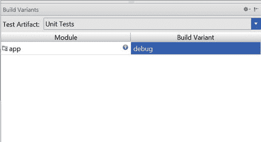

# 一、简介

Electronic supplementary material The online version of this chapter (doi:[10.​1007/​978-1-4842-9701-8_​1](http://dx.doi.org/10.1007/978-1-4842-9701-8_1)) contains supplementary material, which is available to authorized users.

一段时间以来，敏捷开发一直是 Android 开发者的问题。已经有很多测试用户界面(UI)的方法，比如 Robotium 或 Monkey Runner，但是在 Android Studio 1.1 之前，单元测试很难使用，很难配置，并且在 Android 平台上实现很有挑战性。

毫无疑问，Google 会说在过去你可以使用 JUnit3 风格的单元测试。但是对于任何从事传统 Java 开发的人来说，这是一个戏剧性的倒退。开发人员会不小心使用许多第三方工具拼凑出一个 JUnit4 开发环境。更有可能的是，他们会简单地放弃，因为越来越多的互不兼容的库依赖最终会把他们拖垮。因为对于 Android 开发者来说根本没有工具箱，移动平台上的敏捷开发是不成熟的，让人想起了 21 世纪初的 Java 开发。

谢天谢地，这一切都改变了——Android 现在支持 JUnit4，Android 开发人员现在可以回到单元测试上来了。Android JUnit4 测试世界还处于早期阶段，文档还很少，所以在本书中，我们将展示使用 Android Studio 启动和运行单元测试的实用方法。我们还将看看如何通过其他特定于 UI 的 Android 测试库(如 Espresso)来补充这一点，从而为 Android 开发人员创建一个完整的敏捷测试框架。

## 你好，世界单元测试

在我们继续之前，让我们看一个简单的单元测试。出于演示的目的，我们可以使用 Google Calculator 示例中的 Add 方法，该方法可从 [`https://github.com/googlesamples/android-testing`](https://github.com/googlesamples/android-testing) 获得(参见清单 1-1 )。

Listing 1-1\. Add Method from Google’s Calculator Example

`public double add(double firstOperand, double secondOperand) {`

`return firstOperand + secondOperand;`

`}`

清单 1-2 展示了一个非常简单的单元测试，它测试 Add 方法是否能正确地将两个数相加。

Listing 1-2\. Test Method for Add Method from Calculator Example

`@Test`

`public void calculator_CorrectAdd_ReturnsTrue() {`

`double resultAdd = mCalculator.add(3, 4);`

`assertEquals(7, resultAdd, 0);`

`}`

单元测试使用断言来确保方法提供预期的结果。在这种情况下，我们使用`assertEquals`来查看当 3 加 4 时`Add`方法是否返回 7。如果测试成功，那么我们应该会看到一个积极的或绿色的结果，如果没有，那么我们会在 Android Studio 中看到一个红色的结果。

## 了解使用敏捷方法进行 Android 开发的好处

如果你是敏捷开发的新手，你可能想知道敏捷如何改进开发过程。

最基本的，敏捷的，特别是单元测试，可以帮助你

*   在开发过程的早期发现更多的错误
*   自信地做出更多改变
*   内置回归测试
*   延长代码库的寿命

如果你编写单元测试，并且它们覆盖了你代码的重要部分，那么你将会发现更多的错误。您可以进行简单的修改来整理代码，或者进行更大范围的架构修改，运行您的单元测试，并且，如果它们都通过了，确信您没有引入任何微妙的缺陷。你写的单元测试越多，无论何时你改变代码，你就越能回归测试你的应用。一旦你有了大量的单元测试，那么它就变成了一个回归测试套件，让你有信心去做你不会尝试的事情。

单元测试意味着你不必再抱着“不要管”的心态去编程。您现在可以进行重大更改(更改为新的数据库、更新您的后端应用编程接口(API)、更改为新的材料设计主题等)。)并确信您的应用的行为与您做出更改之前是一样的，因为所有的测试都会执行，没有任何错误。

## 探索 Android 的敏捷测试金字塔

在你的测试套件中，有几种类型的测试是你需要的，以确保你的应用得到充分的测试。您应该对组件或方法级别的功能进行单元测试，对任何后端 RESTful APIs 进行 API 或验收测试，对 Android 活动和一般应用工作流进行 GUI(图形用户界面)测试。

经典的敏捷测试金字塔最早出现在 Mike Cohn 所著的《成功运用敏捷》(Pearson Education，2010)一书中。这是你的应用需要的每种测试的相对数量的一个很好的指南(见图 1-1 )。

图 1-1。

Agile Test Pyramid

## 在 Android 中创建 Hello World 单元测试

在下面的例子中，我们展示了如何在 Android Studio 中创建简单的单元测试示例。假设在计算器 Android 应用中添加两个数字工作正常，这应该返回 true。

若要设置和运行单元测试，您需要执行以下任务:

*   先决条件:Gradle 版本 1.1.x 的 Android 插件
*   创建`src/test/java`文件夹
*   在`build.gradle` (app)文件中添加 JUnit:4:12 依赖
*   在构建变体中选择单元测试的测试工件
*   创建单元测试
*   右键单击测试运行测试

点击文件➤项目结构，并确保 Android 插件版本高于 1.1。在图 1-2 中，Android 插件版本是 1.2.3，所以我们准备好了。

Figure 1-2.

接下来我们需要为我们的单元测试代码创建`src/test/java`文件夹。目前，这似乎是硬编码到这个目录。所以切换到项目视图来查看文件结构并创建文件夹(见图 1-3 )。或者，在 Windows 中使用文件资源管理器创建文件夹，或者在 Mac 上使用终端窗口中的命令行进行更改。当你回到 Android Studio 中的 Android 视图时，如果文件夹没有显示出来，也不用担心。当我们在“构建变体”窗口中切换到单元测试时，它们就会显示出来。

图 1-3。

Change to Project view

将`junit`库添加到`build.gradle` (app)文件的依赖项部分，如图 1-4 所示。

图 1-4。

Modify the build.gradle file

在构建变体中选择单元测试测试工件，并使用调试构建(参见图 1-5 )。当你在应用的 Android 视图中时，测试代码目录现在也应该出现了。

图 1-5。

Choose Unit Tests in Build Variant

为我们的简单示例创建单元测试代码。我们需要导入`org.junit.Before`，这样我们就可以创建一个`Calculator`对象。我们需要导入`org.junit.Test`来告诉 Android Studio 我们正在进行单元测试。由于我们要做一个`assertEquals`，我们还需要导入`org.junit.Assert.assertEquals`(参见清单 1-3 )。

Listing 1-3\. Unit Test Code

`package` `com.riis.calculatoradd;`

`import` `org.junit.Before;`

`import` `org.junit.Test;`

`import static` `org.junit.Assert.assertEquals;`

`public class` `CalculatorTest {`

`private``Calculator``mCalculator`

`@Before`

`public void` `setUp() {`

`mCalculator``=``new`

`}`

`@Test`

`public void` `calculator_CorrectAdd_ReturnsTrue() {`

`double``resultAdd =``mCalculator`

`assertEquals("adding 3 + 4 didn’t work this time", 7, resultAdd, 0);`

`}`

`}`

右键单击`CalculatorTest` java 文件并选择 Run‘calculator test’来运行测试(参见图 1-6 )。

图 1-6。

Running the unit test

您可以在运行窗口中看到测试结果(参见图 1-7 )。您可能还想单击配置齿轮并选择 Show Statistics 来查看测试需要多长时间。

图 1-7。

Test results

如果测试成功，它们显示为绿色，任何产生错误的都显示为红色。在您继续任何编码之前，您的所有测试都应该是绿色的。

## GUI 测试

单元测试的真正美妙之处在于，你不需要仿真器或物理设备来进行测试。但是，如果我们回头看看我们的敏捷测试金字塔(图 1-1 ，我们知道我们将需要一些 GUI 测试。请记住，GUI 测试是对活动的测试，而单元测试是对代码中个别方法的测试。我们不需要像单元测试那样多的 GUI 测试，但是我们仍然需要测试每一个活动，包括快乐的路径和不快乐的路径。

当谈到测试 GUI 时，我们有几个框架可供选择:我们可以使用 Android JUnit3 框架、Google 的 Espresso、UIAutomator、Robotium 或一些黄瓜类型的 Android 框架，如 Calabash。在本书中，我们将使用谷歌的 Espresso，因为它快速而容易设置，并且它也支持 Gradle 和 Android Studio。但是你的作者在过去使用过其他的框架，它们都有它们的好处。

Espresso 有三个组件:视图匹配器、视图操作和视图断言。ViewMatchers 用于查找视图，ViewActions 允许您对视图做一些事情，ViewAssertions 类似于单元测试断言——它们允许您断言视图中的值是否是您所期望的。

清单 1-4 展示了一个简单的 Espresso GUI 测试示例。我们再次添加两个数字，但是这一次我们是通过与 GUI 交互来完成的，而不是调用底层方法。

Listing 1-4\. Adding Two Numbers Using Espresso

`public void` `testCalculatorAdd() {`

`onView(withId(R.id.``operand_one_edit_text``)).perform(typeText(``THREE`

`onView(withId(R.id.``operand_two_edit_text``)).perform(typeText(``FOUR`

`onView(withId(R.id.``operation_add_btn`

`onView(withId(R.id.``operation_result_text_view``)).check(matches(withText(``RESULT`

`}`

在这个例子中，`withId(R.id.operand_one_edit_text)`是代码中的一个视图匹配器，而`perform(typeText(THREE)`是一个 ViewAction。最后`check(matches(withText(RESULT))`是 ViewAssertion。

## 创建 Hello，World GUI 测试

这次我们将展示如何在 Android Studio 中创建简单的 GUI 测试示例。与单元测试一样，假设计算器 Android 应用中的两个数字相加正常，那么这个测试应该返回 true。

要设置和运行 GUI 测试，您需要执行以下任务:

*   先决条件:安装 Android 支持库
*   将测试类放在`src/androidTest/java`文件夹中
*   在`build.gradle` (app)文件中添加 Espresso 依赖
*   在构建变体中选择 Android 测试工具测试工件
*   创建 GUI 测试
*   右键单击测试运行测试

点击工具➤安卓➤ SDK 管理器，点击 SDK 工具选项卡，确保安装了安卓支持库(见图 1-8 )。

图 1-8。

Android SDK Manager

默认情况下，当您使用项目向导创建项目时，Android Studio 会创建一个`src/androidTest/java`文件夹，因此您不必创建任何新目录。如果你看不到它，那么检查构建变体窗口中的测试工件是否被设置为 Android Instrumentation Tests(参见图 1-9 )。

图 1-9。

Build Variant test artifacts

将下面的 Espresso 库(参见清单 1-5 )添加到依赖部分的`build.gradle` (app)文件中，然后单击立即同步链接。打开 Gradle 控制台，因为这可能需要一两分钟的时间。

Listing 1-5\. Espresso Libraries

`dependencies {`

`androidTestCompile` `’com.android.support.test:testing-support-lib:0.1’`

`androidTestCompile` `’com.android.support.test.espresso:espresso-core:2.0’`

`}`

清单 1-6 中的代码展示了我们如何设置和运行 GUI 测试来添加 3 + 4，以及我们如何断言这是 7.0。为了测试 Android 活动，我们需要用`ActivityInstrumentationTestCase2`类扩展`CalculatorAddTest`。这允许你控制活动。我们在使用`getActivity()`调用的`setUp()`方法中实现了这一点。

Listing 1-6\. Adding Two numbers Using Espresso

`import` `android.test.ActivityInstrumentationTestCase2;`

`import static``android.support.test.espresso.Espresso.``onView`

`import static` `android.support.test.espresso.action.ViewActions.click;`

`import static``android.support.test.espresso.action.ViewActions.``typeText`

`import static``android.support.test.espresso.assertion.ViewAssertions.``matches`

`import static` `android.support.test.espresso.matcher.ViewMatchers.withId;`

`import static` `android.support.test.espresso.matcher.ViewMatchers.withText;`

`public class``CalculatorAddTest``extends`

`public static final` `String` `THREE` `=` `"3"`

`public static final` `String` `FOUR` `=` `"4"`

`public static final` `String` `RESULT` `=` `"7.0"`

`public` `CalculatorAddTest() {`

`super``(CalculatorActivity.``class`

`}`

`@Override`

`protected void``setUp()``throws`

`super` `.setUp();`

`getActivity();`

`}`

`public void` `testCalculatorAdd() {`

`onView``(``withId``(R.id.``operand_one_edit_text``)).perform(``typeText``(``THREE``));`

`onView``(``withId``(R.id.``operand_two_edit_text``)).perform(``typeText``(``FOUR``));`

`onView` `(` `withId` `(R.id.` `operation_add_btn` `)).perform(` `click` `());`

`onView``(``withId``(R.id.``operation_result_text_view``)).check(``matches``(``withText``(``RESULT`

`}`

`}`

在代码中，我们首先连接到 Calculator 活动，然后使用 ViewMatcher 和 ViewActions 将数字 3 和 4 放在正确的文本字段中。代码然后使用 ViewAction 单击 Add 按钮，最后我们使用 ViewAssertion 确保答案是预期的 7.0。请注意，GUI 将结果显示为双精度值，因此它是 7.0，而不是您可能期望的 7(参见图 1-10 )。

图 1-10。

Calculator app

图 1-11 显示了结果。在这种情况下，它们看起来非常类似于单元测试中的那些，但是模拟器需要更长的时间来启动。

图 1-11。

Espresso results

## 摘要

在这一章中，我们看了 Android 平台上单元测试和 GUI 测试的当前状态。在本书的其余部分，我们将更详细地探讨敏捷测试，这样你就可以看到如何将这些技术应用到你的应用中，以产生更干净、更快、缺陷更少的代码。