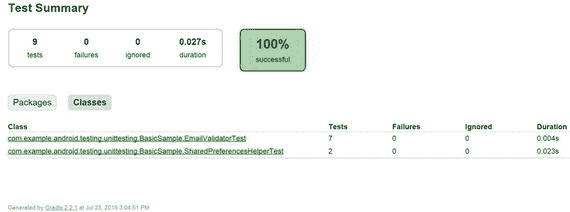
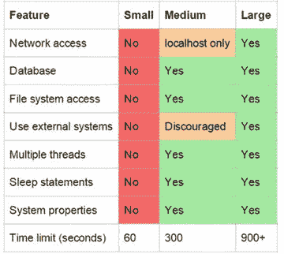
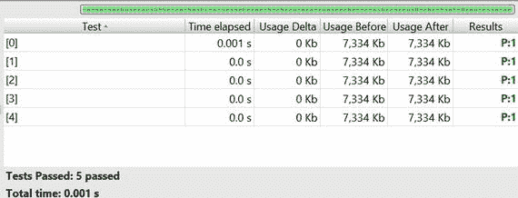

# 二、Android 单元测试

Electronic supplementary material The online version of this chapter (doi:[10.​1007/​978-1-4842-9701-8_​2](http://dx.doi.org/10.1007/978-1-4842-9701-8_2)) contains supplementary material, which is available to authorized users.

在 Android Studio 整合 JUnit4 之前，Google 的实现是标准和特定于 Android 的单元测试的奇怪混合。JUnit4 的当前版本是 JUnit 标准的一个更加普通的实现(更多信息请参见 [`http://junit.org`](http://junit.org/) ，源代码请参见 [`https://github.com/junit-team/junit`](https://github.com/junit-team/junit) )。我们在 build.gradle 文件中加载的 JUnit 的当前推荐版本是 4.12

## Android 断言

在我们的 Hello，World 示例中，我们使用了`assertEquals`断言，但是在 JUnit 4.12 中我们也可以使用其他断言(参见表 2-1 )。

表 2-1。

Assertions

<colgroup><col> <col></colgroup> 
| 主张 | 描述 |
| --- | --- |
| `assertEquals` | 测试两个值是否相同 |
| `assertTrue` | 测试布尔条件为真 |
| `assertFalse` | 测试布尔条件为假 |
| `assertNull` | 检查对象是否为空 |
| `assertNotNull` | 检查对象是否不为空 |
| `assertSame` | 测试两个值是否引用同一个对象引用 |
| `assertNotSame` | 测试两个值是否不引用同一个对象引用 |
| `assertThat` | 测试第一个值(对象)是否匹配第二个值(或匹配器) |
| `fail` | 测试应该总是失败 |

如果您添加了 Hamcrest、AssertJ 或任何其他断言库，还可以使用许多其他断言。但是现在让我们从基本的 JUnit 断言开始。

`assertTrue`和`assertFalse`用于检查布尔条件的值。提供了`assertFalse`而不是`assertTrue(!somethingYouExpectToReturnFalse)`(例如`assertTrue (5 < 6)`和`assertFalse (5>6)`)。

`assertNull`和`assertNotNull`检查对象是否为空(如`assertNull(Calculator)`或`assertNotNull(Calculator)`)。

`assertSame`和`assertNotSame`检查这两个对象是对`assertSame`的同一个对象的引用还是对`assertNotSame`的同一个对象的引用。这与 equals 不同，equals 比较两个对象的值，而不是对象本身。

assertThat 可以像`assertEquals`一样使用，我们现在可以说`assertThat(is(7), mCalculator.add(3, 4))`，而不是说`assertEquals(7, mCalculator.add(3,4), 0)`。

失败仅仅是一个失败的测试，代表那些不应该被触及的代码，或者告诉你“这里有龙”

## 命令行

可以从命令行使用以下命令运行单元测试:`gradlew test --continue.``gradlew`任务运行单元测试，`continue`告诉`gradlew`如果任何单元测试失败，不要停止，这正是我们想要的。

`C:\AndroidStudioProjects\BasicSample>gradlew test --continue`

`Downloading`[`https://services.gradle.org/distributions/gradle-2.2.1-all.zip`](https://services.gradle.org/distributions/gradle-2.2.1-all.zip)

`............................................................................`

`..................................................`

`Unzipping C:\Users\godfrey\.gradle\wrapper\dists\gradle-2.2.1-all\6dibv5rcnnqlfbq9klf8imrndn\gradle-2.2.1-all.zip to C:\Users\godfrey\.gradle\wrapper\dists\gradle-2.2.1-all\6dibv5rcnnqlfbq9klf8imrndn`

`Download`[`https://jcenter.bintray.com/com/google/guava/guava/17.0/guava-17.0.jar`](https://jcenter.bintray.com/com/google/guava/guava/17.0/guava-17.0.jar)

`Download`[`https://jcenter.bintray.com/com/android/tools/lint/lint-api/24.2.3/lint-api-24.2.3.jar`](https://jcenter.bintray.com/com/android/tools/lint/lint-api/24.2.3/lint-api-24.2.3.jar)

`Download`[`https://jcenter.bintray.com/org/ow2/asm/asm-analysis/5.0.3/asm-analysis-5.0.3.jar`](https://jcenter.bintray.com/org/ow2/asm/asm-analysis/5.0.3/asm-analysis-5.0.3.jar)

`Download`[`https://jcenter.bintray.com/com/android/tools/external/lombok/lombok-ast/0.2.3/lombok-ast-0.2.3.jar`](https://jcenter.bintray.com/com/android/tools/external/lombok/lombok-ast/0.2.3/lombok-ast-0.2.3.jar)

`:app:preBuild UP-TO-DATE`

`:app:preDebugBuild UP-TO-DATE`

`:app:checkDebugManifest`

`:app:prepareDebugDependencies`

`:app:compileDebugAidl`

`:app:compileDebugRenderscript`

`.`

`.`

`.`

`:app:compileReleaseUnitTestSources`

`:app:assembleReleaseUnitTest`

`:app:testRelease`

`:app:test`

`BUILD SUCCESSFUL`

`Total time: 3 mins 57.013 secs`

您可能希望从命令行运行您的测试，尤其是第一次运行单元测试时，使用`gradlew test --continue`命令以便您可以看到发生了什么，或者打开 Android Studio 中的 gradle 控制台。否则你可能会奇怪为什么 Android Studio 下载了运行单元测试所需的所有文件却什么也没发生。

如果您使用持续集成构建工具，如 Jenkins，命令行测试执行也非常有用。

## JUnit 选项

JUnit4 有以下注释

*   `@Before`
*   `@After`
*   `@Test`
*   `@BeforeClass`
*   `@AfterClass`
*   `@Test(timeout=ms)`

`@Test`用于注释所有的测试方法(见清单 2-1 ，没有它，方法将不能作为测试运行。`@Test(timeout=ms)`是标准标注上的一点小皱纹；如果测试花费的时间超过了以毫秒为单位定义的超时时间，它只是说放弃。

Listing 2-1\. @Test Method

`@Test`

`public void calculator_CorrectSub_ReturnsTrue() {`

`assertEquals(1, mCalculator.sub(4, 3),0);`

`}`

`@Before`和`@After`用于您需要的任何设置和拆卸功能。例如，`@Before`可以包含代码来写入日志文件，或者创建测试中使用的对象，或者打开数据库，然后用测试数据播种数据库。`@After`通常用于撤销任何这些`@Before`变更，比如删除数据库中的测试行，等等(参见清单 2-2 )。

Listing 2-2\. @Before and @After Annotations

`public class CalculatorTest {`

`private Calculator mCalculator;`

`@Before`

`public void setUp() {`

`mCalculator = new Calculator();`

`}`

`@Test`

`public void calculator_CorrectAdd_ReturnsTrue() {`

`assertEquals(7, mCalculator.add(3, 4),0);`

`}`

`@Test`

`public void calculator_CorrectSub_ReturnsTrue() {`

`assertEquals(1, mCalculator.sub(4, 3),0);`

`}`

`@Test`

`public void calculator_CorrectMul_ReturnsTrue() {`

`assertEquals(12, mCalculator.mul(3, 4),0);`

`}`

`@Test`

`public void calculator_CorrectDiv_ReturnsTrue() {`

`assertEquals(3, mCalculator.div(12, 4),0);`

`}`

`@After`

`public void tearDown() {`

`mCalculator = null;`

`}`

`}`

`@Before`和`@After`在每次测试前被调用，但是如果你想在所有测试前和所有测试后分别改变一次设置，那么你应该使用`@BeforeClass`和`@AfterClass`。`setUp`方法现在是`setUpBeforeClass`而不是`setUpBeforeTest`。在我们下面的`@BeforeClass`示例中，`setUp`和`tearDown`方法现在被声明为公共静态。`Calculator`被定义为静态的(参见清单 2-3 ，所以现在只有一个`Calculator`的实例，而不是每个测试一个。

Listing 2-3\. Using @BeforeClass Annotation Instead of @Before

`private static Calculator mCalculator;`

`@BeforeClass`

`public static void setUp() {`

`mCalculator = new Calculator();`

`}`

## HTML 输出

JUnit 在`<path_to_your_project>/app/build/test-results/debug`目录中输出 HTML 和 XML 风格的报告。当您试图准确跟踪一个或多个类何时开始失败，或者某个包或类比其他包或类更容易失败时，这些报告主要用作参考(见图 2-1 )。

图 2-1。

HTML reporting

如果您需要将结果导入到另一个工具中，同一目录中还有一个 XML 输出。

## 分组测试

随着你的单元测试的增长，根据它们需要的时间将它们分成小型、中型或大型测试并不是一个坏主意。当您编码时，编写和执行单元测试应该非常快，但是可能有更全面的测试，您可能希望每天运行一次或者在构建被签入时运行。

图 2-2 摘自一个旧的谷歌测试博客(见 [`http://googletesting.blogspot.com/2010/12/test-sizes.html`](http://googletesting.blogspot.com/2010/12/test-sizes.html) )，它很好地展示了什么时候你应该将你的测试分成中型或大型测试，这样它们就不会减慢开发过程。

图 2-2。

Grouping unit tests into categories

小型测试将是普通的基于方法的单元测试，带有模拟的数据库或网络访问(稍后将详细介绍)。因为 Espresso 测试需要模拟器或设备来运行，所以它们会自动被视为中型或大型测试。

清单 2-4 展示了用必要的`import`语句标注测试是小型还是中型的正常方式。

Listing 2-4\. Classic Unit Testing Grouping

导入 Android . test . suite builder . annotation . small test`;`

导入 Android . test . suite builder . annotation . medium test`;`

`@SmallTest`

`public void calculator_CorrectAdd_ReturnsTrue() {`

`assertEquals(mCalculator.add(3, 4),7,0);`

`}`

`@SmallTest`

`public void calculator_CorrectSub_ReturnsTrue() {`

`assertEquals(mCalculator.sub(4, 3),1,0);`

`}`

`@MediumTest`

`public void calculator_CorrectMul_ReturnsTrue() {`

`assertEquals(mCalculator.mul(3, 4),12,0);`

`}`

`@MediumTest`

`public void calculator_CorrectDiv_ReturnsTrue() {`

`assertEquals(mCalculator.div(12, 4),3,0);`

`}`

## 参数化测试

如果我们想测试我们的计算器，我们将不得不做更多的测试，而不仅仅是数字 3 和 4 的加、减、乘、除组合。清单 2-5 还有一些测试，让我们对我们的实现更有信心。运行测试，他们都通过了。

Listing 2-5\. Adding More Test Conditions

`@Test`

`public void` `calculator_CorrectAdd_ReturnsTrue() {`

`assertEquals``(7,``mCalculator`

`assertEquals``(7,``mCalculator`

`assertEquals``(10,``mCalculator`

`assertEquals``(3,``mCalculator`

`assertEquals``(3260,``mCalculator`

`}`

如果你正在编写单元测试，我猜你总是在寻找编写更好代码的方法，你会认为清单 2-5 中的代码很糟糕。所有那些硬编码看起来都不对，即使是测试代码。我们可以使用 JUnit 的参数化测试来解决这个问题。

重构代码以添加参数化测试，如下所示:

*   在类的顶部添加`@RunWith(Parameterized.class)`,告诉编译器我们正在使用参数进行测试
*   添加`import`语句，`import static org.junit.runners.Parameterized.Parameters;`
*   创建您的测试参数集合，在本例中是`operandOne`、`operandTwo`和`expectedResult`
*   添加该类的构造函数
*   使用这些参数来支持您的测试

清单 2-6 显示了完整的代码。为了简单起见，我们将代码转换为只处理整数。

Listing 2-6\. Paramaterized Testing Example

`import` `org.junit.Before;`

`import` `org.junit.Test;`

`import` `org.junit.runner.RunWith;`

`import` `org.junit.runners.Parameterized;`

`import` `java.util.Arrays;`

`import` `java.util.Collection;`

`import static` `org.junit.Assert.assertEquals;`

`import static` `org.junit.runners.Parameterized.Parameters;`

`@RunWith(Parameterized.``class`

`public class` `CalculatorParamTest {`

`private int mOperandOne` `;`

`private int mOperandTwo` `;`

`private int mExpectedResult` `;`

`private``Calculator``mCalculator`

`/* Array of tests */`

`@Parameters`

`public static` `Collection<Object[]> data() {`

`return` `Arrays.` `asList` `(` `new`

`{3, 4, 7},`

`{4, 3, 7},`

`{8, 2, 10},`

`{-1, 4, 3},`

`{3256, 4, 3260}`

`});`

`}`

`/* Constructor */`

`public` `CalculatorParamTest(` `int` `mOperandOne,` `int` `mOperandTwo,` `int` `mExpectedResult) {`

`this``.``mOperandOne`

`this``.``mOperandTwo`

`this``.``mExpectedResult`

`}`

`@Before`

`public void` `setUp() {`

`mCalculator``=``new`

`}`

`@Test`

`public void` `testAdd_TwoNumbers() {`

`int` `resultAdd =` `mCalculator` `.add(` `mOperandOne` `,` `mOperandTwo` `);`

`assertEquals(resultAdd,``mExpectedResult`

`}`

`}`

当代码运行时，我们在统计框架中得到以下结果(参见图 2-3 )。

图 2-3。

Parameterized test results

## 摘要

在这一章中，我们更详细地研究了单元测试。在下一章中，我们将会看到一些你想要添加到你的单元测试工具带上的第三方工具。在本书的后面，我们将回到单元测试，展示如何在 TDD(测试驱动开发)环境中编写单元测试。