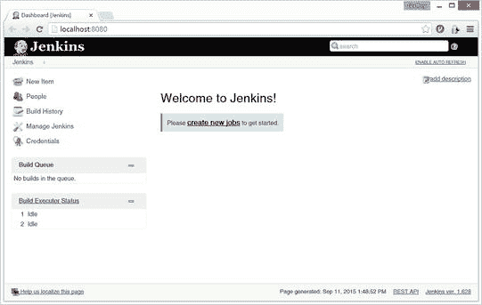

# 三、第三方工具

Electronic supplementary material The online version of this chapter (doi:[10.​1007/​978-1-4842-9701-8_​3](http://dx.doi.org/10.1007/978-1-4842-9701-8_3)) contains supplementary material, which is available to authorized users.

JUnit 本身可能就是您所需要的，但是您可以将许多优秀的第三方工具附加到 JUnit 上，让您的 Android 测试大放异彩。

在本章中，我们将了解以下工具:

*   Hamcrest 寻找更好的断言
*   这样我们可以测量我们的 JUnit 代码覆盖率
*   这样我们就可以将单元测试集中在代码上
*   这样我们就可以测试我们的机器人活动
*   Jenkins 让我们的测试自动化

## 哈姆克雷斯特断言

除了简单的 Hello，World-type 应用可能还需要比 JUnit 4.x 更好的断言。它还提供了更多的灵活性，允许您现在包括范围，而不仅仅是单个值。正如 Hamcrest 文档所说，Hamcrest 允许您创建“可以组合起来创建灵活的意图表达的匹配器”表 3-1 列出了大多数可用的 Hamcrest 断言，您也可以编写自己的断言。

表 3-1。

Hamcrest Assertions

<colgroup><col> <col></colgroup> 
| 包裹 | 断言 |
| --- | --- |
| 核心匹配者 | `allOf, any, anyOf, anything, array, both, containsString, describedAs, either, endsWith, equalTo, everyItem, hasItem, hasItems, instanceOf, is, isA, not, notNullValue, nullValue, sameInstance, startsWith, theInstance` |
| 匹配项 | `allOf, any, anyOf, anything, array, arrayContaining, arrayContainingInAnyOrder, arrayWithSize, both, closeTo, comparesEqualTo, contains, containsInAnyOrder, containsString, describedAs, either, empty, emptyArray, emptyCollectionOf, emptyIterable, emptyIterableOf, endsWith, equalTo, equalToIgnoringCase, equaltToIgnoringWhiteSpace, eventFrom, everyItem, greaterThan, greaterThanOrEqualTo, hasItem, hasItemInArray, hasItems, hasKey, hasProperty, hasSize, hasToString, hasValue, hasXPath, instanceOf, is, isA,isEmptyOrNullString, isIn, isOneOf, iterableWithSize, lessThan, lessThanOrEqualTo, not, notNullValue, nullValue, sameInstance, samePropertyValueAs, startsWith, stringContainsInOrder, theInstance, typeCompatibleWith` |
| 情况 | `and, matched, matching, notMatched, then` |
| 火柴插入 | `assertThat` |

清单 3-1 展示了如何将 Hamcrest 库添加到您的`build.gradle`文件中，以便在您的应用中包含 Hamcrest 功能。记得点击“立即同步”按钮。

Listing 3-1\. Adding Hamcrest Library Dependency

`dependencies {`

`testCompile ’junit:junit:4.12’`

`testCompile ’org.hamcrest:hamcrest-library:1.3’`

`}`

现在我们重构我们的测试，让它们读起来更像英语(见清单 3-2 )。

Listing 3-2\. Hamcrest Assertions

`@Test`

`public void calculator_CorrectHamAdd_ReturnsTrue() {`

`assertThat("Calculator cannot add 3 plus 4", is(7), mCalculator.add(3, 4));`

`}`

我们还可以使用`greaterThan`和`LessThan`断言向我们的测试添加范围(参见清单 3-3 )。

Listing 3-3\. greaterThan and lessThan

`public void calculator_CorrectHamAdd_ReturnsTrue() {`

`assertThat("Greater than failed", greaterThan(6), mCalculator.add(3, 4));`

`assertThat("Less than failed", lessThan(8), mCalculator.add(3, 4));`

`}`

或者，我们可以使用`both`命令将两者结合起来(参见清单 3-4 )。

Listing 3-4\. Using the both Matcher

`@Test`

`public void calculator_CorrectHamAdd_ReturnsTrue() {`

`assertThat("Number is out of range", both(greaterThan(6)).and(lessThan(8)), mCalculator.add(3, 4),);`

`}`

我们只是触及了 matchers 的皮毛，但毫无疑问，您可以看到 Hamcrest 可以让我们的测试变得多么强大。

## 杰柯

单元测试需要某种形式的代码覆盖来找到代码中任何未测试的部分。代码覆盖工具输出代码度量报告和带注释的代码，以显示哪些代码已经过单元测试(绿色)，哪些没有被单元测试覆盖(红色)。图 3-1 显示了取自`eclemma.org`网站的 JaCoCo 的代码覆盖率数据。

图 3-1。

Code coverage example

代码覆盖率度量测量了多少源代码已经过单元测试。就我个人而言，我不太相信在 Android 项目中有一个代码覆盖度量目标；它应该作为一个指南，而不是一个强制性的要求。然而，如果一个项目只有 5%的代码覆盖率，那么你就不是在真正地进行单元测试，而只是口头上支持这项技术。

Android Studio 将调用 JaCoCo 来完成单元测试的代码覆盖报告，但是您需要执行以下任务:

*   在`build.gradle`文件中设置`testCoverageEnabled`为真
*   将代码覆盖率运行器更改为 JaCoCo
*   使用代码覆盖率运行单元测试
*   查看代码覆盖率

要在 Android 项目中包含代码覆盖率，在`build.gradle`文件中的调试`buildTypes`中将`testCoverageEnabled`设置为 true(参见清单 3-5 ，并在做出更改后点击 Sync now。

Listing 3-5\. build.gradle JaCoCo Changes

`buildTypes {`

`debug {`

`testCoverageEnabled true`

`}`

`}`

要编辑配置，转到运行➤编辑配置(见图 3-2 )。

图 3-2。

Choose Edit Configurations

点击 Code Coverage 选项卡，并将 coverage runner 更改为 JaCoCo(参见图 3-3 )。

图 3-3。

Changing coverage runner

通过右键单击方法并选择 Run CalculatorTest with Coverage 来运行测试(参见图 3-4 )。

图 3-4。

Run Calculator Test with Coverage

代码覆盖率报告显示在覆盖率选项卡中(见图 3-5 ，在这里你可以看到我们的`Calculator`方法有 50%的代码覆盖率。

图 3-5。

Code coverage tests

方法中显示了红色/绿色的代码覆盖率，尽管可能很难看到(参见图 3-6 )。Android Studio 中的代码覆盖集成是新的。毫无疑问，在未来的版本中会更容易看到红/绿覆盖。

图 3-6。

Code coverage

## 莫基托

在第二章的“分组测试”部分，我们讨论了小型、中型和大型测试。实际上，单元测试应该总是小测试。但是如果我们进行网络连接或者从文件系统或数据库中读取数据，那么根据定义，我们不是在执行小单元测试。我们还假设第三方 web 服务或数据库可能不会在我们每次运行测试时运行。因此，最坏的情况是，我们的测试将会失败，但原因是错误的(例如，网络中断)。我们使用模仿框架来模仿任何与外部资源对话的代码，并将我们所有的单元测试返回给更小的团队。Mockito 与 Android Studio 配合得非常好，所以我们将在本章和后续章节中使用该工具。

清单 3-6 展示了如何通过包含 testCompile `’org.mockito:mockito-core:1.10.19’`库来将 Mockito 库添加到您的`build.gradle`文件中。再次记住，完成后点击“立即同步”链接。

Listing 3-6\. Adding Mockito Library

`dependencies {`

`testCompile ’junit:junit:4.12’`

`testCompile ’org.hamcrest:hamcrest-library:1.3’`

`testCompile ’org.mockito:mockito-core:1.10.19’`

`}`

谷歌的 Android 样本有一个名为 NetworkConnect 的网络应用，你可以在 [`https://github.com/googlesamples/android-NetworkConnect`](https://github.com/googlesamples/android-NetworkConnect) 找到它。图 3-7 显示了返回谷歌网页 HTML 的应用的基本功能。

图 3-7。

NetworkConnect app

在模拟代码之前，我们需要将网络访问代码剪切并粘贴到它自己的类中(参见清单 3-7 ，我们称之为`DownloadUrl`)。

Listing 3-7\. DownloadUrl Code

`public class DownloadUrl {`

`public String loadFromNetwork(String urlString) throws IOException {`

`InputStream stream = null;`

`String str ="";`

`try {`

`stream = downloadUrl(urlString);`

`str = readIt(stream, 88);`

`} finally {`

`if (stream != null) {`

`stream.close();`

`}`

`}`

`return str;`

`}`

`public InputStream downloadUrl(String urlString) throws IOException {`

`URL url = new URL(urlString);`

`HttpURLConnection conn = (HttpURLConnection) url.openConnection();`

`conn.setReadTimeout(10000 /* milliseconds */);`

`conn.setConnectTimeout(15000 /* milliseconds */);`

`conn.setRequestMethod("GET");`

`conn.setDoInput(true);`

`conn.connect();`

`InputStream stream = conn.getInputStream();`

`return stream;`

`}`

`public String readIt(InputStream stream, int len) throws IOException, UnsupportedEncodingException {`

`Reader reader = null;`

`reader = new InputStreamReader(stream, "UTF-8");`

`char[] buffer = new char[len];`

`reader.read(buffer);`

`return new String(buffer);`

`}`

`}`

`MainActivity`现在如下调用`DownloadUrl`(参见清单 3-8 )。

Listing 3-8\. Updated NetworkConnect MainActivity Code

`private class DownloadTask extends AsyncTask<String, Void, String> {`

`DownloadUrl htmlStr = new DownloadUrl();`

`@Override`

`protected String doInBackground(String… urls) {`

`try {`

`return htmlStr.loadFromNetwork(urls[0]);`

`} catch (IOException e) {`

`return getString(R.string.connection_error);`

`}`

`}`

`/**`

`* Uses the logging framework to display the output of the fetch`

`* operation in the log fragment.`

`*/`

`@Override`

`protected void onPostExecute(String result) {`

`Log.i(TAG, result);`

`}`

`}`

我们现在可以编写一个单元测试，看看`DownloadUrl`代码是否在我们的单元测试中返回 HTML(参见清单 3-9 )。

Listing 3-9\. Network Connect Unit Test

`public class DownloadUrlTest {`

`DownloadUrl tDownloadUrl;`

`String htmlStr;`

`@Before`

`public void setUp() {`

`try {`

`htmlStr = tDownloadUrl.loadFromNetwork("`[`http://www.google.com`](http://www.google.com/)

`} catch (IOException e) {`

`// network error`

`}`

`}`

`@Test`

`public void downloadUrlTest_ReturnsTrue() {`

`assertThat(htmlStr,containsString("doctype"));`

`}`

`}`

因为我们正在进行网络调用，所以我们应该使用 Mockito 模拟网络访问。对于这个例子，我们只需要做几件事来模拟 web 服务器调用。首先模拟这个类，这样 Mockito 就知道它需要替换什么功能。接下来，告诉 Mockito 当使用`Mockito.when().thenReturn()`格式调用您正在测试的方法时要返回什么，格式如下:`Mockito.when(tDownloadUrl.loadFromNetwork("` [`http://www.google.com`](http://www.google.com) ")。然后回车("<！doctype `html><html itemscope=\"\" itemtype=\"` [`http://schema.org/WebPage\`](http://schema.org/WebPage%5c) `" lang=\"en\"><head>");`。

现在，当进行`loadFromNetwork`调用时，它将返回我们的部分网页，而不是 [`www.google.com`](http://www.google.com/) 网页的实际 HTML(参见清单 3-10 )。您可以通过打开和关闭网络访问来测试这一点。

Listing 3-10\. Mocked Network Access

`@RunWith(MockitoJUnitRunner.class)`

`public class DownloadUrlTest {`

`public DownloadUrl tDownloadUrl = Mockito.mock(DownloadUrl.class);`

`@Before`

`public void setUp() {`

`try {`

`Mockito.when(tDownloadUrl.loadFromNetwork("` `http://www.google.com`”)。然后返回("/root > `html><html itemscope=\"\" itemtype=\"` [`http://schema.org/WebPage\`](http://schema.org/WebPage%5c) `" lang=\"en\"><head>");`

`} catch (IOException e) {`

`// network error`

`}`

`}`

`@Test`

`public void downloadUrlTest_ReturnsTrue() {`

`try {`

`assertThat(tDownloadUrl.loadFromNetwork("`[`http://www.google.com`](http://www.google.com)

`} catch (IOException e) {`

`//`

`}`

`}`

`}`

我们将在下一章回到 Mockito，并向您展示如何模拟数据库和共享首选项访问，以及如何使用其他工具来扩展 Mockito 功能，以帮助分离或分离您的代码。

## 机器人电器

除非测试安卓活动，否则无法测试安卓应用。你可以使用像 Mockito 和 JUnit 这样的工具来测试它，但是如果你不测试它的活动，你就错过了应用的一个关键元素。如果你不测试这些活动向你的用户显示了什么，你就不能确定你的应用显示了正确的信息。使用模拟器测试框架，如 Espresso 或葫芦，这相对容易。但是，如果我们使用 Robolectric，我们也可以在没有仿真器的情况下测试它。

要安装 Robolectric 3.0，请将以下依赖项添加到 build.gradle 文件中(参见清单 3-11 )。

Listing 3-11\. Adding Robolectric Library Dependency

`dependencies {`

`testCompile ’junit:junit:4.12’`

`testCompile ’org.robolectric:robolectric:3.0’`

`}`

您还需要对您的应用配置进行更改。转到运行-编辑配置，如果你在 Mac 或 Linux 上运行，然后将工作目录更改为`$MODULE_DIR$`，或者如果你在 Windows 机器上运行，在工作目录的末尾添加一个`\app`(参见图 3-8 )。

图 3-8。

Robolectric Working Directory fix

清单 3-12 显示了一个使用 Robolectric 测试 Hello World 显示在`MainActivity`上的单元测试。请注意将目标 SDK 设置为 API 21 并告诉 Robolectric 在哪里可以找到`AndroidManifest.xml`文件的配置信息。

Listing 3-12\. Robolectric Hello World

`@RunWith(RobolectricGradleTestRunner.class)`

`@Config(constants = BuildConfig.class, sdk = 21, manifest = "src/main/AndroidManifest.xml")`

`public class RobolectricUnitTest {`

`@Test`

`public void shouldHaveHappySmiles() throws Exception {`

`String hello = new MainActivity().getResources().getString(R.string.hello_world);`

`assertThat(hello, equalTo("Hello world!"));`

`}`

`}`

以与运行单元测试相同的方式运行测试，方法是右键单击测试类名并选择“运行 RobolectricTest”。不需要仿真器就可以通过测试。相对而言，Robolectric 测试比 JUnit4 测试耗时更长，但仍比模拟器测试快得多。

图 3-9。

Robolectric Hello World test passes

## 詹金斯

转向敏捷过程会产生相当大的开销。令人欣慰的是，我们不再需要担心模拟器花这么长时间来启动普通的 JUnit 测试。现在需要几秒钟而不是几分钟。然而，随着应用的增长，相应的单元测试数量也在增长，最终手动运行测试将需要时间。正确构建和测试应用的步骤也将开始变得更加复杂。由于人类不擅长繁琐的多步骤过程，因此使用持续集成(CI)服务器来尽可能地自动化该过程以减少任何不必要的测试错误是有意义的。

出于我们的目的，我们将使用 Jenkins，因为它有如此多的可用插件。但是，如果您更熟悉这些 CI 环境，还有许多其他选项，如 Travis、TeamCity 或 Bamboo，也可以同样很好地工作。

### 安装

从 [`http://jenkins-ci.org/`](http://jenkins-ci.org/) 下载 Jenkins 服务器。安装并转到`http://localhost:8080`，你应该会看到如图 3-10 所示的屏幕。

图 3-10。

Jenkins start-up screen

### 配置 Jenkins

为了让它在我们的 Android 环境中有用，我们需要添加一些插件。点击管理詹金斯➤管理插件(见图 3-10 )，搜索并添加 Gradle 和 GIT 插件或您使用的任何其他源代码管理系统。当你完成后，你安装的插件屏幕应该看起来如图 3-11 所示。

图 3-11。

Installed plug-ins

接下来我们需要配置 Jenkins，这样它就知道你在哪里安装了 Android。点击管理詹金斯➤配置系统，向下滚动到全局属性，点击环境变量复选框，输入安装 Android 的目录`ANDROID_HOME`(见图 3-12 )。

图 3-12。

Setting Environment variables

### 创建自动化作业

现在我们已经配置了 Jenkins，我们需要创建我们的第一个自动化作业。返回仪表板，点击创建新工作(图 3-10 )。输入您的项目名称并选择自由式项目(参见图 3-13 )。

图 3-13。

Creating a new item

我们需要告诉詹金斯哪里能找到密码。在这个例子中，我们使用 Git 作为我们的源代码管理系统。这里我们再次使用 Google NetworkConnect 示例。输入 Git 存储库 URL。因为是公开回购，没有凭证，所以我们要跳过这一步。也只有一个分支，所以我们可以把分支说明符留为`master`(见图 3-14 )。

图 3-14。

Enter Network Connect repository details

向下滚动到构建部分并选择调用 Gradle 脚本(参见图 3-15 )。

图 3-15。

Invoke Gradle script

在构建步骤中，选择使用 Gradle Wrapper，选中使 gradlew 可执行并从根构建脚本目录。在开关部分输入`--refresh-dependencies`和`--profile`。在这种情况下，在 Tasks 部分输入 assemble。点击保存(见图 3-16 )。

图 3-16。

Configure the Build

现在我们已经准备好构建我们的应用了。点击项目页面上的立即构建(见图 3-17 )。

图 3-17。

Project page

一旦构建开始，您将看到一个进度指示器，以了解您的任务进展如何。如果你想知道发生了什么，点击构件号(见图 3-18 )。

图 3-18。

View Build progress

现在点击控制台输出，你可以看到发生了什么，就像你从命令行运行应用一样(见图 3-19 )。

图 3-19。

Click Console Output

在我们的示例中，没有错误，构建成功(参见图 3-20 )。如果不是这种情况，那么控制台输出页面对于查看失败的原因非常有帮助。

图 3-20。

Console Output

我们将在本书的后面使用 Jenkins 来自动化我们的 JUnit 和 Espresso 测试。

## 摘要

在这一章中，我们已经看到了一些工具，我们将在整本书中使用它们来使我们的测试更加有效和高效。在最近的过去，让这个堆栈运行起来是一件非常令人沮丧的任务，但幸运的是，现在不再是这样了。