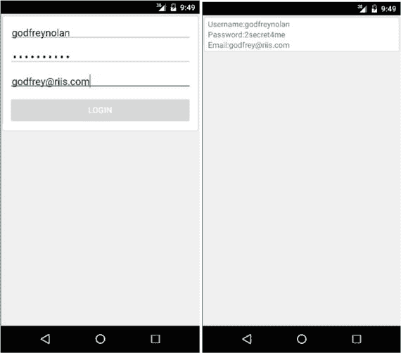
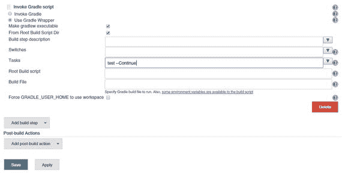

# 四、模拟

Electronic supplementary material The online version of this chapter (doi:[10.​1007/​978-1-4842-9701-8_​4](http://dx.doi.org/10.1007/978-1-4842-9701-8_4)) contains supplementary material, which is available to authorized users.

无论是否在 Android 平台上，主要目标之一是隔离我们正在测试的代码。当我们编写测试时，我们希望测试特定类的方法，而不与应用中的其他类或任何外部元素(如 web 服务)进行任何相关的交互。我们应该测试一个单独的方法，而不是它的依赖项，并且这个方法应该是测试覆盖的唯一代码，其他的都被模拟了。

模拟这些第三方交互是一种很好的方式，可以帮助我们在方法周围设置围栏，这样我们在进行测试时就不依赖于网络或设备的位置或美国或英国时间。测试失败的唯一原因是因为代码有问题，而不是因为外部依赖(如 wifi)不起作用。

但是我们想要使用模拟框架还有另一个主要的特定于 Android 的原因，那是因为我们希望我们所有的测试都是可以在没有仿真器的情况下运行的测试。模仿依赖关系可以让您的测试运行速度比可怕的替代方法快几个数量级，后者是等待几分钟模拟器启动。当然有时你需要使用仿真器，比如当你测试活动时(见第五章)，但是如果你不测试活动，mocking 给你信心将你的测试注释为`@SmallTest`而没有仿真器开销。

在这一章中，我们将看看如何使用 Mockito 来模拟以下测试隔离和更快测试执行的交互。

*   共享偏好
*   时间
*   设置
*   SQLite 数据库

我们也已经在第二章中简要介绍了 web 服务。

## 共享偏好

共享偏好通常以 xml 文件的形式存储在设备的`/data/data/<name of your package>`文件夹中。正常情况下，任何需要文件系统访问的测试都意味着使用仿真器，除非我们使用 Mockito。

在我们的示例中，为了展示这是如何工作的，我们将使用一个简单的登录应用。除了让你用用户名、密码和电子邮件地址登录，然后在第二页上显示这些信息外，它没有做太多事情(见图 4-1 )。

图 4-1。

Registration app

在我们的假应用中，我们希望显示用户已经注册，因此用户第一次登录时，我们将写入应用的共享首选项。清单 4-1 显示了写入共享首选项文件的代码。该方法将活动和字符串作为其参数。完整的代码可在 Apress 网站的源代码/下载区获得。

Listing 4-1\. Saving to the Shared Preferences

`public void saveSharedPreferences(Activity activity, String spValue) {`

`SharedPreferences preferences = activity.getPreferences(Activity.MODE_PRIVATE);`

`preferences.edit().putString(SHAREDPREF, spValue).apply();`

`}`

清单 4-2 显示了查看存储在我们共享首选项中的值的调用。

Listing 4-2\. Reading from Shared Preferences

`public String getSharedPreferences(Activity activity) {`

`SharedPreferences preferences = activity`

`.getPreferences(Activity.MODE_PRIVATE);`

`return preferences.getString(SHAREDPREF, "Not registered");`

`}`

在 Android 模拟器上运行应用，并输入您的登录凭据。您可以通过在模拟器上运行`adb shell`命令来查看共享首选项中存储的内容(参见清单 4-3 )。它也可以在根设备上工作。

Listing 4-3\. Login App’s Shared Preference

`>adb shell`

`root@generic:/ # cd /data/data/com.riis.hellopreferences/shared_prefs`

`root@generic:/data/data/com.riis.hellopreferences/shared_prefs # ls`

`MainActivity.xml`

`root@generic:/data/data/com.riis.hellopreferences/shared_prefs # cat MainActivity.xml`

`<?xml version=’1.0’ encoding=’utf-8’ standalone=’yes’ ?>`

`<map>`

`<string name="registered">true</string>`

`</map>`

共享首选项内置于 Android 功能中，这意味着我们不需要测试它。在一个真实的应用中，我们可能想要测试我们的代码，假设用户在应用被测试时已经注册。清单 4-4 展示了对`getSharedPreferences`方法`sharedPreferencesTest_ReturnsTrue`的模拟调用。

Listing 4-4\. Mocked getSharedPreferences

`// Annotation to tell compiler we’re using Mockito`

`@RunWith(MockitoJUnitRunner.class)`

`public class UserPreferencesTest {`

`// Use Mockito to initialize UserPreferences`

`public UserPreferences tUserPreferences = Mockito.mock(UserPreferences.class);`

`private Activity tActivity;`

`@Before`

`public void setUp() {`

`// setup the test infrastructure`

`// Use Mockito to declare the return value of getSharedPreferences()`

`Mockito.when(tUserPreferences.getSharedPreferences(tActivity)).thenReturn("true");`

`}`

`@Test`

`public void sharedPreferencesTest_ReturnsTrue() {`

`// Perform test`

`Assert.assertThat(tUserPreferences.getSharedPreferences(tActivity), is("true"));`

`}`

`}`

总是返回 true，这样我们就可以绕过共享的偏好，继续我们测试中重要的事情。在本例中，我们修改了共享首选项代码，使其始终返回 true。主要是因为它从来没有真正运行过共享首选项代码。setup 块告诉 Mockito 您希望它如何运行，该类的模拟版本将按照指示运行，总是返回 true。

## 时间

利用接口可能是一种非常有用的模仿技术。例如，如果我们有一个`Clock`接口，它调用一个`Clock`实现类来告诉时间，那么我们使用 Mockito 模仿接口`Clock`类来提供我们自己的 Android 日期/时间环境。接口抽象允许我们隐藏实现，这样我们可以完全控制时区和一天中的时间，并创建更多的边缘案例测试来真正运行我们的代码。这是一个简单的“编码到接口”的例子。接口是我们在编写代码时试图满足的契约。然而，当测试实现时，接口可以与真实的实现、模拟的实现或者两者的组合进行对话。

清单 4-5 显示了`Clock`接口代码。

Listing 4-5\. Clock Interface

`import java.util.Date;`

`public interface Clock {`

`Date getDate();`

`}`

清单 4-6 显示了`Clock`的实现代码。

Listing 4-6\. ClockImpl Code

`import java.util.Date;`

`public class ClockImpl implements Clock {`

`@Override`

`public Date getDate() {`

`return new Date();`

`}`

`}`

这里的概念就像共享偏好一样。我们不必测试任何`java.util.Date`功能；我们只想测试我们编写的使用它的代码。清单 4-7 有几个简单的方法，以毫秒为单位将时间加倍到三倍。

Listing 4-7\. Timechange Code

`public class TimeChange {`

`private final Clock dateTime;`

`public TimeChange(final Clock dateTime) {`

`this.dateTime = dateTime;`

`}`

`public long getDoubleTime(){`

`return dateTime.getDate().getTime()*2;`

`}`

`public long getTripleTime(){`

`return dateTime.getDate().getTime()*3;`

`}`

`}`

在我们的测试代码中(参见清单 4-8 ，我们模拟出`Clock`和`java.util.Date`类，这允许我们将时间设置为我们想要的任何值，并运行一些断言来确保我们的`doubleTime`和`tripleTime`方法按预期运行。

Listing 4-8\. TimeChangeTest Code

`// Tell Android we’re using Mockito`

`@RunWith(MockitoJUnitRunner.class)`

`public class TimeChangeTest {`

`private TimeChange timeChangeTest;`

`@Before`

`public void setUp() {`

`// Mock the Date class`

`final Date date = Mockito.mock(Date.class);`

`Mockito.when(date.getTime()).thenReturn(10L);`

`// Mock the Clock class interface final Clock dt = Mockito.mock(Clock.class);`

`Mockito.when(dt.getDate()).thenReturn(date);`

`timeChangeTest = new TimeChange(dt);`

`}`

`@Test`

`public void timeTest() {`

`final long doubleTime = timeChangeTest.getDoubleTime();`

`final long tripleTime = timeChangeTest.getTripleTime();`

`assertEquals(20, doubleTime);`

`assertEquals(30, triple` `Time);`

`}`

`}`

## 系统属性

如果我们想避免使用模拟器进行测试，我们需要伪造任何 Java 或内置的 Android 功能。在大多数情况下，这正是我们正在寻找的；正如我们在前面的例子中看到的，我们没有测试共享偏好功能或日期功能。同样，我们也不想测试 Android 设置(比如音频管理器)。

我们的`AudioHelper`代码只有一个方法`maximizeVolume`。清单 4-9 显示了我们最大化音量的代码。

Listing 4-9\. Testing the Max-Min Limits of Our Code

`import android.media.AudioManager;`

`public class AudioHelper {`

`public void maximizeVolume(AudioManager audioManager) {`

`int max = audioManager.getStreamMaxVolume(AudioManager.STREAM_RING);`

`audioManager.setStreamVolume(AudioManager.STREAM_RING, max, 0);`

`}`

`}`

清单 4-10 显示了我们将铃声设置到最大音量的测试代码。

Listing 4-10\. Max Volume Limits

`/**`

`* Unit tests for the AudioManager logic.`

`*/`

`// Define the test as SmallTest for grouping tests`

`@SmallTest`

`public class AudioHelperTest {`

`private final int MAX_VOLUME = 100;`

`@Test`

`public void maximizeVolume_Maximizes_Volume() {`

`// Create a mockAudioManager object using Mockito`

`AudioManager audioManager = Mockito.mock(AudioManager.class);`

`// Inform Mockito what to return when audioManager.getStreamMaxVolume is called Mockito.when(audioManager.getStreamMaxVolume(AudioManager.STREAM_RING)).thenReturn(MAX_VOLUME);`

`// Run method we’re testing, passing mock AudioManager`

`new AudioHelper().maximizeVolume(audioManager);`

`//verify with Mockito that setStreamVolume to 100 was called.`

`Mockito.verify(audioManager).``setStreamVolume`

`}`

`}`

我们创建 mock `AudioManager`对象，并告诉我们的测试代码在我们进行调用时返回`MaxVolume`，然后我们验证 Mockito 在进行调用时将音量设置为最大。

## 数据库ˌ资料库

共享首选项对于将参数、URL(统一资源定位器)或 API(应用编程接口)密钥存储到第三方库非常有用，但对于大量的表格数据就不那么好了。如果你想在手机上保存 Android 中的大量电子表格类型的数据，那么更常见的是使用 SQLite 数据库进行存储，因为它是免费的、轻量级的，并且可以处理数十到数千行数据。如果您需要升级到更大的数据集，那么您更有可能将它们存储在后端服务器上，而不是设备本身。

使用我们的示例应用(再次参见图 4-1 ，我们可以将用户名和电子邮件添加到 SQLite 数据库中。要写入 SQLite 数据库，你需要`SQLHelper`代码(参见清单 4-11 )。这是用于 Android SQLite 应用的典型样板代码。它创建并升级数据库及其表。在这种情况下,`Users`表中有一列是自动生成的 ID 以及用户名和电子邮件地址。

Listing 4-11\. SQLite Code to Create User Database

`public class SQLHelper extends SQLiteOpenHelper {`

`private static final int DATABASE_VERSION = 1;`

`private static final String DATABASE_NAME = "UserDb";`

`private static final String TABLE_USERS = "Users";`

`private static final String KEY_ID = "id";`

`private static final String KEY_FIRST_NAME = "firstName";`

`private static final String KEY_LAST_NAME = "lastName";`

`private static final String[] COLUMNS = {KEY_ID, KEY_FIRST_NAME, KEY_LAST_NAME};`

`public SQLHelper(Context context) {`

`super(context, DATABASE_NAME, null, DATABASE_VERSION);`

`}`

`@Override`

`public void onCreate(SQLiteDatabase db) {`

`String CREATE_USER_TABLE = "CREATE TABLE Users ( " +`

`"id INTEGER PRIMARY KEY AUTOINCREMENT, " +`

`"firstName TEXT, "+`

`"lastName TEXT )";`

`db.execSQL(CREATE_USER_TABLE);`

`}`

`@Override`

`public void onUpgrade(SQLiteDatabase db, int oldVersion, int newVersion) {`

`db.execSQL("DROP TABLE IF EXISTS Users");`

`this.onCreate(db);`

`}`

`public void addUser(User user){`

`SQLiteDatabase db = this.getWritableDatabase();`

`ContentValues values = new ContentValues();`

`values.put(KEY_FIRST_NAME, user.getFirstName());`

`values.put(KEY_LAST_NAME, user.getLastName());`

`db.insert(TABLE_USERS, null, values);`

`db.close();`

`}`

`public User getUser(int id){`

`SQLiteDatabase db = this.getReadableDatabase();`

`Cursor cursor = db.query(TABLE_USERS, COLUMNS, " id = ?", new String[] { String.valueOf(id) }, null, null, null, null);`

`if (cursor != null) {`

`cursor.moveToFirst();`

`}`

`User user = new User();`

`user.setId(Integer.parseInt(cursor.getString(0)));`

`user.setFirstName(cursor.getString(1));`

`user.setLastName(cursor.getString(2));`

`return user;`

`}`

`}`

`}`

过去，开发人员在测试期间通过使用内存中的 SQLite 数据库来隔离他们的数据库。您可以通过将`DATABASE_NAME`保留为空(即`super(context, null, null, DATABASE_VERSION);`)来实现这一点。不幸的是，这对我们不起作用，因为它仍然需要一个模拟器，所以我们将不得不依靠我们的模拟。

清单 4-12 显示了我们想要测试的`UserOperations`代码:这是我们的创建、读取、更新、删除(CRUD)代码。

Listing 4-12\. CRUD Code for Our Database Calls

`public class UserOperations {`

`private DataBaseWrapper dbHelper;`

`private String[] USER_TABLE_COLUMNS = { DataBaseWrapper.USER_ID, DataBaseWrapper.USER_NAME, DataBaseWrapper.USER_EMAIL };`

`private SQLiteDatabase database;`

`public UserOperations(Context context) {`

`dbHelper = new DataBaseWrapper(context);`

`}`

`public void open() throws SQLException {`

`database = dbHelper.getWritableDatabase();`

`}`

`public void close() {`

`dbHelper.close();`

`}`

`public User addUser(String name, String email) {`

`ContentValues values = new ContentValues();`

`values.put(DataBaseWrapper.USER_NAME, name);`

`values.put(DataBaseWrapper.USER_EMAIL, email);`

`long userId = database.insert(DataBaseWrapper.USERS, null, values);`

`Cursor cursor = database.query(DataBaseWrapper.USERS,`

`USER_TABLE_COLUMNS, DataBaseWrapper.USER_ID + " = "`

`+ userId, null, null, null, null);`

`cursor.moveToFirst();`

`}`

`public void deleteUser(User comment) {`

`long id = comment.getId();`

`database.delete(DataBaseWrapper.USERS, DataBaseWrapper.USER_ID`

`+ " = " + id, null);`

`}`

`public List getAllUsers() {`

`List users = new ArrayList();`

`Cursor cursor = database.query(DataBaseWrapper.USERS,`

`USER_TABLE_COLUMNS, null, null, null, null, null);`

`cursor.moveToFirst();`

`while (!cursor.isAfterLast()) {`

`User user = parseUser(cursor);`

`users.add(user);`

`cursor.moveToNext();`

`}`

`cursor.close();`

`return users;`

`}`

`public String getUserEmailById(long id) {`

`User regUser = null;`

`String sql = "SELECT " + DataBaseWrapper.USER_EMAIL + " FROM " + DataBaseWrapper.USERS`

`+ " WHERE " + DataBaseWrapper.USER_ID + " = ?";`

`Cursor cursor = database.rawQuery(sql, new String[] { id + "" });`

`if (cursor.moveToNext()) {`

`return cursor.getString(0);`

`} else {`

`return "N/A";`

`}`

`}`

`private User parseUser(Cursor cursor) {`

`User user = new User();`

`user.setId((cursor.getInt(0)));`

`user.setName(cursor.getString(1));`

`return user;`

`}`

`}`

在我们的测试中，我们将模拟一个`addUser(name, email`调用(参见清单 4-13 )。

Listing 4-13\. testMockUser Code

`/**`

`* Unit tests for the User Database class.`

`*/`

`@SmallTest`

`public class DatabaseTest {`

`private User joeSmith = new User("Joe", "Smith");`

`private final int USER_ID = 1;`

`@Test`

`public void testMockUser() {`

`//mock SQLHelper`

`SQLHelper dbHelper = Mockito.mock(SQLHelper.class);`

`//have mockito return joeSmith when calling dbHelper getUser`

`Mockito.when(dbHelper.getUser(USER_ID)).thenReturn(joeSmith);`

`//Assert joeSmith is returned by getUser`

`assertEquals(dbHelper.getUser(USER_ID), joeSmith);`

`}`

`}`

在设置中，我们模拟出了`dbHelper`类以及底层的`SQLiteDatabase`。在`testMockUser`我们做了一个简单的测试呼叫，返回的用户是乔·史密斯。

## 詹金斯

在理想的环境中，我们希望在每次使用持续集成服务器(如 Jenkins)检入代码时自动运行测试，我们在第三章中讨论了这一点。

要在 Jenkins 中运行单元测试，单击添加构建步骤➤调用 Gradle 脚本并添加 testCompile 任务，如图 4-2 所示。

图 4-2。

Running unit tests in Jenkins

## 摘要

在这一章中，我们已经看了许多使用 Mockito 将我们的测试与任何底层 Android 和 Java 依赖隔离的场景。我们这样做的原因是为了确保我们只测试我们想要测试的代码，而不是任何与之交互的代码。您编写的代码都应该经过单元测试，包括模拟其依赖关系的交互的模拟。

本章的工作代码可以在 Apress 网站上找到。