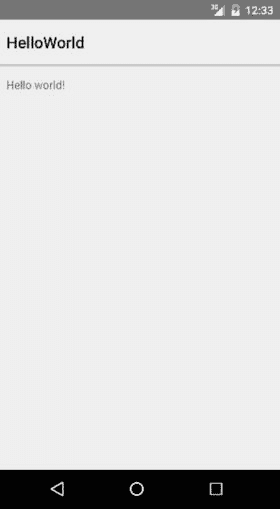

# 五、Espresso

Electronic supplementary material The online version of this chapter (doi:[10.​1007/​978-1-4842-9701-8_​5](http://dx.doi.org/10.1007/978-1-4842-9701-8_5)) contains supplementary material, which is available to authorized users.

除了简单的逻辑错误之外，Android 应用失败的原因还有很多。在最基本的情况下，该应用可能无法正确安装，或者当您从横向移动到纵向再返回时可能会出现问题。由于存在碎片，这种布局可能无法在您没有时间测试的任何数量的设备上工作，或者如果网络中断，它可能会挂起。

使用单元测试来测试这些条件是不可能的。我们将不得不使用另一个测试工具来测试我们的 GUI(图形用户界面)或活动。不幸的是，这也意味着我们又回到了使用设备和仿真器来进行测试。

有很多选择，比如 UIAutomator、葫芦、Robotium 和 Selenium。直到最近，我一直在使用 Calabash，因为它的 Given/When/Then 编写格式非常适合商业用户。然而，使用浓缩咖啡有显著的优势，这是很难抗拒的。

所有这些其他产品都是第三方产品，而 Espresso 是谷歌的第一方产品。通常这不会是任何一种优势，但是因为 Espresso 能够挂钩到 Android 生命周期中，它可以很好地准确知道活动何时准备好执行您的测试。Android 中的 GUI 测试通常充满了`sleep()`命令，以确保活动准备好接受您的数据。有了意式浓缩咖啡，你根本不需要等待或睡觉；它只是在应用准备好接受输入数据时触发测试。UI 线程和 Espresso 之间的同步意味着测试运行起来比使用其他工具更可靠。如果测试失败了，那是因为你的代码中有错误，而不是你需要给`sleep()`命令增加更多的时间。

## onView

虽然我们已经在第一章中看到了意式浓缩咖啡，但还是有必要回到基础，做一个真正的 Hello，World Espresso 测试。

在第一章中，我们展示了如何设置 Espresso 环境，如下所示:

*   先决条件:安装 Android 支持库
*   在`build.gradle` (app)文件中添加 Espresso 依赖
*   在构建变体中选择 Android 测试工具测试工件
*   在`src/androidTest/java`文件夹中创建 GUI 测试
*   右键单击测试运行测试

Espresso 使用 OnView 格式，而不是 JUnit 或 Hamcrest 匹配器和断言。它有三个部分，即在我们测试的活动中查找元素的 ViewMatcher，执行操作(例如，click)的 ViewAction，以及确保文本匹配和测试通过的 ViewAssertion。

`onView(ViewMatcher)`

`.perform(ViewAction)`

`.check(ViewAssertion);`

### 你好世界

清单 5-1 显示了标准 Android Hello World 应用的代码。

Listing 5-1\. Hello World

`public class MainActivity extends Activity {`

`private TextView mLabel;`

`@Override`

`protected void onCreate(Bundle savedInstanceState) {`

`super.onCreate(savedInstanceState);`

`setContentView(R.layout.activity_main);`

`}`

`}`

图 5-1 显示了在仿真器上运行的应用。我们简单的 Espresso 测试将找到文本，并确保它真的在说 Hello world！

图 5-1。

Hello world!

清单 5-2 显示了简单测试的代码。该测试被标注为`@LargeTest`，因为我们需要模拟器来运行 Espresso 测试。我们使用 JUnit4 规则来启动主活动(参见`@Rule`注释)。

一旦我们访问了活动，我们就使用 onView 代码来查找我们的 Hello World 文本和一个`.check`来查看该文本是否与在`strings.xml`文件中定义的一样。在这种情况下，不需要`.perform`步骤，所以省略了。

Listing 5-2\. Hello World Espresso Test

`@RunWith(AndroidJUnit4.class)`

`@LargeTest`

`public class MainActivityTest {`

`@Rule`

`public ActivityTestRule<MainActivity> activityTestRule`

`= new ActivityTestRule<>(MainActivity.class);`

`@Test`

`public void helloWorldTest() {`

`onView(withId(R.id.hello_world))`

`.check(matches(withText(R.string.hello_world)));`

`}`

`}`

测试通过，结果显示在 Android Studio 中，类似于单元测试输出(见图 5-2 )。

图 5-2。

Hello World Espresso test results

## 添加按钮

接下来，让我们在 Hello World 代码中添加一个按钮。为此，我们将清单 5-3 中的代码添加到我们的`activity_main.xml`文件中。字符串`button_label`也需要添加到`strings.xml`文件中。请注意，该按钮在默认情况下是启用的。

Listing 5-3\. Adding Hello World Button

`<` `Button`

`android:id="@+id/button"`

`android:text="@string/button_label"`

`android:layout_width="wrap_content"`

`android:layout_height="wrap_content" />`

图 5-3 显示了我们修改后的带有新按钮的应用。

图 5-3。

Hello World with button

我们希望确保按钮处于打开或启用状态。清单 5-4 现在显示了测试代码。这次我们使用`.perform`动作来点击按钮。

Listing 5-4\. onView Button Test

`@Test`

`public void helloWorldButtonTest(){`

`onView(withId(R.id.button))`

`.perform(click())`

`.check(matches(isEnabled()));`

`}`

当一切都是绿色时，测试成功运行(参见图 5-4 )。

图 5-4。

Hello World test results

## 视图匹配器

表 5-1 显示了可用的视图匹配器选项。

表 5-1。

ViewMatcher

<colgroup><col> <col></colgroup> 
| 种类 | 制榫机 |
| --- | --- |
| 用户属性 | `withId, withText, withTagKey, withTagValue, hasContentDescription, withContentDescription, withHint, withSpinnerText, hasLinks, hasEllipsizedText, hasMultilineTest` |
| 用户界面属性 | `isDisplayed, isCompletelyDisplayed, isEnabled, hasFocus, isClickable, isChecked, isNotChecked, withEffectiveVisibility, isSelected` |
| 对象匹配器 | `allOf, anyOf, is, not, endsWith, startsWith, instanceOf` |
| 等级制度 | `withParent, withChild, hasDescendant, isDescendantOfA, hasSibling, isRoot` |
| 投入 | `supportsInputMethods, hasIMEAction` |
| 班级 | `isAssignableFrom, withClassName` |
| 根匹配器 | `isFocusable, isTouchable, isDialog, withDecorView, isPlatformPopup` |

## 视图操作

表 5-2 显示了可用的视图操作选项。

表 5-2。

ViewAction

<colgroup><col> <col></colgroup> 
| 种类 | 行动 |
| --- | --- |
| 点击/按下 | `click, doubleClick, longClick, pressBack, pressIMEActionButton, pressKey, pressMenuKey, closeSoftKeyboard, openLink` |
| 手势 | `scrollTo, swipeLeft, swipeRight, swipeUp, swipeDown` |
| 文本 | `clearText, typeText, typeTextIntoFocusedView, replaceText` |

## 视图断言

表 5-3 显示了可用的视图断言选项。

表 5-3。

ViewAssertion

<colgroup><col> <col></colgroup> 
| 包裹 | 断言 |
| --- | --- |
| 布局断言 | `noEllipsizedText, noMultilineButtons, noOverlaps` |
| 位置断言 | `isLeftOf, isRightOf, isLeftAllginedWith, isRightAlignedWith, isAbove, isBelow, isBottomAlignedWith, isTopAlignedWith` |
| 其他的 | `matches, doesNotExist, selectedDescendentsMatch` |

## 奏鸣曲

当我们使用任何 AdapterViews(如 ListView、GridView 或 Spinner)时，将无法找到数据。对于 AdapterViews，我们必须结合 onView 使用`onData`来定位和测试项目。

`onData`格式如下:

`onData(ObjectMatcher)`

`.DataOptions`

`.perform(ViewAction)`

`.check(ViewAssertion)`

可用的`DataOptions`有`inAdapterView`、`atPosition`或`onChildView`。

### 待办事项

为了了解这是如何工作的，让我们看看如何测试拥有 ListView 适配器的 ToDoList 应用(见图 5-5 )。

图 5-5。

ToDoList application

我们的应用使用 ListView 适配器。清单 5-5 显示了代码。

Listing 5-5\. To Do List Code

`public class MainActivity extends Activity {`

`private TextView mtxtSelectedItem;`

`@Override`

`protected void onCreate(Bundle savedInstanceState) {`

`super.onCreate(savedInstanceState);`

`setContentView(R.layout.activity_main);`

`mtxtSelectedItem = (TextView) findViewById(R.id.txt_selected_item);`

`String[] todolist = {"pick up the kids","pay bills","do laundry",`

`"buy groceries ","go the gym","clean room","call mum"};`

`List<String> list = Arrays.asList(todolist);`

`ArrayAdapter<String> adapter =`

`new ArrayAdapter(this, android.R.layout.simple_list_item_1, list);`

`ListView listView = (ListView) findViewById(R.id.list_of_todos);`

`listView.setAdapter(adapter);`

`listView.setOnItemClickListener(new AdapterView.OnItemClickListener() {`

`@` `Override`

`public void onItemClick(AdapterView<?> parent, View view, int position, long id) {`

`String text = ((TextView) view).getText().toString();`

`Toast.makeText(getApplicationContext(), text, Toast.LENGTH_LONG).show();`

`mtxtSelectedItem.setText(text);`

`}`

`});`

`}`

`}`

确保一切正常的一个简单测试是在待办事项列表中选择一些事情，比如“去健身房”清单 5-6 显示了浓缩咖啡的代码。我们告诉测试查看`onData`代码中 AdapterView 中的位置[4]，然后将它传递给 onView，这样它就可以检查文本是否确实说了“去健身房”

Listing 5-6\. onData Test Code

`@RunWith(AndroidJUnit4.class)`

`@LargeTest`

`public class MainActivityTest {`

`@Rule`

`public ActivityTestRule<MainActivity> activityTestRule`

`= new ActivityTestRule<>(MainActivity.class);`

`@Test`

`public void toDoListTest(){`

`onData(anything())`

`.inAdapterView(withId(R.id.list_of_todos)).atPosition(4)`

`.perform(click());`

`onView(withId(R.id.txt_selected_item))`

`.check(matches(withText("go to the gym")));`

`}`

`}`

使用模拟器或在设备上再次运行测试。

## 詹金斯

要在 Jenkins 中运行 Espresso 测试，请单击添加构建步骤➤调用 Gradle 脚本并添加 connectedCheck 任务(参见图 5-6 )。

图 5-6。

Adding Espresso tests in Jenkins

Espresso 需要一个模拟器来执行它的测试，所以您还需要安装 Android 模拟器插件。你可以选择让 Jenkins 使用现有的仿真器或者创建一个新的仿真器(见图 5-7 )。

图 5-7。

Using an existing emulator

## 摘要

在这一章中，我们已经研究了使用`onView`和`onData`的一些浓缩咖啡测试。最后，如果你想知道我们的测试套件中应该有多少 Espresso 测试，那么回到我们在第一章(图 1-1 )中的敏捷测试金字塔，你会看到我们应该总是有比 Espresso 测试更多的单元测试，或者换句话说，比`@LargeTests`更多的`@SmallTests`。