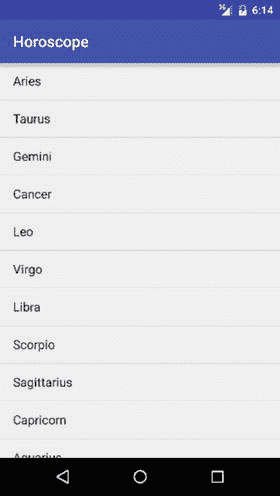
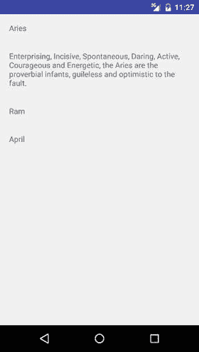
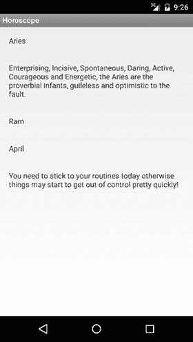

# 六、测试驱动开发

Electronic supplementary material The online version of this chapter (doi:[10.​1007/​978-1-4842-9701-8_​6](http://dx.doi.org/10.1007/978-1-4842-9701-8_6)) contains supplementary material, which is available to authorized users.

如果我们不努力展示测试驱动开发(TDD)的作用，那就不对了。因此，在本章中，我们将使用我们的 TDD 方法从头开始创建一个应用。使用 TDD，我们将为每日星象创建一个示例应用。无论如何，我不是一个占星学狂热者，但它是一个足够简单的应用，可以让我们展示我们的 TDD 技术。

## 理解测试驱动的开发

TDD 意味着我们使用下面的过程获取特性和代码列表中的第一个特性:

*   首先编写一个测试，然后看到它失败(红色)
*   实现尽可能简单的解决方案来通过我们的测试(绿色)
*   重构以去除任何代码味道(重构)

实际上，您可能需要不止一个测试来满足某个特性。但是一旦你对你实现的特性感到满意，从列表中选择另一个特性，重复红色/绿色/重构过程，直到所有的特性都完成。

Note

在经典的 TDD 中，无论是 Java、C++ 还是 C#，你都不用担心任何基础设施。但是在 Android 中事情没有那么简单。当您创建一个要测试的 Java 类时，您通常需要创建一个显示该 Java 类或与之交互的活动。因此，当你说编写尽可能简单的解决方案来通过单元测试时，也必须包括一些 Android 活动代码。或者，如果你愿意，你可以把它留给重构阶段，但是它只需要在红/绿/重构过程中的某个地方完成。

## 单元测试和 TDD

到目前为止，我们一直专注于对我们的 Android 应用进行单元测试。但是单元测试不一定是 TDD。测试驱动开发意味着在编写代码之前先编写单元测试，而单元测试并不强制你在编写测试时进行。没有 TDD，单元测试通常是在编码周期结束时编写的，以提高代码覆盖率。所以，你可以在有或者没有 TDD 的情况下进行单元测试，但是没有单元测试就不能进行 TDD。一旦你开始 TDD，你将很快发现它比经典的单元测试带来的痛苦要少。

## TDD 值

我们知道单元测试和一般测试有助于发现错误，但是我们为什么要使用 TDD 呢？有几个根本原因。TDD 推动开发人员只为实现某个特性所需的最低限度的代码编写代码，因此它帮助我们塑造我们的设计，以实现实际或真实使用所需的特性，而无需在我们的实现中镀金——节省资金并降低复杂性。我们称之为 YAGNI，或者“你不需要它”这导致了更简单的代码，因为实现关注的是需要什么，而不一定是您能够做什么。

在移动创业越来越快的今天，YAGNI 也鼓励尽可能快地推出最小可行产品(MVP)。企业主选择在 Google Play 或亚马逊应用商店推出应用所需的最少功能。这个最小的特性列表然后被分割成可管理的块，以满足开发人员的 TDD 过程。

没有实践 TDD 的单元测试也可以得到一个很好的回归测试套件，帮助你避免在编码时引入任何缺陷。因为我们在编写任何代码之前就在编写单元测试，所以 TDD 回归测试套件将比没有 TDD 的单元测试覆盖更广、更全面。

此外，由于正在进行的重构，代码变得更易于维护，也更精简，从而延长了代码库的寿命。在 Android 中编写可怕的、不可测试的代码是非常容易的。重构将鼓励你编写小的、集中的、可能是单行的方法，这些方法容易测试，而不是单一的 Android 视图。

最后，在这个连续的红/绿/重构循环中的编码过程有助于消除拖延，因为重点是小的、离散的步骤，随着一个又一个功能的实现，应用逐渐自下而上地出现。

## 使用 TDD 编写应用

在我们开始之前，我们需要了解星座应用的一些基本要求。

*   显示每个星座
*   显示每个星座的信息
*   显示星座运势

我们还可以添加很多其他东西，但我们正在练习 YAGNI，所以我们将为我们的 MVP 占星应用添加最少的功能。

### 特征 1

TDD 意味着首先编写测试——这会失败——让测试通过，然后重构。我们的第一个功能是显示每个星座。使用 Android 向导创建一个名为占星的 Android 应用，其中包含一个空活动。我们的第一个测试使用我们在第三章中介绍的 Robolectric 来测试我们显示了 12 个标志(参见清单 6-1 )。

Listing 6-1\. Robolectric Test

`@RunWith(RobolectricGradleTestRunner.class)`

`@Config(constants = BuildConfig.class, sdk = 21, manifest = "src/main/AndroidManifest.xml")`

`public class ZodiacUnitTest {`

`private Activity mainActivity;`

`private ListView lstView;`

`@Before`

`public void setUp() {`

`// Robolectric sets up the MainActivity class`

`mainActivity= Robolectric.setupActivity(MainActivity.class);`

`assertNotNull("Main Activity not setup",mainActivity);`

`// add a listview to your layout file to get the test to compile`

`lstView=(ListView)mainActivity.findViewById(R.id.list_of_signs);`

`}`

`@Test`

`public void shouldDisplaySigns() throws Exception {`

`assertThat("should be a dozen star signs", 12, equalTo(lstView.getCount()));`

`}`

`}`

测试代码设置了一个`MainActivity`，并查看我们的`listView`上是否有 12 个符号。运行测试，当然，它失败了(见图 6-1 )。

图 6-1。

Test fails (red)

`MainActivity.java`(见清单 6-2 )有一个`ListView`，它使用了我们的`activity_main.xml`布局文件中的`ListView`项`list_of_signs`。

Listing 6-2\. MainActivity.java

`public class MainActivity extends AppCompatActivity {`

`private Zodiac zodiac;`

`private TextView mtxtSelectedItem;`

`@Override`

`protected void onCreate(Bundle savedInstanceState) {`

`super.onCreate(savedInstanceState);`

`setContentView(R.layout.activity_main);`

`ListView listView = (ListView) findViewById(R.id.list_of_signs);`

`}`

`}`

让代码编译的最简单方法是在`strings.xml`文件中添加一个`zodiac_array`(参见清单 6-3 )。

Listing 6-3\. strings.xml

`<resources>`

`<string name="app_name">Horoscope</string>`

`<string-array name="zodiac_array">`

`<item>Aries</item>`

`<item>Taurus</item>`

`<item>Gemini</item>`

`<item>Cancer</item>`

`<item>Leo</item>`

`<item>Virgo</item>`

`<item>Libra</item>`

`<item>Scorpio</item>`

`<item>Sagittarius</item>`

`<item>Capricorn</item>`

`<item>Aquarius</item>`

`<item>Pisces</item>`

`</string-array>`

`</resources>`

现在在布局文件中引用这个数组(参见清单 6-4 )。

Listing 6-4\. android_main.xml layout file

`<ListView`

`android:id="@+id/list_of_signs"`

`android:entries="@array/zodiac_array"`

`android:layout_width="fill_parent"`

`android:layout_height="fill_parent" >`

`</ListView>`

再次运行测试，测试通过(参见图 6-2 )。Robolectric 确实比普通的单元测试需要更长的时间，但它仍然是几秒钟而不是几分钟。我们不需要模拟器就能获得 Espresso 测试功能。

图 6-2。

Test passes (green)

对于这个特性，我们不需要做任何重构，可能是因为代码非常有限。相反，我们将添加更多的测试(参见清单 6-5 )。

Listing 6-5\. Updated ZodiacUnitTests

`/**`

`* If the Robolectric test will not run, edit the test configuration and add \app to the`

`* end of the Working Directory path (windows) or enter $MODULE_DIR$ (mac).`

`*/`

`@RunWith(RobolectricGradleTestRunner.class)`

`@Config(constants = BuildConfig.class, sdk = 21, manifest = "src/main/AndroidManifest.xml")`

`public class ZodiacUnitTest {`

`private ListView listView;`

`private String[] zodiacSigns;`

`@Before`

`public void setUp() {`

`MainActivity mainActivity = Robolectric.buildActivity(MainActivity.class).create().get();`

`assertNotNull("Main Activity not setup", mainActivity);`

`listView=(ListView) mainActivity.findViewById(R.id.list_of_signs);`

`zodiacSigns = RuntimeEnvironment.application.getResources().getStringArray(R.array.zodiac_array);`

`}`

`@Test`

`public void listLoaded() throws Exception {`

`assertThat("should be a dozen star signs", zodiacSigns.length, equalTo(listView.getCount()));`

`}`

`@Test`

`public void listContentCheck() {`

`ListAdapter listViewAdapter = listView.getAdapter();`

`assertEquals(zodiacSigns[0], listViewAdapter.getItem(0));`

`assertEquals(zodiacSigns[1], listViewAdapter.getItem(1));`

`assertEquals(zodiacSigns[2], listViewAdapter.getItem(2));`

`assertEquals(zodiacSigns[3], listViewAdapter.getItem(3));`

`assertEquals(zodiacSigns[4], listViewAdapter.getItem(4));`

`assertEquals(zodiacSigns[5], listViewAdapter.getItem(5));`

`assertEquals(zodiacSigns[6], listViewAdapter.getItem(6));`

`assertEquals(zodiacSigns[7], listViewAdapter.getItem(7));`

`assertEquals(zodiacSigns[8], listViewAdapter.getItem(8));`

`assertEquals(zodiacSigns[9], listViewAdapter.getItem(9));`

`assertEquals(zodiacSigns[10], listViewAdapter.getItem(10));`

`assertEquals(zodiacSigns[11], listViewAdapter.getItem(11));`

`}`

`}`

图 6-3 显示了第一个功能完成后的 app。

图 6-3。

List of star signs

### 功能 2

在特性 2 中，我们希望“显示每个星座的信息”我们需要创建`Zodiac`类来存储我们所有的信息。因此，假设我们声明了以下变量(参见清单 6-6 )。

Listing 6-6\. Zodiac Variables

`private String name;`

`private String description;`

`private String symbol;`

`private String month;`

我们可以将信息存储在 SQLite 数据库中，但这不是必需的，所以我们将采用最简单的方法，将黄道十二宫的信息存储在一个类中。我们的新单元测试现在显示在清单 6-7 中。

Listing 6-7\. Unit Tests

`@Test`

`public void zodiacSymbolTest() throws Exception {`

`TextView symbolTextView = (TextView) zodiacDetailActivity.findViewById(R.id.symbol);`

`assertEquals(Zodiac.signs[ARIES_SIGN_INDEX].getSymbol(), symbolTextView.getText().toString());`

`}`

`@Test`

`public void zodialMonthTest() throws Exception {`

`TextView monthTextView = (TextView) zodiacDetailActivity.findViewById(R.id.month);`

`assertEquals(Zodiac.signs[ARIES_SIGN_INDEX].getMonth(), monthTextView.getText().toString());`

`}`

`@Test`

`public void zodiacNameTest() {`

`TextView nameTextView = (TextView) zodiacDetailActivity.findViewById(R.id.name);`

`assertEquals(Zodiac.signs[ARIES_SIGN_INDEX].getName(), nameTextView.getText().toString());`

`}`

正如预期的那样，看到我们处于红/绿/重构 TDD 循环的红色部分，单元测试全部失败(见图 6-4 )。

图 6-4。

New unit tests fail

完成`Zodiac`类(参见清单 6-8 和 6-9 )来存储星座信息。

Listing 6-8\. Updated Zodiac Class

`public class Zodiac {`

`private String name;`

`private String description;`

`private String symbol;`

`private String month;`

`public static final Zodiac[] signs = {`

`new Zodiac("Aries","Courageous and Energetic.", "Ram", "April"),`

`new Zodiac("Taurus","Known for being reliable, practical, ambitious and sensual.", "Bull", "May"),`

`new Zodiac("Gemini","Gemini-born are clever and intellectual.", "Twins", "June"),`

`new Zodiac("Cancer","Tenacious, loyal and sympathetic.", "Crab", "July"),`

`new Zodiac("Leo","Warm, action-oriented and driven by the desire to be loved and admired.", "Lion", "August"),`

`new Zodiac("Virgo","Methodical, meticulous, analytical and mentally astute.", "Virgin", "September"),`

`new Zodiac("Libra","Librans are famous for maintaining balance and harmony.", "Scales","October"),`

`new Zodiac("Scorpio","Strong willed and mysterious.", "Scorpion", "November"),`

`new Zodiac("Sagittarius","Born adventurers.", "Archer", "December"),`

`new Zodiac("Capricorn","The most determined sign in the Zodiac.", "Goat", "January"),`

`new Zodiac("Aquarius","Humanitarians to the core", "Water Bearer", "February"),`

`new Zodiac("Pisces","Proverbial dreamers of the Zodiac.", "Fish", "March"),`

`};`

`private Zodiac(String name, String description, String symbol, String month) {`

`this.name = name;`

`this.description = description;`

`this.symbol = symbol;`

`this.month = month;`

`}`

`public String getDescription() { return description;  }`

`public String getName() { return name; }`

`public String getSymbol() { return symbol; }`

`public String getMonth() { return month; }`

`public String toString() { return this.name; }`

`}`

Listing 6-9\. ZodiacDetailActivity class

`public class ZodiacDetailActivity extends Activity {`

`public static final String EXTRA_SIGN = "ZodiacSign";`

`@Override`

`protected void onCreate(Bundle savedInstanceState) {`

`super.onCreate(savedInstanceState);`

`setContentView(R.layout.activity_zodiac_detail);`

`int signNum = (Integer) getIntent().getExtras().get(EXTRA_SIGN);`

`Zodiac zodiac = Zodiac.signs[signNum];`

`TextView name = (TextView) findViewById(R.id.name);`

`name.setText(zodiac.getName());`

`TextView description = (TextView) findViewById(R.id.description);`

`description.setText(zodiac.getDescription());`

`TextView symbol = (TextView) findViewById(R.id.symbol);`

`symbol.setText(zodiac.getSymbol());`

`TextView month = (TextView) findViewById(R.id.month);`

`month.setText(zodiac.getMonth());`

`}`

`}`

运行测试，它们现在通过了(参见图 6-5 )。

图 6-5。

Zodiac unit tests pass

这个功能发生了很多变化。明显的重构步骤是将存储在`Zodiac.java`中的信息放入 SQLite 数据库。这并没有给我们的讨论增加任何内容，所以你可以在 Apress 网站上找到重构后的代码和其余的源代码。

该特征现已完成(见图 6-6 )。

图 6-6。

Information on star sign

### 功能 3

特征 3 说我们应该显示星座的星象。所以，让我们再一次从测试开始。要求是它必须是免费的，并且可以用 XML 或 JSON (Java Script Object Notation)格式获得。我们可以创建自己的简单 API，或者使用来自 [`http://fabulously40.com`](http://fabulously40.com/) 或 [`http://findyourfate.com`](http://findyourfate.com/) 的众多免费 API 中的一个。

我们将使用一个 API 从 [`http://a.knrz.co/horoscope-api`](http://a.knrz.co/horoscope-api) 调用洋葱的星座。

我们从第四章中的 Mockito 示例中知道，我们不会测试任何网络通信，测试我们的`AyncTask`方法也不是我们想在单元测试中做的事情。但是我们应该测试我们自己的方法来操作返回的星座 JSON(见清单 6-10 )。

Listing 6-10\. JSON Testing

`@SmallTest`

`public class DailyZodiacTest {`

`private JsonParser mJsonParser;`

`private String validJson, invalidJson;`

`private BufferedReader bufferedReader;`

`@Before`

`public void setUp() throws IOException {`

`validJson = "{\n" +`

`"  \"year\": 2015,\n" +`

`"  \"week\": 45,\n" +`

`"  \"sign\": \"aries\",\n" +`

`"  \"prediction\": \"Test1\"\n" +`

`"}";`

`invalidJson = "bogus";`

`mJsonParser = new JsonParser();`

`bufferedReader = org.mockito.Mockito.mock(BufferedReader.class);`

`Mockito.when(bufferedReader.readLine()).thenReturn(validJson).thenReturn(null);`

`}`

`@Test`

`public void validJSON_true() {`

`assertTrue(mJsonParser.isValidJSON(validJson));`

`}`

`@Test`

`public void invalidJSON_false() {`

`assertFalse(mJsonParser.isValidJSON(invalidJson));`

`}`

`@Test`

`public void testCreateJsonObjectReturnsJsonObject() throws JSONException {`

`JSONObject jsonObject = mJsonParser.createJsonObject(bufferedReader);`

`String horoscope = jsonObject.getString("prediction");`

`assertEquals("Test1", horoscope);`

`}`

`}`

测试失败了，我们通过在一个名为`JsonParser`的新类中创建`createJsonObject`和`isValidJson`方法来编写代码使它们通过(参见清单 6-11 )。

Listing 6-11\. Valid JSON Code

`protected JSONObject createJsonObject(BufferedReader reader) {`

`try {`

`StringBuilder sb = new StringBuilder();`

`JSONObject jsonObject;`

`String line;`

`String json;`

`while ((line = reader.readLine()) != null) {`

`sb.append(line).append("\n");`

`}`

`json = sb.toString();`

`jsonObject = new JSONObject(json);`

`return jsonObject;`

`} catch (Exception e) {`

`Log.e(TAG, "Error converting result " + e.toString());`

`}`

`return null;`

`}`

`public boolean isValidJSON(String horoscope){`

`try {`

`new JSONObject(horoscope);`

`return true;`

`} catch (JSONException e) {`

`e.printStackTrace();`

`return false;`

`}`

`}`

再次运行测试，他们通过了。由于 API 调用依赖于 is `AsyncTask code`，我们无法使用单元测试来轻松测试它。推荐的方法是使用 Espresso 通过模拟器进行测试。

这一次，在重构阶段，我们的`ZodiacDetailActivity`类中有大量的其他基础设施代码来让占星术显示在页面上。

该应用现在显示`ZodiacDetailActivity`的星座(见图 6-7 )。

图 6-7。

Horoscope app

## 摘要

在这一章中，我们使用 TDD 创建了一个简单的三特征星座应用。在前两个特性中，我们在测试中使用了 Robolectric，在最后一个特性中使用了 Mockito。单元测试代码仅限于与 Android 框架不直接相关的代码。我们一直避免使用任何 Espresso 模拟器测试，以帮助保持测试尽可能快。