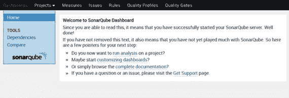
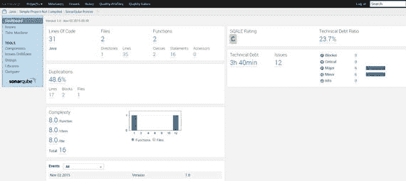
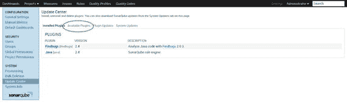
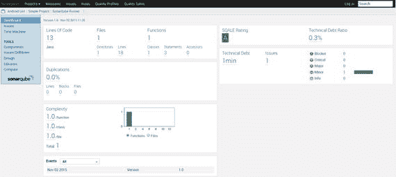
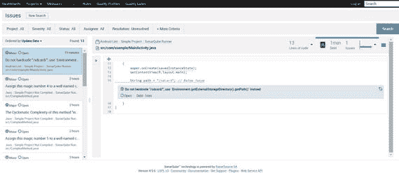
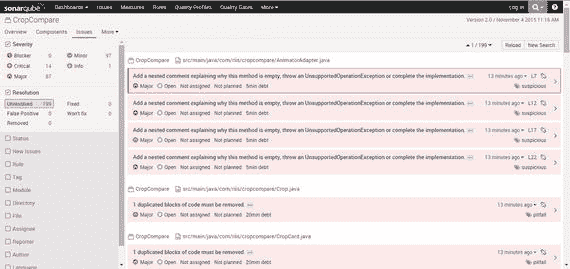
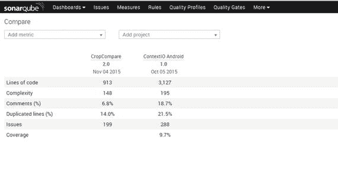

# 七、处理遗留代码

在您的开发生涯中，每次开始一个新项目时，都很少有机会能够从头开始。通常情况下，你不得不扩展别人写的代码。其他时候，你只是加入团队来帮助完成增加的工作量。不可避免地，诱惑就是不做任何单元测试。毕竟，为现有代码创建单元测试是一项巨大的任务，所以何必麻烦呢。但是有一些方法可以处理这种“没有单元测试”的情况，这样当应用进入质量保证(QA)时，您的代码就不会崩溃。“这不是我的准则”从来都不是一个好借口。

我们引入测试的过程如下:

*   引入持续集成(CI)来构建代码
*   为 TDD(测试驱动开发)配置 Android Studio
*   基于现有测试添加最小单元测试，并让它们在 CI 服务器上运行
*   向团队展示如何创建单元测试
*   将测试代码覆盖率指标添加到 CI 中，预计为 5-10%
*   添加浓缩咖啡测试
*   模拟现有对象的同时，对任何新特性进行单元测试
*   隔离现有代码，使任何人都无法直接访问它；
*   移除未使用的代码
*   重构孤立的代码，使代码覆盖率达到理想的 60–70%

无论您是单独的开发人员还是团队的一员，设置 CI 服务器总是值得的。我们在书的前面看了 Jenkins，但是你可以使用你自己个人最喜欢的，只要它与 Android 和 Gradle 集成。即使您自己完成了这一步，团队也会看到好处。

接下来，在 Android Studio 中将 JUnit、Mockito 和其他依赖项添加到您的项目中，并确保 Studio 是最新的稳定版本。添加一些简单的单元测试，并向团队展示如何创建单元测试，以便他们了解总体思路；向团队展示单元测试如何在 CI 服务器中工作。这一步的代码覆盖率将是最小的。

为现有应用的基本功能创建 Espresso 测试，即所谓的主要用例或快乐路径。你不能选择对应用进行内部测试，但是你可以在活动级别进行测试。如果应用开始失败，不这样做将导致指责，并侵蚀你在新的敏捷开发环境中建立的任何信心。现在您已经准备好了，为任何新代码创建单元测试。

添加新功能时不要编辑旧代码。隔离任何旧的代码，以便没有新的代码被添加到您现有的未经单元测试的/遗留的代码中。创建与旧代码交互的接口，这样它就有了一个逻辑围栏。

最后，一旦开发环境稳定下来，您就可以开始重构旧代码，这样代码覆盖率就会随着时间的推移而逐渐增加。在本章的剩余部分，我们将看看如何使用一个叫做 SonarQube 的工具来完成这个任务。

## 声纳员

我们的目标是重构代码，以便更容易测试和维护，但这可能会有问题。对我来说，敏捷就是消除责备，给人们更快实现质量特性的技能。告诉别人他们的代码有异味，无论你如何包装，都不是一件容易的事情，所以最好保持客观而不是主观。令人欣慰的是，除了代码覆盖率之外，还有许多工具和度量标准可以提供这种客观性。SonarQube 对于识别代码的实际问题特别有用。

按照以下步骤安装 SonarQube:

Download and install SonarQube Server; use the most up to date LTS (long-term support) version, from [`www.sonarqube.org/downloads/`](http://www.sonarqube.org/downloads/) .   Download and install the Sonar Runner.   Start the Sonar Server; run `C:\sonarqube\bin\windows-x86-xx\StartSonar.bat` on Windows or /`etc/sonarqube/bin/[OS]/sonar.sh` console on Unix.   Go to `http://localhost:9000` in your browser to see if the Sonar Dashboard is running (see Figure 7-1).

图 7-1。

SonarQube Dashboard  

我们需要检查服务器是否正在分析项目，以及是否安装了 Java 插件，因此下载 Sonar 示例。

Download the Sonar examples from [`https://github.com/SonarSource/sonar-examples/archive/master.zip`](https://github.com/SonarSource/sonar-examples/archive/master.zip) `and unzip`   To get the project information into the Sonar Dashboard we need to use the runner. Navigate to the `java` example folder and start the runner, `cd C:\sonar-examples\projects\languages\java\sonar-runner\java-sonar-runner-simple` and then run `C:\sonar-runner\bin\sonar-runner.bat` or on Unix `cd /etc/sonar-examples/projects/languages/java/sonar-runner/java-sonar-runner-simple` and run the `/etc/sonar-runner/bin/sonar-runner` command.   Navigate to the Sonar Dashboard, click the Java project and you should see the image in Figure 7-2.

图 7-2。

Sonar analytics for our Java project  

请注意，我们基于生命周期期望(SQLAE)的软件质量评估获得了“C”级。然而，我们对这个项目不感兴趣，因为它是 Java，而不是 Android。在分析任何 Android 项目之前，我们需要安装 Android 插件。

Log in as Administrator using admin/admin   Click Settings ➤ Update Center ➤ Available Plugins (see Figure 7-3).

图 7-3。

Sonar Update Center   Click the Android Lint plug-in to install the plug-in and restart SonarQube.  

Android 插件会将任何 lint 错误导入 SonarQube，并允许您导航任何 Java 错误。要查看示例 Android 项目，请执行以下操作:

`cd C:\sonar-examples\projects\languages\android\android-sonarqube-runner` or on Unix `/etc/sonar-examples/projects/languages/android/android-sonarqube-runner`   Create the bin/classes folder as it fails to load without creating the directory   Run `C:\sonar-runner\bin\sonar-runner.bat or on unix /etc/sonar-runner/bin/sonar-runner`  

图 7-4 显示了对该基础项目的顶层分析。

图 7-4。

Android app analysis

如上安装 Tab Metrics 插件并重启 SonarQube。即使是在一个非常小的项目中，当你现在点击问题链接(见图 7-5 )时，你应该对 SonarQube 发现的问题有所了解。

图 7-5。

Android app issues list

Android 插件非常适合用 Eclipse 编写的 Android 应用，这可能是您试图修复的大多数遗留应用。现在我们有了工作，我们应该安装 Gradle 插件，这样我们就可以分析 Android Studio 项目了。

Add the plug-in and `sonarProperties` to your `build.gradle` (app) file, see Listing 7-1. This won’t replace the existing file but will be in addition to what’s already in the file.   Click Sync Now to update the `build.gradle` file.   Run your Analyzer command from the project root directory with the command `gradlew sonarRunner`.   Open the dashboard at `http://localhost:9000`, to browse your project’s quality.   Listing 7-1\. build.gradle Updates

`apply plugin: ’sonar-runner’`

`sonarRunner{`

`sonarProperties{`

`property "sonar.host.url", "``http://localhost:9000`

`property "sonar.jdbc.url", "jdbc:mysql://localhost:3306/sonar?useUnicode=true&characterEncoding=utf8&rewriteBatchedStatements=true&useConfigs=maxPerformance"`

`property "sonar.jdbc.driverClassName","com.mysql.jdbc.Driver"`

`property "sonar.jdbc.username","root"`

`property "sonar.jdbc.password","root"`

`property "sonar.projectKey", "RIIS:CropCompare"`

`property "sonar.projectVersion", "2.0"`

`property "sonar.projectName","CropCompare"`

`property "sonar.java.coveragePlugin", "jacoco"`

`property "sonar.sources","src\\main"`

`property "sonar.tests", "src\\test"`

`property "sonar.jacoco.reportPath", "build\\jacoco\\jacocoTest.exec"`

`property "sonar.java.binaries", "build"`

`property "sonar.dynamicAnalysis", "resuseReports"`

`}`

`}`

图 7-6 显示 CropCompare 应用有近 200 个问题——47 个关键问题和 87 个主要问题——需要修复。

图 7-6。

CropCompare app issues list

### 比较项目

当你的代码覆盖率达到你认为可以接受的程度时，你可以使用 Sonar compare projects 功能来比较每个项目(见图 7-7 )。我们可以很快地识别出哪些项目代码覆盖率低，复杂度高。这将快速确定需要经历相同过程的其他项目。

图 7-7。

Comparing projects

## 重构代码

一旦修复了 SonarQube 问题，就应该精简最大的类并消除关键的代码味道问题。记住在任何大手术后使用您的 Espresso 测试套件测试代码，以确保您没有破坏构建。

重构可能还包括为你的项目创建一个新的、更干净的架构。MVP(模型-视图-演示者)和 MVVM(模型-视图-视图模型)都正在成为流行的 Android 架构。数据绑定是清理代码的另一个好方法——尽管在撰写本文时它仍处于测试阶段——因为它从用户界面或 UI 中删除了数据引用，也是实现 MVVM 架构的良好开端。

## 经验教训

在我们结束这一章之前，如果不谈谈从写得很差的遗留 Android 代码到更易维护的代码的转变过程中所学到的一些经验，那将是一个错误。

保持对话的客观性。告诉别人他的代码不好是非常主观的对话。但是告诉团队，目标是在公司的 Git 服务器上的不同项目中具有相同级别的代码覆盖率和复杂性度量，这是一个更容易说服的方法。

不要在应用中附带任何测试或测试信息。在当前的单元测试环境中，即使您尝试了，也不太可能将单元测试包含在您的 APK (Android 应用包)中，但是我们在过去已经看到了许多测试数据存储在 resources 和 assets 文件夹中的例子，所以总是解压缩您的生产 APK，以确保它在有效负载中没有任何额外的内容。

当你继承一个现有的项目时，要循序渐进。不要被指标所驱使。尽量不要太担心代码覆盖率；毕竟，对你的评判是基于你如何写出好的、干净的、交付价值的代码，而不是你的代码覆盖率或任何其他指标是否超过了某个特定的值。

关注性能指标也很重要。就像 Espresso test harness 一样，一些简单的应用计时指标将让您保持正轨。没有什么比创建经过质量测试的代码发现它比原来的遗留代码慢两到三倍更糟糕的了。没有理由应该是这样，但是错误发生了，所以添加一个性能指标，这样您就可以在它成为问题之前意识到它(并且可以根除它)。

给你的估计增加一些配置时间。如果做得正确，人工 QA 时间应该会大大减少，但是这意味着开发和 devops 时间会消耗掉一些收益。不要假设开发人员在没有配置学习曲线的情况下会全力投入 TDD。

## 摘要

在这一章中，我们已经研究了一些将单元测试添加到现有代码库中的策略。在 Android Studio 中使用 Sonar 和重构，随着时间的推移，您可以逐渐分离现有的应用，增加它们的代码覆盖率，并降低它们的复杂性。

最后，值得一提的是，你不需要任何人的许可来进行单元测试，即使团队的其他成员不想参与。现在，您可以使用 Android Studio 开始单元测试，因为开始单元测试不再有任何障碍，Java 世界的其他部分已经这样做了大约十年。不管有没有 TDD，单元测试都需要成为开发过程的一部分。