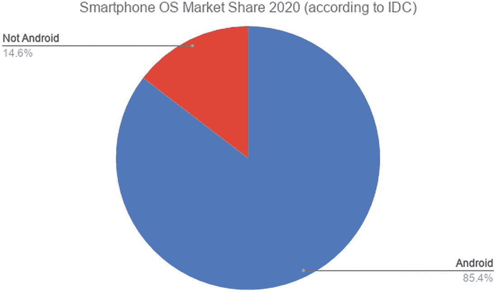
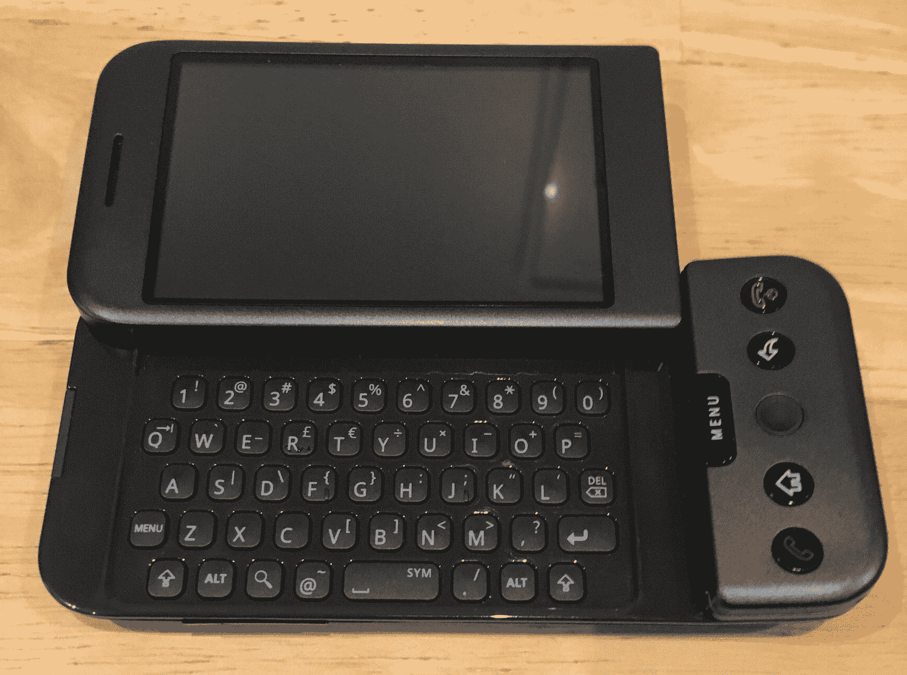
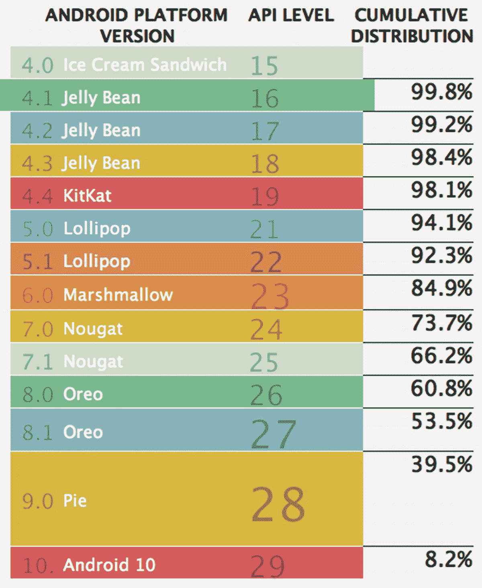

# 一、Android 简介

欢迎开始您的 Android 开发者之旅。也许你已经拥有并使用一部安卓手机、平板电脑或其他设备。你将置身于一个伟大的公司，全世界每天都有超过 10 亿台基于 Android 操作系统的设备在使用。即使你认为你还没有使用 Android，你可能会惊讶地发现它已经进入了一系列惊人的设备和产品，其中许多你可能已经使用过，甚至没有意识到 Android 的强大功能正在帮助你。

Android 现在为手机和平板电脑之外的一系列设备提供支持，包括智能手表、健身设备、汽车娱乐和导航系统、游戏控制台、玩具、厨房电器、花园浇水系统、管道和加热控制，甚至烧烤！是的，烧烤！使用安卓系统的设备的扩张没有放缓的迹象，但最受欢迎和最有可能找到安卓系统的地方仍然是手机和平板电脑。作为一名初露头角的 Android 开发人员，这意味着您将学习适用于这里提到的所有(或至少许多)设备类型的许多方面，但您最初的重点可能是学习如何为 Android 手机和平板电脑构建应用程序。

## 使用 Android:最好的部分

移动和智能手机的发展是过去十年或更长时间里最激动人心的技术故事之一。你可能没有亲身经历过每一个转折，但你很可能接触过一个或多个最近智能手机时代的设备，你可能听说过诺基亚、苹果、微软、谷歌和安卓等名字在许多组合中被提及。

今天，Android 向您展示了从过去 10 年这些公司和平台之间的所有重大技术大战中获得的好处，并让您驾驭这一浪潮，提供出色的工具、功能，并帮助您走上 Android 应用程序开发的道路。在本书撰写之际，这或许是 Android 目前最具吸引力的地方。它与所有智能手机和移动技术(以及苹果的 iOS)并驾齐驱，选择 Android，您可以立即获得它提供的优势，包括

1.  开发者工具和平台:我们将在本书中讨论这些项目，包括 Android Studio、Android SDK、Google Play 服务和 Google Play 在线商店等等。

2.  一个巨大的现有市场:当我说超过 10 亿的用户在等待你的应用程序时，我不是在开玩笑，还有更多潜在的未来用户在地平线上。如图 [1-1](#Fig1) 所示，Android 的全球市场渗透率令人惊叹。

3.  一个由志同道合的开发者组成的全球社区:你并不是一个人在追求你的 Android 应用程序开发梦想。有几万、几十万甚至可能几百万其他开发者有经验可以分享。

4.  A rock-solid technology foundation: Android started life using the Java programming language as the predominant technology with which to build applications. Today it also supports Kotlin and C++. We will stick to Java for the examples and techniques explored in this book, as it is one of the most widely used, widely respected, and mature development technologies in existence – the vast majority of Android applications are built with Java.

    

    图 1-1

    Android 在智能手机用户中的全球市场份额

我可以继续列举更多关于 Android 开发世界的广度和深度及其优势的例子，但是我将让本书的其余部分来帮助演示更多的例子。

## 使用 Android:挑战

如果我不指出 Android 在许多方面都是幸运的，但也有挑战，我就不会诚实。好消息是，这些挑战中有许多是众所周知的，也很容易解决。以下是新开发人员可能很快就会遇到的一些领域:

1.  你正在开发小型设备。无论我们谈论的是 Android 手机、Android 平板电脑、车载仪表盘，还是一系列其他外形因素，你需要处理的一个常见约束是屏幕的大小。当我们讨论用虚拟设备模拟 Android 设备时，我们将深入探讨这个主题，但请始终记住，您坐在为 Android 构建的台式机或笔记本电脑上的体验与您的用户在手机和平板电脑上的体验是不同的。

2.  超越屏幕思考。不要让小屏幕成为你在应用程序中提供强大特性和超酷功能的唯一途径！正如您将看到的，后面的章节将探讨声音和音频、车载传感器、振动等内容。不要成为屏幕的俘虏——你有更多的工具可以使用。

3.  替代品只需轻轻一扫。每个拥有安卓设备的人——实际上是任何智能手机——都有许多应用程序的第一手经验。用户可以选择，而且用户还可以在手机上运行一系列其他应用程序。这意味着您的应用程序可能会共享资源和用户的注意力，用户可以做各种您从未想过的事情！

4.  安卓并不总是安卓。我们将在本书中涵盖 Android 的最新版本，包括 Android 版本 11，在撰写本文时它已有近一年的历史，并预览 Android 版本 12，它将在今年晚些时候发布，作为谷歌 Android 更新的典型年度发布周期的一部分。然而，在市场上，我在本章前面提到的十亿甚至更多的用户正在使用早期的 Android 版本。不仅仅是 Android 10 或 Android 9，而是可以追溯到 Android 4 甚至更早的版本！在鼓励(甚至允许)用户升级方面，Android 有着复杂的历史，在决定瞄准这个十亿用户市场的时候，这一点要记住。

无论你做什么，都不要因为这几点而灰心丧气。当你开始开发 Android 应用程序时，更多地把它们看作是要学习的第一套课程。

## 了解 Android 的传统及其对您的影响

Android 可以追溯到 2003 年，那一年 10 月，帕洛阿尔托的一群开发人员聚在一起，使用 Linux 内核作为他们梦想的具有更强大界面的设备新时代的基础。在经历了成长期的挣扎后，谷歌于 2005 年收购了 Android 业务，其前联合创始人安迪·鲁宾加入谷歌，继续为智能手机和其他设备开发操作系统。

2008 年，在经历了几次失败后，谷歌及其合作伙伴 HTC 和 T-Mobile 发布了第一款手机，被称为“梦想”或“G1”，这取决于你在哪个国家。我自己的 G1 至今仍在运行，但不再是我的日常电话。图 [1-2](#Fig2) 显示了我的 G1 在原始锁定屏幕。

图 1-2

作者最初的 G1 安卓手机，来自 2008 年

在第一次发布之后，Android 的势头慢慢增强，操作系统的更新开始以甜点的名字作为代号出现——纸杯蛋糕、甜甜圈、艾克蕾尔等等，代表版本 1.5、2.0 和 2.1。

在第一次公开发布的时候，谷歌还与电信公司、芯片公司和手机制造商合作创建了开放手机联盟，旨在建立一个广泛的联盟来支持 Android 的未来。谷歌还建立了“安卓开源项目”，作为安卓基础开源代码的保管人。

随着许多新版本的软件和许多新制造商的加入，Android 的故事还有很多。但是以上几点是 Android 开发者在构建应用程序时必须应对的几个问题的未知开端。

随着许多公司开始制造基于 Android 的手机，谷歌并不直接控制如何在每个制造商的设备上维护 Android，也不直接控制主要市场的电信公司如何作为合同、销售等的一部分管理手机的消费者生命周期。在 Android 最初发布后的几年里，出现了一个有许多不同设备的市场，运行许多不同版本的 Android，升级保证非常不完整。这在 Android 世界中被称为碎片问题。

对于开发人员来说，这意味着为 Android 构建应用程序需要付出额外的努力，考虑野外设备的数量以及它们运行的 Android 版本。在写这本书的时候，谷歌已经做出了一系列努力来减少这种担忧，并鼓励制造商升级设备。这产生了一些影响。Google 还增加了一系列开发人员特性，以减轻开发人员处理这个变化多端的市场所需的工作量，我们将在后面的章节中讨论其中的几个特性。

在结束这个话题时，图 [1-3](#Fig3) 显示了 2020 年中期全球使用的 Android 版本的当前分布情况。

图 1-3

2020 年使用的 Android 版本和 API 级别

请注意这些数字的自我吹捧。你不用报告每个 Android 版本使用的设备的绝对比例，而是显示运行特定版本或更高版本的设备的“累积分布”。很容易通过算术计算出真实的绝对百分比。例如，11.2%的设备运行 Android 6.0“棉花糖”，这是其 84.9%的累积分布和 Android 7.0 的 73.7%的累积分布之间的差异。在撰写本文时，Android 11 已经发布了几个月，但尚未在统计数据中显示出来。Android 12 定于今年晚些时候发布，对 Android 11 只做了微小的调整。请放心，Android 11 和之后的 Android 12 将会在排行榜上扶摇直上，成为学习 Android 开发的良好基础。

从这个讨论中得出的结论是，为了瞄准一定比例的 Android 设备，你将希望采用过去几个版本的 Android 功能，而不是仅仅迎合前沿。

## 了解 Android 的未来

像 Android 这样已经拥有数十亿用户的系统，已经可以被认为是一个巨大的成功。但是在大量的新领域，Android 还有大量的增长和机会。例如，现在大量的注意力集中在 Android 将如何成为未来“混合”计算的一部分。在这种混合模式下，一些设备使用 Android 进行部分操作，就像今天的智能手机一样提供应用程序，但转而使用 Chrome OS 等第二个操作系统来执行其他任务。

Android 本身也将遵循一条定期更新的道路，就像 Google Play 和其他云产品等许多伟大的在线服务一样，这将进一步推动 Android 设备和 Android 应用程序的可能性。

## 对这本书的其余部分有什么期待

*Android for Absolute Beginners*旨在带领读者踏上编写软件的第一次旅程，学习为未来的应用程序开发目标做准备的实践、技术和方法，以及构建计算机程序的许多基础知识。当然，我们将使用 Android 作为您学习的目标环境，激发您的灵感，以及涵盖您在软件开发的其他领域将会遇到的许多主题的基础。

我把这本书分成了四大部分，每一部分都旨在让你在阅读内容和例子的过程中，不断加深对如何为 Android 编写应用以及 Android 本身的理解。每一部分的章节涵盖了以下主题。

### 详述剩余章节的更多内容

**章** [**1**](01.html) **，安卓简介:**你在看！您已经介绍了 Android 的大部分内容，只需几页就可以着手开发您的第一个 Android 应用程序。

**第** [**2**](02.html) **，介绍 Android Studio:** 我们将看看构建 Android 应用程序最流行的工具集——Android Studio——以及如何获得这款免费软件。我们还将简要介绍 Android Studio 的一些替代产品，以及如何及时了解新版本、新特性和 Android 应用程序构建方式的其他变化。最后，我们将介绍“仿真”Android 手机的概念，即 Android 虚拟设备(AVD)，这是一种让您的计算机模拟 Android 手机的方式，并提供了一个测试您的应用程序的平台，而无需修改您的实际手机。

**章** [**3**](03.html) **，你的第一个安卓应用，已经！:**对，没错。您将直接创建您的第一个 Android 应用程序。没必要等到你读完这本书！我们的第一个例子将非常简单，但它将为我们在所有剩余章节中展开奠定基础。

**章** [**4**](04.html) **，探索你的第一个项目:**在这一章中，我们将对你在第 [3](03.html) 章中创建的例子进行虚拟放大，浏览你的第一个应用程序的每一部分，开始理解它们来自哪里，它们做什么，以及它们为什么会在那里。

**章节** [**5**](05.html) **，Android Studio 深度:**如果你打算为你的未来开发使用一套集成的工具，那么深入了解它们的功能将是必须的。在这一章中，我们将探索 Android Studio 的所有关键方面，包括代码编辑功能、调试器、分析工具等等。

**章节** [**6**](06.html) **，掌握你的整个开发者生态系统:**这让你对你在开发旅程中可以并且将要使用的所有工具有了更全面的了解。本章将探讨位于 Android Studio 集成环境之外但对其至关重要的工具，包括 Java 开发工具包(JDK)、Gradle、代码和应用的源代码控制系统、Android 虚拟设备的管理以及环境的其他关键部分。我们还会看看你的开发者硬件的哪些方面会影响你的 Android 开发之路。

**章节** [**7**](07.html) **，介绍 Java 用于 Android 开发:**准备用 Java“升一级”？不管你目前的知识水平如何，本章都将强调 Android 开发所需的 Java 编码的关键领域，以及扩展你的 Java 专业知识的更多资源。

**章节** [**8**](08.html) **，介绍 XML 用于 Android 开发:**Android 应用行为的很多方面都是由 XML(可扩展标记语言)数据控制的。本章将带您了解 XML 的基础知识，以及如何将 XML 应用于 Android 应用程序的各个方面，包括应用程序的清单、用户界面等等。

**第** [**9**](09.html) **，探索 Android 概念:核心 UI 小部件:**在第 [8](08.html) 章的基础上，我们探索如何用菜单、屏幕小部件(如字段、列表、图像和其他可视项目)等常规组件来布局 Android 用户界面。本章还将介绍活动的关键概念 Android 用户界面的基础构件。最后，我们将给出 Android Jetpack 的概述，它是一个现代的库，在提供向后兼容性的同时提供了现代的布局方法。

**第** [**第 10**](10.html) **，探索 Android 概念:**布局和更多:本章扩展了您对所有 Android 用户界面组件的理解，并进一步建立在第 [8](08.html) 和 [9](09.html) 章的工作基础上。

**章节** [**11**](11.html) **，了解活动:**借助前面章节的 UI 概念，您将探索活动作为所有 Android 应用程序的基本构建块的全部功能。

**章节** [**12**](12.html) **，片段介绍:**您将学习更广泛的片段概念，它为许多不同的屏幕尺寸和布局选项提供了动力。

**章节** [**13**](13.html) **，使用 Android 的声音、音频和音乐:**在这一章中，我们将探索您的应用程序的音频的所有方面，包括在应用程序中播放音频和使用声音，录制音频，甚至在 Android 设备上创建音频。

**章节** [**14**](14.html) **，为 Android 处理视频和电影:**如果你是崭露头角的史蒂文·斯皮尔伯格、索菲亚·科波拉，甚至只是 YouTube 明星，这一章就是为你准备的。我们将介绍 Android 的视频捕获和回放功能，以及如何将这些功能应用到您的应用中。

**章节** [**15**](15.html) **，介绍通知:**通过使用 Android 提供的事件框架和通知系统，扩展到应用程序的边界之外。

**第** [**第 16**](16.html) **章，通过通话探索设备功能:**除了屏幕上显示的内容，您的 Android 世界还有更多可能性。我们将了解呼叫能力、访问传感器和其他信息。

**章节** [**17**](17.html) **，理解意图、事件、接收者:**在每一个 Android 应用的幕后，丰富的后台功能让事情保持运转。本章涵盖了 Android 平台的核心概念，并展示了它们如何塑造和影响您的应用程序。

**章** [**18**](18.html) **，介绍 Android 服务:**在这一章中，我们将探索如何使用其他代码和其他应用程序来丰富您自己的应用程序，以及它能为您的用户做些什么。

**章节** [**19**](19.html) **，在 Android 中处理文件:** Android 使你能够处理多种数据、配置和其他文件。本章将开始你的旅程，了解 Android 应用程序可以在哪里以及如何利用传统文件来增强你的用户体验。

**章节** [**20**](20.html) **，使用 Android 中的数据库:**数据驱动着每一个应用程序，知道如何为应用程序存储、管理和使用数据是让它们变得伟大的关键。本章将涵盖 Android 提供的多种数据处理方式。

带着对即将完成的事情的预尝，没有比现在更好的开始了。第二章在下一页等待！