# 三、你的第一个 Android 应用！

Android Studio 安装在您的计算机上后，您就可以开始创建您的第一个 Android 应用了。是的，现在！对于那些不熟悉 Java 代码开发的读者，不要惊慌。我们将在本章开始我们的例子，没有假定的 Java 知识或诀窍。对于那些了解 Java 的读者来说，请继续阅读，因为我们将涵盖创建 Android 虚拟设备(或 AVD)的重要的第一步，在其上运行本章中的示例以及未来章节中的示例。

## 创建您的第一个 Android 虚拟设备

更广泛的 Android Studio 集成环境中提供的最有用的特性之一是创建 Android 虚拟设备(avd)的能力。有了 AVD，你就有能力模拟一个真正的 Android 设备，控制它的一系列功能和特性，而不必有一个实际的物理设备。

AVD 方法并不意味着禁止您使用真实的设备来测试和使用您的应用，但是如果您考虑一下我们在前两章中提到的过多的 Android 设备、版本和外形因素，您就会明白，作为一名开发人员，即使只拥有运行 Android 的设备中的一小部分也是不切实际的。avd 可以帮助您缩小您拥有的(和能够负担的)和您的用户群实际使用的之间的差距。

要开始创建你的第一个 AVD，启动 Android Studio(如果它还没有运行的话),你会看到闪屏，然后是欢迎使用 Android Studio 屏幕，你可能还记得第二章中的内容。在欢迎屏幕的右下方，您应该看到一个齿轮图标和菜单选项`Configure`，您应该点击它以显示一系列配置选项，如图 3-1 所示。

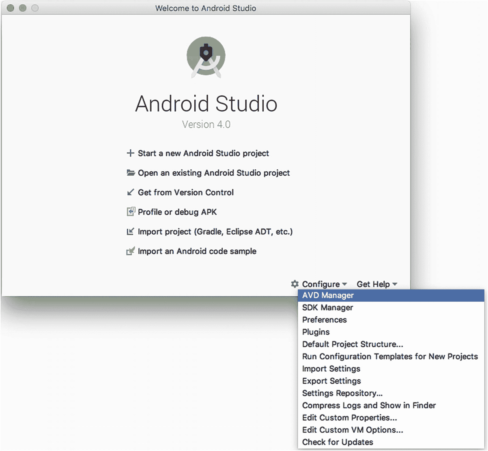

图 3-1

欢迎使用 Android Studio 屏幕上的配置菜单

您将看到配置项目列表中的第一个选项是 AVD 管理器选项。点击此选项，AVD 管理器将在几秒钟后启动，您将看到如图 3-2 所示的 Android 虚拟设备管理器介绍屏幕。

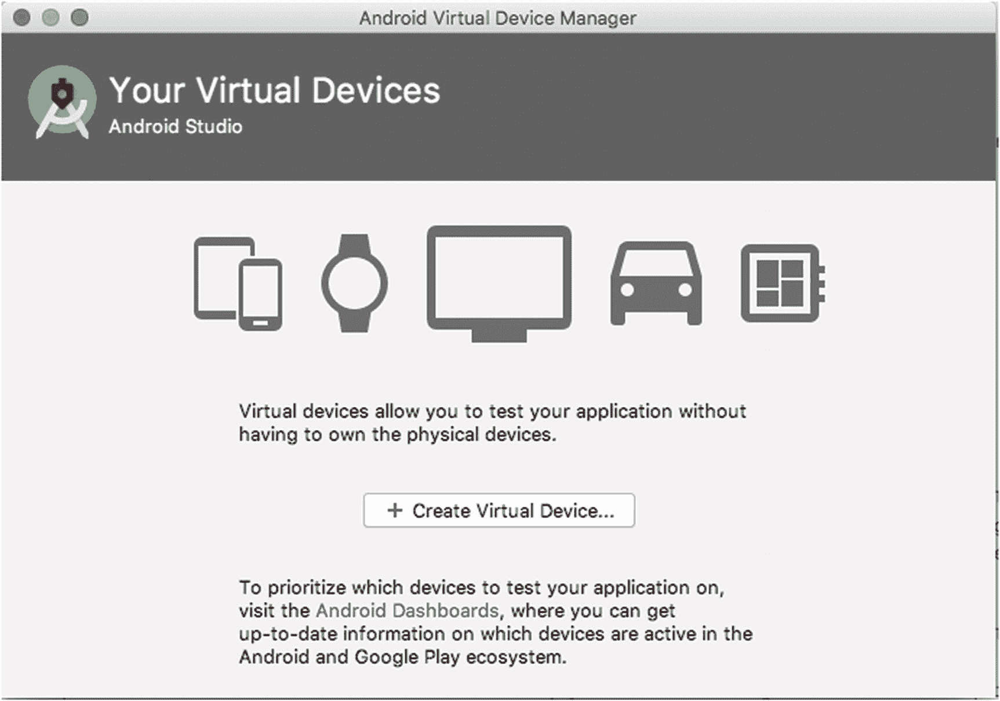

图 3-2

Android 虚拟设备管理器欢迎屏幕

在屏幕中间，你应该会看到如图 3-2 所示的按钮，上面写着`+ Create Virtual Device...`。继续并单击该按钮开始 AVD 创建过程。然后你会看到虚拟设备配置硬件选择屏幕，如图 3-3 所示。

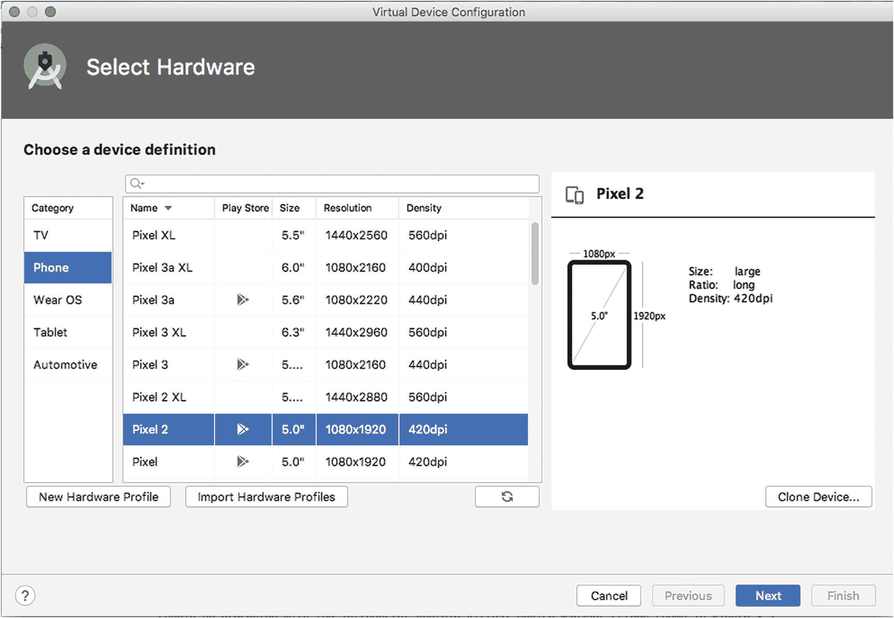

图 3-3

用于创建新 AVD 的选择硬件选项

硬件选择屏幕中有很多内容，但不要感到不知所措。这里的众多选项传达了你将在真实世界的设备中发现的变量，所以这真的不奇怪。让我们一步一步地了解各个领域，这样您就可以开始熟悉 AVD 管理器以及创建和使用 AVD 了。

从硬件选择屏幕的左侧开始，类别列表根据外形和使用模式对设备仿真器进行分组。你应该至少能看到图 3-3 所示的五个普通选项，电视、电话、Wear OS(原 Android Wear)、平板、汽车。您可以随意点击每一项，查看设备列表(屏幕中间)和维度详细信息窗口的变化，但完成后，请选择电话作为类别。选择 Phone 后，您应该会看到如图 3-3 所示的预打包仿真设备的原始列表。

在这一点上，我们不会急于选择第一批器件中的一个作为我们 AVD 的基础。相反，花一点时间滚动列表，记下一些数据点，这些数据点将在本书的后面重新出现，并将逐渐变得更有意义，对您的应用设计产生更大的影响。

在设备定义列表的上端，您会看到智能手机的品牌和型号，其中一些可能非常熟悉。各种像素选项，如 Pixel 3、Pixel 2 等，以及 AVD 图像尽可能模拟具有这些名称的真实物理设备。类似地，Nexus 6、Nexus 5 等是模仿其同名物的物理特征的虚拟设备，无论是板载存储、工作内存、屏幕分辨率还是其他功能。在您滚动查看列表的其余部分之前，请看一下显示在`Resolution`和`Density`列中的值。您将看到两者的测量值，以像素布局表示分辨率(例如，像素 2 AVD 为 1080 `×` 1920)和每英寸点数或 dpi 表示密度(像素 2 也是 420 dpi)。您可能熟悉笔记本电脑或台式机屏幕的分辨率和密度测量，而不会对您在这里看到的值有所顾虑。但值得将这些与列表中的其他 avd 进行比较。

如果您进一步向列表底部滚动，您将开始看到一系列更隐晦的设备名称，如图 3-4 所示。

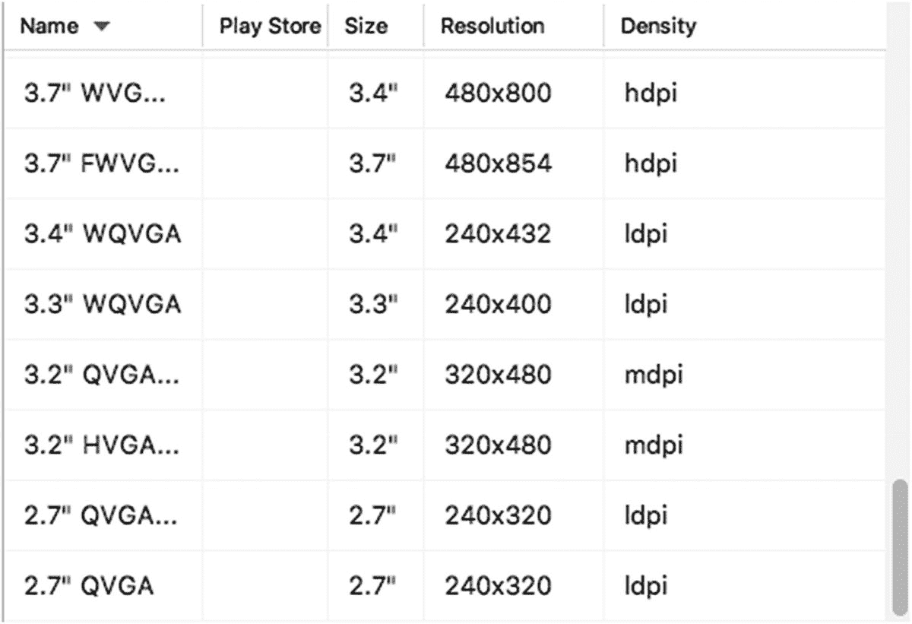

图 3-4

更多 AVD 模板可供您使用

这些设备没有任何相关的品牌名称，但它们确实拥有一些指标，通过使用通常与各种屏幕尺寸和分辨率相关的缩写来表明它们提供了什么。我们会在本书中遇到这些术语，所以现在你可以用书签标记名称，比如 QVGA、WQVGA、mdpi、hdpi 等等，不要在意它们的意思。

似乎所有这些当前和历史选项还不够，您将在设备定义列表下方看到两个按钮，允许指定您自己的自定义虚拟设备配置文件和从其他来源导入配置文件。就我们的目的而言，不需要这些选项，但您可以欣赏它们提供的价值——特别是对于那些最终可能想要设计针对非常具体、非典型设备的应用的人。

当我们深入研究用户界面设计时，我们将在第 9 、 10 和 11 章中重温 Android 设备分辨率和密度的概念和原理。现在，您可以滚动回到设备定义列表的顶部，并选择 Pixel 2 预配置的设备定义。点击下一步按钮，您应该会看到如图 3-5 所示的系统图像选择屏幕。

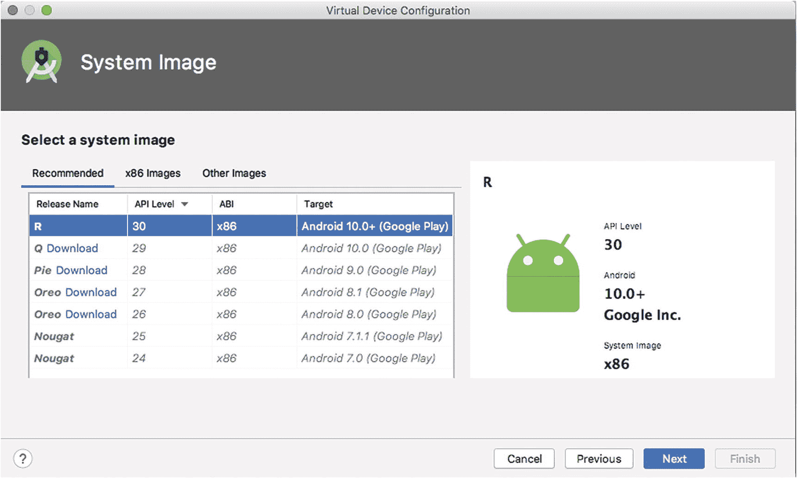

图 3-5

AVD 管理器中的 AVD 系统图像选择屏幕

选择系统映像可以被认为是对您之前选择的设备定义的补充。虽然您的设备选择选择了 AVD 的硬件方面，但系统映像决定了关键的软件方面:Android API/SDK 级别和 ABI，这基本上是决定在软件中模拟哪种芯片架构，英特尔的 x86 还是基于 Arm 的架构之一，以及这些部分最匹配的 Android 版本。

Android Software Development Kit: A Second Look

在第二章中，我介绍了术语 SDK，即软件开发工具包。虽然很容易解析这句话，并认为“太好了，这是一个帮助我开发软件的工具包”，但还是有必要回顾一下 Android SDK 真正提供了什么。首先，Android SDK 是一组软件库，是访问任何 Android 智能手机及其操作系统的功能和能力所需的基本工具。你可以将 SDK 视为一个杠杆，让你将谷歌内置于 Android 中的所有功能和能力应用到你自己的应用中，而无需从头开始构建一切。

Android SDKs 每个 Android 版本都有后续版本——提供了到 Android Studio 的连接，让您可以轻松调用 Android 行为；建立工具，让你把你的代码变成一个工作的 Android 程序；允许您管理仍在开发中并以“草案”形式运行的应用的平台工具，包括“adb”，Android 调试桥，用于从仍在开发中的代码控制仿真器或真实设备上的行为；以及更多。哦，SDK 提供了仿真器框架和设备仿真本身！

根据您之前是否在您选择使用的计算机上使用过某个版本的 Android Studio，或者之前是否完成过该向导，您将会看到列出的版本名称，如“R”或“Oreo ”,名称旁边有或没有下载链接。简而言之，如果系统映像已经在你的机器上，它不会显示下载链接。如果它还没有在您的机器上使用，下载链接将会显示，您可以直接从系统映像阶段单击它来获取相关的系统映像。

你需要至少有一个系统映像供你的 AVDs 使用，所以如果你看到的都是带有下载链接的系统映像名，你应该选择下载最新的。在图 3-5 所示的例子中，这将是 Android“R”系统映像。选择下载将触发许可接受屏幕，如图 3-6 所示。

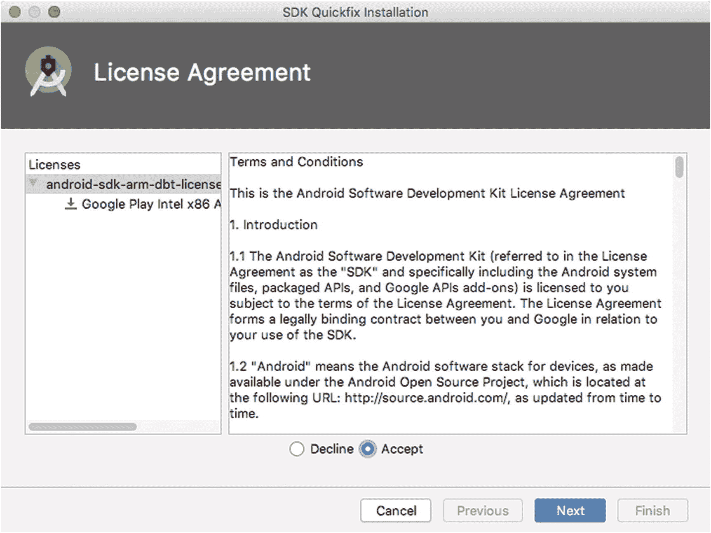

图 3-6

AVD 系统映像的许可接受屏幕示例

我不是律师，当然也不在电视上演律师！更严重的是，这意味着我不能告诉你许可文本的含义。如果你担心，就去找法律顾问。但是从一个外行的角度来看，用于 Android 系统映像的开源许可通常不会让你失眠。我假设您接受了显示的文本，并点击了“下一步”按钮，现在正盯着图 3-7 所示的 Android 虚拟设备(AVD)配置验证屏幕。

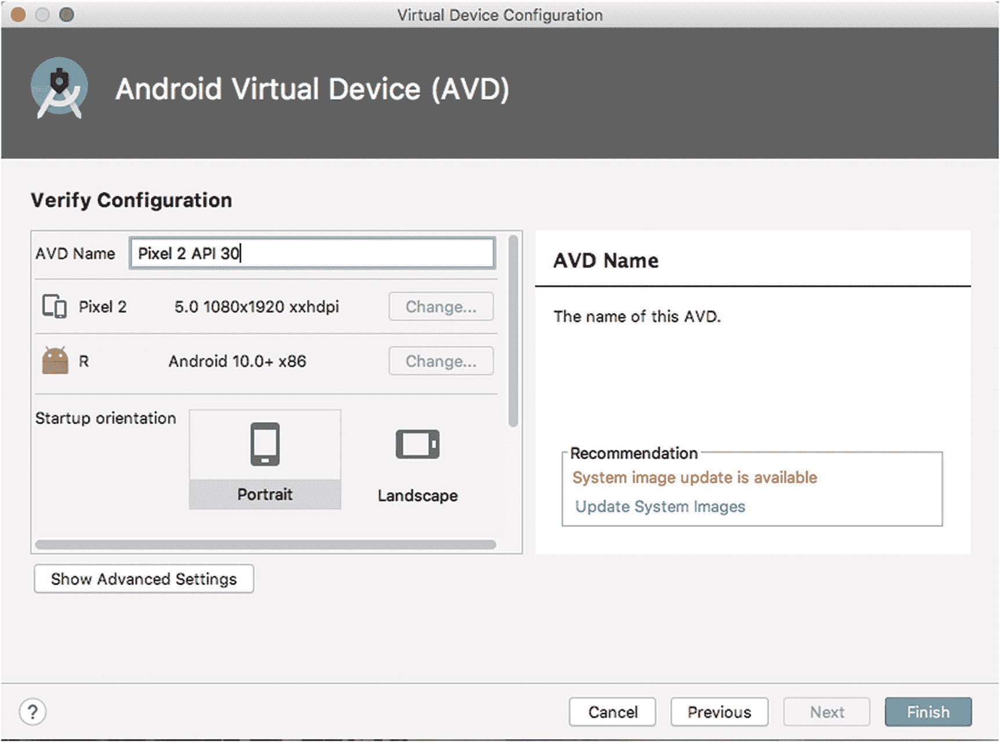

图 3-7

Android 虚拟设备(AVD)配置验证屏幕

使用此屏幕检查您对新 AVD 的配置是否满意，最重要的是，给它起一个好记的名字。您可以随意称呼您的 AVDs 无需保留型号或使用可能继承自某个预配置系统映像的名称，尽管将其作为名称的一部分有助于快速提醒您仿真设备的功能。选择一个名称，然后点击完成按钮，前往 AVD 管理器主屏幕，如图 3-8 所示。

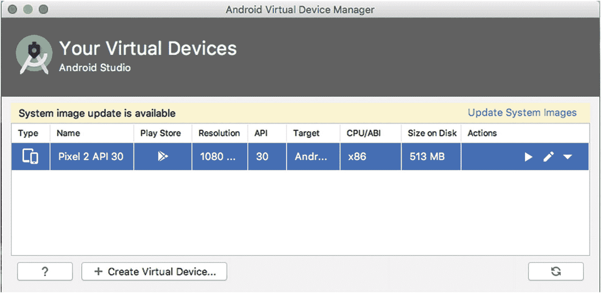

图 3-8

填充的 AVD 管理器主屏幕

现在，您应该会在可用模拟设备列表中看到新创建的 AVD。这就是创建您的第一个 Android 虚拟设备的全部内容——您现在可以编写自己的应用并在其上运行了！

## 已经开始创建您的第一个 Android 应用了！

您已经具备了开始使用您的第一个 Android 应用的所有先决条件。还有很多东西需要学习，但你已经有了关键的东西，包括 Android Studio 和一个新创建的 Android 虚拟设备，可以随时试用你写的任何东西。希望这种蓄势待发的状态不会让你感到惊讶。我在第二章中概述了 ide 的一些好处，您将在设置新应用的脚手架和框架方面直接体验到这些。

没有任何进一步的悬念，让我们开始吧。如果你已经按照本章前面的步骤完成了 AVD 的创建，你可能会回到你在本章前面看到的 Android Studio 主屏幕，如图 3-1 。在主屏幕上，选择屏幕顶部`Start a new Android Studio project`选项，您将很快看到创建新项目向导的第一个屏幕。

无论什么原因，如果你看不到主屏幕，或者重启了 Android Studio，它没有显示主屏幕向导，你可能会看到一个空的 Android Studio 屏幕或者一个已经加载了预先存在的项目的屏幕，如图 3-9 所示。

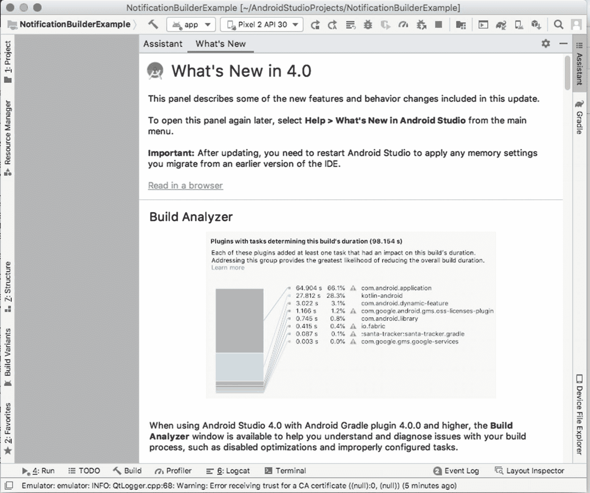

图 3-9

主屏幕消失时显示的 Android Studio

别慌！你也可以从这里开始一个新项目，但是打开文件菜单，选择`New` ➤ `New Project`。这也将启动创建新项目向导。不管你选择了哪条路径，你应该很快就会看到如图 3-10 所示的向导

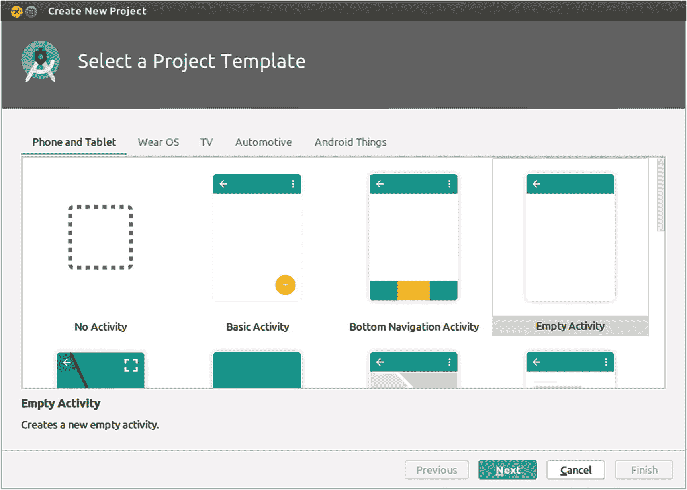

图 3-10

Android Studio 中的创建新项目向导

向导的第一页已经提示您选择要构建的应用类型。在屏幕上方，您会看到设备类别，如手机和平板电脑、Wear OS、电视等。目前，我们将坚持使用电话和平板电脑向导选项。看着手机和平板电脑下面显示的图标，你可能会挠头，不知道`activity`、`fragment,`等术语是什么意思。不要害怕。你很快就会掌握这些。在这个阶段，您可以将这个屏幕视为 Android Studio，询问您到底需要为您的新应用进行多少引导，以及您希望它代表您放置哪些现成的部分。例如，如果您希望开发一个依赖地图和导航功能的应用，Google Maps 活动模板为开发人员添加了一系列现成的地图、GPS 和位置支持选项。这个屏幕上的其他选项同样带来了其他好处，比如对 Google AdMob 广告活动的广告库支持。

我们将从一个非常普通的 Android 应用开始，创建这个简单应用的变体，展示我们在接下来的章节中讨论的每个功能。所以现在，你可以选择空活动选项。不要让 Empty 这个词迷惑了你，因为 Empty Activity 选项仍然部署了应用所需的大部分样板文件和基本项目结构。选中 Empty Activity，单击 Next 按钮，您应该会看到 Configure Your Project 屏幕，如图 3-11 所示。

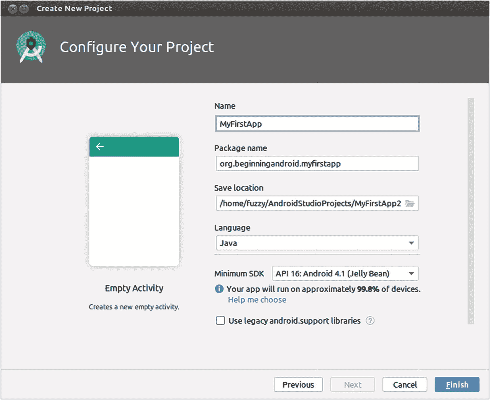

图 3-11

Android Studio 中的配置您的项目屏幕

这个屏幕上显示的选项是你和添加你自己的代码和应用之间的所有障碍。对于当前的 MyFirstApp 项目，您需要指定以下设置:

名称:这应该是一个对您的应用有意义的名称。它是运行应用时将出现在屏幕上的标题，它是将出现在 Android 启动器屏幕上应用图标下的标题，如果你在 Google Play 商店或其他地方发布该应用，它是将出现在那里的名称。出于我们的目的，输入`MyFirstApp`作为名称。

包名:在一个有成千上万的开发者为 Android 开发成千上万个应用的世界里，你如何确保两个应用在命名上不冲突？Android 利用了从 Java 标准派生的包名的基本机制，而不是强制使用唯一的名称(尽管 Google Play 这样的地方在这方面有一些限制)。我们将在第七章中讨论更多关于 Java 包命名的内容，所以现在你可以使用一个从我自己的域名中派生出来的包名—`org.beginningandroid.myfirstapp.`

保存位置:保存位置是磁盘上的文件夹，该应用的整个代码层次将存储在该文件夹中。这将包括菜单子文件夹，保存像源代码，配置文件，图像，视频等内容，这取决于我们如何完善这个应用。首先，新项目使用的空间将低于 1 MB。但这可能会增长很快，所以最好选择磁盘上有足够空闲空间的位置。如果您对缺省值满意，您可以接受它——在您的操作系统上的用户主目录下的一个名为`AndroidStudioProject/MyFirstApp`的目录。

语言:打开你看到的选择列表，你会看到两个选项:Kotlin 或 Java。Kotlin 是 Android 支持创作应用的语言家族中的新成员。Java 是第一种，而且仍然是 Android 开发中使用最多、最流行的语言。选择 Java 作为 MyFirstApp 的语言。

最低 SDK:这是我们从第二章和本章开始讨论 Android 版本、Android Studio 版本和 Android SDK 版本的地方。您在这里的选择将决定该应用使用哪个版本的 SDK，因此在很大程度上决定了它将与 Android 设备历史上的哪些设备兼容。较新版本的 Android SDK 提供了对新功能的支持，而旧版本更有可能在旧设备上得到支持，因此支持的设备也更多。您将在您的选择旁边看到额外的文本，表明在全球使用的已激活 Google 设备中，有多少百分比支持您选择的 SDK 版本。对于新功能和广泛支持之间的最佳权衡，没有完美的答案。目前，我们的初始应用不会使用最新发布的 Android SDK 的任何前沿特性，所以您可以使用默认的 API 16，它最初是为了配合几年前的 Android 4.1 Jelly Bean 发布而发布的。如果您愿意，可以滚动列表选择另一个 SDK 版本。如果您选择的 SDK 版本当前没有安装在您的计算机上，它将与完成设置该初始应用所采取的步骤一起被下载–请确保考虑每个 SDK 版本所使用的 100 MB 以上的磁盘空间。

使用传统的 android.support 库:多年来，谷歌尝试了许多方法来处理活跃的 android 设备使用的版本碎片。一种方法是(现在仍然是)使用不依赖于任何特定 SDK 版本的附加支持库，并让应用利用这个支持库。微妙之处在于，与任何特定设备的 Android 安装相比，谷歌更有能力推送支持库的更新。在接下来的章节中，当我们讨论 androidx 和 Jetpack 时，我们会对此进行更多的讨论。目前，您可以将该设置保留为缺省的未选中状态，这意味着我们不会引入对这些库的支持。

你现在离一个可运行的 Android 应用只有一步之遥了。单击 Finish 按钮，Android Studio 就会活跃起来，为您的新 Android 应用及其项目文件夹生成结构和框架。过了一会儿，你最终应该会看到完整的项目和 Android Studio 的完整开发者界面出现，如图 3-12 所示。

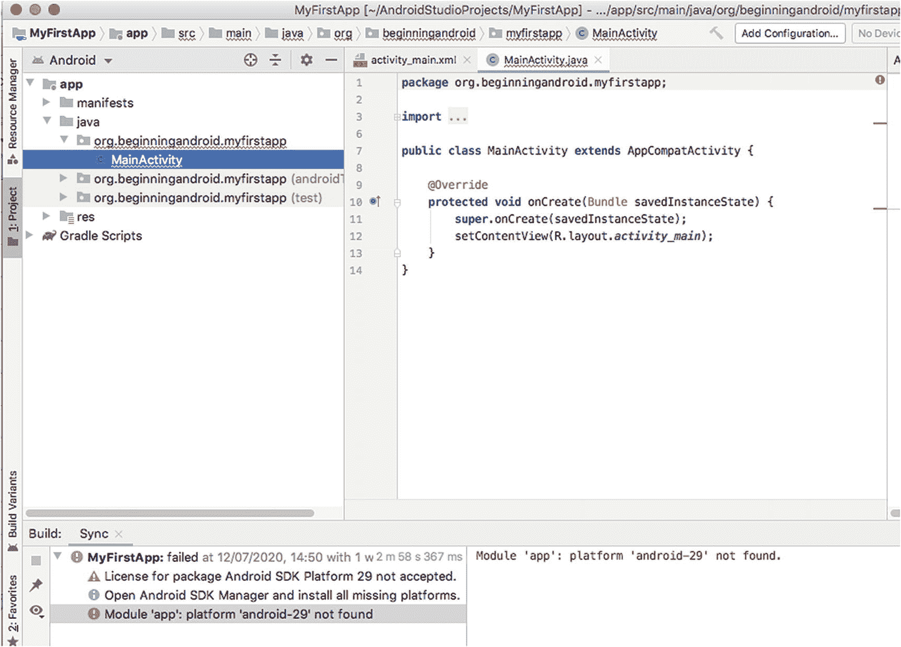

图 3-12

Android Studio 显示了打开进行编辑的 MyFirstApp 项目

### 编写您的第一个代码

如果你查看新项目的布局，如图 3-12 所示，你会看到一个文件夹/目录层次结构，有各种各样的名字，比如`manifests`、`java`、`res,`等等。我们将探索完整的项目布局，您看到的目录，填充它们的启动文件，以及您在下一章构建的部分。

现在，为了让您获得一个具有个人风格的工作应用，我们将跳过对这些项目的解释，直接开始编辑您的第一个应用组件。使用您在 Android Studio 布局左侧看到的项目层次视图，向下点击`res`文件夹，然后点击`layout`子文件夹。您应该会看到一个名为`activity_main.xml`的类似文件的条目(因为这些实际上是文件！).双击`activity_main.xml`文件，会在 Android Studio 的编辑器视图中打开，如图 3-13 所示。

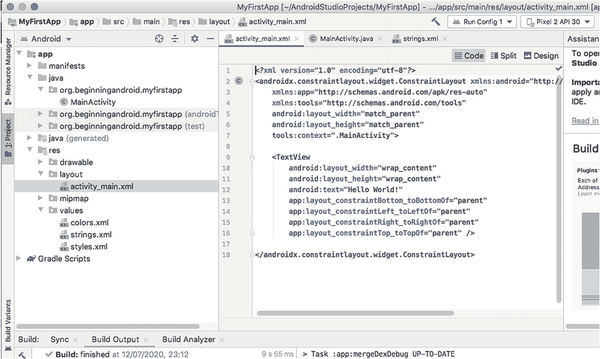

图 3-13

在 Android Studio 中打开您的第一个源文件

看代码截图很繁琐，所以让我们看看`activity_main.xml`文件的内容。您的文件应该类似于清单 3-1 。

```java
<?xml version="1.0" encoding="utf-8"?>
<androidx.constraintlayout.widget.ConstraintLayout
xmlns:android="http://schemas.android.com/apk/res/android"
    xmlns:app="http://schemas.android.com/apk/res-auto"
    xmlns:tools="http://schemas.android.com/tools"
    android:layout_width="match_parent"
    android:layout_height="match_parent"
    tools:context=".MainActivity">

    <TextView
        android:layout_width="wrap_content"
        android:layout_height="wrap_content"
       android:text="Hello World!"
        app:layout_constraintBottom_toBottomOf="parent"
        app:layout_constraintLeft_toLeftOf="parent"
        app:layout_constraintRight_toRightOf="parent"
        app:layout_constraintTop_toTopOf="parent" />

</androidx.constraintlayout.widget.ConstraintLayout>

Listing 3-1The contents of the activity_main.xml file in a new Android Studio project

```

这个文件中有几个不同的部分将来会让我们感兴趣，但是现在我们只对这里的一部分代码感兴趣，你可以看到粗体部分。您会注意到，在文件的中间是这样一行

```java
android:text="Hello World!"

```

继续编辑双引号内的字符串，因此它不是读`"Hello World!"`，而是读类似`"Hello Android!"`或任何你喜欢的东西。编辑完该文件后，保存您的更改。您刚刚对 Android 应用进行了首次自定义编辑！

### 准备运行您的应用

现在，您已经准备好让 Android Studio 在本章前面创建的 AVD 模拟器中运行您的新应用。为了让 Android Studio 做到这一点，当您要求它运行应用时，它需要知道您的特定偏好是什么。例如，您是希望它正常运行，以便与它进行交互，还是希望它以调试模式或其他方式运行，以便仔细检查代码中发生了什么，或者您的应用与 Android 主机设备、您可能调用的其他 API 或基于云的 API 等外部服务之间的交互发生了什么？

Android Studio 通过所谓的运行配置来控制这些运行应用的替代方法。这些是运行应用时关于“运行”确切含义的预设说明。

你可以触发 Android Studio 来引导你设置你的第一次运行配置，只需要立即运行你的应用。打开`Run`菜单，选择`Run...`选项。在没有任何预先存在的运行配置的情况下，Android Studio 现在会提示您编辑配置，如图 3-14 所示。

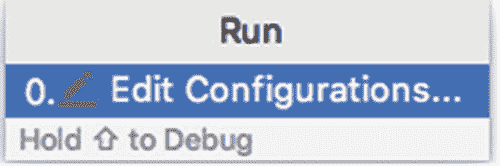

图 3-14

编辑首次运行配置的提示

Note

通过从“运行”菜单中选择“编辑配置…”选项，您始终可以直接编辑运行配置，而无需强制运行应用。

无论您以何种方式触发了第一次运行配置的创建，您都会看到显示的运行/调试配置屏幕。屏幕上的文本将指示单击“`+`”按钮来添加新的配置，您应该这样做。您将看到如图 3-15 所示的选项列表。

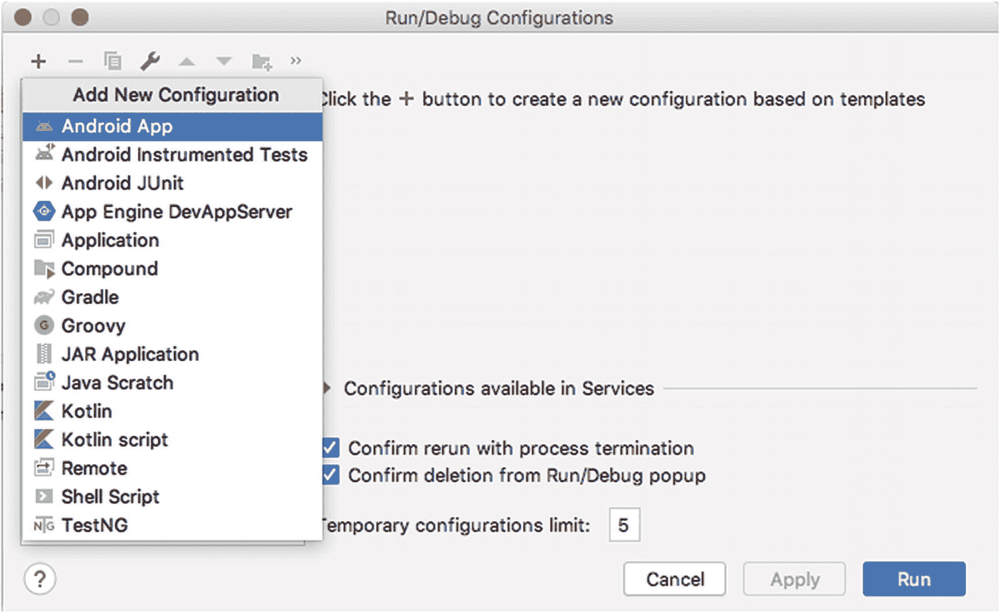

图 3-15

选择新的基本运行配置

选择列表顶部的 Android 应用选项，然后您将看到如图 3-16 所示的详细配置屏幕。

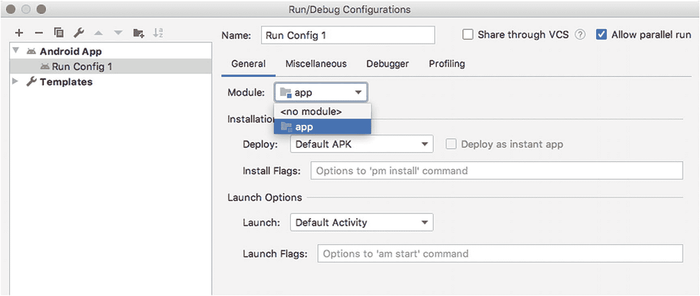

图 3-16

新运行配置的详细配置

您需要进行两项设置。第一个设置是为您的运行配置提供一个容易记住的名称。我建议你使用运行配置 1 这个名字。接下来，您需要指定在运行应用时，运行配置应该启动哪个代码模块。列表中唯一的选项是 app，这很幸运，因为这是你想要的选项。您可以在图 3-16 中看到这两种设置。

单击应用和确定按钮保存您的配置。

### 安装(附加)SDK 包

根据您在本章前面如何选择应用的最低 SDK 设置以及首次安装 Android Studio 时选择的选项，您的计算机上可能没有安装 Android Studio 用于构建应用的相关 SDK 包。你可以很容易地发现这一点，因为你在 Android Studio 中的默认视图在屏幕的左下角包括了当前的构建状态。

如果您在“Build: Sync”区域看到如下的错误或警告，您可能需要下载一个 SDK 包来匹配为您的项目选择的包:

```java
License for package Android SDK Platform 29 not accepted

```

或者

```java
Module 'app': platform 'android-29' not found

```

警告或错误中提到的版本号在您的安装中可能会有所不同。无论是什么版本，都可以通过调用 SDK 管理器特性(IDE 提供的另一项集成)轻松解决这个问题。从 Android Studio 的工具菜单中，选择 SDK 管理器选项，您应该会看到 SDK 管理器出现，如图 3-17 所示。

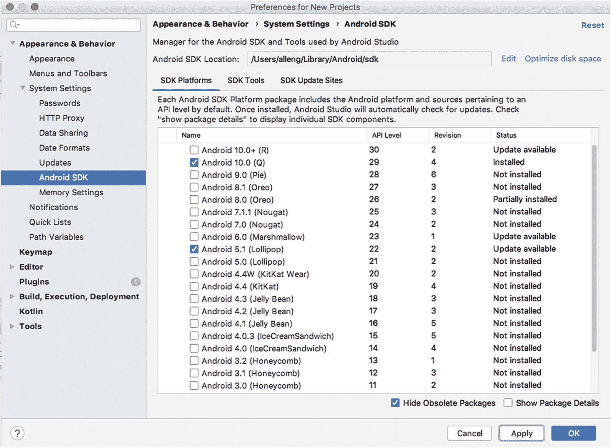

图 3-17

Android SDK 管理器

要添加您的项目所需的 SDK，只需选中相关版本旁边的框——在我的例子中，就是“Android 10.0 (Q)”，这相当于 API 级别 29，或者换句话说，Android SDK 的版本 29。单击 Apply 按钮，SDK 管理器将触发此版本 SDK 的下载。如果你坐下来想一想，你会意识到，随着你构建越来越多的应用，并可能为它们选择不同的目标 SDK 版本，你最终可能会在你的机器上安装相当多不同版本的 Android SDK，这些将占用相当大的磁盘空间。我们将在第六章中再次讨论这个主题，届时我们将深入了解您的整个开发人员系统设置。

一旦任何所需 Android SDK 版本的下载完成，您应该会看到如图 3-18 所示的状态。

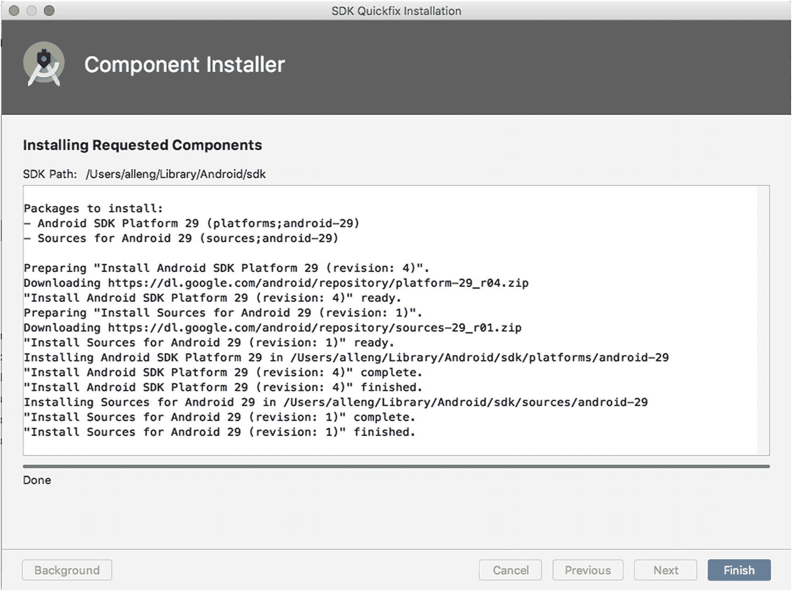

图 3-18

Android SDK 管理器指示成功下载并安装了新的 SDK 版本

此时，您需要让 Android Studio 刷新集成的 Gradle 构建工具的配置，以便它意识到新的 SDK 已经就绪。Android Studio 可以采取所有必要的步骤来做到这一点——因此，如果您对作为构建工具的 Gradle 一无所知，请不要惊慌。只需打开`File`菜单，选择显示`Sync Project with Gradle Files`的选项。

当这个同步活动完成时，在屏幕左下方的构建窗口中，您应该看到先前的警告和错误现在都消失了，唯一出现的消息应该是`MyFirstApp successful at` `some-date-and-time`。

### 运行应用

Android Studio 中的完整设置满足了您的应用和 Gradle 的同步需求，并准备好构建您的应用，您的运行配置现在应该可以实际运行您的新应用了。继续从运行菜单中选择运行，或直接选择`Run 'Run Config 1'`跳过运行配置选择步骤。

一系列操作现在将自动发生，但它们可能需要一点时间——最多几分钟，具体取决于您计算机的性能。首先，将调用 Gradle 来构建您的应用。我们将在后面的章节中更详细地介绍这一过程，但现在您需要知道的是，Gradle 正在将您编写的所有代码、您的应用引用的库、相关的 Android SDK 和其他管道整合在一起，并生成一个可以作为您的应用部署的包。这被称为安卓包，或 APK。

接下来，Android Studio 调用您的 AVD，在模拟器启动一段时间后，它会复制 Gradle 构建的 APK。基于您的运行配置，Android Studio 知道您想要运行应用模块，实际上触发您的新 MyFirstApp 应用在 AVD 中运行，就像您在 Android launcher 窗口中按下它的图标一样。

你的应用会运行，你的不朽的话“你好安卓！”(或者你选择的任何东西)应该出现在一个名为 MyFirstApp 的应用屏幕中，就像你在图 3-19 中看到的那样。

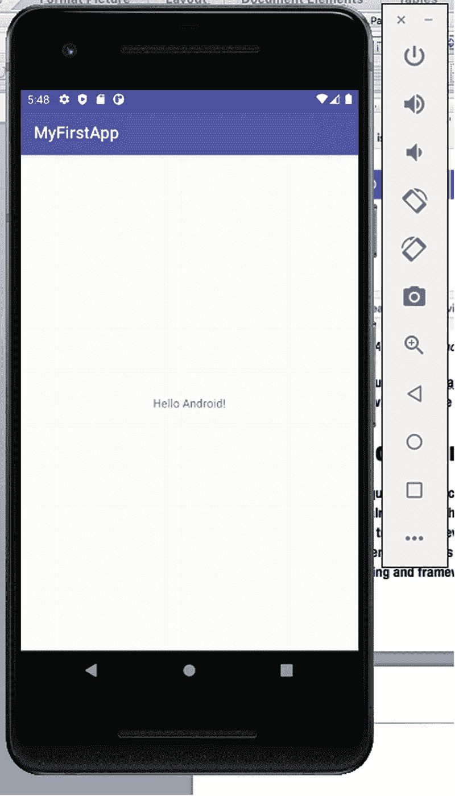

图 3-19

在 AVD 中运行 MyFirstApp Android 应用

就这样！您已经编写并运行了您的第一个 Android 应用。干得好。深呼吸，因为在第四章中，我们将深入到引擎盖下，详细检查 Android Studio 刚刚为您构建的一切。