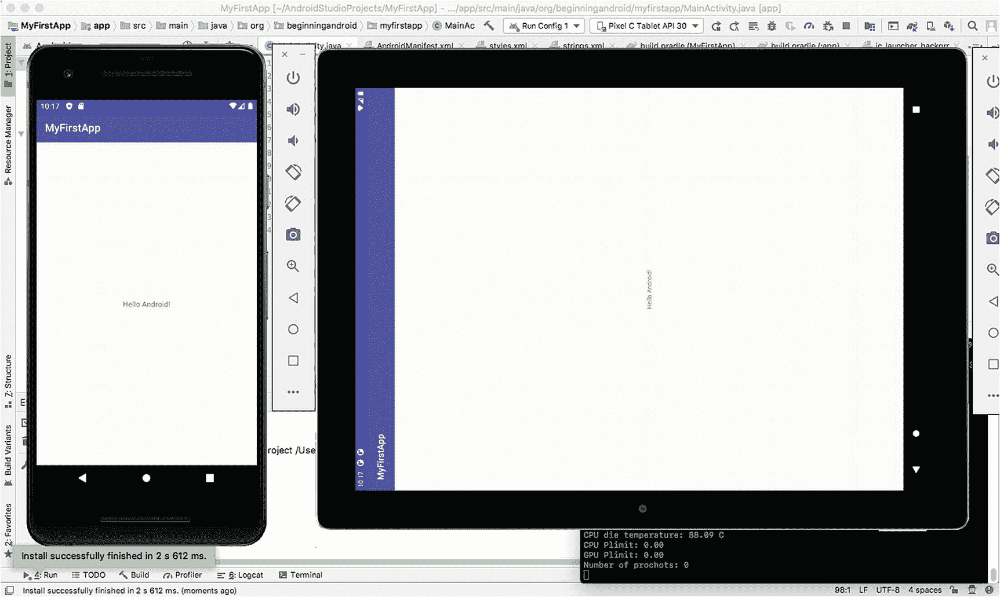
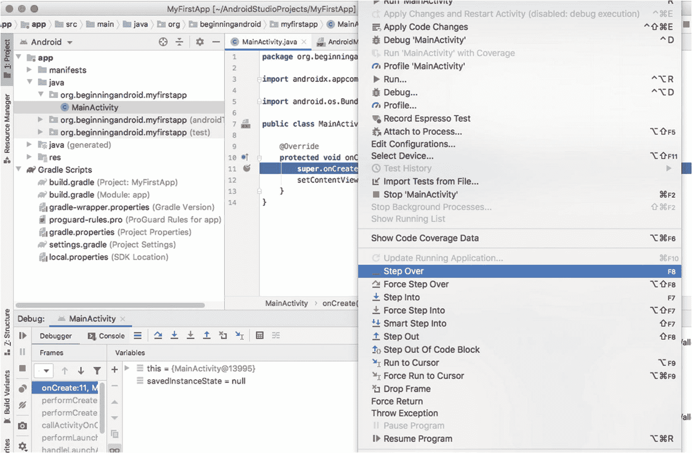

# 五、Android Studio 深入

像 Android Studio 这样的 IDE 的长期用户通常会对他们选择的 IDE 有多重要形成一种非常强烈、非常狭隘的观点——不仅对他们的生产力，而且对他们编写应用程序的乐趣。在这一章中，我的目标是展示和探索 Android Studio 的一些关键特性，这些特性将使您在构建 Android 应用程序时更加高效和快乐。

Android Studio 本身就是一个巨大的话题。有整本书都是关于 Android Studio 本身以及如何充分利用它作为 IDE 的。这本书的出版商 Apress 的一些很好的例子是 *Android Studio IDE 快速参考*(由 Ted Hagos 编写，ISBN 978-1-4842-4953-6)和 *Learn Android Studio* 系列(也由 Ted Hagos 编写)。在本书中，我们没有足够的时间将剩下的章节都用来讲述 Android Studio 本身，但是如果这一章让你对一个伟大的 IDE 所提供的可能性感到兴奋，你就知道下一步该去哪里了。现在，让我们深入研究 Android Studio 的一些关键部分，你现在应该开始了解。

## 从项目浏览器开始

回到第 [4](04.html) 章，我们简要介绍了项目浏览器和它的一些功能，展示了 Android 透视图和项目文件透视图。我们简要地研究了项目的这两个视图，但是没有详细讨论其他的项目浏览器视图选项。这让我们想知道，所有这些其他的观点是为了什么？

很高兴你问了。概括地说，Project Explorer 的其他视图选项旨在满足两个兼容的需求。首先，这些视图为您提供了查看项目的不同方式，通常强调或专注于一个特定的领域，以便您的时间可以用于完成工作，而不是与 Android Studio 的布局进行斗争。其次，这些观点也支持你作为开发人员的个人偏好和愿望，以及你更喜欢的工作方式。

### 轻松切换项目浏览器视图

让我们来看看这些视图中的一些，您可以探索所有其他视图，感受一下您喜欢的内容。图 [5-1](#Fig1) 显示了我们的 MyFirstApp 项目切换到使用项目源文件视图(同样，不是很长的图像，我并排粘贴了两个屏幕)。


图 5-1

Android Studio 项目资源管理器中的项目源文件视图

您可以在 src 文件夹层次结构下看到一些熟悉的条目，例如，myfirstapp Java 源文件及其 MainActivity 代码。如果您在这个视图中稍微浏览一下，就会看到其他的源文件，比如用于测试代码的模板文件，以及一些可编辑的 XML 文件，这些文件控制着可视化布局、可重用的字符串值等等。

但最值得注意的是没有显示出来的东西。您再也看不到 Gradle 构建文件、IntelliJ IDEA 首选项和配置文件、构建工件以及其他非代码项目。所有这些都是隐藏的，所以您可以专注于代码！“为什么要这样做？”我听到你问了。除了我在前面提到的个人偏好和专门化观点之外，Project Files 视图尤其是一些开发人员的最爱，他们发现当他们处于“流动”状态时工作得最好:一种精神状态，在这种状态下，您深深地沉浸在代码中，没有分心。

另一个流行的视图是项目视图，它看起来就像许多传统的 Java IDEs 一样，展示了项目的元素和组成部分。图 [5-2](#Fig2) 显示了这个视图，你会注意到一些直接的不同，特别是外部库和引用是如何出现的。


图 5-2

Android Studio 项目浏览器中的项目视图

我强烈建议您探索 Project Explorer 中的所有视图选项，并找到最适合您工作方式的变体。

需要记住的一点是，不管你使用什么视图或者切换视图多少次，Android Studio 都不会改变你的项目或者移动文件。它只是给你一个不同的虚拟视图。

### 使用项目浏览器上下文菜单

与您可能使用过的许多其他应用程序一样，Android Studio 提供了上下文菜单，您可以通过右键单击鼠标(或在 Mac 上按住 command 键单击)来访问这些菜单。当您在 Project Explorer 中浏览视图时，您应该调用您所看到的所有内容的上下文菜单，以便对所提供的内容有所了解。无论是比较、查找等文件管理操作，快速编辑选择，还是开始更严肃的代码管理操作，上下文菜单都是您应该熟悉使用的专业工具之一。

上下文菜单中的所有选项都可以在 Android Studio 的主菜单中找到，但这些选项通常被隐藏在三到四层菜单中。

## 使用 Android Studio 运行和调试

正如你在第 [3](03.html) 章中所看到的，让 Android Studio 运行你的程序的一个主要方法，无论是仿真的还是在设备上运行的，就是配置一个运行配置。我们稍后将再次讨论运行配置，但最好知道还有其他方式来运行您的应用程序。

### 使用运行配置运行:概述

我们在第 [3](03.html) 章的目标是让你的第一个应用程序尽可能快地运行，所以我们跳过了许多运行配置的细节。有一些关键的方面值得重新审视，因为您很快就会想要创建具有不同特征的进一步运行配置，以便在应用程序开发的不同阶段为您提供帮助。

通过 Android Studio 的运行➤编辑配置…菜单，调出“运行配置 1”的详细信息(或之前您用来保存运行配置的任何名称)。你应该会看到熟悉的屏幕显示你的运行配置，如第 [3](03.html) 章的图 [3-16](03.html#Fig16) 所示。对于任何运行配置，有各种选项分布在四个子窗口中。其中一些您可以在自己的时间里探索，但是您需要熟悉的主要配置项目如下。

#### 运行配置:常规选项

Module:指定 make 过程的目标模块，如果没有指定，则意味着整个项目都应该是目标。实际上，这有助于更大的多模块项目，在某些情况下，您可能只想重建/重新制作一个特定的模块——通常是因为这是唯一改变的模块。

install Options–Deploy:指示 Android 应用程序构建完成后应该发生什么。是应该在设备或模拟器上运行，因此需要部署它，还是您只对确认应用程序将干净无误地构建，而不需要实际运行它感兴趣？

启动选项–启动:该设置控制当成功的构建被部署和启动时会发生什么。应用程序应该按照 Android Manifest XML 文件运行并启动默认活动，还是应该在这个特定的运行配置中使用不同的起点(例如应用程序中的替代活动或根本没有活动)？

安装标志和启动标志目前不在我们运行配置的讨论范围之内。

#### 运行配置:杂项

杂项选项控制在部署和启动构建时，如何“清理”您的目标环境。所谓清理，我指的是日志、应用程序的先前版本等等作为运行配置的一部分被留下或清理的工件。

Logcat:我们将在本章的后面更多地讨论 Logcat，但是这些设置决定了 Logcat 的输出是否应该默认地通过 Logcat 工具显示给你，以及之前运行的输出是否应该被清除。如果任其增长，这些日志会变得非常大，所以如果这些日志变得难以处理，请记住清除日志设置。

安装选项:如果什么都没有改变，您可能想跳过再次部署您的应用程序，这可以在您更广泛的工作流中节省时间。知道自己不会影响正在运行的应用程序实例是很重要的，例如，在保存状态或从已知的良好启动条件下运行时。

#### 运行配置:调试器

那些在编写任何类型的软件方面经验丰富的读者会意识到，这不是一项完美的任务。事情出错，意外的行为发生，应用程序由于不可预知的原因而失败，等等！

一旦您花了一些时间编写、调试和审查代码，调试器屏幕上显示的选项随着时间的推移会变得更有意义。无论您的经验水平如何，都需要注意以下关键选项:

调试类型:本质上，这为 Android Studio 提供了关于项目中预期的代码类型的指导。这可以显式地设置为 Java、Native(通常指通过 Android 的本地开发工具包扩展的 C++)、Dual(Java 和 Native)或 autodetect。确切地指定预期的语言，而不是依赖于自动检测的一个优点是，在让 Android Studio 检查您的项目的语言类型时，您将节省少量时间，而不是让它为不存在的语言加载调试工具。

显示静态/全局变量:当出现问题时，许多开发人员首先使用的工具之一是检查工具——也就是说，当出现问题时，显示部分代码的当前状态的工具，例如分配给特定变量的值。该选项将静态/全局变量以及您在整个代码的方法中定义的变量添加到您的视图中。

调试优化代码时发出警告:语言编译器的一个非常有用的特性是，它们能够优化人类编写的代码，使其运行更高效。发生这种情况时，运行的代码严格来说并不是您编写的代码，即使结果应该是相同的。此设置允许您在转到调试已为您优化的代码时得到警告。

符号目录和 LLDB 选项等其他设置超出了本书的范围。

#### 运行配置:分析

任何形式的 Android 评测工具都花了很长时间才达到开发人员所需的成熟度和洞察力，以帮助他们了解他们的应用程序正在产生的环境需求。甚至在几年前，在 Android Studio 和 Eclipse 中，工具仍然达不到大多数人的期望。今天，这些工具一直在变得越来越好，当我们在后面的章节中深入研究这些领域时，我们将触及其中的一些。其中一些改进的选项可以直接在运行配置中进行配置，如下所示:

启用高级概要分析:对于任何使用 API 级别为 26 或更低的目标 SDK 的人来说，试图确定您的应用程序的即时环境中正在发生什么可能会令人沮丧，例如，网络行为和流量、处理或丢弃的事件等等。Enable Advanced Profiling 选项打开了为旧的目标 API 级别捕获更多指标的能力。对于任何以当代 API 级别为目标的人来说，例如 30+，这现在是 Android Studio 和相关工具中标准剖析行为的默认部分。

启动时开始记录 CPU 活动:该设置旨在分析应用程序使用时 CPU 周期的消耗情况。这至少有两个好处:第一是了解你的应用程序的各个部分将如何执行，这在考虑用户满意度时很重要——一个缓慢的应用程序可能会导致用户对你的应用程序感到失望。第二个好处是去掉了一个抽象层次。因为 CPU 使用是智能手机电池最繁重的事情，CPU 活动记录可以帮助您了解您的应用程序在使用时是否会成为电池消耗的重要因素。CPU 活动设置可能不会在您早期的 Android 学习经历中开始使用，但一旦您开始探索 CPU 密集型 Android 功能，如视频使用、设备上的计算等，它将成为您开发人员工作流程的支柱。

### 使用 avd 和连接的设备跑得更远

在第 [3 章](03.html)中，我们经历了创建初始运行配置的步骤，然后使用我们创建的第一个名为`Pixel 2 API 30`的 AVD 来实际运行您的应用程序，并向您显示最终的活动屏幕。使用 AVDs 是 Android Studio 为您提供的最强大的功能之一，使您能够跨大量虚拟设备进行测试和实验。

从技术上来说，AVD 管理器是一个独立的工具，Android Studio 集成并提供它来简化你的生活——这是我在第 [2](02.html) 章中介绍的“集成”咒语。除了能够从 Android Studio 中的工具菜单或工具栏按钮(显示为微型手机图标)启动 AVD 管理器，您还可以直接从命令行或 shell 运行 AVD 管理器的命令行版本，作为 SDK 工具目录中的独立工具。

为了找到 SDK 工具目录，从您的 Android 安装路径的根目录(例如，在 macOS 上的`~/Library/Android`或者在第 [2](02.html) 章中您为您在 Linux 或 Windows 下的安装选择的 Android 目录)，您将找到一个`sdk`子目录。在`sdk`子目录中，跟随进一步的子目录`tools ➤ bin`。包含在其中，您会发现一个名为`avdmanager`的二进制可执行文件。你可以从它的名字中猜出这是独立的 AVD 管理器可执行文件。如果您在查找 SDK 工具目录时遇到任何问题，请使用操作系统的搜索功能。

当您从命令行运行时，您会得到命令行输出，如清单 [5-1](#PC1) 所示，这取决于您传递给 avdmanager 命令的选项。

```java
$ avdmanager list avd

Available Android Virtual Devices:
    Name: Pixel_C_Tablet_API_30
  Device: pixel_c (Google)
    Path: /Users/alleng/.android/avd/Pixel_C_Tablet_API_30.avd
  Target: Google APIs (Google Inc.)
          Based on: Android API 30 Tag/ABI: google_apis/x86
    Skin: pixel_c
  Sdcard: 128 MB

Listing 5-1Command-line output for the avdmanager tool

```

#### 重温 AVD 管理器

现在你有很多方法来启动 AVD 管理器，继续从 Android Studio 工具菜单启动它，因为我们将为将来的练习创建第二个 AVD。如果你需要帮助，你可以重温第二章 [2](02.html) 的逐屏操作说明，但这里是我们第二个 AVD 的目标:

类别-平板电脑:我们想创造一个平板电脑大小的 AVD，这将有助于用书中的例子测试更大的设备。

名称和类型——Pixel C table t API 30:这是最好的多功能平板电脑之一，也是最近推出的一款直接从谷歌安装了简单安卓系统的平板电脑，是测试平板设备的绝佳基准。

系统映像–R(API level 30):这是最新的 SDK，它带来了 Android 为平板设备提供的最新功能。

**注意**您可能会看到 R 系统映像旁边有一个蓝色的下载链接。这表明您的计算机上尚未安装必要的英特尔 x86 系统映像。您需要单击下载链接并继续安装系统映像，以便此 AVD 能够成功启动并运行。

AVD 名称–Pixel C table t API 30:您可以使用您喜欢的任何名称，但是当我们在 AVD 管理器中看到 AVD 时，或者当正在运行、测试和调试您的代码时，作为正在运行的仿真器进程之一，此示例名称添加了一些有用的线索。

完成后，您应该在您的虚拟设备窗口中看到(至少)两个 avd，如图 [5-3](#Fig3) 所示。


图 5-3

AVD 管理器中配置了多个 AVD

创建第二个(或第三个或第四个)AVD 的目的不仅仅是显示 AVD 管理器的另一个屏幕截图。要使用 Android Studio 在多个设备或 avd 上同时运行相同代码的能力，需要有两个或更多 avd。

在您的 Android 开发工作中，有许多原因会让您想在不同的 avd 和设备上同时测试这种能力。在前面的章节中，我们提到了世界各地销售和使用的设备的多样性，支持的 Android 版本和 SDK 版本的分散性，以及其他因素，这些因素意味着您的应用程序可能会在许多微妙不同的设置中运行。首先，在几个设备上并行运行你的应用程序可以帮助你发现你的用户在现实世界中可能看到的一些怪癖和差异。这种能力的第二个主要好处是可以看到你的应用程序在小屏幕上一次显示一个活动的效果，而在大屏幕上——比如平板电脑——你的活动可能会缩放到不同的大小，或者使用片段作为多活动显示的一部分出现(我们将在第 [11 章](11.html)中介绍)。使用多设备或 AVD 测试的第三个原因是观察 Android 如何在不同显示密度和分辨率的屏幕上缩放或插入特定分辨率的图像。

您应该立即在多个 avd 上测试运行 MyFirstApp 应用程序。您可以从工具➤选择器件菜单选项或图 [5-4](#Fig4) 所示的器件选择等效工具栏下拉菜单中触发此操作。


图 5-4

设备选择工具栏下拉菜单

选择“在多个设备上运行”选项，将会出现一个名为“选择部署目标”的对话框。选择两个或更多的设备或 avd，例如，我们在书中迄今为止已经创建的 Pixel C Tablet 和 Pixel 2 AVDs，如图 [5-5](#Fig5) 所示。


图 5-5

选择多个目标以在 Android Studio 中启动您的应用程序

同时启动多个 avd 将花费一些时间，但是经过一点耐心，您应该会看到您的 avd 启动，并且 MyFirstApp 应用程序部署并运行在所有 avd 上，如图 [5-6](#Fig6) 所示。



图 5-6

同时部署在多个 avd 上的应用

#### 在真实设备上运行您的代码

虚拟设备对任何开发人员来说都是一个福音，但是有时候在真实设备上看到你的代码是一件很平常的事情。在最近发布的 Android Studio 中，谷歌在真实设备上测试和运行应用程序方面取得了巨大进步。历史上，将应用程序部署到真实的手机上需要一长串命令行步骤，虽然今天您仍然可以走这条路，但 Android Studio 使检测和使用通过 USB 电缆连接到您的开发人员机器的 Android 设备变得很容易。

为了在开发应用程序时使用 Android 手机测试它们，您需要在手机上启用开发者选项。谷歌一直有一个窍门来实现这一点，那就是打开手机上的设置，滚动到关于手机选项。“关于电话”屏幕上的最后一个选项是内部版本号。点击显示的数字七次(是的，七次)，你会看到一个倒计时出现，让你知道你只剩下几个点击在开发者模式启用之前。

一旦你点击了足够多的版本号，你会看到一个屏幕通知，开发者选项现在已经启用，一个新的菜单选项将出现在设置下，显示开发者选项。默认情况下，它会启用一个名为 USB 调试的子选项。仔细检查你手机上的情况，如果还没有启用，就打开它。

在手机上启用开发人员模式后，通过 USB 电缆将其连接到您的开发人员计算机。您的手机应该会被自动检测到，然后 Android Studio 会将其识别为运行您的 Android 应用程序的潜在目标。

为了进行测试，从菜单中选择`Run` ➤ `Select Device`，或者打开 avds 设备工具栏上的下拉菜单，如图 [5-7](#Fig7) 所示。


图 5-7

从 Android Studio 选择连接的开发人员模式 Android 设备

选择您的连接设备，在我的例子中是 Nexus 5 手机。等待几秒钟，Android Studio 将构建、打包和部署应用程序到连接的设备，然后您应该会看到您的应用程序加载并在您的手机上运行，如图 [5-8](#Fig8) 所示。


图 5-8

在连接的 Android 手机上运行 MyFirstApp

## 调试而不是运行您的代码

任何刚接触应用程序开发的人最终都需要了解当您的代码“出错”时会发生什么无论是意外的结果、奇怪的行为、应用程序崩溃还是其他问题，调试都是解决应用程序问题的主要方法。

调试是一个巨大的主题，所以我们不会在专门讨论 Android Studio 工具的章节中试图掌握它，我们将首先关注 Android Studio 中的主要调试工具，然后在整本书中，我们将在介绍更复杂的 Android 应用程序时扩展调试和相关主题。您也可以在本书网站上阅读更多关于调试的主题，网址为 [`www.beginningandroid.org`](http://www.beginningandroid.org) 。

在 Android Studio 中，有助于调试的四个关键概念如下。

### 设置和清除断点

断点是源代码中的一个标记，它指示要在何处中断或停止代码的执行，以便更详细地检查行为或问题。要在代码中设置断点，在项目浏览器中双击文件或对象，打开您想要处理的代码——在我的例子中，它将是 MainActivity.java 文件。在文件打开的情况下，点击文件旁边显示的行号右侧的暗灰色空白处，如图 [5-9](#Fig9) 所示。


图 5-9

在 Android Studio 中为调试设置断点

您应该会看到在您单击的地方出现一个红圈，表示设置了一个断点。如果出于任何原因，这似乎没有使代表断点的红圈出现，请打开“工具”菜单并选择“切换行断点”。再次单击或再次选择切换选项将删除断点。

### 启动应用程序进行调试

正如您可以通过单击运行选项或选择已设置的运行配置来运行应用程序一样，您也可以启动应用程序进行调试。这实际上做了同样的事情，调用 Gradle 来构建您的应用程序，将应用程序部署到指定的设备或 AVD，等等。一个不同之处是 Android Studio 会帮助你调试。

要在调试模式下启动应用程序，只需从运行菜单中选择调试“运行配置 1”(或类似选项)。除了构建和部署步骤，您还会看到 Android Studio 中的下方视图会自动打开并显示调试窗口，可以访问调试器、控制台和其他调试工具，如图 [5-10](#Fig10) 所示。


图 5-10

Android Studio 中自动触发的调试视图

根据您正在调试的内容，如果您已经设置了断点，您还会看到运行菜单中的附加菜单项被激活，如图 [5-11](#Fig11) 所示。



图 5-11

调试选项，可以单步执行、遍历和跳出 Android Studio 中的部分代码

我将在下一个标题下解释这些“步进”选项。

### 调试时逐句通过代码

你在图 [5-11](#Fig11) 中看到的“单步执行”、“单步进入”、“单步退出”等选项对于仔细检查你的代码正在做什么是不可或缺的。通过一次单步执行、跳过或跳出一行代码，而不是运行整个代码库，您可以一次单步执行应用程序逻辑中的一个操作，并且与其他工具(如变量检查和查看活动 ui 中的视觉或行为变化)相结合，您可以看到每行逻辑的结果。

### 附加调试器

您可能并不总是清楚在哪里设置断点或者单步执行或遍历代码。有时，您可能想更深入地了解应用程序中发生的事情，以理解一些无法解释的行为或问题。这就是调试器工具的用武之地。我们无法在短短几页，甚至一整章的时间里对调试器进行公正的评价，所以我们不会强调这一点。你可以在本书的网站 [`www.beginningandroid.org`](http://www.beginningandroid.org) 找到更多关于调试器强大功能的信息。

要调用调试器，并让它将自己附加到正在运行的应用程序上，以帮助您了解正在发生的事情，您可以使用运行菜单中的最后一个选项——将调试器附加到 Android 进程。您的应用程序必须已经在运行，这样才能工作。

## 查看您的跑步记录

现在，您已经看到了足够多的在 AVD 或真实设备上运行的第一个应用程序的例子，您可能想知道我所说的“查看您运行的内容”是什么意思要解开这个谜团，除了查看完成的应用程序中呈现的活动之外，还有更多“看到”您的应用程序运行的内容。

Android Studio 提供了几个非常有用的工具，有些人会说是关键的工具，让您可以查看应用程序由 Gradle 脚本(或其他工具)构建时发生了什么，以及应用程序运行时发生了什么的诊断和日志信息。

在 Android Studio 窗口的底部，状态栏的正上方，你会看到一组按钮，可以让你快速访问这些工具，它们的名称类似于`TODO, Build, Logcat,`等等，如图 [5-12](#Fig12) 所示。


图 5-12

在 Android Studio 中轻松访问事件日志、构建输出、Logcat 等

让我们看看这里的一些关键工具，这样您就可以放心地将它们应用到您不断扩展的开发人员工具集中。

### 了解您的体型

构建工具在构建输出窗口中向您显示构建过程的摘要，这可能是一条“构建:已完成”消息，带有一个绿色勾号和一些计时信息，如图 [5-13](#Fig13) 所示，也可能是一组阻止构建工作的错误或问题。


图 5-13

Android Studio 中项目构建的构建输出视图

您还将看到实际执行应用程序构建的任务列表(在我的例子中，有 20 个单独的构建步骤)和一个到 Build Analyzer 的链接，它提供了对每个任务花费的时间以及如何改进的更深入的探究。

### 了解事件日志中的事件

补充构建工具的另一个工具是事件日志。事件日志显示所发生的操作的高级视图，例如将新构建的应用程序加载到设备或 AVD 上所采取的步骤，以及这些步骤中发现的任何问题。清单 [5-2](#PC2) 显示了构建 MyFirstApp 应用程序并在多个 AVD 实例上启动它的事件日志输出。

```java
22:17 Executing tasks: [:app:assembleDebug] in project /Users/alleng/AndroidStudioProjects/MyFirstApp

22:17 Gradle build finished in 9 s 5 ms

22:17 Install successfully finished in 11 s 455 ms.

22:17 Install successfully finished in 2 s 612 ms.

22:18 Emulator: emulator: INFO: QtLogger.cpp:68: Warning: Error receiving trust for a CA certificate ((null):0, (null))

22:18 Emulator: Process finished with exit code 0

Listing 5-2The Event Log from building and launching MyFirstApp on two AVDs

```

您可能在事件日志中看到的典型错误可能会停止构建或后期构建活动，例如为计算机上不存在的模拟设备指定 SDK 或基本映像。事件日志中后一个问题的示例如下:

```java
Emulator: emulator: ERROR: This AVD's configuration is missing a kernel file! Please ensure the file "kernel-ranchu" is in the same location as your system image.

```

### 了解 Logcat

Logcat 是测试和调试工具库中最有用的工具之一。它的工作是在您的应用程序运行时，以及当您的应用程序意外停止运行、崩溃、出现问题、冻结等时，帮助从设备或 AVD 收集诊断和运行时信息。

Logcat 将提供一个类似控制台的界面来检查和查看来自设备或仿真器的关键系统消息，包括所有重要的堆栈跟踪，如当应用程序在运行时遇到错误或异常时，发生了什么和发生了什么错误。这种能力在以下情况下非常有用:代码可能在一个环境中运行得非常好，比如在开发人员工作站上运行 AVD，但在特定品牌或型号的手机上运行时会遇到意想不到的问题。

要使用 Logcat，只需在应用程序运行时，或者在设备或 AVD 执行其他任务(如启动)时，单击工具栏上的按钮。默认情况下，您会看到一长串 Logcat 条目，这些条目是从您的应用程序和设备中收集的，如图 [5-14](#Fig14) 所示。


图 5-14

Android Studio 中的 Logcat 输出

这个示例 Logcat 输出是相当无害的，但是当出现问题时，Logcat 中的堆栈跟踪和其他诊断信息是非常宝贵的。

## 重新审视 SDK 管理器

Android Studio 提供的主要工具的最后一个方面是重温你在第 [3](03.html) 章中第一次看到的 SDK 管理器。通过打开“工具”菜单并选择 SDK 管理器条目，您可以随时调用和使用 SDK 管理器。您可以这样做来查看您已经安装的 SDK 版本以及任何未安装或有更新的版本，如图 [5-15](#Fig15) 所示。


图 5-15

重新审视 Android SDK 管理器

正如您所料，您可以检查您没有的任何 SDK 版本，然后单击 Apply，SDK Manager 将开始在后台下载和安装这些版本。当你在两种情况下工作时，你很可能需要这样做:第一，当你确保你有代表普通或流行的 Android 版本的 SDK 时，例如 4.4“kit kat”，第二，当你测试新的功能时，因为谷歌结合新版本的 Android 发布了新的 SDK。

但是使用 SDK 管理器还有另一个原因，那就是它能够帮助你为 Android Studio 体验添加额外的好东西。切换到 SDK 管理器中的第二个标签，标题为 SDK 工具，您将看到一个额外的宝库，很快就会成为您最喜爱的工具。在本书的其余部分，我们将在相关章节中重新讨论这些工具，但是我将标记开发人员经常使用的两种工具。这些是 Android SDK 命令行工具，提供了从命令行管理和控制 SDK 包的额外功能，以及各种附加的 Google Play 库和 SDK，帮助您构建使用谷歌专有的 Google Play 服务的依赖项和库的应用程序。

您可以现在就下载这些内容，或者等到本书的后面部分再下载。

## 突出 Android Studio 的其他主要功能

本章介绍了 Android Studio 的一些关键特性，这些特性可用于在构建应用程序时管理、执行、检查和诊断应用程序，以及管理和使用相关的 SDK 和构成应用程序开发工作一部分的其他工具。

但是到目前为止，Android Studio 中您将使用的最大的工具集是那些与编写代码、审查代码、详细检查代码、重写代码等直接相关的工具。我们将在本书的第 2 部分介绍 Android Studio 的许多方面，同时介绍 Android 应用程序编码的许多部分。

## 摘要

本章已经向你介绍了任何软件开发人员的主要工具，IDE。现在，您应该可以放心地探索 Android Studio 中的更多选项，因为您知道您总能找到项目所需的核心工具。