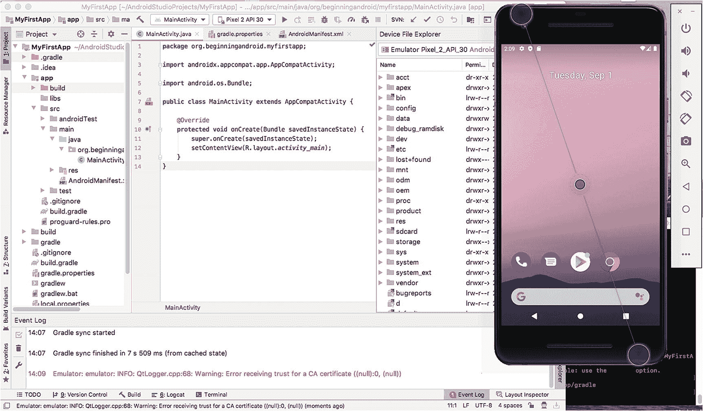
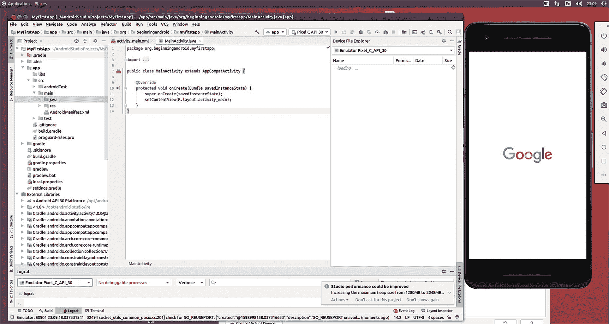
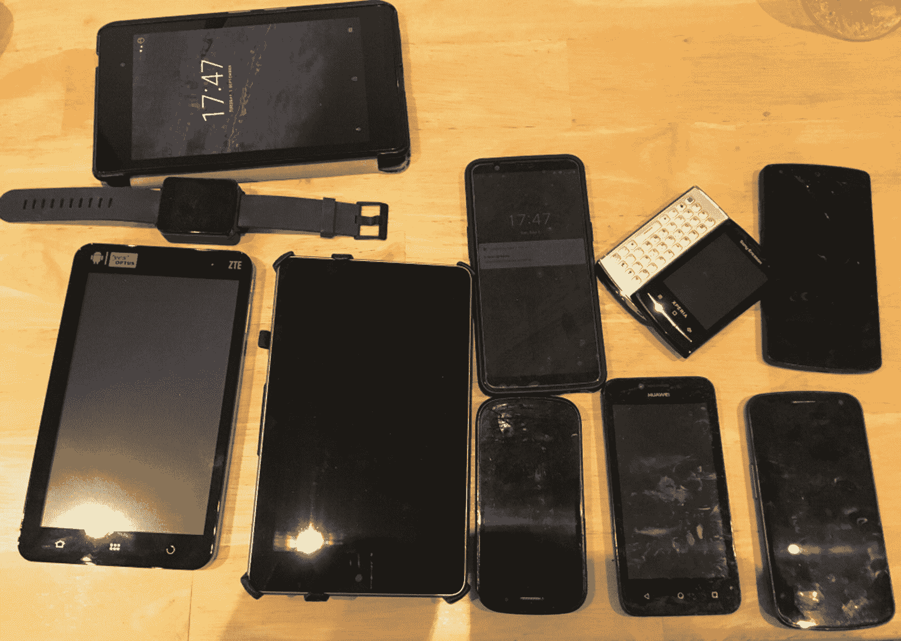
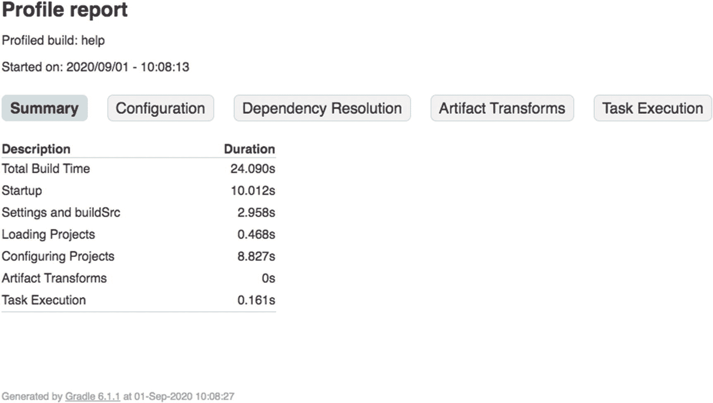
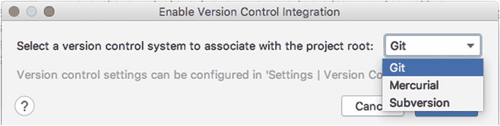
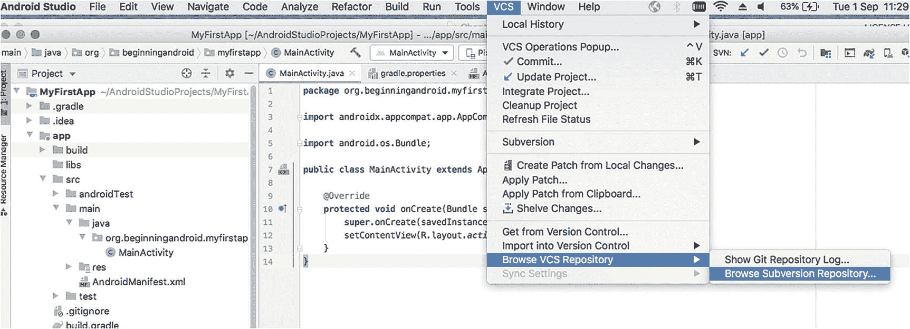

# 六、掌控您的整个开发者生态系统

为 Android 开发做准备不仅仅是安装 Android Studio。虽然你可以做到这一点，也只能做到这一点，但你最终会发现，你的电脑及其运行的软件的其他方面，将对你作为一名 Android 开发人员的生产力、抱负和能力产生巨大影响。这一章并不详尽，但确实给了你许多重要的基本考虑，以及到哪里去进一步了解的链接。继续读！

## 选择专用开发人员硬件

在第 2 章中，我介绍了一份简短的清单，列出了严肃的 Android 开发者可能会感兴趣的电脑方面。这里再总结一下:

1.  我将在 Android 开发中使用什么台式机或笔记本电脑硬件？

2.  我将在台式机/笔记本电脑上运行什么操作系统？

3.  在使用 Android Studio 之前，我的系统需要什么先决条件？

4.  在开发过程中，我将使用哪些 Android 手机(如果有的话)？

我当时提出的格言仍然适用。几乎所有你手边最近几年生产的电脑都可以作为不错的开发人员工作站。无论是台式电脑还是笔记本电脑，它都能完成工作。

但是这本书不仅仅是关于完成工作。如果你真的渴望成为一名专业的 Android 开发人员，那么就像其他专业人员依赖工具和设备来提高效率和杠杆作用一样，你也应该考虑一下什么工具会促进你的开发工作和你制作优秀应用程序的能力。

让我们首先看看如果你正在寻找在构建 Android 应用程序时会给你带来不公平优势的开发者硬件，你可能要考虑的因素。

### 确定哪种 CPU 最适合您

2020 年，x86 _ 64 CPUs 有很多选择:AMD 的锐龙和 Threadripper 以及英特尔的 Core 系列 CPU。您可以找到许多关于哪个最好的意见，通常这些判断会考虑原始 CPU 速度(时钟频率)、封装中的内核数量、不同级别的板载高速缓存以及其他几个特性。

对于专门的 Android 开发机器来说，任何当代的英特尔或 AMD CPU 都足够了。如果你正在寻找 2020 年时代 CPU 的具体建议，你应该看看英特尔酷睿 i5 和酷睿 i7 CPUs 以及 AMD 锐龙 7 和锐龙 9 CPUs。这些处理器具有足够的速度、可观的内核数量(通常为四个或更多)，以及良好的 L1/L2/三级高速缓存。

AMD 和英特尔都有更强大的 CPU，但通常你会看到这些 CPU 有更多的内核，偶尔还支持其他东西。在 Android 开发领域，内核越多并不总是越好。为您并行运行的关键活动是您在 Android Studio 中工作并在一个或多个 avd 中查看结果的任何同步活动，以及对于足够大的多项目应用程序，并行构建活动(如果 Gradle 被配置为支持它们)。我的建议是，省下最贵的酷睿 i9 和类似的 AMD 处理器的钱，把这些钱用在开发者设置的其他部分，比如更多的内存或更好的屏幕。

另一个越来越受欢迎的 CPU 架构是 Arm。Arm 是当今世界上几乎所有移动设备的核心，其基础是获得 Arm 架构许可的“片上系统”(SOC)设计的广泛流行。基于 Arm 的台式机已经出现，甚至 Arm 服务器市场也刚刚兴起，但这里有一个有趣的难题。

虽然今天全球销售和使用的绝大多数 Android 设备都是由 Arm 处理器构建的，但使用基于 Arm 的计算机来处理计算繁重的工作负载(如构建/编译 Android 应用程序)仍然是一个挑战。可以做到；毫无疑问。但是速度和性能的权衡仍然很重要。最大的障碍是你期望使用的工具是否适用于基于 Arm 的计算机。最值得注意的是，Android Studio 不适用于 Arm——它只能在 x86 架构的计算机上运行。同样，谷歌只为 x86 封装了 Android SDK 的许多版本，而不是 Arm。这意味着如果你选择一个基于 Arm 的开发机器，你将需要用你自己的构建工具引导你的所有工作，解决没有容易捆绑的 Android SDKs 的问题，等等。我不会推荐这种挑战。

### 内存太多永远不够！

我有时希望给自己添加内存就像给台式电脑添加内存一样简单。现在，为了更好的开发者火力，你和我将不得不满足于购买 RAM。

如果你回想一下第 2 章，你会记得谷歌推荐 Android Studio 的内存最低为 4 GB，首选的基本内存为 8 GB。买只有 4 GB 内存的新电脑其实挺难的。所以，引用一部著名电影的话，8 就够了吧？

别这么快！你当然可以在 8 GB 内存的电脑上高效地开发 Android 应用程序。事实上，我正在编写这本书的很大一部分，并在 2015 年的 MacBook Air 上构建一些你看到的例子，MacBook Air 有 8 GB 的内存，所以这不仅仅是理论上的可能。然而，我可以告诉你，它有其明显的局限性和挫折。一些值得注意的例子是我试图运行 Android Studio 和 AVD，以及我在本章后面和整本书中讨论的用于图像和视频处理的开源工具。8 GB 很快就耗尽了，MacBook 尽职尽责地开始增加——并越来越多地使用——磁盘上的交换空间，以平衡实际内存和我对它提出的更高要求。

相比之下，我信赖的台式电脑。它甚至更老，是近十年前的“老式”Dell Precision 工作站-我不确定戴尔是否还会生产这些工作站。但它有 32 GB 的内存，使用 Android Studio、多个 avd 和其他几个工具时不会漏拍。

Note

你可以从我的设置中看出，我在推荐你购买硬件时并没有收取加盟费或回扣。如果你有时间机器，请跳回到 2010 年或 2015 年购买你的版本我的硬件！

如果你正在指定你自己的 Android 开发者系统，我给你的简洁建议是:没有人抱怨他们有太多的 RAM！如果可以，至少要 32gb；对于奢侈品来说，64 GB 对于未来几年的 Android 开发来说已经足够了。

对于那些希望购买或获得笔记本电脑作为主要开发机器的人来说，请特别注意您的首选型号可以占用的最大内存是多少，以及在购买后内存是否可以更改。也就是说，内存是否焊接或固定在适当的位置，如果不采取昂贵的、可能导致保修失效的措施，就无法更换或交换？你可能会发现自己被限制在 16 GB 以内——如果你能选择一个支持 32 GB 的型号，你将来会感谢你自己(也许还会感谢我！).

### 全部储存起来！

随着您开始构建越来越多的 Android 应用程序，您对磁盘空间的需求将会增加，以容纳各种项目、资源等等。很明显，有些地方会消耗磁盘空间，比如磁盘上用于存储源代码文件(非常小)以及图像和视频文件(可能非常非常大)的空间。

当你想到它们时，有一些 Android 开发的特定方面是显而易见的，例如不同版本的 Android SDKs，每个版本可能需要高达 1 GB。

在考虑您的存储需求时，avd 是一个隐藏因素。因为很容易产生一个新的 AVD 图像来测试屏幕大小或设备格式，所以很容易在你知道之前就有 20 个、30 个或更多的 AVD。如果你真的想测试各种尺寸和分辨率的屏幕，最起码要有几十个 avd。

有了几十个或几十个 avd，您可以轻松地吃掉 50 GB 或更多。avd 最大的存储问题之一是您选择允许多少板载存储或模拟 SD 卡存储。这些选项是通过分配您的磁盘存储来模拟的，这意味着如果您想要模拟最新的 128 GB 存储的一加 7 设备，那么您的 AVD 将消耗 128 GB 或更多的实际磁盘空间！当然，您不必为模拟 SD 卡和设备上存储使用如此大的分配，但通常您至少会有一个可用的数量，所有这些加起来。

当您开始 Android 应用程序开发之旅时，实际的存储空间应该是 50 GB。这将让你可以制作几代 Android SDK 和大量不同大小和配置的 avd，以及 Android Studio 和其他工具。为了适应未来，特别是对于各种用于测试目的的 avd，您应该以 100 GB 或更多为目标。

与存储大小同样重要的是存储类型及其相关速度。传统的旋转硬盘驱动器当然便宜，但代价是数据传输速度，或 IOPS(每秒输入/输出操作数)。固态硬盘(SSD)等现代存储选项可显著提升数据传输性能，从而加快构建和运行 avd、部署大型应用程序、依赖重要图像和视频的应用程序以及任何数据密集型计算或操作的运行速度。

如果可以选择，请始终选择固态存储选项，尤其是如果您计划进行任何数据密集型或计算密集型开发。对于那些正在寻找专用笔记本电脑以满足开发需求的人来说，鉴于近年来这个市场向固态硬盘的巨大转变，你会发现自己被宠坏了。

### 观看这一切！

如果你想成为一名专注于 Android 应用的开发者，你将会经常盯着屏幕。有鉴于此，你可能要考虑如何充分利用你将看到的屏幕，以及你是否想要一个以上的屏幕。

当谈到显示器或显示器时，许多开发者的快乐将基于深深的个人因素。你喜欢大屏幕吗？你喜欢多屏吗？不同方向的屏幕对你有帮助吗——横向还是纵向？你会把笔记本电脑的屏幕和固定屏幕混合在一起吗？除此之外，还有更多的考虑因素，但我会指出两个将对您产生长期有益影响的关键特征:大小和密度。

当谈到屏幕尺寸时，有一些实用性会让你相信至少一个大屏幕是值得花费的。回头看看第 [5](05.html) 章的图 5.6，你会看到两个 avd 并排运行，一个代表普通手机屏幕，另一个代表平板电脑屏幕。你不会惊讶地发现，图中的视图几乎占据了我的 MacBook Air 的所有 13 英寸屏幕。如果你仔细看，你可以看到隐藏在 AVD 屏幕后面的我的 Android Studio 会话的微小片段。但你只能看到这些。如果没有一系列非常尴尬的妥协，这种尺寸的屏幕不可能在 Android Studio 和 AVD 中并行开发。你可以在 Android Studio 中调整屏幕和窗口的大小，你可以平铺窗口，试图在运行单个 AVD 的情况下将所有东西都挤进去，如图 [6-1](#Fig1) 所示



图 6-1

在 13 英寸的笔记本电脑屏幕上同时运行 Android Studio 和 AVD

如果你认为这有助于实时调试或同时比较不同的布局，让我声明这不是那种东西。只是很大的痛苦！相比之下，在 24 英寸的屏幕上，Android Studio 和多个 avd 愉快地生活在一个拥有充足空间的屏幕上，如图 [6-2](#Fig2) 所示。



图 6-2

在 24 英寸屏幕上运行 Android Studio 和多个 avd

我会让这些数字说一千个字。当你看完之后，我关于屏幕尺寸的结束语就不需要更多的支持了。如果可以，买个大屏！

谈到屏幕质量，特别是像素密度，我们再次进入一些非常主观的领域。在 2020 年的市场上，当这本书正在编写时，你可以从多代“高密度”中选择，以及 4k，5k，甚至 8k！你的个人品味和偏好将是最重要的考虑因素，但我建议你记住以下两点:

1.  **查看运行中的屏幕**。如果可以的话，去一家零售商那里，他们可以向你展示实际连接到任何一种电脑上的屏幕。这可以让您感受显示器的实际表现，并让您体验亮度、白平衡、对比度和刷新率等因素，以满足您对屏幕性能的要求。

2.  **瞄准一个分辨率密度和你计划开发的应用一样高或者更高的屏幕**。我们将在本书的其余部分更多地讨论 Android 屏幕分辨率选项和机制。为了确保您的开发和测试尽可能向您展示您的作品、图像、视频和其他应用程序资源在真实设备上的外观，请确保您为您的开发系统选择的屏幕至少与您的目标设备一样好，如果不是更好的话。否则，你会对现实世界中运行的事物产生扭曲的想法。

### 连接这一切！

开发人员设置需要考虑的其他方面包括:

1.  键盘和鼠标:看起来很普通，但是你会经常使用这些外设。不要满足于你不喜欢的人！

2.  USB 端口和电缆:如果你计划用 Android 设备对你的应用程序进行广泛的测试，那么有足够的 USB 端口和电缆以及合适的适配器是值得的。大多数旧的 Android 设备使用 micro-USB 连接器，最近的型号切换到 USB-C 风格的连接器。

3.  充电电缆、充电座和设备:同样，如果你打算使用很多真正的 Android 设备，保持它们的电源就有点麻烦了。虽然它们可以通过 USB 连接到您的开发人员机器进行充电，但历史 USB 协议版本的功耗是有限的。直到 USB-C,“标准”USB 才可以汲取超过 500 mA 的电流。在可能的情况下，留出空间，并考虑插入墙上插座的电量。

很容易忽略这些要点，但是它们有助于使您的开发人员体验更加顺畅和愉快，如果您忽略它们，您会发现它们会增加摩擦和挫折，破坏您的最佳努力。

## 测试手机和平板电脑

让我从测试手机这个话题开始，首先我要说明的是，并没有什么铁一般的规则要求你必须有一部 Android 手机来测试你的应用程序。许多应用程序都是在完全模拟的环境(如 AVDs 等)中测试的基础上构建和发布的。

然而，许多应用程序是基于一系列 Android 设备上的真实世界测试和反馈构建的，在真实世界的情况下，可以检测和解决这些古怪和差异。而且有区别！虽然 Android SDK 和 Android 的核心平台功能(几乎)是通用的，但手机供应商和电话公司有无数种方式来调整和改变 Android 的默认行为。通常，这些“电信公司”这样做是为了试图将自己与其他电话公司区分开来，或者从一个更愤世嫉俗的角度来看，他们试图将自己注入一个位置，希望他们的用户认为他们比实际上更重要。

不管是什么原因，你会发现自己在 Android 开发者之旅的某个时候会问自己是否需要花钱购买不同的 Android 手机来测试你的应用。我不能给你一个明确的答案，但我可以给你一些建议，帮助你决定花多少宝贵的时间和金钱来购买测试手机。

### 选项 1:全虚拟测试

当你开始你的开发之旅时，坚持使用 Android 虚拟设备是一个非常好的策略。老实说，它在许多成功的开发人员的整个职业生涯中为他们服务。随着 Android Studio、Android SDKs 以及来自英特尔等其他供应商的支持工具的每次发布，走这条路而不在专用测试硬件上花费任何额外的时间或金钱越来越可行。

缺点是，有时您将难以复制真实世界的体验，例如欣赏应用程序的真实性能，并且您还可能成为我在前面提到的电信公司引入的“特殊功能”的受害者。

### 选项 2:开始虚拟化，并使用顶级设备进行扩充

广泛使用 avd 并有选择地增加一些关键硬件选择的混合方法恰好是我的偏好。这有几个原因:

1.  使用 AVDs 越来越有效，如前面选项 1 所述。

2.  市场的很大一部分由一家厂商代表:三星。购买一台三星设备(或几台设备)会让你接触到世界各地使用的大多数真正的 Android 设备。

3.  谷歌自己已经推出了几代连续品牌的安卓设备，先是 Nexus 系列，最近是 Pixel 系列。拥有这些设备中的一个，您就可以看到您的应用程序在没有电信“增强”的设备上的外观和行为

如果你采用这种方法，购买少量的手机可以让你测试大量潜在用户的真实体验。

### 选项 3:买，买，再买一些

尝试测试所有边缘情况、怪癖、奇怪行为和 bug 的选项吸引了一些开发人员。在 Android 领域做到这一点需要很大的耐心，更重要的是要有雄厚的财力！您可以轻松地收集几十个、几十个甚至几百个设备，但仍然无法涵盖您的用户在现实世界中可能遇到的所有奇怪的设备及其奇怪的问题。此时，你的银行余额可能也会出现一些奇怪的问题！

我不推荐这种方法，但是我承认我没有将 Android 开发和应用程序推进到会暴露很多这些问题的高要求领域。我试图积累一个设备测试库，如图 6-3 所示。



图 6-3

我收集的安卓设备，跨越了十多年的安卓历史

我在 20 多台设备前停下来，我的银行存款感谢了我！

### 选项 4:其他人的硬件

关于云计算，我最喜欢的一个笑话是，它只是在别人的硬件上运行你的代码。如果你明白我的日常工作，那就更有趣了！然而，幽默的背后是一个有用的见解，即在真实设备上测试您的 Android 应用程序最好是在其他人负责拥有和提供这些设备时进行。

在写这本书的时候，有一系列的商业选择可以让你在一系列真实的设备上测试你的应用程序，你不必自己去买。您可以租用或支付访问即服务，并获得在各种手机上进行测试的所有好处，无需购买手机的前期成本，也无需维护手机的后续成本。

这超出了本书的范围，无法一一列举这些服务，但是这里有一些你现在可以从商业供应商那里获得的主要选项，你当然可以从那里搜索到与之竞争的选项:

1.  AWS 设备农场:AWS 设备农场来自所有云的供应商——亚马逊。Amazon 提供对来自众多制造商的大约 400 种不同设备的访问，并提供有用的工具来管理您浏览器中的测试工作负载。更多详情请点击 [`https://aws.amazon.com/device-farm/`](https://aws.amazon.com/device-farm/) 。

2.  谷歌 Firebase 测试实验室:谷歌版本的许多 Android 设备都可以远程访问(它们也可以访问各种苹果 iPhones 和 iPads)。Google 还提供了一些很棒的附加工具，用于 UI 测试和自动化他们设备上的测试运行。更多详情请点击 [`https://firebase.google.com/docs/test-lab/`](https://firebase.google.com/docs/test-lab/) 。

3.  三星远程测试实验室:作为 800 磅重的 Android 设备的大猩猩，三星是测试你的应用程序的显而易见的选择。三星的远程测试实验室拥有他们测试实验室中几乎所有可用的设备，加上方便的工具，应该在您的测试即服务候选名单上。更多详情请点击 [`https://developer.samsung.com/remote-test-lab`](https://developer.samsung.com/remote-test-lab) 。

还有其他可用的商业服务，以及从世界各地的 Android 开发者社区共享或借用设备的选项。将上述内容视为一个起点，而不是一个明确的指南。

## 使用构建工具构建

如前几章所述，Gradle 是 Android Studio 使用的构建工具，用于将 Android 应用程序的所有部分整合在一起并创建成品。Gradle 也有丰富的选择，可以(事实上也确实)跨越整本书。我鼓励你开始探索 Gradle 选项来扩展你构建 Android 应用程序的能力。这里有三个快速提示，让你开始并帮助你找到更多。

### 更新 gradle.properties 文件

不要害怕打开项目的 gradle.properties 文件，看看它显示的设置。默认文件中有很多解释性的注释，您应该可以放心尝试。例如，您将看到一个为 Java VM 设置内存的条目，如下所示:

```java
org.gradle.jvmargs=-Xmx2048m

```

尝试将该值更改为`Xmx1024m`,看看这会如何影响构建时间——您实际上将 JVM 的可用内存减半。如果你有足够的内存，试试`Xmx4096m`给 JVM 两倍的默认内存，看看这样是否能加快速度。随着您对 Gradle config 了解的越来越多，请重新访问您的属性文件以应用您所学到的内容。

### 使用 Gradle 命令行

Gradle 的许多功能都巧妙地集成到了 Android Studio 中，并在您执行各种操作时触发。但是你的项目也会有一个 Gradle 的命令行工具，名为 gradlew。它位于项目的根目录中。如果您在那里打开一个 shell 或命令提示符并运行命令行可执行文件，如下所示

```java
./gradlew

```

您将看到一个有用的列表，其中列出了 Gradle 提供的非常有用的命令行选项和工具。你也可以跑步

```java
./gradlew --help

```

获取所有命令行选项和工具的详尽列表。首先要研究的一个非常有用的选项是概要分析选项，它查看构建应用程序时需要花费的时间。调用它并查看清单 [6-1](#PC4) 中的结果。

```java
Welcome to Gradle 6.1.1.

To run a build, run gradlew <task> ...

To see a list of available tasks, run gradlew tasks

To see a list of command-line options, run gradlew --help

To see more detail about a task, run gradlew help --task <task>

For troubleshooting, visit https://help.gradle.org

BUILD SUCCESSFUL in 24s
1 actionable task: 1 executed

See the profiling report at: file:///Users/alleng/AndroidStudioProjects/MyFirstApp/build/reports/profile/profile-2020-09-01-10-08-13.html
A fine-grained performance profile is available: use the --scan option.

Listing 6-1Invoking Gradle profiling from the command line

```

Gradle 生成了一个 HTML 格式的报告，并将其放在输出中显示的文件中。在您选择的浏览器中打开该文件，您将看到 Gradle 对项目构建时间的见解，如图 [6-4](#Fig4) 所示。



图 6-4

Gradle 分析报告

### 访问 gradle.org 了解更多信息

网上有大量关于 Gradle 的信息，该项目的主页是一个很好的起点。一旦你尝到了它的厉害，你会发现它成了你的首选工具之一。

## 用源代码管理管理您的代码

许多严肃的开发人员面临的另一个大问题是如何管理他们的源代码、项目和相关资源。源代码控制是使用专用数据库的概念，该数据库擅长管理软件源代码的基于文件的性质，有时也被称为版本控制，并同时解决两个大问题。首先，随着你开发工作的增长，你可能会有几十甚至几百个项目，每个项目都有大量的文件和相关资源，正如你在第 [4](04.html) 章中看到的。源代码控制系统使得管理这些文件集变得简单得多，并且为您的编码工作提供了可靠的备份和真实的来源。源代码控制的第二个好处是它给你提供了试验、修改和犯错误的自由，如果需要的话，可以恢复到早期的版本(通常是一个可以工作的版本)。

Android Studio 提供了对三种不同系统的直接集成支持:Git、Mercurial 和 Subversion。对于开发人员社区的某些部分来说，每一种都很受欢迎，如果您有偏好，就坚持使用它。要启用与项目的源代码控制集成，请在 Android Studio 中打开 VCS 菜单，并选择“启用版本控制集成”选项。它将显示如图 [6-5](#Fig5) 所示的对话框，供您选择您选择的版本控制选项。



图 6-5

启用源代码管理

启用源代码管理后，您将会在 VCS 菜单中看到更多可用的选项，在任何项目视图的上下文菜单中也可以看到这些选项。第一次尝试使用一个特性时，比如导入一个 Git 分支或者从 Subversion 中签出一个项目，系统会提示您输入访问所选系统所需的 URL 和凭证。从那里，您将能够使用您在图 [6-6](#Fig6) 的菜单中看到的一系列功能。



图 6-6

VCS 菜单中启用的源代码管理功能

源代码控制是一个很大的话题，正如您已经猜到的，有大量关于这些工具的专门书籍和资源。如果你是源代码控制工具的新手，我可以推荐你访问 [`https://git-scm.com/`](https://git-scm.com/) 、 [`www.mercurial-scm.org/`](http://www.mercurial-scm.org/) 或 [`https://subversion.apache.org/`](https://subversion.apache.org/) 来开始使用 Android Studio 原生支持的任何系统。

## 完善您的软件库

除了我在本章中已经提到的 Android Studio 的工具和补充系统之外，还有一些你可能需要或想要的额外工具，以便为你的开发构建各种额外的资源。这可以包括图像、动画、录音、音乐等等。

有很多商业工具服务于这些目的，您可能已经知道并使用了其中的一些。我将重点介绍一些关键的开源工具，它们在各自领域都是强劲的竞争对手，在某些情况下还是领导者。我是开源的强烈拥护者，这就是为什么我倾向于在可能的情况下使用开源工具。您可能不同意这种观点，但是下面的列表将概述可用的内容，即使您选择商业替代方案。

您应该为您的开发环境考虑的开源工具包括

搅拌机:对于所有 2D 和 3D 动画的顶级工具，你只需要看看搅拌机。它在专业和业余圈子里有大量的追随者，被用于电影和电视等行业，并且对于你可能想到的几乎任何动画开发都有惊人的能力。点击 [`www.blender.org`](http://www.blender.org) 了解更多信息。

GIMP (GNU 图像处理程序):一个众所周知的图像编辑和处理工具，GIMP 通常会根据你问的人找到等量的爱与恨。它非常适合许多常见任务，如调整大小、缩放、裁剪、红眼消除、图层开发/展平等。那些不喜欢它的人通常会指出 Adobe Photoshop 是黄金标准的商业产品。这些人没有错——Photoshop 是真正全面和有能力的。但是对于一个开源的替代方案，让 GIMP 试试( [`www.gimp.org`](http://www.gimp.org) )。

Inkscape:矢量图形可能会成为你的 Android 开发世界中非常大的一部分，特别是如果你冒险进入游戏开发的话。Inkscape 是一个奇妙的开源矢量图形程序，历史悠久。还是有人说各种商业包装更好，他们可能是对的。点击 [`https://inkscape.org`](https://inkscape.org) 了解更多关于 Inkscape 的信息。

Audacity:另一个被认为是该领域最好的应用程序之一，Audacity 是首屈一指的多声道音频编辑套件之一，支持所有流行的操作系统。在 [`www.audacityteam.org/`](http://www.audacityteam.org/) 寻找无畏。

LAME:原始音频工具之一(也是嵌入在本章提到的许多其他工具中的工具)，LAME 是一个命令行工具和可嵌入库，它对来自各种源( [`https://lame.sourceforge.io`](https://lame.sourceforge.io) )的音频执行 MP3 编码。

OpenShot:许多开源视频(和音频)编辑套件之一，OpenShot 有一些很棒的功能，包括基于曲线的关键帧动画，高级时间轴和逐帧功能，以及跨平台支持。更多详情请点击 [`www.openshot.org`](http://www.openshot.org) 。

Olive:另一个视频编辑工具，拥有狂热的追随者( [`www.olivevideoeditor.org/`](http://www.olivevideoeditor.org/) )。

DaVinci Resolve:另一个非常强大的视频编辑工具，目前号称是支持高达 8k 的非常高分辨率视频的少数工具之一。它还对在同一视频项目上工作的多个用户之间的协作提供了强大的支持。点击 [`www.blackmagicdesign.com/`](http://www.blackmagicdesign.com/) 了解更多信息。

在本书的第 3 部分中，当我们在 Android 应用程序中处理图像、声音、视频和其他资源时，您将会看到这些工具中的一些正在发挥作用。

## 摘要

正如你从本章所涵盖的主题中所看到的，仔细考虑你的硬件和软件环境可以极大地帮助你成为一名专注的 Android 开发者。还有一个应该涉及的软件主题——Java 和 JDK。这是一个有数百本书撰写的主题，虽然我们没有那么多的篇幅，我们将从第 [7](07.html) 章的下一页开始，用整整一章来讲述 Java！