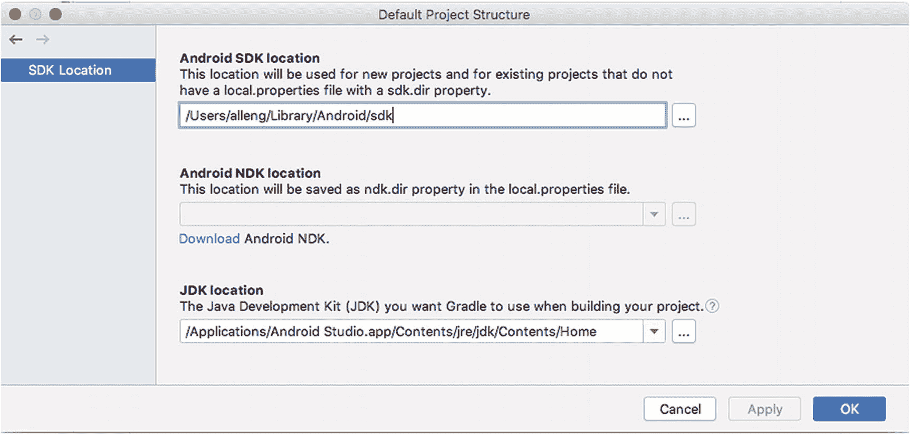

# 七、面向 Android 开发的 Java 简介

在这一章中，我们将探索如何开始使用 Java 开发 Android 应用，特别关注如何处理像 Java 这样庞大的主题，而不被其规模所吓倒。那些已经对 Java 开发有所了解的人可以浏览大部分内容，但是有一些关于 Android 细节的要点，我会推荐给任何读者阅读。

将 Java 学习到专家水平是一项巨大的努力。即使学习到“快乐初学者”的水平，也要比这本书的一个章节，甚至是一整本书本身要多得多。几乎“成千上万”的书籍都是关于 Java 及其许多方面的。我们不会提供一个不完整且最终无用的介绍，而是将重点放在三个关键的准备点上，用本书之外的工具和资源引导您踏上学习 Java 的道路。

首先，我们将从软件角度回顾 Java，包括 Java 开发工具包(JDK)和 Java 运行时环境(JRE)，以及 Android 使用和采用 Java 虚拟机环境(JVM)的特点，包括其支持随处运行软件的承诺和 Java 版本的悠久历史。

其次，我们将深入一个基本的纯 Java 应用，您可以在任何装有 Java 的机器上运行该应用，从基础的一两个部分开始，扩展您对 Java 的理解，以及它如何(和不)转化为 Android 应用。

最后，我们将介绍 Java 中的关键领域或主题，您应该随时学习，并链接到一些最好的免费和商业资源，以便在本章之后继续您的旅程。

Other Development Language Choices For Android

Java 有着悠久的历史，当 Android 推出时，Android 是(平等的)首选开发语言。但它不是开发应用所支持的唯一语言。与 Java 一样，Android 从早期就通过“原生开发工具包”或 NDK 支持 C++ 的“原生”开发形式。2016 年，谷歌冒险将 Kotlin 加入受支持语言的行列，并于去年决定 Kotlin 将成为新的首选语言。就应用使用而言，Java 仍然是 Android 开发中的主导语言，接近 90%。但是许多新的应用混合了 Kotlin 和 Java，或者只选择 Kotlin。你可以在 Apress '*Learn Kotlin for Android Development*(spth，ISBN 9781484244661)中了解更多关于 kot Lin for Android 的开发。

## Java，Java，无处不在

这个吸引人的标题我有两种意思——Java 本来是一种只写一次，可以在任何地方运行的语言。令人惊讶的是，尽管有很多疑问、阻力甚至法律障碍，它还是成功地实现了这个目标。Java 也无处不在，因为它是编程语言的名称，但也常常是用来实现随处运行承诺的软件的简称。Java 虚拟机(或 JVM ),以及它在计算机上部署的打包方式，通常也被称为 Java。如果这还不算是混淆的话，一旦你沉浸在 Java 中，你会发现你自己和其他从业者也把提供基本功能的核心库称为 Java。

作为一名 Java 开发人员，命名的复杂性是一个需要适应的问题，但是当谈到“随处运行”的能力实际上是如何交付的时候，Java 也有过一段艰难的历史。Java 发行版对 JVM 进行了补充，作为运行时，称为 Java 运行时环境(JRE ),或者作为完整的开发工具，称为 Java 开发工具包，或 JDK。版本如何被处理一直是软件中最扭曲的故事之一，因此发现系统试图同时支持五个并行的主要 Java 版本并不罕见——Java 6、Java 8、Java 9、Java 11 以及最近发布的任何 Java 版本。

多亏了 Google 的行动，Android Studio 在其 2.3 版本中冒险隐式捆绑了一个 JDK，并为您完全管理它，所以您再也不需要自己开发了。然而，在 Android 之外测试代码，以及在非 Android 应用中学习更多关于 Java 的知识，有时会很有用。在这一章的后面，如果你还不熟悉这种方法，我们将演示如何去做，如果你是这一领域的绝对初学者，也可以把它作为学习 Java 语言的跳板。

Java Security

如果不讨论安全性，这个主题就不完整。无论是作为独立安装还是作为 Android Studio 的一部分，Java 及其运行时和 JVM 都有一段非常长、非常麻烦的安全问题历史。我不会深究已经发现并修复的数千个漏洞、错误和利用方式！–在过去的二十年里，但我要说的是。总是修补你的 Java 安装，包括总是保持 Android Studio 最新。永远！

要了解更多影响 Android 的 Java 历史漏洞，请点击 [`www.beginningandroid.org`](http://www.beginningandroid.org) 阅读更多内容。

### 安卓的 Java 时间扭曲

当第一次发布时，谷歌选择了当时最新的 Java 版本作为 Android 的基础，即 Java 版本 6，即当时所知的 Java 1.6。随着 Android 未来版本的发布，Java 版本的进展相对缓慢，保持 Android 与 Java 6 兼容有很大的好处。随着时间的推移，发布模式发生了变化，特别是 Java，在 Java 7 和 Java 8 的缓慢发布之后，速度加快了。在撰写本书时，我们正处于 Java 15 阶段，但由于各种技术和非技术原因，Java 兼容性在 Android 与 Java 7 和对 Java 8 的部分支持中“停滞不前”。如果你学习 Java 是为了编写 Android 应用，请记住这一点！

在为 Android 开发时，Java 9 和更高版本的概念和特性根本不可用。这意味着诸如 Java 9 中引入的模块、Java 10 中引入的数据类共享，或者 Java 12 中 switch 语句增强的安全性和实用性都不是您所能支配的。在实践中，这并不会造成很大的障碍，但是如果您对现代 Java 很有经验，并且已经习惯了它所提供的最新特性，那么可能需要一些时间来适应。

### 使用 JDK 安装程序学习 Java

由于 Android Studio 将 JDK 与它的安装捆绑在一起，除了出色的 Android Studio IDE 体验之外，您还可以使用现成的“纯 Java”环境。要单独使用 JDK，您可以在磁盘上查找 Android Studio 放置 JDK 的目录。你可以直接从 Android Studio 本身找到这个，打开任何项目。选择`File` ➤ `Other Settings` ➤ `Default Project Structure`菜单。你会看到如图 [7-1](#Fig1) 所示的对话框，显示 JDK 的位置。



图 7-1

Android Studio 显示 JDK 的位置

总结 Android Studio 支持的各种操作系统

*   在 macOS/OSX 上:JDK 在`/Applications/Android Studio.app/Contents/jre/jdk/Contents/Home`被发现。

*   在 Linux 上:根据您指示 Android Studio 安装程序放置 IDE 的位置，JDK 的位置会有所不同，但是它位于该位置下的`./android-studio/jre`文件夹中。

*   在 Windows 上:JDK 的位置会根据您指示 Android Studio 安装程序放置 IDE 的位置而变化，但是默认情况下它在`C:\Android\Android Studio\jre\bin`中。

对于本章中的纯(非 Android) Java 示例，您可以使用命令提示符或 shell 通过`"cd"`命令导航到该目录。您还可以测试这个目录是否包含在您计算机上的`PATH`环境变量中——这意味着无论您从哪个目录开始工作，您的操作系统都知道在哪里可以找到 JDK 的关键工具。例如，在 macOS 和 Linux 上的`"which javac"`命令将返回第一次安装的`javac`二进制文件的路径，这是 Java 编译器，如果在`PATH`中指定的目录中找到的话。例如，在我的 MacBook Air 上，我看到以下内容:

```java
$ which javac
/usr/bin/javac

```

还有什么比这更简单的呢？您可能还记得，在前面关于 Java 无处不在的标题中，在同一台机器上安装多个版本的 Java 是很常见的，这些版本可能是完整的 JDK，为 Java 提供开发工具，或者只是 JRE，它提供运行时 JVM 和一些支持实用程序，但不提供像编译器这样的开发工具。

如果您想绝对确定您使用的是 Android Studio 附带的编译器(`javac`二进制)和 JVM ( `java`二进制)，那么在调用这些程序时，请使用它们的完整路径。例如，为了确保我在下面的例子中使用 Android Studio 中的 javac，我将调用它

```java
$ "/Applications/Android Studio.app/Contents/jre/jdk/Contents/Home/bin/javac" somejavafile.java

```

有很多方法可以询问你默认使用的 Java 安装版本，并出于各种原因在它们之间切换——甚至在 Android Studio 内部。然而，这超出了本书的范围。对于初学者，我警告不要在这方面修改 Android Studio 的设置。

## 代码中的第一个 Java 概念

传统上，通过编写“Hello World”应用来开始学习编程语言。我们将跳过这一步，转到一个稍微高级一点的例子，向您展示 Java 代码的基本工作原理。清单 [7-1](#PC3) 展示了我们的非 Android Java 示例应用 FirstJavaDemo 的代码，您可以在`Ch07/FirstJavaDemo.zip`中找到它。

```java
import java.io.*;
import java.util.*;

public class FirstJavaDemo {

  public static void main(String[] args) {

    Console console = System.console();
    if (console == null) {
      System.out.println("Console not found");
      System.out.println("Please re-run from a command line, shell, or console window");
      System.exit(0);
    }

    System.out.print("Tell me something about yourself: ");
    String something = console.readLine();

    System.out.println("Interesting!  You said: " + something);
  }
}

Listing 7-1Source code from the FirstJavaDemo.java file

```

在接下来的章节中，我们将逐步介绍这段代码的各个部分会产生什么样的效果。在稍微大一点的层面上，让我们遍历整个结构，并用简单的英语解释正在发生的事情。这将允许您交叉引用一个外行人的解释，以及特定于 Java 的方面。

第一行是 import 语句，指示我们的程序使用 Java 的库系统(其中捆绑了其他 Java 功能供您使用，而不必自己从头开始构建)。语法看起来有点奇怪，但其核心是我们在指导 Java 引入`java.io`库和`java.util`库的所有方面。这些库处理诸如文件和控制台输入和输出以及您经常想要或需要的其他无处不在的特性。

然后我们有一个`class`声明。类是应用开发的面向对象(OO)设计学派的核心概念，我们将在本章后面更多地讨论它们。重要的是，这是我(或你)选择的一个类定义。我选择了`FirstJavaDemo`这个名字。Java 关键字`"public"`意味着，如果需要，其他 Java 程序可以导入我的类并重用它。

类的主体和逻辑的其他子块都用花括号括起来——就是你看到的`{`和`}`符号。这些花括号是重要的标点符号(在编程和编译器的说法中是记号)，必须用于分组嵌套的逻辑集——无论是类、它们的方法，还是内部逻辑块(如循环和条件测试)等等。

接下来，我们有强制的`main()`方法，我们将其定义为具有一个`void`返回类型，这实质上意味着在退出时，程序不会从变量或其他方法调用中返回任何数据，并将一个名为`args`的`String`数组作为(可选)参数。在实践中，这种方法是许多编程语言的长期风格，其中参数(或自变量)可以在程序首次运行时传递给程序，用于开发人员想到的任何目的，例如打开或关闭程序中的选项，或者用关键的启动数据作为种子。

然后，我们基于由`System.console()`方法提供的`Console`对象，定义并创建一个名为`console`(小写)的对象，由于导入了`java.util`库，该方法本身就是我们可以访问的实用程序之一。这种方法隐藏了`FirstJavaDemo`程序和 JVM 之间的大量操作系统交互，将你的程序连接到一个控制台——这通常是一个 shell 或命令提示符窗口，或者是更复杂程序的类似风格的一部分，如 Android Studio IDE 中的控制台窗口。

Key Concepts: Data Types and Variables

这个名为“Console”的控制台对象和工作副本或容器的例子介绍了几乎所有编程语言(包括 Java)的两个基本方面。这些概念是变量和数据类型。

变量可以被认为是一个容器或一个尚未确定值的占位符——就像高中数学或代数一样。在 Java 中，变量首先被定义为标识它将包含的信息种类，即它的数据类型。

Java 中的数据类型是用于变量或其他环境的信息或数据种类的规范。数据类型有两种形式:第一种是非常简单的数据类型，称为基元，它以几种形式表示简单的整数或浮点数——int、short、long、float 和 double——以及简单的字符文本，称为 char 和 boolean，它表示 true 或 false 值。

第二种数据类型是更复杂的对象，比如在我们的控制台案例中。您可以将这种更复杂的数据类型视为多个原始数据类型和可用于处理该数据的预定义逻辑的复合集合。这是 Java 和其他面向对象编程语言中类的本质。

有时创建控制台会因为奇怪的原因而失败——权限问题就是一个例子。我们使用 Java 的 If-Then 逻辑来引入一个逻辑测试，用符号`==`来表示，以确定我们的`console`是否存在或者是未定义的——用 Java 的说法就是`null`。如果`console`没有定义，我们使用我们可以使用的`System.out.println()`方法，感谢`java.io`库的引入，写出一些对阅读它的人有意义的有用的字符串文本。然后我们使用`System.exit()`方法退出程序。

Key Concept: Branching and Looping Structures In Java – If, While, For

清单 [7-1](#PC3) 中的代码展示了 Java 中主要的逻辑控制结构之一——If 语句。还有其他几个这样的结构，允许您在代码中基于测试值做出决策，并基于测试值决定合适的逻辑分支或重复操作，直到条件发生变化。除了 If 语句，Java 还提供了 For 循环、While 循环和 Do While 循环。每一个后面的结构都有许多细微差别，我们将在本书的后面探索，但是你可以在 [`http://en.wikibooks.org/wiki/Java_Programming/`](http://en.wikibooks.org/wiki/Java_Programming/) 了解更多。

在更可靠、更常见的场景中，创建`console`对象一切顺利，然后我们使用`System.print()`方法在控制台中打印问题的文本，使用`System.readln()`方法接受您输入的响应，并将其存储在一个名为`something`的`String`变量中，我们将该变量定义为保存您输入文本的地方。最后，我们再次使用`System.println()`和由`+`操作符提供的一些`String`连接特性来回应您。

这个简短的描述应该有助于你理解`FirstJavaDemo`应用是做什么的，但是除了非常粗略的层次之外，并不能真正给你对 Java 语法、结构或规则的深刻感受。我们稍后会进一步加深您的理解。现在，让我们练习编译和运行这个程序。

要编译该程序，打开一个 shell 或命令提示符，如果需要的话，将目录更改为 JDK，如前面针对您的操作系统所述。请注意您将来自`Ch07/FirstJavaDemo.zip`的`FirstJavaDemo.java`文件放置在磁盘上的什么位置。然后调用`javac`二进制文件，给它传递`FirstJavaDemo.java`的完整路径和文件名，例如，在 macOS 或 Linux 上如下所示:

```java
$ javac <path-to-where-you-unzipped-code>/FirstJavaDemo.java

```

过一会儿，您应该会看到命令或 shell 提示符回到您的控制中。发生了什么？`javac`实用程序已经处理了源代码，并生成了 JVM 现在可以理解和运行的代码的中间版本。在您的目录中，您应该会看到一个名为`FirstJavaDemo.class`的新文件，它是`javac`命令的输出。

要运行您的代码，使用`java`命令(小写)并传递给它`FirstJavaDemo.class`文件的完整路径，但是省略文件名的文件扩展名(`.class`部分)，例如:

```java
$ java <my-path-to-the-file>/FirstJavaDemo

```

一旦您回答了屏幕上应该看到的问题提示，输出将如下所示:

```java
$ java FirstJavaDemo
Tell me something about yourself: I program in Java
Interesting!  You said you: I program in Java

```

你做到了！使用特定于 Java 的工具和一些新学到的代码，您已经创建了一个纯 Java 应用。请继续阅读，了解更多关于 Java 语言的知识，以及如何更深入地理解`FirstDemoJava`应用中的每个单词、行和古怪的标点符号。

## Android 开发的关键 Java 构件

本书剩余部分的所有例子都依赖于一定程度的 Java 知识。在本章的剩余部分，我们将为您提供一个主题主列表，它涵盖了您至少需要遵循的基础知识，但更重要的是，它还将为您提供一个起点，让您从网上、书店、学校和大学等大量免费和商业资源中进一步学习和自学 Java。我们将直接链接到其中的一些链接，这样您的 Java 之旅就不会被打断——我鼓励您在阅读本章时关注其中的一些链接，因为深入研究 Java 主题永远不会太早！

为了最大限度地提高您学习 Java for Android 开发的效率，以下主题是关键:

一般软件开发知识:

1.  代码的结构和布局

2.  面向对象的设计和编程，包括类和对象

3.  类方法和数据成员

特定于 Java 的编码知识:

1.  接口和实现

2.  线程和并发

3.  碎片帐集

4.  异常处理

5.  文件处理

6.  无商标消费品

7.  收集

显然，这不是 Java 的全部，但它是 Java 的一个子集，足以让您立即开始 Android 开发的构建块！

### 代码结构

回头看一下`FirstJavaDemo`源代码，就能体会到 Java 代码在最简单的情况下是如何构造的。Java 可以被认为是最基本的构造的洋葱分层，一层一层地构建最深远和最复杂的构造。从最简单到最复杂，我们有

*   Token:Java 的最小构造块，token 代表我们已经创建的或系统提供的对象实例的名称，例如我们的`FirstJavaDemo`代码中的 something `String`对象，Java 语言中的关键字，如“`return,`”操作符，括号等标点符号，等等。

*   表达式:一个或多个标记以及类似于`+`的操作符，或者方法调用，它们构成了一个逻辑。在我们的第一个 JavaDemo 示例中，我们看到一个表达式“有趣！你说:“+ something，是用+运算符连接两个字符串的表达式。

*   语句:由符号和表达式构建的一套完整的逻辑，用分号分隔。这通常与一行代码同义，但实际上它可以跨越任意多行。

*   方法:语句的逻辑分组，形成一组连贯的逻辑，可以通过使用方法名来调用。在我们的`FirstJavaDemo`代码中，我们为我们的类的 main 方法创建了逻辑，但是我们也引用了其他类的方法，比如用于在控制台读取文本输入的`readLine()`方法和用于打印回控制台的`println()`方法。

*   类:一个概念对象的表示，以及用于表示该对象并允许操作该对象及其功能的所有方法和数据成员。类的概念与面向对象设计的概念紧密联系在一起，我们很快就会谈到这一点。

*   包:虽然在我们的例子中没有显示，包是类的集合，通常用于将那些支持特定相关逻辑组的类捆绑在一起，例如，文件处理或图形渲染。

Java 代码还有许多其他的结构方面，但是掌握前面的内容将使您能够根据对基础知识的理解来解释和利用更深奥的结构。

Android and Main

不，那不是十字路口，但可能是。在第一个 JavaDemo 示例中，您将看到我们定义了一个方法，称为 main。Java 的设计规定，Java 程序的几个强制性要求之一是存在一个名为 main 的方法，并且它将是运行程序时 JVM 调用的第一个方法。可以把它想象成 Java 中的一个大标志，上面写着“从这里开始”。

但是看看我们在前面的章节中已经写过的 Android 例子，比如 MyFirstApp 应用。MainActivity.java 文件缺少一个主方法。这是怎么回事？不要害怕。您的应用确实有一个 main 方法，但是它隐藏在 Android Studio 提供的支持框架中。Android 提供了一个活动生命周期，定义了开发人员可以关注的点，处理创建、使用、暂停和处理活动的点，而不是强迫您修改主要方法，然后修改所有可以为用户提供运行应用体验的流程或事件处理工作。该活动生命周期在第 [11 章](11.html)中有详细介绍。

如果你看看你已经编写的 Android Java，包括`MyFirstApp`应用，你可以在实践中看到这种 Java 语言层次的许多方面——在没有意识到的情况下，你已经在你的第一个应用中运用了这些概念。

### 理解面向对象的设计、类和对象

Java 编程语言从一开始就被设计成包含和表达面向对象设计的概念(有时缩写为“OO”)。在本质上，面向对象设计使用这样一种思想:用对象(或实体)来表达您在应用中创建的概念模型的几乎所有内容，例如“人”或“动物”，然后使用一些强大的设计理念来塑造如何定义、操作、扩展和细化对象。这是一个庞大的主题，但是你可以从一些优秀的在线资料开始，这些资料可以帮助你理解关键的 OO 概念，包括封装、继承、多态等等。

### 使用类方法和数据成员

采用面向对象方法进行编码的一个重要部分是这样一个概念，即关于对象和对象实例的数据属于这些实体，为了操作和查询这些数据，应该使用生成这些对象的类的设计所提供(和规定)的技术。简而言之，这意味着该类定义并提供给开发人员的方法(或函数)。

对于那些刚刚接触面向对象开发的人来说，这并不像看起来那么困难。它体现了面向对象的原则之一，封装。使用对象所需的一切都整齐地包装(封装)在它的类中。这种方法有无数的好处，你可以在许多面向对象的设计文本中广泛地读到，比如 a press '*Interactive Object-Oriented Programming in Java*(Sarcar，ISBN 9781484254035)和无数的在线网页中。也要记住，当你写自己的类时，你有自由选择你想要的类方法。

#### 发展您特定于 Java 的编码知识

正如我已经说过的，学习所有的 Java 是一项巨大的努力。学习面向 Android 的 Java 并不那么令人畏惧，但仍然涵盖了 Java 领域的大量内容。为了让你开始，这里是开始掌握的关键领域，带有一些最好的免费在线资源的链接。虽然我将参考 Java 编程 Wikibook，这是一个免费的在线资源，但许多其他在线资源也同样不错。你也可以从专门针对 Android 的 Java 书籍中受益匪浅，比如 Apress '*Learn Java for Android Development*(spth 和 Friesen，ISBN 9781484259429)。

#### 接口和实现

理解 Java 对象如何构建和扩展其他对象，并提供一个派生版本应该做什么的模板，以及如何做的机制。 [`http://en.wikibooks.org/wiki/Java_Programming/Interfaces`见](http://en.wikibooks.org/wiki/Java_Programming/Interfaces)。

#### 线程和并发

特别是在我们的多核 CPU 时代，只要小心，并发和线程提供了同时执行大量工作流的方法。 [`http://en.wikibooks.org/wiki/Java_Programming/Threads_and_Runnables`见](http://en.wikibooks.org/wiki/Java_Programming/Threads_and_Runnables)。

#### 碎片帐集

Java 是谨慎管理内存等资源方法的早期采用者，这种方法试图将开发人员从跟踪和手动处理资源分配中解放出来——至少可以说这是一项容易出错的任务！参见 [`https://en.wikibooks.org/wiki/Java_Programming/Java_Overview`](https://en.wikibooks.org/wiki/Java_Programming/Java_Overview) 的自动内存垃圾收集部分。

#### 异常处理

当事情确实出错时，目标是提供安全、结构化和信息丰富的方法来优雅地处理问题。 [`http://en.wikibooks.org/wiki/Java_Programming/Exceptions`见](http://en.wikibooks.org/wiki/Java_Programming/Exceptions)。

#### 文件处理

虽然我们的 FirstJavaDemo 应用让用户通过键入直接在控制台输入数据，但更常见的是使用文件和管理它们的语义来消费和创建数据。 [`http://en.wikibooks.org/wiki/Java_Programming/BasicIO`见](http://en.wikibooks.org/wiki/Java_Programming/BasicIO)。

#### 无商标消费品

Java 在概念上是一种“强类型”语言，这意味着它提供了防护栏和保护，以确保`Strings`、`integers`和其他类型永远不会与不兼容的数据有效载荷一起存在，并且一种类型的数据不会意外地放入另一种类型的变量中。这是一个关键的保护机制，但是在某些情况下会造成不灵活。泛型提供了维护强类型的方法，但是当支持不同类型数据的相同通用逻辑时，可以避免不必要的重复和过多的重复。 [`http://en.wikibooks.org/wiki/Java_Programming/Generics`见](http://en.wikibooks.org/wiki/Java_Programming/Generics)。

#### 收集

正如像整数这样的原始数据类型集可以分组到数组中一样，对象也可以分组到方便的集合中。集合是 Java 支持将对象组作为集合进行操作的一种方式(但不是唯一的方式)。 [`http://en.wikibooks.org/wiki/Java_Programming/Collections`见](http://en.wikibooks.org/wiki/Java_Programming/Collections)。

## 摘要

没有哪一章或者整本书能够给你一本完整的 Java 初学者指南，但是在这一章中，我们尝试了退而求其次的方法。现在，您已经了解了 Java 语言、Java 软件产品、Java 对 Android 的意义，以及学习内容的路线图和帮助您掌握 Java 的资源。我强烈建议刚接触 Java 的人，在开始阅读本书的其余部分之前，先探索一下本章中提到的其他资源，甚至更多的商业和免费在线资源。即使是一点点的阅读和实践也会为你的 Android 理解收获巨大的回报。