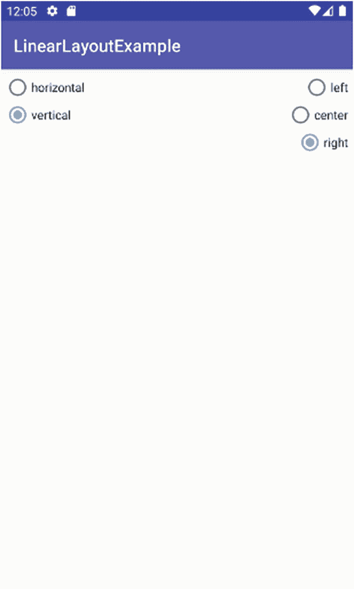

# 十、探索 Android 概念：布局和更多

了解 Android 中可用的各种 UI 小部件无疑使您能够就应用中的特定功能和行为应该如何呈现做出各种设计选择，但是活动设计不仅仅是选择单选按钮或文本视图。布局是 Android 的声明性机制，让你能够控制应用的整个屏幕。

从概念上讲，布局既是您希望在应用或活动中使用的小部件的容器，也是所有小部件应该如何显示、交互和互补的蓝图和脚手架。一旦您构思出使用不止一个或两个小部件的设计，您就会希望布局的力量能够帮助您避免手动控制位置、缓冲区和空白、分组等等的繁琐。

在接下来的章节中，我们将回顾 Android 支持的一些最有用、最流行的布局类型，该网站还包含一些更专业或很少使用的布局的更多示例。

## 什么是 Android Jetpack

对 Android 设计的任何粗略搜索或回顾都会浮现出一些有趣的里程碑，有些人会说是 Android 近代史上的岔路口。你很可能会看到两个艺术术语从最近几年的任何结果中冒出来。首先，你会发现术语“材料设计”，这是谷歌在 2012 年向世界推出的一种风格和设计理念，它影响了默认调色板、小部件风格和 Android 中的其他设计功能。你会遇到的第二个术语是“Android Jetpack”，毫无疑问，你会发现关于它进行设计的评论——包括布局——“更容易”、“更好”、“新的和不同的”。这些说法是正确的，但它们可能会给新开发人员带来一些困惑。我在用喷气背包吗？我怎么才能得到喷气背包呢？诸如此类。

在 2018 年的谷歌 I/O 开发者大会上，谷歌推出了 Android Jetpack。在头条新闻的背后，事实证明 Jetpack 本身并没有什么“不同”，而是许多不同的 Android UI 框架片段和基础元素的重新打包，以及对 Android 支持库的修改和扩展。Jetpack 不是一种竞争性的建造方式。相反，Jetpack 会过滤你正在做的大部分事情，从引用`androidx`名称空间中的任何库，到管理向后兼容性和历史 Android 版本支持。这样，你并没有真正把 Jetpack“添加”到你的设计工作中。相反，当您利用您在构建应用和使用 Android Studio 来帮助您时，它会隐式地、几乎自动地介入。

谷歌在`android.com`网站上提供了一个在 Android Jetpack 支持下的快速浏览。Jetpack 旗下的 Android 现有部分分为四个领域:

1.  基础组件

2.  建筑构件

3.  行为成分

4.  UI 组件

谷歌提供了如图 [10-1](#Fig1) 所示的图表(来源:Android-developers . Google blog . com/2018/05/use-Android-Jetpack-to-accelerate-your . html)来演示 Android Jetpack 在这四个领域的具体部分。


图 10-1

了解 Android Jetpack 概念性组件 <sup>[1](#Fn1)</sup>

如果你从这一节学到一件事，那就是你不必担心问自己“我在使用 Jetpack 吗？”因为你已经是了！您可能没有使用所有的特性和功能组，但是没有必要这样做。

## 使用流行的布局设计

我们将在以下部分中介绍以下主要布局容器:

1.  constraint layout:Android 中新项目的当前默认设置，也是 Jetpack 的一部分，其中小部件用最小的定位约束集表示，没有(或很少)树形层次结构。

2.  RelativeLayout:在 Android 4.0 之后的许多年里一直是默认的，直到 Jetpack 和`ConstraintLayout`的引入，它使用规则引导的方法来自我排列 UI 元素。

3.  LinearLayout:最初的默认设置，在许多早期的 Android 应用中普遍使用，它遵循传统的盒子模型，将所有的小部件想象成盒子，以适合彼此。

在这本书的网站上， [`www.beginningandroid.org`](http://www.beginningandroid.org) ，你还可以找到 Android 提供的其他布局的额外资料，包括

1.  TableLayout:一种类似网格的方法，类似于在 web 开发中使用 HTML 表格。

2.  GridLayout:看似与`TableLayout`相似的是，`GridLayout`使用任意精度的网格线将你的显示器分割成一个个更具体的区域来放置小部件。

在这些主题之后，我们将转向如何从 Java 代码中操作 XML 布局，并着手修改 ButtonExample 应用的版本，以展示如何在代码中查找和使用布局。

Note

虽然我们将在这一章花很多时间来研究 XML 的布局，但是请记住，图形化的布局编辑器有一个设计模式，允许您可视化地添加小部件、放置和排列它们、设置关系等等。虽然您可能总是混合使用手写 XML 和布局编辑器，但是当您开始喜欢一种方法时，不时地跳到“另一种”是值得的。通过观察 Android Studio 在使用图形化布局编辑器时自动生成的 XML 中做了什么，这也是了解更多布局 XML 细微差别的好方法。

### 重新审视约束布局

在前面的章节中，你已经接触了非常简单的`ConstraintLayout`设计，包括你的`MyFirstApp`和第 [9](09.html) 章中的许多小部件示例。虽然你可以继续使用`ConstraintLayout`作为小部件的简单容器，为 Android 提供约束设置，以便它可以为你管理布局，但`ConstraintLayout`还有更多高级功能，你一定要了解和探索，以将你的活动设计提升到更高的水平。

`ConstraintLayout`提供了许多非常令人兴奋的特性，但我将标记出三个最近最有用的特性。

#### 融入潮流

随着 Android 的最新更新，ConstraintLayout 已经扩展为一个可选功能，可以在活动中“流动”屏幕上的小部件，就像将它们倒在屏幕上一样，并在运行时根据给定设备界面的大小和密度包装和移动小部件。

用流的术语来说，你在一个虚拟流布局中将部件集合链接在一起，作为基础`ConstraintLayout`的助手。组的流链接在布局 XML 的`<androidx.constraintlayout.helper.widget.Flow>`元素中指定，然后两个关键属性控制流链接和行为。

第一个属性是`app:constraint_referenced_ids`属性，它采用逗号分隔的小部件 id 字符串，指示 Android 将界面的哪些部分分组到特定的虚拟流布局中。

第二个属性是`app:flow_wrapMode`，它采用三个字符串值中的一个来指示 Android 如何管理流组中的小部件流。`app:flow_wrapMode`的可能值和相关行为如下:

1.  none:默认方法——这为组中的所有小部件创建了一个逻辑链，如果小部件不适合活动的维度，就会溢出它们。

2.  链:如果发生溢出，将溢出的小部件添加到后续链中以包含它们。

3.  align:大体上类似于链式方法，只是行与列对齐。

熟悉`ConstraintLayouts`中的流程选项非常容易。清单 [10-1](#PC1) 显示了 Ch10/FlowExample 中`FlowExample`项目的相关布局 XML 文件。

```java
<?xml version="1.0" encoding="utf-8"?>
<androidx.constraintlayout.widget.ConstraintLayoutxmlns:android="http://schemas.android.com/apk/res/android"
    xmlns:app="http://schemas.android.com/apk/res-auto"
    xmlns:tools="http://schemas.android.com/tools"
    android:layout_width="match_parent"
    android:layout_height="match_parent"
    tools:context=".MainActivity">

    <TextView
        android:id="@+id/text1"
        android:layout_width="wrap_content"
        android:layout_height="wrap_content"
        android:text="Flow TextView 1"
        android:textSize="25dp"
        app:layout_constraintBottom_toBottomOf="parent"
        app:layout_constraintLeft_toLeftOf="parent"
        app:layout_constraintRight_toRightOf="parent"
        app:layout_constraintTop_toTopOf="parent" />

    <TextView
        android:id="@+id/text2"
        android:layout_width="wrap_content"
        android:layout_height="wrap_content"
        android:text="Flow TextView 2"
        android:textSize="25dp"
        app:layout_constraintBottom_toBottomOf="parent"
        app:layout_constraintHorizontal_bias="1.0"
        app:layout_constraintLeft_toLeftOf="parent"
        app:layout_constraintRight_toRightOf="parent"
        app:layout_constraintStart_toEndOf="@+id/text1"
        app:layout_constraintTop_toTopOf="parent"
        app:layout_constraintVertical_bias="0.499" />

    <TextView
        android:id="@+id/text3"
        android:layout_width="wrap_content"
        android:layout_height="wrap_content"
        android:text="Flow TextView 3"
        android:textSize="25dp"
        app:layout_constraintBottom_toBottomOf="parent"
        app:layout_constraintHorizontal_bias="1.0"
        app:layout_constraintLeft_toLeftOf="parent"
        app:layout_constraintRight_toRightOf="parent"
        app:layout_constraintStart_toEndOf="@+id/text2"
        app:layout_constraintTop_toTopOf="parent"
        app:layout_constraintVertical_bias="0.499" />

    <!-- Add/remove the androidx.constraintlayout.helper.widget.Flow spec to see Flow in action -->
    <androidx.constraintlayout.helper.widget.Flow
        android:layout_width="0dp"
        android:layout_height="wrap_content"
        app:layout_constraintStart_toStartOf="parent"
        app:layout_constraintEnd_toEndOf="parent"
        app:layout_constraintTop_toTopOf="parent"
        app:flow_wrapMode="chain"
        app:constraint_referenced_ids="text1, text2, text3"
        />

</androidx.constraintlayout.widget.ConstraintLayout>

Listing 10-1Setting up Flow in your ConstraintLayout

```

`FlowExample`的布局非常简单。我们有三个`TextViews`，用约束条件定义，这样通常你会(试图)先用`text1 TextView`布局，然后用右侧的`text2 TextView`，再用右侧的`text3 TextView``text2`。我特意选择了长文本和大字体来表达我的观点。在布局的底部，您将看到在一个`<androidx.constraintlayout.helper.widget.Flow>`元素中定义的流，其中我指定我的`flow_wrapMode`来链接，并将组的引用 id 设置为`"text1, text2, text3"`–我的 TextView IDs。

如果我省略了流虚拟布局(参见 XML 布局中控制这一点的注释)，Android 试图按照正常的`ConstraintLayout`规则呈现活动，结果如图 [10-2](#Fig2) 所示。


图 10-2

如果没有 Flow，ConstraintLayout 会在屏幕外呈现小部件

你马上就能发现问题。我故意使用虚拟屏幕尺寸较小的 AVD。我的`text1 TextView`渲染得很好，`text2`的一半也上了屏幕。但是`text2`的其余部分被切断了，`text3`也不见踪影。实际上，它被渲染，但不可见，因为布局没有办法适应屏幕大小，布局缺少流动选项。您可以尝试在各种不同屏幕大小的 avd 上运行移除了 Flow 元素的示例，以查看小部件是如何以及在哪里被截断或不显示的。

有了 Flow 元素之后，重新运行`FlowExample`应用就可以将 Flow 的功能展现出来。图 [10-3](#Fig3) 显示了同样的三个`TextViews`，但是这一次使用了流动虚拟布局功能，Android 已经能够遵循我指定的链规则，并且将小部件流动到新的行，以显示我的布局规范中的所有内容。


图 10-3

使用 Flow，ConstraintLayout 渲染所有

心流是一个超级容易掌握的新特性。您可以使用 FlowExample 示例代码，开始添加更多的小部件，扩展流引用的 id 集，甚至更改 flow_wrapMode，以查看流的行为。

#### 用层分层

将调整小部件和视图的能力向前推进一步的是层。当涉及到界面设计时，名称层是非常重载的，所以非常清楚，一个层并不直接布局小部件或者帮助构建连续 UI 组件集的“栈”。一个`ConstraintLayout`可以用一个层来扩展，给你一个单一的方法，用一个机制来旋转、平移和缩放一组小部件和视图。

例如，您可能正在创建一个图形图块游戏，并希望降低用户当前未选择的任何图片图块的重要性。有了层，所有其他的`ImageView`小部件都可以通过将它们添加到一个层来应用相同的布局更改，然后所需的转换可以被应用到该层一次，它反过来将应用到它的组成小部件。

#### 随运动而动

Android 最新版本的一个广为人知的特性是被称为 MotionLayout 的`ConstraintLayout`扩展。通过定义和使用`ConstraintSets`，你可以使用`MotionLayout`拍摄各种无聊的静态视图，并构建动画变化，如旋转、淡入淡出、大小变化等等。本质上，描述小部件和视图如何关联和定位的约束本身可以被视为控制运动和流动的变量。

手工构建基于`MotionLayout`的应用和它们使用的各种`ConstraintSet`配置可能非常繁琐。考虑到这种单调乏味，谷歌在 Android Studio 中引入了运动编辑器，为您提供了一个动画画布，用于构建引人注目的动画布局。

为了开始在动作编辑器中使用动作和`MotionLayout`设计，Android 为`ConstraintLayout`引入了`androidx.constraintlayout.motion.widget.MotionLayout`变体。MotionLayout 仍处于早期阶段，需要相当多的粗糙边缘和手动步骤来设置，并且随着 Android Studio 的单点发布而频繁更改。带有运动效果的布局也不太适合在像这样的静态书籍中呈现。

因此，为了确保您可以获得`MotionLayout`的最新演示，并且您可以在 MotionLayout 中看到选项如何在动态、移动的布局中发挥作用，可以从位于 [`www.beginningandroid.org`](http://www.beginningandroid.org) 的网站上获得演示和`MotionExample`演示。

### 使用相对布局

`RelativeLayout`是 Android 的长期默认设置，现在仍然是活动和片段设计非常流行的选择。正如术语“Relative”所暗示的，一个`RelativeLayout`使用部件和父活动之间的关系来控制部件的布局。相对性的概念很容易理解，例如，您可以指定一个小部件放置在相对于相对位置的另一个小部件的下面，或者让它的上边缘与相关的小部件对齐，等等。

所有关系设置都利用一组分配给布局 XML 文件中的小部件 XML 定义的标准化属性。

#### 相对于父容器放置小部件

理解`RelativeLayout`的一个很好的起点是探索允许您相对于父窗口定位小部件的属性。有一组核心属性可用于基于父对象(例如，活动)及其顶边、底边、边等来定位位置。这些属性包括

1.  android:layout_alignParentTop:将小部件的上边缘与容器的顶部对齐。

2.  Android:layout _ alignParentBottom:将小部件的下边缘与容器的底部对齐。

3.  Android:layout _ alignParentStart:将小部件的开始端与容器的左侧对齐，在考虑从右到左和从左到右书写的脚本时使用。例如，在美国英语从左到右布局中，这将控制小部件的左侧。

4.  android:layout_alignParentEnd:将小部件的末端与容器的左侧对齐，在考虑从右向左和从左向右书写的脚本时使用。

5.  Android:layout _ center horizontal:将小部件水平放置在容器的中心。

6.  android:layout_centerVertical:将小部件垂直放置在容器的中心。如果你想要水平和垂直居中，你可以使用组合的 layout_centerInParent。

在确定小部件边缘的最终位置时，会考虑各种其他属性，包括填充和边距宽度。如果您深入研究像素级精确的相对定位，请注意考虑到这些因素。

#### 用 id 控制相对布局属性

为了`RelativeLayout`的目的正确引用小部件的关键是使用被引用的小部件的标识，这您已经遇到过:这是正在讨论的小部件的`android:id`标识符。例如，在前面章节的`ButtonExample`项目中，按钮有标识符`@+id/button`。

为了进一步控制小部件的布局并描述它们相对于布局中其他小部件的位置，您需要在布局容器中提供小部件的身份。这是通过在您想要引用的任何小部件上使用`android:id`标识符属性来完成的。

第一次引用`android:id`值时，确保使用加号修饰符(例如`@+id/button`)。对同一标识符(小部件)的任何进一步引用都可以省略加号。在对标识符的第一次引用中使用加号有助于 Android 林挺工具检测标识符不匹配，即您在布局文件中没有正确命名小部件。这相当于在使用变量之前声明变量。

有了 id，我们前面的例子`@+id/button`现在可以被另一个小部件引用，比如另一个按钮`button2`，通过在它自己的布局相关属性中引用 id 字符串的机制。

注意像`button`、`button1`和`button2`这样简单的名字对于这样的例子来说是不错的，但是你会非常希望在你的应用中使用有意义的小部件标识符和名字。

#### 相对定位属性

现在您已经对标识符的机制有了很好的理解，您可以使用这六个属性来控制小部件之间的相对位置:

1.  Android:layout _ over:用于将 UI 小部件放置在属性中引用的小部件之上

2.  android:layout_below:用于在属性中引用的小部件下面放置一个 UI 小部件

3.  android:layout_toStartOf:用于指示该小部件的结束边缘应该放置在属性中引用的小部件的开始边缘

4.  android:layout_toEndOf:用于指示这个小部件的起始边缘应该放在属性中引用的小部件的结束边缘

5.  android:layout_toLeftOf:用于将 UI 小部件放置在属性中引用的小部件的左侧

6.  android:layout_toRightOf:用于将 UI 小部件放在属性中引用的小部件的右边

更微妙的是，您还可以使用许多其他属性中的一个来控制一个小部件相对于另一个小部件的对齐。这些属性包括

1.  android:layout_alignStart:标记小部件的起始边缘应该与属性中引用的小部件的起始对齐

2.  android:layout_alignEnd:标记小部件的结束边缘应该与属性中引用的小部件的结尾对齐

3.  android:layout_alignBaseline:标记两个小部件的任何文本的基线，无论边框或填充如何，都应该对齐(参见下面的内容)

4.  android:layout_alignTop:标记小部件的顶部应该与属性中引用的小部件的顶部对齐

5.  android:layout_alignBottom:标记小部件的底部应该与属性中引用的小部件的底部对齐

#### 使用相对布局示例

您已经对 RelativeLayout 的能力和行为有了足够的了解，可以深入研究一个工作示例了。清单 [10-2](#PC2) 使用来自`ch10/RelativeLayoutExample`项目的 RelativeLayout 提供了布局 XML。

```java
<?xml version="1.0" encoding="utf-8"?>
<RelativeLayout xmlns:android="http://schemas.android.com/apk/res/android"
    xmlns:app="http://schemas.android.com/apk/res-auto"
    xmlns:tools="http://schemas.android.com/tools"
    android:layout_width="match_parent"
    android:layout_height="match_parent"
    tools:context=".MainActivity">

    <TextView android:id="@+id/label"
        android:layout_width="wrap_content"
        android:layout_height="wrap_content"
        android:text="URL:"
        android:layout_alignBaseline="@+id/entry"
        android:layout_alignParentLeft="true"/>
    <EditText
        android:id="@id/entry"
        android:layout_width="match_parent"
        android:layout_height="wrap_content"
        android:layout_toRightOf="@id/label"
        android:layout_alignParentTop="true"/>
    <Button
        android:id="@+id/ok"
        android:layout_width="wrap_content"
        android:layout_height="wrap_content"
        android:layout_below="@id/entry"
        android:layout_alignRight="@id/entry"
        android:text="OK" />
    <Button
        android:id="@+id/cancel"
        android:layout_width="wrap_content"
        android:layout_height="wrap_content"
        android:layout_toLeftOf="@id/ok"
        android:layout_alignTop="@id/ok"
        android:text="Cancel" />

</RelativeLayout>

Listing 10-2The XML layout for the RelativeLayoutExample application

```

在这个`RelativeLayoutExample`布局中，我们基于您在之前章节中的学习，提供更丰富的理解。首先，您会看到根元素是`<RelativeLayout>`，这是该活动将使用`RelativeLayout`方法进行布局和放置的决定性因素。除了普通的样板 XML 名称空间属性之外，还引入了另外三个属性。

为了确保`RelativeLayout`跨越正在使用的任何尺寸屏幕上可用的整个宽度，使用了`android:layout_width="match_parent"`属性。我们可以对高度做同样的事情，但是我们也可以告诉`RelativeLayout`只使用包含所包含的小部件所需的垂直空间——因此使用了`android:layout_height="wrap_content"`属性。

依靠我们在第 9 章[中介绍的小部件，我们为我们的活动引入了四个部件:一个`TextView`作为我们的标签，一个`EditText`作为我们的可编辑字段，以及按钮`OK`和`Cancel`。](09.html)

对于`TextView`标签，布局指示 Android 使用`android:layout_alignParentLeft="true"`将其左边缘与父标签`RelativeLayout`的左边缘对齐。我们还想让`TextView`在引入相邻的`EditText`后自动管理它的基线，所以我们使用`android:layout_alignBaseline="@+id/entry"`调用像素推进完美。注意，我们引入了带加号的 id，因为我们还没有描述`EditText`，所以我们需要预先警告它即将存在。

对于`EditText`，我们希望它位于标签的右边，它本身位于布局的顶部，占据`TextView`右边的所有剩余空间。我们使用`android:layout_toRightOf="@id/label"`指示它向右布局(已经介绍过了，所以不需要添加加号)。我们使用`android:layout_alignParentTop="true"`迫使`EditText`在 RelativeLayout 的剩余空间中坐得尽可能高，并使用`android:layout_width="match_parent"`将画布上的剩余空间移到`TextView`的右侧。这是可行的，因为我们知道我们也要求父级使用最大可用剩余空间作为宽度。

最后，我们将两个按钮的位置与前面介绍的小部件联系起来。我们希望将`OK`放置在`EditText`的下方，并与其右侧对齐，因此给它赋予属性`android:layout_below="@id/entry"`和`android:layout_alignRight="@id/entry"`。然后我们告诉 Android 使用`android:layout_toLeft="@id/ok"`和`android:layout_alignTop="@id/ok"`将`Cancel`按钮放置在`OK`按钮的右边，按钮顶部对齐。

图 [10-4](#Fig4) 显示了在我们对一个普通的新的空活动项目做了这些布局更改之后，我们的布局的运行情况。


图 10-4

行动中的相对布局

#### 相对布局中的重叠部件

Android 支持的每种布局都为你提供了专门和独特的功能，并且`RelativeLayout`配备了一些关键功能，包括让小部件相互重叠或看起来好像一个在另一个前面或重叠的能力。这是通过 Android 跟踪来自 XML 定义的子元素并为布局中的每个子元素应用一个层来实现的。这意味着，如果稍后在布局 XML 文件中定义的项目使用 UI 中的相同空间，它们将位于较旧/较早的项目之上。

没有什么比看到它的运行更能理解它是什么样子的，以及它对您的应用设计有何帮助。图 [10-5](#Fig5) 显示了一个有两个按钮声明的布局，第二个按钮位于第一个按钮的前面或上方。


图 10-5

RelativeLayout 在操作中的重叠特征

就您可能想要覆盖的部件类型和数量而言，天空是一个极限。您可能还想知道为什么有人会想以这种方式覆盖项目。除了针对一些古怪的布局想法，与`RelativeLayout`重叠的可能性意味着有可能在屏幕上有小部件但看不见，仍然有助于活动行为。

### 用线性布局排列

有时候在设计布局时，你不需要或不想要复杂的受约束的或相对的小部件定位，相反，你只想依靠一些古老的经过测试的布局方法。任何熟悉图形设计或界面设计历史的人都会听说过盒子模型，在这个模型中，组成界面的所有项目(或小部件)都被认为是分成行和列的元素。`LinearLayout`遵循这种模式，是早期 Android 版本使用的原始默认设置。它可能不再是当今的布局，但是你可以一直依赖`LinearLayout`作为一个简单的选项来调整你的小部件如何装箱、嵌套等等。`LinearLayout`缺少的是我们在 ConstraintLayout 和 RelativeLayout 中谈到的一些聪明、省时或有用的功能，但有时简单的解决方案才是真正需要的。

#### 掌握 LinearLayout 的五个主要限定符

当使用 LinearLayout 时，一组五个关键属性帮助您控制整个布局和任何包含的小部件的放置和外观的几乎所有方面:

*   方向:对`LinearLayout`的第一个也是最基本的控制是确定盒子模型是否应该被认为是水平、逐行或垂直、逐列填充的。这被称为`LinearLayout`的方向，由 android:orientation 属性控制，并接受字符串值`HORIZONTAL`或`VERTICAL`。也可以在运行时从 Java 代码中设置方向，使用类似参数的`setOrientation()`方法。

*   边距:默认情况下，你放置的任何小部件和相邻的小部件之间都没有缓冲区或间距。Margin 允许您控制这一点，并使用属性(如`android:layout_margin`)添加缓冲区(或边距，顾名思义),这将影响小部件的所有边，或者使用单侧属性(如`android:layout_marginTop`)添加缓冲区。任何边距属性都以像素大小作为值，例如 10 度。这在概念上类似于`RelativeLayout`的填充，但只适用于小部件有不透明背景的时候(比如在按钮上)。

*   填充方法:我们已经为`RelativeLayout`引入了`wrap_content`和`match_parent`的概念。在`LinearLayout`方法中，所有小部件都必须通过属性`android:layout_width`和`android:layout_height`指定填充方法。这些可以取三个值中的一个:`wrap_content`，按照您之前的理解，它指示小部件仅根据需要容纳文本或图像内容；`match_parent`，取父节点可用空间的最大值；或者以与设备无关的像素测量的特定像素值，例如 125 度倾斜。

*   权重:当一个`LinearLayout`中的两个或两个以上的 widgets 都指定了`match_parent`时，哪一个胜出？他们怎样才能最大限度地利用父母提供的空间？答案是`android:layout_weight`属性，它允许您对每个小部件应用一个简单的数值，例如 1、2、3、4 等等。Android 将对`LinearLayout`中的所有权重求和，然后根据布局中所有小部件的总权重，为小部件提供 UI 空间。因此，例如，如果我们有两个都配置为`match_parent`的`TextViews`，第一个`TextView`的`android:layout_weight`为 5，第二个`TextView`为 10，那么第一个按钮将获得三分之一的可用空间(5/(5+10))，第二个按钮将获得三分之二的可用空间。还有其他一些设置权重的方法，但没有一种像`android:layout_weight`方法那样直观。

*   重力:当使用`LinearLayout`时，Android 采用的默认布局方法是，如果使用`HORIZONTAL`方向，则从左侧对齐所有部件；如果使用`VERTICAL`方向，则从顶部对齐所有部件。有时，您可能希望覆盖此行为，以强制您的布局自下而上或向右倾斜。XML 属性`android:layout_gravity`允许您在运行时控制行为，方法`setGravity()`也是如此。`android:layout_gravity`的`VERTICAL`方向的可接受值为`left`、`center_horizontal`和`right`。对于`HORIZONTAL`方向，Android 将默认与你的小工具的文本的不可见底部对齐。使用值`center_vertical`让 Android 使用小部件的假想中心。

#### 线性布局示例

首先回顾一下`LinearLayouts`的理论有点让人不知所措，因此开始探索一些概念有助于直观地掌握如何、何时以及在哪里使用关键的`LinearLayout`杠杆是有意义的。

从纯理论的角度来看，所有的选择都令人望而生畏。清单 [10-3](#PC3) 中的动态例子显示了这些选项中有多少是有效的。

```java
<?xml version="1.0" encoding="utf-8"?>
<LinearLayout xmlns:android="http://schemas.android.com/apk/res/android"
    xmlns:app="http://schemas.android.com/apk/res-auto"
    xmlns:tools="http://schemas.android.com/tools"
    android:layout_width="match_parent"
    android:layout_height="match_parent"
    tools:context=".MainActivity">

    <RadioGroup
        android:id="@+id/orientation"
        android:orientation="horizontal"
        android:layout_width="wrap_content"
        android:layout_height="wrap_content"
        android:padding="5dip">
        <RadioButton android:id="@+id/horizontal"
            android:text="horizontal"/>
        <RadioButton android:id="@+id/vertical"
            android:text="vertical"/>
    </RadioGroup>
    <RadioGroup
        android:id="@+id/gravity"
        android:orientation="vertical"
        android:layout_width="fill_parent"
        android:layout_height="wrap_content"
        android:padding="5dip">
        <RadioButton android:id="@+id/left"
            android:text="left"/>
        <RadioButton android:id="@+id/center"
            android:text="center"/>
        <RadioButton android:id="@+id/right"
            android:text="right"/>
    </RadioGroup>

</LinearLayout>

Listing 10-3Demonstrating the options provided by LinearLayout

```

这个例子使用了两个简单的构件来帮助我们理解方向和重力。我定义了两个独立的 RadioGroup 小部件，第一个小部件有一组`RadioButtons`来控制方向，另一个小部件有一组`RadioButtons`来控制重力。为了给我们一个起点，我们通过选择`android:orientation="vertical"`来使用垂直方向的 XML 定义，这将把`RadioGroups`一个放在另一个上面，并且将`RadioButtons`也以垂直方式放在其中。

然后我覆盖了初始`RadioGroup`中两个单选按钮的垂直堆叠，使用`android:orientation="horizontal"`将它们切换到水平布局。虽然我想从父`RadioGroup`继承其他属性，但我灵活地使用了覆盖子`RadioButtons`中特定属性的能力。最后，我们在 5 dip 的所有小部件周围设置填充，并设置`wrap_content`选项。

在没有支持 Java 逻辑的情况下运行这个示例代码——只有布局——显示了这些初始设置的运行情况，尽管还没有其他行为来改变您所看到的内容，但稍后会有其他行为。布局如图 [10-6](#Fig6) 所示。


图 10-6

设置方向和重力示例

很高兴看到呈现的布局，但实际上最好编写一些 Java 逻辑来根据单选按钮的设置改变方向和重心。这正是清单 [10-4](#PC4) 显示的内容。

```java
package org.beginningandroid.linearlayoutexample;

import androidx.appcompat.app.AppCompatActivity;
import android.os.Bundle;
import android.view.Gravity;
import android.widget.LinearLayout;
import android.widget.RadioGroup;

public class MainActivity extends AppCompatActivity implements RadioGroup.OnCheckedChangeListener {
    RadioGroup orientation;
    RadioGroup gravity;

    @Override
    protected void onCreate(Bundle savedInstanceState) {
        super.onCreate(savedInstanceState);
        setContentView(R.layout.activity_main);

        orientation=(RadioGroup)findViewById(R.id.orientation);
        orientation.setOnCheckedChangeListener(this);
        gravity=(RadioGroup)findViewById(R.id.gravity);
        gravity.setOnCheckedChangeListener(this);
    }

    public void onCheckedChanged(RadioGroup group, int checkedId) {
        switch (checkedId) {
            case R.id.horizontal:
                orientation.setOrientation(LinearLayout.HORIZONTAL);
                break;

            case R.id.vertical:
                orientation.setOrientation(LinearLayout.VERTICAL);
                break;

            case R.id.left:
                gravity.setGravity(Gravity.LEFT);
                break;

            case R.id.center:
                gravity.setGravity(Gravity.CENTER_HORIZONTAL);
                break;

            case R.id.right:
                gravity.setGravity(Gravity.RIGHT);
                break;
        }
    }
}

Listing 10-4Java logic to implement orientation and gravity changes based on UI selection

```

理解 Java 代码在做什么非常容易。首先，在应用的`onCreate()`调用过程中，我们使用我们在活动中实现的`OnCheckedChangeListener`的`setOnCheckedChangedListener().`为任一`RadioGroup`上的点击注册监听器，这意味着活动本身成为监听器。

当您单击任何一个`RadioButtons`时，监听器触发回调`onCheckChanged()`。在回调方法的定义中，我们确定了五个被渲染的图片中哪个`RadioButton`被点击了。一旦我们知道是哪一个`RadioButton`，我们的逻辑就调用`setOrientation()`从垂直布局切换到水平布局，或者调用`setGravity()`到相关的左、右或重心值。六种可能结果中的两种如图 [10-7](#Fig7) 和 [10-8](#Fig8) 所示。


图 10-8

另一个方向和重力的例子



图 10-7

向上、向下和周围的方向和重力

## 更多布局选项

Android 提供了一系列进一步的布局类型，其中许多随着 Android 的相继发布而受欢迎程度有升有降。以下是需要了解的主要布局，这些布局的更多示例可从网站 [`www.beginningandroid.org`](http://www.beginningandroid.org) 获得。

### 表格布局

早在互联网的早期，网页设计者经常使用简陋的 HTML 表格在页面上放置内容。虽然网页设计已经向前迈进了一大步，但基于表格的布局概念仍然有用，Android 在`TableLayout`容器中采用了它们。

就像 HTML 一样，Android 中的`TableLayout`使用起来很快，并且依赖于这样一个概念，即`TableLayout`有`TableRow`子元素来控制大小、位置等等。与旧的网页 HTML 方法的另一个相似之处是高保真精度很难达到完美。

### 网格布局

如果`TableLayout`的想法让你的想象力飞速发展，那么你会爱上`GridLayout`。作为`TableLayout`的近亲，`GridLayout`将它的子部件和 UI 元素放在一个由无限细节线条组成的网格上，这些线条将你的活动所渲染的区域分隔成单元格。`GridLayout's`精确控制的秘密在于细胞的数量，或用来描述细胞的网格线，没有限制或阈值。只需添加更多的网格线，将您的 UI 分割成更精细的子单元，以放置小部件。

## 用 Java 逻辑掌握基于 XML 的布局:两全其美！

随着您对 XML 布局和 Java 管理的布局越来越熟悉，您最终会意识到您可以两全其美，并且您可以随时改变主意。您可能更喜欢用 XML 构建原型并使用图形布局编辑器，或者您可能更喜欢使用 Java 尝试真正细微的运行时布局选择。无论采用哪种方法，您都可以随时通过一点代码或调整后的 XML 来改变主意。举例来说，清单 [10-5](#PC5) 列出了来自您的`ButtonExample`应用的计数按钮代码，转换成一个 XML 布局文件。您可以在`Ch10/ButtonAgain`示例项目中找到这段代码。

```java
<?xml version="1.0" encoding="utf-8"?>
<androidx.constraintlayout.widget.ConstraintLayoutxmlns:android="http://schemas.android.com/apk/res/android"
    xmlns:app="http://schemas.android.com/apk/res-auto"
    xmlns:tools="http://schemas.android.com/tools"
    android:layout_width="match_parent"
    android:layout_height="match_parent"
    tools:context=".MainActivity">

    <Button
        android:id="@+id/button"
        android:layout_width="fill_parent"
        android:layout_height="fill_parent"
        android:layout_alignParentBottom="true"
        android:layout_alignParentLeft="true"
        android:layout_alignParentRight="true"
        android:layout_alignParentTop="true"
        android:text="" />

</androidx.constraintlayout.widget.ConstraintLayout>

Listing 10-5Flexing XML layouts and controlling them with Java logic

```

在清单 [10-5](#PC5) 中，您应该可以看到我们为 ButtonExample 应用组合在一起的 XML 等价物，包括以下内容:

1.  将 ConstraintLayout 设置为根元素

2.  定义作为点击和计数器显示的按钮，并分配一个 android:id，这样我们就可以从代码中引用它，并在 Java 中执行我们的点击计数

3.  Android:layout _ alignParentBottom、Android:layout _ alignParentTop、Android:layout _ alignParentLeft 和 Android:layout _ alignParentRight，每个都有助于按钮的“父”对齐

4.  android:layout_width 和 android:layout_heigh，设置按钮消耗整个屏幕，就像我们对 ButtonExample 所做的那样

5.  android:text，显示在按钮上的文本，最初是空字符串

虽然这是一个转换成 XML 的非常简单的例子，但是核心概念是重要的，并且它们保持不变。更复杂的例子会有多个用 XML 表示的小部件、子布局和分支来控制复杂性。由于我倾向于基于 XML 的布局，在本书的后半部分，您将会看到更多这样的内容。

### 用 Java 代码连接 XML 布局定义

当您采用 XML 布局方法并开始完善小部件定位等功能时，一个非常重要的问题出现了:即使我们的活动只有一种布局，如何从 Java 逻辑中决定使用哪种布局？该解决方案基于一个专门为此设计的方法调用，通常在活动的`onCreate()`回调中调用，以实现 Java 和 XML 的完美结合:方法`setContentView()`。

`ButtonExample`应用的 redux 在`res/layout/activity_main.xml`中的正常默认位置有它的布局，尽管这种技术不管活动 XML 文件的定制命名如何都能工作。要完成从代码到布局的连接，像这样调用`setContentView()`:

```java
setContentView(R.layout.activity_main);

```

如果你看一下`ButtonExample`的原始版本，你会注意到`setContentView()`也被调用过。那么，什么发生了变化？在`ButtonAgain`中，我们传递一个对我们定义的基于 XML 的视图的引用，这个视图基于 Android Studio 内置的 AAPT 实用程序，它已经解析了您的 XML 并为您生成了`R` Java 类。您从`R`类中受益，因为它能够对 XML 布局和其中的部分进行简单的代码引用。不管你有多少布局，也不管它们有多复杂，AAPT 都会把它们打包成一个综合 Java 类，并在`R.layout`命名空间中提供。使用调用约定`R.layout.<your_layout_file_name_without_the_XML_extention>`引用任何布局。

为了在由`setContentView()`返回的布局中找到小部件，您调用`findViewById()`方法并向其传递小部件的数字引用。再读一遍这句话，你会发现“抓住你了”我说的数字引用是什么意思？还没有 XML 声明是小部件的数字标识符或引用。这是一个容易解决的谜。

在打包时，AAPT 会识别你布局中的每个小部件，给它们分配一个 ID 号，并把它作为成员数据包含在`R.java`文件中。您可以随时打开`R.java`文件进行检查。但是不要试图用这种方式去记忆东西。你可以让 Android 使用`R.id.<widget_android:id_value>`参数来解析你想要引用的任何小部件的 id 号。您可以使用它来解析从基本视图类派生的任何小部件的 ID(这几乎是一切)。

随着机制的消失，你应该能够看到 AAPT 根据你的布局和`setContentView()`和`findViewById()`方法把东西整齐地打包成`R.java`的组合所带来的巨大力量。例如，不同的活动可以被传递不同的`View`实例，更有趣的是，您可以基于一些程序逻辑来改变`View`，例如，当您检测到不同类型的设备时，您可以使用不同的布局。

## 再次通过按钮访问 MyFirstApp

在最初的`ButtonExample`例子中，按钮的显示屏会显示按钮被按下的次数。当按钮通过`onCreate()`加载时，计数器从 1 开始计数。现有的大部分逻辑，比如计算点击次数的代码，在我们修改过的`ButtonAgain`版本中仍然有效。与`ButtonExample`代码的主要区别如清单 [10-6](#PC7) 所示，其中我们用`ButtonAgain` app XML `ConstraintLayout`布局中的定义替换了活动的`onCreate()`方法中之前的 Java 调用。

```java
package org.beginningandroid.buttonagain;

import androidx.appcompat.app.AppCompatActivity;
import android.os.Bundle;
import android.app.Activity;
import android.view.View;
import android.widget.Button;

public class MainActivity extends AppCompatActivity implements View.OnClickListener{

    Button myButton;
    Integer myInt;

    @Override
    protected void onCreate(Bundle savedInstanceState) {
        super.onCreate(savedInstanceState);
        setContentView(R.layout.activity_main);
        myButton=(Button)findViewById(R.id.button);
        myButton.setOnClickListener(this);
        myInt = 0;
        updateClickCounter();
    }

    public void onClick(View view) {
        updateClickCounter();
    }

    private void updateClickCounter() {
        myInt++;
        myButton.setText(myInt.toString());
    }
}

Listing 10-6ButtonAgain Java code, linking seamlessly to the layout XML

```

通过回顾`onCreate()`方法，您现在可以清楚地看到变化。首先，我们使用`setContentView()`为我们指定的 XML 布局自动生成`R` Java 类。然后我们使用`findViewById()`方法，要求它找到具有`android:id`值为“`button`”的小部件。我们将返回以编程方式驱动按钮行为所需的引用，包括更改其标签以反映我们计算的点击计数器值。

将所有的代码和 XML 放在一起会产生一个`ButtonAgain`应用，其外观和行为与 ButtonExample 应用惊人地相似，如图 [10-9](#Fig9) 所示。


图 10-9

ButtonAgain 应用，完美地结合了 Java 逻辑和 XML 布局

## 摘要

浏览了布局和它们的一些特性之后，你现在应该可以想象一下从哪里开始使用本章中的一些容器和布局样式了。还可以玩“猜猜你喜欢的 app 用的是什么布局风格”的游戏。这并不是我们布局之旅的结束，我们将在本书的剩余部分重新审视更多的概念。

<aside aria-label="Footnotes" class="FootnoteSection" epub:type="footnotes">Footnotes [1](#Fn1_source)

本页部分内容转载自 Android 开源项目创建和共享的作品，并根据知识共享 2.5 归属许可中描述的条款使用。来源: [`https://android-developers.googleblog.com/2018/05/use-android-jetpack-to-accelerate-your.html`](https://android-developers.googleblog.com/2018/05/use-android-jetpack-to-accelerate-your.html)

 </aside>