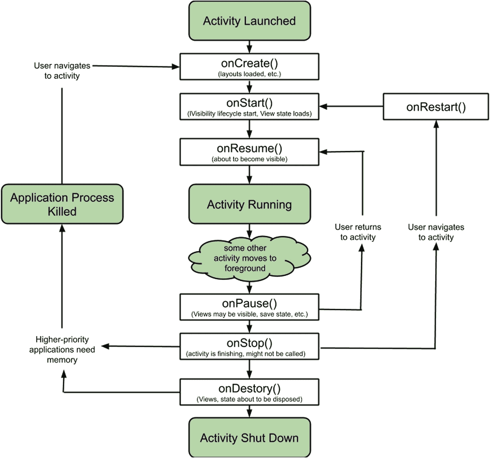

# 十一、理解活动

到目前为止，您对 activities 的介绍主要集中在使用它们作为学习 UI 小部件和布局的工具，知道它们在计算上是“廉价的”，是 Android UIs 的基本构建块，并且设计为您可以在您的应用程序中尽可能多地制作和使用，完全知道 Android 操作系统会愉快地回收资源并保持您的活动可管理。

理论上说得很好，但实践呢？在这一章中，我们将深入研究 Android“如何”在活动生命周期中管理活动，尝试活动生命的各个阶段，然后通过介绍活动的犯罪伙伴 fragments 来扩展您构建引人注目的用户界面的基线。您可以将片段视为一种合成技术，用于决定何时以及如何为更大的屏幕或维度极端的屏幕利用活动和活动组件的不同组合。

## 深入研究 Android 活动生命周期

到目前为止，本书中的所有例子都使用了一个 activity，尽管您已经阅读了多次，因为您的应用程序可以有任意多个 activity。不管您有多少个活动，每个活动的使用都受生命周期的控制，在生命周期中选择要运行的活动；被创建、使用、暂停和/或恢复；并最终被停止和处理。用简单的英语描述生命周期的各个阶段有助于你理解正在发生的事情，让我们看看生命周期状态的实际技术方面和 Android 用来触发状态转换的回调方法。图 [11-1](#Fig1) 展示了这些生命周期状态和伴随的回调方法的全貌。

图 11-1

使用回调转换方法的 Android 活动生命周期

应用程序通常以四种主要状态之一存在:

1.  已启动:某个动作(通常是用户触发的动作)指示 Android 操作系统运行该应用程序时，该应用程序的初始状态。

2.  运行中:用户第一次看到你的应用程序并与之交互的时刻(和正在进行的状态)。一般来说，这是在发射后已经进行了一系列准备步骤之后。

3.  killed:Android 操作系统收到不再需要该应用程序的通知后，该应用程序进入的状态，原因可能是用户关闭了该应用程序，或者是发生了一些资源引发的收割。

4.  关闭(以及任何不处于启动、运行或终止状态的应用程序):从操作系统内存中清除所有持久数据、视图层次结构、缓存数据等的最终状态。

这些状态中的每一个都是不言自明的。在生命周期回调方法的领域中，让应用程序在不同状态之间移动的是乐趣所在。

### 了解活动生命周期回调方法

图 [11-1](#Fig1) 中显示的每一种生命周期方法都有你应该熟悉的特定行为和用途。您可能不需要突然开始为您的应用程序的这些生命周期阶段添加定制逻辑，但是知道在哪里添加东西将为您在未来作为 Android 开发者的快速进步做好准备。我们将逐一介绍每种方法，突出它们的具体用途。

每个方法都有与其他方法相同的特征，例如当调用任何回调方法时，几乎普遍使用各自父类的等效方法作为第一个动作。例如，在本书前面的例子中可以看到，`onCreate()`方法的第一步是调用`super.onCreate()`，它调用父版本。当您不想自动调用父类时，会有例外，但是我会在遇到这些情况时标记它们。现在，假设一个默认的良好行为是遵循“家长呼叫”实践。

#### onCreate()

每个活动都以`onCreate()`方法开始生命。无论您的用户点击了 Android 主屏幕上的图标来启动您的应用程序，还是配置更改触发了重新创建显示的需要，都会调用`onCreate()`。该方法采用一个 Bundle 对象来考虑这些后来的重建情况，因为 Bundle 将存储任何以前的状态、数据和资源，这些都是使活动变得生动所需要的——统称为实例状态。

对于您活动的任何`onCreate()`方法，您都应该考虑以下行动:

1.  将您计划使用的所有布局加载到内容视图中，以便在调用 onStart()方法时，Android 可以在显示 UI 之前创建它。

2.  初始化您在活动类定义中定义的任何活动级变量。

您可能还需要做一些工作来使用您作为应用程序的一部分创建的全局资源或变量。当我们讨论`onRetainNonConfigurationInstance()`时，我们将很快回到全局资源这个主题，并且当我们在本章的后面和本书的剩余部分讨论首选项时，我们也将探索更多的示例使用。

#### onStart（ ）

一旦`onCreate()`完成了从布局定义构建所有对象的任务，以及任何其他初始化工作，那么`onStart()`的工作就开始了。`onStart()`的工作是在屏幕上向用户呈现最终的用户界面。在前面的生命周期模型中，`onRestart()`之后的路径上也调用了`onStart()`方法。

在很多情况下，您需要覆盖`onStart()`并提供自己的逻辑。即使您很想这么做，您也需要意识到，如果您的活动遵循`onRestart()`路径，实例状态在这一点上仍然没有完全恢复，直到对`onRestoreInstanceState()`的后续调用完成。

实现您自己的`onStart()`覆盖非常有用的一种情况是，当您有一些长期存在的自定义资源时，您已经根据您的活动完全冻结或暂停了这些资源——做一个好公民，在不必要时不使用资源。如果您选择建立这样的资源管理，那么`onStart()`方法将是您恢复或解冻这样的定制资源的地方。确保调用`super.onStart()`方法来调用父类的等价方法，即使你知道父类中没有覆盖代码。Android 本身在这种情况下还是需要做好自己的内功。

#### onRestoreInstanceState()

如果用户结束一个活动，无论是通过使用 back 按钮，还是通过其他路径将他们从您的活动转移到另一个活动，他们都表明他们已经完成了原始的活动以及与它相关的所有状态。这将向作为应用程序开发人员的您表明，除了您需要维护的任何长期资源之外，您还可以免除该活动。当 Android 本身终止一个活动时，情况通常是不同的。首先，Android 由于配置的改变而终止了一个活动，并且它确实需要关心需要什么来重新创建活动以满足用户的需求。这意味着不仅要重新创建活动的可视显示，还要重新创建它的所有实例状态。

您可能希望在这里执行任何自定义的实例状态恢复，并记住实例状态与长期存储不同。还有其他机制来处理这个问题，包括我们将在本书后面讨论的偏好。如果您希望持久存储比首选项系统所设计的更复杂或更大类型的数据，那么基本的计算概念(如文件和数据库)是最好的方法，我们将在第 [18](18.html) 章中介绍这些内容。

#### onResume（ ）

对于 Android 用户界面来说,`onResume()`方法是关键时刻。`onResume()`方法是使完全渲染和膨胀的布局可见的关键方法，将所有累积的对象、逻辑等转移到前台。与`onPause()`一起，当其他活动和应用程序抢占它、跳转到焦点、被用户关闭等等时，到前台和从前台的转换将在您的活动生命周期中触发多次。

您通常应该考虑添加到`onResume()`的唯一逻辑与改变您活动的实时视觉方面相关，包括

1.  动画

2.  录像

3.  自定义视图过渡效果

在所有其他方面，您应该避免在`onResume()`中使用任何其他定制逻辑。

#### onpause()

Android 从一开始就被设计为支持同时运行的许多应用程序，并依赖于应用程序能够简单方便地暂停其活动，以便为用户决定使用的其他活动释放资源。为了支持这一点，应用程序将频繁地从前台状态转移到后台状态。在此之前，将调用`onPause()`方法。

在`onPause()`调用期间要考虑的最重要的任务包括保存尚未放入活动包中的任何状态，以及处理任何自定义动画、视频、音频或逻辑的其他实时方面。此外，`onPause()`调用还充当了一个阈值，超过这个阈值，Android 可以单方面终止您的活动并收回其资源。这意味着一旦`onPause()`调用退出，就不能保证您的流程和活动会再次接收到事件——所以保存您需要的东西，不要假设您的活动状态在没有您干预的情况下会持续下去。

#### onStop()

如果`onStart()`管理移动到前台的活动，你可以把`onStop()`想成相反的角色:负责把你的活动转移到后台。在`onStop()`完成之后，您的活动不再可见，尽管相关的视图层次结构和属性保持不变。

在 Android 积极的资源管理方法下，你应该永远记住`onStop()`可能永远不会为你的活动而被调用，所以在这里依赖自定义逻辑是不明智的。您可能会考虑覆盖默认设置的一个领域是与 Android 服务的任何交互，在这种情况下通常不需要前台交互。

#### onSaveInstanceState()

方法的名称和它在图 [11-1](#Fig1) 中的生命周期图中的位置都很好地说明了它的用途。这个方法的作用是为任何将要被`onDestroy()`方法销毁的活动保存活动状态，从而避免用户发现重要的状态已经丢失而没有意识到他们的活动可能已经结束并被重新创建的情况。这在任何配置更改事件下都会频繁发生，因此用户的体验需要使其透明和自动化。

Note

现在有一种趋势，开始支持`ViewModel`的概念，并使用该技术来保存任何瞬态。但是，仍然完全支持`onSaveInstanceState()`方法。你可以在`developer.android.com`了解更多关于 ViewModel 的信息。

#### onRestart（ ）

每次活动从停止状态转移到开始状态时，都会调用`onRestart()`方法。该方法为您提供了灵活性，使您能够以不同于那些已停止且现在已重新启动的活动的方式来处理新启动的活动版本，例如在重新启动的情况下保留视图层次结构，您可以利用该层次结构来加速某些初始化活动。

#### onRetainNonConfigurationInstance()

对于一个方法来说，这是一个很长很奇怪的名字，仔细观察生命周期图会发现它也不存在！这是因为`onRetainNonConfigurationInstance()`与活动的生命周期没有严格的联系。相反，它的目的是提供回调机制，以便在 Android 系统经历配置更改时调用。

“什么是配置变更？”你可能会问。有几个突出的动作，Android 认为整个设备的配置发生了变化，所有运行的应用程序都必须得到通知，并执行任何必要的步骤来适应这种变化。这些配置更改操作包括

1.  将设备从横向旋转到纵向，反之亦然

2.  将设备连接到 USB 电源

3.  将设备停靠在底座中

4.  添加或删除 SD 风格的存储设备

5.  更改 Android 操作系统的输入或显示语言

您的活动可能需要处理部分或全部这些事件。最明显的例子是需要根据设备的新方向重新绘制(或者严格地说，重新创建)布局。在这些情况下，Android 将保留活动前一个实例的所有资源，调用`getLastNonConfiguationInstance()` companion 方法将返回对这些资源的引用，使您能够执行您可能需要的任何进一步的更改处理。

随着无头片段的出现，这种方法在当代应用程序开发中不太常见。我们将在下一章 [12](12.html) 中讲述片段。

#### onDestroy()

我们已经到达了生命周期方法的终点，确切地说是`onDestroy()`方法，它本身就是关于结束活动的。我们知道，活动是廉价而丰富的，在构建应用程序时，只要需要，就应该使用然后丢弃。您可以考虑添加到`onDestroy()`覆盖中的核心逻辑是任何以活动为中心的清理。因为不能保证`onDestroy()`会被你的活动调用，所以你不应该依赖它，也不要期望与其他资源或服务交互。

### 理解活动生命周期的目标

对于新开发人员来说，掌握回调的整体概念对于更广泛地掌握消息和基于事件的开发至关重要。然而，如果你只把你的 Android 应用程序看作是在特定状态下的活动，等待回调信号时跳转，你就错过了一些更大的想法。

总的来说，廉价、易操作的活动和回调方法的简洁打包(这意味着每个活动都有自己的从“这里”到“那里”的说明)的最大目标是向用户呈现一个无缝的应用程序，它可以响应用户的输入和需求。这种以用户为中心的视图对于提供一致的体验是至关重要的，因为你的用户会倾向于把你的应用程序看作是屏幕的集合或层次结构，而不是那些容易创建和经常破坏的活动的松散联系。

当您开始用越来越多的活动编写应用程序时，记住以下原则会对您有好处:

1.  **活动要有重点**。你创建的每个活动都应该有助于服务于一个单一的(但不一定是简单的)目的或结果，而不是一个不相关的选项、行动和结果的总称。

2.  **保存状态，然后再次保存。**用户是不可预测的，他们在使用你的应用程序时会做最糟糕的事情——从关闭手机到反复切换你的应用程序等等。为了让您的用户相信您的应用程序可以直观地处理任何意外情况，经常保存状态是很重要的。把它想象成一个既便宜又有效的天然安全网。

3.  **给每个视图一个 ID** 。每个小部件、每个视图和每个视图组都应该用 android:id 属性进行注释。这有助于您自助，因为当每个视图都有一个 ID 时，保存实例状态变得非常容易。

4.  **应用和活动可以消失**。有些情况超出了您的控制范围，特别是无论您的应用程序多么高效和轻量级，您的用户都决定将它与其他占用大量内存和资源的应用程序一起安装。如果用户在这样的环境下暂停你的应用程序，Android 操作系统可能会关闭你正在运行的应用程序，以释放急需的内存。

## 管理活动配置更改

通过本章前面的描述，我强调了正常的活动生命周期至少有一个例外，即活动配置变更。配置更改通常被定义为影响整个应用程序、Android 用户空间或整个 Android 设备的事件。这可能会让你认为我在谈论地震事件——也许是一场 Android 地震。现实要稍微平凡一些。归类为配置更改的事件种类包括更改设备的界面语言、将设备插入电源、与另一个设备配对，或者只是将设备从纵向旋转到横向，反之亦然。

### 使用配置更改的默认方法

首先，好消息是:Android 为你跟踪设备上发生的所有配置变化，通过使用通知回调来通知所有正在运行的应用程序特定的变化。除了这个基本通知，Android 还会尽最大努力避免让您承担过多的工作来确定配置更改应该如何在您的应用程序中体现出来。Android 通过利用程序中的现有结构来做到这一点。

Android 为您采取的最有价值的行动之一是监控已经发生的任何配置更改，并参考您为应用程序创建的所有可用布局，并执行所有需要的布局工作，以使用与配置更改结果匹配的布局来重新创建您的活动，无论是将旋转匹配到相关的纵向/横向布局，还是将语言从左到右改为从右到左，等等。

布局行为和娱乐已经为您完成，剩下的只需要照顾您为给定活动创建或获得的任何资源。作为配置更改的一部分，您需要保存和恢复这些活动，因为 Android 会破坏之前的活动并重新创建它。您的活动有机会干净地保存其当前状态和资源，以便在重新创建时，您的新活动可以恢复它们，将活动状态恢复到破坏前的状态。以下回调涵盖了允许您跨配置更改保存和恢复状态和资源的流程:

1.  `onSaveInstanceState():`当触发任何配置更改时，在 Android 销毁当前活动之前，会立即调用`onSaveInstanceState()`。这是保存任何临时或正在使用的资源或您需要保留的数据的时间。创建并使用一个捆绑对象来保存您希望保留的所有项目，以便在后续的活动重新创建中使用。如果你回头看看整本书已经展示过的例子，你可以看到在`onCreate()`时间使用 Bundle 对象的地方(稍后会有更多)。`onSaveInstanceState()`超类祖先还在幕后为您执行一系列非常有用的工作，包括保存任何对象的视图状态——小部件、UI 元素等等——这些对象已经用一个 ID 进行了声明，可以在需要时重新创建。

2.  当一个活动开始活动的时候，它或者被重新创建，或者在我们当前的讨论中，它被传递给所需的 Bundle 对象，以便保存的资源和其他数据可以被恢复。除了确保调用父类`super.onCreate()`方法，您不需要做任何更复杂的事情。您可以随时选择添加自定义状态并在`onSaveInstanceState()`期间保存它——然后您需要将您的自定义恢复逻辑也提供给`onCreate()`,或者提供给在(重新)创建活动时调用的下一个方法`onRestoreInstanceState()`。

3.  您的 Bundle 对象也被传递给这个方法，此时您可以有选择地检索和恢复您想要的任何进一步的资源。等到活动生命周期中的这一点的一个好处是，您可以确保活动的布局已经展开，内容视图已经设置，这样活动的所有可视方面都已就位。

## 摘要

现在，您对活动生命周期和回调方法的重要性有了一个坚实的基础，您可以在需要时覆盖这些方法。当我们介绍片段时，我们将在第 [12](12.html) 章继续讨论生命周期，然后将展示一个合并的示例应用程序，展示在现实生活中如何以及在哪里使用生命周期回调方法覆盖。