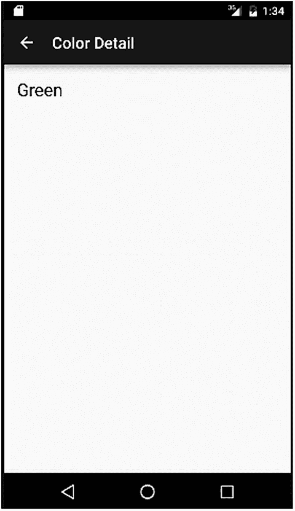

# 十二、片段简介

到目前为止，在我们的 Android 布局基础之旅中，我们已经介绍了基本的基于视图的 UI 小部件，并介绍了活动及其生命周期。多年来，这就是在 Android 世界中创建应用的全部内容——设计您的活动，为您的应用添加您想要的逻辑，并在用户浏览您的应用的功能时创建和处理由此产生的膨胀(或呈现)的活动。

2011 年左右，事情爆炸了。或者，更具体地说，随着平板电脑及其更大显示屏的出现和普及，屏幕尺寸出现了爆炸式增长。快进几年，我们已经有了汽车上的平板显示器、巨型电视屏幕显示器等等，所有这些都是由 Android 驱动的。最大限度地利用突然出现的屏幕空间，促使谷歌推出了 Android UI 世界自诞生以来最大的变化之一:片段。

碎片解决了很多问题。从确保没有大面积的空间浪费到克服看起来很糟糕的暴力缩放技巧，片段为您提供了从多组相关的小部件组合 ui 的机制，然后在活动中灵活地显示片段，从而能够在一个屏幕上显示更多的内容，或提供更多的功能。

## 从片段类开始

随着大屏幕的出现和通常会看到更多设备旋转的用户体验(例如，在纵向模式下阅读，然后在横向模式下观看电影)的出现，开发人员必须在创建更多活动或更好地重用已为应用构建的活动集合之间做出选择。片段偏向于后一种重用范式，并在活动和呈现它们的布局容器以及用于功能的 UI 小部件之间引入了一个中间层。这有助于降低复杂性，同时处理屏幕尺寸几乎无休止的增长。使用应用的某些方面会发生变化，尤其是活动的生命周期。接下来我们将详细讨论这一点。

Fragments And Backward Compatibility

早在 Android 3.0 版本中就引入了片段(称为蜂巢)。通过 Jetpack 或旧的 Android 兼容性库，您甚至可以依赖旧版本的良好支持。

### 为您的应用使用基于片段的设计

在深入以片段为中心的设计之前，您应该知道使用片段是完全可选的。如果你现在喜欢设计大量活动的想法，没有必要放弃这种方法。但是如果你更喜欢利用片段提供的好处，请继续阅读。

要在设计中考虑片段，请考虑您现有的布局以及各种小部件(如 TextView、Button、RadioGroup 和其他视图)放置的位置。只要有概念上相关并放在一起的小部件子集——比如 TextView 充当 EditText 旁边的标签——就可以认为该子集已经成熟，可以包装在片段中了。为了直观地展示这一点，图 12-1 显示了这种分组，在小部件和整体活动之间有一个片段中间层。


图 12-1

片段作为小部件和活动之间的中间组

使用这个模型，您可以看到片段分组是如何移动的，并且可能会在更大的屏幕上以不同的方向显示更多的片段及其包含的小部件。您仍然能够在更小的手机屏幕上显示完美的 UI，而不必在尺度的两端做出妥协。

为了实现这一壮举，片段首先使用`<fragment>`元素块将 XML 添加到布局中。在接下来的示例中，您将会看到这一点。您的布局定义的其余部分基本保持不变，这意味着到目前为止您所学的所有内容在片段设置中仍然是 100%可用的。这使您可以继续使用视图的层次结构，并使这些视图膨胀，以创建用户与之交互的结果屏幕，就像以前一样。

使用片段还引入了一种使用 Bundle 对象的额外情况，提供初始化、状态保存和重新创建，其方式与前面在第十一章中讨论的活动非常相似。片段还有其他值得了解的特性，包括:

1.  您可以子类化基本片段类并添加您自己的自定义逻辑，但是您必须为派生类提供一个构造函数。

2.  当使用片段时，Android 会创建一个片段管理器来处理你的片段之间的双向交互——你不需要为此编码。

需要注意的另一个主要变化是整体活动和片段生命周期是如何变化的。

### 使用片段生命周期

在片段生命周期和活动生命周期之间存在许多共享的行为和概念，我在前面的第十一章中介绍过。与活动生命周期一样，片段生命周期的可视化图表有助于概念化状态和转换。完整的片段生命周期如图 12-2 所示。


图 12-2

片段生命周期

原始活动生命周期和片段生命周期之间的主要区别与宿主活动和组成片段的交互有关。与父活动的单个状态转换相比，片段可能会增加复杂性和多个事件转换。

### 回顾片段生命周期回调方法

许多片段生命周期回调方法与您在活动中看到的方法同名，但是您应该注意这并不意味着它们做完全相同的事情。下面的列表展示了主要的区别，以及只有片段的回调方法。

#### onInflate()

调用`onInflate()`方法是为了使用`<fragment>`元素将布局 XML 文件中定义的片段布局扩展到屏幕 UI 中。如果您通过`newInstance()`调用在代码中以编程方式显式创建新的片段，您也可以直接调用`onInflate(`。传递给它的参数包括片段将存在于其中的引用活动和一个 AttributeSet，以及来自`<fragment>`标记的任何附加 XML 属性。在这个阶段，Android 正在决定你的片段在渲染时的样子，尽管它目前不会显示它。该步骤发生在`onAttach()`回调期间。

#### onCreate()

片段的`onCreate()`类似于活动的`onCreate()`，有一些小的调整。主要的变化是您不能依赖任何活动视图层次结构来引用`onCreate()`调用。仔细想想，这是有意义的，因为与片段相关联的活动正在经历它自己的生命周期，而就在您认为可以开始依赖它的时候，它可能会停止存在，或者经历一个配置更改或另一个导致视图层次结构被破坏或重新创建的事件。

#### onattach()

在 Android 确定片段被附加到哪个活动之后，回调立即发生。在这一点上，您可以安全地处理活动关系，比如为其他操作获取和使用上下文。任何片段都有一个继承的方法`getActivity()`，该方法将返回它所附加的活动。您的片段也可以使用`getArguments()`方法来获取和处理任何初始化参数。

#### onCreateView()

`onCreateView()`回调为您提供了为片段返回所选视图层次的机制。它接受一个`LayoutInflater`对象、`ViewGroup`和实例状态的`Bundle`，然后依靠 Android 根据所有常见的屏幕大小和密度属性选择一个合适的布局，用。`inflate(`)的`LayoutInflater`方法，以你认为需要的任何方式修改布局，然后将结果视图对象交回进行渲染。

#### onViewCreated()

在`onCreateView()`返回后，立即触发`onViewCreated()`。在使用任何保存的状态修改视图之前，它可以执行进一步的后处理工作。

#### onViewStateRestored()

在片段的视图层次结构的所有状态都恢复的情况下，调用`onViewStateRestored()`方法。这对于区分新的创建和配置更改后的恢复等情况非常方便。

#### onStart（ ）

片段的`onStart()`回调直接与父活动的对等`onStart()`相关联，并在片段显示在用户 UI 中后立即被调用。您想放在活动级`onStart()`回调中的任何逻辑都应该放在相关的片段`onStart()`方法中。

#### onResume（ ）

片段`onResume()`方法也紧密地映射到等价的活动`onResume()`方法。这是用户完全控制活动及其片段之前的最后一次调用。

#### onpause()

`onPause()`回调也与整体活动的`onPause()`方法紧密匹配。如果您将逻辑移动到片段中，那么 activity variant 中关于暂停音频或视频、暂停或释放其他动作和资源等的规则在这里都适用。

#### onSaveInstanceState()

`onSaveInstanceState()`的片段版本与 activity equivalent 相同。您应该使用`onSaveInstanceState()`通过片段的`Bundle`对象来持久化您想要在片段实例之间保留的任何资源或数据。不要过分保存大量的数据和状态——记住，你可以在片段本身之外使用长寿命对象的标识符引用，只需要引用和保存那些。

#### onStop()

onStop()方法相当于 activity 的相同方法。

#### onDestroyView()

`onDestroyView()`在片段移动到生命结束阶段时被调用。当 Android 已经分离了与片段相关联的视图层次时，`onDestroyView()`被触发。

#### onDestroy()

一旦片段不再被使用，就调用`onDestroy()`方法。此时，该片段仍然与它的活动相关联，尽管它很快就会被送到废料堆！

#### 底部( )

终止一个片段的最后一步是从它的父活动中分离出来。这也标志着应该销毁、移除或释放所有其他资源、引用和其他残留标识符的时刻。

## 从简单的片段生命周期事件开始

前面的一组生命周期阶段和相关的片段回调方法可能会让您晕头转向，您可能会担心为了使用和受益于片段，您必须立即为所有这些方法编码。你不用担心！正如对活动生命周期的介绍一样，您不必用自己的逻辑覆盖所有的存根方法。只有在特定的状态转换中，您需要或想要做一些事情时，您才需要提供支持代码。你可以从为`onCreateView()`方法提供一个覆盖开始，然后退出。

在下面的`ColorFragmentsExample`代码中，我就是这么做的，将回调逻辑保持在绝对最小。

### 创建基于片段的应用

是时候看看片段的作用了！我将使用一组简单的颜色主题小部件和活动来说明开始使用片段的容易程度。

#### 创建片段布局:颜色列表

清单 12-1 显示了基于片段的布局，它将在父活动中用于显示颜色列表。

```java
<fragment xmlns:android="http://schemas.android.com/apk/res/android"
    xmlns:tools="http://schemas.android.com/tools"
    android:id="@+id/color_list"
    android:name="org.beginningandroid.colorfragmentsexample.ColorListFragment"
    android:layout_width="match_parent"
    android:layout_height="match_parent"
    android:layout_marginLeft="16dp"
    android:layout_marginRight="16dp"
    tools:context=".ColorListActivity"
    tools:layout="@android:layout/list_content" />

Listing 12-1Fragment layout for displaying a list of colors

```

这个定义包含了`<fragment>` XML 元素，并依赖于股票列表内容布局来显示列表中的`TextView`条目。我们将把这个片段用于所有不同的可能显示尺寸和方向，无论是电话屏幕上的单窗格视图还是大屏幕上的多窗格视图布局。

#### 创建片段布局:颜色细节

我将使用一个`TextView`小部件来显示颜色的细节，然后将它放在片段中，该片段将放在父活动中。在`Ch12/ColorFragmentExample`项目的 fragment_color_detail.xml 文件中可以找到`TextView`的简单布局。清单 12-2 显示了内容。

```java
<TextView xmlns:android="http://schemas.android.com/apk/res/android"
    xmlns:tools="http://schemas.android.com/tools"
    android:id="@+id/color_detail"
    style="?android:attr/textAppearanceLarge"
    android:layout_width="match_parent"
    android:layout_height="match_parent"
    android:padding="16dp"
    android:textIsSelectable="true"
    tools:context=".ColorDetailFragment" />

Listing 12-2The TextView layout used to show color details

```

#### 颜色详细信息的单窗格父活动

当在小屏幕设备上运行时，我们会将`TextView`布置在一个适合大小的活动中。该活动的唯一任务是创建包含`TextView`的片段，您可以在清单 12-3 中看到这段代码。

```java
<FrameLayout xmlns:android="http://schemas.android.com/apk/res/android"
    xmlns:tools="http://schemas.android.com/tools"
    android:id="@+id/color_detail_container"
    android:layout_width="match_parent"
    android:layout_height="match_parent"
    tools:context=".ColorDetailActivity"
    tools:ignore="MergeRootFrame" />

Listing 12-3The activity_color_detail.xml layout

```

这是一个简单的`<FrameLayout>`带有一些基本的华丽。`TextView`将通过一个片段放置在这个布局中。

#### 颜色详细信息的双窗格父活动

当我们移动到一个更大的屏幕上时，一个更合适的布局会将所有的片段和 UI 小部件同时放在屏幕上，最大化地利用空间。

这个`activity_color_twopane.xml`布局文件可能会让你觉得有更多的工作要做，但是仔细观察，你会发现它实际上只是一个包含了`<fragment>`和`<FrameLayout>`的组合，我们把它们放到了小屏幕的单独布局中。清单 12-4 展示了这个 XML。

```java
<LinearLayout xmlns:android="http://schemas.android.com/apk/res/android"
    xmlns:tools="http://schemas.android.com/tools"
    android:layout_width="match_parent"
    android:layout_height="match_parent"
    android:layout_marginLeft="16dp"
    android:layout_marginRight="16dp"
    android:baselineAligned="false"
    android:divider="?android:attr/dividerHorizontal"
    android:orientation="horizontal"
    android:showDividers="middle"
    tools:context=".ColorListActivity">

    <fragment android:id="@+id/color_list"
        android:name="com.artifexdigital.android.colorfragmentsexample.ColorListFragment"
        android:layout_width="0dp"
        android:layout_height="match_parent"
        android:layout_weight="1"
        tools:layout="@android:layout/list_content" />

    <FrameLayout android:id="@+id/color_detail_container"
        android:layout_width="0dp"
        android:layout_height="match_parent"
        android:layout_weight="3" />

</LinearLayout>

Listing 12-4The activity_color_twopane.xml layout

```

与连接在一起的独立布局相比，唯一的区别是 android:layout_weight 值，它将用于管理两个片段在单个活动中一起呈现时所使用的相对屏幕空间。通过选择 1:3 的比例，这将给主列表片段四分之一的空间，给细节片段剩下的四分之三的空间。

### 选择要膨胀的布局

你的 Android 应用如何决定使用哪种布局，显示什么样的片段排列？答案在于在项目的`res/`资源文件夹层次结构中使用多个 refs.xml 文件。在我们的例子中，我们在每个`res/values-large`和`res/values-sw600dp`文件夹中都有一个 refs.xml 文件。

当我们的代码运行时，Android 将在运行时检查所有不同大小特定的`res/`目录中的任何大小特定的 XML 资源(可以有两个以上，正如您在本书前面对 Android 项目结构的探索中看到的)。对于大尺寸和 sw600dp 尺寸的屏幕，refs.xml 中只有一个子元素，如下所示:

```java
<item type="layout" name="activity_color_list">@layout/activity_color_twopane</item>

```

任何被 Android 归类为“大”或符合 sw600dp 分辨率标准的屏幕都会触发 Android 使用来自同名 XML 文件的`activity_color_twopane`布局。

## 片段编码

在为基于片段的应用编写代码时，您需要考虑的差异很少。主要的不同之处在于我们在第十一章中提到的与生命周期相关的回调，以及你的以用户界面为中心的逻辑和任何相关的数据处理将转移到片段级别。您的活动仍然存在，并且它们处理活动生命周期事件的逻辑和跨片段的功能也保持不变。

我们的`ColorListActivity`是使用片段时低编码负担的一个很好的例子。清单 12-5 展示了我们的应用的完整逻辑，包括处理我们的应用最终在父活动中显示为一个还是两个片段。

```java
package org.beginningandroid.colorfragmentexample;

import android.content.Intent;
import android.os.Bundle;

public class ColorListActivity extends FragmentActivity
        implements ColorListFragment.Callbacks {

    private boolean mTwoPane;

    @Override
    protected void onCreate(Bundle savedInstanceState) {
        super.onCreate(savedInstanceState);
        setContentView(R.layout.activity_color_list);

        if (findViewById(R.id.color_detail_container) != null) {
            mTwoPane = true;

            ((ColorListFragment) getSupportFragmentManager()
                    .findFragmentById(R.id.color_list))
                    .setActivateOnItemClick(true);
        }
    }

    @Override
    public void onItemSelected(String id) {
        if (mTwoPane) {
            Bundle arguments = new Bundle();
            arguments.putString(ColorDetailFragment.ARG_ITEM_ID, id);
            ColorDetailFragment fragment = new ColorDetailFragment();
            fragment.setArguments(arguments);
            getSupportFragmentManager().beginTransaction()
                    .replace(R.id.color_detail_container, fragment)
                    .commit();
        } else {
            Intent detailIntent = new Intent(this, ColorDetailActivity.class);
            detailIntent.putExtra(ColorDetailFragment.ARG_ITEM_ID, id);
            startActivity(detailIntent);
        }
    }
}

Listing 12-5The code for the ColorListActivity

```

总的来说，逻辑非常简单。当调用`onCreate()`时，我们将`activity_color_list`布局展开到 UI 中。接下来，我们测试以确定 color_detail_container 视图对象是否已经实例化(不管它是否显示)。这给了我们一个代理来确定应用是否运行在 activity_color_twopane 布局中，基于 Android 中的屏幕检测规则和我们的`refs.xml`规则。如果我们在这种状态下运行，我们设置一个布尔值`mTwoPane`为真，并使用`getSupportFragmentManager()`，通过`setActivateOnItemClick()`方法设置点击处理。

然后，`onItemSelected()` override 承担了决定当用户点击一种颜色时做什么的任务。我们应该使用`ColorDetailFragment.java`中的`color_detail_fragment`布局和相关代码创建一个额外的片段，还是应该使用`startActivity()`来显式调用`color_detail_activity`布局和相关的`ColorDetailActivity.java`代码？

`Ch12/ColorFragmentExample`中的源代码还揭示了显示颜色细节的机制和支持的`ColorContent`类，这只是一种为颜色和一些管理功能设置的项目的 Java 打包方法(记住，Android 的 Java 支持尚未超过 Java 8，因此像数据类这样的更现代的方法不可用)。可以提供该列表的其他选项是内容供应器或其他数据源。

## ColorFragmentExample 行动范例

应用逻辑、布局和片段完成后，让我们运行应用吧！

为了查看片段在运行中的威力，我们需要两个不同大小的模拟器，它们已经在前面的例子中设置好了。图 12-3 和 12-4 显示了一个小设备上独立活动中的颜色列表和颜色细节片段——我在这个例子中使用了我的 Pixel 2 AVD。



图 12-4

通过触发新的活动来显示颜色细节片段


图 12-3

Pixel 2 模拟器上显示的颜色列表片段

当在更大的屏幕上运行相同的应用时，您可以看到不同之处。图 12-5 和 12-6 展示了片段的威力，应用运行在 Pixel C 仿真器上。


图 12-6

检测到大屏幕后，第二个片段被添加到活动中


图 12-5

ColorListActivity 初始显示，像素 C 上有一个片段

## 摘要

既然您已经记住了片段的核心概念，那么探索片段方法的全部能力的最佳方式就是在越来越多的应用中进行实践。我们在本书网站 [`www.beginningandoid.org`](http://www.beginningandoid.org) 上有更多使用片段的例子。你可以在网上找到成千上万的例子。