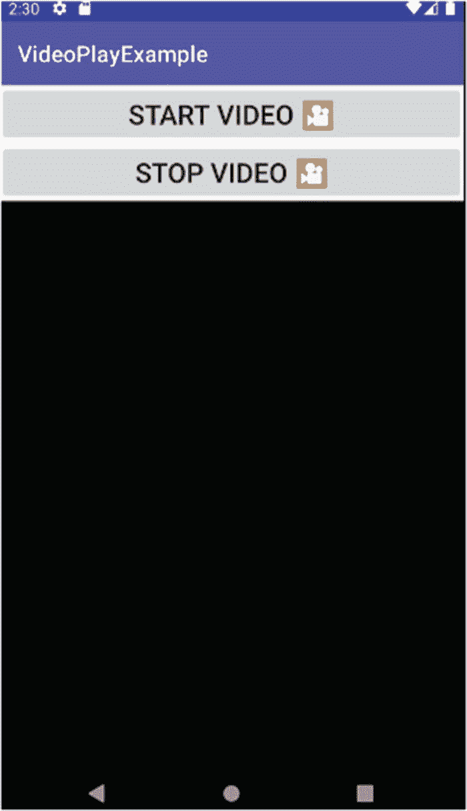
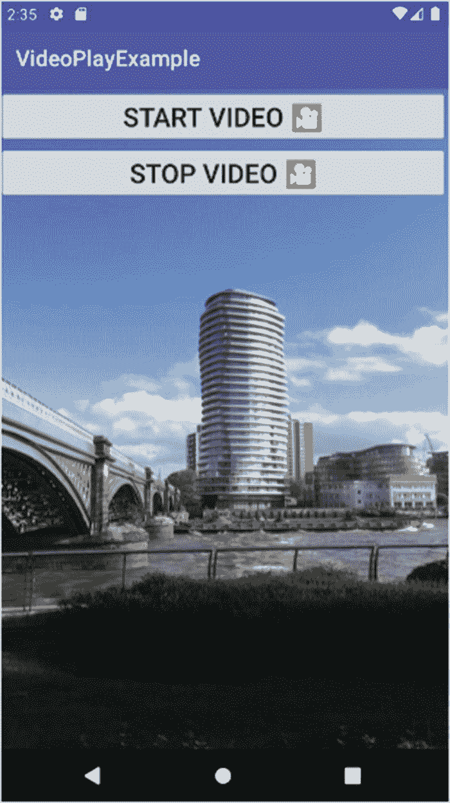
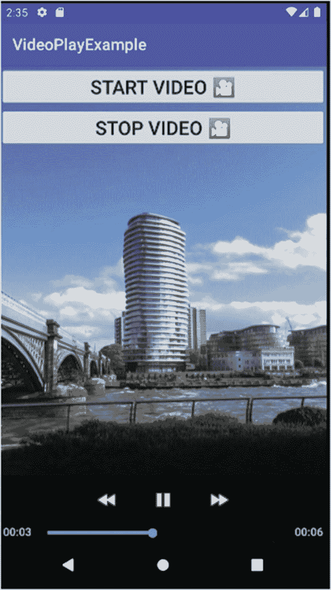
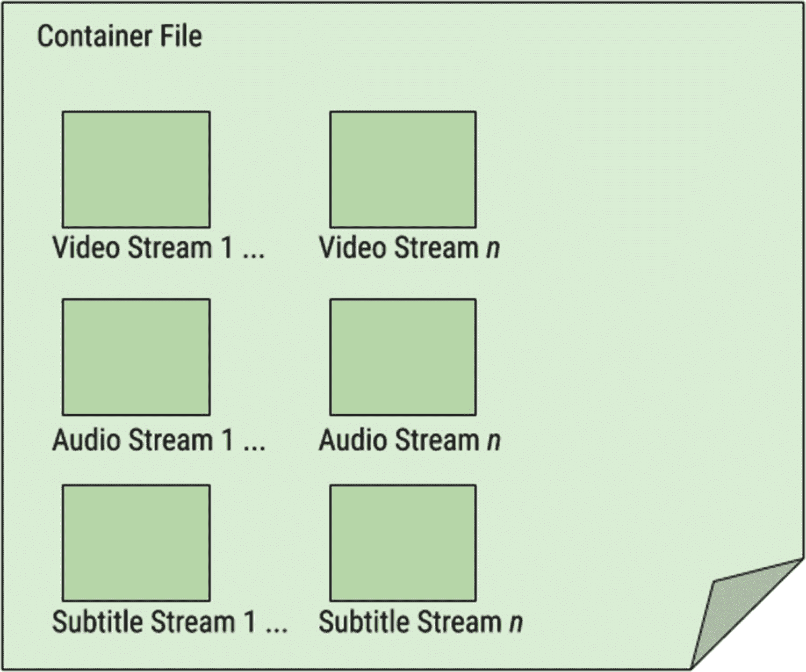
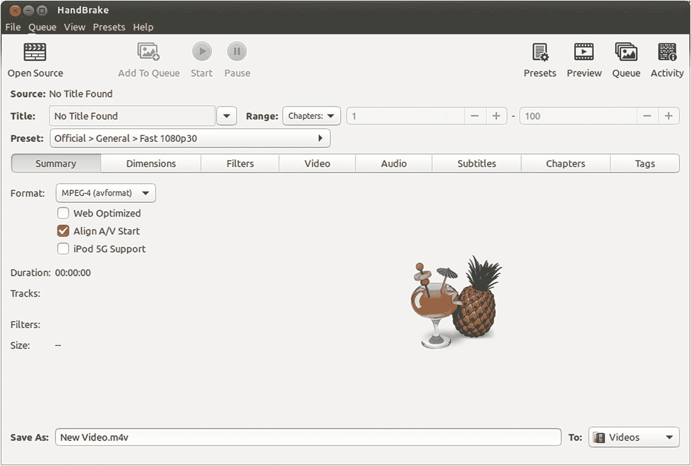
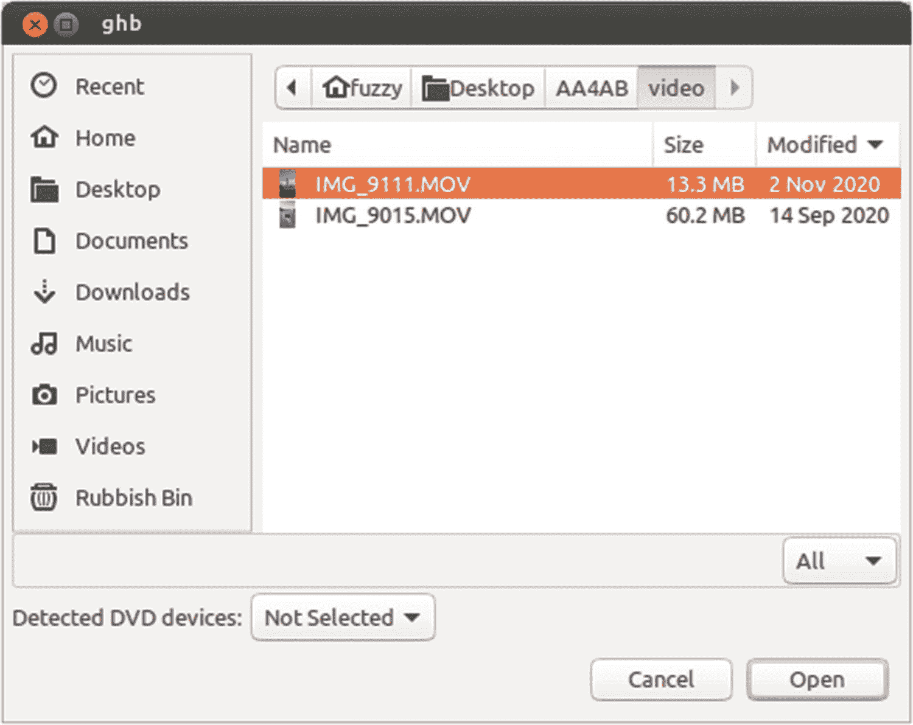
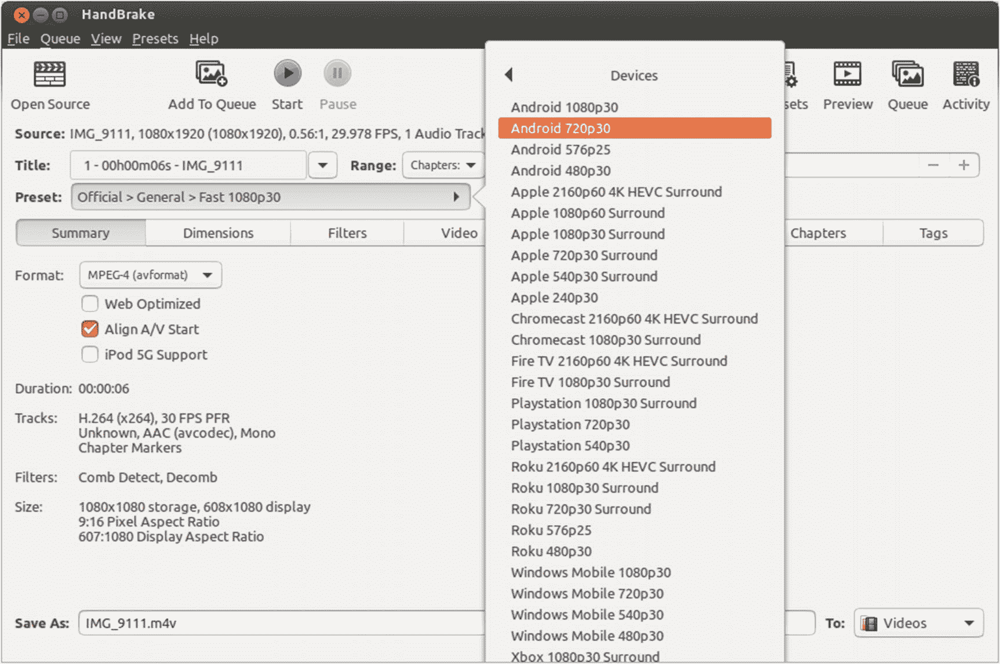

# 十四、为 Android 处理视频和电影

近年来，手机应用最繁荣的领域之一是视频。无论是在通勤时观看网飞的流媒体节目，还是在 YouTube 上捕捉猫咪的滑稽动作，或者使用基于视频的聊天和消息应用，视频在安卓系统中从未如此突出。给你的应用添加视频功能非常简单，尽管你应该知道 Android 下的视频有一些奇怪和意想不到的地方。

在这一章中，我们将探讨向应用添加视频内容的最简单方法，然后花时间学习更广泛的视频工具集，如果你打算认真对待 Android 视频的话。在本书的后面，我们还将提到使用 Android 内容供应器机制的视频选项。

## 回放视频

就像音频和声音一样，Android 提供了一系列将视频回放引入应用的方法。事实上，这些方法中的一些是你在上一章中已经使用过的类和框架，比如媒体框架。

播放视频有其独特的方面，其中最重要的是使用专用的小部件 VideoView，用于实际显示视频和控制视频在播放过程中的一些行为，以及用户在播放时对视频的一些控制。

在 Android 中处理视频非常简单。虽然您可以构建复杂的层次，但从最基本的开始是理解视频播放过程中发生的事情的机制的好方法，也是让自己熟悉更复杂的方法对您隐藏的基本构件的好方法。

我们将通过浏览一个示例应用来开始探索视频回放，您可以在`Ch14/VideoPlayExample`项目文件夹中找到该示例应用。

### 设计基于视频视图的布局

为了显示视频以便回放，我们需要一个合适的带有 VideoView 对象的活动。清单 14-1 显示了 VideoPlayExample 应用的布局，它就有这样一个视频视图。

```java
<?xml version="1.0" encoding="utf-8"?>
<androidx.constraintlayout.widget.ConstraintLayoutxmlns:android="http://schemas.android.com/apk/res/android"
    xmlns:app="http://schemas.android.com/apk/res-auto"
    xmlns:tools="http://schemas.android.com/tools"
    android:layout_width="match_parent"
    android:layout_height="match_parent"
    tools:context=".MainActivity">

    <VideoView
        android:id="@+id/video"
        android:layout_width="match_parent"
        android:layout_height="match_parent"
        app:layout_constraintTop_toBottomOf="@+id/stopButton"
        tools:layout_editor_absoluteX="0dp" />

    <Button
        android:id="@+id/startButton"
        android:layout_width="match_parent"
        android:layout_height="wrap_content"
        android:layout_above="@+id/stopButton"
        android:onClick="onClick"
        android:text="Start Video &​#​127910​;"
        android:textSize="24sp"
        app:layout_constraintTop_toTopOf="parent"
        tools:layout_editor_absoluteX="16dp" />

    <Button
        android:id="@+id/stopButton"
        android:layout_width="match_parent"
        android:layout_height="wrap_content"
        android:layout_alignParentStart="true"
        android:layout_alignParentLeft="true"
        android:layout_centerVertical="true"
        android:onClick="onClick"
        android:text="Stop Video &​#​127910​;"
        android:textSize="24sp"
        app:layout_constraintTop_toBottomOf="@+id/startButton"
        tools:layout_editor_absoluteX="16dp" />

</androidx.constraintlayout.widget.ConstraintLayout>

Listing 14-1Layout XML including VideoView object for VideoPlayExample

```

回顾我们的布局，您会注意到我们有如下三个小部件:

1.  “开始视频”按钮，其`startButton`的`android:id`和`android:onClick`属性设置为“onClick”

2.  一个“停止视频”按钮，`stopButton`的`android:id`和`android:onClick`属性设置为“onClick ”,就像`startButton`一样

3.  一个`VideoView`小部件，带有一个`video`的`android:id`

我们使用了一个`ConstraintLayout`布局，并将`startButton`设置为限制在父窗口的顶部(也就是活动窗口的顶部)。`stopButton`被约束对齐到`startButton`的底部，视频`VideoView`被约束对齐到`stopButton`的底部。在显示任何视频之前，最终的布局看起来很像图 14-1 中的图像。



图 14-1

VideoPlayExample 应用的可视布局

布局故意非常直接，以便访问视频文件、播放视频文件等的逻辑更加平易近人。鉴于两个按钮都使用了`android:onClick="onClick"`属性，您可能已经能够猜出基本结构了。

### 在代码中控制视频回放

查看伴随我们布局的 Java 逻辑，您将立即发现一个模式，它与我在第十三章中介绍的音频和声音示例相似。正如我们在 AudioPlayExample 和 AudioStreamExample 应用中看到的那样，许多控制逻辑都围绕着使用 onClick()方法来驱动活动行为。我们的 Java 代码如下所示，如清单 14-2 所示。

```java
package org.beginningandroid.videoplayexample;

import androidx.appcompat.app.AppCompatActivity;
import android.net.Uri;
import android.os.Bundle;
import android.view.View;
import android.widget.MediaController;
import android.widget.VideoView;

public class MainActivity extends AppCompatActivity {
    private VideoView vv;
    private MediaController mc;

    @Override
    protected void onCreate(Bundle savedInstanceState) {
        super.onCreate(savedInstanceState);
        setContentView(R.layout.activity_main);

    }

    public void onClick(View view) {
        switch(view.getId()) {
            case R.id.startButton:
                doPlayVideo();
                break;
            case R.id.stopButton:
                doStopVideo();
                break;
        }
    }

    private void doPlayVideo() {
        vv =(VideoView)findViewById(R.id.video);

        mc = new MediaController(this);
        mc.setAnchorView(vv);

        vv.setMediaController(mc);
        vv.setVideoURI(Uri.parse("android.resource://" + getPackageName() + "/" + R.raw.video_file));
        vv.requestFocus();
        vv.start();
    }

    private void doStopVideo() {
        if (vv != null) {
            vv.stopPlayback();
        }
    }

}

Listing 14-2The Java logic for video playback

```

Note

这个代码示例使用了一个名为“video_file.m4a”的视频文件。如果您出于任何原因需要访问原始视频文件，可以从`beginningandroid.org`网站获得。

从我们的`MainActivity`开始，你会看到我们创建了两个对象。第一个是名为`vv`的`VideoView`对象，稍后将用于绑定到展开布局的`<VideoView>`元素。第二个是一个`MediaController`对象`mc`，我们很快就会谈到它。`onCreate()` override 执行扩展布局的基本操作，仅此而已。

接下来，您将看到`onClick()`方法，就像在音频示例中一样，它将一个`View`作为参数，然后使用一个基于视图的`android:id`的`switch`语句来确定哪个按钮被点击了:`startButton`或`stopButton`。这与第十三章中的例子使用的模式非常相似——你可以看出这是我反复发现的一个有价值的模式！

如果`startButton`被检测为`View`(按钮)被点击，那么`doPlayVideo()`方法被调用。该方法首先确保`vv VideoView`对象绑定到`VideoView` UI 小部件，使用现在已经很熟悉的调用`findViewById()`的技术，并使用布局中`VideoView`持有的“视频”的 android:id 的`R.id.video`样式表示。

接下来，我们实例化新的`MediaController`对象`mc`，然后立即调用`setAnchorView()`方法。这将绑定`MediaController`，并允许它呈现一组浮动控件，当在应用中使用时，这些控件将出现在`VideoView`对象上。当您运行`VideoPlayExample`应用时，您将能够看到其中的一些控件。同样，我们向`VideoView`指出`mc MediaController`负责管理`vv VideoView`中显示的任何视频的回放的某些方面。

对`vv.setVideoURI()`的调用构建了一个兼容的 URI，它引用了一个名为`video_file.m4v`的视频，该视频已被放入项目的 raw 文件夹中。要想看到完全成型的 URI 是什么样子，可以在 Android Studio 中调试代码并设置断点。

视频的 URI 传递给了`VideoView`，我们调用`requestFocus()`来确保小部件获得焦点，然后通过调用`start()`方法开始回放。假设所有的工作都按照描述进行，你应该会看到视频开始播放，如图 14-2 所示(至少是静态截图)。



图 14-2

视频播放示例在播放过程中显示视频

我们逻辑的最后一部分是`doStopVideo()`方法，它被调用以响应检测到用户点击`stopVideo`按钮的`onClick()`方法。在`doStopVideo()`中，我们首先检查以确保`VideoView`对象`vv`已经被实例化，然后调用它的`stopPlayback()`方法。

除了我们非常基本的显式控件之外，如果您在播放期间触摸`VideoView`范围内的任何地方，您还将能够看到`MediaController's`浮动 UI 元素出现在视频上。`MediaController`播放控件将出现，如图 14-3 所示。



图 14-3

回放期间视图中的 MediaController 控件

## 理解关键视频概念

掌握了视频播放的基本技巧后，你可以通过几个途径来扩展你的视频技能。您可以尝试活动和 VideoView 和 MediaController 视图对象的进一步组合，以精确布局您想要的视频界面类型。您还可以将视频片段组合成更复杂的活动，例如应用或游戏的视频过场动画开场序列。

另一条你可以也应该同时采取的途径是，确保你在数字视频的基础方面有良好的基础，这样你就可以在构建你的 Android 应用时，对内容、大小、质量和用途做出好的选择。接下来，我们将介绍您应该了解的关键概念。

### 比特率

我们在第十三章讨论音频时引入了比特率的概念。从概念上讲，比特率代表视频的同一个方面——在任何给定的时刻，可用于代表视频各个方面或视频帧的数据量。视频的比特率通常由(至少)两个因素的组合来计算。首先，视频的分辨率是多少，换句话说，控制视频帧实际物理高度和宽度的水平和垂直像素密度是多少？第二，在整体分辨率中，有多少位信息用于描述每个给定像素的颜色、色调和饱和度？

一般来说，正如我们在音频中看到的那样，更高的比特率意味着更好的保真度，这通常会导致观看视频的人感受到更好的质量。权衡也是一样的:更高的比特率需要更多的存储，因为每个视频帧要编码更多的信息。这就引出了对帧率的讨论。

### 帧频

视频的帧速率几乎是不言自明的。以什么样的速率显示图像帧，人类视觉暂留效应会让我们误以为图像在移动？Android 支持的大多数视频编解码器(在下面讨论)默认为每秒 30 帧。对较低和较高的帧速率有一些支持，但通常只在特殊情况下使用。

### 编解码器

与音频领域形成鲜明对比的是，Android 支持大量的音频编解码器，而在视频领域，Android 设备支持的视频编解码器和视频容器格式并不多。造成这种情况的原因是既得利益、专利法、行业卡特尔以及供应商和许可证持有者的可疑优先权，这些因素几乎从来没有将用户放在第一位。

我将很快提供我对这些激励因素和限制的看法，但在撰写本文时，这里是对 Android 中视频编解码器支持的客观看法。现代 Android 设备和 Android 操作系统本身支持以下编解码器的视频回放:

*   H.263:由视频编码专家组开发，旨在成为一种低比特率压缩格式。

*   H.264(基线和主要配置文件):旨在提高 H.263 的质量，同时降低比特率和文件大小，H.264 近年来一直主导着视频编解码器领域。

*   H.265:作为 H.264 的继承者，H.265 也被称为 HEVC，或高效视频编码方案。它的设计者认为它将接替 H.264 成为最受欢迎的编解码器，但它的专利阻碍意味着许多在线、媒体和技术公司寻求不同的道路，专注于 AV1 这样的编解码器(在下文中讨论)。

*   MPEG-4 SP:这是一种特殊的编解码器，不要与容器格式 MPEG-4 混淆。您会发现自称为 MPEG 或 MPEG-4 的文件实际上具有 H.263、H.264 或 H.265 编码的视频。他们声称是基于容器格式的 MPEG 或 MPEG-4(其全称是 MPEG-4 part 14)，而不是视频编解码器。下面将详细介绍这种区别。

*   VP8:由 On2 Technologies 创建，专门设计为现代使用的更有效的编解码器。当 On2 Technologies 被 Google 收购时，该编解码器作为一个开放的、免版税的编解码器重新发布。

*   VP9:On2 Technologies 的 VP8 编解码器的后继者，提供增强的编码和解码性能。

*   AV1:许多公司在技术和媒体领域的最新合作。AV1 最大的优势在于它是一种“无负担”的格式，这意味着使用它不需要向专利持有者支付版税。

这似乎是一个范围广泛的视频编解码器列表。事实上，这是一个非常有用的设置，可以让你处理各种视频。然而，今天有更多的视频编解码器在使用，包括许多非常流行的，许多容器格式，Android 也只支持其中的一部分。大多数限制和不兼容性与技术无关，而与专利和许可制度以及来自电子、电影和娱乐等行业的一些利益方的反复无常的本性有关。

### 了解视频容器和子编解码器的复杂世界

为了更好地为未来以视频为中心的开发做准备，深入研究视频容器、格式、编解码器和字幕绝对是值得的，这样您就可以了解视频到底是什么，以及您可能使用和分发的媒体内容中包含和不包含什么。

您可能认为是视频文件的文件，即带有类似。`mp4, .m4v, .avi, .mov, .mkv`等等——是潜在的许多视频、音频和字幕资源的表示，打包到一个容器中。容器命名法用于表示文件的专有、行业标准或开放格式，这意味着文件的消费者可以找出视频内容、音频内容和字幕在文件中的位置。

图 14-4 给你一个视频容器格式及其包含的媒体的直观概述。



图 14-4

视频容器格式的概念视图

如您所见，您的视频文件实际上是以下四个方面的组合:

1.  整体容器格式，Android 支持 MPEG-4 part 14、Matroska、3GPP 和 WebM，但不支持其他流行的容器，如 AVI

2.  使用支持的编解码器编码的一个或多个视频(如本章前面所述)

3.  使用支持的音频编解码器编码的一个或多个音频流(如第十三章所述)

4.  一个或多个字幕/说明资源

这些因素结合在一起，让你作为一个热衷于视频的开发者的生活变得更加复杂。如果复杂性到此为止，您可能会很高兴使用这些因素。但是还有一个更复杂的问题，那就是 Android 在给定的容器格式中支持的视频和音频编解码器的组合。不幸的是，事情并不都是即插即用的，您可以使用这里列出的选项的任何组合。相反，您应该始终参考 Android 开发者参考文档中当前支持的 Android 组合，您可以在 [`https://developer.android.com/guide/topics/media/media-formats`](https://developer.android.com/guide/topics/media/media-formats) 找到该文档。

那么，当出现您希望在应用中使用的优秀视频材质，而这些材质恰好位于不支持的容器中，或者当您希望使用不支持的编解码器或容器格式和编解码器的组合时，您该怎么办呢？很高兴你问了！在下一节中，我们将介绍一系列工具，您可以考虑将这些工具添加到您的开发人员工具包中，以提高您的视频内容创建、编辑和管理技能。

## 扩展开发人员视频工具集

作为一个狂热的 Android 开发人员，你会很快意识到像 Android Studio 这样的工具主要是围绕编码、布局和将代码转化为工作应用的工作流程而设计的。Android Studio 没有配备图形或视频创建或编辑等高级工具，这意味着作为一名开发人员，要构建您的选项，您应该寻找一些工具来补充您的 IDE，这些工具在视频编辑等方面表现出色。

### 查看您可以使用的视频编辑工具

当涉及到视频制作、视频编辑和视频内容管理领域时，作为开发人员，您可以选择的软件选项多得惊人。其中既包括传统的安装软件，也包括一些非常强大的工具的托管/云版本。

在决定采用和使用何种工具时，您需要问自己几个问题，关于您计划如何在应用中使用视频，因为这将相应地影响工具的选择。要问的一些关键问题如下:

1.  我是将视频嵌入到我的应用中，从而将它作为原始文件或素材文件包含在内，还是从在线源进行流式传输？

2.  我会创建和录制我自己的视频，还是使用其他来源的视频，并简单地合并我以这种方式获得的任何内容？

3.  我是否需要管理一个视频或视频内容库，或者我的视频只是一个非常小的内容集，我可以以特别的方式进行管理？

4.  我是否希望编辑、更改或以其他方式改变应用中包含的视频？

仔细考虑这些问题可以帮助您避免选择在您需要的领域没有优势的工具，更不用说通过选择更好的工具来帮助您避免金钱成本和开发时间。

我在下面概述了一系列当代的、流行的、免费的和商业的工具，您应该自己去探索，并判断哪一个或哪些工具最符合您的需求。然后，我使用 hand brake——一个非常受欢迎的免费开源工具——完成了 Android 开发人员最常见的视频工作流程之一:编辑现有视频以便在 Android 上播放。

### 流行的开源视频编辑套件

这个开源工具列表并不详尽，但涉及了一系列流行的视频编辑工具:

*   FFmpeg:一个非常强大的库和一组命令行工具，用于所有形式的视频编辑、代码转换等。在本书和其他地方提到的一些其他工具中，FFmpeg 也通常被认为是做艰苦工作的引擎。

*   VideoLAN VLC:一个视频播放、编辑和通用的万能工具，VLC 受益于可以在任何可以想象的操作系统平台上使用，包括 Android 本身。

*   手刹:一个单一用途，非常强大的工具。手刹的主要目标是提供最好的视频转码工具。它很好地做到了这一点——事实上，我们将在本章的后面探讨它的用法。

*   Kdenlive:一个非常出色的视频编辑和管理套件，也是最成熟的套件之一。

*   OpenShot:比 Kdenlive 更新，但目标是相同的综合视频编辑和管理工具集。

### 流行的商业视频编辑套件

*   Adobe Premiere:作为 Premiere 的长期用户，我可以告诉你，它有丰富的功能，与其他 Adobe 产品配合得相当好。它的定价通常会让爱好者或早期开发人员转向别处。

*   Final Cut Pro: Apple 的主要商业产品，一个非常强大的工具，但显然是为 macOS 社区设计的。

*   Lightworks:用于严肃视频编辑和管理的严肃工具，Lightworks 诞生于电影行业，是该领域事实上的标准。

*   da Vinci Resolve:Resolve 是一款更新、非常有趣的产品，采用“免费增值”模式，入门级是免费的(而且非常好)，付费版本提供更复杂的特性和功能。

*   苹果 iMovie:如果你是一台 Mac 电脑的所有者，那么你的购买包括捆绑的 iMovie 软件。虽然这是针对家庭和消费者使用的，但它实际上是一个很好的产品，可以满足您最初的电影编辑和管理需求。很明显是 Mac 专用的。

## 视频编辑手刹介绍

为了让您熟悉视频编辑的工作流程，让我们回顾一下您可能会执行的最简单的任务，即将现有视频从某种任意的容器格式和视频编解码器转码为支持的容器和编解码器，以便在您的 Android 应用中使用。这类工作的突出工具之一是手刹，它类似于视频转码的瑞士军刀。其他工具也可以完成令人钦佩的代码转换工作，但手刹是最容易精通的工具之一。

### 下载和安装手制动器

我喜欢手刹的原因之一是它适用于所有主要的操作系统。无论你使用的是 macOS、Windows 还是 Linux，你都可以在你的系统上运行原生版本的手刹。

前往位于 [`https://handbrake.fr/`](https://handbrake.fr/) 的手刹网站，下载适用于您的操作系统的软件包或软件包配置。在接下来的例子中，我们将使用 Ubuntu (Debian) Linux 安装，其中包括额外的配置包管理的步骤，以便为您下载手刹。之后的步骤基本上是相同的，不管你的平台是什么。

在 Debian 或基于 Debian 的系统上，按照网站上的说明将手刹库添加到您的库配置中，然后运行

```java
sudo apt install handbrake-gtk

```

您也可以选择同时安装命令行版本，例如:

```java
sudo apt install handbrake-gtk handbrake-cli

```

对于基于 RPM 的 Linux 系统，比如 Fedora、CentOS、Red Hat 等等，使用等效的`yum`包管理命令。对于 Windows 用户，使用可下载的安装程序安装手刹。对于 macOS 用户，下载手刹`DMG`镜像，双击挂载即可。然后将手刹应用拖到应用文件夹中。

### 跑步和使用手刹

根据您的操作系统启动合适的手刹，您应该会看到如图 14-5 所示的主屏幕。



图 14-5

手刹的主屏幕

正如您所料，在主屏幕的起点，您可以探索许多选项。为了演示手刹的主要功能，我们将选择一个现有的视频文件，以便我们可以将其转码为适合 Android 使用的格式。要选择文件，请单击手刹窗口左上角的“打开源代码”按钮。在我的例子中，我将选择一个我在另一个设备上捕获的文件，在我的例子中它被称为`IMG_9111.MOV`。文件选择器如图 14-6 所示——如果你按照这些说明使用你自己的视频文件，显然你自己的源文件名会有所不同。



图 14-6

选择要在手制动中转码的源视频文件

手刹最好的功能之一是它能够确定源文件的容器格式、视频和音频的编解码器等等。您不会被要求指定这些输入参数中的任何一个，尽管您可以根据自己的专业知识来覆盖手制动中的内容。

选择源文件后，您主要关心的是指示 HandBrake 将视频代码转换为基于 Android 支持的编解码器的格式，并将其打包到也支持的容器格式中。手刹在这方面大放异彩，它预装了一系列现有选项，你只需点击几下就可以选择，以满足 Android 规定的格式和编解码器支持要求。

要让手刹使用 Android 的预配置目标格式，点击`Preset`字段右侧的向右箭头。这会弹出一个菜单，选项包括`General, Web, Devices`，等等。选择`Devices`子菜单，将显示进一步的子菜单，类似于图 14-7 所示。



图 14-7

手制动装置子菜单中的预配置选项

如你所见，这里显示了许多预配置选项，适用于许多设备，而不仅仅是 Android 设备。我们对整体分辨率和帧速率之间的良好折衷感兴趣，以确保我们得到的转码视频不会太大。在我的例子中，我选择了`Android 720p30`预配置选项，它将自动为我的转码视频设置这些质量:

1.  Android 支持的容器格式:在本例中，这将是 MPEG-4 容器格式。

2.  Android 支持的视频编解码器:`Android 720p30`预先配置的设置使用 H.264 作为视频编解码器。

3.  Android 支持的音频编解码器:AAC 将被用作音频编解码器。

4.  分辨率:这将允许视频每帧最多 720 个“渐进”扫描线(因此简称为 720p)。

5.  帧率:每秒 30 帧。

我将指定一个目标文件来保存转码后的视频，在本例中称为`IMG_9111.m4v`。点按“开始”按钮开始转码，当转码完成时，手刹会显示一条大胆的消息，告诉你放下咖啡，因为你转换的视频已经准备好了。

我的最终产品是一个 1.1 MB 大小的视频文件，在 Android 设备上播放时质量仍然非常好。这与 14 MB 的原始视频文件相比非常有利。

### Android 视频更进一步

通过回顾本章开始时介绍的 VideoPlayExample 应用，您可以看到我的示例视频代码转换看起来有多好，以及视频播放的基本机制。我鼓励你用这个例子做更多的事情，感受视频在 Android 下的优势和挑战。首先，尝试替换你自己的视频，包括你用手刹或其他工具编辑和转码的视频。通过使用`VideoPlayExample`作为各种视频实验的简单测试工具，您可以开始自己判断哪些方法适合您的应用。

第二件要做的事情是将`VideoPlayExample`转换成使用 URI 并流式传输其源文件。从第十三章的音频流示例中复制逻辑，或者在本书的网站 [`www.beginningandroid.org/`](http://www.beginningandroid.org/) 查看更多视频流回放的示例代码。

## 摘要

在本章中，我们介绍了 Android 应用的视频世界，并展示了如何将基本的视频回放添加到您的应用中。您还看到了如何将其他视频编辑和创作软件添加到您的开发工具包中，从而极大地扩展了您对视频的处理能力。