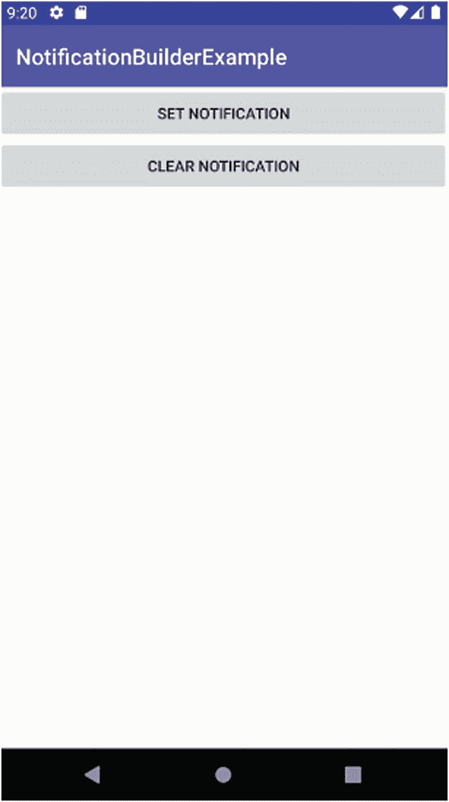
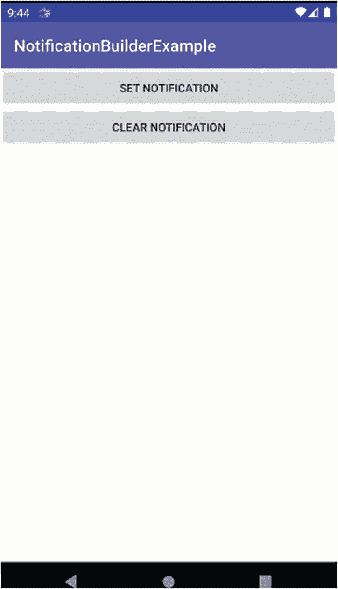
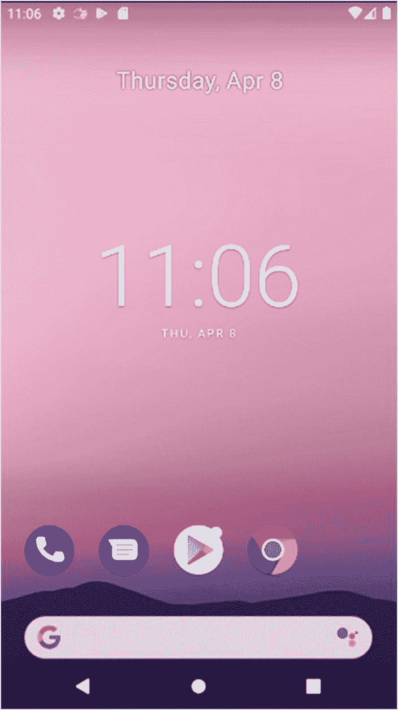
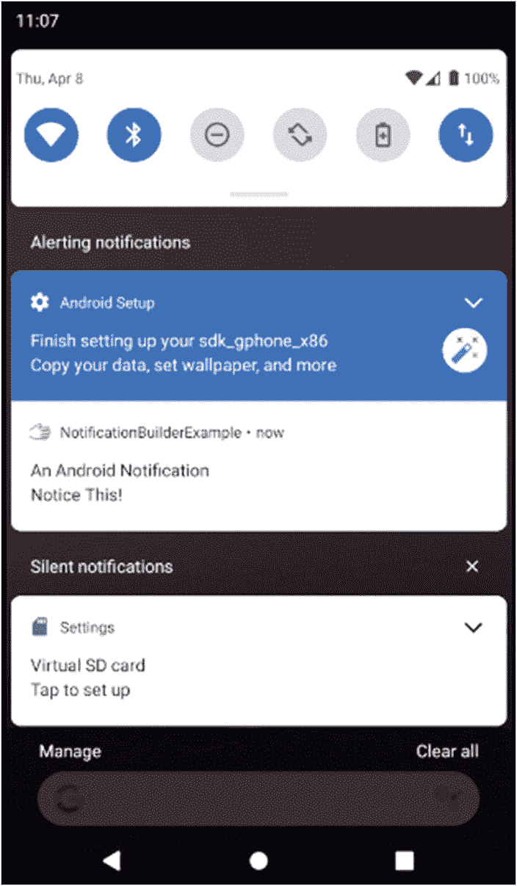
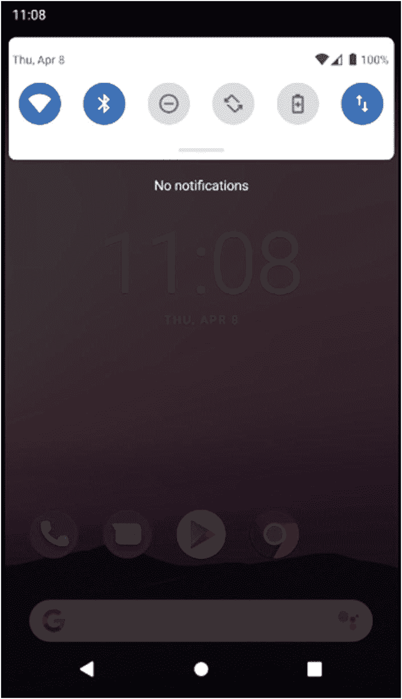

# 十五、通知简介

历史上几乎每个操作系统都发明了一种机制来提醒你有趣的、重要的或紧急的通知。从计算“赞”到低电量警告，通知几乎是每个设备体验中无处不在的一部分。Android 提供了一个当代的通知生态系统，并在其通知框架中进一步发展了一些非常有用的功能。

每个 Android 设备，从手机到平板电脑到车载娱乐系统，都拥有一系列通知机制，我们将在本章中探讨这些机制。如果你使用过 Android 设备，你会对屏幕顶部或锁定屏幕上出现的托盘图标很熟悉。您还会看到弹出对话框通知，这有其优点和缺点。

除了软件的通知功能，Android 还提供了各种硬件选项，可以在派对上帮助通知。无论是通过振动来增加新通知的动力，还是通过触觉反馈来确保用户获得即时的触觉反馈，Android 都通过一个全面的框架为您的通知需求提供了统一战线。

## 配置通知

在使用应用程序的正常过程中，它有很多方法来呈现新的或重要的信息，以抓住用户的注意力。有时会发生一些值得注意的事情，但用户已经离开了应用程序，或者它在后台或暂停。对于像没有 UI 的服务这样的应用程序，没有正常的面向用户的可见性，所以当试图被注意时，在那些情况下存在额外的障碍。

Android 通过其`NotificationManager`系统服务处理这些情况以及更多情况。通过将一个适当结构化的参数传递给一个`getSystemService()`方法调用，您就可以通过您的应用程序使用`NotificationManager`。这可以像下面的代码片段一样简单:

```java
getSystemService(NOTIFICATION_SERVICE)

```

对`getSystemService()`的调用将为您提供一个结果`NotificationManager`对象，然后您可以访问它提供的通知管理方法。你将使用的一些最常见的`NotificationManager`对象的方法有

1.  顾名思义，这是一种根据你认为值得用户注意的任何触发或情况来激活通知的方法。它将一个`Notification`对象作为参数，该参数在有效负载中携带您的通知的细节——文本、图像等等，以及您希望 Android 通知基础架构警告用户的方式。

2.  `cancel()`:使用此方法来消除通知。Android 还可以取消通知来响应某些用户动作，包括像“滑动以消除”这样的手势。

3.  `cancelAll()`:核选项！当您只想让 NotificationManager 对象激活的所有通知都运行时，调用`cancelAll()`。

### 使用通知对象自定义通知

在通知用户时，Android 中的默认通知行为能够完成你想要的大部分事情。但是有时候你想多走一步，真正地寻求用户的注意。对象拥有增强和定制通知的方法。

#### 了解增强通知的新旧方式

Android 的通知已经随着时间的推移而发展，比如有最初的(旧的)增强通知的方法，使用单独的附加方法来调整和放大您的工作，以及最近的方法，使用一个`NotificationBuilder`对象来一次性处理所有的定制。我将展示这两种方法，并指出，如果您的目标是版本 7 之前的旧版本 Android，旧方法更有可能满足您的需求。

#### 给通知添加声音

让我们从旧的/传统的方法开始我们的通知探索，特别是 Android 对许多不同类型的通知的声音支持。通过在基本 Android 级别利用一系列用户可配置的声音，如果您不想管理音频资源，您可以避免管理音频资源。您可以让您的`Notification`对象通过调用其`.defaults()`方法来利用设备的默认声音(无论是否由用户配置),如下所示:

```java
Notification myNotification = new Notification(...);
myNotification.defaults = Notification.DEFAULT_SOUND;

```

您可以采取额外的步骤，通过使用对音频资源的`Uri`引用来提供您自己的声音，无论它是您提供的原始或资产管理的文件，还是对 Android 附带的许多声音之一的引用。

下面显示了一个使用普通 Android“ka limba”声音的示例，通过 ContentResolver 类使用该资源的 Uri 并相应地分配声音:

```java
Notification myNotification = new Notificiation(...);
myNotification.sound = Uri.parse(ContentResolver.SCHEME_ANDROID_RESOURCE +
                                                     "://" +
                                                     getPackageName() +
                                                     "/raw/kalimba");

```

由于有多种触发通知的机制，因此了解优先级的等级很重要。使用`.sound()`分配的任何声音通知(或其他使用其相关方法的通知形式)将被使用`.defaults()`方法设置的任何等效通知覆盖，如果这样的调用包含通知类型的参数，如声音的标志`DEFAULTS_SOUND`。无论调用这些方法的顺序如何，都会发生这种情况。

在 Android 新的通知世界中，你可以通过建立一个`NotificationBuilder`对象来设置你想要使用的声音等属性，最后当你设置好所有想要的属性后，让`Notification`使用`NotificationBuilder`。使用新方法设置声音的等效工作如下所示:

```java
Notification.Builder myBuilder = new Notification.Builder(this, ...)
myBuilder.setSound(Uri.parse(ContentResolver.SCHEME_ANDROID_RESOURCE +
                                                     "://" +
                                                     getPackageName() +
                                                     "/raw/kalimba"));

```

#### 使用设备灯通知

很少有安卓手机或平板电脑缺少内置 LED 灯作为前置显示屏的一部分。这种光可以有很多用途，包括作为通知用户通知的另一个载体(而不仅仅是让我，你信任的作者，在凌晨 3 点保持清醒)。通过基于通知对象的配置进行配置，可以以多种方式控制 Android 设备的内置灯:

1.  那个。lights()方法在传递一个布尔值 TRUE 值时激活 LED。

2.  在支持的设备上，您可以通过 ledARGB 参数和您希望使用的基于 RGB 的颜色的匹配十六进制代码来更改 LED 的颜色。

3.  使用 ledOnMS 和 ledOffMS 值闪烁和循环灯光，以毫秒表示打开和关闭时间。

使用`Notification.Builder`的较新 Android 版本的等效方法是`.setLights()`方法。您可能开始猜测如何使用构建器方法从使用基本通知对象的旧方法中推断出新方法，反之亦然。

Note

通知。Android 8 引入了 Builder()方法，旧的通知样式已经过时。当 API 级别超过 24 时，应该总是使用通知。Builder()并让 Android 的兼容性库处理旧版本上的行为。

以及您希望使用的特定通知花体，确保设置`Notification.flags`字段以包含`Notification.FLASH_SHOW_LIGHTS`标志。在使用单色 LED 的基本设备上，您可能会发现您选择的颜色并不适用，相反，设备会改变 LED 的亮度。对于具有支持多色输出的 led 的设备，如果制造商没有为通知类提供必要的智能来控制颜色，也会出现这种情况。

还有一些设备没有用于通知的 LED，包括电视、Android 自动系统和 Android 的一些嵌入式应用。鉴于这种多样的设备状况，你应该考虑将闪烁 LED 通知作为一种额外的奖励，而不是一种吸引注意力的重要方法。

#### 摇晃它！

你的用户拥有比视觉和听觉更多的感官，你可以用它们来吸引他们的注意力。当闪烁的灯光和朗朗上口的声音还不够时，你可以(一语双关)转向振动。Android 的原始通知模型包括一个默认标志，允许使用设备范围的默认设置来改变事情:

```java
myNotification.defaults = Notifcation.DEFAULT_VIBRATE;

```

新的通知方法使用 Builder 对象上的`.setVibrate()`方法来达到同样的效果。

要让任何基于振动的通知实际触发物理振动，您需要在清单中拥有以下权限:

```java
<uses-permission android:name="android.permission.VIBRATE" />

```

当默认振动不够时，您可以通过`.vibrate()`和`.setVibrate()`方法执行自定义振动，提供一个以毫秒为单位的`long[]`值，例如:

```java
new long[] {1000, 500, 1000, 500, 1000}

```

是一个有效的序列，将触发三次一秒钟长的振动，每次振动之间有半秒钟的间隔。

### 添加通知图标

到目前为止，我们介绍的通知方法都是为了抓住用户的注意力。Android 还提供了使用图形的能力，以图标的形式，向用户提供关于通知的更多信息和上下文。

图标是图像文件，因此被认为是用于 Android 资源管理目的的可绘制图标。您需要提供一个`contentIntent`值，当用户实际点击您在通知中提供的图标时，该值作为`PendingIntent`传递。这个`PendingIntent`充当一个占位符和延时功能，允许一个意图被准备好，以便它可以在以后被一个活动或另一种技术触发。

Understanding Pendingintent

挂起内容是 Android 使用的一种机制，用于提前向设备上运行的另一个应用程序或服务传递令牌或权限。有了 PendingIntent，接收应用程序就可以在将来的某个时候运行从您的应用程序中选择的一段代码(无论您的应用程序本身是否正在运行),并使用您的应用程序的权限来这样做。

除了能够添加您选择的图标和相关的`contentIntent`，您还可以添加带有`tickerText`属性的简短文本描述。此文本应该用于您希望用户看到的通知文本的最重要部分，如发送消息的联系人姓名、电子邮件的主题、社交媒体帖子的标题等。`setLatestEventInfo()`方法允许您在一次调用中指定全部三个`icon`、`contentIntent`和`tickerText`。

无论您使用的是旧的还是新的通知模型，这种`PendingIntent`方法都适用。

#### 不同 Android 版本的图标大小

添加图标可以让你把图标调整到你想要的艺术水平，但是对于不同版本的 Android 你需要记住一些注意事项，因为这些会影响所支持的图标图像的分辨率。

为了最大化您可以支持的 Android 设备范围及其相关的通知样式和大小，您应该创建至少四个代表您的图标的 drawables:

1.  一个 12 像素乘 19 像素的边界框，包含一个 12 像素的正方形图标，用于低密度屏幕。这个图标将被放置在 res/drawable-ldpi-v9 项目文件夹中。

2.  一个 16 像素乘 25 像素的边界框，包含一个 16 像素的正方形图标，用于中等密度的屏幕。这个图标将被放置在 res/drawable-mdpi 文件夹中。

3.  一个 24 像素乘 38 像素的边界框，包含一个 24 像素的正方形图标，用于高密度、超高密度和超高密度屏幕。该图标将放置在 res/drawable-hdpi-v9、res/drawable-xhdpi-v9 和 res/drawable-xxhdpi-v9 文件夹中。

4.  对于 2.3 之前的所有 Android 版本，这是一个 25 像素的正方形(不考虑这些旧设备上的实际屏幕密度)。这将被放置在 res/drawable 资源文件夹中。

这些变化会随着时间的推移而改变，正如 Android 支持不同分辨率的建议方法一样，所以请务必在 Android 开发者网站上查看图标样式的详细信息。该网站包括一些有用的信息，关于放大和缩小你决定不会或不能为你的应用提供任何预期的保真度水平的可绘制图形。如果你跳过了这些图标中的一个，不要惊慌，但是要注意，Android 会尝试缩放你的另一个图标来填补空白，并且最终的屏幕图像可能不会很棒。

#### 添加信息的浮点数

通知还有最后一个变化，你可能已经看到了，也可能依赖于它。这是应用程序启动器图标上的“数字”,它提供了给定应用程序的类似通知或未读/未回复通知的数量。

浮点数调整是通过使用`Notification`对象的一个名为`number`的公共数据成员来实现的，您可以将它设置为您希望的任意数字。它将在图标的右上角或左上角显示为应用程序启动器图标的覆盖图(取决于设备上的区域设置和从右到左或从左到右的约定)。默认情况下，这个值是不设置的，并且被 Android 忽略，除非你为 number 设置一个值。

### 在 API 级别 26 中引入通知通道

随着 API 26 的出现，Android 抛弃了所有应用和服务的公共通知空间的概念，引入了通道的概念。通道的目标是允许用户(以及隐含的应用程序)将通知分组并划分到不同的组中，然后以不同的方式对待这些组。

这方面的一个经典用例是让一些通知被认为是信息性的，在“正常”时间显示，但在用户指定一个勿扰时段时隐藏。其他通知可以分配给“紧急关注”或“紧急情况”的频道，并以不同的方式处理。

随着谷歌不断调整和改变通知格局，渠道概念在现实生活中的应用并不全面。然而，作为一名开发人员，如果您在 Android、10.0、11.0 或更高版本的新设备上使用任何形式的通知，您需要考虑这一点。

本章后面的`NotificationBuilderExample`展示了在新旧 API 级别支持的新旧 Android 设备上定义和使用通道并处理行为是多么简单。

## 实际通知

现在，您已经介绍了 Android 许多版本所依赖的最初的、仍然有用的通知概念。让我们来看看在`NotificationBuilderExample`应用程序中使用的通知，您可以在`ch15/NotificationBuilderExample`项目文件夹中找到它。

我使用了简单的布局，所以为了节省空间，这里省略了它的 XML。可以看到图 [15-1](#Fig1) 中的 UI。



图 15-1

基本的 NotificationBuilderExample 布局，不显示任何通知

### 创建通知的支持逻辑

`NotificationBuilderExample`的核心是在与 UI 交互时给用户带来通知的代码，如清单 [15-1](#PC8) 所示。

```java
package org.beginningandroid.notificationbuilderexample;

import androidx.appcompat.app.AppCompatActivity;
import androidx.core.app.NotificationCompat;

import android.app.Notification;
import android.app.NotificationChannel;
import android.app.NotificationManager;
import android.app.PendingIntent;
import android.content.Intent;
import android.os.Build;
import android.os.Bundle;
import android.view.View;

public class MainActivity extends AppCompatActivity {
    private static final int NOTIFICATION_ID=12345;
    private static final String MYCHANNEL = "";
    private int notifyCount = 0;
    private NotificationManager myNotifyMgr = null;

    @Override
    protected void onCreate(Bundle savedInstanceState) {
        super.onCreate(savedInstanceState);
        setContentView(R.layout.activity_main);
        myNotifyMgr = (NotificationManager)getSystemService(NOTIFICATION_SERVICE);
        if (Build.VERSION.SDK_INT>=Build.VERSION_CODES.O &&
                myNotifyMgr.getNotificationChannel(MYCHANNEL)==null)
                    { myNotifyMgr.createNotificationChannel(new NotificationChannel(MYCHANNEL,
                            "My Channel", NotificationManager.IMPORTANCE_DEFAULT));
                    }
    }

    public void onClick(View view) {
        switch(view.getId()) {
            case R.id.notify:
                raiseNotification(view);
                break;
            case R.id.clearNotify:
                dismissNotification(view);
                break;
        }
    }

    public void raiseNotification(View view) {
        Intent myIntent = new Intent(this, NotificationFollowon.class);
        PendingIntent myPendingIntent = PendingIntent.getActivity(MainActivity.this, 1, myIntent, 0);

        NotificationCompat.Builder myNotifyBuilder = new NotificationCompat.Builder(MainActivity.this, MYCHANNEL);

        myNotifyBuilder.setAutoCancel(false);
        myNotifyBuilder.setTicker("Here is your ticker text");
        myNotifyBuilder.setContentTitle("An Android Notification");
        myNotifyBuilder.setContentText("Notice This!");
        myNotifyBuilder.setSmallIcon(R.drawable.wavinghand);
        myNotifyBuilder.setContentIntent(myPendingIntent);
        myNotifyBuilder.build();

        Notification myNotification = myNotifyBuilder.getNotification();
        myNotifyMgr.notify(NOTIFICATION_ID, myNotification);
    }

    public void dismissNotification(View view) {
        myNotifyMgr.cancel(NOTIFICATION_ID);
    }

}

Listing 15-1Implementing the code for NotificationBuilderExample

```

虽然这里有相当数量的代码，并且在配套的`NotificationFollowon`类中，其中的大部分您应该已经很熟悉了。在`onCreate()`中设置活动执行恢复或创建状态和扩展布局的常规任务，另外还要创建绑定到系统通知基础设施的`myNotifyMgr`对象。`NotificationBuilderExample`类本身也为通知设置了一个虚构的 ID 和一个计数器来跟踪有多少未决通知。请注意，您可以很容易地决定让您的应用程序发出多种不同类型的通知。如果您决定这样做，请确保使用不同的 ID 来区分每种类型。

`onCreate()`中的另一个主要逻辑执行必要的 SDK (API)级别检查，以查看是否有必要使用通知通道来向用户显示所需的通知。如果 SDK 版本处于或高于通道被授权的级别，我们检查`MYCHANNEL`是否存在(`null`比较)，如果它还不存在，我们实例化它以备使用。如果它确实存在，就不需要额外的工作——例如，如果我们已经使用了该应用程序，并在触发通知至少一次后让它继续运行。

`onClick()`方法是我用来将按钮点击处理分组在一起的熟悉模式——尽管在这个例子中，你可以很容易地让每个按钮直接调用相关的`raiseNotification()`和`dismissNotification()`方法。正是这些方法的实现包含了我们感兴趣的通知逻辑。

在`raiseNotification()`方法中，我们执行本章开始时描述的几乎所有可选配置和定制。首先，我们创建一个指向`NotificationFollowon`活动的`PendingIntent`。如果用户决定点击通知抽屉中的挥动的手图标，这将被触发。

接下来，创建`Notification`(或者在本例中是`NotificationCompat` ) `Builder`对象，我们将从这个构建器实例生成的任何结果通知分配给在`onCreate()`方法中设置的`MYCHANNEL`通道。

然后我们开始使用`myNotifyBuilder`对象，为我们将构建的最终`Notification`对象添加许多通知功能:

1.  。调用 setTicker()来提供一些 Ticker 文本。

2.  。调用 setNumber()来增加引发通知的次数。

3.  。调用 setSound()并从 raw 文件夹中获取 pop.mp3 声音作为资源。

4.  。调用 setVibrate()时，节奏为振动开启 1 秒，关闭半秒。

5.  。调用 setAutoCancel()来禁用自动取消选项。

配置好所有选项后，我最终将构建的当前状态传递给`myNotification`对象，然后将`Notification`和`NOTIFICATION_ID`传递给`NotificationManager`以呈现给用户。

## 从用户的角度查看通知

在虚拟设备上运行`NotificationBuilderExample`应用程序提供了大部分通知体验(振动往往是 avd 处理不好的一件事)。图 [15-2](#Fig2) 显示了出现在主屏幕图标栏中的通知。



图 15-2

左上角触发的通知——挥动的小手图标

如果你仔细看，你会在屏幕顶部看到一个小的挥手图标。如果在打印(或屏幕)页面上很难看到，请确保自己尝试运行该示例，以在自己的虚拟设备上看到它。根据 AVD 支持的 API 级别，您可能会看到也可能看不到与通知对象相关联的附加状态文本。

单击 Clear Notification 按钮会使图标消失，如果您在 pop 声音仍在播放或真实设备仍在振动时足够快地单击它，这些额外的自定义也会停止。

通知贯穿于`NotificationBuilderExample`活动的整个生命周期，甚至在您将它发送到后台以便使用其他应用程序或返回到启动程序主屏幕之后。自己尝试一下，你应该还能看到如图 [15-3](#Fig3) 所示的通知图标。



图 15-3

通知图标即使在离开活动后仍然存在

一旦发出通知，在此后的任何时间点，用户都可以访问通知抽屉，该抽屉从设备上的所有应用程序收集所有通知(如果使用足够新的 API 级别和兼容的设备，还可能通过通道对它们进行分组)。在 Android 中，你可以通过“抓住”屏幕顶部的栏并一直拖到底部来打开通知抽屉。在图 [15-4](#Fig4) 中，您可以看到我添加了附加细节的示例通知，包括通知标题和附加文本。



图 15-4

通知抽屉打开，显示我们的通知

您在通知抽屉中看到的内容直接取决于正在使用的 Android 的版本。上图中的示例来自 Android 10.0 AVD 实例，我们的图标是从适当的屏幕密度资源中选择的，或者是从与应用程序打包在一起的最近的可用资源中缩放的。我们 25×25 像素的挥动的手在通知抽屉中更容易辨认。显示了标题和附加文本，以及在创建时传递给`Notification`对象的时间戳。

你还会注意到在较新的 Android 版本的通知抽屉中显示的数字值，而不是图标栏中图标的覆盖图。谷歌对 Android 进行了这一改变，以处理开始蔓延到较小手机屏幕上的图标显示的混乱。通过将号码转移到通知抽屉，人们的启动屏幕变得不那么拥挤了。

用户可以单击图标来触发后续活动，或者简单地取消通知，就像他们在活动主页上单击清除通知按钮一样。在 Android 的最新版本中，你会在通知下方看到三个稍微偏移的水平条，它们是“全部忽略”选项。甚至新版本的 Android 也会在通知抽屉底部显示“全部清除”和“管理”选项。在我们的示例中，无论您选择哪种清除技术，都将在所有活动的 NotificationManager 对象上触发`cancelAll()`方法，从而完全清除流程中的通知抽屉。

一个完全清晰的通知抽屉看起来如图 [15-5](#Fig5) 所示。



图 15-5

从设备中清除的所有通知

请注意，以这种方式清除通知不一定会清除您可能在应用程序中跟踪的通知计数。请记住，即使你已经脱离了应用程序，Android 也不一定会触发`onDestroy()`或从应用程序中获取资源。

## 摘要

你现在已经有了 Android 通知系统的坚实基础和使用通知的经验。还有更多扩展通知及其用途的高级主题，您可以在本书的网站 [`www.beginningandroid.org`](http://www.beginningandroid.org) 上找到。这些高级通知主题包括时间线通知、相关通知组或集合的捆绑通知、可扩展通知以及针对 Wear OS 和 Android 嵌入式应用(如 Android Auto)的专用通知类型。