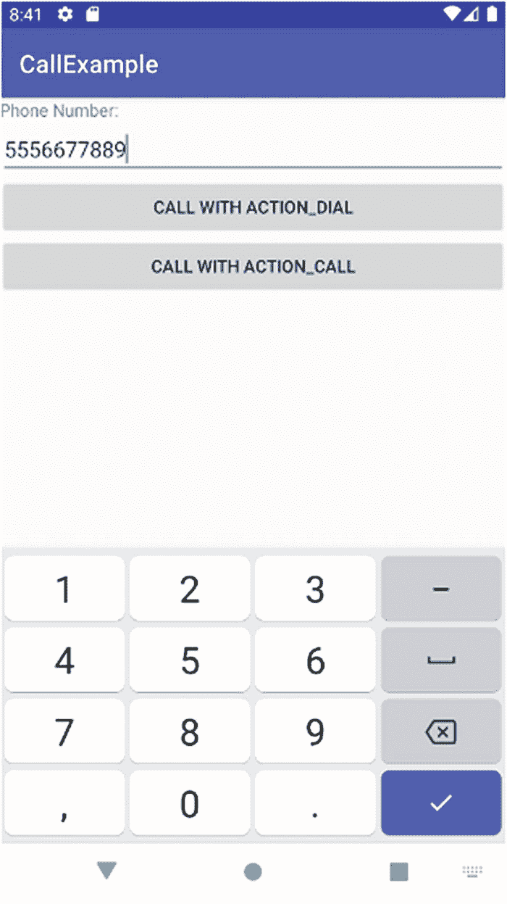
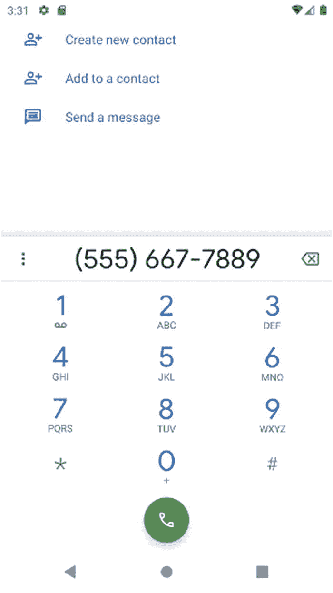

# 十六、通过呼叫探索设备功能

我们已经在本书中介绍了所有的想法，并且在后面的章节中还会介绍，因此很容易一头扎进各种只处理 Android 提供的强大软件平台的应用程序开发中。事实上，这太容易了，以至于你经常忽略了作为一个 Android 开发者的另一个巨大的机会:也使用 Android 硬件。

在本章中，我们将简要介绍如何开始使用设备功能，特别是通话和传感器。这将是非常简短的，但应该给你一个开始，继续学习更多关于硬件能力的独立知识。

## 发号施令

Android 已经从早期的全手机时代走了很长一段路。正如我在第 [1](01.html) 章中概述的那样，随着现在使用 Android 的设备和外形的爆炸式增长，提前思考您的应用程序如何以及为什么可能想要添加电话支持，以及它如何适应“没有电话”的环境和设备是值得的

### 指定电话支持

要向 Android 标记您的应用需要访问与电话相关的硬件特性，您应该将以下硬件要求条目添加到您的`AndroidManifest.xml`文件中:

```java
<uses-feature android:name="android.hardware.telephony" android:required="true" />

```

android.hardware.telephony 功能表明您的应用程序需要蜂窝接入和支持，并意味着用户可以提前了解该应用程序是否适合他们的设备，例如在 Google Play 上搜索或下载应用程序时。

### 使电话支持成为可选的

如果你觉得把整个应用挂在是否允许蜂窝接入上有点极端，那你就对了。如果您正在考虑构建一个应用程序，其中电话接入是额外的好处，但不是硬性要求，那么您可以利用技术在应用程序运行时检查应用程序逻辑中的电话支持，并处理拥有和不拥有蜂窝硬件接入的情况。

Android 使用`PackageManager`类来帮助检测各种硬件，从加速度计和麦克风一直到手机硬件的功能。最常见的方法是使用`hasSystemFeature()`方法，如清单 [16-1](#PC2) 中的伪代码片段所示。

```java
PackageManager myDevice = getPackageManager();
if (myDevice.hasSystemFeature(PackageManager.FEATURE_TELEPHONY) {
    // the user's device has telephony support
    // add your call-related logic here
} else {
    // the user's device lacks telephony support
    // do something that doesn't require making calls
};

Listing 16-1A code fragment showing detection of cellular hardware access

```

您还可以检查电话支持的其他有用方面，如网络类型和语音实现，例如 VoLTE、LTE、GSM、CDMA 等。

## 打电话

现在您已经有了确定设备调用支持的需求或可取性的机制，您可以开始在您的应用程序中利用这一点。令人欣慰的是，Android 让这一点变得非常简单，这要归功于其作为智能手机操作系统的根基——重点是在手机上。

Android 让通话和电话的其他方面变得容易访问和使用的非常有用的方法集中在`TelephonyManager`类上。顾名思义，TelephonyManager 负责一系列呼叫管理和相关任务，包括呼叫处理、呼叫状态、网络细节等。您通常会发现自己在使用这些方法:

1.  `getPhoneType()`:返回电话和网络的详细信息，包括对 GSM、LTE 等的无线电支持。

2.  `getNetworkType()`:该方法提供了当前连接的蜂窝网络的数据能力的详细信息。这有助于理解网络类别，如 LTE、4G、3G 和其他变体。

3.  `getCallState()`:这是一种非常方便的方法，可以帮助您确定手机是否空闲(未在通话中)、处于通话设置模式还是正在通话中——即所谓的“摘机”或“摘机”

要真正拨打一个号码并开始通话，您可以调用`ACTION_DIAL`或`ACTION_CALL`意图之一。这些方法的使用和区别将很快被介绍。这两种方法都有一个共同的出发点，那就是将代表用户希望呼叫的号码的`Uri`作为格式为`tel:` `nnnnnnnn`的字符串。在 Uri 字符串中，`nnnnnnnn`代表要呼叫的电话号码的数字。观看实际操作过程将有助于清楚地了解拨打电话的步骤。

Caution

在发起任何新的呼叫之前，检查当前的呼叫状态是一个很好的做法。Android 有一系列选项可以同时处理多个来电和去电，但这个话题完全属于高级蜂窝争论的范畴，超出了本书的范围。现在，好好利用`getCallState()`方法，把你的行动建立在它带来的结果上。

### 布局 CallExample 应用程序

打电话应用程序的工作示例可以在`Ch16/CallExample`项目中找到。这个项目使用一个非常简单的布局，让您可以专注于它所公开的呼叫和拨号选项。首先，您可以看到清单 [16-2](#PC3) 中使用的布局。

```java
<?xml version="1.0" encoding="utf-8"?>
<LinearLayout xmlns:android="http://schemas.android.com/apk/res/android"
    xmlns:tools="http://schemas.android.com/tools"
    android:layout_width="match_parent"
    android:layout_height="match_parent"
    android:orientation="vertical"
    tools:context=".MainActivity" >

    <TextView
        android:layout_width="wrap_content"
        android:layout_height="wrap_content"
        android:text="Phone Number:" />

    <EditText
        android:id="@+id/phonenumber"
        android:layout_width="match_parent"
        android:layout_height="wrap_content"
        android:inputType="number" />

    <Button
        android:id="@+id/usedialintent"
        android:layout_width="match_parent"
        android:layout_height="wrap_content"
        android:text="Call with ACTION_DIAL"
        android:onClick="callWithActionDialIntent" />

    <Button
        android:id="@+id/usecallintent"
        android:layout_width="match_parent"
        android:layout_height="wrap_content"
        android:text="Call with ACTION_CALL"
        android:onClick="callWithActionCallIntent" />
</LinearLayout>

Listing 16-2The layout of the CallExample application

```

查看布局中指定的字段，您会看到一个`TextView`和`EditText`的组合，它充当用户指定他们希望呼叫的号码的输入字段。然后有两个按钮，`"Call with ACTION DIAL"`和`"Call with ACTION_CALL`，你可以猜到，这两个按钮触发各自的方法来激发每种类型的意图，从而打电话。

你可以在图 [16-1](#Fig1) 中看到最终的渲染布局。



图 16-1

用于拨打用户指定号码的 CallExample 布局

除了展示呼叫功能所需的部分之外，我特意选择了一些新功能包含在此布局中——让我们先把这些功能去掉。为了有一点变化，我将这个布局基于一个`LinearLayout`。您将看到 id 为`phonenumber`的`EditText`视图具有属性`inputType="number"`。这将触发 Android 修改该视图的输入法参数，以便只为数字和一些有限的标点符号提供输入。您可以在运行应用程序时看到这种效果，因为为输入显示的虚拟键盘(或输入法编辑器(IME))看起来像电话拨号盘，而不是完整的键盘。

The Android Input Method Framework

Android 提供了一个非常强大的抽象层来处理用户输入，以便它可以灵活地与物理键盘、屏幕上出现的软键盘甚至手写识别硬件和软件一起工作。这是输入法框架。

每当您使用一个触发用户输入的视图时，您通过被呈现一个默认的编辑器视图——IME——来隐式地使用框架。您可以使用默认设置，并像我们在电话拨号示例中所做的那样进行配置，也可以用于其他常见情况，如日期输入。您还可以自定义任何 IME 来添加或限制编辑器中显示的供用户“按”的“键”或值。你可以在这本书的网站上，在 [`www.beginningandroid.org`](http://www.beginningandroid.org) 阅读更多关于输入法框架和 ime 的内容。

`usedialintent`和`usecallintent`按钮具有这些 id，当每个按钮被点击时，它们会给出一个强烈的提示。使用第一个按钮`"Call with ACTION_DIAL"`将遵循触发`ACTION_DIAL`意图的代码路径，并且`"Call with ACTION_CALL"`将类似地触发`ACTION_CALL`意图。我们将在第 [17](17.html) 章更详细地讨论意图，但是现在，这两者之间有什么区别呢？

带着一个`ACTION_DIAL`意图，Android 被通知它需要向用户显示一个 IME，以在幕后启动电话魔法之前确认(或调整)要呼叫的号码。在本章后面的图 [16-2](#Fig2) 中可以看到这一点。在另一种情况下，触发`ACTION_CALL`意图会立即使用 Uri 中提供的号码发起呼叫，而无需任何进一步的用户界面或确认。



图 16-2

调用示例应用程序触发 ACTION_DIAL

这两种不同的方法有许多原因，但主要原因是确保用户知道呼叫即将开始，并通过`ACTION_DIAL`为他们提供对过程的控制。当你考虑到这是 Android 的内置部分之一，可能会花费用户真正的金钱时，这是非常重要的。在某些地方打电话很便宜，但在许多国家和地区，打电话仍然是一笔不小的开销。

因为`ACTION_CALL`在没有`ACTION_DIAL`提供的确认步骤的情况下立即进行呼叫，Android 为`ACTION_CALL`提供了一种保护措施，要求在应用程序中使用它必须在其清单中有`CALL_PHONE`的许可，然后带有`ACTION_CALL`意图的`startActivity()`呼叫才会起作用。还要注意，CALL_PHONE 权限被认为是最高级别的权限，因为有可能被滥用，因此，不仅您必须在应用程序清单中拥有此权限，而且在运行时，您的用户还会被提示允许应用程序进行呼叫。可以说是纵深防御。

### CallExample 应用程序的工作逻辑

了解了通话选项并准备好向用户展示简单的布局后，是时候看看让通话变得生动的逻辑了。清单 [16-3](#PC4) 展示了为我们的`CallExample`应用程序插入逻辑的 Java 代码。

```java
package org.beginningandroid.callexample;

import androidx.appcompat.app.AppCompatActivity;

import android.content.Intent;
import android.net.Uri;
import android.os.Bundle;
import android.view.View;
import android.widget.EditText;

public class MainActivity extends AppCompatActivity {

    @Override
    protected void onCreate(Bundle savedInstanceState) {
        super.onCreate(savedInstanceState);
        setContentView(R.layout.activity_main);
    }

    public void callWithActionDialIntent(View view) {
        EditText targetNumber=(EditText)findViewById(R.id.phonenumber);
        String dialThisNumber="tel:"+targetNumber.getText().toString();
        startActivity(new Intent(Intent.ACTION_DIAL, Uri.parse(dialThisNumber)));
    }

    public void callWithActionCallIntent(View view) {
        EditText targetNumber=(EditText)findViewById(R.id.phonenumber);
        String callThisNumber="tel:"+targetNumber.getText().toString();
        //the following intent only works with CALL_PHONE permission in place
        startActivity(new Intent(Intent.ACTION_CALL, Uri.parse(callThisNumber)));
    }

}

Listing 16-3Java logic for the CallExample application

```

我通常使用一个`onClick()`方法来指导随后的执行，在这个例子中，我们使用一个 switch 语句作为参数，在这个例子中，我们分别从每个按钮的布局配置中直接调用方法`callWithActionDialIntent()`和`callWithActionCallIntent()`。

每种方法都做一些类似的处理，首先确定用户在哪个`View`(在我们的例子中是`EditText`)中输入了想要的电话号码。然后用适当的格式创建`Uri`字符串，然后调用`startActivity()`，用期望的意图和`Uri`作为参数。

### 拨打操作拨号电话

在图 [16-2](#Fig2) 中，可以看到用户点击`useDialIntent`按钮的结果。来自`EditText`字段的数字(如果有的话)已经在我们的`callWithActionDialIntent()`中被构造成一个幕后的`Uri`，并且`ACTION_DIAL`意图已经被触发。

你在图 [16-2](#Fig2) 中看到的拨号器看起来与图 [16-1](#Fig1) 中显示的 IME 很接近，但不完全一样。您应该注意到的主要区别不仅包括号码样式、配色方案等的细微差别，还包括添加选项，例如将该号码添加为联系人的能力。你可能已经猜到这是通过激发另一个意图来实现的。

您还会看到数字和任何相关标点符号(如连字符和括号)的格式差异。这些都将根据设备的位置和语言设置进行样式化。用于图 [16-2](#Fig2) 所示视图的我的 AVD 使用美国地区和英语作为语言，因此你看到的格式的前三个数字被视为区号并放在括号中，数字的连字符是美国和加拿大惯用的。

最后，也是最重要的，是显示屏底部的绿色电话软键，你可以猜测它实际上是用来触发呼叫的。

### 拨打行动电话

只要按下【开始】按钮，你就能看到——嗯，它也能看到 Android 的拨号屏幕，其他什么都没有。上例中的拨号器未被触发，因此几乎没有其他内容可以显示或解释。你的用户会直接进入“实际打电话”拨号画面，如图 [16-3](#Fig3) 所示。


图 16-3

使用 ACTION_CALL 在行动中呼叫

## 处理来电

处理来电比接听电话要复杂得多，超出了本书的范围。但是，并不总是需要对来电承担全部责任，当接到电话时，您可以让您的应用程序做其他有用的事情，即使您的应用程序不是处理管理对话的主要任务的应用程序。

让辅助应用程序响应传入呼叫的主要方法是在 AndroidManifest.xml 文件中为广播目的注册一个广播接收器。我们将在下一章更深入地探讨广播接收机。现在，知道`ACTION_PHONE_STATE_CHANGED`意图是由`TelephonyManager`框架在收到调用时触发的就足够了。清单 [16-4](#PC5) 展示了清单文件中的接收者声明。

```java
<receiver android:name="MyPhoneStateChangedReceiver">
    <intent-filter>
        <action
            android:name="android.intent.action.PHONE_STATE"  />
    </intent-filter>
</receiver>

Listing 16-4Setting the receiver for incoming calls in AndroidManifest.xml

```

当对设备进行调用时，`TelephonyManager`触发 intent，任何接收者——包括您的接收者——通过使用对指定的相应方法的回调得到通知。`ACTION_PHONE_STATE_CHANGED` intent 还可以包括两个可选的数据片段，您可以使用它们来驱动您的逻辑。一个是呼叫的状态值，如`CALL_STATE_OFFHOOK`或`CALL_STATE_RINGING`，表示呼叫已被应答或仍在触发等待应答的振铃器。如果使用了`CALL_STATE_RINGING`值，还有一个可选的附加值`EXTRA_INCOMING_NUMBER`，它提供主叫方 ID(如果网络已经提供的话)。

清单 [16-5](#PC6) 是`MyPhoneStateChangedReceiver`类的一个示例 Java 方法，它可以让你知道什么时候可以进行回调。

```java
public class MyPhoneStateChangedReceiver extends BroadcastReceiver {
    @override
    public void onReceive(Context context, Intent intent) {
        String deviceCallState = intent.getStringExtra(TelephonyManager.EXTRA_STATE);
        if (deviceCallState.equals(TelephonyManager.EXTRA_STATE_RINGING) {
            // The phone is still ringing and might have the caller ID
            String callerID =
              intent.getStringExtra(TelephonyManager.EXTRA_INCOMING_NUMBER);
            // Try to display the number, etc.
        } else {
            // do something else
        }
    }
}

Listing 16-5A Java method fragment for working with an incoming call

```

与其他硬件功能一样，处理来电被视为敏感任务，需要明确的安全权限。您的应用程序将需要清单文件中的`READ_PHONE_STATE`权限，以便接收`ACTION_PHONE_STATE_CHANGED`意图。