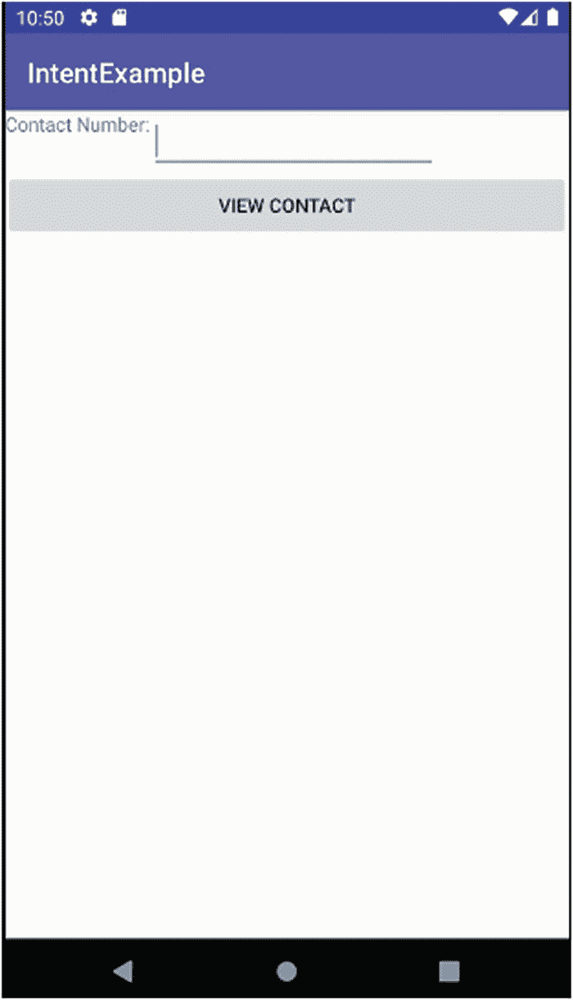
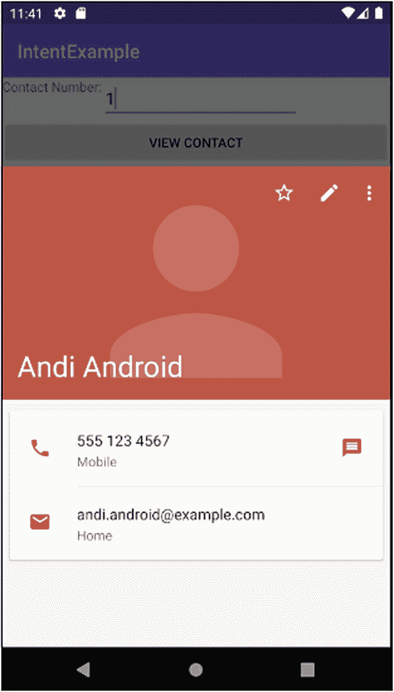

# 十七、理解意图、事件和接收者

当你深入到本书的后半部分时，你已经接触到了许多设计和构建活动的技术。您已经牢牢掌握了活动生命周期，以及在活动开始、等待、暂停和最终结束的各个时间点触发的回调。到目前为止，大多数示例应用都只包含一个活动。这与我在本书开始时所做的评论——创建、使用和处理活动的成本很低，并且您应该多产地使用它们——有什么关系呢？

很高兴你问了！我们希望确保您可以轻松使用和部署多项活动。虽然早期的视频播放器、电话拨号器等示例都是很好的例子，但是这些示例应用都是在应用启动时启动其单个活动的，方法是在 AndroidManifest.xml 文件中指定 activity，并在名为<intent-filter>的子元素中指定几个有趣的属性。这提供了一点线索，说明一个以上的活动可能会发生什么，但是我们在哪里以及如何指定第二个和后续的活动，以及如果不是在应用启动时，我们如何在需要时启动它们？现在让我们来解开这些谜团。</intent-filter>

## 介绍 Android 意图

关于在应用中使用多个活动的谜题的答案在于 Android 的基于事件或基于消息的系统，即所谓的“意图”。正如许多其他操作系统一样，如 Linux、Windows 和 macOS，它们基于发送和响应事件，Android 使用许多类似的概念，其意图包括触发和响应需要向应用呈现不同活动的操作。这在 Android 中有一些细微的差别，所以请继续阅读！

最简单的形式是，意图是从 Android 上的应用或服务发送的消息，表明该应用或服务的用户想要做些什么。那个“某物”可能是一个非常众所周知的动作，比如根据用户的动作准确地知道向用户显示哪个活动。但是 Android 也提供了从基础平台和其他应用中使用其他活动的可能性，从你自己的应用中。在这种情况下，如果有多种方式来满足用户的意图，您可能无法控制其他可用的活动，也无法控制设备用户可能更喜欢哪些活动。Android 通过使用消息系统的匹配部分(称为接收者)涵盖了已知和未知选项。

接收者的工作——不管是你写的还是其他应用的——是倾听意图，如果接收者有能力处理这种被请求的意图，就以各种方式做出回应。在本章的后面，在我们介绍了意图的机制之后，我们会谈到接受者。意图和接受者共同构成了触发连续活动的中心机制，并将应用中想要的所有活动连接在一起，以创建最终的体验。另外，这种相同的机制允许您利用其他应用的活动，只要这对您的应用有意义。

### 理解意图行为

剖析 Android 意图的两个基本部分是用户或应用所期望的动作和触发该期望动作的上下文。当我们谈论期望的行动时，我们指的是一些简单的概念，如“查看这个东西”、“制作一个新的”，等等。我们将很快涵盖更详尽的行动清单。就上下文而言，它可以更多样，最好被认为是一系列有助于理解意图的支持数据，以及任何细微差别或特殊情况，因此它可以得到适当的指导，并为最终的活动服务。

这种支持数据的概念采用了`Uri`的形式，比如`content://contacts/people/4`，这是 Android 联系人存储中第四组联系人详细信息的`Uri`符号。如果你把那个`Uri`和一个类似`ACTION_VIEW`的动作搭配起来，你就拥有了意图的所有基本要素。Android 解释了这一意图，并将找到一个能够向用户显示(或向视图提供)一组联系信息的活动。相反，如果你在指向一个集合的`Uri`上做类似于`ACTION_PICK`的动作——`content://contacts/people`——Android 将寻找任何可以呈现多个联系人的活动，并提供从中进行选择的能力。

虽然与动作捆绑在一起的`Uri`是意图的最简单形式，但这并不是可以包含的内容的限制。你可以在你形成的任何意图中包括四个额外的方面，以扩展意图有效载荷，并帮助改善 Android 和应用可以利用意图及其数据有效载荷做什么。这些都是意图对象的一部分:

*   意图类别:意图的类别有助于定义什么活动可以满足其基本动作。举个例子，你希望你的用户开始与你的应用交互的“主要”活动将属于类别`LAUNCHER`。通过这种方式，你向 Android 发出信号，该活动适合包含在启动器菜单(你的 Android 主屏幕)中。其他活动/意图类别包括`DEFAULT`和`ALTERNATIVE`。

*   MIME 类型规范:有时不可能知道或定义一个特定的 Uri 用于一组项目，比如联系人或照片。为了帮助 Android 找到一个合适的活动来处理这些情况下的数据集，您可以指定一个 MIME 类型，例如，image-jpeg 用于图像文件，以帮助处理照片集。

*   组件提名:Android 的优势之一是能够在运行时利用您在构建应用时不知道的活动。但是在其他时候，您确切地知道您想要调用哪个活动。一种方法是在意图的(期望的)组件中指定活动的类。通过这种方式，您不需要添加其他上下文提示来希望触发正确的意图，代价是承担关于组件类实现的假定知识的风险。这违背了被称为封装的面向对象编程的原则。

*   额外内容:有时你有其他上下文线索和数据，出于各种原因，你想让接收者知道。当这不完全符合一个命名方案时，临时演员会来帮忙。这是一个简单的 Bundle 对象，可以包含您想要的任何内容。一个警告是，提供这样一个包并不能保证接收者会使用它。

#### 适合各种场合的有意行动

你可以在 [`https://developer.android.com/reference/android/content/Intent#constants_1`](https://developer.android.com/reference/android/content/Intent%2523constants_1) 找到 Android 文档提供的意图动作和类别的完整列表，所以我不会在这里重复。相反，让我们看看最常见和最有趣的动作，为本章和本书其余部分即将出现的例子提供信息:

1.  ACTION_AIRPLANE_MODE_CHANGED:设备的用户已经将飞行模式设置从开切换到关，反之亦然。

2.  ACTION_CAMERA_BUTTON:点击了相机按钮(硬按钮或软按钮)。

3.  ACTION_DATE_CHANGED:日期已经更改，这意味着您编写的任何使用计时器、运行时间等的应用逻辑都可能受到影响。

4.  ACTION_HEADSET_PLUG:设备的用户已经将耳机连接到耳机插座或从耳机插座移除耳机。

如您所见，意图动作涵盖了应用和整个设备环境中发生的各种事情。

注意:Google 会在 Android 的每个新版本中添加新的动作。它还反对(后来删除)一些它认为不再有用的旧操作。随着时间的推移，在维护应用时，您应该检查应用所依赖的操作是否已被否决或移除。

### 了解意图路由

您可能认为，本章前面提到的组件命名通常是调用您想要的任何和所有活动的好方法，无论是您自己编写的活动还是其他活动。现实有点不一样。

如果你有一个自己编写的活动类，并且理解它是如何以及为什么是意图的最佳接受者，那么这样做是完全可以的。但是当处理来自其他应用的活动时，它是不可靠的，有时是不安全的，并且会导致不良的、意想不到的或者完全不正确的行为。

封装的编程原则是这个警告的核心。考虑一下让其他开发人员依赖您自己的类和它们的内部实现。作为一名成熟的开发人员，您将不断地调整代码和类，这就引入了一种非常真实的可能性，即有人对类内部的假设最终会是错误的，因为您已经改变了逻辑。反过来也是一样，你不应该依赖于实现逻辑在别人的应用中保持不变(甚至根本不存在)。

为了使用意图模型安全地定位您选择的应用或服务，最好使用 uri 和 MIME 类型。如果我们可以窥视其他人的应用的内部，那么我们如何将 Android 定向到偏好的活动或接收者(如服务)来接收意图呢？答案在于 Android 的隐式路由方案，它根据一组资格规则将意图传递给所有应该接收它们的活动等等。

隐式路由方案的规则如下:

1.  活动必须通过适当的清单文件条目(将在下一节中讨论)来表明其处理意图的能力。

2.  如果 MIME 类型是意图上下文的一部分，则活动必须支持该 MIME 类型。

3.  活动还必须支持事件上下文中的每个类别。

这些规则有助于缩小可以接收您的意图的匹配活动的可能集合，只包括那些以适合您使用的方式忠实地执行意图的活动。

## 在你的清单中包含意图

Android 使用您的`AndroidManifest.xml`文件作为保存意图过滤器的位置，指示您的应用中的哪些组件可以得到通知并对给定的意图做出适当的响应。如果您的组件的清单条目没有列出意图动作，那么它不会被选择通过隐式路由机制接收这种意图的通知。您可以将此视为组件处理意图的选择加入方法，构建您希望使用的意图列表。

当您创建一个新的 Android 项目时，Android Studio 会创建您的第一个意图过滤器，作为骨架`AndroidManifest.xml`文件的一部分。到目前为止，您已经在本书中的所有示例应用中看到了这一点。作为复习，清单 [17-1](#PC1) 是第 [2](02.html) 章中第一个应用`MyFirstApp`的清单。以粗体显示的是活动`MainActivity`及其指定的意图文件。

```java
<?xml version="1.0" encoding="utf-8"?>
<manifest xmlns:android="http://schemas.android.com/apk/res/android"
    package="org.beginningandroid.myfirstapp">

    <application
        android:allowBackup="true"
        android:icon="@mipmap/ic_launcher"
        android:label="@string/app_name"
        android:roundIcon="@mipmap/ic_launcher_round"
        android:supportsRtl="true"
        android:theme="@style/AppTheme">
        <activity android:name=".MainActivity">
            <intent-filter>
                <action android:name="android.intent.action.MAIN" />
                <category android:name="android.intent.category.LAUNCHER" />
            </intent-filter>
        </activity>
    </application>

</manifest>

Listing 17-1Example intent filters from an AndroidManifest.xml file

```

意图过滤器的两个部分是其操作的关键。首先，我们指定`MainActivity`活动属于类别`LAUNCHER`，这意味着触发它的任何意图也必须属于该类别。其次，我们还指定了动作`android.intent.action.MAIN`，它用于指定任何寻找具有`MAIN`能力的活动的意图都可以被接受。您可以为您的`MainActivity`提供更多可能的动作以及更多的类别，这表明您通过为活动的类编写的任何逻辑支持它的更多功能。

您的应用的任何其他活动都不会使用动作和类别的`MAIN/LAUNCHER`组合——在几乎所有情况下，您在清单中只使用一个这样的指定。虽然有许多类别和动作可供选择，但您最终会非常频繁地使用`DEFAULT`类别，尤其是对于任何查看或编辑风格的动作，以及描述活动可以用来查看或编辑的`mimeType`的`<data>`元素。例如，清单 [17-2](#PC2) 显示了一个 notes 风格应用的意图过滤器。

```java
<activity
    android:name=".MyNotesActivity"
    <intent-filter>
        <action android:name="android.intent.action.VIEW" />
        <category android:name="android.intent.category.DEFAULT" />
        <data android:mimeType="vnd.android.cursor.dir/vnd.google.note" />
    </intent-filter>
</activity>

Listing 17-2An intent filter for an example secondary activity in your application

```

前面定义的活动包括一个意图过滤器，它描述了如何启动该过滤器来处理来自任何应用的意图，该应用使用带有`vnd.android.cursor.dir/vnd.google.note mimeType`的内容的 Uri 来请求查看内容。这个意图可能来自您自己的应用，比如跟随您的启动器活动中的一个用户操作，或者来自任何其他可以为此活动创建一个格式良好的`Uri`并将其用作它所触发的意图的有效负载的应用。

### 使用 Android 的验证链接

处理意向 uri 的另一个特性是自动验证链接的机制，它专门处理也是有效 URL(即网站地址)的 uri。通过验证链接，您可以在代码中添加一个明确的规则，使来自特定网站的 URL 和配套应用之间的链接 100%得到验证，并成为处理具有匹配 URL 的意图的首选方式。这包括后台机制，以在需要时实现无缝认证，并避免 Android 历史上使用的传统“网站或应用”选择器对话框。

## 看到行动中的意向启动活动

有了意图的理论和结构的知识，你就可以开始研究一个例子来说明它们的力量和便利。我已经多次提到了 Android 的理念，它有许多活动来支持您的应用所需的一系列功能，例如相册应用有一个给定的活动来查看单个图片，另一个活动来查看组或相册(可能使用`GridView`)，甚至更多的活动来标记、在社交媒体上共享等等。

在我们深入研究如何实现多活动应用之前，还有最后一点需要考虑。如果您的应用通过一个意图从一个给定的活动启动一个活动，那么调用活动应该关注关于启动的活动的状态的什么信息？您的启动活动是否需要知道第二个(或后续)活动的任何信息，比如它何时完成或完成了什么工作，并被传递一些结果？

### 决定活动依赖性

为了处理依赖与不依赖的问题，Android 提供了两种主要的方法来调用有意图的活动。

第一种方法是`StartActivity()`方法，用于标记 Android 应该找到与意图负载最匹配的活动——包括动作、类别和 MIME 类型。“获胜”活动开始，来自 intent 的有效负载将被传递，以供活动使用。调用活动将继续其生命周期，并且不会收到任何关于被调用活动的工作、生命周期事件、数据变更等的更新或通知。

依靠抽签或类似的方式，听起来可能不是影响应该选择哪种活动来处理意图的最佳方式。你不必担心，因为还有第二种方法叫做`startActivityForResult()`方法。在`startActivityForResult()`中，不仅仅是一个结构良好的意图被用来影响哪个活动被触发；它还包括对所需活动的特定引用和对活动调用的唯一调用号。当被调用的活动结束时，通知被发送回调用活动，这意味着您可以模拟传统的用户体验，即父窗口或屏幕打开子窗口或屏幕，处理登录请求或从可用列表中选择选项。具体来说，回调包括

1.  与特定于该调用的活动和原始`startActivityForResult()`方法相关联的唯一调用号。在这种设计中，您可以选择使用一种切换模式来确定哪些子活动已经完成，并继续适当地执行您的应用逻辑。

2.  一个来自 Android 提供的结果`RESULT_OK`和`RESULT_CANCELED`的数字结果代码，以及您想要以`RESULT_FIRST_USER, RESULT_FIRST_USER + 1`的形式提供的任何自定义数据或结果，等等。

3.  (可选)一个包含被调用活动应该返回的任何数据的`String`对象，比如从一个`ListAdapter`中选择的项目。

4.  (可选)一个`Bundle`，包含不完全符合前三个选项的任何附加信息。

有了在`startActivity()`和`startActivityForResult()`之间的选择，您主要关心的应该是在应用设计时确定哪一个是最好的。在运行时动态地确定这一点是可能的，但是在潜在的几十或几百个活动中处理所有新出现的可能性可能会变得令人不知所措。

## 创建意图

了解了如何使用您想要的方法调用活动之后，剩下的工作就是创建`Intent`对象，用作触发其启动的有效负载。如果您想在自己的应用领域内启动另一个活动，那么最直接的方法是直接创建您的意图，并明确地声明您希望激活的组件。这将使您创建一个新的意图对象，如下所示:

```java
new Intent(this, SomeOtherActivity.class);

```

这里，您显式地引用您想要调用您的`SomeOtherActivity`活动。对于这种风格的直接调用，您不需要在您的`AndroidManifest.xml`文件中构建意图过滤器——无论您的`SomeOtherActivity`喜欢与否，它都会启动！显然，作为开发人员，你有责任确保你的`SomeOtherActivity`能够做出相应的响应。

我在本章的前几节中概述了使用一个`Uri`和匹配的标准集来馈送给 Android 的优雅和偏好，以便它可以为您的使用找到合适的活动。Android 有一系列受支持的`Uri`方案，你可以自由创建一个与其中任何一个相匹配的`Uri`。作为一个例子，下面是为联系人系统中的一个联系人创建一个`Uri`的代码片段:

```java
Int myContactNumber = 4;
Uri myUri = Uri.parse("content://contacts/people/"+myContactNumber.toString());
Intent myIntent = new Intent(Intent.ACTION_VIEW, myUri);

```

我们使用第四个联系人的号码，然后构造`Uri`字符串来引用该联系人。然后我们可以将这个`Uri`传递给 Intent 对象。

### 启动意图调用的活动

你已经建立了你的意图，所以是时候选择打电话给`startActivity()`或`startActivityForResult()`中的哪一个了。您可以考虑一些更高级的选项，但它们超出了本书的范围。如果你感兴趣，Android 文档对包括`startActivities()`、`startActivityFromFragment()`和`startActivityIfNeeded()`在内的选项有更多的说明。

清单 [17-3](#PC5) 展示了一个来自`ch17/IntentExample`项目的样本布局，使用了一个非常简单的布局，只有一个标签、一个字段和一个按钮。

```java
<androidx.constraintlayout.widget.ConstraintLayout
    xmlns:android="http://schemas.android.com/apk/res/android"
    xmlns:app="http://schemas.android.com/apk/res-auto"
    xmlns:tools="http://schemas.android.com/tools"
    android:layout_width="match_parent"
    android:layout_height="match_parent"
    tools:context=".MainActivity">

    <TextView
        android:id="@+id/textView1"
        android:layout_width="wrap_content"
        android:layout_height="wrap_content"
        android:layout_alignBaseline="@+id/myContact"
        android:layout_alignLeft="@+id/button1"
        android:layout_alignBottom="@+id/myContact"
        android:text="Contact Number:"
        tools:layout_editor_absoluteX="41dp"
        tools:layout_editor_absoluteY="31dp" />

    <EditText

        android:id="@+id/myContact"
        android:layout_width="wrap_content"
        android:layout_height="wrap_content"
        android:layout_alignParentTop="true"
        android:layout_toRightOf="@+id/textView1"
        android:ems="10"
        android:inputType="number"
        app:layout_constraintStart_toEndOf="@+id/textView1"
        tools:layout_editor_absoluteY="19dp">

        <requestFocus />
    </EditText>

    <Button
        android:id="@+id/button1"
        android:layout_width="match_parent"
        android:layout_height="wrap_content"
        android:layout_below="@+id/myContact"
        android:onClick="viewContact"
        android:text="View Contact"
        app:layout_constraintTop_toBottomOf="@+id/myContact"
        tools:layout_editor_absoluteX="16dp" />

</androidx.constraintlayout.widget.ConstraintLayout>

Listing 17-3A layout to demonstrate intents

```

Note

在这个 ConstraintLayout 示例中，我故意让 EditText 和 TextView 在垂直和/或水平方向上不受完全约束。您将在 Android Studio 中看到警告，由于没有这些约束，小部件将“跳到”没有它们的默认位置。在这种设计中，这仍然会产生所需的布局，但是如果您愿意，可以在运行该示例时向这些视图添加约束。

如果您查看布局中基于视图的小部件，您会看到按钮将调用一个`viewContact()`方法。为了给用户带来他们期望的体验，我们需要像前面所解释的那样编写创建联系人`Uri`的代码，并使用它来创建`Intent`对象，该对象将启动一个活动来(希望)显示一个联系人。示例代码如清单 [17-4](#PC6) 所示。

```java
package org.beginningandroid.intentexample;

import androidx.appcompat.app.AppCompatActivity;
import android.content.Intent;
import android.net.Uri;
import android.os.Bundle;
import android.view.View;
import android.widget.EditText;

public class MainActivity extends AppCompatActivity {
    private EditText myContact;

    @Override
    protected void onCreate(Bundle savedInstanceState) {
        super.onCreate(savedInstanceState);
        setContentView(R.layout.activity_main);
        myContact=(EditText)findViewById(R.id.myContact);
    }

    public void viewContact(View view) {
        String myContactNumber=myContact.getText().toString();
        Uri myUri = Uri.parse("content://contacts/people/"+myContactNumber);
        startActivity(new Intent(Intent.ACTION_VIEW, myUri));
    }

}

Listing 17-4Java logic for our intent-triggering contact application

```

这里使用的逻辑非常简单和直接。这可以让你专注于我们在本章中讨论的内容。

Note

要在实践中看到这个例子，您需要使用您的 AVD 或设备来创建一些联系人并保存 AVD 的状态，以便它们在重新启动 AVD 时不会丢失。这样意向火了就有联系人可以实际显示了！

运行`IntentExample`项目将导致`IntentExample`活动，如图 [17-1](#Fig1) 所示。



图 17-1

发布后显示的主要意图示例活动

您首先看到此活动的原因是因为 Android Studio(或您正在使用的任何其他 IDE)的自动项目设置已经在您的清单文件中添加了启动器类别的必要属性和数据值。

在编辑文本字段中输入一个联系人的号码，然后单击查看联系人按钮，意向人和接收人就会施展他们的魔法。您的联系人 Uri 被捆绑到您的意图中，对 startActivity()的调用将 Android 发送出去，从设备上的所有应用中筛选所有活动，以找到最合适的活动来处理您的意图的 ACTION_VIEW 操作。你可以在图 [17-2](#Fig2) 中看到结果。



图 17-2

为满足我们的意图而选择的联系活动

你在图 [17-2](#Fig2) 中看到的是当前 Android 原生联系人视图活动，而不是我在`IntentExample`项目中编码的任何内容。您会认为这是从您的应用外部安全地调用一个活动，因为我们采取了正确的步骤来提供一个`Uri`，并且我们可以安全地期望 Android 本身找到正确的活动来实现我们的意图。没有使用组件命名方法强行要求特定的活动。

## 介绍接收器

在本章中，我们探讨了如何使用意图在应用中创建和激活多个活动，目的是在应用中处理各种各样的动作，以响应用户的交互和需求。但是并不是对用户意愿的每个响应，或者触发的意图，都需要在(另一个)活动的范围内处理。有许多满足意图的真实世界的例子，其中你确实不需要一个活动的所有特性和复杂性，尽管它们是轻量级的。一些示例包括数据操作、执行计算等，其中计算或结果可以在不涉及任何 UI 或不想将意图指向 Android 服务而不是任何面向最终用户的应用的情况下确定。例如，您可能希望构建一个音乐共享服务，将所有音乐发送到云存储提供商进行备份，而无需任何用户交互。还有更高级的情况，直到运行时你才知道是否需要一个完整的 UI 活动，这意味着你需要同时为活动驱动和“无活动”的方法进行规划和设计。

### 不需要 UI 时使用接收器

为了处理这些“无活动”的情况，Android 提供了`BroadcastReceiver`接口和接收器的概念。您现在已经熟悉了基于活动的 UI 屏幕的轻量级特性，它可以快速处理用户交互，接收器是对它的补充，它提供了轻量级对象，创建这些对象是为了接收和处理广播意图，然后可以丢弃。

Android 文档显示在 BroadcastReceiver 的定义中只有一个方法，名为`onReceive()`。`onReceive()`方法可以被认为是“开始吧！”方法。在接收器中实现任何所需的逻辑，并确保它以您所想的方式与相关的意图一起工作，这取决于您。

实现`BroadcastReceivers`以与活动相同的方式开始，在`AndroidManifest.xml`文件中有一个声明。使用元素名<receiver>，带有实现`BroadcastReceiver, f`或示例的类的</receiver> `android:name`属性:

```java
<receiver android:name=".ReceiverClass" />

```

您实现的任何接收器都是短暂的，只在执行您为实现其`onReceive()`方法而创建的逻辑的时间内存在，之后它将被丢弃以进行垃圾收集。接收者的行为是有限制的，有些是意料之中的，有些是意料之外的。正如您所期望的，当需要 UI 时，您不能在您的接收器逻辑中调用任何 UI 元素。不太令人期待但仍然重要的是，您不能发出任何回调的限制。对于在服务或活动(允许的组合)上实现的接收者来说，这些限制稍微放松了一些，在这些情况下，接收者在相关对象的生命周期内生存。

您不能通过服务或活动的清单来创建接收者。您可以使用`onResume()`中的`registerReceiver()`为这些情况动态生成接收者，以标记您的活动能够接收特定动作/类别/mime 类型组合的意图。如果您使用这种方法，您还必须在`onPause()`回调期间通过调用`unregisterReceiver()`来执行清理。

### 使用接收器限制

除了上一节提到的限制之外，您还应该了解接收器的一个额外限制。到目前为止所描述的意图和广播接收器的机制可能会让您认为可以将两者结合起来作为应用消息传递的通用方法。这个想法的“扳手”是活动生命周期。特别是，当活动暂停时，它们将不会收到意向。

暂停时无法接收意图意味着您会面临错过消息(意图广播)的问题，您需要避免接收者绑定到活动，而不是更喜欢通过`AndroidManifest.xml.`进行声明。您还需要考虑“重新发送消息”和重试逻辑，以便能够从任何错过的消息中恢复，或者考虑使用更复杂的第三方消息总线系统或类似方法。

## 摘要

在这一章中，我介绍了将应用从单活动程序扩展到多活动领域所需的所有机制！您在 Android 的意图和广播接收器机制方面有很好的基础，应该能够在您计划编写的应用中扩展活动的使用。