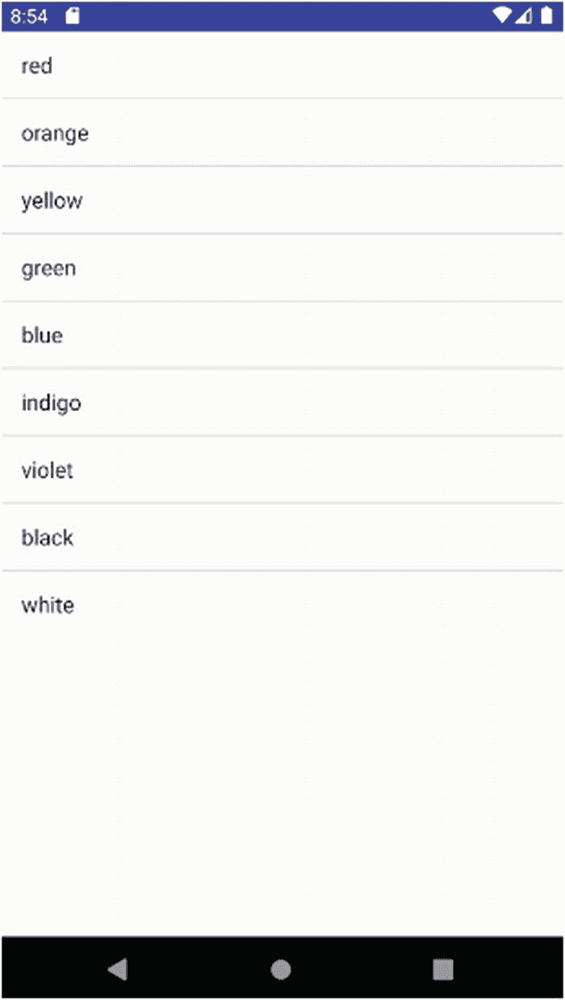
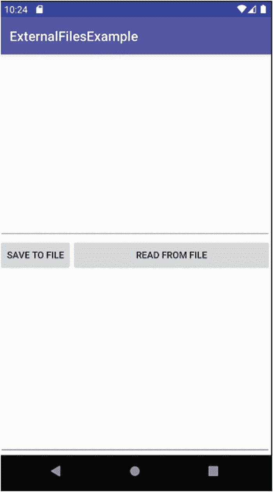
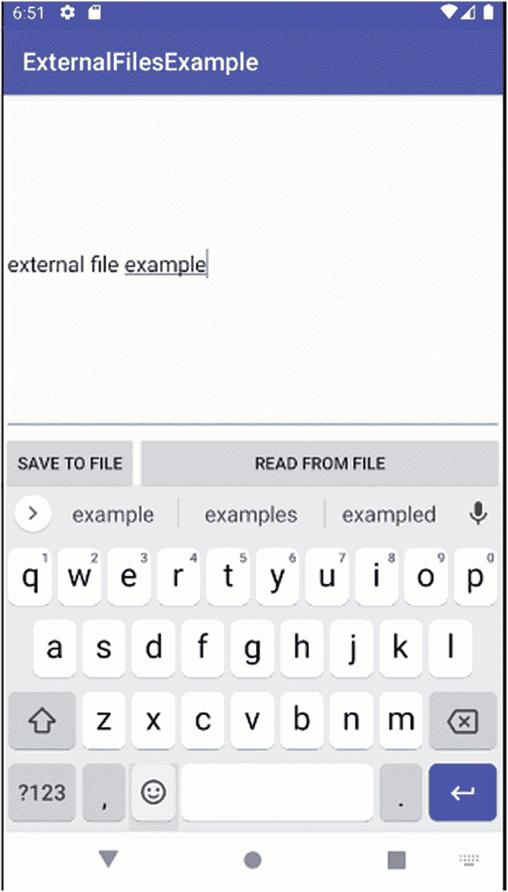
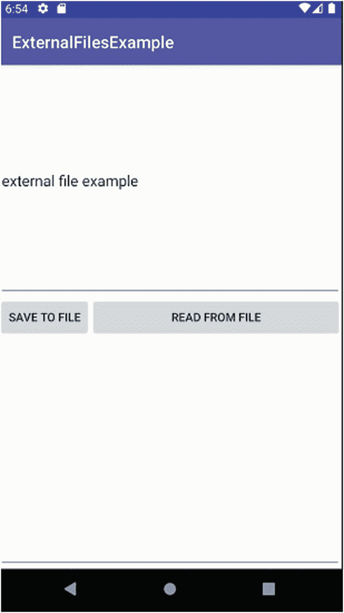
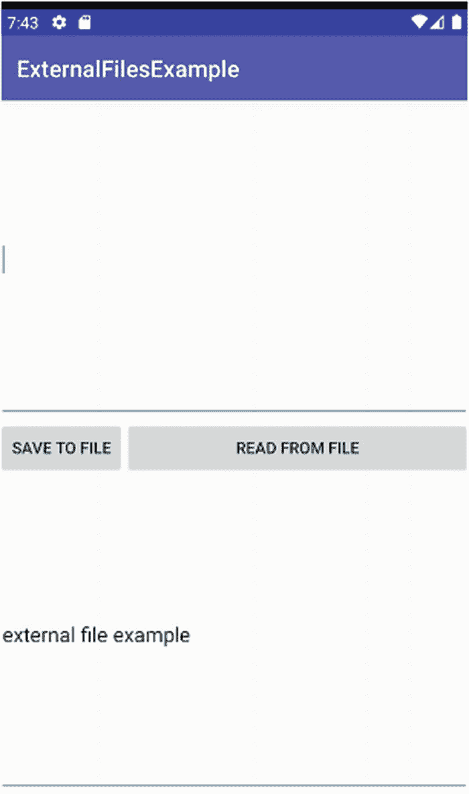

# 十九、在 Android 中处理文件

在这一章中，我们将详细探讨文件，包括 Android 为应用存储、检索和管理数据的方法。在下一章中，我们将讨论数据库的辅助工具，它们和文件一起代表了应用中数据管理的丰富选项。我们还将这些与内容供应器进行对比，内容供应器是 Android 更复杂的数据访问和管理模型。

本章中的例子集中在 Android 为基于文件的数据提供的两个主要方法上。方法 1 可以被认为是“应用嵌入式”模型，它使用与应用打包在一起的原始资源和素材。方法 2 是“Java I/O”方法，它利用几乎著名的 java.io 包来操作文件、数据流等，就像在任何其他操作系统上操作基于 Java 的文件管理一样。

每种方法都有优点和缺点，我们将一一介绍，您可以放心，没有最好的方法，只有对当前问题最好的方法。

## 使用资源和原始文件

在第 13 和 14 章中，我们介绍了一些音频和视频例子，这些例子依赖于 Android 的一些直接处理文件的功能。我们在这些章节的示例中探索的原始位置和素材位置的使用不仅限于音频、图像和视频等媒体文件。您可以将几乎任何类型的文件放在这些位置，只要您让开发人员知道如何访问和操作它们的内容。例如，您可以存储一个. csv 文件来保存一些有用的数据。

Android 通过 Resources 类及其`getResources()`方法提供了对文件的简单访问。对于原始资源文件，您可以通过调用`openRawResources()`方法通过`InputStream`来呈现其内容。作为开发人员，你的任务是知道`InputStream`中的数据意味着什么。在我们看一个例子之前，需要知道使用来自原始或素材文件的数据源的一些重要的优点和缺点。

基于 raw 的方法的优点包括:

1.  多亏了安卓素材打包工具 AAPT，你的文件可以和你的应用打包在一起。

2.  您可以在库项目中共同定位资源，以便在需要时可以从许多应用中访问它们。

3.  默认情况下，文件是私有的，外部访问需要完整的知识或包名和资源名来引用或适当的库或 API 调用，以及在清单文件中或在运行时授予的文件访问权限。

4.  只读和静态数据可以用常见的格式打包，比如 JSON 或 XML。

为了平衡优势，需要注意这种方法的一些主要缺点:

1.  默认情况下为只读。编辑与应用打包在一起的现有资源并不简单。

2.  对于其他应用或服务用户来说，共享是很重要的。

3.  静态特性带来了保持信息更新的问题。

有了这些优点和缺点，您就可以做出明智的选择，确定这是否是您的应用和所需功能的正确方法。

### 从资源文件填充列表

理解文件管理的优点和缺点最好用一个例子来说明。对于这个例子，我们将引入`ListView` UI 小部件和适配器逻辑，并使用它们作为从 XML 文件读取数据的机制，并在应用运行时动态填充文件数据的值列表。清单 19-1 显示了一个简单的布局，提供了一个`ListView`来最终显示来自我们的 XML 资源文件的数据。

```java
<?xml version="1.0" encoding="utf-8"?>
<RelativeLayout xmlns:android="http://schemas.android.com/apk/res/android"
    xmlns:app="http://schemas.android.com/apk/res-auto"
    xmlns:tools="http://schemas.android.com/tools"
    android:layout_width="match_parent"
    android:layout_height="match_parent"
    tools:context=".MainActivity">

    <TextView
        android:id="@+id/mySelection"
        android:layout_width="match_parent"
        android:layout_height="wrap_content" />
    <ListView
        android:id="@android:id/list"
        android:layout_width="match_parent"
        android:layout_height="match_parent"
        android:drawSelectorOnTop="false" />

</RelativeLayout>

Listing 19-1The layout for the RawFileExample

```

对于这个示例应用，我们将让我们的`ListView`显示颜色的名称，并从我们在`ch19/RawFileExample`项目中提供的 XML 文件`colors.xml`中获取这些颜色名称。你可以在清单 19-2 中看到文件`colors.xml`的内容。

```java
<colors>
    <color value="red" />
    <color value="orange" />
    <color value="yellow" />
    <color value="green" />
    <color value="blue" />
    <color value="indigo" />
    <color value="violet" />
    <color value="black" />
    <color value="white" />
</colors>

Listing 19-2The colors.xml file content

```

可以看到`colors.xml`文件很简单，这是故意的。我们关注的是实际打开该文件、读取和解析其内容以及在应用的适当数据结构中使用结果数据所需的逻辑，而不是 XML 的复杂性。清单 19-3 展示了一个简单的基于`ListActivity`的应用的逻辑，它将在一个列表中显示来自`colors.xml`文件的颜色名称，然后让用户点击选择一种特定的颜色。

```java
package org.beginningandroid.rawfileexample;

import android.app.ListActivity;
import android.os.Bundle;
import android.view.View;
import android.widget.ArrayAdapter;
import android.widget.ListView;
import android.widget.TextView;

import org.w3c.dom.Document;
import org.w3c.dom.Element;
import org.w3c.dom.NodeList;

import java.io.InputStream;
import java.util.ArrayList;

import javax.xml.parsers.DocumentBuilder;
import javax.xml.parsers.DocumentBuilderFactory;

public class MainActivity extends ListActivity {

    private TextView mySelection;
    ArrayList<String> colorItems=new ArrayList<String>();

    @Override
    protected void onCreate(Bundle savedInstanceState) {
        super.onCreate(savedInstanceState);
        setContentView(R.layout.activity_main);
        mySelection=(TextView)findViewById(R.id.mySelection);

        try {

            InputStream inStream=getResources().openRawResource(R.raw.colors);
            DocumentBuilder docBuild= DocumentBuilderFactory
                    .newInstance().newDocumentBuilder();
            Document myDoc=docBuild.parse(inStream, null);
            NodeList colors=myDoc.getElementsByTagName("color");
            for (int i=0;i<colors.getLength();i++) {
                colorItems.add(((Element)colors.item(i)).getAttribute("value"));
            }
            inStream.close();
        }
        catch (Exception e) {
            e.printStackTrace();
        }

        setListAdapter(new ArrayAdapter<String>(this,
                android.R.layout.simple_list_item_1, colorItems));
    }

    public void onListItemClick(ListView parent, View v, int position,
                                long id) {
        mySelection.setText(colorItems.get(position).toString());
    }

}

Listing 19-3RawFileExample Java logic for processing the XML resource file

```

查看`RawFileExample`的代码，您会立即注意到我们正在导入的处理文件 I/O 和 XML 解析的外部 Java 库的数量。这就是 Java 遗产在 Android 中的作用。即使您选择将 Kotlin 作为首选编程语言，大量的 Java 库也可以帮助您实现功能。

`onCreate()`方法首先创建一个`InputStream`对象，然后我们调用`getResources().openRawResource()`来执行在`.apk`中查找文件的动作，分配它的文件描述符，将它们与`InputStream`相关联，最后让系统准备好随后使用来自我们文件的数据流。从那时起，剩下的逻辑就是解释文件中的内容所需要的。

在初始文件处理之后，我们使用一个`DocumentBuilder`对象来解析文件的内容，并将结果表示存储在一个名为`myDoc`的文档对象中。使用 DOM 语义，我们调用`getElementsByTagName()`将所有的`<color>`元素收集到我们的`NodeList`对象中。考虑到我们文件的简单性，这看起来有些过分，但是想象一个更复杂的 XML 模式，包含其他元素、子元素等等，您可以看到这是如何有效地筛选出我们想要的元素的。

最后，我们使用 for 循环，遍历`NodeList <color>`条目，提取 value 属性的文本——这是我们想要在`ListView`中呈现的实际颜色名称字符串。填充了我们的`NodeList`后，我们可以用配置为使用颜色名称列表的`ArrayAdapter`来扩展`ListView`，要求它使用默认的`simple_list_item_1`内置 XML 布局来呈现结果。

处理用户单击颜色的逻辑检索颜色字符串，并用用户选择的条目填充`TextView`。

运行应用会显示在我们的`ListView`中呈现的来自`colors.xml`文件的数据，如图 19-1 所示。



图 19-1

显示 XML 文件内容的 RawFileExample 应用

### 使用文件系统中的文件

如果您以前在传统文件系统上使用一般 Java 应用进行过文件 I/O，那么 Android 方法将会非常熟悉。对于那些不熟悉基于 Java 的文件读写的人，这里有一个快速介绍。

从 Java 的角度来看，文件被视为数据流，两个对象成为文件读写的中心:`InputStream`和`OutputStream`。这些流是通过从代码中调用`openFileInput()`和`openFileOutput()`方法来提供的。有了流，你的程序逻辑就负责诸如从`InputStream`读取或者向`OutputStream`写入之类的动作，并且在你完成时清理所有的资源。

### Android 的文件系统模型

由于 Android 的历史和谷歌对人们是否应该完全访问自己的设备过于家长式的想法，作为一名开发人员，当处理设备上的本地文件存储时，你将面临两个概念。所有存储都将分为“内部”和“外部”，但这些术语有一种扭曲的含义。在当代的 Android 中，“内部”主要是指你所想的，但“外部”既指传统的外部存储，如 SD 卡，也指普通人认为是内部的一部分板载存储，但 Android 称之为外部，表明你对传统的文件 I/O 有更自由的访问权。

除了将“内部”区域用于与系统相关的目的之外，在考虑 Android 下的文件系统时还存在其他差异，这些差异代表了内部和外部存储的优点和缺点。

内部存储如下:

1.  在每一个 Android 设备上都可以找到，并且总是在适当的位置。

2.  构成应用的一部分并被指定放在内部存储上的文件被视为应用不可或缺的一部分。这些文件在安装应用时安装，在删除应用时删除。

3.  内部保存文件的默认安全边界是您的应用私有的。共享需要明确的附加步骤。

4.  通常比可用的外部存储空间小得多，即使有足够的外部存储空间可用，用户也可以看到该存储空间已满，并出现空间管理问题。

外部存储不同，如下所示:

1.  Android 为外部存储提供了 USB 抽象层和接口。当用作 USB 设备时，设备上的应用无法访问外部存储器。

2.  默认的安全边界是使外部存储上的所有文件都是全局可读的。其他应用可以读取您外部存储的文件，而无需开发人员或用户的知识或许可。

3.  根据调用的 save 方法，卸载应用时可能不会移除外部存储的文件。

现在你已经了解了内部和外部存储的这些方面，请继续阅读！

### 读写文件的权限

如果您选择使用内部存储，那么您的应用总是有权写入和读取为其保留的内部存储部分。要查找应用的任何内部存储的详细信息，请调用`getFilesDir()`。您还可以使用`getDir()`返回一个命名的(子)目录供您使用，如果它还不存在，就在这个过程中创建它。

您可以通过调用`openFileOutput()`打开一个文件进行输出流——也称为写入。如果文件不存在，将为您创建一个。`openFileInput()`方法为一个`InputStream`执行文件打开，以满足您的读取要求，但是要注意，对于这个调用，您指定的文件必须已经存在。

`openFileOutput()`和`openFileInput()`都接受许多控制文件和流行为的`MODE_*`选项。最常用的`MODE_*`选项包括

*   MODE_APPEND:文件中的现有数据不变，字符串中的数据被追加到文件中的现有内容。

*   MODE_PRIVATE:文件上的权限被设置为只允许创建它的应用(以及以相同用户身份运行的任何其他应用)访问该文件。这是默认设置。

*   MODE_WORLD_READABLE:向设备上的所有应用和用户开放读取权限。这被认为是糟糕的安全实践，但当使用内容供应器或服务被认为是过度时，经常会出现这种情况。

*   MODE_WORLD_WRITABLE:比全局可读更危险的是全局可写。任何应用或用户都可以写入该文件。仅仅因为其他开发者使用这个并不意味着你应该这样做！

对于您的应用用户而言，在应用分配的内部文件系统空间内创建、打开或写入内部文件不需要特定权限。创建存储在内部设备存储器中的文件的最简单示例如下:

```java
FILE myFile = new FILE(context.getFilesDir(), "myFileName");

```

当您开始使用外部存储时，情况会有所不同。您可以使用不同的方法，权限模型严格执行适当的控制和保护措施。为了写入外部存储器，你的 Android 清单需要包含特权`android.permission.WRITE_EXTERNAL_STORAGE`，正如我们在第十三章和第十四章的音频和视频示例中看到的。

旧版本的 Android，直到 Android Marshmallow，允许你的应用自由地从外部存储器读取数据，而不需要指定或要求任何特殊的许可。对于最新版本的 Android，您需要在您的清单中包含`android.permission.READ_EXTERNAL_STORAGE`。因为包含这个对旧版本没有影响，所以不管您的版本支持计划如何，您应该简单地默认添加这个。

可用于外部存储访问的方法在名称上与前面介绍的用于内部存储的方法非常相似，但倾向于添加“外部”或“公共”一词`getExternalStoragePublicDirectory()`方法设计用于分配结构良好的目录和文件，您可以将文档、音频、图片、视频等存储在其中。该方法采用一个表示预定义应用目录之一的枚举和您选择的文件名。

Android 有几十个应用目录，包括

*   DIRECTORY_DOCUMENTS:用于存储用户创建的传统文本或其他可编辑文档。

*   DIRECTORY_MUSIC:存放各种音乐和音频文件的地方。

*   DIRECTORY_PICTURES:用于存储静态图像文件，如照片、绘图等。

所有这些预定义的位置都很有帮助，在它们非常适合的情况下，这些位置具有令人放心的可预测性，但有时您需要存储明显不同类型的文件。对于这些情况，使用通用的`getExternalStorageDirectory()`方法，提供与本章前面提到的用于内部存储的`getFilesDir()`相似的功能。

## 检查运行中的外部文件

消化了更多的理论之后，是时候用一个工作示例来探索外部文件了。在`ch19/ExternalFilesExample`中找到的`ExternalFilesExample`应用，通过保存文件和读回其内容的机制。

图 19-2 是用于提供文本输入域、文件写入和读取按钮以及文本读取域的布局。相应的布局 XML 文件在`ch19/ExternalFilesExample`项目中，但是我们将通过不在这里重复它来节省一些空间。



图 19-2

具有用于测试外部文件管理的字段和按钮的活动

我们的应用的支持逻辑遵循我多次使用的模式，一个中央`onClick()`方法接收按钮点击，根据用户在运行时选择的视图(按钮)切换到适当的方法。代码如清单 19-4 所示。

```java
package org.beginningandroid.externalfilesexample;

import androidx.appcompat.app.AppCompatActivity;

import android.content.Context;
import android.os.Bundle;
import android.view.View;
import android.view.inputmethod.InputMethodManager;
import android.widget.EditText;

import java.io.BufferedReader;
import java.io.IOException;
import java.io.InputStream;
import java.io.InputStreamReader;
import java.io.OutputStreamWriter;

public class MainActivity extends AppCompatActivity {

    public final static String FILENAME="ExternalFilesExample.txt";

    @Override
    protected void onCreate(Bundle savedInstanceState) {
        super.onCreate(savedInstanceState);
        setContentView(R.layout.activity_main);
    }

    public void onClick(View view) {
        switch(view.getId()) {
            case R.id.btnRead:
                try {
                    doReadFromFile();
                }
                catch (Exception e) {
                    e.printStackTrace();
                }
                break;
            case R.id.btnSave:
                doSaveToFile();
                break;
        }
    }

    public void doReadFromFile() throws Exception {
        doHideKeyboard();
        EditText readField;
        readField=(EditText)findViewById(R.id.editTextRead);
        try {
            InputStream inStrm=openFileInput(FILENAME);
            if (inStrm!=null) {
                // We will use the traditional Java I/O streams and builders.
                // This is cumbersome, and we'll return with a better version
                // in chapter 20 using the IOUtils external library

                InputStreamReader inStrmRdr=new InputStreamReader(inStrm);
                BufferedReader buffRdr=new BufferedReader(inStrmRdr);
                String fileContent;
                StringBuilder strBldr=new StringBuilder();

                while ((fileContent=buffRdr.readLine())!=null) {
                    strBldr.append(fileContent);
                }
                inStrm.close();
                readField.setText(strBldr.toString());
            }

        }
        catch (Throwable t) {
            // perform exception handling here
        }
    }

    public void doSaveToFile() {
        doHideKeyboard();
        EditText saveField;
        saveField=(EditText)findViewById(R.id.editText);
        try {
            OutputStreamWriter outStrm=
                    new OutputStreamWriter(openFileOutput
                            (FILENAME, Context.MODE_PRIVATE));
            try {
                outStrm.write(saveField.getText().toString());
            }
            catch (IOException i) {
                i.printStackTrace();
            }
            outStrm.close();
        }
        catch (Exception e) {
            e.printStackTrace();
        }
    }

    public void doHideKeyboard() {
        View view = this.getCurrentFocus();
        if (view != null) {
            InputMethodManager myIMM=(InputMethodManager)
                    this.getSystemService(Context.INPUT_METHOD_SERVICE);
            myIMM.hideSoftInputFromWindow
                    (view.getWindowToken(), InputMethodManager.HIDE_NOT_ALWAYS);
        }
    }

}

Listing 19-4The ExternalFilesExample Java code

```

### 保存和读取文件需要什么

探索`ExternalFilesExample`项目，我们看到两个关键方法。首先是`doSaveToFile()`方法，它通过调用`doHideKeyboard()`(稍后介绍)来执行一些准备和内务处理，然后创建局部`saveField`变量并将其绑定到布局中的`EditText`视图。这样做是为了我们最终可以引用 UI 中的文本进行保存。

随后是主 try/catch 块，定义输出流，用于将文本传输到由变量`FILENAME`指定的文件。然后，我们调用`.write()`方法，尝试通过流将文本写入文件。

您可能会注意到在`ExternalFilesExample`代码中有许多嵌套的异常处理层。写入文件可能会遇到很多很多问题，从完全存储到用户在写入过程中自发移除正在写入的 SD 卡！简而言之，对于文件访问，对异常要格外小心。

第二，为了从文件中读取，我们使用了`doReadFromFile()`方法，遵循与我们使用`doSaveToFile()`方法相似的设置工作。我们首先调用`doHideKeyboard()`(下面将会介绍),然后本地变量`readField`被创建并绑定到`editTextRead`小部件。这将用于显示文件读取后的内容。

接下来，我们添加一个`try/catch`块，它包含了一些教科书上的 Java 文件处理。我们使用流读取器来访问文件，并传递缓冲区以允许消费者控制对数据的访问。缓冲区用于通过 while 块逐行访问流，我们逐渐在字符串生成器中构建文件的完整内容。从流(以及文件)中读取所有行后，流被关闭，然后我们通过 strBldr 对象将所有内容从缓冲区传输到布局中的`readField EditText`小部件。

有更精简、更现代的方法来完成所有这些，但关键是它们隐藏了正在发生的事情的基本机制。在`ExternalFilesExample`代码中，您可以看到 Java I/O 如何在最底层发生的混乱细节，以建立对所需对象和工作以及所有可能出错的地方的评估！没有一个头脑正常的人会像今天这样暴露文件访问的编程模式——他们会把它藏起来，即使在幕后所有这些步骤仍然会发生。

#### 帮助简化 ime

我们的代码稍微偏离了使用`doHideKeyboard()`方法的严格文件处理。这是一个非常有用的辅助方法，它有助于减少用户在输入文本和执行所需操作时所需的步骤。当用户在`EditText`字段中输入文本时，IME 被触发，并显示软键盘供用户输入他们想要的文本。我们可以定制 IME，使用 IME 的“附件按钮”选项添加一个“完成”按钮，但这是一个额外的询问用户的按键。

相反，我精心设计了布局，以确保保存(和读取)按钮即使在 IME 处于活动状态时也是可见的，这意味着用户可以键入，然后立即单击保存按钮。对`doSaveToFile()`的调用调用`doHideKeyboard()`，它首先确定用户与哪个`View`进行了交互，以及输入法框架是否处于活动状态并显示键盘。如果显示了一个，我们调用`.hideSoftInputFromWindow()`来隐藏键盘。虽然用户看不到所有这些机制，但他们受益于用户体验中获得的简单性——少按一次键就可以保存他们的文件！

### 正在保存和读取文件

既然您已经理解了这个`ExternalFilesExample`例子，那么是时候看看它是如何实现的了。图 19-3 显示了当用户第一次开始在顶部字段输入文本时，显示屏最初是如何寻找应用的。



图 19-3

输入要保存到外部文件的文本

正如我所承诺的，IME(键盘)出现在屏幕的下半部分，但我们的按钮仍然可以使用。在这个例子中，这更像是一个黑客——它不是一个完全成熟的应用会使用的光鲜亮丽的 UI，而是显示了我们关心的文件 I/O。用户可以随时点击“保存到文件”按钮，触发`doSaveToFile()`方法。如本章前面所述，这调用了`doHideKeyboard()`方法，此时我们的用户界面将如图 19-4 所示。



图 19-4

IME 随着文件的保存而隐藏

输入到`EditText`字段的文本保存在一个名为`ExternalFilesExample.txt`的文件中。点击“从文件中读取”按钮，可以随时调出`ExternalFilesExample.txt`的内容。这将触发文件的内容被读取，然后通过`doReadFromFile()`方法显示。图 19-5 显示了此次文件检索的结果。



图 19-5

调出外部文件的内容

## 确保外部存储在需要时可用

当我在前面介绍使用外部存储时，我概述了一些潜在的缺点，包括您是否可以在需要时依赖它的不确定性。你的用户可以做一些疯狂的事情，比如从他们的设备中物理移除 SD 卡，甚至对于那些通过内部内存分区模仿外部存储的设备，Android 仍然允许将外部存储作为 USB 设备安装在其他地方，这隐含地切断了其他应用对存储的访问。

作为开发人员，您的目标应该是创建行为良好的应用，即使您的用户并不是这样！这意味着在应用尝试使用外部存储之前，对外部存储的存在和可用性进行健全性检查是明智的。

为此，Android 提供了一些有用的环境方法，其中最有用的是`Environment.getExternalStorageState()`，它从一个预定义的 enum 返回一个字符串，描述外部存储的当前状态。您可以使用此状态来确定外部存储的可用性、健康状况等。返回的常见值包括

*   MEDIA_BAD_REMOVAL:此状态表示物理 SD 卡在卸载前已被移除，由于缓存页面未被刷新，可能会使文件处于不一致状态(请参阅本章后面的文件系统讨论)。

*   MEDIA_REMOVED:当没有从板载设备映射外部存储并且不存在 SD 卡时，返回该值。

*   MEDIA_SHARED:当设备将其外部存储作为 USB 设备安装到某个其他外部平台时，这是返回的值，指示此时外部存储不可用，即使它存在于设备中。

*   MEDIA_CHECKING:当插入 SD 卡时，会执行检查以确定该卡是否已被格式化，如果是，则使用哪个文件系统。这是这些过程发生时返回的值。

*   MEDIA_MOUNTED:可以使用的外部存储器的正常状态。

*   MEDIA_MOUNTED_READ_ONLY:通常在 SD 卡的物理开关设置为只读位置时出现，这意味着不能写入外部存储的该部分。

developer.android.com 的 Android 文档有所有可能的外部存储状态值的完整列表。

### Android 文件系统的其他考虑事项

现在，您已经熟悉了在 Android 中处理文件的各种方法，要确保在文件系统中使用文件的长期可行性，需要考虑一些微妙和不那么微妙的管理问题。

#### 历史上的 Android 文件系统

在 Android 作为智能手机操作系统的历史上，它支持一系列板载存储文件系统标准。历史上的三种主要形式是

1.  YAFFS，或另一个闪存文件系统:基于 NAND 的存储的原始文件系统，它提供了许多有用的好处，包括磨损平衡支持，以便管理闪存存储随时间的衰减，并在一定程度上对操作系统和应用隐藏，以及文件系统级垃圾收集工具，以帮助将存储的坏区域移动到“死池”，而不是用于有意义的存储。

2.  YAFFS2 和 YAFFS 的进化和调整版本:为底层存储提供更好的长期健康管理。

3.  EXT4，Linux 普及的文件系统:具有成熟文件系统的所有“成熟”管理特性，包括每个文件的锁定语义、权限等等。

基于旧的`YAFFS`和`YAFFS2`的文件系统以及使用它们的设备的一个问题是缺少文件锁定语义。简而言之，作为开发人员，两者都没有提供锁定单个文件的选项(例如，当编辑共享文件时)，相反，您依赖于锁定“整个文件系统”来确保一致的访问。这有一系列的缺点，从阻止其他可能试图同时写入文件的应用，到如果文件 I/O 发生在主线程上，会妨碍有效的 UI 行为。

作为开发人员，您的主要问题是不知道用户的设备可能使用什么文件系统。你很可能会因为 I/O 锁定和阻塞问题而受到性能不佳的指责，即使可能是 Android 本身导致了这个问题。

#### 避免文件 I/O 的 UI 问题

作为开发人员，您可以使用一系列技术来缓解与`YAFFS`或`YAFFS2`文件系统有关的锁定和争用问题。这些技术通常也可以帮助对网络端点的其他类型的 I/O。

##### 使用 StrictMode 分析应用

Android 生态系统提供了一系列工具来帮助执行应用行为和性能。StrictMode 策略工具就是这样一种工具，它通过分析所有代码的操作来寻找策略中定义的问题，从而帮助解决任何 I/O 延迟问题。

StrictMode 有一系列可用的策略，尽管您可能会发现自己正在使用它的两个原始产品。第一个策略是虚拟机策略，它涵盖了整个应用中通常不良的行为或实践，比如泄漏数据库连接对象。第二组策略是线程策略，这些策略特别关注在主 UI 线程上出现的表现不佳的代码。这有助于发现那些会降低或干扰用户流畅的用户界面体验的代码——无论是你的还是安卓的。

您可以通过从 onCreate()回调调用静态的`StrictMode.enableDefaults()`方法来激活 StrictMode 策略。调用这个调用将在 Logcat 输出中报告一系列关于 UI 线程问题的有用信息，包括文件 I/O 问题。如果你愿意，你也可以定义你自己的策略——具体细节超出了本书的范围，但是如果你感兴趣的话，Android 文档有更多的细节。

Caution

尽管 StrictMode 策略非常有用，但千万不要在最终发布的代码和应用中定义它们。保留 StrictMode 将在用户的设备上创建大量的日志数据，消耗掉您一直在努力管理的文件系统空间。

##### 将逻辑移动到异步线程

前面关于 StrictMode 的讨论打开了将逻辑从应用的主 UI 线程和接口移开的世界。几乎在任何时候，都值得考虑应用中是否有其他逻辑不需要发生在关键路径上，例如从在线服务中后台查找数据、消息传递或发布/订阅样式的通知、缓存的项目等等。

关键路径之外可能发生的任何事情都应该被考虑用于异步操作，这就是 Android 的`AsyncTask`的亮点，能够产生额外的线程来处理您扔给它的任何逻辑。作为 Android 学习的一部分，这是非常值得掌握的，因为大多数开发人员将它作为管理应用线程的主要工具。

`AsyncTask`类是以一种形式提供的，这意味着作为开发人员，您必须对它进行子类化，以便为您想要做的工作创建特定的实现。这是有道理的，因为 Android 不能提前知道你的应用的细节，也不能覆盖全世界开发者希望它处理的数百万个任务。要使用`AsyncTask`，您需要获取它提供的`doInBackground()`方法，并实现您想要在另一个线程上执行的实际逻辑。您可以实现一些可选的附加方法来提供执行前和执行后的逻辑，以可控的方式与 UI 进行交互，等等。

清单 19-5 给出了一个存根，显示了`AsyncTask`的子类，以说明如何使用它来执行文件保存操作。有无数的其他方式可以实现这一点，但你会欣赏整体的想法。

```java
private class SmartFileSaver extends AsyncTask<Void, Void, Void> {

    protected void onPreExecute() {
        // This method will fire on the UI thread
        // Show a Toast message
        Toast.makeText(this, "Saving File", Toast.LENGTH_LONG).show();
    }

    protected void doInBackground() {
        // This method will spawn a background thread
        // All work happens off the UI thread
        // create output stream
        // call .write()
        // catch exceptions
        // etc.
    }

    protected void onPostExecute() {
        // This method will fire on the UI thread
        // Show a Toast message
        Toast.makeText(this, "File Saved", Toast.LENGTH_LONG).show();
    }

}

Listing 19-5An example AsyncTask subclassing

```

使用`SmartFileSaver.execute()`方法将调用我们的各种`onPreExecute()`、`doInBackground()`和`onPostExecute()`方法，由 Android 管理相关的线程生存期和 UI 交互。

## 摘要

现在，您已经对 Android 下的文件 I/O 的基本机制有了一个很好的了解，特别是对文件系统、文件处理、流和文件内容机制有了一个基本的了解，这些都是处理文件的方法的一部分。