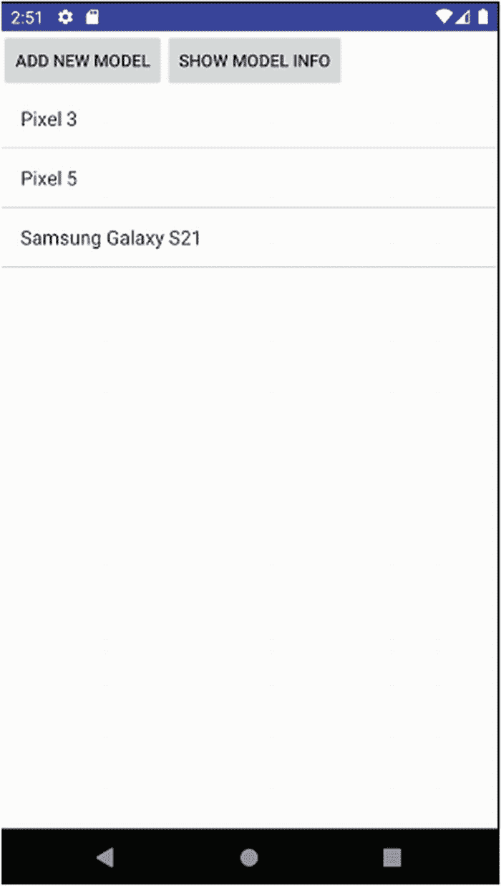
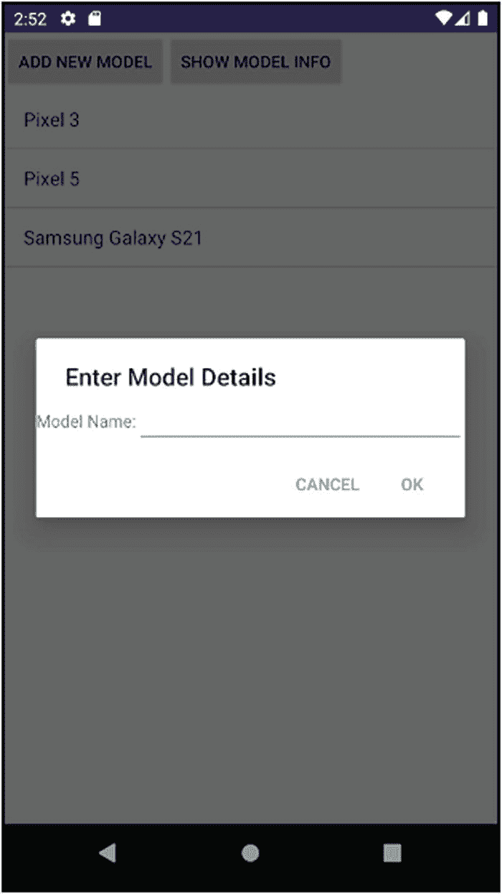

# 二十、在 Android 中使用数据库

文件并不是将应用中的信息存储到 Android 设备上的唯一方式。Android 提供了另外两种主要的信息管理方法:基于 SQLite 的成熟的关系数据库选项和 Android 内容提供者框架。在这一章中，我们将探索 SQLite 数据库——对于那些对内容提供商感兴趣的人，你可以在本书的网站 [`www.beginningandroid.org`](http://www.beginningandroid.org) 上了解更多信息。

如果您熟悉 SQLite，您会意识到它代表了一个坚如磐石的数据库引擎，作为一个包含或库提供给任何类型的应用。SQLite 最近作为一个发布产品已经有 25 年的历史了，证明了自己是软件开发史上的中流砥柱之一。

## 使用 SQLite:世界上最流行的数据库！

任何在数据库领域工作过的人都会对 SQLite 很熟悉，但是尽管它很流行，来自其他领域的人可能从未听说过它。毫不夸张地说，SQLite 是这个星球上“最流行的”关系数据库技术。这是一个大胆的主张，所以让我提供一些支持的证据。

为了让您了解 SQLite 有多普遍和受欢迎，我整理了这个简短的数据点列表来帮助您。

SQLite 是

1.  每个智能手机操作系统都提供默认的核心关系数据库。我们显然在这本书里谈论的是 Android，但是你听说过的其他智能手机操作系统——比如 iOS——以及你可能没有听说过的操作系统，比如 Symbian，都使用 SQLite 作为默认数据库来满足几乎所有的内部需求。

2.  每个 web 浏览器都选择它作为本地缓存、书签等的关键技术。无论你使用 Chrome、Safari、Opera、Edge 还是 Internet Explorer(还记得吗？！)，你每天都在用 SQLite。

3.  包括在数以百万计的商业和开源产品中。我说几百万不是夸张！

我最喜欢的说明 SQLite 有多受欢迎的方式之一是将其描述如下。亲爱的读者，从你购买智能手机的第一天起，你每天都在使用 SQLite 或从中受益。即使您没有意识到，您也是一个会走路、会说话的 SQLite 受益人！

Note

为了深入 SQLite 的世界，我可以推荐*SQLite*的权威指南，第二版，ISBN 9781430232254。为了完全公开，我是那本书的合著者之一。

很多人对 SQLite 一点都不熟悉。您将不会探索 SQLite 在 Android 下的功能或利用它的优势。这完全在意料之中，也是本章存在的原因。从现在开始，我们将介绍使用 SQLite 作为数据库和 Android 核心功能的基础知识，并且我们将构建一个数据库驱动的示例应用来磨练您的技能。

## Android 开发快速学习 SQLite

SQLite 的目标是作为一个简单的数据库库，提供您可能希望从关系数据库查询和事务引擎中得到的所有核心内容。这意味着您可以访问完全兼容的结构化查询语言(SQL)接口，尽管记住您可能感兴趣的任何功能中引入的 SQL 级别(如 SQL-92 和 SQL-99)总是很重要的。这一点尤为重要，因为用户设备附带的 SQLite 版本通常比最新版本落后好几年。

SQLite 支持普通的 SQL 命令，如`SELECT`、`INSERT`、`UPDATE`和`DELETE`，但根据版本的不同，可能不支持以后 SQL 发展的一些关键特性。这可以包括

1.  仅支持 ANSI 外部连接语法的子集

2.  最小的 alter table 支持，允许您重命名和添加列，但不能删除列或改变数据类型

3.  支持行级触发器，但不支持语句级触发器

4.  视图是只读的

5.  不支持窗口函数和公共表表达式，即使这些是在 3.25 版中添加到 SQLite 中的——只有支持 Android SDK 级或更高级别的设备才会提供支持窗口函数的 SQLite 版本

您可能会担心这些缺失的特性，但实际上它们大多是在数据库使用的高端，而不是小型嵌入式数据库库的日常需求。即使没有这些更新的特性，您仍然可以获得 SQL 的强大功能。

### 为您的应用创建 SQLite 数据库

当使用 SQLite 数据库启动应用时，有两种方法可供选择:

1.  创建一个 SQLite 数据库文件作为开发环境的一部分，或者从外部获取并作为资源复制到您的 Android 项目中。

2.  让您的 Android 应用创建它需要的数据库，并可选地填充任何初始数据。

每种方法都有优点和缺点。通过打包一个预制的 SQLite 数据库，您就可以让数据库模式和代码开发保持同步——尽管这并不是 Android 独有的问题。让应用创建数据库可以减轻您的负担，但是根据 SQLite 数据库可能需要的数据种类和数量，这可能会给应用带来沉重的启动负担。Android 可以在这方面提供帮助，因为它提供了一系列 SQLite 设置帮助选项。

Android 提供了`SQLiteOpenHelper`类，专为您在应用中创建子类而设计。`SQLiteOpenHelper`负责 SQLite 数据库的所有初始设置，并处理未来的更改和升级。你的工作是实现(至少)父`SQLiteOpenHelper`类中的三个方法，第四个降级方法也是可选的。

您的第一项工作是向`SQLiteOpenHelper`构造函数添加逻辑，调用父构造函数作为基础。父类负责检查指定的数据库文件是否已经存在，并在需要时创建该文件。构造函数还对所提供的版本进行版本检查，并在必要时调用`onUpgrade()`和`onDowngrade()`方法，以及其他一些超出本文介绍范围的深奥任务。

其次，您必须实现`onCreate()`方法的逻辑。这是您构建和执行数据定义语言(DDL) SQL 命令的地方，根据您的数据库模式设计来创建您的表、索引、视图等等。在 SQLite 数据库中创建对象之后，您应该通过 insert 和 update 语句填充您需要的任何数据。

最后，您需要实现`onUpgrade()`(以及可选的`onDowngrade()`方法)。这些方法处理实现模式更改的 DDL，以及在升级应用并决定 SQLite 数据库结构需要更改以支持所需应用行为时，您希望进行的任何相关数据更改。

学习了在应用中使用 SQLite 的理论之后，是时候探索一个示例应用了，它将有助于将这些概念付诸实践。

### SQLiteExample 应用简介

在本章的剩余部分，`ch20/SQLiteExample`应用将用于突出显示在构建数据库驱动的 Android 应用时您可能想要使用的所有关键 SQLite 功能。我们将使用简单的`LinearLayout`和`ListView`来帮助演示 SQLite 数据库中数据的使用和显示。图 [20-1](#Fig1) 显示了包含一个`ListView`的用户界面，用于显示 SQLite 数据库中已知的 Android 设备型号。我们有添加新设备型号和显示已知设备信息的按钮。



图 20-1

SQLiteExample 的主要活动和外观

这种简单的布局和视图您现在应该已经很熟悉了，所以我们就不赘述了。清单 [20-1](#PC1) 显示了布局。

```java
<?xml version="1.0" encoding="utf-8"?>
<LinearLayout xmlns:android="http://schemas.android.com/apk/res/android"
    xmlns:app="http://schemas.android.com/apk/res-auto"
    xmlns:tools="http://schemas.android.com/tools"
    android:layout_width="match_parent"
    android:layout_height="match_parent"
    android:orientation="vertical"
    tools:context=".MainActivity">

    <LinearLayout
        android:id="@+id/buttonGroup"
        android:layout_width="wrap_content"
        android:layout_height="wrap_content"
        android:orientation="horizontal">

        <Button
            android:id="@+id/addNewModel"
            android:layout_width="wrap_content"
            android:layout_height="wrap_content"
            android:text="Add New Model"
            android:onClick="onClick"/>

        <Button
            android:id="@+id/getModelInfo"
            android:layout_width="wrap_content"
            android:layout_height="wrap_content"
            android:text="Show Model Info"
            android:onClick="onClick"/>

    </LinearLayout>

    <ListView
        android:id="@android:id/list"
        android:layout_width="wrap_content"
        android:layout_height="match_parent" />

</LinearLayout>

Listing 20-1The SQLiteExample main activity layout

```

关于这种布局有两点需要注意。首先，我定义了两个嵌套的`LinearLayouts`。最外层的`LinearLayout`具有属性`orientation=vertical`，包含内层的`LinearLayout`和具有股票 Android id 的`ListView`。内部的`LinearLayout`装有两个按钮`addNewModel`和`getModelInfo`以及`orientation=horizontal`。这是一个有用的技巧，可以让 UI 小部件按照我们想要的方式流动，但是一个更优雅的解决方案可以通过合适的权重、重力和布局参考来设计。

第二，我使用两个按钮调用一个`onClick()`方法的常见模式，该方法将让匹配的 Java 代码确定哪个按钮被单击，并从那里引导逻辑。

回头看图 [20-1](#Fig1) ，可以看到已经列出了几个设备的一些数据。这意味着某个数据库中的数据已经被用来演示应用。我在`SQLiteExample`应用中使用的`SQLiteOpenHelper`的实现中执行了这个操作。清单 [20-2](#PC2) 显示了这个实现的 Java。

```java
package org.beginningandroid.sqliteexample;

import android.content.Context;
import android.database.sqlite.SQLiteDatabase;
import android.database.sqlite.SQLiteOpenHelper;

public class MySQLiteHelper extends SQLiteOpenHelper {
    public static final String TABLE_NAME="devices";
    public static final int COLNO__ID = 0;
    public static final int COLNO_MODEL_NAME = 1;
    public static final int COLNO_RELEASE_YEAR = 2;
    public static final String COLNAME__ID = "_id";
    public static final String COLNAME_MODEL = "model_name";
    public static final String COLNAME_YEAR = "release_year";
    public static final String[] TABLE_COLUMNS =
            new String[]{"_id","model_name","release_year"};

    private static final String DBFILENAME="devices.db";
    private static final int DBVERSION = 1;
    private static final String INITIAL_SCHEMA=
            "create table devices (" +
                    "_id integer primary key autoincrement," +
                    "model_name varchar(100) not null," +
                    "release_year integer not null" +
                    ")";
    private static final String INITIAL_DATA_INSERT=
            "insert into devices (model_name, release_year) values " +
                    "('LG Nexus 4', 2012)," +
                    "('LG Nexus 5', 2013)," +
                    "('Samsung Galaxy S6', 2015)";

    public MySQLiteHelper(Context context) {
        super(context, DBFILENAME, null, DBVERSION);
    }

    @Override
    public void onCreate(SQLiteDatabase db) {
        db.execSQL(INITIAL_SCHEMA);
        db.execSQL(INITIAL_DATA_INSERT);
    }

    @Override
    public void onUpgrade(SQLiteDatabase db, int oldVersion, int newVersion) {
        // perform upgrade logic here
        // This can get quite complex
        if (oldVersion==1) {
            // do upgrade logic to new version
        }
        // and so on
    }

}

Listing 20-2The MySQLiteHelper SQLiteOpenHelper implementation

```

`MySQLiteHelper`的 Java 清单显示了本章前面概述的助手需求。构造函数获取文件名和版本信息，并使用它来检查 SQLite 数据库文件是否存在，如果需要就创建它。我选择了文件名“`devices.db`”作为 SQLite 数据库文件的一个有意义的名称。

查看`onCreate()`，您可以看到它连续两次调用`execSQL()`方法，这是您第一次接触到用于与 SQLite 数据库交互的常用方法。`execSQL()`提供了许多不同的参数和返回信息，但是最简单的是将一个`String` SQL 语句作为参数，这是由 SQLite 库执行的 SQL 命令。SQL 语句的成功执行通常不会提供返回值——这是“没有消息就是好消息”的原则。

与`execSQL()`调用一起使用的每个 SQL 语句都是在类顶部的常量声明中构造的。这种基于常量的语句方法并不新鲜，但是值得注意这里使用的一些额外的常量:

*   三个`COLNO_*`常量中的每一个都代表我定义的表中列的列号(或序号位置)。所以 _id 列(在下面讨论)在位置 0，model_name 列在位置 1，依此类推。这些位置对于一些 SQLite helper 方法非常重要，这些方法隐式地使用表的默认列顺序来返回数据。

*   `TABLE_COLUMNS`是表中列名的`String`数组。我们将要探索的许多方法都利用了这个名称集合。

回到表的`_id`列，这利用了 SQLite 的自动增量特性，让它为每一行生成一个惟一的整数值，作为表的主键。名称`_id`是许多内置 Android 工具、助手类和方法使用和期望的约定。我建议对所有 SQLite 表都采用这种设计传统，至少在您理解不同做法的后果之前。

通过`execSQL()`调用调用的下一个 SQL 语句是`INITIAL_DATA_INSERT`语句。该语句执行多行插入，将一组初始数据引导到模式中的一个表中。这种数据播种完全是可选的，您肯定会遇到想要这样做的情况和不需要这样做的情况。insert 语句本身使用的语法仅在 SQLite 的更高版本中受支持，因此在 Android 的更高版本中也受支持。有关 SQLite 版本和功能与 Android 版本的更多详细信息，请查看本书网站上的额外资料，网址为 [`www.beginningandroid.org`](http://www.beginningandroid.org) 。

helper 类中的最后一个方法是`onUpgrade()`的框架。在示例应用中，我们正在处理应用的第一个版本(`DBVERSION`等于 1，用于构造函数调用)。我留下了逻辑概要，您可以用它来处理所提供的`oldVersion`和`newVersion`值，以决定作为应用升级的一部分，可能需要哪些模式更改、数据更改或其他变更操作。当谈到数据库模式升级时，您会在网上看到许多例子，人们简单地删除并重新创建一个数据库作为`onUpgrade()`实现。这是一个务实的黑客，但它在一定程度上起作用，只要你不在乎你的用户的数据！如果您希望您的用户存储任何有价值的数据，并且希望即使在数据库模式升级时也能保留这些数据，那么请小心这种方法！

### 创建数据库驱动的活动

了解了`SQLiteOpenHelper`类的用途和结构后，您就可以用它来构建一个有用的数据库驱动的应用了。在`Ch20/SQLiteExample`应用中，您会看到如清单 [20-3](#PC3) 所示的逻辑。这个清单很长，尽管我省略了另一个名为`DialogWrapper`的助手类以节省空间。继续阅读 Java 代码，然后浏览逻辑。

```java
package org.beginningandroid.sqliteexample;

import android.app.AlertDialog;
import android.app.ListActivity;
import android.content.ContentValues;
import android.content.DialogInterface;
import android.os.Bundle;
import android.database.Cursor;
import android.database.sqlite.SQLiteDatabase;
import android.view.LayoutInflater;
import android.view.View;
import android.widget.ArrayAdapter;
import android.widget.Toast;

import java.util.ArrayList;
import java.util.Calendar;
import java.util.List;

public class MainActivity extends ListActivity {
    private SQLiteDatabase myDB;
    private MySQLiteHelper myDBHelper;

    @Override
    protected void onCreate(Bundle savedInstanceState) {
        super.onCreate(savedInstanceState);
        setContentView(R.layout.activity_main);

        myDBHelper = new MySQLiteHelper(this);
        myDB = myDBHelper.getWritableDatabase();

        displayModels();
    }

    public void onClick(View view) {
        switch(view.getId()) {
            case R.id.addNewModel:
                addModel();
                break;
            case R.id.getModelInfo:
                getModelInfo(view);
                break;
        }
    }

    public List<String> getModels() {
        List<String> models = new ArrayList<>();

        Cursor cursor = myDB.query(MySQLiteHelper.TABLE_NAME,
                MySQLiteHelper.TABLE_COLUMNS, null, null, null, null, null);

        cursor.moveToFirst();
        while (!cursor.isAfterLast()) {

            String model = cursor.getString(MySQLiteHelper.COLNO_MODEL_NAME);
            models.add(model);
            cursor.moveToNext();
        }

        cursor.close();
        return models;

    }

    public void displayModels() {
        List<String> modelEntries = getModels();

        ArrayAdapter<String> adapter = new ArrayAdapter<>(this,
                android.R.layout.simple_list_item_1, modelEntries);
        setListAdapter(adapter);
    }

    public void getModelInfo(View view) {

        Cursor cursor = myDB.rawQuery(
                "select _id, model_name, release_year " +
                        "from devices", null);

        cursor.moveToFirst();
        while (!cursor.isAfterLast()) {
            String model = cursor.getString(MySQLiteHelper.COLNO_MODEL_NAME);
            Integer year = cursor.getInt(MySQLiteHelper.COLNO_RELEASE_YEAR);
            Toast.makeText(this, "The " + model +
                            " was released in " + year.toString(),
                    Toast.LENGTH_LONG).show();
            cursor.moveToNext();
        }

        cursor.close();

    }

    private void addModel() {
        LayoutInflater myInflater=LayoutInflater.from(this);
        View addView=myInflater.inflate(R.layout.add_model_edittext, null);
        final DialogWrapper myWrapper=new DialogWrapper(addView);

        new AlertDialog.Builder(this)
                .setTitle(R.string.add_model_title)
                .setView(addView)
                .setPositiveButton(R.string.ok,
                        new DialogInterface.OnClickListener() {
                            public void onClick(DialogInterface dialog,
                                                int whichButton) {
                                insertModelRow(myWrapper);
                            }
                        })
                .setNegativeButton(R.string.cancel,
                        new DialogInterface.OnClickListener() {
                            public void onClick(DialogInterface dialog,
                                                int whichButton) {
                                // Nothing to do here
                            }
                        })
                .show();
    }

    private void insertModelRow(DialogWrapper wrapper) {

        ContentValues myValues=new ContentValues(2);

        myValues.put(MySQLiteHelper.COLNAME_MODEL, wrapper.getModel());
        myValues.put(MySQLiteHelper.COLNAME_YEAR,
                Calendar.getInstance().get(Calendar.YEAR));

        myDB.insert(MySQLiteHelper.TABLE_NAME,
                MySQLiteHelper.COLNAME_MODEL, myValues);
        //uncomment if you want inserts to be displayed immediately
        //displayModels();
    }

    @Override
    public void onDestroy() {
        super.onDestroy();

        myDB.close();
    }

}

Listing 20-3The main SQLiteExample activity

```

对于所有基于 SQLite 的 Android 开发，需要记住前面代码中的一些关键实现步骤。对于任何基于 SQLite 的 Android 应用来说，关键的一步是从您的助手类创建一个对象，并确保在需要它的活动的生命周期中保留它。这通常不会太难，我在 launcher activity 中创建它的方法很常见。

现在您已经有了助手对象，任何时候您需要使用数据库，您与它的交互将从调用它的`getReadableDatabase()`或`getWritableDatabase()`方法开始，为您的底层 SQLite 数据库返回一个数据库对象。正如方法名所示，可读的数据库对象仅用于通过`SELECT`查询读取数据库，而可写的版本允许 DML 语句，如`INSERT`、`UPDATE`、`DELETE`和 DDL 语句，用于我们的`onCreate()`助手类方法中使用的对象创建和更改。

当您使用数据库对象完成一个给定的任务时，只需调用它的`.close()`方法，助手类就会整理好。这通常是在`onDestroy()`或类似活动中完成的活动的一部分。

`SQLiteExample`应用创建助手对象并使用`getWritableDatabase()`以可写模式访问数据库，继续使用`getModels()`方法填充`modelEntries`列表。有了这项工作的结果，它就会向我们的`ArrayAdapter`提供它需要的东西，用从数据库返回的数据来膨胀`ListView`。`getModels()`方法是一个简短但强大的方法，因为它引入并使用了关于 SQLite 数据库和 Android 的两个主要功能。第一个概念是查询助手方法，它从 SQLite 数据库收集数据，第二个概念是用于管理返回结果的游标对象。熟练使用 SQLite(和其他)数据库需要掌握这两种技术，所以让我们更深入地研究一下。

### 为 SQLite 和 Android 选择查询方法

在应用中使用 SQLite 数据库时，您可以选择两种主要方法来检索它存储的数据。每种方法都利用了`SELECT`语句，但是不同之处在于为开发人员提供了多少指导和假设的结构。

#### 使用查询构建过程

正如在`SQLiteExample`应用的`getModels()`方法中看到的，方法 1 是使用`query()`方法。通过使用`query()`，您可以访问一个非常结构化的路径，为查询构建您想要或需要的列、源表、谓词逻辑等等，直到您得到将在 SQLite 数据库上发布的最终表单。

要使用`query()`，您不需要自己直接编写 SQL `SELECT`语句。相反，您将逐步完成一组预定义的构建阶段，使用`query()`方法在幕后为您构建 SQL 语句:

1.  提供要在查询中使用的表的名称。

2.  提供要选择的列名(如果您使用正式的关系数据库命名法，则为“project”)。

3.  为 where 子句提供谓词，包括任何可选的位置参数。

4.  如果使用位置参数，请提供参数值。

5.  提供任何 GROUP BY、HAVING 或 ORDER BY 子句。

如果您不需要查询的某个部分，那么您只需在相关的参数位置为`query()`调用提供 null。您可以在我们调用的查询代码`SQLiteExample`中看到这一点:

```java
myDB.query(MySQLiteHelper.TABLE_NAME, MySQLiteHelper.TABLE_COLUMNS,
    null, null, null, null, null)

```

这意味着我们没有使用任何谓词向 SQL 语句的`WHERE`子句添加逻辑，没有语句的参数，也没有使用任何`GROUP BY`、`HAVING`或`ORDER BY`选项。

这看起来很简单，实际上也是如此。这种方法的一个明显的局限性就潜伏在第一步。您为您的查询提供了表的名称——但是只有一个表。这就是缺点！使用`query()`方法，您只能查询单个表，这意味着没有连接，更微妙的是，您也不能使用任何机制，比如子选择、相关查询或任何其他引用任何其他表的技术。

#### 使用 SQL 的原始功能

如果您渴望突破`query()`方法的限制，那么`rawQuery()`几乎为您提供了 SQL 的全部功能。顾名思义，`rawQuery()`接受一个表示 SQL 语句的“原始”字符串作为参数，并接受一个可选的位置参数数组，如果您选择在 SQL 语句中使用它们的话。当查询不需要参数化时，将 null 作为第二个参数传递。

您可以在`SQLiteExample`逻辑中的`getModelInfo()`实现中看到`rawQuery()`的动作:

```java
myDB.rawQuery("select _id, model_name, release_year " +
                        "from devices", null)

```

有了`rawQuery()`，您可以带着您能找到的任何 SQL 工具进城，包括 SQL 标准中 SQLite 支持的任何东西，比如嵌套子选择、连接等等。这种广泛的权力有其自身的考虑。使用`rawQuery()`管理一小组静态查询是没问题的，但是表示查询的字符串变得复杂，或者如果您通过动态创建 SQL 文本来构建越来越大的语句，那么您应该担心一些普遍的问题。首当其冲的是被称为 SQL 注入的一类安全问题。SQL 注入漏洞不是 Android 问题，本质上也不是 SQLite 问题。这些问题会影响任何使用数据库的应用。避免 SQL 注入的关键是字符串“净化”的概念，在这种情况下，您要确保创建的 SQL 不仅有效，而且不会超出您的预期范围。

Caution

当您完全控制并负责查询语法、正确性等时，伴随着原始 SQL 的强大功能而来的是可能突然出现的所有复杂性和问题。如果您是 SQL 的初学者，我建议您先用查询构建器方法进行测试，然后再用 rawQuery()和查询构建器一起工作，这样您就可以看到缺陷和尖锐的地方了！

### 使用游标管理查询结果

无论您选择哪种查询执行模型来处理您的数据库，结果都会作为一个称为`Cursor`的对象呈现给您(或您的应用)。A `Cursor`本质上是几乎所有数据库库中都有的相同概念，所以如果您曾经使用过其他数据库及其编程接口，那么下面的描述将会很熟悉。如果您不熟悉数据库和/或游标，您可以将它们视为查询产生的完整数据集和指向结果集中当前感兴趣行的指针(或游标位置)。想想你最喜欢的文本编辑器或文字处理器，以及光标如何位于文档中整个文本主体的某一点，你就有了一个大概的想法。在数据库库中，您可以将光标视为整个结果集和该结果集中的当前位置。

作为开发人员，这种数据集加指针到位置的隐喻是理解`Cursor`对象功能的关键。A `Cursor`让您能够做以下事情以及更多事情:

1.  移动光标位置，用`moveToFirst()`和`moveToNext()`等方法迭代结果集，用`isAfterLast()`测试位置。

2.  使用`getString()`、`getInt()`和其他数据类型的等效方法从当前行提取单个列值。

3.  使用`getColumnNames()`和`getColumnIndex()`查询结果集，以了解列名、顺序列位置等。

4.  使用`getCount()`获取结果集的统计信息。但是，请注意，尝试对结果进行计数会强制按顺序读取游标的整个结果集，这可能会消耗大量内存，并且对于较大的结果会花费时间。

5.  使用`close()`方法释放所有的`Cursor`资源。

在`Cursor`中处理结果的一种常见方式是使用循环逻辑构造来遍历它的行，在每行上执行您需要的任何应用逻辑。`SQLiteExample`应用在几个地方做到了这一点，比如来自`getModels()`的这个片段:

```java
Cursor cursor = myDB.query(MySQLiteHelper.TABLE_NAME,
    MySQLiteHelper.TABLE_COLUMNS, null, null, null, null, null);

cursor.moveToFirst();
while (!cursor.isAfterLast()) {
    String model = cursor.getString(MySQLiteHelper.COLNO_MODEL_NAME);
    models.add(model);
    cursor.moveToNext();
}

cursor.close();

```

这展示了对 SQLite 数据库对象使用的`query()`方法，我们将表名和带有我们感兴趣的列名的`String`数组传递给该对象。我们得到的回报是一个`Cursor`，其结果集看起来如清单 [20-4](#PC7) 所示。

```java
_id  model_name          release_year
---  ------------------  ------------
1    Pixel 3             2018
2    Pixel 5             2020
3    Samsung Galaxy S21  2021

Listing 20-4Sample cursor result set for the SQLiteExample activity

```

为了处理结果`Cursor`，我们在进入循环之前调用`.moveToFirst()`方法，将光标的当前行放在`_id=1`行。当我们遍历循环时，我们测试我们没有移动到使用`isAfterLast()`的游标的结果集的末尾，从而避免读取超出我们的游标范围的任何错误。我们通过传递常数`COLNO_MODEL_NAME`来调用`getString()`，表示`model_name`列的列位置。这个字符串被添加到我们的`ArrayList`中，然后我们调用`moveToNext()`继续处理下一行。

Caution

在处理数据库(SQLite 或其他)时，总是依赖这种迭代行处理方法是非常有吸引力的。然而，隐藏在这种模式中的是所有数据库相关编程中最常见的性能陷阱。While 循环和 for 循环易于编码，但是不能以与数据库引擎使用本机 SQL 执行 set 逻辑的能力相匹配的方式进行扩展。无论您是编程新手还是老手，都应该记住，对于大规模计算和处理数据来说，SQL 几乎总是最佳选择。对于数据处理逻辑之外的事情，可以在代码中使用基于 Java 或 Kotlin 的迭代循环，比如将数据绑定到 UI 小部件或执行非 SQL 类处理。但是要保持警惕，以确保你的用户有良好的表现！

超越简单的迭代和手动处理，您可以使用一个`Cursor`对象来播种一个`SimpleCursorAdapter`，用于与一个`ListView`或其他选择 UI 小部件绑定。在使用任何`CursorAdapter`选项或子类时，您需要遵循本章前面介绍的表格结构模式。您必须用名为`_id`的主键列创建您的表，并用 autoincrement 属性设置它。所有适配器的方法都需要`_id`列及其值，比如`onListItemClick()`。

当达到光标的极限时，还有更高级的方法来处理结果，比如使用`SQLiteDatabase.CursorFactory`对象和`queryWithFactory()`和`rawQueryWithFactory()`方法。这些超出了本书的范围，但是你可以在`developer.android.com`了解更多。

## 使用您的 Android 应用修改数据

从数据库中读取数据当然非常有用，但是对于数据库驱动的应用来说，这只是故事的一半。几乎在所有情况下，您都希望您的用户添加、更新和删除 SQLite 数据库中的信息，这意味着希望对您的数据库使用 SQL 的`INSERT`、`UPDATE`和`DELETE` SQL DML 语句。

Android 对 SQLite 的支持扩展到提供两种方式来执行修改数据的 DML 语句。首先是使用`execSQL()`方法，向其传递一个完整的 SQL 语句。回头看看`SQLiteExample`应用，当数据库第一次被创建时，它通过 helper 类使用这种方法。如前所述，`execSQL()`适用于任何不期望返回结果或光标的语句。因为`INSERT`、`UPDATE`和`DELETE`语句不返回结果，所以它们符合要求。在最新版本的 Android 以及 SQLite(3.24 及更高版本)中，这包括了`INSERT`的“`UPSERT`变体，它实现了对通过`INSERT`语句更新现有行的`ON CONFLICT`支持。

如果`execSQL()`让你感觉像是在凭自己的感觉飞行，那么另一种选择是使用`SQLiteDatabase`对象的`.insert()`、`.update()`和`.delete()`方法，以与`.query()`方法帮助你构建你想要的`SELECT`语句相同的方式逐步实现 DML。这些方法都使用了一个`ContentValues`对象，它为您提供了一个 SQLite 定制的值和列的映射。

### 插入数据

从`SQLiteExample`开始回顾`insertModelRow()`方法，您将看到`.insert()`方法正在运行:

```java
private void insertModelRow(DialogWrapper wrapper) {
    ContentValues myValues=new ContentValues(2);

    myValues.put(MySQLiteHelper.COLNAME_MODEL, wrapper.getModel());
    myValues.put(MySQLiteHelper.COLNAME_YEAR,
        Calendar.getInstance().get(Calendar.YEAR));

    myDB.insert(MySQLiteHelper.TABLE_NAME,
        MySQLiteHelper.COLNAME_MODEL, myValues);
    //uncomment if you want inserts to be displayed immediately
    //displayModels();
    }

```

由于使用了助手类常量，清单中对`.insert()`的调用很清楚。看看常量本身，第一个参数采用我们要插入的表的名称，第二个参数提供表中可以接受 nulls 的列，这是 Android 的要求，而不是我的设计选择。它的目的是避免 SQLite 有时奇怪的插入行为，如果最后一个参数—`ContentValues`对象为空，被称为“null insert hack”

在使用`ContentValues`对象之前，通常用想要使用的相关数据填充它。在`SQLiteExample`应用中，我们通过对象的`.getModel()`方法用来自`DialogWrapper`对象的`String`数据填充它。打开`DialogWrapper`的 Java 源代码，你会看到`.getModel()`方法返回用户在点击“添加新模型”按钮触发的弹出对话框中输入的文本，如图 [20-2](#Fig2) 所示。



图 20-2

提示在 SQLiteExample 应用中插入新数据

输入的任何文本都将成为对`ContentValues`对象的`.put()`调用的值，以及`COLNAME_MODEL`常量的`String`值，后者充当键的角色。为了得出带有年份值的，我们使用一种常见的 Java 技术来确定当前年份。如果您对扩展`SQLiteExample`应用感兴趣，您可以将其调整为弹出对话框和相关逻辑的一部分。

### 更新数据

用`.update()`方法更新数据大体上类似于`.insert()`方法。除了提供一个表示要更新的表名的`String`和一个表示要更新的一列或多列的新值的 ContentValues 对象之外，还有一个额外的考虑是，您还可以提供一个可选的 where 子句。这个 where 子句允许您添加任何谓词逻辑，以细化要更新的目标行。它可以包含问号`?`，作为在执行语句之前替换的值的占位符，以及一个最终参数，该参数是一个值列表，用于替换任何`?`参数占位符。这是一种非常常见的参数替换技术，也是用于防范 SQL 注入的技术之一(但不是唯一的)。您可以用您确定需要的任何逻辑来保护在`.update()`中使用的任何参数值——而不仅仅是相信用户的直接输入。

这种方法很容易使用，但是它的简单是有代价的。用于更新的值必须是实际的静态值。您不能通过`.update()`方法将公式或计算传递给 SQLite 进行计算。在你需要这种力量的情况下，用`execSQL()`方法来代替。

### 删除数据

我们管理 SQLite 数据的助手方法之旅的最后一站是`.delete()`语句。它也非常类似于您已经看到的`.insert()`和`.update()`语句，最接近于`.update()`。`.delete()`的关键区别在于您不需要提供任何新的数据值，因为您是在删除数据，而不是调整数据！

调用`.delete()`,方法是向它提供包含要删除的数据的表的名称，还可以选择包含一个 where 子句和谓词所需的任何参数值，以指向您希望受影响的行的子集(假设您不想删除表中的所有内容)。例如:

```java
myDB.delete(MySQLiteHelper.TABLE_NAME, "_id=?", args);

```

您将提供一个填充的`args`值，在我们的例子中，它将是保存手机型号数据的一行的`_id`值，例如，“2”表示`_id` 2。SQLite 看到并执行的语句如下所示:

```java
delete from devices where _id=2

```

同样的警告也适用于`.delete()`，就像你在`.update()`中看到的一样。不能在参数中传递任何计算或动态公式以供 SQLite 评估。要达到那个复杂程度，你应该再次选择`execSQL()`。

## 使用房间持久性库

使用原始 SQL 语句，甚至通过查询构建器方法寻求帮助，仍然需要您掌握 SQL 语言和关系数据库概念方面的知识。总的来说，这是一个非常好的想法。一些开发人员回避 SQL，认为与 Java 和 Kotlin 等语言相比，它太难使用或太“奇怪”。

一般来说，还有第三种处理数据库的方法，称为对象关系映射(ORM)库。这些方法各有利弊，但本质上给了您一种更像 Java(或 Kotlin)的方式来处理数据库。在 Android 世界中，Google 已经将 Room Persistence 库作为 androidx (Jetpack)的一部分提供。学习 ORM，包括 Room，可以帮助您的代码不容易在原始 SQL 中出错，并且更容易理解。房间本身是一个非常大的话题，你可以在 [`https://developer.android.com/jetpack/androidx/releases/room`](https://developer.android.com/jetpack/androidx/releases/room) 了解更多。

作为一名新的开发人员，对 SQL 有一个基本的了解对于使用 Android 提供的任何方法都是至关重要的——无论是查询构建器、原始 SQL 还是 Room——所以从 SQL 开始是正确的选择。

## 为 Android 打包和管理 SQLite 数据库

在将 SQLite 添加到应用中时，除了编码之外，还有一些考虑事项可以帮助您在设计、构建和支持以数据库为中心的应用时做出正确的选择。在 I/O、文件放置和播种数据库等关键问题上投入一点时间和思考会有回报。

### 管理 Android 存储以提高数据库性能

第 [19](19.html) 章讲述了在 Android 应用中管理和使用文件的细节。没有必要在本章中重复这些内容，但是我们没有涉及的一个话题是用于存储这些文件的硬件技术。几乎所有 Android 设备都配备了基于闪存的板载存储，通常由 NAND 硬件构建。不同品牌和制造商的内存质量和可靠性有很大差异。

当使用 SQLite 数据库构建 Android 应用时，当应用代表用户插入、更新和删除数据时，您将隐式触发对该硬件存储的读取和写入。闪存的一个怪癖是它缺乏对快速写入的可预测性。十有八九，您可能会获得出色、快速的写入性能，但却随机发现，由于闪存存储触发了一些内部清理或管理，您发出的下一次写入速度会下降。最常见的原因是“损耗水平管理”，即闪存存储管理层试图保持其部分存储的寿命。

很难发现这可能会导致的性能问题，尤其是在 AVD 中测试应用时，几乎可以肯定的是，AVD 的内存是由笔记本电脑或台式机非常快速、非常可靠的 RAM 模拟的。您可以通过使用第 [18 章](18.html)中描述的`AsnycTask()`方法来减轻一系列写性能不确定性，使数据库更改发生在异步线程上，远离主 UI 线程。

数据库管理的另一个怪癖是考虑当设备出现故障时会发生什么——无论是因为电量低、意外崩溃，还是用户在数据库活动的关键时刻简单地选择了关机按钮。SQLite 从崩溃和故障中恢复的能力为您提供了很好的支持，它使用了 ACID 数据库原理来保存(用 ACID 的说法是持久地)对数据的更改。意识到这一点很重要，因为任何名副其实的数据库的 ACID 保证的一部分包括确定事务可能需要回滚以保持完整性。

Acid Database Principles

在包括 SQLite 在内的所有关系数据库中，有四个关键原则是确保数据受到保护、保持完整并在需要时可用的标准方法。这些被称为酸性原则，这些字母代表原子性、一致性、孤立性和持久性。

原子性原则是一个事务中针对数据库的所有工作要么成功，要么回滚。不允许工作半途而废。

一致性原则是数据库中的数据始终处于一致状态，事务只能将数据从一种一致状态调整到另一种一致状态。

隔离的原则是，事务的工作对数据库的其他用户是不可见的，直到由事务引起的整个原子的、一致的数据更改集变得可见。

持久性原则是，一旦对数据进行更改，即使发生异常系统事件、灾难等，这些更改也会持续。

您应该考虑在您的应用中添加健全性检查逻辑，以便在您可以预先得到问题警告的情况下进行跟踪并采取行动。低功耗状态是最常见的情况，通过在应用中注册一个接收器来监视类似`ACTION_BATTERY_CHANGED`的广播。通过检查意图有效负载，您可以确定电源是否不足，并可能推迟写入繁重的任务。

### 将 SQLite 数据库与您的应用打包

我的`SQLiteExample`应用附带了一个助手类，可以方便地将三行数据填充到设备的表中，作为数据库的种子。对于这个例子来说很好，但是它可能会让您思考，如果我需要几百行，甚至几千行数据来使我的数据库从一开始就有用呢？在第一次创建数据库时执行这种大容量插入活动，可能会导致用户第一次执行程序时速度非常慢，因为所有的 I/O 都是在执行的。这不仅会让用户失望，而且这种长时间运行的工作会增加应用在运行时出现各种错误的可能性。

如果您想提供一个包含大量数据的 SQLite 数据库作为您的应用的一部分，您可以将它与. apk 中的其他资源打包在一起。SQLite 文件的适当位置是在您的`assets/`文件夹下的特定子文件夹中，这样它的位置就可以传递给重载的`openDatabase()`方法，该方法接受完整的文件位置作为它的第一个参数。

SQLite 数据库文件必须放在 assets/ folder 下的文件系统文件夹`/data/data/your.package.name/databases/`中。添加代表您的文件名的`String`(例如，我们的示例应用中的`devices.db`)，您就有了作为参数传递给`openDatabase()`的值。实际上，对于`SQLiteExample`应用，这个完整路径和文件名是

```java
/data/data/org.beginningandroid.sqliteexample/devices.db

```

## 选择 SQLite 管理工具为打包准备数据库

手工制作任何类型的数据库都是一件乏味的事情，所以如果您想用 Android 应用打包一个数据库文件，您几乎肯定需要一些工具来帮助设计您的数据库并填充它。

### 使用内置工具

SQLite 打包了有用的管理工具，例如几乎所有操作系统 bar Windows 都附带的`sqlite3` shell 程序(即使在 Windows 下，从`sqlite.org`下载也很简单)。AVD 工具还提供对`sqlite3`实用程序的访问，一旦连接到仿真设备，您就可以从`adb` shell 实用程序调用它。举个例子，

```java
$ sqlite3 /data/data/org.beginningandroid.sqliteexample/devices.db

```

查看位于`sqlite.org`的文档，了解更多关于使用`sqlite3`实用程序的详细信息。`adb`工具还提供了一些其他有用的通用文件管理命令，您可以利用这些命令来管理 SQLite 数据库文件，例如`adb push`将文件移动到设备，而`adb pull`从设备复制文件。

### 使用第三方数据库工具

当简单的命令行工具不能满足您的高要求时，有许多其他更复杂的 GUI 工具可以帮助您管理 SQLite 数据库。一些最受欢迎的包括

*   DBeaver:一个越来越受欢迎的工具，因为它支持许多数据库，而不仅仅是 SQLite。跨平台，并提供免费的社区版。点击 [`https://dbeaver.io`](https://dbeaver.io) 了解更多信息。

*   DB Browser for SQLite:另一个跨平台工具，专门用于 SQLite 管理。点击 [`https://sqlitebrowser.org`](https://sqlitebrowser.org) 了解更多信息。

从历史上看，另一个名为 SQLite Manager 的工具非常流行，非常有用，因为它被打包成了 Firefox 浏览器插件。不幸的是，随着 Firefox 插件工作方式的重大架构变化，SQLite Manager 不再受支持。我在这里提到它，这样你就不会掉进兔子洞试图找到它——它仍然在与 SQLite 相关的历史在线帖子和网站中被广泛提及。

## 摘要

现在，您已经对将 SQLite 数据库集成到您的应用中，以及构建由其中包含的数据驱动并支持其中包含的数据的特性和逻辑的关键步骤有了扎实的工作知识。

我们也已经到了这本书的结尾——或者至少是印刷和包装版本的结尾。本书中提到的许多主题都有额外的主题和示例，可从网站 [`www.beginningandroid.org`](http://www.beginningandroid.org) 获取。

祝您在成为 Android 应用开发人员的道路上取得成功！