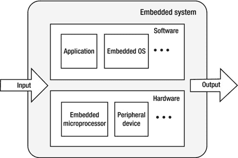

# 一、面向英特尔架构的嵌入式应用开发概述

嵌入式系统是计算机技术的一个新兴领域，它结合了多种技术，如计算机、半导体、微电子和互联网，因此在我们的现代世界中得到越来越多的应用。随着计算机和通信技术的快速发展以及互联网的日益普及，嵌入式系统在后 PC 时代获得了巨大成功和广泛应用，尤其是作为物联网的核心组成部分。它们渗透到现代生活的每一个角落，从日常生活，如自动家庭恒温器，到工业生产，如制造业中的机器人自动化。从移动电话、MP3 播放器和 PDA 到汽车、飞机和导弹，嵌入式系统可以在军事和国防、医疗保健、科学、教育和商业服务中找到。

本章提供了嵌入式系统的概念、结构和其他基本信息，为嵌入式应用开发奠定了理论基础，其中 Android 操作系统的应用开发成为开发人员的最大兴趣。

## 嵌入式系统简介

自 1946 年第一台计算机 ENIAC 问世以来，计算机制造工艺已经从真空管、晶体管、集成电路和大规模集成电路(LSI)发展到超大规模集成电路(VLSI)，从而产生了更紧凑、更强大、更节能但更便宜(每单位计算能力)的计算机。

20 世纪 70 年代微处理器问世后，计算机使用领域发生了革命性的变化。微处理器是微型计算机的基础，个人电脑使它们变得更加便宜和实用，允许许多私人用户拥有它们。在这个阶段，计算机满足了各种各样的需求:它们足够多才多艺，能够满足各种各样的需求，例如计算、娱乐、信息共享和办公自动化。随着微型计算机的采用，越来越多的人希望将它们嵌入到特定的系统中，以智能地控制环境。例如，微型计算机被用在工厂的机床上。它们用于通过配置外围传感器来控制信号和监控运行状态。当微型计算机被嵌入到这样的环境中时，它们就是嵌入式系统的原型。

随着技术的进步，更多的行业需要特殊的计算机系统。结果，用于特定环境的专用计算机系统和通用计算机系统的发展方向和目标产生了分歧。通用计算机系统的技术要求是快速、大规模和多样化的计算，而技术发展的目标是更快的计算速度和更大的存储容量。然而，嵌入式计算机系统的技术要求更多地是针对目标的智能控制，而技术发展的目标是与目标系统密切相关的嵌入式性能、控制和可靠性。

嵌入式计算系统以完全不同的方式发展。通过强调特定处理器的特性，他们将传统电子系统转变为现代智能电子系统。图 1-1 展示了一款嵌入式电脑处理器，英特尔凌动 N2600 处理器，2.2 × 2.2 cm，旁边是一枚硬币。

图 1-1。

Comparison of an embedded computer chip to a US penny. This chip is an Intel Atom processor

嵌入式计算机系统和通用计算机系统的出现是现代计算机技术的一个里程碑。通用计算机和嵌入式系统的对比见表 1-1 。

表 1-1。

Comparison of General-Purpose Computers and Embedded Systems

<colgroup><col> <col> <col></colgroup> 
| 项目 | 通用计算机系统 | 嵌入式系统 |
| --- | --- | --- |
| 五金器具 | 高性能硬件、大容量存储介质 | 多样化的硬件、单处理器解决方案 |
| 软件 | 大型复杂的操作系统 | 精简、可靠的实时系统 |
| 发展 | 高速、专业化的开发团队 | 广泛的发展部门 |

如今，嵌入式系统因其移动性而成为人们生活中不可或缺的一部分。如前所述，它们在现代生活中无处不在。智能手机是嵌入式系统的一个很好的例子。

### 移动电话

移动设备，尤其是智能手机，是近年来增长最快的嵌入式领域。手机软件开发衍生出了很多新名词，比如泛嵌入式开发、移动开发等。手机不仅无处不在，而且功能强大，价格实惠，应用多样化。除了基本的电话功能，它们还包括但不限于集成 PDA、数码相机、游戏控制台、音乐播放器和可穿戴设备。

### 消费电子和信息设备

消费电子和信息家电是嵌入式系统的附加大应用领域。属于这一类别的设备包括个人移动设备和家庭/娱乐/视听设备。

个人移动设备通常包括 PDA 等智能手机，以及移动互联网设备(mid)等无线互联网接入设备。理论上，智能手机也属于这一类；但由于它们数量庞大，因此被列为一个部门。

家庭/娱乐/视听设备主要包括类似互动电视的网络电视；数字成像设备，例如数码相机、数码相框和视频播放器；数字音频和视频设备，例如 MP3 播放器和其他便携式音频播放器；以及诸如手持游戏控制台、PS2 控制台等电子娱乐设备。平板电脑(tablets)是一种新型嵌入式设备，自苹果公司 2010 年发布 iPad 以来，已经成为消费者的最爱。

消费电子的可负担性真正体现了嵌入式系统设计的性价比。

## 嵌入式系统的定义

到目前为止，通过给出的例子，您已经对嵌入式系统有了大致的了解。但是什么是嵌入式系统呢？目前，业界对嵌入式系统有不同的概念。

根据 IET 工程技术协会的定义，嵌入式系统是用于控制、监控或辅助设备、机器或工厂运行的装置。智能手机作为嵌入式系统的重要组成部分，具有以下特点:

### 有限的资源

大多数嵌入式系统的资源极其有限。一方面，这里所指的资源是硬件资源，包括 CPU 的计算速度和处理能力、可用物理存储器的大小以及存储代码和数据的 ROM 或闪存的容量。另一方面，资源也是软件提供的功能。与通用操作系统相比，嵌入式操作系统具有相对简单的功能和结构。嵌入式系统的资源限制导致设计不够充分，而不是功能强大。

### 实时性能

嵌入式系统的实时性意味着任务通常必须在某个可预测的时间内执行，并且必须确保最大执行时间限制。

实时分为软实时和硬实时。软实时具有不太严格的要求；即使在某些情况下无法满足时间限制，也不会对系统造成致命影响。例如，媒体播放器系统是软实时的。系统应该在一秒钟内播放 24 帧，但是当系统在一些过载情况下出现故障时，这也是可以接受的。硬实时有严格的要求。在所有情况下，必须绝对确保任务的执行；否则后果将是灾难性的。例如，飞机自动驾驶仪和导航系统是硬实时系统。他们必须在一定的时限内完成特定的任务；否则可能会发生重大事故、碰撞或撞车。

许多嵌入式系统(手机、游戏机等等)不需要实时保证。但是实时性是一些嵌入式系统的关键，例如大型钢厂的轧钢系统和大型变电站的实时报警系统。在这些应用中，系统必须在给定时间对特定信号做出响应。

### 稳健性

一些嵌入式系统要求高可靠性。可靠性也称为稳健性，即在异常或危险情况下持续运行的能力。例如，当嵌入式系统遇到输入错误、网络过载或故意攻击时，系统必须足够健壮，不会挂起或崩溃，而是照常运行。

### 集成硬件和软件

通用计算机动态安装软件。该软件可以根据用户的需求进行安装和卸载。但是对于嵌入式系统来说，软件和硬件通常被集成在一起，打包出售。对于总是通过互联网连接的设备，如智能手机和物联网(例如可穿戴设备)，这一趋势正在发生变化。在这些情况下，原始设备制造商(ODM)可以定期进行软件更新。

嵌入式软件通常内置于硬件 ROM 中，并在系统启动时自动运行。在正常情况下，如果没有特殊工具的帮助，用户不能轻易修改或删除软件，以确保嵌入式系统的完整性。由于硬件和软件的集成，嵌入式系统通常没有一般计算机系统必须解决的知识产权问题。例如，由于软件的安装方式，在手机和数码相机等消费电子产品上进行软件盗版几乎是不可能的。但是，这一特性也导致系统软件升级缓慢，因为很难做到。

### 功率限制

通用计算机通常直接连接到交流电源。因此，通用计算机硬件和软件设计者可以假设电源是取之不尽的。但是对于不能直接连接到交流电源的嵌入式系统，例如手机、电动玩具和相机，唯一的电源是电池。这意味着它们的功耗受到限制，因此能效非常重要。冷却是另一个关键因素。一般来说，在特定时间段内更多的功耗会导致产生更多的热量，这在某些情况下会导致问题，例如电池着火、由于过热导致的组件故障以及电力的快速损失。

### 开发调试困难

相对于通用计算机的软硬件开发，嵌入式系统开发具有更高的技术要求。例如，嵌入式软件的开发者在开发阶段通常必须理解硬件和硬件层的工作原理和机制。为了调试代码，这些开发人员通常必须使用在线模拟、ROM 监视器和 ROM 编程工具，这些在桌面开发中是不会出现的。

## 嵌入式系统的典型架构

图 1-2 显示了一个典型的嵌入式系统的配置图，由两个主要部分组成:嵌入式硬件和嵌入式软件。嵌入式硬件主要包括处理器、内存、总线、外围设备、I/O 端口和各种控制器。嵌入式软件通常包含嵌入式操作系统和各种应用。

图 1-2。

Basic architecture of an embedded system

输入和输出是任何开放系统的特征，嵌入式系统也不例外。在嵌入式系统中，硬件和软件经常协作处理来自外部的各种输入信号，并通过某种形式输出处理结果。输入信号可以是人体工程学设备(如键盘、鼠标或触摸屏)或另一个嵌入式系统中传感器电路的输出。输出可以是声音、光、电或其他模拟信号的形式，或者是数据库的记录或文件。

### 典型硬件架构

基本的计算机系统组件——微处理器、内存和输入输出模块——通过系统总线相互连接，以便所有部件进行通信和执行程序(见图 1-3 )。

图 1-3。

Computer architecture

在嵌入式系统中，微处理器的角色和功能通常与通用计算机中 CPU 的角色和功能相同:控制计算机操作、执行指令和处理数据。在许多情况下，嵌入式系统中的微处理器也称为 CPU。内存用于存储指令和数据。I/O 模块负责处理器、内存和外部设备之间的数据交换。外部设备包括辅助存储设备(如闪存和硬盘)、通信设备和终端设备。系统总线为处理器、内存和 I/O 模块提供数据并控制信号通信和传输。

基本上有两种类型的架构适用于嵌入式系统:冯诺依曼架构和哈佛架构。

#### 冯·诺依曼建筑

冯·诺依曼建筑(也称为普林斯顿建筑)是由约翰·冯·诺依曼首先提出的。这种架构最重要的特点就是软件和数据使用同一个内存:即“程序是数据，数据是程序”(如图 1-4 )。

图 1-4。

Von Neumann architecture

在冯·诺依曼体系结构中，指令和数据共享同一总线。在这种体系结构中，信息的传输成为计算机性能的瓶颈，影响数据处理的速度；因此，它通常被称为冯·诺依曼瓶颈。实际上，缓存和分支预测技术可以有效地解决这个问题。

#### 哈佛建筑

哈佛建筑最初是以哈佛 Mark I 计算机命名的。与冯诺依曼架构相比，哈佛架构处理器有两个突出的特点。首先，指令和数据存储在两个独立的内存模块中；指令和数据不能在同一个模块中共存。第二，两条独立的总线被用作 CPU 和存储器之间的专用通信路径；两辆公共汽车之间没有联系。哈佛架构如图 1-5 所示。

图 1-5。

Harvard architecture

由于 Harvard 架构具有独立的程序存储器和数据存储器，因此可以提供更大的数据存储器带宽，是数字信号处理的理想选择。大多数为数字信号处理(DSP)设计的系统都采用哈佛架构。冯诺依曼架构具有简单的硬件设计和灵活的程序和数据存储，通常是通用和大多数嵌入式系统的选择。

为了有效地执行存储器读/写，处理器不直接连接到主存储器，而是连接到高速缓存。通常，哈佛架构和冯诺依曼架构之间的唯一区别是单或双 L1 高速缓存。在哈佛架构中，L1 缓存通常分为指令缓存(I 缓存)和数据缓存(D 缓存)，但冯诺依曼架构只有一个缓存。

### 嵌入式系统的微处理器体系结构

微处理器是嵌入式系统的核心。通过将微处理器安装到特殊的电路板上，并添加必要的外围电路和扩展电路，可以创建一个实用的嵌入式系统。微处理器结构决定指令、支持外围电路和扩展电路。微处理器种类繁多:4 位、8 位、16 位、32 位和 64 位，性能从 MHz 到 GHz，从几个引脚到几千个引脚不等。

一般来说，有两种类型的嵌入式微处理器体系结构:精简指令集计算机(RISC)和复杂指令集计算机(CISC)。RISC 处理器使用一个小的、有限的、简单的指令集。每条指令使用标准字长，执行时间短，有利于指令流水线的优化。为了补偿命令功能，CPU 通常配备大量通用寄存器。CISC 处理器具有强大的指令集和不同的指令长度，这有利于指令的流水线执行。RISC 和 CISC 的比较在表 1-2 中给出。

表 1-2。

Comparison of RISC and CISC

<colgroup><col> <col> <col></colgroup> 
|   | 精简指令集计算 | 复杂指令集电脑(complex instruction set computer) |
| --- | --- | --- |
| 指令系统 | 简单高效的指令。通过组合指令实现不常见的功能。 | 丰富的指令系统。通过特殊指令执行特定功能；高效处理特殊任务。 |
| 存储瀑作 | 限制存储器操作并简化控制功能。 | 具有多个存储器操作指令并执行直接操作。 |
| 程序 | 汇编程序需要大量的内存空间，并且具有特殊功能的复杂程序。 | 具有相对简单的汇编器，并具有对科学计算和复杂运算进行简单有效编程的特点。 |
| 中断 | 只在指令执行的适当位置响应中断。 | 仅在执行结束时响应中断。 |
| 中央处理器 | 单元电路少，体积小，功耗低。 | 电路单元功能丰富，功能强大，面积大，功耗高。 |
| 设计周期 | 特点是结构简单，布局紧凑，设计周期短，易于应用新技术。 | 结构复杂，设计周期长。 |
| 使用 | 特点是结构简单，指令规则，控制简单，易学易用。 | 特点是结构复杂，功能强大，特殊功能容易实现。 |
| 适用范围 | 确定每个特定区域的指令系统，这更适用于特殊机器。 | 变得更适合通用机器。 |

RISC 和 CISC 有不同的特点和优势，但在微处理器领域，RISC 和 CISC 之间的界限开始模糊。许多传统的 CISC 吸收了 RISC 的优点，并使用类似 RISC 的设计。英特尔 x86 处理器就是其中的典型。它们被认为是 CISC 建筑。这些处理器通过解码器将 x86 指令翻译成类似 RISC 的指令，并遵守 RISC 设计和操作，以获得 RISC 架构的好处并提高内部操作效率。处理器的内部指令执行称为微操作，表示为微操作，缩写为μ-op(或写为μ-OP 或μop)。相比之下，x86 指令被称为宏操作(macro-op)，整个机制如图 1-6 所示。

图 1-6。

Micro and macro operations of an Intel processor

通常情况下，一个宏操作可以被解码成一个或多个微操作来执行，但有时解码器可以将几个宏操作组合起来生成一个微操作来执行。这个过程被称为 x86 指令融合(宏操作融合)。例如，处理器可以组合 x86 CMP(比较)指令和 x86 JMP(跳转)指令来产生单个微操作——比较和跳转指令。这种组合有明显的好处:指令更少，间接增强了处理器执行的性能。这种融合使得处理器能够最大化指令之间的并行性，从而提高处理器的执行效率。

目前，大多数嵌入式系统中使用的微处理器有五种体系结构:RISC、CISC、MIPS、PowerPC 和 SuperH。细节如下。

#### RISC:高级 RISC 机器(ARM)架构

高级 RISC 机器(ARM)是一种 RISC 微处理器的通称。ARM 由英国公司 ARM Holdings 设计。该公司专门从事 RISC 芯片的设计和开发。作为知识产权的供应商，该公司本身并不制造其芯片，而是将其设计许可给其他合作伙伴生产。世界各大半导体厂商购买 ARM 设计的 ARM 微处理器内核，根据不同的应用领域添加合适的外部电路，打造自己的 ARM 微处理器芯片。

#### CISC: x86 体系结构

x86 系列 CPU 是台式机中最受欢迎的 CPU。x86 架构被认为是 CISC。该指令集是英特尔为其第一个 16 位 CPU (i8086)专门开发的，IBM 在 1981 年推出世界上第一台 PC 时采用了该指令集。随着英特尔推出 i80286、i80386、i80486、奔腾和其他产品，它继续使用 x86 指令集来确保传统应用可以运行，并保护和集成多样化的软件资源。因此，这些 CPU 被称为 x86 架构。

除了 Intel 之外，AMD、Cyrix 和其他制造商也生产了基于 x86 指令集的 CPU。那些 CPU 可以运行各种针对 Intel 处理器开发的软件，所以在业界被称为 x86 兼容产品，属于 x86 架构。英特尔专门推出了面向嵌入式系统的英特尔凌动 x86 32 位处理器。第二章描述并展示代号为 Bay Trail 的 64 位英特尔凌动处理器的优势。

Note

IA-32、IA-64、英特尔 64、IA-32、IA-64 和英特尔 64 是英特尔的架构类型，适用于其处理器以及兼容的 CPU。

IA-32(英特尔架构-32)是指英特尔的 32 位架构处理器。数字 32 是处理器的工作宽度；它一次可以处理 32 位二进制数据。如果其他处理器(例如，AMD 32 位 CPU)与此架构兼容，则它们属于 IA-32 架构。

IA-64(英特尔架构-64)是英特尔的 64 位架构。凭借 64 位的工作宽度，其微架构与 x86 架构完全不同。IA-64 与 x86 软件不兼容，因此 x86 软件必须使用各种形式的仿真才能在 IA-64 上运行，这往往导致效率低下。该架构由惠普创建，由惠普和英特尔共同开发。英特尔安腾是典型的 IA-64 处理器。

Intel64 是一种 64 位 x86 架构，工作宽度为 64 位。在 AMD 推出之后，英特尔推出了一款名为 EM64T 的兼容处理器，正式更名为 Intel64。几乎所有的英特尔 CPU 现在都是英特尔 64:至强、酷睿、赛扬、奔腾和凌动。与 IA-64 架构相反，它也可以运行 x86 指令。

#### MIPS 架构

没有互锁管道级(MIPS)的微处理器也是 RISC 处理器。其机制是充分利用软件来避免管道中的数据问题。它最初是由斯坦福大学的约翰·汉尼斯教授领导的研究小组在 20 世纪 80 年代初开发的，后来由 MIPS Technologies 公司商业化。

与 ARM 一样，MIPS Technologies 通过智能产权(IP)内核向半导体公司提供 MIPS 微处理器内核，并允许他们进一步开发 RISC 架构中的嵌入式微处理器。核心技术是多发布能力:将处理器中的闲置处理单元拆分出来，虚拟化为另一个核心，提高处理单元的利用率。

#### PowerPC 体系结构

PowerPC 是 RISC 体系结构中的 CPU。它来源于 POWER 架构，其基本设计来自于 IBM PowerPC 601 微处理器性能优化增强的 RISC (POWER)。20 世纪 90 年代，IBM、苹果和摩托罗拉成功开发了 PowerPC 芯片，并创造了基于 PowerPC 的多处理器计算机。PowerPC 体系结构具有可伸缩性、便利性、灵活性和开放性:它定义了指令集体系结构(ISA)，允许任何人设计和制造 PowerPC 兼容的处理器，并自由使用为 PowerPC 开发的软件模块的源代码。PowerPC 具有从移动电话到游戏控制台的广泛应用，广泛应用于通信和网络领域，如交换机、路由器等。苹果 Mac 系列使用 PowerPC 处理器长达十年，直到苹果改用 x86 架构。

#### 超级

SuperH (SH)是一款性价比极高的紧凑型嵌入式 RISC 处理器。SH 架构最早由日立开发，归日立和 st 微电子所有。现在已经被瑞萨接手了。SuperH 包括 SH-1、SH-2、SH-DSP、SH-3、SH-3-DSP、SH-4、SH-5 和 SH-X 系列，广泛用于打印机、传真机、多媒体终端、电视游戏机、机顶盒、CD-ROM、家用电器和其他嵌入式系统。

#### 嵌入式系统的典型结构

嵌入式系统的典型硬件结构如图 1-7 所示。微处理器是系统的中心，有存储设备、输入输出外设、电源、人机交互设备和其他必要的支持设施。在实际的嵌入式系统中，硬件通常是为应用量身定制的。为了节省成本，外围设备可以非常紧凑，并且只保留基本的外围电路用于处理器和应用。

图 1-7。

Typical hardware structure of an embedded system

随着集成电路设计和制造技术的发展，集成电路设计已经从晶体管集成，到逻辑门集成，再到现在的 IP 集成或片上系统(SoC)。SoC 设计技术将流行的电路模块集成在单个芯片上。SoC 通常包含大量外围功能模块，如微处理器/微控制器、存储器、USB 控制器、通用异步收发器(UART)控制器、A/D 和 D/A 转换、I2C 和串行外设接口(SPI)。图 1-8 是基于 SoC 的嵌入式系统硬件结构示例。

图 1-8。

Example of an SoC-based hardware system structure

可编程芯片上系统(SoPC)提倡用可编程逻辑技术将电子系统集成到硅芯片上。因此，SoPC 是一种特殊类型的 SoC，因为整个系统的主要逻辑功能是由单个芯片实现的。因为它是一个可编程系统，它的功能可以通过软件改变。可以说，SoPC 结合了 SoC、可编程逻辑器件(PLD)和现场可编程门阵列(FPGA)的优点。

嵌入式系统硬件的发展方向之一是以 SoC/SoPC 为中心，通过最少的外部元件和连接器构建一个硬件应用系统，以满足应用的功能需求。

### 典型软件架构

像嵌入式硬件一样，嵌入式软件架构高度灵活。简单的嵌入式软件(如电子玩具、计算器等)可能只有几千行代码，执行简单的输入和输出功能。另一方面，复杂的嵌入式系统(如智能手机、机器人等)需要更复杂的软件架构，类似于台式电脑和服务器。简单的嵌入式软件适用于低性能的芯片硬件，功能非常有限，需要繁琐的二次开发。复杂的嵌入式系统提供更强大的功能，需要为用户提供更方便的界面，需要更强大的硬件支持。随着硬件集成和处理能力的提高，硬件瓶颈已经逐渐松动甚至被打破，所以嵌入式系统软件现在趋于功能齐全和多样化。典型的、完整的嵌入式系统软件具有如图 1-9 所示的架构。

图 1-9。

Software architecture of an embedded system

嵌入式软件系统自下而上由四层组成:

1.  硬件抽象层
2.  操作系统层
3.  系统服务层
4.  应用层

#### 硬件抽象层

硬件抽象层是嵌入式系统硬件和操作系统之间的软件抽象层，是操作系统的一部分。一般来说，HAL 包括引导程序、板支持包(BSP)、设备驱动程序和其他组件。类似于个人电脑中的 BIOS，引导装载程序是在操作系统内核执行之前运行的程序。它完成硬件的初始化，建立存储空间的映像，从而使硬件和软件环境达到一个合适的状态，以便最终调度系统内核。从最终用户的角度来看，引导加载程序用于加载操作系统。BSP 实现了硬件操作的抽象，使操作系统能够独立于硬件，并使操作系统能够在不同的硬件架构上运行。

必须为每个操作系统创建唯一的 BSP。例如，Wind River VxWorks BSP 和 Microsoft Windows CE BSP 对于嵌入式硬件开发板来说具有类似的功能，但它们具有完全不同的架构和接口。在讨论各种桌面 Windows 或 Linux 操作系统时，很少提到 BSP 的概念，因为所有的 PC 都采用统一的 Intel 架构；操作系统可以轻松地移植到各种基于英特尔架构的设备上，无需任何更改。BSP 是嵌入式系统中一个独特的软件模块。此外，设备驱动程序使操作系统能够屏蔽硬件组件和外围设备之间的差异，并为操作硬件提供统一的软件接口。

#### 操作系统层

OS 是用于统一管理硬件资源的软件系统。它抽象出许多硬件功能，并以服务的形式提供给应用。调度、文件同步和联网是操作系统提供的最常见的服务。操作系统广泛应用于大多数桌面和嵌入式系统。在嵌入式系统中，操作系统有其独特的特征:稳定性、定制性、模块化和实时处理。

常见的嵌入式 OS 有嵌入式 Linux，Windows CE，VxWorks，MeeGo，Tizen，Android，Ubuntu，以及一些特定领域使用的操作系统。嵌入式 Linux 是为移动和嵌入式产品量身定制和修改的通用 Linux 内核。Windows CE 是微软为各种嵌入式系统和产品推出的可定制嵌入式操作系统。来自 Wind River 的嵌入式实时操作系统(RTOS)VxWorks 支持 PowerPC、68K、CPU32、SPARC、I960、x86、ARM 和 MIPS。它具有出色的实时性和可靠性，广泛应用于通信、军事、航天、航空和其他需要高度复杂的实时技术的领域。尤其是 VxWorks 被 NASA 用在火星探测器上。

#### 系统服务层

系统服务层是操作系统提供给应用的服务接口。使用这个接口，应用可以访问操作系统提供的各种服务。在某种程度上，它起到了连接操作系统和应用的作用。这一层通常包括文件系统、图形用户界面(GUI)、任务管理器等等。GUI 库为应用提供了各种 GUI 编程接口，这使得应用能够通过应用窗口、菜单、对话框和其他图形形式而不是命令行与用户进行交互。

#### 应用层

应用位于软件层次结构的顶层，实现系统功能和业务逻辑。从功能角度来看，应用中所有级别的模块都旨在执行系统功能。从系统的角度来看，每个应用都是一个独立的操作系统进程。通常，应用在低特权处理器模式下运行，并使用操作系统提供的 API 系统调度与操作系统进行交互。

## 嵌入式应用开发的特殊困难

正如本章前面提到的，嵌入式系统通常是资源受限的、实时的和健壮的。这些特点使得在嵌入式系统上开发应用比在通用计算机上开发更困难。

嵌入式系统的资源受限特性意味着它们比通用系统拥有更少的资源、更低的 CPU 运行速度和处理能力以及更少的 RAM。嵌入式系统将代码和数据存储在 ROM 或闪存中，而不是硬盘上，容量比硬盘小。与通用计算机相比，大多数专用嵌入式系统，尤其是嵌入式操作系统，也具有非常简单的功能。这些资源限制要求嵌入式硬件开发人员为芯片和外设选择更合理的配置。他们必须比开发桌面环境时更仔细地考虑资源利用。

嵌入式交互对应用开发提出了特殊的要求。一般桌面计算机使用 GUI 窗口、图标、菜单和指针(WIMP)，包括常见的交互元素，如按钮、工具栏和对话框。WIMP 对交互硬件要求严格；例如，它要求显示器具有一定的分辨率和尺寸，鼠标或类似设备必须支持指点操作。然而，许多嵌入式系统的交互硬件并不符合 WIMP 的要求。例如，MP3 播放器的显示屏太小，分辨率不够；ABS 没有显示屏；而且大多数嵌入式系统都没有鼠标或者触摸屏来完成指点操作(比如基本的手机都没有触摸屏)。因为嵌入式应用的交互非常特殊，我们不能完全采用 WIMP 接口。

嵌入式系统特殊的用户体验和可靠性特征增加了应用开发的难度。例如，用户期望嵌入式系统的启动时间比通用计算机短得多。与通用计算机系统相比，嵌入式系统也更难保证可靠性。当任务出现问题时，嵌入式系统没有任务管理器、Kill 命令或类似的工具来终止出错的进程。显然，嵌入式系统对错误的容忍度低于一般系统。

嵌入式系统一般不支持本机代码开发。通用计算机上的软件开发通常有原生开发、编译和运行。它不适合嵌入式系统，因为它们没有足够的资源来运行开发和调试工具。所以嵌入式系统软件通常采用交叉编译开发，在另一个硬件平台上生成执行代码。

交叉编译开发环境构建在主机上，而嵌入式系统被称为目标机器。主机上的交叉编译、汇编和链接工具创建可执行的二进制代码，这些代码在主机上是不可执行的:只能在目标机器上执行。可执行文件被下载到目标机器。主机上的开发环境并不完全反映目标机器上的环境，因此对目标机器的调试和故障诊断可能很耗时。嵌入式系统的非本地开发模型给应用开发带来了一定的挑战。

## 摘要

本章讨论了嵌入式系统的原理、SoC 的架构以及 ARM 和 x86/x64 等平台的优缺点。个人电脑的应用开发者经常忽略硬件，而完全专注于他们的软件，因为这两个实体是相当独立的。然而，开发者不能忽视嵌入式系统硬件。由于 SoC 的独特功能、有限的资源以及硬件和软件的集成，开发人员需要了解硬件和硬件层的工作原理和机制，以便为 SoC 设计高效的应用(例如，ARM 和 x86 具有不同的硬件)。下一章将详细讨论英特尔嵌入式硬件平台，包括英特尔凌动处理器、英特尔嵌入式芯片组、SoC 和参考平台。

 Open Access This chapter is licensed under the terms of the Creative Commons Attribution-NonCommercial-NoDerivatives 4.0 International License ( [ http://​creativecommons.​org/​licenses/​by-nc-nd/​4.​0/​ ](http://creativecommons.org/licenses/by-nc-nd/4.0/) ), which permits any noncommercial use, sharing, distribution and reproduction in any medium or format, as long as you give appropriate credit to the original author(s) and the source, provide a link to the Creative Commons licence and indicate if you modified the licensed material. You do not have permission under this licence to share adapted material derived from this chapter or parts of it. The images or other third party material in this chapter are included in the chapter’s Creative Commons licence, unless indicated otherwise in a credit line to the material. If material is not included in the chapter’s Creative Commons licence and your intended use is not permitted by statutory regulation or exceeds the permitted use, you will need to obtain permission directly from the copyright holder.