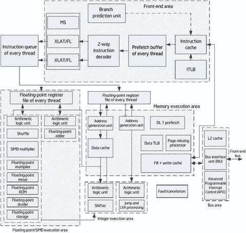
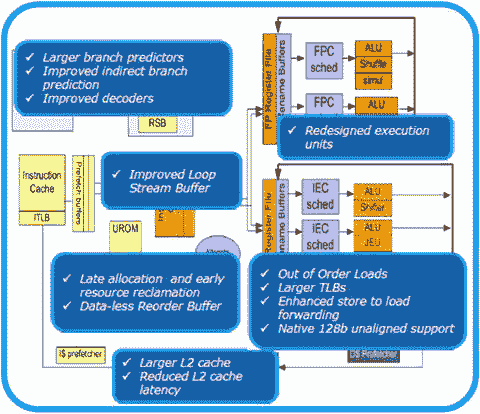
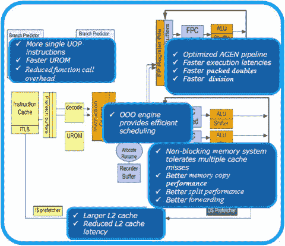
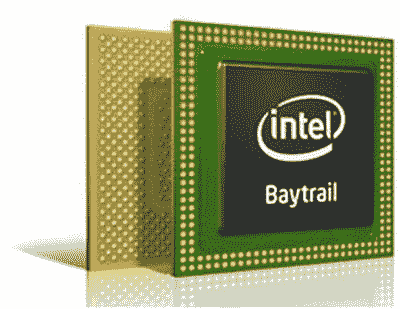
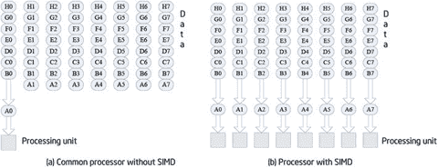
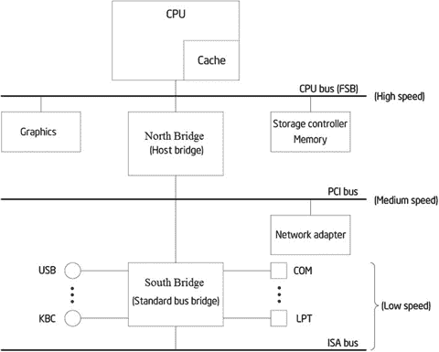
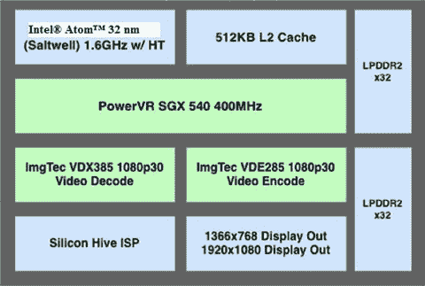
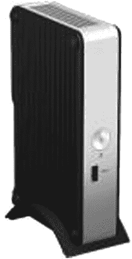
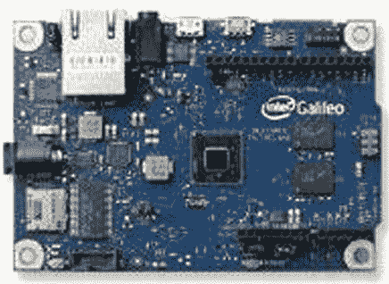

# 二、英特尔嵌入式硬件平台

Keywords Embed System Trust Platform Module Arithmetic Logic Unit Stream SIMD Extension Intel Atom

通用计算机上的应用开发人员通常可以忽略硬件，而完全专注于他们的软件，因为这两个实体已经变得相当独立。然而，开发者不能忽视嵌入式系统硬件。由于嵌入式系统的特殊功能、有限的资源以及硬件和软件的集成，您需要了解硬件和硬件层的工作原理和机制，以便为嵌入式环境设计高效的应用。

作为芯片创新的全球领导者，英特尔一直在为通用计算机和嵌入式系统设计高性能处理器和相关硬件。本章重点介绍面向嵌入式系统的英特尔技术，为后续应用开发铺平道路。

## 英特尔凌动处理器

从 2008 年开始，英特尔专门为嵌入式和移动设备设计了英特尔凌动处理器。作为最小和最低功耗的处理器，它使用全新的嵌入式设备微架构来降低功耗，同时保持与英特尔酷睿 2 处理器的指令集兼容性。

英特尔凌动处理器是当前基于英特尔的嵌入式系统架构。它与英特尔架构指令软件兼容。与面向台式机系统的英特尔处理器相比，其尺寸、功耗和其他特性更适合嵌入式应用。

当今一代英特尔凌动处理器可提供高能效性能，为一系列计算设备提供动力。轻薄的智能手机和平板电脑。智能汽车。创新的医疗保健设备。智能城市基础设施监控。面向云的高性能微服务器。这些只是英特尔凌动处理器创新以超低功耗推动更高性能的部分方式——连接人们、丰富生活、推动物联网。

英特尔凌动处理器 E3800 产品家族(前身为 Bay Trail)提供了一系列多核片上系统(SoC)选项。基于业界领先的 22 纳米制程技术，这些 SOC 将英特尔架构内核、图形、内存和 I/O 接口集成到一个单芯片解决方案中，可提供出色的计算、图形和媒体性能。

### 英特尔凌动处理器架构

在英特尔凌动 Clover Trail 平台之前，英特尔凌动处理器基于一个代号为 Saltwell 的微架构，该架构应用了两个发布宽度和有序流水线；它还支持英特尔超线程技术。微架构如图 2-1 所示。

图 2-1。

Intel Atom architecture

前端区域是优化的管道，包括

*   32 KB，8 路组关联，一级高速缓存
*   分支预测单元和即时翻译后备缓冲器(ITLB)
*   两个指令解码器，每个解码器每个周期最多解码两条指令

在每个周期内，前端最多可以向指令队列发送两条指令进行调度。同样，在每个周期中，调度器最多可以通过双向端口向整数或 SIMD/浮点执行区发送两条指令。(单指令，多数据[SIMD])将在下一节介绍。)

整数或 SIMD/浮点区域的端口具有以下绑定功能:

整数执行区

1.  端口 0:算术逻辑单元 0 (ALU0)、移位/旋转单元和加载/存储单元。
2.  端口 1:算术逻辑单元 1、位处理单元、跳转单元和 LEA。
3.  循环 0 中“装载使用”的有效等待时间。

SIMD/浮点执行区

1.  端口 0: SIMD 算术逻辑单元、混洗单元、SIMD/浮点乘法单元和除法单元。
2.  端口 1: SIMD 算术逻辑单元和浮点加法器。
3.  在 wide 浮点执行区，SIMD 算术逻辑单元和洗牌单元是 128 位宽，但 64 位整数 SIMD 计算仅限于端口 0。
4.  浮点加法器可以在 128 位数据路径中执行加法压缩单精度(ADDPS)/减法压缩单精度(SUBPS)，而其他浮点加法运算在 64 位数据路径中执行。
5.  浮点/SIMD 运算的安全指令识别算法可以直接执行新的、更短的整数算术指令，而无需等待旧的浮点/SIMD 指令(这可能会导致一些异常)。
6.  浮点乘法流水线也支持存储负载。
7.  具有加载/存储引用的浮点加法指令通过两个端口分配。

指令队列执行静态分区，以便调度来自两个线程的执行指令。调度器可以从两个线程中选择一条指令，并将它们分配给端口 0 或端口 1 执行。硬件在两个线程上选择预取/解码/分派，并根据每个线程的准备情况执行下一次执行。

#### Silvermont:下一代微体系结构

英特尔的 Silvermont 微体系结构采用 3D 三栅极晶体管设计，并与英特尔的 22 纳米 SoC 工艺共同优化。通过利用这一行业领先的技术，Silvermont 微体系结构包括

*   一个新的无序执行引擎，可实现同类最佳的单线程性能。
*   一种全新的多核和系统结构体系结构，可扩展至多达八个内核，可实现更高的性能、更低的延迟和更高效的无序支持，从而使系统更加平衡，响应速度更快。
*   新的英特尔架构指令和技术带来增强的性能、虚拟化和安全管理能力，以支持广泛的产品。这些指令基于英特尔现有的 64 位支持和英特尔架构软件安装基础的广度。
*   增强的电源管理功能，包括新的智能突发技术、低功耗 C 状态和利用英特尔 3D 晶体管的更宽动态工作范围。英特尔突发技术 2.0 支持单核和多核，可提供出色的响应能力，并可提高能效。

微架构如图 2-2 所示。

 

图 2-2。

Silvermont microarchitecture

Silvermont 提供了以下优势和功能:

*   高性能而不牺牲能效:无序执行流水线、改进了指令延迟和吞吐量的宏操作执行流水线，以及智能流水线资源管理
*   功率和性能:高效的分支处理、精确的分支预测器和快速恢复流水线
*   更快、更高效地访问内存:低延迟、高带宽高速缓存、无序内存事务以及多个高级硬件预取器、平衡内核和内存子系统

### 英特尔凌动处理器的特性

如本节所述，英特尔凌动处理器具备面向移动互联网设备(MID)、上网本、上网机和嵌入式系统的特性。

#### 小外形尺寸

最新的英特尔凌动处理器 Z3740(代号 Bay Trail)封装尺寸仅为 17 mm × 17 mm，是一款多核 SoC，将下一代英特尔处理器内核、显卡、内存和 I/O 接口集成到一个解决方案中。它也是英特尔首款基于 22 纳米处理器技术的 SoC(见图 2-3 )。

图 2-3。

Intel Atom processor Z3xxx Series

#### 低功耗

如前所述，嵌入式系统的功耗有限。英特尔凌动处理器采用节能技术，如增强型英特尔 SpeedStep 技术(EIST)、 1 低热设计功耗、动态高速缓存调整和深度睡眠。采用英特尔凌动处理器的设备散热非常有限，远低于常见的“全功率”设备。

需要注意的是，不同的英特尔凌动处理器系列具有不同的低功耗处理策略。例如，N 系列不支持 EIST，也不在待机状态下进行自动降频。

#### 面向移动和嵌入式设备的动态低压技术

许多移动和嵌入式系统由电池供电；因此，电压不具有交流电源系统的稳定性，交流电源系统的电压保持在一定范围内。英特尔凌动处理器还采用了动态调整每个处理器活动状态的工作电压的技术，并支持面向移动和嵌入式系统的英特尔移动电压定位(IMVP)-6 标准。

#### 高性能

英特尔凌动处理器是一款嵌入式微处理器，能够提供传统通用处理器的性能，并提供类似于英特尔奔腾 4 处理器的性能。高性能主要体现在以下几个方面:

*   四核支持四核/四线程乱序处理和 2mb L2 缓存，通过允许多个应用和服务同时运行，使设备运行更快，响应更灵敏。
*   英特尔突发技术 2.0 允许系统在必要时挖掘额外的内核，从而使 CPU 密集型应用运行得更快、更流畅
*   使用 22 纳米处理器技术提高了性能:
    *   在导通状态下最大化电流，以获得更好的性能
    *   最大限度地减少关闭状态下的泄漏，从而提高能效
*   支持 64 位操作系统
*   支持 CPU 和 IP(显卡)之间的动态功率共享，允许更高的峰值频率
*   总 SoC 能量预算根据应用需求动态分配
*   支持细粒度的低功耗状态，这提供了更好的电源管理并延长了电池寿命
*   支持深度睡眠状态下的高速缓存保留，从而降低闲置功耗，缩短唤醒时间
*   提供超过 10 小时的有效电池寿命

##### SSE3 指令集增强了数字媒体的处理能力

CAD 工具、3D/2D 建模、视频编辑、数字音乐、数字摄影和游戏等软件应用都需要大规模浮点并行计算。它们被称为浮点密集型应用。比如视频处理经常需要两个 n 长的数据集相乘，所以常用的算术指令要运算 n 次(n 个周期)。为此，SIMD 建筑被创造出来。与传统处理器相比，SIMD 处理器有更多的算术单元，由一个控制器控制，同时在每个数据集(也称为矢量数据)中进行相同的数据操作，以实现空间并行。在图 2-4 所示的例子中，如果 CPU 使用 8 个处理单元，n /8 条 SIMD 指令就可以完成计算，运算时间缩短为原来的 1/8，速度提高了 8 倍。SIMD 的本质是从一个数据过程转移到一个数据集过程。

图 2-4。

Realization procedure of SIMD instructions

英特尔处理器中的流式 SIMD 扩展(SSE)加速了流式浮点计算，并大大提高了浮点密集型应用的性能。英特尔凌动处理器支持 SSE3 和 SSSE3(补充流式 SIMD 扩展 3；补充上证 3)。SSE 指令集的版本历史如表 2-1 所示。

表 2-1。

Development History of the SSE Instruction Set

<colgroup><col> <col> <col> <col> <col> <col> <col></colgroup> 
| 版本 | 同ＳＯＵＴＨ-ＳＯＵＴＨ-ＥＡＳＴ | SSE2 | SSE3 | SSSE3 | SSE4 | 钽电容 |
| 日期 | One thousand nine hundred and ninety-nine | Two thousand | Two thousand and four | Two thousand and six | Two thousand and seven | Two thousand and eight |
| 说明 | Seventy | One hundred and forty-four | Thirteen | Thirty-two | Forty-seven | Two hundred and fifty-six |
| 提高 | 单精度矢量流量操作 | 双精度向量 128 位向量整数 | 复数运算 | 解码 | 视频加速图形模块协处理器加速 | SSE 扩展浮点运算 |

##### 英特尔虚拟化技术(英特尔 VT)

英特尔凌动处理器支持英特尔 VT，这是一种 CPU 虚拟化技术。英特尔 VT 允许一个 CPU 模拟多个 CPU 的并行运行，让一个平台运行多个操作系统，并支持应用在独立的空间中独立运行，从而提高应用效率。

##### 英特尔超线程技术(英特尔 HT 技术)和多核技术

全新英特尔 Z3xxx 凌动处理器支持英特尔超线程技术，产生的额外功耗不到 10%。同时，N 系列采用了双核架构。英特尔超线程技术和多核技术使处理器能够并行执行两个指令线程，并提供线程级并发应用，从而在当今的多任务环境中提高性能和系统响应。英特尔凌动处理器中的英特尔超线程技术和多核技术比单线程微处理器具有更高的执行效率。

### 英特尔凌动处理器使用的其他技术

此外，英特尔凌动处理器还采用了其他一些通常不为人所知的技术，这些技术可以提高处理器的性能:

*   智能高速缓存:英特尔凌动处理器使用更智能、更高效的高速缓存和总线技术来有效支持数据共享，并提供增强的性能、响应和节能能力。
*   功耗优化的前端总线:英特尔凌动处理器支持高达 1910 MHz 的频率(E3845 ),可满足苛刻应用的需求。此外，英特尔架构指令(宏操作)融合技术允许在低功耗状态下更快地执行指令。
*   增强的数据预取技术:该技术可以有效地预测哪些数据将被具体使用，并提前自动加载到 L2 缓存中。
*   突发模式:突发模式作为增强的硬件技术，在 Z5xx 系列之后的英特尔凌动处理器中使用。它会根据系统负载自动设置处理器性能水平，而不会影响散热设计，因此用户可以按需选择处理器性能。
*   低成本:为了满足嵌入式系统的需求，英特尔凌动处理器采用了低成本的设计策略，其中之一就是应用英特尔架构的有序执行。与通用台式机处理器的无序执行相比，英特尔凌动处理器中的有序执行设计可以减少晶体管数量和制造成本，但会导致性能下降。为了弥补较低的性能，英特尔凌动处理器使用了更高的工作频率。

除了这些特性之外，与其他嵌入式处理器相比，英特尔凌动处理器还具有一些独特的优势。由于基于英特尔架构，英特尔凌动处理器拥有大量兼容的基于英特尔架构的软件应用。其中许多应用可以轻松无缝地迁移到基于英特尔凌动处理器的设备上。

总的来说，低功耗、小尺寸、低成本、低散热系数和高性能使得英特尔凌动处理器更适合嵌入式系统应用。由于采用低功耗、无铅、无卤素制造工艺，英特尔凌动处理器也非常环保。

## 英特尔嵌入式芯片组

芯片组是计算机主板的核心组件之一，它最大限度地将复杂的电路和组件集成在几个芯片内。芯片组决定了主板的功能、级别、档次。如果它不能与 CPU 一起正常工作，芯片组会严重影响整体性能，甚至会导致硬件故障。如果说 CPU 或微处理器是大脑，芯片组就是设备的神经系统。

计算机系统结构的典型示例如图 2-5 所示。CPU 通过具有高频率的 FSB 连接到主存储器 RAM、图形和其他组件。网络适配器和其他组件连接到中速总线(PCI 总线的频率比 FSB 低得多)。北桥(主机桥芯片)实现高速前端总线和中速总线的连接。COM、LPT 和 USB 等低速设备以及低速 ISA 总线通过南桥(标准总线桥芯片)连接到低速总线。

图 2-5。

Example of computer system architecture

这种结构的变体包括，例如，没有 ISA 总线的计算机。北桥和南桥集成在一些英特尔凌动系列处理器中，如后续章节所述。图 2-5 中的系统架构可以帮助你了解芯片组的主要组件及其功能。

Tip

PCI 和 ISA 两种类型的 PC 总线标准是 PCI 和 ISA。外围组件互连(PCI)是本地总线的标准，由英特尔于 1992 年推出。PCI 总线有 32 位或 64 位，速度有 33 MHz 或 66 MHz。32 位、33 MHz PCI 总线的带宽为 32/8 × 33 MHz = 132 MB/s。工业标准体系结构(ISA)基于 IBM PC 总线，是 20 世纪 80 年代初开发的总线标准。总线宽度为 8/16 位，工作频率为 8 MHz，远低于 PCI。大多数新计算机不支持 ISA 总线。

芯片组中的主要芯片及其功能如下:

*   北桥芯片:决定主板系统的 CPU 类型、时钟速度、总线频率、内存类型、最大容量、性能、显卡插槽规格(ISA/PCI/AGP 插槽)、ECC 纠错支持等等。北桥在芯片组中起主导作用，所以也被称为主机桥。
*   南桥芯片:南桥芯片提供对键盘控制器(KBC)、实时时钟控制器(RTC)、通用串行总线(USB)、Ultra DMA/33 (66) EIDE 数据传输模式、高级能源管理(ACPI)等的支持。它决定了扩展槽和扩展接口的类型和数量(如笔记本的 USB2.0/1.1、IEEE1394、串口、并口、VGA 输出接口)。南桥也被称为标准公交桥。
*   其他芯片:一些芯片组结合了 3D 加速显示(集成图形芯片)、AC'97 音频解码和其他功能，并决定了计算机系统的显示性能和音频播放性能。

最新的英特尔凌动处理器包括采用突发技术的第七代英特尔 GPU，可提供改进的图形和媒体体验。新处理器支持高达 2，560 × 1，600 的 60 Hz 高分辨率显示器，并通过 Miracast 支持英特尔无线(英特尔 WiDi)技术。媒体编码和解码的高性能、低功耗硬件加速支持无缝视频播放。

## 英特尔片上系统(SoC)

与桌面设备不同，由于体积和空间的限制，嵌入式系统中的处理器、芯片组、显卡、主板和其他组件不能独立制造、配置和组装；否则，它们会太大，消耗太多的能量，具有不切实际的复杂设计，并且具有类似于台式机的不稳定布局。因此，目前大多数嵌入式系统都采用 SoC 设计。通过在单个芯片上集成微处理器/微控制器、存储器、总线、频率发生器和 A/D 或 D/A 转换的外围功能模块，SoC 提供了小尺寸、高能效、高可靠性和简单外围电路设计的优势。英特尔已经逐步将 SoC 作为英特尔凌动处理器的发展方向。最近的设计描述如下。

### 梅菲尔德

2012 年发布的 Medfield 是英特尔首款面向智能手机的 SoC 处理器。Medfield 平台的核心是 SoC 芯片(代号 Penwell)。事实上，以前的 Moorestown 平台需要双芯片解决方案来实现相同的功能。作为一个真正的 SoC，Medfield 不同于英特尔凌动处理器的单芯片布局，但与以前的芯片组相当。因此，它变成了一个更紧凑、更节能的处理器。Medfield SoC 处理器采用层叠封装(POP)，整个芯片面积约为 12 × 12 mm，Medfield SoC 的内部架构如图 2-6 所示。

图 2-6。

Internal architecture of Penwell SoC

首款专为智能手机打造的 Medfield SoC 采用英特尔凌动处理器 Z2460。计划是在未来的 Medfield SoCs 中使用最新的英特尔凌动处理器。例如，第二个 Medfield SoC 的计划是采用英特尔凌动处理器 Z2610，并具有主流平板电脑的应用。Medfield SoC 采用 32 nm 处理器；集成了单核英特尔凌动处理器、512 KB L2 高速缓存、Imagination Technologies 的 PowerVR SGX540 GPU 和双通道 LPDDR2 内存控制器；并且支持 30 fps 1080p 视频解码。英特尔凌动处理器的最高频率被限制在 1.6 GHz。Z2460 可以将最低频率降低到 100 MHz，具有 1.3 GHz 的标准工作频率，在加速模式下仅工作在 1.6 GHz。作为第二个 Medfield SoC 内核，Z2610 保持 1.6 GHz 时钟速度运行。

英特尔凌动处理器 Z2460 在 100 MHz 时钟速度(最低频率)下功耗为 50 mW600 MHz 时钟速度时为 175 mW 在 1.3 GHz 时钟速度(标准频率)下为 500 mW 在 1.6 GHz 时钟速度(最高频率)下为 750 mW。与台式机处理器相比，Z2460 的功耗非常低。

如今，Android OS 完全支持 Medfield。英特尔与谷歌合作开发用于编译 ARM 和英特尔架构应用的软件。

### 海湾小径

Bay Trail 是基于 Silvermont 架构构建的全新英特尔多核 SoC，来自英特尔面向移动和桌面设备的强大处理器家族。Bay Trail 采用英特尔行业领先的三栅极 22 纳米工艺技术制造。

Bay Trail 是一款多核 SoC，将下一代英特尔处理器内核、显卡、内存和 I/O 接口集成到一个解决方案中。它也是英特尔首款基于 22 纳米处理器技术的 SoC。这款多核英特尔凌动处理器提供了卓越的计算能力，与前代产品相比更加节能。除了最新的英特尔架构核心技术，它还提供了广泛的平台特性，如图形、连接、安全性和传感器，使开发人员能够创建具有无限用户体验的软件。

## 基于英特尔架构的 64 位 Android 操作系统

一般来说，64 位和 32 位处理器之间没有太大的区别。但是计算密集型应用(稍后，本章将讨论在 64 位处理器上运行更快的软件工作负载)在从 32 位迁移到 64 位时可以看到显著的改进。几乎在所有情况下，64 位应用在 64 位环境中的运行速度都比 32 位应用在 64 位环境中的运行速度快，这是开发人员关心它的一个足够好的理由。利用平台功能可以提高执行大量计算的应用的速度。

### 64 位与 32 位 Android

64 位架构意味着整数寄存器和指针的宽度是 64 位。64 位操作系统的三个主要优势如下:

*   寄存器数量增加
*   扩展地址空间
*   增加的内存

不难想象在不太遥远的将来，64 位芯片的 Android 手机。因为 Android 内核是基于 Linux 内核的，而 Linux 多年来一直支持 64 位技术，所以 Android 要完全支持 64 位处理，唯一需要做的就是让 Dalvik VM 兼容 64 位。Dalvik 应用(仅用 Java 编写)无需任何更改就可以在 64 位设备上运行，因为字节码是独立于平台的。

本地应用开发人员可以充分利用底层处理器提供的功能。例如，英特尔高级矢量扩展指令集(英特尔 AVX)已经扩展到在 64 位处理器上支持 256 位指令大小。

### 内存和 CPU 寄存器大小

与 CPU 相比，内存非常慢，与 CPU 处理一条指令所需的时间相比，读取和写入内存可能需要很长时间。CPU 试图通过多层缓存来隐藏这一点，但是即使是最快的缓存层与内部 CPU 寄存器相比也很慢。更多的寄存器意味着更多的数据可以完全保存在 CPU 内部，从而减少内存访问并提高性能。

这有多大的区别取决于所讨论的特定代码，以及编译器在优化代码以充分利用可用寄存器方面的能力。当英特尔架构从 32 位迁移到 64 位时，寄存器数量翻了一番，从 8 个增加到 16 个，这极大地提高了性能。

64 位指针允许应用寻址更大的 RAM 地址空间:通常，在 32 位处理器上，程序可用的可寻址内存空间在 1 到 3 GB 之间，因为只有 4 GB 是可寻址的。即使有 1–3gb 可用，单个程序也无法使用所有可寻址的内存，除非它采用将程序分成多个进程的技术，这需要大量的编程工作。在 64 位操作系统上，这没有关系，因为可寻址的内存空间非常大。

内存映射文件越来越难以在 32 位架构上实现，因为超过 4 GB 的文件越来越常见。如此大的文件不容易被内存映射到 32 位体系结构—一次只能将文件的一部分映射到地址空间。为了访问这样的文件，映射部分必须根据需要换入和换出地址空间。这是一个问题，因为如果由操作系统正确实现，内存映射是最有效的磁盘到内存的方法之一。

64 位指针也有一个很大的缺点:大多数程序使用更多的内存，因为指针需要被存储，它们消耗两倍的内存。在 64 位 CPU 上运行的相同程序比在 32 位 CPU 上运行的程序占用更多的内存。因为指针在程序中非常常见，这可能会增加缓存大小并对性能产生影响。

寄存器数量会极大地影响应用的性能。与 CPU 上的寄存器相比，RAM 速度较慢。CPU 缓存有助于提高应用的速度，但是访问缓存会导致性能下降。

性能提升的程度取决于编译器对 64 位环境的优化程度。能够在少量内存中完成大部分处理的计算密集型应用的性能会显著提高，因为大部分应用可以存储在 CPU 寄存器中。

相比之下，未经优化的应用的计算机性能可能会下降，因为 64 位指针需要两倍的带宽。但是，在移动环境中，操作系统和安装的应用应该经过精心设计以避免这种情况。在 64 位环境中运行较慢的大型程序的一个著名例子是 Oracle JVM。

ARM 和 Intel 64 位 CPU 都有 32 位兼容模式。尽管 32 位应用可以在 64 位处理器上运行，但使用 64 位优化编译器进行编译可以让它们利用 64 位环境的架构优势。

## 英特尔嵌入式系统参考平台

所谓的英特尔嵌入式系统参考平台是一系列使用英特尔凌动处理器和 SoC 的硬件设备。这种硬件组合具有紧凑的尺寸、低功耗、高性能、低成本以及适用于图形处理和其他专业领域的出色芯片组。因此，它可以广泛应用于各种嵌入式设备，如上网本、上网本、平板电脑、手机和 mid。

### 物联网(IoT)和下一代计算单元(NUC)

物联网(IoT)和下一代计算单元(NUC)是英特尔移动处理器的最新应用领域。如图 2-7 所示，英特尔 NUC 套件 DE3815TYKHE 采用面向智能系统的英特尔凌动处理器，是面向注重价值的企业和组织的小型设备。这种低成本、低功耗的解决方案为 NUC 外形带来了许多第一次:无风扇散热解决方案，实现了极致的静音和可靠性；板载闪存存储，实现了小尺寸软件解决方案；内置屏幕的内部平板显示器连接；视频图形阵列(VGA)端口，实现了传统安装中的显示器兼容性；串行端口接头，用于需要硬件握手稳定性的外设；看门狗定时器，实现了弹性系统可用性；内部集成电路(I2C)和脉宽调制(PWM)信号，用于与传感器和其他支持物联网的嵌入式设备接口。凭借其三年的供货能力，英特尔 NUC 套件 DE3815TYKHE 将为长时间的开发和生产周期提供支持。

图 2-7。

Intel NUC Kit DE3815TYKHE

凭借其垂直工业设计以及对 Linux 和 Windows 嵌入式操作系统的支持，这款英特尔 NUC 被设计为推动瘦客户机市场发展的基本构建模块。这款 NUC 是一款内置闪存、USB3 支持和音频耳机支持的无风扇套件，非常适合在学校、呼叫中心和其他安装了大量 VGA 显示器的地方使用。

采用英特尔凌动处理器 E3815 的英特尔 NUC 套件 DE3815TYKHE 还提供了功耗、性能、经济性和软件兼容性的理想组合，以驱动轻型数字标牌、销售点和信息亭解决方案等应用。凭借内置的 4 GB 嵌入式多媒体卡(eMMC)存储，许多嵌入式应用将受益于更低的整体系统级 BOM 成本。通过内置的看门狗定时器，还可以为这些和其他无人值守解决方案启用高可用性弹性，从而防止停机。这款 NUC 为基于硬件的数据加密提供了独立的可信平台模块设备，是机密信息受到威胁的应用的必备设备。

#### 面向物联网的英特尔伽利略开发套件

如图 2-8 所示，英特尔 Galileo 开发板是采用英特尔架构的 Arduino 兼容开发板新系列中的首款产品。对于新设计师和希望将设计提升到更高水平的人来说，该平台易于使用。

图 2-8。

The Intel Galileo board

英特尔 Galileo 主板是一款基于英特尔 Quark SoC X1000 应用处理器(一款 32 位英特尔奔腾品牌的 SoC)的微控制器主板。这是首款基于英特尔架构的主板，其硬件和软件引脚与 Arduino Uno R3 的屏蔽板兼容。

该平台通过支持 Microsoft Windows、Mac OS 和 Linux 主机操作系统，简化了英特尔架构的开发。它还带来了 Arduino 集成开发环境(IDE)软件的简单性。

英特尔 Galileo 主板还与 Arduino 软件开发环境软件兼容，这使得易用性和介绍变得轻而易举。除了 Arduino 硬件和软件兼容性之外，英特尔 Galileo 主板还具有多个 PC 行业标准 I/O 端口和特性，可将本机使用和功能扩展到 Arduino shield 生态系统之外。一个全尺寸 mini-PCI Express 插槽、一个 100 Mb 以太网端口、一个 Micro-SD 插槽、一个 RS-232 串行端口、一个 USB 主机端口、一个 USB 客户端端口和 8 MB NOR 闪存是主板上的标准配置。

真正的英特尔处理器和 SoC 周围的本机 I/O 功能为制造商社区和学生提供了功能齐全的产品。对于寻求简单且经济高效的开发环境来开发基于英特尔凌动处理器和英特尔酷睿处理器的复杂设计的专业开发人员来说，它也非常有用。

### 智能手机

随着智能手机变得无处不在，客户对顶级设备的需求增加了，设计和可用性变得越来越重要。

#### Lenovo K900

如图 2-9 所示，联想 K900 是首款采用英特尔凌动处理器的大屏幕智能手机。K900 是世界上首批将 5.5 英寸 IPS 显示屏与每英寸 400+像素的 1080 像素全高清分辨率性能相结合的智能手机之一，所有这些都是在最新的触摸电容大猩猩玻璃 2 下实现的。

图 2-9。

Lenovo K900 smartphone

联想 K900 运行在英特尔凌动 Z2580 处理器上，这是一款双核芯片，运行频率高达 2.0 GHz，并利用英特尔超线程技术来提高性能效率。这款采用英特尔技术的设备还配备了运行 PowerVR SGX 544MP2 GPU 的英特尔图形媒体加速器引擎。联想为 K900 配备了大光圈 f1.8 镜头，使其成为第一款在其相机上提供如此大光圈的智能手机。结合其他规格，K900 现在是智能手机中数码相机的合法替代品。

#### Vexia 拉链手机

Vexia Zippers 手机，如图 2-10 所示，运行在 Android 4 操作系统上，由英特尔凌动处理器提供支持。它还配备了双 SIM 卡和一个 500 万像素的摄像头，因此您可以拍摄高清照片和视频。它的拉链界面使这款智能手机独一无二，你可以根据自己的生活方式进行个性化设置。

图 2-10。

Vexia Zippers phone

#### 中兴大 X2*

中兴大 X2 如图 2-11 所示，其先进的双核英特尔凌动处理器 Z2580 在 Android 操作系统上运行超线程技术，可提供即时性能。用户可以享受更快的网页加载速度、应用启动时间和内容下载时间，以及图形功能和快速响应的多任务处理。

图 2-11。

ZTE Grand X2 Smartphone

中兴新的旗舰智能手机还配备了一个 8 MP 社交智能相机，是市场上拍摄时间最短的相机之一，每秒可拍摄 24 帧，没有快门延迟。它通过实时 2x 轴稳定以及人脸和智能场景识别，在充满挑战的环境中确保高图像质量。

### 药片

平板电脑是英特尔凌动处理器的主要应用领域之一。作为一台配备平板触摸屏的完整计算机，平板电脑没有常见的键盘和鼠标输入设备，而是在触摸屏上使用手写笔、数字笔和手指输入。自 2010 年苹果发布 iPad 以来，平板电脑占据了巨大的市场份额。接下来详细介绍几款采用英特尔凌动处理器的著名平板电脑。

#### 三星 Galaxy Tab 3 10.1

如图 2-12 所示，三星 Galaxy Tab 3 10.1 由三星在 Computex 2013 上发布，并于 2013 年 7 月在美国上市。它的屏幕为 10.1 英寸，分辨率为 1280×800。Tab 3 10.1 采用了 1.6 GHz 的英特尔凌动 Z2560 双核处理器和 1 GB RAM，并配有 16 GB 的存储空间。这款平板电脑有一个 3.2 MP 的后置摄像头和一个 1.3 MP 的前置摄像头。它还有一个 SD 卡插槽。在撰写本文时，该设备运行的是 Android 4.2.2。

图 2-12。

Samsung Galaxy Tab 3 10.1

#### 戴尔 Venue 7/8 英寸平板电脑

如图 2-13 所示，戴尔 Venue 7 于 2014 年初推出，采用 7 英寸屏幕，分辨率为 1280×800。它运行在英特尔凌动 Z2560 双核处理器上，主频为 1.6 GHz，包括 2 GB RAM 和 16 GB 内部存储。该设备包括一个用于可扩展存储的 SD 卡插槽，并有一个 300 万像素的后置摄像头和一个 VGA 前置摄像头。在撰写本文时，这款平板电脑运行的是 Android 4.3。

图 2-13。

Dell Venue 7/8" Tablet

#### 钢 Iconia A1-830*

宏碁 Iconia A1-830 拥有 7.9 英寸显示屏，分辨率为 1024×768，于 2014 年初上市。它采用英特尔凌动 Z2560 双核处理器，主频为 1.6 GHz。该设备有 1 GB 的内存和 16 GB 的内部存储空间。它包括一个用于可扩展存储的 SD 卡插槽。前置摄像头 5 MP，后置摄像头 2 MP。在撰写本文时，这款平板电脑运行的是 Android 4.4.2。

#### asus memo pad fhd 10 *

如图 2-14 所示，华硕 MeMO Pad FHD 10 采用最新的英特尔凌动 Z2560 处理器(1.6 GHz)、2 GB 内存、178°宽视角、1920 × 1200 全高清 IPS 显示屏和 10 点多点触控显示屏，可提供生动的视觉效果，从而改善游戏体验。华硕 MeMO Pad FHD 10 重 580 克，薄 9.5 毫米。它有一个 microSD 扩展槽。

图 2-14。

ASUS Memo Pad

随着英特尔和谷歌的合作，每年都有越来越多采用英特尔凌动处理器的 Android 平板电脑发布。

### 车载信息娱乐系统

车载信息娱乐(IVI)系统是在汽车、卡车和飞机等交通工具中提供导航、娱乐和网络计算服务的设备。尤其是汽车制造商越来越将 IVI 系统视为其产品的一个关键区别点。司机和乘客开始期望在他们的汽车上看到他们在其他设备上看到的同样类型的创新，如移动电脑和手机。宝马、英菲尼迪、日产，当然还有其他已经宣布使用英特尔凌动处理器的平台。毫无疑问，英特尔凌动处理器将在这一充满希望的领域扮演重要角色。

### 其他应用平台和领域

除了上述领域，英特尔凌动处理器和相应的芯片还可应用于广泛的领域、平台和设备。

#### 云计算

在云计算模式中，内容和基础设施驻留在云(网络)中。云内容消费者只需要一个轻量级的瘦客户端浏览器设备就可以参与其中。云计算的本质是，如果基础设施成本分摊给足够多的人，更多的人可以参与并受益于云内容和服务。基于英特尔凌动处理器的设备价格相对较低，非常适合云计算客户。

由于采用英特尔凌动处理器的设备能够使用英特尔架构代码库，因此也将有助于扩大云内容消费者群体。第二代 64 位英特尔凌动 C2000 产品系列 SoC 专为微服务器和冷存储平台(代号为 Avoton)以及入门级网络平台(代号为 Rangeley)而设计。这些新 SoC 是该公司基于 Silvermont 微架构的首款产品，这是领先的 22 纳米三栅极 SoC 工艺中的新设计，可显著提高性能和能效。

英特尔还推出了英特尔以太网交换机 FM5224 芯片，该芯片与 Wind River 开放式网络软件套件相结合，为服务器带来软件定义网络(SDN)解决方案，以提高密度和降低功耗。

### 机器人学

机器人技术是改善生产流程、提升定制产品生产能力和确保产品质量的公认关键。机器人自动化在历史上一直非常昂贵，具有非常长期的成本效益回报和巨大的进入壁垒。幸运的是，高性能英特尔凌动处理器能够满足机器人的大部分自动化计算要求，并凭借其经济高效和低功耗特性在机器人应用领域占据领先地位。实验室测试表明，基于英特尔凌动处理器的设备在不连接的情况下电池续航时间长达 8 小时，可以轻松地为移动机器人设备供电。

威斯康辛州的 Smith Childs Farms，Inc .为机器人拖拉机配备了英特尔凌动处理器。几台这种更小、更灵活的拖拉机可以同时在一块地里工作，由坐在桌前的农民控制。他们使用 GPS 导航设备、车载传感器和一系列复杂的算法，同时对土壤进行采样，并分配所需的精确数量的种子和肥料。史密斯·查尔兹农场有限公司的老板丹尼斯·史密斯说:“在黄金种植季节，你甚至可以看到农民在夜间工作，而不用担心有没有光线，因为拖拉机上的传感器在黑暗中也能‘看’得很清楚。”

#### 无线传感器网络

英特尔凌动处理器用于创建智能无线传感器网络，这是嵌入式系统的一个主要应用领域。

英特尔在其亚利桑那州钱德勒的工厂部署了无线传感器网络。许多电池供电的无线传感器节点监控功耗和环境参数，如温度、湿度、照明和实验室空间。大量的小型无线传感器形成了一个自配置的动态路由网络。这些传感器与智能处理和分析传感器数据的服务器路由器通信。每个服务器路由器都是一个小型无线计算平台，配有基于英特尔凌动处理器的处理器、内存、闪存、I/O 和无线电组件，可处理来自多达 40 个传感器的网络数据。

这种灵活的自我配置网络体系结构易于安装，并且成本效益高。它还可以很容易地扩展到办公楼、商业设施和工厂，或者根据楼层面积进行更改。该系统为英特尔设施经理提供了一个全新的视角，帮助他们最大限度地降低电力成本。

#### 学问

英特尔凌动处理器和相关硬件有助于生产低功耗、经济高效且环保的迷你/微型计算设备，这些设备在发展中国家和过去服务不足的市场中被广泛采用。这些系统支持本地化和远程学习，为这些国家和地区的国民教育做出贡献。

#### 背包新闻和便携式录像

基于英特尔凌动处理器的设备具有超长电池续航时间、充足的存储容量和便捷的互联网连接，是新一代业余和临时视频记者进行现场报道(如体育赛事、演讲和辩论比赛以及专题研讨会的在线网络直播)的理想设备。录制视频的编辑和处理不能直接在此类设备上实现，但可以通过英特尔凌动处理器出色的互联网连接轻松传输到后端台式机或服务器，从而使用分布式处理解决方案实现快速、经济的视频录制。

#### RFID 现场工具

射频识别(RFID)是一个很有前途的行业。这种标签用于库存控制和监管链跟踪，将在医疗保健、药品管理和交付以及运输行业发挥重要作用。RFID 标签优于传统条形码的一个优点是标签询问器可以从几十米或更远的距离读取和写入标签。迄今为止，标签询问器一直是定制设备，需要与后端库存系统进行昂贵的、特定于供应商的集成。采用英特尔凌动处理器的设备不仅能够提供手持式询问器的移动性和连接性，还能够与英特尔架构后端库存和管理系统无缝兼容，从而显著降低这些系统的拥有成本。

## 摘要

第一章和第二章讨论了嵌入式平台、SoC 架构和硬件平台的历史，为系统和应用开发人员提供了不同的类别。从下一章开始，本书介绍了英特尔硬件平台上的 Android 应用开发。开发 Android 系统应用需要一些特殊的开发、调试和性能分析工具。在开发 Android 应用之前，您需要了解 Android 系统应用的开发过程，这就是您开始的地方。

 Open Access This chapter is licensed under the terms of the Creative Commons Attribution-NonCommercial-NoDerivatives 4.0 International License ( [ http://​creativecommons.​org/​licenses/​by-nc-nd/​4.​0/​ ](http://creativecommons.org/licenses/by-nc-nd/4.0/) ), which permits any noncommercial use, sharing, distribution and reproduction in any medium or format, as long as you give appropriate credit to the original author(s) and the source, provide a link to the Creative Commons licence and indicate if you modified the licensed material. You do not have permission under this licence to share adapted material derived from this chapter or parts of it. The images or other third party material in this chapter are included in the chapter’s Creative Commons licence, unless indicated otherwise in a credit line to the material. If material is not included in the chapter’s Creative Commons licence and your intended use is not permitted by statutory regulation or exceeds the permitted use, you will need to obtain permission directly from the copyright holder. Footnotes 1

请访问 [` ark 查看处理器规格查找器。英特尔。如欲了解更多信息，请联系您的英特尔代表。`](http://ark.intel.com)