# 三、面向英特尔架构的 Android 应用开发流程和工具链

Keywords Tool Chain Android Application Integrate Development Environment Host Machine Target Machine

本章介绍英特尔硬件平台上的 Android 应用开发。开发 Android 系统应用需要一些专门的开发、调试、性能分析工具，开发环境和对象格式也不同于通用桌面电脑。在开发 Android 应用之前，我们需要了解 Android 系统应用的开发流程。

Android 为应用开发提供了一整套工具链(工具集)。Android 操作系统的早期版本支持 ARM 硬件平台，并从 Android 2.3(姜饼)开始支持英特尔凌动硬件平台。为了支持基于英特尔凌动架构的应用开发，英特尔添加了重要的插件、库和其他辅助模块，以便与 Android 工具链协同工作。此外，为了帮助开发人员获得英特尔硬件的性能优势，英特尔提供了编译器和英特尔?? 图形性能分析器等开发工具。

本章描述了在英特尔凌动平台上开发 Android 应用的一般流程和方法。使用特殊的英特尔工具实现优化性能和低能耗的方法将在后续章节中介绍。

## Android 应用开发

以下部分描述了 Android 系统的开发环境、开发过程、调试和模拟。

### Android 应用的开发环境

正如我们前面提到的，通用计算机的软件开发总是通过本机编译或开发来实现的。一般来说，嵌入式系统与本地开发环境不兼容，因此软件开发通常采用交叉开发。

#### 交叉发展

典型的交叉开发配置如图 3-1 所示。交叉开发环境建立在开发机器或主机上。通常主机是一台通用计算机，如 PC。相应的嵌入式系统称为目标机。目标机器可以是多种嵌入式设备中的任何一种，比如手机、平板电脑等等。它们也可能是嵌入式系统制造商提供的专用评估板或基于软件的开发仿真器。在开发期间，使用主机上的交叉编译、汇编和链接工具来产生可在目标机器上执行的二进制代码；然后，可执行文件被下载并在目标机器上运行。交叉开发方法不仅是编译所需要的，也是调试所需要的。

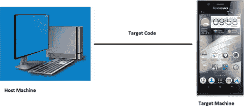

图 3-1。

Cross-development configuration of embedded systems

嵌入式系统采用交叉开发的主要原因是本地编译通常不能在目标机器上有效地完成。首先，在开发过程中，目标机器的硬件经常不可用或不稳定。第二，目标机器平台上缺乏完整的原生编译工具。第三，目标机性能不足，导致编译缓慢。嵌入式系统上的软件编译比桌面计算机上的更耗时，因为它不仅需要编译应用，还需要编译库依赖项和 OS 内核。例如，在基于英特尔奔腾 4 处理器的电脑上编译 Linux 内核需要 10 多分钟。决定编译速度的主要硬件因素包括 CPU 速度、内存容量和文件系统 I/O 速度。在这些因素上，嵌入式系统的表现通常不如个人电脑。这导致目标机器上本机编译的低效率。嵌入式系统通常采用交叉开发方法，如交叉编译(包括交叉链接)和交叉调试。

由于主机和目标机在配置、功能、系统结构和操作环境方面的差异，它们通常通过串行端口、并行端口、USB 或以太网连接电缆进行连接。包括编码器、编译器、连接器、调试工具和软件配置管理工具的工具集安装在主机上。

通常，主机和目标机在以下方面有所不同:

*   不同的结构:通常，主机是 Intel 架构的系统，而目标机可能是 Intel 或非 Intel 架构的系统结构，如 ARM 或 MIPS。
*   处理能力不同:通常情况下，主机的处理速度和存储能力都优于目标机。
*   不同的操作系统:通常，通用操作系统运行在主机上，而 Android 操作系统运行在目标机上。
*   输出方式不同:与主机相比，目标机的输入输出功能能力较差。

对于某些 Android 系统来说，这些特征可能不存在或者微不足道。以英特尔凌动系统的开发为例。主机和目标机使用相同的系统英特尔架构结构。当然，指令集可能有所不同。例如，主机(如英特尔酷睿2 双核处理器)可能兼容 SSE4，而英特尔凌动处理器仅支持 SSE3。我们应该在编译时考虑目标机器的指令集。考虑到大多数英特尔凌动系统的资源有限，我们推荐交叉开发方法。

#### 编程语言

在过去的四十年中，已经为通用计算机应用开发了几十种编程语言。从 FORTRAN、C/C++、ADA 和 Java 到 C#NET。许多因素决定了编程语言的适用性。各有各的特点，综合比较是不可能的。每种语言的性能取决于执行环境。考虑到多重因素和实际开发状况，Android 系统常用的语言有 C/C++、Java、Python 等，偶尔会用到汇编语言。编程一个复杂的 Android 系统需要多种语言的结合。常用编程语言如表 3-1 所示。

表 3-1。

Commonly Selected Programming Languages

<colgroup><col> <col></colgroup> 
| 水平 | 常见编程语言 |
| --- | --- |
| 应用软件 | C/C++，Java，。网络，脚本，Python |
| 普通程度 | C/C++，汇编 |
| 驱动程序级别 | C/C++，汇编 |
| 引导代码，硬件抽象层(HAL) | 汇编，C/C++ |

由 Sun Microsystems 于 1995 年 5 月推出的 Java 是一种跨平台的面向对象编程语言，包括 Java 编程语言和 Java 平台(JavaSe、JavaEE、JavaME)。Java 的风格与 C 和 C++ 非常相似。它是一种纯面向对象的编程语言，继承了面向对象 C++ 的核心内容，摒弃了 C++ 语言中的指针(被引用代替)、运算符重载、多重继承(被接口代替)等导致错误频发的问题。添加的垃圾收集器用于收集未被引用的对象占用的内存，因此程序员不需要担心内存管理。在 Java 1.5 版本中，Sun 增加了其他语言特性，如泛型编程、类型安全枚举类、可变长度扩充和自动装箱/自动取消装箱。

Java 不同于普通的编译和执行计算机语言，因为它是一种解释性的计算机语言。Java 编译器产生的是二进制字节码而不是机器码，可以直接在本地执行。编译后的 Java 程序通过 Java 虚拟机(JVM)被解释成可直接执行的机器代码。JVM 可以解释不同平台上的执行字节码，以实现“一次编译所有执行”的跨平台特性但是解释字节码需要一定的时间，这在一定程度上会降低 Java 程序的运行效率。为了减轻这一负担，谷歌在 2014 年推出了 Android Run Time (ART)作为 Dalvik 版本 2，该版本首次在 KitKat (Android 4.4)中作为预览功能提供。未来的 64 位 Android 将基于 ART。总的来说，Java 是简单的、面向对象的、分布式的、解释性的和健壮的。它是一种可移植的、高性能的、多线程的和动态的编程语言。考虑到 Java 的各种优势，它是 Android 应用开发的首选。

选择了一种语言，你不一定要使用它的所有功能。虽然我们选择了 Java 作为 Android 的开发工具，但是 Android 系统的开发过程不同于传统的(桌面)Java SDK。Android SDK 使用了 Java SDK 的大部分，但放弃了一些部分。比如接口，java.awt 包只有 java.awt.font 引用，如果一个 java 游戏迁移到 Android 平台，可能需要移植。

我们提到过 Java 是一种跨平台的解释性计算机语言。这一特性使高迁移能力不受平台限制，但它也有一些缺点，其中之一是开发人员不能使用与平台或架构相关的特性或潜力。但这可以通过编译 C/C++ 和汇编语言，由机器相关的目标代码来实现。这在性能优化期间更加明显。为了使用机器硬件的特性并挖掘其性能潜力，我们通常需要使用 C/C++ 和汇编语言来编写优化的应用。虽然这类代码在所有代码中所占比例很小，但编程复杂度却远高于 Java。因此，这种代码只在极少数情况下使用。我们会看到 Android 应用开发采用了以改进的 Java 为主，C 和汇编语言为支撑的混合编程模式。

我们将分两部分讨论这种编程方法。对于开发 Android 应用的一般功能，我们将使用 Java。但是为了优化性能，我们将使用混合语言编程方法。

### Android 应用开发流程

一般来说，开发 Android 软件需要和通用软件一样的步骤:设计、编码、编译、链接、打包、部署、调试、优化。对于某些 Android 系统，还需要测试和验证步骤。就过程而言，它可以分为五个阶段:编码、构建、部署、调试和调优。典型的开发过程如图 3-2 所示。

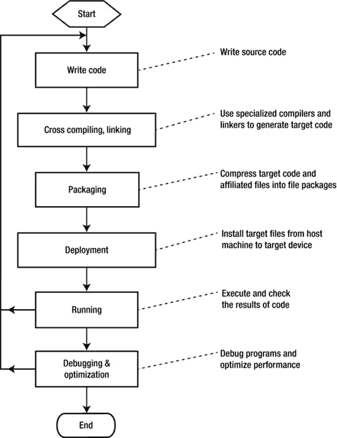

图 3-2。

Development process for Android software

#### 编码

编码是软件开发过程的第一步。可以使用各种编辑器编写软件源代码。Android 开发期间，这项工作主要是编辑。java 代码和。xml 源文件。

#### 建筑

构建阶段的任务是将代码转换成 Android 硬件上的可执行程序。该阶段包括编译、链接和打包等子步骤，如图 3-3 所示。

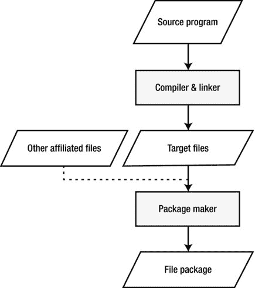

图 3-3。

Software construction stage

构建的第一步是构建，这意味着将所有源代码文件翻译成目标文件。一些目标文件是与机器相关的，例如对应于机器的执行指令的 C/C++ 目标文件。但是有些不是特定于机器的，例如 Java 目标源代码不是机器可执行的指令。在 Android 应用开发期间，这些文件通常带有后缀。班级。在安卓系统上，。类被翻译成。德克斯文件。

第二步是包装。打包的目的是将所有目标文件和附属文件合并并安装到目标计算机上的一个文件夹中。至于安卓，。dex 文件和资源文件都打包到一个。可以存储在目标计算机外部的 apk 文件。包装操作通常用特殊的包装工具来完成。

#### 部署

部署是软件开发的最后一个阶段，是从主机上复制安装包、解压缩并安装到 Android 设备的内存中。

Android 采用了基于 USB 线缆的 ISP 部署。如图 3-4 所示，主机通过 USB 线连接到目标机。Android 操作系统在目标机器上运行，而 Windows 或 Linux 操作系统在主机上运行。生成的文件包(。apk)被复制到目标机器中文件系统的一个目录中，然后被解压缩和安装以完成部署。这个过程可以使用命令行终端或 Eclipse 中的 DDMS 来完成。

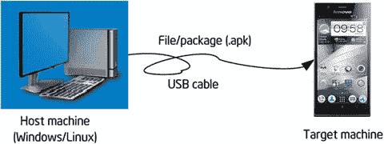

图 3-4。

Android application deployment

在联机编程模式下，主机和目标机之间的文件复制方向是不同的。并且不同的术语用于文件复制。比如下载/上传在 Android 里叫做 push/pull。Push 表示将文件从主机复制到目标机，pull 表示将文件从目标机复制到主机。

#### 调试和优化阶段

这个阶段主要是对软件进行调试和优化操作。

即使是最有经验的软件工程师也不能完全避免程序中的错误。掌握调试技术对于软件开发至关重要。调试 Android 软件代码的效率不是很高，因为即使你只需要更改一行代码，你仍然需要经历所有的构建、打包和部署过程。PC 用户可能会接受每天一次的崩溃。但试想一下，如果 ATM、医疗操作系统或卫星上的最终 Android 系统产品存在 bug，后果会有多严重。

后续章节中讨论了很多 Android 软件的调试技术和技巧。许多方法在通用计算机软件中很少使用。

软件产品的最低目标是保证其正常运行。但这个目标对 Android 软件来说还不够好，Android 软件资源有限，对空间和性能的要求比桌面系统更严格。为了满足这些要求，Android 软件必须以性能优化的方式确保正常运行。这些目标可能是矛盾的，开发者很难实现所有的目标。因此，他们做出妥协，通常强调性能要求。

提高应用的性能是一个耗时的过程。哪些函数消耗了大部分执行时间通常并不明显。因此，我们需要使用专门的工具来分析代码，以准确理解性能瓶颈，并向我们提出改进建议。这个过程通常称为代码剖析，所使用的工具称为剖析器或性能分析器。

使用分析器来提高性能的原则是优化软件中经常被调用的部分。例如，如果 50%的时间花在字符串函数上，我们将这些函数优化 10 %,那么我们可以将软件的执行时间减少大约 5%。通过使用概要分析器，您可以准确地测量执行过程中花费的不同时间部分，以了解哪些区域可以优化。一些评测器可以针对特定类型的处理器提出改进建议。例如，英特尔Vtune放大器识别代码中的热点，可以进一步优化以提高整体性能。

### Android 系统的调试和仿真

调试 Android 软件有一些特殊的挑战，因此开发了一些方法和设备来帮助开发人员完成调试过程。最常见的调试方法包括以下各节中描述的方法。

#### 系统模拟器

早期的系统模拟器是用指令集模拟器实现的，即使用软件模拟系统架构的技术。换句话说，软件是用来解释机器代码来模拟某个处理器的。现代系统模拟器包括除 CPU 模拟之外的模拟外设。模拟外设用于实现系统仿真结果。有些书称模拟器为虚拟机或模拟器。

指令集仿真包括同构仿真和异构仿真。同构模拟意味着使用一个处理器上的软件来模拟具有相同架构的虚拟机。目前，常见的微软虚拟 PC 或 VMware 模拟基于英特尔架构的处理器的执行，使其成为一种同构模拟。异构仿真意味着在一个处理器上仿真另一个处理器的执行。大多数指令集仿真器都是异构仿真类型。例如，设备仿真器在英特尔架构处理器上模拟 ARM 处理器的执行。一些常见的系统模拟器如表 3-2 所示。

表 3-2。

Common System Simulators

<colgroup><col> <col> <col></colgroup> 
| 模拟器的名称 | 模拟目标平台 | 评论 |
| --- | --- | --- |
| 微软虚拟个人电脑/虚拟服务器 | 英特尔架构 |   |
| 虚拟机 | 英特尔架构 | 兼容 Windows、Mac 和 Linux |
| 博奇斯 | 英特尔架构 | 开源项目 |
| 设备仿真器 | 手臂ˌ武器ˌ袖子ˌ装备 | SMDK2410 开发板的仿真 |
| 天空之眼 | 手臂ˌ武器ˌ袖子ˌ装备 | 中国制造 |
| VirtualBox Advance | 手臂ˌ武器ˌ袖子ˌ装备 | 模拟任天堂 GBA 游戏玩家 |
| Oracle VM Virtualbox | X86 和 AMD64/Intel64 虚拟化 | GPL 许可，并可免费获得 |

在 Android 系统上调试程序时，主机(通常是 PC)运行系统模拟器，目标机的软件在系统模拟器中运行，因此不需要额外的硬件。主机和目标机在同一台机器上实现，被称为“一机两用”。还记得之前提到的交叉开发环境吗？我们说目标机器不一定是真实的设备，因为它可能是基于软件的模拟器。在交叉开发过程中，模拟器取代了实际的目标机器。仿真器不仅节省了硬件开销，而且使调试更加方便。

Android 开发工具捆绑了 Android 虚拟设备，这是一个用于创建 ARM 和 x86 模拟器的管理器。仿真器模仿目标设备的硬件和软件配置。图 3-5 显示了一个在 Windows 中运行的 AVD 的截图。

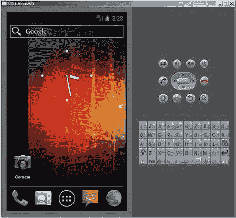

图 3-5。

AVD (Android Virtual Device) interface

安卓模拟器也叫金鱼。每个 AVD 模拟一组运行 Android 平台的移动设备，包括内核、系统映像、数据分区以及 SD 卡、用户数据和显示器。Android 模拟器基于 Qemu，这是一个流行的开源虚拟化项目。Android 模拟器的源代码在 external/qemu 目录下。

AVD 模拟目标机器的常见组件，如 CPU、屏幕、键盘、音频输出、摄像头，以及 GPS、触摸和重力加速度等传感器。例如，采用英特尔架构的 avd 包括对应于每个 API 级别的英特尔 x86 系统映像。当然，与真实设备相比，AVD 有某些缺点，包括:

*   无法拨打或接听实际电话；但是它可以通过控制台模拟电话呼叫(拨入和拨出)
*   无 USB 连接
*   无法捕捉数码照片或视频
*   无法捕捉音频输入，但支持输出(重放)
*   缺少对扩展耳机的支持
*   无法确定电池电量或交流电源的充电状态
*   无法确定是否插入或取出了 SD 卡
*   不支持蓝牙

此外，AVD 可以模拟主机和目标机之间的 USB 和网络连接。AVD 使用主机作为默认网关和 NAT(地址转换器)来连接网络。换句话说，如果您可以在主机上访问互联网，那么您也可以在模拟 AVD 的目标机上访问互联网。

#### 其他调试工具

Android 系统除了系统模拟器还有其他调试工具。虽然这些工具在 Android 中没有用到，但是你应该对它们有一个基本的了解，才能有一个完整的了解。

#### 交叉调试

当操作系统支持交叉调试 Android 应用时，您应该尝试使用这种方法。交叉调试类似于交叉编译:被调试的程序在目标机器上运行，而调试的显示、监视和控制在主机上完成。

交叉调试只能在联机模式下执行。主机需要通过 USB 电缆、网络或 JTAG-ICE 连接到目标机。调试服务器通常运行在目标机器上，在 GNU 工具链中被称为存根。在主机上运行调试过程的前端实际上是客户端。前端与向调试服务器发出请求的开发人员进行交互。调试服务器接收前端的命令，控制应用的执行，并将结果发送到前端显示，如图 3-6 所示。

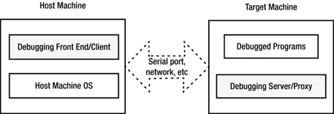

图 3-6。

Software environment for cross-debugging

例如，如果您在前端设置一个断点来观察变量的值，调试服务器将接收断点设置请求，并在程序的相应位置插入一个中断。当应用到达断点时，调试服务器接管控制权，挂起应用，并将相应变量的值发送回前端，然后前端显示该值。

许多开发工具支持交叉调试，例如 GNU 调试器。Android Debug Bridge (adb)是一个常用的调试工具，也支持交叉调试。adb 调试器基于客户机/服务器模型。它的工作原理是本地工作平台充当调试客户端，而安装远程应用的机器充当调试服务器的角色。使用 adb 时，远程应用(在目标机器上)的调试过程可能与本地调试不同。Adb 管理设备，模拟状态，并执行以下操作:

*   设备和仿真器中的快速代码更新，如应用或 Android 系统更新
*   在设备上运行 shell 命令
*   管理设备或仿真器的预定端口
*   在设备或模拟器上复制或粘贴文件

亚行的一些常见业务包括:

##### 命令行

这个命令允许您进入设备或仿真器的 Linux shell 环境，在这里您可以执行许多 Linux 命令。如果只想执行一个 shell 命令，可以输入:

##### 亚行 shell[命令]

对于`[command]`，输入您想要执行的特定命令，例如:`adb shell dmesg`，它输出内核的调试信息。注意:Android adb 的 Linux shell 已经被简化，所以它与许多常见的 Linux 命令不兼容。我们将在接下来的章节中讨论命令行。

Adb 可以命令行形式独立运行，也可以作为插件集成到您喜欢的 IDE(集成开发环境)中，如 Eclipse。图 3-7 是在 Eclipse 中调试一个 Android 应用的截图。Adb 提供了许多常见的调试工具，如断点设置、观察变量、单步执行和检查调试输出。调试过程与本地应用的调试过程相同。许多开发人员甚至不知道应用是在目标机器上运行还是在主机上运行。

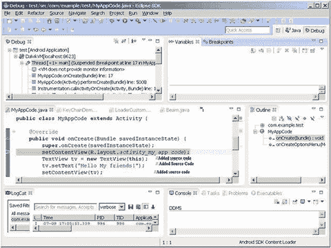

图 3-7。

Android application debugging in Eclipse

在接下来的部分中，我们将展示使用 adb 命令和 Eclipse 调试的例子。

## 典型的开发工具链

Android 软件开发的各个阶段都有相应的工具来帮助开发者完成任务。开发工具组被称为工具链或工具集。表 3-3 中列出了典型的工具链。

表 3-3。

Typical Tool Chains for Android Software Development

<colgroup><col> <col> <col></colgroup> 
| 发展阶段 | 功能描述 | 典型例子 |
| --- | --- | --- |
| 编辑 | 编写和编辑源代码 | vi、Emacs、Windows 记事本 |
| 编译和链接 | 将源程序编译和链接成可执行的二进制文件 | gcc、icc(英特尔编译器) |
| 遮雨板 | 将可执行的二进制程序刻录到 Android 系统的 ROM 或闪存中，以确保系统自动启动 | J-fFlash，Sjflash |
| 排除故障 | 项目运行状态的动态跟踪；检查程序的执行并识别程序错误背后的原因 | Gdb、adb、内核调试器 |
| 最佳化 | 分析程序性能，帮助开发人员创建占用空间少、速度更快、效率更高的程序 | gprof、英特尔 vtune〔??〕??〕放大器 |
| 测试 | 帮助测试人员识别程序中的错误，降低人力资源成本 | 这是什么 |
| 核查 | 验证程序的逻辑正确性和常见错误，尤其是在恶劣的测试和调试环境下 | 应用验证程序 |
| 模拟/仿真 | 模拟和仿真 Android 硬件的运行环境，帮助开发者开发和调试 | Qemu、VirtualBox 和 VMware Player |

许多工具集是可用的，由不同的公司和组织提供，每个工具集都有自己的特点。Icc、Vtune 放大器和 idb 由 Intel 提供，而 gcc、gdb 和 gproof 由自由软件组织 GNU 提供；而 CETK、应用验证器、设备仿真器都是微软提供的。其中一些工具是免费的，比如 GNU 工具集。其他工具，如微软工具集，必须购买。这些工具运行在不同的平台上。例如，Jflash 运行在 Linux 平台上，而大多数微软工具都基于 Windows(包括桌面 Windows OS 和 Android OS-Windows CE/Mobile)。而且有的甚至是跨平台工具；例如，GNU 工具集可以在多个平台上运行，比如 Linux、Windows 和 Mac 操作系统。

这些工具集的使用方式分为两类:一类是命令行，另一类是集成开发环境(IDE)。命令行工具集由命令行中输入的单个命令执行。在 ide 的情况下，所有的功能都集成到一个工具中，包括编辑、编译、链接、部署和调试，因此整个开发过程可以在一个应用中执行。大多数 GNU 工具运行在命令行上。可能使用最广泛的 IDE 是 Microsoft Visual Studio。Anjuta DevStudio 是一个基于 Linux 的 IDE。Android 开发工具 Eclipse 是一个可以在包括 Windows 和 Linux 在内的多种操作系统上运行的 IDE。在本书中，我们将使用 Windows 版本。

GNU 工具集可以在多种平台上运行；它们的开放性、使用范围大、与其他工具的兼容性，使其成为 Android 应用开发的普遍选择。

Tip

GNU、GPL 和 LGPL GNU 是迄今为止最大、最著名和最有影响力的自由软件组织。它是由理查德·斯托尔曼在 1985 年创建的，他创立了自由软件基金会(FSF)来脱离商业软件。在使用 GNU 软件之前，您必须遵守 GNU 软件许可证。

GPL 是 GNU 通用公共许可证的缩写，是 GNU 软件许可证的一种。GPL 允许公众享受运行、复制和共享软件的自由，获得源代码，改进软件并与公众共享。GPL 还规定，只要被改动内容的一部分或全部来自 GPL 编译的程序，那么被改动软件的共享就必须符合 GPL 的要求，这意味着你需要发布被改动的源代码，并且不得对改进软件的共享增加限制。GPL 是开发和发布 Linux 操作系统和相关软件的催化剂。

LGPL，意思是宽松的 GPL，也是 GNU 软件许可证之一。它是 GPL 的变体。不同的是，用户在 LGPL 授权的自由软件上享受私人使用。开发的新软件可以是专有的，而不是免费的。在使用自由软件之前，用户必须获得 LGPL 或 GPL 的其他变体。LGPL 最初用于一些 GNU 程序库(软件库)。所以它被称为库 GPL。Mozilla 和 OpenOffice.org 是 LGPL 时代开发的软件的例子。

GNU 开发工具是免费的。任何同意 GPL 许可的人都可以下载它们。GNU 还为 Android 系统和英特尔架构系统上的软件开发提供了完整的工具链。这些工具包括编译器、汇编器、链接器和调试工具。它们可以独立于命令行运行，也可以集成到 Eclipse 之类的 IDE 中。GNU 工具链在表 3-4 中列出。

表 3-4。

GNU Tool Chains

<colgroup><col> <col> <col></colgroup> 
| 功能 | 成分 | 描述 |
| --- | --- | --- |
| 编辑 | 六、Emacs、ed | 用于编辑源代码的文本编辑器 |
| 编译和链接 | （同 groundcontrolcenter）地面控制中心 | 一套多编程语言编译器 |
| 排除故障 | 基因组数据库 | 调试器 |
| 最佳化 | 证明 | 用于分析程序性能并帮助开发人员创建运行速度更快的程序的优化工具 |
| 项目管理 | 制造 | 软件编译自动化管理工具 |
| 制度建立 | 汽车工具 | 构建项目所需的所有材料和文件 |

下面将进一步解释这些组件。

### 编者ˌ编辑

任何文本编辑工具都可以用来编写和编辑源代码。Linux 平台有两类编辑器:一类包括 ed、ex 等行编辑器；另一个包括全屏编辑器，如 vi、Emacs 和 gedit。行编辑器只能对一行进行操作，而全屏编辑器可以编辑整个屏幕的代码，编辑后的文件被显示出来，从而克服了行编辑的缺点，使用起来更加方便。全屏编辑器比行编辑器具有更大的功能集。

在 IDE 中，编辑器被集成到工具中，不需要单独用来编写源代码。

### 编译器和链接器

编辑过程包括语法、语义和词汇分析、中间代码的生成和优化、符号表管理和错误管理。GNU 编辑器是 gcc。Gcc 被认为是 Linux 的标准编译器。

Gcc 最初是 GNU 的 C 语言编辑器。现在它支持 C、C++、Object-C、FORTRAN、Java 和 ADA。在某种程度上，gcc 是所有 GNU 编辑器的组合。Gcc 编译源代码并完成链接过程。用户可以选择命令参数来编译、链接和生成可执行文件。

英特尔编译器还优化了代码路径，以提高英特尔平台上的应用性能。英特尔编译器与英特尔提供的名为英特尔集成本地开发人员体验的工具捆绑在一起。

### 调试器

调试器使程序员更容易调试程序。但它不一定是代码执行所需的工具。在编译过程中，花在调试上的时间比花在编码上的时间多。因此，易于使用的全功能调试器是必要的。

GNU 调试器是 gdb(GNU 调试器的缩写)。它也是开源代码，是一个基于命令行的调试器。所有调试命令都是通过控制站的命令实现的。

### 构建管理器

GNU 提供了一个名为 make 的构建管理器，这是一个控制多个软件文件编译的工具。它类似于 Windows 中的 Visual c+++ 项目。此外，它可以自动管理软件编译的内容、方法和时间，以帮助程序员专注于编码，而不是组织编译序列。

Make 可以根据开发者定义的 makefile 调用 gcc 将源代码编译链接成目标机器的可执行文件。

### Makefile 自动生成工具

Makefile 可以帮助 make 执行目标文件生成任务。但是对 makefile 进行编码并不是一件容易的事情，尤其是对于大型项目。GNU 提供了一系列自动工具来制作 makefiles。这种工具知道系统配置问题，以帮助开发人员处理迁移问题。自动工具包括 aclocal、autoscan、autoconf、autoheader、automake 和 libtool。

从源代码生成目标文件有几种方法，如图 3-8 所示。

*   方法 1:使用 gcc(或英特尔编译器 ICC)编译链接所有源代码文件，生成可执行的目标文件
*   方法 2:使用 IDE(比如 Eclipse)编译 makefile 和其他配置文件，然后使用 make 生成可执行的目标文件
*   方法三:使用系统构建工具——autotools 制作 makefile 等配置，然后使用 make 生成可执行的目标文件

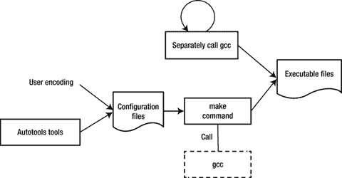

图 3-8。

Methods for generating target files using GNU tool chain

### 优化工具- gprof

为了帮助开发者优化他们的程序，GNU 提供了一个性能分析器 gproof，GNU binutils 工具之一。

Gproof 可以测量程序的性能，并记录每个函数的调用次数和相应的执行时间，以便优化工作可以集中在最耗时的部分。此外，gproof 还可以在程序执行过程中生成函数调用关系，包括调用次数，帮助程序员分析程序是如何执行的。通过依赖函数调用关系，开发人员不需要经历程序执行的所有细节，提高了他们的工作效率。而且这个功能对于维护旧代码或者分析开源项目也很有帮助。通过调用图，你可以对程序的运行框架和“骨架”有一个基本的了解。那么分析它们就不那么困难了，尤其是对于你可能不熟悉的代码和开源项目。

## 英特尔架构上 Android 应用开发工具链的概述、安装和配置

Android 为应用开发提供了一整套工具链(或工具集)。最初，Android 只能在 ARM 架构的硬件平台上运行。但是现在，为了在英特尔凌动硬件平台上支持 Android 工具链，英特尔增加了重要的插件、库和其他辅助组件。此外，为了更好地发挥英特尔硬件的性能优势，英特尔增加了编译器和优化器等特殊的开发工具。

本章介绍了在英特尔凌动平台上开发 Android 应用的一般流程和方法。在接下来的章节中，我们将讨论使用特殊英特尔工具实现优化性能和低能耗的方法。

Android 和 GNU 开发工具链以及 Android 交叉开发阶段对应的功能如表 3-5 所示。

表 3-5。

Comparison between GNU and Android Tool Chains

<colgroup><col> <col> <col> <col></colgroup> 
| 交叉发展阶段 | GNU 工具链 | 面向英特尔架构的 Android 开发工具链 | 评论 |
| --- | --- | --- | --- |
| 编辑 | 六、Emacs、ed | Eclipse，Android SDK | Android 开发工具和英特尔相关插件 |
| 编译和链接 | （同 groundcontrolcenter）地面控制中心 |
| 项目管理 | 制造 |
| 自动生成工具-makefile | 汽车工具 |
| 部署 | \ |
| 排除故障 | 基因组数据库 |
| 模拟/仿真 | \ | Android 虚拟设备(AVD) |
| 最佳化 | gprof(全球定位系统) | Vtune 分析器 | 英特尔系列工具 |

除了上面展示的与 GNU 工具的区别，英特尔还提供了一些特殊的性能库，包括英特尔集成性能原语(英特尔 IPP)、英特尔数学内核(英特尔 MKL)、英特尔线程构建模块(英特尔 TBB)。一些函数库已经提供了特殊的服务，例如英特尔 TBB 中基于 C++ 模板的线程服务 API。其中一些使用英特尔架构指令潜力来实现优化的性能，例如英特尔 IPP 中的快速傅立叶变换(FFT)。一些库仍然没有直接的 Java 接口。我们将在随后的章节中讨论它们。

表 3-5 显示，面向英特尔架构的 Android 开发工具链基本包括两部分:一部分是 Android 开发工具。这里的英特尔工具包括英特尔架构仿真器、开发库和其它插件。另一部分是独立的英特尔工具。Android 开发工具支持应用开发的大多数步骤，如编辑、构建、打包、部署和调试，而英特尔工具主要涉及优化。

Android 开发工具是指由 JDK (Java SE 开发工具包)、Android SDK(软件开发工具包)和 IDE(集成开发环境)——Eclipse 组成的软件环境。Android 开发工具可以在 Linux、OS X 和 Windows 系统上运行。在本书中，我们将讨论 Windows 场景。

Android 开发工具可以在命令行格式或 IDE 中运行。Android SDK 中 Android 命令行工具的一般开发流程如图 3-9 所示。Eclipse 是一个图形用户界面工具，通常是用于 IDE 模式的工具，集成了编辑、编译、链接、部署和调试功能。我们将讨论基于 IDE 的方法。

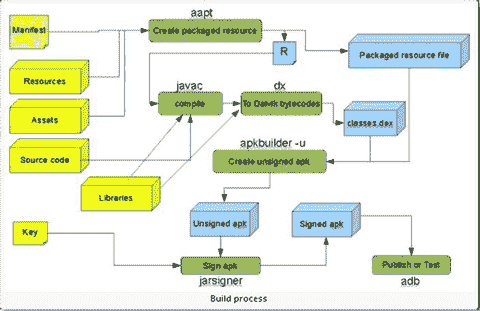

图 3-9。

Development process of the Android SDK command line

Android SDK 的目录结构如下所示。它可以通过从命令行运行 tree 命令来获得。

■插件

★★★★★★★★★★★★★★★★★★★★★★★

─医生

◆关于

■素材

──设计

■发展

■分配

■指南

■图象

◆θ∑intl

■活

■退出

──参考文献

■资源

■样品

├─sdk

──可分享

■工具

──训练

ο额外

├─android

──谷歌

─平台工具

──蜜蜂

├─lib

──渲染脚本

─平台

★★★★★★★Android-16

■样品

★★★★★★★Android-16

ο来源

★★★★★★★Android-16

ο系统映像

★★★★★★★Android-16

ο临时

ε工具

├─ant

ο应用

■喷气式飞机

├─lib

■progresp

ο支持

├─systrace

ε模板

您应该注意的主要文件是:

*   附加组件:由 Google 提供的 API 包，比如 Google Maps APIs
*   文档:帮助和说明文档
*   平台:每个 SDK 版本的 API 包和一些示例文件
*   工具:一些通用工具文件
*   usb_driver: AMD64 和英特尔架构驱动程序文件

主要文件及其功能描述如下。

### 安卓. jar

这个文件位于`%android-sdk%\platforms`目录下，每个版本的 Android 都有一个 android.jar。jar 文件你可以了解内部 API 包的结构和组织。这里的字符串`%android-sdk%`是 Android SDK 的安装目录，16 版对应的目录是`android-16`。例如，作者的 android.jar 位于:

`C:\Documents and Settings>dir D:\Android\`

`......`

`2012-07-08 20:02 18,325,478 android.jar`

android.jar 是一个标准的 zip 包，包含编译后的压缩文件和所有 API。您可以使用 WinRAR 或其他归档工具来查看其内部结构，如图 3-10 所示。它的 API 包又进一步分为 app、内容、数据库等等。

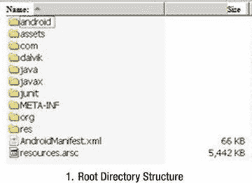 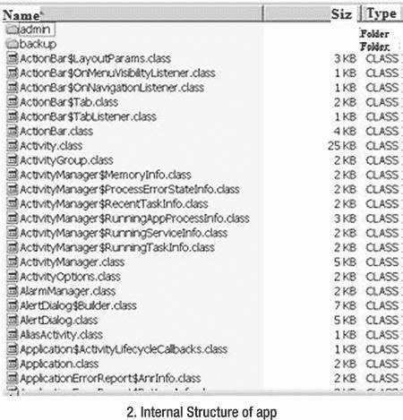

图 3-10。

Content structure of android.jar

#### ddms.bat

图 3- 11 所示的调试监控服务 ddms.bat 集成在 dal vik(Android 平台的虚拟设备)中，用于管理仿真器或设备的进程，辅助调试工作。它可以消除一些进程，选择某个程序进行调试，生成后续数据，检查线程数据，或者拍摄仿真器或设备的快照。

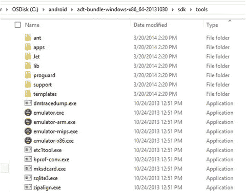

图 3-11。

The debugging monitor service ddms.bat

#### adb.exe

Android Debug Bridge (adb)是一个多用途工具，可以帮助你管理设备或仿真器的状态。如前所述，该文件位于`%android-sdk%\platform-tools`下。例如，作者的 adb.exe 位于`C:\android\adt-bundle-windows-x86_64-20131030\sdk\platform-tools`目录中，如图 3-12 所示。

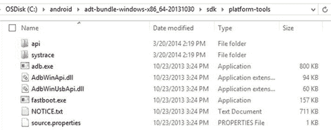

图 3-12。

File location of the adb.exe tool

#### aapt.exe

使用 Android 资源打包工具(aapt.exe)，您可以创建。包含 Android 应用的二进制文件和资源文件的 apk 文件。文件位置与 adb.exe 相同。

#### aidl.exe

Android 接口描述语言(aidl.exe)用于生成进程间接口代码。文件位置与 adb.exe 相同。

#### sqlite3.exe

Android 可以创建和使用 SQLite3 数据库文件。开发人员和用户可以很容易地访问这样的 SQLite 数据文件。文件位置与 ddms.bat 相同。

#### dx.bat(消歧义)

将类字节码重写为 Android 字节码(保存在一个 dex 文件中)。文件位置与 adb.exe 相同。

#### 安卓. bat

android.bat 文件与 ddms.bat 在同一个目录下，该命令用于显示和创建 AVD。

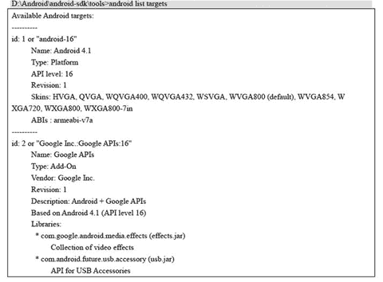 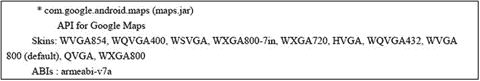

图 3-13。

The command shows that two target machine development libraries are installed on the machine

## Android 的英特尔环境设置(OS X 主机)

Android (OS X 主机)环境设置将常见的英特尔和第三方工具集成到您的首选 IDE 中，用于面向生产力的设计、编码和调试。支持的 ide 包括 Eclipse 和 Android Studio。该测试版以前称为 Beacon Mountain 测试版，将成为面向 OS X 主机的英特尔集成本地开发人员体验(英特尔 INDE)的一部分，可在 [`https://software.intel.com/en-us/inde/environment-setup-osx`](https://software.intel.com/en-us/inde/environment-setup-osx) 下载。表 3-6 列出了 Android (OS-X 主机)环境设置中包含的内容。

表 3-6。

Environment Setup for Android (OS-X Host)

<colgroup><col> <col></colgroup> 
| 产品安装 | Android Studio beta 英特尔集成本地开发人员体验(英特尔INDE)Android Studio 本地项目模板 Android SDK Android NDK 英特尔硬件加速执行管理器(英特尔HAXM)Apache Ant 英特尔Eclipse INDE 插件 |
| 5 月 | Eclipse Android Studio 测试版 |
| 主机支持 | OS X |
| 目标支持 | Android* 4.3 及以上版本(基于 ARM 和英特尔架构) |

## 基于 Linux 的主机上的 Android 开发

以下适用于基于 Linux 的主机的 Android 开发工具可从以下网站下载:

*   英特尔图形性能分析器( [`https://software.intel.com/en-us/vcsource/tools/intel-gpa`](https://software.intel.com/en-us/vcsource/tools/intel-gpa) )
*   英特尔硬件加速执行管理器(英特尔 HAXM)( [`https://software.intel.com/en-us/android/articles/intel-hardware-accelerated-execution-manager/`](https://software.intel.com/en-us/android/articles/intel-hardware-accelerated-execution-manager/) )
*   英特尔线程构建模块(英特尔 TBB)( [`https://software.intel.com/en-us/intel-tbb`](https://software.intel.com/en-us/intel-tbb) )
*   英特尔安卓 C++ 编译器( [`https://software.intel.com/en-us/c-compiler-android/`](https://software.intel.com/en-us/c-compiler-android/) )
*   英特尔集成性能原件(英特尔 IPP)( [`https://software.intel.com/en-us/intel-ipp`](https://software.intel.com/en-us/intel-ipp) )

## 英特尔集成本地开发人员体验测试版

英特尔集成本地开发人员体验(英特尔 INDE)是英特尔跨平台开发套件的测试版，旨在快速轻松地创建面向 Android 和 Windows 设备的应用，具有本地性能、出色的电池续航时间和独特的平台功能。INDE 为基于英特尔架构的设备上的环境设置、代码创建、编译、调试和分析以及基于 ARM 的 Android 设备上的选择功能提供了一套完整、一致的 C++/Java 工具、库和样本。

作为一个原生的跨平台开发套件，英特尔 INDE 包括 Android 和 Microsoft Windows 的 C++/Java 原生工具和样本，将工具集成到流行的 ide 中，并自动更新到最新的工具和技术。

### 工具和库

媒体:轻松添加视觉上引人注目的原生视频和音频扩展，可在最新流行的 Android 手机和平板电脑上工作。面向 Android 的英特尔 INDE 媒体包提供了源代码和示例，可通过以下方式增强应用:

*   摄像头和屏幕截图
*   视频编辑
*   视频流
*   音频指纹识别
*   支持运行 4.3 及以上版本的英特尔架构和基于 ARM 的 Android 设备。

线程化:使用英特尔线程构建模块(TBB)，高效实施更高级别的基于任务的并行处理。TBB 是一个屡获殊荣的 C++ 模板库，用于开发更高性能、可扩展的应用。使用并行工具创建的应用可以在基于英特尔架构和 ARM 处理器的 Android 4.3 和更高版本设备以及 Microsoft Windows 7–8.1 客户端上运行。

编译:借助面向 Android 的英特尔 C++ 编译器，以性能为导向进行编译，为您的 Android 应用带来行业领先的性能。该编译器与 GCC 源代码兼容，易于使用。GNU C++ 编译器也通过 Android NDK 提供，它是英特尔 INDE 环境设置组件中的一个定制选项。使用英特尔 C++ 编译器创建的应用可以在运行 Android 4.3 及更高版本的基于英特尔架构的设备上运行。

计算代码构建器:利用可编程图形最大限度地提高性能-使用计算代码构建器开发可在 CPU 之外的计算设备上执行的代码。该工具有助于创建、编译、调试和分析 Google Renderscript 和 OpenCL 等计算 API。compute code builder 可以以独立模式使用，也可以与 Microsoft Visual Studio 或 Eclipse 集成使用。创建的应用可以在基于英特尔架构的 Android 4.4 设备以及 Microsoft Windows 7–8.1 客户端上运行。如欲了解更多信息，请访问英特尔的入门指南。

*   分析和调试:使用分析和优化工具套件包括英特尔图形性能分析器(英特尔 GPA)系统分析器、英特尔 GPA 平台分析器、英特尔 GPA 帧分析器和英特尔帧调试器。您可以使用它们来执行以下操作:
*   对代码执行、CPU/GPU 使用和任务数据等进行实时跟踪分析
*   帧捕获分析和调试
*   平台范围和应用特定的 GPU 指标分析和图形管道覆盖

使用分析和调试工具创建的应用可以在运行 Microsoft Windows 7–8.1 或 Android 4.4 的基于英特尔架构的设备上运行。

### 设置

为英特尔 INDE 设置环境非常简单。您可以在几分钟而不是几小时内构建您的自定义环境:

*   有选择地选择要安装的工具，允许定制环境。
*   从 Google Android SDK(包括 Eclipse)、用于 Microsoft Visual Studio 的 vs-Android 插件、Android NDK、Android Design、Apache Ant 和 Intel HAXM 中进行选择。

使用环境设置创建的应用可以在运行 Android 4.3 及更高版本的英特尔架构和基于 ARM 的目标上运行。

### Intel 印度安装

以下部分描述了英特尔 INDE 安装过程。

#### 下载英特尔印度

前往 [`https://software.intel.com/en-us/intel-inde`](https://software.intel.com/en-us/intel-inde) ，点击下载链接，接受许可协议。您将收到一封带有下载链接的电子邮件，如图 3-14 所示。

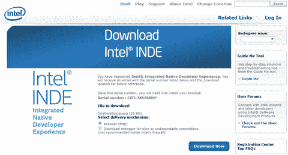

图 3-14。

Download screen for INDE

#### 正在安装 Intel 印度

运行下载的文件:`IntelHubSetup.exe`。英特尔 INDE 窗口显示许可条款和条件，如图 3-15 所示。

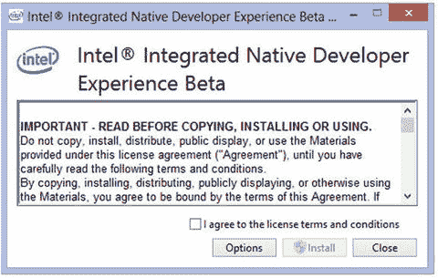

图 3-15。

INDE install window

选中复选框以同意许可条款和条件，然后单击安装。安装过程开始，几个命令行窗口闪烁。您的桌面上会创建一个英特尔 INDE 图标和一个 NDK.cmd 图标。当该过程完成时，您就可以开始了，如图 3-16 所示。

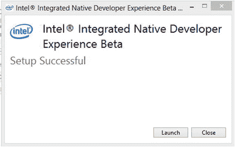

图 3-16。

INDE setup complete

#### 英特尔印度产品发布

单击启动图标，英特尔 INDE 主窗口将启动，如图 3-17 所示。

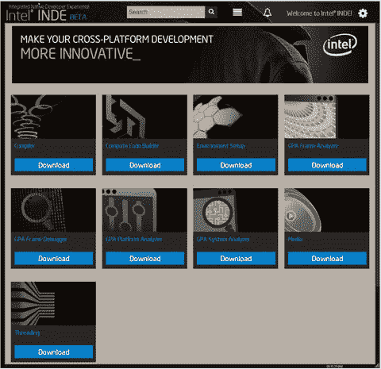

图 3-17。

Main window for INDE

按照每个工具和应用下载必要的软件。您已经准备好开始跨平台开发了。

#### 配置 Eclipse

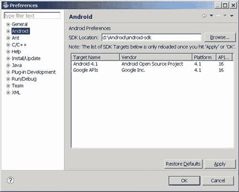

图 3-19。

Directory Location Setting of Android SDK

1.  将弹出一个首选项对话框。选择 Android 分支，然后在 SDK 位置框中输入正确的路径(通常这是自动填充的)，如图 3-19 所示。注意:点击 Android 分支后，会弹出一个对话框。单击继续继续。

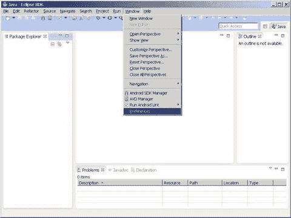

图 3-18。

Startup page for configuring Eclipse

1.  启动 Eclipse，选择窗口菜单，然后选择首选项，如图 3-18 所示。

#### 创建 AVD(模拟器)

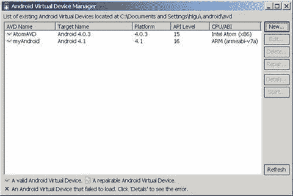

图 3-23。

Display of created list of emulator

1.  然后会显示 Android 虚拟设备管理器，如图 3-23 所示，你可以在列表中看到新添加的项目。单击关闭按钮(x)关闭对话框。

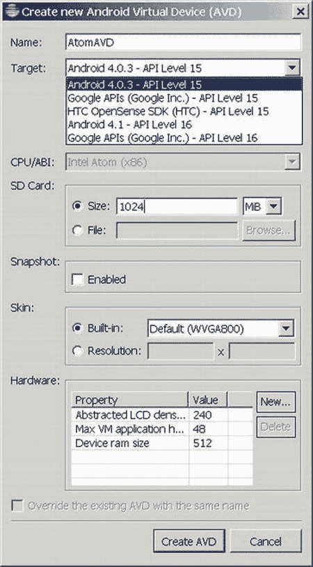

图 3-22。

Creation parameter setting for emulator

1.  当创建新的 Android 虚拟设备(AVD)对话框出现时，如图 3-22 所示，输入适当的名称，并为目标选择您希望使用的 Android 版本。CPU/ABI 框将自动显示英特尔凌动处理器(x86)。SD 卡的大小字段是硬盘上为其分配的空间量(在本例中为 1024 MB)。如果您的目标设备有更大的 SD 卡，请输入正确的大小。设置正确后，单击创建 AVD 关闭对话框。

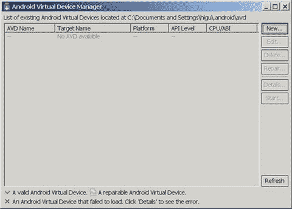

图 3-21。

Initial page of emulator list

1.  会弹出 Android 虚拟设备管理器对话框，如图 3-21 所示。单击新建按钮。

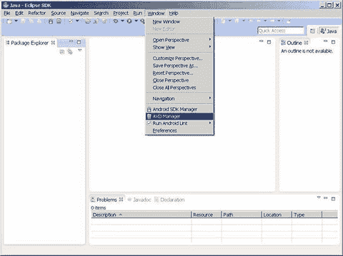

图 3-20。

Start menu for creating emulator

1.  在菜单栏上选择窗口，然后选择 AVD 管理器，如图 3-20 所示。

## 摘要

到目前为止，您已经完成了为模拟器目标机器安装开发环境工具。下一章讨论，如果你的目标机器是一个真实的设备(例如，智能手机或平板电脑)，你需要如何安装和配置开发环境，以便在那个设备上开发和测试应用。

 Open Access This chapter is licensed under the terms of the Creative Commons Attribution-NonCommercial-NoDerivatives 4.0 International License ( [ http://​creativecommons.​org/​licenses/​by-nc-nd/​4.​0/​ ](http://creativecommons.org/licenses/by-nc-nd/4.0/) ), which permits any noncommercial use, sharing, distribution and reproduction in any medium or format, as long as you give appropriate credit to the original author(s) and the source, provide a link to the Creative Commons licence and indicate if you modified the licensed material. You do not have permission under this licence to share adapted material derived from this chapter or parts of it. The images or other third party material in this chapter are included in the chapter’s Creative Commons licence, unless indicated otherwise in a credit line to the material. If material is not included in the chapter’s Creative Commons licence and your intended use is not permitted by statutory regulation or exceeds the permitted use, you will need to obtain permission directly from the copyright holder.