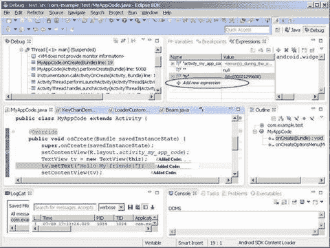
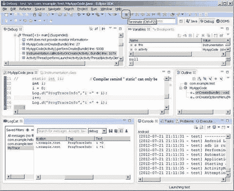

# 四、真实设备环境安装

Keywords Mobile Phone Real Device Android Application Host Machine Target Machine

到目前为止，您已经完成了模拟器目标机器的开发环境的安装。但是如果您的目标机器是一个真实的设备(例如，带有 Intel Inside 标志的手机或平板电脑)，您需要为它安装和配置开发环境。本章讨论如何使用真实的 Android 设备构建应用开发，包括如何安装驱动程序并将设备连接到您的开发主机。稍后，您将看到如何创建一个应用，并在模拟器和真实设备上测试它。

## 手机设置

设置真实设备支持 Android SDK adb 连接的方法有很多种，设置因设备而异。例如，在联想 K900 智能手机的情况下，您可以通过选择设置➤应用➤开发并单击 USB 调试来打开 Android 设备的调试功能。对于其他一些设备，USB 调试选项不可用，因为默认情况下不启用开发人员选项。戴尔 Venue 8 Android 平板电脑就是一个例子。要在 Dell Venue Android 平板电脑上启用开发者选项，您需要转到设置➤关于➤内部版本号；轻按“Build Number”七次以启用“Dell Venue Developer”选项，该选项将出现在“System”类别下。

### 在主机上安装 USB 驱动程序

本章以联想 K900 智能手机为例，说明如何在主机上安装手机 USB 驱动程序:

1.  通过 USB 电缆将手机连接到开发 PC。
2.  手机在设备管理器中被命名为未知设备(见图 4-1 )。

1.  安装驱动程序。当手机 USB 连接设置为驱动程序安装模式时，可以从手机制造商处或者有时从仿真 CD-ROM 设备处(对于 K900)找到驱动程序。

图 4-1。

Lenovo K900 ADB device in Device Manager (a yellow ? appears on top of the icon if Device Manager is unable to recognize the mobile phone when a USB driver is not installed)

当您使用 USB 电缆将联想手机连接到 Windows 笔记本电脑时，光盘会安装到如图 4-2 所示的目录中。联想英特尔手机 u 盘的文件结构是

`E: \Lenovo Kxxx Mobile phone driver>dir`

`2011-09-21 09:08         30 Autorun.inf`

`2012-03-23 17:10         2,366,976 bootstrap.exe`

`2012-03-23 17:15         69 bootstrap.ini`

`2012-03-23 10:57         10,993,152 LeDrivers.msi`

图 4-2。

Directory display on the Windows host machine

1.  双击`LeDrivers.msi`，开始安装 USB 驱动(见图 4-3 )。

1.  安装后重新启动主机。

图 4-3。

Lenovo K900 Device Drivers Setup dialog

可以看到已经安装了 ADB 接口。在软件列表中，联想 Racer-A 设备驱动已经成功安装(见图 4-4 )。

图 4-4。

Software list for the Lenovo K900 after installation

### 主机和目标机之间的交互

配置好环境后，主机和目标机现在可以使用 Android 开发环境来提供辅助工具，以便在应用开发期间，除了部署操作之外，进行更多的交互。您对目标机器有更多的控制权，包括模拟器类型的目标机器。下面几节将介绍这些工具的使用。

### 开发 Android 应用

本节解释了如何使用 Eclipse 和 Android SDK 来创建项目、编辑项目，以及使用模拟器和真实设备来运行应用。

#### 创建项目

要创建项目，请按照下列步骤操作:

1.  启动 Eclipse，并选择文件➤新➤项目。在新建项目对话框中，选择安卓➤安卓应用项目，点击下一步继续(见图 4-5 )。

1.  在新建 Android 应用对话框中，在应用名称字段中输入应用名称，如图 4-6 所示。项目名和包名是自动填充的。请注意，设置的项目名称也是目标机器上的应用名称。

图 4-5。

Starting a new Android project

1.  使用默认配置，然后单击下一步。出现“配置启动器图标”对话框(见图 4-7 )。

图 4-6。

New project (application) name

1.  使用默认配置，然后单击下一步。创建活动对话框出现(见图 4-8 )。

图 4-7。

New project—application icon setting

1.  使用默认配置，然后单击下一步。出现新的空白活动对话框(参见图 4-9 )。

图 4-8。

New project—activity setting (1)

图 4-9。

New project—activity setting (2)

文件结构和内容如图 4-10 所示。

图 4-10。

New project—directory structure

#### 编辑和运行(在模拟器上)

要使用模拟器测试运行应用，请执行以下步骤:执行以下步骤。

1.  右击项目名称，并在快捷菜单上选择“以➤运行配置身份运行”。或者，从菜单中选择运行➤运行配置。
2.  在对话框中，右键单击 Android 应用(当前项目名称)，然后选择新建。左键单击目标选项卡，然后单击自动选择兼容复选框。在列表中选择英特尔凌动相关 AVD。点击应用，然后点击关闭以关闭对话框(参见图 4-11 )。

1.  右键单击项目名称，从快捷菜单中选择“作为➤ Android 应用运行”(见图 4-12 )。

图 4-11。

Runtime configuration of the emulator target machine

1.  运行前，出现如图 4-13 所示的消息框。单击“确定”继续。模拟器窗口出现并显示运行结果。

图 4-12。

Editing and runtime for starting an Android application

图 4-13。

Message prompt before running Android

在主机上，Eclipse 的控制台窗口显示编辑、部署和运行的进度，如图 4-14 所示。

图 4-14。

Eclipse interface when running an Android application

当最后一句出现时，仿真器屏幕显示应用窗口，如图 4-15 所示。注:如果在您的主机上安装并运行了英特尔 HAXM，此过程大约需要 2 分钟。

1.  点击 Eclipse 窗口右上角的 DDMS 按钮，进入 DDMS 界面。左边的窗格显示了当前在目标机器(模拟器)上运行的应用。在这个例子中，com.example.helloandroid 和 helloandroid 正在运行(见图 4-16 )。

图 4-15。

An application running an interface on the emulator

1.  您可以看到目标机器上的菜单发生了变化。单击主页按钮

图 4-16。

DDMS interface of Eclipse

在键盘上看到如图 4-17 所示的界面。然后点击屏幕底部左起第三个按钮。

图 4-17。

Home page of the emulator

在图 4-18 所示的应用列表中，可以看到新的 MainActivity 应用。

1.  要停止运行应用，单击 Eclipse 右上角的 DDMS 按钮进入 DDMS 界面。从左边的进度列表中选择调试软件(通常是 com . example .[项目名称])。点击停止进程(见图 4-19 )结束在目标机器上运行进程。

图 4-18。

The application list on the emulator

图 4-19。

Ending running the application in DDMS

然后你会看到模拟器默认应用的页面，如图 4-20 所示。

1.  在 Eclipse 中点击左上角的 Java。IDE 界面回到原来的编辑状态(见图 4-21 )。

图 4-20。

Initial page of the emulator

1.  关闭模拟器窗口。

图 4-21。

The Eclipse editing interface

#### 在真实设备上运行

要在真实设备上运行应用，请遵循以下步骤:

1.  将手机连接到 PC。
2.  进入 Eclipse 窗口，右键单击项目名称。在快捷菜单中，选择“作为➤运行配置运行”;或者，在 Eclipse 菜单中，选择运行➤运行配置。
3.  在对话框中，左键单击 Android 应用，[当前项目名称]。左键单击目标选项卡，然后单击在所有兼容设备/AVD 上启动，这将设置为活动设备和 AVD。点击应用并关闭以关闭对话框(参见图 4-22 )。

1.  右键单击项目名称，并从快捷菜单中选择“作为➤ Android 应用运行”。

图 4-22。

Setup for running an application on the real device

在真实设备上，可以看到应用上运行的界面，如图 4-23 所示。

图 4-23。

Application interface on the real device

应用图标出现在移动电话菜单上。并且在图 4-24 中可以看到，手机菜单上已经安装了 MyMainActivity。

 

图 4-24。

Application list on the real device

有意思的是，真实设备上的应用进程比虚拟设备上的小很多(见图 4-25 )。它只有一个应用进程。

图 4-25。

DDMS interface of Eclipse

与在模拟器上运行您的应用相比，Eclipse 控制台窗格(参见图 4-26 )不提供太多关于编辑和部署的信息。

1.  按照与模拟器相同的步骤停止运行应用。

图 4-26。

Eclipse interface while the application is running

### 调试 Android 应用

调试是应用开发过程中的一个重要步骤。对于 x86 平台目标，您需要基于 x86 的设备或 x86 模拟器来测试和调试应用。借助市面上的 IA 手机和平板电脑，如 Lava Xolo 和 Lenovo K900，以及三星 Galaxy Tab 10.1 和戴尔 Venue 7/8 等平板电脑，您可以在真正基于 x86 的平板电脑和手机上测试和调试应用。

如果您没有用于测试的 x86 设备，x86 模拟器也能很好地工作。可以使用 Android SDK Manager 安装 x86 模拟器。

#### 编辑源代码

在 Eclipse 项目文件窗格中，找到`\XXX\src\com.example.XXX\***.java`文件，其中`XXX`是项目名称。双击文件名，源代码显示在右边。通过添加如图 4-27 (阴影线)所示的代码行来编辑源代码。

图 4-27。

Modifying the source code in Eclipse

#### 设置断点

将光标放在代码上，右键单击快捷菜单中的切换断点，如图 4-28 所示。

图 4-28。

Menu to set a breakpoint

设置了断点的代码左侧显示绿色图标，如图 4-29 所示。

图 4-29。

Display after a breakpoint is set

重复此过程以取消在一行代码上设置的断点。

#### 开始调试

要开始调试，请按照下列步骤操作:

1.  右键单击项目名称。在弹出菜单中选择调试为➤安卓应用(见图 4-30 )。

1.  在警告对话框中(图 4-31 ，点击是继续。

图 4-30。

Entering the debugging state

1.  Eclipse IDE 进入调试界面，如图 4-32 所示。在可能的情况下，目标机器(真实设备或仿真器)的初始运行界面如图 4-33 所示。

图 4-31。

Message box after entering the debugging state

图 4-33。

The emulator interface during debugging

图 4-32。

Interface of the Eclipse IDE during debugging

#### 程序执行技术

如果你想执行单步执行，点击代码窗口使其成为活动窗口(见图 4-34 )。您可以突出显示代码段，并单击鼠标右键进入如图 4-34 所示的菜单。从菜单中，选择“单步执行”、“单步执行”或“单步返回”来执行。

图 4-34。

Single-step execution

#### 观察日志的调试输出。x 函数

`Log.X`函数相当于 MFC `TRACE`函数，用于在 Eclipse LogCat 窗口中输出信息。要观察`Log.X`的调试输出，请遵循以下步骤:

1.  如果 LogCat 窗格没有显示，点击窗口➤显示查看➤ LogCat(见图 4-35 )。根据您使用的 ADT 版本，可能找不到 LogCat。如果找不到 LogCat，您可以选择“其他”来显示更多选项，并将 LogCat 添加到您的列表中。LogCat 属于 Android 类别。

1.  单步执行两个`Log.d`句子:
    1.  单击并激活代码窗口。
    2.  按 F6 键浏览代码。您可能需要多次按下 F6，才能在 LogCat 窗口中到达这些句子的最新输出(参见图 4-36 )。 

图 4-35。

Viewing LogCat

1.  点击 LogCat 窗口右上角的添加新的 LogCat 过滤器按钮，为调试输出信息创建一个过滤器(参见图 4-37 )。在对话框中输入过滤器名称和日志标记。过滤器名称可以是你喜欢的任何名称，但是 By Log 标签必须是源代码中`Log.d()`函数的第一个参数(字符串)。然后单击确定关闭窗口。

图 4-36。

Viewing output in the LogCat window

图 4-37。

Creating a new LogCat filter

在图 4-38 中，可以看到 LogCat 窗口中显示的`Log.X`被调用的输出信息。

图 4-38。

The LogCat window displaying the filtered output

#### 观察变量

要观察变量，选择运行➤手表，如图 4-39 所示。

图 4-39。

The Watch command

右键单击表达式选项卡，弹出如图所示的菜单。点击添加新表达式，如图 4-40 所示，添加观察变量。

图 4-40。

Adding variables for observation

#### 结束调试

点击工具栏上的终止(图 4-41 )或选择运行菜单上的终止，结束调试。

图 4-41。

Ending debugging by clicking the Terminate button

可以看到仿真器显示的默认应用页面，如图 4-42 所示。

图 4-42。

The default application page displayed by the emulator

返回到编辑主页。在 Eclipse 中点击左上角的 JavaIDE 界面返回到原始编辑状态。

## 用于 Android 应用开发的英特尔辅助工具

英特尔为基于英特尔凌动处理器的系统上的软件开发提供了一系列工具。这些工具是 Android 开发工具链的辅助工具，进一步支持 Android 应用开发。在第三章中，你看到了如何获取苹果 OS X 和 Linux 主机系统的 Beacon Mountain 工具，兼容 Eclipse，支持包括安卓 NDK 在内的流行安卓 SDKs 英特尔集成本地开发人员体验(英特尔 INDE)提供扩展的工具、支持和更多功能，用于在 Microsoft Windows 7-8.1 主机系统上创建 Android 应用。以下是对其中一些工具的介绍。

### 英特尔 C++ 编译器(英特尔 ICC)

英特尔 C++ 编译器(Intel ICC)是一组 C/C++ 编码器，可以运行在多种平台上，包括 Windows、Linux 和 OS X，在 Linux 平台上，它可以代替 gcc 完成 C/C++ 代码编译和链接。

英特尔 ICC 编码器可以生成挖掘英特尔处理器潜力的指令。英特尔 ICC 编码的代码在英特尔处理器上具有相对更好的性能。运行在 IA-32 和英特尔 64 上的 ICC 可以为 SSE、SSE2、SSE3 和 SSE4 等 SIMD 指令生成自动矢量分量，并为英特尔无线 MMX 生成变量。英特尔 ICC 支持 OpenMP 和对称多处理器(SMP)的自动并行化。借助额外的集群 OpenMP，英特尔 ICC 编译的代码可以传递分布式内存多处理(DM-SMP)的接口调用，从而在 OpenMP 指令中生成消息。这在性能优化部分有详细说明。

Intel ICC 和 gcc 都有编辑和链接功能。英特尔 ICC 可以命令行格式运行，例如

`icc [options] [@response_file] file1 [file2...]`

在哪里

*   `options`表示零个或多个编码部分
*   `response_file`是一个文本文件，列出了要编译的文件的编码选项，可以包括 C 或 C++ 文件(后缀:`.C, .c`、`.cc`、`.cpp`、`.cxx`、`.c++`、`.i`、`.ii`)和汇编文件(后缀:`.s`、`.S`)、目标文件(后缀:`.o`)和静态库(后缀:`.a`)

英特尔 ICC 的常用选项如表 4-1 所示。

表 4-1。

Common Intel C++ Compiler Encoding Options

<colgroup><col> <col></colgroup> 
| 选择 | 描述 |
| --- | --- |
| `-fast` | 几个选项的缩写:`-O3 -ipo -static -xHOST -no-prec-div`。注意:xhost 标签上的说明解释了优化基于哪个处理器。处理器标签可能会在实践中被重写。 |
| `-g` | 为调试 gdd 和 idb 调试器生成调试信息版本。 |
| `-help [CODE]` | 在命令行上显示帮助信息。`CODE`解释帮助组的类型和选项。 |
| `-m32` | 告诉编码器产生 IA-32 代码。 |
| `-m64` | 告诉编码器产生 IA-64 代码。 |
| `-O0` | 告诉编码器不要执行优化。 |
| `-O1` | 告诉编码器优化代码大小。 |
| `-O2` | 优化运行速度和启动优化 |
| `-O3` | 启动所有优化，包括 O2 和密集循环优化。 |
| `-prof-gen` | 将程序编译成代码分析器的运行模式。 |
| `-prof-use` | 在每个步骤中编译和处理代码分析器信息。该选项仅适用于已经应用了`prof_gen`编码的程序。 |
| `-xO` | 为非英特尔 CPU 启动 SSE3、SSE2 和 SSE 指令集优化。 |
| `-xS` | 生成 SSE 矢量编码器和媒体加速指令。 |

表格中列出的选项是英特尔 ICC 独有的。英特尔 ICC 与 gcc 的兼容性意味着 gcc 的编码选项也可以在英特尔 ICC 中使用。例如，`-o`选项可以用来命名目标文件；`-S`用于解释复合汇编代码；`-c`只编译文件，不链接成可执行文件(即抵制链接)。

### 面向 Android 操作系统的英特尔图形性能分析器

英特尔图形性能分析器(英特尔 GPA)套件是一套功能强大的图形和游戏分析工具，旨在以游戏开发人员的方式工作，通过快速提供可操作的数据来帮助您从系统级到单个绘图调用寻找性能机会，从而节省宝贵的优化时间。

英特尔 GPA 现在支持运行谷歌 Android 操作系统的基于英特尔凌动处理器的手机和平板电脑。这个版本的工具集使您能够使用您选择的开发系统(Windows、OS X 或 Ubuntu OS)来优化 OpenGL ES 工作负载。借助这一功能，作为 Android 开发人员，您可以执行以下操作:

*   获得涵盖 CPU、GPU 和 OpenGL ES API 的二十多项关键系统指标的实时视图
*   进行大量图形管道实验，以隔离图形瓶颈
*   使用基于英特尔凌动处理器的平板电脑时，运行英特尔 GPA 帧分析器来执行详细的帧分析和优化
*   使用基于英特尔凌动处理器和 PowerVR 显卡的 Android 设备时，运行英特尔 GPA 平台分析器来执行详细的平台分析

要下载英特尔 GPA 的免费版本，请浏览至英特尔 GPA 主页( [`https://software.intel.com/en-us/vcsource/tools/intel-gpa`](https://software.intel.com/en-us/vcsource/tools/intel-gpa) )，然后单击相应产品版本的下载按钮。要为 Android 操作系统平台开发游戏或应用，请根据您的开发系统选择英特尔 GPA 版本。

### 英特尔系统工作室

英特尔 System Studio 是一个全面的集成工具套件，提供先进的系统工具和技术，帮助加速交付下一代高能效、高性能、可靠的嵌入式和移动设备。

英特尔 System Studio 2014 现在允许您针对嵌入式和移动 Android 和 Tizen IVI 系统进行开发，增加了从 Windows 主机的交叉开发，并为所有 IA 平台提供扩展的 JTAG 调试支持。新的基于代理的 UEFI debug 可帮助您加快上市时间，并增强这些日益复杂的嵌入式和移动系统的可靠性。Eclipse 集成和交叉构建功能允许使用英特尔 System Studio 2014 进行更快的系统开发。

英特尔 System Studio 包括表 4-2 中列出的组件。

表 4-2。

Intel System Studio Components

<colgroup><col> <col></colgroup> 
| 成分 | 描述 |
| --- | --- |
| 面向系统的英特尔 VTune 放大器 | 高级 CPU 和片上系统(SoC)性能分析和调整。 |
| 英特尔能源分析器 | 高级 GPGPU 和 SoC 功耗分析和调整。 |
| 英特尔系统分析器 | 利用 Android 目标的 CPU 和 GPU 指标进行实时系统级性能分析。 |
| intel jtag 除错程式 | 用于深入了解 SoC 平台的系统调试器，具有低开销事件跟踪、日志记录、通过 JTAG 和 EDKII 调试代理对 EFI/UEFI 固件进行源代码级调试、引导加载程序、操作系统内核和驱动程序等功能。 |
| gdb 调试器 | 软件调试器，用于快速应用级缺陷分析，以提高系统稳定性、应用级指令跟踪和数据竞争检测。 |
| 英特尔系统检测器 | 动态和静态分析器，识别难以发现的内存和线程错误，以确保功能可靠性。 |
| 英特尔 C++ 编译器 | 业界领先的 C/C++ 编译器，包括用于高度优化性能的英特尔 Cilk Plus 并行模型。二进制和源代码与 gcc 编译器和交叉编译器兼容。 |
| 英特尔集成性能原件 | 广泛的高性能软件构建模块库，用于信号、数据和多媒体处理。 |
| 英特尔数学内核库 | 高度优化的线性代数、快速傅立叶变换(FFT)、矢量数学和统计函数。 |
| 系统可见事件连接(SVEN) 1.0 技术 | 超低开销事件跟踪。 |

英特尔 System Studio 开发工具与英特尔 Quark、英特尔凌动、英特尔酷睿和英特尔至强处理器平台相结合，为在众多市场交付强大的嵌入式和移动平台解决方案提供了更多价值和竞争优势。

### 英特尔项目无政府状态:Havok 的免费手机游戏引擎

Project Anarchy 是一款适用于 iOS、Android(包括 X-86)、Tizen 的免费手机游戏引擎。它包括 Havok 的视觉引擎以及 Havok 物理学、Havok 动画工作室和 Havok AI。它拥有可扩展的 C++ 架构、优化的移动渲染、灵活的素材管理系统以及 Lua 脚本和调试。SDK 中包含完整的游戏示例，以及 Project Anarchy 网站上的大量课件，游戏开发人员可以使用这些课件快速熟悉引擎，并将其游戏创意付诸实践:

*   基于可扩展 C++ 插件的架构
*   全面的游戏样本与完整的源代码艺术和源代码
*   关注社区，通过论坛获得支持、问答、反馈和实践培训
*   对公司规模或收入没有商业限制
*   针对其他平台和产品、资源以及支持的升级
*   包括行业领先的音频工具 FMOD

### 英特尔性能库

特殊性能库包括英特尔集成性能基元(IPP)、英特尔数学内核(MKL)和英特尔线程构建模块(TBB)。

IPP 8.1 是一个庞大的软件函数库，用于 Windows、Linux、Android 和 OS X 环境下的多媒体处理、数据处理和通信应用。它包含了广泛的功能，包括通信和图像处理、计算机视觉、语音识别、数据压缩、加密和解密、字符串操作、语音处理、视频格式化、真实感渲染和 3D 数据处理。它还包括用于构建音频、视频和语音编码器/解码器的复杂原语，如 MP3、MPEG-4、H.264、H.263、JPEG、JPEG2000、GSM-AMR 和 G723。

通过支持所有数据类型和函数布局，数据结构类型的数量被最小化。在应用设计和优化过程中，英特尔 IPP 函数库提供了多种选项集。每个函数都支持各种数据类型和布局。IPP 软件的最小化数据结构为生成优化的应用、高级软件模块和库函数提供了最大的灵活性。IPP 的 Linux 版本提供支持 IA-32、英特尔 64、IA-64 和英特尔凌动处理器的独立软件包。

TBB 是一个广泛使用、屡获殊荣的 C 和 C++ 库，用于创建高性能、可扩展的并行应用。它通过一组丰富的组件来高效实施更高级别的基于任务的并行性，从而提高了工作效率和可靠性。您可以通过构建面向未来的应用来利用多核和众核能力，从而获得性能优势。高级线程库兼容多种编译器，可移植到各种操作系统。

英特尔 IPP 和 TBB 提供便利，并帮助优化程序运行时性能。您可以通过调用库中的函数来减少必须编写的代码量。英特尔性能库可以提供与第三方库相同或相似的服务和功能。它们充分利用英特尔和兼容处理器的指令能力；因此，相同或相似的服务比第三方库或操作系统提供的服务性能更好。这个话题在第八章和第九章的代码优化章节中有详细讨论。

## 摘要

在本章中，您讨论了如何在主机系统上设置和配置应用开发，为 Android real 设备安装 USB 驱动程序，以便在设备和主机系统之间建立连接，从而允许您测试和调试应用。您还讨论了如何使用英特尔仿真器、加速仿真器所需的所有步骤以及如何使用仿真器。在下一章中，您将讨论 Android 操作系统，并了解基于英特尔架构的 Android 操作系统的原理。

 Open Access This chapter is licensed under the terms of the Creative Commons Attribution-NonCommercial-NoDerivatives 4.0 International License ( [ http://​creativecommons.​org/​licenses/​by-nc-nd/​4.​0/​ ](http://creativecommons.org/licenses/by-nc-nd/4.0/) ), which permits any noncommercial use, sharing, distribution and reproduction in any medium or format, as long as you give appropriate credit to the original author(s) and the source, provide a link to the Creative Commons licence and indicate if you modified the licensed material. You do not have permission under this licence to share adapted material derived from this chapter or parts of it. The images or other third party material in this chapter are included in the chapter’s Creative Commons licence, unless indicated otherwise in a credit line to the material. If material is not included in the chapter’s Creative Commons licence and your intended use is not permitted by statutory regulation or exceeds the permitted use, you will need to obtain permission directly from the copyright holder.