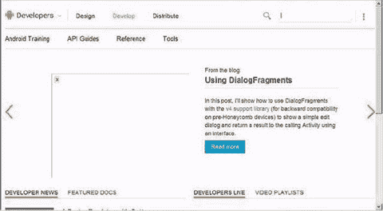
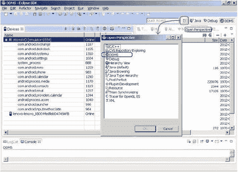

# 五、安卓操作系统

Keywords National Electrical Manufacturer Association National Electrical Manufacturer Association Executable File Host Machine Target Machine

所有计算设备的核心是操作系统，即 OS。应用软件的开发和执行是基于操作系统和整个软件平台的。在本章中，您将了解 Android 操作系统——为基于英特尔凌动处理器的机器推荐的软件平台——从而为嵌入式应用的后续开发培养能力。

## Android 概述

Android 是基于 Linux 内核的综合操作环境(2014 年，内核版本 3.10.x 已经被各大 OEM 厂商使用)。最初，Android 的部署目标是移动电话类别，包括智能手机和更低成本的翻盖手机设备。然而，Android 的全套计算服务和丰富的功能支持完全有可能扩展到手机市场以外，用于平板电脑等其他平台和应用。

除了内核之外，面向 x86 的 Android 操作系统还需要一些驱动程序和技术，包括移动设备上常见的驱动程序和技术:

*   主机和客户端的 USB 驱动程序
*   用于视频编码和解码的视频驱动器
*   显示和图形:2D 和三维渲染:飞机、管道、港口
*   闪存驱动器
*   相机驱动:通常是基于 Linux 的 v41(视频)驱动
*   音频驱动程序:通常是基于高级 Linux 声音架构(ALSA)的高级 Linux(声音系统)驱动程序
*   近场通信(NFC)
*   无线驱动程序:基于 IEEE 802.11 的驱动程序
*   键盘驱动程序
*   安全性(DRM、可信引导等)
*   蓝牙驱动程序
*   binder IPC:Android 的一个特殊驱动程序，具有独立的设备节点来提供进程间通信(IPC)功能
*   电源管理:三种不同 CPU 待机状态的驱动程序:活动待机(S0i1)、始终在线始终连接(AOAC)待机(S0i2)和深度睡眠待机(S0i3)

鉴于 Android 功能的广泛性，很容易将其与桌面操作系统相混淆；Android 是一个分层的环境，包含了丰富的功能。

Android 应用通常用 Java 编程语言编写，可以包含许多不同种类的资源文件(在`res`目录中)。编译完 Java 程序和其他相关资源后，会生成一个 APK 包。谷歌还提供了对多个 APK 文件的支持。这是 Google Play 的一个功能，允许开发者为应用发布不同的 apk，每个 apk 针对不同的设备配置。Android 提供了许多核心应用，包括主页、联系人、电话和浏览器。此外，您可以使用应用框架层中的 API 来开发自己的应用。

Android UI 子系统包括

*   Windows 操作系统
*   视图
*   用于显示常见元素的小部件，如编辑框、列表和下拉列表

它还包括一个基于 WebKit 的嵌入式浏览器，这是苹果 iPhone 手机 Safari 浏览器的开源浏览器引擎。

Android 拥有一系列健康的连接选项，包括 Wi-Fi、蓝牙和基于蜂窝连接的无线数据(例如，GPRS、EDGE、3G 和 4G/LTE)。Android 应用中一个流行的技术是链接到谷歌地图，直接在应用中显示地址。Android 软件栈中也支持基于位置的服务(如 GPS)和加速度计，尽管并非所有 Android 设备都配备了所需的硬件。还有摄像头支持。从历史上看，移动应用一直难以与桌面应用保持同步的两个领域是图形/媒体和数据存储方法。Android 通过内置对 2D 和 3D 图形的支持，包括 OpenGL ES 库，解决了图形挑战。Android 平台上流行的开源 SQLite 数据库减轻了数据存储负担。

## Android 架构

Android 软件架构的简化框图如图 5-1 所示。

图 5-1。

Android software architecture

如前所述，Android 运行在 Linux 内核之上。基于 Java 的应用在虚拟机(VM)中运行。值得注意的是，VM 不是 JVM，正如您可能期望的那样，而是 Dalvik 虚拟机(DVM)，一种开源技术。每个 Android 应用都在 DVM 的一个实例中运行，而 DVM 又驻留在 Linux 内核管理的进程中，如图 5-2 所示。

图 5-2。

Android application operation layer

从 Android KitKat 4.4 开始，谷歌实现了新的 Android 运行时(ART)，也称为 Dalvik 版本 2。Android 开源项目(AOSP) master 正在积极开发 ART，未来的 64 位版本 Android 都将基于 ART，你可以在 [`https://source.android.com/devices/tech/dalvik/art.html`](https://source.android.com/devices/tech/dalvik/art.html) 找到关于 ART 的最新信息。

## 从编程角度看基本的 Android 功能

Android 是 Linux 的一个版本。本节通过两个场景为 Android 开发人员概括了一些基本的 Linux 命令和常见做法:一个基于 Android SDK 中提供的 Android 仿真器，另一个面向拥有真正的 Android 智能手机或采用 Intel inside 的平板电脑的开发人员(在示例中为联想 K900 智能手机)。如果你是一个有经验的 Android/Linux 开发者，你可以安全地跳过本章的其余部分，进入下一章。

### Android 系统界面

Android 移动系统界面是各大厂商产生分歧的一个关键方面。个性化的系统界面不仅是一个卖点，也是手机用户与朋友交流的平台。本节以联想 K900 智能手机为例，讨论 Android 系统 UI 设计。联想 K900 使用的四叶草设计如图 5-3 所示。

图 5-3。

Lenovo K900 main interface

联想手机采用常规的“上滑解锁”模式，简单方便。长按一个叶子就可以改变主界面中的快捷键，如图 5-4 所示。值得注意的是，在主界面操作过程中，如果你点击菜单键，快捷方式设置选项不会出现，就像在其他一些 Android 手机上一样。此外，您不能添加或删除主屏幕(leaves 中的快捷键可以更改)。

图 5-4。

All Menu interface

联想手机的下拉菜单是个性化的，包括四个选项:通知、切换、通话和消息。在 Switch 界面中，可以对手机进行快速设置或者长按某个选项进入该选项的详细设置界面。

一些 Android 手机允许你在界面上长按任何空白处时添加小工具和快捷方式，但联想手机没有这项功能。您可以使用菜单键添加工具和快捷键(除了)主屏幕。当你用两个手指按下屏幕时，出现多屏界面，你可以在这里进行快速搜索，如图 5-5 所示。

图 5-5。

Multiscreen interface of the Lenovo phone

20 矩形网格设计的菜单界面时尚优雅，但有些图标模糊不清。

联想 K900 手机的主要硬件和 OS 配置信息如图 5-6 所示。

图 5-6。

Parameters of the Lenovo K900 phone

#### 在 Android 中终止应用

Android 提供了三种不同的方法来终止应用，如以下章节所述。

##### 方法 1(针对真实设备)

1.  在移动设备菜单中选择以下选项:设置➤应用➤运行服务➤运行应用。显示正在执行的应用。该列表在不同的设备上可能会有所不同。例如，在三星 Galaxy Note 上，应用被替换为应用管理器，在戴尔 Venue (Android KitKat 4.4)上，它被替换为应用。
2.  单击要从列表中删除的应用，屏幕上将弹出强制退出和卸载按钮。单击强制退出以终止该过程。

##### 方法 2

当应用占据当前顶层窗口屏幕(即应用正在运行)时，按下 Return 键。

##### 方法 3

在主机系统上的 Dalvik 调试监控服务器(DDMS)中终止该进程。当 Android 设备连接到一个具有 IDE 的主机系统时，可以实现这一点，该 IDE 带有支持 DDMS 的 Android SDK，如 Eclipse。

#### 在 Android 模拟器中使用 Web 浏览器

如果你有一部智能手机，毫无疑问，你可以很容易地连接到互联网。如果您在模拟器上运行 Android，您可以按照以下步骤使用 web 浏览器:

1.  点击键盘上的 Home 按钮，出现图 5-7 所示界面。单击右下角的按钮。

1.  将弹出网络浏览器窗口。点击地址栏，调出仿真设备的键盘，如图 5-8 所示。在模拟键盘上输入地址，然后单击 Go。

图 5-7。

Web browser startup interface

图 5-8。

Web browser initial interface

### 常见的 Linux 命令和操作

因为 Android 是基于 Linux 的，所以 Android 支持大部分 Linux 命令。以下部分介绍了基于 Ubuntu 系统的主机和基于 Android 系统的目标机支持的一些常见 Linux 命令。如果您使用 Windows 主机系统为 Android 开发应用，您可以使用 Android SDK 提供的 Android Debug Bridge (adb)命令连接到 Android 设备或仿真器来运行这些命令。

#### 检查用户

以下命令检查当前登录的用户名:

`$ who am i`

或者

`$echo $USER`

以下命令显示用户名信息:

`$ id`

`uid=1000(cereal) gid=1000(cereal)`

`groups=4(adm),  20(dialout), 24(cdrom), 46(plugdev), 106(lpadmin), 121(admin), 122(sambashare), 1000(cereal)`

输出数据显示当前用户是谷物，用户 ID 是 1000，用户属于谷物组，组 ID 是 1000，依此类推。

#### 更改密码

以下命令更改当前用户的密码:

`$ passwd`

以下是输出:

`Changing password for cereal.`

`(current) UNIX password:`

`Enter New UNIX password:`

`Retype New UNIX password:`

`Password changed`

`passwd`命令也可用于更改 root 密码。例如，如果您使用用户名“谷物”登录，您可以使用以下命令来设置 root 用户的密码:

`$ sudo passwd root`

在桌面 Linux 中，系统启动时通常会出现一个登录窗口，要求您输入用户名和密码。但是安卓没有这个过程。Android 自动使用默认用户名和密码登录，用户不可见；系统资源在用户的身份下使用。

如果 Android 安装后 root 用户的密码不确定，可以使用`passwd root`命令按照前面所示进行设置。s `udo`表示命令在 root 身份下执行，但命令的执行只需要输入普通用户的密码进行确认。

#### 清除屏幕

您可以使用`clear`命令来清除屏幕:

`$ clear`

#### 超级用户根操作

Linux 有一个唯一的超级用户 root(不同于 Windows 的多个超级用户)，可以访问所有文件和目录，操作系统中的所有应用。使用`su`命令输入 root 用户帐户:

`$ su`

然后，输入 root 用户的密码。输入 root 用户帐户后，命令行提示符从`$`变为`#`。如果`su`命令后面没有任何参数，默认情况下将切换到 root 用户，而不是 root 用户的主目录——也就是说，root 登录环境在切换后不会改变。它仍然是默认的登录环境。当输入一个参数时，根用户以及根用户的环境都会改变:

`$ su -`

使用`exit`命令退出 root 用户帐户，返回普通用户身份:

`#exit`

退出后，命令行提示从`#`变为`$`。

当您使用`su`命令输入 root 用户帐户时，后续操作将在 root 身份下进行。要在 root 用户身份下执行当前命令，并在命令执行后返回普通用户身份，请在命令前添加前缀`sudo`，如前所示。执行`sudo`时，系统会要求您输入当前用户(非根用户)的密码来确认身份。

理论上，一个普通用户不一定有`sudo`权限；权限在文档`/etc/sudoers`中指定。在桌面 Linux 中，这应该总是通过`visudo`这样的命令来编辑或设置。但在 Android 中，默认是安装程序有`sudo`权限。

#### 显示文件和目录

使用`ls`命令显示目录和文件信息。`ls`的常见格式如下:

`ls [-l] [<directory name>]`

在这里，ls -l 显示文件或目录，大小，修改日期和时间，文件或文件夹名称和文件的所有者及其权限。默认情况下，显示当前目录的信息。例如(当前目录为`/home/cereal`):

#### 改变和显示(当前)目录

使用`cd`命令改变当前目录。例如，要将当前目录更改为`\embedded\pkgs`，输入以下命令(注意在 Linux 中根目录和目录由`/`分隔):

`$ cd /home/cereal/Document`

以`/`开始表示目录的这个路径称为绝对路径。

如果当前目录是`/home/cereal`，可以使用相对路径:

`$ cd Documents`

如果没有输入任何参数，`cd`命令会切换到当前用户的主目录:

`$ cd`

`..`表示父目录，通过以下命令访问:

`$ cd ..`

使用`pwd`命令显示当前目录的绝对路径名:

`$ pwd`

`/home/cereal`

在 Linux 中还有一些符号来表示特殊的目录。例如，`∼`表示用户的主目录，因此可以使用以下命令转到主目录:

`$ cd ∼`

#### 搜索文件

使用`find`命令搜索文件。该命令的格式是

`find directory name -name file name`

您可以在指定的目录和所有子目录中搜索指定的文件。例如，输入以下命令在整个文件系统中搜索`ifconfig`文件:

`# find / -name ifconfig`

该命令从根目录开始，搜索所有子目录下的`ifconfig`文件。该命令可以访问所有目录，其中许多目录是普通用户无法访问的，因此建议您在 root 身份下执行该命令。

#### 文件操作

Android 有类似于 Windows 的文件操作命令。这些命令在表 5-1 中列出。

表 5-1。

Android File-Operation Commands

<colgroup><col> <col> <col> <col></colgroup> 
| 命令 | 功能 | 格式 | 格式描述 |
| --- | --- | --- | --- |
| `cat` | 显示文件内容 | `cat [-n] <file list>` | `n`:显示行号。 |
| `ln` | 建立硬/软链接 | `ln [-sf] <original file><destination file>` | `s`:软链接；默认为硬链接。`f`:如果目标文件存在，将被替换 |
| `mkdir` | 制作目录 | `mkdir <directory name>` | 用给定的名称创建目录 |
| `rmdir` | 删除空目录 | `rmdir <directory name>` | 要删除的目录必须为空。要删除非空目录，请使用以下命令:`rm –rf <directory name>` |
| `cp` | 复制文件 | `cp [option] [<source path>]<source file> <destination path>[<destination file>]` | 将源复制到 DEST，或将多个源复制到目录 |
| `mv` | 移动和重命名文件 | `mv <source file> <destination file>` | 将源重命名为 DEST，或将源移动到目录。 |
| `rm` | 删除文件 | `rm [option] <file name>` | `-i`:询问是否删除。`-f`:不要问是否删除。`-r`:递归删除整个目录，像`rmdir`。 |
| `cmp` | 比较文件 | `cmp <file 1> <file 2>` | 比较任意类型的两个文件，并将结果写入标准输出。 |

例如，您可以使用以下命令来显示`/etc/passwd`文件的内容:

`$ cat /etc/passwd`

使用以下命令将`/etc/passwd`文件复制到当前目录:

`$ cp /etc/passwd .`

该命令中的`.`表示当前目录。

#### 修改文件/目录权限

如上所述，每个文件或目录都有自己的权限。只有具有相应权限的用户才能执行操作。如果不匹配，必须修改权限。表 5-2 列出了修改文件权限的 Linux 命令。

表 5-2。

File/Directory Permission-Modification Commands

<colgroup><col> <col> <col></colgroup> 
| 命令 | 功能 | 格式 |
| --- | --- | --- |
| `chmod` | 更改文件/目录访问权限(只有文件所有者和根用户可以这样做) | `chmod <octal digit>/<+/- w/r/x> <file name>` |
| `chgrp` | 更改文件组 | `chgrp <group name> <file name>` |
| `chown` | 更改文件所有者(只有根用户可以这样做) | `chown <new owner> <file name>` |

例如，该命令为其他用户添加对`report.doc`文件的写权限:

`# chmod o+w report.doc`

在 Linux 中，所有者、同组用户和其他用户分别用`u`、`g`和`o`表示。前面的命令为其他用户添加了写权限(`o`)。

下一个例子设置`report.doc` tp `rw`的组权限(删除`x`权限):

`# chmod g=rw report.doc`

权限也可以用数字表示:读、写和执行的值分别是 4、2 和 1。分配的权限的数字是三者之和。例如，下面的命令将`report.doc`的用户权限设置为`rw` (4 + 2 + 0 = 6)，将组权限设置为`r` (4 + 0 + 0 = 4)，不授予其他用户权限(0 + 0 + 0 = 0):

`# chmod 640 report.doc`

该命令将`report.doc`分配给经理组:

`# chgrp managers report.doc`

要将`report.doc`的所有者设置为“谷物”并将它的组设置为“经理”,可以使用以下命令:

`# chown cereal.managers report.doc`

该命令将当前目录下所有文件的所有者更改为谷物:

`# chown cereal *`

一般来说，只有根用户可以使用`chown`来改变文件或目录的所有者。

在 Windows 中，文件的可执行性是基于它的后缀(比如`.exe`)，而 Linux 对可执行文件的名称没有任何要求，并通过文件属性来决定文件是否可执行。在 Android 中，要使文件可执行或不可执行，通常使用`chmod`命令来添加或删除执行权限。

许多命令功能，如文件操作和权限操作，通常在文件浏览器、文本编辑器或其他图形用户界面应用中执行。但是通过命令行操作，您有了一种快速执行命令的新方法。Android 不提供 GUI 应用，如文件浏览器，所以在大多数情况下，你必须使用命令行来完成这些功能。

#### 使用可执行文件路径

如果没有为可执行文件指定路径，Linux 可以使用保存在系统变量`PATH`中的路径找到该文件，也称为默认路径或路径。默认情况下，Windows 在当前目录中查找可执行文件，但是 Linux 只在它们的默认路径中查找可执行文件。因此，您可以使用以下命令来执行当前目录下的可执行文件:

`./directory name of executable file`

以下命令显示当前路径:

`$ echo $PATH`

您也可以使用`which`命令来确定可执行文件的目录是否已经包含在默认路径中。例如，以下命令会查明 gcc 目录是否已包含在默认路径中:

`$which gcc`

如果它存在于默认路径中，这个命令输出可执行文件的目录:例如，`/usr/bin/gcc`。否则，该命令不输出任何内容。

要在默认路径中添加目录，可以使用以下命令:

`$ PATH=$PATH:/tools/bin`

`$ export PATH`

或者

`$ export PATH=$PATH:/tools/bin`

在`PATH`下添加一个以`:`为分隔符的`/tools/bin`路径。改变`PATH`值或任何环境变量必须通过`export`导出；否则，新的`PATH`值不会生效。这只对当前用户有效。

可以将导出命令添加到 shell 文件中，如`.bash_profile`、`.profile`和`.bashrc`，这样每次命令行启动前都会执行该命令。

执行可执行文件而不修改默认路径的一个简单方法是在可执行文件名称前指定绝对路径。

#### 管道和屏蔽

Linux 管道操作符号`|`将一个命令的输出作为第二个命令的输入。其功能与 Windows 中的相同。例如，您可以使用以下命令逐屏显示文件内容:

`$ cat /etc/passwd | more`

`more`命令逐屏显示文件，每页输出后暂停执行；你可以按任意键让它继续。在前面的命令中，`cat/etc/passwd`表示输出`passwd`文件的内容，输出作为 more 命令的输入(使用管道命令)。

`grep`命令可以搜索并显示文件中的某些行。例如:

`$ grep cereal /etc/passwd`

该命令在 passwd 文件中查找并显示包含“谷类”的行。输出是这样的:

`cereal:x:1000:1000:cereal,,,:/home/cereal:/bin/bash`

要搜索的字符串可以用单引号(`''`)或双引号(`""`)括起来。`''`中的文字是按字面意思理解的，而`""`中的一些特殊字符被 shell 赋予了特殊的含义。前面的命令也可以写成以下形式:

`$ grep 'cereal' /etc/passwd`

和

`$ grep "cereal" /etc/passwd`

在大多数情况下，您使用 pipe 和`grep`命令来显示命令输出的屏幕。例如:

`$ ls -l /home/cereal/Document | grep qt`

该命令显示包含`/home/cereal/Document`目录中`qt`字段的文件/目录的相应行。

您使用的另一个命令是

`$ ps -e | grep ssh`

其中列出了进程名称中包含文本“ssh”的所有活动进程。

#### 在后台运行命令

命令的执行通常会占用控制台或命令行窗口的输入/输出，这意味着在正在执行的命令结束之前，您无法输入命令。相反，如果应用在后台运行，控制台的输入/输出不会被占用。要在后台运行命令，只需在命令末尾添加`&`。

#### 中断前台命令的执行

按 Ctrl+C 中断在前台执行的命令。例如，Linux `ping`命令将无休止地 ping 主机，但是您可以按如下方式结束它的执行:

`$ ping 127.0.0.1`

`PING 127.0.0.1 (127.0.0.1) 56(84) bytes of data.`

`64 bytes from 127.0.0.1: icmp_seq=1 ttl=64 time=0.027 ms`

`64 bytes from 127.0.0.1: icmp_seq=2 ttl=64 time=0.028 ms`

`64 bytes from 127.0.0.1: icmp_seq=3 ttl=64 time=0.029 ms`

`64 bytes from 127.0.0.1: icmp_seq=4 ttl=64 time=0.030 ms`

`64 bytes from 127.0.0.1: icmp_seq=5 ttl=64 time=0.031 ms`

`^C`

`--- 127.0.0.1 ping statistics ---`

`5 packets transmitted, 5 received, 0% packet loss, time 4462ms rtt min/avg/max/mdev = 0.027/0.029/0.031/0.001 ms`

`$`

第五个 ping 输出项后，按 Ctrl+C 中断命令，屏幕显示`^C`。

#### 检查硬件信息(如操作系统版本和 CPU)

`uname`命令显示系统信息，包括与计算机和操作系统相关的信息。该命令的语法是

`uname [-amnrsv][--help][--version]`

这些参数如下:

*   `-a`(全部):显示所有信息
*   `-m`(机器):显示计算机类型
*   `-n`(节点名):显示网络上的主机名
*   `-r` (release):显示操作系统的发行号
*   `-s` (sysname):显示操作系统名称
*   `-v`(版本):显示操作系统版本
*   `--help`:显示帮助
*   `--version`:显示版本信息

例如，以下命令显示机器上的操作系统类型:

`$ uname`

`Linux`

这台机器的操作系统是 Linux。

这个命令显示了 Linux 内核的发行号:

`$ uname -r`

`2.6.31-14-generic`

发行号是 2.6.31-14。

Linux 将处理器信息放在`/proc`目录下的`cpuinfo`文件中，允许您通过该文件进行检查。您可以使用以下命令检查处理器型号:

`$ cat /proc/cpuinfo | grep "model name"`

华硕 Eee PC 1000HC 上网本的输出为

`model name : Intel(R) Atom(TM) CPU N270 @ 1.60GHz`

`model name : Intel(R) Atom(TM) CPU N270 @ 1.60GHz`

该机器采用英特尔凌动处理器 N270。

现在检查逻辑 CPU 的数量:

`$ cat /proc/cpuinfo | grep "processor"`

华硕 Eee PC 1000HC 上网本的输出为

`processor : 0`

`processor : 1`

处理器有两个逻辑 CPU。

以下命令将显示每个逻辑 CPU 的 ID:

`$ cat /proc/cpuinfo | grep "core id"`

华硕 Eee PC 1000HC 上网本的输出为

`core id : 0`

`core id : 0`

两个逻辑 CPU 具有相同的核心 ID，这意味着处理器的超线程是开放的，也就是说，超线程技术模拟两个 CPU。

## 使用 Android 开发和辅助工具

以下部分描述了如何使用仿真器、帮助文件、DDMS、(adb)以及常见的 Android 和 telnet 命令。

### 使用模拟器

Android 虚拟设备(AVD)，即 Android 模拟器，是调试移动应用的好工具。本书前面简要介绍了 AVD 的使用，本节提供了更深入的讨论。

可以使用三种方法之一启动模拟器。

#### 方法 1

按照以下步骤在 Eclipse 中启动模拟器:

1.  启动 Eclipse，选择运行➤运行配置，如图 5-9 所示。

1.  在调试配置框中，选择左栏中的\Android Application\XXX，然后单击目标➤“自动选择兼容设备:始终使用首选 AVD。。. "。检查指定的模拟器后，单击右侧的开始按钮。
2.  弹出一个启动选项信息框(见图 5-10 )。点击启动，模拟器窗口打开(参见图 5-11 )。

图 5-9。

Emulator startup menu

图 5-11。

Initial interface of the emulator when started separately

图 5-10。

Launch Options information box

##### 方法 2

要在 Eclipse 中运行应用时启动仿真器，请在菜单栏上选择窗口➤ Android 虚拟设备管理器(参见图 5-12 )。

图 5-12。

The Android Virtual Device Manager

有时，当使用这种方法时，接口会锁定。也就是说，在 Eclipse 中运行项目(应用)后，模拟器有时会显示如图 5-13 所示的界面。应用的界面不可见，表明模拟器被锁定。

图 5-13。

Interface when the emulator locks up at startup

解决方法是单击菜单按钮。如果弹出一个窗口，点击等待继续，会出现应用的界面，如图 5-14 所示。

图 5-14。

Interface after unlock

##### 方法 3

AVD 配置也可以使用“android”工具从命令行创建和管理，如下所述: [`http://developer.android.com/guide/developing/devices/managing-avds-cmdline.html`](http://developer.android.com/guide/developing/devices/managing-avds-cmdline.html)

从英特尔架构命令行创建 AVD 的示例:AVD create AVD–n HC–t Android-13–s WXGA

### 对于自定义硬件，接受“是”,对于硬件，选择 x86。CPU . arch 属性使用帮助文件

Android 开发帮助文件为应用开发中涉及的类和方法原型提供了描述、解释和使用示例。您可以在线阅读帮助文件，也可以作为本地文件离线阅读。在线阅读功能更强大，因为它支持自动完成和类名搜索。但是，根据网速的不同，在线阅读的响应速度可能不如离线阅读。下面解释这两种方法。

当您使用 Android SDK 管理器(通过从 Eclipse 顶部菜单中选择 Window)下载 Android 包时，您会在每个包中看到 Android SDK 的文档。选择并安装后，所有文档都被复制到`docs`文件夹中，该文件夹是系统中`android-sdk`安装目录的子目录。通过 docs 中的`index.html`文件访问本地帮助文件。要使用本地帮助文件，请按照下列步骤操作:

1.  打开`android-sdk`安装目录下`docs`子目录下的`index.html`文件(这里是`D:\Android\android-sdk\docs\index.html`)。在浏览器窗口中，可能会弹出一个询问运行 ActiveX 的信息栏。单击运行控件。
2.  点击页面顶部下方的参照，如图 5-15 所示。

图 5-15。

Entry page for class references

出现帮助界面，如图 5-16 所示。

图 5-16。

Class reference page

脱机阅读不支持自动完成和搜索类名。图 5-17 显示了一个为`TextView`类搜索帮助的例子。在右上角的搜索栏中输入类名`TextView`，自动完成列表显示相应的候选名称。

图 5-17。

Input interface for auto-complete and search of pages in offline reading mode

当选择列表中的候选项时(在本例中，选择了第一个候选项`android.widget.TextView`，如果没有可用的连接，将出现网络连接错误。帮助文件不会显示相应的信息。

在线阅读功能更强大，步骤如下:

1.  在网页浏览器的地址栏中输入网址 [`http://android.com`](http://android.com/) ，出现如图 5-18 所示的画面。

1.  点击页面底部的获取 SDK，如图 5-19 所示。

图 5-18。

Initial page of online reading

1.  点击新建页面上的参照，如图 5-20 所示。

图 5-19。

SDK entry page

1.  在右上角的帮助信息搜索框中，输入该项目的搜索字符串(在本例中为“Log”)。包含关键字的候选列表框会下拉。从列表中选择您想要的项目。页面显示相应项目的帮助文件。

图 5-20。

Entry page for references

### 使用 DDMS

达尔维克调试监控服务(DDMS)是一个重要的和强大的 Android 开发支持文件。它可以帮助在目标机器上调试软件，在主机和目标机器之间执行所需的交互，以及管理目标机器上的文件系统、进程和其他内容。DDMS 保存在 Android SDK 安装目录的 tools 子目录中。可以集成到 Eclipse 中作为插件使用，也可以在命令行输入其功能。启动 DDMS 也有两种方式:

*   双击`ddms.bat`或在命令行窗口输入`ddms`来运行它。
*   在 Eclipse 中调试程序时启动 DDMS。

DDMS 可以在模拟器和连接的设备上执行它的功能。如果系统检测到它们都在运行，默认情况下，DDMS 将被定向到模拟器。

DDMS 在 IDE 和目标机器之间建立链接，它们通过各自的端口监听调试信息，而 DDMS 可以实时监控测试终端的连接。当连接新的测试终端时，DDMS 捕获目标机器的 ID 并通过 adb 设置调试器，从而使得指令能够被发送到测试终端。

下面的说明展示了如何使用集成在 Eclipse 中的 DDMS。

#### 显示 DDMS 按钮

在 Eclipse 中，DDMS 接口与开发编辑和调试接口处于同一级别。点击 DDMS 按钮进入 DDMS 界面。默认情况下，Eclipse 不显示按钮，因此您需要遵循以下步骤:

1.  单击工具栏中的打开透视图。
2.  在弹出框中选择 DDMS。DDMS 按钮显示在 Eclipse 的左上角，如图 5-21 所示。

图 5-21。

Displaying the DDMS start button

#### 从 DDMS 开始

DDMS 按钮现在可见，您可以执行以下步骤来使用界面:

1.  启动 Eclipse，连接手机或启动 AVD 模拟器，点击窗口右上角的 DDMS，如图 5-22 。

1.  出现 DDMS 界面，如图 5-23 所示。左侧窗格是目标计算机的任务管理器，您可以在其中查看和结束进程。右侧窗格包括文件浏览器(如图 5-23 所示)和网络统计等选项卡。右窗格还显示目标计算机的信息。

图 5-22。

DDMS entry interface

图 5-23。

DDMS initial interface

#### 主机和目标机器之间的文件传输，以及文件管理

DDMS 还可以在主机和目标机器(真实设备或仿真器)之间执行文件传输(相互复制),并管理目标机器上的文件，如下所述。

##### 将文件从主机复制到目标机

请遵循以下步骤:

1.  在 DDMS 界面的右窗格中，单击文件资源管理器。您会看到按钮从设备中拉出文件，将文件推送到设备上，以及删除工具栏中的选择，如图 5-24 所示。

1.  在右窗格中，您可以看到目标机器的整个文件系统(在本例中模拟器正在运行)。点击选择文件夹(本例中为`data`文件夹)，点击工具栏上的推送文件到设备按钮，在弹出框中选择一个文件(在主机上)，如图 5-25 所示。

图 5-24。

Initial DDMS interface for file transfers

图 5-25。

Selecting a file to copy from the host machine to the target machine

您可以在目标机器上看到复制的文件(本例中为`cats.jpg`),如图 5-26 所示。

图 5-26。

File system of the target machine after copying a file

请注意，由于用户权限的限制，目标计算机上的某些文件夹不允许上传。例如，如果选择根文件夹上传文件，底部消息框会出现错误，如图 5-27 所示。

图 5-27。

Uploading a file under the root directory on the target machine

##### 将文件从目标机器复制到主机

遵循与上一节相同的步骤，但这次单击按钮“从设备中提取文件”。

##### 删除文件

遵循“将文件从主机复制到目标计算机”一节中的相同步骤，但单击“删除选择”按钮。

#### 目标机器上的进程管理

在 DDMS 中，您可以查看目标计算机上运行的进程，并执行一些管理任务，如停止进程。下面是一个介绍。

##### 启动目标计算机的进程管理

在 Eclipse 中启动一个应用(本例中的测试项目，其源代码文件为`MyAppCode.java`)，如图 5-28 所示。

图 5-28。

Applications that have started before process view

在仿真器上运行的应用界面如图 5-29 所示。

图 5-29。

Application’s interface started before process view

通过单击主机 Eclipse 窗口右上角的 DDMS 按钮启动 DDMS 界面。您会在左窗格中看到目标计算机上运行的进程列表。在列表中找到该应用对应的进程(本例中为`com.example.test`)，如图 5-30 所示。

图 5-30。

List of processes running on target machine

如图所示，DDMS 在端口 8600 上监控第一个进程`com.android.phone`(进程 ID: 311)。如果有更多的目标机器或更多的应用进程，监控端口将按升序递增:第二个进程监控端口将被分配为 8601，第三个进程监控端口将被分配为 8602，以此类推。DDMS 通过被称为基本端口的端口 8700 接收所有终端命令。

右上角是一排非常重要的按钮:调试选中的进程、更新线程、更新堆、停止进程、截屏，完成相应的操作。以下部分以停止流程为例，说明了这些按钮的用法。

##### 停止指定的进程

要停止应用，请选择应用进程，然后单击上部工具栏中的“停止进程”按钮。可以看到模拟器上的应用已经被终止，如图 5-31；最初的进程(`com.example.test`)不再显示在 Eclipse 中的 DDMS 进程列表中。

图 5-31。

DDMS interface on the host machine after process termination

#### 获取目标机器屏幕截图

DDMS 也可以用来捕捉目标机器的屏幕截图。截图可以保存为主机上的文件。步骤如下:

1.  启动目标机应用，如图 5-32 所示。

1.  在主机的 Eclipse 环境下，点击左侧窗格上部工具栏的截屏按钮，在弹出的对话框中点击保存按钮，然后点击完成按钮关闭对话框，如图 5-33 所示。

图 5-32。

Interface of the target machine before screen capture

图 5-33。

Performing a screen capture on the target machine

你可以在主机上的文件夹里看到截图，如图 5-34 所示。

图 5-34。

Host machine screen capture result

#### 仿真器操作

如果目标机是仿真器，点击 DDMS 右窗格中的仿真器控制页签，可以看到仿真器操作界面，如图 5-35 所示。

图 5-35。

Emulator control interface of DDMS

该面板上的功能允许测试设备轻松模拟真实电话的一些交互功能，如接听电话、根据选项模拟各种网络状况、模拟接收短信和发送虚拟地址坐标来测试 GPS 功能。下面是几个函数描述。

*   电话状态:使用选项模拟语音质量和信号连接模式
*   电话操作:模拟电话应答和向测试设备发送 SMS
*   位置控制:模拟地理坐标，或模拟路线坐标的动态变化，显示默认地理标志，有以下三种方式:
*   手动:手动向测试设备发送二维经纬度坐标
*   GPX:通过 GPX 文件导入一系列动态变化的地理坐标，以模拟移动过程中不断变化的 GPS 值
*   KML:通过 KML 文件导入独特的地理标志，并根据不断变化的地理坐标在测试设备上动态显示

下面以发送短信为例，介绍如何使用这些功能:

1.  完成仿真器控制\电话操作框。
2.  点击发送后，在 Android 模拟器中打开消息。你看短信，如图 5-36 所示。

1.  点击新的短信可以查看其详细信息，如图 5-37 所示。

图 5-36。

Title of SMS received by the emulator

图 5-37。

Content of the SMS received by the emulator

### 在命令提示符下使用 adb

Android Debug Bridge (adb)是 Android 提供的通用调试工具。使用此工具，您可以管理设备或电话模拟器的状态，并执行以下操作:

*   快速更新设备或手机模拟器上的代码，如应用或 Android 系统
*   在设备上运行 shell 命令
*   管理设备或电话仿真器上的保留端口
*   在设备或手机模拟器上复制和粘贴文件

adb 的功能一般集成到 Eclipse 开发环境中。本节介绍 adb 的其他功能，这些功能通常通过命令行输入。表 5-4 列出了三个常用命令。

表 5-4。

Common Commands for Viewing Information on the Target Machine

<colgroup><col> <col></colgroup> 
| 命令 | 描述 |
| --- | --- |
| `adb devices` | 查看目标机器的信息 |
| `adb get-product` | 查看目标机器的产品型号 |
| `adb get-serialno` | 查看目标机器的序列号 |

在命令提示符下使用 adb 非常有用，当模拟器没有启动或电话没有连接时，在主机的 Windows 命令行中键入以下命令后，输出结果为空:

`C:\Documents and Settings>adb devices`

`List of devices attached`

如果 adb 服务尚未启动，上述命令将提示启动信息:

`C:\Documents and Settings>adb devices`

`* daemon not running. starting it now on port 5037 *`

`* daemon started successfully *`

`List of devices attached`

启动模拟器后，运行命令，将显示模拟器设备信息:

`C:\Documents and Settings>adb devices`

`List of devices attached emulator-5554 device`

启动模拟器并连接到电话后，该命令会显示以下内容

`C:\Documents and Settings>adb devices`

`List of devices attached emulator-5554 device Medfield04749AFB device`

其中`emulator-5554`指模拟器对应的目标机，`Medfield04749AFB`指联想手机对应的目标机。

当只连接手机时，`adb get-serialno`命令只输出有效目标机的序列号:

`C:\Documents and Settings>adb get-serialno`

`Medfield04749AFB`

#### 在目标计算机上运行命令

您知道 Android 是基于 Linux 的，并且已经向您介绍了 Android 支持的 Linux 命令。然而，大多数运行 Android 的移动设备没有用于命令输入的物理键盘。即使这样，Linux 命令也是有用的。可以利用一些辅助工具，比如 adb，实现 Android 命令的远程输入。通过使用 adb shell 命令，您可以在主机上输入命令，并让目标机器执行这些命令。换句话说，主机的键盘和屏幕模拟了目标机上的一个终端。这里的目标机器可以是真实的设备，也可以是模拟器。请遵循以下步骤:

1.  在主机的 Windows 命令行上输入`adb shell`命令:

`C:\Documents and Settings> adb shell`

1.  输入目标机器的 Android 命令。例如:

`# pwd`

`pwd`

`/`

`# ls -l`

`ls -l`

`drwxr-xr-x root     root     2012-07-09 13:24 acct`

`drwxrwx--- system   cache    2012-07-09 13:25 cache`

`dr-x------ root     root     2012-07-09 13:24 config`

`lrwxrwxrwx root     root     2012-07-09 13:24 d -> /sys/kernel/debug`

`drwxrwx--x system   system   2012-07-09 19:44 data`

`-rw-r--r-- root     root     116 1970-01-01 00:00 default.prop`

`drwxr-xr-x root     root     2012-07-09 13:25 dev`

`lrwxrwxrwx root     root     2012-07-09 13:24 etc -> /system/etc`

`-rwxr-x--- root     root     105204 1970-01-01 00:00 init`

`-rwxr-x--- root     root     2344 1970-01-01 00:00 init.goldfish.rc`

`-rwxr-x--- root     root     17048 1970-01-01 00:00 init.rc`

`-rwxr-x--- root     root     1637 1970-01-01 00:00 init.trace.rc`

`-rwxr-x--- root     root     3915 1970-01-01 00:00 init.usb.rc`

`drwxrwxr-x root     system   2012-07-09 13:24 mnt`

`dr-xr-xr-x root     root     1970-01-01 00:00 proc`

`drwx------ root     root     2011-12-08 23:06 root`

`drwxr-x--- root     root     1970-01-01 00:00 sbin`

`lrwxrwxrwx root     root     2012-07-09 13:24 sdcard -> /mnt/sdcard`

`drwxr-xr-x root     root     1970-01-01 00:00 sys`

`drwxr-xr-x root     root     2012-06-23 01:56 system`

`-rw-r--r—root       root     272 1970-01-01 00:00 ueventd.goldfish.rc`

`-rw-r--r-- root     root     3879 1970-01-01 00:00 ueventd.rc`

`lrwxrwxrwx root     root     2012-07-09 13:24 vendor -> /system/vendor`

`# cd`

`cd`

`cd: HOME not set`

`# echo $PATH`

`echo $PATH`

`/sbin:/vendor/bin:/system/sbin:/system/bin:/system/xbin`

`# ifconfig eth0`

`ifconfig eth0`

`eth0: ip 10.0.2.15 mask 255.255.255.0 flags [up broadcast running multicast]`

1.  使用`exit`命令停止在目标机器上的执行，并返回到主机上的命令行界面:

`# exit`

`exit`

`C:\Documents and Settings>`

Note

Android 中的 Linux 外壳被简化了很多。因此，许多常见的 Linux 命令都不被支持。

##### 在目标计算机上安装应用包

您可以使用`adb install`命令在目标机器上安装或卸载应用包。软件安装命令的格式是

`adb install XXX.apk`

其中`XXX.apk`是主机当前目录下的文件。例如，要安装文件浏览器软件，请按照下列步骤操作:

1.  目标机器(仿真器)上的原始应用如图 5-38 所示。

1.  在主机上的命令行中运行以下命令:

图 5-38。

Application executing on the virtual machine before software installation

`E:\temp\temp>adb install file_browser.apk`

`92 KB/s (2617375 bytes in 27.546s)`

`pkg: /data/local/tmp/file_browser.apk`

`Success`

安装文件`file_browser.apk`位于主机的当前目录下(本例中为`E:\temp\temp`)。

你可以看到目标机器已经安装了新的应用 ES File Explorer，如图 5-39 所示。

图 5-39。

Virtual machine application after software installation

点击图标即可启动新应用，如图 5-40 所示。

图 5-40。

Operation interface of the newly installed software

该软件可以以同样的方式安装在真正的手机上。

##### 在目标机器上卸载软件

您可以使用`adb shell`命令`rm`卸载目标机器上的软件。例如:

`E:\temp\temp>adb shell rm /data/app/*.apk`

软件(`*.apk`)通过 adb 安装，位于`/data/app/`目录下；因此，没有必要在安装过程中指定路径。卸载时只需要执行`rm`命令。然而，`rm`命令非常强大，如果使用不当，会导致不可逆转的数据丢失。卸载应用的安全和推荐方法是

`adb uninstall packagename`

##### 在主机和目标机器之间传输文件

命令`adb push`可用于将文件从主机复制到目标机，命令`adb pull`可用于将文件从目标机复制到主机。

##### 启用和禁用 adb 服务

您可以使用`adb kill-server`命令禁用 adb 服务，并使用`adb start-server`命令启用它。

##### 其他功能

以下是一些其他有用的 adb 功能列表:

*   端口转发(将默认端口 TCP5555 转发到端口 1234)

`adb forward adb forward tcp:5555 tcp:1234`

*   访问数据库`sqlite3`

`adb shell sqlite3`

*   等待正在运行的设备

`adb wait-for-devices`

*   查看错误报告

`adb bugreport`

*   记录无线电通信日志

`adb shell logcat -b ratio`

一般来说，无线电通信日志比较多，操作时不需要获取记录，但是可以通过命令获取记录。

### 使用 Android 命令

Android 命令由批处理文件`android.bat`提供，该文件位于`android-sdk`安装目录下的`tools`子目录下。这些命令可以管理模拟器和 API，主要是通过 Eclipse。当然，也可以通过在命令行输入 Android 命令来实现管理。以下部分介绍了这些命令。

#### 查看安装的模拟器

您可以通过运行`android list avd`命令来查看安装的仿真器。例如:

`C:\Documents and Settings>android list avd`

`Available Android Virtual Devices:`

`Name: AtomAVD`

`Path: C:\Documents and Settings\hlgu\.android\avd\AtomAVD.avd`

`Target machine: Android 4.0.3 (API level 15)`

`ABI: x86`

`Skin: WVGA800`

`Sdcard: 1024M`

`---------`

`Name: myAndroid`

`Path: C:\Documents and Settings\hlgu\.android\avd\myAndroid.avd`

`Target machine: Android 4.1 (API level 16)`

`ABI: armeabi-v7a`

`Skin: WVGA800`

`Sdcard: 1024M`

`Snapshot: true`

输出显示系统安装了两个仿真器:CPU 为 x86 (ABI 线)的 AtomAVD 仿真器(name 线)和 CPU 为 armeabi-v7a 的 myAndroid 仿真器。

#### 查看当前支持的 API 的版本信息

您可以通过运行`android list target`命令来查看当前支持的 API 的版本信息。例如:

`C:\Documents and Settings>android list target`

`Available Android targets:`

`----------`

`id: 1 or "android-15"`

`Name: Android 4.0.3`

`Type: Platform`

`API level: 15`

`Revision: 3`

`Skins: HVGA, QVGA, WQVGA400, WQVGA432, WSVGA, WVGA800 (default), WVGA854, WXGA720, WXGA800`

`ABIs : x86`

`----------`

`id: 2 or "Google Inc.:Google APIs:15"`

`Name: Google APIs`

`Type: Add-On`

`Vendor: Google Inc.`

`Revision: 2`

`Description: Android + Google APIs`

`Based on Android 4.0.3 (API level 15)`

`Libraries:`

`* com.google.android.media.effects (effects.jar)`

`Collection of video effects`

`* com.android.future.usb.accessory (usb.jar)`

`API for USB Accessories`

`* com.google.android.maps (maps.jar)`

`API for Google Maps`

`Skins: WVGA854, WQVGA400, WSVGA, WXGA720, HVGA, WQVGA432, WVGA800 (default), QVGA, WXGA800`

`ABIs : armeabi-v7a`

`----------`

`id: 3 or "HTC:HTC OpenSense SDK:15"`

`Name: HTC OpenSense SDK`

`Type: Add-On`

`Vendor: HTC`

`Revision: 2`

`Based on Android 4.0.3 (API level 15)`

`Libraries:`

`* htc-extension (HTCSDK.jar)`

`HTC generic extension library`

`Skins: WVGA854, WQVGA400, WSVGA, WXGA720, HVGA, WQVGA432, WVGA800 (default), QVGA, WXGA800`

`ABIs : no ABIs.`

`----------`

`id: 4 or "android-16"`

`Name: Android 4.1`

`Type: Platform`

`API level: 16`

`Revision: 1`

`Skins: HVGA, QVGA, WQVGA400, WQVGA432, WSVGA, WVGA800 (default), WVGA854, WXGA720, WXGA800, WXGA800-7in`

`ABIs : armeabi-v7a`

`----------`

`id: 5 or "Google Inc.:Google APIs:16"`

`Name: Google APIs`

`Type: Add-On`

`Vendor: Google Inc.`

`Revision: 2`

`Description: Android + Google APIs`

`Based on Android 4.1 (API level 16)`

`Libraries:`

`* com.google.android.media.effects (effects.jar)`

`Collection of video effects`

`* com.android.future.usb.accessory (usb.jar)`

`API for USB Accessories`

`* com.google.android.maps (maps.jar)`

`API for Google Maps`

`Skins: WVGA854, WQVGA400, WSVGA, WXGA800-7in, WXGA720, HVGA, WQVGA432, WVGA 800 (default), QVGA, WXGA800`

`ABIs : armeabi-v7a`

输出显示当前开发环境安装了包括 android-15、Google Inc:Google API:15、HTC:HTC OpenSense SDK:15、android-16、Google Inc:Google API:16 在内的多个 API。

#### 创建模拟器

Android `create avd –n`命令可以用来创建一个模拟器，但是你通常在 Eclipse 中创建它。

#### 启动模拟器

大多数时候，您使用`emulator`命令在 Eclipse 中启动模拟器。例如:

`C:\Documents and Settings>emulator -avd myAndroid`

`myAndroid`是由`android list avd`命令列出的仿真器的名称。这个命令将启动`myAndroid`模拟器。

### 对模拟器命令使用 Telnet

您可以使用 Telnet 在目标机器(模拟器)上从主机输入命令，并让目标机器(模拟器)执行这些命令。这样，主机(Windows、Linux 和 Mac 系统)就变成了仿真器的控制台终端。Telnet 命令的格式是

`telnet localhost <console-port>`

例如:

`telnet localhost 5554`

一般来说，Android 模拟器的序列号是 5554。运行 Telnet 时，您需要将控制台端口更改为您打算连接的仿真器的序列号:例如，5554、5556 或 5558。使用 telnet localhost 5554 连接到模拟器后，输入`help`命令。

登录 Android 模拟器终端模式后，可用命令有`event`、`geo`、`gsm`、`kill`、`network`、`power`、`redir`、`sms`、`vm`、`window`；它们用于控制 Android 模拟器。这些命令中的许多可以被前面介绍的 DDMS 仿真器图形操作所取代。以下部分介绍了这些命令。

#### 事件命令

格式是

`event text testmessage`

该命令可以向仿真器发送四个事件— `send`、`types`、`codes`和`text`。例如，在`event text testmessage`向模拟器发送一个文字字符串“测试消息”后，你会立即在 Android 模拟器的屏幕上看到这条消息。

#### 地理命令

格式是

`geo <fix|nmea>`

例如:

`geo fix 121.5 25.4 10`

`geo nmea $GPRMC,071236,A,3751.65,S,14527.36,E,000.0,073.0,130309,011.3,E*62`

`geo`命令可以将 GPS 位置发送给仿真器。`geo fix`发送一组用经度、纬度、高度表示的固定 GPS 位置，可以从一些网站的地图上获取，比如经度 121.5，纬度 25.4，高度 10 米。当 Android 设备通过 USB 连接到外部 GPS 设备时，您可以使用`geo nmea`命令将位置发送到外部 GPS 设备。

美国国家电气制造商协会(NEMA)为 GPS 设备开发了 NEMA 0183 协议。`gps nema`命令的格式很复杂，由 12 个字段组成，但由于这种复杂性，该命令提供了比`geo fix`命令更精确的定位。`gps nema`命令的格式如下:

`$GPRMC,<1>,<2>,<3>,<4>,<5>,<6>,<7>,<8>,<9>,<10>,<11>,<12>*hh`

`$GPRMC,hhmmss.ss,A,IIII.II,a,yyyyy.yy,a,x.x,x.x,ddmmyy,x.x,a*hh`

`$GPRMC (Recommended minimum specific GPS/Transit data)`

这些字段如下所示:

*   UTC，格式为 hhmmss(时、分、秒)。比如:`071236`。
*   定位状态:A =可用定位，V =无效定位。
*   纬度，格式为 ddmm.mm (d 指度，m 指分)。例如:3751.65 = 37 度 51.65 分。
*   纬度半球北(北半球)或南(南半球)。
*   经度，格式为 dddmm.mm .例如:14527.36 = 145 度 27.36 分。
*   经度半球 E(东经)或 W(西经)。
*   地速(000.0 至 999.9 节；0 也将被传输)。比如:静止的 000.0。
*   地面方向(000.0-359.9 度；0 也将被传输)。比如:073.0。
*   UTC 日期，格式为 ddmmyy(日期、月份和年份)。比如:130309。
*   磁偏角(000.0-180.0 度；0 也将被传输)。比如:011.3。
*   磁偏角方向:东或西。
*   模式指示符(在 NEMA 0183 协议中，A =自主定位，D =差分，E =估计，N =空信息)。*hh 是校验和。比如:*62 全球通电话 5556688。

#### gsm 命令

`gsm`命令可以模拟 GSM 手机的通话状态，参数有`call`、`busy`、`hold`、`cancel`、`data`、`voice`、`status`。只需在参数后面添加任何电话号码，就可以在 Android 模拟器中模拟呼叫 GSM 电话。

#### kill 命令

`kill`命令在 Android 模拟器的终端模式下立即关闭模拟器窗口。

#### 网络命令

`network`命令是网络管理和操作命令。它有各种参数来完成不同的网络功能。例如:

`network status`

该命令用于查看 Android 模拟器的网络传输状态。

以下是一些额外的例子:

`network speed full`

`network speed umts`

网速可以改变手机的网络传输模式，包括`gsm`(GSM/CSD)`gprs`(GPRS)`edge`(EDGE/EGPRS)`umts`(UMTS/3G)`hsdpa`(HSDPA/3.5G)，全速传输，随机选择。这是安卓系统默认的网络设置。

#### 电源命令

此命令显示电话的当前电源状态是否为交流电源连接，以及电池的剩余电量:

`power display`

#### redir 命令

与`adb forward`命令类似，`redir`命令可以显示和管理仿真器的 TCP 或 UDP 通信端口。例如:

`redir add tcp: 5000:6000`

您可以使用这个命令将托管系统的 TCP 端口 5000 接收到的消息定向到 Android 模拟器的 TCP 端口 6000。

此命令列出了已定向的 TCP 或 UDP 通信端口:

`redir list`

`redir del`命令可以删除已经指向的通信端口；

`redir del tcp: 5000`

#### sms 命令

您可以使用`sms`命令发送短信:

`sms send <phone number> <SMS>`

例如:

`sms send 5556688 this is a test sms`

这将发送短信文本“这是一个测试”到电话号码 5556688，Android 模拟器将立即收到它。

#### 窗口比例？命令

`window scale`命令可以改变模拟器的窗口大小。例如:

`window scale factor (factor: 0.1-3.0)`

`window scale 1.2`

第一个命令将屏幕比例因子设置为 0.1 到 3.0 之间。第二个命令将 Android 模拟器的窗口大小缩放 1.2 倍。

### 摘要

对于应用开发人员来说，您构建的应用能够在不同 OEM 厂商生产的所有设备和不同平台上运行是至关重要的。然而，原始设备制造商一直在裁剪和定制他们设备的 Android 操作系统，以满足他们所使用的软件和硬件的独特需求。因此，了解 Android OS 定制有助于您更好地设计应用。下一章讨论 Android 操作系统的定制，包括 Android 映像的安装和刷新，这是您直接从设备制造商处将测试平台更新到最新 Android 版本的最快方法。

 Open Access This chapter is licensed under the terms of the Creative Commons Attribution-NonCommercial-NoDerivatives 4.0 International License ( [ http://​creativecommons.​org/​licenses/​by-nc-nd/​4.​0/​ ](http://creativecommons.org/licenses/by-nc-nd/4.0/) ), which permits any noncommercial use, sharing, distribution and reproduction in any medium or format, as long as you give appropriate credit to the original author(s) and the source, provide a link to the Creative Commons licence and indicate if you modified the licensed material. You do not have permission under this licence to share adapted material derived from this chapter or parts of it. The images or other third party material in this chapter are included in the chapter’s Creative Commons licence, unless indicated otherwise in a credit line to the material. If material is not included in the chapter’s Creative Commons licence and your intended use is not permitted by statutory regulation or exceeds the permitted use, you will need to obtain permission directly from the copyright holder.