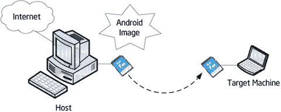
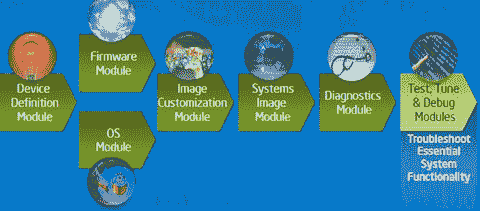

# 六、Android 的定制和安装

Keywords Embed System Image File Target Machine Android Phone Android System

由于任何嵌入式系统的特性，如资源限制，裁剪和定制是嵌入式操作系统的重要特性，Android 也不例外。本章提供了嵌入式操作系统定制的一般讨论，然后具体解释了 Android 的定制。

## 嵌入式操作系统的裁剪和定制

并非嵌入式操作系统提供的所有功能和服务都包含在特定的嵌入式应用中，原因有二。首先，嵌入式系统总是资源受限的，尤其是在存储空间方面；因此，在发布时不可能在系统中包含所有冗余功能。第二，许多商业嵌入式操作系统根据用户选择的组件收取许可费。因此，用户应该根据自己的需求定制嵌入式操作系统。OS 定制的原理如图 6-1 所示。

图 6-1。

Principle of OS customization

例如，Windows XP Embedded OS 提供了数以万计的组件，比桌面 Windows XP 的功能还要多。例如，对于基于 Windows XP Embedded 的地铁挡板门系统，不需要 Windows Media Player、Internet Explorer 浏览器、DirectX 设置面板和 Explorer 任务管理器等组件。消除这些组件减少了系统所需的硬件资源，从而降低了成本；这使得系统运行更快，从而提高效率。

大多数嵌入式操作系统都提供了定制和裁剪的手段。但是，有许多不同的裁剪模式:有些从编译源代码开始，需要用户配置条件编译的选项；有些从链接目标文件开始，根据用户的配置链接到不同的库文件；其余模式根据用户的选择从现有的二进制文件库中提取预编译文件。表 6-1 列出了常用嵌入式操作系统提供的定制模式。

表 6-1。

Customization Modes of Different Embedded Operating Systems

<colgroup><col> <col></colgroup> 
| 嵌入式操作系统 | 定制模式 |
| --- | --- |
| windows ce(windows ce) | 提供平台构建器 ide 和图形组件选项。根据选定的组件链接不同的库文件。 |
| 嵌入式 Linux | 对于内核，之前通过`make config`生成配置文件；然后根据配置文件进行编译。 |
| 嵌入式 | 提供目标设计器 ide 和图形组件选项。根据选择的组件提取所需的二进制文件；链接过程不需要编译。 |
| μ C/OS-II 战斗机 | 根据头文件中 C 语言宏定义的值，有选择、有条件地编译某部分代码。 |
| 嵌入式系统 | 选择 Tornado IDE 中需要的模块。 |

在系统定制之后，您将获得一个运行在目标硬件设备上的嵌入式操作系统，并且已经针对特殊应用领域进行了优化。

## Android 定制概述

理论上，Android 定制分为两个层次:Linux 内核的定制和整个映像的定制。Linux 内核的定制类似于嵌入式 Linux 的定制:两者都涉及相同的方法和步骤。安卓定制主要以图片定制为主。我们来看看为什么。

### ROM 包/映像

安卓镜像俗称只读存储器(ROM)包，是安卓手机的系统包。之所以有这样的命名约定，是因为安卓手机之前的手机，包括智能手机(如诺基亚、WM)和非智能手机(如索尼爱立信、Moto P2K 平台、MTK)，都有单独的 ROM 芯片存储系统文件。因此，系统文件被称为 ROM 包或 ROM 映像。

该映像是一个交叉编译的二进制 Linux 文件，可以在某个嵌入式设备上安装和运行，成为该设备的操作系统。为了更好地理解这个概念，让我们回顾一下典型的开发过程，如图 6-2 所示。

图 6-2。

Development process for Android software

对于嵌入式软件，一般来说，开发 Android 软件需要和通用软件一样的步骤:设计、编码、编译、链接、打包、部署、调试、优化。对于某些 Android 系统，还需要测试和验证步骤。部署在嵌入式逻辑设备上的 OS 也经历这样的阶段。比如，对于 Linux 系统，你获取它的内核源代码，交叉编译，生成可以在嵌入式目标机上执行的代码；然后你压缩打包这段代码，形成镜像文件(见图 6-3 )。最后一步是部署。与应用文件的部署不同，OS 映像文件的部署由于其操作的特殊性而被称为安装。

图 6-3。

Image use process

嵌入式系统中一个完整的可执行软件系统的镜像文件(包)由 bootloader、OS 内核(简称内核)、文件系统和用户应用组成。实际的映像文件通常采用分区(也称为独立层)结构来存储位于映像不同区域(模块)的所有部分，所有部分都从底层加载到系统中。典型嵌入式系统映像的示例如图 6-4 所示。

图 6-4。

Example of an embedded system image

Android 映像包括引导程序、核心操作系统、硬件适配模块、文件系统、用户体验和应用。Android 的核心 OS 层包括 Linux 内核和各种中间件模块。核心 OS 层下面是硬件适配层。为了适应不同的硬件，需要为操作系统安装多样化的驱动程序。没有这些驱动程序，操作系统就不能像往常一样使用硬件进行操作。因此，映像由驱动程序和用户开发的任何应用组成。

Android 镜像通常以压缩文件(`.zip`、`tar.gz`或类似文件格式)的形式存在，通常包含表 6-2 所示的文件和文件夹。压缩文件解压缩后可以看到文件结构。

表 6-2。

File Structure of an Android Image File

<colgroup><col> <col> <col></colgroup> 
| 名字 | 财产 | 评论 |
| --- | --- | --- |
| `META-IN` | 目录 | 可选；在某些图像中可能不可用 |
| `system` | 目录 |   |
| `boot.img` | 文件 |   |

文件和文件夹的功能和结构如下:

*   `boot.img`文件:系统镜像，包括系统启动的 Linux 内核、bootloader、ramdisk。ramdisk 是一个小文件系统，它保存了初始化系统所需的核心文件。使用名为 mkbootimg 的开源工具创建了`boot.img`文件。
*   `META-INF`目录:系统更新脚本，路径为`META-INF\com\google\android\updater-script`。
*   `system\app`目录:所有系统提供的应用，如日历、通讯录、Gmail 等。您可以将您的应用的`.apk`文件放在这个目录中，这样它就可以在 ROM 刷新时直接安装。
*   `system\bin`目录:`top`等系统命令，可以通过 adb shell 登录后执行。
*   `system\etc`目录:配置文件。
*   `system\font`目录:各种字体。
*   `system\framework`目录:Java 核心文件，比如`.jar`文件。在 Dalvik 虚拟机(DVM)下，支持用户通过 Java 开发的框架。
*   `system\lib`目录:由`.so`文件组成的 Android 本地共享库，这些文件是 ELF 二进制形式的共享对象，由汇编、C 或 C++ 编译。
*   `system\media`目录:媒体文件如`bootanimation.zip`，由`.png`图片组成，用于引导动画和改变引导镜像。在`audio`目录下是一些用作铃声和通知的音频文件。

### Android 图像定制概述

Android 镜像定制，俗称创建 Android ROM(简称 creating ROM)，是一个学术术语。Android 核心 OS 层有多个组件，应用在不同系统中有所不同；映像定制决定将哪些组件和应用写入目标系统的映像文件。该过程将个人定制的系统文件制作成可闪存的 ROM 映像。这也称为系统固件更新。

现成的 Android 映像可以通过 USB 闪存和 SD 卡安装到基于英特尔凌动处理器的系统(即手机、平板电脑等)上。那么具有 Android 映像的系统将能够在自启动时进入 Android 操作环境。最初被称为 TransFlash 卡的 MicroSD 卡是由 SanDisk 推出的。它是 15 × 11 × 1 毫米，大约指甲盖大小。它可以通过 SD 适配卡在 SD 卡插槽中使用，广泛用于手机。

您可以通过以下方式创建 Android ROM:

*   编译 Android 源代码，有点复杂。
*   基于现有的 ROM 创建或定制您自己的 ROM。

Android 图片定制的流程如图 6-5 所示。

图 6-5。

Process of Android image customization

### Android 图像定制示例

下面的例子说明了定制 Android 的第二种方式:使用设备制造商为目标硬件发布的克隆 ROM 映像创建 ROM。这样，Android 定制包括对 Android 系统文件夹的结构解析、应用软件更新和 ROM 签名包的定制。步骤如下:

1.  从 Android 的官方网站、您的手机制造商的官方网站(例如，联想 K900 手机的网站)或提供 Android 图像的网站下载编译的 ROM 包。例如，联想 K900 手机网站([www . Lenovo care . com . cn/product detail . aspx？id = 719](http://www.lenovocare.com.cn/ProductDetail.aspx?id=719))提供的 ROM 如表 6-3 所示。请注意，由于联想 K800 和 K900 手机在中国市场销售，软件日期仅由联想官方网站以中文提供。

表 6-3。

Information in the ROM Package on the Lenovo K900 Website

<colgroup><col> <col> <col> <col></colgroup> 
| ROM 名称 | 描述 | 安卓版本 | 发布日期 |
| --- | --- | --- | --- |
| K900_1_S_2_162_0074 | 官方更新 | 4.0.4 | 2012 年 8 月 8 日 |
| K900_1_S_2_162_0086 | 官方更新 | 4.0.4 | 2012 年 8 月 15 日 |
| K900_1_S_2_019_0113_130903 | 官方更新 | 4.2.0 | 2013 年 9 月 3 日 |
| K900 _ 来源 | 官方更新 | Four point four | 2014 年 5 月 23 日 |

1.  将所有 ROM 文件压缩到一个文件夹中(在本例中命名为“NewsROM”)。
2.  删除和添加 ROM 文件夹中的文件(本例中为 NewsROM ),以定制和定制 Android。

一些自定义示例如下:

*   转到`data\app`目录，检查预装的应用是否是您需要的。此时，您可以删除不必要的应用。您也可以添加您需要的默认安装的应用。
*   转到`system\app`目录，为您的设备定制系统应用。您可以删除不需要的系统应用或添加您特别构建或定制的应用(作为定制的`.apk`文件)。小心:一些系统应用依赖于其他应用，因此最佳实践是在定制之前进行测试，以在实现对 Android 系统映像的更改之前修复依赖性和其他问题。
*   转到`system\media`目录进行修改，如更改启动映像或添加自定义铃声。
*   转到`system\bin`目录添加命令等等。

如果您担心意外删除一些文件从而导致启动失败，您应该采取保守的方法:仅对`data/app`和`system/app`文件夹中的文件执行删除或添加操作。

1.  将修改后的 ROM 文件夹压缩为一个`.zip`文件。双击压缩文件时，确保显示内容，包括`META-INF`、`system`、`boot.img`、`data`(可选)。
2.  安装和配置 Java 环境。以下步骤需要 Java 环境来支持自动签名工具的操作，因此您需要安装和设置 Java 操作。下载最新的 JDK(本例中为 jdk1.7.0)，并安装；然后按照以下步骤操作:
    1.  设置 Java 环境变量如下:右键单击我的电脑，在弹出的快捷菜单中选择[属性]➤[高级]➤[环境变量]➤[系统变量]➤[新建]。
    2.  在对话框中，将【变量名】设置为“JAVA_HOME 变量值:JAVA 安装目录”。在同一个地方找到【路径】，双击，添加“C:\ JDK 1 . 7 . 0；。；变量值后的 C:\JDK1.7.0\bin "。
    3.  重启系统。
    4.  测试。在命令行窗口中输入 Java 命令。如果没有出现错误消息，则配置成功。 
3.  使用`sign`工具对`.zip`包进行签名。步骤如下:
    1.  下载自动签名工具并将其解压到一个目录下(本例中为`myautosign`)。该工具可在 [`http://androidforums.com/developer-101/8665-how-signing-roms.html`](http://androidforums.com/developer-101/8665-how-signing-roms.html) 下载。
    2.  将`.zip`文件包重命名为`update.zip`，并复制到您解包自动签名的目录下(`myautosign`目录)。
    3.  运行解压自动签名的目录下的`sign.bat`文件。
    4.  定制构建完成后，目录中包含一个`update_signed.zip`文件，这个文件就是你需要的签名 ROM 包和定制 ROM 包。 

### Android 映像的安装/刷新

需要安装映像才能在目标机器上使用定制的映像。换句话说，镜像定制和使用的过程必须经过镜像生成(生产)和镜像安装两个阶段，如图 6-6 所示。

图 6-6。

Image generation and installation

映像安装意味着在目标设备或模拟器上安装 Android 映像。这一过程通常被称为重新刷新。重新刷机安卓手机相当于给手机重装系统，类似于电脑系统重装。一般来说，当计算机需要重新安装系统时，您会使用系统盘或映像文件。当 Android 手机需要刷新时，您可以通过工具将官方或第三方 ROM 镜像文件刻录到 ROM 中，并为手机安装新系统。

Android 官方网站经常为用户发布最新的 Android 图像系统，你可以直接下载图像文件，跳过图像生成阶段。对于用户来说，定制和安装过程非常简单:下载映像，然后刷新。

Android 安装还涉及恢复和擦除:

*   恢复是移动设备的一种模式。通过恢复，用户可以安装系统(即刷新 ROM)，清空手机中的各种数据，对存储卡进行分区，备份和恢复数据等等。恢复类似于电脑上的 Ghost 一键恢复功能。
*   擦拭的意思是擦掉和除去。擦除是恢复模式中的一个选项；它从手机中删除各种数据，类似于恢复出厂默认设置。擦除最常用于重新刷新之前。用户可能会看到擦除提示，提示需要在刷新前清除数据。

如前所述，Android 安装本质上是软件交叉开发过程中的部署问题，但一般你采用离线编程，而不是在线编程。在安装过程中，您使用的介质是 SD 卡和其他便携式外部存储设备。该过程如图 6-7 所示。安装分为两步:第一步，将来自主机的镜像放在便携 SD 卡外存设备上；第二，从便携外接存储设备启动机器，在目标机器上安装 Android。

图 6-7。

Android image installation

### 映像安装示例

以下是映像安装的示例。路径/目录可能因不同的 OEM 或不同的 Android 版本而异(此示例基于联想手机):

1.  清空手机的 SD 卡。此步骤是可选的，可以在主机或电话上完成。在主机上完成步骤非常简单:从手机上拔下 SD 卡，插入主机的 SD 卡读卡器，在主机上(比如在 Windows 中)删除可移动磁盘上的所有文件。

按照以下步骤清空手机上的 SD 卡:

1.  将手机连接到主机。
2.  在主机的命令行窗口中连续执行以下命令:

`adb devices`

`adb remount`

`adb shell`

`su`

`rm -r /system/sd/*`

1.  将自定义的 ROM 文件(示例中为`update_signed.zip`)复制到 SD 卡上，重命名为`update.zip`。
2.  确保 SD 卡已插入手机。重启手机，进入恢复模式。请遵循以下步骤:
    1.  正常关机。
    2.  同时按下设备的电源键和<volume>键:手机震动启动，进入 BKB 预配置操作系统模式。快速双击<volume>按钮，系统进入测试模式。</volume></volume>
    3.  按<volume>和<volume->移动到第六个选项(标清更新)，点击左下角的回车。自动刷新开始。</volume-></volume> 
3.  重启。

*   (注意:`sdcard`通常安装在`/storage/sdcard0`或`/sdcard`下，然而，如果你使用的是来自不同 OEM 的设备或另一个 Android 版本，位置可能会有所不同。)

整个刷新过程需要几分钟。手机震动两下自动重启；第一次重启需要更长时间，然后出现熟悉的四叶草界面。

重启后，选择设置➤系统信息检查手机，网络，电池，和版本信息；IMEI 码；和内部版本号，以确认升级是否成功。

#### 使用 flash_device.sh 实现过程自动化

有一个脚本将为您执行前面描述的所有过程。该脚本位于以下位置:

`<Path-to-your-project>/vendor/intel/support/flash_device.sh`

您可以将该脚本添加到您的`bin`文件夹中，并从终端窗口运行它。您应该可以在 OEM 的用户手册中找到关于此主题的章节。

### 英特尔构建工具套件

英特尔开发了一套 Android 构建工具套件(见图 6-8 )来帮助开发人员轻松快速地进行 Android 系统构建和定制。该套件提供以下功能:

图 6-8。

Intel Build Tools Suite

*   设备定制
*   能够生成定制的固件模块和 Android 操作系统映像
*   最终定制和本地化
*   能够编译单个图像并将图像加载到支持的设备中
*   验证配置就绪的能力
*   故障排除和校准

## 摘要

本章完成了对 Android 系统级主题的讨论。从下一章开始，您将开始学习在 x86 平台上为 Android 开发应用，并了解如何在 Android 平台上开发适合移动设备 UX 和交互特性的用户界面。你从学习 Android 图形用户界面(GUI)设计开始，因为它是人机交互(HCI)不可或缺的一部分。由于手机或平板电脑的资源有限，Android 系统的 GUI 设计比桌面系统更具挑战性。此外，用户对用户友好的体验有更严格的要求和期望。界面设计已经成为决定市场上 Android 应用成功的重要因素之一。

 Open Access This chapter is licensed under the terms of the Creative Commons Attribution-NonCommercial-NoDerivatives 4.0 International License ( [ http://​creativecommons.​org/​licenses/​by-nc-nd/​4.​0/​ ](http://creativecommons.org/licenses/by-nc-nd/4.0/) ), which permits any noncommercial use, sharing, distribution and reproduction in any medium or format, as long as you give appropriate credit to the original author(s) and the source, provide a link to the Creative Commons licence and indicate if you modified the licensed material. You do not have permission under this licence to share adapted material derived from this chapter or parts of it. The images or other third party material in this chapter are included in the chapter’s Creative Commons licence, unless indicated otherwise in a credit line to the material. If material is not included in the chapter’s Creative Commons licence and your intended use is not permitted by statutory regulation or exceeds the permitted use, you will need to obtain permission directly from the copyright holder.