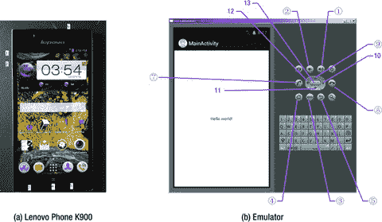
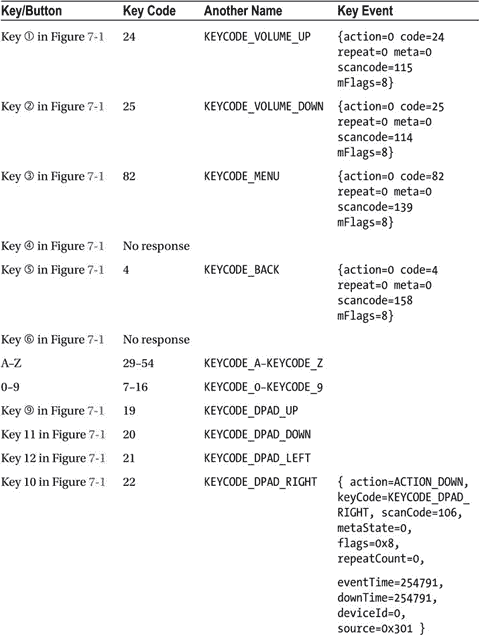
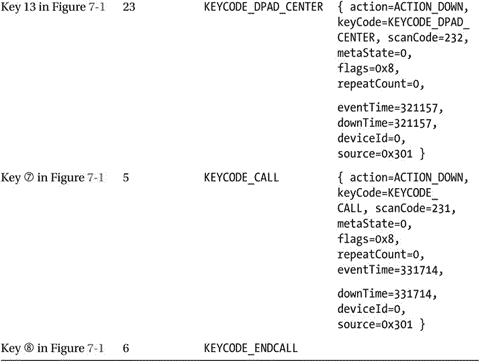
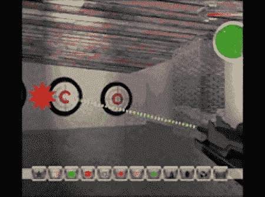
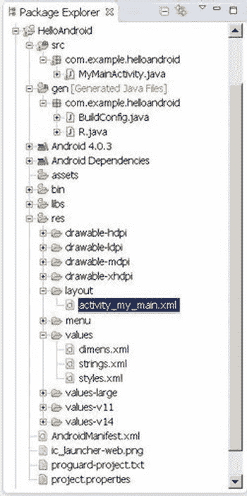
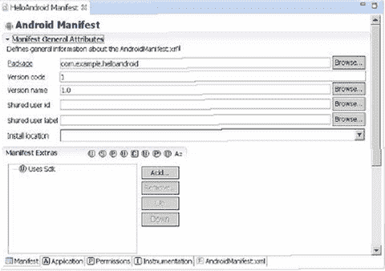
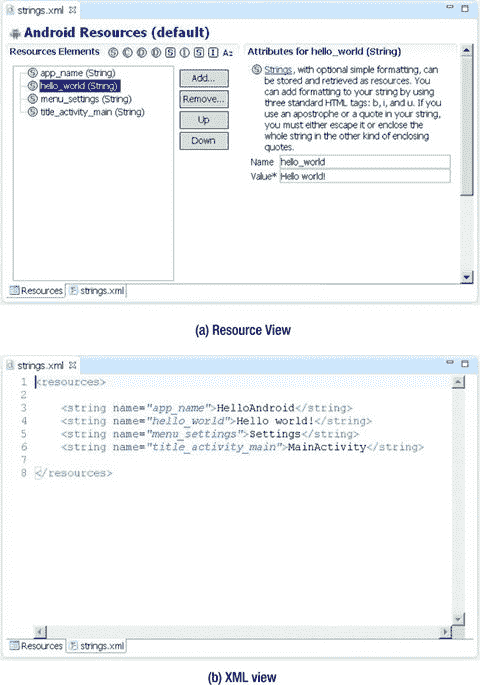
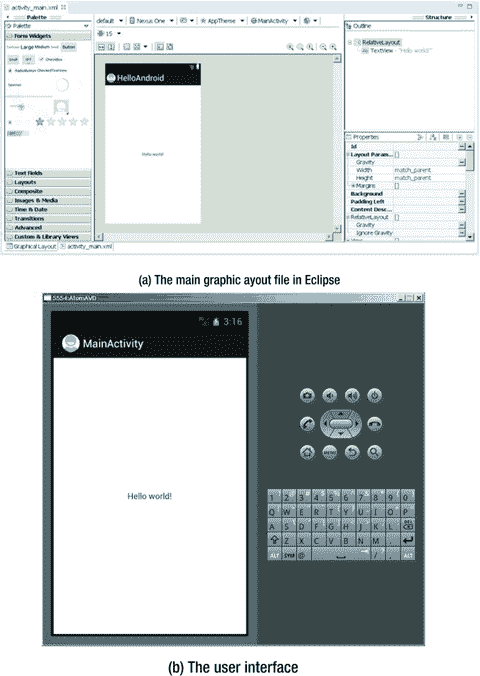
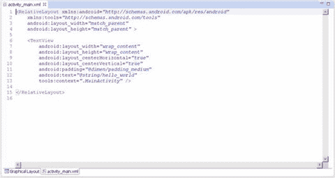

# 七、Android 应用的 GUI 设计第一部分：概述

Keywords Virtual Machine Desktop Computer Touch Screen Content Provider Java Virtual Machine

自从 20 世纪 80 年代出现以来，图形用户界面(GUI)的概念已经成为人机交互不可或缺的一部分。随着嵌入式系统的发展，它们也逐渐采用了这个概念。运行在英特尔凌动硬件平台上的 Android 嵌入式操作系统处于这一趋势的最前沿。

由于资源有限，Android 系统的 GUI 设计比桌面系统更具挑战性。此外，用户对高质量的用户体验有着更加严格的要求和期望。界面设计已经成为决定市场上系统和应用成功的重要因素之一。本章介绍了如何在 Android 嵌入式系统上开发适合典型用户交互的用户界面。

## 嵌入式应用的图形用户界面综述

如今，软件的用户界面(UI)和用户体验(UX)是决定软件是否被用户接受并取得市场成功的越来越重要的因素。UX 设计基于输入/输出或交互设备的类型，必须符合它们的特性。与桌面计算机系统相比，Android 系统具有不同的交互设备和模式。如果一个桌面的 UI 设计被不加选择地复制，一个 Android 设备将呈现一个可怕的 UI 和难以忍受的 UX，用户无法接受。此外，随着对引人注目的用户体验有了更高的期望，开发人员在设计系统 ui 和 UXs 时必须更加细致和小心，使它们符合嵌入式应用的特征。

本章首先介绍了桌面系统的通用 GUI 设计方法，然后展示了为嵌入式系统设计 UI 的不同之处。目的是帮助你快速掌握 Android 应用 GUI 设计的一般方法和原则。

### Android 设备交互模式的特征

通用台式计算机具有强大的输入/输出(或交互)设备，如大的高分辨率屏幕、全键盘和鼠标以及各种交互方式。典型的台式计算机屏幕至少为 17 英寸，分辨率至少为 1280×960 像素。键盘一般是全键盘或者增强型键盘。在全键盘上，字母、数字和其他字符位于相应的键上，也就是说，全键盘提供与所有字符对应的键。增强型键盘有额外的按键。全键盘上的键间距约为 19 mm，方便用户进行选择。

基于屏幕、键盘和鼠标的桌面计算机的 GUI 交互模式被称为 WIMP(窗口、图标、菜单和指针)，这是一种使用这些元素以及包括按钮、工具栏和对话框在内的交互元素的 GUI 风格。WIMP 依靠屏幕、键盘和鼠标设备来完成交互。例如，鼠标(或类似于鼠标的设备，如光笔)用于指向，键盘用于输入字符，屏幕显示输出。

除了屏幕、键盘、鼠标和其他标准交互硬件之外，台式计算机还可以配备操纵杆、头盔、数据手套和其他多媒体交互设备来实现多媒体计算功能。通过安装摄像头、麦克风、扬声器和其他设备，并凭借其强大的计算能力，用户可以以语音、手势、面部表情和其他形式与台式计算机进行交互。

台式电脑一般也配有 CD-r om/DVD 等大容量便携式外部存储设备。有了这些外部存储设备，台式电脑就可以通过 CD/DVD 发布软件，验证所有权和证书。

由于嵌入式系统的可嵌入性和有限的资源，以及用户对便携性和移动性的需求，Android 系统具有不同于桌面系统的交互模态、方法和能力。由于这些特点和条件，Android 系统上的交互比桌面系统上的交互要求更高，也更难实现。

接下来描述 Android 设备和桌面计算机之间的主要区别。

#### 各种尺寸、密度和规格的屏幕

与台式电脑上的大型高分辨率屏幕不同，Android 设备屏幕更小，具有各种尺寸和密度，以每英寸点数(DPI)来衡量。比如 K900 智能手机的屏幕是 5.5 英寸，分辨率为 1920 ×1080 像素，有的智能手机屏幕只有 3.2 英寸。

Android 设备屏幕的长宽比并不是台式电脑使用的 16:9 或 4:3 的常规长宽比。如果 Android 设备采用桌面计算机的交互模式，将会导致许多问题，如显示模糊和选择目标错误。

#### 键盘和特殊按键

台式电脑有全键盘，一个键对应一个字符，键与键之间的距离很大，这使得打字很方便。如果 Android 设备有键盘，通常是小键盘而不是全键盘。小键盘的按键比全键盘少；几个字符通常共享一个键。与全键盘相比，小键盘的按键更小、间隔更紧，这使得选择和键入字符更加困难。因此，小键盘不如全键盘使用方便。此外，一些小键盘提供了标准全键盘上没有的特殊键，因此用户必须在 Android 设备上调整他们的输入。

一般来说，在 Android 设备上，按键和按钮是一个统一的概念。无论您按下按钮还是按键，该操作都被作为具有统一编号方案的键盘事件来处理。Android 中的键盘事件都有对应的`android.view.KeyEvent`类。图 7-1 的按钮/按键标注对应于表 7-1 中列出的事件信息。

图 7-1。

Keyboard and buttons of an Android phone

详情参见`android.view.KeyEvent`的帮助文档。表 7-1 的内容为摘录。

表 7-1。

Android Event Information Corresponding to Key and Button Events

 

#### 触摸屏和触控笔，取代了鼠标

触摸屏是覆盖显示设备以记录触摸位置的输入设备。通过使用触摸屏，用户可以对显示的信息有更直观的反应。触摸屏广泛应用于 Android 设备，并取代鼠标进行用户输入。最常见的触摸屏类型是电阻式触摸屏、电容式触摸屏、表面声波触摸屏和红外触摸屏，其中电阻式和电容式触摸屏最常应用于 Android 设备。用户可以直接点击屏幕上的视频和图像进行观看。

手写笔可以用来执行类似于触摸的功能。有些触控笔是触摸屏的辅助工具，可以代替手指，帮助用户完成精细的指点、选择、画线等操作，尤其是在触摸屏比较小的情况下。其他触控笔与其他系统组件一起实现触摸和输入功能。使用第一种辅助工具触控笔，用户可以用手指触摸和输入字符。但是第二种输入笔是不可或缺的输入工具，用来代替手指。

触摸和触控笔可以执行鼠标通常会做的大部分功能，如点击和拖动，但不能实现鼠标的所有功能，如同时单击右键和左键/右键。在设计嵌入式应用时，应该将交互方式控制在触摸屏或触控笔所能提供的功能范围内，避免不可用的操作。

#### 屏幕键盘

屏幕键盘，也称为虚拟键盘或软键盘，通过软件显示在屏幕上。用户敲击虚拟键就像他们敲击物理键盘上的键一样。

#### 很少多模态交互

多模态交互是指人机交互，其模式涉及人类的五种感官。它允许用户通过语音、手写和手势等输入方式进行交互。因为计算能力有限，安卓设备一般不采用多模态交互。

#### 少数大容量便携式外部存储设备

大多数 Android 设备没有 CD-ROM/DVD 驱动器、硬盘或其他大容量便携式存储外设，如通常在台式计算机上配置的固态驱动器(SSD)。这些设备不能在 Android 设备上安装软件或验证所有权和证书。然而，Android 设备通常支持 microSD 卡，现在的容量高达 128 GB 越来越多的基于云的存储解决方案，如 Dropbox、One Drive 和 Google Drive，正在为 Android 设备开发，可以从谷歌 Play 商店下载 Android 兼容的客户端应用。

## 嵌入式系统的用户界面设计原则

本节介绍了将传统桌面应用转换为嵌入式应用时的交互设计问题和纠正措施。

### 屏幕尺寸的考虑因素

与台式电脑系统相比，Android 系统的屏幕更小，显示密度和长宽比也不同。这样的屏幕差异导致应用从桌面系统迁移到 Android 系统时出现很多问题。如果开发人员按比例缩小桌面系统屏幕，图形元素会变得太小而看不清楚。特别是经常很难看到文字和图标，选择并点击一些按钮，并在屏幕上适当放置一些应用图片。如果开发人员将应用图形元素迁移到 Android 系统而不改变它们的大小，屏幕空间是有限的，只能容纳少数图形元素。

#### 文本和图标的大小

另一个问题是文本和图标的大小。当一个应用从典型的 15 英寸桌面屏幕缩小到典型的 5 或 7 英寸手机或平板电脑屏幕时，它的文本太小，看不清楚。除了文本字体的大小之外，文本窗口(如聊天窗口)也会变得太小而无法阅读文本。试图缩小字体以适应较小的窗口会使文本难以识别。

因此，嵌入式系统的设计应尽量少用文本提示信息；例如，用图形或声音信息替换文本。此外，在需要文本的地方，文本大小应该是可调整的。在 Android 上，`res`目录下有一些预定义的字体和图标，比如`drawable-hdpi`、`drawable-mdpi`和`drawable-xhdpi`。

#### 按钮和其他图形元素的可点击性

与小文本的问题类似，按钮和其他图形元素在迁移应用时也会带来交互问题。在桌面系统上，按钮的大小是为鼠标点击而设计的，而在 Android 系统上，按钮的大小应该适合手指(在触摸屏上)或触控笔。因此，当移植一个基于 Windows 的应用来支持 Android 设备时，需要重新设计应用 UI；并且应该选择由 Android SDK 提供的预定义的可绘制图形，以便适合手指或手写笔。

开发人员应该使用更大、更清晰的按钮或图形元素来避免此类问题，并在图形元素之间留有足够的间隙以避免错误，当使用小触摸屏通过手指或触控笔进行选择时，错误是常见的。此外，如果应用在按钮附近有文本标签，标签应该是与按钮相连的可点击区域的一部分，这样按钮更容易点击。

### 应用窗口的大小

许多应用(如游戏)使用固定大小的窗口，而不是自动调整以填充任何大小屏幕的窗口。当这些应用迁移到 Android 系统时，由于屏幕的长宽比与其分辨率不匹配，可能会看不到部分画面，或者部分区域无法到达。

这些问题在智能手机和平板电脑上可能更复杂，因为它们的屏幕有各种密度，如小(426 dp × 320 dp)、正常(470 dp × 320 dp)、大(640 dp × 480 dp)和超大(960 dp × 720 dp)。它们的长宽比各不相同，不同于桌面系统通常采用的长宽比。

解决此类问题的一个好方法是将整个应用窗口按比例放置在智能手机或平板电脑屏幕上，比如大屏幕和超大屏幕，通常为 640 × 480 像素和 960 × 720 像素；或者重新排列 UI，充分利用整个宽屏区域；或者使整个应用窗口成为可滚动视图。此外，您可以允许用户使用多个触摸手指触摸来放大、缩小或移动屏幕上的应用窗口。

### 触摸屏和触控笔带来的考虑

如前所述，许多 Android 系统使用触摸屏和触控笔来执行一些传统的鼠标功能。这种输入设备被称为。然而，仅点击的触摸屏不能提供所有的鼠标功能。没有右键，不触摸屏幕时无法捕捉当前手指/手写笔位置。因此，桌面应用允许在不点击的情况下移动光标、左键和右键的不同操作等功能，无法在使用触摸屏和触控笔的 Android 系统上实现。

下面几节讲的是在使用只需轻触的触摸屏将应用从桌面系统迁移到 Android 系统时经常看到的几个问题。

#### 正确解释仅点击触摸屏上光标(鼠标)的移动和输入

当没有按下鼠标键时，许多应用需要鼠标移动信息。这个操作叫做。例如，很多 PC 射击游戏 1 模拟用户的视野，以至于移动鼠标而不点击被解释为移动游戏玩家的视野；但是光标应该总是停留在新视野的中间。然而，具有仅点击触摸屏的嵌入式设备不支持移动光标而不点击的操作。一旦用户的手指触摸到屏幕，就会触发一个点击事件。当用户在屏幕上移动手指时，触发一系列不同位置的点击事件；这些事件被现有的游戏代码解释为额外的交互事件(即移动游戏玩家枪的瞄准位置)。

将这类应用迁移到 Android 系统时，需要修改原有的交互模式。比如这个问题可以修改为点击操作:一旦用户触摸屏幕，游戏屏幕要立即切换到视野，在视野中光标位于屏幕中心。这样，光标总是显示在屏幕中心，而不是用户实际触摸的位置。您在移动平台上受益的一个优势是，市场上的大多数智能手机和平板电脑都配备了加速度计、陀螺仪、GPS 传感器和指南针等传感器，它们允许应用从传感器中读取数据。因此，开发人员有更多的选择，而不仅仅是触摸输入。

更一般地，如果应用需要跟踪光标从点 A 到点 B 的移动，则仅点击触摸屏可以通过用户首先点击点 A 然后点击点 B 来定义该输入，而不需要跟踪点 A 和点 B 之间的移动

#### 正确设置屏幕映射

许多应用以全屏模式运行。如果这样的应用不能完美地填充整个仅点击触摸屏(也就是说，它们比屏幕小或大)，输入映射错误将导致:显示位置和点击位置之间存在偏差。

在将全屏应用迁移到具有低纵横比的仅点击触摸屏时，经常出现的一种情况是应用窗口位于屏幕中央，两边显示空白区域。例如，当分辨率为 640 × 480(或 800 × 600)像素的桌面应用窗口迁移到分辨率为 960 × 720(或 1280 × 800，Dell Venue 8 上的 WXGA)像素的仅点击触摸屏时，它会出现在屏幕上，如图 7-2 所示。由此产生的映射错误会导致应用错误地响应用户交互。当用户点击黄色箭头(目标)的位置时，应用识别的位置就是红色爆炸图标所在的点。当用户点击按钮时，也会出现这种错误。

图 7-2。

Screen-mapping errors due to a low aspect ratio

您应该考虑位置映射逻辑，并考虑这个空白空间，即使这个空白空间不是迁移应用窗口的一部分。通过进行这些改变，仅点击触摸屏可以正确地映射触摸位置。

另一种情况发生在桌面全屏窗口被迁移到具有更高纵横比的仅点击触摸屏时。原始应用窗口的高度不适合仅点击的触摸屏，并且映射错误发生在垂直方向而不是水平方向。

图 7-3 显示了原始应用窗口水平填充屏幕，但在具有更高纵横比的仅点击触摸屏上不是垂直填充屏幕。这里，当用户点击黄色箭头(目标)的位置时，应用识别的位置就是红色爆炸图标所在的点。这些错误是由物理显示和应用窗口之间的形状差异引起的。

图 7-3。

Screen-mapping errors due to a high aspect ratio

一种解决方案是确保操作系统准确地将仅点击触摸屏映射到屏幕的整个可视区域。操作系统提供特殊服务来完成屏幕拉伸和鼠标位置映射。另一个解决方案是在应用开发之初，考虑允许配置选项支持 Android SDK 提供的预配置显示密度和纵横比，例如分辨率为 640 × 480、960 × 720 或 1，080 × 800 像素的屏幕。这样，如果最终的尺寸变形是可接受的，应用可以自动拉伸窗口以覆盖整个屏幕。

#### 如何解决悬停问题

许多应用允许悬停操作:也就是说，用户可以将鼠标放在某个对象上，或将鼠标放在应用图标上，以触发动画项目或显示工具提示。该操作常用于为游戏中的新玩家提供指令；但是它与仅点击触摸屏的特征不兼容，因为它们不支持鼠标悬停操作。

您应该考虑选择一个替代事件来触发动画或提示。例如，当用户触摸应用的操作时，自动触发相关的动画主题和提示。另一种方法是设计一种界面交互模式，将点击事件暂时解释为鼠标悬停事件。例如，按下某个按钮并移动光标的动作不会被解释为点击操作。

#### 提供右击功能

如前所述，仅点击触摸屏一般不支持鼠标右键操作。一种常用的替代方法是延迟触摸(比点击时间长得多)来表示右键单击。如果用户意外地过早松开手指，这可能导致错误的操作发生。此外，该方法不能同时执行左键单击和右键单击(也称为双击)。

你应该提供一个用户交互界面来代替右击功能:例如，使用双击或者在屏幕上安装一个可点击的控件来代替右击。

### 键盘输入问题

如前所述，台式电脑使用全键盘，而 Android 系统通常有更简单的小键盘、按钮面板、用户可编程按钮和有限数量的其他输入设备。这些限制在设计桌面系统中看不到的嵌入式应用时会导致一些问题。

#### 限制各种命令的输入

Android 系统上的键盘限制使得用户很难键入大量字符。因此，需要用户输入许多字符的应用，尤其是那些依赖于命令输入的应用，在迁移到 Android 系统时需要进行适当的调整。

一种解决方案是提供一种输入模式，通过减少命令的数量或选择性地使用方便的工具(如菜单项快捷键)来限制字符的数量。更灵活的解决方案是在屏幕上创建命令按钮，尤其是上下文相关的按钮(即只在需要时才出现的按钮)。

#### 满足键盘需求

应用需要键盘输入，例如命名文件、创建个人数据、保存进度和支持在线聊天。大多数应用倾向于使用屏幕键盘输入字符，但屏幕键盘并不总是运行或显示在应用界面的前端，这使得字符输入问题难以解决。

一种解决方案是为应用设计一种与屏幕键盘应用没有明显冲突的模式(例如，不使用全屏默认操作模式)，或者在 UI 中提供一个仅在需要时出现的屏幕键盘。另一种最小化键盘输入的简单方法是提供默认的文本字符串值，如个人数据的默认名称和保存文件的默认名称，并允许用户通过触摸来选择。若要获取文本字符串所需的其他信息(例如，文件名称的前缀和后缀)，您可以添加一个选择按钮，该按钮提供您已建立的字符串列表，用户可以从中进行选择。通过组合从屏幕上提取的各种用户信息项或者甚至使用日期-时间标记，也可以唯一地获得保存文件的名称。一些文本输入服务(比如聊天服务)如果不是应用的核心功能，应该被禁用。这不会对用户体验造成任何负面影响。

### 软件分发和版权保护问题

台式电脑一般配有 CD-ROM/DVD 驱动器，其软件一般通过 CD/DVD 发行。此外，出于反盗版目的，CD/DVD 安装通常要求用户验证磁盘的所有权或从 CD/DVD 动态加载内容，尤其是视频文件。然而，Android 系统(例如智能手机和平板电脑)通常没有 CD-ROM/DVD 驱动器；Android 确实支持外置的 microSD 卡，但是直接从里面安装应用还是不支持的。

一个好的解决方案是允许用户通过互联网下载或安装应用，而不是从 CD/DVD 安装。消费者直接从苹果应用商店、Google Play 和亚马逊应用商店等应用商店购买和安装应用。这种流行的软件发布模式允许移动开发者使用证书、在线账户或其他基于软件的方式来验证所有权，而不是物理 CD/DVD。同样，您应该考虑提供将内容放在在线云服务上的选项，而不是要求用户从 CD/DVD 下载视频和其他内容。

## Android 应用概述

以下部分描述了 Android 应用的应用文件框架和组件结构。

### 应用文件框架

图 7-4 显示了 HelloAndroid app 生成后的文件结构(这是一个 Eclipse 截图)。

图 7-4。

Example file structure of an Android project

即使您没有使用 Eclipse，您也可以直接访问项目文件夹并看到相同的文件结构，如下所示:

`E:\Android Dev\workspace\HelloAndroid>TREE /F`

`E:.`

`│  .classpath`

`│  .project`

`│  AndroidManifest.xml`

`│  ic_launcher-web.png`

`│  proguard-project.txt`

`│  project.properties`

`│`

`├─.settings`

`│      org.eclipse.jdt.core.prefs`

`│`

`├─assets`

`├─bin`

`│  │  AndroidManifest.xml`

`│  │  classes.dex`

`│  │  HelloAndroid.apk`

`│  │  resources.ap_`

`│  │`

`│  ├─classes`

`│  │  └─com`

`│  │      └─example`

`│  │          └─helloandroid`

`│  │                  BuildConfig.class`

`│  │                  MainActivity.class`

`│  │                  R$attr.class`

`│  │                  R$dimen.class`

`│  │                  R$drawable.class`

`│  │                  R$id.class`

`│  │                  R$layout.class`

`│  │                  R$menu.class`

`│  │                  R$string.class`

`│  │                  R$style.class`

`│  │                  R.class`

`│  │`

`│  └─res`

`│      ├─drawable-hdpi`

`│      │      ic_action_search.png`

`│      │      ic_launcher.png`

`│      │`

`│      ├─drawable-ldpi`

`│      │      ic_launcher.png`

`│      │`

`│      ├─drawable-mdpi`

`│      │      ic_action_search.png`

`│      │      ic_launcher.png`

`│      │`

`│      └─drawable-xhdpi`

`│              ic_action_search.png`

`│              ic_launcher.png`

`│`

`├─gen`

`│  └─com`

`│      └─example`

`│          └─helloandroid`

`│                  BuildConfig.java`

`│                  R.java`

`│`

`├─libs`

`│      android-support-v4.jar`

`│`

`├─res`

`│  ├─drawable-hdpi`

`│  │      ic_action_search.png`

`│  │      ic_launcher.png`

`│  │`

`│  ├─drawable-ldpi`

`│  │      ic_launcher.png`

`│  │`

`│  ├─drawable-mdpi`

`│  │      ic_action_search.png`

`│  │      ic_launcher.png`

`│  │`

`│  ├─drawable-xhdpi`

`│  │      ic_action_search.png`

`│  │      ic_launcher.png`

`│  │`

`│  ├─layout`

`│  │      activity_main.xml`

`│  │`

`│  ├─menu`

`│  │      activity_main.xml`

`│  │`

`│  ├─values`

`│  │      dimens.xml`

`│  │      strings.xml`

`│  │      styles.xml`

`│  │`

`│  ├─values-large`

`│  │      dimens.xml`

`│  │`

`│  ├─values-v11`

`│  │      styles.xml`

`│  │`

`│  └─values-v14`

`│          styles.xml`

`│`

`└─src`

`└─com`

`└─example`

`└─helloandroid`

`MainActivity.java`

我们来解释一下这个 Android 项目文件结构的特点:

*   `src`目录:包含所有源文件。
*   `R.java`文件:由 Eclipse 中集成的 Android SDK 自动生成。您不需要修改其内容。
*   Android 库:Android 应用使用的一组 Java 库。
*   目录:主要存储多媒体文件和其他文件。
*   目录:存储预配置的资源文件，如应用使用的可绘制布局。
*   `values`目录:主要存放`strings.xml`、`colors.xml`、`arrays.xml`。
*   `AndroidManifest.xml`:相当于一个应用配置文件。包含应用的名称、活动、服务、提供者、接收者、权限等等。
*   目录:主要存储应用使用的图像资源。
*   目录:主要存储应用使用的布局文件。这些布局文件是 XML 文件。

类似于一般的 Java 项目，`src`文件夹包含项目的所有`.java`文件；一个`res`文件夹包含所有的项目资源，比如应用图标(可绘制)、布局文件和常量值。

接下来的部分将介绍每个 Android 项目的必备文件`AndroidManifest.xml`和其他 Java 项目中包含的`gen`文件夹中的`R.java`文件。

#### AndroidManifest.xml

该文件包含有关您的应用的信息，这些信息对于 Android 系统至关重要，系统在运行任何应用代码之前必须拥有这些信息。这些信息包括项目中使用的活动、服务、许可、提供者和接收者。示例如图 7-5 所示。

图 7-5。

The content of `AndroidManifest.xml` displayed in Eclipse

该文件的代码如下:

`<manifest xmlns:android="`[`http://schemas.android.com/apk/res/android`](http://schemas.android.com/apk/res/android)

`package="com.example.helloandroid"`

`android:versionCode="1"`

`android:versionName="1.0" >`

`<uses-sdk`

`android:minSdkVersion="8"`

`android:targetSdkVersion="15" />`

`<application`

`android:icon="@drawable/ic_launcher"`

`android:label="@string/app_name"`

`android:theme="@style/AppTheme" >`

`<activity`

`android:name=".MyMainActivity"`

`android:label="@string/title_activity_my_main" >`

`<intent-filter>`

`<action android:name="android.intent.action.MAIN" />`

`<category android:name="android.intent.category.LAUNCHER" />`

`</intent-filter>`

`</activity>`

`</application>`

`</manifest>`

`AndroidManifest.xml`文件是 XML 格式的文本文件，每个属性由一个`name = value`对定义。例如，在 Android 中，`label = "@ string / title_activity_my_main", label`表示 Android 应用的名称为`activity_my_main`。

元素由一个或多个属性组成，每个元素由开始(`<`)和结束(`/>`)标记包围:

`<Type Name [attribute set]> Content </ type name>`

`<Type Name  Content />`

格式`[attribute set]`可以省略；例如，`<intent-filter> ... </ intent-filter>`文本段对应元素的活动内容，`<action... />`对应`action`元素。

XML 元素嵌套在层中以指示它们的从属关系，如前面的示例所示。`action`元素嵌套在`intent-filter`元素中，说明了`intent-filter`属性或设置的某些方面。关于 XML 的详细信息超出了本书的范围，但是有许多优秀的 XML 书籍可供参考。

在这个例子中，`intent-filter`描述了一个活动启动的位置和时间，并且每当一个活动(或 OS)要执行一个操作时，创建一个`intent`对象。`intent`对象携带的信息可以描述你想做什么，你想处理哪些数据和数据类型，以及其他信息。Android 比较每个应用暴露的`intent-filter`数据，找到最合适的活动来处理调用者指定的数据和操作。

表 7-2 中列出了`AndroidManifest.xml`文件中主要属性条目的描述。

表 7-2。

The Main Attribute Entries in the `AndroidManifest.xml` File

<colgroup><col> <col></colgroup> 
| 参数 | 描述 |
| --- | --- |
| `Manifest` | 包含包中所有内容的根节点。 |
| `xmlns:android` | 包含命名空间的清单。`xmlns:android=` [`http://schemas.android.com/apk/res/android`](http://schemas.android.com/apk/res/android) 。使各种标准属性在文件中可用，并为大多数元素提供数据。 |
| `package` | 清单应用包。 |
| `Application` | 包含包中应用级组件清单的根节点。该元素还可以包含应用的一些全局和默认属性，如标签、图标、主题和必要的权限。一个清单可以包含零个或一个(不超过一个)元素。 |
| `android:icon` | 应用的图标。 |
| `android:label` | 应用的名称。 |
| `Activity` | 用户启动应用时要加载的初始页面的名称。它是用户交互的重要工具。当执行其他活动或通过其他活动标志显示其他活动时，会显示大多数其他页面。注意:无论是在外部使用还是在自己的包中使用，每个活动都必须有一个对应的`<activity>`标志。如果活动没有对应的标志，则不能操作。此外，为了支持搜索活动，一个活动可以包含一个或几个`<intent-filter>`元素来描述它所支持的操作。 |
| `android:name` | 应用启动的默认活动。 |
| `intent-filter` | 通过显示由指定组件支持的`intent`值来形成。除了指定不同类型的值之外，`intent-filter`还可以指定属性来描述操作所需的唯一标签、图标或其他信息。 |
| `Action` | 组件支持的意图动作。 |
| `Category` | 组件支持的意图类别。这里指定了应用启动的默认活动。 |
| `uses-sdk` | 与应用使用的 SDK 版本相关。 |

#### R.java

`R.java`文件是在创建项目时自动生成的。这是一个只读文件，不能修改。R.java 是一个定义项目所有资源的索引文件。例如:

`/* AUTO-GENERATED FILE.  DO NOT MODIFY.`

`... ...`

`*/`

`package com.example.helloandroid;`

`public final class R {`

`public static final class attr {`

`}`

`public static final class dimen {`

`public static final int padding_large=0x7f040002;`

`public static final int padding_medium=0x7f040001;`

`public static final int padding_small=0x7f040000;`

`}`

`public static final class drawable {`

`public static final int ic_action_search=0x7f020000;`

`public static final int ic_launcher=0x7f020001;`

`}`

`public static final class id {`

`public static final int menu_settings=0x7f080000;`

`}`

`public static final class layout {`

`public static final int activity_my_main=0x7f030000;`

`}`

`public static final class menu {`

`public static final int activity_my_main=0x7f070000;`

`}`

`public static final class string {`

`public static final int app_name=0x7f050000;`

`public static final int hello_world=0x7f050001;`

`public static final int menu_settings=0x7f050002;`

`public static final int title_activity_my_main=0x7f050003;`

`}`

`public static final class style {`

`public static final int AppTheme=0x7f060000;`

`}`

`}`

可以看到这段代码中定义了很多常量。这些常量的名称与`res`文件夹中的文件名相同，证明`R.java`文件存储了项目所有资源的索引。有了这个文件，在应用中使用资源和标识所需资源就更加方便了。因为此文件不允许手动编辑，所以只需在向项目中添加新资源时刷新项目。`R.java`文件自动生成所有资源的索引。

#### 常数定义文件

项目的`values`子目录包含字符串、颜色和数组常量的定义文件；字符串常量定义在`strings.xml`文件中。这些常量被 Android 项目中的其他文件使用。

Eclipse 为`strings.xml`文件提供了两个图形视图选项卡，Resources 和 strings.xml。Resources 选项卡提供了`name-value`的结构化视图，strings.xml 选项卡直接显示文本文件格式的内容。HelloAndroid 示例的`strings.xml`文件如图 7-6 所示。

图 7-6。

IDE graphic view of the `strings.xml` file of HelloAndroid

文件内容如下:

`<resources>`

`<string name="app_name">HelloAndroid</string>`

`<string name="hello_world">Hello world!</string>`

`<string name="menu_settings">Settings</string>`

`<string name="title_activity_main">MainActivity</string>`

`</resources>`

代码非常简单；它只定义了四个字符串常量(资源)。

#### 布局文件

布局文件描述了每个屏幕小部件(窗口和小部件的组合)的大小、位置和排列。布局文件是应用的“面孔”。布局文件是 XML 格式的文本文件。

小部件是可视化的 UI 元素，如按钮和文本框。它们相当于 Windows 系统术语中的控件和容器。按钮、文本框、滚动条等等都是小部件。在 Android OS 中，小部件一般属于`View`类及其子类，存储在`android.widget`包中。

应用有一个主布局文件，对应于启动时应用的屏幕显示。例如，HelloAndroid 示例的布局文件和主界面如图 7-7 所示。创建应用时，Eclipse 会自动为应用的主屏幕显示生成一个布局文件。该文件位于项目文件夹的`res\layout`目录中。生成的应用项目中的文件名在下一节中指定:在这种情况下，源代码文件名对应于`[Layout Name]`键，因此文件被命名为`activity_main.xml`。

图 7-7。

The main graphic layout and user interface

当你点击设计窗口(本例中为`activity_main.xml`)时，可以看到 XML 格式的文本文件的相应内容，如图 7-8 所示。

图 7-8。

The main layout file of the HelloAndroid example

该文件的内容如下:

`<RelativeLayout xmlns:android="`[`http://schemas.android.com/apk/res/android`](http://schemas.android.com/apk/res/android)

`xmlns:tools="`[`http://schemas.android.com/tools`](http://schemas.android.com/tools)

`android:layout_width="match_parent"`

`android:layout_height="match_parent" >`

`<TextView`

`android:layout_width="wrap_content"`

`android:layout_height="wrap_content"`

`android:layout_centerHorizontal="true"`

`android:layout_centerVertical="true"`

`android:padding="@dimen/padding_medium"`

`android:text="@string/hello_world"`

`tools:context=".MainActivity" />`

`</RelativeLayout>`

在这段代码中，有几个布局参数:

*   `<RelativeLayout>`:相对位置的布局配置。
*   `android:layout_width`:定制当前视图的屏幕宽度；`match_parent`代表父容器(在本例中是活动)匹配；`fill_parent`填满整个屏幕；`wrap_content`，表示为文本字段，根据该视图的宽度或高度而变化。
*   `android:layout_height`:定制当前视图所占的屏幕高度。

此布局文件中未显示的另外两个通用参数如下:

*   `android:orientation`:此处为水平布局。
*   `android:layout_weight`:为线性布局的多个视图指定一个重要性值。所有视图都被赋予一个`layout_weight`值；默认值为零。

尽管布局文件是一个 XML 文件，但您不必理解它的格式或直接编辑它，因为 Android 开发工具和 Eclipse 提供了一个可视化的设计界面。您只需拖放小部件并在 Eclipse 中设置相应的属性，您的操作就会自动记录在布局文件中。当您在下面几节中浏览应用开发示例时，您可以看到这是如何工作的。

#### 源代码文件

构建项目时，Eclipse 会生成一个默认的`.java`源代码文件，其中包含项目的应用基本运行时代码。它位于`src\com\example\XXX`目录下的项目文件夹中(其中`XXX`是项目名称)。本例中生成的应用项目的文件名是与`[Activity Name]`键相对应的源代码文件名，因此该文件被命名为`MainActivity.java`。

`MainActivity.java`的内容如下:

`package com.example.flashlight;`

`import android.os.Bundle;`

`import android.app.Activity;`

`import android.view.Menu;`

`import android.view.MenuItem;`

`import android.support.v4.app.NavUtils;`

`public class MyMainActivity extends Activity {`

`@Override`

`public void onCreate(Bundle savedInstanceState) {`

`super.onCreate(savedInstanceState);`

`setContentView(R.layout.activity_my_main);`

`}`

`@Override`

`public boolean onCreateOptionsMenu(Menu menu) {`

`getMenuInflater().inflate(R.menu.activity_my_main, menu);`

`return true;`

`}`

`}`

### 应用的组件结构

Android 应用框架为开发者提供了 API。因为应用是用 Java 构建的，所以程序的第一层包含各种控件的 UI 需求。例如，视图(`View`组件)包含列表、网格、文本框、按钮，甚至嵌入式 web 浏览器。

一个 Android 应用通常由五个组件组成:

*   活动
*   意图接收者
*   服务
*   内容供应器
*   意图和意图过滤器

下面几节将对每个组件进行更多的讨论。

#### 活动

具有可视化用户界面的应用是使用活动实现的。当用户从主屏幕或应用启动器中选择一个应用时，它会启动一个动作或活动。每个活动程序通常采用独立界面(屏幕)的形式。每个活动都是一个独立的类，它扩展并实现了活动的基类。这个类显示为 UI，由响应事件的`View`组件组成。

大多数程序都有多个活动(换句话说，一个 Android 应用由一个或多个活动组成)。切换到另一个接口会加载新的活动。在某些情况下，先前的活动可能会给出返回值。例如，让用户选择照片的活动会将照片返回给调用者。

当用户打开一个新界面时，旧界面被挂起并放入历史堆栈(界面切换历史堆栈)。用户可以返回到历史堆栈界面中已经打开的活动。没有历史值的堆栈可以从历史堆栈界面中删除。Android 在运行应用的历史堆栈中保留所有生成的界面，从第一个界面到最后一个界面。

活动是一个容器，它本身不显示在 UI 中。您可以大致将一个活动想象成 Windows 操作系统中的一个窗口，但是视图窗口不仅用于显示，还用于完成一项任务。

#### 意图和意图过滤器

Android 通过一个叫做`intent`的特殊类来实现界面切换。一个`intent`描述了程序做什么。数据结构的两个最重要的部分是动作和根据已建立的规则处理的数据(数据)。典型的操作有`MAIN`(活动入口)、`VIEW`、`PICK`、`EDIT`。操作中使用的数据使用统一资源标识符(URI)表示。例如，要查看一个人的联系信息，您需要使用`VIEW`操作创建一个`intent`，该数据是一个指向该人的 URI 的指针。

与一个`intent`相关联的类被称为一个`IntentFilter`。一个`intent`将一个请求封装成一个对象；`IntentFilter`然后描述一个活动(或者说，一个意图接收者，稍后解释)可以处理什么意图。在前面的例子中，显示一个人的联系信息的活动使用了一个`IntentFilter`，它知道如何处理应用于这个人的数据`VIEW`操作。使用`IntentFilter`的`AndroidManifest.xml`文件中的活动通常通过解析`intent`活动开关来完成。首先，它使用`startActivity (myIntent)`函数来启动新的活动，然后系统地检查所有已安装程序的`IntentFilter`，然后找到与`IntentFilter`对应的`myIntent`最匹配的活动。这个新活动接收来自`intent`的消息，然后开始。`intent`-解析过程实时发生在被调用的`startActivity`中。这个过程有两个优点:

*   活动只发出一个`intent`请求，可以重用其他组件的功能。
*   该活动总是可以被`IntentFilter`的一个等价的新活动替换。

#### 服务

服务是没有用户界面的常驻系统程序。您应该为任何需要连续运行的应用使用服务，例如网络监视器或检查应用更新。

使用服务的两种方式是启动-停止模式和绑定-解除绑定模式。工艺流程图和功能如表 7-3 所示。

表 7-3。

The Usage Model of a Service

<colgroup><col> <col> <col> <col> <col></colgroup> 
| 方式 | 开始 | 目标 | 访问 | 笔记 |
| --- | --- | --- | --- | --- |
| 开始/停止 | `Context.startService()` | `Context.stopService()` |   | 即使`startService`调用的进程结束，服务仍然存在，直到进程调用`stopService()`或者服务导致自己的终止(`stopSelf()`被调用)。 |
| 绑定/解除绑定 | `Context.bindService()` | `Context.unbindService()` | `Context.ServiceConnection()` | 调用`bindService()`时，进程是死的；那么它所绑定的服务必须被终止。 |

当两种模式混合使用时，例如一种模式调用`startService()`而其他模式调用`bindService()`，那么只有当`stopService`调用和`unbindService`调用都发生时，服务才会被终止。

一个服务进程有自己的生命周期，Android 试图保留一个已经启动或绑定的服务进程。服务流程描述如下:

*   如果服务是方法`onCreate()`、`onStart`或`onDestroy()`的实现进程，那么主进程就变成前台进程，以确保这段代码不被停止。
*   如果服务已经启动，其重要性值低于可见流程，但高于所有不可见流程。因为只有少数进程对用户可见，只要内存不是特别低，服务就不会停止。
*   如果多个客户端绑定到该服务，只要其中任何一个客户端对用户可见，该服务就是可见的。

#### 广播意图接收器

当你想执行一些与外部事件相关的代码时，比如在半夜执行一个任务或者响应电话铃声，使用`IntentReceiver`。意向接收者没有 UI，使用`NotificationManager`通知用户他们的事件已经发生。意向接收方在`AndroidManifest.xml`文件中声明，但也可以使用`Context.registerReceiver()`声明。程序不必连续运行来等待`IntentReceiver`被调用。当意图接收器被触发时，系统启动您的程序。节目还可以使用`Context.broadcastIntent()`将自己的意图广播发送给其他节目。

Android 应用可用于处理数据元素或响应事件(如接收文本消息)。Android 应用与一个`AndroidManifest.xml`文件一起被部署到设备上。`AndroidManifest.xml`包含必要的配置信息，以便应用正确安装在设备上。`AndroidManifest.xml`还包括应用可以处理的必要类名和事件类型，以及运行应用的必要权限。例如，如果一个应用需要访问网络，比如说，下载一个文件，清单文件必须在许可证中明确列出。许多应用可能会启用这种特定的许可证。这种声明式安全性有助于降低恶意应用损坏设备的可能性。

### 内容供应器

您可以将内容供应器视为数据库服务器。内容供应器的任务是管理持久的数据访问，比如 SQLite 数据库。如果应用非常简单，您可能不需要创建内容提供者应用。如果您想要构建一个更大的应用，或者需要构建应用来为多个活动或应用提供数据，您可以使用内容提供程序进行数据访问。

如果你想让其他程序使用他们自己程序的数据，内容供应器是非常有用的。content-provider 类实现了一系列标准方法，允许其他程序存储和读取内容提供者可以处理的数据。

### 安卓模拟器

Android 不使用普通的 Java 虚拟机(JVM)；而是使用 Dalvik 虚拟机(DVM)。DVM 和 JVM 是根本不同的。DVM 占用的内存更少，专门针对移动设备进行了优化，更适合在嵌入式环境中使用的移动电话。其他差异如下:

*   一般的 JVM 是基于栈的虚拟机，但是 DVM 是基于寄存器的虚拟机。后者更好，因为应用可以在硬件的基础上实现最大限度的优化，这更符合移动设备的特点。
*   DVM 可以在有限的内存中同时运行多个虚拟机实例，因此每个 DVM 应用都作为独立的 Linux 进程执行。在一般的 JVM 中，所有的应用都在一个共享的 JVM 中运行，因此各个应用不是作为单独的进程运行的。由于每个应用都作为单独的进程运行，因此可以防止 DVM 在虚拟机崩溃的情况下关闭所有程序。
*   DVM 提供了比一般 JVM 限制更少的许可平台。DVM 和 JVM 支持不同的通用代码。DVM 不运行标准的 Java 字节码，而是运行 Dalvik 可执行格式(`.dex`)。Android 应用的 Java 代码编译实际上由两个过程组成。第一步是将 Java 源代码编译成普通的 JVM 可执行代码，它使用文件名后缀`.class.`，第二步是将字节码编译成 Dalvik 执行代码，它使用文件名后缀`.dex`。第一步将项目目录下`src`子目录下的源代码文件编译成`bin\class`目录下的`.class`文件；第二步将文件从`bin\class`子目录移动到`bin`目录中的`classes.dex`文件。编译过程被集成到 Eclipse 构建过程中；但是，您也可以使用命令行手动编译。

### Android 运行时简介(ART)

ART 是一个 Android 运行时，最初作为预览功能出现在 Google Android KitKat (4.4)中。它也被称为 Dalvik 版本 2，正在 Android 开源项目(AOSP)的积极开发中。所有装有 Android KitKat 的智能手机和平板电脑都将 Dalvik 作为默认运行时。这是因为一些 OEM 厂商仍然不支持 Android 实现中的 ART，大多数第三方应用仍然基于 Dalvik 构建，尚未添加对新 ART 的支持。

正如谷歌在 Android 开发者网站上所描述的那样，大多数现有应用在运行 ART 时应该可以工作。然而，一些在 Dalvik 上工作的技术在 ART 上并不工作。Dalvik 和 ART 之间的差异如表 7-4 所示。

表 7-4。

Dalvik vs. ART Summary

<colgroup><col> <col> <col></colgroup> 
|   | 达尔维克 | 艺术 |
| --- | --- | --- |
| 应用 | 带有 DEX 类文件的 APK 包 | 和达尔维克一样 |
| 编译类型 | 动态编译(JIT) | 超前编译(AOT) |
| 功能 | 稳定，并通过了广泛的质量保证 | 基本功能和稳定性 |
| 安装时间 | 更快的 | 由于编译而变慢 |
| 应用启动时间 | 由于 JIT 编译和解释，速度通常较慢 | 由于 AOT 编译，速度更快 |
| 存储空间 | 较小的 | 更大，带有预编译二进制文件 |
| 内存占用 | 由于 JIT 代码缓存而变大 | 较小的 |

ART 提供了一些新特性来帮助应用开发、性能优化和调试，例如支持采样分析器和调试特性，如监控和垃圾收集。从 Dalvik 过渡到 ART 可能需要一些时间，Dalvik 和 ART 都将在 Android 中提供，以允许智能手机和平板电脑用户进行选择和切换。但是，未来的 64 位 Android 将基于 ART。

## 摘要

本章介绍了桌面系统的通用 GUI 设计方法，然后展示了为嵌入式系统设计 UI 和 UX 的不同之处。现在，您应该了解了 Android 应用 GUI 设计的一般方法和原则，并准备好学习 Android 特定的 GUI。下一章描述了活动的状态转换、`Context`类、意图以及应用和活动之间的关系。

 Open Access This chapter is licensed under the terms of the Creative Commons Attribution-NonCommercial-NoDerivatives 4.0 International License ( [ http://​creativecommons.​org/​licenses/​by-nc-nd/​4.​0/​ ](http://creativecommons.org/licenses/by-nc-nd/4.0/) ), which permits any noncommercial use, sharing, distribution and reproduction in any medium or format, as long as you give appropriate credit to the original author(s) and the source, provide a link to the Creative Commons licence and indicate if you modified the licensed material. You do not have permission under this licence to share adapted material derived from this chapter or parts of it. The images or other third party material in this chapter are included in the chapter’s Creative Commons licence, unless indicated otherwise in a credit line to the material. If material is not included in the chapter’s Creative Commons licence and your intended use is not permitted by statutory regulation or exceeds the permitted use, you will need to obtain permission directly from the copyright holder. Footnotes 1

一个典型的例子就是游戏《反恐精英》(CS)。