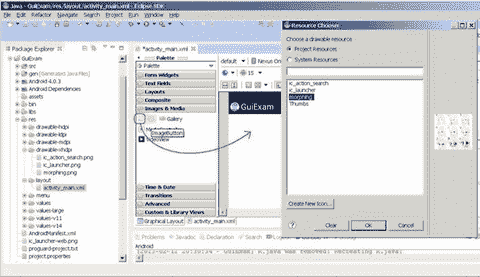
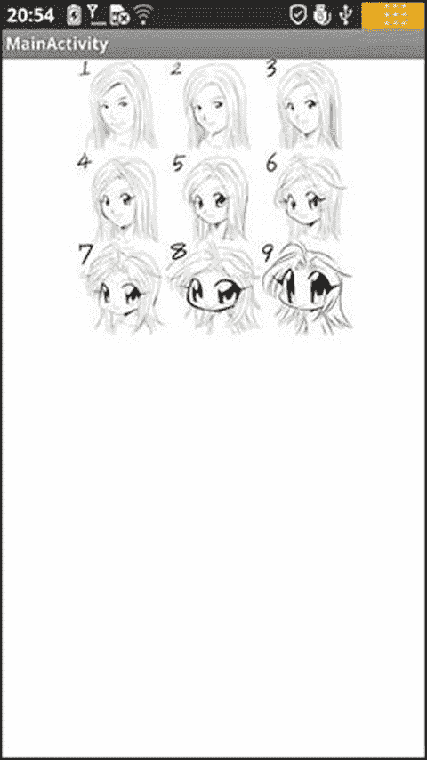

# 八、Android 应用的 GUI 设计第二部分：特定于 Android 的 GUI

Keywords Finish Function View Class Application Context Android Application Application Interface

本章描述了活动的状态转换，并讨论了`Context`类、意图以及应用和活动之间的关系。

## 活动的状态转换

如第七章所述，活动是最重要的组成部分。活动有自己的状态和转换规则，它们是编写 Android 应用所需了解的基础。

### 活动状态

当创建或销毁活动时，它们会进入或退出活动堆栈。当它们这样做时，它们在四种可能的状态之间转换:

*   活动:处于活动状态的活动位于堆栈顶部时可见。通常，响应用户输入的是前台活动。Android 会保证不惜一切代价执行。如果需要，Android 将进一步销毁堆栈活动，以确保活动活动所需的资源。当另一个活动变为活动时，该活动暂停。
*   暂停:在某些情况下，活动是可见的，但没有焦点。此时此刻，它处于暂停状态。当活动活动完全透明或者是非全屏活动时，下面的活动将达到这种状态。暂停的活动被认为是活动的，但不接受用户输入事件。在极端情况下，Android 会终止暂停的活动，以将资源恢复到活动活动。当一项活动完全看不见时，它就停止了。
*   停止:当活动不可见时，它被停止。该活动保留在内存中，以保存所有状态和成员信息。但是当系统需要内存的时候，这个活动就被“拿出来拍了。”当活动停止时，保存数据和当前 UI 状态非常重要。一旦活动退出或关闭，它将变为非活动状态。
*   非活动的:当一个活动被终止时，它就变成非活动的。不活动的活动从活动堆栈中删除。当您需要使用或显示该活动时，需要再次启动它。

活动状态转换图如图 8-1 所示。

图 8-1。

Android activity state transition diagram

状态改变不是人为的，完全由 Android 内存管理器控制。Android 首先关闭包含非活动的应用，然后是那些停止活动的应用。在极端情况下，它会删除暂停的活动。

为了确保完美的用户体验，这些状态的转换对用户来说是不可见的。当活动从暂停、停止或非活动状态返回到活动状态时，UI 必须是非歧视性的。所以，当一个活动停止时，保存 UI 状态和数据是非常重要的。一旦活动被激活，它需要恢复保存的值。

### 活动的重要功能

活动状态转换触发相应的`activity`类的函数(即 Java 方法)。Android 调用这些函数；开发人员不必显式调用它们。它们被称为状态转移函数。您可以覆盖状态转换函数，以便它们可以在指定的时间完成工作。还有一些用于控制活动状态的功能。这些功能构成了活动编程的基础。让我们来了解一下这些功能。

#### onCreate 状态转换函数

`onCreate`功能原型如下:

`void  onCreate(Bundle savedInstanceState);`

该函数在首次加载活动时运行。当您启动一个新程序时，它的主活动的`onCreate`事件被执行。如果活动被销毁(`OnDestroy`，稍后解释)，然后重新加载到任务中，那么它的`onCreate`事件参与者将被重新执行。

一个活动很可能被强制切换到后台。(一个切换到后台的活动，用户已经看不到了，但它仍然存在于一个任务的中间，比如当一个新的活动开始“覆盖”当前活动的时候；或者用户按下主屏幕按钮返回主屏幕；或者其他事件发生在当前活动之上的新活动中，例如传入的调用者接口。)如果用户在一段时间后没有再次查看该活动，则该活动可能会与任务和流程一起被系统自动销毁。如果您再次检查活动，则必须重新运行`onCreate`事件初始化活动。

有时您可能希望用户从活动的最后一个打开的操作状态继续，而不是从头开始。例如，当用户在编辑文本消息时接收到突然的来电时，用户可能必须在通话后立即做其他事情，例如将来电号码保存给联系人。如果用户没有立即返回到文本编辑界面，则文本编辑界面被破坏。结果，当用户返回到 SMS 程序时，该用户可能想要从最后的编辑继续。在这种情况下，您可以通过`outState`在活动状态或信息被破坏之前写入您想要保存的数据来覆盖活动的 void `onSaveInstanceState (Bundle outState)`事件，这样当活动再次执行`onCreate`事件时，它会传输之前通过`savedInstanceState`保存的信息。此时，您可以有选择地使用信息来初始化活动，而不是从头开始。

#### onStart 状态转换功能

`onStart`功能原型如下:

`void onStart();`

`onStart`功能在`onCreate`事件之后或当前活动切换到后台时执行。当用户从切换面板选择该活动切换回该活动时，如果该活动没有被销毁，并且只执行了`onStop`事件，则该活动将跳过`onCreate`事件活动，直接执行`onStart`事件。

#### 论状态转移函数

`onResume`功能原型如下:

`void onResume()`

`onResume`功能在`OnStart`事件后或当前活动切换到后台后执行。当用户再次查看该活动时，如果该活动没有被销毁，并且没有执行`onStop`事件(活动继续存在于任务中)，该活动将跳过`onCreate`和`onStart`事件活动，直接执行`onResume`事件。

#### 暂停状态转移函数

`onPause`功能原型如下:

`void onPause()`

当当前活动切换到后台时，执行`onPause`功能。

#### 停止状态转移函数

`onStop`功能原型如下:

`void onStop()`

`onStop`功能在`onPause`事件之后执行。如果用户一段时间没有再次查看该活动，则执行该活动的`onStop`事件。如果用户按下 Back 键，也会执行`onStop`事件，并且该活动会从当前任务列表中删除。

#### 重新启动状态转移函数

`onRestart`功能原型如下:

`void onRestart()`

执行`onStop`事件后，如果活动及其所在的流程没有被系统地破坏，或者如果用户再次查看该活动，则执行该活动的`onRestart`事件。`onRestart`事件跳过`onCreate`事件活动，直接执行`onStart`事件。

#### 灾难状态转移函数

`onDestroy`功能原型如下:

`void onDestroy()`

在活动的一个`onStop`事件之后，如果用户没有再次查看该活动，则该活动被销毁。

#### 结束功能

`finish`功能原型如下:

`void finish()`

`finish`函数关闭活动并将其从堆栈中移除，这导致对`onDestroy()`状态转换函数的调用。解决这个问题的一种方法是让用户使用 Back 按钮导航到上一个活动。

除了活动开关之外，`finish`函数触发活动的状态转换函数，context 类的`startActivity`和`startActivityForResult`方法(在接下来的小节中描述)也激活它。像`Context.startActivity`这样的函数也会导致`activity`对象的构造(也就是创建新的)。

表 8-1 中列出了触发和相应功能的典型原因。

表 8-1。

Triggers and Their Functions

<colgroup><col> <col> <col></colgroup> 
| 典型触发原因 | 执行活动的相应方法 | 说明 |
| --- | --- | --- |
| `Context.startActivity[ForResult]()`注意:只要活动在屏幕上显示并可查看，这个方法就会被调用。 | `new Activity()` |   |
| `onCreate()` | 完成构造函数，将`activity`对象保存到 application 对象，并初始化各种控件(如`View`)。 |
| `onStart()` | 类似于`View.onDraw()`。 |
| `Activity.finish()` | `onDestroy()` | 完成构造函数，比如从应用中移除`activity`对象。 |

表 8-1 中的`Context.startActivity`等函数触发三个动作:构造新的`Activity`对象、`onCreate`和`onStart`。当一个活动从屏幕外移到屏幕显示的顶部(即显示在用户面前)时，它通常只包括被`onStart`调用的功能。

## 上下文类

`Context`类是一个需要了解的重要 Android 概念。该类继承自`Object`函数，其继承如下:

`java.lang.Object`

√??]

context 的字面意思是相邻区域的文本，位于框架包的`android.content.Context`中。`Context`类是一个`LONG`类型，类似于 Win32 中的`Handle`处理程序。`Context`提供关于应用环境的全局信息接口。它是一个抽象类，它的执行由 Android 系统提供。它允许访问资源和应用的特征类型。同时可以启动应用级的操作，比如启动活动和广播接收意向。

许多方法要求通过上下文实例来标识调用方。比如`Toast`的第一个参数是`Context`；而且通常你用`this`来代替 activity，表示调用者的实例是一个 activity。但是其他方法，比如按钮的`onClick` ( `View`视图)，如果使用`this`会导致错误。在这种情况下，您可以使用`ActivityName.this`来解决问题，因为该类实现了几个主要的 Android 特定模型的上下文，如活动、服务和广播接收器。

如果参数——尤其是类的构造函数参数(比如`Dialog`)——是`Context`类型，那么实际的参数通常是活动对象，一般是`[this]`。例如，`Dialog`构造器原型是

`Dialog.Dialog(Context context)`

这里有一个例子:

`public class MyActivity extends Activity{`

`Dialog d = new Dialog(this);`

`Context`是 Android 大多数类的祖先，如 broadcasting、intents 等，它提供了全球信息应用环境的接口。表 8-2 列出了`Context`的重要子类。你可以在 Android `Context`类的帮助文档中找到详细的描述。

表 8-2。

Important Subclasses of

<colgroup><col> <col></colgroup> 
| 亚纲 | 说明 |
| --- | --- |
| `Activity` | 用户友好界面类 |
| `Application` | 提供全局应用状态维护的基类 |
| `IntentService` | 用于处理服务异步请求的基类(以`Intent`的方式表达) |
| `Service` | 应用的一个组件，它代表与用户没有交互的耗时操作，或者代表为其他应用任务提供功能的任务 |

类被称为子类，因为它们是`Context`的直接或间接子类，并且具有类似 activities 的继承关系:

`java.lang.Object`

`↳ android.content.Context`

`↳ android.content.ContextWrapper`

`↳ android.view.ContextThemeWrapper`

`↳ android.app.Activity`

`Context`可以用于 Android 中的很多操作，但它的主要功能是加载和访问资源。有两种常用的上下文:应用上下文和活动上下文。活动上下文通常在各种类和方法之间传递，类似于活动的代码`onCreate`,如下所示:

`protected void onCreate(Bundle state) {`

`super.onCreate(state);`

`TextView label = new TextView(this); // Pass context to view control`

`setContentView(label);`

`}`

当活动上下文被传递给视图时，意味着视图有一个指向活动的引用，并引用活动所占用的资源:视图层次结构、资源等等。

还可以使用应用上下文，它总是伴随着应用的生命，但与活动生命周期无关。应用上下文可以通过`Context.getApplicationContext`或`Activity.getApplication`方法获取。

Java 通常使用一个静态变量(singleton 等)来同步活动之间(程序内的类之间)的状态。Android 更可靠的方法是使用应用上下文来关联这些状态。

每个活动都有一个上下文，其中包含运行时状态。类似地，应用有一个上下文，Android 使用它来确保它是该上下文的唯一实例。

如果需要定制应用上下文，首先必须定义一个从`android.app.Application`继承的定制类；然后在应用的`AndroidManifest.xml`文件中描述这个类。Android 会自动创建这个类的一个实例。通过使用`Context.getApplicationContext()`方法，您可以获得每个活动内部的应用上下文。下面的示例代码获取活动中的应用上下文:

`class MyApp extends Application {`

`// MyApp is a custom class inherited from android.app.Application`

`public String aCertainFunc () {`

`......`

`}`

`}`

`class Blah extends Activity {`

`public void onCreate(Bundle b){`

`... ...`

`MyApp appState = ((MyApp)getApplicationContext());`

`// Get Application Context`

`appState.aCertainFunc();`

`//Use properties and methods of the application`

`... ...`

`}`

`}`

您可以使用`Context`的`get`函数获得关于应用环境的全局信息。主要函数如表 8-3 所示，可以是`ContextWrapper`或直接上下文方法。

表 8-3。

Commonly Used Methods for Obtaining Context

<colgroup><col> <col></colgroup> 
| 功能原型 | 功能 |
| --- | --- |
| `abstract Context ContextWrapper.getApplicationContext ()` | 返回对应于单个应用的全局上下文的当前进程。 |
| `abstract ApplicationInfo ContextWrapper.getApplicationInfo ()` | 返回整个应用信息对应的上下文包。 |
| `abstract ContentResolver ContextWrapper.getContentResolver ()` | 返回相应应用包的内容解析器实例。 |
| `abstract PackageManager ContextWrapper.getPackageManager ()` | 返回用于查找所有包信息的包管理器实例。 |
| `abstract String ContextWrapper.getPackageName ()` | 返回当前包名。 |
| `abstract Resources ContextWrapper.getResources ()` | 返回(用户)应用包的资源实例。 |
| `abstract SharedPreferences ContextWrapper.getSharedPreferences (String name, int mode)` | 查找并保存首选项文件的内容，该文件的名称由参数名称指定。返回您可以查找和修改的共享首选项(`SharedPreferences`)的值。当使用正确的名称时，只有一个`SharedPreferences`实例返回给调用者，这意味着一旦更改完成，结果就可以相互共享。 |
| `public final String Context.getString (int resId)` | 从应用包的默认字符串表中返回本地化字符串。 |
| `abstract Object ContextWrapper.getSystemService (String name)` | 根据变量名指定的名称返回正在处理的系统级服务。返回的对象类因请求的名称而异。 |

## 意向介绍

Intent 可以用作一种消息传递机制，允许您声明采取行动的意图，通常带有特定的数据。您可以使用 intent 来实现 Android 设备上任何应用的组件之间的交互。意图将一组独立的组件变成一对一交互的系统。

它也可以用来广播消息。任何应用都可以注册一个广播接收器来侦听和响应这些意向广播。Intent 可用于创建内部、系统或第三方事件驱动的应用。

Intent 负责描述操作和应用的动作数据。Android 负责找到子意图下描述的对应组件，将意图传递给被调用的组件，完成组件调用。意图在调用方和被调用方之间扮演解耦的角色。

意图是运行时绑定的一种机制；它可以在运行程序的过程中连接两个不同的组件。通过意图，程序可以向 Android 请求或表达意愿；Android 根据意图的内容选择适当的组件来处理请求。例如，假设某个活动想要打开 web 浏览器来查看某个页面的内容；这个活动只需要向 Android 发出一个`WEB_SEARCH_ACTION`请求。基于内容请求，Android 将检查组件注册语句中声明的意图过滤器，并为 web 浏览器找到一个活动。

当发出一个意向时，Android 会找到一个或多个活动、服务或`broadcastReceiver`的精确匹配作为响应。因此，不同类型的意向消息不会重叠，也不会同时发送到一个活动或服务，因为`startActivity()`消息只能发送到一个活动，而`startService()`意向只能发送到一个服务。

### 意图的主要作用

意向的主要作用如下。

#### 触发新活动或让现有活动实现新操作

在 Android 中，意图直接与活动交互。intent 最常见的用途是绑定应用组件。Intent 用于启动、停止和转移应用活动。换句话说，意图可以激活一个新的活动，或者使一个现有的活动执行一个新的操作。这可以通过调用`Context.startActivity()`或`Context.startActivityForResult()`方法来完成。

要在应用中打开一个不同的接口(对应于一个活动)，您可以调用`Context.startActivity()`函数来传递一个意图。Intent 既可以明确指定要打开的特定类，也可以包含实现目标所需的操作。在后一种情况下，运行时将使用一个众所周知的意图解析过程来选择打开哪个活动，在这个过程中,`Context.startActivity()`会找到并启动一个与意图最匹配的活动。

#### 触发新服务或向现有服务发送新请求

打开服务或向现有服务发送请求也是由 intent 类完成的。

#### 触发广播接收器

您可以使用三种不同的方法发送`BroadcastIntent`:`Context.sendBroadcast()`、`Context.sendOrderedBroadcast()`和`Context.sendStickyBroadcast()`。

### 意图解析

意向转移流程有两种方式将目标消费者(如另一个活动、`IntentReceiver`或服务)与意向的回应者匹配起来。

第一种是显式匹配，也称为直接意图。当构造一个`intent`对象时，您必须将接收者指定为意图的组件属性之一(通过调用`setComponent (ComponentName)`或`setClass (Context, Class)`)。通过指定组件类，应用通知启动相应的组件。这种方法类似于普通的函数调用，但在粒度重用方面有所不同。

第二种是隐性匹配，也叫间接故意。当构造一个`intent`对象时，意图的发送者不知道或不关心接收者是谁。组件意图中未指定该属性。这个意图需要包含足够的信息，以便系统可以从所有可用的组件中确定使用哪些组件来满足这个意图。这种方法与函数调用明显不同，有助于减少发送方和接收方之间的耦合。隐式匹配解析为单个活动。如果有多个活动可以基于特定数据实现给定的动作，Android 会选择最好的一个开始。

对于直接意图，Android 不需要做解析，因为目标组件非常清楚。但是，Android 需要解决间接意图。通过分析，它将间接意图映射到处理意图的活动、`IntentReceiver`或服务。

意图解析的机制主要包括以下内容:

*   寻找所有的`<intent-filter>`和由这些过滤器定义的意图，这些过滤器注册在`AndroidManifest.xml`中
*   通过`PackageManager`找到并处理意图的组件(`PackageManager`可以获得当前设备上安装的应用包的信息)

意图过滤器非常重要。未声明的`<intent-filter>`组件只能响应组件名匹配的显式意图请求，但不能响应隐式意图请求。声明的`<intent-filter>`组件可以响应显式意图或隐式意图请求。当解析隐式意图请求时，Android 使用意图的三个属性——动作、类型和类别——来进行解析。下面介绍具体的解决方法。

#### 动作测试

一个`<intent-filter>`元素应该包含至少一个`<action>`，否则没有任何意向请求可以匹配到`<intent-filter>`。如果一个意向请求的动作在`<intent-filter>`中至少有一个`<action>`匹配，那么该意向通过了这个`<`的动作测试。

如果意向请求或`<intent-filter>`中没有具体动作类型的描述，则采用以下两种测试之一:

*   如果`<intent-filter>`不包含任何动作类型，那么不管意图请求是什么，都不匹配这个`<intent-filter>`。
*   如果意向请求没有设置动作类型，只要`<intent-filter>`包含一个动作类型，该意向请求将成功通过`<intent-filter>`的动作测试。

#### 类别测试

对于通过类别测试的意向，意向中的每个类别都必须与过滤器中的类别相匹配。当每一类意向请求都与其中一个`<intent-filter>`组件的`<category>`完全匹配时，意向请求通过测试。`<intent-filter>`的`<category>`声明过多不会导致匹配失败。任何没有指定类别测试的`<intent-filter>`只匹配没有为其设置配置的意图请求。

#### dota 测试

`<data>`元素指定您想要接收的意向请求的数据 URI 和数据类型。一个 URI 被分成三个匹配的部分:方案、权威和路径。由`setData()`设置的互联网请求的 URI 数据类型和方案必须与在`<intent-filter>`中指定的相同。如果`<intent-filter>`也指定了权限或路径，它们必须匹配才能通过测试。

这个决策过程可以表示如下:

*   如果意图指定了动作，那么目标组件的`<intent-filter>`的动作列表必须包含该动作。否则，不认为匹配。
*   如果意向没有提供类型，则系统从数据中获取数据类型。对于一些动作方法，目标组件的数据类型列表必须包含意图的数据类型。否则无法匹配。
*   如果意图的数据不是内容的 URI，并且类别和意图也没有指定其类型，则匹配基于意图的数据方案(例如，`http:`或`mailto:`)，并且意图的方案必须出现在目标组件的方案列表中。
*   如果意图指定一个或多个类别，这些类别必须全部出现在组件的类别列表中。例如，如果意图包含两个类别，`LAUNCHER_CATEGORY`和`ALTERNATIVE_CATEGORY`，那么通过解析获得的目标组件必须至少包含这两个类别。

## 应用和活动之间的关系

初学者容易混淆应用和活动——特别是主要活动(应用启动时发生的活动)。事实上，它们是两个完全不同的对象。行为、属性等等并不相同。以下是应用和活动之间的差异列表:

*   不管一个应用启动多少次，只要不关闭，它的值(也就是对象)就是不变的。它只有一个实例。
*   不管一个应用从哪里启动，只要它没有关闭，它的值(也就是对象)就是常量。它只有一个实例。
*   当一个活动没有完成时，它的值(即对象)是不变的。每次调用`onStart()`时，活动显示在屏幕前面。
*   `startActivity`每次启动的对象都不一样。你可以说`startActivity`其实包含了新的对象。
    *   虽然在`startActivity`之后无法获得新的 activity 对象，但是当`startActivity`启动其对应的 activity 对象时，Android 框架可以发送参数值(类似于函数调用的实际参数)。
    *   更令人惊讶的是，Android 可以有一个活动共存于多个对象中。当一个活动关闭时，Android 会将结果返回给通过`startActivity`启动的主活动。这样一来，它会自动调用启动其活动对象的`onActivityResult()`方法，可以避免随机分布。
*   一个应用可以有多个活动对象。

## 基本的 Android 应用界面

在本节中，您将通过一个示例来了解使用集成在 Eclipse IDE 中的 Android SDK 进行 Android 开发。您使用 Android SDK 创建了一个名为 GuiExam 的应用，并按照流程的步骤学习了 Android 界面设计。

### GuiExam 应用代码分析

本节提供了对 GuiExam 示例应用的分析。首先，让我们使用 Eclipse 中的 Android SDK 创建 GuiExam 应用。对于应用名称，键入`GuiExam`。对于构建 SDK，选择 API 19，它包括 x86 指令。如图 8-2 所示，选择所有其他条目的系统默认配置。

图 8-2。

Initial setup when generating the GuiExam project

项目的文件结构如图 8-3 所示，用户界面如图 8-4 所示。

图 8-4。

The application interface of GuiExam

图 8-3。

File structure of the GuiExam application

应用唯一的 Java 文件(`MainActivity.java`)的源代码如图 8-5 所示:

图 8-5。

The typical source codes in Java file MainActivity.java

您知道在创建事件时会调用`MainActivity.OnCreate()`函数。函数的源代码非常简单。第 12 行调用超类函数，第 13 行调用`setContentView`函数。此函数设置活动的 UI 显示。在 Android 项目中，大部分 UI 是由 view 和 view 子类实现的。`View`表示一个可以处理事件的区域，也可以渲染这个区域。

第 13 行的代码表示视图是`R.layout.activity_main`。项目的`gen`目录下自动生成的`R.Java`文件包含如下代码(节选):

`Line #    Source Code`

`......`

`8 package com.example.guiexam;`

`9`

`10 public final class R {`

`......`

`26     public static final class layout {`

`27         public static final int activity_main=0x7f030000;`

`28     }`

`29     public static final class id {`

`30         public static final int menu_settings=0x7f080000;`

`31     }`

`32     public static final class string {`

`33         public static final int app_name=0x7f050000;`

`34         public static final int hello_world=0x7f050001;`

`35         public static final int menu_settings=0x7f050002;`

`36         public static final int title_activity_main=0x7f050003;`

`37    }`

`......`

`41    }`

可以看到`R.layout.activity_main`是主布局文件`activity_main.xml`的资源 ID。该文件内容如下:

`Line#    Source Code`

`1 <RelativeLayout xmlns:android="`[`http://schemas.android.com/apk/res/android`](http://schemas.android.com/apk/res/android)

`2     xmlns:tools="`[`http://schemas.android.com/tools`](http://schemas.android.com/tools)

`3     android:layout_width="match_parent"`

`4     android:layout_height="match_parent" >`

`5`

`6     <TextView`

`7         android:layout_width="wrap_content"`

`8         android:layout_height="wrap_content"`

`9         android:layout_centerHorizontal="true"`

`10         android:layout_centerVertical="true"`

`11         android:padding="@dimen/padding_medium"`

`12         android:text="@string/hello_world"`

`13         tools:context=".MainActivity" />14`

`15 </RelativeLayout>`

这段代码的第一行表明内容是一个`RelativeLayout`类。通过查看 Android 帮助文档，可以看到`RelativeLayout`的继承关系是

`java.lang.Object`

`↳ android.view.View`

`↳ android.view.ViewGroup`

`↳ android.widget.RelativeLayout`

这个类确实被看作是一个视图类。这个布局包含一个`TextView`类，它也是视图的子类。第 12 行表示其`text`属性为`@string/hello_world`，显示文本为`strings.xml`中变量`hello_world`的内容:“Hello world！”

作为布局的超类，`ViewGroup`是一个特殊视图，可以包含其他视图对象，甚至是`ViewGroup`本身。换句话说，`ViewGroup`对象将其他视图或`ViewGroup`的对象视为成员变量(在 Java 中称为 properties)。`ViewGroup`对象中包含的内部视图对象称为小部件。由于`ViewGroup`的特殊性，Android 可以自动设置各种复杂的应用界面。

### 使用布局作为界面

作为应用界面设计的一部分，您可以修改或设计布局。例如，您可以如下修改`activity_main.xml`文件:

图 8-8。

The user interface of GuiExam after the layout has been modified

图 8-7。

Modifying the GuiExam layout to add a text-edit widget

1.  将一个纯文本小部件从左栏的文本字段部分拖放到`activity_main`屏幕。将布局参数分支下的`Width`属性更改为`fill_parent`，然后拖动纯文本直到其填满整个布局，如图 8-7 所示。

图 8-6。

Modifying the GuiExam layout to add a button

1.  将`TextView`的`Text`属性改为“在此键入”。
2.  从表单小部件栏中选择一个按钮小部件，并将其放入`activity_main`屏幕。将其`Text`属性设置为“点击我”，如图 8-6 所示。

从这些例子中，你可以看到接口的一般结构。通过`setContentView`(布局文件资源 ID)设置的活动是:活动包含一个布局，布局包含各种小部件，如图 8-9 所示。

图 8-9。

Interface structure of the activity

你可能想知道为什么 Android 会引入这种布局概念。事实上，这是 Android 的一个开发者青睐的特性，相比于 Windows 微软基础类(MFC)的编程接口。该布局隔离了设备上的屏幕大小、方向和其他细节的差异，这使得界面屏幕适应各种设备。因此，在不同设备平台上运行的应用可以自动调整小部件的大小和位置，而无需用户干预或修改代码。

例如，您创建的应用可以在不同的 Android 手机、平板电脑和电视设备平台上运行，而无需更改任何代码。小工具的位置和大小会自动调整。即使你将手机旋转 90 度，纵向或横向模式的界面也会自动调整大小，并保持在相对位置。布局也允许根据当地民族习惯排列 widgets(大多数国家从左到右排列，但也有一些国家从右到左排列)。界面设计需要考虑的细节都是由布局来完成的。你可以想象如果没有布局类会发生什么——你必须为每个设备的每个 Android 界面布局编写代码。这一级别的工作的复杂性是不可想象的。

### 将视图直接用作界面

前面您已经看到了活动的接口结构和代码框架。您还看到了大部分 UI 是由 view 和 view 子类实现的。因此，您可以使用`setContentView`函数来指定一个视图对象，而不是一个布局。activity 类的`setContentView`函数的原型包括以下内容。

此函数将布局资源设置为活动的接口:

`void setContentView(int layoutResID)`

第一种类型的函数将显式视图设置为活动的接口:

`void setContentView(View view)`

第 2 个和第 1 个类型 f 函数按照指定的格式设置一个显式视图作为活动的接口:

`setContentView(View view, ViewGroup.LayoutParams params)`

在这里，您将完成一个应用示例，该示例将视图直接用作活动接口，使用第二个函数 setContentView()您可以修改`MainActivity.java`文件的代码，如下所示:

`......`

`import android.widget.TextView;`

`public class MainActivity extends Activity {`

`@Override`

`public void onCreate(Bundle savedInstanceState) {`

`super.onCreate(savedInstanceState);`

`TextView tv = new TextView(this);  // Create a TextView Object that belongs to current Activity`

`tv.setText("Hello My friends!");   // Set Display text of TextView`

`setContentView(tv);                // Set View as the main display of the Activity`

`}`

应用界面如图 8-10 所示。

图 8-10。

GuiExam sets the view directly as the interface

在这种情况下，您有作为应用接口的`TextView`小部件，它是视图的直接子类；它们直接在`setContentView`功能中设置。这样，`TextView`显示的文本就成为了应用界面的输出。要使用`TextView`类，您可以在文件的开头使用一个`import android.widget.TextView`语句来导入该类的包。

### 组件 ID

现在让我们回过头来看看图 8-6 所示的应用布局。布局中添加的文本编辑小工具的 ID 属性为`@ + id/editText1`，按钮的 ID 属性为`@ + id/button1`(如图 8-5 )。这是什么意思？

再来看`R.java`文件(节选):

`Line #    Source Code`

`......`

`8 package com.example.guiexam;`

`9`

`10 public final class R {`

`......`

`22     public static final class id {`

`23` `public static final int button1=0x7f080001;`

`24` `public static final int editText1=0x7f080002;`

`25         public static final int menu_settings=0x7f080003;`

`26         public static final int textView1=0x7f080000;`

`27     }`

`28     public static final class layout {`

`29         public static final int activity_main=0x7f030000;`

`30     }`

`......`

`43 }`

对比“GuiExam 应用”部分的`R.java`文件，可以看到第 23、24 行是新的；它们是新添加的按钮和文本编辑框的资源 ID 号。类型为`int`，对应这些小部件的 ID 属性值。从`R.java`文件中可以找到这些小部件的 ID——静态常量`R.id.button1`是 ID 属性值为`@ + id/button1`的小部件(按钮)的资源 ID，静态常量`R.id.editText1`是 ID 属性值为`@ + id/editText1`的小部件(文本编辑)的资源 ID。这是什么原因呢？让我想想。

Android 组件(包括小部件和活动)需要使用一个类型为`int`的值作为标签，这个值就是组件标签的 id 属性值。ID 属性只能接受`resources`类型的值。即值必须以`@`开头，；比如`@ id/abc`、`@+id/xyz`等等。

`@`符号用于提示 XML 文件的解析器解析`@`后面的名称。例如，对于`@string/button1`，解析器从`values/string.xml`中读取这个变量的`button1`值。

如果在`@`后面使用了`+`符号，则表示当你修改并保存一个布局文件时，系统会自动在`R.java`中生成相应类型的`int`变量。变量名是`/`符号后的值；例如，`@+id/xyz`在`R.java`中生成`int xyz = value`，其中值为十六进制数。如果`R.java`中已经存在相同的变量名`xyz`，系统不会生成新的变量；相反，组件使用这个现有的变量。

换句话说，如果您使用`@+id/name`格式，并且在`R.java`中存在一个名为`name`的变量，那么组件将使用该变量的值作为标识符。如果变量不存在，系统会添加一个新变量，并为该变量分配相应的值(不重复)。

因为组件的 ID 属性可以是资源 ID，所以可以设置任何现有的资源 ID 值:例如，`@drawable/icon`、`@string/ok`或`@+string/`。当然也可以设置一个 Android 系统中已经存在的资源 id，比如`@id/android:list`，其中 ID 中的`android:`修饰符表示系统的 R 类所在的包(在`R.java`文件中)。您可以在 Java 代码编辑区输入`android.R.id`，它会列出相应的资源 ID。例如，可以这样设置 ID 属性值。

出于刚才描述的原因，您通常将 Android 组件(包括小部件、活动等)的 ID 属性设置为`@+id/XXX`格式。并且您使用`R.id.XXX`来表示程序中组件的资源 ID 号。

## 按钮和事件

在“使用布局作为界面”一节中的例子中，您创建了一个包括`Button`、`EditText`和其他小部件的应用，但是当单击按钮时什么也没有发生。这是因为您没有分配对`click`事件的响应。本节首先介绍 Android 事件和监听器函数的基础知识。在以后涉及 Android 多线程设计的章节中，您将回顾并进一步探索更多关于事件的高级知识。

在 Android 中，每个应用都维护一个事件循环。当应用启动时，它完成适当的初始化，然后进入事件循环状态，在此状态下，它等待用户操作，如单击触摸屏、按键(按钮)或一些其他输入操作。用户动作触发程序生成对事件的响应；系统根据事件位置生成并分发相应的事件类进行处理，比如`Activity`或者`View`。回调方法被集成到一个称为事件监听器的接口中。您可以通过覆盖接口的抽象函数来实现指定的事件响应。

不同类接收的事件的范围对于每个类都是不同的。例如，`Activity`类可以接收`keypress`事件，但不能接收`touch`事件，而`View`类可以接收`touch`和`keypress`事件。此外，不同类接收到的事件属性细节也各不相同。例如，`View`类接收的`touch`事件由许多触摸点、坐标值和其他信息组成。它被细分为按下、反弹和移动事件。但是`Button`类是`View`类的后代，它只检测按压动作，事件不提供触摸点的坐标或其他信息。换句话说，`Button`处理视图的原始事件，将所有触摸事件整合成一个记录是否被点击的事件。

`View`类的大多数事件响应接口使用`Listener`作为后缀，因此很容易记住它们与事件监听器接口的关联。表 8-4 显示了多个类别及其事故响应功能的示例。

表 8-4。

Examples of Classes and Their Incident-Response Functions

<colgroup><col> <col> <col></colgroup> 
| 班级 | 事件 | 监听器接口和功能 |
| --- | --- | --- |
| `Button` | 点击 | `onClick()``onClickListener`界面的功能 |
| `RadioGroup` | 点击 | `onCheckChange()``onCheckChangeListener`界面的功能 |
| `View` | 下拉列表 | `onTouch()``TouchListener`界面的功能 |
| 输入焦点改变 | `onFocusChange()``onFocusChangeListener`界面的功能 |
| 纽扣 | `onKey()``onKeyListener`界面的功能 |

响应事件的过程如下。首先，定义监听器接口的实现类，并覆盖抽象函数。第二，调用`set ... Listener()`等函数。然后将自定义监视器接口的实现类设置为相应对象的事件侦听器。

例如，您可以修改应用源来执行事件响应。实现 Java 接口有许多编码风格。下一节讨论运行这些样式的代码的结果是相同的几种方式。

### 内部类监听器

修改`MainActivity.java`代码如下(增加或修改粗体文本):

`Line #    Source Code`

`1 package com.example.guiexam;`

`2 import android.os.Bundle;`

`3 import android.app.Activity;`

`4 import android.view.Menu;`

`5 import android.view.MenuItem;`

`6 import android.support.v4.app.NavUtils;`

`7 import android.widget.TextView;`

`8` `import android.widget.Button;                // Use Button class`

`9`

`10` `import android.view.View;                   // Use View class`

`11` `import android.view.View.OnClickListener;   // Use View.OnClickListener class`

`12` `import android.util.Log;`

`13` `// Use Log.d debugging function`

`public class MainActivity extends Activity {`

`14` `private int iClkTime = 1;`

`15`

`16` `// Count of Button Click`

`17`

`@Override`

`18     public void onCreate(Bundle savedInstanceState) {`

`19         super.onCreate(savedInstanceState);`

`20         setContentView(R.layout.activity_main);`

`21`

`22` `Button btn = (Button) findViewById(R.id.button1);`

`23` `// Obtain Button object based on the resource ID number`

`24` `final String prefixPrompt ="This is No. ";`

`25` `// Define and set the value of the variable passed`

`26` `final String suffixPrompt ="time(s) that Button is clicked";`

`27` `// Define and set the value of the variable passed`

`28` `btn.setOnClickListener(new /*View.*/OnClickListener(){`

`29` `// Set the event response class of Button's click`

`30`

`31` `public void onClick(View v) {`

`32` `Log.d("ProgTraceInfo",prefixPrompt + (iClkTime++) + suffixPrompt);`

`}`

`});`

`}`

`@Override`

`public boolean onCreateOptionsMenu(Menu menu) {`

`getMenuInflater().inflate(R.menu.activity_main, menu);`

`return true;`

`}`

`}`

在第 1822 行，您分别根据资源 ID`EditText`和`TextView`获得相应的对象。要使用`OnClickListener`作为内部类，需要在变量前面添加`final`修饰符。在第 23 行和第 24 行，当`Button`的响应代码点击时，您首先使用`EditText.getText()`获得`EditText`的内容。因为该函数返回类型为`Editable`的值，所以您通过`CharSequence.toString()`函数将类型`Editable`转换为类型`String`(`CharSequence`是`Editable`的超类)。然后调用`TextView.setText (CharSequence text)`函数刷新`TextView`显示。

在 Android 中，类属性的访问函数通常以`set` / `get`开头，比如`EditText`内容的读/写函数:

`Editable  getText()`

`void  setText(CharSequence text, TextView.BufferType type)`

该应用的界面如图 8-11 所示；(a)是开始屏幕，(b)是在编辑文本框中输入文本后的屏幕，以及(c)显示单击按钮后的应用屏幕。

图 8-11。

The interface of the application with a `TextView` , a `Button` , and an `EditText`

### 使用 ImageView

前几节讨论了小部件的典型用途，并展示了小部件编程的基本概念。图像是多媒体应用的基础，因此也是 Android 应用的主要部分。本节介绍图像/图片显示小工具`ImageView`的使用。通过本节中的例子，您将学习如何使用`ImageView`并将文件添加到项目的资源中。

以下示例最初是在创建 GuiExam 应用时在小节中开发的。按照以下步骤将图片文件添加到项目中:

图 8-13。

The Package Explorer window after the image is added

1.  在 Eclipse 中打开项目，并按 F5 键刷新项目。你可以在 Package Explorer 中看到添加到项目中的文件(本例中为`morphing.png`)，如图 8-13 所示。

图 8-12。

Copy the image file into the project’s `res` directory

1.  将图像文件(本例中为`morphing.png`)复制到对应的`/res/drawable-XXX`项目目录(存放不同分辨率图像的项目文件的目录)，如图 8-12 所示。

要在布局中放置`ImageView`小部件，请遵循以下步骤:

1.  保存布局文件。

图 8-15。

The property settings of the `ImageView`

1.  调整`ImageView`的大小和位置，并设置其属性。这一步可以使用图 8-15 所示的默认值。

图 8-14。

Place the `ImageView` widget in the layout

1.  点击选择“Hello world！”的`TextView`小工具项目，然后按 Del 键将小部件从布局中移除。
2.  在`layout.xml`的编辑器窗口中，找到图像&媒体分支，将该分支的`ImageView`拖放到布局文件中。弹出资源选择器对话框，点击选择项目资源，选择项目下刚刚导入的图片文件，点击确定完成操作。该过程如图 8-14 所示。

通常，此时，您必须编译 Java 代码。然而，在这个例子中，编译是不必要的。图 8-16 显示了应用的界面。

图 8-16。

Application interface of the `ImageView`

### 退出活动和应用

在前面的示例中，您可以按下手机的后退按钮来隐藏活动，但这样做不会关闭活动。正如您在“活动的状态转换”一节中看到的，当按下 Back 按钮时，已启动的活动仅从活动状态变为非活动状态，并保留在系统堆栈中。要关闭这些活动并将其从堆栈中移除，您应该使用`Activity`类的`finish`函数。

但是，结束活动并不意味着申请流程结束。即使应用的所有组件(活动、服务、广播意图接收器等)都已关闭，应用进程仍会继续存在。退出申请流程主要有两种方式。

一个是 Java 提供的强制结束进程的静态函数`System.exit`；另一个是 Android 提供的静态函数`Process.killProcess (pid)`终止指定的进程 ID (PID)。您可以通过`Process.myPid()`静态函数来获取应用的进程 ID。

您可以将这些方法用于“使用 ImageView”一节中的示例具体步骤如下:

1.  将`MainActivity.java`文件的源代码修改如下(粗体代码表示添加或修改，带删除线的行表示删除的代码):

图 8-17。

Add Close Activity and Exit Application buttons in the layout

1.  在布局文件中添加两个按钮，属性分别为`Text`的“关闭活动”和“退出应用”，ID 属性分别为`@+id/closeActivity`和`@+id/exitApplication`。调整按钮的大小和位置，如图 8-17 所示。

`Line #    Source Code`

`1 package com.example.guiexam;`

`2 import android.os.Bundle;`

`3 import android.app.Activity;`

`4 import android.view.Menu;`

`5` `//import android.view.MenuItem;`

`6` `//import android.support.v4.app.NavUtils;`

`7` `import android.widget.Button;               // Use Button class`

`8` `import android.view.View;                   // Use View class`

`9` `import android.view.View.OnClickListener;   // Use View.OnClickListenerClass`

`10` `import android.os.Process;                 // Use killProcess method`

`11 public class MainActivity extends Activity {`

`12     @Override`

`13     public void onCreate(Bundle savedInstanceState) {`

`14         super.onCreate(savedInstanceState);`

`15         setContentView(R.layout.activity_main);`

`16` `Button btn = (Button) findViewById(R.id.closeActivity);`

`17` `// Get Button object of <Closed activity>`

`18` `btn.setOnClickListener(new /*View.*/OnClickListener(){`

`19` `// Set response code for Clicking`

`20` `public void onClick(View v) {`

`21` `finish();                  // Close main activity`

`22` `}`

`23` `});`

`24` `btn = (Button) findViewById(R.id.exitApplication);`

`25` `// Get Button object of <Exit Application>`

`26` `// Set the response code to Clicking`

`27` `public void onClick(View v) {`

`28` `finish();                  // close main activity`

`29` `Process.killProcess(Process.myPid()); // Exit application process`

`30` `}`

`31`

`32`

`33`

`34`

`35         });`

`}`

`@Override`

`public boolean onCreateOptionsMenu(Menu menu) {`

`getMenuInflater().inflate(R.menu.activity_main, menu);`

`return true;`

`}`

`}`

在第 5 行和第 6 行，您删除了未使用的`import`语句。您在第 1621 行设置了“关闭活动”按钮的响应代码，在第 2228 行设置了“退出应用”按钮的响应代码。唯一的区别是后者增加了应用退出代码`Process.killProcess (Process.myPid ())`。这两个按钮使用`Activity`类的同一个`finish()`函数来关闭活动。第 710 行的代码导入相关的类。

应用界面如图 8-18 所示。

图 8-18。

The Close Activity and Exit Application interface of the application

当您单击“关闭活动”或“退出应用”按钮时，应用的主界面将关闭。不同的是，应用进程(`com.example.guiexam`)不会因为关闭活动而退出；但是对于退出应用，该过程关闭。这清楚地显示在 Eclipse 中 DDMS 视图的设备窗格中，您可以在其中看到目标机器上的进程列表，如图 8-19 所示。

图 8-19。

The process in DDMS when the Close Activity and Exit Application application is running

## 摘要

本章通过让您创建一个名为 GuiExam 的简单应用来介绍 Android 界面设计。您了解了活动的状态转换、`Context`类、意图以及应用和活动之间的关系。您还看到了如何通过更改布局文件`activity_main.xml`将布局用作接口，以及按钮、事件和内部事件监听器是如何工作的。下一章描述了如何使用 activity-intent 机制创建一个包含多个活动的应用，并展示了在`AndroidManifest.xml`文件中需要做的修改。

 Open Access This chapter is licensed under the terms of the Creative Commons Attribution-NonCommercial-NoDerivatives 4.0 International License ( [ http://​creativecommons.​org/​licenses/​by-nc-nd/​4.​0/​ ](http://creativecommons.org/licenses/by-nc-nd/4.0/) ), which permits any noncommercial use, sharing, distribution and reproduction in any medium or format, as long as you give appropriate credit to the original author(s) and the source, provide a link to the Creative Commons licence and indicate if you modified the licensed material. You do not have permission under this licence to share adapted material derived from this chapter or parts of it. The images or other third party material in this chapter are included in the chapter’s Creative Commons licence, unless indicated otherwise in a credit line to the material. If material is not included in the chapter’s Creative Commons licence and your intended use is not permitted by statutory regulation or exceeds the permitted use, you will need to obtain permission directly from the copyright holder.