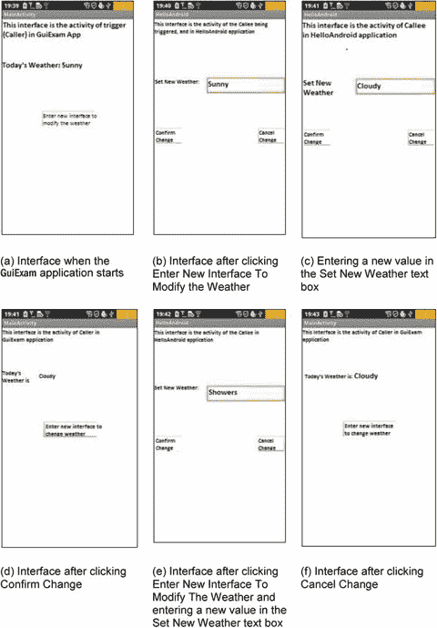

# 九、Android 应用的 GUI 设计第三部分：设计复杂的应用

Keywords Intent Object Trigger Activity Source Code File Intent Intent Intent Class

在前一章中，您通过创建一个名为`GuiExam`的简单应用学习了 Android 界面设计。这一章还涵盖了活动的状态转换、`Context`类，以及对意图和应用与活动之间关系的介绍。您了解了如何将布局用作接口，以及按钮、事件和内部事件侦听器如何工作。在本章中，您将学习如何创建一个包含多个活动的应用；示例介绍了活动的显性和隐性触发机制。您将看到一个应用示例，其中的参数由另一个应用中的活动触发，这将有助于您理解活动参数的交换机制。

## 具有多个活动的应用

上例中的应用只有一个活动:主活动，它在应用启动时显示。本章演示了一个具有多个活动的应用，使用活动意图机制，并展示了在`AndroidManifest.xml`文件中需要的更改。

如前所述，活动由意图触发。有两种意图解析方法:显式匹配(也称为直接意图)和(也称为间接意图)。触发活动也可以有参数和返回值。此外，Android 带有许多内置活动，因此触发的活动可以来自 Android 本身，也可以定制。基于这些情况，本章用四个例子来说明不同的活动。对于显式匹配，您可以看到有或没有参数和返回值的应用。对于隐式匹配，您会看到一个应用，它使用来自 Android 系统或用户定义的活动。

### 触发不带参数的活动的显式匹配

使用不带参数的显式匹配是活动意图最简单的触发机制。本节首先使用一个示例来介绍这种机制，稍后将介绍更复杂的机制。

显式匹配的活动意图触发机制的代码框架包括两部分:被调用方的活动(被触发)和调用方的活动(触发)。触发器不限于活动；它也可以是一种服务，例如广播意图接收器。但是因为到目前为止您只看到了活动的使用，所以本节中所有示例的触发器都是活动。

1.  被调用方活动的源代码框架执行以下操作:
    1.  定义从活动继承的类。
    2.  如果有需要传递的参数，那么活动的源代码框架调用`onCreate`函数中的`Activity.getIntent()`函数，获取触发该活动的`Intent`对象，然后通过`Intent.getData ()`、`Intent.getXXXExtra ()`、`Intent.getExtras ()`等函数获取正在传递的参数。
    3.  为正常活动模式编写代码。
    4.  如果触发器返回值，则在退出活动之前执行以下操作:
        1.  定义一个`Intent`对象
        2.  使用`Intent.putExtras()`等功能设置意图的数据值
        3.  通过调用`Activity.setResult()`函数设置活动的返回代码 
    5.  在`AndroidManifest.xml`文件中添加被调用者活动的代码。
    6.  被调用方活动的代码框架执行以下操作:
        1.  定义`Intent`对象，并指定触发器的上下文和被触发活动的`class`属性。
        2.  如果需要将参数传递给活动，则通过调用类似于`setData()`、`putExtras()`等意图的函数来设置`Intent`对象的参数。
        3.  调用`Activity.startActivity(Intent intent)`函数触发不带参数的活动，或者调用`Activity.startActivityForResult(Intent intent, int requestCode)`触发带参数的活动。
        4.  如果活动需要由返回值触发，那么代码框架重写`Activity`类的`onActivityResult()`函数，该函数根据请求代码(`requestCode`)、结果代码(`resultCode`)和意图(`Intent`)值采取不同的操作。  

在步骤 2a 中，使用了触发活动的 class 属性，这涉及到一种称为反射的 Java 机制。这种机制可以根据类名创建并返回该类的对象。被触发活动的对象在触发之前没有被构造；因此，触发活动也意味着创建该类的对象，以便后续操作可以继续。也就是说，触发活动包括新创建的类对象的操作。

下面两个例子详细说明了代码框架。本节描述第一个。在这个示例中，被触发的活动与触发器的活动属于同一个应用，并且被触发的活动不需要任何参数，也不返回任何值。新的活动是通过一个按钮触发的，它的活动界面类似于“退出活动和应用”一节中的示例界面在第八章中，图 8-16。整个应用界面如图 9-1 所示。

图 9-1。

The application interface with multiple activities in the same application without parameters

应用启动后，显示应用的主活动，如图 9-1(a) 所示。当点击“更改为无参数新界面”按钮时，app 显示新的活动，如图 9-1(b) 所示。点击关闭活动按钮，界面返回到应用的主活动，如图 9-1(c) 所示。

通过修改并重写第八章中部分的示例，创建此示例，如下所示:

1.  为触发的活动生成相应的布局文件:
    1.  在应用的`res\layout`子目录中右键单击快捷菜单，选择新建➤其他项目。弹出一个新的对话框。选择`\XML\XML File`子目录，点击下一步继续。在“新建 XML 文件”对话框中，输入文件名(在本例中为`noparam_otheract.xml`)，然后单击“完成”。整个过程如图 9-2 所示。 

Note

文件名是布局文件的名称。为了编译成功，必须只使用小写字母；否则，您将得到错误“无效文件名:必须只包含 a-z0-9_ ..”

图 9-2。

The layout file for the triggered activity

在项目的包浏览器中可以看到新添加的`xxx.xml`文件(本例中为`noparam_otheract.xml`)，如图 9-3 所示。

Note

右边的布局编辑器窗口还是空的，至今没有可见的界面。

1.  在左侧面板中选择`Layouts`子目录，并将布局控件(在本例中为`RelativeLayout`)拖动到右侧窗格中的窗口上。你会立即看到一个可视的(手机屏幕形状的)界面，如图 9-4 所示。

图 9-3。

Initial interface of the application’s newly added layout file

1.  基于第八章中的“使用 ImageView”一节所述的相同方法，在新布局文件中放置一个`ImageView`和一个按钮。将`ImageView`小部件的`ID`属性设置为`@+id/picture`，将`Button`小部件的`ID`属性设置为`@+id/closeActivity`。`Text`属性为“关闭活动”，如图 9-5 所示。最后，保存布局文件。

图 9-4。

Drag-and-drop layout for the newly added layout file

1.  为布局文件(Java 源文件)添加相应的`Activity`类。为此，右键单击项目目录下的`\src\com.example.XXX`,并在快捷菜单上选择新建➤类。在“新建 Java 类”对话框中，为“名称”输入对应于新布局文件的`Activity`类名(在本例中为`TheNoParameterOtherActivity`)。单击“完成”关闭对话框。整个过程如图 9-6 所示。

图 9-5。

Final configuration of the newly added layout file

图 9-6。

Corresponding class for the newly added layout file

可以看到新添加的 Java 文件(这里是`TheNoParameterOtherActivity.java`)和初始代码，如图 9-7 。

1.  编辑新添加的`.java`文件(`TheNoParameterOtherActivity.java`)。该类执行触发的活动(被调用方)的活动。其源代码如下(加粗文字或修改):

图 9-7。

Corresponding class and initial source code of the newly added layout

`Line #        Source Code`

`1  package com.example.guiexam;`

`2` `import android.os.Bundle;                   // Use Bundle class`

`3` `import android.app.Activity;                // Use Activity Class`

`4` `import android.widget.Button;               // Use Button class`

`5` `import android.view.View;                   // Use View class`

`6` `import android.view.View.OnClickListener;   // Use OnClickListener Class`

`7  public class TheNoParameterOtherActivity extends Activity {`

`8  // Define Activity subclass`

`9` `@Override`

`10` `protected void onCreate(Bundle savedInstanceState) {`

`11` `// Define onCreate method`

`12` `super.onCreate(savedInstanceState);`

`13` `// onCreate method of calling parent class`

`14` `setContentView(R.layout.noparam_otheract);`

`15` `// Set layout file`

`16` `Button btn = (Button) findViewById(R.id.closeActivity);`

`17` `// Set responding code for <Close Activity> Button`

`18` `btn.setOnClickListener(new /*View.*/OnClickListener(){`

`19` `public void onClick(View v) {`

`finish();`

`// Close this activity`

`}`

`});`

`}`

`}`

在第 7 行，您为新创建的类添加了超类`Activity`。第 8 行到第 18 行的代码类似于应用的主活动。注意，在第 14 行，代码调用了`setContentView()`函数来为`Activity`设置布局，其中的参数是在第一步中创建的新布局 XML 文件的前缀名。

1.  编辑触发器(调用方)活动的代码。触发活动是应用的主要活动。源代码为`MainActivity.java`，布局文件为`activity_main.xml`。编辑的步骤如下:
    1.  编辑布局文件，删除原来的`TextView`小部件，添加一个按钮。将其`ID`属性设置为`@+id/goTONoParamNewAct`，将其`Text`属性设置为“无参数切换界面”，如图 9-8 所示。 

1.  编辑触发活动的源代码文件(在本例中为`MainActivity.java`)，如下所示(添加或修改粗体文本):

图 9-8。

Layout configuration for the trigger activity

`Line #        Source Code`

`1  package com.example.guiexam;`

`2  import android.os.Bundle;`

`3  import android.app.Activity;`

`4  import android.view.Menu;`

`5` `import android.content.Intent;           // Use Intent class`

`6` `import android.widget.Button;            // Use Button class`

`7` `import android.view.View.OnClickListener;`

`8` `import android.view.View;`

`9  public class MainActivity extends Activity {`

`10    @Override`

`11    public void onCreate(Bundle savedInstanceState) {`

`12      super.onCreate(savedInstanceState);`

`13      setContentView(R.layout.activity_main);`

`14` `Button btn = (Button) findViewById(R.id.goTONoParamNewAct);`

`15` `btn.setOnClickListener(new /*View.*/OnClickListener(){`

`16` `public void onClick(View v) {`

`17` `Intent intent = new Intent(MainActivity.this, TheNoParameterOtherActivity.class);`

`18` `startActivity(intent);`

`19` `}`

`20` `});`

`21    }`

`22     @Override`

`23     public boolean onCreateOptionsMenu(Menu menu) {`

`24       getMenuInflater().inflate(R.menu.activity_main, menu);`

`25       return true;`

`26     }`

`27 }`

第 17 行的代码定义了一个意图。这种情况下的构造函数原型是

`Intent(Context packageContext, Class<?> cls)`

第一个参数是触发活动，在本例中是主活动；`this`因为用在内部类中，所以前面有类名修饰符。第二个参数是被调用方(被触发)活动的类。它使用`.class`属性来构造它的对象(所有 Java 类都有`.class`属性)。

第 18 行调用`startActivity`，运行 intent。该函数不向触发的活动传递任何参数。函数原型是

`void Activity.startActivity(Intent intent)`

1.  编辑`AndroidManifest.xml`文件。添加被调用方活动的描述性信息(添加了粗体文本)以注册新的`Activity`类:

`Line #        Source Code`

`1 <manifest xmlns:android="`[`http://schemas.android.com/apk/res/android`](http://schemas.android.com/apk/res/android)

`2     package="com.example.guiexam"`

`3     android:versionCode="1"`

`4     android:versionName="1.0" >`

`...     ... ...`

`10     <application`

`11         android:icon="@drawable/ic_launcher"`

`12         android:label="@string/app_name"`

`13         android:theme="@style/AppTheme" >`

`14         <activity`

`15             android:name=".MainActivity"`

`16             android:label="@string/title_activity_main" >`

`17             <intent-filter>`

`18                 <action android:name="android.intent.action.MAIN" /> 19`

`20                 <category android:name="android.intent.category.LAUNCHER" /> 21             </intent-filter>`

`22         </activity>`

`23``<activity android:name=".TheNoParameterOtherActivity" android:label="the other Activity"/>`

`25`

`26 </manifest>`

您也可以用以下方法替换此 XML 代码:

*   方法 1:

`<activity android:name="TheNoParameterOtherActivity" android:label=" the other Activity"> </activity>`

*   方法 2:

`<activity android:name=".TheNoParameterOtherActivity " />`

*   方法 3:

`<activity android:name=".TheNoParameterOtherActivity"></activity>`

`android: name`文本字段的内容是被调用者活动的类名:`TheNoParameterOtherActivity`。

注意，如果在`Activity`类`android: name`的名称前添加一个句点(`.`)，编译器会在 XML 文件的这一行给出如下警告(只是警告，不是编译错误):

`Exported activity does not require permission`

### 触发活动与不同应用参数的显式匹配

前面几节介绍了在同一个应用中触发另一个没有参数的活动。触发器的活动是被调用者允许交换参数:触发器可以为被调用者指定某些参数，被调用者可以在退出时将这些参数值返回给触发器。此外，被调用者和触发器可以在完全不同的应用中。本节显示了一个应用示例，该应用的参数由另一个应用中的活动触发。这个例子将帮助您理解活动参数的交换机制。

使用与第八章中相同的`GuiExam`应用。界面如图 9-9 所示。

图 9-9。

The interface of multiple activities in different applications

如图 9-9 所示，触发活动在`GuiExam`应用中，其中有一个变量接受天气条件条目。图 9-9(a) 中的界面在`GuiExam`应用打开时显示。点击进入新界面，修改天气盒，触发`HelloAndroid`中的活动。当该活动开始时，显示在设置新天气文本框中传递的新天气情况，如图 9-9(b) 所示。现在，在 Set New Weather 中输入一个新的天气条件值，然后单击 OK Change 关闭触发器的活动。Set New Weather 返回的新值刷新触发器活动中的`Weather`变量，如图 9-9(d) 所示。如果你点击取消更改，它做同样的事情并关闭活动，但是值`Weather`不变，如图 9-9(f) 所示。

正在执行的应用的进程列表如图 9-10 所示(显示在 Eclipse 中主机的 DDMS 窗口中)。

图 9-10。

Process list in DDMS for the multiple-activity application

图 9-10 显示当应用启动时，只有触发器`GuiExam`的进程在运行。但是当你点击进入新界面修改天气时，新活动被触发，新活动`HelloAndroid`的流程运行，如图 9-10(b) 所示。当您点击确认变更或取消变更时，被触发的活动关闭，但是`HelloAndroid`过程不会退出，如图 9-10(c) 所示。有趣的是，即使`GuiExam`触发流程存在，被触发的活动所属的`HelloAndroid`流程仍然处于运行状态。

构建步骤如下:

1.  修改触发应用的`GuiExam`代码:
    1.  通过删除原来的`TextView`小部件来编辑主布局文件(本例中为`activity_main.xml`);然后添加三个新的`TextView`部件和一个按钮。如下设置它们的属性:将两个`TextView`的`Text`属性设置为“这个接口是 GuiExam 应用中调用者的活动”和“今天的天气:”。将第三个`TextView`的`ID`属性设置为`@+id/weatherInfo`。按钮的`Text`属性为“进入新界面改变天气”，其`ID`属性为`@+id/modifyWeather`。如图 9-11 所示调整各部件的大小和位置。 

1.  修改`MainActivity.java`的内容，如下图所示:

图 9-11。

The main layout design for the `GuiExam` trigger application

`Line #        Source Code`

`1  package com.example.guiexam;`

`2  import android.os.Bundle;`

`3  import android.app.Activity;`

`4  import android.view.Menu;`

`5` `import android.widget.Button;            // Use Button class`

`6` `import android.view.View;                // Use View class`

`7` `import android.view.View.OnClickListener; // Use View.OnClickListener class`

`8` `import android.widget.TextView;          // Use TextView class`

`9` `import android.content.Intent;           // Use Intentclass`

`10 public class MainActivity extends Activity {`

`11` `public static final String INITWEATHER = "`阳光明媚`; // /Initial Weather`

`12` `public static final int MYREQUESTCODE =100;`

`13` `// Request Code of triggered Activity`

`14` `private TextView tv_weather;`

`15` `// The TextView Widget that displays Weather info`

`16     @Override`

`17     public void onCreate(Bundle savedInstanceState) {`

`18         super.onCreate(savedInstanceState);`

`19         setContentView(R.layout.activity_main);`

`20` `tv_weather = (TextView)findViewById(R.id.weatherInfo);`

`21` `tv_weather.setText(INITWEATHER);`

`22` `Button btn = (Button) findViewById(R.id.modifyWeather);`

`23` `// Get Button object according to resource ID #`

`24` `btn.setOnClickListener(new /*View.*/OnClickListener(){`

`25` `// Set responding code click event`

`26` `public void onClick(View v) {`

`27` `Intent intent = new Intent();`

`28` `intent.setClassName("com.example.helloandroid",`

`29` `// the package ( application) that the triggered Activity is located`

`30` `"com.example.helloandroid.TheWithParameterOtherActivity");`

`31` `// triggered class ( full name)`

`String wthr = tv_weather.getText().toString();`

`32` `// Acquire the value of weather TextView`

`33` `intent.putExtra("weather",wthr); // Set parameter being passed to Activity`

`34                 startActivityForResult(intent,` `MYREQUESTCODE);`

`35` `// Trigger Activity`

`36` `}`

`37` `});`

`38     }`

`39`

`40` `@Override`

`41` `protected void onActivityResult(int requestCode, int resultCode, Intent data) {`

`42` `// Triggered Activity finish return`

`43` `super.onActivityResult(requestCode, resultCode, data);`

`44` `if (requestCode == MYREQUESTCODE) {`

`45` `// Determine whether the specified Activity end of the run`

`if (resultCode == RESULT_CANCELED)`

`46` `{       }`

`47` `// Select "Cancel" to exit the code, this case is empty`

`48` `else if (resultCode == RESULT_OK) {`

`49` `// Select <OK> to exit code`

`50` `String wthr = null;`

`51` `wthr = data.getStringExtra("weather");`

`// Get return value`

`if (wthr != null)`

`tv_weather.setText(wthr);`

`// Update TextView display of weather content`

`}`

`}`

`}`

`@Override`

`public boolean onCreateOptionsMenu(Menu menu) {`

`getMenuInflater().inflate(R.menu.activity_main, menu);`

`return true;`

`}`

`}`

第 23–28 行的代码用其他应用中的参数触发活动。第 23–25 行建立了触发器意图，它使用了`Intent.setClassName()`函数。原型是

`Intent Intent.setClassName(String packageName, String className);`

第一个参数是被触发的活动所在的包的名称，第二个参数是被触发的活动的类名(需要使用全名)。通过使用`startActivity ...`函数触发活动，系统可以准确定位应用和活动类。

第 28 行将参数作为附加数据附加到意向中。`Intent`有一系列的`putExtra`函数来附加附加数据，还有一系列的`getXXXExtra`函数来从意图中提取数据。附加数据也可以由`Bundle`类组装。`Intent`提供了添加数据的`putExtras`函数和获取数据的`getExtras`函数。`putExtra`使用属性-值数据对或变量名-值数据对来添加和检索数据。在本例中，`Intent.putExtra("weather", "XXX")`保存由`weather`变量名和值“XXX”组成的数据对，作为意图的附加数据。

带有`Intent.getStringExtra("weather")`的代码行从附加的意图数据中获取`weather`变量的值，并返回字符串类型。

关于这些函数和`Bundle`类的更多细节可以在 Android 网站的文档中找到。这里不再进一步讨论它们。

在第 33–46 行，您重写了`Activity`类的`onActivityResult`函数。当触发的活动关闭时，调用此函数。在第 36 行，首先根据请求代码确定哪个活动被关闭并返回。然后，根据结果代码和请求代码，判断它是由 OK 还是 Cancel 单击返回。第 40–50 行从返回的意向中获取协商的变量值。第 42 行根据变量的返回值更新接口。在这个函数中，如果用户点击 Cancel 返回，你什么都不做。

1.  修改被调用程序应用`HelloAndroid`的代码，如图 9-12 所示:
    1.  使用本章前面的“触发活动与不同应用的参数的显式匹配”一节中描述的方法，添加一个布局文件(在本例中名为`param_otheract.xml`)，并将一个`RelativeLayout`布局拖放到该文件中。
    2.  通过添加两个`TextView`部件、一个`EditText`部件和两个`Button`部件来编辑这个布局文件。按如下方式设置它们的属性:
        *   两个`TextView`小部件的`Text`属性:“该接口是 HelloAndroid 应用中调用者的活动”和“将新天气设置为:”
        *   `EditText`的`ID`属性:`@+id/editText_NewWeather`
        *   两个`Button`的`Text`属性:“确认变更”和“取消变更”
        *   两个`Button`的`ID`属性:`@+id/button_Modify`和`@+id/button_Cancel`  

然后调整它们的大小和位置。

1.  如“触发活动与不同应用参数的显式匹配”一节所述，为新的布局文件添加相应的类(本例中为`TheWithParameterOtherActivity)`)，如图 9-13 所示。

图 9-12。

New layout design of the triggered (callee) application

1.  为新添加的布局文件编辑类文件(在本例中为`TheWithParameterOtherActivity.java`)。内容如下:

图 9-13。

Add the corresponding class for the newly added layout file in the `HelloAndroid` project

`Line #        Source Code`

`1  package com.example.helloandroid;`

`2` `import android.os.Bundle;                   // Use Bundle Class`

`3``import android.app.Activity;`

`4` `import android.content.Intent;              // Use Intent Class`

`5` `import android.widget.Button;               // Use Button Class`

`6` `import android.view.View;                   // Use View Class`

`7` `import android.view.View.OnClickListener;   // Use OnClickListener Class`

`8` `import android.widget.EditText;             // Use  EditText Class`

`9  public class TheWithParameterOtherActivity extends Activity {`

`10` `private String m_weather;`

`11` `// Save new weather variable`

`12` `@Override`

`13` `protected void onCreate(Bundle savedInstanceState) {`

`14` `// Define onCreate method`

`15` `super.onCreate(savedInstanceState);`

`16` `// method of call onCreate Super Class`

`17` `setContentView(R.layout.withparam_otheract); // Set layout file`

`18` `Intent intent = getIntent();`

`19` `// Get Intent of triggering this Activity`

`20` `m_weather = intent.getStringExtra("weather");`

`21` `// Get extra data from Intent`

`22` `final EditText et_weather = (EditText) findViewById(R.id.editText_NewWeather);`

`23` `et_weather.setText(m_weather,null);`

`24` `// Set initial value of "New Weather" EditText according to extra data of the Intent`

`25` `Button btn_modify = (Button) findViewById(R.id.button_Modify);`

`26` `btn_modify.setOnClickListener(new /*View.*/OnClickListener(){`

`27` `// Set corresponding code of <Confirm Change>`

`28` `public void onClick(View v) {`

`29` `Intent intent = new Intent();`

`30` `// Create and return the Intent of Data storage`

`31` `String wthr = et_weather.getText().toString();`

`32` `// Get new weather value from EditText`

`33` `intent.putExtra("weather",wthr);`

`34` `// Put new weather value to return Intent`

`35` `setResult(RESULT_OK, intent);`

`36` `// Set <Confirm> and return data`

`37` `finish();         // Close Activity`

`}`

`});`

`Button btn_cancel = (Button) findViewById(R.id.button_Cancel);`

`btn_cancel.setOnClickListener(new /*View.*/OnClickListener(){`

`//Set corresponding code for <Cancel Change>`

`public void onClick(View v) {`

`setResult(RESULT_CANCELED, null);`

`// Set return value for <Cancel>`

`finish();     // Close this Activity`

`}`

`});`

`}`

`}`

这段代码遵循活动的框架。它在第 11 行设置了活动布局，使得布局名称与步骤 1 中创建的布局文件名相同(没有扩展名)。在第 1922 行，它首先构造一个返回意图，然后将额外的数据作为返回数据添加到`Intent`对象中。在第 21 行，它将活动和意图的返回值设置为返回数据载体。`setResult`函数的原型是

`final void Activity.setResult(int resultCode, Intent data);`

如果`resultCode`为`RESULT_OK`，则用户已经点击确定返回；如果是`RESULT_CANCELLED`，用户点击了取消返回。在这种情况下，返回数据载体意图可以为空，这在第 27 行中设置。

1.  用以下代码修改由应用触发的`AndroidManifest.xml`:

`Line #        Source Code`

`1 <manifest xmlns:android="`[`http://schemas.android.com/apk/res/android`](http://schemas.android.com/apk/res/android)

`2     package="com.example.helloandroid"`

`3     android:versionCode="1"`

`4     android:versionName="1.0" >`

`5`

`6     <uses-sdk`

`7         android:minSdkVersion="8"`

`8         android:targetSdkVersion="15" /> 9`

`10     <application`

`11         android:icon="@drawable/ic_launcher"`

`12         android:label="@string/app_name"`

`13         android:theme="@style/AppTheme" >`

`14         <activity`

`15             android:name=".MainActivity"`

`16             android:label="@string/title_activity_main" >`

`17             <intent-filter>`

`18                 <action android:name="android.intent.action.MAIN" /> 19`

`20                 <category android:name="android.intent.category.LAUNCHER" /> 21             </intent-filter>`

`22         </activity>`

`23` `<activity`

`24` `android:name="TheWithParameterOtherActivity">`

`25` `<intent-filter>`

`26``<action android:name="android.intent.action.DEFAULT" />``27`

`28` `</activity>`

`29     </application>`

`30`

`31 </manifest>`

1.  第 24–29 行是新的。与前面的小节一样，您添加一个附加的活动描述并指定它的类名，这是在第二步中生成的触发活动的类名。有关修改`AndroidManifest.xml`文件的信息，请参见“触发不带参数的活动的显式匹配”一节。与该部分不同，您不仅添加了活动及其`name`属性的文档，还添加了意图过滤指令和状态，以接受在`Action`元素中描述的默认动作并触发这个`Activity`类。在缺少活动的意图过滤器描述的情况下，无法激活活动。
2.  运行被调用方应用来注册活动的组件。在被调用程序应用`HelloAndroid`执行一次之前，对`AndroidManifest.xml`文件的修改不会注册到 Android 系统。因此，这是完成其包含活动的注册的重要步骤。

### 内置活动的隐式匹配

在前两节的例子中，在您通过`Activity.startActivity()`函数或函数触发同一应用或不同应用的活动之前，`Intent`对象的构造函数通过`.class`属性或通过字符串中的类名显式指定了类。这样，系统可以找到要触发的类。这种方法被称为显式意图匹配。下一个示例显示如何触发未指定的类。相反，系统使用一种称为隐式意图匹配的方法来解决这个问题。

此外，Android 还有许多已经实现的活动，如拨号、发送短信等。本节中的示例解释了如何使用 can 隐式匹配来触发这些内置活动。应用界面如图 9-14 所示。

图 9-14。

The application interface when using implicit intent to trigger a built-in activity

用户启动`GuiExam`应用并点击屏幕上的输入拨号活动按钮。它触发系统附带的拨号活动。

在这种情况下，您修改了`GuiExam`项目，并将该应用用作触发器。隐式匹配触发的活动是拨号活动。构建这个示例的步骤如下。

1.  在`GuiExam`应用的布局文件(`activity_main.xml`)中，删除原来的`TextView`小部件，添加一个按钮，将其`ID`属性设置为`@+id/goTODialAct`，将其`Text`属性设置为“进入拨号活动”。如图 9-15 所示调整其尺寸和位置。

1.  修改源代码文件(`MainActivity.java`)，如下所示:

图 9-15。

Layout file of the application for the implicit match built-in activity

`Line #        Source Code`

`1  package com.example.guiexam;`

`2  import android.os.Bundle;`

`3  import android.app.Activity;`

`4  import android.view.Menu;`

`5` `import android.widget.Button;            // Use Button Class`

`6` `import android.view.View;                // Use View Class`

`7` `import android.view.View.OnClickListener;  // Use View.OnClickListener Class`

`8` `import android.content.Intent;           // Use Intent Class`

`9` `import android.net.Uri;                  // Use URI Class`

`10 public class MainActivity extends Activity {`

`11     @Override`

`12     public void onCreate(Bundle savedInstanceState) {`

`13       super.onCreate(savedInstanceState);`

`14       setContentView(R.layout.activity_main);`

`15` `Button btn = (Button) findViewById(R.id.goTODialAct);`

`16` `btn.setOnClickListener(new /*View.*/OnClickListener(){`

`17` `// Set corresponding Code for Click Activity`

`18` `public void onClick(View v) {`

`19` `Intent intent = new Intent(Intent.ACTION_DIAL,Uri.parse("tel:13800138000"));`

`20` `startActivity(intent); // Trigger corresponding Activity`

`21` `}`

`22` `});`

`}`

`23`

`24     @Override`

`25     public boolean onCreateOptionsMenu(Menu menu) {`

`26       getMenuInflater().inflate(R.menu.activity_main, menu);`

`27       return true;`

`28     }`

`}`

第 16 行的代码定义了一个间接意图(即隐式匹配的意图。之所以称为间接意图，是因为对象的构造函数中没有指定需要触发的类；构造器只描述了需要触发完成拨号的类的功能。间接意图的构造函数如下:

`Intent(String action)`

`Intent(String action, Uri uri)`

这些函数需要在被调用时能够完成指定动作的类(活动)。两者的唯一区别是第二个函数也带有数据。

此示例使用第二个构造函数，它需要可以完成拨号的活动和作为电话号码字符串的额外数据。因为应用没有指定触发类型，所以 Android 从注册的类列表中找到处理这个动作的类(例如，`Activity`)并触发事件的开始。

如果多个类可以处理指定的动作，Android 会弹出一个选择菜单，用户可以选择运行哪个。

参数`action`可以使用系统预定义的字符串。在前面的例子中，`Intent.ACTION_DIAL`是由`Intent`类定义的`ACTION_DIAL`的字符串常量。一些系统预定义的`ACTION`示例如表 9-1 所示。

表 9-1。

Some System-Predefined Constants

<colgroup><col> <col> <col></colgroup> 
| 动作常数名称 | 价值 | 描述 |
| --- | --- | --- |
| `ACTION_MAIN` | `android.intent.action.MAIN` | 作为任务的初始活动启动，没有数据输入，也没有返回输出。 |
| `ACTION_VIEW` | `android.intent.action.VIEW` | 在意向 URI 中显示数据。 |
| `ACTION_EDIT` | `android.intent.action.EDIT` | 请求编辑数据的活动。 |
| `ACTION_DIAL` | `android.intent.action.DIAL` | 启动电话拨号器，并使用数据中预设的号码进行拨号。 |
| `ACTION_CALL` | `android.intent.action.CALL` | 发起电话呼叫，并立即使用数据 URI 中的号码发起呼叫。 |
| `ACTION_SEND` | `android.intent.action.SEND` | 开始发送特定数据的活动(接收者由活动解析选择)。 |
| `ACTION_SENDTO` | `android.intent.action.SENDTO` | 通常，开始一项活动，向 URI 中指定的联系人发送消息。 |
| `ACTION_ANSWER` | `android.intent.action.ANSWER` | 打开一个处理来电的活动。目前它是由本地电话拨号工具处理的。 |
| `ACTION_INSERT` | `android.intent.action.INSERT` | 打开一个活动，该活动可以在特定数据字段中的附加光标处插入一个新项目。当它作为子活动被调用时，它必须返回新插入项目的 URI。 |
| `ACTION_DELETE` | `android.intent.action.DELETE` | 开始一个活动，删除 URI 位置的数据端口。 |
| `ACTION_WEB_SEARCH` | `android.intent.action.WEB_SEARCH` | 打开一个活动，并根据 URI 数据中的文本运行网页搜索。 |

`ACTION`常量名称是隐式匹配意图的构造函数中使用的第一个参数。在接收该动作的活动的`AndroidManifest.xml`语句中使用的`ACTION`常量的值在本节中不使用，但在下一节中使用。您可以在`android.content.Intent`帮助文档中找到关于预定义的`ACTION`值的更多信息。

### 使用自定义活动的隐式匹配

前面的例子使用隐式匹配来触发 Android 系统附带的活动。在本节中，您将看到一个如何使用隐式匹配来触发自定义活动的示例。

这个示例应用的配置类似于“触发活动与不同应用的参数的显式匹配”一节中的配置触发应用托管在`GuiExam`项目中，隐式匹配触发的自定义活动在`HelloAndroid`应用中。界面如图 9-16 所示。

 

图 9-16。

The interface of implicit match that uses a custom activity

图 9-16(a) 显示了`GuiExam`触发应用启动时的界面。当您单击“显示隐含意图的活动”按钮时，系统会根据`ACTION_EDIT`动作的要求找到符合条件的候选活动，并显示这些候选活动的事件列表(b)。当用户自定义的`HelloAndroid`应用被选中时，可以接收`HelloAndroid`应用中意图过滤器所声明的`ACTION_EDIT`动作的活动被显示(c)。当您点击关闭活动按钮时，应用返回到原来的`GuiExam`活动界面(d)。

和前面的例子一样，这个例子是基于修改`GuiExam`项目。步骤如下:

1.  编辑主布局文件(`activity_main.xml`)。删除原来的`TextView`小部件，然后添加一个`TextView`和一个按钮。将`TextView`的`Text`属性设置为“该应用是调用方使用隐式意图触发的活动”。将按钮的`Text`属性设置为“显示隐含意图触发的活动”，将其`ID`属性设置为`@+id/goToIndirectAct`，如图 9-17 所示。

1.  编辑`MainActivity.java`如下:

图 9-17。

The main layout design for the `GuiExam` trigger application

`Line #        Source Code`

`1  package com.example.guiexam;`

`2  import android.os.Bundle;`

`3  import android.app.Activity;`

`4  import android.view.Menu;`

`5` `import android.widget.Button;             // Use Button Class`

`6``import android.view.View;`

`7` `import android.view.View.OnClickListener;  // Use View.OnClickListener class`

`8` `import android.content.Intent;            // Use Intent Class`

`9  public class MainActivity extends Activity {`

`10    @Override`

`11    public void onCreate(Bundle savedInstanceState) {`

`12      super.onCreate(savedInstanceState);`

`13      setContentView(R.layout.activity_main);`

`14` `Button btn = (Button) findViewById(R.id.goToIndirectAct);`

`15` `btn.setOnClickListener(new /*View.*/OnClickListener(){`

`16` `// Set respond Code for Button Click event`

`17` `public void onClick(View v) {`

`18` `Intent intent = new Intent(Intent.ACTION_EDIT);`

`19` `// Construct implicit Inent`

`20` `startActivity(intent);      // Trigger Activity`

`21` `}`

`});`

`22    }`

`23`

`24    @Override`

`25    public boolean onCreateOptionsMenu(Menu menu) {`

`26      getMenuInflater().inflate(R.menu.activity_main, menu);`

`27      return true;`

`}`

`}`

第 16 行和第 17 行中的代码定义了隐式意图并触发相应的活动，这与前面触发隐式活动的代码基本相同，但这里它使用了没有数据的意图的构造函数。

1.  修改包含具有相应隐含意图的自定义活动的`HelloAndroid`应用:
    1.  根据本章前面的“触发不带参数的活动的显式匹配”一节中描述的方法，将一个布局文件(`implicit_act.xml`)添加到项目中，并将一个`RelativeLayout`布局拖放到文件中。
    2.  编辑布局文件，添加`TextView`、`ImageView`和`Button`小部件。按如下方式设置属性:
        *   `TextView`的`Text`属性:“该接口是 HelloAndroid 的一个活动，负责 ACTION_EDIT 触发的动作”。
        *   `ImageView`:完全按照第八章的中的“使用 ImageView”一节进行设置。
        *   `Button`的`Text`属性:“关闭活动”。
        *   `Button`的`ID`属性:`@+id/closeActivity`。  

然后调整各自的尺寸和位置，如图 9-18 所示。

1.  类似于“触发无参数活动的显式匹配”一节中描述的过程，为新的布局文件(`TheActivityToImplicitIntent`)向项目添加相应的类，如图 9-19 所示。

图 9-18。

Layout file for the custom activity of the corresponding implicit intent

1.  为新添加的布局文件(`TheActivityToImplicitIntent.java`)编辑类文件，如下所示:

图 9-19。

New class for the custom activity of the corresponding implicit intent

`Line #        Source Code`

`1 package com.example.helloandroid;`

`2` `import android.os.Bundle;`

`3` `import android.app.Activity;`

`4` `import android.widget.Button;             // Use Button Class`

`5` `import android.view.View;                 // Use View class`

`6` `import android.view.View.OnClickListener;  // Use View.OnClickListener class`

`7 public class TheActivityToImplicitIntent extends Activity {`

`8` `@Override`

`9` `public void onCreate(Bundle savedInstanceState) {`

`10` `super.onCreate(savedInstanceState);`

`11` `setContentView(R.layout.implicit_act);`

`12` `Button btn = (Button) findViewById(R.id.closeActivity);`

`13` `btn.setOnClickListener(new /*View.*/OnClickListener(){`

`14` `// Set response code for <Close Activity> Click`

`15` `public void onClick(View v) {`

`16` `finish();`

`17` `}`

`18` `});`

`19` `}`

`}`

1.  修改包含相应隐含意图的`HelloAndroid`自定义应用的`AndroidManifest.xml`文件，如下所示:

`Line #        Source Code`

`1 <manifest xmlns:android="`[`http://schemas.android.com/apk/res/android`](http://schemas.android.com/apk/res/android)

`2`

`3     package="com.example.helloandroid"`

`4`

`5     android:versionCode="1"`

`6`

`7     android:versionName="1.0" >`

`8`

`9     <uses-sdk`

`10         android:minSdkVersion="8"`

`11         android:targetSdkVersion="15" /> 12`

`13     <application`

`14         android:icon="@drawable/ic_launcher"`

`15         android:label="@string/app_name"`

`16         android:theme="@style/AppTheme" >`

`17         <activity`

`18             android:name=".MainActivity"`

`19             android:label="@string/title_activity_main" >`

`20             <intent-filter>`

`21                 <action android:name="android.intent.action.MAIN" /> 22`

`23                 <category android:name="android.intent.category.LAUNCHER" /> 24             </intent-filter>`

`25         </activity>`

`26` `<activity`

`27` `android:name="TheActivityToImplicitIntent">`

`28` `<intent-filter>`

`29` `<action android:name="android.intent.action.DEFAULT" />` `30` `<action android:name="android.intent.action.EDIT" />` `31` `<category android:name="android.intent.category.DEFAULT" />` `32` `</intent-filter>`

`33` `</activity>`

`</application>`

`</manifest>`

第 24–32 行的代码(粗体)给出了接收隐含意图的活动信息。第 26 行指定您可以接收一个`android.intent.action.EDIT`动作。该值对应于触发器意图构造函数的`ACTION`参数`Intent.ACTION_EDIT`的常数值(`GuiExam`的`MainActivity`类)。这是触发器和被呼叫者之间的预定接触信号。第 27 行进一步指定也可以接收默认数据类型。

1.  运行应用`HelloAndroid`，它现在包含了对应隐式意图的定制活动，并在系统中注册了它的`AndroidManifest.xml`文件。

## 摘要

到目前为止，已经有三章介绍了 Android 界面设计。简单的`GuiExam`应用演示了活动的状态转换、`Context`类、意图以及应用和活动之间的关系。您还了解了如何将布局用作接口，以及按钮、事件和内部事件侦听器如何工作。多个活动的例子介绍了活动的显式和隐式触发机制。您看到了一个应用的示例，该应用的参数由另一个应用中的活动触发，现在您已经理解了活动参数的交换机制。

到目前为止讨论的应用界面基本上类似于对话框界面。这种模式的缺点是难以获得准确的触摸屏输入，从而难以基于输入界面显示准确的图像。下一章涵盖了 Android 界面设计的最后一部分，介绍了基于视图的交互风格界面。在这个界面中，您可以通过精确的触摸屏输入来输入信息，并显示详细的图像，这是许多游戏应用所要求的。

 Open Access This chapter is licensed under the terms of the Creative Commons Attribution-NonCommercial-NoDerivatives 4.0 International License ( [ http://​creativecommons.​org/​licenses/​by-nc-nd/​4.​0/​ ](http://creativecommons.org/licenses/by-nc-nd/4.0/) ), which permits any noncommercial use, sharing, distribution and reproduction in any medium or format, as long as you give appropriate credit to the original author(s) and the source, provide a link to the Creative Commons licence and indicate if you modified the licensed material. You do not have permission under this licence to share adapted material derived from this chapter or parts of it. The images or other third party material in this chapter are included in the chapter’s Creative Commons licence, unless indicated otherwise in a credit line to the material. If material is not included in the chapter’s Creative Commons licence and your intended use is not permitted by statutory regulation or exceeds the permitted use, you will need to obtain permission directly from the copyright holder.