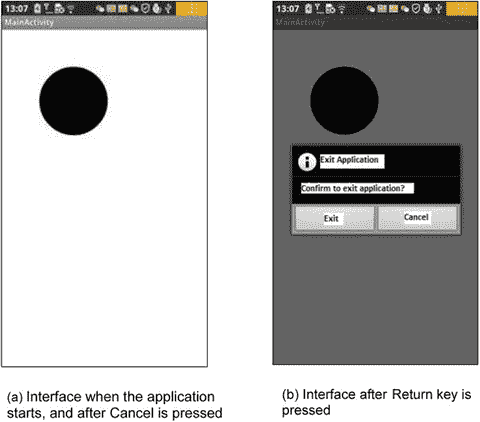

# 十、Android 应用的 GUI 设计第四部分：图形界面和触摸屏输入

Keywords Screen Touch View Class Constructor Function Application Interface Touch Point

到目前为止，已经有三章专门讨论了 Android 界面设计。到目前为止讨论的应用界面类似于对话框界面。缺点是难以获得准确的触摸屏输入信息，因此难以基于输入界面显示准确的图像。本章介绍基于视图的交互风格界面。在这种模式下，您可以通过准确的触摸屏输入信息，并显示详细的图像，这恰好是许多游戏应用的要求。

## 显示输出框架

与由`TextView`、`EditText`、`Button`和其他窗口组件组成的对话框风格的界面不同，交互式 UI 显示直接使用一个`View`类。本节介绍在视图中绘图的基本框架(即显示图像或图形)。

为了在视图中显示图像和图形，您需要将绘图代码放入它的`onDraw`函数中。每当需要在视图中重新绘制图像时，调用`onDraw`函数，例如当应用启动时显示视图时，当图形视图顶部的封面对象(例如视图、事件或对话框)被移走时，当底层的视图随着活动移动到顶层时，或者类似的情况。建议您将绘图代码放在`View.onDraw`函数中，这样您可以确保视图何时需要显示给用户。视图窗口也可以立即显示在其总输出中；否则，某些图形视图区域可能无法刷新或重新绘制。

画矩形、画椭圆、画直线、显示文本等 Android 绘图功能通常集成在`Canvas`类中。当`View.onDraw`回调执行时，它会带来一个用于获取`Canvas`对象的`Canvas`参数。

Android 使用`Paint`类来绘制各种图形。`Paint`包含多种画笔属性，如颜色、填充样式、字体和字体大小。

如本书前面所述，Eclipse 中生成的应用代码的接口配置样式如下:一个活动包含布局，一个布局包含两层小部件结构。因此，您可以在布局中为活动的`onCreate`函数中的`setContentView`函数设置参数，以实现这种效果。要使用基于视图的接口，您需要将`setContentView`函数的默认参数布局更改为自定义视图类。

这里有一个例子来说明这个过程。使用以下步骤修改`GuiExam`示例项目:

1.  使用与第九章中“触发无参数活动的显式匹配”一节相同的步骤，创建一个新类(`MyView`)，如图 10-1 所示。

1.  编辑新添加的类的源代码(`MyView.java`)。内容如下所示。

图 10-1。

Create a new class in the project

`Line#    Source Code`

`1  package com.example.guiexam;`

`2`

`3` `import android.view.View;`

`4` `import android.graphics.Canvas;`

`5` `import android.graphics.Paint;`

`6` `import android.content.Context;`

`7` `import android.graphics.Color;`

`8` `import android.graphics.Paint.Style;`

`9` `import android.graphics.Rect;`

`10` `import android.graphics.Bitmap;`

`11` `import android.graphics.BitmapFactory;`

`12` `import android.graphics.Typeface;`

`13 public class MyView extends View {`

`14` `MyView(Context context) {`

`15` `super(context);`

`16` `}`

`17` `@Override`

`18` `public void onDraw(Canvas canvas) {`

`19` `Paint paint = new Paint();`

`20` `paint.setAntiAlias(true);        //  Sett anti-aliasing`

`21` `// paint.setColor(Color.BLACK);          // Set Color Black`

`22` `// paint.setStyle(Style.FILL);           // Set Fill Style`

`23` `canvas.drawCircle(250, 250, 120, paint);   // Draw Circle`

`24` `paint.setColor(Color.RED);       // Set color red`

`25` `paint.setStyle(Style.STROKE);    // Set style-Stroke ( no fill)`

`26` `canvas.drawRect(new Rect(10, 10, 120, 100), paint); // draw rect`

`27` `paint.setColor(0xff0000ff /*Color.BLUE*/ );`

`28` `String str = "Hello!";`

`29` `canvas.drawText(str, 150, 20, paint);  // display text`

`30` `paint.setTextSize(50);                 // Set Text Size`

`31` `paint.setTypeface(Typeface.SERIF);     // Set Typeface: Serif`

`32` `paint.setUnderlineText(true);          // Set Underline Text`

`33` `canvas.drawText(str, 150, 70, paint);  // Display text`

`Bitmap bitmap = BitmapFactory.decodeResource(getResources(),R.drawable.ic_launcher);`

`canvas.drawBitmap(bitmap, 0, 250, paint); // Display image`

`}`

`}`

第 13 行代码添加了`extends View`，做了一个自定义类；在这种情况下，`MyView`从`View`类别继承而来。第 13-16 行创建了一个调用超类的定制类构造函数。此构造函数对于防止以下编译错误至关重要:

`Implicit super constructor View() is undefined. Must explicitly invoke another constructor`

第 17/34 行覆盖了对各种绘图代码进行编程的功能。您构造了一个画笔——也就是一个`Paint`对象——用于在第 16 行进行绘制，并设置它来消除第 17 行中的锯齿边缘。第 23 行画圆(x = 250，y = 250)；第 24 行将画笔颜色设置为红色，依此类推。

`setColor`函数的原型是

`void Paint.setColor(int color);`

在 Android 中，基于α、红色、绿色和蓝色，用一个四字节的整数来表示一种颜色。整数数据格式如下所示:

<colgroup><col> <col> <col> <col></colgroup> 
| 机 管 局 | 阻力比 | gasgenerator 煤气发生器 | bb |

从左到右，前四个字节代表α、红色、绿色和蓝色值。例如，蓝色是 0xff0000ff，这也反映在第 27 行中。此外，Android `Color`类还为一些颜色定义了一个常量，比如`BLACK`、`RED`、`GREEN`、`BLUE`等等，如第 24 行所示。

该函数设置画笔的填充模式。函数原型是

`void  Paint.setStyle(Paint.Style style)`

参数`style`可以取`Paint.Style.STROKE`(空心填充)、`Paint.Style.FILL`(实心填充)、或者`Paint.Style.FILL_AND_STROKE`(实心填充)。这些值是在`Paint.Style`类中定义的常量；它们对应的显示样式如表 10-1 所示。

表 10-1。

Fill Mode Parameters and Examples

<colgroup><col> <col></colgroup> 
| 显示的图像 | 图形功能参数设置 |
| --- | --- |
|  | `Color=BLACK, Style=FILL` |
|  | `Color=BLACK, Style=STROKE` |
|  | `Color=BLACK`，`Style=FILL_AND_STROKE` |

1.  修改主`Activity`类(`MainActivity.java`)如下:

`Line#    Source Code`

1 `package com.example.guiexam;`

2 `import android.os.Bundle;`

3 `import android.app.Activity;`

4 `import android.view.Menu;`

5 `public class MainActivity extends Activity {`

6 `@Override`

7 `public void onCreate(Bundle savedInstanceState) {`

8 `super.onCreate(savedInstanceState);`

9 `// setContentView(R.layout.activity_main);`

10 setContentView(新 my view(this))；

11 `}`

12 `......`

系统自动用第 8 行的代码覆盖第 7 行的代码。这允许一个定制的视图类代替默认的布局作为活动的接口。

应用界面如图 10-2 所示；(a)显示整个界面，而(b)是图形显示的放大部分。

图 10-2。

The interface of the display output framework of the `GuiExam` application

## 响应触摸屏输入的绘图框架

前面的示例应用只显示图像/图形，不能响应触摸屏输入。在本节中，您将看到如何响应触摸屏输入并控制视图显示。

`View`有一个`onTouchEvent`函数，其函数原型如下:

`boolean View.onTouchEvent(MotionEvent event);`

当用户在触摸屏上点击、释放、移动或进行其他交互动作时，会生成触摸输入事件。该触摸输入事件触发对`View.onTouchEvent`的调用。为了允许用户处理触摸屏输入，您需要重写这个函数。响应代码需要写在函数体中。

`View.onTouchEvent`有一个类型为`MotionEvent`的参数，它定义了`MotionEvent`类的接触点的坐标位置、事件类型等等。事件类型可以是`MotionEvent.ACTION_DOWN`、`MotionEvent.ACTION_MOVE`、`MotionEvent.ACTION_UP`或等效类型，如`MotionEvent`类中定义的常量。常量表示交互式操作，如触摸屏按下、触摸屏移动、触摸屏弹出等。

如前所述，每当需要重绘视图时，都会调用该函数，因此需要将绘图代码放入该函数中。大多数时候，系统可以自动触发重绘事件；但是因为用户设计他们自己的重绘，系统不知道他们什么时候需要被触发。例如，也许用户更新了显示内容，但是内容的位置、大小和级别没有改变；因此，系统不会触发 redraw 事件。在这种情况下，用户需要调用`View`类的类函数`postInvalidate`或`invalidate`来主动生成重绘事件。函数原型是

`void  View.invalidate(Rect dirty)`

`void  View.invalidate(int l, int t, int r, int b)`

`void  View.invalidate()`

`void  View.postInvalidate(int left, int top, int right, int bottom)`

`void  View.postInvalidate()`

没有参数的`postInvalidate`和函数重画整个视图；带参数的`postInvalidate`和`invalidate`函数重画视图的指定区域(或某个区域)。有常量和没有常量的`postInvalidate`和`invalidate`的区别在于，第一种情况需要一个事件循环，直到下一个事件产生 redraw 事件，而第二种情况立即发出 redraw。

下面的示例阐释了绘制响应触摸屏输入的代码的框架。该应用的界面如图 10-3 所示。

图 10-3。

The interface of a `GuiExam` input graphics framework that responds to the touchscreen

应用从图 10-3(a) 开始。当用户在一个圆圈内点击(触摸圆圈区域内的屏幕)时，圆圈的颜色发生变化:它在黑色、红色、绿色和蓝色之间循环，如图 10-3(a)–(d)所示。如果您在圆外单击，圆不会改变颜色。

使用与前面部分相同的示例，修改定制视图类`MyView.java`,如下所示:

`Line#    Source Code`

`1  package com.example.guiexam;`

`2`

`3  import android.view.View;`

`4  import android.graphics.Canvas;`

`5  import android.graphics.Paint;`

`6  import android.content.Context;`

`7`

`8  import android.graphics.Color;`

`9` `import android.view.MotionEvent;`

`10       import java.lang.Math;`

`11 public class MyView extends View {`

`12` `private float cx = 250;     // Default X Coordinate of Circle`

`13` `private float cy = 250;     // Default Y Coordinate of Circle`

`14` `private int radius = 120;   // Radius`

`15` `private int colorArray[] = {Color.BLACK, Color.RED, Color.GREEN, Color.BLUE };`

`16` `// Defines an array of colors`

`17` `private int colorIdx = 0;   // Custom color subscript`

`private Paint paint;        // Define Paint`

`18`

`19     public MyView(Context context) {`

`20         super(context);`

`21` `paint = new Paint();       // Initialization paintbrush`

`22` `paint.setAntiAlias(true);  // Setting anti-aliasing`

`23` `paint.setColor(colorArray[colorIdx]);    // Set the pen color`

`}`

`24`

`25     @Override`

`26     protected void onDraw(Canvas canvas) {`

`27` `canvas.drawCircle(cx, cy, radius, paint);`

`}`

`28`

`29` `@Override`

`30` `public boolean onTouchEvent(MotionEvent event) {`

`31` `float px = event.getX();`

`32` `// defined the touch point in the X, Y coordinates`

`33` `float py = event.getY();`

`34` `switch (event.getAction()) {`

`35` `case MotionEvent.ACTION_DOWN:`

`36` `// Touch  screen pressed`

`37``if (Math.abs(px-cx) < radius``&&`

`38` `// Touch location inside the circle`

`39` `colorIdx = (colorIdx + 1) % colorArray.length;`

`40` `paint.setColor(colorArray[colorIdx]);`

`41` `// Set paintbrush color`

`42` `}`

`43` `postInvalidate();          // Repaint`

`44` `break;`

`45` `case MotionEvent.ACTION_MOVE:  // Screen touch and move`

`46` `break;`

`47` `case MotionEvent.ACTION_UP:    // Screen touch unpressed`

`break;`

`}`

`return true;`

`}`

`}`

第 15 行和第 16 行定义了颜色和颜色索引的数组，第 17 行定义了画笔变量。构造函数的第 20–22 行完成了笔刷属性设置的初始化。你不把画笔属性的代码放在`View.Ondraw`中的原因是为了避免每次重绘的重复计算。`onDraw`函数的唯一工作是显示圆。

在第 28–46 行，您创建了新的触摸输入事件响应函数`onTouchEvent`。在第 30 行和第 32 行，首先使用`MotionEvent`类的`getX`和`getY`函数获得触摸点的 X，Y 坐标。然后您通过第 34 行中的`MotionEvent`类的`getAction`函数获得输入动作类型，随后是一个`case`语句来完成不同的输入动作。第 37–43 行是对按下触摸屏动作的响应。您确定接触点是否在第 37 行的圆内。然后修改设置颜色的代码，并在第 39–40 行更改钢笔颜色。你调用`postInvalidate`函数通知在第 43 行重画，并为其提供最后的点睛之笔。

## 多点触摸代码框架

大多数 Android 设备都支持多点触控触摸屏。好消息是 Android 系统软件也提供了多点触控支持。本节介绍多点触控代码框架。

触摸事件类`MotionEvent`有一个`getPointerCount()`函数，返回屏幕上触摸点的当前数量。函数原型是

`final int MotionEvent.getPointerCount();`

还可以使用前面讨论的`getX`和`getY`函数来获取触摸点的坐标。原型如下:

`final float  MotionEvent.getX(int pointerIndex)`

`final float  MotionEvent.getX()`

`final float  MotionEvent.getY(int pointerIndex)`

`final float  MotionEvent.getY()`

在上一节中，您使用不带参数的函数获得了单个触摸点的坐标。带参数的`getX` / `getY`函数用于获取多点触摸情况下触摸点的位置，其中参数`pointerIndex`为触摸点的索引号。这是一个从 0 开始的整数。

这里有一个例子来说明多点触摸编程框架。这个例子是一个两点触摸应用，它放大和缩小一个圆。应用界面如图 10-4 所示。

图 10-4。

The interface of the two-point touch zoom-in/zoom-out GuiExam graphic application

应用的启动界面如图 10-4(a) 所示。圆总是在视图的中心，但是圆的大小(它的半径)可以通过两点触摸来控制。中心是视图的中心，而不是活动的中心或屏幕的中心。所谓的两点触摸屏是指有两个触摸点，或两个手指同时在屏幕上移动，要么是圆圈变大的扩展手势(b)，要么是圆圈变小的挤压手势(c)。代码如下:

`Line#    Source Code`

`1  package com.example.guiexam;`

`2`

`3  import android.view.View;`

`4  import android.graphics.Canvas;`

`5  import android.graphics.Paint;`

`6  import android.content.Context;`

`7`

`8  import android.view.MotionEvent;`

`9  import java.lang.Math;`

`10 public class MyView extends View {`

`11` `private static final int initRadius = 120; // initial value of the radius`

`12     private float cx;                // X coordinate of the circle`

`13     private float cy;                // Y coordinate of the circle`

`14` `private int radius = initRadius; // Set initial value of the radius`

`15` `public float graphScale = 1;     // Set Scale factor for one two-point touch move`

`16` `private float preInterPointDistance;    // Pre-distance of two touch points`

`17` `private boolean bScreenPress = false;   // The sign of the screen being pressed down`

`18     private Paint paint;                    // Define paintbrush`

`19     public MyView(Context context) {`

`20         super(context);`

`21         paint = new Paint();                // Initialize paintbrush`

`22         paint.setAntiAlias(true);           // Set Anti Alias`

`23     }`

`24     @Override`

`25     protected void onDraw(Canvas canvas) {`

`26` `cx = canvas.getWidth()/2;  // Let circle center positioned at the screen of the screen`

`27` `cy = canvas.getHeight()/2;`

`28         canvas.drawCircle(cx, cy, radius*graphScale, paint);`

`29     }`

`30     @Override`

`31     public boolean onTouchEvent(MotionEvent event) {`

`32` `float px1, py1;  // Define the X,Y coordinates of 1st touch point`

`33` `float px2, py2;  // Define the X,Y coordinates of 2nd touch point`

`34` `float interPointDistance;  // distance between two  touch points`

`35` `switch (event.getAction()) {`

`36` `case MotionEvent.ACTION_DOWN:   // Screen touch pressed`

`37` `break;`

`38` `case MotionEvent.ACTION_MOVE:   // Screen touch move`

`39` `if (event.getPointerCount() == 2 ) {`

`40` `px1 = event.getX(0);    // Get the X,Y coordinate of the first touch point`

`41` `py1 = event.getY(0);`

`42` `px2 = event.getX(1);    // Get the X,Y coordinate of the second touch point`

`43` `py2 = event.getY(1);`

`44` `interPointDistance = (float) Math.sqrt((px6-px2)*(px6-px2)+(py1 - py2)*(py1 - py2));`

`45` `if (!bScreenPress){`

`46` `bScreenPress = true;`

`47` `preInterPointDistance = interPointDistance;`

`48` `} else {`

`49` `graphScale = interPointDistance / preInterPointDistance;`

`50` `invalidate();       // Redraw graphics`

`51` `}`

`52` `} else {`

`53` `bScreenPress = false;`

`54` `radius = (int)(radius * graphScale);`

`55` `// One downsize/enlarge circle end. Record final scale factor`

`56` `}`

`57` `break;`

`58` `case MotionEvent.ACTION_UP:     // Screen touch lift up`

`59` `bScreenPress = false;`

`60` `radius = (int)(radius * graphScale);`

`61` `// One downsize/enlarge circle end. Record final scale factor`

`62` `break;`

`63` `}`

`64         return true;`

`}`

`}`

这段代码在第 15 行定义了两点触摸的比例因子`graphScale`，在第 16 行定义了变量`preInterPointDistance`来记录两个触摸点之间的距离。第 17 行定义了屏幕被按下时的标志变量`bScreenPress`。

第 26 行和第 27 行调用`onDraw`函数中`Canvas`类的`getWidth`和`getHeight`来获取视图的宽度和高度，然后将圆心分配在视图的中心。这一步的好处是，当屏幕旋转 90 度时，圆保持在视图的中心，如图 10-4(d) 所示。这些例子与前一个例子的不同之处在于，这一次所画圆的半径等于圆的半径乘以比例因子`graphScale`。

第 32–61 行包含基于上一节修改示例的`onDraw`。第 38–56 行是触摸移动活动的响应代码。第 3 行确定是否有两个触摸点；如果有，运行代码行 40–51；否则，运行第 53–54 行。您将标志`bScreenPress`设置为 false，以指示何时第一次按下两个触摸点，然后记录最终半径，该半径等于半径的当前值乘以比例因子`graphScale`。您可以在第 40–43 行中获得两个接触点的位置坐标。线 44 计算两个接触点之间的距离。第 45 行确定它是否是第一次按压；如果是，则运行 46 和 47 行，并记录两个触摸点之间的距离；否则，运行第 49/50 行的代码。在这里，您可以根据点之间的当前距离和上一次移动的距离来计算比例因子。在这之后，图形被重新绘制。

为了处理标志`bScreenPress`的位置，您在第 58–60 行执行屏幕触摸活动的响应代码，它类似于第 53 和 54 行的非两点触摸代码。

## 响应键盘输入

大多数 Android 设备都有许多硬件按钮，如音量+，音量-，电源，主页，菜单，后退，搜索等等。一些 Android 设备也配备了键盘。键盘，包括设备的硬件按钮，是 Android 应用的重要输入方法。键盘输入对应键盘事件，命名为`KeyEvent`(也称为按键事件)。在本节中，您将了解响应键盘输入的方法。

在 Android 中，`Activity`和`View`类都可以接收按键事件。按键事件触发对`Activity`或`View`类的`onKeyDown`函数的调用。函数原型是

`boolean    Activity.onKeyDown(int keyCode, KeyEvent event);`

`boolean    View.onKeyDown(int keyCode, KeyEvent event);`

`keyCode`参数是被按下的键的索引代码。Android 中的每个键都有一个唯一的数字，就是`keyCode`。表 7-1 中描述了一些关键代码。按键事件`KeyEvent`包含与按钮相关的属性，比如按钮被按下的频率。为了处理关键事件，您需要覆盖`onKeyDown`函数并添加您自己的响应处理代码。

有趣的是，虽然`Activity`和`View`类可以接收关键事件，但是视图通常包含在活动中。当按钮被按下时，事件首先发送外部活动；也就是说，活动会更快地收到事件。下面的例子展示了如何通过重写活动的`onKeyDown`函数来响应按钮的按下。

这个例子显示了如何使用箭头键在应用中移动圆。应用界面如图 10-5 所示。

图 10-5。

Using keys to control the movement of the circle in the application interface

我们测试的联想手机没有键盘，所以我们选择在虚拟机上运行应用。虚拟机有左、下、右和上键来实现这些圆周运动。应用启动界面如图 10-5(a) 所示。按下左、下、右或上按钮使圆圈向相应的方向移动。界面示例如图 10-5(b)至(e) 所示。

该应用基于本章开头创建的示例(图 10-1 )并按照以下程序进行修改:

1.  修改`MyView.java`的源代码如下:

`Line#    Source Code`

`1  package com.example.guiexam;`

`2`

`3  import android.view.View;`

`4  import android.graphics.Canvas;`

`5  import android.graphics.Paint;`

`6  import android.content.Context;`

`7  public class MyView extends View {`

`8      private float cx = 250;                 // X coordinate of the circle`

`9      private float cy = 250;                 // Y coordinate of the circle`

`10     private static final int radius = 120;  // Radius of the circle`

`11     private Paint paint;                    // define paint brush`

`12` `private static final int MOVESTEP = 10; // the step length for pressing direction key`

`13     public MyView(Context context) {`

`14         super(context);`

`15         paint = new Paint();                // Paint brush initialization`

`16         paint.setAntiAlias(true);           // Set Anti Alias`

`17     }`

`18     @Override`

`19     protected void onDraw(Canvas canvas) {`

`20         canvas.drawCircle(cx, cy, radius, paint);`

`21     }`

`22     ////// Self-define function:press key to move graphic (circle) //////`

`23` `public void moveCircleByPressKey(int horizon, int vertical){`

`24` `if (horizon < 0)                    // horizontal move`

`25` `cx -= MOVESTEP;`

`26` `else if (horizon > 0)`

`27` `cx += MOVESTEP;`

`28` `if (vertical < 0)`

`29` `cy += MOVESTEP;                 // vertical move`

`30` `else if (vertical > 0)`

`31` `cy -= MOVESTEP;`

`32` `postInvalidate();                   // note to repaint`

`33` `}`

`34 }`

在第 23–33 行，您向 view 类添加了一个函数，通过按 horizon 或 vertical 键来移动图像(圆圈)。这个函数有两个参数:`horizon`和`vertical`。如果`horizon`小于 0，则减小圆的 X 坐标值，结果圆向左移动。如果`horizon`大于 0，则增加圆的 X 坐标值，这将使圆向右移动。对垂直参数执行类似的操作，上下移动圆。第 32 行用新参数更新图形例程，并触发视图重绘。

1.  修改主活动类`MainActivity.java`的源代码，如下所示:

`Line#    Source Code`

`1  package com.example.guiexam;`

`2  import android.os.Bundle;`

`3  import android.app.Activity;`

`4  import android.view.Menu;`

`5` `import android.view.KeyEvent;     // Key press event class`

`6  public class MainActivity extends Activity {`

`7` `private MyView theView =null;  // View object stored inside the variable`

`8      @Override`

`9      public void onCreate(Bundle savedInstanceState) {`

`10         super.onCreate(savedInstanceState);`

`11` `theView = new MyView(this); // record the View class of the Activity`

`12` `setContentView(theView);`

`13     }`

`14     @Override`

`15     public boolean onCreateOptionsMenu(Menu menu) {`

`16         getMenuInflater().inflate(R.menu.activity_main, menu);`

`17         return true;`

`18     }`

`19` `@Override                     // Key down response function`

`20` `public boolean onKeyDown(int keyCode, KeyEvent event) {`

`21` `int horizon = 0; int vertical = 0;`

`22` `switch (keyCode)`

`23` `{`

`24` `case KeyEvent.KEYCODE_DPAD_LEFT:`

`25` `horizon = -1;`

`26` `break;`

`27` `case KeyEvent.KEYCODE_DPAD_RIGHT:`

`28` `horizon = 1;`

`29` `break;`

`30` `case KeyEvent.KEYCODE_DPAD_UP:`

`31` `vertical = 1;`

`32` `break;`

`33` `case KeyEvent.KEYCODE_DPAD_DOWN:`

`34` `vertical = -1;`

`35` `break;`

`36` `default:`

`37` `super.onKeyDown(keyCode, event);`

`38` `}`

`39``if (!(horizon == 0``&&`

`40` `theView.moveCircleByPressKey(horizon,vertical);`

`41` `return true;`

`42` `}`

`43 }`

在这段代码中，您希望`Activity`类接收并响应按键事件，因此您用按钮响应代码覆盖了第 19–42 行中的`onKeyDown`函数。虽然按键的响应函数位于`Activity`类中，但是显示更新要在视图`MyView`类中实现，所以你必须让`Activity`类知道它对应的视图对象。为此，您在第 7 行添加一个记录视图对象变量`theView`。在第 11 行和第 12 行，您让`theView`在构造视图对象时记录这个对象。

在按键响应函数`onKeyDown`中，您使用一个`switchcase`语句(第 22-38 行)并根据不同的按键采取不同的动作。该函数的`keyCode`参数指定了被按下的键的键号。例如，第 24–26 行中的代码是左键的处理代码。它将一个水平标志设置为“left ”,然后调用 view 类的自定义函数`moveCircleByPressKey`来移动第 39 行和第 40 行中的圆。为了允许处理其他按键事件，您调用系统的默认处理程序来处理第 36 行和第 37 行中的其他按键。

## Android 中的对话框

在 Android 中有三种不同的方式来使用对话框，正如本节所讨论的。

### 使用活动的对话主题

`Dialog`类实现了一个简单的浮动窗口，可以在活动中创建。通过使用一个基本的`Dialog`类，您可以创建一个新的实例并设置它的标题和布局。对话框主题可以应用到普通的活动中，使它看起来像一个对话框。

此外，`Activity`类提供了一个方便的机制来创建、保存和恢复对话框，比如`onCreateDialog(int)`、`onPrepareDialog(int, Dialog)`、`showDialog(int)`、`dismissDialog(int)`以及其他函数。如果使用这些函数，活动可以通过`getOwnerActivity()`方法返回管理对话框的`Activity`对象。

以下是使用这些功能的具体说明。

#### onCreateDialog(int)函数

当你使用这个回调函数时，Android 会将这个活动设置为每个对话框的所有者，它会自动管理每个对话框的状态，并将其锚定到该活动。这样，每个对话框都继承了该活动的特定属性。例如，当对话框打开时，菜单按钮显示为活动定义的选项菜单。例如，您可以使用音量键来修改活动使用的音频流。

#### showDialog(int)函数

当您想要显示一个对话框时，您可以调用`showDialog(intid)`方法并通过这个函数调用传递一个整数来惟一地标识这个对话框。当对话框第一次被请求时，Android 从活动中调用`onCreateDialog(intid)`。您应该初始化此对话框。这个回调方法被传递给`showDialog(intid)`拥有的同一个 ID。创建对话框时，对象在活动结束时返回。

#### onPrepareDialog(int，Dialog)函数

在对话框显示之前，Android 还调用可选的回调函数`onPrepareDialog(int id, Dialog)`。如果希望每次打开对话框时都更改属性，可以定义此方法。与只能在第一次打开对话框时调用的`onCreateDialog(int)`函数不同，该方法在每次打开对话框时都会被调用。如果您没有定义`onPrepareDialog()`，那么对话框将保持上次打开时的状态。对话框的 ID 和在`onCreateDialog()`中创建的对话框对象也可以通过这个方法传递给函数。

#### dismissDialog(int)函数

当你准备关闭对话框时，可以通过这个对话框方法调用`dismiss()`来消除。如果需要，您也可以从活动中调用`dismissDialog(int id)`方法。如果你想用`onCreateDialog(int id)`方法来保留你的对话框的状态，那么每次对话框被消除时，这个对话框对象的对象状态都被保留在活动中。如果你决定不再需要这个对象或者清除状态，那么你应该调用`removeDialog(intid)`。这将移除任何内部对象引用，即使对话框正在显示，它也会被消除。

### 使用特定的对话框类

Android 提供了多个作为`Dialog`类扩展的类，比如`AlertDialog`、`ProgressDialog`等等。每个类都被设计为提供特定的对话框功能。基于`Dialog`类的屏幕接口在所有调用特定类的活动中创建。因此它不需要在清单文件中注册，它的生命周期由调用该类的活动控制。

### 使用 Toast 提醒

Toasts 是特殊的、非模块化的、瞬时的消息对话框，通常用于广播接收器和 backgroundservices，并用于提示用户事件。

### 对话框示例

在讨论的对话框方法中，如果用函数的实现方式来衡量，第一个函数是最强大的，其次是第二个和第三个。就实现代码的复杂程度而言，第三种方法最简单，第一种和第二种更复杂。

下面的示例演示了第二种方法。请参阅 Android 的帮助文档和示例(在 Android SDK 安装目录下的`samples`目录中),了解其他实现方法的更多信息。

这个示例应用使用的特定对话框类是`AlertDialog`的`Builder`内部类。当你按下返回按钮时，会弹出一个对话框，让你决定是否退出应用。应用界面如图 10-6 所示。在这个例子中使用 Android 对话框会帮助你理解它的用法。

图 10-6。

The application interface with an Exit dialog box

应用启动并显示主活动界面，如图 10-6(a) 所示。按下设备的后退按钮，弹出退出对话框，如图 10-6(b) 所示。当您单击 Exit 按钮时，应用退出，界面也关闭。当你点击取消按钮时，应用返回到上一个屏幕，类似于图 10-6(a) 。

将活动类`MainActivity.java`的源代码修改如下:

`Line#    Source Code`

`1  package com.example.guiexam;`

`2  import android.os.Bundle;`

`3  import android.app.Activity;`

`4  import android.view.Menu;`

`5  import android.view.KeyEvent;            // Key event class`

`6` `import android.app.Dialog;               // Use Dialog class`

`7` `import android.app.AlertDialog;          // Use AlertDialog class`

`8` `import android.content.DialogInterface;  // Use DialogInterface interface`

`9  public class MainActivity extends Activity {`

`10     private MyView theView =null;        // View objects stored inside the variable`

`11` `private AlertDialog.Builder exitAppChooseDlg = null; // Exit App dialog box`

`12` `private Dialog dlgExitApp = null;`

`13     @Override`

`14     public void onCreate(Bundle savedInstanceState) {`

`15         super.onCreate(savedInstanceState);`

`16         theView = new MyView(this);  // View class of Record My Activity`

`17         setContentView(theView);`

`18` `exitAppChooseDlg = new AlertDialog.Builder(this);`

`19` `// Define  AlertDialog.Builder object`

`20` `exitAppChooseDlg.setTitle("Exit Selection");`

`21` `// Define the title of the dialog box`

`exitAppChooseDlg.setMessage("Confirm to exit application`？`");`

`22` `// Define the display text of the dialog box`

`23` `exitAppChooseDlg.setIcon(android.R.drawable.ic_dialog_info);`

`24` `// Define the icon of the dialog box`

`25`

`26` `// Set the leftmost button and click response class`

`27` `exitAppChooseDlg.setPositiveButton("Exit", new DialogInterface.OnClickListener() {`

`28` `public void onClick(DialogInterface dialog, int which) {`

`29` `dialog.dismiss();        // Close Dialog Box`

`/*MainActivity.*/finish(); // Exit (main) Activity`

`30` `System.exit(0);          // Exit Application`

`31` `}`

`32` `});`

`33`

`34` `// Set the rightmost button and click response class`

`35` `exitAppChooseDlg.setNegativeButton("Cancel", new DialogInterface.OnClickListener() {`

`36` `public void onClick(DialogInterface dialog, int which) {`

`37` `dialog.cancel();          // Close dialog box`

`}`

`38` `});`

`39` `dlgExitApp = exitAppChooseDlg.create();`

`40` `// Create dialog box exit object`

`41     }`

`42`

`@Override`

`43     public boolean onCreateOptionsMenu(Menu menu) {`

`44         getMenuInflater().inflate(R.menu.activity_main, menu);`

`45         return true;`

`46     }`

`47`

`48     @Override        // Key down response function`

`49     public boolean onKeyDown(int keyCode, KeyEvent event) {`

`50         int horizon = 0; int vertical = 0;`

`51         switch (keyCode)`

`52         {`

`53             case KeyEvent.KEYCODE_DPAD_LEFT:`

`54                 horizon = -1;`

`55                 break;`

`56             case KeyEvent.KEYCODE_DPAD_RIGHT:`

`57                 horizon = 1;`

`58                 break;`

`59             case KeyEvent.KEYCODE_DPAD_UP:`

`60                 vertical = 1;`

`61                 break;`

`62             case KeyEvent.KEYCODE_DPAD_DOWN:`

`63                 vertical = -1;`

`64                 break;`

`65` `case KeyEvent.KEYCODE_BACK:`

`66` `if (event.getRepeatCount() == 0) {`

`67` `dlgExitApp.show();`

`68` `// Display AlertDialog.Builder dialog box`

`69` `}`

`70` `break;`

`71             default:`

`72                 super.onKeyDown(keyCode, event);`

`}`

`if (!(horizon == 0 && vertical == 0))`

`theView.moveCircleByPressKey(horizon,vertical);`

`return true;`

`}`

`}`

第 11 行和第 12 行定义了`AlertDialog.Builder`类及其在`Activity`类中与`Dialog`类相关的变量。您修改第 18–36 行的`onCreate`功能代码，并定义代码以准备对话框。在第 18 行，您构造了`AlertDialog.Builder`类对象；这个构造函数的原型是

`AlertDialog.Builder(Context context)`

`AlertDialog.Builder(Context context, int theme)`

在这个例子中，您使用第一个原型来传递`Activity`对象，该对象将对话框构造为构造函数的上下文。接下来在第 19 行和第 21 行设置对话框的标题显示文本、图标和其他属性。

`AlertDialog.Builder`对话框最多可以有三个按钮:左、中和右。它们分别由`setPositiveButton`、`setNeutralButton`和`setNegativeButton`功能设置。您可以指定需要多少个对话框按钮。这个例子使用了两个按钮:左和右。

第 23–29 行设置对话框的左键并单击-响应代码。`AlertDialog.Builder`类的函数原型是

`AlertDialog.Builder  setPositiveButton(int textId, DialogInterface.OnClickListener listener)`

`AlertDialog.Builder  setPositiveButton(CharSequence text, DialogInterface.OnClickListener listener)`

在示例中使用了第二个原型，其中第一个参数是按钮显示的文本，第二个参数是单击响应的接口对象。

在第 25 行，首先调用该类的解散或取消函数来关闭对话框。`DialogInterface`是对话框类的操作界面(`AlertDialog`、`Dialog`等)。在第 25 行使用`dismiss`函数关闭对话框，在第 33 行使用`cancel`函数关闭对话框。

第 26–27 行关闭活动和应用，如“退出活动和应用”一节所述在第八章，图 8-16。有趣的是，内部类`DialogInterface.OnClickListener`使用了非点外部类`MainActivity`的成员函数，不需要在“类名”前面加上前缀。

您在第 36–35 行设置了右键单击的对话框-响应代码。点击响应代码相对简单，在第 33 行使用`DialogInterface`类的`cancel`函数关闭对话框。

最后，第 36 行调用`AlertDialog.Builder`类的`create`函数来创建退出对话框对象`dlgExitApp`。该函数返回一个`AlertDialog`对象，其原型是

`AlertDialog  create()`

因为`AlertDialog`是从`Dialog`类派生的，所以返回值可以赋给`Dialog`变量。

在第 60/64 行添加响应函数的返回键响应代码。代码相对简单:您确定在第 61 行是否按下了重复的键，然后您调用`Dialog`类的`show`函数来显示一个对话框。

## 应用属性设置

在 Android 设备中，有两个不同的地方可以找到关于安装的应用的信息。一个是菜单列表(按下设置按钮后的界面)，另一个是通过进入设置➤应用➤管理应用➤下载的菜单项。见图 10-7 :

图 10-7。

The difference of Menulist and Application Setting display on target device

到目前为止，几乎所有的例子都是基于两个应用的代码框架:`GuiExam`和`HelloAndroid`。但是很难在目标设备的菜单中区分它们。这些应用在菜单列表中无法区分，因为您使用了默认设置，而没有应用它们自己的属性设置。本节说明如何应用属性设置。

图 10-8 显示了应用属性设置前后的应用设置界面。

图 10-8。

The application on the target device before and after applying property setting

该示例使用`GuiExam`应用来展示更改应用设置的步骤:

1.  在目标机器上修改菜单中应用的图标。根据应用`res\drawable-XXX`目录下的`ic_launcher.png`文件大小(其中`XXX`代表不同的分辨率，例如`drawable-hdpi`代表高分辨率图像的目录)，编辑您的图像文件，并将其命名为`ic_launcher.png`。

Android 设备的常见屏幕分辨率和应用图标文件存储的目录如表 10-2 所示。

1.  将自定义图片文件放入相应的目录`res\drawable-XXX`，替换原文件。例如，对于高分辨率屏幕应用，将`res\drawable-xhdpi`中的文件`ic_launcher.png`替换为自己的文件，如图 10-9 所示。

表 10-2。

Common Android Device Screen Resolutions and the Directories Containing Application Icon Sizes

<colgroup><col> <col> <col></colgroup> 
| 目录名 | 大小 | 描述 |
| --- | --- | --- |
| `drawable-ldpi` | 36 × 36 dpi | 低分辨率屏幕 |
| `drawable-mdpi` | 48 × 48 dpi | 中等分辨率屏幕 |
| `drawable-hdpi` | 72 × 72 dpi | 高分辨率屏幕 |
| `drawable-xhdpi` | 96 × 96 dpi | 超高分辨率屏幕 |
| `drawable-xxhdpi` | 144 × 144 dpi | 超高分辨率屏幕 |

1.  在目标机器上修改应用的菜单文本注释。

图 10-9。

Replacing the application icon

打开`\res\values\strings.xml`文件的包浏览器窗格。将`title_activity_my_main`字符串值设置为自定义字符串(本例中为“GUI 示例”)，如图 10-10 所示。

图 10-10。

Modifying the icon text of the application

完成这些修改后，您可以看到目标应用的菜单项的图标和文本标签已经改变。

注步骤 1 也可以通过另一种方法来实现，这种方法可以在创建应用时生成自己的图标集。该过程如下:

1.  在“配置启动器图标”对话框中，单击图像按钮，然后单击图像文件右侧的浏览按钮。
2.  在打开的对话框中选择图片文件作为应用图标(本例中为`graywolf.png`)，如图 10-11 所示。

图 10-11。

Selecting the icon file when generating the application

配置启动器图标对话框如图 10-12 所示。

图 10-12。

Configuring the launcher icon when generating the application

换句话说，Eclipse 可以基于用户指定的图像文件，在`res\drawable-XXX`目录中自动生成具有适当维度的各种`ic_launcher.png`文件。这消除了手动编辑图像的需要。

## 摘要

在介绍 Android GUI 设计的最后一章中，您将了解视图中绘图的基本框架，绘图框架如何响应触摸屏输入的概念，以及如何控制视图的显示和多点触摸代码框架。您将使用一个示例来说明多点触摸编程框架和键盘输入响应。您将学习如何响应 Android 设备上可用的键盘输入和硬件按钮，如音量+、音量-、电源、主页、菜单、后退、搜索等。向您介绍了 Android 的三个不同的对话框，包括活动对话框主题、特定类对话框和 Toast 提醒。在本章的最后，您将学习如何更改应用属性设置。在下一章中，您将介绍 x86 平台上 android 应用的性能优化。Android 是一个资源有限的系统，因此它在空间和时间上需要非常严格的资源利用。与桌面系统相比，Android 应用的性能优化更为关键和紧迫。您将首先介绍 SOC 性能优化的基本原则，然后介绍基于英特尔架构的 Android 开发的性能优化原则和方法。

 Open Access This chapter is licensed under the terms of the Creative Commons Attribution-NonCommercial-NoDerivatives 4.0 International License ( [ http://​creativecommons.​org/​licenses/​by-nc-nd/​4.​0/​ ](http://creativecommons.org/licenses/by-nc-nd/4.0/) ), which permits any noncommercial use, sharing, distribution and reproduction in any medium or format, as long as you give appropriate credit to the original author(s) and the source, provide a link to the Creative Commons licence and indicate if you modified the licensed material. You do not have permission under this licence to share adapted material derived from this chapter or parts of it. The images or other third party material in this chapter are included in the chapter’s Creative Commons licence, unless indicated otherwise in a credit line to the material. If material is not included in the chapter’s Creative Commons licence and your intended use is not permitted by statutory regulation or exceeds the permitted use, you will need to obtain permission directly from the copyright holder.