# 十一、x86 平台上 Android 应用的性能优化

性能优化是每个应用开发人员想要追求的最重要的目标之一，无论该应用是用于一般的桌面 Windows 计算机还是 Android 设备。Android 是一个资源有限的系统，因此它需要非常严格的资源利用。与桌面系统相比，Android 应用的性能优化更为关键。

不同的应用在优化方面有不同的关注点。Android 系统的性能优化通常分为三类:应用运行速度、代码大小和功耗。一般来说，英特尔凌动处理器上 Android 的存储空间和成本并不是瓶颈，因此本章重点关注使应用运行更快的性能优化。第十三章介绍了功耗优化。

本章首先介绍了片上系统(SoC)性能优化的基本原理，然后介绍了基于英特尔架构的 Android 开发的性能优化原理和方法。第十二章讨论使用原生开发套件(NDK)在英特尔架构上为 Android 开发应用。

## 性能优化的原则

优化应用的性能实际上意味着优化应用的执行速度。优化旨在减少完成特定任务所需的时间。这是通过基于硬件或软件对应用进行结构调整来实现的。

当您优化应用的性能时，您需要遵循几个基本原则:

*   等值原则:性能优化后，应用执行的结果没有变化。
*   :性能优化后，目标代码运行速度更快。
*   :有时性能优化在某些方面实现了性能提升，但在其他方面却降低了性能。在确定是否需要性能优化时，您必须考虑综合的整体性能。

最重要的一个考虑因素涉及到时间和空间的交易。例如，为了执行函数计算，可以预先计算函数值，并将其作为表格放入程序存储区(内存)。程序在运行时，不用花时间反复计算函数，程序可以直接从表中取值，减少执行时间。类似地，可以使用散列方法在大空间上进行搜索，从而消除对比较操作的需要。

性能优化基于各种技术。下面几节描述几个主要的。

### 减少指令和执行频率

优化性能最常用的技术包括减少指令和执行频率。比如从数据结构和算法的角度来看，冒泡排序中比较和交换的指令需要执行 O (n 2 次。但是，通过使用快速排序，可以将指令的执行次数减少到 O (n log n)。

在循环优化中，代码运动可以从循环中提取无关的公共代码，将公共代码的执行时间从 N 减少到 1，从而大幅降低执行频率。另外，可以使用 C 和 C++ 支持的内联函数，避免嵌入函数调用代码；您可以省略函数调用指令和返回指令的实现。

### 选择更快的指令

您可以使用不同的指令执行相同的功能。不同的指令占用不同的机器时钟周期，因此执行时间也不同。这为您提供了选择更快指令的机会。

降低计算强度是通过选择更快的指令集来实现性能优化的一个典型例子。例如，通过将运算符左移两位，可以将一个整数乘以 4。移位指令占用的时钟周期比乘法或除法指令少得多，运行速度也快得多。

另一个例子是使用硬件提供的特殊指令来代替通用指令。例如，英特尔凌动处理器支持流式 SIMD 扩展(SSE)指令集。对于向量运算，您应该总是使用 SSE 指令:由于指令级并行处理，它们运行得更快。英特尔凌动处理器的普通加法指令宽度为 32 位，而 SSE 指令能够处理四倍于 32 位的数据。因此，使用 SSE 指令优化的代码大大缩短了消耗的时间。

### 提高并行度

您可以在多个级别提高并行度，包括指令、表达式、函数和线程。许多现代嵌入式处理器，包括英特尔凌动处理器，都支持指令流水线执行。这使您可以使用一种称为指令级并行的优化方法。代码链可以分解成几个不依赖于链的代码单元，可以在流水线中并行执行。

此外，许多嵌入式系统处理器，如英特尔凌动处理器，在物理上支持线程的并发执行。使用适当数量的并发线程而不是单线程可以提高运行速度。为了利用线程并发优化，您需要有意识地采用多线程技术；有时优化必须在编译器的支持下完成。

### 有效使用寄存器缓存

读写缓存寄存器比读写内存要快得多。缓存优化的目标是将正在使用和将要使用的数据和指令放在缓存中，以降低缓存命中率和减少缓存冲突。缓存优化经常出现在嵌套循环的优化过程中。寄存器优化包括有效使用寄存器，并尽可能多地将常用数据保存在寄存器中。

缓存基于局部性。也就是说，高速缓存假定要使用的数据位于已经在使用的最新数据中，或者在它自己的寄存器附近。这被称为局部性原理或局部性原理，它深深地影响着硬件、软件和系统的设计和性能。处理器所需的指令和数据总是首先被高速缓存访问读取。如果高速缓存有需要的数据，处理器总是直接访问高速缓存。在这种情况下，这样的访问称为；如果高速缓存不包含所需的数据，这被称为失败的命中或缓存未命中。

如果发生这种情况，处理器需要将数据从内存复制到高速缓存中。如果高速缓存的相应位置被其他数据占用，缓存中不再需要的数据将被驱逐并写回内存。失败的命中导致访问时间急剧增加；因此，提高缓存效率的目标是提高命中率和降低故障率。缓存和内存之间的数据交换是通过块单元完成的，块单元用于块复制或写回包含所需数据的块，以及将块写回内存。

局部性有两种含义:

*   :由于时间局部性，同一数据对象可能会被多次重用。一旦一个数据对象在一次失败的命中后被复制到缓存中，这个对象就会有许多后续的命中。后续点击比最初失败的点击运行得更快。
*   :一个块通常包含多个数据对象。由于空间局部性，失败命中后的块拷贝的成本由对其他对象的后续引用来分担。

### 性能优化方法

许多方法和技术可用于性能优化。您可以同时使用一种方法或多种全面的优化原则，例如修改源代码以提高运行速度。根据标准的类型，优化方法可以分为不同的类别。

根据优化是否与硬件相关，它可以是机器相关的优化，也可以是机器无关的优化。在机器相关的优化中，应用和代码执行与机器的特性无关。这些技术适用于所有的机器。例如，将代码移出循环、消除归纳变量和使用强度降低技术可以应用于任何机器或架构(x86 或 ARM)以获得相同的最佳结果。

依赖于机器的优化只能在特定的硬件或架构上进行。例如，将普通向量指令计算切换到使用 SSE 指令取决于英特尔凌动处理器的许多底层细节，并且只能在支持 SSE 指令的英特尔处理器上使用。一般来说，与机器无关的优化比与机器相关的优化更复杂、更难实现。

## 性能优化方法

在理想的情况下，编译器应该能够编译您编写的任何代码，并将其优化为最高效的机器代码。但事实是，编译器只能自动化所有可能的优化中的一部分，并且优化可能会被优化拦截器拦截。根据人工或自动化工具的作用大小，性能优化可以由编译器自动执行，由程序员手动执行，或者在开发工具的帮助下执行。以下部分介绍了几种可以用来实现性能优化的方法。

### 编译器的自动优化

现代编译器可以自动完成最常见的代码优化，这是优化的首选方式。这也称为编译器优化或编译优化。它必须由适当的扩展或开关变量触发。

使用位于 NDK(Android 本地开发工具包)或英特尔编译器(ICC)的 GCC 编译器(GNU 工具链中的工具之一)可以实现 Android 应用的 C/C++ 代码优化。下一章将详细讨论这个话题。

#### 开发工具辅助的性能优化

很难对一个大型程序进行整体的、全面的优化。幸运的是，对于基于英特尔架构的应用，有许多有用的工具可以帮助您完成优化。例如，英特尔 VTune 放大器、图形性能分析器(GPA)、功耗监控工具等等可以帮助您分析程序并完成优化。

GPA 是一种英特尔产品开发工具，可用于英特尔处理器，如英特尔凌动处理器以及 ARM 设备。英特尔档案器是一个 GNU 工具链工具，可用于所有类型的处理器。您可以使用 Profiler 来创建一个分析过程，显示程序中哪些区域经常执行并使用更多的计算资源，哪些区域不经常实现。分析数据提供了有价值的信息，您可以使用这些信息来完成优化。

profile-guided optimization (PGO)的一个典型例子就是对`switch`语句的优化(比如 C#中的`switch` - `case`语句)。基于收集的样本的概要，在获得每个`case`语句出现的频率后，您将按照频率对`switch`语句中的`case`语句进行排序:最频繁的语句被移到前面(执行该语句需要最少的比较)，以通过最少的比较获得最佳结果。

英特尔 GPA 最初是一种用于图形处理单元(GPU)分析的工具。它现在已经发展成为一个分析 CPU 速度、内存分析、帧速率和设备功耗的综合工具。您可以使用 GPA 来获取有关 CPU 负载、工作频率和功耗的信息。它可以指导您优化应用，对于多线程优化尤其有用。英特尔 GPA 不仅是一个速度优化工具，也是一个非常方便的功耗优化工具。更详细的讨论和使用案例将在本章后面的第十三章中介绍。

有了优化工具，当你试图寻找一个优化大型程序的起点时，你将不再迷失方向或困惑。您可以很容易地找到最需要优化的地方:可能最有问题的代码段。快速找到热点可以让您用更少的时间和精力实现优化。当然，性能优化是复杂的。该工具只起到指导和支持的作用——真正的优化还是要由编译器或者你手动完成。

#### 使用高性能库

是一组软件库，通常由硬件 OEM 或特殊 OEM 开发，提供常用的操作和服务。该代码基于处理器特性的组合进行了精心优化，具有比普通代码更高的计算速度。这种高性能数据库充分发挥了处理器的潜力。例如，英特尔集成性能基元(IPP)库已经基于面向处理器的 SSE 指令、超线程/多线程并行流水线执行和瀑布流程进行了优化。

对于一些计算密集型的代码和算法，使用高性能库是一种简单、实用的优化方法，就像站在巨人的肩膀上一样。IPP 可用于数学计算、信号处理、多媒体、图像和图形处理、矢量计算以及其他领域。它使用 C/C++ 编程接口。

#### 手动优化

在优化过程中，你不应该忽略人的因素。一些高级的全局优化，比如优化算法和数据结构，是编译器无法自动完成的。您必须手动完成优化。作为程序员，为了写出高效的代码，你应该学习算法和优化技术，帮助你养成良好的编程习惯和风格。即使编译器可以自动完成优化，程序员仍然需要编写高效的代码来辅助编译器在以下级别进行优化:

*   源代码(高级语言)级别:您修改源代码以实现更好的算法或数据结构，从而手动完成优化。
*   :有时高级语言不足以达到最佳效果，您需要在汇编语言级别修改代码。在一些关键的计算部分，虽然汇编级优化的过程很繁琐，但性能上的好处是完全值得的。
*   :这种优化通常是通过添加和修改编译器指令来实现的，例如修改典型的编译器指令`pragma`和增加 OpenMP 中的并行度。

程序交互优化是编程艺术的体现，其成就水平进入了人机合一的境界。这是本章的重点。相对而言，在汇编语言级或指令级编译阶段执行的优化需要您拥有关于处理器架构、硬件、系统等方面的全面专业知识。因此，对于基于英特尔架构的 Android 系统，我们建议在源代码级别优化性能。以下示例介绍了 Android 多线程设计的性能优化。

优化可以通过几种相关的、结构上不可分割的方式来实现，尽管每种方式都有独特的功能。整个过程如图 11-1 所示。

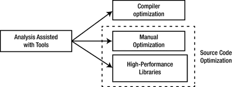

图 11-1。

Recommended user optimization

如图 11-1 所示，手动优化、编译器优化、高性能库函数捆绑在一起，是优化的最后步骤；您可以选择其中之一来实现优化。手动优化和使用高性能库都涉及修改源代码。在开始这些优化之前，使用优化工具分析程序是至关重要且有益的一步。

## 英特尔图形性能分析器(英特尔 GPA)

英特尔 GPA 是英特尔几年前推出的一套用于分析和优化的图形工具。它已经发展成为分析处理器运行状态、系统功率和其他功能的综合工具。

### 英特尔 GPA 简介

英特尔 GPA 仅适用于支持基于英特尔酷睿和英特尔凌动处理器的硬件平台的英特尔处理器。它为 CPU/GPU 速度分析和定制功能提供了一个 GUI。它使您能够在基于英特尔芯片组平台的设备上找到性能瓶颈并优化应用。英特尔 GPA 由系统分析器、帧分析器和软件开发套件(SDK)组成。

英特尔 GPA 系统分析器 2014 R2 版支持基于英特尔凌动处理器的 Android 平台。它提供的功能包括:

*   实时显示几十个关键指标，包括 CPU、GPU 和 OpenGL ES API
*   许多图形管线测试，以隔离图形瓶颈
*   可以使用微软视窗、苹果 OS X 或 Ubuntu 操作系统的主机开发系统

Intel GPA 目前只支持真实的 Android 设备，不支持仿真器的分析。它使用典型的硬件部署模型，也称为，其中主机系统(Windows 和 Ubuntu)和目标设备(基于 Android Intel 的设备)通过 USB 连接，以监控 Android 应用。英特尔 GPA 使用 Android 调试桥(adb)来监控目标设备上的应用:adb 服务器运行在 Android 设备上，英特尔 GPA 作为 adb 客户端应用运行在主机系统上。该结构如图 11-2 所示。

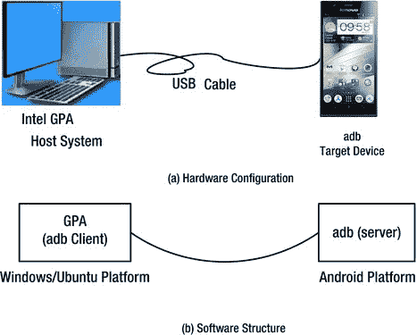

图 11-2。

Intel GPA configuration for monitoring applications on an Android device

鉴于英特尔 GPA 要求 adb 工作，您应该谨慎。Eclipse 和 Dalvik 调试监控服务器(DDMS)也使用 adb，因此如果 GPA、DDMS 和 Eclipse 同时运行，由于 adb 冲突，英特尔 GPA 可能无法正常工作。使用英特尔 GPA 时，最好关闭其他 Android 软件开发工具，如 Eclipse 和 DDMS。

图 11-3 显示了英特尔 GPA 图形界面监控 Android 设备上运行的应用。

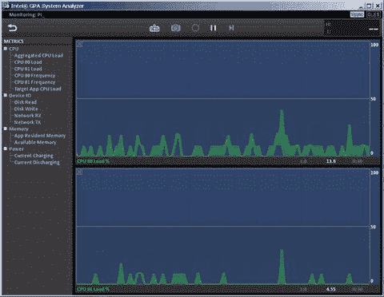

图 11-3。

The Intel GPA graphic interface monitoring an app running on an Android device

如您所见，英特尔 GPA 有两个主窗口和一个工具栏窗格。左窗格中的树状结构显示了被监控的指示器:

*   在 CPU 下是聚合 CPU 负载、CPU XX 负载、CPU XX 频率和目标应用 CPU 负载。CPU XX 数量由英特尔 GPA 监控的 CPU 数量决定。要获得 CPU 信息，如内核数量、型号和频率，可以在终端窗口中使用`cat /proc/cpuinfo`命令。图 11-3 是一款联想 K800 智能手机的截图，该手机采用了单核英特尔凌动 Z2460 处理器；它显示了两个逻辑处理器，因为处理器支持英特尔超线程技术(HTT)。因此，CPU 负载和 CPU 频率中显示了两个项目，索引为 00 和 01。在 CPU XX Load 中，XX 是 CPU 编号:它显示 CPU XX 的负载状态，而 CPU XX Frequency 显示 CPU XX 的频率状态。聚合 CPU 负载是 CPU 的总负载。目标应用 CPU 负载是目标设备上应用的 CPU 负载。
*   设备 IO 下面是磁盘读取、磁盘写入、网络接收和网络发送。这些指标分别列出了磁盘读取、磁盘写入、发送的网络数据包和通过网络接收的网络数据包的状态和信息。
*   内存下面是应用驻留内存和可用内存。
*   下电是电流充放电，提供充放电状态。

默认情况下，右窗格中有两个实时状态显示窗口。这些实时窗口显示指定指示器的类似示波器的状态。横轴是经过的时间，纵轴是相应指示器的值。您可以将索引条目从左窗格拖放到两个窗口之一，以显示该条目的实时指示器。在图 11-3 中，CPU 00 负载已经被拖拽到顶部显示窗口，CPU 01 负载显示在底部显示窗口；纵轴显示 CPU 利用率。最大值是 100%。实时状态显示窗口上方是截屏、暂停显示等工具。您可以使用这些工具调试应用。

### 安装英特尔 GPA

GPA for Windows 在 Beacon Mountain 安装(Mac OS X 和 Ubuntu OS 主机系统)或英特尔 INDE 安装(Windows 主机系统)期间安装。对于 Ubuntu 主机，到 Intel 网站( [`http://intel.com/software/gpa`](http://intel.com/software/gpa) 或 [`http://software.intel.com/en-us/vcsource/tools/intel-gpa`](http://software.intel.com/en-us/vcsource/tools/intel-gpa) )下载 Intel GPA(本书使用`gpa_12.5_release_187105_windows.exe`版本进行测试)，如图 11-4 。

图 11-4。

Intel GPA software download site

### 在 Android 上使用英特尔 GPA

以下示例展示了如何使用英特尔 GPA 监控 Android 设备上的应用。在这种情况下，目标机器是运行在英特尔凌动处理器上的联想 K800 智能手机。

必须满足特殊要求，英特尔 GPA 才能监控和控制 Android 设备上的应用。只有满足这些设定的条件，英特尔 GPA 才能监控应用。您必须遵循这两个步骤:设置 Eclipse 应用参数并生成和部署应用，然后使用 Intel GPA 来监控应用。

这里用作示例的应用的名称是。操作界面如图 11-5(a) 所示。

该应用是一个简单的游戏。用户界面非常基本:只是一个圆形。当用户触摸圆圈内的任何一点并四处拖动时，黑色圆圈会跟随触摸点移动。当用户停止触摸圆圈中的点时，圆圈是静止的。当用户拖动到圆圈外(即圆圈内的初始触摸点)时，圆圈不会移动。如果用户按下手机的后退键，就会弹出退出对话框。点击退出，退出应用，如图 11-5(b) 所示。

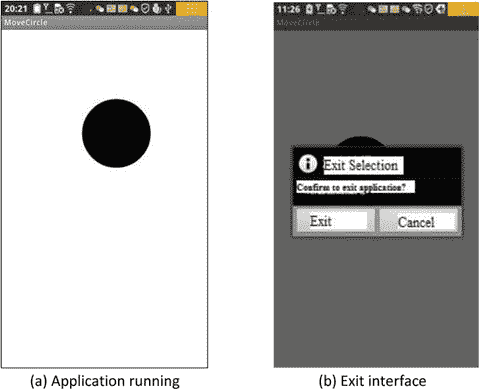

图 11-5。

The `MoveCircle` application

从应用界面描述来看，应用的主要计算任务集中在拖动圆，不断计算圆的新位置，刷新(重绘)显示。该应用的代码框架应用与第十章第 33 页的“对话框示例”部分相似，因此在此省略源代码。

按照以下步骤使用英特尔 GPA 监控示例应用:

1.  在 Eclipse 中构建和部署应用。
2.  使用常规过程创建应用项目。命名应用`MoveCircle`:
    1.  为项目编写相关代码。文档框架如图 11-6 所示。 

1.  编辑`AndroidManifest.xml`文件，并添加以下代码:

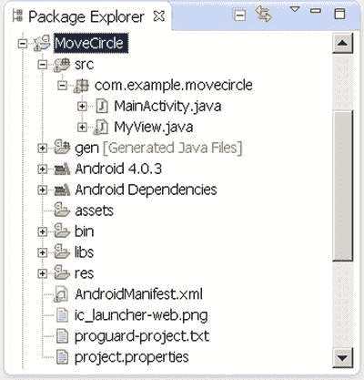

图 11-6。

Document framework for the `MoveCircle` application

`1\. <manifest xmlns:android="`[`http://schemas.android.com/apk/res/android`](http://schemas.android.com/apk/res/android)

`2.     package="com.example.movecircle"`

`3.     android:versionCode="1"`

`4.     android:versionName="1.0" >`

`5.`

`6.     <uses-sdk`

`7.         android:minSdkVersion="8"`

`8.         android:targetSdkVersion="15" />``9.     <uses-permission android:name="android.permission.INTERNET"/>`

`11.     <application`

`12.         android:icon="@drawable/ic_launcher"`

`13.         android:debuggable="true"`

`14.         android:label="@string/app_name"`

`15.         android:theme="@style/AppTheme" >`

`16.         <activity`

`17.             android:name=".MainActivity"`

`18.             android:label="@string/title_activity_main" >`

`19.             <intent-filter>`

`20.                 <action`

`21.                 android:name="android.intent.action.MAIN" />`

`22.                 <category android:name="android.intent.category.LAUNCHER" />` `23.             </intent-filter>`

`24.         </activity>`

`25.     </application>`

`26.`

`27\. </manifest>`

在第 9 行，您添加了一个`uses-permission`元素，并授予应用 Internet 写/读权限。第 13 行指定应用是可调试的。

1.  生成应用包，并将应用部署到真正的目标设备上。
2.  在主机上启动英特尔 GPA 来监控应用。
3.  将 Android 手机连接到 PC。确保屏幕未被锁定，否则您可能会收到错误消息“电话连接不成功”:
4.  确保关闭所有使用 adb 的工具，比如 Eclipse 和 DDMS。否则，您可能会得到错误“电话连接不成功。”
5.  (这一步是可选的。)确保 adb 已启动并正在运行:

`C:\Documents and Settings>adb devices`

`List of devices attached`

`Medfield04749AFB        device`

1.  在 Windows 中，选择开始➤计划➤英特尔图形性能分析器 2012 RS ➤英特尔 GPA 系统分析器以启动英特尔 GPA。
2.  弹出 Intel GPA 初始窗口，提示要监控的机器，如图 11-7 所示。因为在这种情况下调优目标是一部电话，所以您可以通过单击 Connect 按钮来选择该电话(在这种情况下是 Medfield04749AFB)。

1.  连接后，英特尔 GPA 会对安装在受监控智能手机上的应用进行初步分析，将应用分为两组:可分析应用和不可分析应用，如图 11-8 所示。

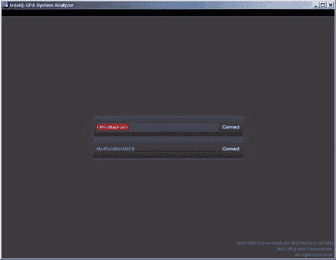

图 11-7。

Intel GPA interface for connecting to a monitored device

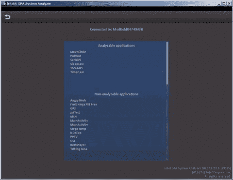

图 11-8。

Initial interface (apps list) after Intel GPA is connected to the monitored phone

在可分析应用列表中是示例应用。如果英特尔 GPA 无法分析应用，通常是因为应用的参数没有设置，如本节前面所述，或者是因为设备不是根设备。作为一个很好的练习，你可以跳过修改`AndroidManifest.xml`的步骤 2b；这将导致应用从可分析应用列表中消失，并出现在不可分析应用列表中。

1.  在可分析应用列表中，单击您希望英特尔 GPA 监控的应用的名称(在本例中为`MoveCircle`)。应用旁边会出现一个滚动圆圈，显示正在进行的进度。见图 11-9 。

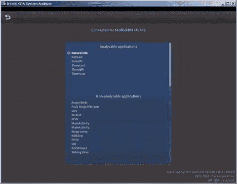

图 11-9。

App initialization interface in Intel GPA

同时，应用启动屏幕显示在手机上。屏幕提示等待调试器的信息，如图 11-10 所示。注意不要点击强制关闭按钮:等到消息框在界面中自动关闭。

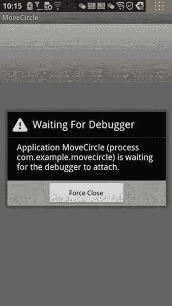

图 11-10。

Initial screen on the target phone when Intel GPA starts the application to be monitored

1.  出现英特尔 GPA 监控界面，如图 11-11 所示。

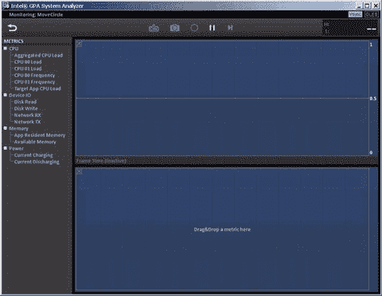

图 11-11。

Initial Intel GPA Monitoring interface when the application is started

同时，`MoveCircle` app 开始在手机上运行，如图 11-12 所示。

1.  将 CPU 00 负载拖放到显示窗口顶部的实时状态显示面板，将 CPU 01 负载拖放到底部的实时状态显示面板。开始与`MoveCircle`交互:用手指点击拖动圆圈几秒钟，然后停止交互几秒钟。相应的英特尔 GPA 监视器屏幕如图 11-13 所示。

图 11-12。

The `MoveCircle` app running on the target phone

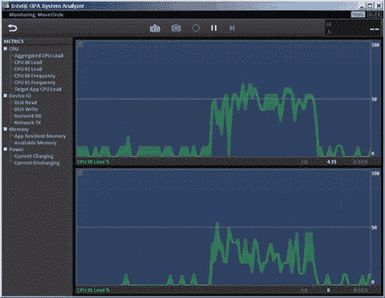

图 11-13。

Intel GPA monitoring the `MoveCircle` app and displaying CPU loads in real time

在图 11-13 中可以看到一个规律:当你拖动圆圈时，两个 CPU 负载都上升到一定高度；当您不与应用交互时，两个 CPU 的负载会立即下降到接近 0%。应用的主要计算任务集中在圆圈拖动和移动中，当圆圈不移动时，没有或很少计算(低或没有 CPU 负载)。

1.  要结束英特尔 GPA 分析，请退出应用，如图 11-5(b) 所示。英特尔 GPA 返回到如图 11-9 所示的启动界面。

这个示例只演示了如何监控 CPU 上的负载。当你分析一个正在做 OpenGL 渲染的应用时，英特尔 GPA 更有用；这里的截图没有显示所有的 GPU 和 OpenGL 指标。如果您感兴趣，可以尝试其他示例并监控其他指标。例如，对于`MoveCircle`，我们为顶部显示窗口选择了磁盘读取指标，为底部选择了磁盘写入指标。在切换应用以查看一些照片文件并返回到`MoveCircle`后，该动作立即变得明显(见图 11-14 )。

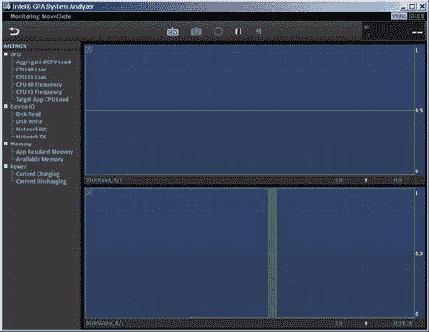

图 11-14。

Intel GPA monitoring Disk Read and Disk Write for `MoveCircle` and other apps

## Android 多线程设计

英特尔凌动处理器支持超线程和多核配置。多线程设计是增加并行度和提高性能的好方法。英特尔凌动 N 系列处理器支持多线程的并行执行。大多数英特尔凌动处理器都是带超线程技术的双核处理器，最新的 Bay Trail 处理器具有双核或四核处理器，并在物理上支持一定程度的并行执行。

请注意，这里使用的词是平行的，而不是并发的。对于某些任务，您可以遵循经典的分而治之方法，将它们分成两个或更多的基本单元。您将这些单元分配给不同的线程同时执行。通过这种方式，处理器的性能潜力得到了充分利用，您加快了软件的执行速度。因此，软件运行速度更快，效率更高。

基于 Java 多线程编程接口，Android 提供了更强大的多线程编程接口。借助这个编程接口，您可以轻松地在 Java 语言级别实现多线程开发和设计，而无需使用繁琐的底层 OS 调用接口。

### 一个线程的 Android 框架

Android 线程编程框架是基于 Java 的。Java 中多线程编程有两种方法:从`Thread`类继承和覆盖`run`方法；并使用`Runnable`接口和`run`方法。

#### Java 线程编程接口

第一个方法的通用代码框架继承自`Thread`类，如下所示:

1.  定义`Thread`类(在本例中为`MyThread`)及其代码:

`class MyThread extends Thread  // Thread inheritance, custom thread`

`{`

`public MyThread()          // Define a constructor`

`{`

`super();               // Call the parent class builder to create objects`

`}`

`@Override`

`public void run()          // To write run code in the run method of the thread body`

`{`

`......                 // The real Run Code of the thread.`

`}`

`}`

1.  开始线程代码:

`MyThread myThread = new MyThread();    // create a new thread`

`myThread.start();                      // start a thread`

1.  等待正在运行的线程结束:

`try {`

`myThread.join();                  // Wait for thread process                                          to end`

`} catch (InterruptedException e) {`

`}`

第二种方法使用`Runnable`接口实现。下面是一般的代码框架:

1.  编写一个自定义的`Runnable`接口实现类:

`class MyRunnableThread implements Runnable  // implement runnable interface`

`{`

`public void run()`

`{`

`......        // actual implementation codes of the thread`

`}`

`}`

1.  开始一个线程:

`MyRunnableThread target = new MyRunnableThread();     // create custom runnable interface implementation object//`

`Thread myThread = new Thread(target); // create a Thread class object`

`myThread.start();                    // Start Thread`

这两种方法效果相同，只是用在不同的场合。如果你熟悉 Java，就知道 Java 在 C++ 中没有多重继承；而是实现接口。要单独实现一个线程，可以使用第一种方法，线程继承。

但是有些类是从另一个类继承的。在这种情况下，如果你想让线程运行，你必须使用第二种方法(`Runnable`接口)。在这种情况下，您可以声明该类实现了`Runnable`接口，然后将作为线程运行的代码放到`run`函数中。这样，它不会影响其先前的继承层次，并且还可以作为线程运行。

关于 Java 的线程框架，请注意以下几点:

*   在 Java 运行时中，系统实现了一个线程调度器，它决定线程在 CPU 上运行的时间。
*   在 Java 技术中，线程通常是抢占式的，不需要时间片分配过程(给每个线程分配相等的 CPU 时间)。在抢占式调度模型中，所有线程都处于准备运行状态(等待状态)，但只有一个线程在运行。线程继续运行，直到它终止或返回到可运行(等待)状态，或者另一个更高优先级的线程变为可运行。在后一种情况下，低优先级线程终止，将运行权交给高优先级线程。
*   Java 线程调度器支持优先级不同的线程的抢占式方法，但不支持优先级相同的线程的时间片轮换。
*   如果运行 Java 运行时的操作系统支持时间片的轮换，那么 Java 线程调度器支持具有相同优先级的线程的时间片轮换。
*   不要过度依赖系统的线程调度程序。例如，低优先级线程也必须获得运行的机会。

关于 Java 多线程编程方法的更多详细信息，可以参考相关的 Java 编程书籍，包括 Learn Java for Android([`www.apress.com/9781430264545`](http://www.apress.com/9781430264545))、Pro Android Apps 性能优化( [`www.apress.com/9781430239994`](http://www.apress.com/9781430239994) )、Android Recipes ( [`www.apress.com/9781430246145`](http://www.apress.com/9781430246145) )。

#### Android 线程编程扩展和支持

Android 运行时，系统(DVM)支持并发多 CPU。也就是说，如果机器有不止一个逻辑处理器，DVM 会遵循一定的策略来自动分配不同的线程在不同的 CPU 上运行。这样，Android 可以在物理上并行运行不同的线程。除了 Java 提供的线程编程接口，Android 还提供了重要的扩展和支持。首先是。

Android 的界面，包括各种各样的活动，运行在应用的主线程中(也称为 UI 线程、接口线程或默认线程)。默认情况下，应用只有一个线程，即主线程。因此，应用被认为是单线程的。一些耗时的任务(计算)，如果默认在主线程上运行，会导致主界面长时间没有响应。为了防止这种情况，应该将那些耗时的任务分配给独立的线程来执行。

后台运行的独立线程(也称为辅助线程或后台线程)经常需要与主线程的接口进行通信，比如更新显示。如果后台线程调用一个接口对象的函数来更新接口，Android 给出执行错误消息`CalledFromWrongThreadException`。

例如，在一个应用中(这里是`GuiExam`)，如果一个工作线程直接调用界面中`TextView`对象的`setText`函数来更新显示，系统会立即遇到错误并终止正在运行的应用，如图 11-15 所示。

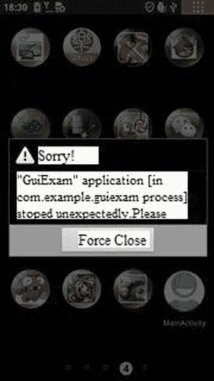

图 11-15。

Running error when a worker thread directly calls a function of the UI object

为了让工作线程和主线程接口进行通信，您需要了解 looper-message 机制。Android 有一个消息队列，可以结合线程、处理处理器和 looper 组件来交换信息。

##### 消息

是线程之间交换的信息。当幕后的线程需要更新接口时，它会向 UI 线程(主线程)发送包含数据的消息。

##### 处理者

是消息的主处理器，负责发送消息以及执行和处理消息内容。后台线程使用传入的处理对象，调用`sendMessage(Message)`函数来发送消息。要使用 handler，需要一个方法实现类`handleMessage(Message)`，负责处理消息操作内容(比如更新接口)。`handleMessage`方法通常需要子类化。

该处理程序不用于打开新线程。它更像是主线程的秘书，负责管理来自子线程的更新数据，然后更新主线程中的接口。幕后线程处理`sendMessage()`方法发送消息，处理程序回调(自动调用)在`HandlerMessage`方法中的处理来处理消息。

##### 消息队列

用于根据先入先出的执行规则存储处理程序发送的消息。对于每个消息队列，都有相应的处理程序。处理程序使用两种方法向消息队列发送消息:`SendMessage`和`post`。这两种方法发送的消息执行方式略有不同 a:`SendMessage`发送的消息是一个消息队列对象，由处理程序的`HandlerMessage`函数处理；通过`post`方法发送的消息是一个可运行的对象，并且是自动实现的。

Android 没有全局消息队列。它自动为主线程(UI 线程之一)建立消息队列，但在子线程中不建立消息队列；所以必须调用`Looper.getMainLooper()`来获取主线程的 looper。主线程循环不到`NULL`；而是调用`Looper.myLooper()`来获取当前线程循环的活套

##### 尺蠖

循环是每个线程的消息队列的管家。它是处理程序和消息队列之间的桥梁。程序组件首先通过处理程序将消息传递给循环程序，然后循环程序将消息放入队列。

对于应用默认 UI 的主线程，系统建立消息队列和 looper:不需要在源代码中写消息队列和 looper 操作代码，两者对默认主线程都是透明的。然而，该处理程序对于默认的主线程是不透明的。为了向主线程发送消息并处理该消息，您必须建立自己的处理程序对象。

除了使用 looper-message 机制来实现工作线程和主 GUI 线程之间的通信之外，还可以使用一种称为异步任务(AsyncTask)机制的技术来实现这些线程之间的通信。AsyncTask 框架的一般用法如下:

1.  异步任务。
2.  实现由以下一种或几种方法定义的 AsyncTask:
    *   `onPreExecute()`:开始执行任务前的准备工作`doInBackground(Params...)`:开始后台执行。您可以调用`publishProgress`函数来更新实时任务进度。
    *   `onProgressUpdate(Progress...)`:调用`publishProgress`函数后，UI 线程调用该函数显示任务界面的进度——比如显示进度条。
    *   `onPostExecute(Result)`:操作完成后，将结果发送给 UI 线程。 

这些函数都不能手动调用。除了`doInBackground(Params...)`函数，其余三个都是 UI 线程调用的，所以要求是:

1.  必须在 UI 线程中创建`AsyncTask`实例；
2.  必须在 UI 线程中调用`AsyncTask.execute`函数。

请记住，该任务只能执行一次。多次通话不正常。您可以在 Android 帮助文档中找到详细的 AsyncTask 示例。

#### 线程示例

本节使用一个例子来说明 Android 线程编程。运行中的`GuiExam`应用如图 11-16 所示。

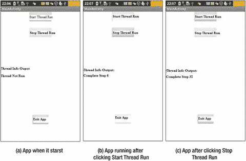

图 11-16。

Demo UI of a multithreaded code framework

如图 11-16 所示，演示 app 有三个主要的活动按钮:开始线程运行、停止线程运行、退出 App。前两个控制辅助线程的操作。点击开始线程运行按钮，线程开始运行，如图 11-16(b) 所示。点击停止线程运行结束线程运行，如图 11-16(c) 所示。工作线程每半段刷新一次`TextView`中的文本显示，显示完整的步骤。x 从 0 到 x 递增。单击退出应用关闭活动并退出应用。

演示应用和忍耐力的结构如下:

1.  为`activity_main`类编辑`MainActivity.java`，如下所示:

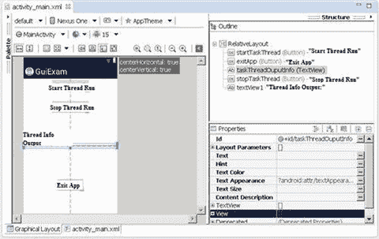

图 11-17。

Multithreaded code framework in `activity_main.xml`

1.  编辑主活动文件(`activity_main.xml`)，删除`originalTextView`窗口组件，然后添加三个按钮和两个`TextView`窗口组件。按钮的`ID`属性分别为`@+id/startTaskThread`、`@+id/stopTaskThread`和`@+id/exitApp`。`Text`属性分别是开始线程运行、停止线程运行、退出 App。`TextView`的 ID 属性是`@+id/taskThreadOuputInfo`，用于显示工作线程的文本输出。整个过程如图 11-17 所示。

`1.  package com.example.guiexam;`

`2.  import android.os.Bundle;`

`3.  import android.app.Activity;`

`4.  import android.view.Menu;`

`5.  import android.widget.Button;`

`6.  import android.view.View;`

`7.  import android.view.View.OnClickListener;`

`8.  import android.os.Process;`

`9.  import android.widget.TextView;`

`10\. import android.os.Handler;`

`11\. import android.os.Message;`

`12\. public class MainActivity extends Activity {`

`13.     private Button btn_StartTaskThread;`

`14.     private Button btn_StopTaskThread;`

`15.     private Button btn_ExitApp;`

`16.     private TextView threadOutputInfo;`

`17.     private MyTaskThread myThread = null;`

`18.     private Handler mHandler;;`

`19.     @Override`

`20.     public void onCreate(Bundle savedInstanceState) {`

`21.         super.onCreate(savedInstanceState);`

`22.         setContentView(R.layout.activity_main);`

`23.         threadOutputInfo = (TextView)findViewById(R.id.taskThreadOuputInfo);`

`24.         threadOutputInfo.setText("Thread Not Run");`

`25.         mHandler = new Handler() {`

`26.             public void handleMessage(Message msg) {`

`27.                switch (msg.what)`

`28.                 {`

`29.                 case MyTaskThread.MSG_REFRESHINFO:`

`30.                     threadOutputInfo.setText((String)(msg.obj));`

`31.                     break;`

`32.                 default:`

`33.                     break;`

`34.                 }`

`35.             }`

`36.         };`

`37.         btn_ExitApp = (Button) findViewById(R.id.exitApp); // Code for <Exit App>Button`

`38.         btn_ExitApp.setOnClickListener(new /*View.*/OnClickListener(){`

`39.             public void onClick(View v) {`

`40.                 finish();`

`41.                 Process.killProcess(Process.myPid());`

`42.             }`

`43.         });`

`44.         btn_StartTaskThread = (Button) findViewById(R.id.startTaskThread);`

`45.         // Code for<Start Thread Run>`

`46.         btn_StartTaskThread.setOnClickListener(new /*View.*/OnClickListener(){`

`47.             public void onClick(View v) {`

`48.                 myThread = new MyTaskThread(mHandler);  // Create a thread`

`49.                 myThread.start();    // Start Thread`

`50.                 setButtonAvailable();`

`51.              }`

`52.         });`

`53.         btn_StopTaskThread = (Button) findViewById(R.id.stopTaskThread);`

`54.         //code for <Stop Thread Run>`

`55.         btn_StopTaskThread.setOnClickListener(new /*View.*/OnClickListener(){`

`56.   public void onClick(View v) {`

`57.      if (myThread!=null``&&`

`58.                     myThread.stopRun();`

`59.                 try {`

`60.                     if (myThread!=null){`

`61.                         myThread.join();`

`62.                         // Wait for Thread Run to end`

`63.                         myThread =null;`

`64.                     }`

`65.                 } catch (InterruptedException e) {`

`66.                     // Empty statement block, ignored forcibly abort exception`

`67.                 }`

`68.                 setButtonAvailable();`

`69.              }`

`70.         });`

`71.         setButtonAvailable();`

`72.     }`

`73.     @Override`

`74.     public boolean onCreateOptionsMenu(Menu menu) {`

`75.         getMenuInflater().inflate(R.menu.activity_main, menu);`

`76.         return true;`

`77.     }`

`78.     private void setButtonAvailable()    // New function is used to set the button optional`

`79.     {`

`80.         btn_StartTaskThread.setEnabled(myThread==null);`

`81.         btn_ExitApp.setEnabled(myThread==null);`

`82.         btn_StopTaskThread.setEnabled(myThread!=null);`

`83.     }`

`84\. }`

第 17 行和第 18 行分别定义了已定义线程类的变量`MyTaskThread`，以及默认的主线程处理程序对象`mHandler`。第 25–36 行定义了该类。消息类的`What`属性字段表示消息的类型。自定义处理程序类根据消息类型对不同的处理程序使用`switch` - `case`语句；`MSG_REFRESHINFO`是自定义线程类`MyTaskThread`的消息类型，表示工作线程需要更新界面显示消息。第 29–31 行处理消息。代码非常简单；它根据参数对象中的消息更新`TextView`小部件显示。

第 47–49 行是单击 Start Thread Run 按钮时的响应代码。它首先创建自定义的线程对象，然后调用`Thread.start`函数使自定义的线程类`MyTaskThread`运行，该类将`run`函数中的执行代码作为单线程运行。最后，第 49 行调用自定义函数来设置每个按钮的选项(灰色不可选，或者白色可选)。

第 55–65 行是“停止线程运行”按钮的响应代码。第 55 行首先确定线程是否已经存在或者正在运行。然后，它通过调用自定义线程类`MyTaskThread`中定义的原型函数，然后调用`Thread.join()`来停止第 56 行中的线程运行；然后，它等待线程运行结束。最后，它设置界面按钮的可选状态。

第 75–80 行是一个自定义函数，用于确定每个按钮的可选状态:白色可选或灰色可选。

1.  在应用中创建一个新的类`MyTaskThread`。这个类继承自`Thread`，用于实现工作线程。这个类的源代码文件`MyTaskThread.java`如下:

`1\. package com.example.guiexam;`

`2\. import android.os.Handler;`

`3\. import android.os.Message;`

`4.`

`5\. public class MyTaskThread` `extends Thread {`

`6.     private static final int stepTime = 500;`

`7\. // Execution timeof each step(unite:ms)`

`8.     private volatile boolean isEnded;`

`9\. // mark if the thread is running. Used to stop thread run`

`10.      private Handler mainHandler;`

`11\. // Handler used to send message`

`12.     public static final int MSG_REFRESHINFO = 1;  // Update message on interface`

`13.`

`14.     public MyTaskThread(Handler mh)   // Define a constructor`

`15.     {`

`16.         super();   // Call the parent class builder to create objects`

`17.         isEnded = false;`

`18.         mainHandler = mh;`

`19.     }`

`20.`

`21.     @Override`

`22.     public void run()  // Write run code in thread body run method`

`23.     {`

`24.         Message msg ;`

`25.         for (int i = 0; !isEnded; i++)`

`26.         {`

`27.             try {`

`28.                 Thread.sleep(stepTime);  // designate time for every  step of the thread to sleep`

`29.                 String s = "Complete" + i +"step";`

`30.                 msg = new Message();`

`31.                 msg.what = MSG_REFRESHINFO;  // Define message type`

`32.                 msg.obj = s;   // attach data to message`

`33.                 mainHandler.sendMessage(msg);  // send message`

`34.             } catch (InterruptedException e) {`

`35.                 e.printStackTrace();`

`36.             }`

`37.         }`

`38.     }`

`39.`

`40.     public void stopRun()  // Stop control function for stop thread run`

`41.     {`

`42.         isEnded = true;`

`43.     }`

`42\. }`

这个文档是自定义线程类的实现代码，它是这个应用的关键。应用使用第一种方法，线程继承，来实现线程化。第 5 行，自定义类继承自`Thread`；然后，从第 14–39 行开始，线程在重写的`run`函数上运行代码。为了处理线程的工作，第 6–9 行定义了相关的变量。常量`stepTime`代表线程延迟时间的每一步的长度，以毫秒为单位。`isEnded`控制是否继续`run`功能中循环体的每一步。注意，变量前面有一个`volatile`修饰符:每次线程访问变量时，都会在变量被修改后读取内存中的最终值。写请求也必须写入内存。这避免了缓存或寄存器中的副本与内存变量中的值不匹配，否则会导致错误。`mainHandler`变量保存主线程处理程序。`MSG_REFRESHINFO`是处理自定义消息的常量。

第 10–15 行是一个构造函数。在这个函数体中，初始化线程运行控制变量`isEnded`的值，然后将`mainHandler`保存为作为参数传递的主线程处理程序对象。

第 16–33 行是重写`run`函数的核心线程代码。代码由一个循环组成，决定是否继续使用控制变量`isEnded`。这里一个循环是一个步骤。每一步也很简单:在指定的时间后，当第 28 行调用`Thread`类静态函数`sleep`时，会生成一条消息，并在第 24–27 行组装。最后，在第 28 行，消息被发送到指定的(消息循环)处理程序。

第 34–37 行是一个定制的控制函数，用来停止线程的运行。代码的目的非常简单:改变运行循环控制变量的值。

### 线程同步

多线程进程不可避免地涉及一个问题:如何处理线程对共享数据的访问，这涉及到线程同步。线程数据共享也称为临界区。对共享数据的访问也被称为对资源访问的竞争。在一般的操作系统教科书中，线程同步不仅包括这种被动选择访问共享数据的同步，还包括线程间主动选择协作完成任务的同步。在 Java 中，线程同步关注的是对共享数据的访问。本节讨论与共享数据访问相关的同步问题。

在多线程编程中，如果对共享数据的访问不使用某些同步机制，就无法保证数据的一致性和完整性。有两种方法可以执行 Java 线程同步:内部锁数据对象和同步。这两种方法都是用关键字`synchronized`实现的。由`synchronized`块修改的语句可以保证线程间操作的排他性:它们是唯一的，或者说是原子的。在 Java 中，这个过程简称为同步。同步块也称为。

在锁定数据对象的第一种方法中，在任何时候，只有一个线程可以访问被锁定的对象。代码框架如下:

`Object var;    // Object variable`

`synchronized` `(var) {`

`... ...    // Operation of the shared variable`

`}`

在这段代码中，`var`必须是每个线程都可以访问的变量，所以就成了同步变量。实际上，同步变量和共享变量可以相同，也可以不同。前面代码中的`Object`类可以替换为`Object`的子类，因为除了 Java 中的简单类，任何类都可以是`Object`的后代类。

注意，同步变量不能是简单类型(如`int`和`float`，但不能是`String`类):

`int var;`

`synchronized(var) {``// compiler error`:??

`... ...`

`}`

当您使用第二种方法(同步方法)时，任何时候都只有一个线程访问一个代码段:

`class MyClass {`

`public``synchronized`

`{ ... }`

`}`

前面的代码是通用类(函数)的同步。此外，该类的静态函数也有同步:

`class MyClass {`

`public``synchronized static`

`{ ... }`

`}`

使用同步方法，调用同步方法的对象被锁定。当`MyClass: obj1`的一个对象在不同的线程中实现同步方法时，互斥实现同步结果。但是由类`MyClass`生成的另一个对象`obj2`，可以用关键字`synchronized`调用这个方法。因此，前面的代码可以等价地写成如下所示:

*   同步(常规)方法:

`class MyClass {`

`public void method1()`

`{`

`synchronized (this)`

`{ .../* function body */ }`

`}`

`}`

*   静态同步方法:

`class MyClass {`

`public static void method2()`

`{`

`synchronized (MyClass.class)`

`{ .../* function body */ }`

`}`

`}`

在静态方法中，类文字被视为锁。它生成与`synchronized`静态函数相同的结果。获取锁的时机也很特殊:锁是在调用该对象所属的类时获取的，而不再是该类生成的特定对象。

以下是 Java 通过`synchronized`函数实现锁的通用规则:

*   规则 1:当两个并行线程访问同一个对象的`synchronized(this)`同步代码段时，任何时候只能运行一个线程。其他线程必须等到当前线程运行完该代码段后才能运行同一代码段。
*   规则二:当一个线程访问一个对象的`synchronized(this)`同步代码段时，另一个线程仍然可以访问一个对象的非`synchronized(this)`同步代码段。
*   规则 3:当一个线程访问一个对象的`synchronized(this)`同步代码段时，所有其他线程对该对象的所有其他`synchronized(this)`同步代码段的访问都被阻塞。
*   规则 4:当一个线程访问一个对象的`synchronized(this)`同步代码段时，它获取该对象的对象锁。因此，其他线程对一个对象的所有`synchronized(this)`同步代码段的访问都被暂时锁定。
*   规则 5:这些规则适用于所有其他对象锁。

虽然`synchronized`可以保证对象或执行的语句块的粒度，但是这种粒度的互斥性降低了线程并发性；因此，原本可以并行运行的代码必须串行执行。因此，您在使用`synchronized`功能时需要小心，并将其限制在需要`synchronized`锁的情况下。另一方面，您应该使锁粒度尽可能小，以便既确保程序的正确性，又通过使并发程度尽可能大来提高操作效率。

### 线程通信

在多线程设计中，随着线程之间的数据交换，设置信号协作来完成任务是一个常见的问题。最重要的是一般性的线程问题，比如生产者-消费者问题的典型例子。这些是必须合作完成任务的线程。

在操作系统的经典书籍中，通常建议您使用信号量来实现线程同步原语。Java 不直接提供信号量原语或编程接口，而是用`wait`、`notify`、`notifyAll`等类函数来实现信号量的功能。

`wait`、`notify`和`notifyAll`属于`Object`类的功能，不属于`Thread`类。Java 中每个对象都有一个等待队列(`Wait Set`)。当一个对象刚刚被创建时，它的等待队列是空的。

该函数可以使当前线程中的对象等待，直到另一个线程调用该对象的`notify`或`notifyAll`方法。换句话说，当调用在对象队列中等待时，线程进入等待状态。只有当`notify`方法被调用时，你才能从队列中移除线程，使其成为可运行线程。`notifyAll`方法等待对象内队列中的所有线程成为可运行线程。`Notify`和`notifyAll`功能相似。

`wait`、`notify`、`notifyAll`函数需要和`synchronized`一起使用来建立同步模型，这样可以保证前面函数的粒度。例如，在调用`wait`之前，你需要获得对象的同步锁，这样这个函数才能被调用。否则，编译器可以调用`wait`函数，但会收到一个`IllegalMonitorStateException`运行时异常。

下面是几个关于`wait`、`notify`和`notifyAll`的代码框架的例子:

*   等待资源代码:

`synchronized(obj) {`

`while(!condition)`

`try {`

`obj.wait();`

`} catch (InterruptedException e) {`

`}`

`......Use code of obj`

`}`

*   提供资源(例如:完全使用资源并返回系统):

`synchronized(obj) {`

`condition = true;`

`obj.notify();`

`}`

前面的代码是同步对象`obj`的独立用例。您也可以在类中编写同步代码。这段代码的框架可以写成如下:

`class MyClass{`

`public synchronized void func1 {`

`while (!condition)`

`try {`

`wait();`

`} catch (InterruptedException e) {`

`}`

`...... codes for using MyClass resource`

`}`

`public synchronized void func2 {`

`condition = true;`

`notifyAll();`

`}`

`}`

等待资源的线程可以调用`myclass.func1`函数，提供资源的线程调用`myclass.func2`函数。

### 英特尔凌动处理器的多线程优化原则

多线程软件设计允许不同线程中的程序代码同时运行。然而，盲目使用多线程或过度使用多线程编程可能不会带来性能的提升，甚至可能会降低软件性能。所以你需要了解 Android x86 上多线程优化的原理。

首先，线程的启动或调度需要一定量的开销，并占用一定量的处理器时间。不支持超线程和多核处理的处理器无法在物理上让这些线程同时运行。为了支持多线程程序，如果您使用虚拟化技术将一个物理处理器分成多个逻辑处理器，以便每个线程都可以在一个逻辑内核上运行，则会产生巨大的开销。这种多线程策略不仅难以提高性能，甚至可能导致多线程的执行速度比单线程程序慢。因此，要使用多线程设计实现多线程性能加速(比单线程执行速度更快的先决条件)，处理器必须支持超线程或多核。

其次，对于支持超线程或多核的处理器来说，线程越多软件运行越快并不总是正确的。你必须考虑性价比。性能调优的多线程设计的物理基础是允许多个线程在物理层上同时并行运行。因此，处理器支持的并发运行线程的最大数量是多线程优化的最佳线程数量。

根据英特尔官方的说法，英特尔超线程技术可以支持两个线程并行运行，多核支持多个线程并行运行。例如，对于支持英特尔超线程技术的双核英特尔处理器，支持并行运行的最大线程数为

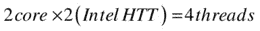

因此，这台机器支持多线程优化，线程(并发运行的线程)的最大数量等于四。

对于使用支持超线程技术的单核英特尔凌动 Z2480 处理器的摩托罗拉 MT788 目标机器，最佳线程数量为两个。如果目标机器是配备英特尔超线程技术的双核英特尔凌动 Z2580 处理器的联想 K900，则最佳线程数为 4。

一般来说，当你在 Android 平台上考虑多线程优化时，有必要仔细查看处理器信息，看看它是否支持超线程或多核技术。

## 案例研究:英特尔 GPA 辅助的 Android 应用多线程优化

上一节解释了几种优化技术和原则。本节使用一个全面的示例来解释优化。在这种情况下，多线程优化与英特尔 GPA 辅助优化相结合，使应用运行更快。

示例应用计算 pi (π)。让我们来看看这个应用的一些背景。数学公式如下:

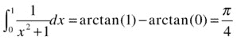

积分公式可以用不定式来表示:

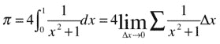

x 不可能无限小——你只能让 x 尽可能小。所以，公式的结果更接近π。用步长表示 x，

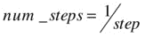

步长的值必须是最大值，以获得 pi 的精确值。考虑一下

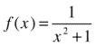

而 f(x)是一个凸函数。这里你取一个中间值来计算总和。也就是说，您使用

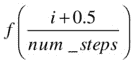

替换

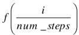

计算总数。该公式计算的结果并不总是小于π的实际值。所以，最终，你得到了这个应用所基于的最终公式:

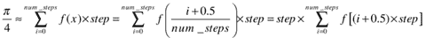

根据这个公式写源代码并不难。

### 原始应用和英特尔 GPA 分析

首先，从上一节中的公式推导出应用的非优化计算源代码。这个应用被命名为`SerialPi`。

这个 app 的设计和前面“线程示例”一节的设计是一样的。计算π的任务放在一个工作线程(这里称为任务线程)中运行。在 main activity 上设置一个按钮来控制线程的运行，用一个`TextView`来显示任务线程的结果。显示 app 单次运行的界面如图 11-18 所示。

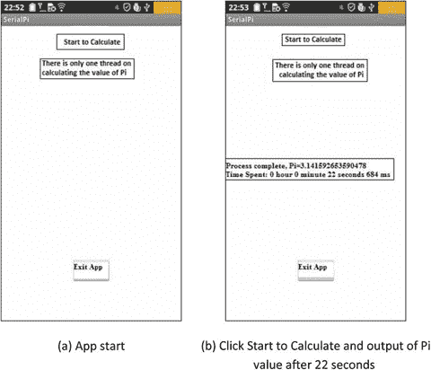

图 11-18。

`SerialPi` app interface

应用启动后的界面如图 11-18(a) 所示。当您单击开始计算按钮时，界面上的所有按钮都会变灰，直到计算完成。然后，界面显示计算结果以及线程的总运行时间。点击退出应用，如图 11-18(b) 所示，退出应用。从界面画面可以看到，这个 app 计算π大概需要 22 秒。重复运行应用，计算时间保持不变(22 秒)。

构建应用和编写关键代码的步骤如下:

1.  创建一个名为。建议的项目属性应使用默认值。设置[Build SDK]支持 x86 API。
2.  编辑`activity_main.xml`。在布局中放置两个`Button`组件和两个`TextView`组件。将一个`TextView`的`ID`属性设置为`@+id/taskOuputInfo`:显示任务线程的结果，如图 11-19 所示。

1.  在项目中创建新的线程类`MyTaskThread`，并编辑源代码文件`MyTaskThread.java`，如下所示:

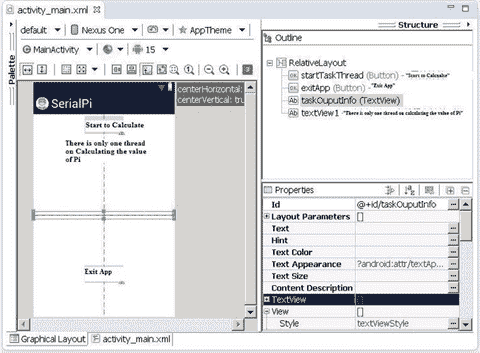

图 11-19。

Layout for the `SerialPi` App

`1\. package com.example.serialpi;`

`2\. import android.os.Handler;`

`3\. import android.os.Message;`

`4\. public class MyTaskThread extends Thread {`

`5.     private Handler mainHandler;`

`6.     public static final int MSG_FINISHED = 1;`

`7\. // Defined the message type  for the end of the calculation`

`8.     private static final long num_steps = 200000000;`

`9\. // num_steps variables in Formula, the total number of steps`

`private static final double step = 1.0 / num_steps;`

`10\. // Step variable  in formula, step length`

`11.     public static double pi = 0.0;`

12.//π的计算结果

`13.`

`14.     static String msTimeToDatetime(long msnum){`

`15\. // The function converts the number of milliseconds into hours: minutes: seconds. Milliseconds "format`

`16.         long hh,mm,ss,ms, tt= msnum;`

`17.         ms = tt % 1000; tt = tt / 1000;`

`18.         ss = tt % 60; tt = tt / 60;`

`19.         mm = tt % 60; tt = tt / 60;`

`20.         hh = tt % 60;`

`21.         String s = "" + hh +"hour "+mm+"minute "+ss + "`第二次`" + ms +"Milliseconds";`

`22.         return s;`

`23.     }`

`24.`

`25.     @Override`

`26.     public void run()`

`27.     {`

`28.         double x, sum = 0.0;`

`long i;`

`for (i=0; i< num_steps; i++){`

`29.             x = (i+0.5)*step;`

`30.             sum = sum + 4.0/(1.0 + x*x);`

`31.         }`

`32.         pi = step * sum;`

`33.         Message msg = new Message();`

`34.         msg.what = MSG_FINISHED;       // Define message Type`

`35.         mainHandler.sendMessage(msg);  // Send Message`

`36.     }`

`37.`

`38.     public MyTaskThread(Handler mh)    // Constructor`

`39.     {`

`40.         super();`

`41.         mainHandler = mh;`

`42.     }`

`43\. }`

与前面 thread 示例中列出的框架和示例代码类似，线程继承法则用于初始化线程。请密切注意粗体显示的代码段，它们与π的计算最直接相关。第 7 行和第 8 行定义了一个静态变量，其名称与计算π的公式中使用的名称相同。第 9 行定义了保存π计算结果的变量。注意，这个变量是公共的，所以主线程可以访问它。

第 22–28 行根据公式计算π。`x`变量是函数的自变量，`sum`是σ的累积变量。第 28 行计算最终结果。请参考第 32 页本章前面部分中提到的代码框架。”线程示例”；应该不难理解。

注意，在线程的`run`函数中，一旦计算完成，消息将在第 29 行被发送到主线程(接口)。

1.  编辑主活动类文件`MainActivity.java`中的源代码。这段代码控制线程的运行并显示计算结果:

`1\. package com.example.serialpi;`

`2\. import android.os.Bundle;`

`3\. import android.app.Activity;`

`4\. import android.view.Menu;`

`5\. import android.widget.Button;`

`6\. import android.view.View;`

`7\. import android.view.View.OnClickListener;`

`8\. import android.os.Process;`

`9\. import android.widget.TextView;`

`10\. import android.os.Handler;`

`11\. import android.os.Message;`

`12\. public class MainActivity extends Activity {`

`13.     private MyTaskThread myThread = null;`

`14.     private TextView tv_TaskOutputInfo;  // Display (Calculated) Task thread output`

`15.     private Handler mHandler;;`

`16.     private long end_time;`

`17.     private long time;`

`18.     private long start_time;`

`19.     @Override`

`20.     public void onCreate(Bundle savedInstanceState) {`

`21.         super.onCreate(savedInstanceState);`

`22.         setContentView(R.layout.activity_main);`

`23.         tv_TaskOutputInfo = (TextView)findViewById(R.id.taskOuputInfo);`

`24.         final Button btn_ExitApp = (Button) findViewById(R.id.exitApp);`

`25.         btn_ExitApp.setOnClickListener(new /*View.*/OnClickListener(){`

`26.             public void onClick(View v) {`

`27.                 exitApp();`

`28.             }`

`29.         });`

`30.         final Button btn_StartTaskThread = (Button) findViewById(R.id.startTaskThread);`

`31.         btn_StartTaskThread.setOnClickListener(new /*View.*/OnClickListener(){`

`32.             public void onClick(View v) {`

`33.                 btn_StartTaskThread.setEnabled(false);`

`34.                 btn_ExitApp.setEnabled(false);`

`35.                  startTask();`

`36.               }`

`37.         });`

`38.         mHandler = new Handler() {`

`39.             public void handleMessage(Message msg) {`

`40.                switch (msg.what)`

`41.                 {`

`42.                 case MyTaskThread.MSG_FINISHED:`

`43.                     end_time = System.currentTimeMillis();`

`44.                     time = end_time - start_time;`

`45.                     String s = " The end of the run`，`Pi="+ MyTaskThread.pi+ "  Time consumed:"`

`46.                             +`

`47\. MyTaskThread.msTimeToDatetime(time);`

`48.                     tv_TaskOutputInfo.setText(s);`

`49.                     btn_ExitApp.setEnabled(true);`

`50.                     break;`

`51.                 default:`

`52.                     break;`

`53.                 }`

`54.             }`

`55.         };`

`}`

`56.`

`57.     @Override`

`58.     public boolean onCreateOptionsMenu(Menu menu) {`

`59.         getMenuInflater().inflate(R.menu.activity_main, menu);`

`60.         return true;`

`}`

`61.`

`62.     private void startTask() {`

`63.         myThread = new MyTaskThread(mHandler);    // Create a thread`

`64.         if (! myThread.isAlive())`

`65.         {`

`66.                start_time = System.currentTimeMillis();`

`67.             myThread.start();  // Start thread`

`68.         }`

`}`

`69.`

`70.     private void exitApp() {`

`71.         try {`

`72.             if (myThread!=null)`

`73.             {`

`74.                 myThread.join();`

`75.                 myThread = null;`

`76.             }`

`77.         } catch (InterruptedException e) {`

`78.         }`

`79.         finish();   // Exit the activity`

`80.         Process.killProcess(Process.myPid());  // Exit the application process`

`81.     }`

`}`

这段代码类似于“线程示例”一节中示例`MainActivity`类的代码框架。添加以灰色背景显示的代码行是为了估计任务的运行时间。第 16–18 行定义了三个变量:`start_time`是任务的开始时间，`end_time`是任务的结束时间，`time`是任务的运行时间。这三个变量是以下公式的一部分:

`time = end_time - start_time`

在第 65 行，当您启动任务线程时，机器的当前时间同时被记录在`start_time`变量中。在第 43–44 行，当收到任务线程已经完成运行的消息时，机器的时间被记录在`end_time`中。`currentTimeMillis`函数是`java.lang`包中 Java `System`类提供的静态函数；它以毫秒为单位返回当前时间。

1.  参考“线程通信”部分的示例，修改项目的`AndroidManifest.xml`文件，使其符合英特尔 GPA 监控的要求。

编码完成后，您已经编译并生成了应用，将其部署到目标设备。

现在，您可以使用英特尔 GPA 来分析该应用。请参见“线程通信”一节中的步骤。首先，您监视和分析两个 CPU 负载(CPU XX 负载指示器)。在监控期间，单击开始按钮开始运行并监控英特尔 GPA 下记录的信息。分析结果如图 11-20 所示。

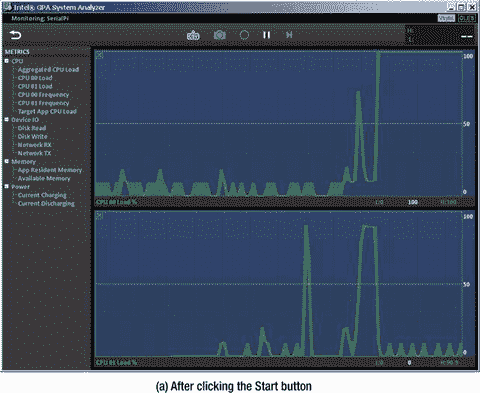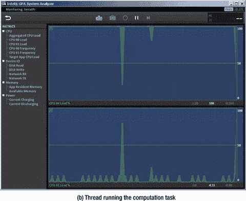

图 11-20。

Intel GPA analysis screen for `SerialPi`

图 11-20(a) 显示点击开始按钮时的分析，图 11-20(b) 显示任务线程运行，图 11-20(c) 显示运行结束时的任务线程。从三个屏幕可以看到，在应用开始运行之前和运行结束之后，CPU 上的负载都保持在较低的水平。一旦计算任务线程开始运行，CPU 上的负载急剧上升到 100%的负载。您还可以看到，当任务线程正在运行时，两个 CPU 中只有一个处于满负荷状态；另一个是在低负载水平。通过分析图表，您可以看到 100%的负载并不总是出现在特定的 CPU 上。相反，100%的负载在两个 CPU 之间交替，这反映了 Java 运行时对任务调度的支持:处理器系统对应用是透明的。尽管两个 CPU 的负载率会发生变化，但负载率是一种互补状态:一个 CPU 上的负载增加意味着另一个 CPU 上的负载减少。因此，总负载(任何时候两个 CPU 的负载之和)不会超过单个 CPU 的 100%负载。

### 优化的应用和英特尔 GPA 分析

前面的示例使用直接从计算π的公式中导出的代码。有优化的空间吗？答案肯定是肯定的。这样做需要您检查应用的算法并应用您所学的优化原则，充分利用英特尔凌动处理器的硬件特性。

您如何挖掘英特尔凌动处理器的全部性能潜力？如前所述，采用英特尔超线程技术的多核英特尔凌动处理器支持在多个物理内核上并行运行多线程。例如，联想 K900 手机使用英特尔凌动 Z2580 处理器，并支持并行运行的两个线程。这是你算法优化的切入点:可以分而治之。通过仔细分析上一节示例`MyTaskThread`类中的`run`函数，可以使分配给多个(在本例中是两个)线程的计算任务运行；而并行运行的线程可以让 app 运行得更快。

为了计算π的积分面积的累积值，在第 24 行中，您一次一步地计算积分面积，并添加累积和。在本节中，您将采用不同的方法:将积分区域划分为许多块，并让每个线程负责计算一个块。通过将线程计算的块的累积面积相加，可以得到π值。这样你就用分而治之的策略来完成任务分配，得到最终的结果。优化后的应用称为。当`ThreadPi`在计算积分面积的累积值(也就是π值)时，每个线程的计算步长会累积步长，以增加线程总数，这样每个线程负责自己的块面积总和。

正在运行的`ThreadPi` app 的界面如图 11-21 所示。

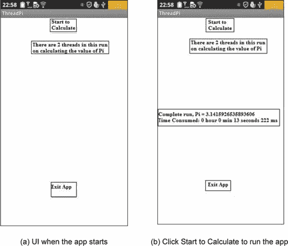

图 11-21。

User interface of `ThreadPi`

这个优化后的应用(`ThreadPi`)的界面和原来的应用(`SerialPi`)是一样的。在图 11-21(b) 中，你可以看到这个应用用了 13 秒来计算π的值。时间减少到原来申请时间的一半(22 秒)。唯一的区别是应用使用两个线程来计算π。

这个应用是基于修改原来的应用代码。主要变化如下。

1.  修改计算任务的`MyTaskThread`源代码文件`MyTaskThread.java`的线程类如下:

`1\. package com.example.threadpi;`

`2\. import android.os.Handler;`

`3\. import android.os.Message;`

`4\. public class MyTaskThread extends Thread {`

`5.     private Handler mainHandler;`

`6.     public static final int MSG_FINISHED = 1;`

`7.     private static final long num_steps = 200000000;`

`8\. // num_steps variable in formula, total steps`

`9.     private static final double step = 1.0 / num_steps;`

`10\. // step variable in formula, step length`

`11.     public static double pi = 0.0;   //  Calculated result of π`

`12.     public static final int num_threads = 2;   // Thread count`

`13.     private int myNum;                         // Thread #`

`private static Object sharedVariable = new Object();`

`14\. // synchronization lock variable for Pi variable`

`15.     private static int finishedThreadNum = 0;`

`16\. // count of threads finishing calculation`

`17.`

`18.     static String msTimeToDatetime(long msnum){`

`19\. // The function to convert the number of milliseconds into hours: minutes: seconds. Millis`

`20.         long hh,mm,ss,ms, tt= msnum;`

`21.         ms = tt % 1000; tt = tt / 1000;`

`22.         ss = tt % 60; tt = tt / 60;`

`mm = tt % 60; tt = tt / 60;`

`23.         hh = tt % 60;`

`24.         String s = "" + hh +"hour "+mm+"minute "+ss + "` second `" + ms +"milliseconds";`

`25.         return s;`

`26.     }`

`27.     public void setStepStartNum(int n)`

`28\. // set thread # for thread, in response to starting position of i`

`29.     {`

`30.         myNum = n;`

`31.     }`

`32.`

`33.     @Override`

`34.     public void run()`

`35.     {`

`36.         double x, partialSum = 0.0;`

`37.         long i;`

`38.         for (i = myNum; i < num_steps; i += num_threads) {`

`39.             x = (i + 0.5) * step;`

`40.             partialSum += 4.0 / (1.0 + x * x);`

`41.         }`

`42.         synchronized (sharedVariable) {`

`43.             pi += partialSum * step;`

`44.             finishedThreadNum++;`

`45.             if (finishedThreadNum >=num_threads) {`

`// waiting all threads finishing run and send message`

`46.             Message msg = new Message();`

`47.             msg.what = MSG_FINISHED; //Define message type`

`48.             mainHandler.sendMessage(msg);   //Send message`

`49.             }`

`50.         }`

`51.     }`

`public MyTaskThread(Handler mh)  // constructor`

`{`

`super();`

`mainHandler = mh;`

`}`

`}`

粗体显示的代码段是`ThreadPi`和`SerialPi`的主要区别。第 10–13 行定义了多线程计算任务所需的变量。变量`num_threads`在计算任务开始时计算线程的数量。在这种情况下，联想 K900 的英特尔凌动处理器有两个逻辑 CPU，因此该值设置为 2。`myNum`变量计算线程数，范围从 0 到`num_threads`–1。变量`sharedVariable`由应用于变量`pi`的同步锁引入。因为`pi`是简单变量，所以不能直接锁定。`finishedThreadNum`变量是用于完成计算的线程数。当`finishedThreadNum`的值等于`num_threads`的值时，所有的计算线程都已经运行完毕。

第 23–26 行是专门为计算线程`MyTaskThread`添加的函数。它标记了线程的索引号。

第 30–44 行是计算线程的原型代码。第 30–35 行是计算π的直接代码。对比原应用中的对应代码，可以看到原 app 中的`sum`变量已经被替换为`partialSum`，这反映了这个线程的面积只是总面积的一部分。最重要的区别在第 32 行:步长变量`i`不是 1 而是`num_threads`，这意味着线程每次向前移动几步。变量`I`的初始位置不是 0，而是从线程号中导出的。这有点像田径比赛，每个运动员(线程)从他们的泳道的起点出发，而不是从同一个起点出发。线程计算就像运动员在自己的跑道上跑自己的道。

每个线程计算其总和，并需要将该数据添加到总累积总和中(变量`pi`)。这个变量由多个线程共享，所以需要添加一个同步锁。此步骤对应于第 36–44 行。第 36 行添加同步锁，第 37 行将线程的计算结果添加到`pi`的公共结果中。第 38 行在计算结束时将线程数加 1。在第 39 行，通过比较已经完成计算的线程数量与线程总数，您可以确定是否所有线程都已经完成运行。只有在所有线程完成后，消息才会发送到主线程。

1.  修改主活动类`MainActivity.java`的源代码文件，如下所示:

`1\. package com.example.threadpi;`

`2\. import android.os.Bundle;`

`3\. import android.app.Activity;`

`4\. import android.view.Menu;`

`5\. import android.widget.Button;`

`6\. import android.view.View;`

`7\. import android.view.View.OnClickListener;`

`8\. import android.os.Process;`

`9\. import android.widget.TextView;`

`10\. import android.os.Handler;`

`11\. import android.os.Message;`

`12\. public class MainActivity extends Activity {`

`13.     private MyTaskThread thrd[] = null;`

`14.     private TextView tv_TaskOutputInfo;`

`15.     private Handler mHandler;;`

`16.     private long end_time;`

`17.     private long time;`

`18.     private long start_time;`

`19.     @Override`

`20.     public void onCreate(Bundle savedInstanceState) {`

`21.         super.onCreate(savedInstanceState);`

`22.         setContentView(R.layout.activity_main);`

`23.         tv_TaskOutputInfo = (TextView)findViewById(R.id.taskOuputInfo);`

`24.         TextView tv_Info = (TextView)findViewById(R.id.textView1);`

`25.         String ts = "This example currently has"+ MyTaskThread.num_threads + "threads in this run on calculating the value of Pi";`

`26.         tv_Info.setText(ts);`

`27.         final Button btn_ExitApp = (Button) findViewById(R.id.exitApp);`

`29.         btn_ExitApp.setOnClickListener(new /*View.*/OnClickListener(){`

`30.             public void onClick(View v) {`

`31.                 exitApp();`

`32.             }`

`33.         });`

`34.         final Button btn_StartTaskThread = (Button) findViewById(R.id.startTaskThread);`

`35.         btn_StartTaskThread.setOnClickListener(new /*View.*/OnClickListener(){`

`36.             public void onClick(View v) {`

`37.               btn_StartTaskThread.setEnabled(false);`

`38.               btn_ExitApp.setEnabled(false);`

`39.                  startTask();`

`40.              }`

`41.         });`

`42.         mHandler = new Handler() {`

`43.             public void handleMessage(Message msg) {`

`44.                switch (msg.what)`

`45.                 {`

`46.                 case MyTaskThread.MSG_FINISHED:`

`47.                     end_time = System.currentTimeMillis();`

`48.                     time = end_time - start_time;`

`49.                     String s = "Run End`，`Pi="+ MyTaskThread.pi+ "  Time spent:"`

`50.                             + MyTaskThread.msTimeToDatetime(time);`

`51.                     tv_TaskOutputInfo.setText(s);`

`52.                     btn_ExitApp.setEnabled(true);`

`53.                     break;`

`54.                 default:`

`55.                     break;`

`56.                 }`

`57.             }`

`58.         };`

`59.     }`

`60.`

`61.     @Override`

`62.     public boolean onCreateOptionsMenu(Menu menu) {`

`63.         getMenuInflater().inflate(R.menu.activity_main, menu);`

`return true;`

`64.     }`

`65.`

`66.     private void startTask() {`

`67.         thrd = new MyTaskThread[MyTaskThread.num_threads];`

`68.         start_time = System.currentTimeMillis();`

`69.         for( int i=0; i < MyTaskThread.num_threads; i++){`

`70.             thrd[i] = new MyTaskThread(mHandler);  // Create a thread`

`71.             thrd[i].setStepStartNum(i);`

`72.             thrd[i].start();`

`}`

`73.     }`

`74.`

`75.     private void exitApp() {`

`76.         for (int i = 0; i < MyTaskThread.num_threads``&&`

`77.             try {`

`78.                 thrd[i].join();   // Wait for thread running to end`

`79.             } catch (InterruptedException e) {`

`80.             }`

`81.         }`

`82.         finish();`

`83.         Process.killProcess(Process.myPid());`

`}`

`}`

粗体显示的代码段是这个应用和原始应用的主要区别。在第 13 行，原始应用的单线程对象变量变成了一个线程数组。在第 67–71 行，在原始应用中启动单个线程被更改为启动数组中的所有线程，并在应用启动时设置线程的索引号。线程号的含义在`MyTaskThread`代码描述中介绍。您不是等待单个线程的结束，而是等待线程数组的结束(第 74–79 行)。

完成这些优化后，您需要在目标设备上编译、生成和部署应用，就像您处理原始应用一样。您可以独立运行应用并测量其运行时间。计算时间减少到原来的一半。

接下来，您可以使用英特尔 GPA 来分析优化的应用(`ThreadPi`)。分析过程与用于 SerialPi 的过程相同。结果如图 11-22 所示。

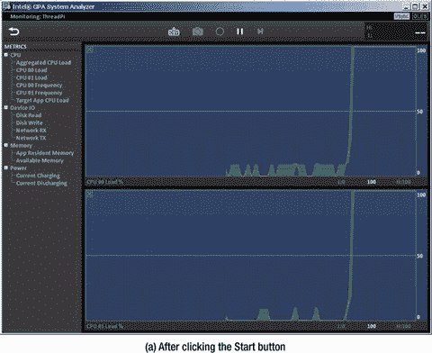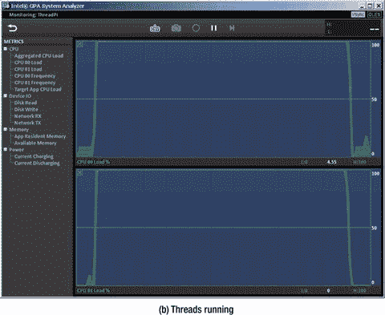

图 11-22。

Intel GPA analysis of `ThreadPi`

如您所见，当您单击 Start 按钮时，计算(任务)线程开始运行。两个 CPU 负载都从低负载上升到 100%容量。当计算完成时，CPU 负载回落到低负载状态。与原始应用不同，当计算任务运行时，两个 CPU 都是 100%负载的。不再有任何负载旋转。这表明优化的应用有两个并行的 CPU 在计算任务上满负荷工作，这使得应用运行得更快。

## 摘要

本章介绍了性能优化的基本原理、优化方法以及 Android 应用开发的相关工具。因为 Java 是 Android 开发者选择的应用开发语言，所以上一章介绍的优化工具主要是针对 Java 的。Java 应用运行在虚拟机中，天生比 C/C++ 应用慢，后者直接编译并运行在硬件指令上。此外，由于 C/C++ 的基本特性，许多开发人员对 C/C++ 应用有更多的经验，并创建了更多的优化工具。因此，C/C++ 开发不应该被排除在 Android 应用开发之外。下一章将介绍用于 C/C++ 应用开发的 Android NDK，以及相关的优化方法和优化工具。

 Open Access This chapter is licensed under the terms of the Creative Commons Attribution-NonCommercial-NoDerivatives 4.0 International License ( [ http://​creativecommons.​org/​licenses/​by-nc-nd/​4.​0/​ ](http://creativecommons.org/licenses/by-nc-nd/4.0/) ), which permits any noncommercial use, sharing, distribution and reproduction in any medium or format, as long as you give appropriate credit to the original author(s) and the source, provide a link to the Creative Commons licence and indicate if you modified the licensed material. You do not have permission under this licence to share adapted material derived from this chapter or parts of it. The images or other third party material in this chapter are included in the chapter’s Creative Commons licence, unless indicated otherwise in a credit line to the material. If material is not included in the chapter’s Creative Commons licence and your intended use is not permitted by statutory regulation or exceeds the permitted use, you will need to obtain permission directly from the copyright holder.