# 十二、NDK 和 C/C++ 优化

Keywords Java Code Android Application Compiler Optimization Head File Executable File

上一章介绍了性能优化的基本原理、优化方法以及 Android 应用开发的相关工具。因为 Java 是 Android 开发者推荐的应用开发语言，所以第十一章中介绍的优化工具主要是针对 Java 的。然而，C/C++ 开发不应该被排除在 Android 应用开发之外。本章介绍了用于 C/C++ 应用开发的 Android NDK 以及相关的优化方法和优化工具。

## JNI 简介

Java 应用不直接在硬件上运行，而是在虚拟机上运行。应用的源代码不是为了获得硬件指令而编译的，而是为了允许虚拟机解释和执行代码而编译的。比如 Android 应用运行在 Dalvik 虚拟机(DVM)中；它的编译代码是 DVM 的可执行代码，采用`.dex`格式。这个特性意味着 Java 运行在虚拟机上，并保证了它的跨平台能力:即它的“编译一次，随处运行”特性。Dalvik 有一个实时(JIT)编译器，并被优化为具有较低的内存需求。

凡事有利有弊。Java 的跨平台能力导致它与本地机器的内部组件的连接较少，并限制了它与本地机器的内部组件的交互，这使得很难使用本地机器指令来利用机器的性能潜力。很难使用基于本地的指令来运行巨大的现有软件库，这限制了它的功能和性能。从 Android 4.4 (KitKat)开始，Google 推出了 Android Runtime (ART)，这是一个取代 Dalvik 的应用运行时环境。ART 将应用的字节码转换成本机指令，稍后由设备的运行时环境执行。ART 通过在安装应用时执行提前(AOT)编译来引入它。

有没有办法让 Java 代码和原生代码软件协同工作，共享资源？答案是肯定的，使用 Java 本地接口(JNI)，这是一个 Java 本地操作的实现方法。JNI 是由 Java 标准定义的 Java 平台，用于与本地平台上的代码进行交互，通常称为。但这一章讲的是移动平台；为了区别于移动交叉开发主机，我们称之为。Java 代码和本地应用之间的交互包括两个方向:Java 代码调用本地函数(方法)，以及本地应用调用 Java 代码。相对来说，前一种方法在 Android 应用开发中使用的更多。所以本章的重点是 Java 代码调用本地函数的方法。

Java 通过 JNI 调用本地函数，将本地方法以库文件的形式存储起来。例如，在 Windows 平台上，文件是`.dll`文件格式，而在 Unix/Linux 机器上，文件是`.so`文件格式。调用本地库文件的内部方法使 Java 能够与本地机器建立密切联系:这被称为各种接口的系统级方法。

JNI 通常有两种使用场景:一是能够使用遗留代码(例如，之前使用 C/C++、Delphi 等开发工具)；第二，为了更好、更直接地与硬件交互以获得更好的性能。

JNI 的一般工作流程如下:Java 发起调用，让本地函数的侧代码(比如用 C/C++ 写的函数)运行。这一次，对象从 Java 端传递过来并运行一个本地函数，然后结果值被返回给 Java 代码。这里 JNI 是一个适配器，完成 Java 语言和本地编译语言(如 C/C++)之间变量和函数(Java 方法)的映射。Java 和 C/C++ 在函数原型定义和变量类型上有很大的不同。为了使两者匹配，JNI 提供了一个`jni.h`文件来完成它们之间的映射。该过程如图 12-1 所示。

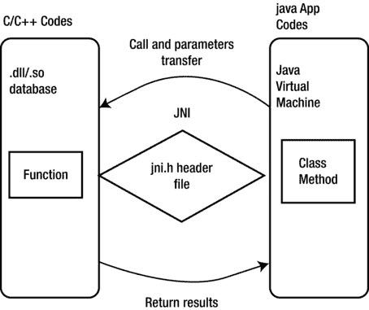

图 12-1。

JNI general workflow

通过 JNI 和 Java 程序(特别是 Android 应用)的 C/C++ 函数调用的一般框架如下:

1.  一种编译 Java 类中声明的 native 的方法(C/C++ 函数)。
2.  包含本地方法的`.java`源代码文件被编译。
3.  `javah`命令生成一个`.h`文件，包括基于`.class`文件实现本地方法的函数原型。
4.  C/C++ 用于实现本地方法。
5.  这一步推荐的方法是先复制`.h`文件中的函数原型，然后修改函数原型，添加函数体。在此过程中，应注意以下几点:
    *   JNI 函数调用必须使用 C 函数。如果是 C++ 函数，别忘了加上`extern` C 关键字。
    *   方法名应该使用下面的模板:`Java_package_class_method`，或者`Java_ package name _ class name _ function method name`。 
6.  将 C/C++ 文件编译成动态库(Windows 下，一个`.dll`文件；在 Unix/Linux 下，一个`.so`文件)。

使用 Java 中的`System.loadLibrary()`或`System.load()`方法加载生成的动态库。这两个功能略有不同:

*   `System.loadLibrary()`加载本地链接库下的默认目录。
*   `System.load()`需要一个绝对路径，根据本地目录添加一个交叉链接库。

第一步，Java 调用原生 C/C++ 函数；C 和 C++ 的格式不一样。例如，对于 Java 方法，如不传递参数和返回一个`String`类，函数的 C 和 C++ 代码在以下方面有所不同:

*   c 代码:

`Call function` : `(*env) -> <jni function> (env, <parameters>)`

`Return jstring` : `return (*env)->NewStringUTF(env, "XXX");`

*   C++ 代码:

`Call function` : `env -> <jni function> (<parameters>)`

`Return jstring` : `return env->NewStringUTF("XXX");`

`NewStringUTF`是用 C/C++ 生成的 Java `String`对象的函数，由 JNI 提供。

### 方法和 C 函数原型

前面您已经看到，在 Java 程序调用 C/C++ 函数的代码框架中，您可以使用`javah`命令，该命令基于`.class`文件为本地方法生成相应的`.h`文件。`.h`文件是按照一定的规则生成的，让正确的 Java 代码找到相应的 C 函数来执行。另一个好的解决方法是使用`env` - > `RegisterNatives`函数手动进行映射，避免使用`javah`。

例如，假设您有以下用于 Android 的 Java 代码:

`public class HelloJni extends Activity`

`1.  {`

`2.      public void onCreate(Bundle savedInstanceState)`

`3.      {`

`4.          TextView tv.setText(stringFromJNI() );  // Use C function Code`

`5.      }`

`6.      public native String  stringFromJNI();`

`7.  }`

对于第 4 行使用的 C 函数`stringFromJNI()`，由`javah`生成的`.h`文件中的函数原型是

`1.  JNIEXPORT jstring JNICALL Java_com_example_hellojni_HelloJni_stringFromJNI`

`2.    (JNIEnv *, jobject);`

定义函数代码的 C 源代码文件大致如下:

`1.  /*`

`2.  ......`

`3.  Signature: ()Ljava/lang/String;`

`4.  */`

`5.  jstring Java_com_example_hellojni_HelloJni_stringFromJNI (JNIEnv* env,  jobject thiz )`

`6.    {`

`7.      ......`

`8.      return (*env)->NewStringUTF(env, "......");`

`9.  }`

从这段代码中，你可以看到函数名相当长但仍然很规则，完全符合命名约定`java_package_class_method`。即`Hello.java`中的`stringFromJNI()`方法对应 C/C++ 中的`Java_com_example_hellojni_HelloJni_stringFromJNI()`方法。

注意`Signature` : `()Ljava/lang/String;`的注释。这里`()Ljava/lang/String;`中的`()`表示功能参数为空，这意味着除了两个参数`JNIEnv *`和`jobject`之外，没有其他参数。`JNIEnv *`和`jobject`分别是 JNI 环境和相应 Java 类(或对象)的所有 JNI 函数必须具有的两个参数。`Ljava/lang/String;`表示函数的返回值是一个 Java `String`对象。

#### Java 和 C 数据类型映射

如前所述，Java 和 C/C++ 有非常不同的变量类型。为了使这两者相匹配，JNI 提供了一种机制来完成 Java 和 C/C++ 之间的映射。主要类型的关系如表 12-1 所示。

表 12-1。

The Correspondence between Java Types and Local (C/C++) Types

<colgroup><col> <col> <col></colgroup> 
| Java 类型 | 原生类型 | 描述 |
| --- | --- | --- |
| `boolean` | `jboolean` | C/C++ 8 位整数 |
| `byte` | `jbyte` | C/C++ 无符号 8 位整数 |
| `char` | `jchar` | C/C++ 无符号 16 位整数 |
| `short` | `jshort` | C/C++ 有符号 16 位整数 |
| `int` | `jint` | C/C++ 有符号 32 位整数 |
| `long` | `jlong` | C/C++ 无符号 64 位整数 |
| `float` | `jfloat` | C/C++ 32 位浮点 |
| `double` | `jdouble` | C/C++ 64 位浮点 |
| `void` | `void` | 不适用的 |
| `Object` | `jobject` | 任何 Java 对象，或者不对应于 Java 类型的对象 |
| `Class` | `jclass` | 类对象 |
| `String` | `jstring` | 字符串对象 |
| `Object[]` | `jobjectArray` | 任何对象的数组 |
| `boolean[]` | `jbooleanArray` | 布尔数组 |
| `byte[]` | `jbyteArray` | 比特阵列 |
| `char[]` | `jcharArray` | 字符数组 |
| `short[]` | `jshortArray` | 短整数数组 |
| `int[]` | `jintArray` | 整数数组 |
| `long[]` | `jlongArray` | 长整数数组 |
| `float[]` | `jfloatArray` | 浮点数组 |
| `double[]` | `jdoubleArray` | 双浮点数组 |

当传递 Java 参数时，您可以使用 C 代码，如下所示:

*   基本类型可以直接使用:比如`double`和`jdouble`是可以互换的。基本类型为表 12-1 中`boolean`至`void`的类型。在这种类型中，如果用户将一个`boolean`参数传递给方法，那么就会有一个对应于`boolean`类型的本地方法`jboolean`。类似地，如果本地方法返回一个`jint`，那么 Java 会返回一个`int`。
*   Java 对象用法:一个`Object`对象有`String`对象和一个通用对象。这两个对象的处理方式略有不同:
    *   `String`对象:Java 程序传递的`String`对象是本地方法中对应的`jstring`类型。C 中的`jstring`类型和`char *`不同。所以如果你只是把它当成一个`char *`，就会出现错误。因此，`jstring`在使用前必须在 C/C++ 中转换成`char *`。这里使用`JNIEnv`方法进行转换。
    *   `Object` object:使用以下代码获取该类的对象处理程序:

`jclass objectClass = (env)->FindClass("com/ostrichmyself/jni/Structure");`

`jfieldID str = (env)->GetFieldID(objectClass,"nameString","Ljava/lang/String;");`

`jfieldID ival = (env)->GetFieldID(objectClass,"number","I");`

`(env)->SetObjectField(theObjet,str,(env)->NewStringUTF("my name is D:"));`

`(env)->SetShortField(theObjet,ival,10);`

`jobject myNewObjet = env->AllocObject(objectClass);`

Note

如果您希望调用对象构造函数，则需要调用。

##### Java 数组处理

对于数组类型，JNI 提供了一些可操作的函数。例如，`GetObjectArrayElement`可以接受传入的数组，并使用`NewObjectArray`创建一个数组结构。

##### 资源释放

资源释放的原理如下:

*   C/C++ new 的对象或 malloc 的对象需要使用 C/C++ 来释放。
*   如果`JNIEnv`方法的新对象没有被 Java 使用，就必须释放它。
*   使用`GetStringUTFChars`将一个 string 对象从 Java 转换成 UTF，需要打开内存，使用完`char *`后必须使用`ReleaseStringUTFChars`方法释放内存。

以上是 Java 与 C/C++ 交换数据时类型映射基本思想的简要描述。有关 Java 和 C/C++ 数据类型的更多信息，请参考相关的 Java 和 JNI 书籍、文档和示例。

### NDK 简介

您现在知道 Java 代码可以使用 JNI 访问本地函数(比如 C/C++)。要实现这一点，你需要开发工具。如前所述，基于核心 Android SDK 的一整套开发工具是可用的，您可以使用这些工具将 Java 应用交叉编译为可以在目标 Android 设备上运行的应用。同样，您需要交叉开发工具来将 C/C++ 代码编译成可以在 Android 设备上运行的应用。这个工具就是 Android 原生开发包(NDK)，可以从 [`http://developer.android.com`](http://developer.android.com/) 下载。

在 NDK 之前，Android 平台上的第三方应用是在一个特殊的基于 Java 的 DVM 上开发的。原生 SDK 的发布允许开发者直接访问 Android 系统资源，并使用 C 和 C++ 等原生代码语言实现部分应用。应用包文件(`.apk`)可以直接嵌入到本地库中。简而言之，有了 NDK，原本在 DVM 上运行的 Android 应用可以使用 C/C++ 等本地语言来执行程序。这带来了以下好处:

*   通过使用本机代码来开发需要高性能的程序部分，以及通过直接访问 CPU 和硬件来提高性能
*   重用现有本机代码的能力

当然，与 DVM 相比，使用原生 SDK 编程也有一些缺点，例如增加了程序的复杂性，难以保证兼容性，无法访问框架 API，调试更加困难，灵活性下降等等。此外，访问 JNI 需要额外的性能开销。

简而言之，NDK 应用开发有利有弊。你需要根据自己的判断使用 NDK。最佳策略是使用 NDK 来开发应用中本机代码可以提高性能的部分。

NDK 包括以下主要部分:

*   从 C/C++ 源代码生成本机代码库所需的工具和构建文件。其中包括一系列 NDK 命令，包括`javah`(使用`.class`文件生成相应的`.h`文件)和`gcc`(稍后描述)
*   嵌入在应用包(`.apk`文件)中的一致的本地库，可以部署在 Android 设备中
*   支持所有未来 Android 平台的一些原生系统头文件和库
*   文档、示例和教程

NDK 应用开发的流程框架如图 12-2 所示。Android 应用由三部分组成:Android 应用文件、Java 本地库文件和动态库。这三个部分通过各自的生成路径从不同的源生成。对于一个普通的 Android 应用，Android SDK 生成 Android 应用文件和 Java 原生库文件。Android NDK 使用本地代码(通常是 C 源代码文件)生成动态库文件(扩展名为`.so`的文件)。最后在目标机上安装 Android 应用文件、Java 原生库文件、动态库，完成协同应用运行。

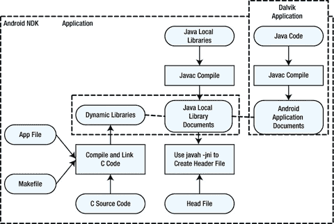

图 12-2。

Flowchart of Android NDK application development

与 NDK 合作开发的应用项目(简称 NDK 应用项目)的组成如图 12-3 所示。与使用 Android SDK 开发的典型应用不同，除了 Dalvik 类代码、清单文件和资源，NDK 应用项目还包括 JNI 和 NDK 生成的共享库。

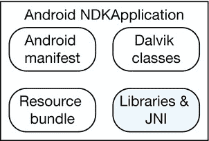

图 12-3。

Application components for an Android NDK application

Android 在其关键 API 版本中增加了 NDK 支持。每个版本都包括一些新的 NDK 特性、简单的 C/C++、兼容的标准模板库(STL)、硬件扩展等等。这些特性使得 Android 更加开放，更加强大。Android API 的映射及其与 NDK 的对应关系如表 12-2 所示。

表 12-2。

Relationship between the Main Android API and NDK Versions

<colgroup><col> <col></colgroup> 
| API 版本 | 支持的 NDK 版本 |
| --- | --- |
| API 级 | Android 1.5 NDK 1 |
| API 级 | Android 1.6 NDK 2 |
| API 级 | Android 2.1 NDK 3 |
| API 级 | Android 2.2 NDK 4 |
| API 级 | Android 2.3 NDK 5 |
| API 级 | Android 3.1 NDK 6 |
| API 级 | Android 4.0.1 NDK 7 |
| API 级 | Android 4.0.3 NDK 8 |
| API 级 | Android 4.1 NDK 8b |
| API 级 | Android 4.2 NDK 8d |
| API 级 | Android 4.2 NDK 9 |
| API 级 | Android 4.3 NDK 9d |
| API 等级 19 | Android 4.4 NDK 10 |

TIP: THE MEANING OF APPLICATION BINARY INTERFACE (ABI)

使用 Android NDK 生成的每段本机代码都有一个匹配的应用二进制接口(ABI)。ABI 精确地定义了应用及其代码在运行时如何与系统交互。ABI 大致类似于计算机体系结构中的指令集体系结构(ISA)。

典型的 ABI 通常包含以下信息:

*   CPU 指令集应该使用的机器代码
*   运行时内存访问排名
*   可执行二进制文件的格式(动态库、程序等)以及允许和支持的内容类型
*   在应用代码和系统之间传递数据时使用的不同约定(例如，函数调用何时注册和/或如何使用堆栈、对齐限制等)
*   枚举类型、结构字段和数组的对齐和大小限制
*   独特的名字；运行时应用机器码的可用函数符号列表通常来自一组非常特定的库

Android 目前支持以下 ABI 类型:

*   ARM eabi:ARM CPU 的 abi 名称，它至少支持 ARMv5TE 指令集。
*   armeabi-v7a:基于 ARM 的 CPU 的另一个 abi 名字；它扩展了 armeabi CPU 指令集扩展，如 Thumb-2 指令集扩展和用于向量浮点硬件的浮点处理单元指令。
*   x86 : ABI 名称，通常用于支持 CPU 的 x86 或 IA-32 指令集。更具体地说，它的目标通常在下面的章节中称为 i686 或奔腾 Pro 指令集。英特尔凌动处理器属于这种 ABI 类型。
*   MIPS:支持 MIPS32r1 指令集的基于 MIPS 的 CPU 的 ABI。ABI 包括以下特性:MIPS32 修订版 1 ISA、little-endian、O32、硬浮点和无 DSP 应用。这些类型具有不同的兼容性。x86 与 armeabi 和 armeabi-v7a 不兼容。armeabi-v7a 机器与 armeabi 兼容，这意味着 armeabi 框架指令集可以在 armeabi-v7a 机器上运行，但不一定相反，因为一些 ARMv5 和 ARMv6 机器不支持 armeabi-v7a 代码。因此，在构建应用时，应该根据用户对应的 ABI 机器类型仔细选择用户。

## 安装 NDK 和设置环境

NDK 包含在面向 Linux 的英特尔 Beacon Mountain、面向 OS X 的英特尔 Beacon Mountain 和面向 Windows 主机系统的英特尔集成本地开发人员体验(INDE)中，并在您安装这些英特尔工具时安装。安装详见第三章。英特尔 INDE 中还包含一个环境设置程序；您可以下载它并自动运行安装程序。

### 安装 CDT

CDT 是一个 Eclipse 插件，它将 C 代码编译成`.so`共享库。安装完 Cygwin 和 NDK 模块后，你已经可以在命令行将 C 代码编译成`.so`共享库，这意味着 Windows NDK 的核心组件已经安装好了。如果您喜欢使用 Eclipse IDE 而不是命令行编译器来编译本地库，那么您需要安装 CDT 模块。

如果您需要安装它，请遵循以下步骤。

1.  查看“许可”对话框，然后单击“我接受许可协议的条款”继续。
2.  安装过程开始。完成后，重启 Eclipse 以完成安装。

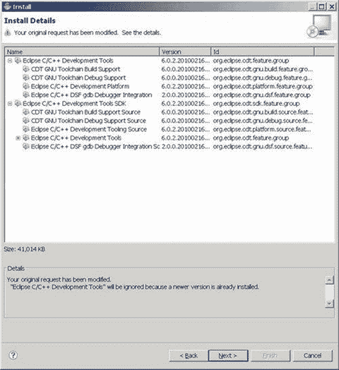

图 12-4。

Detailed information for the CDT component installation

1.  访问 Eclipse 官方网站( [`www.eclipse.org/cdt/downloads.php`](http://www.eclipse.org/cdt/downloads.php) )并下载最新的 CDT 包。
2.  启动 Eclipse。选择帮助➤安装新软件➤开始安装 CDT。
3.  在弹出的安装对话框中，单击添加。
4.  在弹出的添加存储库对话框中，输入名称。
5.  对于位置，您可以输入本地地址或互联网地址。如果使用互联网地址，Eclipse 会上网下载并安装软件包；本地地址指示 Eclipse 从本地包安装软件。在这种情况下，输入本地地址；然后在弹出的对话框中点击 Archive 按钮，输入下载的 CDT 文件的目录和文件名。如果你是从网上下载的，地址是 [`http://download.eclipse.org/tools/cdt/releases/galileo/`](http://download.eclipse.org/tools/cdt/releases/galileo/) 。
6.  返回安装对话框后，单击选择需要安装的软件组件。在本例中，CDT 主功能是您需要选择的必需组件。显示要安装的 CDT 组件的详细信息列表，如图 12-4 所示。

## NDK 的例子

本节提供一个例子来说明 JNI 和 NDK 的用法。如前所述，NDK 既可以从命令行运行，也可以在 Eclipse IDE 中运行。该示例使用两种方法生成相同的 NDK 应用。

### 使用命令行生成库文件

本例中的 app 名称为`jnitest`。这是一个演示 JNI 代码框架的简单例子。步骤如下:

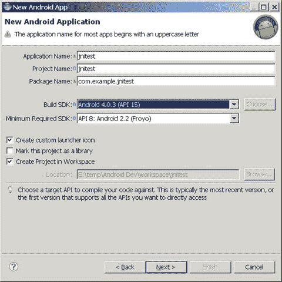

图 12-5。

Setting up the `jnitest` project parameters

1.  创建一个 Android app 项目，编译代码，生成`.apk`包。首先在 Eclipse 中创建一个项目，并将项目命名为`jnitest`。选择 Build SDK 支持 x86 版本的 API，如图 12-5 所示。对于其他选项，请使用默认值。然后生成项目。

项目生成后，文件结构创建如图 12-6 所示。请注意库文件(在本例中为`android.jar`)所在的目录，因为后面的步骤会用到这个参数。

1.  修改 Java 文件以使用 C 函数创建代码。在这种情况下，唯一的 Java 文件是`MainActivity.java`；修改其代码，如下所示:

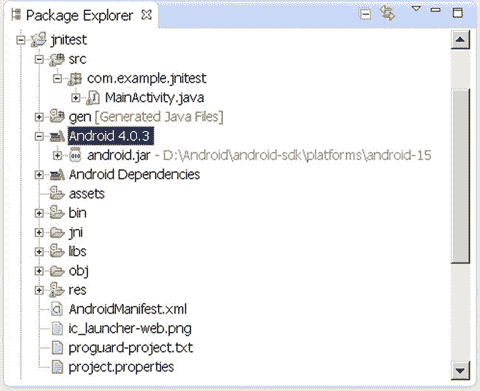

图 12-6。

File structure of the `jnitest` project

`1.  package com.example.jnitest;`

`2.  import android.app.Activity;`

`3.  import android.widget.TextView;`

`4.  import android.os.Bundle;`

`5.  public class MainActivity extends Activity`

`6.  {`

`7.      @Override`

`8.      public void onCreate(Bundle savedInstanceState)`

`9.      {`

`10.         super.onCreate(savedInstanceState);`

`11.         TextView tv = new TextView(this);`

`12.         tv.setText(stringFromJNI() );  // stringFromJNIas a  C function`

`13.         setContentView(tv);`

`14.     }`

`15.     public native String stringFromJNI();`

`16.`

`17.     static {`

`18.         System.loadLibrary("jnitestmysharelib");`

`19.     }`

`20.  }`

代码非常简单。在第 11–13 行，您使用一个`TextView`来显示从`stringFromJNI()`函数返回的字符串。但是与前面讨论的 Android 应用不同，在整个项目中，您找不到该功能的实现代码。那么函数实现发生在哪里呢？第 15 行声明该函数不是用 Java 编写的，而是由本地(本机)库编写的，这意味着该函数在 Java 之外。因为它是在本地库实现的，问题是，什么库？答案在第 17–20 行中描述。`System`类的静态函数`LoadLibrary`的参数描述了库的名称:该库是 Linux 中的一个共享库，名为`libjnitestmysharelib.so`。在静态区声明的应用代码将在`Activity.onCreate`之前执行。该库将在第一次使用时加载到内存中。

有趣的是，当`loadLibrary`函数加载库名时，它会自动在参数前添加前缀`lib`并在末尾添加后缀`.so`。当然，如果参数指定的库文件名称以`lib`开头，该函数不会添加`lib`前缀。

1.  在 Eclipse 中生成项目。只构建它，不运行它。这会编译项目，但是`.apk`文件不会部署到目标机器上。

当这一步完成后，在项目目录`bin\classes\com\example\jnitest`中生成相应的`.class`文件。这一步必须在下一步之前完成，因为下一步需要使用合适的`.class`文件。

1.  在项目根目录下创建一个`jni`子目录。例如，如果项目根目录是`E:\temp\AndroidDev\workspace\jnitest`，那么可以使用`md`命令创建`jni`子目录:

`E:\temp\Android Dev\workspace\jnitest>mkdir jni`

测试目录是否已经建立:

`E:\temp\Android Dev\workspace\jnitest>dir`

`......`

`2013-02-01  00:45    <DIR>          jni`

1.  创建一个 C 接口文件。这是使用本地(外部)函数的 C 函数原型。特定于这种情况的是`stringFromJNI`函数的 C 函数原型。你用 Java 声明你需要使用外部函数的原型；但是它是 Java 格式的，所以你需要把它改成 C 格式，这意味着要建立一个 C JNI 接口文件。该步骤可通过`javah`命令完成:

`$ javah -classpath <directory of jar and .class documents> -d <directory of .h documents>  <the package + class name of class>`

命令参数如下:

*   `-classpath`:类路径
*   `-d`:生成的头文件的存放目录
*   `<class name>`:正在使用的原生函数的完整`.class`类名，由“包+类的类名”组件组成。

对于此示例，请遵循以下步骤:

1.  使用命令行输入根目录(在本例中为`E:\temp\Android Dev\workspace\jnitest`)。
2.  运行以下命令:

`E:> javah -classpath "D:\Android\android-sdk\platforms\android-15\android.jar";bin/classes  com.example.jnitest.MainActivity`

在这个例子中，使用的本地函数`stringFromJNI`的类是`MainActivity`；并且这个类编译后的结果文件是`MainActivity.class`，位于项目根目录`bin\classes\com\example`目录下。其类`MainActivity.java`的源代码文件的第一行显示了该类的包在哪里:

`package com.example.jnitest;`

因此，这是命令:“类名=包名。类名”(注意不要使用`.class`后缀)。

首先需要说明整个包的 Java 库路径(本例中，库文件是`android.jar`；它的位置在`D:\Android\android-sdk\ platforms\android-15\android.jar`。其次，它需要定义目标类(`MainActivity.class`)目录。在本例中，它是`bin\classes\com\example\MainActivity.class`下的`bin\classes`，两者用分号(C)隔开。

1.  现在在当前目录(项目根目录)中生成了`.h`文件。该文件定义了 C 语言的函数接口。您可以测试输出:

`E:\temp\Android Dev\workspace\jnitest>dir`

`......`

`2013-01-31  22:00         3,556 com_example_jnitest_MainActivity.h`

显然已经生成了一个新的`.h`文件。该文件内容如下:

`1.  /* DO NOT EDIT THIS FILE - it is machine generated */`

`2.  #include <jni.h>`

`3.  /* Header for class com_example_jnitest_MainActivity */`

`4.`

`5.  #ifndef _Included_com_example_jnitest_MainActivity`

`6.  #define _Included_com_example_jnitest_MainActivity`

`7.  #ifdef __cplusplus`

`8.  extern "C" {`

`9.  #endif`

`10\. #undef com_example_jnitest_MainActivity_MODE_PRIVATE`

`11\. #define com_example_jnitest_MainActivity_MODE_PRIVATE 0L`

`12\. #undef com_example_jnitest_MainActivity_MODE_WORLD_READABLE`

`13\. #define com_example_jnitest_MainActivity_MODE_WORLD_READABLE 1L`

`14\. #undef com_example_jnitest_MainActivity_MODE_WORLD_WRITEABLE`

`15\. #define com_example_jnitest_MainActivity_MODE_WORLD_WRITEABLE 2L`

`16\. #undef com_example_jnitest_MainActivity_MODE_APPEND`

`17\. #define com_example_jnitest_MainActivity_MODE_APPEND 32768L`

`18\. #undef com_example_jnitest_MainActivity_MODE_MULTI_PROCESS`

`19\. #define com_example_jnitest_MainActivity_MODE_MULTI_PROCESS 4L`

`20\. #undef com_example_jnitest_MainActivity_BIND_AUTO_CREATE`

`21\. #define com_example_jnitest_MainActivity_BIND_AUTO_CREATE 1L`

`22\. #undef com_example_jnitest_MainActivity_BIND_DEBUG_UNBIND`

`23\. #define com_example_jnitest_MainActivity_BIND_DEBUG_UNBIND 2L`

`24\. #undef com_example_jnitest_MainActivity_BIND_NOT_FOREGROUND`

`25\. #define com_example_jnitest_MainActivity_BIND_NOT_FOREGROUND 4L`

`26\. #undef com_example_jnitest_MainActivity_BIND_ABOVE_CLIENT`

`27\. #define com_example_jnitest_MainActivity_BIND_ABOVE_CLIENT 8L`

`28\. #undef com_example_jnitest_MainActivity_BIND_ALLOW_OOM_MANAGEMENT`

`29\. #define com_example_jnitest_MainActivity_BIND_ALLOW_OOM_MANAGEMENT 16L`

`30\. #undef com_example_jnitest_MainActivity_BIND_WAIVE_PRIORITY`

`31\. #define com_example_jnitest_MainActivity_BIND_WAIVE_PRIORITY 32L`

`32\. #undef com_example_jnitest_MainActivity_BIND_IMPORTANT`

`33\. #define com_example_jnitest_MainActivity_BIND_IMPORTANT 64L`

`34\. #undef com_example_jnitest_MainActivity_BIND_ADJUST_WITH_ACTIVITY`

`35\. #define com_example_jnitest_MainActivity_BIND_ADJUST_WITH_ACTIVITY 128L`

`36\. #undef com_example_jnitest_MainActivity_CONTEXT_INCLUDE_CODE`

`37\. #define com_example_jnitest_MainActivity_CONTEXT_INCLUDE_CODE 1L`

`38\. #undef com_example_jnitest_MainActivity_CONTEXT_IGNORE_SECURITY`

`39\. #define com_example_jnitest_MainActivity_CONTEXT_IGNORE_SECURITY 2L`

`40\. #undef com_example_jnitest_MainActivity_CONTEXT_RESTRICTED`

`41\. #define com_example_jnitest_MainActivity_CONTEXT_RESTRICTED 4L`

`42\. #undef com_example_jnitest_MainActivity_RESULT_CANCELED`

`43\. #define com_example_jnitest_MainActivity_RESULT_CANCELED 0L`

`44\. #undef com_example_jnitest_MainActivity_RESULT_OK`

`45\. #define com_example_jnitest_MainActivity_RESULT_OK -1L`

`46\. #undef com_example_jnitest_MainActivity_RESULT_FIRST_USER`

`47\. #define com_example_jnitest_MainActivity_RESULT_FIRST_USER 1L`

`48\. #undef com_example_jnitest_MainActivity_DEFAULT_KEYS_DISABLE`

`49\. #define com_example_jnitest_MainActivity_DEFAULT_KEYS_DISABLE 0L`

`50\. #undef com_example_jnitest_MainActivity_DEFAULT_KEYS_DIALER`

`51\. #define com_example_jnitest_MainActivity_DEFAULT_KEYS_DIALER 1L`

`52\. #undef com_example_jnitest_MainActivity_DEFAULT_KEYS_SHORTCUT`

`53\. #define com_example_jnitest_MainActivity_DEFAULT_KEYS_SHORTCUT 2L`

`54\. #undef com_example_jnitest_MainActivity_DEFAULT_KEYS_SEARCH_LOCAL`

`55\. #define com_example_jnitest_MainActivity_DEFAULT_KEYS_SEARCH_LOCAL 3L`

`56\. #undef com_example_jnitest_MainActivity_DEFAULT_KEYS_SEARCH_GLOBAL`

`57\. #define com_example_jnitest_MainActivity_DEFAULT_KEYS_SEARCH_GLOBAL 4L`

`58\. /*`

`59.  * Class:     com_example_jnitest_MainActivity`

`60.  * Method:    stringFromJNI`

`61.  * Signature: ()Ljava/lang/String;`

`62\. */`

`63\. JNIEXPORT jstring JNICALL Java_com_example_jnitest_MainActivity_stringFromJNI`

`64\. (JNIEnv *, jobject);`

`65.`

`66\. #ifdef __cplusplus`

`67\. }`

`68\. #endif`

`69\. #endif`

在这段代码中，请特别注意第 63–64 行，这是一个局部函数`stringFromJNI`的 C 函数原型。

1.  编译相应的 C 文件。这是一个局部函数的真正实现(`stringFromJNI`)。源代码文件是在前面步骤的基础上修改`.h`文件得到的。

在项目的`jni`子目录下创建一个新的`.c`文件。文件名可以是任何名称；在这种情况下，它就是`jnitestccode.c`。内容如下:

`1\. #include <string.h>`

`2\. #include <jni.h>`

`3\. jstring Java_com_example_hellojni_HelloJni_stringFromJNI( JNIEnv* env,  jobject thiz )`

`4\. {`

`5.     return (*env)->NewStringUTF(env, "Hello from JNI !");  // Newly added code`

`6\. }`

定义函数实现的代码非常简单。第 3 行是函数`stringFromJNI`的原型定义中使用的 Java 代码；它基本上是从`com_example_jnitest_MainActivity.h`的第 63–64 行获得的`.h`文件的相应内容的副本，为了说明这一点，稍微做了一些修改。这个函数的原型格式是固定的；`JNIEnv* env`和`jobject thiz`是 JNI 的固有参数。因为`stringFromJNI`函数的参数为空，所以生成的 C 函数只有两个参数。第五行代码的作用是返回字符串“你好，来自 JNI！”作为返回值。

第 2 行的代码是包含 JNI 函数的头文件，任何使用 JNI 的函数都需要这个函数。因为它与字符串函数相关，所以在这种情况下，第 1 行包含相应的头文件。完成这些步骤后，`.h`文件就没有用了，可以删除。

1.  在`jni`目录下创建 NDK makefile 文件。这些文件主要是`Android.mk`和`Application.mk`:需要`Android.mk`，但是如果使用默认的应用配置，就不需要`Application.mk`。具体步骤如下:
    1.  在项目的`jni`目录下创建一个新的`Android.mk`文本文件。这个文件用来告诉编译器一些要求，比如编译哪些 C 文件，编译的代码用什么文件名等等。输入以下内容: 

`1\. LOCAL_PATH      := $(call my-dir)`

`2\. include $(CLEAR_VARS)`

`3\. LOCAL_MODULE    := jnitestmysharelib`

`4\. LOCAL_SRC_FILES := jnitestccode.c`

`5\. include $(BUILD_SHARED_LIBRARY)`

第 3 行代表生成的`.so`文件名(标识您的`Android.mk`文件中描述的每个模块)。它必须与 Java 代码中的`System.loadLibrary`函数的参数值一致。该名称必须是唯一的，并且不能包含任何空格。

Note

构建系统自动生成适当的前缀和后缀；换句话说，如果一个是名为`jnitestmysharelib`的共享库模块，那么就会生成一个`libjnitestmysharelib.so`文件。如果您将库命名为`libhello-jni`，编译器不会添加前缀`lib`，也会生成`libhello-jni.so`。

第 4 行的`LOCAL_SRC_FILES`变量必须包含要编译并打包成模块的 C 或 C++ 源代码文件。前面的步骤创建了一个 C 文件名。

Note

您不必在这里列出头文件和包含文件，因为编译器会自动为您识别相关文件—只需列出直接传递给编译器的源代码文件。另外，C++ 源文件的默认扩展名是`.cpp`。只要定义了`LOCAL_DEFAULT_CPP_EXTENSION`变量，就可以指定不同的扩展名。不要忘记开头的句点字符(`.cxx`，而不是`cxx`)。

第 3 行和第 4 行中的代码非常重要，必须根据每个 NDK 应用的配置进行修改。其他行的内容可以从示例中复制。

1.  在项目的`jni`目录下创建一个`Application.mk`文本文件。这个文件用来告诉编译器这个应用的具体设置。输入以下内容:

`APP_ABI := x86`

这个文件非常简单；应用指令生成的目标代码适用于 86 架构，因此您可以在英特尔凌动处理器上运行应用。对于`APP_ABI`参数，你可以使用任何你想要支持的架构(x86，armeabi，armeabi-v7a 或者 MIPS)。

1.  将`.c`文件编译成`.so`共享库文件。转到项目根目录(`AndroidManifest.xml`所在)，运行`ndk-build`命令:

`E:\temp\Android Dev\workspace\jnitest>ndk-build`

`D:/Android/android-ndk-r8d/build/core/add-application.mk:128: Android NDK: WARNING: APP_PLATFORM android-14 is larger than android:minSdkVersion 8 in ./AndroidM`

`anifest.xml`

`"Compile x86  : jnitestmysharelib <= jnitestccode.c`

`SharedLibrary : libjnitestmysharelib.so`

`Install       : libjnitestmysharelib.so => libs/x86/libjnitestmysharelib.so`

该命令在项目文件夹中增加两个子目录(`libs`和`obj`)，并在`obj`目录下创建一个`.so`文件(名为`libjnitestmysharelib.so`的命令执行信息提示文件)。

如果这些步骤没有在`Application.mk`文件中定义指定的 ABI，`ndk-build`命令会为 ARM 架构(armeabi)生成目标代码。如果您想要生成 x86 架构指令，您可以使用`ndk-build APP_ABI = x86`命令来补救这种情况。该命令生成的目标代码的架构仍然是 x86。

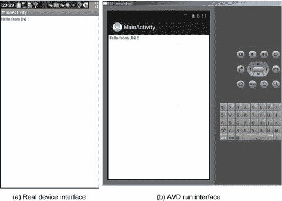

图 12-7。

`jnitest` application interface

1.  运行项目。图 12-7 显示了在目标设备上运行的应用。

### 在 IDE 中生成库文件

上一节描述了将 C 文件编译成可以在 Android 目标设备上运行的动态库`.so`文件的过程。为此，您可以在命令行中运行`ndk-build`命令。您也可以在 Eclipse IDE 中完成这一步。

Eclipse 支持直接的 NDK 集成。您可以将 CDT 安装到 Eclipse 中，创建一个想要添加 C/C++ 代码的 Android 项目，在项目目录中创建一个`jni` /目录，将 C/C++ 源文件放在同一个目录中，并将`Android.mk`文件放入其中——这是一个 makefile，它告诉 Android 构建系统如何构建您的文件。

如果出于某种原因，您需要手动构建代码，您可以使用以下过程在 IDE 中生成库文件。步骤 1–7 中的代码与上一节完全相同，除了在步骤 6 中，您将把`.c`文件编译成`.so`共享库文件。稍后将对此进行详细解释:

1.  在弹出的编辑配置对话框中，对于主选项卡设置，输入以下内容:
    *   位置:通往 Cygwin 的路径`bash.exe`
    *   工作目录:Cygwin 的`bin`目录
    *   参数: 

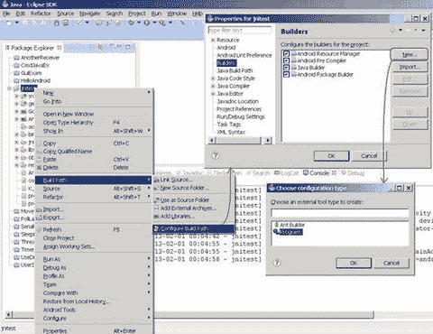

图 12-8。

Entering parameters settings for the interface to compile C code in Eclipse

1.  将`.c`文件编译成`.so`共享库文件。右键单击项目名称，选择构建路径➤配置构建路径，在弹出的对话框中，选择构建器分支。单击对话框中的新建按钮，然后；在提示对话框中双击程序。该过程如图 12-8 所示。

`--login -c "cd '/cygdrive/E/temp/Android Dev/workspace/jnitest' && $ANDROID_NDK_ROOT/ndk-build"`

*   `E/temp/Android Dev/workspace/jnitest`是项目的驱动器号和路径。设置如图 12-9 所示。

1.  保存配置。它会自动编译`jni`目录下的 C 相关代码，并将相应的`.so`库文件输出到项目的`libs`目录下。`libs`目录自动创建。在控制台窗口中，您可以看到构建的输出如下:

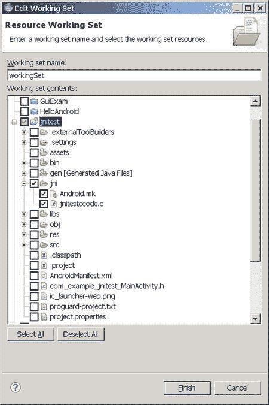

图 12-12。

Select source code and directories where related files are located

1.  单击“指定资源”按钮。在编辑工作集对话框中选择`jni`目录，如图 12-12 所示。

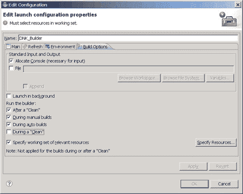

图 12-11。

Edit Configuration dialog box Build Options tab settings

1.  重新配置“构建选项”选项卡。在自动构建时选择，并指定相关资源的工作集，如图 12-11 所示。

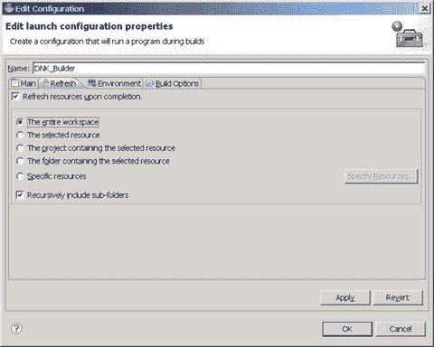

图 12-10。

Edit Configuration dialog box Refresh tab settings

1.  配置刷新选项卡，确保选择整个工作区和递归包含子文件夹项，如图 12-10 所示。

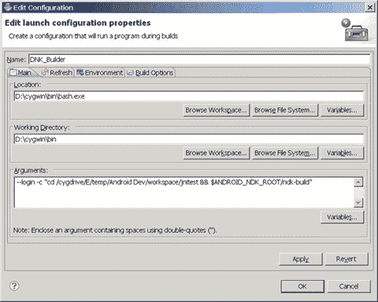

图 12-9。

Main tab setting in the Edit Configuration dialog box

`/cygdrive/d/Android/android-ndk-r8d/build/core/add-application.mk:128: Android NDK: WARNING: APP_PLATFORM android-14 is larger than android:minSdkVersion 8 in ./AndroidManifest.xml`

`Cygwin        : Generating dependency file converter script`

`Compile x86   : jnitestmysharelib <= jnitestccode.c`

`SharedLibrary : libjnitestmysharelib.so`

`Install       : libjnitestmysharelib.so => libs/x86/libjnitestmysharelib.so`

### NDK 应用开发的工作流分析

如上所述生成 NDK 项目的过程自然会实现 C 库与 Java 的集成。您将`.c`文件编译成`.so`共享库文件。库的中间版本放在`obj`目录中，最终版本放在`libs`目录中。完成后，项目文件结构创建完成，如图 12-13 所示。

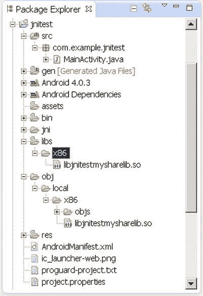

图 12-13。

The `jnitest` project structure after NDK library files are generated

当您运行项目时，共享库`.so`文件位于主机上的项目目录中，并打包在一个生成的`.apk`文件中。`.apk`文件本质上是一个压缩文件；可以使用 WinRAR 之类的压缩软件查看其内容。对于这个例子，你可以在项目目录的`bin`子目录中找到`.apk`文件；用 WinRAR 打开，显示文件结构。`.apk`的`lib`子目录的内容是项目的`lib`子目录内容的克隆。

当`.apk`被部署到目标机器时，它被解包。`.so`文件放在`/data/dat/XXX/lib`目录中，其中`XXX`是应用包名称。对于这个例子，目录是`/data/data/com.example.jnitest/lib`。您可以在 Eclipse DDMS 下查看目标机器的文件结构；该示例的文件结构如图 12-14 所示。有兴趣的可以在命令行上试试，用`adb` shell 命令查看目标文件目录中相应的内容。

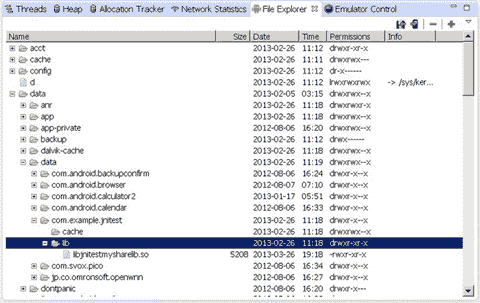

图 12-14。

`jnitest` application deployment target file structure

此外，如果您在模拟器中运行`jnitest`应用(在本例中，目标机器是一个虚拟机)，您可以在 Eclipse Logcat 窗口中看到以下输出:

`1\. 07-10 05:43:08.579: E/Trace(6263): error opening trace file: No such file or directory (2)`

`2\. 07-10 05:43:08.729: D/dalvikvm(6263): Trying to load lib /data/data/com.example.jnitest/lib/libjnitestmysharelib.so 0x411e8b30`

`3\. 07-10 05:43:08.838: D/dalvikvm(6263): Added shared lib /data/data/com.example.jnitest/lib/libjnitestmysharelib.so 0x411e8b30`

`4\. 07-10 05:43:08.838: D/dalvikvm(6263): No JNI_OnLoad found in /data/data/com.example.jnitest/lib/libjnitestmysharelib.so 0x411e8b30, skipping init`

`5\. 07-10 05:43:11.773: I/Choreographer(6263): Skipped 143 frames!  The application may be doing too much work on its main thread.`

`6\. 07-10 05:43:12.097: D/gralloc_goldfish(6263): Emulator without GPU emulation detected.`

第 2–3 行是应用中加载的`.so`共享库的提示。

## NDK 编译器优化

从例子中可以看出，NDK 工具的核心作用是将源代码编译成可以在 Android 机器上运行的`.so`库文件。将`.so`库文件放入项目目录的`lib`子目录中，这样当您使用 Eclipse 部署应用时，您可以将库文件部署到目标设备上的适当位置，并且应用可以使用库函数。

Note

NDK 应用的本质是建立一个符合 JNI 标准的代码框架，让 Java 应用使用虚拟机范围之外的本地功能。

将源代码编译成`.so`库文件的关键 NDK 命令是`ndk-build`。这个命令实际上不是一个单独的命令，而是一个可执行的脚本。它调用 GNU 交叉开发工具中的`make`命令来编译一个项目；而`make`调用例如`gcc`编译器编译源代码来完成这个过程，如图 12-15 所示。当然，你也可以直接使用已经在安卓应用中的第三方开发的`.so`共享库，这样就不用自己写库(函数代码)了。

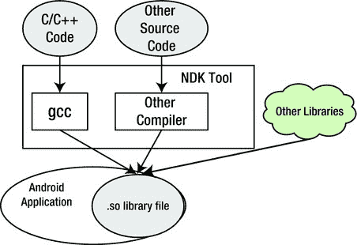

图 12-15。

The working mechanism of NDK tools

如图 12-15 所示，GNU 编译器`gcc`是 NDK 中完成 C/C++ 源代码编译的核心工具。`gcc`是标准的 Linux 编译器，可以在本地机器上编译链接 C、C++、Object-C、FORTRAN 等源代码。`gcc`编译器不仅可以进行本地编译，还可以进行交叉编译。Android NDK 和其他嵌入式开发工具已经使用了这个特性。在编译器用法上，`gcc`交叉编译兼容原生编译；也就是说，本地编译代码的命令参数和开关本质上可以被移植，而无需修改交叉编译代码。因此，下面描述的`gcc`编译方法对于本地编译和交叉编译都是通用的。

第十一章提到一些优化可以由编译器自动完成，这被称为编译器优化。对于基于 Intel x86 架构处理器的系统，除了 GNU `gcc`编译器，Intel C/C++ 编译器也不错。相对而言，由于英特尔 C/C ++ 编译器充分利用了英特尔处理器的特性，因此代码优化结果更好。对于 Android NDK，Intel C/C++ 编译器和`gcc`都可以完成 C/C++ 代码编译。目前，英特尔 C/C ++ 编译器提供了适当的使用机制。普通用户需要专业许可，而`gcc`是开源的免费软件，更容易获得。因此，本节使用`gcc`作为实验工具，来解释如何为 Android 应用执行 C/C++ 模块编译器优化。

`gcc`优化由编译器开关中的选项控制。这些选项有些是独立于机器的，有些是与机器相关联的。本节讨论一些重要的选项。仅当与英特尔处理器相关时，才会介绍与机器相关的选项。

### 独立于机器的编译器开关选项

`gcc`编译器开关的独立于机器的选项是`-Ox`选项，它们对应不同的优化级别。以下是详细内容。

#### -O 或-O1

一级优化，默认级别，使用`-O`选项；编译器试图减少代码大小和执行时间。对于大型函数，需要花费更多的编译时间，使用大量的内存资源进行优化编译。

当不使用`-O`选项时，编译器的目标是减少编译的开销，以便可以调试结果。在这种编译模式下，语句是独立的。通过在两个语句之间插入一个断点来中断程序运行，可以重新分配变量或修改程序计数器以跳转到其他当前正在执行的语句，这样就可以精确地控制运行过程，用户可以在需要调试时得到结果。此外，如果不使用`-O`选项，只有声明的寄存器变量可以有寄存器分配。

如果指定了`-O`选项，则`-fthread-jumps`和`-fdefer-pop`选项打开。在带有延迟槽的机器上，打开`-fdelayed-branch`选项。即使对于支持无帧指针调试的机器，`-fomit-frame-pointer`选项也是打开的。有些机器可能还会打开其他选项。

#### -氧气

这个选项可以优化更多。`gcc`执行几乎所有不涉及空间速度权衡的支持优化。与`-O`相比，这个选项增加了编译时间和生成代码的性能。

#### -臭氧

这个选项还可以进一步优化。它打开由`-O2`指定的所有优化，并打开`-finline-functions`、`-funswitch-loops`、`-fpredictive-commoning`、`-fgcse-after-reload`、`-ftree-vectorize`、`-fvect-cost-model`、`-ftree-partial-pre`和`-fipa-cp-clone`选项。

#### -O0

此选项减少了编译时间，并使调试产生预期的结果。这是默认设置。

自动`inline`功能通常被用作功能优化措施。c99(1999 年开发的 C 语言 ISO 标准)和 C++ 都支持`inline`关键字。`inline`函数使用内联空间来换取时间。编译器不会将内联描述的函数编译成函数，而是直接扩展函数体的代码，从而消除函数调用。例如，考虑下面的函数:

`inline long factorial (int i)`

`{`

`return factorial_table[i];`

`}`

这里，`factorial()`调用中出现的所有代码都被替换为`factorial_table []`数组引用。

在优化状态下，一些编译器将该函数视为内联函数，即使该函数不使用内联指令，如果在适当的情况下(例如，如果函数代码体相对较短并且定义在头文件中)，以换取执行时间。

循环展开是一种经典的速度优化方法，被许多编译器用作自动优化策略。例如，以下代码需要循环 100 次:

`for (i = 0; i < 100; i++)`

`{`

`do_stuff(i);`

`}`

在每个周期结束时，必须检查周期条件，以进行比较判断。通过使用循环展开策略，代码可以转换如下:

`for (i = 0; i < 100; )`

`{`

`do_stuff(i); i++;`

`do_stuff(i); i++;`

`do_stuff(i); i++;`

`do_stuff(i); i++;`

`do_stuff(i); i++;`

`do_stuff(i); i++;`

`do_stuff(i); i++;`

`do_stuff(i); i++;`

`do_stuff(i); i++;`

`do_stuff(i); i++;`

`}`

新代码将比较指令从 100 次减少到 10 次，用于比较条件的时间可以减少 90%。

这里描述的两种方法都提高了代码效率，并实现了目标代码的优化。这是优化目标代码的一种典型方式，可以提高时间效率

### 英特尔处理器相关的编译器开关选项

`gcc`的`m`选项是为英特尔 i386 和 x86-64 处理器家族定义的。主要命令选项及其效果如表 12-3 所示。

表 12-3。

Intel Processor-Related `gcc` Switch Options

<colgroup><col> <col> <col></colgroup> 
| 开关选项 | 笔记 | 描述 |
| --- | --- | --- |
| `-march=cpu-type` `-mtune=cpu-type` |   | 为指定类型的 CPU 生成代码。`cpu-type`可以是 i386、i486、i586、奔腾、i686、奔腾 4 等等。 |
| `-msse` |   | 编译器自动向量化:使用或不使用 MMX、SSE 和 SSE2 指令。例如，`-msse`表示编程入指令，`-mno-sse`表示未编程入 SSE 指令。 |
| `-msse2` |   |
| `-msse3` |   |
| `-mssse3` | `gcc` -4.3 新增内容 |
| `-msse4.1` | `gcc` -4.3 新增内容 |
| `-msse4.2` | `gcc` -4.3 新增内容 |
| `-msse4` | 包括 4.1 和. 2，`gcc` -4.3 新增内容 |
| `-mmmx` |   |
| `-mno-sse` |   |
| `-mno-sse2` |   |
| `-mno-mmx` |   |
| `-m32` `-m64` |   | 生成 32/64 机器码。 |

在表 12-3 中，`-march`是机器的 CPU 类型，`-mtune`是编译器想要优化的 CPU 类型；默认情况下，它与`-march`相同。`-march`选项是一个紧约束，`-mtune`是一个松约束。`-mtune`选项可以提供向后兼容性。

例如，带有选项`-march = i686`、`-mtune = pentium4`的编译器针对奔腾 4 处理器进行了优化，但也可以在任何 i686 上运行。而对于`-mtune = pentium-mmx`编译的程序来说，奔腾 4 处理器是可以运行的。

以下选项生成指定机器类型的`cpu-type`指令:

`-march=cpu-type`

只有在优化为`cpu-type`生成的代码时，`-mtune = cpu-type`选项才可用。相比之下，`-march = cpu-type`为指定类型的处理器生成不能在非`gcc`上运行的代码，这意味着`-march = cpu-type`隐含了`-mtune = cpu-type`选项。

与英特尔处理器相关的`cpu-type`选项值在表 12-4 中列出。

表 12-4。

The Main Option Values of `gcc -march` Parameters for `cpu-type`

<colgroup><col> <col></colgroup> 
| cpu 类型值 | 描述 |
| --- | --- |
| 当地的 | 通过确定编译机器的处理器类型，选择在编译时生成代码的 CPU。使用`-march=native`启用本地机器支持的所有指令子集(因此结果可能不会在不同的机器上运行)。使用`-mtune=native`在所选指令集的约束下产生针对本地机器优化的代码。 |
| i386 | 原装英特尔 i386 CPU。 |
| i486 | 英特尔 i486 CPU。(该芯片未实施任何调度。) |
| i586 | 不支持 MMX 的英特尔奔腾 CPU。 |
| 美国英特尔公司生产的微处理器ˌ中文译名为“奔腾” |
| 奔腾 mmx 处理器 | 英特尔奔腾 MMX CPU，基于支持 MMX 指令集的奔腾内核。 |
| 奔腾 pro | 英特尔奔腾 Pro CPU。 |
| i686 | 与`-march`一起使用时，使用的是奔腾 Pro 指令集，所以代码运行在所有 i686 系列芯片上。与`-mtune`连用时，与 generic 含义相同。 |
| 奔腾 2 | 英特尔奔腾 II CPU，基于支持 MMX 指令集的奔腾 Pro 内核。 |
| 奔腾 3 | 英特尔奔腾 III CPU，基于支持 MMX 和 SSE 指令集的奔腾 Pro 内核。 |
| 奔腾 m 处理器 |
| pentium(奔腾) | 英特尔奔腾 M；支持 MMX、SSE 和 SSE2 指令集的低功耗版本英特尔奔腾 III CPU。由基于英特尔迅驰的笔记本电脑使用。 |
| 奔腾 4 | 支持 MMX、SSE 和 SSE2 指令集的英特尔奔腾 4 CPU。 |
| 奔腾 4m 处理器 |
| 普雷斯科特 | 英特尔奔腾 4 CPU 的改进版本，支持 MMX、SSE、SSE2 和 SSE3 指令集。 |
| 诺科纳 | 英特尔奔腾 4 CPU 的改进版本，具有 64 位扩展，支持 MMX、SSE、SSE2 和 SSE3 指令集。 |
| 核心 2 | 具有 64 位扩展和 MMX、SSE、SSE2、SSE3 和 SSSE3 指令集支持的英特尔酷睿 2 CPU。 |
| corei7 号 | 具有 64 位扩展和 MMX、SSE、SSE2、SSE3、SSSE3、SSE4.1 和 SSE4.2 指令集支持的英特尔酷睿 i7 CPU。 |
| corei 7 avx 系列 | 具有 64 位扩展和 MMX、SSE、SSE2、SSE3、SSSE3、SSE4.1、SSE4.2、AVX、AES 和 PCLMUL 指令集支持的英特尔酷睿 i7 CPU。 |
| 核心 avx-i | 具有 64 位扩展和 MMX、SSE、SSE2、SSE3、SSSE3、SSE4.1、SSE4.2、AVX、AES、PCLMUL、FSGSBASE、RDRND 和 F16C 指令集支持的英特尔酷睿 CPU。 |
| 原子 | 64 位扩展的英特尔凌动 CPU，支持 MMX、SSE、SSE2、SSE3 和 SSSE3 指令集以及凌动 Silvermont (SLM)架构。 |

Traditional `gcc`是一个本地编译器。这些命令选项可以添加到`gcc`来控制`gcc`编译器选项。例如，假设您有一个`int_sin.c`文件:

`$ gcc int_sin.c`

该命令使用`O1`优化级别(默认级别)并将`int_sin.c`编译成一个默认命名为`a.out`的可执行文件。

该命令使用`O1`优化(默认级别)将`int_sin.c`编译成可执行文件；可执行文件名称指定为`sinnorm`:

`$ gcc int_sin.c -o sinnorm`

这个命令使用`O1`优化(默认级别)将`int_cos.c`编译成一个共享库文件`coslib.so`。与编译成可执行程序的源代码文件不同，该命令要求源代码文件`int_cos.c`不包含 main 函数:

`$ gcc int_cos.c -fPIC -shared -o coslib.so`

该命令将`int_sin.c`编译成默认文件名的可执行文件。编译器不执行任何优化:

`$ gcc -O0 int_sin.c`

该命令使用最高优化级别`O3`将`int_sin.c`文件编译成具有默认文件名的可执行文件:

`$ gcc -O3 int_sin.c`

该命令使用 SSE 指令将`int_sin.c`编译成可执行文件:

`$ gcc -msse int_sin.c`

该命令将`int_sin.c`编译成一个不含任何 SSE 指令的可执行文件:

`$ gcc -mno-sse int_sin.c`

该命令将`int_sin.c`编译成一个可执行文件，该文件可以使用英特尔凌动处理器指令:

`$ gcc -mtune=atom int_sin.c`

从由`gcc`本地编译的例子中，您已经有了一些使用编译器开关选项进行`gcc`编译器优化的经验。对于`gcc`原生编译器，可以在开关选项中直接使用`gcc`命令来实现编译器优化。然而，从前面的例子中，你知道 NDK 并不直接使用`gcc`命令。那么如何设置`gcc`编译器开关选项来实现 NDK 优化呢？

回想一下，在 NDK 的例子中，您使用了`ndk-build`命令来编译 C/C++ 源代码；该命令首先需要读取 makefile 文件`Android.Mk`。这个文件包含了`gcc`命令选项。`Android.mk`使用`LOCAL_CFLAGS`控制并完成`gcc`命令选项。`ndk-build`命令将`LOCAL_CFLAGS`运行时间值传递给`gcc`作为其命令选项来运行`gcc`命令。`LOCAL_CFLAGS`将数值传递给`gcc`并将其作为命令选项来运行`gcc`命令:

例如，在第三部分中，您将`Android.mk`修改如下:

`1\. LOCAL_PATH      := $(call my-dir)`

`2\. include $(CLEAR_VARS)`

`3\. LOCAL_MODULE    := jnitestmysharelib`

`4\. LOCAL_SRC_FILES := jnitestccode.c`

`5\. LOCAL_CFLAGS    := -O3`

`6\. include $(BUILD_SHARED_LIBRARY)`

第 5 行是新的:它设置了`LOCAL_CFLAGS`变量脚本。

当你执行`ndk-build`命令时，相当于增加了一个`gcc -O3`命令选项，它指示`gcc`在最高优化级别`O3`编译 C 源代码。类似地，如果您将第 5 行编辑为

`LOCAL_CFLAGS      := -msse3`

您指示`gcc`使用英特尔凌动支持的 SSE3 指令将 C 源代码编译成目标代码。

您可以将`LOCAL_CFLAGS`设置为不同的值，并比较目标库文件的大小和内容差异。注意，这个示例`jnitest` C 代码非常简单，不涉及复杂的任务。因此，当从不同的`LOCAL_CFLAGS`值编译时，库文件的大小和内容不会有很大的不同。

有没有库文件的大小或内容有显著差异的例子？是的，您将在接下来的章节中看到。

## 利用英特尔集成高性能多媒体函数库(IPP)进行优化

图 12-15 显示，Android 应用可以绕过 NDK 开发工具，直接使用现有的第三方开发的`.so`共享库，包括英特尔集成性能基元(英特尔 IPP)提供的第三方共享库。IPP 是面向英特尔处理器和芯片组的强大函数库，涵盖数学、信号处理、多媒体、图像和图形处理、矢量计算以及其他领域。IPP 的一个突出特点是，它的代码已经基于英特尔处理器的特性，使用多种方法进行了广泛的优化。这是一个高度优化的高性能服务库。英特尔 IPP 具有跨平台特性；它提供了一套跨平台和 OS 的通用 API，可用于 Windows、Linux 和其他操作系统；它支持嵌入式、台式机、服务器和其他处理器规模的系统。

IPP 实际上是一组函数库，每个函数库在相应的库中有不同的功能区域，并且根据不同处理器架构支持的功能数量略有不同。例如，英特尔 IPP 5。x 图像处理功能在英特尔架构中可支持 2570 个功能，而在 IXP 处理器架构中仅支持 1574 个功能。

包括英特尔 IPP 在内的各种高性能图书馆提供的服务是多方面和多层次的。应用可以直接或间接使用 IPP。它不仅可以为应用提供支持，还可以为其他组件和库提供支持。

使用 IPP 的应用可以直接使用其函数接口，也可以使用示例代码间接使用 IPP。此外，使用 OpenCV 库(一个跨平台开源计算机视觉库)相当于间接使用英特尔 IPP 库。英特尔 IPP 和英特尔 MKL 函数库都运行在各种架构的高性能英特尔处理器上。

考虑到英特尔 IPP 的强大功能，并根据英特尔处理器优化特性的特点，您可以使用英特尔 IPP 库来替换一些运行频率更高且耗时的关键源代码。这样，您可以获得比一般代码更高的性能加速。这简直就是一种“站在巨人肩膀上”的实用优化方法:不需要在关键区域手动编写代码就可以实现优化。

英特尔最近发布了英特尔集成本地开发体验(INDE ),为 Android 应用开发人员提供了英特尔 IPP 和英特尔线程构建模块(英特尔 TBB)。您可以轻松使用英特尔 IPP、英特尔 TBB、英特尔 GPA 和其他工具进行 Android 应用开发。

## NDK 集成优化示例

本节使用一个案例研究来演示通过将 NDK 与 C/C++ 相集成的综合优化技术。本案分为两步。第一步是从 C/C++ 代码中编译一个本地函数，以加速传统的基于 Java 的程序中的计算任务；第二步演示了使用 NDK 编译器优化来实现 C/C++ 优化。每一步都在它自己的章节中介绍；这两个部分紧密相连。

### C/C++:加速原始应用

前一章介绍了一个计算π的 Java 代码示例(`SerialPi`)。在本节中，您将计算任务从 Java 代码转换为 C 代码，使用 NDK 将其转换为本地库。然后将它与原始的 Java 代码任务进行比较，并获得一些使用 C/C++ 本地库函数实现传统的基于 Java 的任务加速的第一手经验。

用于本案例研究的应用名为`NdkExp`；参见图 12-16 。

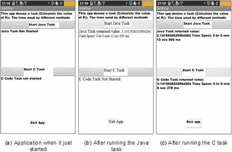

图 12-16。

Original version of `NdkExp`

图 12-16(a) 显示了应用的主界面，包括三个按钮:启动 Java 任务、启动 C 任务、退出应用。单击 Start Java Task 按钮启动一个计算π的传统 Java 任务。当任务完成后，按钮下方会显示计算的结果以及花费的时间，如图 12-16(b) 所示。单击 Start C Task 按钮启动用 C 编写的计算任务，使用相同的数学公式计算π。当任务完成后，按钮下方会显示计算的结果以及花费的时间，如图 12-16(c) 所示。

同样的任务，用传统 Java 编写的应用需要 12.565 秒才能完成；用 C 语言编写并由 NDK 开发工具编译的应用只需 6.378 秒即可完成。这个例子向您展示了使用 NDK 实现性能优化的强大功能。

该示例实现如下:

1.  修改类源代码文件`MainActivity.java`的主布局，如下所示:

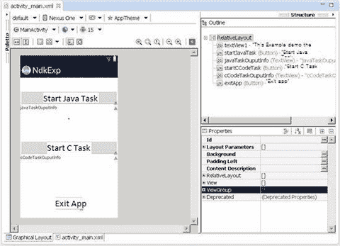

图 12-17。

Layout of the original `NdkExp`

1.  在 Eclipse 中生成项目，命名为`NdkExp`，选择 Build SDK 选项，支持 x86 版本的 API。对其他选项使用默认值。然后生成项目。
2.  修改主布局文件。在布局中放置三个`TextView`微件和三个`Button`微件，设置`Text`和`ID`属性，调整大小和位置，如图 12-17 所示。

`1.  package com.example.ndkexp;`

`2.  import android.os.Bundle;`

`3.  import android.app.Activity;`

`4.  import android.view.Menu;`

`5.  import android.widget.Button;`

`6.  import android.view.View;`

`7.  import android.view.View.OnClickListener;`

`8.  import android.os.Process;`

`9.  import android.widget.TextView;`

`10\. import android.os.Handler;`

`11\. import android.os.Message;`

`12.`

`13\. public class MainActivity extends Activity {`

`14.     private JavaTaskThread javaTaskThread = null;`

`15.     private CCodeTaskThread cCodeTaskThread = null;`

`16.     private TextView tv_JavaTaskOuputInfo;`

`17.     private TextView tv_CCodeTaskOuputInfo;`

`18.     private Handler mHandler;;`

`19.     private long end_time;`

`20.     private long time;`

`21.     private long start_time;`

`22.     @Override`

`23.     public void onCreate(Bundle savedInstanceState) {`

`24.         super.onCreate(savedInstanceState);`

`25.         setContentView(R.layout.activity_main);`

`26.         tv_JavaTaskOuputInfo = (TextView)findViewById(R.id.javaTaskOuputInfo);`

`27.         tv_JavaTaskOuputInfo.setText("Java the task is not started ");`

`28.         tv_CCodeTaskOuputInfo = (TextView)findViewById(R.id.cCodeTaskOuputInfo);`

`29.         tv_CCodeTaskOuputInfo.setText("C  code task is not start ");`

`30.         final Button btn_ExitApp = (Button) findViewById(R.id.exitApp);`

`31.         btn_ExitApp.setOnClickListener(new /*View.*/OnClickListener(){`

`32.             public void onClick(View v) {`

`33.                 exitApp();`

`34.             }`

`35.         });`

`36.         final Button btn_StartJavaTask = (Button) findViewById(R.id.startJavaTask);`

`37.         final Button btn_StartCCodeTask = (Button) findViewById(R.id.startCCodeTask);`

`38.         btn_StartJavaTask.setOnClickListener(new /*View.*/OnClickListener(){`

`39.             public void onClick(View v) {`

`40.                 btn_StartJavaTask.setEnabled(false);`

`41.                 btn_StartCCodeTask.setEnabled(false);`

`42.                 btn_ExitApp.setEnabled(false);`

`43.                 startJavaTask();`

`44.             }`

`45.         });`

`46.         btn_StartCCodeTask.setOnClickListener(new /*View.*/OnClickListener(){`

`47.             public void onClick(View v) {`

`48.                 btn_StartJavaTask.setEnabled(false);`

`49.                 btn_StartCCodeTask.setEnabled(false);`

`50.                 btn_ExitApp.setEnabled(false);`

`51.                 startCCodeTask();`

`52.             }`

`53.         });`

`54.         mHandler = new Handler() {`

`55.             public void handleMessage(Message msg) {`

`56.             String s;`

`57.                switch (msg.what)`

`58.                {`

`59.                case JavaTaskThread.MSG_FINISHED:`

`60.                     end_time = System.currentTimeMillis();`

`61.                     time = end_time - start_time;`

`62.                     s = " The return value of the Java task "+ (Double)(msg.obj) +"  Time consumed:"`

`63.                          + JavaTaskThread.msTimeToDatetime(time);`

`64.                     tv_JavaTaskOuputInfo.setText(s);`

`65.                     btn_StartCCodeTask.setEnabled(true);`

`66.                     btn_ExitApp.setEnabled(true);`

`67.                   break;`

`68.                 case CCodeTaskThread.MSG_FINISHED:`

`69.                     end_time = System.currentTimeMillis();`

`70.                     time = end_time - start_time;`

`71.                     s = " The return value of the C code task"+ (Double)(msg.obj) +"  time consumed:"`

`72.                          + JavaTaskThread.msTimeToDatetime(time);`

`73.                     tv_CCodeTaskOuputInfo.setText(s);`

`74.                     btn_StartJavaTask.setEnabled(true);`

`75.                     btn_ExitApp.setEnabled(true);`

`76.                   break;`

`77.                 default:`

`78.                   break;`

`79.                 }`

`80.             }`

`81.         };`

`82.     }`

`83.`

`84.     @Override`

`85.     public boolean onCreateOptionsMenu(Menu menu) {`

`86.        getMenuInflater().inflate(R.menu.activity_main, menu);`

`87.        return true;`

`88.     }`

`89.`

`90.     private void startJavaTask() {`

`91.         if (javaTaskThread == null)`

`92.             javaTaskThread = new JavaTaskThread(mHandler);`

`93.         if (! javaTaskThread.isAlive())`

`94.         {`

`95.                start_time = System.currentTimeMillis();`

`96.                javaTaskThread.start();`

`97.                tv_JavaTaskOuputInfo.setText("The Java task is running...");`

`98.         }`

`99.     }`

`100.`

`101.     private void startCCodeTask() {`

`102.         if (cCodeTaskThread == null)`

`103.             cCodeTaskThread = new CCodeTaskThread(mHandler);`

`104.         if (! cCodeTaskThread.isAlive())`

`105.         {`

`106.                start_time = System.currentTimeMillis();`

`107.                cCodeTaskThread.start();`

`108.                tv_CCodeTaskOuputInfo.setText("C code task is running...");`

`109.         }`

`110.     }`

`111.     private void exitApp() {`

`112.         try {`

`113.             if (javaTaskThread !=null)`

`114.             {`

`115.                 javaTaskThread.join();`

`116.                 javaTaskThread = null;`

`117.             }`

`118.         } catch (InterruptedException e) {`

`119.         }`

`120.         try {`

`121.             if (cCodeTaskThread  !=null)`

`122.             {`

`123.                 cCodeTaskThread.join();`

`124.                 cCodeTaskThread = null;`

`125.             }`

`126.         } catch (InterruptedException e) {`

`127.         }`

`128.         finish();`

`129.         Process.killProcess(Process.myPid());`

`130.     }`

`131.`

`132.     static {`

`133.         System.loadLibrary("ndkexp_extern_lib");`

`134.     }`

`135\. }`

这段代码与`SerialPi`的示例代码基本相同。只有第 123–134 行中的代码是 ew。这段代码要求在应用运行之前加载`libndkexp_extern_lib.so`共享库文件。应用需要使用这个库中的本地函数。

1.  项目中新的线程任务类`JavaTaskThread`用于计算π。代码类似于`SerialPi`示例中的`MyTaskThread`类代码，此处省略。
2.  新项目中的线程任务类`CCodeTaskThread`调用本地函数计算π；其源代码文件`CCodeTaskThread.java`如下所示:

`1.  package com.example.ndkexp;`

`2.  import android.os.Handler;`

`3.  import android.os.Message;`

`4.  public class CCodeTaskThread extends Thread {`

`5.     private Handler mainHandler;`

`6.     public static final int MSG_FINISHED = 2;  // The message after the end of the task`

`7.     private native double cCodeTask();   // Calling external C functions to accomplish computing tasks`

`8.     static String msTimeToDatetime(long msnum){`

`9.         long hh,mm,ss,ms, tt= msnum;`

`10.        ms = tt % 1000; tt = tt / 1000;`

`11.        ss = tt % 60; tt = tt / 60;`

`12.        mm = tt % 60; tt = tt / 60;`

`13.        hh = tt % 60;`

`14.        String s = "" + hh +" Hour "+mm+" Minute "+ss + " Second " + ms +" Millisecond ";`

`15.        return s;`

`16.    }`

`17.    @Override`

`18.    public void run()`

`19.    {`

`20.        double pi = cCodeTask();   // Calling external C function to complete the calculation`

`21.        Message msg = new Message();`

`22.        msg.what = MSG_FINISHED;`

`23.        Double dPi = Double.valueOf(pi);`

`24.        msg.obj = dPi;`

`25.        mainHandler.sendMessage(msg);`

`26.    }`

`27.    public CCodeTaskThread(Handler mh)`

`28.    {`

`29.        super();`

`30.        mainHandler = mh;`

`31.    }`

`32\. }`

这段代码类似于`SerialPi`示例的`MyTaskThread`类的代码框架。主要区别在第 20 行。原来计算π的 Java 代码被替换为调用一个本地函数`cCodeTask`来完成任务。为了表明`cCodeTask`是一个局部函数，您在第 7 行添加了`local`声明。

1.  在 Eclipse 中构建项目。还是那句话，只是建造，而不是运行。
2.  在项目根目录下创建`jni`子目录。
3.  编写`cCodeTask`函数的 C 实现代码。
4.  将文件编译成一个`.so`库文件。主要步骤如下。
    1.  创建一个 C 接口文件。因为是使用局部函数的`cCodeTaskThread`类，所以需要根据这个类的类文件生成类头文件。在命令行中，转到项目目录并运行以下命令: 

`E:\temp\Android Dev\workspace\NdkExp> javah -classpath "D:\Android\android-sdk\platforms\android-15\android.jar";bin/classes com.example.ndkexp.CCodeTaskThread`

该命令在项目目录中生成一个名为`com_example_ndkexp_CCodeTaskThread.h`的文件。文件的主要内容如下:

`......`

`23\. JNIEXPORT jdouble JNICALL Java_com_example_ndkexp_CCodeTaskThread_cCodeTask`

`24\. (JNIEnv *, jobject);`

`......`

在第 23–24 行，定义了本地函数`cCodeTask`的原型。

1.  基于这些头文件，在项目的`jni`目录下创建一个对应的 C 代码文件。在这种情况下，将其命名为`mycomputetask.c`,如下所示:

`1.  #include <jni.h>`

`2.  jdouble Java_com_example_ndkexp_CCodeTaskThread_cCodeTask (JNIEnv* env, jobject thiz )`

`3.  {`

`4.      const long num_steps = 100000000;    // The total step length`

`5.      const double step = 1.0 / num_steps;`

`6.      double x, sum = 0.0;`

`7.      long i;`

`8.      double pi = 0;`

`9.`

`10.     for (i=0; i< num_steps; i++){`

`11.         x = (i+0.5)*step;`

`11.         sum = sum + 4.0/(1.0 + x*x);`

`12.     }`

`13.     pi = step * sum;`

`14.`

`15.     return (pi);`

`16\. }`

第 4–16 行是函数的主体——计算π的代码，它是对应于`SerialPi`中的`MyTaskThread`类的代码。不难理解。注意，在第 4 行，变量`num_steps`(总步长)的值必须与`JavaTaskThread`类表示的步长值相同。否则，在这里比较性能是没有意义的。

每个 Jni 文件的第一行必须包含头。第 2 行是`cCodeTask`函数原型，基于上一步中获得的稍加修改的头文件。

第 16 行返回结果。对于对应于 C `jdouble`类型的 Java `double`类型，C 可以有一个直接返回给它的`double`类型的`pi`变量。这将在本章的导言中讨论。

1.  在项目`jni`目录下，按照本章第 12 页的方法部分:使用命令行方法生成库文件，创建`Android.mk`和`Application.mk`文件。`Android.mk`的内容如下:

`1.  LOCAL_PATH := $(call my-dir)`

`2.  include $(CLEAR_VARS)`

`3.  LOCAL_MODULE        := ndkexp_extern_lib`

`4.  LOCAL_SRC_FILES     := mycomputetask.c`

`5.  include $(BUILD_SHARED_LIBRARY)`

第 4 行指定了案例文件中的 C 代码。第 3 行表示生成的库的文件名；其名称必须与项目文件`MainActivity.java`第 133 行`System.loadLibrary`函数的参数一致。

1.  根据本章第 12 页“使用命令行方法生成库文件”一节所述的方法，将 C 代码编译到项目的`lib`目录下的`.so`库文件中。
2.  运行项目。

应用的运行界面如下图 12-18 所示。

### 扩展编译器优化

该示例展示了 NDK 在应用加速方面的能力。但是，应用只实现了一个局部函数，并且不能提供信息来比较编译器优化的效果。为此，在本节中，您将重新构建应用，并使用它来试验编译器优化的效果；参见图 12-18 。

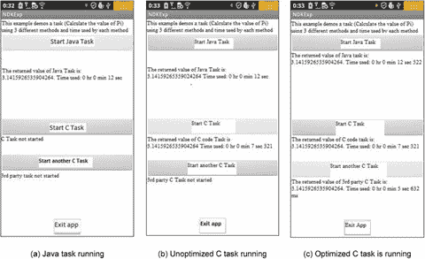

图 12-18。

Extended version of `NdkExp`

该应用有四个按钮。当您单击“启动 Java 任务”按钮时，响应代码不会改变。当您单击“启动 C 任务”或“启动另一个 C 任务”按钮时，应用会启动一个正在运行的本地函数。

两个函数的代码(函数体)是一样的。它计算π的值，但是使用不同的名称。第一个按钮调用`cCodeTask`函数，第二个按钮调用函数。这些函数分别位于`mycomputetask.c`和`anothertask.c`文件中，编译后对应库文件`libndkexp_extern_lib.so`和`libndkexp_another_lib.so`。在这种情况下，使用`-O0`选项编译`libndkexp_extern_lib.so`,使用`-O3`选项编译`libndkexp_another_lib.so`,因此一个编译为非优化，另一个编译为优化。

点击开始 C 任务运行未优化版本的 C 函数，如图 12-20(b)；点击启动另一个 C 任务运行优化后的版本，如图 12-20(c) 所示。任务执行后，系统显示消耗时间的计算结果。

如图 12-18 所示，无论是否使用编译器优化，本地函数的运行时间总是比 Java 函数的运行时间(12.522 秒)短。`-O3`优化函数的执行时间(5.632 秒)小于未优化(`-O0`编译器选项)函数的执行时间(7.321 秒)。从这个结果比较中，您可以看到使用编译器优化实际上减少了应用的执行时间。不仅如此，它甚至比 C/C++:原应用加速中的原应用运行时间(6.378 秒)还要短。这是因为没有编译器选项的原始应用默认为`-O1`优化级别，而`-O3`优化级别甚至比原始应用更高，因此它的运行时间最短也就不足为奇了。

该应用是原始应用`NdkExp`的修改和扩展版本。步骤如下:

1.  修改主布局的类源代码文件`MainActivity.java`。主要变化如下:

图 12-19。

Extended `NdkExp` layout

1.  修改主布局文件。在布局中添加`TextView`小部件和`Button`小部件。设置`Text`和`ID`属性，调整其大小和位置，如图 12-19 所示。

`...`

`13.  public class MainActivity extends Activity {`

`14.      private JavaTaskThread javaTaskThread = null;`

`15.      private CCodeTaskThread cCodeTaskThread = null;`

`16.      private AnotherCCodeTaskThread anotherCCodeTaskThread = null;`

`17.      private TextView tv_JavaTaskOuputInfo;`

`18.      private TextView tv_CCodeTaskOuputInfo;`

`19.      private TextView tv_AnotherCCodeTaskOuputInfo;`

`......`

`182.     static {`

`183.         System.loadLibrary("ndkexp_extern_lib");`

`184.         System.loadLibrary("ndkexp_another_lib");`

`185.     }`

`186\. }`

分别在第 16 行和第 19 行，为新的 Start Other C Task 按钮添加所需的变量。

关键的变化在第 184 行；这里，除了加载原始的共享库文件之外，还添加了另一个库文件。

1.  在项目中，添加一个调用本地函数计算π的线程任务类`AnotherCCodeTaskThread`。其源代码文件`AnotherCCodeTaskThread.java`如下所示:

`1.  package com.example.ndkexp;`

`2.  import android.os.Handler;`

`3.  import android.os.Message;`

`4.  public class AnotherCCodeTaskThread extends Thread {`

`5.      private Handler mainHandler;`

`6.      public static final int MSG_FINISHED = 3;`

`// The message after the end of the task`

`7.      private native double anotherCCodeTask();`

`// Calling external C functions to complete computing tasks`

`8.      static String msTimeToDatetime(long msnum){`

`9.          long hh,mm,ss,ms, tt= msnum;`

`10.         ms = tt % 1000; tt = tt / 1000;`

`11.         ss = tt % 60; tt = tt / 60;`

`12.         mm = tt % 60; tt = tt / 60;`

`13.         hh = tt % 60;`

`14.         String s = "" + hh +"Hour "+mm+"Minute "+ss + "Second " + ms +"Millisecond";`

`15.         return s;`

`16.     }`

`17.     @Override`

`18.     public void run()`

`19.     {`

`20.         double pi = anotherCCodeTask();  // Calling external C function to complete the calculation`

`21.         Message msg = new Message();`

`22.         msg.what = MSG_FINISHED;`

`23.         Double dPi = Double.valueOf(pi);`

`24.         msg.obj = dPi;`

`25.         mainHandler.sendMessage(msg);`

`26.     }`

`27.     public CCodeTaskThread(Handler mh)`

`28.     {`

`29.         super();`

`30.         mainHandler = mh;`

`31.     }`

`32\. }`

这段代码和`CCodeTaskThread`类的代码几乎一模一样。它通过调用另一个外部 C 函数`anotherCCodeTask`来完成第 20 行的计算任务，做了一点处理。为此，在第 7 行中，它为本地函数提供了适当的指令，并在第 6 行中更改了消息类型的值。这样就用一个消息把自己和之前的 C 区分开了。第 4 行显示了从`Thread`类继承的任务类。

1.  在 Eclipse 中构建项目:只是构建，而不是运行。
2.  修改`mycomputetask.c`的 makefile 文件，重建库文件。为此，首先修改项目的`jni`目录下的`Android.mk`文件，如下所示:

`1.  LOCAL_PATH      := $(call my-dir)`

`2.  include $(CLEAR_VARS)`

`3.  LOCAL_MODULE    := ndkexp_extern_lib`

`4.  LOCAL_SRC_FILES := mycomputetask.c`

`5.  LOCAL_CFLAGS    := -O0`

`6.  include $(BUILD_SHARED_LIBRARY)`

与原来的应用不同，在第 5 行中，您为传递给`gcc`的命令`LOCAL_CFLAGS`添加了参数。值`-O0`表示没有优化。

1.  将 C 代码文件编译成项目的`lib`目录下的`.so`库文件。
2.  将项目的`lib`目录中的`.so`库文件(在本例中，该文件为`libndkexp_extern_lib.so`)保存到其他目录中，因为下面的操作将删除这个`.so`库文件。
3.  编写`anotherCCodeTask`函数的 C 实现代码。复制上一节中`cCodeTask`功能的处理步骤。使用“NDK 示例”一节中的方法，将文件编译成`.so`库文件。主要步骤如下:`E:\temp\Android Dev\workspace\NdkExp> javah -classpath "D:\Android\android-sdk\platforms\android-15\android.jar";bin/classes com.example.ndkexp.AnotherCCodeTaskThread`该命令生成一个`com_example_ndkexp_AnotherCCodeTaskThread.h`文件。文件主要内容如下:`......` `23\. JNIEXPORT jdouble JNICALL Java_com_example_ndkexp_AnotherCCodeTaskThread_anotherCCodeTask` `24.   (JNIEnv *, jobject);` `......`第 23–24 行定义局部函数，是原型。`1.  #include <jni.h>``2.  jdouble Java_com_example_ndkexp_AnotherCCodeTaskThread_anotherCCodeTask (JNIEnv* env,  jobject thiz )``3.  {``......``17\. }``mycomputetask.c`的第二行被替换为`anotherCCodeTask`函数的原型。这是从上一步创建的`.h`文件中复制的同一个函数原型，有微小的修改。最终形式在第 2 行。`1.  LOCAL_PATH      := $(call my-dir)` `2.  include $(CLEAR_VARS)` `3.  LOCAL_MODULE    := ndkexp_another_lib` `4.  LOCAL_SRC_FILES := anothertask.c` `5.  LOCAL_CFLAGS    := -O3` `6.  include $(BUILD_SHARED_LIBRARY)`第 4 行，该值被替换为新的 C 代码文件`anothertask.c`。在第 3 行，该值被替换为一个与`System.loadLibrary`函数的参数一致的新库文件名，该文件名在`MainActivity.java`文件的第 184 行。在第 5 行，传递的`gcc`命令的`LOCAL_CFLAGS`参数值被替换为`-O3`，这代表了最高级别的优化。
    1.  创建一个 C 接口文件。在命令行中，转到项目目录，然后运行以下命令:
    1.  基于前面提到的项目`Jni`目录下的头文件，建立相应的 C 代码文件，这里是`anothertask.c`。内容是对`mycomputetask.c`的修改:
    1.  修改`jni`目录中的`Android.mk`文件，如下所示:
    1.  按照 3.1 节描述的方法，将 C 代码文件编译成项目的`lib`目录下的`.so`库文件。`lib`目录下的`libndkexp_extern_lib.so`文件消失，取而代之的是新生成的`libndkexp_another_lib.so`文件。所以，保存库文件是非常重要的。 
4.  将之前保存的`libndkexp_extern_lib.so`库文件放回`libs`目录。现在目录中有两个文件。您可以使用`dir`命令来验证:

`E:\temp\Android Dev\workspace\NdkExp>dir libs\x86`

`2013-02-28  00:31     5,208 libndkexp_another_lib.so`

`2013-02-28  00:23     5,208 libndkexp_extern_lib.so`

1.  运行项目。

### 比较编译器优化

通过这个案例研究，您已经了解了编译器优化的效果。任务执行时间从优化前的 7.321 秒缩短到优化后的 5.632 秒。但是您只比较了示例中的`gcc -O3`和`-O0`命令选项之间的区别。在编译`mycomputetask.c`和`anothertask.c`两个文件时，可以通过修改`Android.mk`文件内容来扩展这种配置，比较使用不同编译器命令选项时优化效果的差异。修改`Android.mk`文件，只需要修改`LOCAL_CFLAGS`项的值即可；您可以选择许多`gcc`命令选项进行比较。让我们看一个例子。

#### 例 1。使用 SSE 指令比较优化结果

编译`mycomputetask.c`的`Android.mk`文件对应的启动 C 任务按钮:

`LOCAL_CFLAGS := -mno-sse`

并编译`anothertask.c`的`Android.mk`文件对应的启动其他 C 任务按钮:

`LOCAL_CFLAGS := -msse3`

前者告诉编译器不要编译 SSE 指令；后者允许编译器编程为 SSE3 指令。选择 SSE3 指令的原因是 SSE3 是英特尔凌动处理器支持的最高级别的指令。

运行应用的结果如图 12-20 所示。

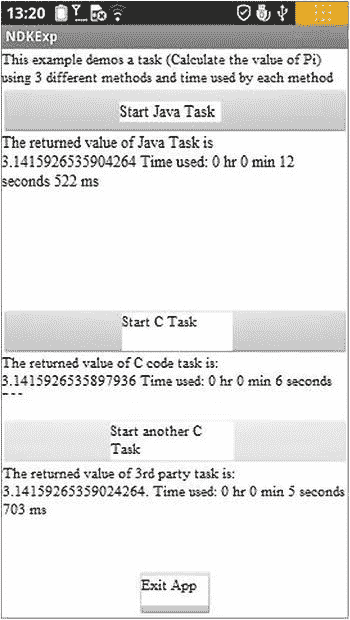

图 12-20。

Optimization comparison of compiler SSE instructions for NdkExp

使用 SSE 指令的相同任务比不使用 SSE 指令的执行时间更短。执行时间从原来的 6.759 秒缩短到 5.703 秒。

注意，在这个例子中，我们完成了修改`Android.mk`并重新运行`ndk-build`来生成`.so`库文件。我们立即部署并运行了`NdkExp`项目，但是发现我们无法达到预期的效果，因为只有`.so`库文件被更新。Eclipse 项目管理器没有检测到项目需要重新构建。结果，`.apk`没有更新，目标机器上的`NdkExp`不会运行更新或原始代码。考虑到这种情况，您可以使用以下方法来避免此问题:

1.  从手机上卸载应用。
2.  删除宿主项目目录的`bin`子目录中的`classes.dex`、`jarlist.cache`、`NdkExp.apk`三个文件。
3.  在 Eclipse 中删除项目。
4.  在 Eclipse 中，重新导入项目。
5.  重新部署并运行项目。

这里你只比较了 SSE 指令的效果。你可以尝试其他的`gcc`编译器选项，比较它们的运行结果。

此外，前面的例子只涉及 NDK 效应，所以 C 函数仍然使用单线程代码。你可以把本章的 NDK 优化知识和上一章的多线程优化结合起来，把 C 函数改成多线程，和编译器优化一起实现。各种应用中的这一组编写的优化技术将允许应用运行得更快。

## 摘要

本章介绍了用于 C/C++ 应用开发的 Android NDK，以及相关的优化方法和优化工具。英特尔移动硬件和软件为低功耗设计奠定了基础。英特尔凌动处理器为低功耗提供了硬件支持，这是 Android 操作系统的一大特色。

下一章概述低功耗设计。还讨论了 Android 电源控制机制以及如何实现低功耗应用设计的目标。

 Open Access This chapter is licensed under the terms of the Creative Commons Attribution-NonCommercial-NoDerivatives 4.0 International License ( [ http://​creativecommons.​org/​licenses/​by-nc-nd/​4.​0/​ ](http://creativecommons.org/licenses/by-nc-nd/4.0/) ), which permits any noncommercial use, sharing, distribution and reproduction in any medium or format, as long as you give appropriate credit to the original author(s) and the source, provide a link to the Creative Commons licence and indicate if you modified the licensed material. You do not have permission under this licence to share adapted material derived from this chapter or parts of it. The images or other third party material in this chapter are included in the chapter’s Creative Commons licence, unless indicated otherwise in a credit line to the material. If material is not included in the chapter’s Creative Commons licence and your intended use is not permitted by statutory regulation or exceeds the permitted use, you will need to obtain permission directly from the copyright holder.