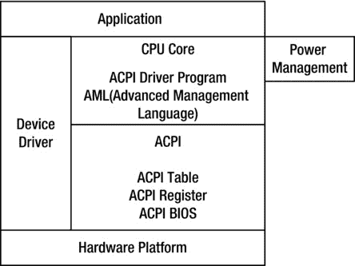
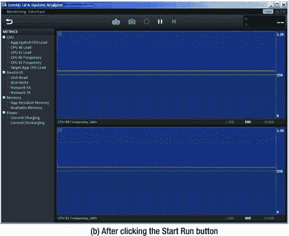

# 十三、Android 应用和英特尔图形性能分析器（GPA）的低功耗设计：辅助功耗优化

Keywords Power Consumption Polling Code Idle State Reduce Power Consumption Standby Mode

与使用交流电源的通用计算机不同，并非所有移动设备都可以直接连接到交流电源；不能假定电力供应是用之不竭的。此外，移动设备必须考虑散热问题。如果功耗太高，就需要系统增加散热，在某些时候可能会达到不允许的程度。由于对系统总功耗的严格限制，通常称为省电的低功耗设计是移动设备应用的重要元素；在许多情况下，这是一个硬性要求或生存的基础。例如，很难想象市场会接受只能支持几个小时的手机。

另一方面，英特尔移动硬件和软件为低功耗设计提供了基础。英特尔凌动处理器提供低功耗的硬件支持，低功耗支持是 Android 的一大特色。两者都为移动应用的低功耗设计提供了良好的平台。

本章组织如下:首先是低功耗设计的概述和介绍，然后讨论 Android 电源控制机制，最后讨论如何实现低功耗应用设计的目标。

## 低功耗设计概述

让我们看看移动系统的功耗特性。对于移动设备来说，处理器、无线电通信和屏幕是其功耗(功率)的三个主要组成部分。处理器及其辅助设备负责大部分电池功耗。因此，本章重点讨论处理器及其辅助设备的功耗(这里简称为处理器功耗)。

### 消费的基础

电池寿命主要是指笔记本电脑、MP3 播放器或手机等移动设备在没有外部电源适配器的情况下，仅配备自己的电池可以维持的运行时间。一般来说，影响机器电池寿命的因素包括电池本身以及机器功耗(瓦特/小时)。

对于半导体产品来说，数字电路的功耗由两部分组成。第一部分是，从集成电路工艺的角度来看，是漏电流(漏电流)引起的功耗，是电子电路(如 CMOS)的一部分。控制这种功耗的能力主要取决于生产工艺和所用的材料。数字电路功耗的第二部分是。影响这部分的因素很多，比如电路设计、电路复杂度、工作时钟频率等。

处理器(或 CPU)的动态功率，也称为开关功率，称为功耗，由以下经验公式确定:

在该公式中，P 是处理器功耗，a 是与电路相关的调整参数，C 是单个时钟周期的总栅极电容(对于处理器是固定的)，F 是处理器工作频率，V 是工作电压。如您所见，处理器的功耗与工作电压的平方成正比，与工作频率成正比。

Tip

关于处理器功耗，有一个相关的概念叫做。TDP 容易和 CPU 功耗混淆。虽然两者都是用来衡量处理器功耗的指标，都使用瓦特(W)作为单位，但 TDP 与处理器功耗的含义不同。

TDP 是处理器散热指示器的反映。根据定义，它是处理器达到最大负载时释放的热量。处理器 TDP 功耗不是处理器的真实功耗。处理器功耗(power)是一个物理参数，它等于流过处理器内核的电流值与处理器内核的电压值的乘积，它反映了单位时间内能量的实际功耗。TDP 是处理器的电流热效应和其他形式的散热产生的热量。显然，处理器 TDP 小于处理器的功耗。

TDP 冷却系统要求是硬件设计者和制造商要考虑的一个重要因素。但本章讨论的是实际的电能消耗——处理器功耗——而不是 TDP。

根据处理器功耗公式，调整参数 a 和总栅极电容 C 由处理器设计和材料决定。对于处理器，参数 a 和 C 是固定的；想要降低功耗，必须从工作频率(F)和工作电压(V)入手，这是很多低功耗技术的出发点。

一般来说，实现 CMOS 处理器更高能效的方法如下:

1.  降低电压或处理器时钟频率。
2.  在内部禁用一些不需要功能部件的当前正在执行的功能。
3.  允许部分处理器与主电源完全断开，以消除漏电。
4.  改进处理器电路设计和制造工艺；运用物理学原理获得能源效率。

管理处理器功率(功耗)有两种策略。一是使用静态电源管理机制。这种机制由用户调用，并且不依赖于处理器活动。静态机制的一个例子是省电模式以节省功率。省电模式可以通过一条指令进入，也可以通过接收中断或其他事件退出。

管理处理能力的另一个策略是使用动态电源管理机制。这种机制基于处理器功耗控制的动态活动。例如，当运行命令时，如果处理器逻辑的某些部分不需要运行，则处理器可以关闭这些特定部分。

### 功耗控制技术

为了帮助您了解半导体(包括处理器)的功耗基础知识，我们来看看如何在硬件中实现功耗控制技术。这些途径将在以下章节中讨论。

#### 动态电压/频率调节技术

是一种控制功耗的方法，通过调整(降低)处理器的工作频率，使其运行频率低于峰值频率，从而降低处理器功耗。这项技术最早用于笔记本电脑，现在越来越广泛地用于移动设备。

除了在处理器上节能，DFS 技术还有其他用途。它可用于机器上安静的计算环境或轻负载条件下，以降低冷却成本和总体能源需求。当系统冷却不足且温度接近临界值时，该技术有助于减少热量积聚，从而防止机器出现严重的温度问题。许多超频系统也使用这种技术来实现临时补充冷却。

Tip

与 DFS 技术相反但相关的是超频。该技术升级处理器(动态)能力，使其超过制造商规定的设计限制，并提高处理器性能。DFS 和超频之间有一个重要的区别:在现代计算机系统中，超频是在前端总线中(主要是因为倍数通常被锁定)，而 DFS 是在乘法器中完成的。而且超频往往是静态的；DFS 通常是动态的。

实际上，高级配置和电源接口(ACPI)规定现代处理器的 C0 工作状态可以分为命名的性能状态(P 状态)和节流状态(T 状态)。P 状态允许您降低时钟频率，T 状态通过插入 STPCLK(停止时钟)信号来暂时关闭时钟信号，并进一步抑制处理器功耗(但不是实际的时钟频率)。英特尔还与谷歌合作改善 Android 的电源管理，并为三种 CPU 待机状态创建了驱动程序:活动待机(S0i1)、永远在线永远连接(AOAC)待机(S0i2)和深度睡眠待机(S0i3)。

如上所述，功耗主要是由于静态功率的存在而由漏电流引起的；动态功耗只是芯片总功耗的一部分。当芯片尺寸变小时，CMOS 阈值水平降低，漏电流的影响显得更加明显。特别是对于当前的芯片制造工艺，其处于微米级以下，动态功率仅为芯片总功率的大约三分之二，这限制了频率缩放的效果。

(DVS)是控制处理器功耗的另一种方法。这是通过调整(降低)处理器的工作电压来降低处理器功率来实现的。

DFS 仅仅作为一种节省动态功率的方法并没有太大的价值。考虑到 V 2 在动态功耗公式中的重要作用，以及在 DFS 中已经对现代处理器的低功耗空闲状态进行了深入优化，以节省大量功耗，您需要考虑 DVS。降低处理器时钟频率还提供了降压空间(因为在一定范围内，处理器所能支持的最大工作频率随着处理器电源电压的增加而增加)。电压调整和频率调整可以结合使用，形成一种全面的功率控制方法:动态电压/频率放电减少，或。这项技术也被称为英特尔处理器 CPU 节流。

动态电压/频率调整技术会影响性能。这种技术减少了处理器在给定时间发出的指令数量，从而导致处理性能(速度)下降。因此，它通常用在处理器负载较低的情况下(比如当系统运行在空闲状态时)。

#### 时钟门控

是实现节能的另一种方式，在这种情况下，通过关闭和打开模块时钟和电源控制。这项技术应用于第一个应用系列，如类似 OMAP3 的传统电话芯片；英特尔奔腾 4 处理器也使用了它。

对于 CMOS 处理器部件，改变电平状态所消耗的功率远大于维持电平状态所消耗的功率，因为改变电平状态时时钟信号极其频繁。如果在当前时钟周期中使用时钟门控技术，如果系统不使用某些逻辑模块，则模块时钟信号被切断，在模块中创建闭合电路，因此逻辑开关不会改变状态。您只需要在开关功耗接近于零时保留漏电流，以降低功耗。当有工作要做时，模块时钟被重新激活。这个过程也被称为修剪时钟树。在某种意义上，时钟门控是变频时钟的一个极端情况，但这两个值是零和最大频率。

这种技术要求每个模块(称为功能单元块(FUB))都包含时钟门逻辑电路。也就是说，限幅时钟树的技术必须由附加的逻辑元件来保证。

时钟门控有几种形式。通过软件手动时钟门控方法，驱动器控制何时开启或关闭指定空闲控制器使用的各种时钟。另一种方法是自动时钟门控:硬件可以被通知或检测是否有工作要做，然后在您指定不再需要时钟时关闭门控。例如，内部桥或总线可以使用自动时钟门控方法，以便它总是被关闭，直到处理器或 DMA 引擎需要使用它。如果软件不使用总线上的外围设备，驱动程序可以在门控代码中关闭它们。

#### 节能电路设计和制造流程

芯片电路设计选择和制造工艺可以在物理层面上提高节能。其中一个设计选择是使用超低电压(ULV)处理器。ULV 系列处理器降低了处理器内核电压，减少了处理器内核数量甚至尺寸，实现了从硬件(在物理层)上的功耗控制。

此外，与 ULV 处理器类似，45 纳米制造工艺在硬件层面降低了处理器功耗。该芯片功耗更低，电池寿命更长，晶体管更多，体积更小。英特尔凌动 Bay Trail 处理器采用 22 纳米制造工艺实现节能技术(下一代处理器将采用 14 纳米技术)。随着制造工艺和制造精度的进一步提高，芯片越来越小，同时物理功耗也越来越低。

了解了硬件电源控制之后，您可以看看系统电源控制技术。这些技术有些是硬件级的，有些是操作系统级的，有些是系统级的，包括软件和硬件。

#### 英特尔 SpeedStep 和增强型英特尔 SpeedStep 技术

英特尔 SpeedStep 技术旨在为英特尔 CPU 提供电源控制；该技术现在通常被称为增强型英特尔 SpeedStep 技术(EIST)。它首先用于英特尔奔腾 M、奔腾 4 6xx 系列和奔腾 D 处理器。英特尔酷睿、英特尔凌动和其他处理器系列也采用了它。EIST 主要利用动态电压和频率缩放；基本原理是调整处理器电压和频率，以降低功耗和热量。当然，随着电压和频率的降低，处理速度也随之降低。这项技术已经经历了几代的发展，如下所述。

##### 第一代英特尔 SpeedStep 技术

独创的英特尔 SpeedStep 技术允许处理器在两种操作模式之间自由切换:交流状态，提供最高性能模式(最大性能模式)；和电池状态(电池优化模式)。这两种模式是根据电脑的电源自动选择的:外接电源或电池。最高性能模式是计算机连接到交流电源(即始终由外部电源供电)时的近似性能。当计算机使用最小的电池电量来实现最佳性能时，使用电池优化模式。通常，当使用英特尔 SpeedStep 技术切换模式时，处理器的功耗会降低 40%，同时仍能保持 80%的峰值性能。

模式切换的转换速度非常快——只有 1/2000 秒，所以用户感觉不到转换。即使一个程序的性能要求很敏感(比如播放 DVD 电影)，这个转换过程也不会影响程序运行。此外，用户可以设置自己的模式，在最高性能模式下使用电池，或在电池优化模式下使用外部电源。为此，用户在屏幕上选择一种模式，而不必重启计算机。

##### 第二代英特尔 SpeedStep 技术(EIST)

EIST 根据处理器负载实时在电压和频率两种性能模式之间进行动态切换。使用这种技术，电池供电的处理器负载会自动切换到最大工作频率和电压。它还可以根据外部电源中的处理器负载，自动切换到最低的工作频率和电压。换句话说，工作频率和电压变化的技术处理不再由电源的类型决定。

##### 第三代英特尔 SpeedStep 技术(改进的 EIST)

除了两种基本的操作模式之外，改进的 EIST 还根据处理器当前负载的强度，提供了多种中间模式，并支持多种频率、速度和电压设置(由处理器电压调节机制控制)。它会自动切换操作模式。

EIST 包括许多软件和硬件技术，以确保其顺利运行，包括系统 BIOS、用户终端软件、ASIC 控制和芯片组支持。软件程序本身不需要做任何改动；它可以很容易地使用这种技术。同时，EIST 还需要操作系统来应对，比如它的处理器负载检测，这是通过操作系统来完成的。

#### APM 和 ACPI 标准

为了使移动计算系统的低功耗成为可能，硬件和操作系统需要协同工作。协调操作系统和硬件的功耗和电源管理需要一套统一的接口规范。最早的规范是高级电源管理(APM)，由英特尔和微软发布；它是一组 API，运行在 IBM 兼容的 PC 操作系统和 BIOS synergy 上，用于管理功耗。目前的规范是高级配置和电源接口(ACPI)，它来自于 APM 的发展。

ACPI 是电源管理服务的开放行业标准。它兼容多种操作系统；最初的目标是在个人电脑上使用。ACPI 有电源管理工具和硬件抽象层。操作系统有自己的电源管理模式。它通过 ACPI 向硬件发送需求控制，然后观察硬件状态作为输入，以控制计算机和外围设备的电源。ACPI 在整个计算机系统中的结构如图 13-1 所示。

图 13-1。

ACPI structure

ACPI 支持以下五个基本的全球强国:

*   G3:机械关闭状态；该系统不耗电。
*   G2:软关状态；整个操作系统重新启动，将机器恢复到工作状态。该状态有四个子状态:
*   S1:没有系统上下文；缺失低唤醒延迟状态。
*   S2:丢失低 CPU 和系统缓存状态唤醒延迟状态。
*   S3:除了主内存，其他所有系统状态都丢失了；低唤醒延迟状态。
*   S4:低功率睡眠模式；所有设备都已关闭。
*   G1:睡眠状态；系统似乎已关闭；低功率状态。返回正常工作状态所需的时间与低功率状态的功耗成反比。
*   G0:工作状态；该系统完全可用。
*   保留状态:系统不符合 ACPI。

典型的电源管理程序包括一个查看器，用于查看 ACPI 收到的描述系统行为的消息。还包括一个基于观察的决策模型，用于确定电源管理行为。

流行的操作系统和软件平台，如 Windows 和 Android，都支持 ACPI。

#### 低功耗操作系统状态

当任务空闲时(或处于非活动状态)，计算机系统通过进入各种低功率操作模式来实现节能。这些低功率模式有时统称为睡眠模式。它们介于系统完全启动和完全关闭的状态之间，形式多样；每种形式都有自己的特点，以满足用户的各种需求。这些模式将在以下章节中介绍。

##### 备用的

当系统处于待机模式时，它会切断硬件组件的电源，从而降低计算机功耗。待机会切断外围设备、显示器甚至硬盘的电源，但它会保留计算机内存的电源，以确保工作数据不会丢失。

待机模式的主要优点是恢复时间短，系统只需几秒钟就可以恢复到以前的状态。缺点是待机模式需要内存供电，所以内存内容不会保存到文件夹中，因此不会影响内存重载的运行速度。但是，如果在这种模式下发生电源故障，所有未保存的存储内容都将丢失。因此，待机也被称为挂起到 RAM (STR)。

当系统处于待机模式时，硬盘和其他设备处于电源等待状态，直到收到唤醒呼叫。电源、处理器、显卡和其他风扇工作正常，键盘指示灯亮起。您可以按任意键盘键或移动鼠标来唤醒电脑。硬盘重新通电，允许内存、处理器和其他设备交换数据并返回到原始操作模式。

##### 冬眠

当系统处于休眠模式时，操作模式的图像保存到外部存储器，然后关闭计算机。当您打开电源并重新启动时，操作恢复到以前的样子:文件和文档按照您在桌面上留下的样子排列。

休眠模式比待机模式更深入，因此有助于节省更多的电力，但计算机需要更长的时间来重新启动。此外，休眠模式包括更高的安全性。这是因为这种模式不仅会关闭外围设备和硬盘的电源，还会切断 RAM 存储芯片的电源。这种模式也称为磁盘挂起(STD)。

当计算机进入休眠模式时，在关闭电源之前，所有数据都存储(写入)到外部存储器(通常是硬盘)的参考文件中。退出休眠模式后，系统从参考文件中恢复(读取)，数据重新加载到内存中。这样，系统恢复到先前的操作模式。因为休眠模式需要保存存储器数据，所以恢复(唤醒)时间比待机模式长。

这种模式的优点是不消耗电力，因此您不必担心睡眠期间的电力异常。它还可以保存和恢复用户状态，但这需要与物理内存大小相同的硬盘空间。

计算机系统的休眠几乎和正常关机一样安静；可以完全断电，内存数据(运行中)不会因为断电而丢失。相比待机，休眠一般很难用外接设备唤醒；它需要通过正常启动来启动系统。然而，休眠模式在不触发常规启动过程的情况下引导系统:它只需要将硬盘存储器镜像读取到存储器中，因此它比标准引导快得多。

##### 睡眠

睡眠模式结合了待机和休眠的所有优点。系统切换到睡眠状态；系统内存中的所有数据都转储到硬盘上的休眠文件中，然后关闭除内存之外的所有设备电源，以便保留内存中的数据。因此，在睡眠期间恢复电力也不例外；您可以直接从内存中的数据快速恢复。如果有电源异常，睡眠时内存中的数据丢失，也可以从硬盘中恢复数据，只是速度稍慢。在任何情况下，这种模式都不会导致数据丢失。

睡眠模式并不总是持续保持。如果系统进入睡眠模式一段时间而未被唤醒，它可能会自动切换到休眠模式，并关闭存储器的电源，以进一步降低能耗。

实现这些低功耗节能功能需要操作系统支持和硬件支持，例如对 ACPI 的支持。只有结合这些特性，您才能实现所述的节能。当空闲时间(也称为非活动时间)达到指定的长度或电池电量低时，操作系统可以自动将您的计算机系统置于低功耗状态，从而为整个系统节省能源。

## Linux 电源控制机制

Android 是基于 Linux 的。Linux 有很多分析和降低功耗的实用工具，其中一些已经被 Android 采用。以下部分描述了几种类型的 Linux 电源控制和管理，包括该技术及其组件的许多方面。

### 轻松空闲

，有时称为非固定频率或无空循环，是 Android Linux 内核中用于提高其省电能力的技术。

传统的 Linux 内核处理器使用周期性的定时器来记录系统的状态，负载平衡，调度和维护各种处理器定时器事件。早期的计时器频率通常为 100 赫兹。新内核使用 250 赫兹或高达 1000 赫兹。然而，当处理器空闲时，这些周期性定时事件消耗大量功率。Tickless idle 消除了处理器中的这种周期性定时器事件，也与其他定时器的优化有关。

使用 tickless idle 后，Linux 内核是一个空的无周期内核。内核仍然记录时间，但是使用不同的方法。不再经常检查是否有工作要做。当内核知道有工作要做时，它调度硬件发出中断请求。Tickless idle 技术在能效方面还有另一个间接好处:您可以更好地利用虚拟技术，这意味着虚拟化软件不会被不必要地或过于频繁地中断。

Tickless idle 为出色的节能提供了必要的内核基础。然而，它也需要与应用的协作。如果应用没有遵循低功耗设计的原则，编写得很糟糕，或者使用了错误的行为，它可能会很容易地消耗或浪费由 tickless idle 带来的电能节省。

### PowerTOP(超级用户)

PowerTOP 帮助用户找到在计算机空闲时消耗额外功率的应用。它对于高级软件有着更加突出的作用。以下是 PowerTOP 的功能:

*   提供建议，帮助用户更好地利用系统的各种硬件节能功能
*   识别妨碍硬件节能实现最佳性能的罪魁祸首软件模块
*   帮助开发人员测试他们的应用并实现最佳行为
*   提供访问低功率的调整建议

图 13-2 为 PowerTOP 运行截图。

图 13-2。

PowerTOP interface example

英特尔凌动平台上的许多 Linux 系统，如 Ubuntu，都支持 PowerTOP 工具。图 13-2 显示了在 Ubuntu 中运行的 PowerTOP。Android 目前还不支持这个工具(以后 Android 会不会支持还不知道)。然而，英特尔最近在 Android 上提供了功能类似于 PowerTOP 的工具，如下文所述。

## 英特尔电源优化辅助工具

英特尔推出了一些辅助工具来帮助 Android 应用的低功耗设计。这些辅助工具在性能优化、VTune 等方面的作用类似于评测器。借助这些工具，您可以对应用的功耗进行工具辅助优化。换句话说，艾滋病提供指导或咨询。为了实现真正的优化，您必须根据低功耗设计原则重写代码(在下面的章节中描述)。

英特尔开发了面向 Android 的英特尔移动开发套件，供系统或中间件开发人员创建 Android 系统或中间件软件，充分利用英特尔平台提供的最新创新。该套件提供基于 x86(英特尔架构)的平板电脑、旨在为该设备无缝创建软件的开发工具，以及有关操作系统、工具、系统软件、中间件和硬件的技术资料。可以在 [`https://software.intel.com/en-us/intel-mobile-development-kit-for-android`](https://software.intel.com/en-us/intel-mobile-development-kit-for-android) 购买套装。

您还可以使用英特尔图形性能分析器(GPA):由英特尔提供的免费低功耗辅助工具，帮助 Android 应用节省功耗。英特尔 GPA 辅助的速度和性能优化特性已在前一章中介绍。本节强调其在电源优化方面的辅助功能。

与机器功耗相关的指标包括 CPU 频率、充电电流、放电电流等。CPU 频率反映了 CPU 列中处理器的工作频率。正如在“功耗基础”一节中提到的，工作频率直接反映了处理器的动态功耗:频率越高，处理器功耗越高。因此，通过观察 CPU 频率，可以分析应用运行时处理器的(动态)功耗。

分析 CPU 频率时，可以将 CPU 栏 XX 频率指示器项中的 CPU 拖放到显示窗口进行观察。图 13-3 显示了一个示例应用 MoveCircle 分析期间的 CPU 频率。

图 13-3。

Intel GPA CPU frequency analysis

图 13-3 中的纵轴是 CPU 的工作频率；单位是兆赫(MHz)。在本例中，目标机器是一台联想 K800 智能手机，配有一个英特尔凌动处理器、两个逻辑 CPU 和两个显示窗口。如你所见，当应用有计算任务时，CPU 提高频率以迎合计算的需要；当计算任务较轻时，CPU 会降低工作频率以节省电能。

电流充电和电流放电指示器反映了充电和放电条件。与 CPU 频率不同，这些频率反映了机器的整体功耗。当前放电指示放电状态；这是机器耗电的直接反映，是你要观察的直接目标。但是在 Intel GPA 分析过程中，目标机是通过 USB 线连接到主机的，所以主机变成了电源，正在给目标机(手机)充电。因此，在分析整体机器功耗时，您不应该忽略当前的充电指示灯。

在分析整体机器功耗时，您可以将相应的电流充电(上图)和电流放电(下图)索引条目下的功率条拖放到显示窗口中进行观察。图 13-4 显示了使用样本 MoveCircle 应用对机器充电和放电的分析。

 

图 13-4。

Intel GPA machine overall power analysis

图 13-4 中的纵轴是以毫安(mA)为单位的电流。电压不变的情况下，是功耗的直接反映。当没有应用运行时，充电(电流充电)保持状态的自然波动，放电(电流放电)在低状态下几乎为 0，如图 13-4(b) 所示。应用运行时，由于 CPU 动态功耗的增加，放电不再维持 0 状态。同时放电降低了电荷的价值；这在图 13-4(a) 中可见。当用户锁屏时，屏幕可能会黑屏，正在运行的应用也可能会暂停，快速降低 CPU 的动态功耗；这使得放电几乎回到 0 状态，并且电荷上升。这个过程如图 13-4(c) 所示。

正如您在前面的图中所看到的，英特尔凌动处理器和 Android 具有负载感应电源管理功能，它们在动态电源管理方面协同工作。当应用没有运行或正在完成低功耗计算任务时，系统会感知到这种变化，硬件(处理器)控制技术会介入并降低功耗。这通常是通过使用 EIST 降低工作频率/电压来实现的。

## 应用设计中的低功耗考虑

硬件和操作系统为系统的低功耗提供了良好的技术支持，这也可以通过使用适当的管理机制和控制手段来实现。然而，最终的低功耗目标需要应用的密切配合。如果开发的应用没有遵循低功耗设计原则，最终的程序可能不会利用系统的低功耗潜力或浪费功耗，从而抵消硬件和操作系统提供的低功耗技术带来的节能效果。因此，本章强调低功耗要求和原则在应用设计中的重要性。

应用开发中的低功耗设计要求和原则涉及许多技术和方法。让我们检查一下主要的原则和建议。

### 低功耗优化的最基本原则

低功耗优化最基本的原则是尽量减少处理器和各种外设的工作时间。当不需要外设且不需要处理器操作时，降低功耗的最佳方法是将其关闭。

因为处理器在系统总功耗中使用的比例较大，所以处理器的工作时间需要尽可能的短；它应该在空闲模式或省电模式下工作更长时间。这是降低移动系统功耗的软件设计关键。

### 一般建议:高性能=低功耗

在固定电压的大多数情况下，短时间内以峰值速度(高频率)运行并长时间处于深度怠速状态比以中等工作频率长时间运行并处于轻度怠速状态更节能。因此，对于相同的任务，如果您的应用在尽可能短的时间内运行完成，然后进入空闲状态，则比在进入短暂空闲状态之前运行更长时间来完成要消耗更少的电力。

快速算法也可以降低功耗，这符合高性能等于低功耗的建议。

### 尽可能使用低功耗硬件来完成任务

相同的任务可以用不同类型的硬件完成，不同的硬件有不同的功耗开销。当您的应用可以选择不同的硬件来运行相同的任务时，您应该选择低功耗硬件。

一般来说，寄存器访问的能耗是最低的；并且缓存访问的能耗低于主存储器访问的能耗。因此，程序设计应该尽量遵循这些建议:

*   尽可能有效地使用登记册。
*   分析缓存的行为以发现主要的缓存冲突。
*   在存储系统中尽可能使用页面模式访问。

### 轮询是低功耗优化的敌人

等待状态改变或访问外围设备的程序可以使用轮询；这种方法有时被称为快速旋转或旋转代码。轮询允许处理器重复执行一些指令。功耗大致等于繁重的计算任务，它的作用只是等待一个状态的改变；但是等待期不能让处理器进入空闲状态，导致大量的电能浪费。因此，在低功耗设计中，您应该尽量避免使用轮询，而是使用替代方法。例如，你应该使用中断而不是轮询访问外设。在客户机/服务器协作模型中，您应该更改客户机查询服务，让服务器主动向客户机推送服务。对于线程同步，如果需要查询状态变化，应该使用操作系统事件或信号量。

例如，假设线程 2 想要访问一个资源。访问能力由访问控制变量`canGo`决定。线程 1 负责变量`canGo`的开或关访问控制。如果这是通过轮询语句实现的，线程代码可能如下所示:

`volatile boolean canGo = false;            // Shared variables`

`// The code of thread 1                    // The code of thread 2`

`void run()                                 void run()`

`{                                          {`

......

`canGo = true;                               while (!canGo);`

`// Allow thread 2 to access a resource      // Wait canGo Change to true`............`// Access to the resource code`

`}                                           }`

在前面的代码中，Thread 2 `while`语句是典型的轮询；防止进入空闲睡眠状态会消耗大量处理器时间。您可以更改为 Java 等待通知机制来实现相同的功能:

`volatile boolean canGo = false;`

`Object sema;                      // The synchronization lock canGo variable`

`// The code of thread 1           // The code of thread 2`

`void run()                         void run()`

`{                                  {`

`synchronized(sema){                synchronized(sema){`

`canGo = true; // Allow thread 2 to access a resource       while (!canGo)`

`sema.notifyAll()                    sema.wait();`

`}                                  }`

...........`// Access to the resource code`

`}                                  }`

被 wait-notify 代码替换后，线程 2 没有轮询语句的快速旋转:每次循环检查`canGo`变量，如果不满足条件，就进入挂起状态，释放 CPU。因此，CPU 负载不会浪费在线程上。当 CPU 没有其他任务时，负载很快下降到低状态。当检测到处理器的低负载时，系统会采取措施降低功耗。在优化前快速轮换轮询模式无法做到这一点。

### 事件驱动编程

除了实现软件设计方法之外，如果可能，低功率程序应该总是遵循程序设计的事件驱动模型。事件驱动编程意味着程序被设计成响应事件:当事件到来时，应用运行来处理事件；当没有事件到达或事件结束时，程序放弃处理器并进入睡眠状态。这里的事件被称为广义事件，包括用户输入、网络通信事件和进程/线程同步事件。

当使用事件驱动的设计过程时，处理器利用率特别高:程序只在有真正的事情要处理时才运行，在无事可做时才释放处理器。当处理器处于空闲状态时，操作系统和硬件可以及时检测到空闲，并启动操作以降低功耗。

### 减少应用中类似轮询的周期性操作

前面您已经看到轮询操作消耗了不必要的能量。周期性触发或运行操作的不必要编程可能具有类似于轮询的效果，并且不必要地消耗功率。

如前所述，Tickless idle 是遵循这一原则的操作系统内核改进；它从内核中移除周期性定时操作。此外，Linux 应用有许多不必要的周期性触发器或运行操作，例如:

*   鼠标移动，每秒一次。这是屏保中常用的。
*   音量变化，每秒 10 次。这是调音台程序中常用的。
*   下一分钟，每秒一次。这个时钟程序是常用的。
*   USB 读卡器，每秒 10 次。这个守护进程是常用的。
*   其他变化的应用数据和条件:
*   每秒超过 10 次(网络浏览器)
*   每秒 30 次以上(GPS 信号采集应用)
*   每秒超过 200 次(Flash 插件)

这些不必要的触发和操作导致系统从空闲状态唤醒。移植到 Android 上，这样的操作要注意，小心避免或改进；否则，它们很容易抵消节省的功耗。

### 针对数据采集和通信的低功耗建议

在设计通信模块时，尽量提高通信速率。当通信速率提高时，意味着通信时间缩短，高功率通信减少，从而降低总功耗。

同样，在使用 Wi-Fi 通信时，应该使用突发模式传输数据，这样可以缩短通信时间(尤其是发送数据时)。Wi-Fi 设备很容易尽快进入空闲状态。

### 建立节能计划

Android 设备的电源通常在连接外部电源和使用电池电源之间切换。两种功率状态下软件的功率要求完全不同:前者对功率不敏感，但要求大多数时间优先考虑性能；后者对功耗敏感，因此需要在性能和功耗之间取得平衡。因此，应用应该检测电源的类型，并做出调整以适应与电源相关的变化。

此外，一些电源管理因素可能会影响软件行为，例如当设备的电池低于某个阈值时，设备会进入关闭状态和自动睡眠，等等。应用设计应考虑这些电源管理事件带来的环境变化，关注这些因素可能产生的影响，并做出适当的响应。例如，正在进行的耗时操作处理(如冗长的浮点操作、查询循环系统和复杂的图形再现)可能会被电源管理事件中断或挂起。对策之一是保存场景并确保环境有时间从中断状态中恢复。

此外，你还可以开发一种针对权力的防御性编程，比如提前考虑或预测用户将启动什么样的任务或应用(比如播放电影)；或者预先确定是否有足够的电池电量来完成任务，如果没有，则在任务开始时警告用户。

## 案例研究 1:面向 Android 应用的英特尔 GPA 辅助电源优化

下面是一个案例研究，展示了一种全面的方法，该方法使用英特尔 GPA 功耗分析工具根据低功耗设计原则重写和优化高功耗应用。

### 原始应用和英特尔 GPA 功耗分析

示例应用运行一段指定的时间(20 秒)。这个没有低功耗优化代码的应用叫做`PollLast`。应用设计要求它通过 Java `System`类的静态函数`currentTimeMillis`获取当前时间；当前时间加上程序中指定的运行时间等于程序运行的结束时间。然后，程序在循环函数`currentTimeMillis`中获取当前时间，并将其与程序结束时间进行比较。如果当前时间超过程序结束时间，程序结束循环并结束程序。因为整个任务需要很长时间来处理，所以您将程序作为工作线程运行，这样它就不会影响主界面的响应。主界面控制任务的开始。

该应用的操作界面如图 13-5 所示。

图 13-5。

Separate `PollLast` applications running in the interface

创建应用的主要步骤如下:

1.  创建一个名为`PollLast`的新项目。将建议的项目属性设置为使用默认值，并选择支持 x86 API 的 Build SDK 版本。
2.  编辑主布局文件，在布局上放置两个`Button`和两个`TextView`；一个用于显示任务线程的运行状态，如图 13-6 所示。

1.  创建一个新的任务线程类`MyTaskThread`，它将在指定的时间运行。编辑源代码文件`MyTaskThread.java`，如下所示:

图 13-6。

The main layout of the  application

`1\. package com.example.polllast;`

`2\. import android.os.Handler;`

`3\. import android.os.Message;`

`4\. public class MyTaskThread extends Thread {`

`5.  private Handler mainHandler;`

`6.  public static final int MSG_FINISHED = 1;`

`7.  public static final int lasthour = 0;    // The number of hours the program is running`

`8.  public static final int lastmin = 0;     // The number of minutes of the program to run`

`9.  public static final int lastsec = 20;    // The number of seconds the program is running`

`10\. @Override`

`11\. public void run()`

`12\. {`

`13.     long start_time = System.currentTimeMillis();`

`14.     long millisecduration = ((lasthour * 60 + lastmin) * 60 + lastsec)*1000;`

`15.         long endtime = start_time + millisecduration;`

`16.         long now;`

`17.         do {`

`18.             now = System.currentTimeMillis();      // Polling`

`19.         }    while (now < endtime);`

`20.         Message msg = new Message();`

`21.         msg.what = MSG_FINISHED;`

`22.         mainHandler.sendMessage(msg);`

`23.     }`

`24.     public MyTaskThread(Handler mh)`

`25.     {`

`26.         super();`

`27.         mainHandler = mh;`

`28.     }`

`29\. }`

灰色背景标记进行更改的主要代码段。在第 7–9 行，您分别指定三个常量`lasthour`、`lastmin`和`lastsec`，作为任务的运行时间，以小时、分钟和秒为单位。第 13 行和第 14 行的代码是该任务的核心部分。在第 13–15 行，您设置了任务的开始时间、持续时间和结束时间，以毫秒为单位。第 16 行定义了当前时间变量`now`。在第 17–19 行，您使用一个循环来轮询和比较时间。每个周期首先获取当前时间，然后与结束时间进行比较；如果当前时间大于结束时间，则循环结束。

这是典型的轮询代码。循环体只是一个查询当前时间的语句，所以循环非常快，消耗大量处理器计算资源。

1.  编辑主活动类源代码文件`MainActivity.java`，让它控制运行任务线程。代码部分几乎与`MainActivity`示例的`SerialPi`类代码相同(参见第八章)。
2.  修改项目的`AndroidManifest.xml`文件，以满足英特尔 GPA 监控要求。

现在，您可以将应用部署到目标机器上。这个例子使用联想 K800 手机作为测试目标。

图 13-7 和图 13-8 显示了使用英特尔 GPA 的分析。这个例子分析了主监视器的 CPU 频率(CPU XX 频率指示器)和充电或放电(当前充电和当前放电指示器)。单击开始运行按钮，开始运行任务并记录英特尔 GPA 监控信息。

图 13-8。

`PollLast` Intel GPA charge/discharge analysis

图 13-7。

`PollLast` Intel GPA CPU frequency analysis

从图 13-7 中的 CPU 频率图可以看到，启动任务后 CPU 频率从 600 MHz 跃升至 1.6 GHz，运行任务后又回落至 600 MHz。当然，当任务运行时，两个逻辑 CPU 频率都不会跳到 1.6 GHz:它们有互补关系。当任务运行时，只有一个 CPU 频率跳到最高值。这种互补效果的主要原因是这个示例任务只有一个工作线程。

机器的电荷如图 13-8 所示，为放电条件的地图视图。任务开始前，放电维持在 400 mA 以下，如图 13-8(a) 所示。开始这项任务后，放电跃至 550 毫安以上。运行任务后，放电水平回到 400 mA 或更低。手机在运行之前是充满电的，所以整个示例过程总是在大约 0 的低状态下充电。放电反映了机器在相同总功耗下的充电水平。运行该任务导致功耗急剧增加。

### 优化的应用和英特尔 GPA 功耗分析

通过对`PollLast`应用的代码分析，您知道使用轮询语句会导致机器功耗增加，尤其是在`MyTaskThread.java`的第 17–19 行。您需要通过应用前面描述的低功耗应用设计原则来重写这个数据段，并更改轮询代码。您可以创建一个优化的解决方案，让线程在指定的时间休眠，而不是轮询。该应用是基于`PollLast`的改进版本，有以下变化:

1.  创建一个新项目`SleepLast`。将建议的项目属性设置为使用默认值，并选择支持 x86 API 的构建 SDK。
2.  将`PollLast`主布局文件复制到项目中，并替换项目文件的原始布局。
3.  将原始应用`MyTaskThread.java`复制到该项目，并对其内容进行如下修改:

`1\. package com.example.sleeplast;`

`2\. import android.os.Handler;`

`3\. import android.os.Message;`

`4\. public class MyTaskThread extends Thread {`

`5.     private Handler mainHandler;`

`6.     public static final int MSG_FINISHED = 1;`

`7.     public static final int lasthour = 0;        // The number of hours run`

`8.     public static final int lastmin = 0;         // The number of minutes run`

`9.     public static final int lastsec = 20;        // The number of seconds to run`

`10.     @Override`

`11.     public void run()`

`12.     {`

`13.         long millisecduration = ((lasthour * 60 + lastmin) * 60 + lastsec)*1000;`

`14.         try {`

`15.             Thread.sleep(millisecduration);`

`16.         } catch (InterruptedException e) {`

`17.             e.printStackTrace();`

`18.         }`

`19.         Message msg = new Message();`

`20.         msg.what = MSG_FINISHED;`

`21.         mainHandler.sendMessage(msg);`

`22.     }`

`23.     public MyTaskThread(Handler mh)`

`24.     {`

`25.         super();`

`26.         mainHandler = mh;`

`27.     }`

`28\. }`

第一行代码是应用包的声明。

主要变化来自第 13–18 行。这里您使用`Thread`类的静态函数`sleep`来指定线程应该休眠多长时间。应用在第 13 行以毫秒为单位计算睡眠时间。因为`sleep`可能抛出一个`InterruptedException`异常，所以你把函数放到一个语句块中。

1.  从原始申请中复制`MainActivity.java`以覆盖相同的文件。将其包装声明行更改为

`package com.example.sleeplast;`

1.  修改项目的`AndroidManifest.xml`文件，以符合英特尔 GPA 监控要求。

现在，您可以将应用部署到目标机器上。同样，这个例子使用了联想 K800。

在现实世界中，您只需要修改原始应用的源代码就可以实现低功耗优化，而不需要创建单独的应用。例如，在这种情况下，您只需要执行步骤 3。这个例子创建了一个应用的优化版本来突出不同之处。

按照与原始应用相同的步骤，您可以使用英特尔 GPA 来分析优化的应用。结果如图 13-9 和图 13-10 所示。

图 13-10。

Intel GPA charge/discharge analysis of

图 13-9。

Intel GPA CPU frequency analysis of the  application

在图 13-9 中，对比任务尚未开始时的图形(图 13-9(a) 和任务完成时的图形(图 13-9(c) ):任务运行时处理器频率不变(图 13-9(b) )。本质上，所有三种状态具有相同的频率，并保持在 600 MHz 的低水平。这反映了处理器在处理之前、期间和之后的动态功耗没有显著变化，并且保持了低负载水平。

图 13-10 反映了整机功耗，也是一致的。在开始任务之前(图 13-10(a) )，在应用运行期间(图 13-10(b) )，以及在结束时(图 13-10(c) )，放电维持在大约 0 的低水平。代表充电的图形在应用运行之前、期间或之后没有显著变化。与导致显著整体功耗的`PollLast`相比，优化的`SleepLast`应用实现了优化的省电结果。

## 案例研究 2:定时器优化和英特尔 GPA 功耗分析

本节介绍另一种功耗优化解决方案:定时器方法。你使用 Java 的`Timer`和`TimerTask`来实现一个定时器。计时器测量指定的时间，并在指定的时间过去时通知任务应该结束。

按照以下步骤创建应用:

1.  创建一个名为`TimerLast`的新项目。将建议的项目属性设置为使用默认值，并选择支持 x86 API 的 Build SDK 版本。
2.  将主布局文件从`PollLast`复制到该项目，并替换布局文件。
3.  将`PollLast`中的`MainActivity.java`复制到该项目中，并对其内容进行如下修改:

`1.  package com.example.timerlast;`

`2.  import android.os.Bundle;`

`3.  import android.app.Activity;`

`4.  import android.view.Menu;`

`5.  import android.widget.Button;`

`6.  import android.view.View;`

`7.  import android.view.View.OnClickListener;`

`8.  import android.os.Process;`

`9.  import android.widget.TextView;`

`10\. import android.os.Handler;`

`11\. import android.os.Message;`

`12\. import java.util.Timer;`

`13.`

`14\. public class MainActivity extends Activity {`

`15.     private TextView tv_TaskStatus;`

`16.     private Button btn_ExitApp;`

`17.     private Handler mHandler;`

`18.     private Timer timer =null;            // Timer`

`19.`

`20.     @Override`

`21.     public void onCreate(Bundle savedInstanceState) {`

`......`

`35.         final Button btn_StartTask = (Button) findViewById(R.id.startTask);`

`36.         btn_StartTask.setOnClickListener(new /*View.*/OnClickListener(){`

`37.             public void onClick(View v) {`

`38.                 btn_StartTask.setEnabled(false);`

`39.                 btn_ExitApp.setEnabled(false);`

`40.                 tv_TaskStatus.setText("Task operation...");`

`41.                  startTask();`

`42.              }`

`43.         });`

`......`

`58.     }`

`......`

`66.     private void startTask() {`

`67.            long millisecduration =`

`68.             ((MyTaskTimer.lasthour * 60 + MyTaskTimer.lastmin) * 60 + MyTaskTimer.lastsec)*1000;`

`69.         timer = new Timer();              // Creating Timer`

`70.         timer.schedule(new MyTaskTimer(mHandler), millisecduration);                // Set the timer`

`71.     }`

`......`

`79\. }`

第 35–43 行是单击开始运行按钮时的响应代码。关键代码行是第 41 行，它调用自定义函数`startTask`。第 66–71 行实现了这个功能代码。程序首先计算计时的总毫秒数。在第 69 行，创建了计时器。第 70 行设置计时器，并在计时结束时回调`MyTaskTimer`对象。

1.  创建一个新类，让它从`TimerTask`类继承。它负责通知活动接口任务已经完成。编辑源代码文件`MyTaskTimer.java`，如下所示:

`1\. package com.example.timerlast;`

`2\. import java.util.TimerTask;      // TimerTask classes using Java`

`3\. import android.os.Handler;`

`4\. import android.os.Message;`

`5.`

`6\. public class MyTaskTimer extends TimerTask {`

`7.     private Handler mainHandler;`

`8.     public static final int MSG_FINISHED = 1;`

`9.     public static final int lasthour = 0;   // The task of operating hours`

`10.     public static final int lastmin = 0;   // The task of operating minutes`

`11.     public static final int lastsec = 20;  // The task of operating seconds`

`12.`

`13.     public MyTaskTimer(Handler mh)`

`14.     {`

`15.         super();`

`16.         mainHandler = mh;`

`17.     }`

`18.`

`19.     @Override`

`20.     public void run(){`

`21.         Message msg = new Message();`

`22.         msg.what = MSG_FINISHED;         // Defined message types`

`23.         mainHandler.sendMessage(msg);    // Send a message`

`24.     }`

`25\. }`

根据 Java 定时器框架，当定时器到期时，运行`TimerTask`的程序回调函数。前面的代码让`MyTaskTimer`类从`TimerTask`继承，并允许自定时计时器的代码在`run`函数中终止。在这种情况下，第 19–24 行包含回调代码，表示计时完成，并向主界面发送“完成”消息。主界面在其自己的处理程序中响应此消息，并显示任务结束的消息。

现在，您可以将应用部署到目标机器上。与之前一样，本例使用了一款搭载英特尔凌动处理器的联想 K800 智能手机。

按照与前面相同的步骤，您可以使用英特尔 GPA 来分析优化的应用，记录 GPA 监控信息，并分析结果，如图 13-11 和图 13-12 所示。

图 13-12。

Intel GPA charge/discharge analysis of

图 13-11。

Intel GPA CPU frequency analysis of

图 13-11 中所示的频率曲线图与图 13-9 中的`SleepLast`曲线图相似。运行任务后，处理器频率在图 13-11(b) 中没有变化，并且与任务开始前(图 13-11(a) )和任务结束后(图 13-11(c) )的频率基本相同。它停留在低 600 兆赫的范围。唯一的区别是在任务结束时偶然故障的增加(图 13-11(c) )。在处理之前、之中和之后，处理器的动态功耗没有显著变化:它保持低负载水平。

图 13-12 显示整机功耗与图 13-11 一致。当然，`TimerLast`图没有图 13-10 中显示的漂亮，图中显示了`SleepLast`的性能——放电图总是有一些小故障。然而，该指标在任务之前、任务运行期间以及任务完成之后没有显著变化。这证明运行该任务不会导致额外的功耗。与导致显著整体功耗的`PollLast`相比，优化后的`TimerLast`应用实现了优化的省电结果。

## 书籍摘要

在本书中，您学习了如何在英特尔凌动平台上开发和优化 Android 应用，以及如何开发节能应用。以下是关键概念的总结:

*   大多数用 Java 编写的 Android 应用可以直接在英特尔凌动平台上执行。NDK 应用需要重新编译本机代码。如果应用中包含汇编代码，这部分代码必须重写。
*   充分利用英特尔架构特性来提高您的 Android 应用性能。
*   添加特定于平台的编译开关，使 GCC 构建代码更加有效。
*   英特尔提供了各种有用的工具来帮助 Android 开发者。其中许多都专注于提高性能，可以帮助您优化应用。

创建 Android 应用的常用方法如下:

*   用 Java 编译的 Android SDK APIs，运行在 Dalvik VM 上。谷歌将在 2014 年底为新的 Android L OS 发布新的 Android 运行时(ART)。
*   使用最新的 SDK，如果您使用英特尔 HAXM 加速您的 Android 仿真软件，测试速度会更快。
*   在 NDK 制造或者移植到那里。如果您有 C++ 代码，这是首选方法。原生 C++ 代码在执行前被编译成二进制，不需要翻译成机器语言。

如果您没有 Android 开发环境(IDE)，新的工具套件英特尔集成本地开发人员体验(INDE)将加载选定的 Android IDE，并下载和安装多个英特尔工具，以帮助您制作、编译、故障排除和发布 Android 应用。前往 [`https://software.intel.com/en-us/android`](https://software.intel.com/en-us/android) 下载并使用那些工具。你也可以访问这本书的网页来了解更新和任何发布的勘误表: [`www.apress.com/9781484201015`](http://www.apress.com/9781484201015) 。

 Open Access This chapter is licensed under the terms of the Creative Commons Attribution-NonCommercial-NoDerivatives 4.0 International License ( [ http://​creativecommons.​org/​licenses/​by-nc-nd/​4.​0/​ ](http://creativecommons.org/licenses/by-nc-nd/4.0/) ), which permits any noncommercial use, sharing, distribution and reproduction in any medium or format, as long as you give appropriate credit to the original author(s) and the source, provide a link to the Creative Commons licence and indicate if you modified the licensed material. You do not have permission under this licence to share adapted material derived from this chapter or parts of it. The images or other third party material in this chapter are included in the chapter’s Creative Commons licence, unless indicated otherwise in a credit line to the material. If material is not included in the chapter’s Creative Commons licence and your intended use is not permitted by statutory regulation or exceeds the permitted use, you will need to obtain permission directly from the copyright holder.