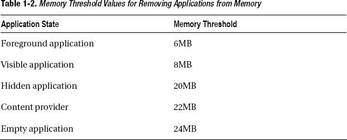

# 一、安卓优先

在这一章中，我们将从多个角度简要介绍 Android 平台。我们将从 Android 的历史开始，以更好地理解其形成背后的动机。然后，我们将探索 Android 平台架构的各种技术的完美结合，这些技术使平台能够提供卓越的移动体验。我们将强调多层 Android 安全框架，该框架使用软件和硬件来保证平台的安全。我们将简要回顾通过 Android 框架为用户级应用提供的服务应用编程接口(API ),以便与平台进行交互。最后，我们将讨论 Android 应用的部署和分发。

### 安卓历史

Android Inc .于 2003 年 10 月在加州硅谷成立，其理念是提供一个更加了解用户位置和偏好的移动平台。

Google 于 2005 年 8 月收购了 Android Inc .作为 Google Inc .的全资子公司。Google 的主要意图是为用户和应用开发人员提供一个由 Google technologies 支持的完全开放的平台。

2007 年 11 月，开放手机联盟作为一个为移动设备开发开放标准的联盟成立。开放手机联盟通过宣布 Android 平台开始了它的旅程。不到一年，新成员开始加入这个财团。

在开放手机联盟的保护下，Android 成为由谷歌领导的开源项目。Android 开源项目的目标是提供一个开放平台来改善用户的移动体验。

Android 是第一个完整、开放、免费的移动平台。

*   *完成:*Android 平台是一个健壮、安全、易于升级的移动平台，具有全面的框架和定义良好的接口。它允许应用开发人员开发应用，并将其完全融入平台。它还提供兼容性和认证计划，因此设备制造商可以设计高度兼容的设备。
*   *开放:*整个 Android 平台都是根据开源 Apache 许可条款开发和提供的。Android 不区分预装应用和第三方应用。开发人员在开发应用时可以完全访问设备功能和服务。
*   *免费:*Android 平台在平台上开发应用不收取任何许可费、版税、会员费或认证费。Android 平台源代码和软件开发工具包免费提供给应用开发者。软件开发平台在许多桌面操作系统上广泛可用，允许应用开发人员使用他们选择的操作系统开发应用。

今天，Android 是手机市场的主要参与者之一。根据最近的市场分析，平均每天有 70 万台 Android 设备被激活，已经有超过 2 亿台设备被激活。Android 目前拥有 48%的手机市场份额，并且还在快速增长。

### 安卓版本

Android 平台的第一个测试版于 2007 年 11 月 5 日发布。从那以后，它经历了一系列的更新和漏洞修复。尽管从应用开发人员的角度来看，错误修复通常是透明的，但更新通常意味着对框架 API 的更改和添加。出于这个原因，除了 Android 平台版本号之外，第二个版本号，称为 *API 级别*，用于标识所支持的框架 API。

自 2009 年 4 月以来，每个 Android 版本都以基于甜点的代号发布，如克莱尔、弗罗育和姜饼。这为 Android 平台引入了第三种版本控制方案，对于首次使用 Android 应用的开发者来说，这变得更加神秘。说到 Android 应用开发，你会经常听到有人说“我的应用需要 clair 及以上”、“这个方法至少需要 API 级”、“我的手机得到了 Android 2.1 更新”之类的话。了解他们所指的是哪个版本和哪个 API 级别，以及哪些新 API 是哪个 Android 平台版本的一部分，很容易成为一项繁琐的记忆练习。您可以使用表 1-1 作为参考，在这三个版本方案之间进行映射。

**注:**由于 Android 平台仍在继续发展，表 1-1 可能没有涵盖最新的平台版本。有关最新列表，请参考 Android 开发者页面的 API 级别部分，位于`[`developer.android.com/guide/appendix/api-levels.html`](http://developer.android.com/guide/appendix/api-levels.html)`。

如表 1-1 所示，在开发应用时，您应该考虑 15 个 API 级别。API 级别也决定了用户的规模，所以在开发新的 Android 应用时，明智地选择这个数字是非常重要的。

安卓手机市场高度分散。仅仅看发布日期，你可能会认为大多数 Android 用户群至少运行 Android 3.0，因为它已经存在一年了；然而，事实并非如此。由于碎片化，发布日期远远不能给出正在使用的 Android 版本的清晰视图。图 1-1 是来自 Android 平台版本仪表盘(`[`developer.android.com/resources/dashboard/platform-versions.html`](http://developer.android.com/resources/dashboard/platform-versions.html)`)的最新版本分布图。

**图 1-1。** *基于市场数据的安卓版本分布*

在图 1-1 中可以看到，目前大部分 Android 用户群都在运行 Android 2.3.3，姜饼。这意味着您的应用至少需要支持 API level 10，以便面向大多数 Android 用户。这也意味着你不能在你的应用中使用新版本 Android 平台中引入的最新 API 特性。在本书中，我们将使用 Android 2.3.3 开发我们的示例。

版本繁多是安卓开发者的通病。大多数应用开发人员为不同的 API 级别开发包。这解决了问题，但是这意味着需要维护不同的代码分支。

2011 年 3 月，谷歌推出了支持包作为版本问题的解决方案。支持包是一组静态库，允许应用开发人员开发支持多个 Android 平台版本的 Android 应用。支持包的主要目标是简化从单一代码库支持多个 Android 版本的过程。您可以在`[`developer.android.com/sdk/compatibility-library.html`](http://developer.android.com/sdk/compatibility-library.html)`找到有关支持包的更多信息。

### Android 平台架构

Android 更像是一个完整的移动设备软件栈，而不是一个操作系统。它是针对移动需求精心优化的工具和技术的组合。

Android 依赖于久经考验的 Linux 内核来提供其操作系统功能。对于用户空间应用，Android 通过使用 Dalvik 虚拟机依赖于 Java 虚拟机技术。Android Zygote 应用进程通过服务预加载和资源共享，加快了应用的启动时间，并允许高效利用移动平台上稀缺的内存资源。所有这些成功的技术都对 Android 平台的成功起到了重要作用，如图图 1-2 所示。除了这些工具和技术之外，Android 运行时还提供了一个独特的计算环境，该环境专为向最终用户提供流畅的移动体验而定制，同时简化了开发人员的移动应用开发。

**图 1-2。** *安卓平台架构*

#### 硬件抽象层

Android 依赖 Linux 内核作为其硬件抽象层(HAL ),并提供其操作系统功能。在 Android 开发过程中，为了适应移动需求，对 Linux 内核代码进行了多次改进。以下是最显著的特征:

*   闹钟定时器
*   偏执的网络安全
*   粘合剂
*   保持进程在休眠时从屏幕消失
*   Android 共享内存(Ashmem)
*   进程共享内存
*   低记忆杀手(维京黑仔)
*   记录器

虽然应用开发人员不需要直接与这些底层组件交互，但是了解它们在整个 Android 平台中的角色是非常重要的。

##### 闹钟定时器

Android 是为在移动平台上运行而设计的，设备的唯一电力是通过电池提供的。Android 进入各种睡眠模式，以便有效地使用有限的电池资源。当设备处于睡眠模式时，应用需要一种方法来唤醒系统，以便执行某些周期性任务。在 Android 上，这是通过闹钟定时器内核模块实现的。它允许用户空间应用调度自己在未来的某个时间运行，而不管设备的状态如何。

Android 运行时中的`android.app.AlarmManager`类允许用户级应用通过 API 调用与闹钟定时器进行交互。报警管理器允许应用使用报警定时器安排一个意图(意图将在下一章讨论)。当警报响起时，系统广播预定意图以启动应用。只要应用忙于执行其广播接收器的`onReceive`方法中的代码，报警管理器就会保持一个 CPU 唤醒锁(本章稍后会介绍)。这保证了设备不会再次进入睡眠模式，直到应用完成执行其任务。闹钟定时器在设备睡眠时保留预定的闹钟；但是，如果设备关闭并重新启动，该列表将被清除。

##### 偏执的网络安全

网络安全是任何移动平台最重要的要求之一。为了提供广泛的安全级别，Android 在尽可能低的层将这一要求作为内核修改来处理。通过这种实现，Android 限制了调用进程的组的访问。应用应该预先请求必要的权限，以便成为这些网络组的一部分。否则，这些应用的网络访问将被阻止在内核中。

##### 粘合剂

Android 平台架构大量使用进程间通信(IPC)。应用通过使用 IPC 与系统、电话服务以及相互之间进行通信。

**注意:进程间通信(IPC)** 是一种允许应用相互之间以及与操作系统本身交换数据的机制。

尽管 Android 依赖于 Linux 内核来实现与操作系统相关的功能，但它并不使用通过 Linux 内核提供的 System V IPC 机制。相反，它依赖于 Android 专用的 IPC 系统，即 Binder。

活页夹技术起源于 Be 公司的工程师，是 Be 操作系统(BeOS)的一部分。Binder 的开发继续在 PalmSource 进行，作为 Cobalt 系统的关键基础，后来作为 Linux 内核模块以 OpenBinder 项目的名义被开源。Android 的 Binder 实现完全重写了 OpenBinder 项目，以符合 Apache 许可。Binder 使用内核模块在进程间通信，如图图 1-3 所示。

**图 1-3。** *Binder 内核模块允许两个应用进行通信*

Binder 的用户空间代码在每个进程中维护一个线程池，这些线程用于将传入的 Binder 请求作为本地事件进行处理。Binder 还负责跟踪跨进程的对象引用。此外，Binder 通过在每个 Binder 请求中传输调用进程的用户和组 ID，提供了额外的安全级别。

Binder 是 Android 平台中的一个关键构造。它是整个 Android 平台的中央消息传递渠道。Android 应用通过 Binder 接口与系统、服务以及相互之间进行通信。

虽然 Binder 是作为一个底层服务实现的，但是应用开发人员并不希望直接与它进行交互。Android 运行时提供了`android.os.IBinder`接口作为 API，通过 Binder 与其他进程进行通信。Android 提供了 Android 界面定义语言(AIDL)，该语言针对 Binder 进行了调整。

AIDL 允许您定义客户机和服务器用来相互通信的编程接口。与许多其他操作系统一样，在 Android 上，不允许进程直接访问另一个进程的内存。AIDL 提供了将对象分解成 Binder 可以理解并跨项目边界使用的原语的功能。

穿线是与 Binder 互动的最重要部分之一:

*   从本地进程发出的调用在调用线程中执行。Binder 调用是同步的，将阻塞当前线程，直到请求被处理。如果请求预计需要很长时间才能完成，则不应该从应用的主线程发出请求。这将使应用挂起，并可能导致应用被 Android 平台终止。Binder 还通过单向属性支持非阻塞请求。
*   来自远程进程的调用从本地进程提供的线程池中分派。服务代码应该是线程安全的，因为请求可以由这些线程中的任何一个执行。

Android SDK 提供了必要的代码生成器，将 AIDL 定义的编程接口转换成实际的 Java 类。应用开发人员只需要为生成的接口和将向客户端提供接口的 Android 服务提供实现。

##### 保持进程在休眠时从屏幕消失

Android 旨在资源稀缺的移动平台上运行。正因为如此，Android 设备非常频繁地进入睡眠模式。虽然这允许系统有效地使用可用资源，但是当内核或应用正在进行重要处理时，设备进入睡眠模式并不可取。唤醒锁是作为内核补丁引入的，目的是允许应用在执行任务时防止系统进入睡眠模式。

Android 平台支持两种类型的唤醒锁:

*   空闲唤醒锁可防止系统进入低功耗空闲状态。
*   挂起唤醒锁可防止系统进入全系统挂起状态。

应用开发者通过`android.os.PowerManager.WakeLock`接口与唤醒锁进行交互。要使用这个接口，应用应该提前请求`android.permission.WAKE_LOCK`。

唤醒锁应谨慎使用。阻止设备进入睡眠模式将增加功耗，最终导致电池电量耗尽。应用应在重要操作期间保持唤醒锁，并在操作完成后立即释放唤醒锁。

##### Android 共享内存

Android 共享内存(Ashmem))是 Android 平台上一个类似 POSIX 的共享内存子系统，作为内核模块实现。Ashmem 针对移动需求进行了高度优化，它为低内存设备提供了更好的支持。Ashmem 支持可以在多个进程之间共享的引用计数对象。

##### 进程共享内存

除了 Ashmem，Android 还提供了第二种类型的共享内存子系统，称为进程共享内存(Pmem)。Pmem 用于在进程间共享大量物理上连续的内存。Android 媒体引擎主要使用 Pmem 在媒体引擎和应用进程之间传递大型媒体帧。

##### 低内存黑仔

低内存杀手，也被称为维京黑仔，是 Linux 内核中其他特定于 Android 的增强功能之一。此功能允许系统在内存耗尽之前回收内存。

为了启动应用，设备必须首先将应用代码从永久存储器读取到随机存取存储器(RAM)中。由于这是一个耗时且昂贵的过程，Android 试图尽可能长时间地保持应用进程。但最终，当内存不足时，它需要将它们从 RAM 中删除。

为防止耗尽内存而删除应用的顺序取决于应用的重要性，这由用户与该应用交互的当前状态来衡量:

*   用户当前正在与之交互的具有前台活动的应用被认为是最重要的。
*   具有可见活动的应用(当前没有与用户交互，但仍然可见)也被认为是重要的。
*   具有对用户不再可见的后台活动的应用被认为是不重要的，因为它的当前状态可以被保存，并且稍后当用户导航回该活动时可以被恢复。

当从内存中删除进程时，Android 从最不重要的应用开始。空进程是指没有活动、服务或广播接收器的进程。这些类型的应用被认为是最不重要的，Android 首先开始删除它们。

使用`/etc/init.rc`系统配置文件配置每个应用状态的阈值。表 1-2 列出了这些阈值。

低内存杀手服务通过`ActivityManagerService`获得这些信息。

##### 记录器

日志记录是故障排除最重要的部分，但是很难实现，尤其是在移动平台上，应用的开发和执行发生在两台不同的机器上。Android 有一个广泛的日志系统，允许系统范围内集中记录来自 Android 系统本身和应用的信息。

Android 日志系统被实现为一个内核模块，称为 logger。还提供了一组 API 调用和用户级应用来与记录器模块进行交互。

任何给定时间平台上记录的信息量使得查看和分析这些日志消息非常困难。为了简化这个过程，Android 日志记录系统将日志消息分成四个独立的日志缓冲区:

*   *主:*主应用日志消息
*   *事件:*系统事件
*   *无线电:*与无线电相关的日志消息
*   *系统:*用于调试的低级系统调试消息

这四个缓冲区作为伪设备保存在`/dev/log`系统目录下。因为移动平台上的输入和输出(I/O)操作非常昂贵，所以日志消息不保存在永久存储器中；相反，它们被保存在内存中。为了控制日志消息的内存利用率，logger 模块将它们放在固定大小的缓冲区中。主日志、广播日志和系统日志作为自由格式的文本消息保存在 64KB 的日志缓冲区中。事件日志消息携带二进制格式的附加信息，它们保存在 256KB 的日志缓冲区中。

还提供了一组用户级应用来查看和过滤这些日志，例如 logcat 和 Dalvik 调试监控服务器(DDMS)工具，我们将在第五章中研究这些工具。

Android 运行时提供了一组 API 调用，允许应用轻松地将其日志消息发送给日志记录器。应用日志消息通过以下类发送:

*   `android.util.Log`:该类用于发送应用日志消息。它提供了一组方法来指定消息的优先级，还提供了一个标记来指示哪个应用正在生成这个日志消息。
*   `android.util.EventLog`:这个类用于发送二进制格式的事件日志消息。
*   这个类被 Android 运行时组件用来发送系统日志消息。它不是 Android API 的一部分，也不能从应用中访问。

#### 合子

在大多数类似 UNIX 的操作系统中，被称为 Init 的应用被认为是所有进程的父进程。Init 在内核成功启动后启动。它的主要作用是根据系统配置启动一组其他进程。

Zygote 也称为“app 进程”，是系统启动时由 Init 启动的核心进程之一。Zygote 在 Android 平台中的角色与 Init 非常相似。它的首要任务是启动一个新的 Dalvik 虚拟机实例，并初始化核心 Android 服务，如下所示:

> 供电业务
> 
> 活动服务
> 
> 打包服务
> 
> 内容服务
> 
> 报警服务
> 
> 窗口服务
> 
> 内容提供商
> 
> 电话服务
> 
> 电池服务
> 
> 看门狗

启动这些服务后，Zygote 开始进行它的第二项任务，这也是它名字的由来。

**注:**根据其字典定义，**受精卵**是最初形成的细胞。在单细胞生物中，受精卵分裂产生后代。

如前所述，在 Android 上，每个应用都在其专用的虚拟机实例中运行。此外，Android 应用依赖于一组类和数据对象，这些对象需要首先加载到内存中，以便应用执行其任务。当启动一个新的应用时，这会带来很大的开销。尽管有这种开销，Android 需要尽可能缩短启动时间，以便提供高度响应的用户体验。通过使用*分叉*，Zygote 以一种快速有效的方式解决了这个问题。

在计算中，分叉是克隆现有进程的操作。新进程拥有父进程所有内存段的精确副本，尽管两个进程都独立执行，如图 1-4 所示。写时复制是分叉中使用的一种优化策略，通过允许两个进程共享同一个内存段，直到其中一个进程试图修改它，从而延迟内存的复制。

**图 1-4。** *Zygote 等应用共享安卓框架只读组件*

由于 Android 运行时类和数据对象对于应用来说是不可变的，这使得它们成为分叉期间写时复制优化的理想候选对象。

Zygote 预加载 Android 运行时对象，并等待启动新应用的请求。当一个新的请求到达时，它不是启动一个新的虚拟机实例，而是简单地分叉。这使得新的应用可以快速启动，同时保持较低的内存占用。

#### 达尔维克虚拟机

Java 是一种通用的、面向对象的编程语言，专门为平台无关的应用开发而设计，目标是“编写一次，在任何地方运行”Java 通过将应用代码编译成一种称为*字节码*的中间独立于平台的解释语言来实现这一点。在运行时，这个字节码通过另一个叫做 Java 虚拟机的 Java 实体来执行。

虚拟机是运行在主机上并解释字节码的本地应用。为了优化复杂应用的运行时，大多数虚拟机实现还支持实时(JIT)特性，这允许从字节码到本机代码的即时翻译。这允许长时间运行的应用执行得更快，因为只有在应用执行的开始才需要解释字节码。

大多数移动平台面临的最大挑战之一是缺乏应用。为了从一开始就解决这个问题，Android 依赖于久经考验的 Java 编程语言，这种语言已经拥有非常庞大的开发人员社区，以及将促进应用开发的应用、工具和组件。

Android 还依赖于高度定制的虚拟机实现，该虚拟机实现针对移动需求进行了调整。Dalvik 虚拟机是 Android 为移动平台定制的 Java 虚拟机。

Dalvik 虚拟机与其他 Java 虚拟机实现有很大不同。桌面平台上的大多数虚拟机实现都是基于基于堆栈的虚拟机模型开发的。由于移动需求，Dalvik 虚拟机基于基于寄存器的虚拟机模型。基于寄存器的虚拟机需要更长的指令来解释；然而，与基于堆栈的虚拟机相比，实际执行的指令数量非常少。这使得基于寄存器的虚拟机成为移动环境的更好选择，在移动环境中，计算能力是一种稀缺资源。

由于 Dalvik 虚拟机需要不同类型的字节码来解释，所以它不支持标准的 Java 类文件，它依赖于自己的格式，这种格式被称为 Dalvik 可执行文件(DEX)。Android 软件开发平台附带了一套工具，用于将编译后的 Java 类文件后处理成 DEX 格式。

DEX 格式也是在移动平台上存储编译后的 Java 应用代码的一种更紧凑的方式。标准 Java 应用由多个单独存储的类文件组成。DEX 将所有的类文件合并成一个大的 DEX 文件，如图图 1-5 所示。这最小化了应用代码的占用空间。

**图 1-5。** *从 JAR 文件中的标准 Java 类文件到单个 DEX 文件的转换*

DEX 格式的常量池允许将字符串、类型、字段和方法常量以及代码中的其他内容存储在一个地方，使用这些列表的索引而不是全名。这将类文件的大小减少了近 50%。

Android 平台在自己的专用虚拟机实例中运行每个应用，作为沙箱。这就对平台提出了很高的要求，因为多个虚拟机被期望在有限的 CPU 资源环境中同时运行。Dalvik 虚拟机专门针对这种环境进行了调整。

#### 文件系统

文件系统是操作系统中非常重要的一部分。特别是在移动平台上，文件系统在满足操作系统的期望方面起着重要的作用。

移动设备依赖基于闪存的存储芯片。Android 依赖另一个 Flash 文件系统(YAFFS2)作为其主要文件系统。YAFFS2 是 Charles Manning 为 Linux 操作系统设计和编写的一个开源文件系统实现。YAFFS2 是一个高性能文件系统，专门设计用于基于 NAND 的闪存芯片。它是一个日志结构的文件系统，将数据完整性作为一个高优先级。

除了文件系统，操作系统文件和组件的组织结构在 Android 中也起着重要的作用。为了保护用户的机密信息，移动平台应该易于升级并且高度安全。Android 通过使用多个分区来组织自己，从而解决了这一需求。通过将操作系统的不同部分保存在不同的分区中，Android 提供了高级别的安全性，也使平台易于升级。

使用的分区取决于设备制造商。以下是一些最常见的问题:

*   `/boot`:这个分区包括引导设备所需的引导加载程序和 Linux 内核。用户应用无法写入该分区，因为修改该分区的内容可能会导致设备无法再启动。
*   `/system`:这个分区包含了所有预装在设备上的 Android 系统文件和应用。在升级过程中，这个分区会被最新版本的 Android 平台替换。该分区不可由用户应用写入，尽管 Android Market 应用可以使该分区暂时可写，以便更新预加载的应用。
*   `/recovery`:这个分区保存了一个恢复镜像，是一个备选的引导分区。它提供维护功能，以便恢复系统或执行其他任务，如进行系统备份。该分区也不能从用户应用写入。
*   `/data`:这个分区保存用户的应用以及用户的数据，比如联系人、信息和设置。当设备恢复出厂设置时，该分区会被擦除。
*   `/cache`:该分区用于存储经常访问的文件。在大多数 Android 设备上，`cache`不是闪存介质上的分区，而是存储在 RAM 中的虚拟分区。当设备重新启动时，该分区的内容不会保留。
*   `/sdcard`:这是内部存储器上的挂载点，而不是分区。连接到设备的 SD 卡以此名称安装。应用并不总是可以访问这个挂载点，因为当设备通过 USB 连接时，它可能直接挂载在主机 PC 上。

虽然 Android 并不期望应用开发人员直接使用这些分区，但是了解它们的用途在 Android 应用开发过程中非常有用。

#### 安全

与许多其他移动平台一样，从用户的角度来看，Android 的最大要求是用户应用和数据的安全性和完整性。Android 的设计考虑到了安全性。

Android 架构在平台的多个层面提供安全性。这个广泛的安全框架也通过 Android 运行时向开发人员公开。精通安全的开发人员可以很容易地依赖这些 API，以便为他们的应用及其使用的数据提供高级别的安全性。不太熟悉安全性的开发人员已经受到默认安全设置的保护。

Android 通过使用来自硬件和软件的多种安全特性来提供高级别的安全性。虽然它被设计为在各种硬件平台上工作，但 Android 仍然利用了特定于硬件的安全功能，如 ARMv6 的永不执行功能。

Android 平台是建立在 Linux 内核之上的。Linux 内核本身已经在许多安全敏感的环境中使用了很多年。Linux 内核为 Android 提供了几个关键的安全特性，如下所示:

*   基于用户的权限模型
*   进程隔离
*   安全 IPC 机制
*   从内核本身移除不必要功能的能力

Linux 内核是为多用户平台设计的。虽然 Android 是单用户环境，但它仍然利用了基于用户的权限模型。Android 在虚拟机沙箱中运行应用，将它们视为系统中的不同用户。仅仅依靠基于用户的权限模型，Android 就可以通过阻止应用访问其他应用的数据和内存来轻松保护系统。

在 Android 上，服务和硬件资源也通过基于用户的权限模型得到保护。这些资源都有自己的保护组。在应用部署期间，应用请求访问这些资源。如果用户同意请求，应用将成为这些资源组的成员。如果应用不是该资源组的成员，则不允许它访问任何附加资源。

除了操作系统提供的安全功能，Android 还使用 ProPolice 增强了 Android 平台二进制文件，以保护它们免受堆栈缓冲区溢出攻击。

文件系统保护也是自 Android 3.0 以来可用的 Android 新功能之一。它允许 Android 使用 AES-128 算法加密整个存储介质。这可以防止其他人在不知道使用的密钥的情况下访问用户的数据。

设备管理是自 Android 2.2 以来可用的其他安全功能之一。它允许管理员远程实施安全策略，并在设备丢失或被盗时远程擦除设备。

#### 服务

Android 平台不仅限于 Linux 内核提供的特性。Android 运行时为应用开发人员提供了许多服务。以下是提供的主要服务。

*   **可访问性服务**:该服务通过`android.view.accessibility.AccessibilityManager`类提供。它是一个系统级服务，充当可访问性事件的事件调度程序，并提供一组 API 来查询系统的可访问性状态。
*   **账户服务**:该服务通过`android.accounts.AccountManager`类提供。它是用户在线账户的集中注册。它允许应用在用户批准后使用用户的帐户访问在线资源。
*   **活动服务**:该服务通过`android.app.ActivityManager`类提供。它允许应用与系统中运行的活动进行交互。
*   **报警服务**:该服务通过`android.app.AlarmManager`类提供。它允许应用向报警服务注册，以便在将来的某个时间安排执行。
*   **音频服务**:该服务通过`android.media.AudioManager`类提供。它允许应用控制音量和铃声模式。
*   **剪贴板服务**:该服务通过`android.content.ClipboardManager`类提供。它允许应用将数据放入系统剪贴板，并从剪贴板中检索数据。
*   **连接服务**:该服务通过`android.net.ConnectivityManager`类提供。它允许应用查询网络连接的状态。当网络连接发生变化时，它也会生成事件。
*   **设备策略服务**:该服务通过`android.app.admin.DevicePolicyManager`类提供。设备管理 API 提供系统级的设备管理功能。它允许开发在企业环境中有用的安全感知应用。
*   **下载服务**:该服务通过`android.app.DownloadManager`类提供。它处理长时间运行的 HTTP 下载。应用可以使用此服务请求将 URI 下载到特定的目标文件。下载服务负责 HTTP 交互，并在失败、连接更改和系统重启后重试下载。
*   **投件箱服务**:该服务通过`android.os.DropBoxManager`类提供。它提供系统范围的、面向数据的日志存储。它从应用崩溃、内核日志和其他来源收集数据。数据不会直接发送到任何地方，但是调试工具可能会扫描并上传条目进行处理。
*   **输入法服务**:该服务通过`android.view.inputmethod.InputMethodManager`类提供。它允许应用通过提供的方法与输入法框架(IMF)进行交互。
*   **通知服务**:该服务通过`android.app.NotificationManager`类提供。它允许应用通知用户发生的事件。后台运行的服务仅通过此服务与用户通信。
*   **位置服务**:该服务通过`android.location.LocationManager`类提供。它允许应用获得设备当前位置的定期更新。
*   **近场通信服务**:该服务通过`android.nfc.NfcManager`类提供。它允许应用使用设备的近场通信(NFC)功能。
*   **包服务**:该服务通过`android.content.pm.PackageManager`类提供。它允许应用检索与当前安装在系统上的应用包相关的信息。
*   **电力服务**:该服务通过`android.os.PowerManager`类提供。它允许应用控制设备的电源状态。它允许应用保持唤醒锁，以防止设备在执行任务时进入睡眠模式。
*   **传感器服务**:该服务通过`android.hardware.SensorManager`类提供。它允许应用访问设备的传感器。
*   **电话服务**:该服务通过`android.telephony.TelephonyManager`类提供。它允许应用与移动设备的电话功能进行交互。它还为应用生成事件来监视电话状态的变化。
*   **UI 模式服务**:该服务通过`android.app.UiModeManager`类提供。它允许应用控制设备的用户界面(UI)模式，例如禁用汽车模式。
*   **USB 服务**:该服务通过`android.hardware.usb.UsbManager`类提供。它允许应用查询 USB 的状态，并通过 USB 设备与设备通信。
*   **振动器服务**:该服务通过`android.os.Vibrator`类提供。它允许应用控制设备上的振动器。
*   **壁纸服务**:该服务通过`android.service.wallpaper.WallpaperService`类提供。它允许应用在后台显示动态壁纸。
*   **Wi-Fi 点对点服务**:该服务通过`android.net.wifi.p2p.WifiP2pManager`类提供。它允许应用发现可用的对等点，并通过 Wi-Fi 网络建立对等连接。
*   **Wi-Fi 服务**:该服务通过`android.net.wifi.WifiManager`类提供。它允许应用管理 Wi-Fi 连接。应用可以列出和更新已配置的网络，访问接入点扫描的结果，以及建立和断开连接。

### Android 部署和分发

因为 Android 平台是一个免费的平台，它不收取任何许可费、版税、会员费或认证费来开发和分发平台上的应用。

Android 平台让应用开发者决定如何分发和赚钱他们的应用。应用开发者可以以免费软件、共享软件、广告赞助或付费的方式分发他们的应用。

Android 平台附带了一个默认的市场，Google Play，以前称为 Android Market，是谷歌为 Android 设备开发的在线商店。与 Android 平台不同，Android Market 应用不是开源的。它仅适用于符合谷歌兼容性要求的设备。客户端部分预装在 Android 设备上，名为 Market。用户可以使用该应用搜索和下载 Android 应用。市场应用还通过通知用户软件更新来保持已安装的 Android 应用最新。

应用开发者使用 Android 市场的服务器部分。通过基于 web 的界面，应用开发人员可以上传他们的应用进行发布。

Android Market 对分布式应用运行一组测试，但它不对从 Android Market 下载的应用承担任何责任。在安装过程中，Android Market 应用显示应用请求的列表权限，并在继续安装之前获得用户的隐式权限。

虽然大多数 Android 设备预装了谷歌的 Android Market 应用，但 Android 平台支持其他应用分发渠道。GetJar 和 Amazon Appstore 是 Android 应用分发的两个替代方案。

### 总结

我们在这一章开始时简要概述了 Android 的历史和现有的 Android 版本。然后，我们探讨了 Android 平台和 Linux 内核的核心，并简要回顾了为交付卓越的移动平台而对 Linux 内核进行的特定于 Android 的更改和添加。

我们解释了 Android 选择 Java 技术作为 Android 应用基础的原因，以及 Dalvik 虚拟机为优化移动计算的 Java 技术而提供的独特功能。我们探索了 Zygote，这个应用进程使 Android 应用具有快速的启动时间和较小的内存占用。我们还研究了 Android 多层安全框架。然后，我们简要介绍了允许应用与 Android 平台交互的 Android 框架服务。最后，我们讨论了 Android 的开发和发行。

在下一章，我们将关注 Android 应用架构。