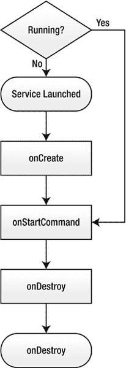

# 二、应用架构

理解 Android 应用的架构是开发可靠应用的关键。在这一章中，我们将开始探索 Android 应用架构。

首先，我们将简要回顾 Android 框架提供的基本组件，如活动、服务、广播接收器、内容提供者和用户界面组件。然后，我们将非常详细地检查活动和服务生命周期。接下来，我们将完成打包 Android 应用以进行部署的过程。最后，我们将研究 Android manifest 文件，以及它在 Android 应用开发中的作用和重要性。

### 安卓组件

Android 和其他移动平台的主要区别在于应用的定义。

其他移动平台将应用定义为在自己的沙箱中运行的独立程序，与周围平台的交互有限。移动平台提供 API，允许应用使用平台服务和数据存储，如地址簿，以提供丰富的用户体验。然而，这种通信总是单向的，这意味着应用可以使用平台服务，但是平台和其他应用不能访问另一个应用提供的服务。

在 Android 上，应用就像是模块。每个应用都由一组组件组成，平台和其他应用都可以访问这些组件。Android 上的每个新应用都通过提供一组新的组件来扩展平台，并为其他应用开发者提供更多机会。应用开发人员不需要决定一组 API 或一个契约来实现应用之间的互操作性。

Android 框架定义了四个主要组件:活动、服务、广播接收器和内容提供者。每个应用不需要使用所有这些组件，但是正确使用它们可以让应用完全融入平台。

#### 活动和意图

*活动*是应用最重要的组成部分。它对应于一个显示屏。用户只能通过活动与 Android 应用进行交互。一个应用可以由一个或多个活动组成。每个活动都允许用户执行特定的任务。为了模块化，期望每个活动做一个单独的任务。

用户发起一个新的活动是为了完成某项任务。这些意图在 Android 框架中被捕获为*意图*。意图是对要执行的操作的抽象描述。它使用被动数据结构提供不同组件之间的后期运行时绑定。

Android 保留了从意图到活动的映射，并基于给定的意图发起正确的活动。对于某些意图，可能有多个活动可以完成该任务。在这种情况下，Android 会向用户提供这些活动的列表以供选择。

一项复杂的任务可能涉及不止一项活动。在这种情况下，当用户从一个活动移动到另一个活动时，活动保存在活动堆栈中。

为了更好地理解活动的概念，让我们想象一个简单的用例，其中用户正在发送电子邮件:

1.  用户按下屏幕上的撰写电子邮件按钮。
2.  该代码捕获用户的意图，将电子邮件消息组成一个意图对象，并将该意图提供给 Android 框架。
3.  Android 检查它的注册表，提取能够满足这个意图的活动，并将这个新活动添加到活动堆栈的顶部。开始时，活动会占据整个屏幕。
4.  用户按下选择接收者按钮。用户的意图在一个新的意图对象中被捕获，Android 框架再次检查它的注册表并启动联系人列表活动。
5.  用户从列表中选择一个或多个接收者，并选择完成按钮。结果，该活动将用户的选择返回到 Android 框架，并通过使之前的活动再次可见，将自己从活动堆栈中移除。
6.  收到 Android 框架的结果后，撰写电子邮件活动会相应地在用户界面中填充所选收件人的列表。
7.  完成消息后，用户单击 Send 按钮，电子邮件就被发送了。
8.  撰写电子邮件活动将其自身从活动堆栈中移除，用户返回到他或她开始的屏幕。

应用不仅限于使用自己的活动。在任务流期间，应用可以利用由平台或其他应用提供的其他活动。例如，要从用户的地址簿中选择一个联系人，应用可以使用平台已经提供的活动，而不是编写新的活动。这种方法促进了活动的重用，也提供了整个平台的一致性。

活动是为与用户互动而设计的。当它们对用户不再可见时，Android 可能会随时终止它们，以便释放内存资源。出于这个原因，活动不适合执行预计需要很长时间才能完成的任务，例如从互联网上下载文件。Android 框架提供了运行这些类型任务的服务组件。

#### 服务

*服务*在后台运行。服务不提供用户界面，它们不能直接与用户交互。Android 并没有限制它们的生存期，只要系统有足够的资源来执行前台任务，它就允许它们继续在后台运行。应用可以提供与用户交互的活动，以便控制服务。

例如，假设我们正在开发一个音乐播放器应用。我们希望让用户选择一个音乐文件，并在继续使用设备的同时收听它。初始活动可以与用户交互以选择歌曲；但是，活动不能直接播放歌曲，因为活动的生存期受到其可见性的限制。我们将需要有一个服务，将在后台运行，以便应用可以继续播放歌曲，而用户正在用设备做其他任务。在任何给定的时间，用户都可以启动一个活动来控制服务，因为服务本身不能直接与用户交互。

与活动一样，应用并不局限于它自己的服务。应用还可以使用由平台或其他应用提供的服务。例如，为了连续接收全球定位系统(GPS)坐标，应用可以启动由平台提供的 GPS 服务。

服务也是通过意向启动的。根据设计，在任何给定时间，只有一个服务实例可以运行。Android 框架在第一个请求到达时启动服务，然后将后续请求交付给已经运行的实例。

有时服务可能需要用户的关注。服务使用通知来通知用户服务的当前状态。例如，在我们的音乐播放器应用中，当新歌曲开始播放时，可以在通知栏上显示带有歌曲名称的通知来通知用户。

#### 广播接收器

应用不仅与用户交互，还通过生成和消费事件与平台和其他应用交互。在 Android 上，这些事件也以意图的形式交付。

为了接收某些类型的事件，应用可以通过提供一个*广播接收器*来注册一组意图。当系统中生成匹配事件时，Android 会将该事件传递给广播接收器。

> 例如，假设我们想让我们的应用在手机开机时自动启动。在我们的应用中，我们指定应用对接收设备启动事件感兴趣。当设备启动时，它会广播事件。只有感兴趣的应用通过它们的广播接收器接收该事件。

#### 内容提供商

*内容提供商*允许 Android 应用与平台和其他应用交换数据。与其他组件不同，内容提供者不依赖意图。相反，内容提供者使用内容 URIs 形式的标准接口，并以一个或多个表的形式提供对数据的访问，这些表类似于关系数据库中的表。这些表的结构通过`Contract`类与外部应用通信。`Contract`类不是内容提供商框架的一部分。内容提供商开发人员应该定义并使`Contract`类对外部应用可用。

当应用发出内容提供商查询时，Android 通过注册中心将给定的 URI 与适当的内容提供商进行匹配。Android 框架检查以确保应用具有必要的特权，并将请求发送给相应的内容提供商。响应以光标的形式返回到发出请求的应用。然后，应用通过光标提供的界面检索和操作数据。

#### 视图、小工具、布局和菜单

视图对象是 Android 平台上用户界面的基本单元。一个*视图对象*是一个数据结构，其属性存储布局参数和屏幕上矩形区域的内容。它提供了处理其绘图和布局测量所需的方法。

一个*小部件*是一个视图对象，允许应用与用户交互。Android 运行时提供了一组丰富的小部件，使应用开发人员能够轻松开发全面的用户界面。Android 应用开发人员并不局限于使用 Android 运行时提供的小部件。通过派生新的视图对象，开发人员可以从头开始创建新的小部件，或者基于现有的小部件创建新的小部件。通过基类`android.view.View`提供一个小部件。

一个*布局*用于表达视图层次以及每个视图组件应该如何在显示器上定位。由于 Android 设备的大小、分辨率和方向差异很大，这种布局允许应用开发人员根据设备的规格动态定位视图组件。Android 运行时提供了一组丰富的布局组件，允许基于一组不同的约束来定位视图。通过基类`android.view.ViewGroup`提供布局。以下是一些常见的布局对象:

*   *框架布局:*这是最简单的布局对象类型。它是通过`android.widget.FrameLayout`类提供的。这是一种基本布局，只能容纳一个视图对象，该对象将占据框架视图所覆盖的整个空间。
*   *线性布局:*该布局允许为视图对象分配权重，并相应地定位它们。它是通过`android.widget.LinearLayout`类提供的。它可以根据其配置垂直或水平定位视图对象。所有视图对象都被卡住，一个接一个。可以使用配置参数引入余量。此外，可以指定一个视图对象来填充整个空白显示区域。
*   *表格布局:*该布局允许视图对象以类似表格的格式按行和列放置。它是通过`android.widget.TableLayout`类提供的。尽管它遵循表格格式，但它不在单元格周围提供边框。此外，单元格不能跨列。
*   *相对布局:*该布局允许视图对象在显示器上相对定位。它是通过`android.widget.RelativeLayout`类提供的。它是最高级的布局组件之一。

除了小部件和布局，应用菜单对于用户界面开发也非常重要。应用菜单为应用功能和设置提供了可靠的界面。

使用 Android 设备上的硬菜单按钮和软菜单按钮来显示菜单。菜单正在慢慢失去其重要性，并被 Android 平台更高版本的动作栏所取代。从 Android 3.0 开始，主机设备不再需要提供硬菜单按钮。

Android 用户界面是根据应用的功能将视图、小部件、布局和菜单结合起来形成的。Android 框架允许应用将它们的用户界面动态定义为应用代码的一部分，或者它们可以依赖于特定于 Android 平台的基于 XML 的用户界面定义语言。这种基于 XML 的语言允许在实际应用逻辑之外设计和管理视图代码。此外，应用开发人员可以在不改变应用逻辑的情况下，为纵向和横向显示设计不同的用户界面。

Android 应用可以从应用代码中控制和填充视图对象。由于 Android 平台的用户界面架构，用户界面预计只能从主 UI 线程进行修改。不支持从应用线程修改用户界面，这可能会在应用运行时导致问题。Android 运行时提供了一个增强的消息队列系统，允许应用开发人员通过主 UI 线程调度与用户界面相关的任务。

尽管 Android 应用可以操作视图对象，但是由于保持用户界面与数据模型一致的复杂性，具有大量用户界面和数据模型组件的应用可能更难开发。为了解决这个问题，Android 运行时提供了将数据绑定到视图的适配器。这允许用户界面组件自动反映对数据模型的任何更改。视图对象`android.widget.Gallery`、`android.widget.ListView`和`android.widget.Spinner`是使用适配器将数据绑定到 Android 平台上的视图对象的很好的例子。

### 资源

Android 架构鼓励用户尽可能地将应用资源从应用源代码中外部化。通过将资源外部化，Android 应用可以根据设备配置和当前语言环境使用不同的图形和文本资源。Android 平台目前支持以下资源:

*   动画资源
*   色彩资源
*   可提取资源
*   布局资源
*   菜单资源
*   字符串资源
*   样式资源
*   价值资源

应用资源放在应用的`res`目录中。有不同的子目录来分组不同的资源。

在编译期间，Android 生成一个资源类，允许应用在代码中引用这些资源。

### 数据存储

Android 平台提供了多种保存持久应用数据的方法。以下是一些备选方案:

*   *共享偏好:*这种方法允许应用将数据存储为键/值对。Android 框架带有实用功能，允许开发人员轻松维护共享偏好。共享首选项只支持基本数据类型，应用应该执行将数据转换为基本类型所需的任何封送处理。Android 平台还保证共享的偏好设置会被保存，即使应用被终止。
*   *内部和外部存储:*这种方法允许应用开发人员将任何类型的数据作为普通文件存储在平台上。Android 框架提供了一组实用函数，允许应用开发人员轻松地进行这些文件操作，而无需知道这些文件的实际位置。
*   *SQLite 数据库:*使用 SQLite 数据库允许应用开发人员轻松地存储和检索结构化数据。SQLite 在应用的进程空间中提供了一个关系数据库。虽然 SQLite 功能是通过本地库提供的，但 Android 框架包括一组实用函数和类，允许应用开发人员轻松地与 SQLite 数据库进行交互。

### Android 生命周期

Android 应用的生命周期比桌面应用的生命周期复杂得多。桌面应用的生命周期由用户直接控制。用户可以选择在任何给定的时间启动和终止应用。然而，在 Android 上，平台管理应用的生命周期，以便高效地使用稀缺的系统资源。

#### 活动生命周期

活动生命周期是活动从第一次创建到被销毁所经历的一组状态。

Android 框架提供了一套生命周期方法，允许应用在活动生命周期发生变化时做出适当的调整。例如，如果活动对用户不再可见，它就没有理由消耗 CPU 周期在屏幕上显示动画。在这种情况下，应用应该停止执行任何 CPU 密集型操作，以便让前台应用获得足够的系统资源来提供流畅的用户体验。

在`android.app.Activity`类中定义了七种生命周期方法:

`public class Activity {
    protected void onCreate(Bundle savedInstanceState);
    protected void onStart();
    protected void onRestart();
    protected void onResume();
    protected void onPause();
    protected void onStop();
    protected void onDestroy();
}`

图 2-1 用这些方法说明了活动生命周期状态机。

**图 2-1。** *活动生命周期状态机*

这些活动生命周期方法的工作方式如下:

*   `onCreate`:创建活动时调用该方法。它初始化活动并创建视图。该方法还接受一个`Bundle`对象，该对象包含活动上次运行时的冻结状态。活动使用这个包来恢复其先前的状态。这个方法调用后面总是跟着`onStart`。
*   `onStart`:当活动变得可见时，调用这个方法。如果该活动处于前台，则随后调用`onResume`。如果活动变得隐蔽，则接下来是`onStop`。
*   `onRestart`:当活动重新显示给用户时，调用这个方法。其次是`onStart`。
*   `onResume`:每次活动来到前台与用户交互时，都会调用这个方法。
*   `onPause`:该方法在活动即将进入后台，但尚未终止时调用。这个回调主要用于保存任何持久状态。这也是停止任何 CPU 密集型操作并释放任何系统资源(如相机)的好地方。当应用处于暂停状态时，如果需要为前台应用回收资源，系统可以随时决定终止应用。由于这个原因，应用应该在这个调用中保存它的当前状态，因为它可能没有第二次机会。根据用户与前台应用的交互，这个调用之后是`onResume`或`onStop`。
*   `onStop`:当用户看不到活动时，调用这个方法。如果活动即将到达前台，则随后调用`onRestart`,如果活动即将终止，则调用`onDestroy`。
*   `onDestroy`:这个方法在活动被销毁的时候调用。这可能是因为活动即将结束，或者因为系统需要释放资源。预计应用将在此时释放其资源。

**注意:**当覆盖这些生命周期方法时，不要忘记调用超类。Android 本身也需要密切监控这些生命周期事件，以便正常运行。

活动应该通过在`onPause`方法中保存其状态来结束，尽管`onStop`和`onDestroy`方法跟在它后面。Android 平台保证应用在执行`onPause`方法中的任何工作时，应用进程不会被终止；在执行`onStop`或`onDestroy`方法时，应用可能会被终止。但是，您应该非常小心，不要在`onPause`方法上花费太多时间，因为 Android 平台和用户都在等待这个方法完成，然后再将下一个活动放到前台。在`onPause`方法上花费太多时间会让系统看起来对用户的请求不负责任。

#### 服务生命周期

服务生命周期类似于活动生命周期，但有几个很大的区别。因为服务不直接与用户交互，所以它们的生命周期不像活动那样依赖于用户的操作。因为服务不关心可见性，所以生命周期方法`onPause`、`onResume`和`onStop`对它们不适用。

在`android.app.Service`类中定义了三种生命周期方法:

`public abstract class Service {
    public void onCreate();
    public int onStartCommand(Intent intent, int flags, int startId);
    public void onDestroy();
}`

图 2-2 展示了使用这些方法的服务生命周期状态机。

**图 2-2。** *服务生命周期状态机*

这些服务生命周期方法的工作方式如下:

*   `onCreate`:当`Context.startService(Intent)`方法被应用使用并且服务还没有运行时，这个方法被调用。由于服务被设计成单例的，所以服务在其生命周期中只得到一次`onCreate`调用。
*   `onStartCommand`: This method is called each time the `Context.startService(Intent)` method is used by the application. A service may end up processing multiple requests, so it is possible for the service to receive multiple `onStartCommand` calls during its lifetime. If the service is already busy processing the previous request, it is expected that the service will queue this new request.

    **注意:**当前台应用需要更多资源时，Android 平台可能会决定销毁一个正在运行的服务，然后在资源条件改善时重新启动它。如果您的服务需要存储持久数据以便在重启后继续正常运行，那么最好在调用`onStartCommand`期间存储这些数据。

*   `onDestroy`:该方法在服务即将被 Android 平台销毁时调用。

### 包装

Android 包文件(APK)文件格式用于打包和分发 Android 应用。APK 文件实际上是压缩文件格式的档案文件。除了应用类文件的打包方式之外，它们部分遵循 JAR 文件格式。APK 文件包含以下内容:

*   `META-INF/MANIFEST.MF`:这是包文件本身的 JAR 清单文件。
*   `META-INF/CERT.SF`:包含了包文件中包含的文件的 SHA1 哈希。该文件由应用开发人员的证书签名。
*   `META-INF/CERT.RSA`:这是用于签署`CERT.SF`文件的证书的公钥。
*   `AndroidManifest.xml`:这是应用的清单文件。它是 Android 应用最重要的组件之一，我们将在下一节简要探讨它。
*   `classes.dex`:这是 DEX 格式的应用类文件。
*   `assets`:这很特别，因为在生成 APK 文件时，其内容不会被压缩。这允许 Android 平台在运行时直接向 APK 文件提供文件描述符，因此应用可以轻松地访问资源，而无需将它们提取到设备中。Android 开发人员希望将大型资源文件保存在`assets`目录中，以最小化应用在已安装设备上的占用空间。
*   `res`:该目录包含应用资源。
*   `resources.arsc`:包含视图定义和字符串资源。

APK 文件用证书签名，证书的私钥由应用开发人员持有。该证书确定了应用的作者，以及 APK 文件中包含的文件的完整性。与许多其他移动平台相比，Android 不要求这些证书由认证机构签名。Android 开发人员可以生成并使用自签名证书来签署他们的应用。

Android 平台在软件更新期间使用证书，以确保更新来自与创建已经安装在系统上的应用的作者相同的作者。除了更新之外，Android 平台还依赖于证书，同时在安装期间向应用授予签名级别的权限。

### 安卓清单

Android 应用通过一个名为`AndroidManifest.xml`的清单文件向系统描述。所有 Android 应用的根目录中都应该有这个文件。Android 清单文件向系统呈现关于应用的基本信息，以便让 Android 平台正确运行应用的代码，并在安装期间授予必要的权限。

Android 清单文件向系统提供以下信息:

*   它包括应用的名称、包名和版本号。
*   它表示运行应用所需的 API 的最低版本。
*   它描述了应用的组件(活动、服务、广播接收器和内容提供者)以及它们在处理意图方面的能力。
*   它声明需要哪些权限才能访问 Android 运行时的受保护部分，并与系统上运行的其他应用进行交互。
*   它声明了其他应用需要拥有的权限，以便与该应用的组件进行交互。
*   它列出了应用在运行时为了运行而必须链接的库。

Android 清单文件是一个 XML 格式的纯文本文件。下面是一个`AndroidManifest.xml`文件的例子:

`<?xml version="1.0" encoding="utf-8"?>
<manifest xmlns:android="http://schemas.android.cm/apk/res/android"
    package="com.apress.example"
    android:versionCode="1"
    android:versionName="1.0.0">

    <application android:icon="@drawable/icon"
        android:label="@string/app_name">

        <activity android:name=".MyActivity"
            android:label="@string/my_activity">

            <intent-filter>
                <action
                    android:name="android.intent.action.MAIN" />

                <category
                            android:name="android.intent.category.LAUNCHER" />
            </intent-filter>
        </activity>

        <activity android:name=".MyPrivateActivity">
        </activity>
    </application>

    <uses-permission
        android:name="android.permission.CAMERA" />

    <uses-feature
        android:name="android.hardware.camera" />

    <uses-sdk
        android:minSdkVersion="5"
        android:targetSdkVersion="9" />
</manifest>`

### 总结

本章通过简要回顾最基本的 Android 组件，包括活动、服务、广播接收器、内容提供者和其他用户界面组件，介绍了 Android 应用架构。我们试图阐明 Android 开发中最令人困惑的概念之一:活动和服务生命周期。然后我们探索了打包 Android 应用的过程，并仔细查看了 Android 清单文件。接下来的章节展示了这些概念的应用实例。