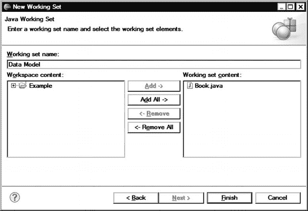
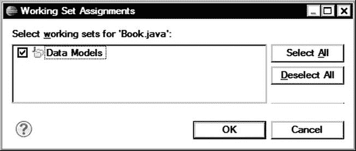

# 四、掌握 Eclipse

在前一章中，我们探索了最常用的 Eclipse 组件。然而，Eclipse 提供了更多的东西。

大型复杂的项目，尤其是当涉及多个开发人员时，可能很快变得难以跟踪和导航。在这一章中，我们将探索高级的 Eclipse 导航特性，例如大纲、类型和调用层次结构以及标记，这些特性可以帮助开发人员轻松地找到代码。

除了导航之外，日常的软件开发还涉及到大量耗时且多余的任务，比如为每个成员字段编写 getters 和 setters，重构代码，以及更新对它的所有引用。在这一章中，我们将探索 Eclipse 提供的用于处理这些劳动密集型任务的大量代码生成器和代码操纵器。使用这些强大的特性使开发人员能够更快地编写代码，因为他们可以将更多的时间投入到实际的应用中。

### 导航

在一个复杂项目的不同组件之间导航，甚至在一个大的源代码文件中导航，很容易成为一项非常耗时的工作。能够在复杂的项目中轻松导航是任何图形开发环境的最大需求之一。Eclipse 提供了许多高级功能来简化日常开发体验；然而，这些漂亮的功能大部分都隐藏在平台中。在这里，您将学习如何使用一些导航功能，包括工作集、大纲视图、类型层次结构视图、调用层次结构视图、标记和搜索。

#### 工作集

工作集允许对元素进行进一步分组，例如项目、文件、资源和断点，用于显示和操作目的。工作集是 Eclipse 最重要的特性之一，有助于在工作空间中导航。工作集可以用作许多视图的过滤标准，也可以使用构建系统构建工作空间的某个部分。

默认情况下，工作区中的每个元素都被视为窗口工作集的成员。为了定义一个新的工作集，首先在工作台上选择一个元素，比如一个文件，然后右键激活上下文菜单，选择**分配**工作集…，如图图 4-1 所示。

**图 4-1。** *从上下文菜单中选择分配工作集*

将出现“工作集分配”对话框，显示现有工作集的列表。单击右边的 New 按钮定义一个新的工作集。Eclipse 将显示新建工作集向导，从适用于所选元素的可用工作集类型列表开始。在图 4-2 中的例子中，我们选择了一个 Java 源文件，可用的工作集类型是基于这个源文件填充的。选择工作集的类型，然后单击 Next 进入下一步。

**图 4-2。** *启动新工作集向导*

在下一步中，为这个新的工作集命名。你也可以给它添加其他元素，如图图 4-3 所示。

**图 4-3。** *命名并添加元素到工作集*

当选择完成时，工作集分配对话框将再次显示，这一次新定义的工作集在列表中并被选中，如图图 4-4 所示。

**图 4-4。** *工作集分配对话框显示新的工作集*

这个新的工作集可以在多个地方用作过滤标准。作为一个例子，让我们用新定义的工作集来过滤 Package Explorer 视图的内容。点击 Package Explorer 工具栏上的展开箭头图标，选择视图的下拉菜单，如图图 4-5 所示。选择`Select Working Set...`设置要使用的工作集。最近使用的工作集被添加到上下文菜单中，以便于访问。

**图 4-5。** *包浏览器查看菜单*

现在，Package Explorer 视图将过滤其内容，只反映所选工作集成员的元素，如图 4-6 所示。

**图 4-6。** *被工作集过滤的包资源管理器视图*

#### 大纲视图

Outline 视图提供了编辑器中当前打开文件的结构视图。它允许快速浏览编辑器的内容。大纲视图工具栏提供了对视图内容进行过滤和排序的选项。

Outline 视图的内容是特定于编辑器的。一些编辑器，例如纯文本文件编辑器，不支持大纲视图。使用 Java 编辑器时，Outline 视图将当前 Java 文件中的类、变量和方法显示为结构化元素，如图图 4-7 所示。

**图 4-7。***Java 文件的概要视图*

默认情况下，Outline 视图在 Java 透视图中是可见的。要将 Outline 视图添加到另一个透视图，请选择**窗口**  **显示视图**  **Outline** 。

除了大纲视图，还有一种快速视图，称为快速大纲视图。默认情况下，此视图不可见。要显示它，在 Windows 和 Linux 上按 Ctrl `+O`，或者在 Mac OS X 上按 Command+O，它就会出现在编辑器区域，如图图 4-8 所示。

**图 4-8。****快速大纲视图显示在编辑器的顶部。**

 *默认情况下，快速大纲视图显示类字段和方法。第二次按 Ctrl `+O`会扩展这个列表，覆盖继承的字段、方法和类型。继承的元素以灰色显示，以便于区分。

快速大纲视图还支持自动过滤，允许用户键入元素的首字母来缩小其内容。像其他视图一样，Quick Outline 视图有自己的下拉菜单，允许进一步定制。

#### 类型层次视图

类型层次结构视图是特定于 Java 的，显示所选 Java 对象的子类型和超类型。它允许您快速发现类型层次结构并在类型间导航。

为了启动 Type Hierarchy 视图，您需要首先从 Package Explorer 视图或编辑器中选择一个 Java 对象。选择对象后，可以用三种方式打开类型层次结构视图:

*   按 F4。
*   点击右键，从右键菜单中选择**打开类型层次**，如图图 4-9 所示。
*   在顶部菜单栏选择**窗口**  **显示视图**  **类型层次**。

**图 4-9。** *从上下文菜单中选择开放式层级*

类型层次视图分为两个窗格，如图图 4-10 所示。顶部窗格显示所选 Java 对象的类型层次结构。底部窗格显示成员列表。

**图 4-10。** *类型层次视图分为两个窗格。*

Type Hierarchy 视图有自己的菜单，可以通过单击右上角的展开箭头来激活它。从此菜单中，您可以通过工作集进一步过滤类型层次结构。

除了菜单之外，类型层次结构视图还有两个工具栏:每个窗格一个。顶部窗格的工具栏提供了在子类型层次、超类型层次和完整类型层次之间切换的图标。底部窗格的工具栏提供了对成员列表进行过滤和排序的图标。

双击该视图中的任何元素都允许您在编辑器区域中自动打开它。

与大纲视图一样，快速查看也是可用的。要打开快速类型层次视图，在 Windows 和 Linux 上按 Ctrl+T，或在 Mac OS X 上按 Command+T。它出现在编辑器区域的顶部，如图 4-11 所示。

**图 4-11。** *快速类型层次视图编辑器中显示的*

#### 调用层次视图

另一个特定于 Java 的视图是 Call Hierarchy 视图，它显示所选 Java 成员对象的调用者和被调用者。它允许您快速发现代码中的调用层次结构，并在调用中导航。

要启动调用层次视图，首先选择一个 Java 成员对象，然后使用以下方法之一:

*   在 Windows 和 Linux 上按 Ctrl+Alt+H，或者在 Mac OS X 上按 Control+Alt+H。
*   右键单击并从上下文菜单中选择**打开调用层次**，如图图 4-12 所示。
*   在顶部菜单栏中，选择**窗口**  **显示视图**  **其他** …  **调用层次结构**。

**图 4-12。** *从上下文菜单中选择开放呼叫层级*

“呼叫层次结构”视图也有自己的菜单。与其他视图一样，您可以通过单击展开箭头来激活此菜单。此下拉菜单允许您在呼叫者和被呼叫者层次结构之间更改呼叫层次结构模式。它还提供了筛选功能，例如在探索字段访问调用层次结构时按字段访问类型进行筛选。

如图 4-13 所示，调用层次结构以树形方式显示在左侧。视图的右侧用于显示行号和被调用的函数。当您单击树项目左侧的加号图标时，呼叫层次结构发现会继续前进一步。当到达调用层次结构中的最后一个方法时，加号图标会消失。

**图 4-13。** *调用层次视图*

#### 标记

标记是可以与工作台资源相关联的元数据。标记显示在编辑器区域左边界的标记栏上。Eclipse 支持不同的标记类型。在这一部分，我们将回顾三种标记风格:书签、问题和任务。

##### 书签视图

书签提供了一种方法来标记经常使用的资源，以便于以后访问。当在一个复杂的项目中工作时，代码的某些部分，比如主 API，可能是书签的很好的候选。您可以为文件中的特定行或整个资源添加书签。

书签视图以表格形式提供了这些书签的列表，如图图 4-14 所示。

**图 4-14。** *书签视图*

如果书签视图不可见，可以通过选择**窗口**  **显示视图**  **其他… **  **书签**将其添加到当前透视图中。

要添加新的书签，在编辑器区域的标记栏上单击鼠标右键，从快捷菜单中选择**添加书签…** ，如图图 4-15 所示。蓝色书签图标将出现在选定行的标记栏中，表示该行已被书签标记。然后，您可以使用书签视图管理书签。

**图 4-15。** *添加新书签*

##### 问题视图

Problems 视图为各种 Eclipse 组件记录问题、错误和警告提供了一个中心位置。问题视图以表格的形式呈现这些信息，如图 4-16 所示。

**图 4-16。** *问题视图显示存在的问题*

例如，在编译期间，任何错误首先通过一个标记与相应的资源相关联，然后通过 Problems 视图报告给用户。双击错误消息可以快速跳转到相应的资源。

默认情况下，Problems 视图显示所有问题，并根据它们的严重性对它们进行分组。使用“视图”菜单(通过窗口的展开箭头访问)，您可以过滤列表并更改分组和排序。问题解决后，它们会自动从 problems 视图中删除。

通过快速修复功能，问题视图还提供了修复报告问题的帮助。要启动快速修复，在 Windows 和 Linux 上按 Ctrl+1，或在 Mac OS X 上按 Command+1，或从所选问题项的上下文菜单中选择**快速修复**。快速修复提供了一套解决问题的建议，如图图 4-17 所示。

**图 4-17。** *快速修复提供修复问题的建议。*

##### 任务视图

Tasks 视图允许您将任务与工作台资源相关联。例如，需要解决的缺失代码段或已知错误可以通过将任务与相关资源相关联来表达。任务视图以表格的形式显示这些信息，如图 4-18 所示。

**图 4-18。** *任务视图*

使用 Tasks 视图的下拉菜单，您可以组织这个列表。例如，您可以根据任务优先级对列表重新排序，或者过滤列表以仅显示特定类型的任务。

与大多数标记一样，可以通过右键单击相应行上的标记栏来定义新任务。您也可以在资源中使用某些关键字，如图图 4-19 所示。开发人员更经常使用后一种方法。

**图 4-19。** *任务由待办事项关键字*自动定义

以下是用于自动定义任务的最常用关键字:

*   `TODO`:该关键字用于记录任何需要以后实现的缺失代码部分。开发人员大多使用`TODO`来记录他们当前推迟并计划以后解决的任务。
*   `FIXME`:这个关键字主要用于记录代码中任何已知的需要解决的 bug。

向资源中添加任务时，并不局限于这些关键字。其他关键字可以通过任务标签首选项对话框定义，如图图 4-20 所示。要打开这个对话框，在 Windows 和 Linux 上选择**窗口**首选项，或者在 Mac OS X 上选择 **Eclipse**  **首选项**，导航到 Java，然后是编译器，然后是任务标签。

**图 4-20。** *任务标签首选项对话框*

#### 搜索

有效的搜索是在开发环境中轻松导航的关键。Eclipse 提供了多层搜索功能，这些功能专门针对某些用例进行了优化。

Eclipse 提供的最基本的搜索特性，也称为文件搜索，是在工作台中搜索文本字符串。要打开搜索对话框，在 Windows 和 Linux 上按 Ctrl+H，或者在 Mac OS X 上按 Control+H，或者从顶部菜单中选择**搜索**  **搜索…** 。

如图 4-21 所示，搜索对话框为搜索提供了广泛的定制。虽然这是一个非常强大的功能，但它仅针对在通用文件中搜索文本进行了优化。不推荐以这种方式搜索 Java 资源，因为已经有了专门针对 Java 资源的最佳解决方案。

**图 4-21。** *使用搜索对话框进行文件搜索*

对于 Java 资源，Java 搜索比文件搜索快得多，因为它依赖于现有的代码索引。您可以通过从顶部菜单中选择**搜索**  **Java …** 或单击搜索对话框中的 Java 搜索选项卡来启动 Java 搜索。如图 4-22 所示，Java 搜索选项卡提供了特定于 Java 的附加参数，您可以使用这些参数来进一步定制搜索。

**图 4-22。**??【Java 搜索】选项卡的搜索对话框

搜索结果通过搜索视图呈现，如图图 4-23 所示。搜索视图下拉菜单和工具栏提供了进一步的过滤功能，以根据用户偏好组织搜索结果。

**图 4-23。** *搜索视图*

搜索菜单也提供了一些样板搜索，如图图 4-24 所示。当前选择的 Java 资源可用于快速开始新的参考、减速和实施者搜索。

**图 4-24。**??【样板文件搜索】??

能够在项目中轻松导航无疑加快了编码过程，但这还不够。开发者在开发应用的同时，仍然需要编写相当数量的代码。在下一节中，我们将探索 Eclipse 为快速编码提供的高级特性。

### 快速编码

在大多数软件项目中，开发人员的大部分时间并不用于开发实际的应用逻辑。开发人员花费大量时间处理简单但劳动密集型的编码任务，例如实现 getters 和 setters，或者在进行代码重构后更新源代码中的所有引用。Eclipse 提供了一组高级特性，如模板和代码生成器，以自动化部分编码，并减少开发人员需要生成的代码量。在这一节中，我们将回顾一些方便的 Eclipse 特性。

#### 模板

在开发任何类型的应用时，我们每天都在使用许多编码模式和代码结构。大多数时候，我们发现自己在复制和粘贴代码段，并试图通过操作它们的参数名来适应它们的新家。例如，日志记录是每个项目的必备条件之一。在开发应用时，开发人员通常会在很多地方复制日志记录器的启动代码。

大多数文本编辑器中的复制粘贴功能无疑使任务变得简单；但是，它要求您能够立即访问原始代码段，以便首先复制它们。因此，开发人员可能会花费大量时间搜索以前的项目，以便提取那些宝贵的代码段。

通过对代码模板的支持，Eclipse 为这个问题提供了一个更加优雅的解决方案。代码模板允许您在 Eclipse 中存储常用的代码模式和代码片段。Eclipse 处理这些模板的存储和索引，并使它们易于使用。

Eclipse 支持多种代码模板类型。用户可以定义自己的模板，也可以使用插件附带的预定义模板(可以由用户自定义)。

为了更好地了解 Eclipse 中模板支持的程度，在顶部菜单栏中，选择 Windows 和 Linux 上的**窗口**  **首选项**，或者在 Mac OS X 上的 **Eclipse** **首选项**来启动 Eclipse 首选项对话框。开始输入**模板**来过滤广泛的首选项列表，只过滤模板，如图图 4-25 所示。

**图 4-25。** *为模板过滤的 Eclipse 首选项对话框*

您可能已经注意到，在首选项对话框的 Java 部分列出了两组模板:代码样式下的代码模板和编辑器下的模板。我们将在本节中研究这两种类型。

##### 代码模板

代码模板主要在自动代码生成过程中使用。最基本的代码模板用于放置在新文件顶部的注释行。在许多公司，你会被要求在你开发的每个源文件的顶部包含一个版权声明和一个许可证。要使用代码模板轻松实现这一点，在 Windows 和 Linux 上选择**窗口**  **首选项**，或者在 Mac OS X 上选择 **Eclipse**  **首选项**，导航到 Java，然后是代码样式，然后是代码模板。您将看到一个可用代码模板的列表，如图图 4-26 所示。

**图 4-26。** *Java 代码模板列表*

代码模板以树状方式呈现在两个主要组下:注释和代码。单击 Comments 组左侧的三角形图标，展开可用注释代码模板的列表。我们将为这个示例修改的代码模板是一个名为 Files 的模板。从列表中选择该模板后，对话框的底部窗格将立即显示所选代码模板的当前模式，如图 4-27 所示。

**图 4-27。** *文件注释代码模板*

如您所见，目前它不包含任何文本，而只包含注释装饰。要对其进行修改，请单击右侧的编辑按钮。这将弹出编辑模板对话框，如图图 4-28 所示。

**图 4-28。** *编辑模板对话框*

您现在可以修改文件注释，如下所示:

`/**
 * Copyright © 2012 Apress Media LLC. All Rights Reserved.
 */`

代码模板都是关于可重用性的，开发人员喜欢使它们尽可能通用，以避免需要保持它们最新。在我们的例子中，模板中有一个硬编码的年份 2012。最好让这个版权行反映当前年份，而不是总是显示 2012 年。这可以通过添加一个变量来实现，利用 Eclipse 的模板支持很容易做到这一点。要用正确的变量替换 2012，请单击模式文本区域下方的插入变量…按钮。您将看到一个可用变量列表，这些变量可以在模板中使用，如图图 4-29 所示。

**图 4-29。** *代码模板可用的变量*

对于本例，从变量列表中选择`year`来替换 2012。我们的文件注释现在将如下所示:

`/**
 * Copyright © ${year} Apress Media LLC. All Rights Reserved.
 */`

从现在开始，你添加到你的项目中的任何新的 Java 文件都将在文件注释中生成版权行，如图图 4-30 所示。

**图 4-30。** *新的 Java 文件用其文件中的版权注释*

##### 编辑器模板

因为代码模板只能通过代码生成器使用，所以 Eclipse 不允许用户向列表中添加新模板。然而，第二种模板类型，编辑器模板，主要供用户定义新模板，并在开发应用时使用它们。如前所述打开 Eclipse 首选项对话框，导航到 Java，然后是编辑器，然后是模板，如图 4-31 所示。

**图 4-31。** *编辑模板*

要定义新的编辑器模板，请单击右侧的新建按钮。新建模板对话框将被启动，如图图 4-32 所示。

**图 4-32。** *新建模板对话框用于编辑模板*

对于代码模板，该对话框比编辑模板对话框多两个字段:一个用于新模板的名称，另一个用于上下文。该名称主要用于在编辑器中使用该模板时引用它，它更像是一个关键字。Eclipse 使用上下文根据当前上下文过滤模板，以便只提供适用的模板。

例如，我们将为记录器启动代码定义一个新的编辑器模板。将新模板命名为 **Logger** ，并选择 Java 上下文。我们首先将一个现有的日志初始化行复制到模板的模式编辑器中。

`private static final Logger logger = Logger.getLogger(Author.class.getName());`

为了使这个编辑器模板更加通用，对类文件的引用应该被转换成一个变量。单击 Insert Variable…按钮，您将看到一个比代码模板可用的变量更大的变量列表。从变量列表中选择`enclosing_type`来替换模板中的`Author`。新模板将如下所示:

`private static final Logger logger =
Logger.getLogger(${enclosing_type}.class.getName());`

`Logger`类是在`java.util.logging`包中定义的，它不是自动导入的 Java 包集的一部分。为了使编辑器模板更加通用，让我们指示 Eclipse 在将模板插入代码时导入`Logger`类。为此，从变量列表中选择`import`，并添加参数`java.util.logging.Logging`。如图 4-33 所示，修改后的模板如下图所示:

`private static final Logger logger =
Logger.getLogger(${enclosing_type}.class.getName());
${:import(java.util.logging.Logger)}` 

**图 4-33。** *对话框中编辑模板完全定义*

编辑器模板现在可以使用了。要将其插入到代码中，开始键入 **logger** ，然后在 Windows 和 Linux 上按 Ctrl+空格键，或者在 Mac OS X 上按 Control+空格键来启动内容辅助功能(下一节讨论)，如图图 4-34 所示。

**图 4-34。** *内容辅助提示编辑模板*

您将看到一个建议列表，包括我们在本例中定义的编辑器模板。从列表中选择`logging`，将测井初始化代码模板插入编辑器，如图 4-35 中的所示。

**图 4-35。** *编辑模板插入代码*

#### 内容辅助

如果您需要记住每一个类型和方法的名称，那么使用第三方 API 或处理复杂的项目将会非常困难。大多数时候，开发人员确实记得一个方法的存在，但不记得它的完整签名。在这些时刻，Eclipse 的内容辅助特性变得非常方便。

触发内容辅助最简单的方法是通过点字符。例如，开始输入 **`System.out.`** 并等待一秒钟。点字符调出内容帮助，显示一个建议列表来完成当前代码行，如图图 4-36 所示。

**图 4-36。** *内容协助制作建议完成行*

内容辅助通过使用光标左侧的第一个单词来准备建议列表，该列表可能很长。为了缩小建议的范围，请继续键入更多字符，内容助手将相应地过滤列表。在我们的例子中，输入 **p** ，列表将只包含以字母*p*开头的建议，如图 4-37 中的所示。

**图 4-37。** *内容协助建议进一步筛选*

您还可以浏览建议列表。当您选择一个建议时，建议的代码将自动插入该行。如果这些建议都不适用，您可以按 Esc 键关闭内容帮助列表。

虽然点字符会自动触发内容辅助，但在 Windows 和 Linux 上也可以通过使用组合键 Ctrl+空格键或在 Mac OS X 上使用 Control+空格键随时手动启动内容辅助。Content Assist 是一个非常强大和方便的工具，用于简化日常 Eclipse 开发。

#### 代码生成器

为了便于编码，Eclipse 提供了一组代码生成器，可以为常用的编码模式自动生成代码。这些代码生成器选项可通过顶部菜单栏上的源代码菜单获得:

*   **覆盖/实现方法:**提供了超类和实现接口的方法列表，用于覆盖和实现。
*   **生成 getter 和 setter:**为选中的字段生成 getter 和 setter 方法。
*   **生成委托方法:**为当前类型的字段生成方法委托。
*   **生成 toString():** 使用所选字段和方法的内容生成`toString()`方法。
*   **生成 hashCode()和 equals():** 根据选择的字段生成`hashCode()`和`equals()`方法。
*   **使用字段生成构造函数:**添加一个初始化所选字段的构造函数。
*   **从超类生成构造函数:**添加一个在当前类的超类中定义的构造函数。

Eclipse 代码生成器最好的例子是 getter 和 setter 生成器。在面向对象编程中，mutator 方法是用于控制变量变化的方法。像 getters 和 setters 这样的方法就是 mutator 方法的例子。类变量总是被声明为私有的，而 getter 和 setter 方法是被定义来操作这些字段的公共方法。在大多数开发项目中，getter 和 setter 方法占据了源代码的很大一部分，开发人员可能会花费相当多的时间为这些简单但耗时的方法编写代码。

Eclipse 的 getter 和 setter 代码生成器为这个问题提供了一个优雅的解决方案。定义完类中的字段后，从顶部菜单栏中选择**Source****Generate Getters and Setters…**，弹出生成 Getters and Setters 对话框，如图图 4-38 所示。

**图 4-38。** *生成 Getters 和 Setters 对话框*

“生成 Getters 和 Setters”对话框以树状方式提供了成员字段列表。每个成员字段左侧的复选框允许您为 getter 和 setter 生成标记一个字段。复选框的左边是一个三角形图标，用于展开选择，进一步显示将要生成的各个方法。默认情况下，getter 和 setter 都会生成，除非你指定生成哪个 mutator 方法，如图 4-39 中的例子所示。

**图 4-39。** *选择要生成的个别方法*

“生成 Getters 和 Setters”对话框还提供了额外的可配置参数来指定自动生成的方法的插入点、排序和访问修饰符。

图 4-40 显示了自动生成的 getters 和 setters。getters 和 setters 的格式基于 Java 代码模板，可以通过 Eclipse Preferences 对话框进行定制，方法是导航到 Java，然后是代码样式，然后是代码模板，如本章前面所讨论的。

**图 4-40。** *自动生成 getters 和 setter*

#### 重构

*重构*是指在不改变代码功能的情况下，对代码进行转换的过程。重构经常在开发周期中进行，以便根据新的需求改进设计和代码的效率。

重命名是最简单的重构操作。然而，在重命名之后，确实需要大量的手工工作来调整代码。为了能够使用代码，每个对重命名对象的引用都需要修改。现有的搜索和替换功能不适用于此操作，因为它可能会导致代码的其他部分发生意外更改。由于需要大量的手动操作，这个过程也容易出现用户错误。

Eclipse 为这个问题提供了一个更加优雅的解决方案。要重命名 Java 对象，在 Windows 和 Linux 上按 Alt+Shift+R，或者在 Mac OS X 上按 Alt+Command+R，或者从顶部菜单栏中选择**重构**  **重命名**。如图图 4-41 所示，Eclipse 将允许您重命名对象，并且它会相应地自动重构应用代码。

**图 4-41。** *重命名一个 Java 对象*

重命名并不是 Eclipse 支持的唯一重构操作，你可以在`Refactor`菜单中看到，如图 4-42 中的所示。

**图 4-42。***Eclipse 支持的重构操作*

此菜单提供了对许多重构操作的简单访问:

*   **重命名:**重命名选中的 Java 对象，并修正所有引用。
*   **移动:**移动选中的 Java 对象，修正所有引用。
*   **更改方法签名:**更改参数名称和类型，并相应地更新所有引用。
*   **提取方法:**将当前选中的代码段提取为一个新的模块，并用对新定义方法的引用替换选中的代码段。
*   **提取局部变量:**提取当前选择的变量作为新的局部变量，并用新定义的局部变量的引用替换选择。
*   **提取常量:**提取当前选择的表达式作为新的常量，并用新常量的引用替换选择。
*   **内联:**内联局部变量、方法或常量。
*   **将匿名类转换为嵌套类:**将选定的匿名类转换为成员类。
*   **将类型移动到新文件:**将所选类型移动到它自己的 Java 源文件，并相应地更新引用。
*   **将局部变量转换为字段:**将选定的局部变量转换为字段，并相应地更新引用和初始化。
*   **提取超类:**从一组兄弟中提取一个超类，并将兄弟更改为新定义的超类的直接子类。
*   **提取接口:**用一组选中的方法提取一个接口，让选中的类实现这个新接口。
*   **尽可能使用超类型:**尽可能用超类型替换一个类型的出现。
*   **下推**:在超类和类之间移动方法。
*   **Pull Up:** 在类和它的超类之间移动方法。
*   **提取类:**提取一组字段作为新的类，并用新的类替换对这些字段的引用。
*   **引入参数对象:**用一个新类替换一组参数，更新方法的所有调用方，用参数传递这个新类的一个实例。
*   **引入间接方法:**生成一个静态间接方法，委托给选中的方法。
*   **引入工厂:**为所选类型生成新的工厂方法。
*   **引入参数:**用对新方法参数的引用替换表达式，并更新所有调用方。
*   **封装字段:**用 getters 和 setters 替换所有对字段的引用。
*   **泛化声明的类型:**允许用户选择引用当前类型的超类型，如果引用可以安全地更改为该超类型的话。
*   **推断泛型类型参数:**尽可能用参数化类型替换泛型类型的原始类型。

一些重构任务可能涉及这些重构操作的组合。Eclipse 保存了重构任务的历史，允许您撤销特定的重构步骤。要查看重构历史，从顶部菜单栏中选择**重构**  **历史**。

通过选择**重构**  **创建脚本…** ，还可以将选定的重构任务保存到脚本文件中以备后用。然后，您可以选择**重构**  **应用脚本…** 来再次应用这些重构步骤。

#### 剪贴簿

剪贴簿功能允许用户轻松地试验代码片段，而无需处理编写完整 Java 代码的额外负担。剪贴簿就像一个代码解释器。它允许您只键入一段代码进行实验，然后它可以快速执行代码并显示结果。在剪贴簿页面中，您可以使用项目中定义的类以及 Java 系统类。

要启动剪贴簿页面，从顶部菜单栏选择**文件**  **新建**  **其他…****Java****Java 运行/调试**  **剪贴簿页面**。一个空白的剪贴簿页面将被添加到编辑区，如图图 4-43 所示。

**图 4-43。***【scrapbook page】*

开始键入以下示例表达式:

`java.util.Date date = new java.util.Date();
date`

剪贴簿提供了以下三种执行类型:

*   **显示**:评估表达式，并将其值直接打印到剪贴簿页面。
*   **Inspect** :对表达式求值，并显示一个检查窗口，显示对象提供的所有信息。
*   **执行**:将表达式作为普通 Java 代码进行求值。

为了使用这些执行类型，首先突出显示表达式。然后在 Windows 和 Linux 上按 Ctrl `+` Shift `+` D，或者在 Mac OS X 上按 Shift+Command+D，或者从顶部菜单中选择**运行**显示，开始显示执行。表达式将被求值，其值将显示在剪贴簿页面中，如图图 4-44 所示。

**图 4-44。** *剪贴簿展示*

保持表达式高亮显示，在 Windows 和 Linux 上按 Ctrl `+` Shift `+` I，或者在 Mac OS X 上按 Shift+Command+I，或者从顶部菜单中选择**运行**检查，开始检查执行。表达式将被计算，检查窗口将出现在剪贴簿页面的顶部，如图图 4-45 所示。

**图 4-45。** *剪贴簿查看功能*

将表达式更改如下:

`java.util.Date date = new java.util.Date();
System.out.println(date.toString());`

高亮显示表达式，在 Windows 和 Linux 上按 Ctrl `+` U，在 Mac OS X 上按 Command+U，或者选择**运行**  **执行**来执行。表达式将像普通 Java 代码一样执行，输出将显示在控制台视图中，如图图 4-46 所示。

**图 4-46。** *剪贴簿执行功能*

### 总结

在这一章中，我们讨论了可以加速开发周期的强大的 Eclipse 特性。本章一开始，我们深入探讨了 Eclipse 提供的高级导航特性，包括视图和不同类型的标记，以便轻松定位代码部分。然后，我们研究了 Eclipse 的快速编码特性。这些包括代码和编辑器模板，可以用来维护代码的一致性，以及 Eclipse 提供的代码生成器和重构功能，用来处理耗时的开发任务。后面的章节将演示这些功能的实际应用。*