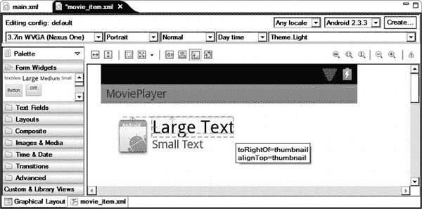

# 六、项目：电影播放器

在前一章中，我们探索了 Eclipse 的 ADT。我们回顾了 ADT 视图和工具，以及如何在日常 Android 开发中使用它们。在本章中，我们将开始把我们在前面章节中讨论的所有工具和概念付诸实践。

我们的第一个 Android 项目是一个简单的电影播放器应用。因为这个实验的目的是看 Android 在 Eclipse 上的实际开发，所以我们不会太深入地研究 Android 框架 API。在接下来的章节中，我们将继续构建这个简单的项目。

### 电影播放器概述

我们的电影播放器应用将是一个简单的单活动应用，它将呈现一个电影文件列表，这些文件位于外部存储中。该列表将显示每个电影文件的缩略图、名称和持续时间。当您单击列表中的电影项目时，电影播放器应用将依赖 Android 平台启动相应的视频播放器活动来播放所选电影。尽管这是一个非常简单的项目，但它将允许我们试验我们在前面章节中讨论过的大多数工具和概念。

我们将从使用新的 Android 项目向导来生成框架项目开始。然后我们将使用 ADT 提供的编辑器来创建用户界面。通过清单编辑器，我们将根据项目的需求修改`AndroidManifest.xml`文件。使用布局编辑器，我们将定义电影列表的用户界面布局，以及电影列表项目的布局。我们将使用资源编辑器来正确定义我们用户界面中需要的字符串资源。在生成必要的布局和资源的同时，我们将使用 Android Lint 并行验证代码。应用将依靠媒体商店内容提供者来获取外部存储器中的电影文件列表。获取的信息将被保存到我们将在本章中定义的电影对象中。我们还将实现电影列表适配器，将信息输入列表视图进行显示。

为了播放选中的电影文件，我们将依靠 Android 平台，利用`Activity`类的`startActivity`方法启动相应的视频播放器。在做所有这些的时候，我们将非常依赖 Eclipse 的代码模板、自动代码生成器和重构特性，通过让 Eclipse 处理耗时的操作来简化开发过程。

### 开始电影播放器项目

要启动我们新的 Android 项目，从顶部菜单栏选择**文件**  **新建**  **其他**打开新建项目对话框，如图图 6-1 所示。

**图 6-1。** *Eclipse 新项目对话框*

“新建项目”对话框按项目类别组织。展开 Android 项目类别，选择 Android 项目作为项目类型，然后单击 Next 按钮。这将启动新建 Android 项目向导。作为第一步，您需要提供项目名称及其位置。通过选择相应的单选按钮，您还可以选择是从一个空项目开始，在现有项目的基础上构建一个项目，还是从一个 Android 示例应用开始。对于本例，将项目命名为`MoviePlayer`，如图图 6-2 所示，然后点击下一步按钮。

**图 6-2。** *新建 Android 项目向导*

接下来，新建 Android 项目向导询问新项目的 Android 平台目标，如图图 6-3 所示。列表将只显示已经安装的 SDK。如果您的目标平台不在列表中，您可能需要使用 Android SDK 管理器下载它。对于这个项目，选择 Android 2.3.3，API Level 10 作为目标平台。这意味着新项目将在任何支持 API 级别 10 及以上的 Android 设备上运行。单击“下一步”按钮继续。

**图 6-3。** *为新项目选择目标平台*

Android 应用被打包成具有唯一包名的包。包命名概念和命名约定是从 Java 编程语言中借鉴来的。包名通常使用分层命名模式来定义，层次结构的各个级别用点分隔。虽然 Android 应用代码可能包含多个包，但应该仍然有一个主包供 Android 引用该应用。

作为定义新项目的最后一步，新的 Android 项目向导将要求应用名和唯一的包名。在我们的例子中，包名是`com.apress.movieplayer`，如图 6-4 中的所示。除了包名之外，这个对话框还要求最小的 SDK。最低 SDK 确定了在 Android 设备上运行该应用所需的最低 API 级别。

**图 6-4。** *输入应用名称和唯一的包名*

在图 6-4 中可以看到，新的 Android 项目向导还可以生成大部分默认组件，比如主活动和单元测试项目，提供足够的骨架代码，使其更快地启动一个新项目。因为我们的电影播放器应用需要一个活动来与用户交互，所以选择 Create Activity 选项。

单击“完成”按钮。新建 Android 项目向导会自动生成项目布局以及所需的项目文件，如图图 6-5 所示。

**图 6-5** *。项目布局和所需项目文件*

将创建以下项目目录和文件:

*   `src`:该目录包含 Java 源文件。应用包是由新建 Android 项目向导在这个目录中自动生成的。
*   `gen`:该目录包含自动生成的项目文件，如**资源索引**的 R 类。用户不应修改该目录的内容。每次编译项目时，都会重新生成该目录的内容。
*   `assets`:该目录包含应用素材。
*   `bin`:这个目录包含了这个应用编译后的类文件和可安装的 Android 包文件。用户不应修改该目录的内容。
*   `res`:该目录包含不同类型应用资源的子目录。新的 Android 项目向导将自动在相应的资源目录中为主活动生成布局、字符串资源和图标。资源组织如下:
    *   动画资源保存在 anim 子目录中。
    *   颜色资源保存在颜色子目录中。
    *   根据目标屏幕分辨率，图像文件保存在相应的可绘制子目录中。
    *   用户界面资源保存在布局子目录中。
    *   菜单资源保存在菜单子目录中。
    *   其他资源(如字符串资源和用户界面样式)保存在 values 子目录中。
*   `AndroidManifest.xml`:这是应用清单文件。新的 Android 项目向导自动生成这个文件，其中的内容来自通过向导对话框收集的信息。
*   `proguard.cfg`:这是 ProGuard 配置文件，在对发布版本的应用包进行模糊处理时由 ProGuard 使用。
*   `project.properties`:这是一个 Android SDK 构建系统在编译和打包应用时使用的属性文件。

### 使用 ADT 编辑器

ADT 提供了各种编辑器来操作项目文件。在接下来的小节中，我们将使用这些编辑器根据我们的项目需求定制项目框架。

#### 清单编辑器

*   双击`AndroidManifest.xml`文件将其打开。ADT 附带了一个用于操作清单文件的定制编辑器。Eclipse 将检测文件的类型并用清单编辑器打开它，如图 6-6 所示。

**图 6-6。** *安卓清单文件编辑器*

清单编辑器提供了一组选项卡，允许操作 Android 清单文件的各个方面。由于用户界面提供了所有可能的值，这使得编辑清单文件变得更容易和更健壮。在任何时候，您都可以切换到 XML 选项卡(`AndroidManifest.xml`)来处理 XML 源文件。

#### 布局编辑器

Android 应用用户界面是使用基于 XML 的布局文件定义的。对于复杂的用户界面，维护这些 XML 文件是一项非常具有挑战性的任务。ADT 附带了一个用于 Eclipse 的可视化用户界面编辑器插件，它允许您设计和维护布局 XML 文件。

要查看布局编辑器的运行，使用项目浏览器，导航到`res`目录，然后是`layout`目录，选择`main.xml`文件。`main.xml`文件是我们主活动的布局文件。Eclipse 会自动检测这个文件的类型，并在 ADT 的布局编辑器中打开它，如图图 6-7 所示。代码生成器已经用“Hello World”消息填充了这个布局文件。

**图 6-7。** *安卓视觉布局编辑器*

可视化布局编辑器有三个窗格:

*   右边的窗格显示了当前的布局，就像在真实的 Android 设备上一样。
*   顶部窗格提供了一组下拉菜单来更改显示的大小和方向，以便查看布局如何根据这些更改进行自我调整。
*   左侧窗格包含可用小部件和布局组件的列表。您可以将此窗格中的任何视图组件拖放到右窗格中，以将视图组件添加到当前布局中。

右键单击视图组件显示可用参数列表，您可以更改这些参数。除了提供可视化设计功能，编辑器还允许您直接与底层 XML 格式的布局代码进行交互。要切换到 XML 编辑模式，选择编辑器底部的`main.xml`选项卡。

现在让我们使用布局编辑器来更改我们的电影播放器应用的布局。

##### 电影列表布局

我们希望让我们的电影播放器应用以列表形式显示电影文件。通过选择`main.xml`选项卡切换到 XML 编辑器模式，并在清单 6-1 中键入代码。

**清单 6-1。***main . XML 文件*

`<?xml version="1.0" encoding="utf-8"?>
<LinearLayout xmlns:android="http://schemas.android.com/apk/res/android"
    android:layout_width="fill_parent"
    android:layout_height="fill_parent"
    android:orientation="vertical" >

    <ListView
        android:id="@+id/movieListView"
        android:layout_width="fill_parent"
        android:layout_height="fill_parent" >
    </ListView>
</LinearLayout>`

这个 XML 组件只包含一个全屏的`android.widget.ListView`。属性，我们将 ID `movieListView`分配给`android.widget.ListView`组件。任何视图对象都可以有一个与之相关联的 ID，以便在视图层次结构中唯一地标识它。IDs 允许您在应用代码中引用视图组件。ID 字符串开头的 at 符号(`@`)表示 XML 解析器应该将其扩展并标识为 ID 资源。at 符号后面的加号(`+`)表示这是一个新的资源名称，必须添加到 ID 资源中。

现在回到视觉设计模式，看看布局的效果，如图图 6-8 所示。

**图 6-8。**??【列表视图】添加到布局

##### 电影项目布局

默认情况下，`ListView`允许您快速将数据显示为文本项。然而，对于我们的电影播放器应用，我们还希望在左侧显示电影缩略图，以便用户更容易做出选择。

要定义这个自定义列表项布局，从顶部菜单栏选择**文件**  **新建**  **其他**，从列表中选择 Android XML 布局文件，如图图 6-9 所示。

**图 6-9。** *选择新的 Android XML 布局文件*

下一步，Android XML 布局文件向导将要求输入文件名和根元素。该布局的文件名将为`movie_item.xml`。我们希望列表项在左边有缩略图，在右边有电影标题，在标题下面有电影时长。我们能够描述布局的方式强烈表明`android.widget.RelativeLayout`是项目布局的正确根元素。从列表中选择`RelativeLayout`，如图图 6-10 所示，然后点击完成按钮。

**图 6-10。** *选择新的布局根元素*

在这个布局中，我们将使用一个`android.widget.ImageView`视图来显示电影缩略图，使用两个`android.widget.TextView`视图来显示电影标题和时长。切换到 XML 编辑器模式，在清单 6-2 中键入 XML 代码。

**清单 6-2。***movie _ item . XML 文件*

`<?xml version="1.0" encoding="utf-8"?>
<RelativeLayout xmlns:android="http://schemas.android.com/apk/res/android"
    android:layout_width="match_parent"
    android:layout_height="match_parent">

    <ImageView
        android:id="@+id/thumbnail"
        android:layout_width="64dp"
        android:layout_height="64dp"
        android:layout_alignParentLeft="true"
        android:layout_alignParentTop="true"
        android:layout_marginRight="16dp"
        android:src="@drawable/ic_launcher" />` `    <TextView
        android:id="@+id/title"
        android:layout_width="wrap_content"
        android:layout_height="wrap_content"
        android:layout_alignTop="@+id/thumbnail"
        android:layout_toRightOf="@+id/thumbnail"
        **android:text="Large Text"**
        android:textAppearance="?android:attr/textAppearanceLarge" />

    <TextView
        android:id="@+id/duration"
        android:layout_width="wrap_content"
        android:layout_height="wrap_content"
        android:layout_alignLeft="@+id/title"
        android:layout_below="@+id/title"
        **android:text="Small Text"**
        android:textAppearance="?android:attr/textAppearanceSmall" />

</RelativeLayout>`

你现在可以切换到可视化编辑器模式来查看布局的运行，如图图 6-11 所示。

**图 6-11:** *电影项目添加到布局*

您可能已经注意到，在可视化布局编辑器的右上角有一个小小的警告图标。如果你将鼠标悬停在这个图标上，你会看到 Android Lint 警告你这个布局可能存在的问题。点击警告图标，弹出 Android Lint 的警告对话框，如图图 6-12 所示。

**图 6-12。** *Android Lint 警告对话框显示布局问题*

对于前两个错误，Android Lint 告诉我们，我们在 XML 布局文件中使用的字符串是硬编码的，它们应该在字符串资源中。Lint 可以自动为我们修复这些错误，如第五章所述。

选择与硬编码的`"Large Text"`字符串相关的第一个问题，并单击 Fix 按钮。Lint 将显示提取 Android 字符串对话框以确认提议的更改，如图 6-13 所示。单击“确定”按钮继续。

**图 6-13。** *Lint 用字符串引用替换硬编码字符串*

对与`"Small Text"`字符串相关的第二个错误重复相同的程序。现在，布局 XML 文件的相关部分将如下所示:

`<TextView
        android:id="@+id/title"
        android:layout_width="wrap_content"
        android:layout_height="wrap_content"
        android:layout_alignTop="@+id/thumbnail"
        android:layout_toRightOf="@+id/thumbnail"
**        android:text="@string/large_text"**
        android:textAppearance="?android:attr/textAppearanceLarge" />

    <TextView
        android:id="@+id/duration"
        android:layout_width="wrap_content"
        android:layout_height="wrap_content"` `        android:layout_alignLeft="@+id/title"
        android:layout_below="@+id/title"
**        android:text="@string/small_text"**
        android:textAppearance="?android:attr/textAppearanceSmall" />`

对于这两个错误，Lint 定义了一个字符串资源，并用相应的字符串资源 ID 替换布局文件中的`android:text`属性值。在布局文件中不使用任何硬编码的字符串是定义 Android 布局的正确方式。

与其让 Lint 为我们修复第三个错误，不如让我们手动修复它。在布局编辑器中，用字符串引用`thumbnail_description`定义缩略图的`android:contentDescription`属性。经过这一更改后，`ImageView`组件将如下所示:

`    <ImageView
        android:id="@+id/thumbnail"
        android:layout_width="64dp"
        android:layout_height="64dp"
        android:layout_alignParentLeft="true"
        android:layout_alignParentTop="true"
        android:layout_marginRight="16dp" **        android:contentDescription=”@string/thumbnail_description”**
        android:src="@drawable/ic_launcher"  />`

由于字符串资源尚未定义，错误标记将显示在`thumbnail_description`旁边。我们将使用资源编辑器来定义这个字符串资源。

#### 资源编辑器

Android 应用字符串资源存储在 XML 格式的文件中。ADT 提供了一个自定义编辑器来操作这些资源文件。导航到`res`目录，然后是`values`目录，选择`strings.xml`资源文件。Eclipse 将在自定义编辑器中打开资源文件，如图图 6-14 所示。

**图 6-14。** *资源编辑*

在编辑器的顶部窗格中，您将看到一组字母来过滤资源列表，使其只包含某些类型的元素。通过单击右边的按钮，您可以操作资源列表。在任何时候，通过切换到 XML 选项卡，您可以直接与资源 XML 源文件进行交互。

要定义`thumbnail_description`字符串资源，请单击添加按钮。在出现的对话框中，选择字符串作为资源类型，如图图 6-15 所示，然后点击确定按钮继续。

**图 6-15。** *选择资源类型*

使用右侧窗格，定义`thumbnail_description`字符串资源，如图图 6-16 所示。

**图 6-16。** *定义字符串资源*

### 定义类别

我们已经完成了用户界面和必要资源的定义。我们现在将开始实现必要的模型类来保存将在用户界面中显示的数据。

#### 电影课

对于我们的电影播放器应用，我们需要一个名为`Movie`的模型类来存储每个电影项目的信息。从顶部菜单栏选择**文件**  **新建**  **类**来定义一个新类。Eclipse 将询问类名及其包。将类名字段设置为`Movie`，将包名设置为`com.apress.movieplayer`。在编辑器区域，输入清单 6-3 中的 Java 代码(现在不用担心错误)。

**清单 6-3。**【Movie.java 档案】??

`package com.apress.movieplayer;

/**
 * Movie file meta data.
 *` ` * @author Onur Cinar
 */
class Movie {
    /** Movie title. */
    private final String title;

    /** Movie file. */
    private final String moviePath;

    /** MIME type. */
    private final String mimeType;

    /** Movie duration in ms. */
    private final long duration;

    /** Thumbnail file. */
    private final String thumbnailPath;

    /**
     * Constructor.
     *
     * @param mediaCursor
     *            media cursor.
     * @param thumbnailCursor
     *            thumbnail cursor.
     */
    public Movie(Cursor mediaCursor, Cursor thumbnailCursor) {
        title = mediaCursor.getString(mediaCursor
                .getColumnIndexOrThrow(MediaStore.Video.Media.TITLE));

        moviePath = mediaCursor.getString(mediaCursor
                .getColumnIndex(MediaStore.Video.Media.DATA));

        mimeType = mediaCursor.getString(mediaCursor
                .getColumnIndex(MediaStore.Video.Media.MIME_TYPE));

        duration = mediaCursor.getLong(mediaCursor
                .getColumnIndex(MediaStore.Video.Media.DURATION));

        if ((thumbnailCursor != null) && thumbnailCursor.moveToFirst()) {
            thumbnailPath = thumbnailCursor.getString(thumbnailCursor
                    .getColumnIndex(MediaStore.Video.Thumbnails.DATA));
        } else {
            thumbnailPath = null;
        }
    }
}`

这定义了一个新的`Movie`类，它有五个成员字段:

*   电影名称
*   电影文件 URI
*   电影文件的 MIME 类型
*   持续时间(毫秒)
*   URI 电影

我们将从`android.provider.MediaStore`内容提供商那里获取信息，这是一个系统内容提供商，用于向应用提供有关设备上媒体文件的信息。当你在编辑器中输入代码时，你会开始看到来自 Eclipse 的错误标记，指示代码中的错误，如图 6-17 所示。

**图 6-17。** *Eclipse 代码中指示错误*

当您将鼠标悬停在代码中带红色下划线的错误上时，Eclipse 将自动显示 Quick Fix 视图，其中包含修复问题的可能操作的建议。在我们的应用中，问题是我们没有导入所有被引用的类。您可以使用快速修复来手动修复它们，或者在 Windows 和 Linux 上按 Ctrl+O，或者在 Mac OS X 上按 Command+O 来组织和修复所有导入。

为了访问成员字段，我们现在需要定义 getter 和 setter 方法。如第四章所述，我们可以让 Eclipse 自动生成这些 getters 和 setters，如图图 6-18 所示。

**图 6-18。** *自动生成电影类*的 getters 和 setters

现在，`Movie`类的源代码将看起来像清单 6-4 中的。

**清单 6-4。**Movie.java 产生后的*和*

`package com.apress.movieplayer;

import android.database.Cursor;
import android.provider.MediaStore;

/**
 * Movie file meta data.
 *
 * @author Onur Cinar
 */
class Movie {
    /** Movie title. */
    private final String title;

    /** Movie file. */
    private final String moviePath;`  `/** MIME type. */
    private final String mimeType;

    /** Movie duration in ms. */
    private final long duration;

    /** Thumbnail file. */
    private final String thumbnailPath;

    /**
     * Constructor.
     *
     * @param mediaCursor
     *            media cursor.
     * @param thumbnailCursor
     *            thumbnail cursor.
     */
    public Movie(Cursor mediaCursor, Cursor thumbnailCursor) {
        title = mediaCursor.getString(mediaCursor
                .getColumnIndexOrThrow(MediaStore.Video.Media.TITLE));

        moviePath = mediaCursor.getString(mediaCursor
                .getColumnIndex(MediaStore.Video.Media.DATA));

        mimeType = mediaCursor.getString(mediaCursor
                .getColumnIndex(MediaStore.Video.Media.MIME_TYPE));

        duration = mediaCursor.getLong(mediaCursor
                .getColumnIndex(MediaStore.Video.Media.DURATION));

        if (thumbnailCursor.moveToFirst()) {
            thumbnailPath = thumbnailCursor.getString(thumbnailCursor
                    .getColumnIndex(MediaStore.Video.Thumbnails.DATA));
        } else {
            thumbnailPath = null;
        }
    }

    /**
     * Get the movie title.
     *
     * @return movie title.
     */
    public String getTitle() {
        return title;
    }

    /**
     * Gets the movie path.` `     *
     * @return movie path.
     */
    public String getMoviePath() {
        return moviePath;
    }

    /**
     * Gets the MIME type.
     *
     * @return MIME type.
     */
    public String getMimeType() {
        return mimeType;
    }

    /**
     * Gets the movie duration.
     *
     * @return movie duration.
     */
    public long getDuration() {
        return duration;
    }

    /**
     * Gets the thumbnail path.
     *
     * @return thumbnail path.
     */
    public String getThumbnailPath() {
        return thumbnailPath;
    }

    /*
     * (non-Javadoc)
     *
     * @see java.lang.Object#toString()
     */
    @Override
    public String toString() {
        return "Movie [title=" + title + ", moviePath=" + moviePath
                + ", mimeType=" + mimeType + ", duration=" + duration
                + ", thumbnailPath=" + thumbnailPath + "]";
    }
}`

#### 电影列表适配器类

用户界面组件需要一个适配器来使用它的数据。尽管 Android 框架提供了默认适配器，但是由于自定义的项目布局，这些默认适配器在电影播放器应用中是不可用的。

要定义新的适配器类，从顶部菜单栏中选择**文件**  **新建**  **类**。将新的类文件命名为`MovieListAdapter`，同时将其超类设置为`android.widget.BaseAdapter`，如图图 6-19 所示。

**图 6-19。** *将超类设置为 BaseAdapter*

Eclipse 将自动为每个需要在`MovieListAdapter`类中实现的抽象方法生成空体。实现这些方法后，`MovieListAdapter`代码将看起来像清单 6-5 中的。

**清单 6-5。**【MovieListAdapter.java 档案】??

`package com.apress.movieplayer;

import java.util.ArrayList;

import android.content.Context;
import android.net.Uri;
import android.view.LayoutInflater;
import android.view.View;
import android.view.ViewGroup;
import android.widget.BaseAdapter;
import android.widget.ImageView;
import android.widget.TextView;

/**
 * Movie list view adapter.
 *
 * @author Onur Cinar
 */
class MovieListAdapter extends BaseAdapter {
    /** Context instance. */
    private final Context context;

    /** Movie list. */
    private final ArrayList<Movie> movieList;

    /**
     * Constructor.
     *
     * @param context
     *            context instance.
     * @param movieList
     *            movie list.
     */
    public MovieListAdapter(Context context, ArrayList<Movie> movieList) {
        this.context = context;
        this.movieList = movieList;
    }

    /**
     * Gets the number of elements in movie list.
     *
     * @see BaseAdapter#getCount()` `*/
    public int getCount() {
        return movieList.size();
    }

    /**
     * Gets the movie item at given position.
     *
     * @param poisition
     *            item position
     * @see BaseAdapter#getItem(int)
     */
    public Object getItem(int position) {
        return movieList.get(position);
    }

    /**
     * Gets the movie id at given position.
     *
     * @param position
     *            item position
     * @return movie id
     * @see BaseAdapter#getItemId(int)
     */
    public long getItemId(int position) {
        return position;
    }

    /**
     * Gets the item view for given position.
     *
     * @param position
     *            item position.
     * @param convertView
     *            existing view to use.
     * @param parent
     *            parent view.
     */
    public View getView(int position, View convertView, ViewGroup parent) {
        // Check if convert view exists or inflate the layout
        if (convertView == null) {
            LayoutInflater layoutInflater = (LayoutInflater) context
                    .getSystemService(Context.LAYOUT_INFLATER_SERVICE);
            convertView = layoutInflater.inflate(R.layout.movie_item, null);
        }

        // Get the movie at given position
        Movie movie = (Movie) getItem(position);

        // Set thumbnail` `        ImageView thumbnail = (ImageView) convertView
                .findViewById(R.id.thumbnail);

        if (movie.getThumbnailPath() != null) {
            thumbnail.setImageURI(Uri.parse(movie.getThumbnailPath()));
        } else {
            thumbnail.setImageResource(R.drawable.ic_launcher);
        }

        // Set title
        TextView title = (TextView) convertView.findViewById(R.id.title);
        title.setText(movie.getTitle());

        // Set duration
        TextView duration = (TextView) convertView.findViewById(R.id.duration);
        duration.setText(getDurationAsString(movie.getDuration()));

        return convertView;
    }

    /**
     * Gets the given duration as string.
     *
     * @param duration
     *            duration value.
     * @return duration string.
     */
    private static String getDurationAsString(long duration) {
        // Calculate milliseconds
        long milliseconds = duration % 1000;
        long seconds = duration / 1000;

        // Calculate seconds
        long minutes = seconds / 60;
        seconds %= 60;

        // Calculate hours and minutes
        long hours = minutes / 60;
        minutes %= 60;

        // Build the duration string
        String durationString = String.format("%1$02d:%2$02d:%3$02d.%4$03d",
                hours, minutes, seconds, milliseconds);

        return durationString;
    }
}`

`MovieListAdapter`构造函数获取一组`Movie`类，并在`android.widget.ListView`请求时提供给它们。`MovieListAdapter`的`getView`方法使用`Movie`对象的成员字段填充我们的定制列表项布局。

#### 活动类

现在我们已经满足了所有的先决条件，我们可以开始为 activity 类编写代码了。`MoviePlayerActivity`将提供`android.widget.ListView`组件向用户显示电影列表。电影信息将来自`android.provider.MediaStore`内容提供商。

使用`Activity`类的`managedQuery`方法，我们将首先向`android.provider.MediaStore`查询一组电影信息。对于每部电影，我们将对`android.widget.MediaStore`进行第二次查询以获得电影缩略图。结果稍后将存储在`Movie`类实例中，并显示在列表视图中。当您选择一个电影项目时，它将由默认的视频播放器根据其类型播放。将清单 6-6 中的代码输入到`MediaPlayerActivity`的编辑区。

**清单 6-6。**【MediaPlayerActivity.java 档案】??

`package com.apress.movieplayer;

import java.util.ArrayList;

import android.app.Activity;
import android.content.Intent;
import android.database.Cursor;
import android.net.Uri;
import android.os.Bundle;
import android.provider.MediaStore;
import android.util.Log;
import android.view.View;
import android.widget.AdapterView;
import android.widget.AdapterView.OnItemClickListener;
import android.widget.ListView;

/**
 * Movie player.
 *
 * @author Onur Cinar
 */
public class MoviePlayerActivity extends Activity implements OnItemClickListener
{
    /** Log tag. */
    private static final String LOG_TAG = "MoviePlayer";` `/**
     * On create lifecycle method.
     *
     * @param savedInstanceState saved state.
     * @see Activity#onCreate(Bundle)
     */
    @Override
    public void onCreate(Bundle savedInstanceState) {
        super.onCreate(savedInstanceState);
        setContentView(R.layout.main);

        ArrayList<Movie> movieList = new ArrayList<Movie>();

        // Media columns to query
        String[] mediaColumns = { MediaStore.Video.Media._ID,
                MediaStore.Video.Media.TITLE, MediaStore.Video.Media.DURATION,
                MediaStore.Video.Media.DATA,
                MediaStore.Video.Media.MIME_TYPE };

        // Thumbnail columns to query
        String[] thumbnailColumns = { MediaStore.Video.Thumbnails.DATA };

        // Query external movie content for selected media columns
        Cursor mediaCursor = managedQuery(
                MediaStore.Video.Media.EXTERNAL_CONTENT_URI, mediaColumns,
                null, null, null);

        // Loop through media results
        if ((mediaCursor != null) && mediaCursor.moveToFirst()) {
            do {
                // Get the video id
                int id = mediaCursor.getInt(mediaCursor
                        .getColumnIndex(MediaStore.Video.Media._ID));

                // Get the thumbnail associated with the video
                Cursor thumbnailCursor = managedQuery(
                        MediaStore.Video.Thumbnails.EXTERNAL_CONTENT_URI,
                        thumbnailColumns, MediaStore.Video.Thumbnails.VIDEO_ID
                                + "=" + id, null, null);

                // New movie object from the data
                Movie movie = new Movie(mediaCursor, thumbnailCursor);
                Log.d(LOG_TAG, movie.toString());

                // Add to movie list
                movieList.add(movie);

            } while (mediaCursor.moveToNext());
        }` `        // Define movie list adapter
        MovieListAdapter movieListAdapter = new MovieListAdapter(this,
movieList);

        // Set list view adapter to movie list adapter
        ListView movieListView = (ListView) findViewById(R.id.movieListView);
        movieListView.setAdapter(movieListAdapter);    

        // Set  item click listener
        movieListView.setOnItemClickListener(this);
    }

    /**
     * On item click listener.
     */
    public void onItemClick(AdapterView<?> parent, View view, int position, long id) {
        // Gets the selected movie
        Movie movie = (Movie) parent.getAdapter().getItem(position);

        // Plays the selected movie
        Intent intent = new Intent(Intent.ACTION_VIEW);
        intent.setDataAndType(Uri.parse(movie.getMoviePath()),
movie.getMimeType());
        startActivity(intent);
    }
}`

#### 运行应用

我们的示例应用现在已经可以试用了。你可以在 Android 设备或模拟器上运行它。如果您要在 Android 模拟器中运行电影播放器应用，请确保模拟器配置了第五章中讨论的设置。

电影播放器应用需要一组电影文件存在于外部存储器(SD 卡)中，以便显示任何内容。如果您没有任何电影文件，请在启动应用之前使用相机应用录制一些示例电影文件。

当您准备好测试应用时，从顶部菜单栏中选择**运行**  **运行**。因为这是你第一次运行这个应用，Eclipse 会询问你想如何运行它，如图 6-20 所示。

**注意:**默认情况下，某些 Android 设备通过 USB 连接到主机时，会被配置为充当存储介质。这可能会阻止电影播放器应用访问 SD 卡。使用 USB 设置，将 USB 操作模式更改为仅充电，以防止 SD 卡被锁定。

**图 6-20。** *运行方式对话框询问应用应该如何运行*

从运行方式对话框中选择 Android 应用。如果当前连接了不止一个设备或模拟器，Eclipse 将要求您选择执行应用的目标设备，如图 6-21 所示。

**图 6-21。** *安卓设备选择器对话框*

在对话框中点击确定后，应用将在所选的 Android 设备或仿真器上启动，如图图 6-22 所示。

**图 6-22。** *电影播放器应用列表电影*

您可以从设备上的应用列表中选择电影播放器，再次启动应用。

### 总结

在本章中，我们开始开发一个电影播放器应用，以熟悉典型的 Android 项目开发周期。我们将前面章节中涉及的一些核心概念和组件付诸实践。我们使用了新的 Android 项目向导、清单编辑器、布局编辑器、Android Lint 和资源编辑器。我们还定义了一个 Android 活动，并从内容提供商那里获取数据。在整个章节中，我们使用了 Eclipse 的代码模板、代码生成器和重构特性来自动化一些开发过程。在接下来的章节中，我们将扩展这个项目来演示 Android 应用开发的其他方面。