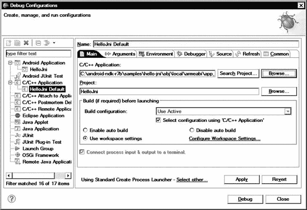

# 七、使用 Eclipse 的 Android 原生开发

在前面的章节中，我们已经探索了使用 Java 开发 Android 应用。Android 软件开发并不局限于只使用 Java 技术。Android 允许应用开发人员通过 Android 原生开发工具包(NDK)使用 C 和 C++ 等原生代码语言实现部分应用。

在这一章中，我们将从介绍 Android NDK 开始，并介绍在主要操作系统上正确安装它的步骤。我们将简要回顾 Android NDK 的结构及其提供的组件。然后我们将讨论 NDK 期望如何构建带有本地组件的 Android 应用。

为了简化开发体验，我们将使用 Eclipse 插件的塞阔雅来将 Android NDK 集成到 Eclipse 平台中。

在为本地开发建立了合适的工作环境之后，我们将开始回顾通过 JDK 提供的用于集成本地组件的工具。我们将重点关注 Java 本地接口(JNI)，本地组件使用它来与应用的 Java 部分进行交互。

### Android 原生开发套件

Android NDK 是 Android SDK 的配套工具集，旨在允许开发人员使用本机代码实现和嵌入其应用的性能关键部分。尽管 Android 框架完全是为基于 Java 的应用而设计的，但 NDK 提供了必要的工具和组件来使用机器代码生成编程语言(如 C、C++ 和 Assembly)开发部分 Android 应用。通过 JNI 技术，这些本地组件在基于 Java 的应用中无缝运行和访问，同时它们的实现作为机器码运行，不被 Dalvik 虚拟机解释。

#### 什么时候使用原生代码？

使用本机代码并不总是会自动提高性能。尽管众所周知早期版本的 Java 比本地代码慢得多，但最新的 Java 技术经过了高度优化，在许多情况下速度差异可以忽略不计。Java 虚拟机的 JIT 编译特性允许在应用启动时将解释的字节码翻译成机器码。然后，在应用的整个执行过程中使用翻译后的机器码，使 Java 应用的运行速度与本地应用一样快。

在 Java 应用中使用本地组件也会增加整个应用的复杂性。为了有效地与虚拟机并行执行，本机组件应该是好邻居，并以一种微妙的方式与 Java 组件交互。如果没有正确管理这种交互，本机组件可能会导致应用中难以跟踪的不稳定性，甚至会通过使虚拟机崩溃来关闭整个应用。

在 Android 应用中使用原生代码绝对不是一个坏习惯。在某些情况下，它变得非常有益，因为它可以提供重用并提高一些复杂应用的性能。

应用依赖一组模块和库来完成它们的任务。例如，用户界面包含图形和图标来改善用户体验。这些图形资源通常是 PNG 或 JPEG 图像文件。这些格式不是任何编程语言的一部分，因此应用不能直接使用它们。由于开发处理这些格式所需的代码不是一种有效的时间利用，应用依赖于现有的 PNG 或 JPEG 代码库。尽管 Java 很流行，但代码库生态系统仍然高度依赖于基于 C/C++ 的本地代码库。虽然大多数常见的库已经与 Java 或 Android 框架集成，但并不是所有的库都是现成的。

Android NDK 允许应用开发人员轻松地将任何本地库的使用与其基于 Java 的 Android 应用集成在一起。如果没有 NDK，这些本地库需要用 Java 重新编写，以便供 Android 应用使用。Android NDK 促进了 Android 应用中非基于 Java 的组件的重用，并简化了开发过程。

关于性能，作为一种独立于平台的编程语言，Java 不提供任何使用特定于 CPU 的特性来优化代码的机制。与桌面平台相比，移动设备资源非常稀缺。对于具有高性能要求的复杂应用，如 3D 游戏和多媒体应用，有效利用每一个可能的 CPU 功能是关键。ARM 处理器，如 ARM NEON 和 ARM VFPv3-D32，提供了额外的指令集，以允许移动应用对许多性能关键型操作进行硬件加速。Android NDK 允许将应用组件开发为本机代码，以便使用这些 CPU 功能。

#### NDK 提供了什么？

Android NDK 是一套全面的 API、交叉编译器、连接器、调试器、构建工具、文档和示例应用，允许开发原生 Android 应用组件。它通过提供原生开发特性来补充 Android SDK。以下是它提供的一些原生 Android APIs:

*   c 库
*   最小标准 C++ 库
*   数学图书馆
*   zlib 压缩库
*   Android 日志库
*   Android 像素缓冲库
*   Android 本地应用 API
*   OpenGL ES 3D 图形库
*   OpenSL ES 本地音频库
*   OpenMAX AL 最小支持

### 安装安卓 NDK

Android NDK 可用于主要的操作系统。安装包可从安卓 NDK 网站`[`developer.android.com/sdk/ndk/index.html`](http://developer.android.com/sdk/ndk/index.html)`获得。以下部分描述了如何在 Microsoft Windows、Mac OS X 和 Linux 系统上安装 Android NDK。

#### 在微软视窗系统上安装 NDK

Android NDK 最初被设计用于类 UNIX 系统。一些 NDK 组件是外壳脚本，它们不能在 Microsoft Windows 操作系统上直接执行。尽管最新版本的 Android NDK 在使自己更加独立和自我打包方面取得了进展，但它仍然需要在主机上安装 Cygwin 才能完全运行。Cygwin 是一个类似 UNIX 的环境，是 Windows 操作系统的命令行界面。它附带了基本的 UNIX 应用，包括一个允许运行 Android NDK 构建系统的外壳。

在撰写本文时，Android NDK for Windows 的最新版本是 r7b，它要求主机上预装 Cygwin 1.7。

##### 安装 Cygwin

要安装 Cygwin，导航到`[`www.cygwin.com`](http://www.cygwin.com)`并点击安装 Cygwin。安装页面将提供到 Cygwin 安装程序的链接，也称为`setup.exe`应用。Cygwin 不是一个单一的应用；它是一个包含多个应用的大型软件发行版。Cygwin 安装程序只允许将选定的应用安装到主机上。

当你运行 Cygwin 安装程序时，你会看到 Cygwin 设置对话框，如图图 7-1 所示。

**图 7-1。** *运行 Cygwin 安装程序*

点击下一步按钮进入下一步，您需要选择下载源，如图图 7-2 所示。

**图 7-2。** *选择 Cygwin 下载来源*

选择从互联网安装选项，然后单击下一步按钮，指示 Cygwin 安装程序从网络下载软件包。在下一个对话框中，安装程序会让你选择要安装 Cygwin 的目录，如图图 7-3 所示。

**图 7-3。** *为 Cygwin 选择目标目录*

默认情况下，Cygwin 将安装在`C:\cygwin`目录下，这是推荐的位置。单击“下一步”按钮进入下一步。

Cygwin 安装程序首先将选定的包下载到主机上，然后在下载完所有内容后立即开始安装它们。安装程序会在安装过程中询问该目录的位置，如图图 7-4 所示。

**图 7-4。**?? 选择本地包目录

由于这个目录的内容在安装后不会被使用，您可以将它指向一个临时位置，比如`Downloads`或`Temp`目录。

下一步，安装程序将询问连接类型，如图图 7-5 所示。除非您的网络连接另有要求，否则请选择直接连接，然后单击下一步按钮继续。

**图 7-5。**?? 选择配置类型

Cygwin 是一个开源项目，世界各地的多个组织通过为 Cygwin 包提供镜像站点来捐赠他们的带宽。根据您的地理位置，从列表中选择一个下载站点，如图图 7-6 所示。然后单击“下一步”按钮继续。

**图 7-6。** *选择下载站点*

安装程序将以树形格式向您显示可用应用列表，如图图 7-7 所示。默认选择适合我们的目的。

**图 7-7。** *选择小天鹅套餐*

Android NDK 需要 GNU Make 3.8.1 或更高版本。要安装 GNU Make，在搜索栏中键入 **make** ，然后按回车键。安装程序将相应地过滤应用列表。展开开发应用的 Devel 部分，并选择`make`应用。单击下一步按钮，安装将开始。

##### 安装 Android NDK

Android NDK 是作为 Windows 平台的压缩 ZIP 存档文件提供的。从安卓 NDK 网站下载安装包(`[`developer.android.com/sdk/ndk/index.html`](http://developer.android.com/sdk/ndk/index.html)`)。然后右击它并从上下文菜单中选择**提取所有…** 。你会看到解压压缩文件夹对话框，如图图 7-8 所示。选择一个目标目录，然后点击解压按钮安装 Android NDK。

**图 7-8。**??【提取压缩文件夹】对话框

##### 更新路径变量

将 Cygwin 和 Android NDK 添加到`Path`环境变量中使得 Android NDK 易于访问。要修改`Path`环境变量，去控制面板选择系统，或者选择**开始**  **运行**，然后键入`sysdm.cpl`。

在“系统属性”对话框中，切换到“高级”选项卡，然后单击“环境变量”按钮。在“系统变量”窗格中，单击“编辑”按钮。编辑`Path`环境变量。Android NDK 和 Cygwin 二进制目录都应该附加到`Path`变量，如图图 7-9 所示。如果你在安装过程中使用了默认的目标目录，你可以在变量后面加上`;c:\cygwin\bin\;c:\android-ndk-r7b\`。

**图 7-9。** *添加安卓 NDK 和 Cygwin 目录到路径变量*

#### 在 Mac OS X 上安装 NDK

Android NDK 是为 Mac OS X 平台提供的 bzip2 压缩 TAR 文件。从安卓 NDK 网站下载存档文件(`[`developer.android.com/sdk/ndk/index.html`](http://developer.android.com/sdk/ndk/index.html)`)。然后在目的目录下，在终端窗口执行`tar jxvf ~/Downloads/android-ndk-r7b-darwin-x86.tar.bz2`提取安卓 NDK 文件，如图图 7-10 所示。

**图 7-10。** *提取安卓 NDK 文件*

将 Android NDK 目录添加到`Path`变量中使其更容易访问。为此，从你解压安卓 NDK 的同一个目录执行`echo export PATH=\$PATH:$(pwd)/android-ndk-r7b >> ~/.bashrc`，如图图 7-11 所示。

**图 7-11。** *添加安卓 NDK 目录到路径变量*

#### 在 Linux 上安装 NDK

Android NDK 是作为 Linux 平台的 bzip2 压缩 TAR 文件提供的。从安卓 NDK 网站下载存档文件(`[`developer.android.com/sdk/ndk/index.html`](http://developer.android.com/sdk/ndk/index.html)`)。然后在目标目录下，执行 shell 中的`tar jxvf android-ndk-r7b-linux-x86.tar.bz2`来提取 Android NDK 文件，如图图 7-12 所示。

**图 7-12。** *提取安卓 NDK 文件*

将 Android NDK 目录添加到`Path`变量中使其更容易访问。为此，从您提取 Android NDK 的同一个目录中执行`echo export PATH=$PATH:$(pwd)/android-ndk-r7b >> ~/.bashrc`。如图图 7-13 所示。

**图 7-13。** *添加安卓 NDK 目录到路径变量*

### 安卓 NDK 是如何构造的

在安装过程中，所有的 Android NDK 组件都安装在目标目录下。以下是一些重要的文件和子目录:

*   `ndk-build`:这个 shell 脚本是 Android NDK 构建系统的起点。它在 Android 应用目录中执行，并管理 Android 应用本机部分的构建过程。
*   这个 shell 脚本允许使用 GNU 调试器调试本地组件。启动时，它建立设备和 GNU 调试器之间的通信。
*   这个 shell 脚本有助于分析本地组件崩溃时产生的堆栈跟踪。它分析给定的堆栈跟踪，并将地址映射到源代码文件和行号。我们将在本章的后面进行实验。
*   这个目录包含了整个 Android NDK 构建系统的模块。开发人员不应该直接与这些文件进行交互。
*   `platforms`:这个目录包含每个 Android 目标版本的头文件和库。Android NDK 构建系统会自动使用这些文件。
*   这个目录包含了演示 Android NDK 所提供功能的示例应用。这些示例项目对于学习如何使用 Android NDK 提供的功能非常有用。
*   这个目录包含了开发者可以导入到他们现有的 Android NDK 项目中的附加模块。
*   这个目录包含了 Android NDK 目前支持的不同目标机器架构的交叉编译器。Android NDK 构建系统使用基于所选目标架构的交叉编译器。

### 原生项目是如何构建的

本地组件与基于 Java 的 Android 应用共享相同的项目目录。以下是重要文件和目录的列表:

*   `jni`:这个子目录保存本地组件的 C/C++ 头文件和源文件。
*   `jni/Android.mk`:这是描述本地项目的构建文件。它包含要编译的源文件列表和要链接的库。它在构建过程中被导入到主`Makefile`中。内容如下:`# Stores the current directory
    LOCAL_PATH := $(call my-dir)

    # Clears the build variables
    include $(CLEAR_VARS)

    # Native components get compiled into modules
    LOCAL_MODULE := hello-jni

    # Native code source files
    LOCAL_SRC_FILES := hello-jni.c
    LOCAL_SRC_FILES += test1.c test2.c

    # Builds a shared library for this module
    include $(BUILD_SHARED_LIBRARY)`
*   `jni/Application.mk`:这是一个可选的全局构建文件，它指定了将要构建的本地模块以及所有应用模块的公共配置标志列表。内容如下:`# Defines which modules to build; otherwise
    # all modules are built
    APP_MODULES := hello-jni

    # Alters the optimization level for building
    # either in release or debug mode
    APP_OPTIM := release

    # Defines which target machine architectures
    # to build for
    APP_ABI := armeabi armeabi-v7a

    # Compiler flags for all modules
    APP_CFLAGS := -I/opt/module`
*   `libs`:这个子目录是构建过程的结果。它被分成一个或多个子目录，这取决于目标机器的体系结构。这些子目录包含编译后的共享库，其中包含本地组件。当 Android SDK 将应用打包成可安装的 APK 文件时，会自动创建`libs`子目录。
*   `obj`:这个子目录是构建过程的结果。它包含每个源文件的编译后的目标文件以及共享库的调试版本。

### 塞阔雅为月食

Eclipse 的 ADT 插件只处理 Android 应用的 Java 部分。它不会自动处理原生组件，而是依赖 Android 开发人员提前手动编译它们。Eclipse 的塞阔雅插件简化了这个过程。

塞阔雅是一个开源的 Eclipse 插件项目，旨在提供一个基于 Eclipse 平台的完整的移动开发环境。为了提供一个完整的环境，塞阔雅继承了许多其他 Eclipse 项目的组件，比如 Mobile Linux 工具(TmL)、Mobile Tools for Java (MTJ)和 Pulsar。塞阔雅最显著的特点是它能够在现有的 Android 项目中添加 Android 原生代码支持。

#### 安装塞阔雅

塞阔雅可以通过 Eclipse 插件存储库获得。启动 Eclipse，从顶部菜单栏选择**帮助**  **安装新软件……**，启动安装向导。对于“使用”字段，选择 Indigo 存储库。在 Work with 字段下面的过滤文本字段中键入**塞阔雅**，Eclipse 将过滤可用插件的列表。展开移动和设备开发类别，选择塞阔雅 Android 原生代码支持，如图 7-14 所示。单击“下一步”按钮继续。

**图 7-14。** *安装塞阔雅插件*

塞阔雅插件依赖于 C/C++ 开发工具(CDT)来运行。CDT 提供了基于 Eclipse 平台的全功能 C/C++ 集成开发环境。安装向导将显示依赖项列表，如图图 7-15 所示。单击“下一步”按钮继续安装。

**图 7-15。** *安装 C/C++ 开发工具*

Eclipse 将显示所选插件的许可协议。接受许可协议，然后单击“完成”按钮开始安装。安装完成后，您需要重启 Eclipse。

#### 配置塞阔雅

塞阔雅需要知道安卓 NDK 的安装位置才能运行。在 Windows 和 Linux 上选择**窗口**  **首选项**，或者在 Mac OS X 上选择 **Eclipse**  **首选项**，启动首选项对话框。在首选项对话框中，展开 Android 类别，然后选择原生开发。点击浏览按钮，选择 NDK 位置，如图图 7-16 所示。

**图 7-16。** *设定 NDK 地点*

#### 增加本地代码支持

为了验证塞阔雅配置，我们将通过 Eclipse 构建一个 Android NDK 示例应用。我们将使用 Hello JNI，这是一个简单的 Android NDK 应用，它从一个共享库中实现的本地方法加载一个字符串，并将其显示在应用的用户界面中。

从顶部菜单栏选择**文件**  **新建**  ** Android 项目**，启动新建 Android 项目向导。将项目命名为`HelloJni`，并选择“从现有源代码创建项目”选项。然后点击浏览按钮，选择`<*NDK Directory*>\samples\hello-jni`作为位置，如图图 7-17 所示。单击“下一步”按钮继续。

**图 7-17。** *为 NDK 样本应用启动一个新项目*

新 Android 项目向导将询问目标 Android 版本。Android NDK 支持 Android 1.5 及更高版本。由于 Android 2.3.3 是我们的首选平台，因此选择 Android 2.3.3 作为新项目的 SDK 目标，并单击 Finish 按钮将示例 Android 项目添加到 Eclipse 中。

在导入项目时，您可能会看到一条错误消息，提示“无法解析目标‘Android-8’。”这是由于 ADT 插件的当前版本存在缺陷。自 ADT 版本 14 起，项目属性文件已从`default.properties`重命名为`project.properties`。当项目通过 Eclipse 导入时，ADT 插件生成了`project.properties`文件，但是也保留了`default.properties`文件，混淆了构建系统。使用包浏览器，打开`default.properties`和`project.properties`文件，并将目标属性的值从`default.properties`文件复制到`project.properties`文件。使用 Package Explorer，右键单击`default.properties`文件并从上下文菜单中选择 **Delete** 。

虽然示例项目包含本机代码，但 ADT 将无法构建它。您需要首先向项目添加本机代码支持，以允许塞阔雅在 Android 应用构建过程中构建本机代码。右键点击项目，在右键菜单中选择 **Android Tools**  **添加原生支持**，如图图 7-18 所示。

**图 7-18。** *选择给一个 Android 项目添加原生支持*

Eclipse 显示添加 Android 原生支持对话框，如图图 7-19 所示。该对话框中最重要的字段是编译本机代码后将生成的共享对象库的名称。Android NDK 将本地代码打包在共享库中，由 Java 应用在运行时加载。虽然对话框只有一个共享库字段，但是一个 Android 应用可以定义多个共享库。我们将在本章的后面重新审视 Android NDK 构建系统的内部。单击“完成”按钮将本机支持添加到项目中。

**图 7-19。** *添加 Android 原生支持对话框*

#### 用本地组件建造

使用原生组件构建 Android 应用的过程与构建普通的基于 Java 的 Android 应用的过程是相同的。塞阔雅自动将必要的构建步骤注入到流程中。Android 应用编译完成后，控制台视图会显示与 Android NDK 相关的日志消息，如图图 7-20 所示。如果出现错误，这些消息会被自动解析，并通过 Problems 视图呈现给开发人员。

**图 7-20。** *控制台视图显示安卓 NDK 日志消息*

在这个阶段，您可以在设备上或使用模拟器运行应用。

我们构建环境现在可以进行本地开发了。在接下来的小节中，我们将探索一些可以促进本地开发的 Java 工具。

### Java 工具

两个 Java 工具常用于原生开发:`javah`和`javap`。这些工具是 JDK 的一部分，作为命令行可执行文件提供。在这一节中，我们将探索它们的功能，并将它们集成到 Eclipse 中，以便在开发过程中简化它们的使用。

首先，我们需要定义一个变量，该变量允许我们在定义外部工具时指向 Android 框架 JAR 文件。在 Eclipse 中，在 Windows 和 Linux 上选择**窗口**  **首选项**，或者在 Mac OS X 上选择 **Eclipse**  **首选项**，打开首选项对话框。要过滤列表，输入**字符串替换**，如图图 7-21 所示。

**图 7-21。** *设置字符串替换*

单击“新建”按钮定义新变量。在“新字符串替换变量”对话框中，将变量名设置为`android_jar`。对于值设置，使用浏览按钮导航到 Android SDK(不是 NDK)安装目录中的`platforms`子目录。目录列表取决于您安装的平台。选择最高的平台。如果在 Windows 主机上运行，则在值前加上`\android.jar`，对于 Mac OS X 和 Linux 系统，则加上`/android.jar`，如图图 7-22 所示。单击“确定”按钮关闭对话框。

**图 7-22。** *添加字符串替代变量*

我们现在准备开始将`javah`和`javap`工具与 Eclipse 集成开发环境集成。

#### C 头文件和存根文件生成器:javah

`javah`工具生成实现本地方法所需的 C 头文件和源文件。它获取编译后的类文件，并对它们进行本地方法解析，然后生成必要的头文件和源文件。虽然这可以在不使用`javah`工具的情况下实现，但它使这个过程更加健壮和容易。它是本机开发中最常用的工具之一。

为了简化`javah`的使用，我们将使用 Eclipse 定义一个新的外部工具。从顶部菜单栏选择**运行**  **外部工具**  **外部工具配置…** 。在“外部工具配置”对话框中，选择“程序”，然后单击“新建启动配置”按钮。如下填写工具信息，如图 7-23 所示:

*   **名称:**设置名称为`javah`。
*   **位置:**将位置设置为`${system_path:javah}`，这样 Eclipse 就可以使用系统路径提取到`javah`工具的完整路径。
*   **工作目录:**将工作目录设置为`${project_loc}`，这是项目的根目录。
*   **参数:**设置参数为`-verbose -jni -classpath "${project_loc}/bin/classes;${android_jar}" -d "${project_loc}/jni" ${java_type_name}`。在 Mac OS X 和 Linux 系统上，用冒号而不是分号来分隔类路径。

**图 7-23。** *定义 javah 外部工具*

单击应用保存外部工具定义。

要使用`javah`外部工具，选择一个具有本地方法的类文件，并从顶部菜单栏中选择**运行**  **外部工具**  **javah** 。Eclipse 将首先构建项目，以确保类文件是最新的。然后，`javah`工具将在`jni`子目录中生成 C 头文件。如果您喜欢让`javah`也生成存根 C 源文件，请更改外部工具定义，并将`–stub`添加到参数中。

#### Java 类文件反汇编器:javap

`javap`工具为请求的信息反汇编给定的编译类文件。在本地开发过程中经常使用它来轻松提取适当的字段和方法签名。

和`javah`一样，我们将使用 Eclipse 为`javap`定义一个新的外部工具。从顶部菜单栏选择**运行**  **外部工具**  **外部工具配置**。在外部工具配置对话框中，选择程序并单击新建启动配置按钮。如下填写工具信息，如图图 7-24 所示:

*   **名称:**设置名称为`javap`。
*   **位置:**将位置设置为`${system_path:javap}`，这样 Eclipse 就可以使用系统路径提取到`javap`工具的完整路径。
*   **工作目录:**将工作目录设置为`${project_loc}`，这是项目的根目录。
*   **参数:**设置参数为`-classpath "${project_loc}/bin/classes;${android_jar}" -p -s ${java_type_name}`。在 Mac OS X 和 Linux 系统上，用冒号替换分号来分隔类路径。

**图 7-24。** *定义 javap 外部工具*

要使用`javap`外部工具，选择一个带有本地方法的类文件，并从顶部菜单栏中选择**运行**  **外部工具**  **javap** 。Eclipse 将首先构建项目，以确保类文件是最新的。然后`javap`工具将解析编译后的 Java 类，并将字段和方法签名输出到控制台视图，如图图 7-25 所示。

**图 7-25。** *一些显示字段和方法签名的 javap 输出*

这两个 Java 工具通过自动生成本机文件的存根代码以及字段和方法签名来帮助开发人员。在下一节中，我们将开始探索 JNI，我们将在编码这些存根函数的实际实现时使用它。

### Java 原生接口

JNI 是 Java 编程语言的一个强大特性。它允许 Java 类的某些方法在本地实现，并且仍然像普通的 Java 方法一样被调用和使用。Android NDK 提供特定于平台的功能，并依靠 JNI 技术将本机代码粘合到 Java 应用上。

#### 一个简单的 JNI 例子

在深入研究 JNI 技术的细节之前，我们将浏览一个 JNI 的示例应用。我们将从一个简单的 Hello World 应用开始。

`public class HelloWorldActivity extends Activity {
    @Override
    public void onCreate(Bundle savedInstanceState) {
        super.onCreate(savedInstanceState);

        TextView textView = new TextView(this);
        textView.setText(sayHelloWorld());
        setContentView(textView);
    }` `    private String sayHelloWorld() {
        return "Hello World!";
    }
}`

`HelloWorldActivity`类包含一个方法`sayHelloWorld`，该方法在被调用时返回`"Hello World!"`消息。对于这个例子，我们将使用 C/C++ 在本地实现`sayHelloWorld`方法。为此，我们需要首先移除方法体，然后将`native`关键字添加到方法签名中。

`    private native String sayHelloWorld();`

`native`关键字表明该方法是本机实现的。虽然虚拟机现在知道该方法是本机实现的，但它仍然不知道在哪里可以找到该实现。

如前所述，本地方法被编译到一个共享库中。需要首先加载这个共享库，以便虚拟机找到本机方法实现。`java.lang.System`类为 Java 应用提供了在运行时加载共享库的`loadLibrary`方法。假设本地方法被编译成一个名为`libHelloWorld.so`的共享库，下面的方法调用应该被添加到代码中。

`    static {
        System.loadLibrary(“HelloWorld”);
    }`

在`static`上下文中调用`loadLibrary`方法，因为我们希望在虚拟机的生命周期中只加载一次。在完成这一更改后，示例应用的 Java 部分就完成了。

`public class HelloWorldActivity extends Activity {
    @Override
    public void onCreate(Bundle savedInstanceState) {
        super.onCreate(savedInstanceState);

        TextView textView = new TextView(this);
        textView.setText(sayHelloWorld());
        setContentView(textView);
    }

    private native String sayHelloWorld();

    static {
        System.loadLibrary("HelloWorld");
    }
}`

为了开始编写 C/C++ 代码，我们首先需要为`sayHelloWorld`方法生成函数签名。我们将使用本章前面介绍的`javah`工具来生成 C/C++ 头文件和源文件。调用`javah`工具产生头文件`com_apress_HelloWorldActivity.h`，内容如下。

`/* DO NOT EDIT THIS FILE - it is machine generated */
#include <jni.h>
/* Header for class com_apress_HelloWorldActivity */

#ifndef _Included_com_apress_HelloWorldActivity
#define _Included_com_apress_HelloWorldActivity
#ifdef __cplusplus
extern "C" {
#endif
/*
 * Class:     com_apress_HelloWorldActivity
 * Method:    sayHelloWorld
 * Signature: ()Ljava/lang/String;
 */
JNIEXPORT jstring JNICALL Java_com_apress_HelloWorldActivity_sayHelloWorld
  (JNIEnv *, jobject);

#ifdef __cplusplus
}
#endif
#endif`

头文件首先包括`jni.h`头文件。该头文件包含 JNI 数据类型和函数的定义。

头文件还将`HelloWorldActivity`类的`sayHelloWorld`方法映射到`Java_com_apress_HelloWorldActivity_sayHelloWorld`本地函数。这种显式函数命名允许虚拟机自动在加载的共享库中找到本机函数。虽然 Java 方法`sayHelloWorld`不带任何参数，但是本地函数带两个参数。第一个参数`JNIEnv`是一个接口指针，指向可用 JNI 函数的函数表。第二个参数是对`HelloWorldActivity`类实例的 Java 对象引用。每个本地函数调用总是提供有`JNIEnv`接口指针。第二个参数可以是成员方法的对象引用，也可以是静态方法的类引用。

使用自动生成的头文件，我们将在 C/C++ 源文件中提供本机实现。

`#include "com_apress_HelloWorldActivity.h"` `jstring Java_com_apress_HelloWorldActivity_sayHelloWorld(JNIEnv* pEnv, jobject
thiz) {
    return (*env)->NewStringUTF(env, “Hello World!”);
}`

从代码中可以看出，我们不能直接原样返回 C 字符串`"Hello World!"`，因为 Java 不知道如何处理它。使用来自`JNIEnv`接口的`NewStringUTF`函数，C 字符串被转换成 Java `String`引用。

C/C++ 源代码编译成共享库后，应用就准备好了。我们不会深入编译的细节，因为这将由 Android NDK 通过 Eclipse 自动处理。

#### 数据类型

Java 中有两种数据类型:

*   原始类型，如`boolean`、`byte`、`char`、`short`、`int`、`long`、`float`和`double`
*   引用类型，如`String`、数组和其他类

让我们仔细看看这些数据类型。

##### 原始类型

基元类型直接映射到 C/C++ 的等价类型。JNI 使用类型定义使这种映射对开发人员透明。例如，Java `int`类型被映射到`jni.h`头文件中的`jint`，如下所示:

`typedef    int    jint;    /* signed 32 bits */`

表 7-1 显示了原始类型映射和类型大小。

##### 参考类型

JNI 以不同的方式处理引用类型。它们作为对本机方法的不透明引用传递。本机代码只能通过`JNIEnv`接口提供的函数集来交互和操作引用类型。它们的内部数据结构不会直接暴露给本机代码。参考类型映射如表 7-2 所示。

#### 字符串操作

Java 字符串由 JNI 作为引用类型来处理。Java 字符串不能直接转换为本机 C 字符串。JNI 提供了在 Java 和原生字符串之间转换的必要函数。这些函数可以处理 Unicode 和 UTF 8 编码的字符串。在内存溢出的情况下，这些函数返回`NULL`通知本机代码，虚拟机中已经抛出异常，本机代码不应继续运行。

`const jbyte* str;
str = (*env)->GetStringUTFChars(env, javaString, NULL);
if (0 != str) {
    printf(“Java string: %s”, str);
}`

通过 JNI 函数获得的字符串需要在本机代码使用完之后被正确释放，否则会发生内存泄漏。要使用的正确释放函数取决于用来获取字符串的函数。

`(*env)->ReleaseStringUTFChars(env, javaString, str);`

还可以使用新的字符串函数从本机代码构造新的字符串实例。

`jstring javaString;
javaString = (*env)->NewStringUTF(env, "Hello World!");`

#### 阵列操作

Java 数组由 JNI 作为引用类型来处理。JNI 提供了访问和操作 Java 数组的必要函数。提供两种类型的数组函数:`Get<*Type*>ArrayRegion`和`Get<*Type*>ArrayElements`。

`Get<*Type*>ArrayRegion`函数将给定的原始 Java 数组复制到给定的 C 数组。

`jint nativeArray[10];
(*env)->GetIntArrayRegion(env, javaArray, 0, 10, nativeArray);`

`Get<*Type*>ArrayElements`函数允许本机代码获得指向数组元素的直接指针，但它要求本机代码在结束时释放这些指针。

`jint* nativeDirectArray;
nativeDirectArray = (*env)->GetIntArrayElements(env, javaArray, NULL);
if (0 != nativeDirectArray) {

    (*env)->ReleaseIntArrayElements(env, javaArray, nativeDirectArray, 0);
}`

还可以使用`New<*Type*>Array`函数从本机代码构建新的数组实例。

`jintArray javaArray;
javaArray = (*env)->NewIntArray(env, 10);
if (0 != javaArray) {
    (*env)->SetIntArrayRegion(env, javaArray, 0, 10, nativeArray);
}`

#### 访问字段

Java 有两种类型的字段:实例字段和静态字段。一个类的每个实例拥有它的实例字段的副本，而一个类的所有实例共享相同的静态字段。

JNI 提供了访问这两种字段类型的函数。以下是具有一个静态字段和一个实例字段的 Java 类的示例:

`public class JavaClass {
    /** Instance field */
    private String instanceField = "Instance Field";

    /** Static field */
    private static String staticField = "Static Field";

    /**
     * Access fields native method.
     */
    private native void accessFields();

    ...
}`

`accessFields`方法是一个本地方法，对于本例，它将具有以下签名:

`void Java_com_apress_JavaClass_accessFields(JNIEnv* env, jobject instance) {`

`JNIEnv`接口指针和对象实例由虚拟机提供给被调用的本地函数。JNI 通过字段 id 提供对这两种类型字段的访问。您可以通过给定实例的类对象获得字段 id。类对象是通过`GetObjectClass`函数获得的。

`jclass clazz;
…
clazz = (*env)->GetObjectClass(env, instance);`

根据字段类型，有两个函数可以从类中获取字段 ID:`GetFieldId`函数用于实例字段，而`GetStaticFieldId`用于静态字段。这两个函数都以`jfieldID`类型返回字段 ID。

`jfieldID instanceFieldId;
jfieldID staticFieldId;
…
instanceFieldId = (*env)->GetFieldID(env, clazz, “instanceField”,
“Ljava/lang/String;”);

staticFieldId = (*env)->GetStaticFieldID(env, clazz, “staticField”,
“Ljava/lang/String;”);`

这两个函数的最后一个参数采用表示 Java 中字段类型的字段描述符。在示例代码中，`"Ljava/lang/String"`表示字段类型是一个`String`。

JNI 遵循字段描述符的特定格式。从现有的类文件中提取字段描述符最简单的方法是通过本章前面介绍的`javap`工具。来自`javap`的输出将显示类文件中每个字段和方法的签名。

`public class com.apress.JavaClass {
  private static java.lang.String staticField;
    Signature: Ljava/lang/String;
  private java.lang.String instanceField;
    Signature: Ljava/lang/String;
  static {};
    Signature: ()V

  public com.apress.JavaClass();
    Signature: ()V

  private native void accessFields();
    Signature: ()V
}`

获取字段 ID 后，可以通过`Get<*Type*>Field`函数获取实例字段的实际字段，或者通过`GetStatic<*Type*>Field`函数获取静态字段的实际字段。

`jstring instanceField;
jstring staticField;
…
instanceField = (*env)->GetObjectField(env, instance, instanceFieldId);
staticField = (*env)->GetStaticObjectField(env, clazz, staticFieldId);`

在内存溢出的情况下，这两个函数都可以返回`NULL`，本机代码应该不会继续执行。为了提高应用性能，可以缓存字段 id。

#### 调用方法

与字段一样，Java 中有两种类型的方法:实例方法和静态方法。JNI 提供了访问这两种类型的函数。下面是一个包含一个静态方法和一个实例方法的 Java 类。

`public class JavaClass {
    /**
     * Instance method.
     */
    private String instanceMethod() {
        return "Instance Method";
    }

    /**
     * Static method.
     */
    private static String staticMethod() {
        return "Static Method";
    }

    /**
     * Access methods native method.
     */
    private native void accessMethods();

    ...
}`

`accessMethods`方法是一个本地方法，在这个例子中有如下签名:

`void Java_com_apress_JavaClass_accessMethods(JNIEnv* env, jobject
instance) {`

`JNIEnv`接口指针和对象实例由虚拟机提供给被调用的原生函数。JNI 通过方法 id 提供对这两种方法的访问。

您可以通过给定实例的类对象获得方法 id。使用`GetMethodID`函数获取实例方法的方法 ID，或者使用`GetStaticMethodID`函数获取静态字段的方法 ID。这两个函数都以`jmethodID`类型返回方法 ID。

`jmethodID instanceMethodId;
jmethodID staticMethodId;
…
instanceMethodId = (*env)->GetMethodID(env, clazz, “instanceMethod”,
“()Ljava/lang/String;”);
staticMethodId = (*env)->GetStaticMethodID(env, clazz, “staticMethod”,
“()Ljava/lang/String;”);`

与字段函数一样，这两个函数的最后一个参数采用表示 Java 方法签名的方法描述符。方法签名可以通过`javap`工具获得。来自`javap`的输出将显示类文件中每个字段和方法的签名。

`public class com.apress.JavaClass {
  public com.apress.JavaClass();
    Signature: ()V

  private java.lang.String instanceMethod();
    Signature: ()Ljava/lang/String;

  private static java.lang.String staticMethod();
    Signature: ()Ljava/lang/String;

  private native void accessMethods();
    Signature: ()V
}`

使用方法 ID，您可以通过实例方法的`Call<*Type*>Method`函数或静态方法的`CallStatic<*Type*>Field`函数调用实际的方法。

`jstring instanceMethodResult;
jstring staticMethodResult;
…
instanceMethodResult = (*env)->CallStringMethod(env, instance,
instanceMethodId);
staticMethodResult = (*env)->CallStaticStringMethod(env, clazz, staticMethodId);`

在内存溢出的情况下，这两个函数都可以返回`NULL`，并且本机代码不应该继续执行。为了提高应用性能，可以缓存方法 id。

#### 异常处理

异常处理是 Java 编程语言的一个重要方面。异常在 JNI 中的行为与在 Java 中不同。

当虚拟机中出现异常时，控制权会自动转移到与异常类型匹配的最近的`try/catch`语句。然后，虚拟机清除异常并执行异常处理程序。相反，JNI 要求开发人员在异常发生后显式实现异常处理流程。

`JNIEnv`接口提供了一组与异常相关的函数。为了查看这些函数的运行情况，我们将使用下面的 Java 类作为示例。

`public class JavaClass {
    /**
     * Throwing method.
     */
    private void throwingMethod() throws NullPointerException {
        throw new NullPointerException("Null pointer");
    }

    /**
     * Access methods native method.
     */
    private native void accessMethods();
}`

在调用`throwingMethod`方法时，`accessMethods`本地方法需要显式地进行异常处理。JNI 提供了`ExceptionOccurred`函数来查询虚拟机是否有挂起的异常。异常处理程序需要在结束后使用`ExceptionClear`函数显式清除异常。

`jthrowable ex;
…
(*env)->CallVoidMethod(env, instance, throwingMethodId);
ex = (*env)->ExceptionOccurred(env);
if (0 != ex) {
    (*env)->ExceptionClear(env);

    /* Exception handler. */
}`

JNI 也允许本机代码抛出异常。由于异常是 Java 类，所以应该首先使用`FindClass`函数获得异常类，并且可以使用`ThrowNew`函数来发起并抛出新的异常。

`jclass clazz;
…
clazz = (*env)->FindClass(env, “java/lang/NullPointerException”);
if (0 != clazz) {
    (*env)->ThrowNew(env, clazz, “Exception message.”);
}`

#### 本地和全球参考

引用在 Java 编程中起着重要的作用。虚拟机通过跟踪类实例的引用并对不再被引用的实例进行垃圾收集来管理类实例的生命周期。由于本机代码不是托管环境，JNI 提供了一组函数来允许本机代码显式管理对象引用和生存期。JNI 支持三种类型的引用:局部引用、全局引用和弱全局引用，如以下部分所述。

##### 本地参考

大多数 JNI 函数返回局部引用。本地引用不能被缓存并在后续调用中重用，因为它们的生存期仅限于本机方法。一旦本地函数返回，本地引用就会被释放。例如，`FindClass`函数返回一个本地引用；当本机方法返回时，它会自动释放。本机代码也可以通过`DeleteLocalRef`函数显式释放。

`jclass clazz;
…
clazz = (*env)->FindClass(env, “java/lang/String”);
…
(*env)->DeleteLocalRef(env, clazz);
…`

当在单个方法调用中执行多个内存密集型操作时，这变得非常方便。

##### 全局引用和弱全局引用

全局引用在本机方法的后续调用中保持有效，直到它们被本机代码显式释放。可通过`NewGlobalRef`功能从局部参考启动全局参考。

`jclass localClazz;
jclass globalClazz;
…` `localClazz = (*env)->FindClass(env, “java/lang/String”);
globalClazz = (*env)->NewGlobalRef(env, localClazz);
…
(*env)->DeleteLocalRef(env, localClazz);`

当本地代码不再需要全局引用时，您可以通过`DeleteGlobalRef`函数随时释放它:

`(*env)->DeleteGlobalRef(env, globalClazz);`

全局引用的另一种形式是弱全局引用。像全局引用一样，弱全局引用在本地方法的后续调用中仍然有效。与全局引用不同，弱全局引用不会阻止底层对象被垃圾回收。弱全局引用可以使用`NewWeakGlobalRef`函数启动。

`jclass weakGlobalClazz;
…
weakGlobalClazz = (*env)->NewWeakGlobalRef(env, localClazz);`

要确定弱全局引用是否仍然指向一个活动的类实例，可以使用`IsSameObject`函数:

`if (JNI_FALSE == (*env)->IsSameObject(env, weakGlobalClazz, NULL)) {
    /* Object is still live and can be used. */
} else {
    /* Object is garbage collected and cannot be used. */
}`

使用`DeleteWeakGlobalRef`函数可以随时释放弱全局引用。

`(*env)->DeleteWeakGlobalRef(env, weakGlobalClazz);`

#### 穿线

虚拟机支持将本机代码作为多线程环境的一部分运行。在开发本地组件时，需要记住 JNI 技术的某些限制:

*   局部引用仅在执行本机方法期间和正在执行本机方法的线程上下文中有效。本地引用不能在多个线程之间共享。只有全局引用可以被多个线程共享。
*   传入每个本机方法调用的`JNIEnv`接口指针在与方法调用相关的线程中也是有效的。它不能被其他线程缓存和使用。

##### 同步

同步是多线程编程的一个重要方面。类似于 Java 的同步块，JNI 的监视器允许本机代码使用 Java 对象进行同步。虚拟机保证获得监视器的线程安全执行，而其他线程等待，直到被监视的对象变得可用。Java 应用中的同步块如下所示:

`synchronized(obj) {
    /* Synchronized thread-safe code block. */
}`

使用 JNI 监控方法也可以达到同样的效果:

`if (JNI_OK == (*env)->MonitorEnter(env, obj)) {
    /* Error handling. */
}

/* Synchronized thread-safe code block. */

if (JNI_OK == (*env)->MonitorExit(env, obj)) {
    /* Error handling. */
}`

对`MonitorEnter`函数的调用应该与对`MonitorExit`的调用相匹配，以防止代码中的死锁。

##### 本机线程

正如本章前面提到的，JNI 主要用于将本地库和模块集成到 Java 应用中。这些本地组件可能已经在使用本地线程来并行执行某些任务。因为虚拟机不知道这些本地线程，所以它们不能直接与 Java 组件通信。本机线程应该首先连接到虚拟机，以便与应用的其余部分进行交互。

JNI 提供了`AttachCurrentThread`函数，允许本机代码将本机线程附加到虚拟机。

`JavaVM* cachedJvm;
…
JNIEnv* env;
…
/* Attach the current thread to virtual machine. */
(*cachedJvm)->AttachCurrentThread(cachedJvm, &env, NULL);

/* Thread can communicate with the Java application using the JNIEnv interface.
*/

/* Detach the current thread from virtual machine. */
(*cachedJvm)->DetachCurrentThread(cachedJvm);`

### 故障排除

运行在设备上的本机代码比 Java 代码更难排除故障。在本节中，我们将回顾可用于简化故障诊断过程的 Android NDK 工具。

#### 从本机代码记录日志

排除本机代码故障的最简单方法是正确记录应用状态和事件。Android NDK 支持两种类型的日志记录机制:特定于 Android 的日志记录和控制台日志记录。

##### Android 专用日志记录

NDK 提供了两个 Android 特有的日志功能，允许原生组件在 Android 系统日志中记录消息:`__android_log_print`和`__android_log_write`。然后可以通过 DDMS 的 LogCat 视图查看这些消息。要使用这些日志功能，源文件中应该包含`android/log.h`头文件。

`#include <android/log.h>`

本机组件可以通过调用这些函数随时将消息记录到系统日志中。

`__android_log_write(ANDROID_LOG_INFO, “NativeCode”, “Info message.”);`

除了头文件之外，在构建共享库时也应该链接日志库。这需要更新 jni/ `Android.mk`文件。

`LOCAL_LDLIBS := -llog`

应用会将消息记录到 Android 系统日志中，这些消息会出现在 LogCat 视图中。

##### 控制台日志记录

当将现有的库和模块集成到一个 Android 应用项目中时，将它们的日志记录机制更改为 Android 特定的日志记录可能是不可能的。大多数日志记录机制要么将消息记录到文件中，要么直接记录到控制台中。

默认情况下，控制台文件描述符`stdout`和`stderr`在 Android 平台上不可见。要将这些日志消息重定向到 Android 系统日志，请在 Windows 上打开命令提示符，或者在 Linux 和 Mac OS X 上打开终端窗口，并执行以下命令:

`$ adb shell stop
$ adb shell setprop log.redirect-stdio true
$ adb shell start`

系统会保留此设置，直到设备重新启动。如果您想将这些设置设为默认设置，请将它们添加到设备或仿真器上的`/data/local.prop`文件中。

#### 调试本机代码

本机组件可以使用 GNU 调试器(GDB)进行调试。Android NDK 提供了一个名为`ndk-gdb`的 shell 脚本来建立应用和 GDB 之间的通信。

GDB 在文本模式下提供了一个广泛的调试环境。在这一节中，我们将把`ndk-gdb`粘合到 Eclipse 平台上，以便简化调试过程。

在建立`ndk-gdb`调试会话之前，应用本身应该在其`AndroidManifest.xml`文件中被定义为可调试的。为此，使用包浏览器，打开`AndroidManifest.xml`文件，并在清单编辑器中，切换到应用选项卡。清单编辑器提供了一个基于表单的界面来操作 Android 清单文件。使用下拉菜单，将可调试属性设置为真，如图图 7-26 所示。

**图 7-26。**在 AndroidManifest.xml 文件中设置可调试属性

进行此更改后，重新构建应用，并将其再次部署到目标设备或模拟器。`ndk-gdb`工具期望应用已经部署在平台上。您可以通过 Eclipse 启动应用，让它自动部署，或者您可以依靠`adb`命令行工具来手动安装 APK 文件。

##### 使用 ndk-gdb 进行文本模式调试

要配置 Eclipse 直接从集成开发环境调用`ndk-gdb`工具，从 Eclipse 中，从顶部菜单栏选择**运行**外部工具 外部工具配置。在外部工具配置对话框中，选择程序并单击新建启动配置按钮。如下填写工具信息，如图 7-27 所示:

*   **名称:**设置名称为`ndk-gdb`。
*   **位置:**在基于 Windows 的主机上，将位置设置为`c:\cygwin\bin\bash.exe`。在基于 Mac OS X 和 Linux 的主机上，将位置设置为`/bin/bash`。
*   **工作目录:**将工作目录设置为`${project_loc}`，这是项目的根目录。
*   **参数:**如果使用的是 Windows 主机，将参数设置为`-c "/cygdrive/c/android-ndk-r7b/ndk-gdb --start"`。默认情况下，`ndk-gdb`工具试图连接到应用的一个现有运行实例。`--start`参数在建立调试会话之前显式启动应用。它将启动应用包中第一个可启动的活动。要启动特定的活动，还需要添加`--launch=<*name*>`参数。

**图 7-27。** *定义 ndk-gdb 外部工具*

单击应用按钮保存外部工具定义。

在使用`ndk-gdb`外部工具之前，确保应用被设置为可调试的，并被正确地部署到目标设备上，如前所述。

要运行`ndk-gdb`，使用包浏览器选择项目，然后选择**运行**  **外部工具**  **ndk-gdb** 。`ndk-gdb`工具将在控制台视图中启动。它会进行一系列检查，以确保可以正确建立调试会话。如果您在使用`ndk-gdb`时遇到任何问题，请将`--verbose`添加到参数列表中，以打开详细的日志记录，这将有助于故障排除。

有关`ndk-gdb`的更多信息，包括它支持的其他命令行参数，执行带有`--help`参数的`ndk-gdb`。也可以参考 NDK`doc`目录下的`NDK-GDB.html`文档文件。

##### 使用 Eclipse 进行图形模式调试

文本模式调试是官方支持的在 Android 应用中调试本机组件的方法。但是，您可以通过调整基于 Android NDK 版本 R7 的某些 Android NDK 文件来设置图形模式调试。由于这不是调试原生 Android 应用的官方方式，这些步骤可能会随着 Android NDK 的新版本而改变，但总体流程应该是相同的。

图形模式调试需要一组使用文本模式`ndk-gdb`工具预生成的文件。在第一次运行应用的图形模式调试之前，如前一节所述执行`ndk-gdb`外部工具。如前所述，确保应用是可调试的，并正确部署到设备上。运行`ndk-gdb`工具后，它将生成一组定义图形化调试配置所必需的文件。我们将稍微修改这些文件，并用它们来建立一个使用 Eclipse 的调试会话。

由于 Eclipse 将使用其内部的 GDB 调试器客户端，我们需要阻止`ndk-gdb`在客户端会话中启动。进入安卓 NDK 安装目录，复制一份`ndk-gdb`脚本，命名为`ndk-gdb-eclipse`。打开`ndk-gdb-eclipse`脚本，删除最后一行:

`$GDBCLIENT -x `native_path $GDBSETUP``

`ndk-gdb`工具还在项目目录的`obj/local/<*target architecture*>`下准备了一个名为`gdb.setup`的配置设置脚本。我们需要修改这个脚本文件，但是由于在构建过程中它会被`ndk-build`覆盖，我们将修改它的一个副本。制作脚本文件的副本，并将其命名为`gdb-eclipse.setup`。右键单击`gdb-eclipse.setup`并选择**用**  **文本编辑器**打开 Eclipse 中的文件。删除最后一行:

`target remote :5039`

按照上一节描述的相同步骤，为`ndk-gdb-eclipse`脚本定义一个新的外部工具配置。启动 Eclipse，从顶部菜单栏选择**运行**  **调试配置**。在“调试配置”对话框中，选择 C/C++ 应用，并单击“新建”图标来定义新的调试配置。如图 7-28 所示，填写工具信息如下:

*   **C/C++ 应用:**使用浏览按钮，导航到项目目录下的`obj/local/<*target architecture*>`目录，选择`app_process`应用。如果没有`app_process`应用，您需要首先运行默认的`ndk-gdb`会话来生成它。
*   **流程启动器:**点击对话框底部的选择其他…链接，选择“用户配置特定设置”选项，并选择标准创建流程启动器。

**图 7-28。调试配置对话框主选项卡上的** *配置*

选择调试器页签，填写调试器信息，如下图图 7-29 所示:

*   **调试器:**选择`gdbserver`作为调试器。
*   **在以下位置启动时停止:**这可以检查并设置为您的主本机函数，或者设置为`JNI_OnLoad`，如果它已经实现。
*   **GDB 调试器:**使用浏览按钮，导航到安卓 NDK 目录下的`toolchains`子目录。根据您的目标机器架构，找到相应的`gdb.exe`风格。在 Windows 平台上，它位于`<*NDK Directory*>\toolchains\arm-linux-androideabi-4.4.3\prebuilt\windows\bin\arm-linux-androideabi-gdb.exe`。
*   **GDB 命令文件:**使用浏览按钮，选择您之前生成的`gdb-eclipse.setup`文件。
*   **GDB 命令集:**在基于 Windows 的主机上，从下拉菜单中选择 Cygwin。在其他平台上，将此设置作为标准设置。

**图 7-29。** *调试配置对话框的调试器标签上的配置*

在调试器页签中选择连接页签，填写如下信息，如图 7-30 所示:

*   **类型:**选择 TCP 作为连接类型。
*   **主机名或 IP 地址:**将此设置为`localhost`，因为 Android 调试桥(ADB)将在设备和主机之间进行转发。
*   **端口号:**将端口号设置为 5039。

**图 7-30。** *调试器连接配置*

Eclipse 现在可以调试本机组件了。要成功建立调试会话，请按照下列步骤操作:

1.  启动您的 Android 模拟器实例或将您的 Android 设备连接到您的主机。
2.  通过引入一个虚拟调用，比如`System.out.println()`，在`loadLibrary`调用之后，在`com.example.hellojni.HelloJni` Java 类中设置一个断点；以及在虚拟调用上启用断点。这将在加载共享库后立即停止 Java 调试器。
3.  启动 Java 调试会话。
4.  当调试器到达断点时，选择项目，然后通过选择**运行**外部工具  **ndk-gdb-eclipse** 启动您之前定义的`ndk-gdb-eclipse`外部工具。
5.  当`ndk-gdb-eclipse`工具建立到 GDB 的连接时，选择您之前定义的 C/C++ 调试会话。
6.  Eclipse 将要求切换到调试透视图。现在可以开始调试本机组件了。

正如本节开始时提到的，由于这种图形调试设置没有得到 Android NDK 的官方支持，它可能不会以与 NDK 的更高版本完全相同的方式工作。

#### 分析堆栈痕迹

如果本机组件崩溃，堆栈跟踪会记录到系统日志中。该堆栈跟踪可以通过 LogCat 视图访问，如图 7-31 所示。

**图 7-31。** *显示堆栈跟踪的 LogCat 视图*

下面几行显示了带有函数名和地址的堆栈跟踪。

`I/DEBUG   (  114):          #00  pc 00000c38
/data/data/com.example.hellojni/lib/libhello-jni.so
(Java_com_example_hellojni_HelloJni_stringFromJNI)
I/DEBUG   (  114):          #01  pc 0001ec70  /system/lib/libdvm.so
(dvmPlatformInvoke)
I/DEBUG   (  114):          #02  pc 0005906a  /system/lib/libdvm.so (_Z16dvmCall
JNIMethodPKjP6JValuePK6MethodP6Thread)`

从堆栈跟踪中可以看出，本机代码在`Java_com_example_hellojni_HelloJni_stringFromJNI`函数中的地址`00000c38`处崩溃。在对复杂的本机组件进行故障排除时，这些信息可能还不够。Android NDK 带有`ndk-stack`工具，可以将堆栈跟踪解码成文件名和行号。从项目目录中，您可以在命令行上调用`ndk-stack`工具，如下所示:

`adb logcat | ndk-stack –sym obj\local\armeabi`

该工具分析日志行中的崩溃转储，并解码堆栈跟踪以显示文件名和行号。如图图 7-32 所示，地址`00000c38`被翻译到文件`hello-jni.c`中的第 31 行。

**图 7-32。***ndk-Stack 工具解码的堆栈跟踪*

`ndk-stack`工具也可以作为外部工具直接从 Eclipse 平台使用，以便简化故障排除过程。再次从 Eclipse 中，从顶部菜单栏选择**运行** **外部工具** **外部工具配置…** 。在外部工具配置对话框中，选择程序并单击新建启动配置按钮。如下完成外部工具信息，如图 7-33 所示:

*   **名称**:命名新的外部工具配置`ndk-stack`。
*   **位置:**在 Windows 上，使用`${system_path:cmd}`作为位置。在 Linux 和 Mac OS X 上，使用`${system_path:bash}`作为位置。
*   **工作目录:**在所有平台上，工作目录都是`${project_loc}`。
*   **参数:**在 Windows 上，输入参数`/C "adb logcat –d | ndk-stack –sym obj\local\armeabi"`。在 Linux 和 Mac OS X 上，输入`-C "adb logcat –d | ndk-stack –sym obj/local/armeabi"`作为参数。

**图 7-33。**定义 ndk-stack 外部工具

为了防止 Eclipse 在每次工具启动时都重新构建应用，请转到 Build 选项卡并取消选中 Build before launch。

现在你可以使用`ndk-stack`工具了。一个应用崩溃后，选择**运行**  **外部工具**  **ndk-stack** 。工具将被执行，输出将显示在控制台视图中，如图图 7-34 所示。

**图 7-34。**??【控制台视图】中显示的 ndk-stack 输出

### 总结

在这一章中，我们探讨了 Android NDK，包括它的用途和它提供的功能。我们在大多数流行的主机平台上完成了安卓 NDK 的安装过程。我们通过塞阔雅插件将 Android NDK 粘贴到 Eclipse 平台上。然后我们看了 Android NDK 的核心——JNI 技术，并讨论了开发混合应用的重要方面。我们还讨论了最常见的故障排除任务，以及如何通过 Eclipse 平台简化这些任务。

### 资源

以下资源可用于本章涵盖的主题:

*   塞阔雅项目，`[`www.eclipse.org/sequoyah/`](http://www.eclipse.org/sequoyah/)`
*   安卓调试桥(ADB)，`[`developer.android.com/guide/developing/tools/adb.html`](http://developer.android.com/guide/developing/tools/adb.html)`
*   *Java 本地接口:程序员指南和规范*，`[`java.sun.com/docs/books/jni/`](http://java.sun.com/docs/books/jni/)`