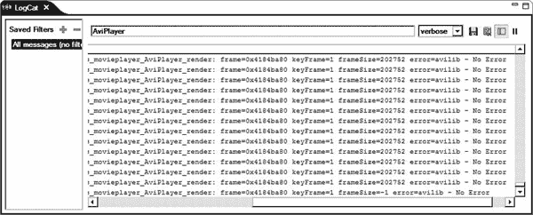

# 八、项目：为 AVI 电影扩展电影播放器

在第六章中，我们在 Android 上开发了一个电影播放器应用。应用通过内容提供者获得现有电影文件的名称，并以列表格式呈现给用户。用户选择电影后，应用会间接启动默认的视频播放器活动来播放电影。

由于我们的电影播放器依赖于默认的视频播放器，它只能播放 Android 平台支持的视频格式。在本章中，我们将扩展电影播放器应用，以支持音频视频交错(AVI)电影文件。AVI 更像是一种容器格式，可以包装许多不同的媒体类型。为了简单起见，我们的 AVI 播放器将只支持 RGB565 色彩空间中未压缩视频的 AVI 文件。

### 处理依赖性

尽管 AVI 格式并不太复杂，但要用 Java 从头开始实现，支持它确实需要相当大的努力。在网上快速搜索 AVI 图书馆，会出现一个开源解决方案列表，大部分都是用 C/C++ 实现的。为了利用这些现有的库，Android NDK 是合适的工具。

我们将在整个项目中使用的 AVI 实现是 AVILib。它是一个更大的开源项目 Transcode 的一部分。

要下载转码，请使用浏览器导航至`[`tcforge.berlios.de/`](http://tcforge.berlios.de/)`，然后点击下载链接。在撰写本文时，Transcode 的最新版本是 1.1.5。代码转换以 bzip2 压缩 TAR 存档文件的形式出现。要提取它的内容，如果你在基于 Windows 的平台上，打开 Cygwin，或者在 Mac OS 和 Linux 上打开终端窗口，转到你下载代码转换的目录，输入`tar jxvf transcode-1.1.5.tar.bz2`。

如图图 8-1 所示，Transcode 附带了很多其他组件，AVILib 提供在它自己的名为`avilib`的目录中。

**图 8-1。** *转码库的内容*

有关 Transcode 的更多信息，请访问 Transcode Forge 网站，网址为`[`tcforge.berlios.de/`](http://tcforge.berlios.de/)`。

### 添加原生支持

在我们开始将 AVILib 集成到我们现有的`MoviePlayer`项目之前，我们需要首先向它添加原生支持。右键单击`MoviePlayer`项目并从上下文菜单中选择**Android Tools****Add Native Support…**以启动添加原生支持对话框。单击“完成”按钮使用默认参数。塞阔雅(我们在上一章安装的)将修改项目配置，它还将包括一组样板文件，如图图 8-2 所示。

**图 8-2。** *为电影播放器添加原生支持*

### 整合 AVILib

最新版本的安卓 NDK 支持模块。这使得第三方模块可以部署在一个中心位置，其他平台可以从这个位置快速地将它们引入到构建过程中。你可以在 Android NDK 文档中的`IMPORT-MODULE.html`文件中了解更多信息。为了简单起见，我们将直接在项目中包含 AVILib 库。

#### 向项目添加 AVILib

将`avilib`目录从 Transcode 复制到`MoviePlayer`项目的`jni`目录下作为子目录，如图图 8-3 所示。

**图 8-3。** *将 AVILib 目录复制到 jni 目录*

使用 Eclipse，从`jni`目录中打开`platform.h`头文件，并从文件中删除下面的`include`语句:

`#include "config.h"`

我们删除了这一行，因为我们不打算使用 AVILib 附带的`Makefile`；相反，我们将使用 Android NDK 的构建系统。

#### 修改 Android.mk 文件

Android NDK 要求 AVILib 模块及其源文件在`Android.mk`文件中定义，以便对其进行编译。使用 Eclipse，打开`Android.mk`文件。第一行，`LOCAL_PATH := $(call my-dir)`，为 Android NDK 项目设置当前工作目录，它需要是`Android.mk`文件中的第一个命令。在这一行之后，我们将开始为 AVILib 定义一个新的模块。

`#
# AVILib
#
include $(CLEAR_VARS)`

`include $(CLEAR_VARS)`行允许 Android NDK 首先清除特定于模块的变量，以防止任何冲突。文件中的每个模块都有一个名字。当从其他模块或从`Application.mk`文件引用该特定模块时，使用该名称。

`# Module name is avilib
LOCAL_MODULE := avilib`

AVILib 的源文件在名为`avilib`的子目录中。为了编译 AVILib，我们只需要两个源文件。

`# Source files
LOCAL_SRC_FILES := avilib/avilib.c avilib/platform_posix.c`

如您所见，`avilib/`前缀是重复的，因为所有源文件都在`avilib`子目录下。这个`Android.mk`文件实际上是一个`Makefile`，里面有很多 Android 特有的宏。`Android.mk`文件由 GNU Make 工具处理，它支持 GNU Make 提供的所有功能。我们可以使用 GNU Make 的`addprefix`函数将该行分成两行。

`# Temporary variable to hold list of source files
MY_SRC_FILES := avilib.c platform_posix.c

# Prefix them with the sub-directory name
LOCAL_SRC_FILES := $(addprefix avilib/, $(MY_SRC_FILES))`

第一行只包含源文件名。第二行通过在源文件名前面加上前缀`avilib/`来设置`LOCAL_SRC_FILES`。

`# Export the includes directory for dependent modules
LOCAL_EXPORT_C_INCLUDES := $(LOCAL_PATH)/avilib`

模块通常有它们的包含路径层次结构；例如，AVILib 头文件在`avilib`子目录中。模块还可以依赖于具有其他包含路径的其他模块，跟踪组合的包含路径可能会成为一项耗时的任务。Android NDK 提供了`LOCAL_EXPORT_C_INCLUDES`变量，允许模块将它们的包含路径导出到它们的从属模块。从属模块自动继承包含路径，不需要手动处理。

`# Build it as static library
include $(BUILD_STATIC_LIBRARY)`

我们将通过告诉 Android NDK 我们希望将 AVILib 构建为静态库来最终确定模块定义。AVILib 不必是一个共享的库，因为我们不会从 AVILib 直接向 Java 公开任何函数。清单 8-1 显示了`Android.mk`文件现在的样子。

**清单 8-1。***JNI/Android . MK 文件*

`LOCAL_PATH := $(call my-dir)

#
# AVILib
#
include $(CLEAR_VARS)

# Module name is avilib
LOCAL_MODULE := avilib

# Temporary variable to hold list of source files
MY_SRC_FILES := avilib.c platform_posix.c

# Prefix them with the sub-directory name
LOCAL_SRC_FILES := $(addprefix avilib/, $(MY_SRC_FILES))

# Export the includes directory for dependent modules
LOCAL_EXPORT_C_INCLUDES := $(LOCAL_PATH)/avilib

# Build it as static library
include $(BUILD_STATIC_LIBRARY)

#
# Movie Player
#
include $(CLEAR_VARS)

# Module name
LOCAL_MODULE := MoviePlayer

# Source files
LOCAL_SRC_FILES := MoviePlayer.cpp

# Build as shared library
include $(BUILD_SHARED_LIBRARY)`

为了确保我们现在可以构建 AVILib，从顶部菜单栏选择**项目**  **构建项目**来构建`MoviePlayer`项目。如果一切顺利，你会看到“构建完成”的提示信息，如图 *** 图 8-4  *** 所示。

**图 8-4。** *控制台视图显示构建完成*

### 实现 AVI 播放器

我们现在将开始实现 AVI 播放器类。AVI 播放器类将依靠 AVILib 来正确读取 AVI 视频文件，并且它将依靠 Android APIs 来呈现视频帧。由于其依赖性，AVI 播放器类将是一个混合类，一部分在 Java 中，另一部分在本地空间中。我们将从定义冰山一角开始，即 AVI 播放器的 Java 部分。

#### Java 部分

AVI 播放器的 Java 部分将采用 AVI 视频文件的名称，并通过其本地方法将其传递给 AVILib。当帧开始出现时，它将设置一个 Android surface 来呈现这些帧。

要开始实现 AVI 播放器的 Java 部分，通过项目浏览器选择`com.apress.movieplayer` Java 包，从顶部菜单栏选择**文件**  **新建**  **类**，将新类命名为`AviPlayer`。清单 8-2 显示了`AviPlayer`类文件的内容。

**清单 8-2。**【AviPlayer.java 档案】??

`package com.apress.movieplayer;

import android.graphics.Bitmap;
import android.util.Log;
import android.view.SurfaceHolder;

/**
 * AVI player.` `*
 * @author Onur Cinar
 */
class AviPlayer implements Runnable {
    /** Log tag. */
    private static final String LOG_TAG = "AviPlayer";

    /** Surface holder. */
    private SurfaceHolder surfaceHolder;

    /** Movie file. */
    private String movieFile;

    /** Playing flag. */
    private boolean isPlaying;

    /** Thread instance. */
    private Thread thread;

    /**
     * Sets the surface holder.
     *
     * @param surfaceHolder
     *            surface holder.
     */
    public void setSurfaceHolder(SurfaceHolder surfaceHolder) {
        this.surfaceHolder = surfaceHolder;
    }

    /**
     * Sets the movie file.
     *
     * @param movieFile
     *            movie file.
     */
    public void setMovieFile(String movieFile) {
        this.movieFile = movieFile;
    }

    /**
     * Start playing.
     */
    public synchronized void play() {
        if (thread == null) {
            isPlaying = true;

            thread = new Thread(this);
            thread.start();
        }
    }` `    /**
     * Stop playing.
     */
    public synchronized void stop() {
        isPlaying = false;
    }

    /**
     * Runs in its thread.
     */
    public void run() {
        try {
            render(surfaceHolder, movieFile);
        } catch (Exception e) {
            Log.e(LOG_TAG, "render", e);
        }

        thread = null;
    }

    /**
     * New bitmap using given width and height.
     *
     * @param width
     *            bitmap width.
     * @param height
     *            bitmap height.
     * @return bitmap instance.
     */
    private static Bitmap newBitmap(int width, int height) {
        return Bitmap.createBitmap(width, height, Bitmap.Config.RGB_565);
    }

    /**
     * Renders the frames from the AVI file.
     *
     * @param surfaceHolder surface holder.
     * @param movieFile movie file.
     * @throws Exception
     */
    private native void render(SurfaceHolder surfaceHolder, String movieFile)
            throws Exception;

    /** Loads the native library. */
    static {
        System.loadLibrary("MoviePlayer");
    }
}`

`AviPlayer`类是非常简单的播放器实现。它提供了 setter 方法来定义电影文件，并提供了一个`android.view.Surface`实例来呈现帧。控制玩家有两种方法，`play`和`stop`。由于 AVI 电影文件可能需要很长时间才能播放，AVI 播放器有自己的线程来执行渲染任务。正如您在代码中看到的，Java 部分不包含任何与处理 AVI 文件相关的代码。本地渲染方法将负责处理和渲染 AVI 电影文件。

#### 本土部分

AVI 播放器的本机部分将充当 AVILib 模块和 AVI 播放器的 Java 部分之间的桥梁。本机部分将从 Java 部分获得 AVI 视频文件名，并开始通过 AVILib 模块读取它。当读取帧时，它将它们交给 Java 部分进行渲染。

要开始实现播放器的本地部分，我们需要为 AVI 播放器生成 C 头文件。和上一章一样，我们将使用`javah`工具来完成这项任务。选择`AviPlayer`类，从外部工具菜单启动`javah`，如图图 8-5 所示。

**图 8-5。** *使用 javah 生成头文件*

该工具将处理 AVI 播放器类，并在`jni`子目录中生成`com_apress_movieplayer_AviPlayer.h` C 头文件。清单 8-3 显示了头文件的内容。

**清单 8-3。***com _ a press _ movie player _ avi player . h 文件*

`/* DO NOT EDIT THIS FILE - it is machine generated */
#include <jni.h>
/* Header for class com_apress_movieplayer_AviPlayer */` `#ifndef _Included_com_apress_movieplayer_AviPlayer
#define _Included_com_apress_movieplayer_AviPlayer
#ifdef __cplusplus
extern "C" {
#endif
/*
 * Class:     com_apress_movieplayer_AviPlayer
 * Method:    render
 * Signature: (Landroid/view/SurfaceHolder;Ljava/lang/String;)V
 */
JNIEXPORT void JNICALL Java_com_apress_movieplayer_AviPlayer_render
  (JNIEnv *, jobject, jobject, jstring);

#ifdef __cplusplus
}
#endif
#endif`

基于生成的头文件，我们现在需要实现`Java_com_apress_movieplayer_AviPlayer_render`函数。选择`jni`目录，从顶部菜单栏选择**文件**  **新建**  **其他…****C/c++****源文件**。将 C 源文件命名为`com_apress_movieplayer_AviPlayer.c`。

如清单 8-4 所示，C 源文件的第一部分简单地包含了必要的库。为了让这个例子更容易理解，我们将使用安卓 NDK 的位图库来绘制 AVI 帧，并使用它的日志库来记录大量的操作。您可能已经注意到，有一组用于不同级别日志记录的宏。这些宏使 Android NDK 的日志机制更容易使用，并添加更多的日志信息来帮助故障排除。

**清单 8-4。***com _ a press _ movie player _ avi player . c 文件*

`#include "com_apress_movieplayer_AviPlayer.h"

#include <limits.h>
#include <android/bitmap.h>
#include <android/log.h>

#include <avilib.h>

#define LOG_TAG "AviPlayer"

#define LOG_PRINT(level,fmt,...) \
        __android_log_print(level, LOG_TAG, "%s: " fmt, __PRETTY_FUNCTION__, ##__VA_ARGS__)

#define LOG_DEBUG(fmt,...) \
        LOG_PRINT(ANDROID_LOG_DEBUG, fmt, ##__VA_ARGS__)` `#define LOG_WARNING(fmt,...) \
        LOG_PRINT(ANDROID_LOG_WARN, fmt, ##__VA_ARGS__)

#define LOG_ERROR(fmt,...) \
        LOG_PRINT(ANDROID_LOG_ERROR, fmt, ##__VA_ARGS__)

#define LOG_INFO(fmt,...) \
        LOG_PRINT(ANDROID_LOG_INFO, fmt, ##__VA_ARGS__)`

清单 8-5 提供了一个`struct`，用于在本地函数之间缓存和共享常用的方法和字段 id，以及像表面容器和位图这样的对象。

**清单 8-5。***avi _ player 结构*

`/**
 * AVI player instance fields.
 */
typedef struct avi_player {
    JNIEnv* env;
    jobject obj;
    jclass clazz;

    /* SurfaceHolder */
    jmethodID lockCanvasMethodId;
    jmethodID unlockCanvasAndPostMethodId;

    /* Canvas */
    jmethodID drawBitmapMethodId;

    jfieldID isPlayingFieldId;
    jobject surfaceHolder;
    jobject bitmap;

} avi_player_t;`

##### 定义位图助手函数

清单 8-6 `,`中的`newBitmap`函数是一个助手函数，它调用 Java 中的静态`newBitmap`函数来生成给定尺寸的位图。它使用了前一章讨论的一些 JNI 函数和错误处理操作。

**清单 8-6。***new bitmap 函数*

`/**
 * Calls the new bitmap method with the given width and height.
 *` ` * @param p avi player.
 * @param width bitmap width.
 * @param height bitmap height.
 * @return bitmap instance.
 */
jobject newBitmap(avi_player_t* p, int width, int height) {
    jobject bitmap = 0;
    jmethodID newBitmapMethodId = 0;

    LOG_DEBUG("BEGIN p=%p width=%d height=%d", p, width, height);

    newBitmapMethodId = (*p->env)->GetStaticMethodID(p->env, p->clazz,
            "newBitmap", "(II)Landroid/graphics/Bitmap;");
    if (0 == newBitmapMethodId) {
        LOG_ERROR("Unable to find newBitmap method");
        goto exit;
    }

    bitmap = (*p->env)->CallStaticObjectMethod(p->env, p->clazz,
            newBitmapMethodId, width, height);

exit:
    LOG_DEBUG("END bitmap=%p", bitmap);
    return bitmap;
}`

##### 缓存 AVI 球员 id 和参考

`newBitmap`函数(清单 8-6 )通过使用签名`(II)Landroid/graphics/Bitmap;`来查找 Java 方法。正如上一章所讨论的，为了快速找到这些签名，我们可以使用`javap`工具。选择`AviPlayer` Java 类，并选择使用`javap`外部工具。处理完 Java 类文件后，`javap`会输出以下内容:

`Compiled from "AviPlayer.java"
class com.apress.movieplayer.AviPlayer implements java.lang.Runnable {
  private static final java.lang.String LOG_TAG;
    Signature: Ljava/lang/String;
  private android.view.SurfaceHolder surfaceHolder;
    Signature: Landroid/view/SurfaceHolder;
  private java.lang.String movieFile;
    Signature: Ljava/lang/String;
  private boolean isPlaying;
    Signature: Z
  private java.lang.Thread thread;
    Signature: Ljava/lang/Thread;
  static {};
    Signature: ()V` `  com.apress.movieplayer.AviPlayer();
    Signature: ()V

  public void setSurfaceHolder(android.view.SurfaceHolder);
    Signature: (Landroid/view/SurfaceHolder;)V

  public void setMovieFile(java.lang.String);
    Signature: (Ljava/lang/String;)V

  public synchronized void play();
    Signature: ()V

  public synchronized void stop();
    Signature: ()V

  public void run();
    Signature: ()V

  private static android.graphics.Bitmap newBitmap(int, int);
    Signature: (II)Landroid/graphics/Bitmap;

  private native void render(android.view.SurfaceHolder, java.lang.String) throws java.lang.Exception;
    Signature: (Landroid/view/SurfaceHolder;Ljava/lang/String;)V
}`

通过查看输出，我们可以很容易地提取成员字段和方法的签名。为了加快访问速度，可以缓存这些字段和方法 id。清单 8-7 提供了一段代码用于缓存`AviPlayer`的类引用，以及`isPlaying`成员字段的字段 ID。

**清单 8-7。***cache aviplayer 函数*

`*/***

 * Caches the AVI player.
 *
 * @param p avi player.
 * @return result code.
 */
int cacheAviPlayer(avi_player_t* p) {
    int result = 0;
    jclass clazz = 0;
    jfieldID isPlayingFieldId = 0;

    /* Get object class instance. */
    clazz = (*p->env)->GetObjectClass(p->env, p->obj);
    if (0 == clazz) {
        LOG_ERROR("Unable to get class");` `        goto exit;
    }

    /* Get is playing field id. */
    isPlayingFieldId = (*p->env)->GetFieldID(p->env, clazz, "isPlaying", "Z");
    if (0 == isPlayingFieldId) {
        LOG_ERROR("Unable to get isPlaying field id");
        (*p->env)->DeleteLocalRef(p->env, clazz);
        goto exit;
    }

    result = 1;

    p->clazz = clazz;
    p->isPlayingFieldId = isPlayingFieldId;

exit:
    return result;
}`

在代码的后面,`isPlaying`成员字段的值将用于控制播放器的生命周期。

##### 缓存曲面夹具 id 和参照

Android 框架允许用户界面(UI)只能在 UI 线程中修改。电影文件通常需要很长时间才能播放，并且在整个播放过程中会涉及许多 UI 操作。直接在 UI 线程中执行这些操作并不是一个好的做法。

Android 框架提供了 surface 对象，允许应用从非 UI 线程绘制到 UI。表面是媒体应用的最佳工具。Android 应用可以通过`SurfaceHolder`对象访问 surface 对象。`SurfaceHolder`对象提供了两个主要的方法，`lockCanvas`和`unlockCanvasAndPost`，允许应用操作表面对象。因为我们正在实现一个电影播放器应用，所以在整个播放过程中会大量调用这些方法。清单 8-8 显示了`cacheSurfaceHolderMethods`函数来缓存这些常用方法的方法 id。

**清单 8-8。***cacheSurfaceHolderMethods 函数*

`/**
 * Cache surface holder method ids.
 *
 * @param p avi player.
 * @return result code.` ` */
int cacheSurfaceHolderMethods(avi_player_t* p) {
    int result = 0;

    jclass surfaceHolderClazz = 0;
    jmethodID lockCanvasMethodId = 0;
    jmethodID unlockCanvasAndPostMethodId = 0;

    surfaceHolderClazz = (*p->env)->FindClass(p->env,
            "android/view/SurfaceHolder");
    if (0 == surfaceHolderClazz) {
        LOG_ERROR("Unable to find surfaceHolder class");
        goto exit;
    }

    lockCanvasMethodId = (*p->env)->GetMethodID(p->env, surfaceHolderClazz,
            "lockCanvas", "()Landroid/graphics/Canvas;");
    if (0 == lockCanvasMethodId) {
        LOG_ERROR("Unable to find lockCanvas method");
        goto exit;
    }

    unlockCanvasAndPostMethodId = (*p->env)->GetMethodID(p->env,
            surfaceHolderClazz, "unlockCanvasAndPost",
            "(Landroid/graphics/Canvas;)V");
    if (0 == unlockCanvasAndPostMethodId) {
        LOG_ERROR("Unable to find unlockCanvasAndPost method");
        goto exit;
    }

    p->lockCanvasMethodId = lockCanvasMethodId;
    p->unlockCanvasAndPostMethodId = unlockCanvasAndPostMethodId;

    result = 1;

exit:
    return result;
}`

##### 缓存画布 id 和引用

`SurfaceHolder`对象提供了一个画布来绘画。AVI 播放器代码将把每个 AVI 帧转换成一个位图对象，该对象将被绘制在画布上。这个操作在播放过程中也会出现很多次。如清单 8-9 所示的`cacheCanvasMethods`函数缓存了`Canvas`类的`drawBitmap`方法的方法 ID。

**清单 8-9。**??【cacheCanvasMethods】函数

`/**
 * Cache canvas method ids.
 *
 * @param p avi player.
 * @return result code
 */
int cacheCanvasMethods(avi_player_t* p) {
    int result = 0;

    jclass canvasClazz = 0;
    jmethodID drawBitmapMethodId = 0;

    canvasClazz = (*p->env)->FindClass(p->env, "android/graphics/Canvas");
    if (0 == canvasClazz) {
        LOG_ERROR("Unable to find canvas class");
        goto exit;
    }

    drawBitmapMethodId = (*p->env)->GetMethodID(p->env, canvasClazz,
            "drawBitmap",
            "(Landroid/graphics/Bitmap;FFLandroid/graphics/Paint;)V");
    if (0 == drawBitmapMethodId) {
        LOG_ERROR("Unable to get drawBitmap method");
        goto exit;
    }

    p->drawBitmapMethodId = drawBitmapMethodId;

    result = 1;

exit:
    return result;
}`

##### 将位图绘制到画布上

清单 8-10 中的`drawBitmap`本地函数使用之前缓存的方法 id 将给定的位图对象绘制到表面对象上。您可能已经注意到，在函数的末尾，对`Canvas`对象的本地引用被删除。由于 JNI 函数返回的本地引用在本地方法调用的整个生命周期内都是有效的，所以在回放结束之前，`Canvas`对象不会被自动清除。由于在回放过程中会多次调用`drawBitmap`函数，它可以用不再使用的`Canvas`实例快速填充内存。为了防止这种情况，函数在终止之前删除了对`Canvas`对象的本地引用。

**清单 8-10。***draw bitmap 函数*

`/**
 * Draw bitmap.
 *
 * @param p avi player.
 * @return result code
 */
int drawBitmap(avi_player_t* p) {
    int result = 0;
    jobject canvas = 0;

    /* Lock and get canvas */
    canvas = (*p->env)->CallObjectMethod(p->env, p->surfaceHolder,
            p->lockCanvasMethodId);
    if (0 == canvas) {
        LOG_ERROR("Unable to lock canvas");
        goto exit;
    }

    /* Draw bitmap */
    (*p->env)->CallVoidMethod(p->env, canvas, p->drawBitmapMethodId, p->bitmap,
            0.0, 0.0, 0);

    /* Unlock and post canvas */
    (*p->env)->CallVoidMethod(p->env, p->surfaceHolder,
            p->unlockCanvasAndPostMethodId, canvas);

    result = 1;

exit:
    (*p->env)->DeleteLocalRef(p->env, canvas);

    return result;
}`

##### 打开 AVI 文件

`openAvi`函数，如清单 8-11 所示，提供了对 AVILib 打开 AVI 文件的必要调用。这个函数接受一个 Java 字符串作为参数。它首先将其转换为 C 字符串，以便能够将其用作`AVI_open_input_file`函数的参数。它在终止前释放 C 字符串。

**清单 8-11。***open avi 函数*

`/**
 * Opens the given AVI movie file.
 *` ` * @param movieFile movie file.
 * @return avi file.
 */
avi_t* openAvi(avi_player_t* p, jstring movieFile) {
    avi_t* avi = 0;
    const char* fileName = 0;

    /* Get movie file as chars. */
    fileName = (*p->env)->GetStringUTFChars(p->env, movieFile, 0);
    if (0 == fileName) {
        LOG_ERROR("Unable to get movieFile as chars");
        goto exit;
    }

    /* Open AVI input file. */
    avi = AVI_open_input_file(fileName, 1);

    /* No need to have the file name. */
    (*p->env)->ReleaseStringUTFChars(p->env, movieFile, fileName);

exit:
    return avi;
}`

##### 渲染 AVI 文件

最后一段代码是本机 render 方法的实际实现。如清单 8-12 所示，它使用前面讨论的助手函数初始化环境。在一个循环中，它遍历 AVI 帧，用帧数据填充位图对象，并使用`drawBitmap`函数在表面上绘制位图。在每一帧之后，它检查`isPlaying`标志的值，如果播放器已经停止，则终止。因为可以从两个线程访问`isPlaying`标志，所以在检查`isPlaying`标志的值之前，它使用 JNI 的监控函数来同步对象实例。根据 AVI 电影的帧速率，它会在每一帧后休眠，以匹配实际播放时间。

**清单 8-12。***Java _ com _ a press _ movie player _ avi player _ render 函数*

`void Java_com_apress_movieplayer_AviPlayer_render(JNIEnv* env, jobject obj,
        jobject surfaceHolder, jstring movieFile) {
    avi_player_t ap;
    avi_t* avi = 0;
    jboolean isPlaying = 0;
    double frameRate = 0;
    long frameDelay = 0;
    long frameSize = 0;` `char* frame = 0;
    int keyFrame = 0;

    /* Cache environment and object. */
    memset(&ap, 0, sizeof(avi_player_t));
    ap.env = env;
    ap.obj = obj;
    ap.surfaceHolder = surfaceHolder;

    /* Cache surface holder and canvas method ids. */
    if (!cacheAviPlayer(&ap) || !cacheSurfaceHolderMethods(&ap)
            || !cacheCanvasMethods(&ap)) {
        LOG_ERROR("Unable to cache the method ids");
        goto exit;
    }

    /* Open AVI input file. */
    avi = openAvi(&ap, movieFile);
    if (0 == avi) {
        LOG_ERROR("Unable to open AVI file.");
        goto exit;
    }

    /* New bitmap. */
    ap.bitmap = newBitmap(&ap, AVI_video_width(avi), AVI_video_height(avi));
    if (0 == ap.bitmap) {
        LOG_ERROR("Unable to generate a bitmap");
        goto exit;
    }

    /* Frame rate. */
    frameRate = AVI_frame_rate(avi);
    LOG_DEBUG("frameRate=%f", frameRate);

    frameDelay = (long) (1000 / frameRate);
    LOG_DEBUG("frameDelay=%ld", frameDelay);

    /* Play file. */
    while (1) {
        /* Lock the bitmap and get access to raw data. */
        AndroidBitmap_lockPixels(env, ap.bitmap, (void**) &frame);

        /* Copy the next frame from AVI file to bitmap data. */
        frameSize = AVI_read_frame(avi, frame, &keyFrame);
        LOG_DEBUG("frame=%p keyFrame=%d frameSize=%d error=%s",
                frame, keyFrame, frameSize, AVI_strerror());

        /* Unlock bitmap. */
        AndroidBitmap_unlockPixels(env, ap.bitmap);` `        /* Synchronize on the current object. */
        if (0 != (*env)->MonitorEnter(env, obj)) {
            LOG_ERROR("Unable to monitor enter");
            goto exit;
        }

        isPlaying = (*env)->GetBooleanField(env, obj, ap.isPlayingFieldId);

        /* Done synchronizing. */
        if (0 != (*env)->MonitorExit(env, obj)) {
            LOG_ERROR("Unable to monitor exit");
            goto exit;
        }

        /* If there is no frame or player stopped. */
        if ((-1 == frameSize) || (0 == isPlaying)) {
            break;
        }

        /* Draw bitmap. */
        drawBitmap(&ap);

        /* Wait for the next frame. */
        usleep(frameDelay);
    }

exit:
    if (0 != avi) {
        AVI_close(avi);
    }
}`

#### 更新 Android.mk

`Android.mk`文件中的`MoviePlayer`模块需要用位图和日志功能所需的 C 源文件名和系统库进行更新。更新`Android.mk`文件中的`MoviePlayer`模块，如下所示:

`#
# Movie Player
#
include $(CLEAR_VARS)

# Module name
LOCAL_MODULE := MoviePlayer

# Source files` `LOCAL_SRC_FILES := com_apress_movieplayer_AviPlayer.c

# Static libraries
LOCAL_STATIC_LIBRARIES := avilib

# System libraries
LOCAL_LDLIBS := -llog -ljnigraphics

# Build as shared library
include $(BUILD_SHARED_LIBRARY)`

在这个版本的文件中，`LOCAL_LDLIBS`变量定义了两个额外的系统库，以便在构建过程中进行链接。

### 定义 AVI 玩家活动

AVI 播放器类需要一个`surface`来回放 AVI 文件。AVI 播放器活动将包装`AviPlayer`对象，并提供一个表面和电影路径。

#### 定义布局

从顶部菜单栏选择**文件**  **新建**  **其他…****Android****Android XML 布局文件**将一个新的布局文件添加到项目中作为`avi_player.xml`。布局将只包含一个填充整个屏幕的`SurfaceView`对象。清单 8-13 显示了布局文件的内容。

**清单 8-13。***avi _ player . XML 布局文件*

`<?xml version="1.0" encoding="utf-8"?>
<LinearLayout xmlns:android="http://schemas.android.com/apk/res/android"
    android:layout_width="fill_parent"
    android:layout_height="fill_parent"
    android:orientation="vertical" >

    <SurfaceView
        android:id="@+id/surface_view"
        android:layout_width="fill_parent"
        android:layout_height="fill_parent" />

</LinearLayout>`

#### 定义活动

从顶部菜单栏选择**文件**  **新建**  **类**以启动新建 Java 类对话框。新类将扩展`Activity`类，并实现`SurfaceHolder.Callback`接口，如图图 8-6 所示。

**图 8-6。***AVI 玩家活动的新 Java 类对话框*

这个类文件的实现如清单 8-14 所示。正如在`onCreate`方法中看到的，AVI 玩家活动将接收 AVI 电影文件名作为启动意图的一部分。它会用给定的电影文件配置 AVI 播放器，并依靠`SurfaceHolder`回调来启动和停止 AVI 播放器。

**清单 8-14。**【AviPlayerActivity.java 档案】??

`package com.apress.movieplayer;

import android.app.Activity;
import android.os.Bundle;
import android.view.SurfaceHolder;
import android.view.SurfaceHolder.Callback;
import android.view.SurfaceView;

/**
 * AVI movie player activity.
 *
 * @author Onur Cinar
 */
public class AviPlayerActivity extends Activity implements Callback {
    /** AVI player. */
    private AviPlayer aviPlayer;

    /**
     * On create.
     *
     * @see Activity#onCreate(Bundle)
     */
    protected void onCreate(Bundle savedInstanceState) {
        super.onCreate(savedInstanceState);

        setContentView(R.layout.avi_player);

        SurfaceView surfaceView = (SurfaceView) findViewById(R.id.surface_view);
        surfaceView.getHolder().addCallback(this);

        aviPlayer = new AviPlayer();
        aviPlayer.setMovieFile(getIntent().getData().getPath());
    }

    /**
     * Surface changed.
     *
     * @see Callback#surfaceChanged(SurfaceHolder, int, int, int)
     */
    public void surfaceChanged(SurfaceHolder holder, int format, int width,
            int height) {
    }

    /**
     * Surface created.` `     *
     * @see Callback#surfaceCreated(SurfaceHolder)
     */
    public void surfaceCreated(SurfaceHolder holder) {
        aviPlayer.setSurfaceHolder(holder);
        aviPlayer.play();
    }

    /**
     * Surface destroyed.
     *
     * @see Callback#surfaceDestroyed(SurfaceHolder)
     */
    public void surfaceDestroyed(SurfaceHolder holder) {
        aviPlayer.stop();
    }
}`

#### 修改 AndroidManifest.xml

我们想让`AviPlayerActivity`成为 AVI 电影文件的系统默认播放器。我们将使用适当的意图过滤器修改`AndroidManifest.xml`文件来实现这一点。在定义了`MoviePlayerActivity`之后，立即定义一个新活动，如下所示:

`<activity android:name=".AviPlayerActivity"
android:label="@string/avi_player_label">
    <intent-filter>
        <action android:name="android.intent.action.VIEW" />
        <category android:name="android.intent.category.DEFAULT" />
        <category android:name="android.intent.category.BROWSABLE" />
        <data android:mimeType="video/avi" />
    </intent-filter>
</activity>`

意图过滤器为具有`video/avi` MIME 类型的电影文件提供`VIEW`动作。现在，当用户选择 AVI 电影文件时，Android 会将 AVI 播放器作为一个选项。

#### 更新字符串资源

在`res/values/strings.xml`中，AVI 玩家活动的标签也应该被添加到字符串资源中。

`<?xml version="1.0" encoding="utf-8"?>
<resources>
    ...` `    <string name="avi_player_label">AVI Player</string>
</resources>`

### 将 AVI 文件扫描到媒体商店

Android 平台有一个默认的媒体扫描器，它用音频、视频和图片文件的列表更新媒体商店。由于 Android 平台不直接支持 AVI 文件，因此媒体扫描仪不会自动将它们添加到媒体商店。我们将在前面创建的`MoviePlayerActivity`类中添加扫描功能。

`/**
 * Goes through the external movies directory and scans the AVI files into
 * the movies.
 */
private void scanAviFiles() {
    LinkedList<File> queue = new LinkedList<File>();
    queue.add(Environment.getExternalStorageDirectory());

    while (!queue.isEmpty()) {
        File dir = queue.poll();
        Log.i(LOG_TAG, "Scanning " + dir.getPath());

        File[] files = dir.listFiles();
        if (files != null) {
            for (File file : files) {
                if (file.isDirectory()) {
                    queue.add(file);
                } else if (file.getName().endsWith(".avi")) {
                    scanAviFile(file);
                }
           }
        }
    }
}`

`scanAviFiles`方法遍历外部存储目录并搜索 AVI 文件。

`/**
 * Scans the given AVI files into movies.
 *
 * @param file
 *            AVI file.
 */
private void scanAviFile(File file) {
    ContentValues contentValues = new ContentValues();` `    String data = file.getPath();
    Log.i(LOG_TAG, "scanAviFile " + data);

    contentValues.put(MediaStore.Video.Media.TITLE, file.getName());
    contentValues.put(MediaStore.Video.Media.DATA, data);
    contentValues.put(MediaStore.Video.Media.MIME_TYPE, "video/avi");

    ContentResolver contentResolver = getContentResolver();

    if (0 >= contentResolver.update(
            MediaStore.Video.Media.EXTERNAL_CONTENT_URI, contentValues,
            MediaStore.Video.Media.DATA + "=?", new String[] { data })) {

        contentResolver.insert(MediaStore.Video.Media.EXTERNAL_CONTENT_URI,
                contentValues);
    }
}`

当`scanAviFiles`方法找到一个 AVI 文件时，它调用`scanAviFile`方法。`scanAviFile`方法填充 AVI 文件的媒体信息，并更新它或将其插入媒体存储。我们将在填充电影列表之前调用`scanAviFiles`方法。

`public void onCreate(Bundle savedInstanceState) {
    super.onCreate(savedInstanceState);
    setContentView(R.layout.main);

    scanAviFiles();

    …
}`

为了简单起见，我们在 UI 线程内调用`scanAviFiles`方法；然而，在现实生活中，应该使用一个`AsyncTask`作为这个操作的包装器，以防止大量 IO 操作阻塞 UI 线程。

### 运行应用

在启动应用之前，您需要将一个 AVI 文件部署到设备上。导航到`[`zdo.com/galleon.zip`](http://zdo.com/galleon.zip)`，提取`galleon.avi`文件。`galleon.avi`文件是一个未压缩的原始 AVI 文件，其帧在 RGB565 色彩空间中。使用 Windows 上的命令提示符，或 Linux 和 Mac OS X 上的终端窗口，使用以下命令将 AVI 文件上传到设备上的 SD 卡:

`adb push galleon.avi /sdcard/`

#### 启动电影播放器

使用 Eclipse 在设备上启动电影播放器应用。电影播放器会先扫描 SD 卡，然后列出 AVI 文件，如图图 8-7 所示。

**图 8-7。** *电影玩家活动列表 AVI 电影*

单击 AVI 电影文件，电影播放器将在系统上启动默认的 AVI 电影播放器，这是我们在本章中开发的 AVI 播放器活动。AVI 播放器将立即开始播放 AVI 文件，如图图 8-8 所示。

**图 8-8。** *AVI 玩家活动播放 AVI 电影*

#### 查看图库

AVI 播放器现在是 AVI 文件的默认电影播放器应用。如果您从应用列表中选择图库，您也会在列表中看到 AVI 文件。点击 AVI 文件，Android 会呈现一个可用玩家列表，如图图 8-9 所示。

**图 8-9。** *画廊展示 AVI 球员名单*

#### 检查日志

在电影回放期间，LogCat 视图将显示来自 Java 应用和本地函数的日志消息，如图 8-10 所示。

**图 8-10。** *显示 AVI 玩家日志的日志视图*

### 作业

为了进一步探索前一章中介绍的概念和工具，您可能希望试验项目代码来添加这些功能:

*   **缩略图支持**:正如你在《??》第六章中所记得的，电影播放器列表可以显示电影文件的缩略图。您需要实现一个本地方法来从 AVI 电影文件中提取缩略图，还需要修改 AVI 媒体扫描仪来将缩略图添加到媒体商店。您可以修改逻辑，使 Java 代码能够逐个请求帧，而不是让本机代码读取整个 AVI 文件并对每个帧进行回调。这可以允许 Java 代码只提取第一帧作为缩略图。在获得缩略图后，位图可以被转换成适当的图像格式，并且可以通过媒体商店内容提供商接口保存。
*   **播放器控制:**AVI 播放器自动开始播放 AVI 电影文件，整部电影播放完毕后停止播放。它不为用户提供暂停、停止或重新开始播放的任何控制。实现这些特性将允许您探索 Java 和本机层之间的交互。通过重构本机代码并将阅读器代码分成多个函数，您可以允许 Java 代码控制实现这些特性的流程。

### 总结

在本章中，为了更好地理解 Android NDK 和 JNI 技术，我们扩展了在第六章中构建的电影播放器应用，以支持 AVI 格式的电影文件。我们将一个开源的 AVI 库集成到我们的项目中。在实现本机代码时，我们回顾了方法和字段访问、静态和实例方法执行，以及使用 JNI 函数从本机代码使用监视器的线程同步。