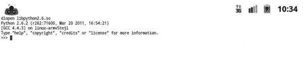
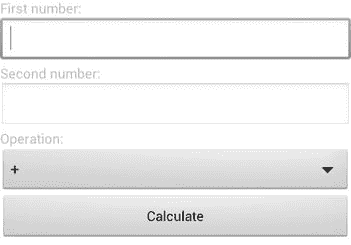

# 九、使用 Eclipse 的 Android 脚本

使用 Java 编程语言开发一个完整的 Android 应用可能会成为自动化和原型制作等简单任务的巨大开销。对于这样简单的任务，Android 脚本成为一个非常方便的工具。脚本语言支持动态类型、自动内存管理和多种编程范例，并且它们提供了一个简单的编程环境。与 Java 相比，脚本语言是解释型编程，执行时不需要编译、链接、打包和部署。在控制台上键入脚本或从脚本文件中读取脚本时，脚本会被即时解释和执行。

基于不同的脚本语言，Android 平台有多种脚本解决方案。在这一章中，我们将探索 Android 脚本层(SL4A)开源项目的 R5 版本。SL4A 为 Android 脚本提供了更通用的解决方案。它允许直接在 Android 设备上编辑和执行脚本，也可以从主机远程编辑和执行。它通过一组外观提供对 Android APIs 的访问，并依赖脚本解释器来处理实际的脚本文件。SL4A 支持大多数流行的脚本语言。

### 【Android 脚本层

SL4A 有三个主要组件:

*   **脚本解释器**:它们在实际的 Android 设备或主机上的沙箱中执行脚本。
*   **Android RPC 客户端**:客户端允许沙箱内解释器正在执行的脚本与 SL4A 通信。
*   **外观**:这些通过 Android RPC 客户端暴露给脚本。它们是一组扩展的 API，用于脚本与 Android 平台进行交互。

在本节中，我们将详细探讨这些组件。

#### 脚本解释器

SL4A 提供了一个脚本宿主，并依赖脚本解释器来执行实际的脚本。SL4A 为大多数流行的脚本语言提供解释器，比如 Python、Perl、Ruby、Lua、BeanShell、JavaScript 和 Tcl。新的脚本语言也可以通过为该脚本语言开发新的 SL4A 解释器来动态地合并到 SL4A 中。

SL4A 在自己的解释器实例中运行沙箱中的每个脚本。这允许多个脚本同时运行，而不会相互影响。

#### Android RPC 代理客户端

在其解释器实例中运行的脚本通过 Android 代理 RPC 客户端与 SL4A 应用通信。客户端建立到 SL4A 的远程过程调用(RPC)连接，并允许脚本通过使用 SL4A 外观与 Android 框架进行交互。SL4A 通过在获得对外观的访问之前发送共享握手秘密，要求所有脚本向 SL4A RPC 服务器进行身份验证，从而加强了每个脚本的安全性。这个握手秘密通过`AP_HANDSHAKE`环境变量提供给 RPC 客户端。

Android RPC 客户端为每一种支持的脚本语言提供。当直接在 Android 设备上执行脚本时，这些客户端模块已经存在于脚本解释器的路径中。当脚本被远程执行时，客户机模块需要出现在主机解释器的路径上。客户端模块可以从 SL4A 网站`[`code.google.com/p/android-scripting/wiki/AndroidFacadeAPI`](http://code.google.com/p/android-scripting/wiki/AndroidFacadeAPI)`获得。

尽管它们的实现不同，但是 RPC 客户端在每种脚本语言中都提供了相同的接口。RPC 客户端模块为脚本环境提供了一个 Android 对象，并封装了 RPC 内部组件。这个对象上的实例方法调用被翻译成 RPC 方法调用，并通过 SL4A 在 Android 设备上远程执行。这允许引入新的 API 方法，而无需修改 RPC 客户端模块。

#### 门面

SL4A 通过大量的外观将 Android 框架 API 暴露给脚本:

*   `ActivityResultFacade`:允许脚本在被`startActivityForResult`调用触发时返回结果。产生的意图在`SCRIPT_RESULT`属性中包含脚本结果。
*   `AndroidFacade`:提供通用的 Android 例程，如开始活动、广播意图、toast 通知、振动设备、通过对话框查询用户输入、发送电子邮件、日志记录和剪贴板操作。
*   `ApplicationManagerFacade`:允许管理 Android 应用，比如获取可启动的活动类名列表，按类名启动一个活动，获取当前运行的活动和服务列表，强制一个应用包停止。
*   `BatteryManagerFacade`:暴露电池管理器，允许跟踪电池状态、健康、类型、级别、电压、温度和技术。
*   `BluetoothFacade`:暴露蓝牙 API，允许控制蓝牙连接，使设备可被发现，查询蓝牙设备及其信息，连接到另一个蓝牙设备，以及通过蓝牙交换数据。该立面要求至少 API 级。
*   `CameraFacade`:允许使用设备的摄像头拍摄照片，并将其保存到指定的路径。
*   `CommonIntentsFacade`:展示了对常见 Android 意图的轻松访问，例如打开联系人列表、进行地图搜索、将浏览器指向本地 HTML 页面、启动条形码扫描仪、通过一个动作启动一项活动，以及显示由 URI 选择的内容。
*   `ContactsFacade`:允许访问联系人，如提供联系人列表用于选择联系人，按属性查询联系人列表，获取所有联系人及其 id 和属性的列表。
*   `EventFacade`:允许管理事件队列，如清除现有事件、删除旧事件、发布新事件、等待事件、阻止脚本执行直到特定事件。它还允许列出、注册和取消注册广播信号。
*   `EyesFreeFacade`:API 4 级以下设备可用。它允许脚本使用文本到语音转换技术说话。现已被`TextToSpeechFacade`弃用。
*   `LocationFacade`:展示位置管理器，可以收集位置数据，查询当前位置和当前位置的地址。
*   `MediaPlayerFacade`:允许播放媒体文件，播放时控制播放器，获取媒体文件信息。
*   `MediaRecorderFacade`:允许将音频和视频录制到指定位置的媒体文件中，并在录制时控制录像机。
*   `PhoneFacade`:显示手机功能，并允许跟踪手机状态、漫游状态、发起呼叫、SIM 卡信息、手机定位以及读取电话号码和语音邮件号码。
*   `PreferencesFacade`:允许访问共享偏好设置，例如获取现有偏好设置列表，以及读取、修改和添加新偏好设置。
*   `SensorManagerFacade`:允许跟踪传感器数据，如光线、加速度、磁场和方向。
*   `SettingsFacade`:暴露设备设置，并允许脚本修改设置，如屏幕超时、亮度、飞行模式、铃声音量、媒体音量和振动。
*   `SignalStrengthFacade`:允许监控手机信号强度。它至少需要 API 级。
*   `SmsFacade`:公开短信功能，允许脚本访问现有短信，标记为已读，删除，发送新短信。
*   `SpeechRecognitionFacade`:公开语音识别功能，允许脚本识别用户语音。
*   `TextToSpeechFacade`:API 4 级以上设备可用。它不赞成`EyesFreeFacade`。它允许脚本使用文本到语音转换技术说话。
*   `ToneGeneratorFacade`:生成给定数字的 DTMF 音。
*   `UiFacade`:通过各种对话框和菜单将 Android UI 组件暴露给脚本，以呈现内容并查询用户输入。它还允许交互式使用 HTML 页面。
*   `WakeLockFacade`:允许脚本保持唤醒锁，以在脚本执行期间保持 CPU 和屏幕打开。
*   `WebCamFacade`:允许从设备摄像头向网络传输 MJPEG 流。它至少需要 API 级。
*   `WifiFacade`:暴露 Wi-Fi 管理器，允许脚本查询 Wi-Fi 连接状态，搜索接入点，连接和断开 Wi-Fi 网络，并在脚本执行期间持有 Wi-Fi 锁。

有关这些外观提供的方法的完整列表，请参考位于`[`code.google.com/p/android-scripting/wiki/ApiReference`](http://code.google.com/p/android-scripting/wiki/ApiReference)`的 SL4A API 参考文档。

### 安装 SL4A

要下载 SL4A，请导航至 SL4A 主页`[`code.google.com/p/android-scripting/`](http://code.google.com/p/android-scripting/)`。左边的特性部分列出了 SL4A 的最新版本和解释器。在撰写本文时，SL4A 的最新版本是 R5。从特色下载中选择`sl4a_r5.apk`将 Android 包下载到您的机器上。SL4A 的旧版本可以在`[`code.google.com/p/android-scripting/downloads/list`](http://code.google.com/p/android-scripting/downloads/list)`的 SL4A 下载页面通过浏览废弃下载下载。

然后可以通过 ADB 安装 APK 文件。在基于 Windows 的主机上，打开命令提示符窗口。在基于 Mac OS X 和 Linux 的主机上，打开一个终端窗口。导航到下载`sl4a_r5.apk`文件的目录，输入`adb install sl4a_r5.apk`将其部署到仿真器或设备，如图图 9-1 所示。

**图 9-1。** *从命令行使用 ADB 安装 SL4A】*

你可能已经注意到了，SL4A Android 包并不太大——只有 857KB。SL4A 包只包括脚本主机和外观。除了 Android 平台提供的解释器之外，解释器不包括在内，因为 SL4A 不知道您在这一点上首选的脚本语言。根据需要，SL4A 从 SL4A 网站下载并安装解释器。

由于解释器不是从 Android Market 下载的，为了允许 SL4A 正确部署解释器，应该在设备设置中选择`“`允许安装非市场应用”选项。在运行 Gingerbread 及以下版本的 Android 设备上，按下 Menu 键，选择**设置**  **应用，即可找到该设置。**在较新的设备上，按菜单键，选择**设置**  **安全**即可找到，如图图 9-2 所示。

**图 9-2。** *设置设备允许安装非市场应用*

**提示:**如果使用 ADB 手动部署解释器，您不需要将设备设置为允许安装非市场应用。解释器的安装分两个阶段进行。首先，SL4A 将解释器安装程序 Android 包安装到设备上，然后解释器安装程序根据目标机器架构下载一组包含实际解释器的压缩 ZIP 档案。您可以从 SL4A 网站的特色下载部分下载解释器安装程序，并使用 ADB 手动安装它们。

接下来，启动 SL4A 应用。第一次启动 SL4A 时，它会询问你是否允许收集使用统计数据，如图图 9-3 所示。您可以拒绝此请求；但是，强烈建议接受使用情况跟踪。收集使用统计数据允许 SL4A 项目将其路线图与 SL4A 用户经常使用的区域和功能相匹配。

**图 9-3。** *SL4A 请求收集使用统计数据的许可*

SL4A UI 提供了一组用于使用该应用的菜单。按菜单键展开菜单栏，如图图 9-4 所示。

**图 9-4。** *SL4A 应用菜单栏*

### 添加解释器

在开始编写脚本之前，您需要安装一个脚本解释器。从应用菜单栏中选择**视图**  **解释器**。SL4A 将显示已安装脚本解释器的列表。SL4A 安装中只捆绑了 Shell 解释器。这个解释器提供了对 Android 设备的控制台访问。使用 Shell 解释器，您可以浏览文件系统并执行本机应用。

从应用菜单栏中，选择**添加**。SL4A 会显示一个可安装的解释器列表，如图图 9-5 所示。

**图 9-5。** *SL4A 可安装解释器*

从解释器列表中，选择一个您计划用于脚本的解释器。在本章中，为了演示 SL4A 的功能，我们将使用 Python 编程语言。选择 Python 解释器，SL4A 会下载 Python 解释器安装程序。在 Android 通知栏中，展开下载图标查看状态，如图图 9-6 所示。

**图 9-6。** *Python 解释器安装程序下载通知*

下载完成后，点击安装按钮开始安装 Android 包，如图图 9-7 所示。

**图 9-7。** *为 Android 安装 Python*

Android 包只包含解释器安装程序，不包含实际的脚本解释器。安装完软件包后，单击 Open 按钮启动解释器安装程序。然后点击安装按钮，部署实际的解释器应用，如图图 9-8 所示。

**图 9-8。** *安装解释器应用*

安装程序将根据设备架构下载 Python 解释器，然后将其部署在设备上。为了高效地使用设备内存，SL4A 解释器的资源部分安装在外部存储中，实际的二进制文件进入设备的内存。如果您在仿真器上运行 SL4A，请确保遵循第五章中提供的配置设置。如果安装失败，请检查以确保两个存储位置都有足够的空间。

成功安装后,“安装”按钮会变成“卸载”按钮。回到 SL4A 应用，您会看到 Python 2.6.2 被添加到可用解释器列表中。

### 执行脚本

SL4A 支持多种开发和执行脚本的方式。在本节中，我们将详细回顾这些方法。

#### 在设备上本地执行脚本

安装了您喜欢的脚本语言的必要解释器后，SL4A 就可以直接在设备上执行脚本了。SL4A 为在本地开发和运行脚本提供了两个选项:交互式控制台模式和脚本编辑器。

##### 使用交互式控制台

当您从可用解释器列表中选择一个解释器时，将启动交互式控制台模式。该模式占据整个屏幕，并提供对实际脚本解释器的控制台访问，如图图 9-9 所示。解释器以横向模式运行，以便更好地利用可用的显示区域。如果在模拟器上运行 SL4A，可以使用组合键 Ctrl+F11 或数字键盘上的键 7 将模拟器显示旋转到横向模式。使用设备的键盘，您可以开始输入命令，这些命令将以交互方式执行。

**图 9-9。** *在虚拟控制台上交互运行的 Python 解释器*

交互模式的优势在于，您可以逐步执行脚本命令，而无需准备一个完整的脚本。这是一个很好的 API 实验工具。

##### 使用脚本编辑器

除了交互式控制台模式，SL4A 还提供了一个用于编辑和存储脚本的脚本编辑器。从交互式控制台模式，使用返回键，返回到脚本视图，并从应用菜单栏中选择**添加**。SL4A 将根据已安装的解释器显示可用的脚本类型列表，如图图 9-10 所示。

**图 9-10。** *启动 Python 脚本编辑器*

从列表中选择 Python 2.6.2，启动 Python 脚本编辑器，如图图 9-11 所示。编辑器的顶部窗格允许您命名脚本文件。底部窗格是脚本编辑器。脚本编辑器区域将根据所选的脚本语言自动填充样板脚本代码。

**图 9-11。** *Python 脚本编辑*

使用编辑器，您可以开发和测试您的脚本，将它们存储在您的设备上，并通过电子邮件共享它们。这些任务可通过脚本编辑器应用菜单栏访问，如图图 9-12 所示。

**图 9-12。** *脚本编辑器应用菜单栏*

API 浏览器是脚本编辑器提供的最强大的功能之一。如图 9-13 所示，它允许您浏览 SL4A 外观提供的方法，以简化脚本开发。

**图 9-13。** *脚本编辑器 API 浏览器列表可用方法*

#### 远程执行脚本

SL4A 不仅仅是一个基于设备的脚本环境。它还支持远程执行在主机上开发的脚本。这允许您利用集成开发环境，同时仍然在 Android 设备上执行您的脚本。

##### 通过 ADB 启动脚本

在主机上开发的脚本可以被复制到 Android 设备上，然后通过命令行上的 ADB 直接执行。这允许自动化脚本的部署和执行。

要将脚本复制到 Android 设备上的 SD 卡，在基于 Windows 的主机上，打开命令提示符窗口，或者在基于 Mac OS X 和 Linux 的主机上，打开终端窗口，并输入以下 ADB 命令:

`adb push script.py /sdcard/sl4a/scripts`

这将把`script.py`文件放到 SL4A 的`scripts`目录中。

将脚本复制到设备上后，您可以根据需要在前台或后台执行它们。要在后台执行脚本，请在主机的命令提示符下发出以下 ADB 命令，所有命令都在一行中:

`adb shell am start -a
com.googlecode.android_scripting.action.LAUNCH_BACKGROUND_SCRIPT -n
com.googlecode.android_scripting/.activity.ScriptingLayerServiceLauncher -e
com.googlecode.android_scripting.extra.SCRIPT_PATH
/sdcard/sl4a/scripts/script.py`

活动管理器(`am`)使用`LAUNCH_BACKGROUND_SCRIPT`意图和脚本路径启动 SL4A 应用。

为了在前台执行该脚本，意图发生了变化，ADB 命令变成了以下内容，全部在一行中:

`adb shell am start -a
com.googlecode.android_scripting.action.LAUNCH_FOREGROUND_SCRIPT -n
com.googlecode.android_scripting/.activity.ScriptingLayerServiceLauncher -e
com.googlecode.android_scripting.extra.SCRIPT_PATH
/sdcard/sl4a/scripts/script.py`

##### 使用远程程序调用

使用在主机上物理运行的脚本解释器，可以在主机上托管和执行脚本。这允许脚本受益于主机的高 CPU 能力及其广泛的调试环境，同时仍然能够远程执行 Android 特定的操作。Android 相关的 API 调用是通过 Android 设备上的 RPC 执行的。

默认情况下，SL4A 不侦听远程 RPC 连接。SL4A RPC 服务器需要首先启动，以便允许主机上运行的脚本与 SL4A 通信。要启动服务器，从应用菜单栏中选择**视图**  **口译员**以查看口译员列表。然后在应用菜单栏中选择**启动服务器**，如图图 9-14 所示。

**图 9-14。** *启动解释器视图中的服务器菜单项*

接下来，SL4A 将要求您选择您想要启动的服务器类型，如图图 9-15 所示。SL4A 支持两种服务器类型:

*   **Private:** 此服务器监听环回网络适配器，并且只能从设备内部或通过 USB 连接到设备的主机到达。
*   **公共:**此服务器监听 Wi-Fi 或数据网络适配器，并且可以通过公共网络访问。

当您只从一台与 Android 设备物理连接的主机上执行脚本时，建议使用私有服务器。

**图 9-15。** *选择脚本服务器类型*

SL4A 将启动服务器，并将其图标放在通知栏上，以指示脚本服务器处于活动状态。如果设备上运行多台服务器，SL4A 将在一个圆圈内的图标旁显示活动服务器的数量，如图图 9-16 所示。

**图 9-16。** *SL4A 活动服务器显示在通知栏上*

您可以选择 SL4A 图标并拖动它来展开通知。点击通知将带您进入脚本监视器活动，其中 SL4A 列出了正在运行的服务器，如图 9-17 所示。服务器列表提供了所有活动服务器的地址、端口号、解释器进程 ID 和持续时间。您可以使用地址和端口号远程连接到服务器。

**图 9-17。** *脚本监控列出活动服务器的活动*

###### 使用连接的设备

要从通过 USB 电缆直接连接到 Android 设备的主机远程执行脚本，请启动一个私有服务器。展开通知图标以启动脚本监视器来查找端口号。环回设备上的端口是开放的，只能从设备本身到达。为了从主机连接到这个端口，需要通过 ADB 转发。

要设置端口转发，在基于 Windows 的主机上，打开命令提示符窗口，或者在基于 Mac OS X 和 Linux 的主机上，打开终端窗口，发出以下命令(用服务器端口号替换`<*server port*>`):

`adb forward tcp:9999 tcp:<*server port*>`

ADB 开始监听主机上的 TCP 端口 9999，并将通信转发给设备上运行的脚本服务器。

在主机上运行的 SL4A RPC 模块需要知道脚本服务器端口号，以便与服务器通信。在脚本中启动 Android 对象时提供端口号:

`# Connect to port 9999
droid = android.Android((‘localhost’, 9999))`

如果不想更改脚本文件，可以通过环境变量注入端口号。如果没有隐式提供目的主机和端口号，SL4A RPC 模块将读取`AP_HOST`和`AP_PORT`环境变量。在启动解释器之前，可以在命令行上或通过系统环境变量列表设置这些环境变量。

###### 使用网络设备

要从可以通过网络到达 Android 设备的主机远程执行脚本，请启动一个公共服务器。展开通知图标以启动脚本监视器来查找公共 IP 地址和端口号。在主机上运行的 SL4A RPC 模块需要知道服务器端口号，以便与之通信。在脚本中启动 Android 对象时，提供 IP 地址和端口号:

`# Connect to IP adress 10.0.2.15 and port number 47176
droid = android.Android((’10.0.2.15’, 47176))`

如果您不想更改脚本文件，可以通过环境变量注入端口号，如前一节所述。

### 添加用户界面

根据它们的功能，脚本有时可能需要与用户交互。尽管脚本语言支持控制台上基于文本的输入和输出，但移动用户更熟悉基于图形和触摸的 UI。SL4A 提供了一组 UI 外观，允许开发人员从他们的脚本中使用 Android GUI。SL4A 提供了基于对话框、基于 web 和全屏的原生 UI 选项。在这一节中，我们将使用每一种 UI 类型实现一个简单的计算器应用，来演示如何从脚本中使用这些外观。

#### 基于对话框的用户界面

与用户互动最简单的方式是通过对话框和菜单。UI facade 附带了一组用于最常见任务的预定义对话框。我们的计算器应用的第一个版本将使用这个外观和用 Python 脚本语言编写的脚本。我们从初始化 SL4A Android RPC 客户端开始。

**注意:**如果您是 Python 新手，请确保您复制了所示代码的缩进。Python 依靠代码缩进来定义代码段的边界。

`#
# SL4A Dialog based UI
#
# @author Onur Cinar` `#
import android

# Initialize the SL4A Android RCP Client
droid = android.Android()`

##### 得到这两个数字

我们希望只要用户想要进行计算，我们的脚本就会一直执行，因此我们将它包含在一个无限循环中:

`# Title of our dialogs
title = "Calculator"

# We will calculate recursively
while True:`

该脚本首先通过输入对话框要求输入第一个数字:

`    # Get the first number from the user
    result = droid.dialogGetInput(title, "Enter the first number:").result

    # Check if user answered it
    if result is None:
        break

    # Convert the text input to an integer
    first = int(result)`

正如你在例子中看到的，检查对话框的结果总是好的，因为用户可能不提供任何输入就取消对话框。

执行脚本时，显示输入对话框，如图图 9-18 所示。只要用户提供一个数字，应用就会循环，并在用户选择 Cancel 按钮时停止。

**图 9-18。** *对话框为第一个数字*

然后，脚本使用以下方法要求输入第二个数字:

`    # Get the second number from the user
    result = droid.dialogGetInput(title, "Enter the second number:").result

    # Check if user answered it
    if result is None:
        break

    # Convert the text input to an integer
    second = int(result)`

##### 做手术

现在这两个数字都可用了，脚本接下来使用列表对话框询问操作:

`# List of possible operations
    operations = [ "+", "-", "*", "/" ]

    # Open a generic dialog
    droid.dialogCreateInput(title, "Select operation")

    # Set the items to make it a list
    droid.dialogSetItems(operations)

    # Make the dialog visible
    droid.dialogShow()

    # Get the user's response
    result = droid.dialogGetResponse().result

    # Check if user answered it
    if (result is None) or (result.has_key("canceled")):
        break`  `# Get the index of selected operation
    index = result["item"]

    # Find the operation at that index
    operation = operations[index]`

我们在这里使用的获取数字的`dialogGetInput`方法是一种获取用户输入的便利方法。UI 外观提供了多种方法来塑造对话框。为了呈现可用选项的列表，我们从通过`dialogCreateInput`方法调用创建的通用输入对话框开始，然后我们通过`dialogSetItems`方法调用提供条目列表以生成列表对话框。自定义对话框后，我们调用`dialogShow`方法使其可见。`dialogGetResponse`方法阻塞，直到用户响应对话框，并返回响应。执行脚本时，出现操作列表对话框，如图图 9-19 所示。

**图 9-19。** *显示计算器操作的对话框*

根据用户的选择，脚本使用给定的两个数字执行必要的操作。

`# Do the calculation
    solution = {
      "+" : first + second,
      "-" : first - second,
      "*" : first * second,
      "/" : first / second
    }[operation]

    # Show the solution and ask if user wants
    # to do more calculations
    droid.dialogCreateAlert(title, "The solution is %d. New calculation?" %
solution)

    # Set the answer options
    droid.dialogSetPositiveButtonText("Yes")
    droid.dialogSetNegativeButtonText("No")`  `# Show dialog
    droid.dialogShow()

    # Get the user's response
    result = droid.dialogGetResponse().result

    # Check if user answered it
    if (result is None) or (result.has_key("canceled")):
        break

    # If user answer saying no
    option = result["which"]
    if option == "negative":
        break`

##### 显示结果

结果以警告对话框的形式呈现给用户，底部有 Yes 和 No 按钮，如图图 9-20 所示。用户可以选择这些按钮中的任何一个来控制脚本的流程。该脚本首先检查对话框是否被关闭或取消。否则，根据所点击的按钮，结果指示用户的响应是肯定的还是否定的。如果用户想继续计算，脚本会重复相同的流程。

**图 9-20。** *对话框显示计算结果*

在终止之前，脚本显示了一个使用`makeToast`方法调用的 toast:

`# Terminating script
droid.makeToast("Thank you")`

结束语“谢谢”祝酒词如图 9-21 所示。

**图 9-21。** *脚本终止上的祝酒辞*

基于对话框的界面需要最少的编程。然而，从用户的角度来看，在这个 UI 中输入信息和导航比在原生 Android 应用中更困难。SL4A 没有提供任何功能来设计这些对话框的样式，以定制应用的外观。基于对话框的界面是不需要太多用户交互的快速自动化任务的最佳选择。

#### 基于网络的用户界面

SL4A 提供了基于 web 的 UI 支持，作为基于对话框的界面的替代。基于 Web 的 ui 在嵌入式 web 浏览器中运行，并且可以使用浏览器已经提供的 CSS 支持来设计样式。与原生 Android 应用类似，使用基于 web 的 UI，多个 UI 组件可以共享同一个屏幕。从用户的角度来看，导航比基于对话框的界面要容易得多。

使用基于 web 的界面并不意味着所有的脚本都必须使用 JavaScript 和 HTML 编写。SL4A 提供了广泛的事件队列机制，使得开发人员可以将基于 JavaScript 的 web 界面与任何脚本语言混合使用，作为应用的后端。这种架构非常类似于目前开发基于 web 的应用的方式。例如，您可以使用 SL4A，使用基于 JavaScript/HTML 的 UI 和基于 Ruby 的后端代码开发您的 Android 应用。

##### 通过 HTML 和 CSS 的用户界面布局

在本节中，我们将使用基于 web 的 UI 重做计算器示例。整个 UI 将使用通用 HTML 代码实现。清单 9-1 显示了`webview.html` UI 文件的源代码。

**清单 9-1。**【webview.html 档案】??

`<html>
<head>
    <title>Calculator</title>

    
</head>
<body>
    <form onsubmit="return calculate();">

    <fieldset>
        <legend>Calculator</legend>

        <label for="first">First number:</label>
        <input type="number" id="first" />

        <label for"second">Second number:</label>
        <input type="number" id="second" />

        <label for="operation">Operation:</label>
        <select id="operation">
            <option value="+">+</option>
            <option value="-">-</option>
            <option value="*">*</option>
            <option value="/">/</option>
        </select>

        <input type="submit" value="Calculate" />
        

    </fieldset>

    </form>`

你可能已经注意到了，在代码的顶部，我们使用 CSS 来设计 UI 的样式。应用将要访问或更新的每个 HTML 元素都有一个惟一的 ID。

##### 通过 JavaScript 操作用户界面

UI 的动态部分是通过 JavaScript 实现的。SL4A 也为 JavaScript 提供了一个 Android RPC 代理客户端。这个 RPC 客户端允许基于 web 的 UI 与 SL4A 和平台进行通信。

`    

</body>
</html>`

##### 使用 Python 的应用逻辑

应用的后端使用 Python 脚本语言作为`webview.py`来实现。与基于对话框的界面示例类似，Python 代码从初始化 Android RPC 代理客户端开始。

`#
# SL4A WebView based UI
#
# @author Onur Cinar
#
import android

# Initialize the SL4A Android RCP Client
droid = android.Android()`

JavaScript/HTML 代码通过使用`webViewShow`方法调用来加载:

`# Show the HTML page
droid.webViewShow("file:///sdcard/sl4a/scripts/webview.html")`

在进行此方法调用之前，HTML 文件应该在设备上可用。使用 ADB，将文件推送到 Android 设备。

`adb push webview.html /sdcard/sl4a/scripts/`

**注意:**由于 Android 模拟器中的一个已知错误，您只能在 Android 设备上运行基于 web 的 UI 示例。不支持 Android 模拟器。

在这个例子中，HTML 文件位于 SL4A 默认脚本目录`/sdcard/sl4a/scripts`；但是，HTML 文件可以位于设备上的任何位置。SL4A 启动嵌入式 web 浏览器并加载基于 web 的 UI，如图图 9-22 所示。

**图 9-22。**嵌入式浏览器内的*计算器界面*

如 JavaScript 代码所示，当用户单击 Calculate 按钮时，应用的 web 部分会发布一个带有数字和操作的`calculate`事件。Python 代码通过 SL4A 事件队列接收该事件:

`# We will calculate recursively
while True:
    # Wait for calculate event
    result = droid.eventWaitFor("calculate").result

    # Make sure that event has data
    if result is not None:
        # Data comes as a comma separated list of values
        request = result["data"].split(",")

        # Extract parameters from request array
        first = int(request[0])
        second = int(request[1])
        operation = request[2]` `        # Calculate solution
        solution = {
            "+" : first + second,
            "-" : first - second,
            "*" : first * second,
            "/" : first / second
        }[operation]`

该脚本可以在设备或主机上运行。SL4A RPC 客户端允许脚本访问主 SL4A 事件队列来接收这个请求。收到请求后，它首先提取参数并进行请求的计算。计算的解也通过 SL4A 事件队列发送到基于网络的接口:

`        # Post the solution to event queue
        droid.eventPost("solution", str(solution))`

已经注册处理`solution`事件的 JavaScript 代码接收解决方案并更新 UI，如图图 9-23 所示。

**图 9-23。**web 界面中显示的*解决方案*

与基于对话框的用户界面相比，基于网络的用户界面更加灵活。因为 Android RPC 代理客户端也可以通过 web 代码访问，所以整个应用也可以用 JavaScript 开发。

#### 全屏幕用户界面

全屏 UI 允许在脚本中使用基于 XML 的 Android 布局文件。在本节中，我们将使用全屏 UI 重做计算器示例。

该脚本首先初始化 Android RPC 代理客户端，然后通过一个字符串变量定义 Android 布局 XML。

`#
# SL4A Full screen UI` `#
# @author Onur Cinar
#
import android

# Initialize the SL4A Android RCP Client
droid = android.Android()

# XML layout
layout = """<?xml version="1.0" encoding="utf-8"?>
<LinearLayout xmlns:android="http://schemas.android.com/apk/res/android"
    android:layout_width="fill_parent"
    android:layout_height="fill_parent"
    android:orientation="vertical"
    android:background="#ffffffff">

    <TextView
        android:layout_width="fill_parent"
        android:layout_height="wrap_content"
        android:text="First number:" />

    <EditText
        android:id="@+id/first"
        android:layout_width="fill_parent"
        android:layout_height="wrap_content"
        android:numeric="integer"
        android:inputType="number" />

    <TextView
        android:layout_width="fill_parent"
        android:layout_height="wrap_content"
        android:text="Second number:" />

    <EditText        
        android:id="@+id/second"
        android:layout_width="fill_parent"
        android:layout_height="wrap_content"
        android:numeric="integer"
        android:inputType="number" />

    <TextView
        android:layout_width="fill_parent"
        android:layout_height="wrap_content"
        android:text="Operation:" />

    <Spinner
        android:id="@+id/operation"
        android:layout_width="fill_parent"
        android:layout_height="wrap_content" /`  `<Button
        android:id="@+id/calculate"
        android:layout_width="fill_parent"
        android:layout_height="wrap_content"
        android:text="Calculate"
        />

    <TextView
        android:id="@+id/solution"
        android:layout_width="fill_parent"
        android:layout_height="wrap_content" />
</LinearLayout>
"""`

默认情况下，SL4A 在透明背景上呈现布局。本示例定义了一个纯色背景。由于字符串资源不能提供字符串，因此布局文件包含硬编码的字符串。每个 UI 组件都有一个 ID 供脚本使用。

`# Show layout
droid.fullShow(layout)`

脚本调用`fullShow`方法显示布局，如图图 9-24 所示。

**图 9-24。** *全屏 UI 显示 Android 布局 XML*

使用`fullSetList`方法将微调项目设置为可用操作列表。

`# List of possible operations
operations = [ "+", "-", "*", "/" ]

# Set operation spinner items
droid.fullSetList("operation", operations)`

该脚本等待`click`事件，然后检查被点击组件的 ID 以确保它是 Calculate 按钮。

`# We will calculate recursively
while True:
    # Wait for click event
    event = droid.eventWaitFor("click").result

    # Check if it is the calculate button
    if event["data"]["id"] == "calculate":`

该脚本首先使用`fullQueryDetail`方法找到 UI 组件，然后获取第一个和第二个数字的值。如果没有提供数字，脚本不会进行计算。

`        # Get the first number
        field = droid.fullQueryDetail("first").result["text"]

        # Check if field is empty
        if field == "":
            continue

        # Convert field to integer
        first = int(field)

        # Get the first number
        field = droid.fullQueryDetail("second").result["text"]

        # Check if field is empty
        if field == "":
            continue

        # Convert field to integer
        second = int(field)`

该脚本调用`fullQueryDetail`方法来查找操作微调器，然后使用`selectedItemPosition`属性来确定所选择的操作。

`        # Get the operation index
        index =
int(droid.fullQueryDetail("operation").result["selectedItemPosition"])

        # Get operation
        operation = operations[index]

        # Do the calculation
        solution = {
          "+" : first + second,
          "-" : first - second,
          "*" : first * second,
          "/" : first / second
        }[operation]`

然后使用`fullSetPropery`方法设置解决方案文本视图的`text`属性来显示结果。

`        # Show solution
        droid.fullSetProperty("solution", "text", "Solution is %d" % solution)`

图 9-25 显示了结果显示的一个例子。与基于对话框和基于 web 的替代方式相比，全屏 UI 是唯一一种提供平台外观和感觉的方式。它允许脚本受益于所有现有的 Android UI 组件。

**图 9-25。** *更新显示显示结果*

### 将脚本打包成 apk

SL4A 还可以用来将一个脚本打包成一个可安装的 Android 包。这允许像普通的 Android 应用一样分发脚本。可安装的 Android 包只包含脚本和资源；脚本解释器仍然应该单独安装在目标设备上。在本节中，我们将介绍设置这样一个 Android 项目的步骤，集成脚本文件并将其部署到 Android 设备上。

#### 下载项目模板

为了便于将脚本打包成可安装的 Android 包，SL4A 项目网站提供了一个 Android 项目模板。将浏览器指向`[`android-scripting.googlecode.com/hg/android/script_for_android_template.zip`](http://android-scripting.googlecode.com/hg/android/script_for_android_template.zip)`并下载模板项目作为压缩的 ZIP 存档文件。

在将模板项目导入 Eclipse 之前，您需要确保安装了 Android API level 4。如果没有，使用 Android SDK 管理器下载它，如第五章所述。或者，您可以根据目标平台的 API 级别来更改项目的构建目标。为此，右键单击项目并选择**属性**来启动属性对话框。从左侧列表中选择 Android，将项目构建目标更改为大于等于 4 的 API 级别。

现在我们准备将模板项目导入 Eclipse。打开 Eclipse，从顶部菜单栏选择**文件**  **导入…** ，启动导入向导，如图图 9-26 所示。

**图 9-26。** *Eclipse 项目导入向导*

从源代码列表中，选择 Existing Projects into Workspace，然后单击 Next 按钮。Eclipse 将询问项目文件的位置。选择选择存档文件单选按钮，使用浏览按钮，指向您下载的`script_for_android_template.zip`文件，如图图 9-27 所示。然后单击 Finish 按钮开始导入项目。

**图 9-27。** *从 ZIP 存档文件导入项目*

#### 配置项目

Eclipse 将以名称`ScriptForAndroidTemplate`将模板项目导入到您的工作区中。要重命名项目，右键单击其名称，然后从上下文菜单中选择**重构**  **重命名**，启动重命名 Java 项目向导，如图 9-28 所示。

**图 9-28。**重命名模板项目

除了重命名项目之外，我们还应该更改包名，以防止在部署应用时出现任何命名冲突。在重命名 Java 包本身之前，我们需要重命名`AndroidManifest.xml`文件中的包。打开`AndroidManifest.xml`文件，相应修改 Android 包名。

`<?xml version="1.0" encoding="utf-8"?>
<manifest
    package="com.apress.chapter9"
    android:versionCode="1"
    android:versionName="1.0"
    xmlns:android="http://schemas.android.com/apk/res/android">`

接下来，要重命名 Java 包，右击包名`com.dummy.fooforandroid`并从上下文菜单中选择**重构**重命名来启动重命名包向导。在新名称字段中，输入新的包名`com.apress.chapter9`，如图图 9-29 所示。

**图 9-29。** *改名包*

确保选中“更新引用”选项，然后单击“预览”按钮。Eclipse 将重命名这个包，然后相应地更新所有的引用。在对文件进行任何更改之前，Eclipse 将显示所需的更改，如图 9-30 所示。验证更改后，单击“确定”按钮将更改应用到项目文件。

**图 9-30。** *修改需要重命名的包*

尽管模板项目附带了预配置的一切，但是出于安全原因，除了 Internet 访问权限之外，`AndroidManifest.xml`文件中的所有权限请求都被有意地注释掉了。取消注释正确执行脚本所需的权限。

#### 合并脚本文件

使用 Package Explorer 视图，展开`res`目录，然后展开`raw`目录以显示原始项目资源。模板项目将实际的脚本文件作为原始项目资源保存。

尽管模板项目提供的脚本文件是 Python 脚本，但模板项目实际上可以包含 SL4A 支持的任何类型的脚本。例如，如果您正在使用 Ruby 脚本语言，删除`script.py`引用并将您的脚本作为`script.rb`插入到原始资源中。这里的要点是，脚本文件应该被命名为`script`,并带有适合所用脚本语言的文件扩展名。如果您喜欢用不同的方式重命名它，您将需要相应地修改`Script`类中的`ID`静态字段:

`package com.apress.chapter9;

public class Script {
    …
    public final static int ID = R.raw.script;
    …
}`

SL4A 引擎将这个脚本文件用作主入口点。Android 应用可能包含多个脚本文件，作为主脚本文件的模块或依赖项。这些额外的脚本文件也应该添加到原始资源中。当应用启动时，在执行脚本文件之前，它将原始资源中的所有脚本文件提取到`files`目录中。

#### 部署和运行应用

该应用可以像普通的 Android 应用一样部署和运行，如第五章所述。当它第一次启动时，SL4A 根据所使用的脚本语言在平台上寻找脚本解释器，如果它不可用，就自动安装一个。这仍然需要将 Android 设备配置为允许安装非市场应用。

在撰写本文时，SL4A 不直接支持将解释器与独立的 Android 应用捆绑在一起。尽管它没有得到官方支持，但是可以通过组合 SL4A 源代码中的必要包来修改模板应用，以包含必要的解释器。

### 总结

本章提供了使用 SL4A 开源库的 Android 脚本的快速介绍。我们查看了 SL4A 应用的架构，并研究了 SL4A 提供的解释器和外观。我们还探索了在 Android 设备上本地和远程执行脚本的不同方法。然后，我们介绍了 SL4A 提供的 UI 选项，并通过一个简单的计算器示例比较了它们的用法。最后，我们演示了如何将脚本打包成一个独立的应用，该应用可以作为一个普通的 Android 应用进行分发。