# 十、项目：使用 HTML 和 JavaScript 的电影播放器

在这一章中，我们将使用 SL4A 框架用 HTML 和 JavaScript 重新实现我们在第五章中开发的电影播放器应用。由于 SL4A 框架没有提供电影播放器应用所需的所有功能，我们将更进一步，将一个新的自定义外观集成到 SL4A 框架中。我们将把生成的应用打包成一个独立的 Android 脚本应用，可以像普通的 Android 应用一样进行分发和部署。

### 获取 SL4A 源代码

我们的电影播放器应用需要访问媒体商店内容提供商，以便查询设备上的电影文件列表。现有的 SL4A 版本 R5 外观都不提供对媒体商店的访问。作为这个例子的一部分，我们将开发一个新的外观，使脚本应用能够从平台获取必要的信息。SL4A 框架目前不支持新外观的动态发现，并且仅限于使用内置外观。

T 要添加新的外观，SL4A 框架源代码需要稍微修改一下。为了实现这一点，在本节中，我们将从 SL4A 源代码库中检查 SL4A 源代码。

#### 准备工作空间

SL4A R5 源代码要求在主机上安装 Android API level 3、4、7 和 8 平台 SDK。如第五章所述，从顶部菜单栏选择**窗口**  ** Android SDK 管理器**启动 SDK 管理器，并将这些 SDK 下载到主机上。

SL4A 项目依赖于 Eclipse 中预定义的`ANDROID_SDK` classpath 变量来编译。要定义这个变量，打开 Eclipse Preferences 对话框，如前面章节所述。使用搜索框，过滤类路径变量的首选项列表。然后单击“新建”按钮启动“新变量输入”对话框。如下定义新的变量条目，如图 10-1 所示:

*   **名称:**设置名称为`ANDROID_SDK`。
*   **Path:** 变量应该指向 Android SDK 在主机上的位置。使用右边的文件夹按钮，选择 Android SDK 目录。

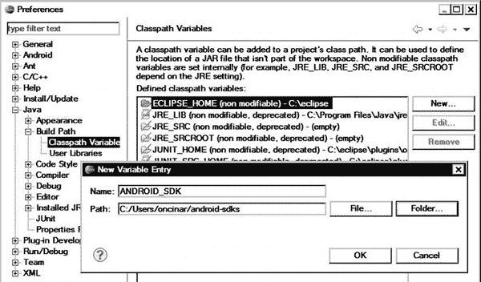

**图 10-1。** *为 SL4A 源代码添加 ANDROID_SDK 类路径变量*

#### 设置 Java 编译器合规级别

SL4A 源代码基于 Java 源码 1.6 版。如果您已经按照第五章中的建议安装了 JDK 版本 6，则不需要额外的配置。否则，为了编译 SL4A 源代码，需要将 workspace 编译器兼容级别更改为 1.6。要更改符合性级别，请打开 Eclipse Preferences 对话框，并使用搜索框过滤编译器的首选项列表。选择 Java 编译器首选项，将兼容级别改为 1.6，如图图 10-2 所示。

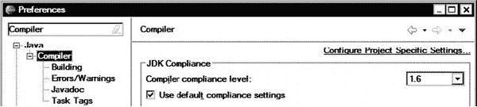

**图 10-2。** *改变工作区 Java 编译器兼容级别*

#### 安装水星

SL4A 源代码通过 Google Code 网站作为 Mercurial 源代码库。要将 SL4A 源代码签出到主机，需要安装 Mercurial 和 Mercurial Eclipse 插件。在 Mac OS X 和 Linux 平台上，需要在下载 Mercurial Eclipse 插件之前安装 Mercurial 二进制文件。在本节中，我们将介绍在这些平台上安装 Mercurial 二进制文件的过程。

##### 在 mac os x 上安装 mercurial

使用您的 web 浏览器，导航到位于`[`mercurial.selenic.com`](http://mercurial.selenic.com)`的 Mercurial 下载站点，下载 Mac OS X 的二进制文件。如图 10-3 所示，Mercurial 网站会自动检测您的操作系统，并为 Mercurial 安装程序提供一个下载按钮。

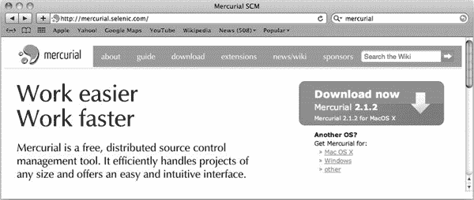

**图 10-3。***Mac OS X 平台的 Mercurial 下载页面*

单击下载按钮，将 Mercurial 安装程序 ZIP 存档文件下载到您的主机上。接下来，进入你的`Downloads`文件夹。根据 Mac OS X 的版本，ZIP 文件可能会自动解压缩，或者您可能需要手动解压缩。此 ZIP 文件包含 Mercurial 二进制文件的 Mac OS X 安装包。

双击可安装软件包文件以启动 Mercurial 安装程序，该程序将引导您完成安装过程。安装完成后，可以在`/usr/local/bin/hg`找到 Mercurial 二进制文件。要验证 Mercurial 安装，请打开一个终端窗口，并在命令提示符下输入`hg`。如果你能看到如图图 10-4 所示的 Mercurial 基本命令列表，你的 Mercurial 安装就成功了。现在可以继续安装 Mercurial Eclipse 插件了。

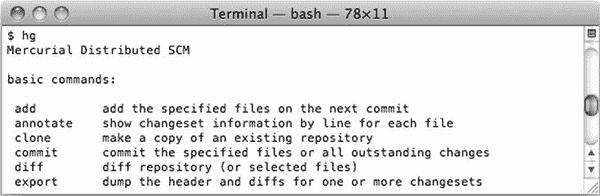

**图 10-4。** *验证 on Mac 上的 Mercurial 安装*

##### 在 Linux 上安装 Mecurial

Mercurial 二进制文件可以通过大多数 Linux 发行版上的应用库获得。打开一个终端窗口，根据您的 Linux 发行版，执行相应的安装命令:

*   **debian/Ubuntu:**??]
*   **开口:??`sudo zipper in mercurial`**
*   **Fedora:** `sudo yum install mercurial`
*   **Gentoo:**

根据您的 Linux 发行版，Mecurial 安装目录可能会有所不同。要找到 Mercurial 二进制文件的位置，请打开终端窗口，并在命令提示符下输入`which hg`。如果你能看到 Mercurial 的安装目录，如图图 10-5 所示，你的 Mercurial 安装成功了。

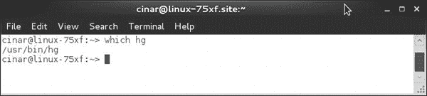

**图 10-5。** *验证 Linux 上的 Mercurial 安装*

#### 安装水星 Eclipse 插件

要安装 Mecurial Eclipse 插件，在 Eclipse 中，从顶部菜单栏选择**帮助**  **安装新软件…** 来启动安装向导。Mercurial 不是官方 Eclipse 软件站点的一部分。点击添加按钮，定义位置为`[`cbes.javaforge.com/update`](http://cbes.javaforge.com/update)`的 Mercurial Eclipse 软件站点，如图图 10-6 所示。

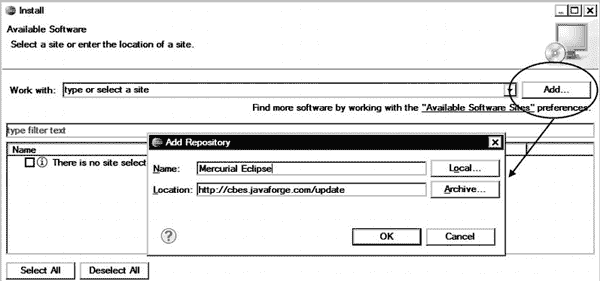

**图 10-6。** *给 Eclipse 添加 Mercurial 软件站点*

添加新的软件站点后，Eclipse 将获取 Mercurial 插件列表，并在安装向导中显示它们。此过程可能需要一些时间，具体取决于您的网络连接。从这个插件列表中，选择 Mercurial Eclipse。对于 Windows 平台，同样选择 Mercurial 的 Windows 二进制，如图图 10-7 所示。

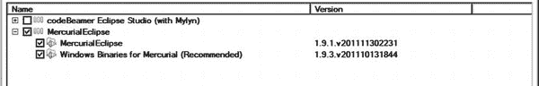

**图 10-7。** *选择 Mercurial 插件*

单击“下一步”按钮继续安装。Eclipse 将列出将要安装的插件。单击“完成”按钮开始安装。

#### 检查 SL4A 源代码

安装好 Mecurial 和 Mecurial Eclipse 插件后，我们就可以检查 SL4A 源代码了。从顶部菜单栏选择**文件**  **新建**  **其他…** ，展开 Mercurial 类别，选择克隆已有的 Mercurial 库，如图 10-8 所示。

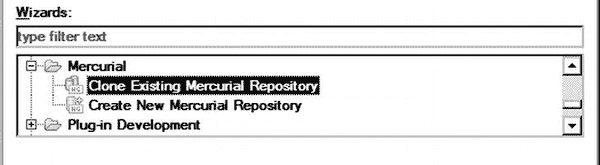

**图 10-8。** *选择克隆现有的 Mercurial 库*

在向导的 URL 字段中，输入`[`code.google.com/p/android-scripting/`](https://code.google.com/p/android-scripting/)`作为存储库位置，如图图 10-9 所示，然后点击 Next 按钮。Mercurial 是一个分布式源代码控制系统，这意味着它会将整个存储库克隆到主机上。此过程可能需要几分钟，具体取决于您的网络连接。

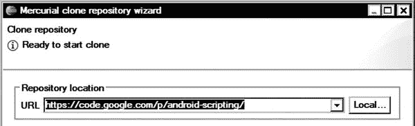

**图 10-9。** *设置用于克隆的存储库位置*

SL4A 的最新官方版本是 R5。在撰写本文时，SL4A 版本 R5 在源代码库中还没有标记。为了将代码库签出到 R5 版本，切换到修订选项卡，输入 1214 作为修订号，如图图 10-10 所示。单击“下一步”按钮继续。

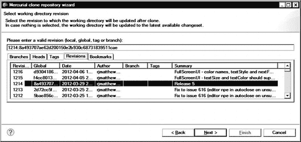

**图 10-10。** *选择 SL4A R5 改版*

Mercurial 克隆库向导将显示 SL4A 库中所有项目的列表，如图 10-11 所示。虽然示例项目不会使用所有的 SL4A 项目，但是选择将除了`DocumentationGenerator`之外的所有项目导入 Eclipse。

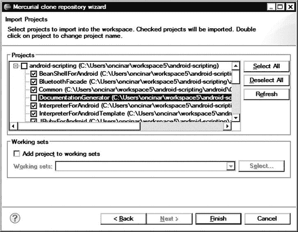

**图 10-11。**?? 选择要导入的项目

Eclipse 将自动开始构建所有的 SL4A 项目。检查问题视图并解决任何报告的问题。

### 电影播放器脚本项目

正如上一章所讨论的，SL4A 提供了一个模板项目，用于将脚本打包成独立的 Android 包。模板项目的源代码称为`ScriptForAndroidTemplate`。示例项目将使用模板项目作为其基础。

#### 克隆模板项目

我们将在不同的项目名称下克隆模板项目，而不是直接修改模板项目。选择`ScriptForAndroidTemplate`项目，右键单击，从上下文菜单中选择**复制**。再次右击并从上下文菜单中选择**粘贴**来启动复制项目向导。将新项目命名为`MoviePlayerScript`，如图图 10-12 所示。

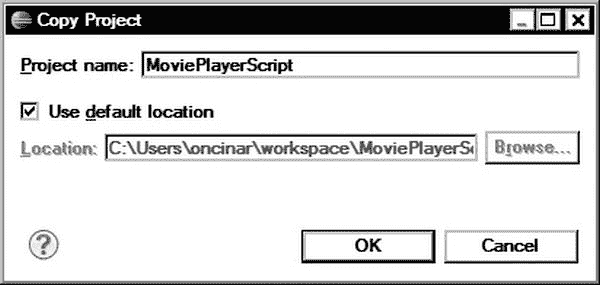

**图 10-12。** *将模板项目克隆为电影播放器脚本*

Eclipse 克隆整个项目设置，包括 Mercurial 元数据。因为新项目不是 SL4A 源代码库的一部分，所以右键单击项目名称并选择**Team****Disconnect**将其从 Mercurial 中分离。

#### 链接到 SL4A 框架代码

`MoviePlayerScript`项目是 SL4A 模板的一个完全相同的克隆。SL4A 模板项目是一个独立的项目，除了解释器之外，没有任何外部依赖性。

SL4A 框架代码被预编译，并作为一个 JAR 文件与 SL4A 模板项目一起提供。因为我们将在这个示例项目中修改 SL4A 框架，所以我们需要删除这个 JAR 文件，并使该项目直接依赖于 SL4A 框架项目。使用 Package Explorer 视图，展开`MoviePlayerScript`项目下的`libs`目录，并删除`script.jar`文件。在删除文件之前，Eclipse 会显示一个确认对话框。

接下来，右键单击项目并选择**首选项**来启动项目首选项对话框。从左窗格中选择 Java 构建路径，然后切换到库选项卡。使用移除按钮，将`script.jar`从项目构建路径中移除，如图图 10-13 所示。

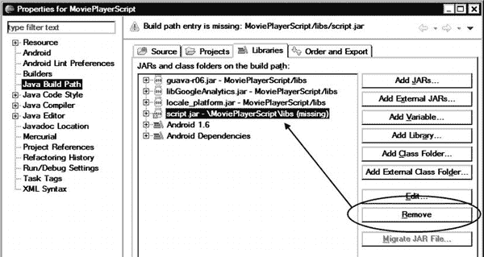

**图 10-13。** *从项目中移除预编译的 SL4A 库*

为了使`MoviePlayerScript`项目直接依赖于 SL4A 框架，切换到 Projects 选项卡并单击 Add 按钮。如图 10-14 所示，选择添加`BluetoothFacade`、`Common`、`InterpreferForAndroid`、`ScriptingLayer`、`SignalStrengthFacade`、`TextToSpeechFacade`、`Utils`、`WebCamFacade`。然后单击确定按钮保存选择。

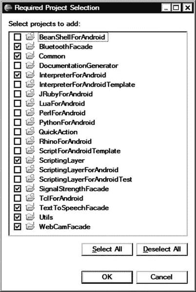

**图 10-14。** *为 SL4A 框架选择所需项目*

除了依赖这些项目之外，这些项目的输出还应该与`MoviePlayerScript`项目打包在一起，以便在 Android 设备上执行。为此，切换到订单和导出选项卡，并选择相同的导出项目列表，如图图 10-15 所示。Eclipse 将重新构建项目。此时，尝试在您的 Android 设备上运行项目，以确保项目配置成功。

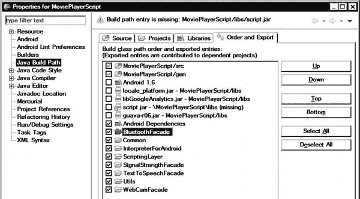

**图 10-15。** *标注 SL4A 项目出口*

#### 重命名项目包

由于`MoviePlayerScript`项目是 SL4A 模板项目的克隆，它共享相同的 Android 包名。为了防止在部署`MoviePlayerScript`项目时出现任何可能的冲突，打开`AndroidManifest.xml`文件并将包名改为`com.apress.movieplayerscript`。要重命名 Java 包，右击`com.dummy.fooforandroid`包并选择**重构**  **重命名**。

### 添加电影外观

为了提供对媒体商店的访问，需要开发新的外观并将其添加到 SL4A 框架中。为了最小化实际 SL4A 框架代码的变化量，我们将为外观实现创建一个单独的项目。

从顶部菜单栏选择**文件**  **新建**  ** Java 项目**，并将 Java 项目命名为`MovieFacade`，如图图 10-16 所示。点击`Next`按钮继续。

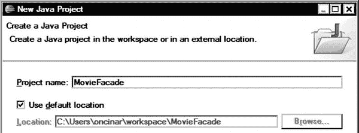

**图 10-16。** *创建电影艺术学院项目*

在下一个屏幕上，选择“项目”选项卡，并添加 Common 和 Utils 项目作为项目依赖项，如图 10-17 所示。`MovieFacade`将使用这些项目中的组件作为 SL4A 框架的一部分。

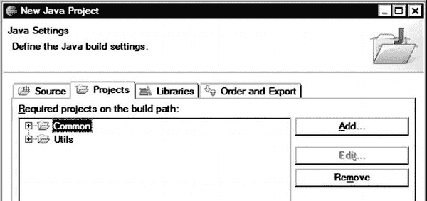

**图 10-17。** *添加 MovieFacade 项目依赖*

`MovieFacade`也将使用来自 Android 框架的组件；但是，它不是一个 Android 项目。我们需要将 Android 框架库添加到项目中。切换到库选项卡，并单击添加变量…按钮。在列表中选择 ANDROID_SDK，点击编辑按钮将其值改为`ANDROID_SDK/platforms/android-7/android.jar`，如图图 10-18 所示。根据您将在外观中使用的 Android 功能，您可以用所需的适当 API 级别替换`android-7`。点击 OK 按钮保存变量，然后点击 Finish 按钮将库更改应用到项目中。

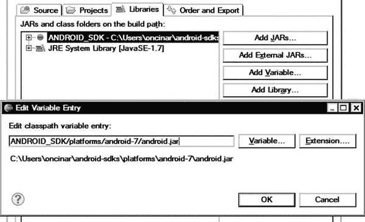

**图 10-18。** *将 Android 框架作为库添加到 movie cade*

#### 创建 MovieFacade 类

为了在 SL4A 框架中充当门面，`MovieFacade`项目需要扩展`com.google.android_scripting.jsonrpc.RpcReceiver`类。选择`MovieFacade`项目，从顶部菜单栏中选择**文件**  **新建**  **类**。在`com.apress.movieplayerscript`包中定义`MovieFacade`类，如图图 10-19 所示。

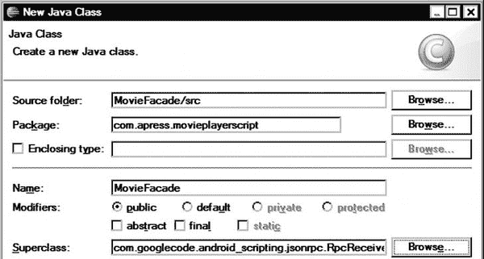

**图 10-19。** *定义电影学院类*

`MovieFacade`将包含一个暴露给脚本的方法`moviesGet`。SL4A 希望使用必要的 RPC 属性对公开的方法进行注释。SL4A 通过`com.googlecode.android_scripting.rpc`包提供了以下 RPC 属性:

*   `Rpc`:该属性用于将方法标记为通过 RPC 公开。它还提供了该方法的简要文档，包括其返回值。
*   `RpcParameter`:该属性用于记录方法的参数。
*   `RpcOptional`:该属性用于将参数标记为可选。
*   `RpcDefault`:该属性用于标记有默认值的参数。
*   `RpcMinSdk`:该属性用于指定执行该方法所需的最低 Android SDK 级别。
*   `RpcStartEvent`:该属性用于标记启动事件生成的方法。
*   `RpcStopEvent`:该属性用于标记终止事件生成的方法。

`MovieFacade`类的源代码显示在清单 10-1 中。

**清单 10-1。*MovieFacade.java***档案

`package com.apress.movieplayerscript;

import java.util.LinkedList;
import java.util.List;

import org.json.JSONException;
import org.json.JSONObject;

import android.app.Service;
import android.content.ContentResolver;
import android.database.Cursor;
import android.provider.MediaStore;
import android.util.Log;

import com.googlecode.android_scripting.facade.FacadeManager;
import com.googlecode.android_scripting.jsonrpc.RpcReceiver;
import com.googlecode.android_scripting.rpc.Rpc;

/**
 * Movie facade.
 *
 * @author Onur Cinar
 */
public class MovieFacade extends RpcReceiver {
    /** Log tag. */
    private static final String LOG_TAG = "MovieFacade";

    /** Service instance. */
    private final Service service;

    /**
     * Constructor.
     *
     * @param manager
     *            facade manager.
     */
    public MovieFacade(FacadeManager manager) {
        super(manager);

        // Save the server instance for using it as a context
        service = manager.getService();
    }

    @Override
    public void shutdown() {

    }`  `/**
     * Gets a list of all movies.
     *
     * @return movie list.
     * @throws JSONException
     */
    @Rpc(description = "Returns a list of all movies.", returns = "a List of
movies as Maps")
    public List<JSONObject> moviesGet() throws JSONException {
        List<JSONObject> movies = new LinkedList<JSONObject>();

        // Media columns to query
        String[] mediaColumns = { MediaStore.Video.Media._ID,
                MediaStore.Video.Media.TITLE, MediaStore.Video.Media.DURATION,
                MediaStore.Video.Media.DATA, MediaStore.Video.Media.MIME_TYPE };

        // Thumbnail columns to query
        String[] thumbnailColumns = { MediaStore.Video.Thumbnails.DATA };

        // Content resolver
        ContentResolver contentResolver = service.getContentResolver();        

        // Query external movie content for selected media columns
        Cursor mediaCursor = contentResolver.query(
                MediaStore.Video.Media.EXTERNAL_CONTENT_URI, mediaColumns,
                null, null, null);

        // Loop through media results
        if (mediaCursor.moveToFirst()) {
            do {
                // Get the video id
                int id = mediaCursor.getInt(mediaCursor
                        .getColumnIndex(MediaStore.Video.Media._ID));

                // Get the thumbnail associated with the video
                Cursor thumbnailCursor = contentResolver.query(
                        MediaStore.Video.Thumbnails.EXTERNAL_CONTENT_URI,
                        thumbnailColumns, MediaStore.Video.Thumbnails.VIDEO_ID
                                + "=" + id, null, null);

                // New movie object from the data
                JSONObject movie = new JSONObject();

                movie.put("title", mediaCursor.getString(mediaCursor
                        .getColumnIndexOrThrow(MediaStore.Video.Media.TITLE)));
                movie.put("moviePath", "file://" + mediaCursor.getString(mediaCursor
                        .getColumnIndex(MediaStore.Video.Media.DATA)));
                movie.put("mimeType", mediaCursor.getString(mediaCursor
                        .getColumnIndex(MediaStore.Video.Media.MIME_TYPE)));` `long duration = mediaCursor.getLong(mediaCursor
                        .getColumnIndex(MediaStore.Video.Media.DURATION));
                movie.put("duration", getDurationAsString(duration));

                if (thumbnailCursor.moveToFirst()) {
                    movie.put(
                            "thumbnailPath",
                            "file://" +
thumbnailCursor.getString(thumbnailCursor

.getColumnIndex(MediaStore.Video.Thumbnails.DATA)));
                } else {
                    movie.put("thumbnailPath", "");
                }

                Log.d(LOG_TAG, movie.toString());

                // Close cursor
                thumbnailCursor.close();

                // Add to movie list
                movies.add(movie);

            } while (mediaCursor.moveToNext());

            // Close cursor
            mediaCursor.close();
        }

        return movies;
    }

    /**
     * Gets the given duration as string.
     *
     * @param duration
     *            duration value.
     * @return duration string.
     */
    private static String getDurationAsString(long duration) {
        // Calculate milliseconds
        long milliseconds = duration % 1000;
        long seconds = duration / 1000;

        // Calculate seconds
        long minutes = seconds / 60;
        seconds %= 60;

        // Calculate hours and minutes
        long hours = minutes / 60;` `        minutes %= 60;

        // Build the duration string
        String durationString = String.format("%1$02d:%2$02d:%3$02d.%4$03d",
                hours, minutes, seconds, milliseconds);

        return durationString;
    }
}`

`MovieFacade`在初始化时获取`FacadeManager`实例。`FacadeManager`允许访问 SL4A Android 服务实例。在与 Android 框架交互时，服务实例可以被外观用作 Android 上下文。`moviesGet`方法的实现部分借用了第五章示例项目，并修改为作为 RPC 方法运行。因为脚本不能直接使用 Java 类，所以`moviesGet`方法的返回类型被改为`JSONObject`列表。

#### 注册外观

虽然现在已经正确定义了外观，但是 SL4A 框架还不知道它。`MovieFacade`需要向`FacadeConfiguration`类注册。

右键单击`ScriptingLayer`项目并选择 Properties。在属性对话框中，选择 Java Build Path，切换到 Projects 页签，添加`MovieFacade`作为依赖项，如图图 10-20 所示。

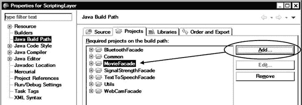

**图 10-20。** *将 MovieFacade 作为依赖添加到脚本层*

在同一个项目下，使用 Package Explorer 视图，展开 Sources 下的`com.googlecode.android_scripting.facade`包，并打开`FacadeConfiguration`类。

`FacadeConfiguration`类充当 SL4A 外观的注册表。SL4A 目前只允许在此手动注册外观。在类文件的顶部，在静态上下文中，外观被添加到`sFacadeClassList`集合中。如下面的代码所示，将标记在`CHANGES BEGIN`和`CHANGES END`注释之间的部分添加到`FacadeConfiguration`类中。

`    if (sSdkLevel >= 8) {
      sFacadeClassList.add(WebCamFacade.class);
    }

    // **** CHANGES BEGIN ****

    // Movie facade
    sFacadeClassList.add(MovieFacade.class);

    // **** CHANGES END ****

    for (Class<? extends RpcReceiver> recieverClass : sFacadeClassList) {
      for (MethodDescriptor rpcMethod :
MethodDescriptor.collectFrom(recieverClass)) {
        sRpcs.put(rpcMethod.getName(), rpcMethod);
      }
    }`

现在`MovieFacade`是 SL4A 框架的一部分，可以从脚本中使用。

#### 导出电影外观

虽然`MovieFacade`已经在 SL4A 框架中正确注册，但是它仍然没有在`MoviePlayerScript`项目的导出列表中声明。右键单击`MoviePlayerScript`项目，选择 Java Build Path，将`MovieFacade`项目添加到项目列表中，并在 Order and Export 选项卡中将其标记为 Export。

### 添加脚本

项目的实际 UI 和应用逻辑将使用 HTML 和 JavaScript 实现。SL4A 框架依赖 Android 框架来呈现 HTML 和解释嵌入的 JavaScript 代码，它不需要下载解释器。

SL4A 模板项目附带了一个示例 Python 脚本。打开`MoviePlayerScript`项目，展开资源，从原始资源目录`/res/raw`中删除`script.py` Python 脚本文件。从顶部菜单栏选择**文件**  **新建**  **文件**，并添加一个`script.html`文件。您可以通过右击该脚本文件并从上下文菜单中选择**打开**  **文本编辑器**来打开该脚本文件进行编辑。在运行时，SL4A 框架将使用其扩展名检测文件类型，并自动启动嵌入式 web 浏览器来执行脚本。

#### HTML 部分

脚本的 HTML 部分非常简单。如下面的代码所示，它只定义了一个 HTML `div`元素，用`movies`的`id`来保存电影列表。CSS 定义了浏览器将如何呈现电影项目。

`<html>
<head>
    
</head>
<body>

    

`

#### JavaScript 部分

该脚本将使用 JavaScript 通过 SL4A 框架与`MovieFacade`通信，以获取电影列表和相关信息。与所有其他脚本语言一样，脚本从初始化 Android 代理 RPC 客户端开始。

`    
</body>
</html>`

### 运行应用

电影播放器脚本应用现在可以部署了，如第五章所述。由于 Android 模拟器中的一个已知错误，示例代码目前只能在 Android 设备上运行。因为示例应用将在外部存储中查找视频文件，所以请确保 Android 设备包含一个带有视频文件的 SD 卡，并断开 Android 设备与您的主机的连接以释放 SD 卡。当你运行应用时，你会看到电影列表，如图图 10-21 所示。

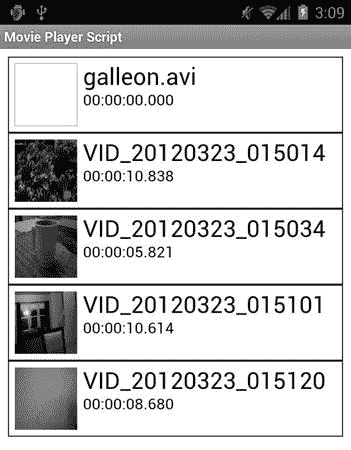

**图 10-21。** *显示电影列表的电影播放器脚本应用*

### 总结

在这一章中，我们深入到 SL4A 框架并探索了它的内部，包括外观注册和项目结构。SL4A 是一个开源项目，具有很强的可扩展性。您可以遵循本章示例中描述的相同步骤来扩展主 SL4A 应用`ScriptingLayerForAndroid`项目，以包含新的外观，并在以后通过任何脚本语言在本地或远程使用它们。

在本书中，我们探讨了 Android 平台的基础，以更好地理解其基础。我们研究了 Android 应用架构，并将这些新概念应用于我们的第一个 Android 应用，一个电影播放器。然后，我们通过集成本地代码库来扩展电影播放器应用，以支持其他视频格式。在开发的每个阶段，我们都采用了 Eclipse 提供的高级开发特性，例如快速导航、内容辅助、代码生成器以及调试和故障排除特性，以简化开发过程。

### 资源

以下资源可用于本章涵盖的主题:

*   Android 脚本层(SL4A)，`[`code.google.com/p/android-scripting/`](http://code.google.com/p/android-scripting/)`
*   水星月食，`[`javaforge.com/project/HGE`](http://javaforge.com/project/HGE)`