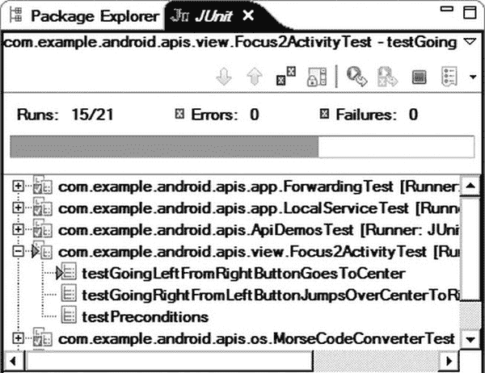

# 十一、附录一：测试 Android 应用

测试是应用开发周期中最重要的阶段之一。Android SDK 提供了一个强大的测试框架，用于定义和运行各种测试来验证 Android 应用的不同方面。Android 测试框架建立在流行的 JUnit 测试框架之上。Android 测试框架扩展了 JUnit，加入了 Android 特有的工具功能，允许测试控制 Android 应用周围的环境。这使得测试所有可能的用例变得容易。

### JUnit 基础知识

JUnit 是 Java 编程语言的测试框架。JUnit 提供了一组类来定义、组织和运行测试用例。JUnit 提供的最重要的类是`junit.framework.TestCase`，它是所有测试用例的基类。Android 测试类也构建在这个类之上，它们遵循相同的代码结构和流程。在列出 A-1 的中显示了一个基本的测试用例类。

**A-1 上市。** *基本测试用例类*

`public class MyTest extends AndroidTestCase {
    /**
     * Sets up the text fixture before each test is executed.
     */
    protected void setUp() {` `    }

    /**
     * Test method.
     */
    protected void testSomething() {
    }

    /**
     * Tears down the text fixture after each test is executed.
     */
    protected void tearDown() {
    }
}`

以下是测试用例类的关键部分:

*   `setUp`:该方法在每次测试前设置测试夹具。开发人员应该重写该类，以正确初始化测试设备，从而确保新的测试运行与之前的测试运行相隔离。
*   `tearDown`:这个方法拆除文本 fixture 并释放所有为测试分配的资源。JUnit 测试框架在整个测试用例的执行过程中保留测试用例类。开发人员应该释放`tearDown`方法中的任何资源，以防止耗尽平台资源。
*   测试用例类可以包含一个或多个测试。测试方法有前缀`test`。JUnit 框架在处理测试用例类时运行所有带有该前缀的方法。

### 断言

在计算机科学中，*断言*是一个谓词，用于表明开发者对给定阶段的应用状态的假设。断言用于测试应用的正确性。

JUnit 框架通过`junit.framework.Assert`类提供了一组常用的断言方法，用于测试用例。基类`junit.framework.TestCase`扩展了`Assert`类，并提供了对这些断言方法的直接访问。

JUnit 公开的断言方法是高度通用的。它们没有涵盖 Android 测试用例所涵盖的频繁断言操作。Android 测试框架在这里发挥了作用，它提供了额外的断言类，这些断言类具有专门为解决 Android 测试需求而设计的大量方法。尽管 JUnit 有`Assert`类，这些额外的类并不是测试用例的基类。开发人员需要将这些类导入到 Java 代码中，并使用它们的静态断言方法。

以下附加断言类是作为`android.test` Java 包的一部分提供的:

*   这个类提供了一组通用的断言方法，JUnit 没有提供这些方法来测试 Java 类型、数组和值。
*   `ViewAsserts`:这个类为 Android 视图提供了一套断言方法。这些方法可用于断言用户界面(UI)组件的可见性，以及它们在显示器上的位置。

### 单元测试

*单元测试*允许开发者孤立地测试应用组件。Android 测试框架在`android.test` Java 包下提供了一组组件测试类，方便了特定于组件的测试需求——比如夹具设置、拆卸和生命周期控制。测试用例可以扩展这些类，并提供建立在所提供功能之上的实际测试方法。

下面是提供的一些测试框架类:

*   这是一个通用的测试用例类，具有访问上下文和资源以及测试应用权限的方法。
*   `ApplicationTestCase`:这个类提供了一个在受控环境中测试`Application`类的环境。它允许测试代码控制应用的生命周期，以及注入依赖项，如独立的上下文。它延迟应用的启动，直到执行`createApplication`方法，以允许开发人员进行夹具设置。
*   `ActivityUnitTestCase`:这是对`Activity`类进行隔离测试的测试类。在测试中，一个活动在与 Android 平台最小连接的情况下启动。它允许在测试之前将模拟上下文和应用实例注入到活动中。为了提供真正的单元测试环境，它覆盖了一组 Android 方法，以防止该活动与其他活动和平台进行交互。
*   `ServiceTestCase`:这是一个测试类，用于在受控环境中测试`Service`类。它为服务生命周期管理提供了基本支持，也允许开发人员通过测试代码注入依赖项和控制环境。
*   `ProviderTestCase2`:这是一个单独的`ContentProvider`类的测试类，用于测试独立内容提供者的应用代码。它没有为提供者使用系统映射，而是维护其内部列表，并将这些内容提供者只暴露给测试用例。它反对使用`ProviderTestCase`类来打破对检测的依赖。

#### 模拟物体

单元测试是一个具有已知输入和输出的可重复过程。组件的所有依赖都通过模拟对象来实现，以消除影响测试结果的外部依赖。

为了方便依赖注入，Android 框架在`android.test.mock` Java 包下为 Android 框架的核心部分提供了模拟对象。这些模拟类通过覆盖和存根它们的正常操作将测试与运行系统隔离开来。除了开发人员定义的部分之外，它们没有任何功能。所有没有被覆盖的方法抛出一个`java.lang.UnsupportedOperationException`来通知开发人员测试代码正在试图与环境通信。提供了以下模拟类:

*   `MockApplication`:这个类扩展了`Application`类，并保留了它的方法。开发人员可以扩展这个模拟类来实现依赖注入所必需的方法。所有其他方法都会提高`UnsupportedOperationException`。
*   `MockContext`:这个类扩展了`Context`类，并保留了它的方法。开发人员可以使用模拟上下文将其他依赖项注入应用。
*   `MockContentResolver`:这个类扩展了`ContentResolver`类，覆盖了 Android 通过权限解析内容提供商的正常方式。模拟内容解析器保留了一个内部映射，而不是使用系统的内容提供者映射。开发人员应该在 fixture 设置期间将他们的模拟内容提供者注册到模拟内容解析器中。模拟内容解析器通过只解析直接注册的模拟内容提供者来隔离被测试的应用。
*   `MockContentProvider`:这个类扩展了`ContentProvider`类，并保留了它的方法。开发人员应该重写必要的内容提供者方法，以便向该内容提供者的使用者提供静态数据。稍后，通过模拟内容解析器，可以将模拟内容提供者注入到被测试的应用中。
*   `MockCursor`:这个类扩展了`Cursor`类，并保留了它的方法。它通常与模拟内容提供者一起使用，为被测试的应用提供静态数据。
*   `MockDialogInterface`:这个类用存根方法实现了`DialogInterface`。开发人员可以重写它的方法来验证对话框的 UI 输入。
*   `MockPackageManager`:这个类扩展了`PackageManager`类，并保留了它的方法。开发人员可以覆盖必要的方法来模拟正在测试的应用和 Android 系统之间的交互。
*   `MockResources`:这个类扩展了`Resources`类，并保留了它的方法。它使开发人员能够通过覆盖模拟方法在被测试的应用中进行资源注入。

### 功能测试

*功能测试*是一种黑盒测试。它根据软件组件的规格来测试它们。功能测试包括输入和检查输出；很少考虑内部程序结构。

Android 测试框架允许通过工具对 Android 应用进行功能测试。Android instrumentation 是一组控制方法和挂钩，用于将用户事件和请求注入到应用中，同时管理其生命周期。插装方法通过`android.app.Instrumentation`类提供。该类在任何应用代码运行之前被实例化。

与单元测试类不同，功能测试类使用实际的系统上下文加载应用，并使用应用的 UI 或向系统公开的 Android 服务将事件提供给应用。功能测试类扩展了`InstrumentationTestCase`类，并通过`getInstrumentation`方法提供对插装实例的访问。在`android.test` Java 包中提供了以下插装类:

*   这个类提供了对单个活动进行功能测试的方法。被测试的活动是使用系统基础设施启动的，然后可以使用插装方法进行操作。它通过为被测试的活动提供更细粒度的配置选项而摒弃了`ActivityInstrumentationTestCase`类。
*   `SingleLaunchActivityTestCase`:这个类启动正在用其`setUp`方法测试的`Activity`类，并在其`tearDown`方法中终止它。与其他测试类不同，这个类在现有的活动实例上运行所有的测试方法，而不是为每个测试设置和拆除活动实例。

#### 用户界面操作

Android 框架要求所有与 UI 组件的交互都发生在应用的主线程中，也称为 *UI 线程*。`InstrumentationTestCase`类为在 UI 线程中运行测试代码提供了以下选项:

*   `TouchUtils`:该类提供了从仪器测试中生成触摸事件的方法，该测试被分类为模拟用户通过触摸屏与应用的交互。
*   `UiThreadTest` : Annotation 可以用来标记测试类中应该在应用的 UI 线程中执行的测试用例。在这种模式下，可能无法使用检测方法。
*   `runTestOnUiThread`:这个方法可以用来调度 UI 线程中的`Runnable`对象。这允许测试用例将测试的一部分注入到应用的 UI 线程中。

### 测试项目

测试项目与一般的 Android 项目没有什么不同。它们是作为独立于实际应用的项目生成的。尽管它们是一个独立的项目，但是最佳实践是将测试项目存储在主项目根目录下的`tests`目录中。

本书第五章中介绍的 Android 开发工具(ADT)为生成测试项目提供了两个选项。一种方法是在创建实际项目的同时创建测试项目。新的 Android 项目向导，在它的第三步，询问你是否也应该生成一个测试项目，如图图 A-1 所示。您可以先标记“创建测试项目”选项，然后配置测试项目。

**图 A-1。** *用新的 Android 项目向导配置一个测试项目*

在应用开发的最开始拥有一个测试项目是测试驱动编程的良好实践。然而，如果测试项目没有在开始时创建，那么创建一个也不迟。ADT 提供了一个新的项目向导，专门用于为工作区中现有的 Android 项目生成一个新的测试项目。

创建新的测试项目，从顶部菜单栏选择**文件**  **新建**  **项目…** ，展开 Android，选择 Android 测试项目，如图 A-2 所示。

**图一-2。** *选择创建一个新的 Android 测试项目*

ADT New Android Test Project 向导将首先询问您这个测试项目的名称。作为新项目的位置，建议使用项目内部的`tests`子目录进行测试。单击“下一步”按钮继续下一步。

每个测试项目都需要与现有的 Android 项目相关联。下一步，向导会要求您选择目标项目，如图图 A-3 所示。选择目标项目，然后单击“下一步”按钮继续。

**图 A-3。** *为测试项目选择目标 Android 项目*

作为最后一步，New Android Test Project 向导将询问新测试项目的目标 Android SDK 版本。选择适合目标 Android 项目的 SDK 目标，点击 Finish 按钮。ADT 将生成测试项目。

### 运行测试

要运行测试用例，请选择测试项目并单击 run 按钮。如图 A-4 所示，Eclipse 将询问项目应该如何执行。从列表中选择 Android JUnit Test，然后单击 OK 按钮继续。

**图 A-4。** *测试项目第一次运行时的运行方式对话框*

ADT 首先构建和部署实际的 Android 项目，然后对测试项目本身进行同样的操作。当测试在目标设备或模拟器上运行时，您可以使用 Eclipse 中的 JUnit 视图来监控它们，如图图 A-5 所示。

**图一-5。** *JUnit 视图显示测试进度*

JUnit 视图有两个窗格:

*   顶部的窗格提供了正在执行的测试列表，以及关于通过和失败的测试用例数量的统计数据。
*   如果一个测试用例失败，底部窗格提供显示错误位置的失败跟踪，如图图 A-6 所示。

**图 A-6。** *显示测试失败的失败痕迹*

在对大型项目中失败的测试用例进行故障排除时，最好只运行那个测试用例，而不是整个测试套件。若要仅运行一个测试，请使用包资源管理器选择测试用例类，然后单击“运行”按钮。Eclipse 将显示运行方式对话框，如图图 A-7 所示。选择 Android JUnit 测试，然后单击确定按钮继续。JUnit 将只运行所选测试用例类中的测试。

**图 A-7。** *执行选中的测试用例类*

### 测量测试代码覆盖率

多少测试就够了？这是测试中最常被问到的问题之一。测试用例的数量并不是测试覆盖率的良好衡量标准。Android SDK 附带了 EMMA，用于测量和报告测试用例的代码覆盖率。

**注意:**代码覆盖率目前仅在 Android 模拟器和根设备上受支持。

尽管 EMMA 是 Android 测试框架的一个重要组成部分，但它在 Android 应用中的使用并没有明确的文档记录。在这一节中，我们将经历从测试项目中生成代码覆盖报告的步骤。

#### 设置艾玛权限

在撰写本文时，Eclipse 的 ADT 插件没有提供对 EMMA 的直接访问。EMMA 代码覆盖工具只能通过基于 Ant 的构建脚本来调用。创建 Android 项目时，Eclipse 不会生成 Ant 构建脚本。应该为应用项目和测试项目手动创建构建脚本。

要创建构建脚本，如果在 Windows 主机上运行，请打开命令提示符，如果使用基于 Mac OS X 或 Linux 的主机，请打开终端窗口，并调用以下命令:

`cd <application directory>
android update project --path .

cd <test directory>
android update test-project --main <application directory> --path .`

这些命令将在应用和测试目录中生成 Ant 构建脚本、`build.xml`和其他必要的属性文件。

#### 为测试运行启用 EMMA

要启用 EMMA，请使用包资源管理器，展开测试项目。如果`build.xml`文件不可见，按 F5 刷新项目目录。右键单击`build.xml`文件并从上下文菜单中选择**运行为** **Ant Build…** 。将出现“编辑配置”对话框。切换到主选项卡，将参数设置为`all clean emma debug install test`，如图 A-8 所示。

**图一-8。** *配置蚂蚁构建脚本*

确保 Android 设备连接到主机，并单击 Run 按钮执行 Ant 构建脚本。构建脚本将应用和测试部署到目标设备或启用 EMMA 的仿真器，如图图 A-9 所示。

**图一-9。** *控制台视图显示艾玛被启用*

在测试用例完成后，脚本将提取 EMMA 结果文件，并在测试项目下的`coverage`目录中生成一个 HTML 格式的报告。使用包资源管理器选择测试项目后，按 F5 键刷新项目目录。展开`coverage`目录，打开`coverage.html`报表文件，如图 A-10 所示。

**图 A-10。** *艾玛代码覆盖报告文件*

EMMA 报告 HTML 文件提供了关于测试用例代码覆盖率的大量信息。通过点击包和类，您可以导航到源文件，并查看没有被任何测试用例执行的代码部分。使用这些信息，您可以扩展测试用例来覆盖更大部分的应用代码。

### 压力测试

*压力测试*是一种测试形式，通过引入超出应用运行能力的负载来确定应用的稳定性。Android SDK 提供了 Monkey 工具来向应用发送伪随机的击键、触摸和手势流。压力测试不是一个可重复的过程；然而，Monkey 工具允许重复事件流来重现错误情况。

要启动 Monkey 工具，首先将目标设备连接到主机或启动模拟器。如果您使用的是基于 Windows 的主机，请打开命令提示符，或者在基于 Mac OS X 和 Linux 的主机上打开终端窗口，并调用以下命令:

`adb shell monkey -p <your application package> -v 500`

这个命令启动 Monkey 工具，并用给定的包名向 Android 应用发送 500 个伪随机事件。关于 Monkey 工具命令行参数的更多信息，见`[`developer.android.com/guide/developing/tools/monkey.html`](http://developer.android.com/guide/developing/tools/monkey.html)`。