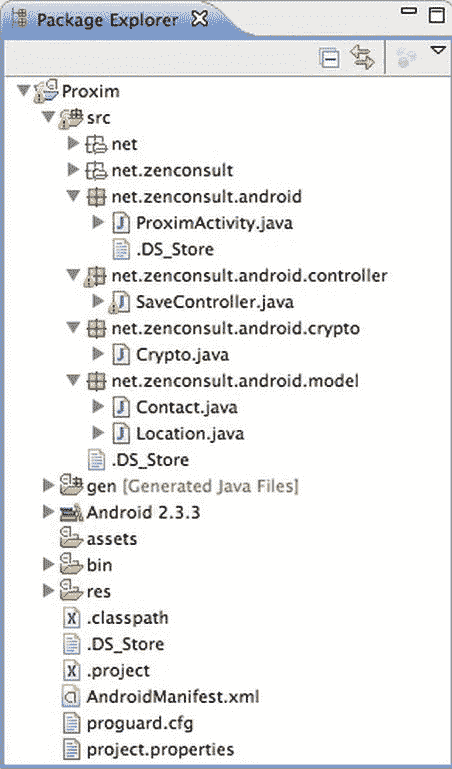

# 四、概念实战：第一部分

在这一章中，我们将把前几章讨论过的所有主题合并在一起。如果您还记得，我们讨论过 Proxim 应用，通过它我们了解了数据加密。我们将在这里详细分析它的源代码。我们还将学习一些需要和使用权限的应用示例。

**Proxim 应用**

Proxim 项目的结构应类似于图 4-1 中的所示



图 4-1 。Proxim 应用结构

让我们从活动开始，这是你的程序通常会开始的地方(见清单 4-1 )。在活动中，我们将创建一个新的联系人对象，其中包含一些信息。

***清单 4-1 。*** *主要活动*

```java
package net.zenconsult.android;
import net.zenconsult.android.controller.SaveController;
import net.zenconsult.android.model.Contact;
import android.app.Activity;
import android.os.Bundle;
import android.view.View;
import android.view.View.OnClickListener;
import android.widget.Button;
public class ProximActivity extends Activity {
    /** Called when the activity is first created. */
    @Override
    public void onCreate(Bundle savedInstanceState) {
        super.onCreate(savedInstanceState);
        setContentView(R.layout.main);
        final Contact contact = new Contact();
        contact.setFirstName("Sheran");
        contact.setLastName("Gunasekera");
        contact.setAddress1("");
        contact.setAddress2("");
        contact.setEmail("sheran@zenconsult.net");
        contact.setPhone("12120031337");
    final Button button = (Button) findViewById(R.id.button1);
        button.setOnClickListener(new OnClickListener() {
           public void onClick(View v) {
              SaveController.saveContact(getApplicationContext(), contact);
           }
        });
    }
}
```

正是这一行创建了一个**联系人**对象:

```java
Contact contact = new Contact();
```

在方法名开头设置了的代码行只需将相关数据添加到联系人对象中。要理解联系人对象的样子，请看一下清单 4-2 。如你所见，对象本身非常简单。它有一组*getter*和*setter*分别用于检索和插入数据。考虑一下名字变量。要将一个人的名字添加到该对象中，您需要调用 setFirstName() 方法，并传入一个类似于 Sheran 的值(如主活动所示)。

***清单 4-2 。****Proxim 应用的联系对象*

```java
package net.zenconsult.android.model;
public class Contact {
    private String firstName;
    private String lastName;
    private String address1;
    private String address2;
    private String email;
    private String phone;
    public Contact() {
    }
    public String getFirstName() {
        return firstName;
    }
    public void setFirstName(String firstName) {
        this.firstName = firstName;
    }
    public String getLastName() {
        return lastName;
    }
    public void setLastName(String lastName) {
        this.lastName = lastName;
    }
    public String getAddress1() {
        return address1;
    }
    public void setAddress1(String address1) {
        this.address1 = address1;
    }
    public String getAddress2() {
        return address2;
    }
    public void setAddress2(String address2) {
        this.address2 = address2;
    }
    public String getEmail() {
        return email;
    }
    public void setEmail(String email) {
        this.email = email;
    }
    public String getPhone() {
        return phone;
    }
    public void setPhone(String phone) {
        this.phone = phone;
    }
    public String toString() {
        StringBuilder ret = new StringBuilder();
        ret.append(getFirstName()  +  "|");
        ret.append(getLastName()  +  "|");
        ret.append(getAddress1()  +  "|");
        ret.append(getAddress2()  +  "|");
        ret.append(getEmail()  +  "|");
        ret.append(getPhone()  +  "|");
        return ret.toString();
    }
    public byte[] getBytes() {
        return toString().getBytes();
    }
}
```

既然我们正在讨论数据存储对象(或者是*模型-视图-控制器*编程概念中的*模型*，那么让我们也来看看清单 4-3 中的位置对象。这又是一个普通的、日常的、简单明了的带有 getters 和 setters 的 Location 对象。

***清单 4-3 。*** *定位物体*

```java
package net.zenconsult.android.model;
public class Location {
    private String identifier;
    private double latitude;
    private double longitude;
    public Location() {
    }
    public double getLatitude() {
        return latitude;
    }
    public void setLatitude(double latitude) {
        this.latitude = latitude;
    }
    public double getLongitude() {
        return longitude;
    }
    public void setLongitude(double longitude) {
        this.longitude = longitude;
    }
    public void setIdentifier(String identifier) {
        this.identifier = identifier;
    }
    public String getIdentifier() {
        return identifier;
    }
    public String toString() {
        StringBuilder ret = new StringBuilder();
        ret.append(getIdentifier());
        ret.append(String.valueOf(getLatitude()));
        ret.append(String.valueOf(getLongitude()));
        return ret.toString();
    }
    public byte[] getBytes() {
        return toString().getBytes();
    }
}
```

太棒了！我们已经解决了这个问题，现在让我们更仔细地看看我们的保存控制器和加密例程。我们可以分别在清单 4-4 和清单 4-5 中看到这些。

***清单 4-4 。***

```java
package net.zenconsult.android.controller;
import java.io.File;
import java.io.FileNotFoundException;
import java.io.FileOutputStream;
import java.io.IOException;
import java.security.InvalidKeyException;
import java.security.NoSuchAlgorithmException;
import javax.crypto.BadPaddingException;
import javax.crypto.Cipher;
import javax.crypto.IllegalBlockSizeException;
import javax.crypto.NoSuchPaddingException;
import javax.crypto.spec.SecretKeySpec;
import net.zenconsult.android.crypto.Crypto;
import net.zenconsult.android.model.Contact;
import net.zenconsult.android.model.Location;
import android.content.Context;
import android.os.Environment;
import android.util.Log;
public class SaveController {
    private static final String TAG = "SaveController";
    public static void saveContact(Context context, Contact contact) {
        if (isReadWrite()) {
           try {
               File outputFile = new File(context.getExternalFilesDir(null),contact.getFirstName());
               FileOutputStream outputStream = new FileOutputStream(outputFile);
               byte[] key = Crypto.generateKey("randomtext".getBytes());
               outputStream.write(encrypt(key,contact.getBytes()));
               outputStream.close();
           } catch (FileNotFoundException e) {
               Log.e(TAG,"File not found");
           } catch (IOException e) {
               Log.e(TAG,"IO Exception");
           }
       } else {
       Log.e(TAG,"Error opening media card in read/write mode!");
       }
    }
    public static void saveLocation(Context context, Location location) {
        if (isReadWrite()) {
           try {
              File outputFile = new File(context.getExternalFilesDir(null),location.getIdentifier());
              FileOutputStream outputStream = new FileOutputStream(outputFile);
              byte[] key = Crypto.generateKey("randomtext".getBytes());
              outputStream.write(encrypt(key,location.getBytes()));
              outputStream.close();
           } catch (FileNotFoundException e) {
              Log.e(TAG,"File not found");
           } catch (IOException e) {
              Log.e(TAG,"IO Exception");
           }
        } else {
        Log.e(TAG,"Error opening media card in read/write mode!");
        }
    }
    private static boolean isReadOnly() {
        Log.e(TAG,Environment
              .getExternalStorageState());
        return Environment.MEDIA_MOUNTED_READ_ONLY.equals(Environment
              .getExternalStorageState());
    }
    private static boolean isReadWrite() {
        Log.e(TAG,Environment
              .getExternalStorageState());
        return Environment.MEDIA_MOUNTED.equals(Environment
              .getExternalStorageState());
    }
    private static byte[] encrypt(byte[] key, byte[] data){
        SecretKeySpec sKeySpec = new SecretKeySpec(key,"AES");
        Cipher cipher;
        byte[] ciphertext = null;
        try {
            Cipher = Cipher.getInstance("AES");
            Cipher.init(Cipher.ENCRYPT_MODE, sKeySpec);
            Ciphertext = cipher.doFinal(data);
        } catch (NoSuchAlgorithmException e) {
            Log.e(TAG,"NoSuchAlgorithmException");
        } catch (NoSuchPaddingException e) {
            Log.e(TAG,"NoSuchPaddingException");
        } catch (IllegalBlockSizeException e) {
            Log.e(TAG,"IllegalBlockSizeException");
        } catch (BadPaddingException e) {
            Log.e(TAG,"BadPaddingException");
        } catch (InvalidKeyException e) {
            Log.e(TAG,"InvalidKeyException");
        }
        return ciphertext;
    }
}
```

***清单 4-5 。***

```java
package net.zenconsult.android.crypto;

import java.security.NoSuchAlgorithmException;
import java.security.SecureRandom;

import javax.crypto.KeyGenerator;
import javax.crypto.SecretKey;

import android.util.Log;

public class Crypto {
 private static final String TAG = "Crypto";

    public Crypto() {
    }

    public static byte[] generateKey(byte[] randomNumberSeed) {
        SecretKey sKey = null;
        try {
            KeyGenerator keyGen = KeyGenerator.getInstance("AES");
            SecureRandom random = SecureRandom.getInstance("SHA1PRNG");
            random.setSeed(randomNumberSeed);
            keyGen.init(256,random);
            sKey = keyGen.generateKey();
        } catch (NoSuchAlgorithmException e) {
            Log.e(TAG,"No such algorithm exception");
        }
        return sKey.getEncoded();
    }
}
```

**总结**

在这一章中，我们已经讨论了前几章中提到的两个关键概念:在存储数据之前加密数据和在应用中使用权限。具体来说，我们查看了两个包含这些概念的应用，并研究了使用不同参数运行每个应用的各种结果。数据加密的概念可能相当容易理解，但 Android 应用权限的话题可能不会立即显现出来。在大多数情况下，您需要的权限与访问设备本身的各种功能有关。这方面的一个例子是连通性。如果您的应用需要与互联网通信，那么您需要互联网权限。我们的示例应用更多地处理创建和使用自定义应用权限。现在，让我们继续讨论传输中的数据加密和 web 应用。**