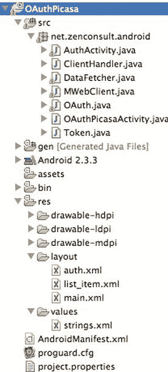
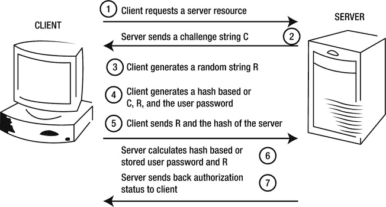
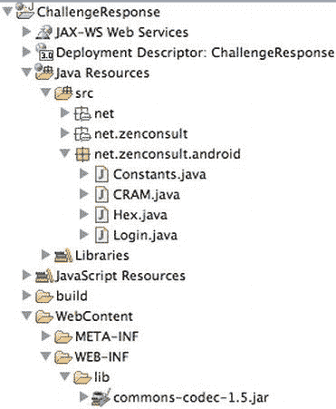
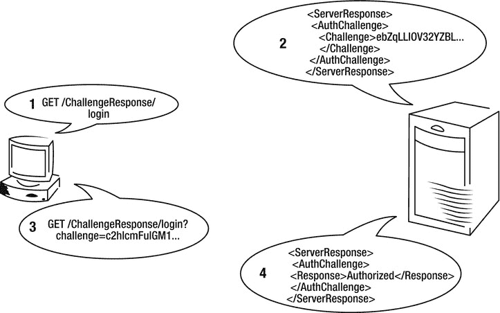
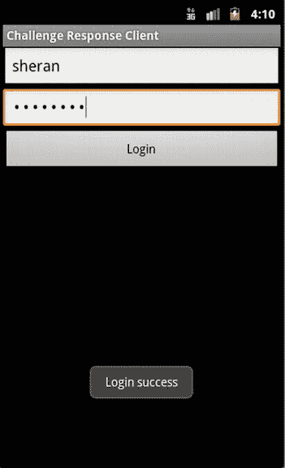

# 八、概念实战：第二部分

在这一章中，就像在第 4 章中一样，我们将更仔细地看看实现我们已经讨论过的一些理论概念的源代码和应用。这会让你对如何在实践中应用它们有更好的感觉。本章的代码示例将着重于设备上的安全认证和保护密码。回想一下，我们已经讨论了两种登录到后端应用而不在设备上存储凭证的机制。在这里，我们将探索与此相关的更详细的源代码。

oath〔t0〕

让我们重温一下第 6 章中的 OAuth 登录示例。我们讨论了开发一个应用，该应用将与 Google Picasa 网络相册交互，以读取特定用户的相册列表。本章中的代码会做到这一点。查看这本书在 www.apress.comT3 的网站上的最新代码。首先，我们来看看[图 8-1](#Fig00081) 中我们的项目结构。您将看到几个源文件。我们将讨论每个源文件的关键功能。



[图 8-1](#_Fig00081) 。OAuth 示例的项目结构

正在检索令牌

你可以在[图 8-1](#Fig00081) 中看到 OAuth 示例项目的结构。让我们从应用的入口点开始，它是 OAuthPicasaActivity.java 的，如[清单 8-1](#list1) 所示。

***[清单 8-1。](#_list1)*** 申请入口点

```java
**package** net.zenconsult.android;

**import** android.app.ListActivity;
**import** android.content.Intent;
**import** android.os.Bundle;
**import** android.view.View;
**import** android.widget.AdapterView;
**import** android.widget.AdapterView.OnItemClickListener;
**import** android.widget.ArrayAdapter;
**import** android.widget.ListView;
**import** android.widget.TextView;
**import** android.widget.Toast;

**public class** OAuthPicasaActivity **extends** ListActivity {
  OAuthPicasaActivity act;

  /** Called when the activity is first created. */
  @Override
  **public void** onCreate(Bundle savedInstanceState) {
         **super**.onCreate(savedInstanceState);
         act = **this;**
         OAuth o = **new** OAuth**(this)**;
         Token t = o.getToken();

  if (!t.isValidForReq()) {
          Intent intent = **new** Intent(**this**, AuthActivity.**class**);
          **this**.startActivity(intent);
         }
         **if** (t.isExpired()) {
                 o.getRequestToken();
         }

         DataFetcher df = **new** DataFetcher(t);
         df.fetchAlbums("sheranapress");
         String[] names = **new** String[] {}; // Add bridge code here to parse XML
                                           // from DataFetcher and populate
                                           // your List

         **this**.setListAdapter(**new** ArrayAdapter  < String > (**this**, R.layout.*list_item*,
                           names));

         ListView lv = getListView();
         lv.setTextFilterEnabled(**true**);

         lv.setOnItemClickListener(**new** OnItemClickListener() {
                 **public void** onItemClick(AdapterView  <?>  parent, View view,
                                 **int** position, **long** id) {
                            Toast.*makeText* (getApplicationContext(),
                                              ((TextView) view).getText(),
 Toast. *LENGTH_SHORT*).show();
            }
       });

  }

}
```

您将看到这个文件正在做几件事情。首先，它实例化了 OAuth 类。接下来，它检索令牌对象，并测试该令牌是否有效，以便在 isValidForReq() 函数中发出请求。它还在 isExpired() 函数中测试令牌是否过期。如果令牌有效，则实例化 DataFetcher 对象，该对象向 Picasa 查询属于用户 sheranapress 的所有相册列表。这是在 df . fetchalbums(" sherana press ")行中完成的。

显然，这个应用第一次运行时，不会有有效的令牌对象。应用处理这种情况的方法是，首先获取一个授权代码，然后获取一个带有该授权代码的请求令牌(按照 Google 的 OAuth 2 规范)。接下来看看这是怎么做的。

处理授权

清单 8-2 显示了我们的应用中处理授权部分的源代码。如果您查看 doAuth() 函数，您将看到一个对 Google 的请求，应用在一个 WebView 对象中显示响应。WebView 对象是一个显示 HTML 内容的字段。你可以把它想象成一个简约的浏览器。这允许最终用户登录到她的谷歌帐户，并授予或拒绝我们的应用访问。用户将看到 Google 登录网页，并被要求使用她的凭证登录。这些凭证没有存储在我们应用的任何地方。如果他允许我们的应用使用她的 Picasa 流，那么 Google 会发回一个授权码。我们的应用将把这个授权码存储在令牌对象中。这是在 ClientHandler 对象中完成的(参见[清单 8-3](#list3) )。

***[清单 8-2。](#_list2)***Auth 活动获取授权码。

```java
**package** net.zenconsult.android;

**import** java.net.URI;
**import** java.net.URISyntaxException;

**import** org.apache.http.message.BasicNameValuePair;

**import** android.app.Activity;
**import** android.content.Context;
**import** android.os.Bundle;
**import** android.util.Log;
**import** android.webkit.WebView;

**public class** AuthActivity **extends** Activity {
        **private** BasicNameValuePair clientId = new BasicNameValuePair("client_id",
                         "200744748489.apps.googleusercontent.com");
        **private** BasicNameValuePair clientSecret = new BasicNameValuePair(
                         "client_secret", "edxCTl_L8_SFl1rz2klZ4DbB");
        **private** BasicNameValuePair redirectURI = new BasicNameValuePair(
                         "redirect_uri", "urn:ietf:wg:oauth:2.0:oob");
        **private** String scope = "scope=[https://picasaweb.google.com/data/](https://picasaweb.google.com/data/)";
        **private** String oAuth = "[https://accounts.google.com/o/oauth2/auth](https://accounts.google.com/o/oauth2/auth) ?";
        **private** String httpReqPost = " [https://accounts.google.com/o/oauth2/token](https://accounts.google.com/o/oauth2/token) ";
        **private final** String FILENAME = ".oauth_settings";
        **private** URI uri;
        **private** WebView wv;
        **private** Context ctx;
        **private** Token token;

        @Override
        **public void** onCreate(Bundle savedInstanceState) {
               **super**.onCreate(savedInstanceState);
               setContentView(R.layout.auth);
               doAuth();
  }
  **public void** doAuth() {
          **try** {
                 uri = **new** URI(oAuth + clientId + "&" + redirectURI + "&" + scope
                              + "&response_type = code");
                 wv = (WebView) findViewById(R.id.webview);
                 wv.setWebChromeClient(**new** ClientHandler(**this**));
                 wv.setWebViewClient(**new** MWebClient());
                 wv.getSettings().setJavaScriptEnabled(**true**);
                 wv.loadUrl(uri.toASCIIString());
                 Log.v("OAUTH", "Calling " + uri.toASCIIString());
          }**catch** (URISyntaxException e) {
                 e.printStackTrace();
          }
    }
}
```

***[清单 8-3。](#_list3)***client handler 将授权码写入令牌对象。

```java
package net.zenconsult.android;

import android.app.Activity;
import android.util.Log;

import android.webkit.WebChromeClient;
import android.webkit.WebView;
import android.widget.Toast;

public class ClientHandler extends WebChromeClient {
       private Activity activity;
       private OAuth oAuth;

       public ClientHandler(Activity act) {
               activity = act;
               oAuth = new OAuth(activity);
       }

       @Override
        public void onReceivedTitle(WebView view, String title) {
               String code = "";
               if (title.contains("Success")) {
                      code = title.substring(title.indexOf(' = ') + 1, title.length());
                      setAuthCode(code);
                      Log.v("OAUTH", "Code is " + code);
                      oAuth.getRequestToken();
                      oAuth.writeToken(oAuth.getToken());
                      Toast toast = Toast.makeText(activity.getApplicationContext(),
                                      "Authorization Successful", Toast.LENGTH_SHORT);
                      toast.show();
                      activity.finish();
               } else if (title.contains("Denied")) {
                      code = title.substring(title.indexOf(' = ') + 1, title.length());
                      setAuthCode(code);
                      Log.v("OAUTH", "Denied, error was " + code);
                      Toast toast = Toast.makeText(activity.getApplicationContext(),
                                      "Authorization Failed", Toast.LENGTH_SHORT);
                      toast.show();
                      activity.finish();
               }
         }

  public String getAuthCode() {
          return oAuth.getToken().getAuthCode();
  }

  public void setAuthCode(String authCode) {
          oAuth.getToken().setAuthCode(authCode);
  }

  @Override
  public void onProgressChanged(WebView view, int progress) {

  }
}
```

把 ClientHandler 想象成一个观察者。它在每个 HTML 网页中寻找一个特定的字符串——“成功”——。如果它找到了这个词，那么我们就获得了正确的授权码，这意味着我们的最终用户已经批准了我们的访问。

将授权码写入内部存储后，您将需要获取一个请求令牌。在 Oauth 中，您将需要一个请求令牌来开始请求访问任何资源的过程。OAuth 流程请参见图 6-25。如果您再次查看我们的 ClientHandler 代码，您将会看到下面几行代码 oAuth.getRequestToken() 和 oauth . write token(oauth . gettoken())。这两行使用实例化的 OAuth 类(参见[清单 8-4](#list4) )请求一个请求令牌，然后将其写入内存。 getRequestToken() 函数处理该部分。同样值得注意的是，每当我提到存储时，您都应该考虑使用加密。有关实施安全数据存储的更多信息，请参考第 5 章中的“Android 中的数据存储”部分。

***[清单 8-4。](#_list4)*** 如果授权码有效，OAuth 类从 Google 获取请求令牌。

```java
**package** net.zenconsult.android;

**import** java.io.BufferedInputStream;
**import** java.io.BufferedOutputStream;
**import** java.io.File;
**import** java.io.FileInputStream;
**import** java.io.FileNotFoundException;
**import** java.io.FileOutputStream;
**import** java.io.IOException;
**import** java.io.ObjectInputStream;
**import** java.io.ObjectOutputStream;
**import** java.io.StreamCorruptedException;
**import** java.io.UnsupportedEncodingException;
**import** java.net.URI;
**import** java.util.ArrayList;
**import** java.util.List;

**import** org.apache.http.HttpEntity;
**import** org.apache.http.HttpResponse;
**import** org.apache.http.NameValuePair;
**import** org.apache.http.client.ClientProtocolException;
**import** org.apache.http.client.HttpClient;
**import** org.apache.http.client.entity.UrlEncodedFormEntity;
**import** org.apache.http.client.methods.HttpPost;
**import** org.apache.http.impl.client.DefaultHttpClient;
**import** org.apache.http.message.BasicNameValuePair;
**import** org.apache.http.util.EntityUtils;
**import** org.json.JSONException;
**import** org.json.JSONObject;

**import** android.app.Activity;
**import** android.content.Context;
**import** android.util.Log;
**import** android.webkit.WebView;
**import** android.widget.Toast;

**public class** OAuth {
        **private** BasicNameValuePair clientId = **new** BasicNameValuePair("client_id",
                        "200744748489.apps.googleusercontent.com");
        **private** BasicNameValuePair clientSecret = **new** BasicNameValuePair(
                        "client_secret", "edxCTl_L8_SFl1rz2klZ4DbB");
        **private** BasicNameValuePair redirectURI = **new** BasicNameValuePair(
                        "redirect_uri", "urn:ietf:wg:oauth:2.0:oob");
        **private** String scope = "scope=[https://picasaweb.google.com/data/](https://picasaweb.google.com/data/)";
        **private** String oAuth = "[https://accounts.google.com/o/oauth2/auth](https://accounts.google.com/o/oauth2/auth)?";
        **private** String httpReqPost = "[https://accounts.google.com/o/oauth2/token](https://accounts.google.com/o/oauth2/token)";
        **private** final String FILENAME = ".oauth_settings";
        **private** URI uri;
        **private** WebView wv;
        **private** Context ctx;
        **private** Activity activity;
        **private boolean** authenticated;
        **private** Token token;

        **public** OAuth(Activity act) {
                ctx = act.getApplicationContext();
                activity = act;
                token = readToken();

        }

        **public** Token readToken() {
                Token token = **null**;
                FileInputStream fis;
                **try** {
                        fis = ctx.openFileInput(FILENAME);
                        ObjectInputStream in = **new** ObjectInputStream(
                                       **new** BufferedInputStream(fis));
                        token = (Token) in.readObject();
                        **if** (token == **null**) {
                                token = **new** Token();
                                writeToken(token);
                        } 
                        in.close();
                        fis.close();
                } **catch** (FileNotFoundException e) {
                        writeToken(**new** Token());
                } **catch** (StreamCorruptedException e) {
                        // **TODO** Auto-generated catch block
                        e.printStackTrace();
                } **catch** (IOException e) {
                        // **TODO** Auto-generated catch block
                        e.printStackTrace();
                } **catch** (ClassNotFoundException e) {
                        // **TODO** Auto-generated catch block
                        e.printStackTrace();
                }
                **return** token;
                }

        **public void** writeToken(Token token) {
                **try** {
                        File f = **new** File(FILENAME);
                        **if** (f.exists()) {
                                f.delete();
                        }
                        FileOutputStream fos = ctx.openFileOutput(FILENAME,
                                       Context.*MODE_PRIVATE*);

                        ObjectOutputStream out = **new** ObjectOutputStream(
                                       **new** BufferedOutputStream(fos));
                        out.writeObject(token);
                        out.close();
                        fos.close();
                } **catch** (FileNotFoundException e1) {
                        Log.*e*("OAUTH", "Error creating settings file");
                } **catch** (IOException e2) {
                        // **TODO** Auto-generated catch block
                        e2.printStackTrace();
                }
        }

        **public void** getRequestToken() {
                HttpClient httpClient = **new** DefaultHttpClient();
                HttpPost post = **new** HttpPost(httpReqPost);
                List  <  NameValuePair  > nvPairs = **new** ArrayList  <  NameValuePair  >  ();
                nvPairs.add(clientId);
                nvPairs.add(clientSecret);
                nvPairs.add(**new** BasicNameValuePair("code", token.getAuthCode()));
                nvPairs.add(redirectURI);
                nvPairs.add(**new** BasicNameValuePair("grant_type", "authorization_code"));
                **try** {
                        post.setEntity(**new** UrlEncodedFormEntity(nvPairs));
                        HttpResponse response = httpClient.execute(post);
                        HttpEntity httpEntity = response.getEntity();
                        String line = EntityUtils.*toString*(httpEntity);
                        JSONObject jObj = **new** JSONObject(line);
                        token.buildToken(jObj);
                        writeToken(token);
                } **catch** (UnsupportedEncodingException e) {
                        // **TODO** Auto-generated catch block
                        e.printStackTrace();
                } **catch** (ClientProtocolException e) {
                        // **TODO** Auto-generated catch block
                        e.printStackTrace();
                } **catch** (IOException e) {
                        **if** (e.getMessage().equals("No peer certificate")) {
                                Toast toast = Toast.*makeText*
(activity.getApplicationContext(),
                                                "Possible HTC Error for Android 2.3.3",
                                                Toast.*LENGTH_SHORT*);
                            toast.show();
                        }
                        Log.*e*("OAUTH", "IOException " + e.getMessage());
                } **catch** (JSONException e) {
                        // **TODO** Auto-generated catch block
                        e.printStackTrace();
                }

        }

        **public** Token getToken() {
                **return** token;
        }

        **public void** setToken(Token token) {
                **this**.token = token;
        }
}
```

您可能已经注意到，该令牌被用作单例令牌。它被写入设备的内部存储器并从中读取。这允许应用的不同区域在身份验证过程的不同阶段对其进行读写。理想情况下，这应该是同步的，以确保读和写只发生在一个类中。

我已经为清单 8-5 中的令牌对象提供了源代码。该对象实现了可序列化的接口；因此，它可以完整地写入内部存储。确保通过数据存储加密器运行它，以增加安全性。除了检查自己的到期日期之外，令牌对象几乎不包含任何逻辑。

***[清单 8-5。](#_list5)*** 令牌对象

```java
package net.zenconsult.android;

**import** java.io.Serializable;
**import** java.util.Calendar;
**import** org.json.JSONException;
**import** org.json.JSONObject;
**public class** Token **implements** Serializable {
        /**
        *
        */
        **private static final long** serialVersionUID = 6534067628631656760L;
        **private** String refreshToken;
        **private**  String accessToken;
        **private**  Calendar expiryDate;
        **private**  String authCode;
        **private**  String tokenType;
        **private**  String name;

        **public** Token() {
                setExpiryDate(0);
                setTokenType("");
                setAccessToken("");
                setRefreshToken("");
                setName("");
        }

        **public** Token(JSONObject response) {
                try {
                      setExpiryDate(response.getInt("expires_in"));
                } **catch** (JSONException e) {
                      setExpiryDate(0);
                }
                try {
                      setTokenType(response.getString("token_type"));
                } **catch** (JSONException e) {
                      setTokenType("");
                }
                try {
                      setAccessToken(response.getString("access_token"));
                } **catch** (JSONException e) {
                      setAccessToken("");
                }
                try {
                      setRefreshToken(response.getString("refresh_token"));
                } **catch** (JSONException e) {
                      setRefreshToken("");
                }
        }
        **public void** buildToken(JSONObject response) {
                try {
                      setExpiryDate(response.getInt("expires_in"));
                } catch (JSONException e) {
                      setExpiryDate(0);
                }
                try {
                      setTokenType(response.getString("token_type"));
                } catch (JSONException e) {
                      setTokenType("");
                }
                try {
                      setAccessToken(response.getString("access_token"));
                } catch (JSONException e) {
                      setAccessToken("");
                }
                try {
                      setRefreshToken(response.getString("refresh_token"));
                } catch (JSONException e) {
                      setRefreshToken("");
                }
        }

        **public boolean** isValidForReq() {
                if (getAccessToken() != null && !getAccessToken().equals("")) {
                      return true;
                } else {
                      return false;
                }
        }

        **public boolean**  isExpired() {
                Calendar now = Calendar.getInstance();
                if (now.after(getExpiryDate()))
                      return true;
                else
                      return false;
        }

        **public** String getRefreshToken() {
                      return refreshToken;
        }

        **public void** setRefreshToken(String refreshToken) {
                if (refreshToken == null)
                        refreshToken = "";
                        this.refreshToken = refreshToken;
        }

        **public** String getAccessToken() {
                      return accessToken;
        }

        **public void** setAccessToken(String accessToken) {
                if (accessToken == null)
                        accessToken = "";
                this.accessToken = accessToken;
        }

        **public** Calendar getExpiryDate() {
                      return expiryDate;
        }

        **public void** setExpiryDate(int seconds) {
                Calendar now = Calendar.getInstance();
                now.add(Calendar.SECOND, seconds);
                this.expiryDate = now;
        }

        **public** String getAuthCode() {
                      return authCode;
        }

        **public void** setAuthCode(String authCode) {
                if (authCode == null)
                authCode = "";
                this.authCode = authCode;
        }

        **public** String getTokenType() {
                      return tokenType;
        }

        **public void** setTokenType(String tokenType) {
                if (tokenType == null)
                tokenType = "";
                this.tokenType = tokenType;
        }

        **public** String getName() {
                      return name;
        }

        **public void** setName(String name) {
                this.name = name;
        }
}
```

最后，还有数据提取器类(见[清单 8-6](#list6) )。您使用该类对 Picasa 进行所有受保护的查询。例如，您可以使用这个类来获取相册和照片，甚至上传照片。Picasa 以 XML 格式发回所有回复(注意，我省略了 XML 解析组件)。如果你想知道如何编写一个简单的 XML 解析器来读取 Picasa 的响应，那么看看这本书的附录。

***[清单 8-6。](#_list6)***data etcher 类

```java
**package** net.zenconsult.android;

**import** java.io.IOException;

**import** org.apache.http.HttpEntity;
**import** org.apache.http.HttpResponse;
**import** org.apache.http.client.ClientProtocolException;
**import** org.apache.http.client.HttpClient;
**import** org.apache.http.client.methods.HttpGet;
**import** org.apache.http.impl.client.DefaultHttpClient;
**import** org.apache.http.util.EntityUtils;

**public** class DataFetcher {
        **private** HttpClient httpClient;

        **private** Token token;
        **public** DataFetcher(Token t) {
                token = t;
                httpClient = **new** DefaultHttpClient();
        }
        **public void** fetchAlbums(String userId) {
                String url = " [https://picasaweb.google.com/data/feed/api/user/](https://picasaweb.google.com/data/feed/api/user/) "
                                  + userId;
                **try** {
                     HttpResponse resp = httpClient.execute(buildGet(
                                   token.getAccessToken(), url));
                     **if** (resp.getStatusLine().getStatusCode() == 200) {
                                          HttpEntity httpEntity = resp.getEntity();
                                          String line = EntityUtils. *toString*(httpEntity);
                                          // Do your XML Parsing here
                                          }
                } **catch** (ClientProtocolException e) {
                                          // TODO Auto-generated **catch** block
                                          e.printStackTrace();
                } **catch** (IOException e) {
                                          // TODO Auto-generated **catch** block
                                          e.printStackTrace();
        }
        }
        **public** HttpGet buildGet(String accessToken, String url) {
                HttpGet get = **new** HttpGet(url);
                get.addHeader("Authorization", "Bearer " + accessToken);
                return get;
        }
}
```

挑战响应

我们在第 6 章的[中非常简要地讨论了基于挑战响应的认证](06.html)。让我们仔细看看挑战-响应认证技术。以下是所需步骤 T5 的简要概述，也显示在[图 8-2](#Fig00082) 中。请记住，这只是服务器对客户端进行身份验证的单向身份验证:1。

1.  客户端请求安全资源。
2.  服务器发送一个质询字符串 c。
3.  客户端生成一个随机字符串 r。
4.  客户端根据 C、R 和用户密码生成一个散列。
5.  客户端将 R 和散列发送回服务器。
6.  服务器根据存储的用户密码和。
7.  如果验证正确，服务器发回请求的资源；否则，会发回一条错误消息。



[图 8-2](#_Fig00082) 。质询-响应会话期间客户端和服务器之间数据交换的图形表示

**注意**您还可以有一个相互认证的场景，其中客户端对服务器进行认证。

让我们编写一些简单的代码，帮助我们在应用中使用挑战-响应认证技术。您应该发展这些代码段以适应您自己的需要，然后在您的应用中使用它们。它们有助于减少终端用户的暴露，因为您不会在设备上存储任何凭据。我已经给出了客户端和服务器端代码的例子。服务器端的代码是用 Java 写的，可以打包成 Java Web 存档文件(WAR 文件)。要测试它，将它打包成一个 WAR 文件，并简单地将它放到 servlet 容器或应用服务器的部署目录中。

让我们从服务器端代码开始。我们将创建一个 Java servlet 来处理与客户端的 HTTP 通信。[图 8-3](#Fig00083) 显示了项目结构。这个结构说明了我们有一个只有四个文件的相当简单的项目。



[图 8-3](#_Fig00083) 。我们的挑战响应服务器端项目结构

其中之一，Hex.java 文件 ，是我用来将各种数据类型转换成十六进制字符串的工具类；另一个，【Constants.java】，保存用户名和密码。这些凭证将用于比较客户端输入的内容。

您还会注意到，我们使用 Apache Commons 编解码器库来帮助我们的 Base64 编码和解码。在本例中，我们采用 CRAM-MD5 身份验证方法，改为使用 SHA1 哈希。(CRAM 是挑战响应认证机制。)

我将首先展示代码，然后解释我们要做什么。让我们从我们的 servletLogin.java 开始，如[清单 8-7](#list7) 所示。该代码有两个主要分支:

*   主分支 1 处理接收到没有“挑战”参数的请求的情况。
*   主分支 2 处理接收到带有“挑战”参数的请求的情况。

***[清单 8-7。](#_list7)*** 登录类

```java
**package** net.zenconsult.android;

**import** java.io.IOException;

**import** javax.servlet.ServletException;
**import** javax.servlet.annotation.WebServlet;
**import** javax.servlet.http.HttpServlet;
**import** javax.servlet.http.HttpServletRequest;
**import** javax.servlet.http.HttpServletResponse;
**import** javax.servlet.http.HttpSession;

/**
        * Servlet implementation class login
        */
@WebServlet(description = "Login Servlet", urlPatterns = { "/login" })
        **public class** Login **extends** HttpServlet {
                **private static final long** serialVersionUID = 1 L;

        /**
                * **@see** HttpServlet#HttpServlet()
                */
                **public** Login() {
                **super()**;
                **// TODO** Auto-generated constructor stub
                }

                /**
                * **@see** HttpServlet#doGet(HttpServletRequest request, HttpServletResponse
                * response)
                */
        **protected void** doGet(HttpServletRequest request,
                        HttpServletResponse response) **throws** ServletException,
  IOException {
                HttpSession session = request.getSession();
                String param = request.getParameter("challenge");
                **if** (param != **null**) {
                CRAM c = (CRAM) session.getAttribute("challenge");
                **if** (c == **null**) {
                c = **new** CRAM();
                session.setAttribute("challenge", c);
                response.setHeader("Content-Type", "text/xml");
                response.getWriter().write(c.generate());
                } **else** {
                **if** (c.verifyChallenge(param.trim())) {
                response.setHeader("Content-Type", "text/xml");
                response.getWriter().write
(c.generateReply("Authorized"));
                session.invalidate();
                } **else** {
                response.setHeader("Content-Type", "text/xml");
                response.getWriter().write
(c.generateReply("Unauthorized"));
                session.invalidate();
                }
                }
                } **else** {
                CRAM c = **new** CRAM();
                session.setAttribute("challenge", c);
                response.setHeader("Content-Type", "text/xml");
                response.getWriter().write(c.generate());
                }

                }

                /**
                * **@see** HttpServlet#doPost(HttpServletRequest request, HttpServletResponse
                * response)
                */
                **protected void** doPost(HttpServletRequest request,
                HttpServletResponse response) **throws** ServletException,
                IOException {
                **// TODO** Auto-generated method stub
                }
}
```

在每种情况下，我们都在创建一个 CRAM 对象。该对象将生成我们的质询字符串，并对用户响应进行比较。我们将 CRAM 对象与每个 HTTP 会话相关联，以便使用相同的挑战字节进行验证。

现在将是一个很好的时间来从协议层面看一下客户端和服务器之间发生了什么(见[图 8-4](#Fig00084) )。整个流程有四个步骤，非常简单:

1.  客户端请求受保护的资源。
2.  服务器回复一个询问。
3.  客户端使用最终用户凭证来计算响应，并将其发送回服务器。
4.  最后，服务器将计算相同的响应，进行比较，并决定用户是否被授权。



[图 8-4](#_Fig00084) 。挑战响应消息流

所有这些都是在不通过 Web 发送用户凭证的情况下完成的。

CRAM 对象 的源代码如[清单 8-8](#list8) 所示。

***[清单 8-8。](#_list8)*** 补习班

```java
**package** net.zenconsult.android;

**import** java.io.StringWriter;
**import** java.security.InvalidKeyException;
**import** java.security.NoSuchAlgorithmException;
**import** java.security.SecureRandom;
**import** javax.crypto.Mac;

**import** javax.crypto.SecretKey;
**import** javax.crypto.spec.SecretKeySpec;
**import** javax.xml.parsers.DocumentBuilder;
**import** javax.xml.parsers.DocumentBuilderFactory;
**import** javax.xml.parsers.ParserConfigurationException;
**import** javax.xml.transform.OutputKeys;
**import** javax.xml.transform.Transformer;
**import** javax.xml.transform.TransformerConfigurationException;
**import** javax.xml.transform.TransformerException;
**import** javax.xml.transform.TransformerFactory;
**import** javax.xml.transform.dom.DOMSource;
**import** javax.xml.transform.stream.StreamResult;

**import** org.apache.commons.codec.binary.Base64;
**import** org.w3c.dom.Document;
**import** org.w3c.dom.Element;
**import** org.w3c.dom.Text;

**public class** CRAM **implements** Constants {
  **private final byte[]** secret = **new byte[32];**

         **public** CRAM() {
                 SecureRandom sr = **new** SecureRandom();
                 sr.nextBytes(secret);
                 }

         **public** String generate() {
                 DocumentBuilderFactory dbFactory = DocumentBuilderFactory.*newInstance*();
                 DocumentBuilder dBuilder = **null**;
                 try {
                       dBuilder = dbFactory.newDocumentBuilder();
                 } **catch** (ParserConfigurationException e) {
                       // **TODO** Auto-generated catch block
                       e.printStackTrace();
                 }
                 Document doc = dBuilder.newDocument();

                 // Build Root
                 Element root = doc.createElement("ServerResponse");
                 doc.appendChild(root);

                 // Challenge Section
                 Element authChallenge = doc.createElement("AuthChallenge");
                 root.appendChild(authChallenge);

                 // The Challenge
                 Element challenge = doc.createElement("Challenge");
                 Text challengeText = doc.createTextNode(Base64
                               .*encodeBase64String*(secret));
                 challenge.appendChild(challengeText);
                 authChallenge.appendChild(challenge);

                 TransformerFactory tFactory = TransformerFactory.*newInstance*();
                 Transformer transformer = **null**;
                 **try** {
                       transformer = tFactory.newTransformer();
                 } **catch** (TransformerConfigurationException e) {
                       // **TODO** Auto-generated catch block
                       e.printStackTrace();
                 }
                 transformer.setOutputProperty(OutputKeys.*OMIT_XML_DECLARATION*, "yes");
                 transformer.setOutputProperty(OutputKeys.*INDENT*, "yes");
                 StringWriter sw = **new** StringWriter();
                 StreamResult res = **new** StreamResult(sw);
                 DOMSource source = **new** DOMSource(doc);
                 **try** {
                       transformer.transform(source, res);
                 } **catch** (TransformerException e) {
                       // **TODO** Auto-generated catch block
                       e.printStackTrace();
                 }
                 String xml = sw.toString();
                 **return** xml;
                 }
         **public boolean** verifyChallenge(String userResponse) {
                 String algo = "HmacSHA1";
                 Mac mac = **null**;
                 **try** {
                        mac = Mac.*getInstance*(algo);
                 } **catch** (NoSuchAlgorithmException e) {
                       // **TODO** Auto-generated catch block
                       e.printStackTrace();
                 }
                 SecretKey key = **new** SecretKeySpec(*PASSWORD*.getBytes(), algo);

                 **try** {
                 mac.init(key);
                 } **catch** (InvalidKeyException e) {
                       // **TODO** Auto-generated catch block
                       e.printStackTrace();
                 }
                 String tmpHash = *USERNAME* + " " + Hex.*toHex*(mac.doFinal(secret));
                 String hash = Base64.*encodeBase64String*(tmpHash.getBytes());
                 **return** hash.equals(userResponse);
                 }

                 public String generateReply(String response) {
                 DocumentBuilderFactory dbFactory = DocumentBuilderFactory.*newInstance*();
                 DocumentBuilder dBuilder = **null**;
                 **try** {
                 dBuilder = dbFactory.newDocumentBuilder();
                 } **catch** (ParserConfigurationException e) {
                       // **TODO** Auto-generated catch block
                       e.printStackTrace();
                 }
                 Document doc = dBuilder.newDocument();

                 // Build Root
                 Element root = doc.createElement("ServerResponse");
                 doc.appendChild(root);

                 // Challenge Section
                 Element authChallenge = doc.createElement("AuthChallenge");
                 root.appendChild(authChallenge);

                 // Reply
                 Element challenge = doc.createElement("Response");
                 Text challengeText = doc.createTextNode(response);
                 challenge.appendChild(challengeText);
                 authChallenge.appendChild(challenge);

                 TransformerFactory tFactory = TransformerFactory.*newInstance*();
                 Transformer transformer = **null**;
                 **try** {
                 transformer = tFactory.newTransformer();
                 } **catch** (TransformerConfigurationException e) {
                       // **TODO** Auto-generated catch block
                       e.printStackTrace();
                 }
                 transformer.setOutputProperty(OutputKeys.*OMIT_XML_DECLARATION*, "yes");
                 transformer.setOutputProperty(OutputKeys.*INDENT*, "yes");
                 StringWriter sw = **new** StringWriter();
                 StreamResult res = **new** StreamResult(sw);
                 DOMSource source = **new** DOMSource(doc);
                 **try** {
                 transformer.transform(source, res);
                 } **catch** (TransformerException e) {
                       // **TODO** Auto-generated catch block
                       e.printStackTrace();
                 }
                 String xml = sw.toString();
                 **return** xml;
         }

}
```

在实例化 CRAM 对象时，生成一个新的 32 字节随机数。这是一个领域，而且它与补习对象密切相关。这个随机字节串将用于进一步的质询生成和响应验证。

接下来是 generate() 函数 ，它只不过是为我们生成的随机字节创建一个 Base64 编码。然后，它创建一个 XML 响应和这个质询字符串，然后将它返回给 servlet，以便发送给最终用户。

下一个函数 verify challenge(String user response)是一个重要的函数。如果使用了正确的凭据，它将生成客户端应该生成的响应。使用存储的用户密码，通过 HMAC-SHA1 算法对原始随机字节序列进行哈希运算。然后用户名被添加到这个散列的前面，并进行 Base64 编码。接下来，将它与客户端响应进行比较，当然，如果用户名和密码输入正确，客户端响应应该是相同的 — 。

最后，generate reply(String response)函数将把响应变量中指定的单词作为 XML 文本发回。servlet 根据客户端响应 是否正确，使用以下任意一个词调用该函数:

*   【授权】
*   “未授权”

您还可以设置一个特殊的授权 cookie 来表明会话已经过身份验证。有许多方法可以改进和构建这些代码。我在这里包含了基本代码，这样您可以更好地理解如何在您的前端和后端应用中实现挑战-响应身份验证机制。

现在我们已经看了服务器端代码 ，让我们为客户端写一些代码。我已经在[图 8-5](#Fig00085) 中展示了项目结构。同样，skeletal 项目相当简单，只有三个文件，不包括十六进制函数类。我将带你浏览每个文件的功能，从入口点开始，【ChallengeResponseClientActivity.java】的(见[清单 8-9](#list9) )。创建一个 Comms 对象(参见[清单 8-10](#list10) )和一个 CRAM 对象(参见[清单 8-11](#list11) )的代码相当简单。 Comms 对象处理客户端和服务器之间的所有网络通信，而 CRAM 对象处理哈希生成部分。在服务器端， CRAM 对象与 CRAM 对象非常相似。在这种情况下，没有验证组件，因为客户端不验证服务器。相反， CRAM 对象使用 HMAC-SHA1 来计算基于服务器挑战的散列。

***[清单 8-9。](#_list9)*** 切入点和主要活动

```java
**package** net.zenconsult.android;

**import** android.app.Activity;
**import** android.os.Bundle;
**import** android.view.View;
**import** android.widget.Button;
**import** android.widget.Toast;

**public class** ChallengeResponseClientActivity **extends** Activity {
         /** Called when the activity is first created. */
         @Override
         **public void** onCreate(Bundle savedInstanceState) {
                 **super**.onCreate(savedInstanceState);
                 setContentView(R.layout. *main*); 
                 **final** Activity activity = **this;**

                 **final** Button button = (Button) findViewById(R.id.*button1*);
                 button.setOnClickListener(new View.OnClickListener() {
                         **public void** onClick(View v) {
                                 Comms c = new Comms(activity);
                                        String challenge = c.getChallenge();
                                        CRAM cram = new CRAM(activity);
                                        String hash = cram.generate(challenge);
                                        String reply = c.sendResponse(hash);
                                        **if** (c.authorized(reply)) {
                                                 Toast toast = Toast.*makeText*(
                                                         activity
.getApplicationContext(), "Login success",
         Toast.*LENGTH_LONG*);
                                            toast.show();
                                        } **else** {
                                                 Toast toast = Toast.*makeText*(
                                                         activity
.getApplicationContext(), "Login failed",
         Toast.*LENGTH_LONG*);
                                                 toast.show();
                                        }
                             }
                 });
         }
}
```

***[清单 8-10。](#_list10)***Comms 类处理这个应用的所有 HTTP 请求。

```java
package net.zenconsult.android;

import java.io.ByteArrayInputStream;
import java.io.IOException;
import java.io.InputStream;
import java.util.ArrayList;
import java.util.List;

import javax.xml.parsers.DocumentBuilder;
import javax.xml.parsers.DocumentBuilderFactory;
import javax.xml.parsers.ParserConfigurationException;

import org.apache.http.HttpResponse;
import org.apache.http.NameValuePair;
import org.apache.http.client.ClientProtocolException;
import org.apache.http.client.methods.HttpGet;
import org.apache.http.client.utils.URLEncodedUtils;
import org.apache.http.impl.client.DefaultHttpClient;
import org.apache.http.message.BasicNameValuePair;
import org.apache.http.util.EntityUtils;
import org.w3c.dom.Document;
import org.w3c.dom.NodeList;
import org.xml.sax.SAXException;

import android.app.Activity;
import android.content.Context;
import android.util.Log;
import android.widget.Toast;

public class Comms {
  private final String url = "[http://192.168.3.117:8080/ChallengeResponse/login](http://192.168.3.117:8080/ChallengeResponse/login)";
  private Context ctx;
  private DefaultHttpClient client;

  public Comms(Activity act) {
  ctx = act.getApplicationContext();
  client = new DefaultHttpClient();
  }

  public String sendResponse(String hash) {
  List  <  NameValuePair  >  params = new ArrayList  <  NameValuePair  >  ();
  params.add(new BasicNameValuePair("challenge", hash));
  String paramString = URLEncodedUtils.*format*(params, "utf-8");
  String cUrl = url + "?" + paramString;
  return doGetAsString(cUrl);
  }

  public boolean authorized(String response) {
  InputStream is = new ByteArrayInputStream(response.getBytes());
  DocumentBuilderFactory dbFactory = DocumentBuilderFactory.*newInstance*();
  DocumentBuilder db = null;
  Document doc = null;
  String reply = "";
  try {
  db = dbFactory.newDocumentBuilder();
  doc = db.parse(is);
  NodeList nl = doc.getElementsByTagName("Response");
  reply = nl.item(0).getTextContent();
  is.close();
  } catch (ParserConfigurationException e) {
  // TODO Auto-generated catch block
  e.printStackTrace();
  } catch (SAXException e) {
  // TODO Auto-generated catch block
  e.printStackTrace();
  } catch (IOException e) {
  // TODO Auto-generated catch block
  e.printStackTrace();
  }
  return reply.matches("Authorized");
  }

  public String getChallenge() {
  InputStream challengeText = doGetAsInputStream(url);
  DocumentBuilderFactory dbFactory = DocumentBuilderFactory.*newInstance*();
  DocumentBuilder db = null;
  Document doc = null;
  String challenge = "";
  try {
  db = dbFactory.newDocumentBuilder();
  doc = db.parse(challengeText);
  NodeList nl = doc.getElementsByTagName("Challenge");
  challenge = nl.item(0).getTextContent();
  challengeText.close();
  } catch (SAXException e) {
  // TODO Auto-generated catch block
  e.printStackTrace();
  } catch (IOException e) {
  // TODO Auto-generated catch block
  e.printStackTrace();
  } catch (ParserConfigurationException e) {
  // TODO Auto-generated catch block
  e.printStackTrace();
  }
  return challenge;
  }

  public String doGetAsString(String url) {
  HttpGet request = new HttpGet(url);
  String result = "";
  try {
  HttpResponse response = client.execute(request);
  int code = response.getStatusLine().getStatusCode();
  if (code == 200) {
  result = EntityUtils.*toString*(response.getEntity());
  } else {
  Toast toast = Toast.*makeText*(ctx, "Status Code " + code,
  Toast.*LENGTH_SHORT*);
  toast.show();
  }
  } catch (ClientProtocolException e) {
  // TODO Auto-generated catch block
  e.printStackTrace();
  } catch (IOException e) {
  // TODO Auto-generated catch block
  e.printStackTrace();
  }
  return result;

  }

  public InputStream doGetAsInputStream(String url) {
  HttpGet request = new HttpGet(url);
  InputStream result = null;
  try {
  HttpResponse response = client.execute(request);
  int code = response.getStatusLine().getStatusCode();
  if (code == 200) {
  result = response.getEntity().getContent();
  } else {
  Toast toast = Toast.*makeText*(ctx, "Status Code " + code,
  Toast.*LENGTH_SHORT*);
  toast.show();
  }
  } catch (ClientProtocolException e) {
  // TODO Auto-generated catch block
  e.printStackTrace();
  } catch (IOException e) {
  // TODO Auto-generated catch block
  e.printStackTrace();
  }
  return result;

  }
}
```

***[清单 8-11。](#_list11)*** 补习班

```java
**package** net.zenconsult.android;

**import** java.security.InvalidKeyException;
**import** java.security.NoSuchAlgorithmException;

**import** javax.crypto.Mac;
**import** javax.crypto.SecretKey;
**import** javax.crypto.spec.SecretKeySpec;

**import** android.app.Activity;
**import** android.util.Base64;
**import** android.widget.TextView;

 **public class** CRAM {
        **private Activity** activity;

        **public** CRAM(Activity act) {
                 activity = act;
  }

        **public** String generate(String serverChallenge) {
                String algo = "HmacSHA1";
                TextView pass = (TextView) activity.findViewById(R.id.*editText2*);
                **byte[]** server = Base64.*decode*(serverChallenge, Base64.*DEFAULT*);

                Mac mac = null;
                **try** {
                        mac = Mac.*getInstance*(algo);
                } **catch** (NoSuchAlgorithmException e) {
                        // **TODO** Auto-generated catch block
                        e.printStackTrace();
                }
                String keyText = pass.getText().toString();
                SecretKey key = **new** SecretKeySpec(keyText.getBytes(), algo);
                **try** {
                        mac.init(key);
                } **catch** (InvalidKeyException e) {
                        // **TODO** Auto-generated catch block
                        e.printStackTrace();
                }
                **byte[]** tmpHash = mac.doFinal(server);
                TextView user = (TextView) activity.findViewById(R.id.*editText1*);
                String username = user.getText().toString();
                String concat = username + " " + Hex.*toHex*(tmpHash);
                String hash = Base64.*encodeToString*(concat.getBytes(), Base64.*URL_SAFE*);
                **return** hash;
        }
}
```

在客户端 ，如果一切按计划进行，你的 app 会弹出一条精彩的“登录成功”的消息来迎接你，如图[图 8-5](#Fig00085) 所示。



[图 8-5](#_Fig00085) 成功的挑战-响应身份验证

摘要

我希望这些例子能让您更好地理解如何在移动和后端 web 应用中实现替代的身份验证机制。通过减少对用户凭据存储的依赖，您可以显著提高应用的安全性。

在前端和后端代码中实现 OAuth 不会是最容易完成的事情。然而，花费一些初始努力并为将来的代码准备一组可重用的库是值得的。补习也是一样。由于所涉及的工作量，这些身份验证方法并不是许多开发人员首先要考虑的。但是，它可以确保您的应用比那些通过网络存储和转发用户凭据的应用更安全。

希望你会认为你到目前为止学到的东西是有用的。我的希望是，你会相信你没有浪费时间在这个新协议的缩写上，它被称为挑战响应认证协议。