# 九、发布和销售您的应用

你可能决定通过出售你花了无数时间开发的应用来赚钱。随着移动领域最近的发展，个人开发者现在比以往任何时候都更容易营销、销售其应用并从中赚取收入。苹果有 iTunes 应用商店，黑莓有 AppWorld，安卓有市场。销售应用的过程很简单:注册成为应用销售者，然后在在线商店上发布你的应用。一旦获得批准，您的应用将立即可供 Android 用户下载。在这一章中，我们将更详细地研究这个过程，我将讲述如何让你的应用在 Android Market 上上市的基础知识。在这个过程中，我会谈到从你决定你的应用运行良好开始，到你决定把它发布到网上为止，都涉及到哪些步骤。当谈到在线销售你的应用时，我还会谈到另一个要点:收入保护。如果你的应用在任何在线商店变得受欢迎，那么你很可能会吸引那些想要“破解”和盗版你的应用的人。除非你打算免费发布你的应用，否则这可能会影响你的收入。我将花一些时间在这个主题上，并探索如何编写好的许可证密钥和注册例程来阻止盗版。在这一节中，我还将阐明如果你的应用发现自己处于一个敌对的环境中，它可能不得不经历的一些事情。

**开发者注册**

你还记得我们之前写的 Proxim 应用吗？让我们在 Android 市场上免费发布。我将带您了解发布应用的基础知识。在这种情况下，我不会输入任何允许我收款的具体财务信息(例如，我的银行账号)，因为我不打算出售该应用。此外，我不想花太多时间告诉你如何注册成为一名开发人员，因为谷歌已经有很多关于这方面的有用信息和一套关于如何开始的综合文章。

在发布你的应用之前，你需要做的第一件事就是注册成为一名开发者。您可以使用现有的 Gmail 帐户进行注册。导航到 http://market.android.com/publish 的 [并登录(参见](http://market.android.com/publish)[图 9-1](#Fig00091) )。在本文发表时，注册开发者的费用是 25 美元。你通过 Google Checkout 支付这个金额，而且是一次性的注册费用(见[图 9-2](#Fig00092) )。费用的存在是为了确保你是一个认真的开发者。据谷歌称，这有助于减少可能进入市场的“垃圾产品”的数量。

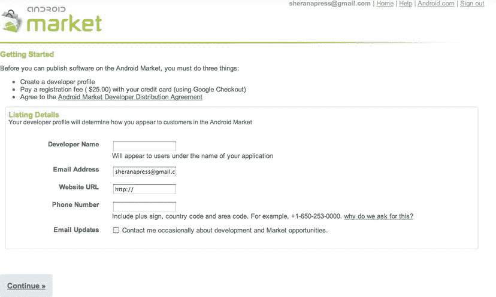

[图 9-1](#_Fig00091) 注册发布您的应用

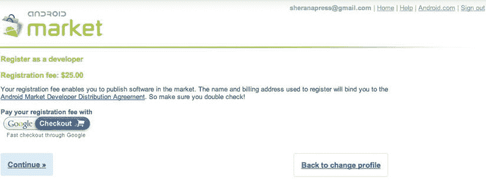

[图 9-2](#_Fig00092) 注册费的支付

**您的应用——已公开**

外面是一片丛林。谁知道你的应用最终会在哪里？嗯，这大概是夸张了；但是正如我在这一章开始时提到的，任何可以访问 Android Market 的人都可以下载你的应用。如果这些下载转化为收入，那就太好了；不幸的是，在某些情况下，盗版会让你损失收入。盗版不是什么新鲜事。自从桌面计算时代开始，它就存在了。盗版的正式术语是*侵犯软件版权*；它意味着在没有适当授权的情况下将一个软件从一个设备复制到另一个设备。在大多数情况下，这仅仅意味着复制你没有购买和支付的软件。如果一个朋友买了一些软件，并给了你一份你没有付钱的拷贝，那么你就拥有了你没有购买的软件。在成长的过程中，我记得我是如何迫不及待地走进我买第一台 8088 电脑的商店(一个巨大的笨重的、坚不可摧的金属怪兽),把我每周的零花钱花在最新的游戏上。当时，我从未想过我参与了协助盗版。据我所知，我付了现金，收到了一个游戏作为回报。我从来没有意识到我支付的是从原始开发者那里购买软件的十分之一。我也不知道我的钱从来没有到达最初的开发商；它留在了店里。

开发者仍然会因为软件盗版而损失收入。你的软件有多受欢迎，以及你如何分发它，将在你的软件被盗版的程度中起到关键作用。例如，如果你允许在七天内免费试用你的应用，但允许完全访问它的所有功能，那么很可能有人会试图绕过这七天的试用期。如果成功了，那么这个人就不需要付费下载你的应用的完整版本了。侵犯版权的另一种隐蔽形式是代码盗窃。当有人下载你的软件，对其进行逆向工程，并复制代码时，就会发生这种情况。然后，这个人将你的代码重新包装成新产品，并以较低的价格出售。证明这种侵犯版权的唯一方法是下载新的和类似的应用，对其进行逆向工程，并寻找与你自己相同的编码结构。但是，如果代码被修改，这将是一项艰巨的任务来证明，甚至更难在法庭上打，因为涉及的成本很高。作为一个个人开发者，你可能不会有太多的资源用于打击盗版。因此，最好决定你是否想要保护你的应用免受盗版 — 的侵害，如果是的话，如何保护。

在这一部分，我将讨论一些你在做决定时需要考虑的话题。然后，如果你确信你需要保护你的应用免受盗版，我会给你一些例子，告诉你如何使用 Android 的许可证验证库(LVL) 来阻止未来的盗版者非法复制和分发你的应用。让我们从你的应用放在 Android Market 上时会发生什么开始。

**可供下载**

当你的应用出现在 Android 市场时，最终用户可以下载它。如果你对应用收费，那么显然最终用户在下载之前必须先购买它。一旦应用安装到设备上，你就可以使用 Android 调试桥(adb)将其复制到电脑上。adb 允许您以不同的方式与您的 Android 设备进行交互。您可以安装软件，打开 Linux shell 以浏览设备文件系统，以及将文件复制到设备或从设备复制文件。我已经在清单 9-1 中给出了 adb 特性的完整列表。你可以在你的 Android SDK 的平台-工具目录下找到 adb。对我来说，这个位置是在/Users/sheran/Android-SDK-MAC _ x86/platform-tools。

***[清单 9-1](#_list1) 。*** *亚行命令及功能*

```java
Android Debug Bridge version 1.0.29

 -d - directs command to the only connected USB device
  returns an error if more than one USB device is
 present.
 -e - directs command to the only running emulator.
  returns an error if more than one emulator is running.
 -s  <  serial number> - directs command to the USB device or emulator with
  the given serial number. Overrides ANDROID_SERIAL
  environment variable.
 -p  <  product name or path> - simple product name like 'sooner', or
  a relative/absolute path to a product
  out directory like 'out/target/product/sooner'.
  If -p is not specified, the ANDROID_PRODUCT_OUT
  environment variable is used, which must
  be an absolute path.
 devices    - list all connected devices
 connect  <  host  >  [:<port>]    - connect to a device via TCP/IP
  Port 5555 is used by default if no port number is
 specified.
 disconnect [<host  >  [:<port>]] - disconnect from a TCP/IP device.
  Port 5555 is used by default if no port number is
 specified.
  Using this command with no additional arguments
  will disconnect from all connected TCP/IP devices.

device commands:
  adb push  <  local  >  <remote>    -      copy file/dir to device
  adb pull  <  remote  >  [<local>]    -      copy file/dir from device
  adb sync [ <directory> ]    - copy host-  >  device only if changed
  (−l means list but don't copy)
  (see 'adb help all')
  adb shell    - run remote shell interactively
  adb shell  <  command> - run remote shell command
  adb emu  <  command> - run emulator console command
  adb logcat [ <filter-spec> ]    - View device log
  adb forward  <  local  >  <remote  >   − forward socket connections
     forward specs are one of:
  tcp:<port>
  localabstract:<unix domain socket name>
  localreserved:<unix domain socket name>
  localfilesystem:<unix domain socket name>
  dev:<character device name>
  jdwp:<process pid  >  (remote only)
  adb jdwp    - list PIDs of processes hosting a JDWP transport
  adb install [−l] [−r] [−s]  <  file  >  − push this package file to the device and install
 it
  ('-l' means forward-lock the app)
  ('-r' means reinstall the app, keeping its data)
  ('-s' means install on SD card instead of internal
 storage)
  adb uninstall [−k]  <  package  >  − remove this app package from the device
  ('-k' means keep the data and cache directories)
  adb bugreport    -     return all information from the device
  that should be included in a bug report.

  adb backup [−f  <  file>] [−apk|-noapk] [−shared|-noshared] [−all] [−system|-nosystem]
 [<packages...>]
     -     write an archive of the device's data to  <  file  >  .
  If no -f option is supplied then the data is written
  to "backup.ab" in the current directory.
  (−apk|-noapk enable/disable backup of the .apks
 themselves
  in the archive; the default is noapk.)
  (−shared|-noshared enable/disable backup of the
 device's
  shared storage / SD card contents; the default is
 noshared.)
  (−all means to back up all installed applications)
  (−system|-nosystem toggles whether -all automatically
 includes
  system applications; the default is to include
 system apps)
  (<packages...  >  is the list of applications to be
 backed up. If
  the -all or -shared flags are passed, then the
 package
  list is optional. Applications explicitly given
 on the
  command line will be included even if –nosystem
 would
  ordinarily cause them to be omitted.)

  adb restore  <  file> - restore device contents from the  <  file  >  backup archive

  adb help    -     show this help message
  adb version    -     show version num

scripting:
  adb wait-for-device    -     block until device is online
  adb start-server    -     ensure that there is a server running
  adb kill-server    -     kill the server if it is running
  adb get-state    -     prints: offline | bootloader | device
  adb get-serialno    -     prints: <serial-number>
  adb status-window    -     continuously print device status for a specified device
  adb remount    -     remounts the /system partition on the device read-write
  adb reboot [bootloader|recovery] - reboots the device, optionally into the
 bootloader or recovery program
  adb reboot-bootloader    -     reboots the device into the bootloader
  adb root    -     restarts the adbd daemon with root permissions
  adb usb    -     restarts the adbd daemon listening on USB
  adb tcpip  <  port> -     restarts the adbd daemon listening on TCP on the
 specified port
networking:
  adb ppp  <  tty  >  [parameters]    -     Run PPP over USB.
 Note: you should not automatically start a PPP connection.
 <tty  >  refers to the tty for PPP stream. Eg. dev:/dev/omap_csmi_tty1
 [parameters] - Eg. defaultroute debug dump local notty usepeerdns

adb sync notes: adb sync [ <directory> ]
  <localdir  >  can be interpreted in several ways:

  - If  <  directory  >  is not specified, both /system and /data partitions will be updated.

  - If it is "system" or "data", only the corresponding partition
  is updated.

environmental variables:
  ADB_TRACE - Print debug information. A comma separated list of
 the following values
  1 or all, adb, sockets, packets, rwx, usb, sync,
 sysdeps, transport, jdwp
  ANDROID_SERIAL - The serial number to connect to. -s takes priority
 over this if given.
  ANDROID_LOG_TAGS - When used with the logcat option, only these debug
 tags are printed.

```

对于希望将文件从安卓设备复制到自己电脑的人来说，拉和推命令非常有用。一般第三方 app 都存储在设备的 /data/app 目录下。首先，让我们看看应用目录 中有什么:

1.  通过键入 adb shell 打开设备的外壳。
2.  通过做 cd /data/app 将目录更改为 /data/app 。
3.  使用 ls 列出内容。

您将看到类似于以下内容的输出:

```java
$ ./adb shell
# cd /data/app
# ls
net.zenconsult.android.chucknorris-1.apk
test_limits_host
ApiDemos.apk
test_list_host
test_set_host
CubeLiveWallpapers.apk
test_iostream_host
test_iomanip_host
SoftKeyboard.apk
test_iterator_host
test_vector_host
test_algorithm_host
test_uninitialized_host
GestureBuilder.apk
test_sstream_host
test_char_traits_host
test_memory_host
test_ios_base_host
test_type_traits_host
test_ios_pos_types_host
test_streambuf_host
test_functional_host
test_string_host
```

再来看 net . Zen consult . Android . chuck Norris-1 . apk 包。我们可以抄下来看看。

要从设备复制包，您可以使用命令 adb pull 。就这么办吧。键入 exit 并按回车键，退出当前的亚行 shell 会话。接下来，键入以下内容:

```java
adb pull /data/app/ net.zenconsult.android.chucknorris-1.apk.
```

这将把包复制到您的当前目录。如果您想要将文件复制到计算机上的其他位置，请用您选择的目录替换句点。您现在拥有了包文件的副本，就像它离开开发人员的计算机一样。我们可以进一步研究这个文件。

**逆向工程**

奇怪的排序不会仅仅停留在从设备复制包文件。他们会想更仔细地看看应用和代码。这就是逆向工程发挥作用的地方。逆向工程是获取编译后的二进制程序并生成等效的汇编或源代码以提高可读性的过程。在大多数情况下，获得源代码是最理想的情况，因为阅读源代码要比阅读汇编代码容易得多。将程序逆向工程成汇编代码的过程称为*反汇编*，从程序生成源代码称为*反编译*。你要明白，每个 CPU 都会有自己的汇编器，自己的汇编语言。这就是英特尔 x86 CPU 上的汇编代码与基于 ARM–的 CPU 上的汇编代码不同的原因。不过，我们不必达到如此低的水平。通常，工作到 Dalvik VM (DVM)级别就足够了。

DVM 还包含一个汇编器。出于解释的目的，假设 DVM 是 CPU。因此，必须使用这个汇编器来构建 Java 代码，以便在 DVM 上工作。当您使用 Android SDK 构建应用时，就会发生这种情况。将在 DVM 上运行的结果可执行文件被称为 *Dalvik 可执行文件* (DEX ) 文件。您用 Java 编写代码，并使用标准的 Java 编译器( javac )将其编译成 Java 类文件。然后，要将这个类文件转换成 DEX 格式，可以使用名为 dx 的命令。您也可以在您的平台工具目录中找到这个工具。一旦生成了 DEX 文件，它就被打包成一个 APK 文件。你可能已经知道，APK 文件只不过是一个压缩文件。如果我想检查我的 APK 文件中的文件，我将如下提取该文件:

```java
$ unzip net.zenconsult.android.chucknorris-1.apk
Archive: net.zenconsult.android.chucknorris-1.apk
  inflating: res/layout/main.xml
  inflating: AndroidManifest.xml
 extracting: resources.arsc
 extracting: res/drawable-hdpi/ic_launcher.png
 extracting: res/drawable-ldpi/ic_launcher.png
 extracting: res/drawable-mdpi/ic_launcher.png
  inflating: classes.dex
  inflating: META-INF/MANIFEST.MF
  inflating: META-INF/CERT.SF
  inflating: META-INF/CERT.RSA
$
```

请注意 DEX 文件。

幸运的是，Eclipse 将处理整个构建过程，并确保在我们的项目中插入、对齐和打包所有相关文件。我已经在图 9-3 中展示了整个构建过程。

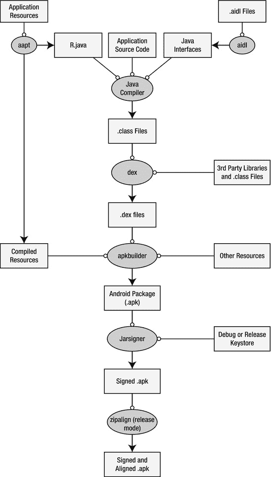

[图 9-3](#_Fig00093) 。Android 构建流程

现在，您已经对应用是如何构建的有了一个简单的概念，让我们看看如何将它们分开。正如我们在提取 APK 文件的内容时看到的，我们可以直接访问 classes.dex 文件。因为我们认为 DVM 是我们的 CPU，这是我们的二进制。就像 Win32 PE 文件或 Linux ELF 文件一样，这个 DEX 文件是我们的二进制文件，因为它运行在我们的 CPU (DVM)上。谷歌也为我们提供了名为 dexdump 的工具(也可以在你的平台工具目录中找到)。如果我在提取的 classes.dex 文件上运行 dexdump ，我将获得关于文件如何构建的大量信息，包括成员、调用等等。[清单 9-2](#list2) 显示了典型的 dexdump 反汇编的样子。

***[清单 9-2](#_list2) 。*** *输出*

```java
$ dexdump –d classes.dex
...
...
Virtual methods -
  #0 : (in Lnet/zenconsult/android/chucknorris/e;)
  name : 'a'
  type : '()Ljava/lang/String;'
  access : 0x0011 (PUBLIC FINAL)
  code -
  registers : 16
  ins : 1
  outs : 2
  insns size : 180 16-bit code units
0009d4: |[0009d4] net.zenconsult.android
.chucknorris.e.a:()Ljava/lang/String;
0009e4: 1202 |0000: const/4 v2, #int 0 // #0
0009e6: 1a00 5100 |0001: const-string v0,
 "[http://www.chucknorrisfacts.com/](http://www.chucknorrisfacts.com/)" // string@0051
0009ea: 7020 2900 0f00 |0003: invoke-direct {v15, v0},
 Lnet/zenconsult/android/chucknorris/e;.a:(Ljava/lang/String;)Ljava/io/InputStream;
 // method@0029
0009f0: 0c05 |0006: move-result-object v5
0009f2: 7100 1600 0000 |0007: invoke-static {},
 Ljavax/xml/parsers/DocumentBuilderFactory;.newInstance:()Ljavax/xml/
parsers/DocumentBuilderFactory; // method@0016
0009f8: 0c00 |000a: move-result-object v0
0009fa: 1a01 0000 |000b: const-string v1, "" // string@0000
0009fe: 2206 1100 |000d: new-instance v6,
 Ljava/util/Vector; // type@0011
000a02: 7010 1000 0600 |000f: invoke-direct {v6},
 Ljava/util/Vector;.  <  init>:()V // method@0010
000a08: 6e10 1500 0000 |0012: invoke-virtual {v0},
 Ljavax/xml/parsers/DocumentBuilderFactory;.newDocumentBuilder:()Ljavax/xml
/parsers/DocumentBuilder; // method@0015
000a0e: 0c00 |0015: move-result-object v0
000a10: 6e20 1400 5000 |0016: invoke-virtual {v0, v5},
...
...
```

我想你明白了。反汇编的 DEX 文件很难阅读，就像 Linux 或 Windows 上反汇编的代码一样。这不是不可能的；但对于门外汉来说，这似乎是压倒性的。

多亏了一些非常聪明的人，他们也认为反汇编的 DEX 文件很难阅读，我们现在有了反汇编器，可以生成更可读的输出。一个名叫 JesusFreke 的天才为 DEX 文件格式构建了一个全新的汇编器和反汇编器。他分别称这些斯马利和巴克斯马利；他在 http://code.google.com/p/smali/发布了开源软件。他的方法的妙处在于，你可以反汇编一个文件，修改反汇编代码，然后重新汇编成一个 DEX 文件。你可能想知道 smali 和 baksmali 有什么特别之处，所以我给你看一下 baksmali 反汇编的同一个文件的一些输出:

```java
$ java -jar ∼/Downloads/baksmali-1.2.8.jar classes.dex
$ cd out/net/zenconsult/android/chucknorris/
$ ls
ChuckNorrisFactsActivity.smali b.smali d.smali
a.smali c.smali e.smali
$
```

这将文件分解成单个的文件，并且更容易检查。我们来看文件 b.smali 。[清单 9-3](#list3) 显示了反汇编代码。

***[清单 9-3](#_list3) 。*** *代码被 baks Mali*反汇编

```java
.class public final Lnet/zenconsult/android/chucknorris/b;
.super Ljava/lang/Thread;

# instance fields
.field private a:Lnet/zenconsult/android/chucknorris/a;

# direct methods
.method public constructor  <  init  >  (Lnet/zenconsult/android/chucknorris/a;)V
  .registers 2

  invoke-direct {p0}, Ljava/lang/Thread;-  >  <init  >  ()V

  iput-object p1, p0, Lnet/zenconsult/android/chucknorris/b;-  >  a:Lnet/zenconsult
/android/chucknorris/a;

  return-void
.end method

# virtual methods
.method public final run()V
  .registers 3

  new-instance v0, Lnet/zenconsult/android/chucknorris/e;

  invoke-direct {v0}, Lnet/zenconsult/android/chucknorris/e;-  >  <init  >  ()V

  iget-object v1, p0, Lnet/zenconsult/android/chucknorris/b;-  >  a:Lnet/zenconsult
/android/chucknorris/a;

  invoke-virtual {v0}, Lnet/zenconsult/android/chucknorris/e;-  >  a()Ljava/lang/String;

  move-result-object v0

  invoke-interface {v1, v0}, Lnet/zenconsult/android/chucknorris/a;-  >  a
(Ljava/lang/String;)V

  return-void
.end method
```

这并没有好到哪里去，但它明显更容易理解和遵循。另一个可以让你反汇编 DEX 文件的工具叫做 dedexerT2】，它是由 Gabor Paller 编写的。你可以在 http://dedexer.sourceforge.net/[找到。](http://dedexer.sourceforge.net/)

一个明显更容易使用的工具是 dex2jar，你可以在[http://code.google.com/p/dex2jar/](http://code.google.com/p/dex2jar/)找到它。这个工具帮助你解构安卓。dex 文件直接转换成 Java JAR 文件。生成 JAR 文件后，可以使用任何标准的 Java 反编译器来检索 Java 源代码。我用的是 JD-，或者 Java 反编译器，你可以在[http://java.decompiler.free.fr/](http://java.decompiler.free.fr/)找到。

要运行 dex2jar ，只需从给定的 URL 下载并解压存档文件，然后运行。蝙蝠或。sh 文件，如图 9-4[所示。](#Fig00094)这将生成一个。jar 文件，除了它以 _dex2jar.jar 结尾之外，它的名字听起来很相似。如果在 JD-GUI 中打开这个文件，就可以看到重构后的 Java 源代码。在大多数情况下，反编译的代码可以在您的开发环境中重新编译，比如 Eclipse。

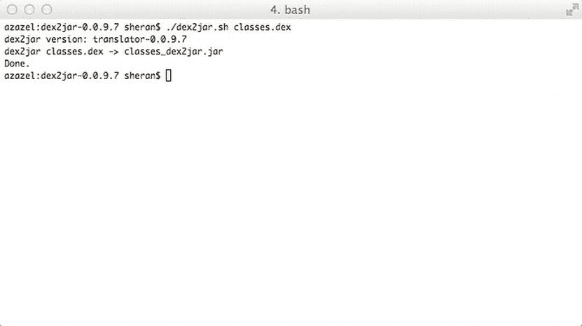

[图 9-4](#_Fig00094) 。在 classes.dex 文件上运行 dex 2 jarT5

[图 9-5](#Fig00095) 向你展示了 JD-GUI 中反编译后的源代码是什么样子。JD-GUI 有一个简单直观的界面来浏览 JAR 文件源代码，甚至可以将源代码导出到 Java 文件中。

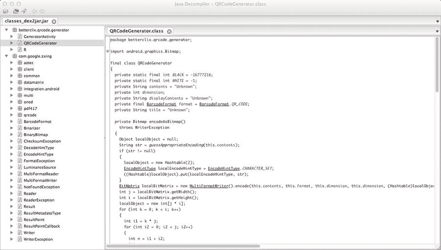

[图 9-5](#_Fig00095) 使用 JD-GUI 反编译 JAR 文件

有了这样不断发展的工具，坚定的用户下载、修改和重新打包你的应用就容易多了。如果你计划编写自己的保护机制来防止盗版，那么你有了一个好的开始。但这是你应该考虑的事情吗？我将在下一节中简要介绍这一点。

你应该许可吗？

这个问题是我看到开发者问的常见问题。你真的想花和开发你的应用一样多的时间去写一个许可程序吗？答案很主观，真的要看你的 app 是做什么的。如果你的应用有独特的或者比其他应用高效几倍的功能；或者，如果它展示了一种独特的感觉，可以确保它卖得很好，那么它可能值得考虑开发一个许可 例程。然而，请注意，当我说*许可*时，这并不意味着收费。你仍然可以为你的应用向用户收费；只是，如果你的应用没有监控许可的方法，那么最终用户将可以自由地复制和分发应用。

你可能会考虑开发许可程序的另一个原因是，如果你计划在未来开发更多的应用，并且你也想许可它们。在这种情况下，您可以简单地使用您已经创建的一个许可库。然而，有一点需要注意的是，你需要稍微改变每个应用的算法或许可证检查程序。因此，如果你的一个应用是盗版的，那么同样的技术将不会在其他应用上工作。

**安卓许可证验证库**

谷歌已经提供了 Android LVL 来帮助开发者保护他们的应用不被任意分发。将 LVL 添加到应用构建路径中，并使用其中的 API 来检查和验证用户许可。LVL 与 Android Market 应用(见[图 9-6](#Fig00096) )连接，然后与 Google market 服务器核对。根据您收到的响应，您可以选择是允许还是拒绝进一步使用应用。了解 LVL 的最好方法是在一个示例应用中使用它，我们就这么做吧。但是，在您继续之前，您需要注册成为应用发布者。不过，你现在不需要这么做。让我们从编写一个非常基本的应用开始，用它来测试我们的许可程序。[清单 9-4](#list4) 到 [9-7](#list7) 展示了这个基本应用的代码。

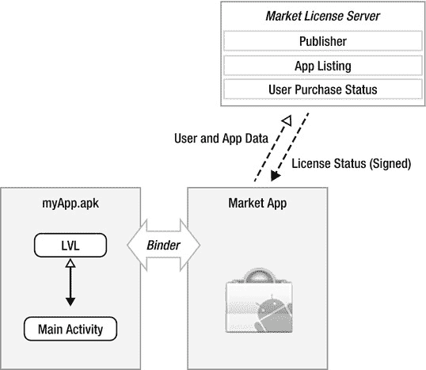

[图 9-6](#_Fig00096) LVL 库与市场应用接口，然后与市场服务器接口

这个应用本身非常简单。它涉及到 Chuck Norris(正如你从前面的提取和逆向工程部分已经猜到的。)我们都知道也害怕查克·诺里斯。他的回旋踢是传奇性的，人们报道说它们经常是许多自然灾害的原因。为了向这位伟人致敬，我将创建一个应用，从一个名为查克·诺里斯事实( [、www.chucknorrisfacts.com/](http://www.chucknorrisfacts.com/))的热门网站获取最新的查克·诺里斯事实。该应用将从该网站获取所有报价，并在我们的应用屏幕的文本区域显示随机报价。只需点击按钮获取另一个事实。我依赖于该网站报价的随机性，以确保每次都有新的报价出现。像往常一样，这个应用仅仅是一个例子，说明了你需要添加 LVL 检查的方式和位置。几乎没有错误检查，应用的功能也很少。说到这里，我不知道为什么我需要为自己辩护；这是查克·诺里斯的应用。仅此一点就足够了。你可能会注意到应用中有几个你可以改进的地方。请随意这样做。

***[清单 9-4](#_list4) 。***

```java
package net.zenconsult.android.chucknorris;

**import** android.app.Activity;
**import** android.os.Bundle;
**import** android.view.View;
**import** android.widget.Button;
**import** android.widget.TextView;

**public class** ChuckNorrisFactsActivity **extends** Activity **implements** CommsEvent {
        **private** Activity activity;
        **private** TextView view;
        **private** CommsEvent event;

        /** Called when the activity is first created. */
        @Override
        **public void** onCreate(Bundle savedInstanceState) {
                **super**.onCreate(savedInstanceState);
                setContentView(R.layout. *main* );
                activity = **this**;
                event = **this**;
                view = (TextView) findViewById(R.id.*editText1*);

                // Click Button
                **final** Button button = (Button) findViewById(R.id.*button1*);
                button.setOnClickListener(**new** View.OnClickListener() {
                        **public void** onClick(View v) {
                                view.setText("Fetching fact...");
                                CommsNotifier c = **new** CommsNotifier(event);
                                c.start();
                        }
                });
        }

        @Override
        **public void** onTextReceived(**final** String text) {
                runOnUiThread(**new** Runnable() {
                        **public void** run() {
                                view.setText(text);
                        }
                });

        }
}
```

***清单 9-5。***

```java
**package** net.zenconsult.android.chucknorris;

**public interface** CommsEvent {
        **public void** onTextReceived(String text);
}
```

***清单 9-6。【CommsNotifier.java】***

```java
**package** net.zenconsult.android.chucknorris;

**public class** CommsNotifier **extends** Thread {
        **private** CommsEvent event;

        **public** CommsNotifier(CommsEvent evt) {
        event = evt;
        }

        **public void** run() {
        Comms c = **new** Comms();
        event.onTextReceived(c.get());
        }
}
```

***[清单 9-7](#_list7) 。****【Comms.java】文件*

```java
**package** net.zenconsult.android.chucknorris;

**import** java.io.IOException;
**import** java.io.InputStream;
**import** java.util.Random;
**import** java.util.Vector;

**import** javax.xml.parsers.DocumentBuilder;
**import** javax.xml.parsers.DocumentBuilderFactory;
**import** javax.xml.parsers.ParserConfigurationException;

**import** org.apache.http.HttpResponse;
**import** org.apache.http.client.ClientProtocolException;
**import** org.apache.http.client.methods.HttpGet;
**import** org.apache.http.impl.client.DefaultHttpClient;
**import** org.apache.http.util.EntityUtils;
**import** org.w3c.dom.Document;
**import** org.w3c.dom.NamedNodeMap;
**import** org.w3c.dom.Node;
**import** org.w3c.dom.NodeList;
**import** org.xml.sax.SAXException;

**import** android.app.Activity;
**import** android.content.Context;
**import** android.util.Log;
**import** android.widget.Toast;

**public class** Comms {
        **private final** String url = "[http://www.chucknorrisfacts.com/](http://www.chucknorrisfacts.com/)";

        **private** DefaultHttpClient client;

        **public** Comms() {

        client = **new** DefaultHttpClient();
        }

        **public** String get() {
        InputStream pageStream = doGetAsInputStream(url);
        DocumentBuilderFactory dbFactory = DocumentBuilderFactory.*newInstance*();
        DocumentBuilder db = **null**;
        Document doc = **null;**
        String pageText = "";
        Vector        < String >        quotes = **new** Vector        < String >        ();
        **try** {
        db = dbFactory.newDocumentBuilder();
        doc = db.parse(pageStream);
        NodeList nl = doc.getElementsByTagName("div");
        **for** (**int** x = 0; x < nl.getLength(); ++x) {
        Node node = nl.item(x);
        NamedNodeMap attributes = node.getAttributes();
        **for** (**int** y = 0; y        <        attributes.getLength(); ++y) {
        **if** (attributes.getNamedItem("class") ! = null) {
        Node attribute =
       attributes.getNamedItem("class");
        **if** (attribute.getNodeValue()
        .equals("views-
field-title")) {
        NodeList children =
       node.getChildNodes();
        **for** (**int** z = 0; z <
       children.getLength(); ++z) {
        Node child =
       children.item(z);
        **if** (child.getNodeName()
        
.equalsIgnoreCase("span"))
        quotes.add
(child.getTextContent());
        }
        }
        }

        }
        }
        Random r = **new** Random();
        pageText = quotes.get(r.nextInt(quotes.size() - 1));
        pageStream.close();
        } **catch** (SAXException e) {
              // **TODO** Auto-generated **catch** block
        e.printStackTrace();
        } **catch** (IOException e) {
              // **TODO** Auto-generated catch block
        e.printStackTrace();
        } **catch** (ParserConfigurationException e) {
              // **TODO** Auto-generated catch block
        e.printStackTrace();
        }
        **return** pageText;
        }

        **public** String doGetAsString(String url) {
        HttpGet request = **new** HttpGet(url);
        String result = "";
        **try** {
        HttpResponse response = client.execute(request);
        **int** code = response.getStatusLine().getStatusCode();
        **if** (code == 200) {
        result = EntityUtils.*toString*(response.getEntity());
        } **else** {
        Log.*e*("CN", "Non 200 Status Code "        +        code);
        }
        } **catch** (ClientProtocolException e) {
              // **TODO** Auto-generated catch block
        e.printStackTrace();
        } **catch** (IOException e) {
              // **TODO** Auto-generated catch block
        e.printStackTrace();
        }
        **return** result;

        }

        **public** InputStream doGetAsInputStream(String url) {
        HttpGet request = **new** HttpGet(url);
        InputStream result = **null**;
        **try** {
        HttpResponse response = client.execute(request);
        **int** code = response.getStatusLine().getStatusCode();
        **if** (code == 200) {
        result = response.getEntity().getContent();
        } **else** {
        Log.*e*("CN", "Non 200 Status Code "        +        code);
        }
        } **catch** (ClientProtocolException e) {
              // **TODO** Auto-generated catch block
        e.printStackTrace();
        } **catch** (IOException e) {
              // **TODO** Auto-generated catch block
        e.printStackTrace();
        }
        **return** result;
        }
}
```

从主活动开始，您可以看到有一个按钮和一个文本视图，我们将使用它进行用户交互。当用户点击我们的按钮时，我们启动我们的 CommNotifier 线程。这个线程将执行我们的 Comms 文件中的 HTTP get 请求，并返回一个从网站上收集的 Chuck Norris 事实列表中随机选取的引用。 CommNotifier 然后触发 onTextReceived(字符串文本)函数。我们的主活动实现了 CommEvent 接口。因此，每当这个方法被触发时，我们需要访问文本参数来接收我们的报价。当我们执行应用并点击按钮时，我们会看到类似于图 9-7 所示的输出。查克·诺里斯确实很吓人。

现在我们已经有了自己的应用，让我们看看如何使用 LVL 来保护它。

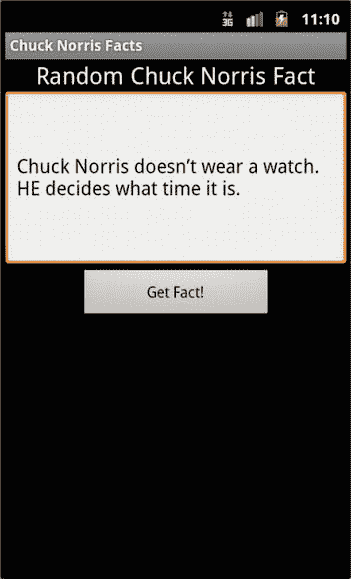

[图 9-7](#_Fig00097) 查克·诺里斯事实应用 T5 在行动

我将在 Android 模拟器上运行这个演示。这涉及到一个额外的步骤，因为 Android 模拟器没有预先打包到 Android Market 应用中。我需要下载 Google API 插件 平台，它提供了 Android Market 的基本后台实现。它实现了我们测试 LVL 所需的许可服务。不过，我有点言过其实了。让我们从准备我们的开发环境开始。我将假设您使用 Eclipse 进行开发，并且您已经下载并安装了 API 级别至少为 8 的 Android SDK。我们出发了！

**下载谷歌 API 插件**

如果您使用 Eclipse，我将描述获得 Google API 附加组件所需的步骤。首先，打开 Android SDK 管理器。选择窗口  Android SDK 管理器。接下来，导航到您计划使用的 API 级别，并勾选谷歌公司的谷歌 API(参见[图 9-8](#Fig00098) )。在点击安装按钮之前，再次导航到 Extras 文件夹并勾选 Google Market 许可包(参见[图 9-9](#Fig00099) )。现在点击安装按钮。对于这个应用，我使用 2.3.3 版本的 Android API level 10，所以这是我选择的。

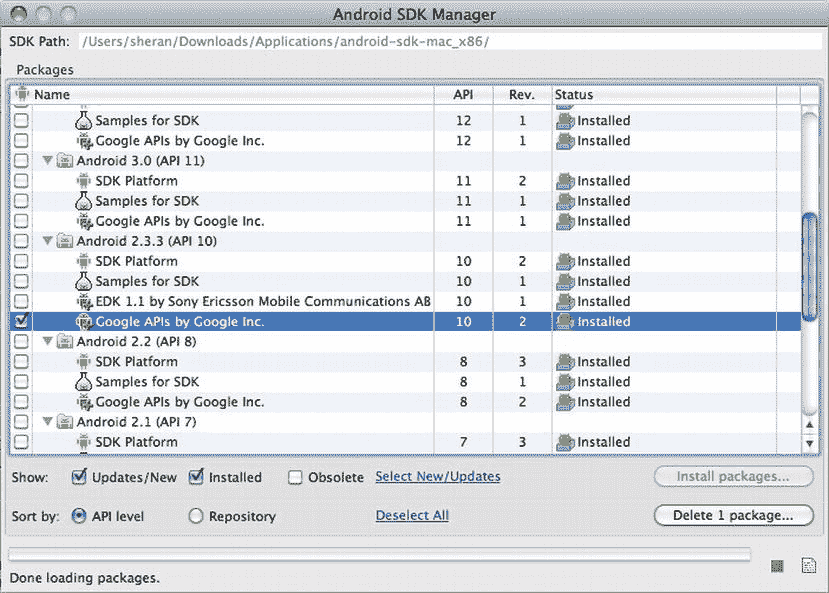

[图 9-8](#_Fig00098) 为 Android 版本 2.3.3 安装 Google APIs

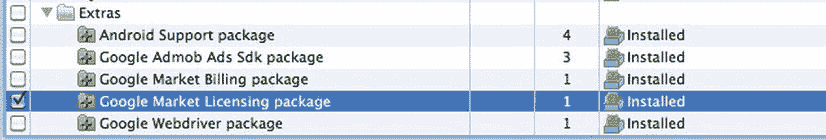

[图 9-9](#_Fig00099) 安装市场许可包

就是这样。Eclipse 会将您的 API 下载并安装到 SDK 目录中。要找到 LVL 源代码，请从 Android SDK 目录导航到/extras/Google/market _ licensing/library。在这里，你会看到一个类似于图 9-10 所示的目录结构。让我们进入下一组步骤，即导入、修改和构建 LVL。

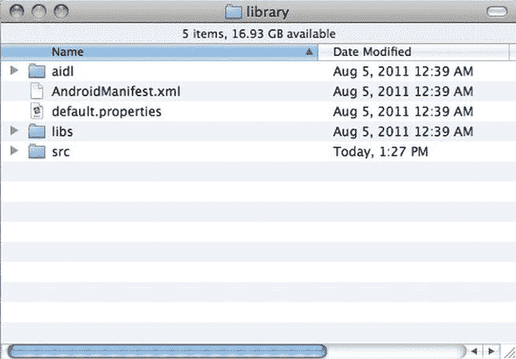

[图 9-10](#_Fig000910)T3。LVL 来源

**将 LVL 源文件复制到单独的目录下**

现在我们已经有了 LVL 源代码，让我们把它移到另一个工作目录中。这样做的主要原因是，如果我们继续从原始的源目录开始工作，每当我们进行更新时，我们所有的更改都可能被覆盖。因此，我们需要将我们的 LVL 源文件保存在一个单独的目录中，这样就不会被覆盖。这很简单。将库目录以及所有子目录和文件复制到您的开发目录中。

**导入 LVL 源作为库项目**

我们现在将建立 LVL 图书馆。为此，我们必须创建一个新的 Eclipse Android 项目，并将该项目标记为库项目。库项目没有活动，也不直接与最终用户交互。相反，它的存在是为了让其他应用可以在它们的代码中使用它的功能。创建一个新的 Eclipse 项目，选择文件  新建  其他，打开 Android 文件夹，选择 Android 项目(参见[图 9-11](#Fig000911) )。命名您的项目(参见[图 9-12](#Fig000912) ，并选择您计划开发项目的正确 API 版本(参见[图 9-13](#Fig000913) )。您需要将您的包命名为与 LVL 源代码相同的名称，即 com . Android . vending . licensing(参见[图 9-14](#Fig000914) )。


[图 9-11](#_Fig000911)T3。Android 项目

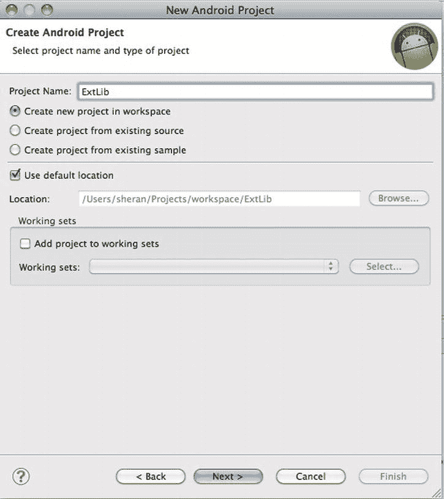

[图 9-12](#_Fig000912)T3。命名您的项目

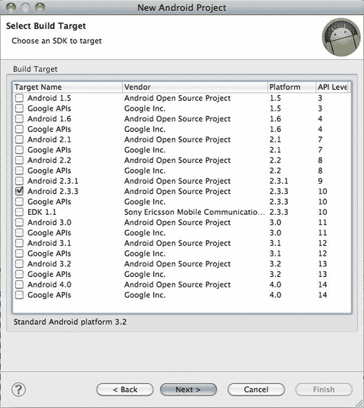

[图 9-13](#_Fig000913)T3。选择 API 版本

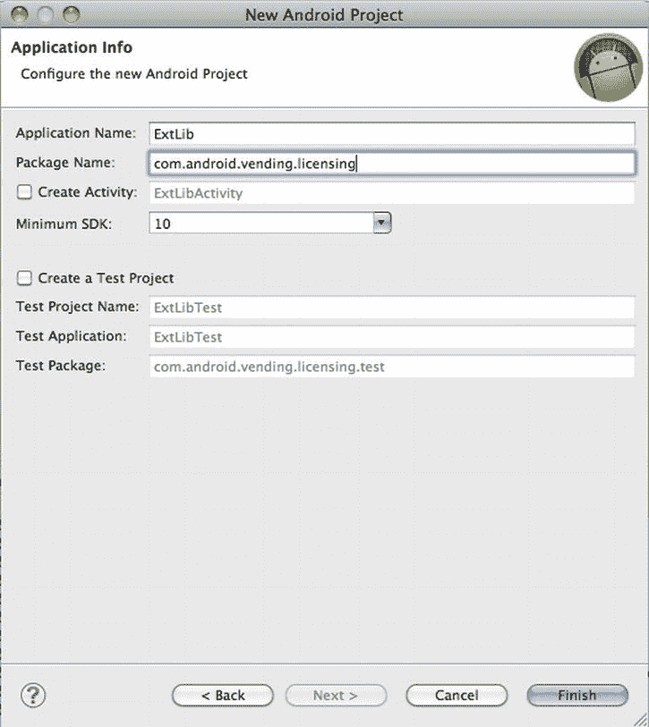

[图 9-14](#_Fig000914)T3。指定包名。它应该与 LVL 源代码包相同

完成后，让我们将 LVL 源代码导入到我们的项目中。但在此之前，我们先把项目设定为库项目。在项目资源管理器窗口中右键单击项目名称，然后选择 Properties。在左侧窗格中选择 Android 选项，在右侧窗格的下半部分，您会看到一个标记为 Is Library 的勾选框。勾选此选项并点击确定按钮(参见[图 9-15](#Fig000913) )。

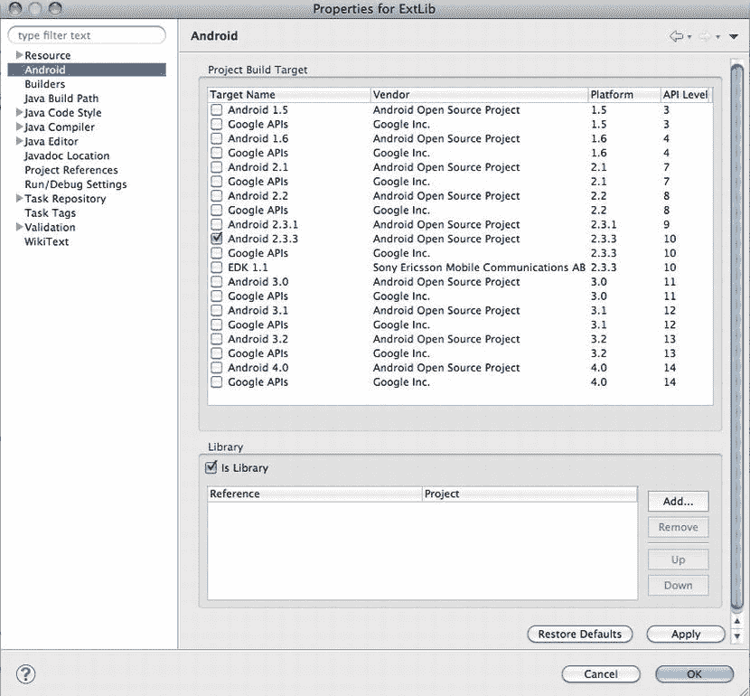

图 9-15 。将项目标记为库

现在我们可以导入我们的源代码了。在“项目资源管理器”窗口中右键单击项目名称，然后选择“导入”。在出现的窗口中，选择文件系统(见[图 9-16](#Fig000916) )并点击下一步按钮。在下一个窗口中，单击 Browse 按钮并导航到作为 Android LVL 源代码一部分的 library 文件夹。在左中窗格中，您应该会看到目录出现。勾选库目录并点击完成按钮，将 LVL 源文件导入到您的项目中(参见[图 9-17](#Fig000917) )。如果要求您覆盖 *AndroidManifest.xml* 文件，选择 Yes。您的 LVL 源现在是项目的一部分。

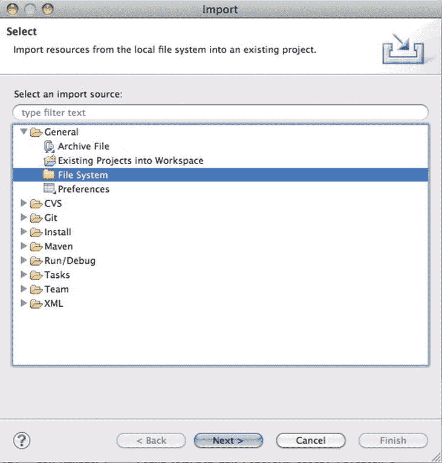

[图 9-16](#_Fig000916)T3。导入文件系统

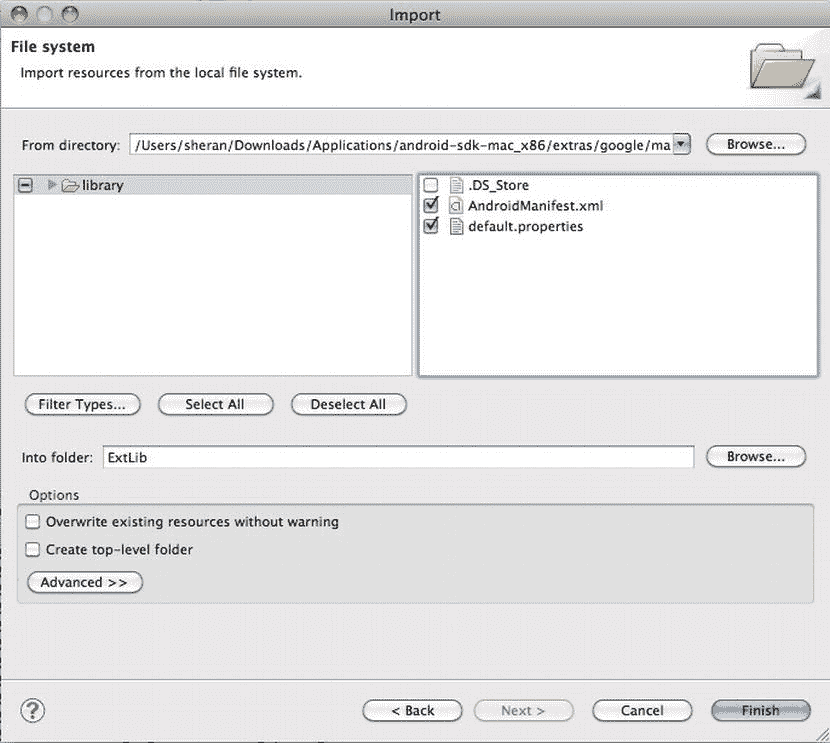

[图 9-17](#_Fig000917)T3。找到并导入源代码

**在我们的 app** 中建立并包含 LVL

 **我们先把 Google 提供的基础版 LVL 集成到我们的 app 中。在此之后，我将解释一些可能的地方，您可以修改 LVL 源代码，使之成为您自己的。我强烈推荐这种方法，因为正如我前面提到的，您编写的 LVL 修改过的源代码不会广为人知，因此攻击者会花更长的时间来破坏您的许可模块。

要在您的应用中包含 LVL，请在 Eclipse 的 Project Explorer 视图中导航到您的应用名称，右键单击并选择 Properties。从左侧窗口窗格中选择 Android 选项，然后在右下方的窗口页面中，单击“Add”按钮。然后提示您选择一个库项目(参见[图 9-18](#Fig000918) )。选择我们刚刚创建的 Android LVL 库项目。完成后，你会看到库项目包含在你的应用的项目中(见[图 9-19](#Fig000919) )。

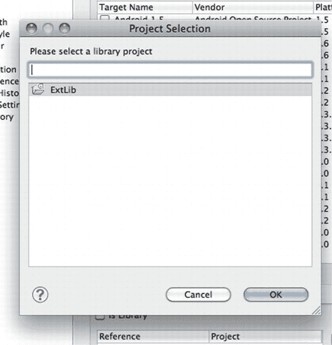

[图 9-18](#_Fig000918) 。选择 Android LVL 库项目

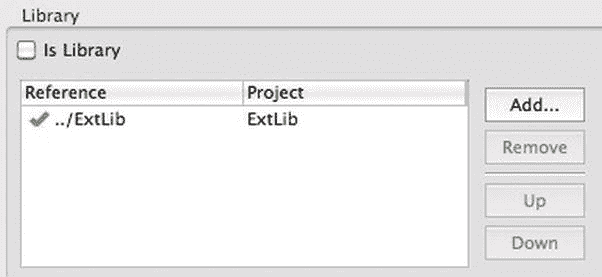

[图 9-19](#_Fig000919)T3。LVL 库项目包含在 app 项目中

现在让我们把我们的 ChuckNorrisFactsActivity.java 文件改成清单 9-8 所示的[文件。你可以看到我们添加了一个新的私有类，叫做 LicCallBack 。这实现了 LVL 的 LicenseCheckerCallBack 类。当许可证检查完成时，以及当许可证服务器有肯定或否定的响应时，调用此类。分别调用 allow() 或 don 牛油()方法。](#list8)

***[清单 9-8](#_list8) 。*** *修改后的 ChuckNorrisFactsActivity.java 文件*

```java
**package** net.zenconsult.android.chucknorris;

**import** java.util.UUID;

**import** com.android.vending.licensing.AESObfuscator;
**import** com.android.vending.licensing.LicenseChecker;
**import** com.android.vending.licensing.LicenseCheckerCallback;
**import** com.android.vending.licensing.ServerManagedPolicy;

**import** android.app.Activity;
**import** android.content.Context;
**import** android.os.Build;
**import** android.os.Bundle;
**import** android.provider.Settings.Secure;
**import** android.view.View;
**import** android.view.Window;
**import** android.widget.Button;
**import** android.widget.TextView;
**import** android.widget.Toast;

**public class** ChuckNorrisFactsActivity **extends** Activity **implements** CommsEvent {
        **private** Button button;
        **private** TextView view;
        **private** Activity activity;
        **private** CommsEvent event;
        **private** LicCallBack lcb;
        **private static** final String*PUB_KEY* = "MIIBI...";// Add your Base64 Public
        // key here
        **private** staticfinal byte[]*SALT* = **new byte**[] { −118, -112, 38, 124, 15,
        -121, 59, 93, 35, -55, 14, -15, -52, 67, -53, 54, 111, -28,
       -87, 12 };

        /** Called when the activity is first created. */
        @Override
        public void onCreate(Bundle savedInstanceState) {
        **super**.onCreate(savedInstanceState);
        requestWindowFeature(Window.*FEATURE_INDETERMINATE_PROGRESS*);
        setContentView(R.layout.*main*);
        event = **this**;
        activity = **this**;
        view = (TextView) findViewById(R.id.*editText1*);

        // Click Button
        button = (Button) findViewById(R.id.*button1*);
        button.setOnClickListener(**new** View.OnClickListener() {
        public void onClick(View v) {
        // Do License Check before allowing click

        // Generate a Unique ID
        String deviceId = Secure.*getString*(getContentResolver(),
        Secure.*ANDROID_ID*);
        String serialId = Build.*SERIAL*;
        UUID uuid = **new** UUID(deviceId.hashCode(),
       serialId.hashCode());
        String identity = uuid.toString();
        Context ctx = activity.getApplicationContext();

        // Create an Obfuscatorand a Policy
        AESObfuscator obf = **new** AESObfuscator(*SALT*,
       get**Package**Name(),
        identity);
        ServerManagedPolicy policy = **new**
       ServerManagedPolicy(ctx, obf);

        // Create the LicenseChecker
        LicenseChecker lCheck = **new** LicenseChecker(ctx,
       policy,*PUB_KEY*);

        // Do the license check
        lcb = **new** LicCallBack();
        lCheck.checkAccess(lcb);
        }
        });
        }

        @Override
        public void onTextReceived(final String text) {
        runOnUiThread(**new** Runnable() {
        public void run() {
        setProgressBarIndeterminateVisibility(**false**);
        view.setText(text);
        button.setEnabled(**true**);

        }
        });

        }

        **public class** LicCallBack implements LicenseCheckerCallback {

        @Override
        public void allow() {
        if (isFinishing()) {
        return;
        }

        Toast toast = Toast.*makeText*(getApplicationContext(),
       "Licensed!",
        Toast.*LENGTH_LONG*);
        toast.show();
        button.setEnabled(**false**);
        setProgressBarIndeterminateVisibility(**true**);
        view.setText("Fetching fact...");
        CommsNotifier c = **new** CommsNotifier(event);
        c.start();
        }

        @Override
        public void dontAllow() {
        if (isFinishing()) {
        return;
        }
        Toast toast = Toast.*makeText*(getApplicationContext(),
        "Unlicensed!", Toast.*LENGTH_LONG*);
        toast.show();
        }

        @Override
        public void applicationError(ApplicationErrorCode errorCode) {
        // TODO Auto-generated method stub

        }

        }

}
```

下一件你会注意到的事情是，我们没有在我们的按钮点击上做任何活动。相反，我们做执照检查。这意味着我们将我们的报价获取活动移到了 LicenseCallBack 类的 allow() 部分。要使用来自 LVL 的许可证检查，您必须调用 LicenseChecker 类的 checkAccess() 方法。您必须使用以下参数构建 LicenseChecker:

1.  应用上下文
2.  许可政策
3.  您的公钥

对于应用上下文，您可以使用当前的应用上下文。如果您的 LicenseChecker 在另一个类中被实例化，那么您需要将应用上下文对象传递给这个类。您的 Base 64 编码公钥将位于您的在线发布者配置文件页面中。要访问它，登录 https://market.android.com/publish/Home 的[，点击编辑个人资料，然后向下滚动到名为许可&应用内计费的部分。名为公钥的文本区域保存您的密钥(参见](https://market.android.com/publish/Home)[图 9-20](#Fig000920) )。将此复制并粘贴到您的应用中。许可策略需要更多的解释，所以我将在下一节描述它。

同样，请看下面的代码:

```java
AESObfuscator obf = new AESObfuscator(*SALT*, get**Package**Name(),identity);
```

当你的应用收到来自 Android 许可服务器的响应时，它需要在本地设备上存储关于这个响应的信息。将响应数据保持为纯文本形式只会意味着攻击者可以读取和篡改这些信息。为了防止这种情况发生，LVL 允许我们在将信息存储在设备上之前对其进行模糊处理。 AESObfuscator 类就是这样做的。它需要一个 salt 值(只是一个随机的 20 字节)和一个唯一的设备标识。唯一标识确保只能从具有该匹配标识的设备读取数据。在您自己的代码中，您将希望从尽可能多的信息来源中构建这个标识字符串。在这种情况下，我使用的是 ANDROID_ID 和 OS 构建序列号。

另请注意，您的应用必须请求新的权限。为了能够通过 Android Market 验证许可证，请确保将以下权限添加到 AndroidManifest.xml 文件中:

<用途-权限 Android:name =【com . Android . vending . check _ LICENSE】>

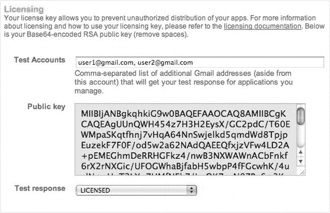

[图 9-20](#_Fig000920)T3。Base64 编码的公钥

您的 publisher 仪表板有一个标有测试响应的下拉菜单(参见[图 9-20](#Fig000920) )。您可以通过将该值设置为许可或非许可来测试您的应用。Google API 和 LVL 将联系 Android Market 服务器，并向您的应用提供此响应。将测试响应值设置为 NOT_LICENSED 可让您看到未经授权的用户试图使用您的应用时，您的应用会如何运行(参见[图 9-21](#Fig000921) )。相应地，您可以进行更改，或者显示一条消息(我用一个词来表示该应用是否获得许可)，或者将用户重定向到 Android Market，以便她可以购买您的应用。

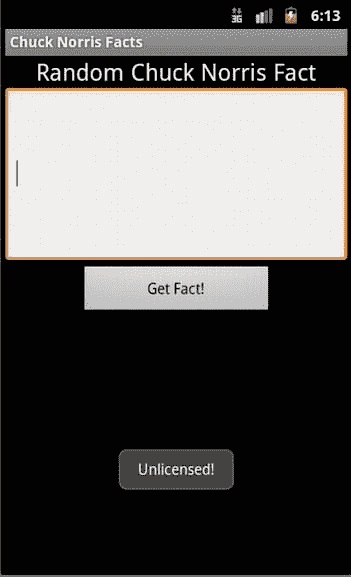

[图 9-21](#_Fig000921)T3。一个未经许可的用户收到一个否定的回应，应用无法运行

**许可政策**

可以用来定制许可过程的一个关键机制是许可策略。Android LVL 附带两个默认策略 :

*   严格的政策
*   服务器管理策略

Google 建议您使用 ServerManagedPolicy，因为它还处理服务器响应的缓存。这通常很有用，因为 Google 对应用查询其服务器的次数进行了限制。StrictPolicy 将始终查询服务器；虽然这可以防止本地设备数据被篡改，从而更加安全，但如果谷歌服务器因为您达到了极限而拒绝给您响应，它可能会将您的最终用户锁定在外。

这两个策略对象都提供了您将会关注的两个基本方法: allowAccess() 和 processServerResponse() 。 allowAccess() 方法必须返回一个布尔值。当被调用时，如果选择允许访问，则返回 true；否则，返回假。请看清单 9-9 中的示例实现。

***[清单 9-9](#_list9) 。****server managed policy 对象中的 allowAccess()方法* *(由 Google 提供)*

```java
public boolean allowAccess() {
        long ts = System.currentTimeMillis();
        if (mLastResponse == LicenseResponse.LICENSED) {
        // Check if the LICENSED response occurred within the validity timeout.
        if (ts        <        = mValidityTimestamp) {
        // Cached LICENSED response is still valid.
        return true;
        }
        } else if (mLastResponse == LicenseResponse.RETRY &&
        ts < mLastResponseTime        +        MILLIS_PER_MINUTE) {
        // Only allow access if we are within the retry period or we haven't
       used up our
        // max retries.
        return (ts        <        = mRetryUntil || mRetryCount        <        = mMaxRetries);
        }
        return false;
        }

```

您可以看到，如果该函数接收到 LicenseResponse，它将返回 true 。许可作为其回应。该函数首先检查收到的最后一个响应是否表明该应用已获得许可。然后，它检查该日期是否仍在有效期内。如果是，那么它返回真。如果日期大于有效期，则返回假。该函数还检查服务器是否要求我们继续重试，并且它在合理的重试限制和时间间隔内这样做。响应对象 mLastResponse 是从 processserveresponse()方法 中派生出来的，如[清单 9-10](#list10) 所示。您可以看到这个函数检查三个响应:

*   许可证响应。瑞莉
*   许可证响应。得到许可的
*   许可证响应。未获得许可

相应地，它随后设置参数， allowAccess() 方法可以读取这些参数。你会注意到另一件事。 processServerResponse() 对象中的最后一行是一个 commit() 操作。这是一种缓存功能，在该功能中，响应被混淆，然后存储在设备的共享首选项中。StrictPolicy 中不存在此部分，因为没有缓存任何数据。

***[清单 9-10](#_list10) 。****ServerManagedPolicy 对象中的 processServerResponse()方法*

```java
**public void** processServerResponse(LicenseResponse response, ResponseData rawData) {

        // Update retry counter
        if (response != LicenseResponse.*RETRY*) {
        setRetryCount(0);
     } **else** {
        setRetryCount(mRetryCount        +        1);
     }

     **if** (response == LicenseResponse.*LICENSED*) {
        // Update server policy data
        Map        < String, String >        extras = decodeExtras(rawData.extra);
        mLastResponse = response;
        setValidityTimestamp(extras.get("VT"));
        setRetryUntil(extras.get("GT"));
        setMaxRetries(extras.get("GR"));
     } **else if** (response == LicenseResponse.*NOT_LICENSED*) {
        // Clear out stale policy data
        setValidityTimestamp(*DEFAULT_VALIDITY_TIMESTAMP*);
        setRetryUntil(*DEFAULT_RETRY_UNTIL*);
        setMaxRetries(*DEFAULT_MAX_RETRIES*);
     }

     setLastResponse(response);
     mPreferences.commit();
 }

```***  *****LVL 的有效使用**

如果您修改了 LVL 源代码(即您的策略)，使其成为您的应用独有的东西，那么这一努力是值得的。您可能犯的一个错误是使用 LVL 的普通实现，每个人都知道它的源代码。这使得有人更容易修补你的应用，绕过你的许可证检查程序。Justin Case 已经在 Android Police 网站上展示了这个漏洞。可以在[www . androidpolice . com/2010/08/23/exclusive-report-Google-Android-market-license-verification-easy-boxed-will-not-stop-pirates/](http://www.androidpolice.com/2010/08/23/exclusive-report-googles-android-market-license-verification-easily-circumvented-will-not-stop-pirates/)找到文章。诚然，这是一篇老文章，但它仍然展示了这样一个原则，即如果您知道源代码是什么样子，就可以很容易地理解和修改逆向工程代码。在这种情况下，Justin 在一个演示和一个实际的商业应用中演示了如何修补和绕过 LVL 检查。

Android 开发者博客的 Trevor Johns 为我们提供了另一套很好的指南。这篇文章非常值得一读，并列出了一些更有效地使用 LVL 的技巧。有一段代码非常有趣。看[图 9-22](#Fig000920) 。Trevor 告诉我们，攻击者可以猜测许可和未 _ 许可常量值的响应，然后交换它们，以便未经许可的用户可以完全使用该应用。为了防止这种情况，Trevor 向我们展示了一些代码，这些代码将对响应运行 CRC32 检查；不检查常量，而是检查常量的 CRC32 检查结果。我想在这个问题上多谈一点。想象一下，如果您不运行固定值的检查，而是执行另一个 HTTP fetch 来从您自己的服务器检索响应。

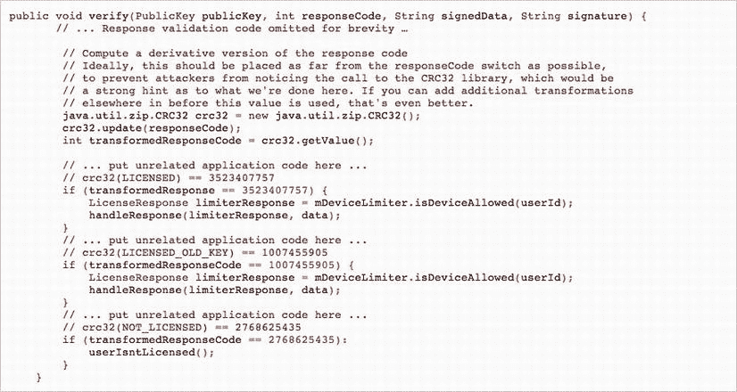

图 9-22 。备用响应验证思路

考虑清单 9-11 中的代码。您向服务器发出一个额外的请求，并从那里检索响应代码，而不是直接与一个数字进行比较。这样做的一个好处是，你可以以任何你喜欢的方式设计你的 ServerVerifier 对象。您甚至可以设置它，使响应代码每次都发生变化。您甚至可以考虑在代码中使用质询响应来改变每次的响应。

***[清单 9-11](#_list11) 。*** *修改验证功能*

```java
public void verify(PublicKey publicKey, int responseCode, String signedData, String
       signature) {
        // ... Response validation code omitted for brevity ...

        // Compute a derivative version of the response code
        // Rather than comparing to a static value, why not retrieve the value from
       a server that you control?

        java.util.zip.CRC32 crc32 = new java.util.zip.CRC32();
        crc32.update(responseCode);
        int transformedResponseCode = crc32.getValue();

        ServerVerifier sv = new ServerVerifier(); // This class will make an
       HTTP request to your server to fetch the code.
        int serverResponse = sv.retrieveLicensedCode(); // There is no limit
       to how you can create this routine.

        // ... put unrelated application code here ...
        // crc32(LICENSED) == 3523407757 But this part is calculated on your server.
        if (transformedResponse == serverResponse) {
        LicenseResponse limiterResponse = mDeviceLimiter.isDeviceAllowed(userId);
        handleResponse(limiterResponse, data);
        }

        ...
        ...
        ...

```

或者，这也可以发生在策略中(与检查硬编码的服务器响应相反):

```java
**if** (response == LicenseResponse.*LICENSED*)
```

您可以通过以下方式从您信任的服务器之一检索响应来检查响应:

```java
ServerVerifier sv = new ServerVerifier();
**if** (response == sv.getLicensedResponse())
```***  *****混淆视听**

混淆 是你需要考虑的另一个要点。它适用于软件盗版，以及知识产权盗窃。模糊处理是将源代码中的所有类名、变量名和方法名更改为随机的、不相关的名称的过程。你可能想知道为什么我的反编译应用在目录列表中有像 a.smali 、 b.smali 、 c.smali 等文件。当我使用 BakSmali 反编译我的应用时，我是在二进制文件的模糊版本上运行它的。代码混淆器确保将我的类名(如 Comms 、 CommsEvent 、 CommsNotifier 等)更改为不主动提供它们所做工作的信息的类名。此外，如果您查看这些文件，您会发现方法名和成员名都被混淆了。这对于试图对代码进行逆向工程的人来说是非常令人沮丧的，并且它可以作为对知识产权或代码盗窃的极好的威慑。

模糊处理不能保证你的代码不会被窃取或盗版。它只是让逆向工程的任务变得更加困难。Android SDK 附带了一个名为 ProGuard 的混淆器。您可以使用 ProGuard 来混淆您的任何 Java 代码。你可以在[http://proguard.sourceforge.net/;](http://proguard.sourceforge.net/;)下载它，它是免费的开源软件。Android 开发者文档强烈建议你在打包应用发布时对代码进行模糊处理。如果您使用 Eclipse，那么这是一项简单的任务。在您的项目中找到您的 project.properties 文件(参见[图 9-23](#Fig000923) )并添加这一行(参见[图 9-24](#Fig000924) ):

```java
proguard.config = proguard.cfg
```

注意，这一行假设您没有将 proguard.cfg 文件的位置从其默认位置移走。

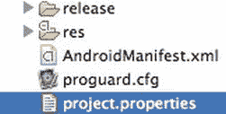

[图 9-23](#_Fig000923)T3。项目属性文件

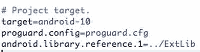

[图 9-24](#_Fig000924)T3。添加 proguard.config 属性

要导出已签名或未签名的 APK 文件，右键单击您的项目名称，选择 Android Tools，然后选择导出未签名的应用**包**或导出已签名的应用**包**(参见[图 9-25](#Fig000925) )。


[图 9-25](#_Fig000925)T3。导出混淆后的**包**

ProGuard 是一个免费的开源 Java 代码混淆器。除了混淆之外，ProGuard 还试图缩小、优化和预先验证您提供给它的代码。就缩短执行时间而言，预验证对于移动应用非常重要。预验证阶段确保 Java 类的注释方式允许 VM 更快地读取和执行一些运行时检查。在大多数情况下，使用默认的 proguard.cfg 文件就足够了。[图 9-26](#Fig000926) 显示了反编译、混淆的类文件的输出。正如您所看到的，由于重命名的、看起来很神秘的类名和变量名，代码本身很难阅读。混淆并不意味着停止逆向工程；相反，它更像是一种威慑，因为重新构建被重命名的变量和类名可能需要很长时间。一些商业 Java 混淆器甚至混淆了类文件中的字符串。这使得代码更加难以逆向工程。

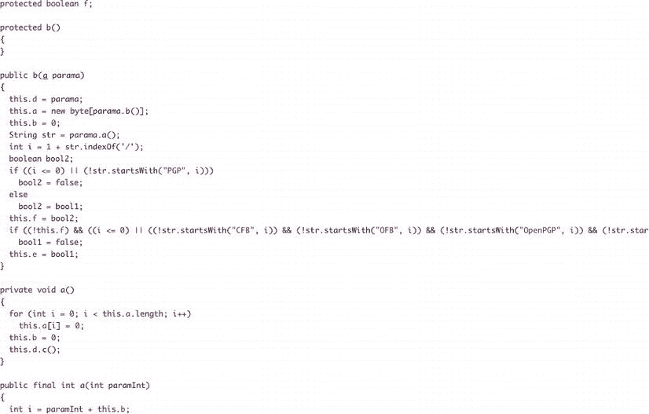

[图 9-26](#_Fig000926)T3。反编译、混淆的类文件***  *****总结**

这一章专门讨论了你在应用货币化时将会面临的一些重要问题。虽然像苹果应用商店、黑莓应用世界和安卓市场这样的网站让你很容易获得收入，但你无疑将不得不面对软件盗版和知识产权盗窃等问题。你应该记住，本章讨论的主题不是灵丹妙药。它们不会完全保护您，但是它们会为您提供优势，使您的代码变得更难被攻击。在最好的情况下，攻击者会不动你的应用，因为他不想花力气对它进行逆向工程。

在这一章中，我们看了如果你的应用发现自己处于一个敌对的环境中，它会受到什么影响。我们研究了如何对你的应用进行逆向工程，并在修改后重新构建。我们展示了如何混淆你的源代码，使得攻击者更难读懂你的代码，即使是在逆向工程之后。然后，我们研究了如何检查应用中的许可，以确保最终用户不会盗版你的应用。我们通过使用 Android LVL 做到了这一点。要记住的一件事是，总是在许可检查库中编写自己的例程。这确保了你的代码是新鲜的，新的，不为人所知的。这使得逆向工程更加困难。

在发布应用之前，请记住这几个步骤。你可以在网上的[http://developer . Android . com/guide/publishing/preparating . html](http://developer.android.com/guide/publishing/preparing.html)找到它们的完整描述。

1.  选好**包**名。它将在应用的整个生命周期中起作用。
2.  关闭调试和日志记录。确保搜索调试跟踪并禁用它。
3.  清除项目目录中的备份文件或开发和测试过程中创建的其他不必要的文件。
4.  检查您的清单文件，并确保所有必需的权限都存在。确保设置了标签和图标值以及正确的版本代码和版本名称属性。
5.  检查并优化您的应用，以获得正确的 Android 版本。确保您的应用适合在不同规格的设备上运行。
6.  在你的应用中更新你的网址。这意味着删除任何本地 IP 地址和测试服务器。将它们更改为正确的生产 IP 地址。
7.  在您的应用中实施许可。*****