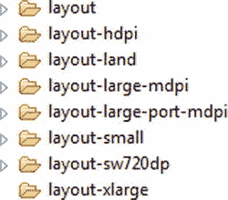

# 二、Android 模式

我们从第二章开始，看看安卓*的设计模式*。在我看来，这可能意味着两件事，*用户界面设计*和*架构*；我们将在这里同时讨论这两个问题。在“UI 设计模式”一节中，我们将看看 Google 在冰激凌三明治发布时发布的 Android UI 指南。

在编写 Android 应用时，你不必遵循开箱即用的编程结构；有 MVC、MVVM 和 DI 三种选择。在本章的后半部分，“架构设计模式”，我们将会看到一些传统 Android 编程设计的替代方案。

用户界面设计模式

在冰淇淋三明治之前，Android 设计不是很好定义的。许多早期的应用看起来与图 2-1 中的例子非常相似。这个应用有内置的后退按钮功能和类似 iOS 的标签，因为它更有可能是现有 iOS 应用的一个端口；该应用甚至有一个名字，iFarmers，属于 iTunes 应用商店。


图 2-1 。iFarmers 是一款典型的早期 Android 应用

我不想挑出 iFarmers 应用，因为在 Google Play 上有许多类似应用的例子。我敢肯定，应用开发人员推动了更多的 Android 设计，毫无疑问，在那个时候，他们不能指向一个设计资源，并说这是设计 Android 应用的行业标准方式；他们可能被告知继续做下去。

如今，Android 平台更多的是利用庞大的 Android 用户群，而不是 iOS 转换。谷歌还制作了一个设计指南，可在`http://developer.android.com/design/get-started/principles.html`获得，这些原则就是本节将要解释的。

为了帮助演示不同的最佳实践，我们将在本书中使用一个简单的待办事项应用。因此，首先，让我们看看示例应用的代码；目前它有一个闪屏，如图图 2-2 所示，还有一个添加项目的待办列表屏幕，如图图 2-3 所示。


图 2-2 。TodDoList 应用闪屏


图 2-3 。应用的主要任务列表屏幕

这本书的可下载源代码中提供了该应用的完整代码，但出于我们的目的，我们将使用两个 Java 文件，`TodoActivity.java`，如清单 2-1 所示，以及`TodoProvider.java`，您将在清单 2-2 中看到。

清单 2-1 。TodoActivity.java

```java
package com.logicdrop.todos;

import java.util.ArrayList;
import java.util.List;

import android.app.Activity;
import android.os.Bundle;
import android.util.Log;
import android.view.View;
import android.view.View.OnClickListener;
import android.widget.AdapterView;
import android.widget.AdapterView.OnItemClickListener;
import android.widget.ArrayAdapter;
import android.widget.Button;
import android.widget.EditText;
import android.widget.ListView;
import android.widget.TextView;
import android.os.StrictMode;

public class TodoActivity extends Activity
{
   public static final String APP_TAG = "com.logicdrop.todos";

   private ListView taskView;
   private Button btNewTask;
   private EditText etNewTask;
   private TodoProvider provider;

   private OnClickListener handleNewTaskEvent = new OnClickListener()
   {

       @Override
       public void onClick(final View view)
       {
          Log.d(APP_TAG, "add task click received");

          TodoActivity.this.provider.addTask(TodoActivity.this
                 .getEditText()
                 .getText()
                 .toString());

          TodoActivity.this.renderTodos();
       }
   };

   @Override
   protected void onStart()
   {
       super.onStart();
   }

   private void createPlaceholders()
   {
       this.getProvider().deleteAll();

       if (this.getProvider().findAll().isEmpty())
       {
          List<String> beans = new ArrayList<String>();
          for (int i = 0; i < 10; i++)
          {
              String title = "Placeholder " + i;
              this.getProvider().addTask(title);
              beans.add(title);
          }
       }
   }

   EditText getEditText()
   {
       return this.etNewTask;
   }

   private TodoProvider getProvider()
   {
       return this.provider;
   }

   private ListView getTaskView()
   {
       return this.taskView;
   }

   public void onCreate(final Bundle bundle)
   {
        super.onCreate(bundle);

        this.setContentView(R.layout.main);

       this.provider = new TodoProvider(this);
       this.taskView = (ListView) this.findViewById(R.id.tasklist);
       this.btNewTask = (Button) this.findViewById(R.id.btNewTask);
       this.etNewTask = (EditText) this.findViewById(R.id.etNewTask);
       this.btNewTask.setOnClickListener(this.handleNewTaskEvent);

       this.showFloatVsIntegerDifference();

       this.createPlaceholders();

       this.renderTodos();
}

       private void renderTodos()
       {
       List<String> beans = this.getProvider().findAll();

       Log.d(APP_TAG, String.format("%d beans found", beans.size()));

       this.getTaskView().setAdapter(
              new ArrayAdapter<String>(this,
                     android.R.layout.simple_list_item_1, beans
                            .toArray(new String[]
                            {})));

       this.getTaskView().setOnItemClickListener(new OnItemClickListener()
       {
          @Override
          public void onItemClick(final AdapterView<?> parent,
                 final View view, final int position, final long id)
          {
              Log.d(APP_TAG, String.format(
                     "item with id: %d and position: %d", id, position));

              TextView v = (TextView) view;
              TodoActivity.this.getProvider().deleteTask(
                     v.getText().toString());
              TodoActivity.this.renderTodos();
          }
       });
   }

}
```

`TodoActivity.java`控制应用的布局，`TodoProvider.java`显示在列表 2-2 中，管理你添加到列表中的项目的数据。在应用中，我们已经用初始占位符项目的列表填充了它。

清单 2-2 。TodoProvider.java

```java
package com.logicdrop.todos;

import java.util.ArrayList;
import java.util.List;

import android.content.ContentValues;
import android.content.Context;
import android.database.Cursor;
import android.database.sqlite.SQLiteDatabase;
import android.database.sqlite.SQLiteOpenHelper;
import android.util.Log;

import com.logicdrop.todos.TodoActivity;

public class TodoProvider
{
   private static final String DB_NAME = "tasks";
   private static final String TABLE_NAME = "tasks";
   private static final int DB_VERSION = 1;
   private static final String DB_CREATE_QUERY = "CREATE TABLE " + TABLE_NAME + " (id integer primary key autoincrement, title text not null);";

   private SQLiteDatabase storage;
   private SQLiteOpenHelper helper;

   public TodoProvider(final Context ctx)
   {
       this.helper = new SQLiteOpenHelper(ctx, DB_NAME, null, DB_VERSION)
       {
          @Override
          public void onCreate(final SQLiteDatabase db)
          {
              db.execSQL(DB_CREATE_QUERY);
          }

          @Override
          public void onUpgrade(final SQLiteDatabase db, final int oldVersion,
                 final int newVersion)
          {
              db.execSQL("DROP TABLE IF EXISTS " + TABLE_NAME);
              this.onCreate(db);
          }
       };

       this.storage = this.helper.getWritableDatabase();
   }

   public synchronized void addTask(final String title)
   {
       ContentValues data = new ContentValues();
       data.put("title", title);

       this.storage.insert(TABLE_NAME, null, data);
   }

   public synchronized void deleteAll()
   {
       this.storage.delete(TABLE_NAME, null, null);
   }

   public synchronized void deleteTask(final long id)
   {
       this.storage.delete(TABLE_NAME, "id=" + id, null);
   }

   public synchronized void deleteTask(final String title)
   {
       this.storage.delete(TABLE_NAME, "title='" + title + "'", null);
   }

   public synchronized List<String> findAll()
   {
       Log.d(TodoActivity.APP_TAG, "findAll triggered");

       List<String> tasks = new ArrayList<String>();

       Cursor c = this.storage.query(TABLE_NAME, new String[] { "title" }, null, null, null, null, null);

       if (c != null)
       {
          c.moveToFirst();

          while (c.isAfterLast() == false)
          {
              tasks.add(c.getString(0));
              c.moveToNext();
          }

          c.close();
       }

       return tasks;
   }
}
```

这是一个非常基础的应用，设计和功能让人想起早期的 Android 2.x 应用，或者我们可以称为经典的 Android。

待办事项列表屏幕的布局在`Layout.xml`文件中定义，该文件可以在本书的资源文件夹中找到，也显示在清单 2-3 中。

清单 2-3 。 Layout.xml

```java
<?xml version="1.0" encoding="utf-8"?> (change to LinearLayout)
<RelativeLayout xmlns:android="http://schemas.android.com/apk/res/android"
    android:id="@+id/widget31"
    android:layout_width="fill_parent"
    android:layout_height="fill_parent" >
    <TableRow
        android:id="@+id/row"
        android:layout_width="fill_parent"
        android:layout_height="wrap_content"
        android:layout_alignParentLeft="true"
        android:layout_below="@+id/tasklist"
        android:orientation="horizontal" >

        <EditText
            android:id="@+id/etNewTask"
            android:layout_width="200px"
            android:layout_height="wrap_content"
            android:text=""
            android:textSize="18sp" >
        </EditText>

        <Button
            android:id="@+id/btNewTask"
            android:layout_width="wrap_content"
            android:layout_height="wrap_content"
            android:text="@+string/add_button_name" >
        </Button>
    </TableRow>
    <ListView
        android:id="@+id/tasklist"
        android:layout_width="fill_parent"
        android:layout_height="wrap_content"
        android:layout_alignParentLeft="true"
        android:layout_alignParentTop="true" >
    </ListView>
</RelativeLayout>
```

赫萝

有时很难想象我们刚刚看到的经典(2.x)设计风格和现代赫萝 Android 设计 (4.x)之间的对比，因为技术本身太年轻了。然而，在过去的几年里，手机用户界面的变化是显著的，所以我们确实需要区分这两者。

在我们研究新方法之前，请记住，我们的应用仍然需要占仍在使用经典手机的用户的相对较大比例，目前约占你的用户的四分之一(但这个数字一直在缩小；见`http://developer.android.com/about/dashboards/index.html` `)`。还有一种观点认为，我们应该进一步将 Android 3.x 从 Android 4.x 手机中分离出来，但基于你稍后将在第七章图 7-2 中看到的数字，蜂巢或 Android 3.x 已死。

那么赫萝安卓设计到底是什么意思呢？

以下是最基本的 Android 元素列表:

*   操作栏
*   导航抽屉
*   多窗格

在这一章中，我们将把重点放在动作栏上，因为它的变化无处不在，并且与您构建的每个应用都相关。从 Android 4.x 中的硬件动作栏转移到了软件动作栏，如图 2-4 所示。这种设计模式在 Android 中越来越普遍，也是 Android 和 iOS 的一个区别。然而，很少使用的应用设置仍然可以通过硬件按钮找到。


图 2-4 。动作栏

图 2-5 显示了与*标签*结合使用的动作栏，这对于更复杂的菜单结构很有用。


图 2-5 。带标签的动作栏

图 2-6 显示了*导航抽屉*或*滑动菜单*，它们可以作为动作栏的替代模式。


图 2-6 。导航抽屉

图 2-7 显示了我们的 TodoList 应用，增加了一个动作栏。


图 2-7 。带动作栏的 TodoList

Android 的用户界面设计模式与 iOS 有很大的不同，这经常会给不熟悉 Android 的人带来麻烦，尽管有一些相似之处，比如导航抽屉。没有必要在屏幕上的后退按钮或把标签在底部栏。跨平台的 HTML5 应用经常会遇到这个问题，因为它们经常混合了 iOS 和 Android 的设计模式。

要实现动作栏，在`strings.xml`中创建字符串，如清单 2-4 中的所示。

清单 2-4 。strings . XML

```java
<?xml version=*"1.0"*encoding=*"utf-8"*?>
<resources>

    <string name=*"app_name"*>ToDoList</string>
    <string name=*"action_settings"*>Settings</string>
    <string name=*"add_button_name"*>Add item</string>

    <string-array name=*"action_bar_action_list"*>
        <item>Select Filter</item>
        <item>A-H</item>
        <item>I-P</item>
        <item>Q-Z</item>
    </string-array>

</resources>
```

在清单 2-5 中，我们为动作栏设置了适配器代码，在本例中是一个动作栏微调器。

清单 2-5 。??【actionBarSpinnerAdapter】

```java
this.actionBarSpinnerAdapter = ArrayAdapter.createFromResource(this, R.array.action_bar_action_list, android.R.layout.simple_spinner_dropdown_item);
final ActionBar myActionBar = getActionBar();
myActionBar.setNavigationMode(ActionBar.NAVIGATION_MODE_LIST);
myActionBar.setListNavigationCallbacks(actionBarSpinnerAdapter, handleActionBarClick);
```

添加清单 2-6 中的所示的`OnNavigationListener`方法，以便在微调列表中选择菜单项时进行处理。

清单 2-6 。 动作栏监听器

```java
private OnNavigationListener handleActionBarClick = new OnNavigationListener()    {

    @Override
    public boolean onNavigationItemSelected(int position, long itemId) {

        switch (position) {

            case 0:
                Log.d(APP_TAG, "Action Clear Filter selected");
                TodoActivity.this.provider.clearFilter();
                TodoActivity.this.renderTodos();
                break;
            case 1:
                Log.d(APP_TAG, "Action A-H selected");
                    TodoActivity.this.provider.setFilter('A', 'H');
                    TodoActivity.this.renderTodos();
                break;
            case 2:
                    Log.d(APP_TAG, "Action I-P selected");
                    TodoActivity.this.provider.setFilter('I', 'P');
                    TodoActivity.this.renderTodos();
                break;
            case 3:
                       Log.d(APP_TAG, "Action Q-Z selected");
                       TodoActivity.this.provider.setFilter('Q', 'Z');
                       TodoActivity.this.renderTodos();
                       break;
            default:
                    break;
        }
        return true;
    }
};
```

不需要对`renderTodos`方法做任何修改，因为它已经被过滤了。

actionbar 夏洛克导航

现在 Action Bar 已经成为 Android 4.0 和更高版本的设计模式，那么早期版本的 Android，更具体地说是那些仍然运行 2.x 的人，又将何去何从呢？如果你发布的是消费者应用，你或你的商业利益相关者可能不想忽视这些客户。

一种选择是使用早期手机中的硬件按钮，这些按钮在很大程度上被基于 Android 版本或 API 级别的不同功能的动作栏模式和代码所取代。

更好的选择是使用 Jake Wharton 的名为 Action Bar 夏洛克的库，可以在`http://actionbarsherlock.com/`获得。

用杰克的话说，ActionBar 夏洛克是一个“通过单个 API 和主题，使用 Android 4.0+上的原生动作栏和 4.0 之前的自定义实现来实现动作栏设计模式的库。”它允许你为所有版本的 Android 编写一次代码，硬件按钮在很大程度上可以被忽略。图 2-8 显示了使用 ActionBarSherlock 的 ToDoList 应用。

在 Eclipse 中下载并安装这个库，并将这些项目添加到资源文件中，如清单 2-7 所示。

清单 2-7 。main.xml

```java
<?xml version="1.0" encoding="utf-8"?>
<menu xmlns:android="http://schemas.android.com/apk/res/android" >
    <item
        android:id="@+id/action_A_H"
        android:title="A-H"
        android:showAsAction="always"
        android:orderInCategory="100">
    </item>
    <item
        android:id="@+id/action_I_P"
        android:title="I-P"
        android:showAsAction="always">
    </item>
    <item
        android:id="@+id/action_Q_Z"
        android:title="Q-Z"
        android:showAsAction="always">
    </item>
</menu>
```

将`onCreateOptionsMenu`和`onOptionsItemSelected`代码添加到`ToDoActivity`中，如清单 2-8 所示。

清单 2-8 。OnCreateOptionsMenu 和 onOptionsItemSelected

```java
public boolean onCreateOptionsMenu(Menu menu) {
   MenuInflater inflater = getSupportMenuInflater();
   inflater.inflate(R.menu.activity_itemlist, menu);
   return true;
}

@Override
public boolean onOptionsItemSelected(MenuItem item) {
   // Handle item selection
   switch (item.getItemId()) {
      case R.id.action_A_H:
         // filter & render
         return true;
      case R.id.action_I_P:
         // filter & render
         return true;
      case R.id.action_Q_Z:
         // filter & render
         return true;
      default:
         return super.onOptionsItemSelected(item);
   }
}
```

现在实现了动作栏，不考虑 Android OS 版本；图 2-8 显示它运行在 Android 2.1 上。


图 2-8 。在 Android 2.1 上使用 ActionBarSherlock 实现的动作栏

为不同设备设计

Android 允许你为不同的普通屏幕尺寸和屏幕像素密度提供图像和布局。为了在多种设备上创造良好的用户体验，您需要了解几个关键变量。最常见的屏幕尺寸有小、正常、大和超大(适用于平板电脑)。截至 2013 年 9 月 4 日，市场上几乎 80%的设备都是正常尺寸；参见表 2-1 。

表 2-1 。屏幕像素密度和屏幕尺寸


同样在表 2-1 中显示的是我们的第二个变量，显示器每平方英寸的像素数或屏幕像素密度。最常见的屏幕像素密度有 mdpi(中)、hdpi(高)、xhdpi(超高)和 xxhdpi(超高)密度。根据设备屏幕的屏幕密度或像素数，图像或布局的大小会有所不同。

该表的最新版本可在`http://developer.android.com/about/dashboards/index.html`找到。

图 2-9 显示了开源 Wordpress 应用的资源目录的布局。它包含了`layout`文件夹中的所有默认正常布局，以及小、大和 xlarge。对于某些但不是所有的屏幕尺寸，还为纵向和横向定义了进一步的资源。



图 2-9 。

但是什么是布局-sw720dp？在 Android 3.2 中，包含了新的布局定义来处理平板电脑；在本例中， *sw* 代表最小宽度，布局目标是 10 英寸平板电脑最小宽度为 720 密度像素的平板电脑。这些新的限定词还允许您以特定的宽度(w)和高度(h)为目标。

碎片

谷歌在 Android 3.0 中引入了*片段*，作为一种创建更加模块化的用户界面设计的方式，以便相同的片段可以在 Android 手机和 Android 平板电脑上以模块化的方式使用。

一个活动现在被分割成多个片段，允许基于设备的更复杂的布局。图 2-10 显示了手机上的一个带有相应任务细节的任务项。


图 2-10 。手机上的任务项和任务明细

图 2-11 显示了这在平板电脑上的外观，这里有更多的空间，可以在单个屏幕上查看任务项目和细节。


图 2-11 。平板电脑上的任务项目和任务详细信息

清单 2-8 显示了新片段布局的更新和注释的`ToDoActivity.java`代码。`ToDoActivity`现在扩展了`FragmentActivity`，我们创建一个`TaskFragment`和`NoteFragment`，根据设备布局换入换出。清单 2-9 中的代码检查布局中是否存在注释片段并显示出来。注释片段只存在于`layout-large/main.xml`资源中，而不存在于`layout/main.xml`文件中。

清单 2-8 。ToDoActivity.java 片段来源

```java
public class TodoActivity extends FragmentActivity implements TaskFragment.OnTaskSelectedListener
{
    @Override
    public void onCreate(final Bundle savedInstanceState)
    {
        super.onCreate(savedInstanceState);

        this.setContentView(R.layout.main);

        // Check whether the activity is using the layout version with
        // the fragment_container FrameLayout. If so, we must add the first
        // fragment
        if (this.findViewById(R.id.fragment_container) != null)
        {
            // However, if we're being restored from a previous state,
            // then we don't need to do anything and should return or else
            // we could end up with overlapping fragments.
            if (savedInstanceState != null)
            {
                return;
            }

            final TaskFragment taskFrag = new TaskFragment();

            // In case this activity was started with special instructions
            // from an Intent,
            // pass the Intent's extras to the fragment as arguments
            taskFrag.setArguments(this.getIntent().getExtras());

            // Add the fragment to the 'fragment_container' FrameLayout
            this.getSupportFragmentManager().beginTransaction().add(R.id.fragment_container, taskFrag).commit();
        }
    }

    /**
     * User selected a task
     */
    @Override
    public void onTaskSelected(final int position)
    {
        // Capture the title fragment from the activity layout
        final NoteFragment noteFrag = (NoteFragment) this.getSupportFragmentManager()
                .findFragmentById(R.id.note_fragment);

        if (noteFrag != null)
        {
            // If note frag is available, we're in two-pane layout…
            noteFrag.updateNoteView(position);
        }
        else
        {
            // If the frag is not available, we're in the one-pane layout
            // Create fragment and give it an argument for the selected task
            final NoteFragment swapFrag = new NoteFragment();
            final Bundle args = new Bundle();
            args.putInt(NoteFragment.ARG_POSITION, position);
            swapFrag.setArguments(args);
            final FragmentTransaction fragTx = this.getSupportFragmentManager().beginTransaction();

            // Replace whatever is in the fragment_container view
            // and add the transaction to the back stack so the user can
            // navigate back
            fragTx.replace(R.id.fragment_container, swapFrag);
            fragTx.addToBackStack(null);

            // Commit the transaction
            fragTx.commit();
        }
    }
}
```

清单 2-9 。 布局-large/main.xml

```java
<?xml version="1.0" encoding="utf-8"?>

<LinearLayout xmlns:android="http://schemas.android.com/apk/res/android"
    android:orientation="horizontal"
    android:layout_width="match_parent"
    android:layout_height="match_parent">

    <fragment
        android:id="@+id/tasks_fragment"
        android:name="com.example.TaskFragment"
        android:layout_width="0dp"
        android:layout_height="match_parent"
        android:layout_weight="1" />

    <fragment
        android:id="@+id/note_fragment"
        android:name="com.example.NoteFragment"
        android:layout_width="0dp"
        android:layout_height="match_parent"
        android:layout_weight="2" />

</LinearLayout>
```

建筑设计模式

所有类型的软件的一个基本问题可以归结为熵的概念，这表明有序的代码随着时间的推移自然会变得无序。或者换句话说，无论你如何努力，你的代码都会逐渐从一个有组织的状态变成一个无组织的状态，这就是所谓的高度耦合，或者更坦率地说，意大利面条式代码。

对于有一两个细心开发人员的较小的 Android 应用，这起初似乎不是问题。但是，随着新版本的发布和新人的加入，正如鲍伯·马丁所说，代码开始变得有味道，如果你想保持代码干净，就需要定期重组或重构。

对于更大的企业 Android 应用，组织代码的方式从一开始就是一个问题。不幸的是，经典的 Android 设计并不适合长期保持整洁。

在这一节中，我们将看看一些框架或软件设计模式，当你考虑你的应用的架构时，你可能要考虑这些模式。

如果你想在你的 Android 应用中有更少的耦合和更大的分离，你需要把你的逻辑移到主`Activity`类之外的类。我们从经典的 Android 设计开始，然后看看 MVC 和 MVVM，最后用依赖注入来帮助你了解如何使用这些框架来更好地组织你的代码。

经典安卓

在经典的 Android 设计中，用户界面是在 XML 布局文件中定义的。然后，活动使用这些 XML 文件来绘制屏幕，并为多种屏幕分辨率和硬件加载图像、大小信息和字符串。任何其他用户界面代码都是在主 UI 线程之外的其他类中编写的。

前面的清单 2-1 和 2-2 中显示的 TodoList 应用的代码适用于经典的 Android 设计。我们将在整本书中使用这个应用的许多不同版本。

MVC

MVC (Model-View-Controller) 是一种软件设计模式，它使用一个中介(Controller)将模型连接到视图，从而将用户界面(View)与业务规则和数据(Model)分离开来。

对我们来说，MVC 的主要好处是关注点的分离。MVC 的每个部分负责自己的工作，仅此而已:视图负责用户界面，模型负责数据，控制器在两者之间发送消息。

控制器为视图提供来自模型的数据，以绑定到 UI。对控制器的任何更改对视图都是透明的，UI 的更改不会影响业务逻辑，反之亦然。

设计模式有助于加强开发人员的结构，从而使代码变得更容易控制，更不容易损坏。MVC 的关注点分离使得如果我们想在以后的阶段添加单元测试变得更加容易。

有一种观点认为 Android 已经使用了 MVC 模式，XML 文件充当视图。然而，这并没有为我们提供任何分离关注点的实际可能性。

在下面的例子中，经典的 Android 代码被重构为 MVC 框架，如下所示。

模型

MVC 模型组件，如清单 2-10 所示，很大程度上取代了之前的`ToDoProvider.java`代码。

清单 2-10 。MVC 模型代码

```java
final class TodoModel
{
    private static final String DB_NAME = "tasks";
    private static final String TABLE_NAME = "tasks";
    private static final int DB_VERSION = 1;
    private static final String DB_CREATE_QUERY = "CREATE TABLE " + TodoModel.TABLE_NAME +
" (id integer primary key autoincrement, title text not null);";

    private final SQLiteDatabase storage;
    private final SQLiteOpenHelper helper;

    public TodoModel(final Context ctx)
    {
        this.helper = new SQLiteOpenHelper(ctx, TodoModel.DB_NAME, null, TodoModel.DB_VERSION)
        {
            @Override
            public void onCreate(final SQLiteDatabase db)
            {
                db.execSQL(TodoModel.DB_CREATE_QUERY);
            }

            @Override
            public void onUpgrade(final SQLiteDatabase db, final int oldVersion,
                                  final int newVersion)
            {
                db.execSQL("DROP TABLE IF EXISTS " + TodoModel.TABLE_NAME);
                this.onCreate(db);
            }
        };

        this.storage = this.helper.getWritableDatabase();
    }

    public void addEntry(ContentValues data)
    {
        this.storage.insert(TodoModel.TABLE_NAME, null, data);
    }

    public void deleteEntry(final String field_params)
    {
        this.storage.delete(TodoModel.TABLE_NAME, field_params, null);
    }

    public Cursor findAll()
    {
        Log.d(TodoActivity.APP_TAG, "findAll triggered");

        final Cursor c = this.storage.query(TodoModel.TABLE_NAME, new String[]
                { "title" }, null, null, null, null, null);

        return c;
    }
}
```

景色

MVC 中的视图代码，如清单 2-11 所示，是之前`ToDoActivity.java`代码的修改版本。任何 UI 更改现在都发生在这里，控制代码现在被移动到`ToDoController.java`文件中。

清单 2-11 。MVC 视图代码

```java
public class TodoActivity extends Activity
{
    public static final String APP_TAG = "com.example.mvc";

    private ListView taskView;
    private Button btNewTask;
    private EditText etNewTask;

    /*Controller changes are transparent to the View. UI changes won't
     *affect logic, and vice-versa. See below: the TodoModel has
     * been replaced with the TodoController, and the View persists
     * without knowledge that the implementation has changed.
     */
    private TodoController provider;

    private final OnClickListener handleNewTaskEvent = new OnClickListener()
    {
        @Override
        public void onClick(final View view)
        {
            Log.d(APP_TAG, "add task click received");

            TodoActivity.this.provider.addTask(TodoActivity.this
                    .etNewTask
                    .getText()
                    .toString());

            TodoActivity.this.renderTodos();
        }
    };

    @Override
    protected void onStop()
    {
        super.onStop();
    }

    @Override
    protected void onStart()
    {
        super.onStart();
    }

    @Override
    public void onCreate(final Bundle bundle)
    {
        super.onCreate(bundle);

        this.setContentView(R.layout.main);

        this.provider = new TodoController(this);
        this.taskView = (ListView) this.findViewById(R.id.tasklist);
        this.btNewTask = (Button) this.findViewById(R.id.btNewTask);
        this.etNewTask = (EditText) this.findViewById(R.id.etNewTask);
        this.btNewTask.setOnClickListener(this.handleNewTaskEvent);

        this.renderTodos();
    }

    private void renderTodos()
    {
        final List<String> beans = this.provider.getTasks();

        Log.d(TodoActivity.APP_TAG, String.format("%d beans found", beans.size()));

        this.taskView.setAdapter(new ArrayAdapter<String>(this,
                android.R.layout.simple_list_item_1,
                beans.toArray(new String[]
                        {})));

        this.taskView.setOnItemClickListener(new OnItemClickListener()
        {
            @Override
            public void onItemClick(final AdapterView<?> parent, final View view, final int position, final long id)
            {
                Log.d(TodoActivity.APP_TAG, String.format("item with id: %d and position: %d", id, position));

                final TextView v = (TextView) view;
                TodoActivity.this.provider.deleteTask(v.getText().toString());
                TodoActivity.this.renderTodos();
            }
        });
    }
}
```

控制器

如清单 2-12 所示，控制器将 UI 绑定到数据，但也在上面的模型和视图代码之间创建了一个分离层。这两层之间的接口为代码的扩展提供了一个框架，也为新开发人员提供了一个框架，让他们能够遵循 MVC 模式来了解新代码的归属。

清单 2-12 。MVC 控制器代码

```java
public class TodoController {
    /*The Controller provides data from the Model for the View
     *to bind to the UI.
     */

    private TodoModel db_model;
    private List<String> tasks;

    public TodoController(Context app_context)
    {
        tasks = new ArrayList<String>();
        db_model = new TodoModel(app_context);
    }

    public void addTask(final String title)
    {
        final ContentValues data = new ContentValues();
        data.put("title", title);
        db_model.addEntry(data);
    }

    //Overrides to handle View specifics and keep Model straightforward.
    public void deleteTask(final String title)
    {
        db_model.deleteEntry("title='" + title + "'");
    }

    public void deleteTask(final long id)
    {
        db_model.deleteEntry("id='" + id + "'");
    }

    public void deleteAll()
    {
        db_model.deleteEntry(null);
    }

    public List<String> getTasks()
    {
        Cursor c = db_model.findAll();
        tasks.clear();

        if (c != null)
        {
            c.moveToFirst();

            while (c.isAfterLast() == false)
            {
                tasks.add(c.getString(0));
                c.moveToNext();
            }

            c.close();
        }

        return tasks;
    }
}
```

MVVM

MVVM(模型-视图-视图模型)模式来自微软世界。它是 MVC 的一个特例，处理像 Silverlight 这样的 UI 开发平台。Net，它可能也适用于 Android。MVC 和 MVVM 的区别在于模型不应该包含特定于视图的逻辑——只包含为视图模型提供最小 API 所必需的逻辑。

模型只需要添加/删除，视图模型处理视图的具体需求。所有事件逻辑和委托都由视图模型处理，视图只处理 UI 设置。

在我们的例子中，模型组件基本保持不变，正如你在清单 2-13 中看到的。如清单 2-15 所示，视图模型充当 ToDoActivity(视图)和 ToDoProvider(模型)之间的代理。ViewModel 从视图接收引用，并使用它们来更新 UI。视图模型处理视图数据的渲染和更改，而视图，如清单 2-14 所示，只是提供了对其元素的引用。

模型

如清单 2-13 所示，该模型在 MVVM 很大程度上与 MVC 版本保持一致。

清单 2-13 。MVVM 模型代码

```java
package com.example.mvvm;

import java.util.ArrayList;
import java.util.List;

import android.content.ContentValues;
import android.content.Context;
import android.database.Cursor;
import android.database.sqlite.SQLiteDatabase;
import android.database.sqlite.SQLiteOpenHelper;
import android.util.Log;

final class TodoModel

{

    //The Model should contain no logic specific to the view - only
    //logic necessary to provide a minimal API to the ViewModel.
  private static final String DB_NAME = "tasks";
  private static final String TABLE_NAME = "tasks";
  private static final int DB_VERSION = 1;
  private static final String DB_CREATE_QUERY = "CREATE TABLE " + TodoModel.TABLE_NAME + " (id integer primary key autoincrement, title text not null);";

  private final SQLiteDatabase storage;
  private final SQLiteOpenHelper helper;
  public TodoModel(final Context ctx)

  {
    this.helper = new SQLiteOpenHelper(ctx, TodoModel.DB_NAME, null, TodoModel.DB_VERSION)
    {
       @Override
       public void onCreate(final SQLiteDatabase db)
       {
         db.execSQL(TodoModel.DB_CREATE_QUERY);
       }
       @Override
       public void onUpgrade(final SQLiteDatabase db, final int oldVersion,
           final int newVersion)
       {
         db.execSQL("DROP TABLE IF EXISTS " + TodoModel.TABLE_NAME);
         this.onCreate(db);
       }
    };
    this.storage = this.helper.getWritableDatabase();
  }

    /*Overrides are now done in the ViewModel. The Model only needs
     *to add/delete, and the ViewModel can handle the specific needs of the View.
     */
  public void addEntry(ContentValues data)
  {
    this.storage.insert(TodoModel.TABLE_NAME, null, data);
  }

  public void deleteEntry(final String field_params)
  {
    this.storage.delete(TodoModel.TABLE_NAME, field_params, null);
  }

  public Cursor findAll()
  {
        //Model only needs to return an accessor. The ViewModel will handle
         //any logic accordingly.
        return this.storage.query(TodoModel.TABLE_NAME, new String[]
    { "title" }, null, null, null, null, null);
  }
}
```

景色

MVVM 的视图，如清单 2-14 所示，只是提供了对其元素的引用。

清单 2-14 。MVVM 视图代码

```java
package com.example.mvvm;
import android.app.Activity;
import android.os.Bundle;
import android.view.View;
import android.widget.Button;
import android.widget.EditText;
import android.widget.ListView;

public class TodoActivity extends Activity
{
  public static final String APP_TAG = "com.logicdrop.todos";

  private ListView taskView;
  private Button btNewTask;
  private EditText etNewTask;
    private TaskListManager delegate;

    /*The View handles UI setup only. All event logic and delegation
     *is handled by the ViewModel.
     */

    public static interface TaskListManager
    {
        //Through this interface the event logic is
        //passed off to the ViewModel.
        void registerTaskList(ListView list);
        void registerTaskAdder(View button, EditText input);
    }

  @Override
  protected void onStop()
  {
    super.onStop();
  }

  @Override
  protected void onStart()
  {
    super.onStart();
  }

  @Override
  public void onCreate(final Bundle bundle)
  {
    super.onCreate(bundle);

    this.setContentView(R.layout.main);

        this.delegate = new TodoViewModel(this);
        this.taskView = (ListView) this.findViewById(R.id.tasklist);
        this.btNewTask = (Button) this.findViewById(R.id.btNewTask);
        this.etNewTask = (EditText) this.findViewById(R.id.etNewTask);
        this.delegate.registerTaskList(taskView);
        this.delegate.registerTaskAdder(btNewTask, etNewTask);
  }
}
```

视图模型

如清单 2-15 所示，ViewModel 组件充当`ToDoActivity`(视图)和`ToDoProvider`(模型)之间的代理。ViewModel 处理视图数据的呈现和更改；它从视图中接收引用，并使用它们来更新 UI。

清单 2-15 。MVVM 视图-模型代码

```java
package com.example.mvvm;
import android.content.ContentValues;
import android.content.Context;
import android.database.Cursor;
import android.view.View;
import android.widget.AdapterView;
import android.widget.ArrayAdapter;
import android.widget.EditText;
import android.widget.ListView;
import android.widget.TextView;

import java.util.ArrayList;
import java.util.List;

public class TodoViewModel implements TodoActivity.TaskListManager
{
    /*The ViewModel acts as a delegate between the ToDoActivity (View)
     *and the ToDoProvider (Model).
     * The ViewModel receives references from the View and uses them
     * to update the UI.
     */

    private TodoModel db_model;
    private List<String> tasks;
    private Context main_activity;
    private ListView taskView;
    private EditText newTask;

    public TodoViewModel(Context app_context)
    {
        tasks = new ArrayList<String>();
        main_activity = app_context;
        db_model = new TodoModel(app_context);
    }

    //Overrides to handle View specifics and keep Model straightforward.

    private void deleteTask(View view)
    {
        db_model.deleteEntry("title='" + ((TextView)view).getText().toString() + "'");
    }

    private void addTask(View view)
    {
        final ContentValues data = new ContentValues();

        data.put("title", ((TextView)view).getText().toString());
        db_model.addEntry(data);
    }

    private void deleteAll()
    {
        db_model.deleteEntry(null);
    }

    private List<String> getTasks()
    {
        final Cursor c = db_model.findAll();
        tasks.clear();
        if (c != null)
        {
            c.moveToFirst();
            while (c.isAfterLast() == false)
            {
                tasks.add(c.getString(0));
                c.moveToNext();
            }

            c.close();
        }
        return tasks;
    }

    private void renderTodos()
    {
        //The ViewModel handles rendering and changes to the view's
        //data. The View simply provides a reference to its
        //elements.
        taskView.setAdapter(new ArrayAdapter<String>(main_activity,
                android.R.layout.simple_list_item_1,
                getTasks().toArray(new String[]
                        {})));
    }

    public void registerTaskList(ListView list)
    {
        this.taskView = list; //Keep reference for rendering later
        if (list.getAdapter() == null) //Show items at startup
        {
            renderTodos();
        }
        list.setOnItemClickListener(new AdapterView.OnItemClickListener()
        {
            @Override
            public void onItemClick(final AdapterView<?> parent, final View view, final int position, final long id)
            { //Tapping on any item in the list will delete that item from the database and re-render the list
                deleteTask(view);
                renderTodos();
            }
        });
    }

    public void registerTaskAdder(View button, EditText input)
    {
        this.newTask = input;
        button.setOnClickListener(new View.OnClickListener()
        {
            @Override
            public void onClick(final View view)
            { //Add task to database, re-render list, and clear the input
                addTask(newTask);
                renderTodos();
                newTask.setText("");
            }
        });
    }
}
```

依赖注入

如果我们的目标是远离高度耦合的代码，那么依赖注入模式可能比 MVC 或 MVVM 允许更大程度的跨应用的分离。它消除了类之间任何硬编码的依赖性，并允许您在编译时插入不同的类。这对于团队中的多个开发人员非常有用，因为它可以强制执行一个更严格的框架。

同样重要的是，依赖注入也促进了可测试代码的编写，我们将在敏捷 Android 的第四章中看到更多。

依赖注入(DI)在 Java 开发中已经存在很多年了。它通常有两种风格，编译时 DI(如 Guice)或运行时 DI(如 Spring)。在编译时 DI 中，注入在编译时是已知的，并且由映射文件控制。运行时 DI 更多地采用面向方面的编程方法，在应用运行时注入类。

Android 中有许多可用的 DI 框架，如 Roboelectric 和 Dagger，它们都是编译时 DI。

在下面的例子中，我们将看看如何使用 Dagger 来模拟一个数据库连接。通常你想测试应用而不是数据库。

在这个例子中，我们需要将四个部分连接在一起。`ToDoModule.java`包含注入映射，它告诉应用是使用连接到数据库的`ToDoProvider`存根文件还是`ToDoProvider2`文件。`ToDoProvider.java`包含返回假任务列表的存根文件，`ToDoProvider2.java`包含真实的数据库连接，`ToDoApplication.java`包含一个`currentChoice`布尔标志，告诉应用是使用存根还是真实的连接。

ToDoModule

清单 2-16 显示了`ToDoModule`如何连接两个数据库提供者；第一个是真正的数据库，第二个是存根函数。

清单 2-16 。匕首 ToDoModule.java

```java
import dagger.Module;
import dagger.Provides;
import android.content.Context;
import android.database.sqlite.SQLiteDatabase;
import android.database.sqlite.SQLiteOpenHelper;
import android.util.Log;

@Module(complete = true, injects = { TodoActivity.class })
public class TodoModule {

   static final String DB_NAME = "tasks";
   static final String TABLE_NAME = "tasks";
   static final int DB_VERSION = 1;
   static final String DB_CREATE_QUERY = "CREATE TABLE "
          + TodoModule.TABLE_NAME
          + " (id integer primary key autoincrement, title text not null);";

   private final Context appContext;
   public static boolean sourceToggle = false;
   private TodoApplication parent;

   /** Constructs this module with the application context. */
   public TodoModule(TodoApplication app) {
       this.parent = app;
       this.appContext = app.getApplicationContext();

   }

   @Provides
   public Context provideContext() {
       return appContext;
   }

   /**
    * Needed because we need to provide an implementation to an interface, not a
    * class.
    *

    * @return
    */
   @Provides
   IDataProvider provideDataProvider(final SQLiteDatabase db) {
       //Here we obtain the boolean value for which provider to use
       boolean currentChoice = parent.getCurrentSource();
       if(currentChoice == true){
          //Here is a log message to know which provider has been chosen
          Log.d(TodoActivity.APP_TAG, "Provider2");
          return new TodoProvider2(db);
       }else{
          Log.d(TodoActivity.APP_TAG, "Provider");
          return new TodoProvider(db);
       }
   }

   /**
    * Needed because we need to configure the helper before injecting it.
    *
    * @return
    */
   @Provides
   SQLiteOpenHelper provideSqlHelper() {
       final SQLiteOpenHelper helper = new SQLiteOpenHelper(this.appContext,
              TodoModule.DB_NAME, null, TodoModule.DB_VERSION) {
          @Override
          public void onCreate(final SQLiteDatabase db) {
              db.execSQL(TodoModule.DB_CREATE_QUERY);
          }

          @Override
          public void onUpgrade(final SQLiteDatabase db,
                 final int oldVersion, final int newVersion) {
              db.execSQL("DROP TABLE IF EXISTS " + TodoModule.TABLE_NAME);
              this.onCreate(db);
          }
       };

       return helper;
   }

   @Provides
   SQLiteDatabase provideDatabase(SQLiteOpenHelper helper) {
       return helper.getWritableDatabase();
   }
}
```

数据库供应器

布尔值`currentChoice`告诉代码使用哪个数据库提供者；我们可以连接到真实的数据库`ToDoProvider2`，如清单 2-17 中的所示，或者连接到存根`ToDoProvider`，如清单 2-18 中的所示。

清单 2-17 。匕首 ToDoProvider2.java

```java
package com.example.dagger;

import java.util.ArrayList;
import java.util.List;

import javax.inject.Inject;
import android.content.ContentValues;
import android.database.Cursor;
import android.database.sqlite.SQLiteDatabase;
import android.util.Log;

class TodoProvider2 implements IDataProvider {

   private final SQLiteDatabase storage;

   @Inject
   public TodoProvider2(SQLiteDatabase db)
   {
       this.storage = db;
   }

   @Override
   public void addTask(final String title) {
       final ContentValues data = new ContentValues();
       data.put("title", title);
       this.storage.insert(TodoModule.TABLE_NAME, null, data);
   }

   @Override
   public void deleteAll() {
       this.storage.delete(TodoModule.TABLE_NAME, null, null);
   }

   @Override
   public void deleteTask(final long id) {
       this.storage.delete(TodoModule.TABLE_NAME, "id=" + id, null);
   }

   @Override
   public void deleteTask(final String title) {
       this.storage.delete(TodoModule.TABLE_NAME, "title='" + title + "'",
              null);
   }

   @Override
   public List<String> findAll() {
       Log.d(TodoActivity.APP_TAG, "findAll triggered");
       final List<String> tasks = new ArrayList<String>();

       final Cursor c = this.storage.query(TodoModule.TABLE_NAME,
              new String[] { "title" }, null, null, null, null, null);

       if (c != null) {
          c.moveToFirst();

          while (c.isAfterLast() == false) {
              tasks.add(c.getString(0));
              c.moveToNext();
          }

          c.close();
       }

       return tasks;
   }
}
```

存根提供者

清单 2-18 显示了伪造的或被删除的数据库；我们这样做是为了确保我们只测试我们的代码，而不是数据库连接。

清单 2-18 。ToDoProvider.java

```java
package com.example.dagger;

import java.util.ArrayList;
import java.util.List;

import javax.inject.Inject;

import android.content.ContentValues;
import android.database.Cursor;
import android.database.sqlite.SQLiteDatabase;
import android.util.Log;

class TodoProvider implements IDataProvider {

   private final SQLiteDatabase storage;

   @Inject
   public TodoProvider(SQLiteDatabase db)
   {
       this.storage = db;
   }

   @Override
   public void addTask(final String title) {
       final ContentValues data = new ContentValues();
       data.put("title", title);
       this.storage.insert(TodoModule.TABLE_NAME, null, data);
   }

   @Override
   public void deleteAll() {
       this.storage.delete(TodoModule.TABLE_NAME, null, null);
   }

   @Override
   public void deleteTask(final long id) {
       this.storage.delete(TodoModule.TABLE_NAME, "id=" + id, null);
   }

   @Override
   public void deleteTask(final String title) {
       this.storage.delete(TodoModule.TABLE_NAME, "title='" + title + "'",
              null);
   }

   @Override
   public List<String> findAll() {
       Log.d(TodoActivity.APP_TAG, "findAll triggered");

       final List<String> tasks = new ArrayList<String>();

       final Cursor c = this.storage.query(TodoModule.TABLE_NAME,
              new String[] { "title" }, null, null, null, null, null);

       if (c != null) {
          c.moveToFirst();

          while (c.isAfterLast() == false) {
              tasks.add(c.getString(0));
              c.moveToNext();
          }

          c.close();
       }

       return tasks;
   }
}
```

全部应用

最后，我们需要告诉代码要注入什么代码。我们在`ToDoApplcation.java`的`getCurrentSource`方法中这样做，如清单 2-19 所示。理想情况下，我们希望将它设置在一个配置文件中的某个位置，但是这里它是硬编码在一个文件中的。

清单 2-19 。所有 Application.java

```java
package com.example.dagger;
import android.app.Application;
import android.content.SharedPreferences;
import android.content.SharedPreferences.Editor;
import dagger.ObjectGraph;

public class TodoApplication extends Application {

   private ObjectGraph objectGraph;
   SharedPreferences settings;

   @Override
   public void onCreate()
   {
       super.onCreate();

       //Initializes the settings variable
       this.settings = getSharedPreferences("Settings", MODE_PRIVATE);
       Object[] modules = new Object[] {
              new TodoModule(this)
       };

       objectGraph = ObjectGraph.create(modules);
   }

   public ObjectGraph getObjectGraph() {
       return this.objectGraph;
   }

   //Method to update the settings
   public void updateSetting(boolean newChoice){
       Editor editor = this.settings.edit();
       editor.putBoolean("CurrentChoice", TodoModule.sourceToggle);
       editor.commit();
   }

   //Method to obtain the value of the provider setting
   public boolean getCurrentSource(){
       return this.settings.getBoolean("CurrentChoice", false);
   }
}
```

摘要

在这一章中，我们研究了赫萝图形用户界面设计模式，以了解图形用户界面的最佳实践，以及使用 Dagger 的 MVC、MVVM 和 DI 架构设计模式，以了解如何最好地组织或分离您的代码，以便获得一些增长空间。我们将在第四章中回到 Dagger，关于敏捷 Android，展示我们如何使用 DI 进行模拟测试。如果你想进一步研究，本章和书中所有例子的代码都可以在 Apress 网站上找到。