# 三、性能

迈克尔·杰克逊提出了著名的第一和第二条程序优化规则:

*   规则 1 *。别这么做。*
*   规则二。(仅限专家！):*先别做。*

这可以有多种解释。对我来说，它真正的意思是“保持你的代码干净，不要担心优化它的流程。”避免使代码过于复杂。它还指出了一个事实，随着计算机和 JIT 编译器变得更加先进，你可能在六个月内不必担心它，因为硬件将超越你可以应用的任何最小优化。

这并不是说，如果你的移动应用需要 10 秒或更多的时间来加载一个活动，并且是一个糟糕的用户体验，你就什么都不做。请记住，无论你认为在网上可以接受的时间，在手机上肯定是不可接受的，无论是在 Android 还是 iOS 上。

而且情况变得更糟，因为如果你的应用花费太长时间，那么 Android 会显示可怕的 Android 无响应图像(见图 3-1 )，你的用户很可能会离开应用。这种情况更可能发生在内存和功耗更低的旧设备上；与程序优化第二定律相反，姜饼时代的许多旧 Android 设备仍在该领域徘徊，预计不会很快消失。

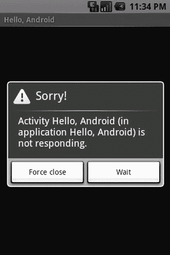

图 3-1 。Android“无响应”弹出窗口

为了便于比较，我们将讨论一下性能调优在 Web 上是如何工作的。优化安卓应用还是有点黑的艺术；虽然对于如何优化你的网络服务器有一个普遍的共识，但是在 Android 平台上却没有这么干净整洁。毕竟，市场上各种各样的 Android 设备使得优化你的应用成为一个移动的目标。

我们还会花一些时间在 Android 性能方面的技巧，这些技巧真的会对你的代码产生影响。最后，我们将看看 Android SDK 附带的一些工具，如 dal vik Debug Monitor Server(DDMS)和 Traceview，它们可以帮助识别瓶颈，并有望为创建更好的应用指明道路。

历史

早在 2000 年，性能优化都是关于如何优化通常位于 IIS 或 Apache web 服务器上的 web 应用，许多相同的点适用于我们在本章中尝试做的事情。不幸的是，测量 Android 的性能不像在 web 服务器上那么容易。

Web 服务器通常的目标是 95%的页面应该在一秒或更短的时间内返回。原始统计数据，例如页面点击次数和页面计时(使用时间标记，如图 3-2 所示),都可以在日志文件中看到。诀窍是优化速度最慢、访问量最大的页面，这给人一种速度更快的 web 服务器的感觉；说到表现，感知就是现实。在移动设备上也是如此。

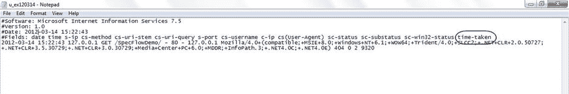

图 3-2 。带有耗时令牌的 Web 服务器日志文件

通过在数据库上添加索引、修复 SELECT 语句以限制返回的数据量，或者修复编程控制流逻辑的问题，通常可以在性能最差的页面上大幅提高页面速度。使用这种“清洗、冲洗、重复”的方法，在一段时间内反复修复访问量最大、性能最差的页面可以改变 web 服务器的速度。

另一方面，Android 就没那么简单了。在 Android 中，没有类似“95%的页面应该在一秒或更短的时间内返回”这样的标准。对于一个应用需要有多快响应速度，人们还没有达成共识。并且度量也可能因设备而异。衡量每项活动需要多长时间也要困难得多，因为没有带有方便的耗时令牌的日志文件可供您轻松使用。

然而，这也不全是坏消息，因为 Android SDK 确实附带了许多工具，如 DDMS 和 Traceview，这些工具确实有助于调试性能问题，但它们可以衡量 Android 应用性能的不同方面。

理想情况下，您需要一个好的负载测试工具，带有某种可靠的时间度量。如果可能的话，它应该作为构建的一部分在持续集成服务器上运行，这样您就可以看到回归测试报告；通过查看应用运行过程中同样的动作花费了多长时间，你将能够确定某件事情是否突然比过去花费了更多时间。

当我们试图优化 Web 服务时，我们将需要查看 Web 服务器的统计数据，我们将在本书的后面回到这个问题。

性能提示

让我们来看看一些 Android、Java、Web 服务和 SQL 技巧，如果您的应用没有正确响应，您可能想尝试一下。

Android 性能

谷歌发布了一份优秀的性能提示列表(见`http://developer.android.com/training/articles/perf-tips.html`)，以下内容大部分摘自该列表并对其进行了扩展。其中一些优化采用非常宏观的方法，和一些非常微观的方法进行优化，将只从 APK 中生成的`classes.dex`中删除一两行字节码。这些微优化可能会由未来的即时 DVM 优化来处理，或者提前由新的 ART 或 Android 运行时虚拟机来处理，这是 DVM 的替代品。然而，在撰写本文时，ART 仅在 Android KitKat 上可用，这些自动化优化变得司空见惯可能还需要一段时间。

*   避免创建不必要的对象或内存分配。编写高效代码有两个基本规则:

*   不要做你不需要做的工作。
*   能避免就不要分配内存。

*   移动开发目前相对简单；我们没有随着技术的成熟而出现的一层又一层的复杂性，比如 EJB。
*   但在 Android 上这是迟早要发生的事情，这是必然的。人们已经在他们的 Android 应用中加入 ORM，所以试着转移到更多的 TDD(测试驱动开发)模型，想想你正在引入什么。您真的需要重新发明某种缓存机制来满足您正在实现的特性吗？如果你仍然担心，那么应用 YAGNI 概念——你不需要它，因为你真的不需要它。
*   **避免内部 getter/setter。**虚方法调用比实例字段查找更昂贵。遵循常见的面向对象编程实践并在公共接口中使用 getters 和 setters 是合理的，但是在一个类中，您应该总是直接访问字段。这是一个微优化的例子，它从 APK 中生成的`classes.dex`中删除了一两行字节码。
*   **在适当的地方使用静态/最终。**由于代码被编译成 Davlik 字节码的方式，任何引用 intVal 的代码如果使用 static final 都将直接使用整数值 42，对 strVal 的访问将使用相对廉价的“字符串常量”指令，而不是字段查找。
*   明智地使用浮动。浮点计算非常昂贵，在 Android 设备上通常需要两倍于整数计算的时间。
*   NDK 称，要少花钱，多办事。使用 JNI 或 NDK 在 Java 和 C++ 之间进行上下文切换可能会很昂贵。也没有 JIT 优化。
*   但是，如果应用使用一些核心算法或功能，不需要以任何重要的方式绑定到用户界面，它可能应该在本机运行。即使使用 JIT 编译器，本机运行几乎总是比 Java 快。NDK 还带来了一些重要的安全优势，因为对 C++ 代码进行逆向工程要困难得多。
*   **仅在需要时放大视图。**基本上，这里的想法是，你只需要将视图放大最少的次数，或者更好的是延迟显示视图，因为放大视图是非常昂贵的。
*   **使用标准库和增强功能。**使用库，而不是滚动自己的代码。Android 有时也会用优化的手工编码汇编程序代替库方法。例如，使用`String.indexOf()` 和`System.arraycopy()`方法比手工编码的循环快 9 倍。
*   **Use StrictMode.** To limit the chance of an Android Not Responsive (ANR) error, it helps to not include any slow network or disk access in the applications main thread. Android provides a utility called `StrictMode`, which is typically used to detect if there are any unwanted disk or network accesses introduced into your application during the development process. Add `StrictMode` to your `onCreate()` method as shown in Listing 3-1. `StrictMode` calls are also pretty expensive, so make sure the code isn’t shipped as production code.

    清单 3-1 。使用 Strictmode 实用程序

    ```java
    public void onCreate()
    {
            // remove from production code
            if (BuildConfig.DEBUG){
                    StrictMode.setThreadPolicy(new StrictMode.ThreadPolicy.Builder(),
                    .detectDiskReads()
                    .detectDiskWrites()
                    .detectNetwork()
                    .penaltyLog()
                    .build());
         {
            super.onCreate();

    }
    ```

*   **优化 onSomething()类。**之前我们谈到了感知是 web 应用的现实；在 Android 世界中，如果你的`onStart()`、`onCreate()`和`onResume()`类快如闪电，那么这个应用会被认为是一个更快的 Android 应用。因此，如果你有任何代码可以放在其他地方，或者你可能想要应用优化，那么花时间在这些类上会带来回报。尽可能长时间等待，以扩大任何观点。使用`android.view.ViewStub`将允许在需要时创建对象，这种技术被称为延迟膨胀视图。
*   **使用 Relativelayouts 而不是 Linearlayouts。新的 Android 开发者倾向于创建一个过度使用的 UI。随着应用变得越来越复杂，这些线性布局经常会变得非常嵌套。用一个`RelativeLayout`代替这些`LinearLayouts`将会提高你的 UI 加载速度。Lint 和 Hierarchy Viewer 将帮助您识别深度嵌套的`LinearLayouts`。**

Java 性能

有写 Java 性能的书和书籍，Android 也可以从一些写得很好的 Java 代码中受益。Java 性能调优页面(`http://www.javaperformancetuning.com/tips/rawtips.shtml`)是一个链接页面，其中链接了关于 Java 优化的文章，以及这些页面中每一页优化技巧的总结和回顾。

最常见的优化如下:

1.  使用+连接两个字符串；使用`Stringbuffer`连接更多的字符串。

*   除非需要同步，否则不要同步代码。
*   完成后，关闭所有资源，如连接和会话对象。
*   不会被重定义的类和方法应该被声明为 final。
*   访问数组比访问向量、字符串和字符串缓冲区快得多。

SQLite 性能

网站效率低下通常可以总结为“是数据库的问题，笨蛋。”虽然在 Android 上这不是一个问题，因为 SQLite 更多地用于客户端信息缓存，但是没有理由解释计划在性能调优中仍然非常有用。不要忘记，如果你需要，你也可以在 SQLite 上创建索引(见图 3-3 )。

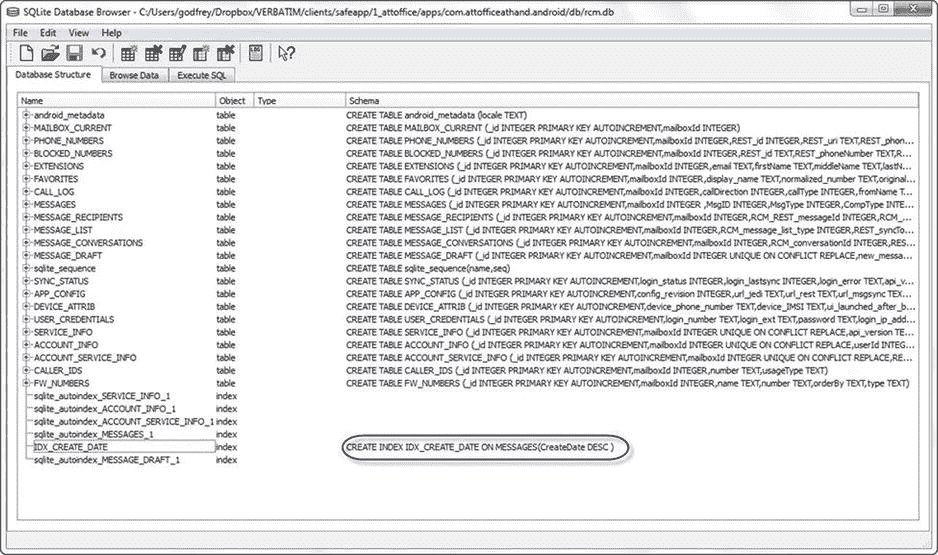

图 3-3 。SQLite 索引

学习 SQLite Android 库，使用`DatabaseUtils.InsertHelper`命令插入大量数据，或者在适当的时候使用`compileStatement`。不要将数据库存储在 SD 卡上。最后，不要在 SELECT 语句中返回整个数据表；始终使用精心设计的 SQL 语句返回最少的行数。

网络服务性能

对于网络服务来说，这是一个“一切旧的都是新的”的例子我们又回到了我之前提到的网站优化技术。使用服务器日志，如前面的图 3-2 所示，查看每个调用花费的时间，并优化最慢的、最常用的 Web 服务。一些常见的 Web 服务优化如下:

*   最小化 Web 服务信封的大小；尽可能选择 REST 而不是 SOAP，JSON 而不是 XML。
*   减少往返次数，避开喋喋不休的 Web 服务调用，并将 Web 服务事务的数量保持在最低水平。
*   删除任何重复的呼叫，它们并不像看起来那样不常见。
*   与数据库 SELECT * FROM TABLE 语句类似，仔细选择查询参数可以极大地限制通过 Web 服务返回的数据量。
*   避免跨调用维护状态；最具伸缩性的 Web 服务不维护任何状态。
*   压缩数据。

像 Charles Proxy ( `http://www.charlesproxy.com/`)这样的 Web 代理工具是一种很好的方式来查看你的应用是如何与 Web 服务交互的。

Web 服务的主题在第八章中有更详细的介绍。

优化代码

在接下来的几页中，您将看到这些优化是如何在 ToDo List 应用中使用的。首先，清单 3-2 展示了 Splash.java，它有一个基本的 onCreate()方法。

清单 3-2 。待办事项应用的 Splash.java 页面

```java
package com.logicdrop.todos;

import android.app.Activity;
import android.os.Bundle;
import android.content.Intent;

public class Splash extends Activity {
    public void onCreate(Bundle savedInstanceState) {
        // TIP: Optimized the onSomething() classes, especially onCreate()
        super.onCreate(savedInstanceState);

        // TIP: View - inflate the views a minimum number of times
        // inflating views are expensive
        /*for (int i=0; i<10000; i++)
            setContentView(R.layout.splash);*/

        // TIP: Splashscreen optional  (DONE)
        setContentView(R.layout.splash);
        Thread timer = new Thread() {
            public void run() {
                try {
                    sleep(1000);
                } catch (InterruptedException e) {
                    e.printStackTrace();
                } finally {
                    Intent openStartingPoint = new Intent("com.logicdrop.todos.TodoActivity");
                    startActivity(openStartingPoint);
                }
            }
        };
        timer.start();
    }
}

```

清单 3-3 中显示的`ToDoActivity.java`、，有很多本章提到的 Android 和 Java 优化；有关更多信息，请参见代码中的注释。它还展示了如何使用 Traceview API 停止和启动分析。

清单 3-3 。待办事项列表应用的 ToDoActivity.java 页面

```java
package com.logicdrop.todos;

import java.util.List;
import java.util.ArrayList;

import android.app.Activity;
import android.os.Bundle;
import android.util.Log;
import android.view.View;
import android.view.View.OnClickListener;
import android.widget.AdapterView;
import android.widget.AdapterView.OnItemClickListener;
import android.widget.ArrayAdapter;
import android.widget.Button;
import android.widget.EditText;
import android.widget.ListView;
import android.widget.TextView;
import android.os.StrictMode;

import com.logicdrop.todos.R;

public class TodoActivity extends Activity
{
     public static final String APP_TAG = "com.logicdrop.todos";

     private ListView taskView;
     private Button btNewTask;
     private EditText etNewTask;
     private TodoProvider provider;

     // TIP: Use static/final where appropriate
     private final OnClickListener handleNewTaskEvent = new OnClickListener()
     {
          @Override
          public void onClick(final View view)
          {
               Log.d(APP_TAG, "add task click received");

               TodoActivity.this.provider.addTask(TodoActivity.this
                         .etNewTask
                                   .getText()
                                   .toString());

               TodoActivity.this.renderTodos();
          }
     };

    // TIP: Traceview
     @Override
     protected void onStop()
     {
          super.onStop();

          // Debug.stopMethodTracing();
     }

     @Override
     protected void onStart()
     {
        // Debug.startMethodTracing("ToDo");

          super.onStart();
     }

     // TIP: Use floats judiciously
     @SuppressWarnings("unused")
     private void showFloatVsIntegerDifference()
     {
          int max = 1000;
          float f = 0;
          int i = 0;
          long startTime, elapsedTime;

          // Compute time for floats
          startTime = System.nanoTime();
          for (float x = 0; x < max; x++)
          {
               f += x;
          }
          elapsedTime = System.nanoTime() - startTime;
          Log.v(APP_TAG, "Floating Point Loop: " + elapsedTime);

          // Compute time for ints
          startTime = System.nanoTime();
          for (int x = 0; x < max; x++)
          {
               i += x;
          }
          elapsedTime = System.nanoTime() - startTime;
          Log.v(APP_TAG, "Integer Point Loop: " + elapsedTime);
     }

     // TIP: Avoid creating unnecessary objects or memory allocation
     private void createPlaceholders()
     {
        // TIP: Avoid internal getters/setters
          provider.deleteAll();

          if (provider.findAll().isEmpty())
          {
            // TIP: Arrays are faster than vectors
               List<String> beans = new ArrayList<String>();

               // TIP: Use enhanced for loop (DONE)
               // This is example of the enhanced loop but don't allocate objects if not necessary
                  /*for (String task : beans) {
                     String title = "Placeholder ";
                    this.provider.addTask(title);
                    beans.add(title);
                  }*/

               /*for (int i = 0; i < 10; i++)
               {
                    String title = "Placeholder " + i;
                    this.getProvider().addTask(title);
                    beans.add(title);
               }*/
          }
     }

         // TIP: Avoid private getters/setters - consider using package (DONE)
     /*EditText getEditText()
     {
          return this.etNewTask;
     }*/

     /*private TodoProvider getProvider()
     {
          return this.provider;
     }*/

     /*private ListView getTaskView()
     {
          return this.taskView;
     }*/

     @Override
     public void onCreate(final Bundle bundle)
     {
        // TIP: Use Strictmode to detect unwanted disk or network access
        // Remove from production code (DONE)
        //StrictMode.setThreadPolicy(new StrictMode.ThreadPolicy.Builder()
        //        .detectDiskReads()
        //        .detectDiskWrites()
        //        .detectNetwork()
        //        .penaltyLog()
        //        .build());
          super.onCreate(bundle);

             // TIP: Do not overuse Linearlayouts, as they become more complex (DONE)
             // Replace them with Relativelayouts, increasing UI loading speed
          this.setContentView(R.layout.main);

          this.provider = new TodoProvider(this);
          this.taskView = (ListView) this.findViewById(R.id.tasklist);
          this.btNewTask = (Button) this.findViewById(R.id.btNewTask);
          this.etNewTask = (EditText) this.findViewById(R.id.etNewTask);
          this.btNewTask.setOnClickListener(this.handleNewTaskEvent);

          this.renderTodos();

          // TIP: Again, don't allocate unnecessary objects that expand the heap size to significant proportions (DONE)
          // Once GC occurs, a large amount of the heap memory is dumped, especially with
          // local data structures, which renders a large portion of the heap unused.
          // SEE: optimizedHeap.png, deoptimizedHeap.png, heap-before.tiff, heap-after.tiff
          /*ArrayList<uselessClass> uselessObject = new ArrayList<uselessClass>();
          for (int i=0; i<180000; i++)
              uselessObject.add(new uselessClass());*/
     }

     private void renderTodos()
     {
          final List<String> beans = this.provider.findAll();

          Log.d(TodoActivity.APP_TAG, String.format("%d beans found", beans.size()));

          this.taskView.setAdapter(new ArrayAdapter<String>(this,
                    android.R.layout.simple_list_item_1,
                    beans.toArray(new String[]
                    {})));

          this.taskView.setOnItemClickListener(new OnItemClickListener()
          {
               @Override
               public void onItemClick(final AdapterView<?> parent, final View view, final int position, final long id)
               {
                    Log.d(TodoActivity.APP_TAG, String.format("item with id: %d and position: %d", id, position));

                    final TextView v = (TextView) view;
                    TodoActivity.this.provider.deleteTask(v.getText().toString());
                    TodoActivity.this.renderTodos();
               }
          });
     }

    // Class with 26 double data members used to expand heap size in example
    /*private class uselessClass {
        double a,b,c,d,e,f,g,h,i,j,k,l,m,n,o,p,q,r,s,t,u,v,w,x,y,z;
    }*/
}

```

最后，清单 3-4 中显示的`ToDoProvider.java`、有一些剩余优化的例子，比如总是关闭资源和只使用 SELECT 语句返回最少的数据。

清单 3-4 。待办事项列表应用的 ToDoProvider.java 页面

```java
package com.logicdrop.todos;

import java.util.ArrayList;
import java.util.List;

import android.content.ContentValues;
import android.content.Context;
import android.database.Cursor;
import android.database.sqlite.SQLiteDatabase;
import android.database.sqlite.SQLiteOpenHelper;
import android.util.Log;

final class TodoProvider
{
     private static final String DB_NAME = "tasks";
     private static final String TABLE_NAME = "tasks";
     private static final int DB_VERSION = 1;
     private static final String DB_CREATE_QUERY = "CREATE TABLE " + TodoProvider.TABLE_NAME + " (id integer primary key autoincrement, title text not null);";

     // TIP: Use final wherever possible (DONE)
     private final SQLiteDatabase storage;
     private final SQLiteOpenHelper helper;

     public TodoProvider(final Context ctx)
     {
          this.helper = new SQLiteOpenHelper(ctx, TodoProvider.DB_NAME, null, TodoProvider.DB_VERSION)
          {
               @Override
               public void onCreate(final SQLiteDatabase db)
               {
                    db.execSQL(TodoProvider.DB_CREATE_QUERY);
               }

               @Override
               public void onUpgrade(final SQLiteDatabase db, final int oldVersion,
                         final int newVersion)
               {
                    db.execSQL("DROP TABLE IF EXISTS " + TodoProvider.TABLE_NAME);
                    this.onCreate(db);
               }
          };

          this.storage = this.helper.getWritableDatabase();
     }

     // TIP: Avoid synchronization (DONE)
     public void addTask(final String title)
     {
          final ContentValues data = new ContentValues();
          data.put("title", title);

          this.storage.insert(TodoProvider.TABLE_NAME, null, data);
     }

     public void deleteAll()
     {
          this.storage.delete(TodoProvider.TABLE_NAME, null, null);
     }

     public void deleteTask(final long id)
     {
          this.storage.delete(TodoProvider.TABLE_NAME, "id=" + id, null);
     }

     public void deleteTask(final String title)
     {
          this.storage.delete(TodoProvider.TABLE_NAME, "title='" + title + "'", null);
     }

     // TIP: Don't return the entire table of data. (DONE)
     // Unused
     public List<String> findAll()
     {
          Log.d(TodoActivity.APP_TAG, "findAll triggered");

          final List<String> tasks = new ArrayList<String>();

          final Cursor c = this.storage.query(TodoProvider.TABLE_NAME, new String[]
          { "title" }, null, null, null, null, null);

          if (c != null)
          {
               c.moveToFirst();

               while (c.isAfterLast() == false)
               {
                    tasks.add(c.getString(0));
                    c.moveToNext();
               }

               // TIP: Close resources (DONE)
               c.close();
          }

          return tasks;
     }
}
```

工具

在这一节中，我们将研究两种有助于发现性能瓶颈的工具 Android SDK 附带的工具和 Unix 命令行工具。

Android SDK 附带了以下工具来帮助我们识别任何性能问题:

*   启动
*   特蕾西
*   线头
*   层次结构查看器
*   电视观众

Dalvik Debug Monitor Server (DDMS)是一个 Android SDK 应用，可以作为独立工具或 Eclipse 插件使用。DDMS 做了很多事情，包括设备屏幕捕获和提供一个查找日志输出的地方。但是它也提供堆分析、方法分配和线程监控信息。Android SDK 也有 Traceview 工具用于方法分析，`layoutopt`用于优化 XML 布局，以及 Hierarchy Viewer 用于优化 UI。

由于 Android 基本上是一个 Linux 外壳，我们可以利用以下许多命令行 Unix 工具进行性能测试:

*   `Top`
*   `Dumpsys`
*   `Vmstat`
*   `Procstats`

在这一节中，我们将看看如何使用这些工具来快速了解您的应用在哪里花费了大部分时间。

DDMS

在这一节中，我们将讨论系统性能、堆使用、线程和 Traceview 工具，所有这些都是 DDMS 的一部分。我们还将查看内存分析器工具(MAT) ，它可以作为 Eclipse 工具的一部分下载，并用于报告如何在堆中管理内存。

系统性能

DDMS 套件中最基本的工具是系统性能，它给出了当前 CPU 负载、内存使用和帧渲染时间的快速概览，如图图 3-4 所示。当你的应用消耗了太多的 CPU 或内存时，你的应用表现不佳的第一个迹象。

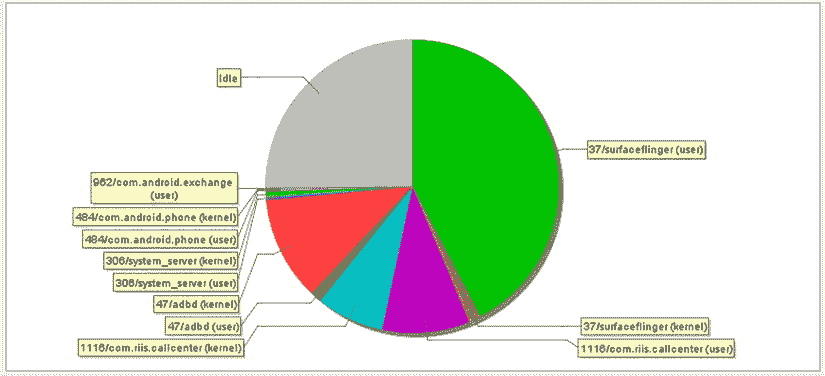

图 3-4 。系统性能工具显示 CallCenterApp 的 CPU 负载

堆使用

DDMS 也提供了一个堆使用工具。采取以下步骤来查看内存堆，从中可以看到正在创建哪些对象，以及它们是否被垃圾收集正确地销毁了。(参见图 3-5 。)

1.  在“设备”选项卡中，选择要查看堆的进程。
2.  单击“更新堆”按钮，为进程启用堆信息。
3.  单击 Heap 选项卡中的 Cause GC 调用垃圾收集，这将启用堆数据收集。
4.  当垃圾收集完成时，您将看到一组对象类型和为每种类型分配的内存。
5.  单击列表中的对象类型，查看以字节为单位显示为特定内存大小分配的对象数量的条形图。
6.  再次单击“导致 GC”以刷新数据。给出了堆的详细信息以及特定分配类型的分配大小图表。观察堆大小的总体趋势，确保它不会在应用运行期间持续增长。

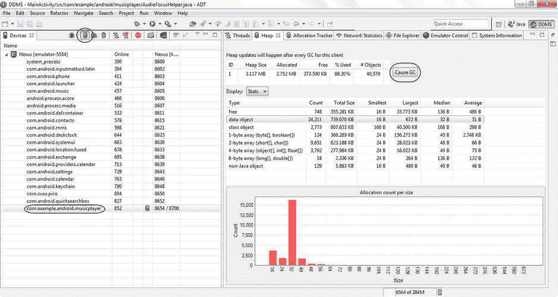

图 3-5 。查看 DDMS 堆

Eclipse 内存分析器

Eclipse 有一个集成的内存分析器工具(MAT) 插件，您可以从`http://www.eclipse.org/mat/downloads.php`下载并安装它。MAT 可以帮助您理解堆输出。现在，当你转储堆配置文件或 hprof 文件时(见图 3-6 ，它将被自动分析，这样你就可以对堆文件有所了解。

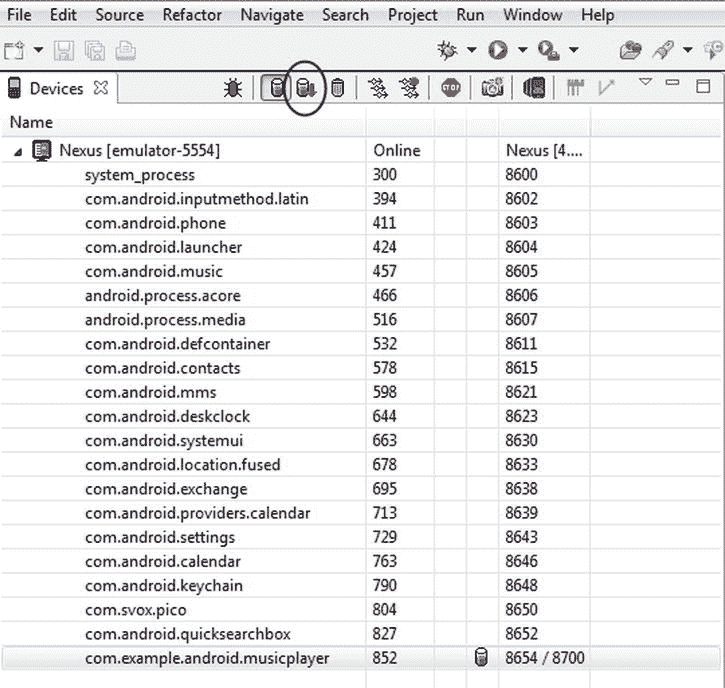

图 3-6 。转储 hprof 文件

MAT 提供了许多报告，包括最大类的支配者树、顶级消费者报告和泄漏嫌疑报告。图 3-7 显示了保留尺寸最大的物体。

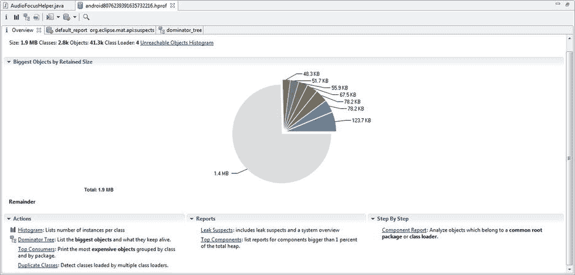

图 3-7 。内存分析器工具概述

存储器分配

关于分配的下一层细节显示在分配跟踪器视图(图 3-8 )中。要显示它，请单击开始跟踪，在应用中执行操作，然后单击获取分配。列表按分配顺序显示，最新的内存分配显示在最前面。突出显示它会给出一个堆栈跟踪，显示该分配是如何创建的。

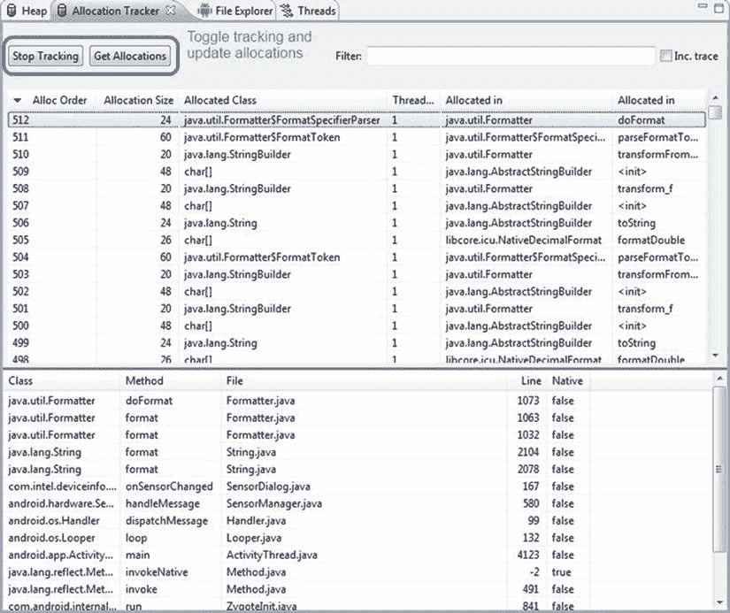

图 3-8 。分配跟踪器

线

DDMS 中的线程监视器和分析视图对于管理大量线程的应用非常有用。要启用它，点击更新线程图标，如图 3-9 所示。

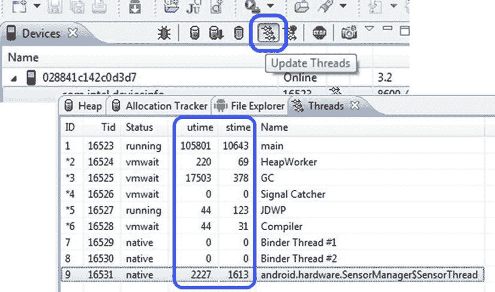

图 3-9 。DDMS 螺纹

一个线程运行用户代码(utime)和系统代码(stime)所花费的总时间以 jiffies 来衡量。瞬间原本是光传播 1 厘米所需的时间，但对于 Android 设备来说，它是系统定时器中断一次的持续时间。它因设备而异，但通常被接受为大约 10ms。星号表示守护线程，状态 Native 表示线程正在执行本机代码。

查看图 3-9 中的样本数据，很明显 GC 花费了不寻常的时间。仔细观察应用如何处理对象创建可能是提高性能的一个好主意。

方法剖析

方法概要分析是 DDMS 选择的工具,用于快速了解应用中真正花费时间的地方，并且是找出花费太多时间的方法的第一步。当您的应用正在运行并理想地执行一些有趣的任务(您希望获得更多的性能数据)时，采取以下步骤来使用方法分析:

1.  单击开始方法分析。
2.  几秒钟后，再次单击该图标停止收集。
3.  IDE 将自动启动 Traceview 窗口，并允许您直接在 IDE 中分析结果。
4.  Click a method call in the bottom pane to create a hierarchy, showing you the current method, the parent(s) that call this method, and then the children methods called from within the selected method (Figure 3-10).

    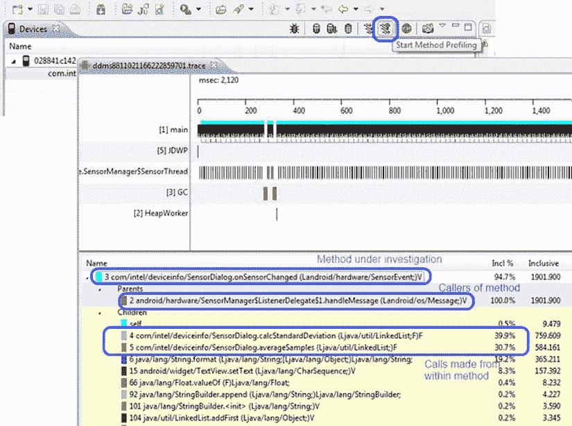

    图 3-10 。使用 Traceview 在 DDMS 进行方法分析

5.  确定花费时间最多的方法，这样您就可以通过创建 Traceview 文件来更仔细地查看它们，我们将在本节的稍后部分探讨这些文件。

每个方法都有其父方法和子方法，列如下:

*   **Inc %** 方法加上任何被调用的方法所花费的总时间的百分比
*   **包含**在方法中花费的时间加上在任何被调用的方法中花费的时间
*   **Excl %** 该方法花费的时间占总时间的百分比
*   **独占**该方法花费的时间
*   **调用+递归**调用该方法的次数加上任何递归调用
*   **每次通话时间**每次通话的平均时间

特蕾西

一旦您确定了要仔细研究的方法，您就可以使用 Traceview 的命令行版本和跟踪 API 进行更精确的测量。在您想要分析的代码周围添加 Debug.startMethodTracing 和 Debug.stopMethodTracing，如清单 3-5 所示。再次编译您的代码，并将 APK 推送到您的设备。

清单 3-5 。startMethodTracing 和 stopMethodTracing

```java
public class ScoresActivity extends ListActivity {
        public void onStart() {
                // start tracing to "/sdcard/scores.trace"
                Debug.startMethodTracing("scores");
                super.onStart();
                // other start up code here
        }

        public void onStop() {
                super.onStop();
                // other shutdown code here
                Debug.stopMethodTracing();
        }

        // Other implementation code
}

```

现在可以使用以下命令将跟踪文件从设备中取出并显示在 Traceview 中:

```java

adb pull /sdcard/scores.trace scores.before.trace

```

图 3-11 显示了代码优化前的结果。

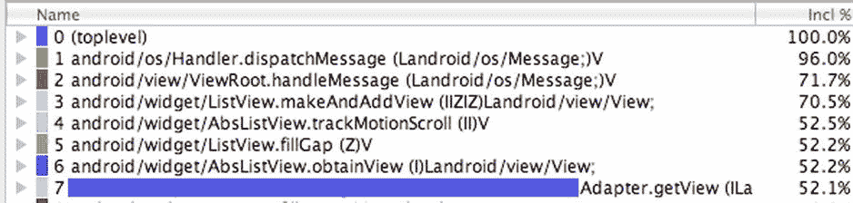

图 3-11 。优化前的跟踪文件

使用本章前面的一些建议优化代码，并再次测量，这一次使用以下命令:

```java

adb pull /sdcard/scores.trace scores.after.trace

```

图 3-12 显示了优化后的结果；区别很明显。

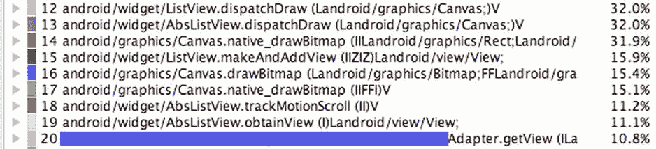

图 3-12 。优化后的跟踪文件

功能区

Lint 和它最初的 Unix 同名，是一个静态代码分析工具。它取代了 layoutopt 工具，该工具用于分析布局文件并指出潜在的性能问题，以通过重组 UI 布局来快速获得性能提升。它现在做得更多，包括以下错误检查类别:

*   正确性
*   正确性:消息
*   安全性
*   性能
*   可用性:排版
*   可用性:图标
*   可用性
*   易接近
*   国际化

如果您运行命令`lint --list Performance` ，它会告诉您 Lint 会进行以下性能检查，其中许多我们已经在 Android 提示部分看到过:

*   `FloatMath`:建议将`android.util.FloatMath`通话换成`java.lang.Math`。
*   建议在一个类中用直接字段访问代替 getters 的使用。
*   `InefficientWeight:`在`LinearLayouts`中寻找无效的重量声明。
*   `NestedWeights`:寻找嵌套布局权重，代价很高。
*   `DisableBaselineAlignment`:寻找`LinearLayouts`，?? 应该设置`android:baselineAligned=false`。
*   `ObsoleteLayoutParam`:查找对给定父布局无效的布局参数。
*   `MergeRootFrame`:检查一个根 *<框架布局>* 是否可以被一个`<merge>`标签替换。
*   `UseCompoundDrawables`:检查当前节点是否可以被使用复合 drawables 的`TextView`替换。
*   `UselessParent`:检查是否可以删除父布局。
*   `UselessLeaf`:检查是否可以删除叶布局。
*   `TooManyViews`:检查布局是否有太多视图。
*   `TooDeepLayout`:检查布局层次是否太深。
*   `ViewTag`:使用`View.setTag`时发现潜在泄漏。
*   `HandlerLeak`:确保处理程序类不会保留对外部类的引用。
*   `UnusedResources`:寻找未使用的资源。
*   `UnusedIds`:寻找未使用的 id。
*   `SecureRandom`:查找`SecureRandom`类的可疑用法。
*   `Overdraw`:查找过度绘制问题(绘制视图只是为了完全覆盖)。
*   `UnusedNamespace`:查找 XML 文档中未使用的名称空间。
*   `DrawAllocation`:查找绘图代码内的内存分配。
*   `UseValueOf`:查找包装类的“new”实例，它应该使用`valueOf`来代替。
*   `UseSparseArrays`:寻找机会用更高效的`SparseArray`取代`HashMaps`。
*   `Wakelock`:查找`wakelock`用法的问题。
*   `Recycle`:寻找资源上丢失的`recycle()`调用。

Lint 可以从 Eclipse 内部运行，也可以在命令行上运行。如果您只想对您的项目运行性能检查，请在命令行中键入`lint --check Performance``<`*project name*`>`。清单 3-6 显示了样例应用的这个命令的输出，显示了一些需要更好组织的布局。

清单 3-6 。CallCenterApp 项目的 Lint 性能输出

```java
Scanning CallCenterV3: ...................................................
Scanning CallCenterV3 (Phase 2): ......................
res\layout\custom_titlebar.xml:6: Warning: Possible overdraw: Root element paints background #004A82 with a theme that also paints a background (inferred theme is @style/CustomTheme) [Overdraw]
    android:background="#004A82"
    ∼∼∼∼∼∼∼∼∼∼∼∼∼∼∼∼∼∼∼∼∼∼∼∼∼∼∼∼
res\layout\custom_titlebar_with_logout.xml:6: Warning: Possible overdraw: Root element paints background #004A82 with a theme that also paints a background (inferred theme is @style/CustomTheme) [Overdraw]
    android:background="#004A82"
    ∼∼∼∼∼∼∼∼∼∼∼∼∼∼∼∼∼∼∼∼∼∼∼∼∼∼∼∼
res\layout\custom_titlebar_with_settings.xml:6: Warning: Possible overdraw: Root element paints background #004A82 with a theme that also paints a background (inferred theme is @style/CustomTheme) [Overdraw]
    android:background="#004A82"
    ∼∼∼∼∼∼∼∼∼∼∼∼∼∼∼∼∼∼∼∼∼∼∼∼∼∼∼∼
res\layout\login_screen.xml:5: Warning: Possible overdraw: Root element paints background @drawable/bg_app with a theme that also paints a background (inferred theme is @style/CustomTheme) [Overdraw]
    android:background="@drawable/bg_app"
    ∼∼∼∼∼∼∼∼∼∼∼∼∼∼∼∼∼∼∼∼∼∼∼∼∼∼∼∼∼∼∼∼∼∼∼∼∼
res\layout\queues_screen.xml:5: Warning: Possible overdraw: Root element paints background @drawable/bg_app with a theme that also paints a background (inferred theme is @style/CustomTheme) [Overdraw]
    android:background="@drawable/bg_app"
    ∼∼∼∼∼∼∼∼∼∼∼∼∼∼∼∼∼∼∼∼∼∼∼∼∼∼∼∼∼∼∼∼∼∼∼∼∼
res\layout\settings_screen.xml:5: Warning: Possible overdraw: Root element paints background #1D1D1D with a theme that also paints a background (inferred theme is @style/CustomTheme) [Overdraw]
    android:background="#1D1D1D"
    ∼∼∼∼∼∼∼∼∼∼∼∼∼∼∼∼∼∼∼∼∼∼∼∼∼∼∼∼
res\drawable-hdpi\bg_login.9.png: Warning: The resource R.drawable.bg_login appears to be unused [UnusedResources]
res\drawable-hdpi\btn_ok_xlarge.png: Warning: The resource R.drawable.btn_ok_xlarge appears to be unused [UnusedResources]
res\drawable-hdpi\no_xlarge.png: Warning: The resource R.drawable.no_xlarge appears to be unused [UnusedResources]
res\menu\settings_menu.xml: Warning: The resource R.menu.settings_menu appears to be unused [UnusedResources]
res\values\strings.xml:7: Warning: The resource R.string.loginMessage appears to be unused [UnusedResources]
    <string name="loginMessage">Enter Your Login Credentials</string>
            ∼∼∼∼∼∼∼∼∼∼∼∼∼∼∼∼∼∼∼
res\values\strings.xml:8: Warning: The resource R.string.CSQ_default appears to be unused [UnusedResources]
    <string name="CSQ_default">Log In</string>
            ∼∼∼∼∼∼∼∼∼∼∼∼∼∼∼∼∼∼
res\values\strings.xml:11: Warning: The resource R.string.default_time appears to be unused [UnusedResources]
    <string name="default_time">00:00:00</string>
            ∼∼∼∼∼∼∼∼∼∼∼∼∼∼∼∼∼∼∼
res\values\strings.xml:12: Warning: The resource R.string.oldest_in_queue appears to be unused [UnusedResources]
    <string name="oldest_in_queue">Oldest Call In Queue: </string>
            ∼∼∼∼∼∼∼∼∼∼∼∼∼∼∼∼∼∼∼∼∼∼
res\values\strings.xml:16: Warning: The resource R.string.add_to_queue appears to be unused [UnusedResources]
    <string name="add_to_queue">Add To Queue</string>
            ∼∼∼∼∼∼∼∼∼∼∼∼∼∼∼∼∼∼∼
res\layout\login_screen.xml:9: Warning: This LinearLayout view is useless (no children, no background, no id, no style) [UselessLeaf]
    <LinearLayout
    ^
res\layout\custom_titlebar.xml:10: Warning: This RelativeLayout layout or its LinearLayout parent is useless; transfer the background attribute to the other view [UselessParent]
    <RelativeLayout
    ^
res\layout\custom_titlebar_with_logout.xml:10: Warning: This RelativeLayout layout or its LinearLayout parent is useless; transfer the background attribute to the other view [UselessParent]
    <RelativeLayout
    ^
res\layout\custom_titlebar_with_settings.xml:10: Warning: This RelativeLayout layout or its LinearLayout parent is useless; transfer the background attribute to the other view [UselessParent]
    <RelativeLayout
    ^
res\layout\queue_list_item.xml:13: Warning: This TableRow layout or its TableLayout parent is possibly useless [UselessParent]
        <TableRow
        ^
res\layout\queue_list_item.xml:45: Warning: This TableRow layout or its TableLayout parent is possibly useless [UselessParent]
        <TableRow
        ^
res\layout\custom_titlebar.xml:3: Warning: The resource R.id.photo_titlebar appears to be unused [UnusedIds]
    android:id="@+id/photo_titlebar"
    ∼∼∼∼∼∼∼∼∼∼∼∼∼∼∼∼∼∼∼∼∼∼∼∼∼∼∼∼∼∼∼∼
res\layout\queue_list_item.xml:7: Warning: The resource R.id.nameTable appears to be unused [UnusedIds]
        android:id="@+id/nameTable"
        ∼∼∼∼∼∼∼∼∼∼∼∼∼∼∼∼∼∼∼∼∼∼∼∼∼∼∼
res\layout\queue_list_item.xml:14: Warning: The resource R.id.tableRow1 appears to be unused [UnusedIds]
            android:id="@+id/tableRow1"
            ∼∼∼∼∼∼∼∼∼∼∼∼∼∼∼∼∼∼∼∼∼∼∼∼∼∼∼
res\layout\queue_list_item.xml:19: Warning: The resource R.id.activeIndicatorDummy appears to be unused [UnusedIds]
                android:id="@+id/activeIndicatorDummy"
                ∼∼∼∼∼∼∼∼∼∼∼∼∼∼∼∼∼∼∼∼∼∼∼∼∼∼∼∼∼∼∼∼∼∼∼∼∼∼
res\layout\queue_list_item.xml:46: Warning: The resource R.id.tableRow2 appears to be unused [UnusedIds]
            android:id="@+id/tableRow2"
            ∼∼∼∼∼∼∼∼∼∼∼∼∼∼∼∼∼∼∼∼∼∼∼∼∼∼∼
res\layout\queue_list_item.xml:62: Warning: The resource R.id.callsInQueueLabel appears to be unused [UnusedIds]
                android:id="@+id/callsInQueueLabel"
                ∼∼∼∼∼∼∼∼∼∼∼∼∼∼∼∼∼∼∼∼∼∼∼∼∼∼∼∼∼∼∼∼∼∼∼
0 errors, 27 warnings

res\layout\queue_list_item.xml:7: Warning: The resource R.id.nameTable appears to be unused [UnusedIds]
        android:id="@+id/nameTable"
        ∼∼∼∼∼∼∼∼∼∼∼∼∼∼∼∼∼∼∼∼∼∼∼∼∼∼∼
res\layout\queue_list_item.xml:14: Warning: The resource R.id.tableRow1 appears to be unused [UnusedIds]
            android:id="@+id/tableRow1"
            ∼∼∼∼∼∼∼∼∼∼∼∼∼∼∼∼∼∼∼∼∼∼∼∼∼∼∼
res\layout\queue_list_item.xml:19: Warning: The resource R.id.activeIndicatorDummy appears to be unused [UnusedIds]
                android:id="@+id/activeIndicatorDummy"
                ∼∼∼∼∼∼∼∼∼∼∼∼∼∼∼∼∼∼∼∼∼∼∼∼∼∼∼∼∼∼∼∼∼∼∼∼∼∼
res\layout\queue_list_item.xml:46: Warning: The resource R.id.tableRow2 appears to be unused [UnusedIds]
            android:id="@+id/tableRow2"
            ∼∼∼∼∼∼∼∼∼∼∼∼∼∼∼∼∼∼∼∼∼∼∼∼∼∼∼
res\layout\queue_list_item.xml:62: Warning: The resource R.id.callsInQueueLabel appears to be unused [UnusedIds]
                android:id="@+id/callsInQueueLabel"
                ∼∼∼∼∼∼∼∼∼∼∼∼∼∼∼∼∼∼∼∼∼∼∼∼∼∼∼∼∼∼∼∼∼∼∼
0 errors, 27 warnings
```

层级查看器

调试性能问题的另一个有用的工具，特别是对于布局，是层次查看器。最基本的是，它会告诉你需要多长时间来展开布局。通过添加透视图，您可以从 Eclipse 中启动层次结构查看器；这类似于如果 DDMS 消失了，你会把它加回去。

层次结构查看器首先显示设备和模拟器的列表；从列表中单击应用的名称，然后单击加载视图等级。树形视图、树形总览和树形布局将打开，如图图 3-13 所示。树状视图显示了您在 XML 文件中定义的所有布局。我们在本章早些时候讨论了嵌套布局如何影响性能，而树形总览是一个很好的方式来查看你的布局的嵌套程度，并判断是否是时候将它们合并成一个`RelativeLayout`。树状视图显示了每个布局显示的时间，因此您可以确定需要调试和优化哪些视图来加快您的 UI。

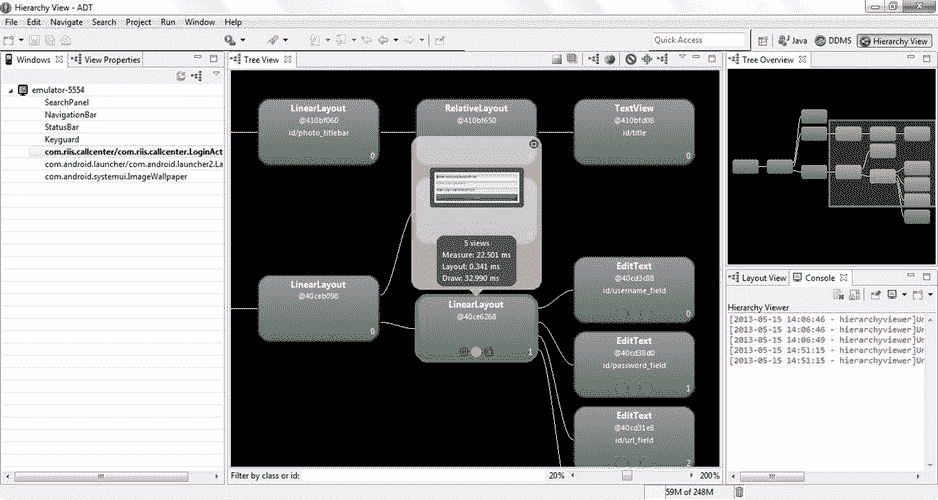

图 3-13 。CallCenterApp 登录屏幕的层次结构查看器

在图 3-13 中，我们可以看到我们的登录视图花了将近 33 毫秒才显示出来。它还显示了哪些布局是登录视图的一部分，通过将鼠标悬停在特定视图上，您可以看到每个视图显示了多长时间。

层次查看器还包括一个完美的像素设计工具。我们不会在本书中涉及这一点。

Unix 工具

因为 Android 是在 Linux 上构建的，所以我们可以利用许多与 Linux 相同的 shell 命令工具来进行性能测试。主要工具关注总进程负载、单个进程细节和内存利用率。

顶端

顶部的命令会让你知道你的应用相对于设备上所有其他进程的位置。列表位置越高，消耗的资源就越多。您可以使用 adb shell 命令登录到电话，也可以从命令行使用 adb shell top 远程运行该命令。图 3-14 显示了结果。

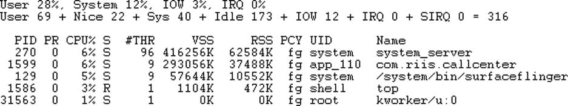

图 3-14 。top 命令的输出

倾印系统〔??〕

Top 还会获取应用的进程 ID 或 PID，然后您可以将它用于 dumpsys 命令，如下所示:

```java

adb shell dumpsys meminfo 1599

```

Dumpsys 将为您提供关于您的应用正在使用的内存和堆的信息；参见图 3-15 。

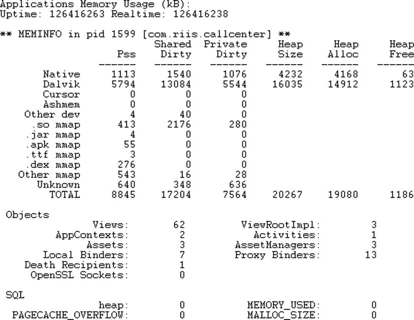

图 3-15 。dumpsys meminfo

本节中提到的所有 Unix 工具都在某个时间点进行测量。`Procstats`在 Android 4.4 或 KitKat 中引入，用于显示后台运行的应用将消耗多少内存和 CPU。使用命令查看`procstats`输出:

```java

adb shell dumpsys procstats

```

结果如图 3-16 所示。

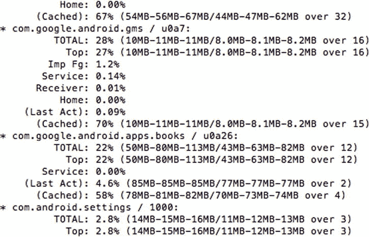

图 3-16 。倾印系统 procstats〔??〕

vmstat〔??〕

Vmstat 允许您查看设备上的虚拟内存级别；参见图 3-17 。这是一个简单的 Linux 命令，报告进程、内存、分页、块 IO、陷阱和 CPU 活动。“b”列显示哪些进程被阻止。使用如下命令:adb shell vmstat。

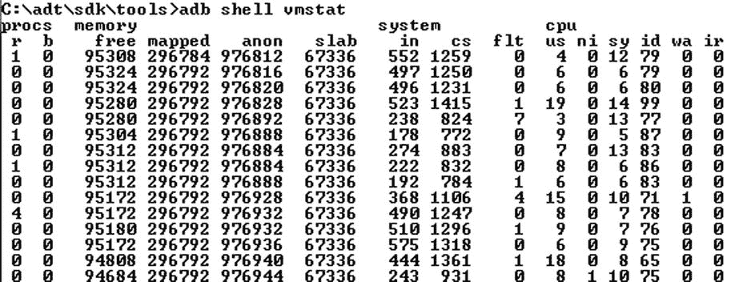

图 3-17 。dumpsys meminfo

摘要

在这一章中，我们已经看到了一些工具，它们首先发现您是否有性能问题，然后确定需要修复的调用；我们还看到了一些可以用来优化应用的技术。由于 Android SDK 和 Android 平台与 Unix 的密切关系，它们提供了大量工具来帮助您识别问题。