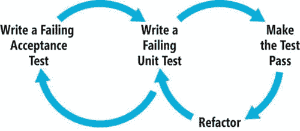
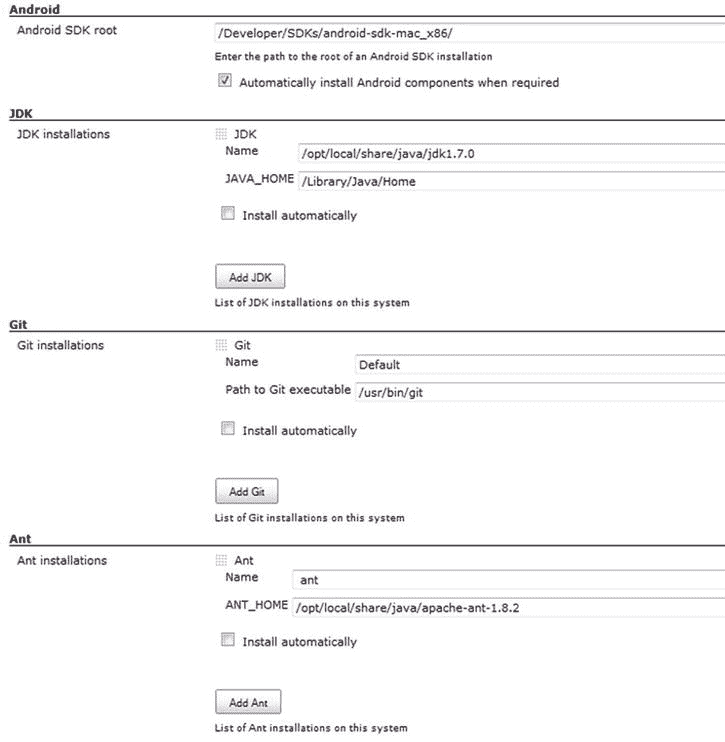

# 四、敏捷

作为一名开发人员，您希望在 Android 开发方面做得更好，有更少的错误，做出更好的产品，或者只是让客户满意。无论您是为 web、移动甚至桌面开发，采用敏捷方法进行开发和测试都是值得的。

利益

我将谈论敏捷方法对于 Android 以及移动开发的真正好处。到本章结束时，应该会清楚敏捷对于 Android 开发者来说到底有多好。

让我们从敏捷开发最明显的好处开始:

*   你会有更少的错误。
*   你会得到更快的反馈。
*   它是可重复和可靠的。
*   您将需要更少的手动测试。
*   比较便宜。
*   它提供了内置的回归测试。

使用测试驱动开发(TDD)将导致更少的缺陷，并消除许多人进行手动测试的需要，这使得应用的开发更加便宜。持续集成(CI)将为客户提供更快的反馈，本质上使 APKs 创建过程可重复且可靠，并为您引入应用的任何新功能提供内置回归测试。

对企业的好处

在你的 Android 项目中加入敏捷实践的目的是什么？如果我们使用持续集成，我们将从业务中获得更快的反馈，通过可重复和可靠的开发，并始终确保您正在生产对人们试图执行其基本需求有用的东西。简而言之，如果你在移动开发中使用敏捷，这会让企业感到高兴，因为缺陷更少了，团队成员可以看到应用每天的进展情况。

对我来说，敏捷是关于经验教训和如何整合最佳实践，以确保我们提高每个人的标准，而不仅仅是一个应用。这是为了确保人们以正确的方式使用敏捷，让客户满意，不管他们是谁。

开发商的利益

当我第一次开始开发移动应用时，令人惊讶的是，当人们开始移动开发时，他们变得如此兴奋，他们只是开始编码，似乎忘记了我们在过去 10 年中学到的一切。

我喜欢采用敏捷实践的主要原因之一是确保每个人都遵循相同的标准，这样我们就可以在许多不同的应用上拥有可重复的质量。我看到当人们不使用敏捷时，当他们在移动中使用时，我们没有理由在我们的开发中不使用 TDD 和行为驱动开发(BDD)。没有它们，质量就会荡然无存。使用敏捷也是为了确保当新的开发人员进来时，他们都以他们应该的方式工作。

我们将在下一节探讨敏捷的要素。我确信你的列表可能不同，但是对我来说，最基本的敏捷开发包括 TDD、BDD 和 CI。对于开发人员来说，BDD 从来都不是一个真正需要采用的问题。这可能是因为启动和运行 BDD 主要是业务分析师和 QA 人员的工作。CI 也容易被采用，因为它允许任何和所有的代码部署和集成问题在过程的更早阶段被修复。CI 消除了那些困扰软件开发几十年的最后部署混乱或问题。

另一方面，对于许多开发人员来说，TDD 可能很难掌握和正确采用。顾名思义，TDD 意味着首先编写一个单元测试，然后编写最简单的代码使测试通过。一旦通过测试，代码就会被清理或重构。然后冲洗并重复添加任何新的所需功能。TDD 并不意味着在代码完成后添加单元测试。对于许多开发人员来说，这是编码实践的巨大逆转；对许多人来说，这是软件世界的量子力学，因为它没有直观的意义。

然而，TDD 为开发人员提供了两大好处。首先，它将开发倾斜成一种 YAGNI——你不需要它——的心态。为你的新应用开发一个真正美妙的新框架或架构的诱惑经常存在，但是相信我，你不会需要它。TDD 消除了这种诱惑，并确保您只为必要的功能编写代码，仅此而已。其次，TDD 还为开发人员提供了缺陷保险。对于任何一个新特性，你编写一个新的测试，然后编写相应的代码使测试通过；然后，如果单元测试全部通过，您可以相对确定新代码没有引入任何不想要的副作用。

最佳地点

敏捷非常适合移动开发，原因有很多。我在前面的章节中已经提到了它的一些好处，但是敏捷过程和移动开发是非常好的伙伴关系，因为做移动敏捷比做大型机敏捷甚至 web 敏捷要容易得多。

第一个原因是，与其他开发工作相比，移动项目的团队更小，开发生命周期也更短。根据为移动开发者运行云后端服务的 Kinvey 的说法，创建一个移动应用的平均时间是 18 周(见`http://www.kinvey.com/blog/2086/how-long-does-it-take-to-build-a-mobile-app`)。

这是因为移动应用往往不像网站那样复杂，从头到尾开发的功能也更少。通常，工作可以在几个 sprint 中完成，其中 s *sprint* 是一个敏捷术语，意思是定期(通常是 2 周)完成一些工作，并为评审做好准备。

Kinvey 报告进一步指出，前端工作大约需要 8 周，后端工作大约需要 10 周。

因为移动应用和团队往往更小，采用敏捷实践进行移动应用开发不需要大规模的公司重组。所需要的是团队对尝试敏捷方法的兴趣，并且前面部分列出的好处可以很快实现。

第二，尽管我们稍后会看到 Google TDD 和 BDD 并不是最好的起点，但是有开源的替代方案，使得采用敏捷的 Android 开发实践变得非常容易。

因此，即使你开始时只使用 TDD，甚至是像使用 Monkey Runner 记录脚本这样简单的事情，从长远来看，敏捷也会帮助你让你的客户满意，不管他是谁。

敏捷的要素

让我们看看在我们的敏捷 Android 项目中，我们需要什么样的基本形式。曾经有一段时间，你可以只做单元测试，并声称你在做敏捷开发。但是我们最终要做的是确保客户满意，而仅仅依靠单元测试可能无法让我们满意。理想情况下，我们会寻求更多，至少是单元测试和功能测试的持续集成过程。

敏捷 Android 的要素如下:

*   持续集成服务器
*   单元测试
*   BDD 或功能测试
*   部署；也就是说，通过电子邮件发送 APK

本章的其余部分将展示如何使用这些元素创建 Android 项目。

目标

在我们研究建立一个敏捷 Android 项目的细节之前，让我们先谈一谈我们的目标。

测试应该自动化；我们不想一遍又一遍地手动运行它们，因为那样效率不高。我们还希望尽早构建并经常构建，这样我们就不会有任何部署问题。我们希望在将 APK 发送给任何人之前运行单元和功能测试。你多久运行一次整个过程取决于你自己。有些人每天晚上运行它，有些人选择在每次新代码被检入时运行测试。

因此，理想情况下，我们需要一个自动化的构建过程，这个过程从代码被检入我们的源代码库(比如 GitHub)开始。然后 CI 服务器检查它并构建代码，单元测试自动运行，接着是功能测试(以可执行需求的形式)。如果没有任何故障，也就是说，如果一切都是绿色的，那么 APK 将通过电子邮件发送给客户，以便可以安装在设备上。

如果我说我们彻底结束了，那我是在撒谎。代码覆盖率是一个问题，但这里的目标是传递信息，以便您也可以开始。我会试着指出你需要的主要元素，以及你能做什么和目前不能做什么。

遵循敏捷方法，我们可以从基本元素开始，然后从那里开始构建。以后你可能想添加更多的元素，比如负载测试、性能测试或安全测试，但是现在如果我们做 TDD、BDD 和 CI，那么我们就包括了敏捷 Android 的主要元素。

点名

现在我想向你介绍敏捷 Android 的这些元素背后的名字，因为本章的其余部分将是实用的而不是理论的。表 4-1 显示了我们将为敏捷模型的每个元素使用的 Android 开发工具。

表 4-1 。Agile Android 元素名称

| 

敏捷元素

 | 

Android 工具名称

 |
| --- | --- |
| TimeDivisionDuplex 时分双工 | 机器人电器 |
| BDD | 葫芦 |
| 海峡群岛 | 詹金斯 |
| 源代码管理 | 开源代码库 |

从表 4-1 我们可以看到我们的元素现在变成了如下:

*   robolectric(robolectric.org):虽然 jUnit 是 Android 的开箱即用的单元测试系统，但它有一些缺点，我不推荐它作为一个好的起点。您应该能够快速高效地运行单元测试，但是 Android 设备模拟器上的 jUnit 并不适合高效的单元测试。相反，我们将使用 Robolectric，它没有 jUnit 的缺点，也是 jUnit4 而不是 jUnit3。
*   葫芦(calaba.sh) :我们将使用葫芦来满足我们的 BDD 或可执行需求。Calabash 允许我们以一种给定的时间格式强加可执行的需求。Calabash 是为您的 Android 项目启动和运行 BDD 的最简单的系统。
*   Jenkins(jenkins-ci.org):事实上的行业标准持续集成服务器，以前称为 Hudson。
*   GitHub(github.org):迅速成为事实上的行业标准源代码版本控制或源代码库。虽然人们经常把它们当作一回事，但我应该指出，Git 是版本控制系统，GitHub 是一个可以发布 Git 项目的网站。

TDD

测试驱动开发(TDD)已经存在一段时间了；它来自于 90 年代末 XP 的测试优先编程。概念很简单:为每个新特性编写一个测试，运行测试使其失败，编写代码满足测试，最后整理或重构代码；图 4-1 说明了该过程。每个测试通常被称为*单元测试*。


图 4-1 。测试驱动开发

尽管这个想法并不算新，但它还没有被编程社区大量采用，因为它对许多开发人员来说似乎是违反直觉的。然而，在较小的应用中，比如移动开发项目，TDD 可以显示出显著的改进。它可以减少缺陷的数量，同时提高开发速度。

TDD 的一个巨大好处是内置的回归测试。如果在重构阶段或添加新特性时做了一个小的改变，TDD 测试都通过了，那么你可以确定你的应用运行正常。单元测试是防止因重构或添加新功能而引入问题的最佳保障。

TDD 的另一个主要好处是它给开发过程带来了焦点。对代码进行伟大的架构添加或发明新的框架已经一去不复返了，没有人会再使用它们。开发人员的工作变成了编写一个或多个单元测试来满足下一个特性，然后编写最简单的代码来通过单元测试。这也叫做 YAGNI，或者你不需要它，另一个 XP 原则。因此，决定是否使用 ORM 而不仅仅是使用 SQLite 就变得简单多了；问题变成了“我需要 ORM 来通过单元测试吗？”答案必然是否定的，或者是 YAGNI。

如前所述，我们将使用 Roboelectric 来编写我们的单元测试，因为 Android 的内置解决方案使用旧版本的 jUnit，并要求我们使用非常慢的 Android 模拟器来运行测试，这使得 TDD 成为一项非常痛苦的工作。虽然 Roboelectric 简化了这个过程，但是代码覆盖率报告(单元测试覆盖了多少代码)仍然是一个问题。

BDD

行为驱动开发(BDD)，在这种情况下以可执行需求的形式，通过增加另一层来扩展 TDD，如图 4-2 所示。这意味着我们正在添加可执行的需求作为我们的元素之一。这些是用例或用户故事类型的需求，以*小黄瓜*格式编写，也称为给你我/何时/然后。



图 4-2 。行为驱动开发

图 4-3 显示了一个可执行需求的简单例子。不管这是为了一个 Android 游戏还是网页上的什么东西；需求的描述仍然是一样的。不难看出如何将旧式的用户故事转换成这种小黄瓜格式。


图 4-3 。示例特征文件

可执行的需求写在特征文件中，特征文件由一个或多个场景组成，通常有一个小的数据表来驱动场景。特性文件总是与步骤定义文件密切相关，步骤定义文件通常包含一些 Ruby 代码来驱动 web 或移动应用。步骤定义文件中的简单正则表达式将两者结合在一起，使您的需求可执行。

有时候，整个给定/何时/然后的想法(正如我们在本章后面讨论的黄瓜方法所使用的)需要几分钟才能被理解。我希望图 4-4 也能让你明白。给定一组前提条件，当你做 *X* 时，你期望下面这个可测试的结果。


图 4-4 。给定/何时/然后开发模式

当我开始尝试在 Android 工作中采用敏捷实践时，BDD 工具根本不可用，但现在有足够的空间让你使用 given/when/then 开发。

我们将使用葫芦作为我们的 BDD 工具，因为它非常容易使用。Calabash 如此简单的主要原因之一是它的步骤定义函数库允许您测试 Android 应用，通常不需要编写任何自己的步骤定义。

那么，如何决定进行多少单元测试和功能测试呢？图 4-5 所示的敏捷金字塔给了我们一个好主意。这个图如何适用于 Android？GUI 测试和验收测试层是使用 BDD 实现的，单元测试/组件测试层显然是使用单元测试完成的。


图 4-5 。敏捷测试三角形

单元测试和 GUI 测试的区别是什么？单元测试作用于一个方法，通常是一个公共方法；相比之下，GUI 测试或 BDD 功能测试是通常针对仿真器运行的测试。

Android 应用通常是客户端-服务器应用；它们是具有相应后端数据库的前端。所以他们通常有我们将使用 BDD 测试的 API。我们还将测试异常和错误路径以及“理想路径”

持续集成

持续集成(CI)采用构建服务器的形式，其中每个开发人员的代码定期合并在一起，通常是每天或每当任何代码被签入项目的源代码库中时。最初创建 CI 是为了阻止在应用发布前合并多个开发人员的代码时出现的集成混乱；各种各样的新缺陷、不可预见的依赖性和性能问题可能会共同推迟项目的启动。CI 使得代码合并更频繁地发生，所以理论上集成应该不那么痛苦，因为您最多只合并一天的代码。

CI 服务器自动化了构建过程，简化了部署，并使在项目早期发现任何依赖关系变得更加容易。CI 服务器还允许我们做其他事情，例如运行我们的单元测试(TDD)和可执行需求(BDD)以及性能测试、设备测试和各种报告。如果任何测试失败，他们甚至会停止部署，阻止应用在尚未准备好的时候获得业务用户。

在本章中，我们将使用 Jenkins 作为 CI 服务器。Jenkins 和 CI 通常非常适合移动项目。如果您可以从命令行手动运行命令，那么您可以在 Jenkins 中自动运行它。还有许多插件可以使构建、测试和部署阶段易于设置和维护。

我们还将研究在多部手机和平板电脑上使用 CI 进行自动化测试，这对我来说一直是 Android 开发的圣杯。

把这一切放在一起

我们通过使用 Jenkins 作为我们的 CI 服务器，开始在我们的移动开发流程中采用敏捷。从`http://jenkins-ci.org/`下载詹金斯。您也可以下载并安装一个 windows 或 Mac OS 本机二进制文件，但是下载 war 文件并从命令行运行`java -jar jenkins.war`也同样容易。接下来，将你的浏览器指向`http://localhost:8080`，加载 Jenkins 您应该会看到类似于图 4-6 中的仪表板页面。


图 4-6 。詹金斯打开仪表板上的显示器

提示也有一些网站，比如 cloudbees.com 的 Cloudbees ，会为你托管 Jenkins。有了 Cloudbees，您可以让 it 人员简单地编译您的应用或设置从属客户端来编译代码，并让 Cloudbees 来协调一切。

与 Jenkins 合作时，我们通常会去两个地方，如图 4-7 中的管理 Jenkins 屏幕所示。第一个是管理插件，在这里我们可以引入 Ant、GitHub 和 Android 模拟器插件。我们还需要转到 Configure System，为 JDK、Ant 位置等添加默认的项目设置。


图 4-7 。管理 Jenkins 屏幕

让 Jenkins 强大的是数以千计插件的可用性。图 4-8 显示了管理插件➤安装页签；如果你没有的话，一定要抓住前面列出的插件。


图 4-8 。在 Jenkins 中管理插件

接下来转到 Configure System，在 CI 服务器上添加 Android SDK、JDK、Git 和 Ant 位置；图 4-9 显示了 Mac 上的显示。



图 4-9 。使用配置系统页面在 Jenkins 中添加插件

詹金斯就其本身而言，它相当无用；我们需要让它做一些事情，我们希望它做的第一件事是从 GitHub 构建代码。

1.  创建一个名为 ToDoList 的新工作，并使其成为一个自由风格的软件项目。
2.  点击 Configure 并输入一个 GitHub 项目，例如`https://github.com/godfreynolan/ToDoList`。
3.  在源代码管理下，输入存储库 URL，如`git@github.com:godfreynolan/ToDoList.git`。
4.  在“构建触发器”下，选择“将更改推送到 GitHub 时构建”

接下来我们需要告诉 Jenkins 如何构建项目。在这种情况下，我们需要如下两个命令。我们正在创建一个调试版本，使用配置项目设置 ，如图图 4-10 所示。

```java
android update project –name "ToDoList"
ant –Dadb.device.arg='-s $ANDROID_AVD_DEVICE' debug
```


图 4-10 。Jenkins 为 ToDoList 配置项目设置

点击保存并通过点击新项目运行构建，该项目现在应该在 Jenkins 仪表板中，如图 4-11 所示。


图 4-11 。Jenkins 仪表盘显示了添加的新项目

现在我们将使用一个版本的 jUnit 向流程添加一些 TDD。如前所述，测试驱动开发是在编写任何代码之前编写测试，然后编写满足该测试的代码的过程，重复该过程直到特性完成。

通常，当我们运行单元测试时，第一次测试会失败——因为你没有代码——然后当你编写满足测试的代码时，它们应该会变绿。此外，所有的 TDD 类都有一个安装和拆卸以及单元测试。

谷歌推荐的单元测试有很多问题。首先，它是 jUnit3，使用起来很麻烦，而不是 jUnit4。它也没有好的单元测试代码覆盖工具。我通常不会问客户:“你能告诉我你的代码覆盖率是多少吗？”或者争论如何将代码覆盖率从 83%提高到 90%。当你想出一个适合你的数字时，代码覆盖率就足够好了。通常当我听到有人在同一个句子中说“反射”和“代码覆盖”时，我知道他们已经走得太远了。然而，也有一点，你在另一个方向走得太远，根本没有足够的单元测试。Android 的 jUnit3 更容易落入这个陷阱。

隐式采用 Robolectric 允许您使用 jUnit4，包括它的代码覆盖智能。Robolectric 还具有其他一些不错的功能，另外，您的整个 TDD、BDD 和 CI 工具链都使用了最高质量的现代组件。

在下面的例子中，我们为 ToDoList 应用创建了五个简单的测试:

*   如果未创建活动，则`should_create_activity`失败。这是最基本的机器人电力测试，可以在任何 Android 应用中使用。
*   `should_find_tasks`添加三个任务，如果没有找到新创建的任务，则添加失败。
*   `should_add_new_task`通过 ToDoProvider 方法添加任务，如果找不到任务则失败。
*   `should_add_task_using_ux`通过 GUI 添加任务，如果找不到任务，则失败。
*   `should_remove_tasks`添加任务和删除任务，如果找到新创建的任务则失败。

清单 4-1 显示了 ToDoActvityTest 类，它包括这五个测试，以及 Robolectric/jUnit4 装饰器`@RunWith`和`@Test`，它们是编写这类测试的标志。

清单 4-1 。ToDoActivityTest.java

```java
import java.util.List;
import org.junit.Assert;
import org.junit.Test;
import org.junit.runner.RunWith;
import org.robolectric.Robolectric;
import org.robolectric.RobolectricTestRunner;

import android.app.Activity;

@RunWith(RobolectricTestRunner.class)
public class TodoActivityTest
{
        @Test
        public void should_add_new_task() throws Exception
        {
                final TodoActivity activity = Robolectric.buildActivity(TodoActivity.class).create().get();

                activity.getProvider().addTask("Some task");
                final List<String> tasks = activity.getProvider().findAll();
                Assert.assertEquals(tasks.size(), 1);
        }

        @Test
        public void should_add_task_using_ux() throws Exception
        {
                final TodoActivity activity = Robolectric.buildActivity(TodoActivity.class).create().get();

                activity.getEditableTextbox().setText("My task");
                activity.getSaveTaskButton().performClick();

                final int tasks = activity.getTaskListView().getCount();
                Assert.assertEquals(tasks, 1);
        }

        @Test
        public void should_create_activity() throws Exception
        {
                final Activity activity = Robolectric.buildActivity(TodoActivity.class).create().get();
                Assert.assertTrue(activity != null);
        }

        @Test
        public void should_find_tasks() throws Exception
        {
                final TodoActivity activity = Robolectric.buildActivity(TodoActivity.class).create().get();

                activity.getProvider().addTask("Some task 1");
                activity.getProvider().addTask("Some task 2");
                activity.getProvider().addTask("Some task 3");
                final List<String> tasks = activity.getProvider().findAll();
                Assert.assertEquals(tasks.size(), 3);
        }

        @Test
        public void should_remove_task() throws Exception
        {
                final TodoActivity activity = Robolectric.buildActivity(TodoActivity.class).create().get();

                activity.getProvider().addTask("Some task");
                activity.getProvider().deleteTask("Some task");
                final List<String> tasks = activity.getProvider().findAll();
                Assert.assertEquals(tasks.size(), 0);
        }
}
```

Robolectric 最好与 Maven 构建工具一起使用，而不是 Ant。要优化你的项目，采取清单 4-2 中的步骤。

清单 4-2 。Mavenizing ToDoList

```java
git clone https://github.com/mosabua/maven-android-sdk-deployer.git
cd maven-android-sdk-deployer
mvn install -P 4.3
cd ToDoList
mvn clean test
```

第一次运行 Maven 或`mvn`时，它会安装所有丢失的 jar，这需要一些时间。如果项目已经被正确地 been 化，测试输出应该类似于清单 4-3 中的。

清单 4-3 。试验结果

```java
-------------------------------------------------------
 T E S T S
-------------------------------------------------------
Running com.example.TodoActivityTest
WARNING: no system properties value for ro.build.date.utc
DEBUG: Loading resources for android from jar:/Users/godfrey/.m2/repository/org/ToDoList/android-res/4.1.2_r1_rc/android-res-4.1.2_r1_rc-real.jar!/res...
DEBUG: Loading resources for com.example from ./res...
Tests run: 5, Failures: 0, Errors: 0, Skipped: 0, Time elapsed: 12.168 sec

Results :

Tests run: 5, Failures: 0, Errors: 0, Skipped: 0

[INFO] ------------------------------------------------------------------------
[INFO] BUILD SUCCESS
[INFO] ------------------------------------------------------------------------
[INFO] Total time: 19.018s
[INFO] Finished at: Tue Nov 19 20:03:48 EST 2013
[INFO] Final Memory: 18M/81M
[INFO] ------------------------------------------------------------------------
```

将它作为单元测试添加到 CI 服务器需要能够从命令行运行 Robolectric 代码，这仅仅意味着运行 Maven 测试:

```java
mvn clean test
```

在第二章第一节中，我们用 Dagger 展示了我们第一次见到的依赖注入 ?? 框架的例子。Dagger 允许您创建模拟框架，以便我们测试我们的代码，而不是到 web 服务的任何网络连接，或者在给定的示例中是 SQLite 数据库。在这个例子中，我们模拟了 ToDoList 应用中的数据提供者。清单 2-1 展示了如何连接两个数据库供应器；第一个是真正的数据库，第二个是存根函数。

倒数第二步是使用 Calabash 添加可执行的需求代码。我们使用 Calabash 来提供 BDD 或行为驱动设计，在这种情况下是以可执行需求的形式。向葫芦人道歉，因为他们没有真正的图标，所以我必须做一个。

当我们开始尝试在我们的 Android 工作中采用敏捷实践时，使用可执行需求的选项根本不存在，但是现在有足够的空间让你使用 cumber 风格的 given/when/then 编程和其他工具。

BDD 通过增加另一层来扩展 TDD，这里称之为验收测试。因此，现在您编写您的可执行文件需求以及您的单元测试，然后在将可执行文件发布给业务涉众之前，通过编写满足测试的代码来使它们都通过。

清单 4-4 给出了一个可执行需求的简单例子。不管这是为了一个 Android 游戏还是网页上的什么东西；需求的描述仍然是一样的。不难看出如何将旧式的用户故事转换成这种格式。

清单 4-4 。实现给定/何时/然后开发

```java
Feature:
     As a user I want to see my To Do List and individual reminders

Scenario: Display an individual reminder

  Given I wait for the "ToDoListActivity" screen to appear
  When I touch the "Get The Milk" text
  Then I wait up to 3 seconds for the "ReminderActivity" screen to appear
  Then I see the text "Remember to Get The Milk"
```

如前所述，可执行的需求是在特征文件中编写的，特征文件由一个或多个场景组成，通常有一个小的数据表来驱动场景，然后这些场景与步骤定义文件相匹配。

在 Cucumber 中，特征文件定义需求，步骤定义执行代码。在 Calabash 中，您可以通过特性文件来完成大部分工作，因为优秀的 Calabash 人员已经编写了一个步骤定义库，它将涵盖您正在尝试测试的大多数场景，或者换句话说，他们已经为您完成了艰苦的工作。

要运行葫芦，你首先需要安装葫芦宝石。然后在测试 APK 的`calabash`文件夹中创建您的特征文件，并调用`calabash-android`命令。使用以下语法从命令行调用 Calabash 它可以作为 Jenkins 中的另一个执行 shell 来添加。

```java
calabash-android run ToDoListApplication.apk
```

Calabash 的工作原理是分解您的测试 APK，注入`calabash`服务器，然后重新组装您的 APK，这样您就可以运行您的测试了。

最后，一旦单元测试和可执行需求全部通过，您需要将 APK 通过电子邮件发送给您的业务涉众。还有其他选项你可能要考虑，比如使用 TestFlightApp 之类的空中部署模型；然而，在 Android 平台上，这可能是多余的，所以我们将只通过电子邮件发送 APK。谢天谢地，Jenkins 有一个电子邮件插件，可以让你简单地添加一个电子邮件收件人列表来发送 APK。

摘要

在你的 Android 项目中加入敏捷实践的目的是什么？通过可重复且可靠的开发，您将更快地从客户那里获得反馈，并始终确保您正在生产一些有用的东西来帮助他们满足基本的业务需求。简而言之，如果你在移动开发中使用敏捷，客户会很高兴，因为他们看到更少的缺陷，因为你在做单元测试和实现可执行的需求。

你会发现移动应用也有很大的可见性。虽然完成一个应用的总费用可能比网络工作要少，但可见性非常高，通常意味着要见到 C 级高管并与之交谈。留下积极的印象通常会带来更多的工作。因此，即使你开始时只使用 TDD，甚至是像使用 Monkey Runner 记录脚本这样简单的事情，从长远来看，它也会帮助你让客户满意。

敏捷宣言(`http://www.agilemanifesto.org/principles.html` `)`陈述了它的首要原则。

我们最优先考虑的是通过尽早和持续交付有价值的软件来满足客户。

应用敏捷 Android 的原则让我们到达那里。

最后，你可以随意添加更多的插件到你的 Jenkins 服务器上，比如代码覆盖、性能测试和安全漏洞测试。这不是完整的任务列表；它旨在让您开始走上敏捷之路。寻找需要改进的地方，并逐步应用它们——任何对你和你的团队有助于创建更好的软件的方法都是最好的敏捷过程。