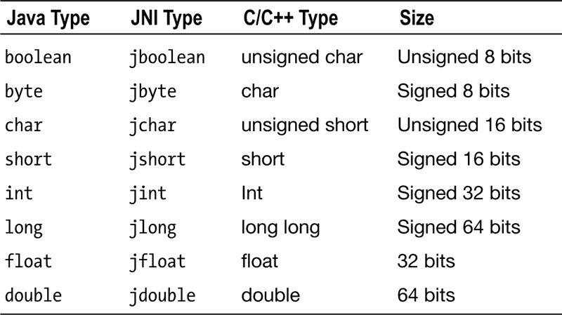

# 五、原生开发

尽管 Android 框架完全是为基于 Java 的应用而设计的，但 Android 原生开发工具包(NDK)也由 Google 提供，作为 Android SDK 的官方配套工具集，使开发人员能够使用原生机器码生成编程语言(如 C、C++ 和汇编)来实现和嵌入其应用的性能关键部分。

通过 Java 原生接口(JNI) 技术，可以像普通 Java 方法一样无缝访问原生组件。应用的 Java 和本机代码部分运行在同一个进程中。尽管 JNI 技术允许 Java 和本地代码在同一个应用中共存，但它没有扩展 Dalvik 虚拟机(VM)的边界。Java 代码仍然由 Dalvik VM 管理和执行，所有本机代码都应该在应用的整个生命周期中自我管理。这给开发人员增加了额外的责任。

为了有效地与虚拟机并行执行，本机组件应该是好邻居，并与它们的 Java 对应物交互，保持微妙的界限。如果这种交互管理不当，本机组件可能会在应用中导致难以跟踪的错误；这种错误甚至会导致虚拟机崩溃，从而导致整个应用停止运行。

在这一章中，你将学到一些在 Android 平台上开发良好运行的本地组件的最佳实践。

决定在哪里使用本机代码

在本章中，你将学到的第一个最佳实践是正确识别你的应用中可以从使用本机代码支持中获益的组件。

不使用本机代码的地方

关于本机代码，最大也是最常见的错误假设是期望通过简单地用本机代码而不是 Java 编写应用模块来自动提高性能。

使用本机代码并不总是会自动提高性能。尽管众所周知早期版本的 Java 比本地代码慢得多，但最新的 Java 技术经过了高度优化，在许多情况下，速度差异可以忽略不计。Java 虚拟机的 JIT 编译特性，特别是 Android 情况下的 Dalvik VM，允许在应用启动期间将解释的字节码翻译成机器码。然后，在应用的整个执行过程中使用翻译后的机器码，使 Java 应用的运行速度与本地应用一样快。

**注意**使用本机代码并不总能自动提高性能。

请注意，在您的应用中过度使用本机代码支持很容易导致更大的稳定性问题。因为本机代码不是由 Dalvik VM 管理的，所以大部分内存管理代码必须由您来编写；这本身增加了整个应用的复杂性和代码量。

在哪里使用本机代码

在 Android 应用中使用原生代码绝对不是一个坏习惯。在某些情况下，它变得非常有益，因为它可以提供代码重用并提高一些复杂应用的性能。下面列出了一些可以从本机代码支持中受益的常见领域:

*   **使用现有的第三方库:**假设您将在 Android 平台上开发一个视频编辑应用。为了让您的应用运行，它需要能够读写各种视频格式，如 Theora 视频编解码器。Java 框架没有提供任何 API 来处理 Theora。开发处理这种视频格式所需的代码不是一种有效的时间利用，因此您的最佳选择是利用已经可用的第三方库，它可以理解 Theora 视频编解码器。尽管 Java 编程语言很流行，但代码库生态系统仍然高度依赖于基于 C/C++ 的本地代码库。您很有可能会发现 Theora 视频编解码器的各种实现都是 C/C++ 库。本机代码支持在这里变得非常方便，因为它可以让您将本机 C/C++ 库无缝地融合到您的 Android 应用中。使用本机代码支持来促进代码重用是一个很好的实践，因为这有助于开发过程。
*   **性能关键代码的硬件特定优化:**作为一种独立于平台的编程语言，Java 不提供任何使用 CPU 特定特性来优化 Android 应用的性能关键部分的机制。与桌面平台相比，移动设备资源非常稀缺。对于具有高性能要求的复杂应用，如 3D 游戏和多媒体应用，有效地利用每一个可能的 CPU 功能至关重要。ARM 处理器，如 ARM NEON 和 ARM VFPv3-D32，提供了额外的指令集，允许移动应用对许多性能关键型操作进行硬件加速。使用本机代码支持来受益于这些 CPU 特定的特性是一个很好的实践。

Java 本地接口

如本章前面所述，JNI 是一种机制和一组 API，由 Java 虚拟机公开，使开发人员能够使用本机编程语言编写 Java 应用的各个部分。这些本地组件可以像普通的 Java 方法一样从 Java 代码中透明地访问。JNI 还提供了一组 API 函数，使本地代码能够访问 Java 对象。本地组件可以创建新的 Java 对象或使用由 Java 应用创建的对象，Java 应用可以检查、修改和调用这些对象上的方法来执行任务。

使用 JNI 编写本地代码的困难

通过 JNI 将本机代码集成到 Java 应用中需要使用符合 JNI 规范的特制名称来声明本机函数。除了函数名，本机函数的每个参数也应该使用 JNI 数据类型。因为 Java 和本机代码是在不同的筒仓中编译的，所以这部分代码中的任何问题在编译时都是不可见的。

从本机代码回到 Java 空间也需要一系列 API 调用。由于本机编程语言不了解代码的 Java 部分，因此如果您使用了错误的 API 调用，它不会提供任何编译时错误。此外，代码的 Java 部分的更改也可能破坏代码的本机部分，而且在编译时也不会通知您这一点。

即使您采取了非常措施来防止 bug 的发生，保持本地方法和它们在 Java 空间中的声明保持一致也是一项麻烦和多余的任务。在本节中，您将学习如何利用可用的工具来自动生成必要的代码，而不是手动键入代码。

使用工具生成代码

几乎每一种编程语言都有一个共同的良好实践，那就是作为一名优秀的开发人员，您应该尽可能减少手动生成的代码行数。您生成的任何代码行都必须在应用的整个生命周期中进行维护。作为一种良好的实践，您应该始终利用 SDK 和 ide 提供的代码生成器来实现这一点。

**提示**从 SDK 提供的代码生成器中获益，最大限度地减少您需要编写的代码量。

使用 javah 生成 C/C++ 头文件

工具是 Java JDK 发行版的一部分。它使用本机方法声明对 Java 类文件进行操作，并基于 JNI 规范生成相应的 C/C++ 头文件，这些头文件带有适当的签名。因为生成的头文件不会被开发人员修改，所以您可以任意多次调用`javah`来保持本地方法声明的同步。

`javah`工具是一个独立的应用，位于您机器上的`<JDK_HOME>/bin`目录 中。在没有任何命令行参数的情况下调用它将显示可用参数的列表。根据您的项目结构和独特的需求，您可以决定在构建过程中的什么地方使用`javah`工具。

下面是一个简单的例子，演示了`javah`是如何工作的。为了简单起见，并且尽可能独立于平台，在这个例子中，您将通过扩展 Android ANT 构建框架的 ANT 构建脚本来使用`javah`。这里只突出显示源代码的相关部分。你可以从这本书的网站下载完整的源代码 。

1.  As shown in Listing 5-1, define a new ANT task called `headers` in the `custom_rules.xml` file in order to extend the Android build system with the ability to generate C/C++ header files for native methods. List your classes with native modules accordingly. The `javah` tool will process only the classes that are explicitly mentioned.

    清单 5-1 。`custom_rules.xml`文件的内容

    ```java
    <?xml version="1.0" encoding="UTF-8"?>
    <project name="custom_rules">
        <target name="headers" depends="debug">
            <path id="headers.classpath">
                <path refid="project.all.jars.path" />
                <path path="${out.classes.absolute.dir}" />
            </path>

            <property name="headers.bootclasspath.value"
                      refid="project.target.class.path" />
            <property name="headers.classpath.value"
                      refid="headers.classpath" />
            <property name="headers.destdir" value="jni" />

            <echo message="Generating C/C++ header files..." />

            <mkdir dir="${headers.destdir}" />

            <javah destdir="${headers.destdir}"
                    classpath="${headers.classpath.value}"
                    bootclasspath="${headers.bootclasspath.value}"
                    verbose="true">

                <!-- List of classes with native methods.  -->
                <class name="com.apress.example.MainActivity" />
            </javah>
        </target>
    </project>
    ```

2.  Assume that your Android application contains a native method, called `nativeMethod`, within the `MainActivity` class as shown in Listing 5-2.

    清单 5-2 。MainActivity.java 文件的内容带有原生方法

    ```java
    public class MainActivity extends Activity
    {
        ...

        /**
         * Native method that is implemented using C/C++.
         *
         * @param index integer value.
         * @param activity activity instance.
         * @return string value.
         * @throws IOException
         */
        private static native String nativeMethod(int index,
                Activity activity) throws IOException;
    }
    ```

3.  现在，您可以通过在命令行上调用以下命令来使用 ANT 脚本:

    ```java
    ant headers
    ```

4.  This will first trigger a full compile of your application, for the class files to be generated. Then it will invoke the `javah` tool on the specified class files to parse the method signatures of your native methods. While the `javah` tool is working, it will print a status message as shown in Listing 5-3.

    清单 5-3 。生成头文件的 javah 工具

    ```java
    headers:
         [echo] Generating C/C++ header files...
        [mkdir] Created dir: C:\src\JavahTest\jni
        [javah] [Creating file ... [com_apress_example_MainActivity.h]]
    ```

5.  The `javah` tool will generate a set of header files in the `jni` subdirectory of your project. The header files will be named according to the name of the Java class that encapsulates the native method. In this example, the header file `com_apress_example_MainActivity.h` header fill will be generated. As shown in Listing 5-4, the content of this header file will include the native function signature for each native method that you need to implement.

    清单 5-4 。生成的 C/C++ 头文件

    ```java
    /* DO NOT EDIT THIS FILE - it is machine generated */
    #include <jni.h>
    /* Header for class com_apress_example_MainActivity */

    #ifndef _Included_com_apress_example_MainActivity
    #define _Included_com_apress_example_MainActivity
    #ifdef __cplusplus
    extern "C" {
    #endif

    ...

    /*
     * Class:     com_apress_example_MainActivity
     * Method:    nativeMethod
     * Signature: (ILandroid/app/Activity;)Ljava/lang/String;
     */
    JNIEXPORT jstring JNICALL Java_com_apress_example_MainActivity_nativeMethod
      (JNIEnv *, jclass, jint, jobject);

    #ifdef __cplusplus
    }
    #endif
    #endif
    ```

6.  正如头文件顶部所建议的，您不应该直接修改这个头文件，因为每次您执行`javah`工具时，它都会被覆盖。相反，您应该在一个单独的 C/C++ 源文件中提供在这个头文件中声明的所有本机方法的实现。

因为代码的 Java 和本机部分在两个独立的筒仓中，Android 构建系统在构建应用时不执行任何验证。一旦在运行时 被调用，任何丢失的本地函数仅仅触发一个`java.lang.UnsatisfiedLinkError`。`javah`工具通过自动生成签名来帮助您防止这些错误。

**提示**使用`javah`工具有助于在你的 Android 应用中防止`java.lang.UnsatisfiedLinkError`运行时异常。

由于每个本机方法都是在头文件中声明的，因此这些函数的任何缺失实现都会触发一个编译时错误，从而阻止您发布包含缺失实现的 Android 应用。

使用 SWIG 生成 JNI 码

在上一节中，您学习了如何使用`javah`工具。虽然`javah`通过生成本机函数签名并使它们与 Java 代码保持同步来帮助您，但是您仍然必须提供包装器代码来将这些本机函数的本机实现粘合到 Java 层。这将需要您使用大量的 JNI API 调用，这是一项繁琐而耗时的开发任务。

在本节中，您将了解另一个强大的工具，称为简化包装器和接口生成器(SWIG) 。它通过生成必要的 JNI 包装器代码 ，简化了开发本地函数的过程。SWIG 是一个接口编译器，仅仅是一个代码生成器；它没有定义新的协议，也不是一个组件框架或专门的运行时库。SWIG 将一个接口文件作为其输入，并生成必要的代码来在 Java 中公开该接口。SWIG 不是存根生成器；它生成可以编译和运行的代码。可以在`www.swig.org`从其官网下载 SWIG。一个简单的示例应用将帮助您更好地理解 SWIG 是如何提供帮助的。

在这个例子中，假设您需要在运行时获得 Android 应用的 Unix 用户名。这些信息可以通过 POSIX `getlogin`函数获得，该函数只能从本机 C/C++ 代码中访问，而不能从 Java 中访问。尽管平台已经提供了这个函数的实现，但是你仍然需要编写 JNI API 调用来将这个函数的结果暴露给 Java 空间，如清单 5-5 所示。

清单 5-5 。通过 JNI 暴露的 Getlogin 函数

```java
JNIEXPORT jstring JNICALL Java_com_apress_example_Unix_getlogin(JNIEnv* env, jclass clazz) {
    jstring loginString = 0;

    const char* login = getlogin();
    if (0 != login) {
        loginString = env->NewStringUTF(login);
    }

    return loginString;
}
```

SWIG 可以通过自动生成这段代码来帮助你。为了让 SWIG 知道包装哪个函数，您需要在 SWIG 接口文件中指定它。如前所述，SWIG 是一个接口编译器；它根据提供的接口生成代码。用于公开`getlogin`函数的 SWIG 接口文件如清单 5-6 所示。

清单 5-6 。Unix.i SWIG 接口文件

```java
/* Module name is Unix. */
%module Unix

%{
/* Include the POSIX operating system APIs. */
#include <unistd.h>
%}

/* Ask SWG to wrap getlogin function. */
extern char* getlogin(void);
```

假设您已经在工作站上安装了 SWIG 工具，并且 SWIG 二进制目录已经添加到 PATH 环境变量中，请在命令提示符下调用以下命令:

```java
swig -java
     -package com.apress.example
     -outdir src/com/apress/example
     jni/Unix.i
```

SWIG 工具处理`Unix.i`接口文件并生成`jni`目录中的`Unix_wrap.c` C/C++ JNI 包装代码，如清单 5-7 所示，以及`com.apress.example` Java 包中的`UnixJNI.java`和`Unix.java` Java 代理类。

清单 5-7 。SWIG 生成的 Unix_wrap.c 原生源文件

```java
/* ----------------------------------------------------------------------------
 * This file was automatically generated by SWIG (http://www.swig.org).
 * Version 2.0.11
 *
 * This file is not intended to be easily readable and contains a number of
 * coding conventions designed to improve portability and efficiency. Do not make
 * changes to this file unless you know what you are doing--modify the SWIG
 * interface file instead.
 * ----------------------------------------------------------------------------- */

#define SWIGJAVA

...

/* Include the POSIX operating system APIs. */
#include <unistd.h>

#ifdef __cplusplus
extern "C" {
#endif

SWIGEXPORT jstring JNICALL Java_com_apress_example_UnixJNI_getlogin(JNIEnv *jenv, jclass jcls) {
  jstring jresult = 0 ;
  char *result = 0 ;

  (void)jenv;
  (void)jcls;
  result = (char *)getlogin();
  if (result) jresult = (*jenv)->NewStringUTF(jenv, (const char *)result);
  return jresult;
}

...
```

要使用本机函数，现在只需在应用中使用来自`com.apress.example.Unix`类的`getlogin` Java 方法。无需编写任何 JNI 包装器代码，SWIG 就能让您在 Android 应用中使用本机功能。

最小化 JNI API 调用的数量

尽管 SWIG 工具很有前途，但不用说，仍然会有自动代码生成不可行的情况。在这些情况下，您将需要编写必要的 JNI API 调用来提供该功能。即使无法阻止手动 JNI API 调用，最小化此类调用的数量仍然有助于优化整个应用并减少代码占用。在本节中，您将了解一些最佳实践，以最大限度地减少应用中所需的 JNI API 调用次数。

使用原始数据类型作为本机方法参数

Java 编程语言中有两种数据类型:原始数据类型，如`byte`、`short`、`int`和`float`，以及复杂数据类型，如`Object`、`Integer`和`String`。JNI 可以自动将大多数原始数据类型映射到 C/C++ 原始数据类型。本机函数可以直接使用作为原始类型传递的数据，而无需进行任何特定的 JNI API 调用，如表 5-1 所示。

表 5-1 。原始数据类型映射



但是，复杂数据类型作为对本机函数的不透明引用传递。为了使用这些数据，本地函数必须进行各种 JNI API 调用来提取原始数据格式的数据片段，以便在本地代码中使用。在定义本机方法时，作为一种最佳实践，应尽可能地消除参数列表和返回值中的复杂数据类型。这将帮助您最大限度地减少本机代码中 JNI API 调用的数量，并且还将显著提高本机函数的性能。

最小化从本机代码到 Java 空间的回溯

本机函数不受通过其参数传递给它的数据的限制。JNI 提供了必要的 API，使本地代码能够与 Java 空间进行交互。这种灵活性是有代价的。使用 JNI API 调用从本机代码返回到 Java 空间会消耗 CPU 周期并影响应用性能；同时，由于必需的 JNI API 调用的数量，它增加了本机代码的复杂性。

作为一个最佳实践，请确保通过参数将所有需要的数据传递给本机函数，而不是让本机函数返回 Java 空间来获取它们。

看看下面的代码示例。如清单 5-8 所示，本地代码通过多次 JNI API 调用来访问它需要的数据。

清单 5-8 。从对象实例访问两个字段的本机方法

```java
JNIEXPORT void JNICALL Java_com_apress_example_Unix_method(JNIEnv* env, jobject obj) {

    jclass clazz = env->GetObjectClass(obj);

    jfieldID field1Id = env->GetFieldID(clazz, "field1", "Ljava/lang/String;");
    jstring field1Value = env->GetObjectField(obj, field1Id);

    jfieldID field2Id = env->GetFieldID(clazz, "field2", "Ljava/lang/Integer;");
    jobject field2Value = env->GetObjectField(obj, field2Id);

    ...
}
```

如清单 5-9 所示，本地方法声明可以修改为包含`field1`和`field2`作为本地方法参数的一部分，以消除那些 JNI API 调用。

清单 5-9 。字段 1 和字段 2 都直接传递给了本机方法

```java
JNIEXPORT jstring JNICALL Java_com_apress_example_Unix_method(JNIEnv* env, jobject obj,
    jstring field1, jobject field2) {
    ...
}
```

为了避免 Java 空间中的冗余编码，通常的做法是利用助手方法在调用本地方法之前聚集这些额外的数据项，而不是要求开发人员每次都传递它们，如清单 5-10 所示。

清单 5-10 。聚集必要参数的帮助器方法

```java
public void method() {
    jniMethod(field1, field2);
}

public native void jniMethod(String field1, Integer field2);
```

内存使用

与基于桌面的平台相比，内存是移动设备上的稀缺资源。Java 被称为托管编程语言，这意味着 Java 虚拟机(JVM) 代表开发人员管理应用内存。在应用的执行过程中，JVM 会留意对分配的内存区域的可用引用。当 JVM 检测到应用代码无法再到达分配的内存区域时，它会通过一种称为*垃圾收集* 的机制自动释放内存。这将开发人员从直接管理应用内存中解放出来，并极大地降低了代码的复杂性。

JVM 垃圾收集器的边界仅限于 Java 空间。因为本机代码不在托管环境中运行，所以 JVM 垃圾收集器无法监视或释放应用在本机空间中分配的内存。开发人员有责任正确管理本机空间中的应用内存。否则，应用很容易导致设备内存不足。这可能会危及应用和设备的稳定性。

在本节中，您将了解在本机空间中有效使用内存的一些最佳实践。

本地参考

正如在 Java 领域一样，引用在本机领域也继续扮演着重要的角色。JNI 支持三种引用:局部引用、全局引用和弱全局引用。因为 JVM 垃圾收集器不适用于本机空间，所以 JNI 提供了一组 API 调用，使开发人员能够管理每个引用类型的生命周期。

传递给本机函数的所有参数都是局部引用。此外，大多数 JNI API 调用也返回本地引用。

从不缓存本地引用

局部引用的生命周期受限于本机方法本身的生命周期。一旦本地方法返回，JVM 就释放所有本地引用，无论这些引用是传入的还是在本地方法中分配的。因此，您不能在后续调用中缓存和重用这些本地引用。要重用一个引用，你必须使用`NewGlobalRef` JNI API 调用，基于本地引用显式创建一个全局引用，如清单 5-11 所示。

清单 5-11 。从局部引用获取全局引用

```java
jobject globalObject = env->NewGlobalRef(localObject);
if (0 != globalObject) {
    // You can now cache and reuse globalObject
}
```

当不再需要全局引用时，可以使用`DeleteGlobalRef` JNI API 调用来释放它:

```java
env->DeleteLocalRef(globalObject);
```

与往常一样，通过将必要的数据作为参数直接传递给本机方法，可以避免本机空间中的全局引用。否则，管理本地代码中全局引用的生命周期是开发人员的责任，因为它们不是由 JVM 管理的。

在复杂的本地方法中释放本地引用

尽管 JVM 仍然管理本地引用的生命周期，但它只能在原生方法返回后才能这样做。因为 JVM 不了解本机方法的内部，所以当本机方法执行时，它不能接触本地引用。因此，开发人员有责任在本地方法执行期间管理本地引用。

**注意**请注意，本地引用的内存占用并不是您需要管理它们的唯一原因；在本地方法执行期间，JVM 本地引用表最多只能保存 512 个本地引用。如果本地引用表溢出，JVM 将终止您的应用。

为了更好地理解这个问题，请看一下清单 5-12 中的代码。

清单 5-12 。本机代码分配本地引用

```java
jsize len = env->GetArrayLength(nameArray); // len = 600

for (jsize i=0; i < len; i++) {
    jstring name = env->GetObjectArrayElement(nameArray, i);
    ...
}
```

如您所见，如果`stockQuotes`数组中的元素数量大于 512，您的应用将会崩溃。要解决这个问题，请看一下 for 循环的主体。每次循环迭代，变量`quote`的值只使用一次，前一个值变得不可达；但是，它仍然留在本地引用表中，因为 JVM 不知道本地方法的内部情况。

为了解决这个问题，一旦知道本地引用不会在本机方法中使用，就应该使用`DeleteLocalRef` JNI API 调用来释放本地引用。进行必要的修改后，代码看起来如清单 5-13 所示。

清单 5-13 。本机代码释放本地引用

```java
jsize len = env->GetArrayLength(nameArray);

for (jsize i=0; i < len; i++) {
    jstring name = env->GetObjectArrayElement(nameArray, i);
    ...
    env->DeleteLocalRef(name);
}
```

这段代码可以处理大量的元素，而不会导致应用崩溃，因为本地引用表不会溢出。

处理字符串

Java 字符串由 JNI 作为引用类型来处理。这些引用类型不能直接用作本机 C 字符串。JNI 提供了必要的函数将这些 Java 字符串引用转换成 C 字符串，如清单 5-14 所示。

清单 5-14 。将 Java 字符串转换成 C 字符串

```java
const jbyte* str;
jboolean isCopy;

str = env->GetStringUTFChars(javaString, &isCopy);
if (0 != str) {
    /* You can use the string as an ordinary C string. */
}
```

一旦 Java 字符串被转换成 C 字符串，它就是一个指向字符数组的指针。因为 JNI 不能再自动管理内存分配，开发者有责任使用`ReleaseString` 或`ReleaseStringUTF`函数显式释放这些字符数组，如清单 5-15 所示。否则会发生内存泄漏。

清单 5-15 。释放 C 弦

```java
const jbyte* str;
jboolean isCopy;

str = env->GetStringUTFChars(javaString, &isCopy);
if (0 != str) {
    /* You can use the string as an ordinary C string. */

    env->ReleaseStringUTFChars(javaString, str);
    str = 0;
}
```

使用适当的内存管理功能

尽管 Java 编程语言没有内存管理功能，但 C/C++ 空间有多种管理内存的方法。此外，JNI 还引入了一系列功能来管理证明资料的生命周期:

*   `malloc`和`free`函数是 C 代码中管理内存的方法。
*   `new`和`delete`函数由 C++ 引入，是 C++ 应用中管理内存的正确方法。
*   JNI 提供了`DeleteLocalRef`、`DeleteGlobalRef`和其他函数，使应用能够管理本地空间中 JNI 对象的内存。JNI 获得的任何参考资料都应使用这些方法发布。

在复杂的应用中，由于没有明确的方法来检测用于为数据变量分配内存的方法，开发人员很容易通过使用错误的内存管理函数对在代码中引入问题。至少，在 C++ 代码中用 new 和`delete`替换`malloc`和`free`是一个很好的做法。

对数组进行操作

如本章前面所述，虽然基本数据类型直接映射到本机数据类型，但复杂数据类型作为不透明引用传递，本机代码可以通过一组 JNI API 调用来利用它们。因为数组也是复杂数据类型的一部分，所以 JNI 也提供 API 调用来在本机空间操作 Java 数组。使用多种 API 方法的主要原因是它们中的每一种都是为不同的用例专门设计的。针对应用的独特需求使用正确的 API 调用是一个很好的实践，可以提高应用的性能。同样，使用错误的 API，或者使用正确的 API 而不小心设置参数，都会严重影响应用的整体性能。

不要请求不必要的数组元素

为了保持 Java 代码和本地代码在不同的筒仓中运行而不相互影响，JNI 不提供对实际数据的直接访问。通过它提供的不透明引用，JNI 允许本地代码通过指定的 JNI API 函数与实际数据进行交互。这确保了通信只通过 JNI API，而不通过其他媒体。在某些场景中，比如在数组上操作，为每个数据片段从本机空间返回到 Java 空间会带来难以承受的性能开销。JNI 通过复制实际数据并让本机代码作为普通的本机数据集在其上交互来解决这个问题。调用`Get<Type>ArrayElements` JNI API 会在本机代码中生成实际数组的完整副本。虽然这听起来像是一种操作数组的便捷方式，但这是有代价的。在大型数组上操作时，需要复制整个数组，以便本机代码开始处理它。一旦本机代码完成了对数组数据的操作，它就可以调用`Release<Type>ArrayElements` JNI API 调用，将更改应用回 Java 数组，并释放其副本。如前所述，本机方法的内部对于 JNI 是完全不透明的，它不知道数组的哪些元素在本机代码中被修改了。因此，它只是将每个元素复制回原始的 Java 数组。为了更好地理解结果，请看一下清单 5-16 中的示例代码。

清单 5-16 。用本机代码修改整个 Java 数组

```java
jsize len = env->GetArrayLength(stockQuotesArray); // len = 1000

jint* stockQuotes = env->GetIntArrayElements(stockQuotesArray, 0);

stockQuotes[0] = 1;
stockQuotes[1] = 2;

env->ReleaseIntArrayElements(stockQuotesArray, stockQuotes, 0);
```

这段代码有两个主要问题:

*   虽然整个 1000 个元素被`GetIntArrayElements` 复制，但是只有前两个元素被本机代码访问。本例中剩余的 998 个元素只是浪费 CPU 周期和运行时内存。
*   在调用`ReleaseIntArrayElements` 时，JNI 开始将所有 1000 个元素从本机数组复制回 Java 数组，因为 JNI 不知道只有前两个元素被本机代码修改了。

作为一种良好的做法，请确保您只从 JNI 请求相关的数据。如果您的应用只需要更大数组的一个子集，那么用`Get<Type>ArrayRegion`替换对`Get<Type>ArrayElements` API 函数的 API 调用。`Get<Type>ArrayRegion` JNI API 允许您定义数据区域，并且它只复制特定的区域。这确保了只有重要的数据才会被处理，如清单 5-17 所示。

清单 5-17 。在本机代码中修改 Java 数组的一部分

```java
jint stockQuotes[2];

env->GetIntArrayRegion(stockQuotesArray, 0, 2, stockQuotes);

stockQuotes[0] = 1;
stockQuotes[1] = 2;

env->SetIntArrayRegion(stockQuotesArray, 0, 2, stockQuotes);
```

防止更新未更改的数组

在某些情况下，您只需要访问 Java 数组来读取它的值。尽管 JNI 不支持只读数据的概念，但是您可以明确地通知 JNI 不要将值写回 Java 数组。为此，使用`Release<Type>ArrayElements`函数的最后一个参数`mode`；

```java
void Release<Type>ArrayElements(JNIEnv* env, ArrayType array,
        NativeType* elements, jint mode );
```

`mode`参数可以取以下值:

*   **0:** 复制回内容，释放原生数组。
*   **JNI 提交:**复制回内容，但不释放本机数组。
*   **JNI _ 中止:**释放本机数组而不复制其内容。

大多数开发人员只是通过将`0`传递给它来触发默认的操作模式，从而忽略了这个参数。相反，根据独特的用例将适当的模式传递给 JNI API 调用是一个好的实践。如果开发人员知道数据不会在原生方法中被修改，代码应该通过`JNI_ABORT`通知 JNI 它可以释放原生数组而不用复制回它的内容。

本机输入/输出

尽管通过将数组拷贝限制在较大数据的一个小的子集来最小化其影响可以使许多用例受益，但是仍然会有无法应用这种最佳实践的情况。例如，开发一个多媒体应用将需要您操作包含高分辨率视频帧或多通道音频数据等数据的大型数组。在这种情况下，您将无法将数据的边界限制在一个很小的集合中，因为所有这些都需要由本机代码来消耗。

在这种情况下，您可以依赖 JNI 本地 I/O (NIO) API 调用。NIO 在缓冲区管理、可伸缩的网络和文件 I/O 以及字符集支持方面提供了改进的性能。JNI 提供了从本机代码使用 NIO 缓冲区的函数。与数组操作相比，NIO 缓冲区提供了更好的性能。NIO 不会复制数据；它只是提供对它的直接内存访问。因此，NIO 缓冲区非常适合在本机代码和 Java 应用之间传递大量数据。

假设 NIO 缓冲区作为`java.nio.ByteBuffer`类的一个实例被分配在 Java 空间上，你可以通过调用`GetDirectBufferAddress` JNI API 来获得一个指向其内存的直接指针，如清单 5-18 所示。

清单 5-18 。获取指向字节缓冲存储器的直接指针

```java
unsigned char* buffer;
buffer = (unsigned char*) env->GetDirectBufferAddress(directBuffer);
```

对于希望从本机代码支持中获益的数据密集型 Android 应用来说，使用 NIO 缓冲区进行操作是最佳实践。

缓存类、方法和字段 id

JNI 不直接在本机代码中公开 Java 类的字段和方法。相反，它提供了一组 API 来间接访问它们。例如，要获取类的字段值，将采取以下步骤:

1.  通过`FindClass`函数获得对类对象的引用。
2.  通过`GetFieldID`函数获取将要访问的字段的 ID。
3.  通过向`Get<Type>Field`函数提供类实例和字段 ID 来获得字段的实际值。

虽然它们在 JNI 应用中使用非常频繁，但是`GetFieldID`和`GetMethodID`函数本质上都是非常繁重的函数调用。正如您所想象的，这些函数必须遍历整个继承链，以便类识别要返回的正确 ID。因为在应用执行期间，类对象、类继承和字段 ID 都不能改变，所以这些值实际上可以缓存在本机层中，以便用较少的 API 调用进行后续访问。

`FindClass`函数的返回类型是局部引用。为了缓存它，你需要首先通过`NewGlobalRef`函数创建一个全局引用。另一方面，`GetFieldID`的返回值是`jfieldID`，简单来说就是一个整数，可以按原样缓存。

**提示**虽然您可以提高 JNI 函数从本机空间访问 Java 字段和方法的性能，但是 Java 和本机代码之间的转换是一个代价很高的操作。强烈建议您在决定在哪里拆分 Java 和本机代码时考虑到这一点。最小化 Java 和本机代码之间的可及性可以提高应用的性能。

作为一个良好的实践，您应该关注缓存在应用执行期间被多次访问的片段的字段和方法 id。

穿线

JNI 不对本地代码的执行模型施加任何限制。Java 代码和本机代码都可以通过使用线程来实现并行处理。这些线程可以是 Java 线程，也可以是平台线程，比如 POSIX 线程。这种灵活性使得通过 JNI 重用现有本机模块作为 Java 应用的一部分变得更加容易，因为线程模型保持兼容。

尽管这两种线程机制可以并行同时运行，但是如果您希望本机的非 Java 线程访问任何 JNI 函数，就要记住 JNI 的某些限制。

从不缓存 JNI 环境接口指针

如本章前面所述，通过方法参数或 JNI API 调用获得的本地引用不能在本地方法调用的执行范围之外缓存和重用。

此外，为了执行任何 JNI API 函数，指向 JNI 环境接口(`JNIEnv`)的指针需要对本地代码可用。与本地引用一样，`JNIEnv`接口指针也只在本地方法调用的执行范围内有效，并且不能被缓存和重用。

为了获得当前线程正确的`JNIEnv`接口指针，需要将它附加到 Java VM。

永远不要从分离的本机线程访问 Java 空间

你可以通过`JavaVM`接口的`AttachCurrentThread`函数将你的非 Java 线程附加到 Java 虚拟机上。JavaVM 接口指针可以通过`GetJavaVM`函数调用从有效的`JNIEnv`接口获得，如清单 5-19 所示。

清单 5-19 。获取 JavaVM 的 GetJavaVM 函数

```java
static JavaVM* vm = 0;

JNIEXPORT jstring JNICALL Java_com_apress_example_Unix_init(JNIEnv* env, jclass clazz) {
    if (0 != env->GetJavaVM( &vm)) {
        /* Error occured. */
    } else {
        /* JavaVM obtained. */
    }
}
```

获得的`JavaVM`指针可以被缓存并在本地线程中使用。在从非 Java 线程使用`JavaVM`接口调用`AttachCurrentThread`函数时，本地线程将被添加到 Java VM 的已知线程列表中，并且将返回当前线程的唯一`JNIEnv`接口指针，如清单 5-20 所示。

清单 5-20 。将当前本机线程附加到 Java 虚拟机

```java
void threadWorker() {
    JNIEnv* env = 0;

    if (0 = (*vm)->AttachCurrentThread(vm, &env, NULL)) {
        /* Error occurred. */
    } else {
        /* JNI API can be accessed using the JNIEnv. */
    }
}
```

**注意**如果非 Java 线程已经连接到 Java VM，后续调用不会有任何副作用。

现在，使用适当的`JNIEnv`接口指针，您可以从非 Java 线程访问 JNI API 函数。线程的`JNIEnv`接口指针保持有效，直到使用`DetachCurrentThread`函数分离线程，如清单 5-21 所示。

清单 5-21 。从 Java 虚拟机分离当前本机线程

```java
(*vm)->DetachCurrentThread();
env = 0;
```

解决纷争

尽管 Java 代码很简单，但调试本机代码可能非常复杂。当你面对意想不到的事情时，掌握故障排除技能就成了救命稻草。了解正确的工具和技术可以让您快速解决问题。在这一节中，您将简要探索一些在本机代码中排除问题的最佳实践。

扩展 JNI 检查

为了在运行时提供高性能，JNI 函数很少进行错误检查。错误通常会导致难以排除的崩溃。Dalvik VM 为 JNI 调用提供了一种扩展的检查模式，称为 CheckJNI 。当它被启用时，JavaVM 和 JNIEnv 接口指针被切换到函数表，这些函数表在调用实际实现之前执行扩展级别的错误检查。CheckJNI 可以检测以下问题:

*   尝试分配负大小的数组
*   传递类名时，传递给 JNI 函数语法错误的错误或`NULL`指针
*   在危急关头打 JNI 电话
*   传递给`NewDirectByeBuffer`的参数不正确
*   异常待定时进行 JNI 调用
*   `JNIEnv`接口指针用在了错误的线程中
*   字段类型和`Set<Type>Field`功能不匹配
*   方法类型和`Call<Type>Method`函数不匹配，例如用错误的引用类型调用了`DeleteGlobalRef` / `DeleteLocalRef`
*   传递给`Release<Type>ArrayElement`功能的错误释放模式
*   从本机方法返回的类型不兼容
*   传递给 JNI 调用的 UTF-8 序列无效

默认情况下，CheckJNI 模式只在模拟器中启用，而不在常规的 Android 设备上启用，因为它会影响系统的整体性能。在常规设备上，可以通过在命令提示符下发出以下命令来启用 CheckJNI 模式:

```java
adb shell setprop debug.checkjni 1
```

这不会影响正在运行的应用，但是之后启动的任何应用都将启用 CheckJNI。观察运行在 CheckJNI 模式下的应用是一个很好的实践，这样可以在本地代码中的任何问题导致应用出现更复杂的问题之前发现它们。

总是检查 Java 异常

异常处理是 Java 编程语言的一个重要方面。异常在 JNI 中的行为与在 Java 中不同。在 Java 中，当抛出异常时，虚拟机停止代码块的执行，并以相反的顺序遍历调用堆栈，以找到可以处理特定异常类型的异常处理程序代码块。这也称为捕获异常。虚拟机清除异常并将控制转移到异常处理程序块。相反，JNI 要求开发人员在异常发生后显式实现异常处理流程。

您可以使用 JNI API 调用`ExceptionOccurred`捕获本机代码中的 Java 异常。该函数查询 Java VM 是否有任何挂起的异常，并返回异常 Java 对象的本地引用，如清单 5-22 所示。

清单 5-22 。捕捉和处理本机代码中的异常

```java
jthrowable ex;
...
env->CallVoidMethod(instance, throwingMethodId);
ex = env->ExceptionOccurred(env);
if (0 != ex) {
    env->ExceptionClear(env);

    /* Exception handler. */
}
```

不这样做不会阻止您的本机函数的执行；但是，对 JNI API 的任何后续调用都将无声无息地失败。这可能变得很难排除故障，因为实际的异常不会留下任何痕迹。

一个好的做法是，在调用任何可能抛出异常的 Java 方法之后，应该总是检查是否抛出了 Java 异常。

在处理异常时，您还应该使用`ExceptionClear`函数来清除它，以通知 Java VM 异常已被处理，JNI 可以继续为 Java 空间的请求提供服务。

始终检查 JNI 返回值

异常是编程语言的扩展，用于开发人员报告和处理需要在应用实际流程之外进行特殊处理的异常事件。尽管异常从一开始就是 Java 编程语言的一部分，但异常支持并没有在所有平台上广泛用于 C/C++ 编程语言。因为 JNI 被设计成一个通用的解决方案，便于将本机模块集成到 Java 应用中，所以它不使用异常。相反，JNI API 函数依靠它们的返回值来指示 API 调用执行过程中的任何错误，如清单 5-23 所示。

清单 5-23 。检查 JNI API 调用的返回值

```java
jclass clazz;
...
clazz = env->FindClass("java/lang/String");
if (0 == clazz) {
    /* Class could not be found. */
} else {
    /* Class is found, you can use the return value. */
}
```

因此，作为一个好的实践，永远不要假设按原样使用 JNI API 调用的返回值是安全的。总是检查返回值，以确保 JNI API 调用被成功执行，并且正确的可用值被返回到您的本机函数。

开发时总是添加日志行

日志记录是故障排除最重要的部分，但是很难实现，尤其是在移动平台上，应用的开发和执行发生在两台不同的机器上。作为一个良好的实践，您应该在开发应用时，而不是在尝试解决问题时，包含日志消息，因为到那时已经太晚了。在应用中加入适当的日志记录功能，可以帮助您通过查看应用的日志输出更容易地解决问题。不用说，读取和共享日志消息比使用复杂的调试器应用来检查应用的执行要容易得多。

虽然在应用中添加日志记录是一个很有吸引力的解决方案，但是拥有大量的日志记录会影响应用的性能，而且还会向外部公开太多的应用内部流程。尽管在开发和故障排除阶段进行广泛的日志记录是有好处的，但是您应该在发布应用之前将这些组件从应用中剥离出来。尽管 Java 空间中有大量的日志框架可用，但对于 C/C++ 代码来说，选择相当有限。在本节中，您将通过为 C/C++ 代码构建一个小型日志框架来填补这个空白。

为了实现高级日志框架所提供的相同功能，本节中介绍的解决方案将在很大程度上依赖于本机 C/C++ 编译器提供的预处理器支持。清单 5-24 中的`my_log.h`头文件通过一组预处理器指令包装了 Android 本地日志 API，以提供对日志强度的编译时控制。

清单 5-24 。`my_log.h`日志头文件

```java
#pragma once

/**
 * Basic logging framework for NDK.
 *
 * @author Onur Cinar
 */

#include <android/log.h>

#define MY_LOG_LEVEL_VERBOSE 1
#define MY_LOG_LEVEL_DEBUG 2
#define MY_LOG_LEVEL_INFO 3
#define MY_LOG_LEVEL_WARNING 4
#define MY_LOG_LEVEL_ERROR 5
#define MY_LOG_LEVEL_FATAL 6
#define MY_LOG_LEVEL_SILENT 7

#ifndef MY_LOG_TAG
#    define MY_LOG_TAG __FILE__
#endif

#ifndef MY_LOG_LEVEL
#    define MY_LOG_LEVEL MY_LOG_LEVEL_VERBOSE
#endif

#define MY_LOG_NOOP (void) 0

#define MY_LOG_PRINT(level,fmt,...) \
        __android_log_print(level, MY_LOG_TAG, "(%s:%u) %s: " fmt, \
                __FILE__, __LINE__, __PRETTY_FUNCTION__, ##__VA_ARGS__)

#if MY_LOG_LEVEL_VERBOSE >= MY_LOG_LEVEL
#    define MY_LOG_VERBOSE(fmt,...) \
        MY_LOG_PRINT(ANDROID_LOG_VERBOSE, fmt, ##__VA_ARGS__)
#else
#    define MY_LOG_VERBOSE(...) MY_LOG_NOOP
#endif

#if MY_LOG_LEVEL_DEBUG >= MY_LOG_LEVEL
#    define MY_LOG_DEBUG(fmt,...) \
        MY_LOG_PRINT(ANDROID_LOG_DEBUG, fmt, ##__VA_ARGS__)
#else
#    define MY_LOG_DEBUG(...) MY_LOG_NOOP
#endif

#if MY_LOG_LEVEL_INFO >= MY_LOG_LEVEL
#    define MY_LOG_INFO(fmt,...) \
        MY_LOG_PRINT(ANDROID_LOG_INFO, fmt, ##__VA_ARGS__)
#else
#    define MY_LOG_INFO(...) MY_LOG_NOOP
#endif

#if MY_LOG_LEVEL_WARNING >= MY_LOG_LEVEL
#    define MY_LOG_WARNING(fmt,...) \
        MY_LOG_PRINT(ANDROID_LOG_WARN, fmt, ##__VA_ARGS__)
#else
#    define MY_LOG_WARNING(...) MY_LOG_NOOP
#endif

#if MY_LOG_LEVEL_ERROR >= MY_LOG_LEVEL
#    define MY_LOG_ERROR(fmt,...) \
        MY_LOG_PRINT(ANDROID_LOG_ERROR, fmt, ##__VA_ARGS__)
#else
#    define MY_LOG_ERROR(...) MY_LOG_NOOP
#endif

#if MY_LOG_LEVEL_FATAL >= MY_LOG_LEVEL
#    define MY_LOG_FATAL(fmt,...) \
        MY_LOG_PRINT(ANDROID_LOG_FATAL, fmt, ##__VA_ARGS__)
#else
#    define MY_LOG_FATAL(...) MY_LOG_NOOP
#endif

#if MY_LOG_LEVEL_FATAL >= MY_LOG_LEVEL
#    define MY_LOG_ASSERT(expression, fmt, ...) \
        if (!(expression)) \
        { \
            __android_log_assert(#expression, MY_LOG_TAG, \
                fmt, ##__VA_ARGS__); \
        }
#else
#    define MY_LOG_ASSERT(...) MY_LOG_NOOP
#endif
```

为了使用这个小小的日志框架，只需包含`my_log.h`头文件:

```java
#include "my_log.h"
```

这将使日志宏对源代码可用。然后你可以在你的本地代码中使用它们，如清单 5-25 所示。

清单 5-25 。带有日志宏的本地代码

```java
...

MY_LOG_VERBOSE("The native method is called.");

MY_LOG_DEBUG("env=%p thiz=%p", env, thiz);

MY_LOG_ASSERT(0 != env, "JNIEnv cannot be NULL.");

...
```

微小的日志框架仍然依赖于 Android 的日志功能。最后一步，你应该修改`Android.mk`构建文件，如清单 5-26 所示。

清单 5-26 。通过构建脚本设置日志级别

```java
LOCAL_MODULE := module
...
# Define the log tag
MY_LOG_TAG := module

# Define the default logging level based build type
ifeq ($(APP_OPTIM),release)
  MY_LOG_LEVEL := MY_LOG_LEVEL_ERROR
else
  MY_LOG_LEVEL := MY_LOG_LEVEL_VERBOSE
endif

# Appending the compiler flags
LOCAL_CFLAGS += -DMY_LOG_TAG=$(MY_LOG_TAG)
LOCAL_CFLAGS += -DMY_LOG_LEVEL=$(MY_LOG_LEVEL)

LOCAL_SRC_FILES := module.c

# Dynamically linking with the log library
LOCAL_LDLIBS += -llog
```

您总是可以根据应用的独特需求来改进这个简单的日志记录框架。使用日志框架是一个很好的实践，因为它将使您能够控制应用将产生的日志量，而无需对源代码进行任何修改。在对本机组件中的复杂错误进行故障排除时，提前提供日志记录可以节省您的时间。

使用模块的本机代码重用

因为 C/C++ 更多的是一种编程语言，而不是像 Java 一样的完整框架，所以你会经常依赖第三方库来实现基本的操作，比如使用`libcurl` HTTP 客户端库通过 HTTP 协议访问一个 URL。

将这些第三方模块放在主代码库之外始终是一种最佳实践，这样它们就可以被重用，在多个模块之间共享，并且可以无缝地更新。从版本 R5 开始，Android NDK 允许在 NDK 项目之间共享和重用模块。

继续我们之前的例子，`libcurl`第三方模块可以通过以下操作在多个 NDK 项目之间轻松共享:

1.  Move the shared module to its own location outside any NDK project, such as /`home/cinar/shared-modules/libcurl`.

    **注意**为了防止名称冲突，目录结构中还可以包含模块的提供者名称，比如`/home/cinar/shared-modules/haxx/libcurl`。Android NDK 构建系统不接受共享模块路径中的空格字符。

2.  Every shared module also required its own `Android.mk` build file. An example build file is shown in Listing 5-27.

    清单 5-27 。共享模块 Android.mk 构建文件

    ```java
    LOCAL_PATH := $(call my-dir)

    #
    # LibCURL HTTP client library.
    #
    include $(CLEAR_VARS)

    LOCAL_MODULE := curl
    LOCAL_SRC_FILES := curl.c

    include $(BUILD_SHARED_LIBRARY)
    ```

3.  Now the shared module can be imported in other Android NDK projects using the import-module macro as shown in Listing 5-28. The import-module macro call should be placed at the end of the `Android.mk` build file to prevent any build system conflicts.

    清单 5-28 。项目导入共享模块

    ```java
    #
    # Native module
    #

    include $(CLEAR_VARS)

    LOCAL_MODULE := module

    LOCAL_SRC_FILES := module.c

    LOCAL_SHARED_LIBRARIES := curl

    include $(BUILD_SHARED_LIBRARY)

    $(call import-module,haxx/libcurl)
    ```

4.  导入模块宏必须首先定位共享模块，然后将其导入到 NDK 项目中。默认情况下，导入模块宏只搜索`<` *安卓 NDK* `>/sources`目录。为了将`/home/cinar/shared-modules`目录包含在搜索中，定义一个名为`NDK_MODULE_PATH`的新环境变量，并将其设置为共享模块的根目录:

    ```java
    export NDK_MODULE_PATH=/home/cinar/shared-modules
    ```

5.  现在运行`ndk-build`脚本将在构建过程中提取共享模块。

使用这种方法维护公共模块是一个很好的实践，因为它将促进重用，并使向您的 Android NDK 项目添加功能变得更加容易，而无需任何额外的努力。

受益于编译器向量化

本章中您将学习的最后一个最佳实践是编译器向量化，它通过无缝受益于移动 CPU 中可用的单指令多数据(SIMD)支持来提高本机函数的性能。SIMD 通过一次对多个数据点执行相同的操作来实现数据级并行。它也被称为基于 ARM 的处理器上的 NEON 支持。使用 SIMD 支持可以显著提高对大型数据集应用相同操作集的本机函数的性能。例如，多媒体应用可以极大地受益于 SIMD，因为它们对多个音频和视频帧应用相同的操作集。

使用汇编语言或编译器内部函数并不是受益于 SIMD 支持的唯一方式。如果本机代码以可并行化的形式构建，编译器可以无缝地注入必要的指令，从而无缝地受益于 SIMD 支持。这个过程被称为编译器向量化。

默认情况下，编译器矢量化是不启用的。要启用它，请遵循以下简单步骤:

1.  打开 Application.mk 构建脚本，确保 APP_ABI 包含 armeabi-v7a。

    ```java
    APP_ABI := armeabi armeabi-v7a
    ```

2.  Open the Android.mk build script for your NDK project, and add the `–ftree-vectorize` argument to the `LOCAL_CFLAGS` build system variable as shown in Listing 5-29.

    清单 5-29 。启用编译器矢量化支持

    ```java
    ...
    LOCAL_MODULE := module
    ...
    LOCAL_CFLAGS += -ftree-vectorize
    ...
    ```

3.  For the compiler vectorization to occur, the native code should also be compiled with ARM NEON support if the target CPU architecture is ARM. In order to do so, update the Android.mk build script file as shown in Listing 5-30.

    清单 5-30 。启用 ARM NEON 支持

    ```java
    ...
    LOCAL_MODULE := module
    LOCAL_CFLAGS += -ftree-vectorize
    ...
    # Add ARM NEON support to all source files
    ifeq ($(TARGET_ARCH_ABI),armeabi-v7a)
    LOCAL_ARM_NEON := true
    endif
    ...
    ```

仅仅启用编译器矢量化是不够的。如本节前面所述，C/C++ 语言不提供任何指定并行化行为的机制。您必须给 C/C++ 编译器额外的提示，告诉它在哪里自动矢量化代码是安全的。关于可自动矢量化的循环列表，请参考`http://gcc.gnu.org/projects/tree-ssa/vectorization.html` `.`中的“GCC 中的自动矢量化”文档

**提示**将循环矢量化是一项精细的操作。如果您将`–ftree-vectorizer-verbose=2`附加到`LOCAL_CFLAGS`，C/C++ 编译器可以为您提供本机代码中本机循环的详细分析。

摘要

在这一章中，你已经了解了在为你的 Android 应用开发本地组件时应该遵循的一些最佳实践。通过遵循这些简单的建议，您可以轻松地提高本机组件的可靠性，并且可以最大限度地减少在本机空间中排除故障所花费的时间。在下一章，你将会发现 Android 安全方面的一些最佳实践。